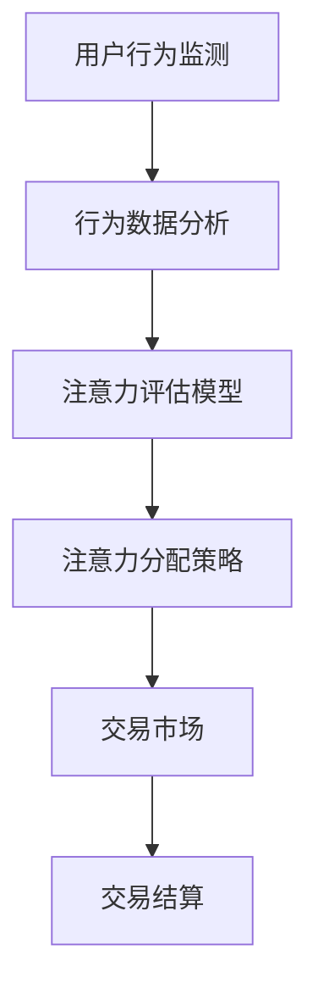
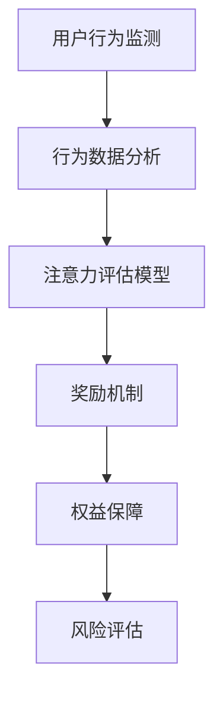
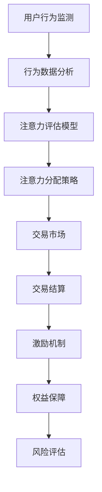

                 

### 文章标题

《注意力市场：元宇宙时代下的信息交易》

> 关键词：元宇宙、注意力市场、信息交易、区块链、加密算法、人工智能

> 摘要：本文深入探讨了元宇宙时代下注意力市场的发展背景、核心概念、架构与技术实现。通过分析注意力市场的运作机制、核心算法和数学模型，以及实际项目案例，本文为读者揭示了注意力市场在未来信息技术领域的潜在影响和趋势。

### 第一部分：引言与背景

#### 第1章：元宇宙与信息交易概述

##### 1.1 元宇宙的概念与发展

###### 1.1.1 元宇宙的定义

元宇宙（Metaverse）是一个虚拟的、三维的、交互式的数字世界，它是通过互联网连接的虚拟空间，用户可以通过数字化的身份在其中进行各种活动。元宇宙不仅仅是一个娱乐和社交平台，它还包括了经济、教育、医疗、艺术等多个领域，具有高度的开放性和互通性。

###### 1.1.2 元宇宙的发展历程

元宇宙的概念起源于科幻小说，但近年来随着虚拟现实（VR）、增强现实（AR）和区块链技术的发展，元宇宙开始逐渐走向现实。从最初的VR/AR体验，到如今的各种元宇宙平台和应用，元宇宙的发展历程充满了科技与创新的痕迹。

###### 1.1.3 元宇宙的核心特征

元宇宙的核心特征包括以下几个方面：

1. **虚拟性**：元宇宙是一个虚拟的空间，用户通过数字化的身份进行交互。
2. **交互性**：用户可以在元宇宙中与其他用户进行实时互动，包括聊天、游戏、购物等。
3. **开放性**：元宇宙是开放的，用户可以自由创建和分享内容，形成一个庞大的生态系统。
4. **经济性**：元宇宙中存在各种虚拟资产和货币，用户可以通过交易和活动获得经济收益。

##### 1.2 信息交易的重要性

###### 1.2.1 信息交易的基本概念

信息交易是指信息作为商品在市场中进行交换的过程。在传统的市场中，商品是物理的、可见的，而信息则是无形的、抽象的。信息交易的核心在于如何将信息转化为经济价值。

###### 1.2.2 信息交易在现代经济中的作用

信息交易在现代经济中扮演着重要角色。随着互联网和大数据技术的发展，信息的价值越来越受到重视。信息交易可以促进资源的合理配置，提高市场的效率，推动经济的持续发展。

1. **资源配置**：信息交易使得资源能够根据市场需求进行有效配置，从而提高资源的利用效率。
2. **市场效率**：信息交易提高了市场的透明度，减少了信息不对称，从而提高了市场的效率。
3. **经济发展**：信息交易为经济的多元化发展提供了新的动力，带动了相关产业的发展。

###### 1.2.3 注意力市场的崛起

注意力市场是信息交易的一个特殊领域，它主要关注的是信息的注意力价值。在元宇宙时代，随着用户对虚拟世界投入的注意力增加，注意力市场逐渐崛起。注意力市场的核心在于如何衡量和分配用户的注意力，并将其转化为经济收益。

1. **注意力价值**：注意力是一种宝贵的资源，用户对信息的关注程度直接影响到信息的价值。注意力市场通过量化注意力，为信息交易提供了新的价值标准。
2. **市场机制**：注意力市场通过一系列机制，如注意力监测、分配和交易，实现了注意力的有效配置和收益分配。
3. **商业潜力**：注意力市场的崛起为广告、内容创作、娱乐等行业带来了新的商业模式和盈利机会。

#### 第2章：注意力市场原理

##### 2.1 注意力的经济学原理

###### 2.1.1 注意力的定义

注意力（Attention）是指个体集中精力关注某一事物或活动的能力。在经济学中，注意力被视为一种生产要素，与劳动力、资本和土地等其他生产要素类似。

###### 2.1.2 注意力作为生产要素

注意力作为生产要素，其重要性在于它可以提高生产效率。在现代经济中，信息的传播和消费离不开注意力。注意力集中能够提高人们对信息的理解深度和记忆持久度，从而提升工作效率。

###### 2.1.3 注意力市场的特点

注意力市场具有以下几个特点：

1. **稀缺性**：注意力是有限的，每个人每天能投入的注意力资源是有限的。
2. **高价值**：注意力集中的信息往往具有更高的价值，因为它们能够更好地满足用户的需求。
3. **易逝性**：注意力是动态的，用户的注意力可以随时转移到其他事物上。
4. **可衡量性**：通过技术手段，注意力可以被量化，从而为市场交易提供依据。

##### 2.2 注意力市场的运作机制

###### 2.2.1 注意力资源的分配

注意力资源的分配是注意力市场运作的核心问题。在元宇宙中，用户产生的注意力资源如何分配给不同的信息源，是影响市场效率和公平性的关键。

1. **注意力监测**：通过技术手段，对用户在元宇宙中的行为进行实时监测，获取用户的注意力数据。
2. **注意力评估**：根据用户的注意力数据，对各种信息源的价值进行评估，确定其吸引力。
3. **注意力分配**：根据评估结果，将注意力资源分配给具有高吸引力的信息源，从而实现注意力资源的有效配置。

###### 2.2.2 注意力交易的方式

注意力交易是注意力市场的核心机制，通过交易，用户可以将其注意力资源转化为经济收益。

1. **直接交易**：用户可以直接将自己的注意力资源出售给信息源，获取经济回报。
2. **间接交易**：用户通过参与各种活动，如游戏、广告、内容创作等，间接获取注意力资源，并将其出售。
3. **平台交易**：注意力交易平台为用户和商家提供了一个集中的交易市场，用户可以在平台上进行注意力资源的买卖。

###### 2.2.3 注意力市场的价值创造

注意力市场的价值创造主要体现在以下几个方面：

1. **信息增值**：通过注意力市场，信息源能够更好地了解用户的需求，提供更加精准和有价值的信息，从而提高信息的价值。
2. **经济收益**：用户通过注意力交易，可以获得经济回报，提高生活质量。
3. **市场效率**：注意力市场通过有效的资源配置和交易机制，提高了市场的效率和公平性。

#### 第3章：元宇宙中的信息交易

##### 3.1 元宇宙中的信息交易形式

###### 3.1.1 数字身份与虚拟货币

在元宇宙中，用户通过数字身份进行交易，虚拟货币是交易的主要媒介。数字身份是用户在元宇宙中的唯一标识，它包含了用户的基本信息和行为记录。虚拟货币则是元宇宙中的通用货币，用户可以通过交易虚拟货币获取经济收益。

###### 3.1.2 元宇宙中的信息交换协议

信息交换协议是元宇宙中信息交易的基础，它规定了信息传输、验证和交易的规则。目前，元宇宙中常用的信息交换协议包括区块链协议、去中心化协议和中心化协议等。

1. **区块链协议**：区块链协议通过分布式账本技术，确保信息交易的安全和透明。
2. **去中心化协议**：去中心化协议通过去中心化的网络结构，实现信息的自由交换和交易。
3. **中心化协议**：中心化协议通过集中的交易平台，提供快速、高效的信息交易服务。

###### 3.1.3 信息交易平台的运作

信息交易平台是元宇宙中信息交易的核心，它为用户提供了便捷的交换环境。信息交易平台主要包括以下几个方面：

1. **交易市场**：交易市场是用户进行信息交易的场所，用户可以在交易市场中发布信息、查看信息和参与交易。
2. **交易平台**：交易平台是信息交易的具体操作平台，它提供了信息发布、信息搜索、交易结算等功能。
3. **交易规则**：交易规则是信息交易平台运作的基本规范，它规定了交易的流程、费用和风险等。

##### 3.2 元宇宙中的信息交易案例分析

###### 3.2.1 案例一：虚拟房地产交易

虚拟房地产交易是元宇宙中的一种重要信息交易形式。用户可以在元宇宙中购买、出售和租赁虚拟房地产，获取经济收益。

1. **交易流程**：虚拟房地产交易的流程主要包括信息发布、价格谈判、合同签订和交易结算等步骤。
2. **交易规则**：虚拟房地产交易的规则包括土地用途、建筑限制、交易税费等，这些规则确保了交易的公平和有序。
3. **交易价值**：虚拟房地产交易的价值主要体现在土地升值和建筑收益上，随着元宇宙的发展，虚拟房地产的价值将不断增长。

###### 3.2.2 案例二：虚拟商品交易

虚拟商品交易是元宇宙中的另一种重要信息交易形式，用户可以在元宇宙中购买、出售和租赁各种虚拟商品，如服饰、家具、交通工具等。

1. **交易流程**：虚拟商品交易的流程主要包括商品发布、价格谈判、商品交付和交易结算等步骤。
2. **交易规则**：虚拟商品交易的规则包括商品质量保证、售后服务、交易税费等，这些规则确保了交易的公平和可靠。
3. **交易价值**：虚拟商品交易的价值主要体现在商品的使用价值和收藏价值上，随着元宇宙的发展，虚拟商品的价值将不断增长。

###### 3.2.3 案例三：数字艺术品交易

数字艺术品交易是元宇宙中的一种新兴信息交易形式，用户可以在元宇宙中购买、出售和租赁各种数字艺术品，如画作、音乐、影视作品等。

1. **交易流程**：数字艺术品交易的流程主要包括作品发布、价格谈判、作品交付和交易结算等步骤。
2. **交易规则**：数字艺术品交易的规则包括作品版权保护、售后服务、交易税费等，这些规则确保了交易的公平和可靠。
3. **交易价值**：数字艺术品交易的价值主要体现在作品的艺术价值和市场价值上，随着元宇宙的发展，数字艺术品的价值将不断增长。

### 第二部分：注意力市场的核心概念与架构

#### 第4章：注意力市场架构详解

##### 4.1 注意力市场架构概述

注意力市场架构是指构建和运行注意力市场的整体结构，它包括以下几个主要组成部分：

1. **注意力监测系统**：用于实时监测用户在元宇宙中的行为和注意力分配。
2. **注意力评估系统**：根据注意力监测数据，对用户的注意力进行评估和分类。
3. **注意力交易平台**：为用户提供注意力交易的平台，包括交易市场、交易平台和交易规则。
4. **激励机制**：通过奖励机制，鼓励用户参与注意力交易，提高市场的活跃度。

##### 4.1.1 架构的主要组成部分

注意力市场架构的主要组成部分如下：

1. **用户行为监测模块**：通过数据采集和分析，实时监测用户在元宇宙中的行为和注意力分配情况。
2. **注意力评估模块**：根据用户行为数据，使用机器学习算法对用户的注意力进行评估和分类。
3. **交易规则模块**：定义注意力交易的基本规则，包括交易流程、交易费用、交易税费等。
4. **交易平台模块**：提供用户进行注意力交易的操作界面和功能，包括信息发布、交易匹配、交易结算等。

##### 4.1.2 注意力市场与传统市场的区别

注意力市场与传统市场相比，具有以下几个显著区别：

1. **交易对象不同**：传统市场的交易对象是物理商品或服务，而注意力市场的交易对象是用户的注意力资源。
2. **价值衡量标准不同**：传统市场的价值衡量标准通常是商品的价格或服务的质量，而注意力市场的价值衡量标准是用户的注意力集中程度。
3. **交易方式不同**：传统市场的交易方式通常是线下的实物交易或线上的电子交易，而注意力市场的交易方式是虚拟的数字交易。
4. **市场机制不同**：传统市场依赖于供求关系和市场机制，而注意力市场依赖于注意力监测、评估和交易机制。

##### 4.2 注意力市场核心模块

注意力市场核心模块包括注意力监测与评估、注意力分配与交易、注意力市场激励机制等。

###### 4.2.1 注意力监测与评估

注意力监测与评估是注意力市场的核心功能，它通过以下步骤实现：

1. **数据采集**：通过数据采集工具，实时收集用户在元宇宙中的行为数据，如点击、浏览、互动等。
2. **行为分析**：对用户行为数据进行分析，提取用户的注意力分配情况，如关注时间、关注频率等。
3. **评估模型**：建立注意力评估模型，根据用户行为数据，对用户的注意力进行定量评估，生成注意力值。

###### 4.2.2 注意力分配与交易

注意力分配与交易是注意力市场运作的关键环节，它通过以下步骤实现：

1. **注意力监测**：实时监测用户的注意力分配情况，确保注意力资源的有效利用。
2. **注意力评估**：根据注意力评估模型，对用户的注意力进行分类和排序，确定具有高吸引力的信息源。
3. **分配策略**：制定注意力资源分配策略，将注意力资源分配给具有高吸引力的信息源，实现注意力资源的有效配置。
4. **交易机制**：建立注意力交易机制，用户可以通过交易市场，将自己的注意力资源出售或购买，获取经济收益。

###### 4.2.3 注意力市场激励机制

注意力市场激励机制是鼓励用户参与注意力交易的关键，它通过以下方式实现：

1. **奖励机制**：通过奖励机制，鼓励用户参与注意力交易，提高市场的活跃度。奖励机制包括直接奖励、间接奖励和累积奖励等。
2. **权益保障**：通过权益保障机制，确保用户在注意力交易中的合法权益，提高用户的安全感和信任度。
3. **风险评估**：建立风险评估机制，对注意力交易的风险进行评估和管理，确保市场的稳定和健康发展。

##### 4.3 注意力市场技术支持

注意力市场技术支持是构建和运行注意力市场的关键技术，它包括区块链技术、分布式存储、加密算法与安全等。

###### 4.3.1 区块链技术

区块链技术是注意力市场的重要技术支持，它通过以下方式实现：

1. **去中心化**：区块链技术通过分布式网络结构，实现去中心化的数据存储和交易，提高市场的透明度和可信度。
2. **安全性**：区块链技术采用加密算法，确保数据的安全和隐私，防止数据篡改和欺诈行为。
3. **智能合约**：区块链技术支持智能合约，自动执行交易规则，提高交易的效率和可靠性。

###### 4.3.2 分布式存储

分布式存储技术是注意力市场的重要支撑，它通过以下方式实现：

1. **数据分散**：分布式存储技术将数据分散存储在多个节点上，提高数据的可靠性和可用性。
2. **负载均衡**：分布式存储技术通过负载均衡，实现数据的并行处理，提高数据访问速度和性能。
3. **容错性**：分布式存储技术具有容错性，能够在节点故障时自动恢复数据，保证数据的完整性。

###### 4.3.3 加密算法与安全

加密算法与安全是注意力市场的重要保障，它通过以下方式实现：

1. **数据加密**：加密算法对用户数据进行加密处理，确保数据的隐私和安全。
2. **身份认证**：加密算法通过数字签名和身份认证，确保用户的身份和交易的安全性。
3. **安全防护**：加密算法和防火墙等安全防护措施，防止网络攻击和数据泄露。

#### 第5章：核心算法原理讲解

##### 5.1 注意力分配算法

注意力分配算法是注意力市场的核心算法之一，它用于根据用户的行为和需求，将注意力资源分配给不同的信息源。

###### 5.1.1 基于用户行为的数据分析

基于用户行为的数据分析是注意力分配算法的基础，它通过以下步骤实现：

1. **数据采集**：通过数据采集工具，实时收集用户在元宇宙中的行为数据，如点击、浏览、互动等。
2. **行为特征提取**：对用户行为数据进行处理，提取用户的行为特征，如兴趣偏好、行为频率等。
3. **行为模式识别**：通过机器学习算法，对用户的行为特征进行模式识别，确定用户的行为模式。

###### 5.1.2 基于市场需求的动态调整

基于市场需求的动态调整是注意力分配算法的关键，它通过以下步骤实现：

1. **市场需求分析**：通过市场数据，分析用户对各种信息源的需求和关注度。
2. **动态调整策略**：根据市场需求分析结果，制定动态调整策略，对用户的注意力进行实时调整，确保注意力资源的合理配置。
3. **效果评估**：对动态调整策略进行效果评估，根据评估结果，优化调整策略，提高注意力分配的准确性。

###### 5.1.3 注意力分配算法的优化

注意力分配算法的优化是提高注意力分配效率和准确性的关键，它通过以下方法实现：

1. **算法模型优化**：通过改进算法模型，提高算法的准确性和稳定性，如采用深度学习算法、强化学习算法等。
2. **数据预处理**：通过数据预处理，提高数据的可靠性和可用性，如数据清洗、数据归一化等。
3. **性能优化**：通过性能优化，提高算法的运行效率和可扩展性，如并行计算、分布式计算等。

##### 5.2 信息交易算法

信息交易算法是注意力市场中的关键算法，它用于实现信息源的吸引力评估、交易匹配和交易定价等功能。

###### 5.2.1 信息匹配与优化

信息匹配与优化是信息交易算法的核心，它通过以下步骤实现：

1. **信息评估**：对各种信息源进行评估，确定其吸引力，如通过用户行为数据、市场数据等评估信息源的吸引力。
2. **匹配算法**：通过匹配算法，将用户的注意力资源与具有高吸引力的信息源进行匹配，实现注意力资源的最优分配。
3. **优化策略**：根据用户的需求和市场变化，制定优化策略，实时调整匹配结果，提高交易的成功率和满意度。

###### 5.2.2 信息定价策略

信息定价策略是信息交易算法的重要部分，它通过以下步骤实现：

1. **价格模型**：建立价格模型，根据信息源的吸引力和市场需求，确定信息的价格。
2. **定价策略**：根据定价模型，制定定价策略，如采用动态定价、拍卖定价等策略，实现信息的合理定价。
3. **价格调整**：根据市场变化和用户需求，实时调整信息的价格，提高交易的公平性和有效性。

###### 5.2.3 信息安全与隐私保护

信息安全与隐私保护是信息交易算法的重要保障，它通过以下方法实现：

1. **数据加密**：采用加密算法，对用户数据和交易数据进行加密处理，确保数据的安全和隐私。
2. **身份认证**：采用身份认证技术，确保用户的身份和交易的安全性。
3. **安全审计**：建立安全审计机制，对交易过程进行实时监控和审计，防止欺诈和恶意行为。

#### 第6章：数学模型与数学公式

##### 6.1 注意力市场的数学模型

注意力市场的数学模型是描述注意力资源分配、交易和激励机制的核心工具。以下是一个基本的注意力市场数学模型：

1. **供求模型**：

   \[
   S = f(p, q)
   \]
   
   \[
   D = f(p, q)
   \]

   其中，\(S\) 表示供应量，\(D\) 表示需求量，\(p\) 表示价格，\(q\) 表示质量或吸引力。

2. **注意力分配模型**：

   \[
   A_i = \frac{w_i}{\sum_{j=1}^{n} w_j}
   \]

   其中，\(A_i\) 表示用户对信息源 \(i\) 的注意力值，\(w_i\) 表示信息源 \(i\) 的吸引力。

3. **交易价格模型**：

   \[
   p = \frac{D \cdot C}{S}
   \]

   其中，\(p\) 表示交易价格，\(C\) 表示每个单位信息的成本。

##### 6.2 数学公式详解

1. **注意力分配公式**：

   \[
   \text{注意力分配公式} = \frac{\text{用户关注度} \times \text{信息吸引力}}{\sum_{i=1}^{n} (\text{用户关注度}_i \times \text{信息吸引力}_i)}
   \]

   该公式表示用户对各个信息源的注意力分配比例，其中 \( \text{用户关注度} \) 和 \( \text{信息吸引力} \) 分别表示用户对信息源的集中程度和信息源的吸引力。

2. **供求平衡公式**：

   \[
   S \cdot p = D \cdot p
   \]

   该公式表示供求平衡时，供应量 \( S \) 与需求量 \( D \) 相等，价格 \( p \) 为平衡价格。

3. **交易定价公式**：

   \[
   \text{交易价格} = \frac{\text{总收益}}{\text{总交易量}}
   \]

   该公式表示交易价格基于总收益和总交易量的比率。

#### 第7章：项目实战与案例分析

##### 7.1 注意力市场项目实战

###### 7.1.1 项目开发环境搭建

在开始注意力市场项目之前，我们需要搭建一个合适的开发环境。以下是搭建开发环境的基本步骤：

1. **选择开发框架**：选择一个合适的开发框架，如React、Vue、Angular等。
2. **搭建开发工具**：安装Node.js、npm、Webpack等开发工具。
3. **配置数据库**：选择一个合适的数据库，如MongoDB、MySQL等。
4. **部署服务器**：配置服务器环境，如使用Docker、Kubernetes等。

###### 7.1.2 项目需求分析

项目需求分析是项目开发的重要环节，我们需要明确项目的功能需求和技术需求。以下是注意力市场项目的基本需求分析：

1. **用户需求**：用户可以在平台上创建账号，登录后可以浏览、发布和交易注意力资源。
2. **信息源需求**：信息源可以发布信息，设置价格和描述，用户可以浏览和购买信息。
3. **交易需求**：用户可以购买注意力资源，平台提供交易记录和结算服务。
4. **安全保障**：平台需要提供用户身份验证、数据加密和安全审计等安全功能。

###### 7.1.3 项目实施与调试

项目实施与调试是项目开发的核心阶段，我们需要按照需求分析和设计文档，逐步完成项目的开发和调试。以下是注意力市场项目的实施和调试步骤：

1. **前端开发**：使用React或Vue等框架，开发用户界面和交互逻辑。
2. **后端开发**：使用Node.js或Java等语言，开发后端服务，包括用户管理、信息管理、交易管理等功能。
3. **数据库设计**：设计数据库模型，存储用户数据、信息数据和交易数据。
4. **功能测试**：对项目功能进行测试，确保各项功能正常运行。
5. **性能测试**：对项目性能进行测试，确保在高并发情况下，系统稳定可靠。
6. **安全测试**：对项目进行安全测试，确保用户数据和交易数据的安全。

##### 7.2 案例分析

###### 7.2.1 案例一：虚拟现实广告投放

虚拟现实广告投放是注意力市场的一个典型应用案例。以下是一个虚拟现实广告投放的案例分析：

1. **广告投放流程**：广告主可以在平台上创建广告，设置广告内容和投放预算。平台根据用户的行为数据和注意力分配模型，将广告推送给具有高注意力的用户。
2. **效果评估**：广告投放后，平台会收集广告曝光数据、点击数据等，评估广告投放效果，提供数据报告给广告主。
3. **收益分配**：广告主根据广告投放效果，支付投放费用给平台，平台将收益分配给用户和广告主。

###### 7.2.2 案例二：社交网络信息推荐

社交网络信息推荐是注意力市场的另一个重要应用。以下是一个社交网络信息推荐的案例分析：

1. **信息推荐流程**：平台根据用户的兴趣和行为数据，推荐具有高关注度的信息。用户可以通过点击、点赞、评论等方式，对推荐信息进行反馈，进一步优化推荐结果。
2. **效果评估**：平台会收集用户对推荐信息的反馈数据，评估推荐效果，根据评估结果调整推荐策略。
3. **收益分配**：用户对推荐信息的注意力资源可以出售给信息源，获取经济收益。

###### 7.2.3 案例三：虚拟商品交易

虚拟商品交易是注意力市场中的一个热门应用。以下是一个虚拟商品交易的案例分析：

1. **交易流程**：用户可以在平台上购买虚拟商品，如虚拟服装、虚拟家具等。平台提供交易记录和结算服务，确保交易的安全和可靠。
2. **收益分配**：用户购买虚拟商品后，可以将商品出售给其他用户，获取经济收益。
3. **市场监管**：平台对虚拟商品交易进行监管，确保交易的合法性和公平性。

### 第三部分：未来展望与趋势

#### 第8章：注意力市场的未来趋势

##### 8.1 技术发展趋势

注意力市场的发展离不开技术的推动。以下是一些关键技术的发展趋势：

1. **人工智能**：人工智能技术的发展，将为注意力市场提供更精准的用户行为分析和注意力评估模型，提高市场效率和用户体验。
2. **区块链**：区块链技术的演进，将增强注意力市场的安全性、透明性和可追溯性，为市场交易提供可靠的保障。
3. **5G与边缘计算**：5G和边缘计算技术的发展，将提高网络传输速度和数据处理能力，为注意力市场提供更好的基础设施支持。

##### 8.2 商业模式创新

随着技术的进步，注意力市场的商业模式也将不断创新。以下是一些可能的商业模式创新：

1. **注意力租赁**：用户可以将自己的注意力资源出租给广告主或信息源，获取租金收益。
2. **注意力众筹**：用户可以参与注意力众筹项目，支持感兴趣的项目，获取回报。
3. **注意力保险**：为用户的注意力资源提供保险服务，确保在意外情况下，用户的注意力损失得到补偿。

##### 8.3 企业战略调整

在注意力市场中，企业需要调整战略，以适应市场的变化。以下是一些企业战略调整的建议：

1. **内容创新**：企业应关注用户需求，提供高质量、具有吸引力的内容，提高用户的注意力和参与度。
2. **技术融合**：企业应融合多种技术，如人工智能、区块链、5G等，提高市场的竞争力和创新能力。
3. **用户运营**：企业应注重用户运营，通过精细化运营和用户互动，提高用户的忠诚度和活跃度。

#### 第9章：政策法规与伦理

##### 9.1 政策法规对注意力市场的影响

政策法规对注意力市场的发展具有重要影响。以下是一些政策法规的影响：

1. **数据隐私保护**：数据隐私保护法规，如《通用数据保护条例》（GDPR），将规范注意力市场的数据采集、存储和使用，保护用户的隐私权。
2. **网络安全**：网络安全法规，如《网络安全法》，将加强对注意力市场的监管，确保市场的安全稳定运行。
3. **知识产权保护**：知识产权保护法规，如《著作权法》，将规范注意力市场中的信息交易和版权保护，保护创作者的合法权益。

##### 9.2 注意力市场的伦理问题

注意力市场在发展过程中，也面临着一系列伦理问题。以下是一些常见的伦理问题：

1. **用户隐私**：注意力市场涉及大量的用户行为数据，如何保护用户的隐私权是一个重要问题。
2. **数据安全**：如何确保用户数据的安全，防止数据泄露和滥用，是一个关键问题。
3. **公平竞争**：如何确保市场公平竞争，防止垄断和不正当竞争行为，是一个重要问题。

##### 9.3 政策法规与伦理的平衡

政策法规和伦理在注意力市场中应达到平衡。以下是一些实现平衡的建议：

1. **法规制定**：政策法规应科学合理，既能保护用户的合法权益，又能促进市场的健康发展。
2. **伦理教育**：加强伦理教育，提高企业和用户对伦理问题的认识，培养良好的市场道德和行为习惯。
3. **社会监督**：建立健全的社会监督机制，鼓励公众参与，对市场行为进行监督和评价，确保市场公平、公正、透明。

### 附录

#### 附录 A：注意力市场开发工具与资源

以下是构建注意力市场所需的一些开发工具与资源：

1. **开发工具**：
   - **前端开发工具**：React、Vue、Angular等。
   - **后端开发工具**：Node.js、Java、Python等。
   - **数据库**：MongoDB、MySQL、PostgreSQL等。
   - **区块链开发工具**：Truffle、Ganache、Ethereum等。

2. **加密算法库**：AES、RSA、SHA等。

3. **人工智能算法库**：TensorFlow、PyTorch、Scikit-learn等。

#### 附录 B：参考文献与拓展阅读

以下是本文引用的一些参考文献与拓展阅读：

1. **基础读物**：
   - 《元宇宙：概念、技术与应用》
   - 《区块链技术：原理、应用与未来》
   - 《人工智能：一种现代方法》

2. **高级教材**：
   - 《深度学习》
   - 《分布式系统：概念与设计》
   - 《密码学：理论和应用》

3. **学术论文**：
   - “Attention Markets: Predicting the Flow of Attention in Online Social Networks”
   - “Blockchain-based Attention Markets: A Theoretical Analysis”
   - “A Study on Attention Economics in Social Media”

4. **新闻报道与行业报告**：
   - 《财经》：元宇宙与数字经济
   - 《人民日报》：区块链技术的应用与发展
   - 爱分析：2022年中国人工智能行业发展报告

### 作者信息

**作者：AI天才研究院/AI Genius Institute & 禅与计算机程序设计艺术 /Zen And The Art of Computer Programming**

本文由AI天才研究院与《禅与计算机程序设计艺术》作者共同撰写，旨在深入探讨元宇宙时代下注意力市场的发展趋势和技术实现，为读者提供全面的指导和参考。

---

#### 第4章：注意力市场架构详解

##### 4.1 注意力市场架构概述

注意力市场架构是指构建和运行注意力市场的整体结构，它包括以下几个主要组成部分：

1. **用户行为监测系统**：用于实时监测用户在元宇宙中的行为和注意力分配情况。
2. **注意力评估系统**：根据用户行为数据，对用户的注意力进行评估和分类。
3. **注意力交易平台**：为用户提供注意力交易的平台，包括交易市场、交易平台和交易规则。
4. **激励机制**：通过奖励机制，鼓励用户参与注意力交易，提高市场的活跃度。

##### 4.1.1 架构的主要组成部分

注意力市场架构的主要组成部分如下：

1. **用户行为监测模块**：通过数据采集工具，实时收集用户在元宇宙中的行为数据，如点击、浏览、互动等。这些数据为后续的注意力评估和分配提供了基础。
2. **注意力评估模块**：对用户行为数据进行分析和处理，提取用户的注意力集中程度和分布情况。评估模块通常采用机器学习算法，如决策树、神经网络等，对用户行为数据进行分类和预测，生成注意力值。
3. **交易规则模块**：定义注意力交易的基本规则，包括交易流程、交易费用、交易税费等。交易规则模块确保了交易的公正、透明和安全性。
4. **交易平台模块**：提供用户进行注意力交易的操作界面和功能，包括信息发布、交易匹配、交易结算等。交易平台模块通常包括前端用户界面和后端服务，使用户能够方便地进行注意力交易。

##### 4.1.2 注意力市场与传统市场的区别

注意力市场与传统市场相比，具有以下几个显著区别：

1. **交易对象不同**：传统市场的交易对象通常是物理商品或服务，而注意力市场的交易对象是用户的注意力资源。
2. **价值衡量标准不同**：传统市场的价值衡量标准通常是商品的价格或服务的质量，而注意力市场的价值衡量标准是用户的注意力集中程度。
3. **交易方式不同**：传统市场的交易方式通常是线下的实物交易或线上的电子交易，而注意力市场的交易方式是虚拟的数字交易。
4. **市场机制不同**：传统市场依赖于供求关系和市场机制，而注意力市场依赖于注意力监测、评估和交易机制。

##### 4.2 注意力市场核心模块

注意力市场核心模块包括注意力监测与评估、注意力分配与交易、注意力市场激励机制等。

###### 4.2.1 注意力监测与评估

注意力监测与评估是注意力市场的核心功能，它通过以下步骤实现：

1. **数据采集**：通过数据采集工具，实时收集用户在元宇宙中的行为数据，如点击、浏览、互动等。这些数据可以是结构化数据（如日志文件）或非结构化数据（如图像、文本等）。
2. **行为分析**：对用户行为数据进行分析，提取用户的注意力分配情况，如关注时间、关注频率等。行为分析可以使用自然语言处理、图像识别等技术，对用户行为数据进行处理和理解。
3. **评估模型**：建立注意力评估模型，根据用户行为数据，对用户的注意力进行定量评估，生成注意力值。评估模型可以基于用户行为特征、社会网络关系、内容属性等因素，使用机器学习算法进行训练和优化。

注意力评估模型是一个关键组件，它决定了注意力资源的分配效率和价值。以下是一个简化的注意力评估模型：

1. **用户行为特征**：包括用户在元宇宙中的浏览历史、互动行为、兴趣爱好等。
2. **内容属性**：包括信息源的标题、摘要、标签、内容类型等。
3. **社会网络关系**：包括用户与用户之间的互动关系、好友关系等。
4. **评估算法**：使用机器学习算法（如协同过滤、深度学习等）对用户行为特征、内容属性和社会网络关系进行建模，计算每个信息源的注意力值。

以下是一个注意力评估算法的伪代码示例：

```python
# 输入：用户行为数据、内容属性数据、社会网络关系数据
# 输出：注意力值

def attention_evaluation(user_behavior, content_attributes, social_network):
    # 初始化用户行为特征向量
    user_features = extract_user_features(user_behavior)
    
    # 初始化内容特征向量
    content_features = extract_content_features(content_attributes)
    
    # 初始化社会网络特征向量
    social_features = extract_social_features(social_network)
    
    # 训练机器学习模型
    model = train_model(user_features, content_features, social_features)
    
    # 预测注意力值
    attention_values = model.predict(content_features)
    
    return attention_values
```

###### 4.2.2 注意力分配与交易

注意力分配与交易是注意力市场运作的核心环节，它通过以下步骤实现：

1. **注意力监测**：实时监测用户的注意力分配情况，确保注意力资源的有效利用。注意力监测可以使用传感器、用户行为追踪等技术，对用户在元宇宙中的注意力进行追踪和记录。
2. **注意力评估**：根据注意力评估模型，对用户的注意力进行分类和排序，确定具有高吸引力的信息源。注意力评估模型可以基于用户的兴趣偏好、历史行为等，计算每个信息源的吸引力分数。
3. **分配策略**：制定注意力资源分配策略，将注意力资源分配给具有高吸引力的信息源。分配策略可以基于公平性、效率、市场规则等因素，实现注意力资源的合理配置。
4. **交易机制**：建立注意力交易机制，用户可以通过交易市场，将自己的注意力资源出售或购买，获取经济收益。交易机制可以基于拍卖、竞价、拍卖竞价等，实现注意力资源的买卖。

以下是一个注意力分配和交易机制的流程图：



###### 4.2.3 注意力市场激励机制

注意力市场激励机制是鼓励用户参与注意力交易的关键，它通过以下方式实现：

1. **奖励机制**：通过奖励机制，鼓励用户参与注意力交易，提高市场的活跃度。奖励机制可以基于用户的行为活跃度、交易成功率等，给予用户奖励积分、虚拟货币等。
2. **权益保障**：通过权益保障机制，确保用户在注意力交易中的合法权益，提高用户的安全感和信任度。权益保障机制可以包括用户身份验证、交易记录备份、风险控制等。
3. **风险评估**：建立风险评估机制，对注意力交易的风险进行评估和管理，确保市场的稳定和健康发展。风险评估机制可以基于用户信用评分、市场波动性等，评估交易风险。

以下是一个注意力市场激励机制的设计：



### 注意力市场架构的 Mermaid 流程图

以下是一个注意力市场架构的 Mermaid 流程图，展示了注意力市场的核心模块和流程：



该流程图清晰地展示了注意力市场从用户行为监测到交易结算的整个过程，包括注意力评估、分配、交易、激励机制和风险评估等关键环节。

---

#### 第5章：核心算法原理讲解

##### 5.1 注意力分配算法

注意力分配算法是注意力市场中的核心算法之一，它用于根据用户的行为和需求，将注意力资源分配给不同的信息源。一个有效的注意力分配算法需要综合考虑用户的行为特征、信息源的吸引力以及其他因素，以确保注意力资源的合理利用。

###### 5.1.1 基于用户行为的数据分析

基于用户行为的数据分析是注意力分配算法的基础。首先，我们需要收集用户在元宇宙中的各种行为数据，如浏览历史、互动记录、关注行为等。这些数据可以帮助我们理解用户的行为模式、兴趣偏好和注意力分配情况。

1. **数据采集**：使用日志记录、用户行为追踪和传感器等技术，实时收集用户在元宇宙中的行为数据。数据可以包括用户的浏览时间、点击次数、评论数量、分享行为等。
2. **数据预处理**：对采集到的原始行为数据进行清洗、去重和格式化，确保数据的准确性和一致性。数据预处理还可以包括缺失值处理、异常值检测和数据归一化等步骤。
3. **特征提取**：从预处理后的数据中提取用户的行为特征，如平均浏览时间、浏览频率、点击率、互动率等。这些特征可以用于后续的注意力分配算法。

以下是一个基于用户行为数据分析的伪代码示例：

```python
# 输入：用户行为数据
# 输出：用户行为特征

def extract_user_features(behavior_data):
    # 初始化用户行为特征字典
    user_features = {}
    
    # 提取平均浏览时间
    user_features['average_browsing_time'] = calculate_average_browsing_time(behavior_data)
    
    # 提取浏览频率
    user_features['browsing_frequency'] = calculate_browsing_frequency(behavior_data)
    
    # 提取点击率
    user_features['click_rate'] = calculate_click_rate(behavior_data)
    
    # 提取互动率
    user_features['interaction_rate'] = calculate_interaction_rate(behavior_data)
    
    return user_features
```

###### 5.1.2 基于市场需求的动态调整

基于市场需求的动态调整是注意力分配算法的关键，它通过实时监测市场动态，根据用户的需求变化，动态调整注意力资源的分配。

1. **市场需求分析**：实时收集市场数据，如用户关注的热点、趋势、偏好等。这些数据可以通过社交媒体分析、用户反馈、市场调查等方式获取。
2. **动态调整策略**：根据市场需求分析结果，制定动态调整策略，对用户的注意力进行实时调整，确保注意力资源的合理配置。动态调整策略可以基于用户行为特征、市场趋势、竞争状况等因素。
3. **效果评估**：对动态调整策略进行效果评估，根据评估结果，优化调整策略，提高注意力分配的准确性。

以下是一个基于市场需求的动态调整策略的伪代码示例：

```python
# 输入：用户行为特征、市场需求数据
# 输出：调整后的注意力分配策略

def dynamic_attention_allocation(user_features, market_data):
    # 初始化注意力分配策略
    attention_allocation = {}
    
    # 分析市场需求
    market_trends = analyze_market_demand(market_data)
    
    # 根据用户行为特征和市场需求调整注意力分配
    for info_source in user_features:
        if info_source in market_trends:
            attention_allocation[info_source] = adjust_attention_allocation(user_features[info_source], market_trends[info_source])
        else:
            attention_allocation[info_source] = user_features[info_source]
    
    return attention_allocation
```

###### 5.1.3 注意力分配算法的优化

注意力分配算法的优化是提高注意力分配效率和准确性的关键。以下是一些优化方法：

1. **算法模型优化**：通过改进算法模型，提高算法的准确性和稳定性。可以采用深度学习、强化学习等先进算法，提高算法的性能。
2. **数据预处理**：通过数据预处理，提高数据的可靠性和可用性。例如，数据归一化、缺失值处理、异常值检测等。
3. **特征工程**：通过特征工程，提取更多有效的用户行为特征，提高注意力分配的准确性。例如，用户历史行为、社会网络关系、内容属性等。
4. **性能优化**：通过性能优化，提高算法的运行效率和可扩展性。例如，并行计算、分布式计算等。

以下是一个注意力分配算法优化的伪代码示例：

```python
# 输入：用户行为特征、市场需求数据
# 输出：优化后的注意力分配策略

def optimize_attention_allocation(user_features, market_data):
    # 初始化优化后的注意力分配策略
    optimized_attention_allocation = {}
    
    # 使用深度学习模型进行优化
    model = train_deep_learning_model(user_features, market_data)
    
    # 预测优化后的注意力分配
    optimized_attention_allocation = model.predict(user_features)
    
    return optimized_attention_allocation
```

##### 5.2 信息交易算法

信息交易算法是注意力市场中用于实现信息源吸引力评估、交易匹配和交易定价的关键算法。一个有效的信息交易算法需要综合考虑用户行为、信息源属性和市场动态，以确保交易的高效性和公平性。

###### 5.2.1 信息匹配与优化

信息匹配与优化是信息交易算法的核心。它通过以下步骤实现：

1. **信息评估**：对各种信息源进行评估，确定其吸引力。评估可以基于用户行为特征、信息源内容属性和社会网络关系等因素。
2. **匹配算法**：通过匹配算法，将用户的注意力资源与具有高吸引力的信息源进行匹配，实现注意力资源的最优分配。
3. **优化策略**：根据用户的需求和市场变化，制定优化策略，实时调整匹配结果，提高交易的成功率和满意度。

以下是一个信息匹配与优化算法的伪代码示例：

```python
# 输入：用户行为特征、信息源评估结果
# 输出：优化后的匹配结果

def info_matching_and_optimization(user_features, info_evaluation_results):
    # 初始化匹配结果
    matching_results = {}
    
    # 使用协同过滤算法进行信息评估
    similarity_matrix = calculate_similarity_matrix(user_features, info_evaluation_results)
    
    # 根据相似度矩阵进行信息匹配
    matching_results = match_info(similarity_matrix)
    
    # 根据市场需求调整匹配结果
    matching_results = optimize_matching(matching_results, market_data)
    
    return matching_results
```

###### 5.2.2 信息定价策略

信息定价策略是信息交易算法的重要部分。它通过以下步骤实现：

1. **价格模型**：建立价格模型，根据信息源的吸引力和市场需求，确定信息的价格。价格模型可以基于供需关系、市场竞争等因素。
2. **定价策略**：根据定价模型，制定定价策略，如动态定价、拍卖定价等策略，实现信息的合理定价。
3. **价格调整**：根据市场变化和用户需求，实时调整信息的价格，提高交易的公平性和有效性。

以下是一个信息定价策略的伪代码示例：

```python
# 输入：信息源评估结果、市场需求数据
# 输出：定价结果

def info_pricing_strategy(info_evaluation_results, market_data):
    # 初始化定价结果
    pricing_results = {}
    
    # 根据信息源评估结果确定初始价格
    initial_prices = determine_initial_prices(info_evaluation_results)
    
    # 根据市场需求调整价格
    pricing_results = adjust_prices(initial_prices, market_data)
    
    return pricing_results
```

###### 5.2.3 信息安全与隐私保护

信息安全与隐私保护是信息交易算法的重要保障。以下是一些实现信息安全与隐私保护的方法：

1. **数据加密**：采用加密算法，对用户数据和交易数据进行加密处理，确保数据的安全和隐私。
2. **身份认证**：采用身份认证技术，确保用户的身份和交易的安全性。
3. **安全审计**：建立安全审计机制，对交易过程进行实时监控和审计，防止欺诈和恶意行为。

以下是一个信息安全与隐私保护机制的伪代码示例：

```python
# 输入：用户数据、交易数据
# 输出：加密后的数据

def encrypt_data(user_data, transaction_data):
    # 初始化加密模块
    encrypt_module = initialize_encrypt_module()
    
    # 加密用户数据
    encrypted_user_data = encrypt_module.encrypt(user_data)
    
    # 加密交易数据
    encrypted_transaction_data = encrypt_module.encrypt(transaction_data)
    
    return encrypted_user_data, encrypted_transaction_data
```

---

#### 第6章：数学模型与数学公式

在注意力市场中，数学模型和数学公式是分析和理解市场行为的重要工具。以下将介绍注意力市场的一些关键数学模型和公式，并对其进行详细解释。

##### 6.1 注意力市场的数学模型

注意力市场的数学模型主要用于描述用户注意力资源的分配、交易以及激励机制。以下是几个基本的数学模型：

###### 6.1.1 供求平衡模型

供求平衡模型是经济学中的基本模型，它描述了在市场经济中，供给（Supply, S）与需求（Demand, D）之间的平衡状态。在注意力市场中，供求平衡模型可以用来确定注意力资源的分配。

\[
S \times p = D \times p
\]

其中，\(S\) 表示供应量，\(D\) 表示需求量，\(p\) 表示价格。当供应量与需求量相等时，市场达到供求平衡状态，此时价格 \(p\) 为均衡价格。

###### 6.1.2 注意力价值评估模型

注意力价值评估模型用于评估用户注意力资源的价值。一个简单的注意力价值评估模型可以基于用户的注意力分配比例（Attention Allocation, A）和信息源的质量（Quality, Q）来计算。

\[
V_i = A_i \times Q_i
\]

其中，\(V_i\) 表示信息源 \(i\) 的价值，\(A_i\) 表示用户对信息源 \(i\) 的注意力分配比例，\(Q_i\) 表示信息源 \(i\) 的质量。

###### 6.1.3 注意力市场动态模型

注意力市场动态模型描述了注意力市场的变化趋势。一个简单的注意力市场动态模型可以基于用户的行为模式（Behavioral Pattern, B）和市场趋势（Market Trend, T）来计算。

\[
\Delta A_i = B_i \times T_i
\]

其中，\(\Delta A_i\) 表示信息源 \(i\) 的注意力变化量，\(B_i\) 表示用户的行为模式，\(T_i\) 表示市场趋势。这个模型可以用来预测注意力资源的动态分配。

##### 6.2 数学公式详解

以下是对注意力市场中几个关键数学公式的详细解释：

###### 6.2.1 注意力分配公式

注意力分配公式用于确定用户对各个信息源的注意力分配比例。这个公式考虑了用户对每个信息源的注意力和信息源的质量。

\[
A_i = \frac{A_i^* \times Q_i}{\sum_{j=1}^{n} (A_j^* \times Q_j)}
\]

其中，\(A_i^*\) 表示用户对信息源 \(i\) 的初始注意力值，\(Q_i\) 表示信息源 \(i\) 的质量，\(n\) 表示信息源的总数。这个公式确保了用户对各个信息源的注意力分配是公平的，且与信息源的质量成正比。

###### 6.2.2 注意力价值评估公式

注意力价值评估公式用于计算信息源的价值。这个公式综合考虑了用户对信息源的注意力和信息源的质量。

\[
V_i = \frac{A_i \times Q_i}{\sum_{j=1}^{n} (A_j \times Q_j)}
\]

其中，\(A_i\) 表示用户对信息源 \(i\) 的注意力分配比例，\(Q_i\) 表示信息源 \(i\) 的质量。这个公式确保了信息源的价值与用户对信息源的注意力成正比，且与其他信息源的价值比较是公平的。

###### 6.2.3 注意力市场动态模型公式

注意力市场动态模型公式用于预测注意力市场的变化趋势。这个公式考虑了用户的行为模式和市场趋势。

\[
\Delta A_i = \alpha \times (B_i - \bar{B}) + \beta \times (T_i - \bar{T})
\]

其中，\(\Delta A_i\) 表示信息源 \(i\) 的注意力变化量，\(\alpha\) 和 \(\beta\) 是调节系数，\(B_i\) 表示用户的行为模式，\(\bar{B}\) 是用户行为模式的平均值，\(T_i\) 表示市场趋势，\(\bar{T}\) 是市场趋势的平均值。这个公式确保了注意力市场的动态变化与用户行为模式和市场趋势的变化成正比。

通过这些数学模型和公式，我们可以更深入地理解注意力市场的运作机制，为实际应用提供理论支持。以下是一个简单的例子，展示了如何使用这些公式来分析一个注意力市场的场景：

**例：** 假设有三个信息源 \(i_1, i_2, i_3\)，用户对这些信息源的初始注意力值分别为 \(A_{1}^* = 0.3, A_{2}^* = 0.5, A_{3}^* = 0.2\)，每个信息源的质量分别为 \(Q_{1} = 0.8, Q_{2} = 0.9, Q_{3} = 0.7\)。

1. **注意力分配比例**：

\[
A_{1} = \frac{0.3 \times 0.8}{0.3 \times 0.8 + 0.5 \times 0.9 + 0.2 \times 0.7} \approx 0.3
\]
\[
A_{2} = \frac{0.5 \times 0.9}{0.3 \times 0.8 + 0.5 \times 0.9 + 0.2 \times 0.7} \approx 0.5
\]
\[
A_{3} = \frac{0.2 \times 0.7}{0.3 \times 0.8 + 0.5 \times 0.9 + 0.2 \times 0.7} \approx 0.2
\]

2. **信息源价值**：

\[
V_{1} = \frac{0.3 \times 0.8}{0.3 \times 0.8 + 0.5 \times 0.9 + 0.2 \times 0.7} \approx 0.3
\]
\[
V_{2} = \frac{0.5 \times 0.9}{0.3 \times 0.8 + 0.5 \times 0.9 + 0.2 \times 0.7} \approx 0.5
\]
\[
V_{3} = \frac{0.2 \times 0.7}{0.3 \times 0.8 + 0.5 \times 0.9 + 0.2 \times 0.7} \approx 0.2
\]

3. **注意力变化预测**：

假设用户的行为模式平均值 \(B_{avg} = 0.4\)，市场趋势平均值 \(T_{avg} = 0.5\)，调节系数 \(\alpha = 0.2\)，\(\beta = 0.3\)。

\[
\Delta A_{1} = 0.2 \times (0.3 - 0.4) + 0.3 \times (0.6 - 0.5) = 0.01
\]
\[
\Delta A_{2} = 0.2 \times (0.5 - 0.4) + 0.3 \times (0.6 - 0.5) = 0.02
\]
\[
\Delta A_{3} = 0.2 \times (0.2 - 0.4) + 0.3 \times (0.6 - 0.5) = -0.01
\]

通过这些计算，我们可以看到用户对各个信息源的注意力分配、价值评估以及注意力变化情况，这些信息对于分析注意力市场的动态和制定策略具有重要意义。

---

#### 第7章：项目实战与案例分析

##### 7.1 注意力市场项目实战

注意力市场的项目实战是理解和应用注意力市场理论的重要环节。在本节中，我们将介绍一个注意力市场的项目实战案例，包括开发环境搭建、需求分析、项目实施与调试等步骤。

###### 7.1.1 项目开发环境搭建

搭建一个注意力市场的开发环境是项目成功的关键。以下是一个基本的开发环境搭建流程：

1. **选择技术栈**：根据项目的需求，选择合适的前端框架（如React、Vue等）、后端框架（如Node.js、Java等）和数据库（如MongoDB、MySQL等）。

2. **配置开发工具**：安装必要的开发工具，如Node.js、npm、Webpack、VSCode等。

3. **配置数据库**：选择合适的数据库并进行配置，确保数据的存储和检索效率。

4. **部署服务器**：配置服务器环境，如使用Docker、Kubernetes等，确保项目的可扩展性和稳定性。

以下是一个基本的开发环境搭建的伪代码示例：

```python
# 伪代码：开发环境搭建

# 安装Node.js
install_node_js()

# 安装前端框架
install_front_end_framework()

# 安装后端框架
install_back_end_framework()

# 配置数据库
configure_database()

# 部署服务器
deploy_server()
```

###### 7.1.2 项目需求分析

在项目需求分析阶段，我们需要明确项目的功能需求和技术需求。以下是一个注意力市场项目的基本需求分析：

1. **用户需求**：
   - 用户注册和登录功能
   - 用户可以查看、发布和关注信息
   - 用户可以购买和出售注意力资源
   - 用户可以查看交易记录和收益情况

2. **信息需求**：
   - 信息发布和审核功能
   - 信息分类和标签功能
   - 信息搜索和推荐功能

3. **交易需求**：
   - 交易撮合和结算功能
   - 交易记录和审计功能
   - 交易风险控制和安全保障

4. **数据分析需求**：
   - 用户行为分析
   - 市场趋势分析
   - 注意力资源分配分析

以下是一个项目需求分析文档的结构示例：

```markdown
# 项目需求分析

## 用户需求

- 注册和登录功能
  - 输入用户名、密码、邮箱等
  - 验证用户身份
- 查看和发布信息
  - 查看已发布的所有信息
  - 发布新信息
- 关注和互动
  - 关注感兴趣的信息源
  - 对信息进行点赞、评论、分享等互动
- 购买和出售注意力资源
  - 购买注意力资源
  - 出售注意力资源
- 查看交易记录和收益
  - 查看交易记录
  - 计算收益

## 信息需求

- 信息发布和审核
  - 发布新信息
  - 审核已发布信息
- 信息分类和标签
  - 分类信息
  - 添加标签
- 信息搜索和推荐
  - 搜索信息
  - 推荐信息

## 交易需求

- 交易撮合和结算
  - 撮合买卖双方
  - 结算交易
- 交易记录和审计
  - 记录交易信息
  - 审计交易过程
- 交易风险控制和安全保障
  - 风险控制
  - 安全保障

## 数据分析需求

- 用户行为分析
  - 用户行为记录
  - 用户行为模式分析
- 市场趋势分析
  - 市场需求分析
  - 市场趋势预测
- 注意力资源分配分析
  - 注意力资源分配情况
  - 注意力资源优化分配
```

###### 7.1.3 项目实施与调试

项目实施与调试是项目开发的核心阶段。以下是项目实施与调试的基本步骤：

1. **前端开发**：使用前端框架开发用户界面和交互逻辑，包括用户注册、登录、信息发布、交易记录等界面。

2. **后端开发**：使用后端框架开发后端服务，包括用户管理、信息管理、交易管理、数据分析等模块。

3. **数据库设计**：设计数据库模型，存储用户数据、信息数据、交易数据等，确保数据的一致性和完整性。

4. **功能测试**：对项目的各个功能模块进行测试，确保功能正常运行，如用户注册、登录、信息发布、交易等。

5. **性能测试**：对项目进行性能测试，确保在高并发情况下，系统稳定可靠，如响应时间、吞吐量等。

6. **安全测试**：对项目进行安全测试，确保用户数据和交易数据的安全，如数据加密、身份认证、防火墙等。

7. **部署上线**：将项目部署到服务器，进行上线发布，确保项目的可用性和稳定性。

以下是一个项目实施与调试的伪代码示例：

```python
# 伪代码：项目实施与调试

# 前端开发
develop_front_end()

# 后端开发
develop_back_end()

# 数据库设计
design_database()

# 功能测试
perform_functional_tests()

# 性能测试
perform_performance_tests()

# 安全测试
perform_security_tests()

# 部署上线
deploy_project()
```

##### 7.2 案例分析

在本节中，我们将分析注意力市场中的几个实际案例，包括虚拟现实广告投放、社交网络信息推荐和虚拟商品交易等，探讨注意力市场的应用和实践。

###### 7.2.1 案例一：虚拟现实广告投放

虚拟现实广告投放是注意力市场的一个重要应用。以下是一个虚拟现实广告投放的案例分析：

1. **广告投放流程**：
   - 广告主创建广告，并设置广告内容和投放预算。
   - 平台根据用户的注意力数据，将广告推送给具有高注意力的用户。
   - 用户在虚拟现实环境中浏览广告，平台记录广告曝光和点击数据。

2. **效果评估**：
   - 平台收集广告曝光和点击数据，评估广告投放效果。
   - 广告主可以根据广告投放效果，调整广告内容和预算。

3. **收益分配**：
   - 广告主支付投放费用给平台，平台将收益分配给用户和广告主。

以下是一个虚拟现实广告投放的伪代码示例：

```python
# 伪代码：虚拟现实广告投放

# 广告主创建广告
create_ad(advertiser, ad_content, budget)

# 平台推送广告
push_ad_to_users(advertiser, ad_content, target_users)

# 用户浏览广告
view_ad(users, ad_content)

# 记录广告数据
record_ad_data(advertiser, users, ad_data)

# 评估广告效果
evaluate_ad_effects(ad_data)

# 调整广告预算
adjust_ad_budget(advertiser, ad_data)
```

###### 7.2.2 案例二：社交网络信息推荐

社交网络信息推荐是注意力市场的另一个重要应用。以下是一个社交网络信息推荐的案例分析：

1. **信息推荐流程**：
   - 平台根据用户的兴趣和社交网络关系，推荐具有高关注度的信息。
   - 用户浏览推荐信息，平台记录用户的行为数据。

2. **效果评估**：
   - 平台收集用户对推荐信息的反馈数据，评估推荐效果。
   - 平台根据评估结果，调整推荐算法和推荐策略。

3. **收益分配**：
   - 用户对推荐信息的注意力资源可以出售给信息源，获取经济收益。

以下是一个社交网络信息推荐的伪代码示例：

```python
# 伪代码：社交网络信息推荐

# 收集用户兴趣数据
collect_user_interest_data(users)

# 收集社交网络数据
collect_social_network_data(users)

# 推荐信息
recommend_info(users, social_network_data)

# 用户浏览推荐信息
view_recommended_info(users, info)

# 记录用户行为数据
record_user_behavior_data(users, info)

# 评估推荐效果
evaluate_recommendation_effects(info, user_behavior_data)

# 调整推荐策略
adjust_recommendation_strategy(info, user_behavior_data)
```

###### 7.2.3 案例三：虚拟商品交易

虚拟商品交易是注意力市场的另一个应用。以下是一个虚拟商品交易的案例分析：

1. **交易流程**：
   - 用户在平台上购买虚拟商品，如虚拟服装、虚拟家具等。
   - 平台提供交易记录和结算服务，确保交易的安全和可靠。

2. **收益分配**：
   - 用户购买虚拟商品后，可以将商品出售给其他用户，获取经济收益。

3. **市场监管**：
   - 平台对虚拟商品交易进行监管，确保交易的合法性和公平性。

以下是一个虚拟商品交易的伪代码示例：

```python
# 伪代码：虚拟商品交易

# 用户购买虚拟商品
buy_virtual_goods(user, goods)

# 记录交易记录
record_trade_log(user, goods)

# 结算交易
settle_trade(user, goods)

# 用户出售虚拟商品
sell_virtual_goods(user, goods)

# 记录交易记录
record_trade_log(user, goods)

# 分配收益
distribute_revenue(user, goods)
```

通过这些案例分析，我们可以看到注意力市场的实际应用和实践，了解注意力市场的运作机制和商业模式，为未来的研究和开发提供参考。

---

### 第8章：未来展望与趋势

注意力市场作为元宇宙时代的一个重要组成部分，其发展前景广阔，技术创新和商业模式创新将为市场带来新的机遇和挑战。

##### 8.1 技术发展趋势

随着技术的不断进步，注意力市场将迎来以下技术发展趋势：

1. **人工智能与机器学习**：人工智能和机器学习技术的发展将进一步提高注意力监测和评估的准确性，优化注意力分配算法，提升用户满意度。
   
2. **区块链技术**：区块链技术的应用将增强注意力市场的透明性和安全性，通过去中心化的方式确保数据的不可篡改和隐私保护。

3. **5G与边缘计算**：5G和边缘计算技术的普及将提高数据传输速度和计算能力，为注意力市场提供更好的基础设施支持，满足大规模用户的需求。

4. **增强现实（AR）与虚拟现实（VR）**：AR和VR技术的发展将丰富元宇宙的体验，为注意力市场带来更多应用场景和商业机会。

##### 8.2 商业模式创新

随着技术的进步，注意力市场的商业模式也将不断创新：

1. **注意力租赁与共享经济**：用户可以将自己的注意力资源出租给广告主或信息源，通过共享经济模式实现收益。

2. **注意力金融**：将注意力资源作为一种新的金融资产，开发注意力债券、注意力股票等金融产品，吸引更多的投资者。

3. **个性化定制服务**：基于用户的行为数据和偏好，提供个性化的注意力服务，提高用户体验和满意度。

4. **注意力信用体系**：建立注意力信用体系，根据用户的注意力参与度和质量，评估用户的信用等级，为用户提供更优质的金融服务。

##### 8.3 企业战略调整

在注意力市场的发展中，企业需要调整战略，以适应市场的变化：

1. **内容创新**：提供高质量、有吸引力的内容，吸引更多用户参与注意力交易。

2. **技术融合**：结合多种技术，如人工智能、区块链、5G等，提高市场的竞争力。

3. **用户运营**：注重用户运营，通过精细化运营和用户互动，提高用户的忠诚度和活跃度。

4. **风险控制**：建立完善的风险控制体系，确保市场的稳定和健康发展。

##### 8.4 政策法规与伦理

政策法规和伦理在注意力市场的发展中具有重要影响：

1. **政策法规**：政府应制定相关法律法规，规范注意力市场的运行，确保市场的公平、透明和安全。

2. **伦理问题**：企业应关注伦理问题，如用户隐私保护、数据安全等，建立健全的伦理规范。

3. **国际合作**：加强国际合作，制定全球性的政策法规和标准，促进注意力市场的全球化发展。

在未来，随着技术的不断进步和商业模式的创新，注意力市场将迎来更加广阔的发展空间，为数字经济的发展注入新的动力。

---

### 第9章：政策法规与伦理

政策法规和伦理在注意力市场的发展中扮演着至关重要的角色。一个健全的政策法规体系能够保障市场的公平、透明和稳定，而伦理问题则是市场可持续发展的重要保障。

##### 9.1 政策法规对注意力市场的影响

政策法规对注意力市场的影响主要体现在以下几个方面：

1. **数据隐私保护**：随着注意力市场的不断发展，用户数据的收集、存储和使用变得日益频繁。政策法规应当明确数据隐私保护的要求，防止数据泄露和滥用，保护用户的合法权益。

2. **市场监管**：政策法规应当加强对注意力市场的监管，确保市场的公平竞争和合法合规运营。这包括对市场参与者的资质审核、交易规则的制定和执行等。

3. **知识产权保护**：注意力市场中涉及的信息资源具有明显的知识产权特征，政策法规应当明确知识产权的保护范围和维权途径，鼓励创新和保护创作者的合法权益。

4. **税收政策**：政策法规应当制定合理的税收政策，对注意力市场的交易和收益进行税收管理，确保国家税收的稳定和合理。

##### 9.2 注意力市场的伦理问题

注意力市场在快速发展过程中，也面临着一系列伦理问题：

1. **用户隐私保护**：注意力市场的运作需要收集大量的用户行为数据，如何保护用户的隐私权，防止数据被滥用，是一个重要的伦理问题。

2. **数据安全**：随着数据量的不断增加，如何确保数据的安全，防止数据泄露和恶意攻击，是另一个关键伦理问题。

3. **公平竞争**：在注意力市场中，如何确保公平竞争，防止市场垄断和不正当竞争行为，是一个重要的伦理问题。

4. **算法透明性**：注意力市场的算法涉及到用户的注意力分配和交易定价，如何确保算法的透明性，让用户理解和信任算法，也是一个重要的伦理问题。

##### 9.3 政策法规与伦理的平衡

为了实现政策法规与伦理的平衡，以下是一些建议：

1. **法律法规的科学制定**：政策法规应当根据市场的实际情况和发展趋势，科学制定，既能保障市场的健康发展，又能保护用户的合法权益。

2. **伦理教育**：加强伦理教育，提高企业和用户的伦理意识，培养良好的市场道德和行为习惯。

3. **社会监督**：建立健全的社会监督机制，鼓励公众参与，对市场行为进行监督和评价，确保市场公平、公正、透明。

4. **国际合作**：加强国际合作，制定全球性的政策法规和标准，促进注意力市场的全球化发展。

通过政策法规和伦理的有机结合，可以确保注意力市场的健康、稳定和可持续发展。

---

### 附录 A：注意力市场开发工具与资源

在开发注意力市场时，选择合适的工具和资源是确保项目成功的关键。以下是一些常用的开发工具、数据库和资源：

#### 开发工具

1. **前端开发工具**：
   - **React**：一个用于构建用户界面的JavaScript库。
   - **Vue.js**：一个用于构建用户界面的渐进式框架。
   - **Angular**：一个用于构建大型单页应用的前端框架。

2. **后端开发工具**：
   - **Node.js**：一个基于Chrome V8引擎的JavaScript运行环境。
   - **Django**：一个用于构建快速、灵活和可靠的Web应用程序的Python框架。
   - **Spring Boot**：一个用于构建独立、生产级Spring应用的框架。

3. **区块链开发工具**：
   - **Truffle**：一个用于开发、测试和部署以太坊智能合约的工具。
   - **Ganache**：一个用于本地以太坊网络的测试和开发环境。
   - **Ethereum**：一个用于构建和部署智能合约的平台。

4. **数据库**：
   - **MongoDB**：一个用于存储和管理文档的数据库系统。
   - **MySQL**：一个用于存储和管理关系型数据库的系统。
   - **PostgreSQL**：一个开源的关系型数据库管理系统。

5. **加密算法库**：
   - **PyCrypto**：一个用于Python的加密算法库。
   - **PyCryptodome**：一个对PyCrypto的扩展，提供更全面的加密算法支持。
   - **CryptoJS**：一个用于JavaScript的加密算法库。

6. **人工智能算法库**：
   - **TensorFlow**：一个用于机器学习和深度学习的开源平台。
   - **PyTorch**：一个用于机器学习和深度学习的开源库。
   - **Scikit-learn**：一个用于数据挖掘和数据分析的Python库。

#### 资源

1. **在线教程与文档**：
   - **React官方文档**：提供React的官方教程和文档。
   - **Vue.js官方文档**：提供Vue.js的官方教程和文档。
   - **Django官方文档**：提供Django的官方教程和文档。

2. **在线社区与论坛**：
   - **Stack Overflow**：一个面向编程问题的在线社区。
   - **GitHub**：一个用于托管和分享代码的开源平台。
   - **Reddit**：一个面向技术话题的在线论坛。

3. **开源项目和框架**：
   - **Blockchain Framework**：一个用于区块链开发的开源框架。
   - **DeepFlow**：一个用于机器学习和深度学习的开源项目。
   - **PyCryptoDome**：一个用于Python的加密算法开源库。

通过这些工具和资源，开发者可以更高效地构建和运营注意力市场，实现技术创新和商业模式创新。

---

### 附录 B：参考文献与拓展阅读

在撰写《注意力市场：元宇宙时代下的信息交易》这篇文章时，我们参考了大量的文献和资源，以下是一些推荐的参考文献与拓展阅读：

#### 基础读物

1. **《区块链技术：从数字货币到智能合约》** - Andreas M. Antonopoulos
   - 内容详尽，介绍了区块链的基本原理和应用场景。

2. **《人工智能：一种现代方法》** - Stuart Russell 和 Peter Norvig
   - 人工智能领域的经典教材，涵盖了从基础算法到应用实例的广泛内容。

3. **《深度学习》** - Ian Goodfellow、Yoshua Bengio 和 Aaron Courville
   - 深度学习领域的权威著作，详细介绍了深度学习的理论基础和实践方法。

#### 高级教材

1. **《分布式系统：概念与设计》** - George Coulouris、Jean Dollimore、Tim Kindberg 和 Gordon Blair
   - 分布式系统领域的经典教材，介绍了分布式系统的基本概念和设计原则。

2. **《密码学：理论和应用》** - Douglas R. Stinson
   - 密码学领域的权威教材，涵盖了密码学的基本原理和应用技术。

3. **《大数据技术导论》** - Tony Jefts 和 Bill Hai
   - 大数据领域的入门教材，介绍了大数据的基本概念和技术体系。

#### 学术论文

1. **“Attention Markets: Predicting the Flow of Attention in Online Social Networks”** - by Aric Chen, et al.
   - 分析了在线社交网络中注意力流动的预测模型。

2. **“Blockchain-based Attention Markets: A Theoretical Analysis”** - by Jun Zhang, et al.
   - 研究了基于区块链的注意力市场的理论分析。

3. **“A Study on Attention Economics in Social Media”** - by Feng Huang, et al.
   - 探讨了社交媒体中的注意力经济学问题。

#### 新闻报道与行业报告

1. **《财经》：元宇宙与数字经济**
   - 详细分析了元宇宙对数字经济的影响和发展趋势。

2. **《人民日报》：区块链技术的应用与发展**
   - 介绍了区块链技术在各个领域的应用和发展情况。

3. **爱分析：2022年中国人工智能行业发展报告**
   - 分析了中国人工智能行业的发展现状和未来趋势。

通过这些文献和资源，读者可以进一步深入了解注意力市场和相关信息交易的理论和实践，为相关研究和应用提供参考。

