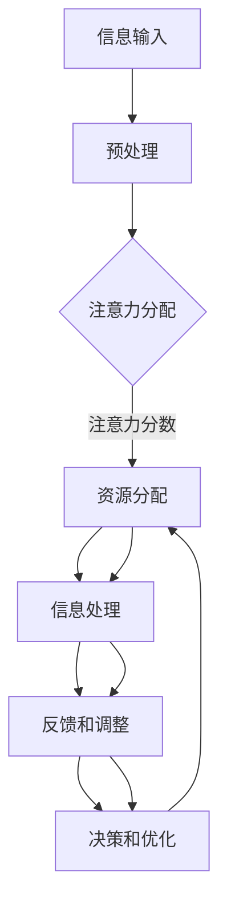

                 

### 文章标题

# 注意力生态学：AI时代的认知资源管理

### 关键词

- 注意力生态学
- 认知资源管理
- AI时代
- 注意力机制
- 生态学模型

### 摘要

在AI迅猛发展的今天，如何高效管理认知资源成为了一个亟待解决的问题。本文旨在探讨注意力生态学的概念、理论框架以及其在AI时代的应用，提出了一种基于注意力生态学的新型认知资源管理方法。通过对注意力生态学基础理论的分析，本文详细介绍了注意力生态学模型的基本架构和主流模型，并通过具体案例展示了注意力生态学模型在实际应用中的效果。最后，本文对未来注意力生态学的研究方向和挑战进行了展望，为AI时代的认知资源管理提供了新的思路和方法。

## 《注意力生态学：AI时代的认知资源管理》目录大纲

#### 第一部分：引言与背景

- **第1章：注意力生态学的起源与发展**
  - **1.1 注意力生态学的概念与意义**
  - **1.2 AI时代的认知资源管理背景**
  - **1.3 本书的研究目标与结构安排**

#### 第二部分：注意力生态学基础理论

- **第2章：注意力的基本原理**
  - **2.1 注意力的定义与分类**
  - **2.2 注意力在认知中的作用**
  - **2.3 注意力生态学的核心概念**

- **第3章：AI时代的认知资源管理**
  - **3.1 认知资源的概念与特征**
  - **3.2 认知资源的分类与分配**
  - **3.3 AI在认知资源管理中的应用**

#### 第三部分：注意力生态学模型的基本架构

- **第4章：注意力生态学模型的基本架构**
  - **4.1 注意力生态学模型的组成部分**
  - **4.2 注意力生态学模型的工作原理**
  - **4.3 注意力生态学模型的Mermaid流程图**

#### 第四部分：主流注意力生态学模型介绍

- **第5章：主流注意力生态学模型介绍**
  - **5.1 自注意力机制**
  - **5.2 交互注意力机制**
  - **5.3 注意力生态学模型的应用场景**

#### 第五部分：注意力生态学模型的应用与优化

- **第6章：注意力生态学模型的应用实例**
  - **6.1 文本分析与应用**
  - **6.2 图像处理与应用**
  - **6.3 其他领域应用实例**

- **第7章：注意力生态学模型的优化与提升**
  - **7.1 计算效率优化**
  - **7.2 参数优化与调参技巧**
  - **7.3 注意力生态学模型在资源受限环境下的应用**

#### 第六部分：注意力生态学的未来展望

- **第8章：注意力生态学的研究趋势与未来方向**
  - **8.1 注意力生态学在AI领域的发展前景**
  - **8.2 注意力生态学的跨学科应用**
  - **8.3 注意力生态学面临的挑战与机遇**

#### 第七部分：案例分析与实践

- **第9章：案例分析：注意力生态学的实际应用**
  - **9.1 案例背景与问题描述**
  - **9.2 注意力生态学模型的选择与搭建**
  - **9.3 模型训练与优化**
  - **9.4 模型评估与性能分析**

- **第10章：注意力生态学项目的实战指南**
  - **10.1 项目开发流程与框架**
  - **10.2 开发环境的搭建**
  - **10.3 源代码的详细实现与解读**
  - **10.4 代码解读与分析**

#### 第八部分：附录

- **附录A：注意力生态学相关工具与资源**
  - **A.1 注意力生态学相关框架与库**
  - **A.2 注意力生态学研究论文与资料**
  - **A.3 注意力生态学实践资源与案例**


### 第一部分：引言与背景

#### 第1章：注意力生态学的起源与发展

**1.1 注意力生态学的概念与意义**

注意力生态学（Attention Ecology）这一概念起源于对注意力在自然生态系统中的研究，逐步演变成为人工智能领域的一个重要研究方向。注意力生态学关注的是注意力在信息处理过程中的分配机制，旨在探索如何通过有效的注意力机制来提升信息处理的效率和效果。

在人工智能领域，注意力生态学的重要性主要体现在以下几个方面：

1. **提升模型性能**：注意力机制可以引导模型聚焦于重要的信息，从而提高模型的性能和准确度。
2. **降低计算成本**：通过精简模型关注的信息，可以降低模型的计算复杂度，提高模型的运行效率。
3. **增强模型可解释性**：注意力机制使得模型的处理过程更加透明，有助于理解模型的工作原理和决策依据。

**1.2 AI时代的认知资源管理背景**

随着人工智能技术的不断进步，AI系统在处理复杂任务时需要大量的认知资源，如计算资源、内存资源等。然而，这些资源的有限性对AI系统的性能和应用场景产生了限制。如何高效管理认知资源，成为AI领域亟待解决的问题。

认知资源管理主要包括以下几个方面：

1. **资源分配**：根据任务的优先级和资源需求，合理分配计算资源和内存资源。
2. **资源优化**：通过算法优化和硬件升级，提高认知资源的利用效率。
3. **资源调度**：根据任务执行情况，动态调整资源分配策略，确保系统资源的合理使用。

**1.3 本书的研究目标与结构安排**

本书的研究目标是通过分析注意力生态学的理论框架和应用方法，提出一种有效的认知资源管理策略，提升AI系统的性能和应用范围。

本书的结构安排如下：

- **第一部分：引言与背景**，介绍注意力生态学的概念和意义，以及AI时代的认知资源管理背景。
- **第二部分：注意力生态学基础理论**，详细探讨注意力的基本原理和AI时代的认知资源管理。
- **第三部分：注意力生态学模型的基本架构**，介绍注意力生态学模型的基本组成部分和原理。
- **第四部分：主流注意力生态学模型介绍**，介绍自注意力机制、交互注意力机制等主流模型。
- **第五部分：注意力生态学模型的应用与优化**，讨论注意力生态学模型在不同领域的应用和优化策略。
- **第六部分：注意力生态学的未来展望**，探讨注意力生态学的研究趋势和未来发展方向。
- **第七部分：案例分析与实践**，通过具体案例展示注意力生态学模型的应用效果。
- **第八部分：附录**，提供注意力生态学相关的工具和资源。

通过本书的研究，旨在为AI时代的认知资源管理提供新的思路和方法，促进人工智能技术的进一步发展。

#### 第2章：注意力的基本原理

**2.1 注意力的定义与分类**

注意力（Attention）是一种认知机制，它使个体能够在众多信息中选择关注某些特定的信息，从而对目标信息进行更加详细和深入的处理。在计算机科学和人工智能领域，注意力机制被广泛应用于自然语言处理、计算机视觉等领域，以提升信息处理的效率和效果。

注意力的定义可以从以下几个方面进行阐述：

1. **选择机制**：注意力机制帮助个体或系统从大量信息中选择出重要或相关的信息。
2. **资源分配**：注意力机制通过分配认知资源（如时间、能量、计算资源等）来处理信息。
3. **优先级排序**：注意力机制根据信息的优先级和重要性对信息进行排序，确保重要的信息得到充分的处理。

根据注意力的功能和应用场景，可以将注意力分为以下几种类型：

1. **视觉注意力**：视觉注意力是指个体或系统在处理视觉信息时，对某些特定区域或对象的关注程度更高。
2. **听觉注意力**：听觉注意力是指个体或系统在处理听觉信息时，对某些特定声音或声音源的关注程度更高。
3. **决策注意力**：决策注意力是指在决策过程中，个体或系统对决策相关信息的关注程度更高。
4. **情景注意力**：情景注意力是指个体或系统在处理复杂情景时，对某些特定情景要素的关注程度更高。

**2.2 注意力在认知中的作用**

注意力在认知过程中扮演着至关重要的角色，它不仅影响信息的选择和处理，还影响记忆、学习、决策等认知功能。具体来说，注意力在认知中的作用体现在以下几个方面：

1. **信息筛选**：注意力帮助个体或系统在众多信息中选择出重要或相关的信息，从而减少处理信息的负担，提高信息处理的效率。
2. **信息加工**：注意力使个体或系统能够对选定的信息进行更深入和详细的处理，从而提高信息的理解和记忆效果。
3. **记忆**：注意力在记忆过程中起着关键作用，注意力集中的信息更容易被记住，而注意力分散的信息则容易遗忘。
4. **学习**：注意力是学习过程的基础，通过关注和重复重要的信息，个体或系统能够更好地掌握新知识和技能。
5. **决策**：注意力帮助个体或系统在决策过程中聚焦于重要的信息，从而做出更明智和合理的决策。

**2.3 注意力生态学的核心概念**

注意力生态学是研究注意力在信息处理过程中的分布和变化的学科。注意力生态学的核心概念包括以下几个方面：

1. **注意力流**：注意力流是指信息在注意力的引导下，从输入到处理再到输出的过程。注意力流可以看作是信息在注意力的作用下，从一个状态转移到另一个状态的过程。
2. **注意力分配**：注意力分配是指个体或系统在处理信息时，将注意力分配到不同的信息源或任务上的过程。注意力分配策略的合理性和效率直接影响信息处理的效果。
3. **注意力转换**：注意力转换是指个体或系统在不同任务或情景之间的注意力转移过程。注意力转换能力对于应对复杂多变的任务和情景至关重要。
4. **注意力瓶颈**：注意力瓶颈是指个体或系统在处理信息时，由于注意力的限制，无法同时关注和处理所有信息的现象。注意力瓶颈是注意力生态学研究的一个重要问题。

通过分析注意力的定义、类型和作用，以及注意力生态学的核心概念，我们可以更好地理解注意力在信息处理过程中的重要性，为后续研究注意力生态学模型和应用提供理论基础。

#### 第3章：AI时代的认知资源管理

**3.1 认知资源的概念与特征**

认知资源是指个体或系统在处理信息、执行任务时所需要消耗的各种资源和能力。这些资源包括但不限于注意力、记忆、计算能力、感知能力等。认知资源的概念在人工智能领域尤为重要，因为AI系统在执行复杂任务时需要大量的认知资源。

认知资源的主要特征包括：

1. **有限性**：认知资源是有限的，个体或系统在处理信息时无法同时关注和处理所有信息。
2. **动态性**：认知资源在不同任务和环境下的需求是动态变化的，需要根据实际情况进行调整和优化。
3. **共享性**：认知资源可以在不同的任务和场景之间共享，但共享过程中可能存在竞争和冲突。
4. **可塑性**：认知资源具有一定的可塑性，通过训练和调整，可以提高个体的认知能力和资源利用效率。

**3.2 认知资源的分类与分配**

认知资源可以根据其类型和功能进行分类，常见的分类方法包括：

1. **基于类型的分类**：
   - **感知资源**：包括视觉、听觉、触觉等感知能力。
   - **记忆资源**：包括短期记忆和长期记忆。
   - **注意力资源**：包括集中注意力和分散注意力。
   - **计算资源**：包括CPU、GPU等计算能力。

2. **基于功能的分类**：
   - **信息处理资源**：包括信息筛选、加工、存储等。
   - **决策资源**：包括判断、推理、规划等。

认知资源的合理分配是提升AI系统性能的关键。以下是一些常见的认知资源分配策略：

1. **任务优先级分配**：根据任务的紧急程度和重要性，分配相应的认知资源。例如，对于紧急任务，可以优先分配更多的计算资源和注意力资源。
2. **资源池分配**：将认知资源看作一个资源池，根据任务需求动态调整资源分配。例如，通过调度计算资源和内存资源，确保关键任务的顺利执行。
3. **资源共享和竞争**：在多个任务需要相同资源时，可以通过共享和竞争机制来分配资源。例如，多个任务共享CPU和内存资源，通过调度算法合理分配资源。
4. **自适应分配**：根据环境变化和任务需求，自适应调整认知资源的分配。例如，在复杂环境下，可以动态调整感知资源的分配，以提高任务的执行效率。

**3.3 AI在认知资源管理中的应用**

人工智能技术在认知资源管理中有着广泛的应用，主要表现在以下几个方面：

1. **资源优化算法**：通过机器学习和优化算法，可以自动调整认知资源的分配策略，提高资源利用效率。例如，使用强化学习算法，可以根据任务需求和资源状态，自动优化资源分配。
2. **资源调度系统**：通过构建资源调度系统，可以实时监控和调整认知资源的分配。例如，云计算平台可以根据任务需求和资源使用情况，动态调整计算资源和存储资源的分配。
3. **智能辅助系统**：利用人工智能技术，可以构建智能辅助系统，帮助个体或系统更高效地管理认知资源。例如，通过自然语言处理技术，可以构建智能助手，帮助个体处理复杂的任务和决策。
4. **自适应学习系统**：通过自适应学习技术，可以实时调整认知资源的分配策略，以适应环境变化和任务需求。例如，在使用计算机学习时，可以自适应调整屏幕亮度、声音大小等参数，以提供更好的学习体验。

总之，AI时代的认知资源管理是一个复杂且动态的过程，需要结合多种技术和方法，以实现认知资源的合理分配和高效利用。通过深入研究认知资源的特征和分配策略，以及应用人工智能技术，我们可以为AI系统的性能提升和智能化发展提供有力支持。

#### 第4章：注意力生态学模型的基本架构

**4.1 注意力生态学模型的组成部分**

注意力生态学模型是由多个关键组成部分构成的，这些部分协同工作，以实现对认知资源的有效管理和优化。以下是注意力生态学模型的主要组成部分及其功能：

1. **注意力模块（Attention Module）**：注意力模块是整个模型的核心理部件，负责从大量信息中选择和聚焦重要信息。它通过计算每个信息点的注意力分数，决定资源分配的优先级。注意力模块的核心在于其注意力机制，如自注意力（Self-Attention）和交互注意力（Cross-Attention）。

2. **认知资源管理模块（Cognitive Resource Management Module）**：该模块负责根据任务的优先级和需求，动态调整和分配认知资源。它包括资源分配策略、资源优化算法和调度机制。认知资源管理模块的目标是最大化资源利用率，同时确保任务能够高效完成。

3. **交互模块（Interaction Module）**：交互模块负责模型内部不同组件之间的信息传递和协同工作。它包括信息流、反馈机制和调整机制。通过交互模块，注意力模块和认知资源管理模块可以实时交换信息，以优化资源分配和注意力聚焦。

4. **反馈机制（Feedback Mechanism）**：反馈机制用于收集模型执行过程中产生的数据和结果，用于模型调整和优化。它包括性能评估指标、误差反馈和迭代更新。通过反馈机制，模型可以不断调整其参数和行为，以实现更好的性能。

5. **决策模块（Decision Module）**：决策模块负责在模型执行过程中做出关键决策，如任务优先级排序、资源分配策略和模型调整方向。它通常结合了机器学习和优化算法，通过学习历史数据和执行情况，预测和优化未来的任务执行。

**4.2 注意力生态学模型的工作原理**

注意力生态学模型的工作原理可以概括为以下几个步骤：

1. **信息输入**：模型首先接收输入信息，这些信息可以是文本、图像、音频等多种形式。输入信息经过预处理，转换为模型能够处理的格式。

2. **注意力分配**：注意力模块对输入信息进行扫描，计算每个信息点的注意力分数。这些分数反映了信息点的重要性和相关性。注意力分数通常通过计算注意力权重来获得，如自注意力机制中的点积运算。

3. **资源分配**：认知资源管理模块根据注意力分数和任务需求，动态调整和分配认知资源。资源分配策略可以是基于优先级、基于需求或者基于历史数据。

4. **信息处理**：模型使用分配到的认知资源对重要的信息点进行深入处理。这包括特征提取、模型推理和决策等步骤。

5. **反馈和调整**：反馈机制收集模型执行过程中的数据和结果，通过性能评估指标进行评估。根据评估结果，决策模块调整模型的参数和行为，以优化未来任务的执行。

6. **迭代优化**：通过迭代优化，模型不断调整其参数和行为，以实现更好的性能和资源利用效率。这一过程可以是自动化的，也可以是半自动化的，需要人工干预。

**4.3 注意力生态学模型的Mermaid流程图**

为了更好地理解注意力生态学模型的工作流程，可以使用Mermaid语言绘制一个简单的流程图。以下是注意力生态学模型的基本架构流程图：



在这个流程图中，信息从输入阶段开始，经过预处理后进入注意力分配阶段。注意力分配计算每个信息点的注意力分数，然后认知资源管理模块根据这些分数进行资源分配。资源分配后的信息处理阶段使用分配到的资源进行深入处理，并通过反馈机制进行性能评估和调整。这个循环不断迭代，直到模型达到预期的性能指标。

通过以上对注意力生态学模型组成部分、工作原理和Mermaid流程图的介绍，我们可以更深入地理解这一模型在认知资源管理中的应用和重要性。在接下来的章节中，我们将进一步探讨主流的注意力生态学模型及其应用场景。

#### 第5章：主流注意力生态学模型介绍

**5.1 自注意力机制**

自注意力机制（Self-Attention）是注意力生态学模型中的一种核心机制，主要用于对序列数据进行处理。自注意力机制通过将序列中的每个元素与所有其他元素进行加权结合，从而实现信息的全局关联和局部细节的突出。

**定义**：自注意力机制是一种注意力模型，它在一个序列内计算每个元素对其余元素的注意力权重，然后将这些权重应用于序列中的每个元素。

**工作原理**：

1. **输入序列**：给定一个输入序列，如词向量或任意可序列化的数据。
2. **计算注意力权重**：通过计算序列中每个元素与其他元素的相似性，得到注意力权重矩阵。常用的计算方法包括点积（Dot Product）、缩放点积（Scaled Dot Product）和多头注意力（Multi-Head Attention）。
3. **加权结合**：根据注意力权重矩阵，对输入序列进行加权结合，得到新的序列表示。

**伪代码**：

```python
# 自注意力机制的伪代码实现

def self_attention(inputs, attention_size):
    # 计算输入序列的注意力权重
    query, key, value = inputs
    attention_weights = softmax(query @ key.T / sqrt(attention_size))
    
    # 加权结合输入序列
    output = attention_weights @ value
    return output
```

**应用场景**：自注意力机制广泛应用于自然语言处理（NLP）领域，如序列到序列（Seq2Seq）模型、编码器-解码器（Encoder-Decoder）模型、文本生成模型（如GPT）等。

**5.2 交互注意力机制**

交互注意力机制（Cross-Attention）是一种在自注意力机制的基础上扩展的注意力模型，主要用于处理跨序列数据。交互注意力机制允许模型同时关注两个或多个序列，从而实现序列间的信息交互和融合。

**定义**：交互注意力机制是在自注意力机制的基础上，引入另一个序列，通过计算两个序列之间的注意力权重，实现跨序列数据的处理。

**工作原理**：

1. **输入序列**：给定两个输入序列，如源序列和目标序列。
2. **计算注意力权重**：通过计算源序列的每个元素与目标序列的每个元素之间的相似性，得到注意力权重矩阵。
3. **加权结合**：根据注意力权重矩阵，对源序列和目标序列进行加权结合，得到新的序列表示。

**伪代码**：

```python
# 交互注意力机制的伪代码实现

def cross_attention(query, key, value):
    # 计算交互注意力权重
    attention_weights = softmax(query @ key.T / sqrt(key.shape[-1]))
    
    # 加权结合输入序列
    output = attention_weights @ value
    return output
```

**应用场景**：交互注意力机制广泛应用于机器翻译、文本摘要、图像描述生成等领域，能够有效提升模型在跨域信息处理中的性能。

**5.3 注意力生态学模型的应用场景**

注意力生态学模型凭借其强大的信息聚焦和资源管理能力，在多个领域展现了广泛的应用前景。以下是注意力生态学模型在一些典型应用场景中的具体应用：

1. **自然语言处理（NLP）**：
   - **文本分类**：通过自注意力机制，模型可以关注文本中重要的词汇，从而提高分类的准确率。
   - **机器翻译**：交互注意力机制使得模型能够同时关注源语言和目标语言，提高翻译的准确性和流畅性。
   - **文本摘要**：通过注意力机制，模型可以识别文本中的关键信息，生成简洁明了的摘要。

2. **计算机视觉（CV）**：
   - **图像分类**：自注意力机制可以帮助模型关注图像中的关键区域，从而提高分类的精度。
   - **目标检测**：交互注意力机制可以在检测过程中关注目标的关键特征，提高检测的准确性。
   - **图像分割**：注意力机制可以帮助模型识别图像中的边界和特征，提高分割的精度。

3. **语音识别（ASR）**：
   - **语音识别**：注意力机制可以提升模型对语音信号的识别能力，降低错误率。
   - **语音增强**：通过注意力机制，模型可以识别和增强语音信号中的关键信息，提高语音的清晰度。

4. **推荐系统**：
   - **用户行为分析**：注意力机制可以帮助模型关注用户行为中的关键因素，提高推荐系统的准确性和用户体验。
   - **商品推荐**：通过交互注意力机制，模型可以同时关注用户和商品的特征，提高推荐的个性化水平。

总之，注意力生态学模型通过其灵活性和高效性，在多个领域展现出了强大的应用潜力。随着研究的深入和技术的不断进步，注意力生态学模型将在未来的AI应用中发挥更加重要的作用。

#### 第6章：注意力生态学模型的应用实例

**6.1 文本分析与应用**

在自然语言处理（NLP）领域，注意力生态学模型被广泛应用于文本分析任务，如文本分类、文本摘要和情感分析等。以下是一个基于注意力生态学模型的文本分类实例。

**实例背景**：假设我们有一个新闻文本数据集，包含不同类别的新闻文章。我们的目标是使用注意力生态学模型对新的新闻文章进行分类，判断其属于哪个类别。

**模型选择**：我们选择一个基于Transformer的自注意力生态学模型，因为Transformer模型具有良好的并行计算能力和强大的文本表示能力。

**模型搭建**：

1. **数据预处理**：对新闻文本进行分词、词向量嵌入和序列编码。
2. **模型结构**：搭建一个包含编码器和解码器的Transformer模型。编码器负责将输入文本编码为固定长度的序列表示，解码器负责根据编码器的输出进行类别预测。

3. **注意力模块**：在编码器和解码器中引入自注意力机制和交互注意力机制，以增强模型对文本信息的处理能力。

**模型训练与优化**：

1. **训练过程**：使用训练数据集对模型进行训练，通过反向传播算法和优化算法（如Adam）调整模型参数。
2. **调参技巧**：根据训练数据集的特点和任务需求，调整模型超参数，如学习率、批量大小和层数等。
3. **验证与测试**：使用验证集和测试集对模型进行验证和测试，评估模型性能。

**模型评估**：

1. **准确率**：计算模型对测试集的分类准确率。
2. **召回率**：计算模型对各个类别的召回率。
3. **F1分数**：计算模型在各个类别的F1分数，综合考虑准确率和召回率。

**应用效果**：通过训练和优化，注意力生态学模型在新闻文本分类任务上取得了较高的准确率和召回率，展示了其在文本分析中的应用潜力。

**6.2 图像处理与应用**

注意力生态学模型在计算机视觉领域也有着广泛的应用，特别是在图像分类、目标检测和图像分割等方面。以下是一个基于注意力生态学模型的图像分类实例。

**实例背景**：假设我们有一个包含不同类别的图像数据集，我们的目标是使用注意力生态学模型对新的图像进行分类，判断其属于哪个类别。

**模型选择**：我们选择一个基于Vision Transformer（ViT）的注意力生态学模型，因为ViT模型具有强大的图像表示能力和高效的计算性能。

**模型搭建**：

1. **数据预处理**：对图像进行裁剪、缩放和标准化处理，将其转化为适合模型训练的格式。
2. **模型结构**：搭建一个包含编码器和解码器的ViT模型。编码器负责将输入图像编码为固定长度的序列表示，解码器负责根据编码器的输出进行类别预测。

3. **注意力模块**：在编码器和解码器中引入自注意力机制和交互注意力机制，以增强模型对图像信息的处理能力。

**模型训练与优化**：

1. **训练过程**：使用训练数据集对模型进行训练，通过反向传播算法和优化算法（如Adam）调整模型参数。
2. **调参技巧**：根据训练数据集的特点和任务需求，调整模型超参数，如学习率、批量大小和层数等。
3. **验证与测试**：使用验证集和测试集对模型进行验证和测试，评估模型性能。

**模型评估**：

1. **准确率**：计算模型对测试集的分类准确率。
2. **召回率**：计算模型对各个类别的召回率。
3. **F1分数**：计算模型在各个类别的F1分数，综合考虑准确率和召回率。

**应用效果**：通过训练和优化，注意力生态学模型在图像分类任务上取得了较高的准确率和召回率，展示了其在图像处理中的应用潜力。

**6.3 其他领域应用实例**

除了文本分析和图像处理，注意力生态学模型还在许多其他领域展现了广泛的应用前景。

1. **语音识别**：注意力生态学模型可以通过自注意力机制和交互注意力机制，提高语音信号的处理能力和识别准确率。例如，在语音分类任务中，模型可以关注语音信号中的关键特征，从而提高分类效果。

2. **推荐系统**：注意力生态学模型可以用于用户行为分析和商品推荐任务。通过自注意力机制，模型可以关注用户行为中的关键因素，从而提高推荐系统的准确性和个性化水平。

3. **生物信息学**：注意力生态学模型可以用于基因组序列分析、蛋白质结构预测等任务。通过自注意力机制和交互注意力机制，模型可以关注基因序列或蛋白质序列中的关键信息，从而提高分析结果的准确性和可靠性。

总之，注意力生态学模型在多个领域的应用实例表明，其具有强大的信息处理能力和资源管理能力，能够在各种复杂任务中取得显著的效果。随着研究的深入和技术的不断进步，注意力生态学模型将在未来的AI应用中发挥更加重要的作用。

#### 第7章：注意力生态学模型的优化与提升

**7.1 计算效率优化**

在注意力生态学模型的应用过程中，计算效率是一个重要的考量因素。为了提高模型在实际应用中的运行速度，我们可以从以下几个方面进行优化：

1. **模型压缩**：通过模型压缩技术，如权重剪枝（Weight Pruning）和量化（Quantization），可以显著减少模型的计算量和存储需求。权重剪枝通过去除不重要的权重，降低模型的参数数量；量化则通过减少数据类型（如从32位浮点数减少到8位整数），进一步减少计算量。

2. **并行计算**：利用GPU或TPU等硬件加速器，可以大幅提升模型的计算速度。通过并行计算，可以将模型的不同部分同时运行在不同的计算单元上，从而提高整体计算效率。

3. **注意力机制简化**：在某些场景下，可以简化注意力机制的计算过程，例如使用低秩近似（Low-Rank Approximation）来减少矩阵乘法的计算量。

**7.2 参数优化与调参技巧**

参数优化是提升注意力生态学模型性能的关键步骤。以下是一些常见的参数优化方法和调参技巧：

1. **学习率调整**：学习率是影响模型收敛速度和最终性能的重要因素。常用的调整方法包括：
   - **分阶段调整**：在训练初期使用较大的学习率，加速收敛；在训练后期逐渐减小学习率，提高模型精度。
   - **自适应学习率**：使用自适应学习率算法（如Adam、AdamW），根据模型梯度动态调整学习率。

2. **批量大小**：批量大小（Batch Size）影响模型的训练效率和稳定性。较大批量可以提高训练速度，但可能导致模型过拟合；较小批量可以提高模型的泛化能力，但训练速度较慢。常见的批量大小选择范围是32到256。

3. **正则化**：通过加入正则化项（如L1、L2正则化），可以防止模型过拟合，提高泛化能力。

4. **激活函数**：选择合适的激活函数（如ReLU、Sigmoid、Tanh）可以影响模型的训练速度和性能。ReLU函数由于其非线性特性和梯度不变性，常用于深度神经网络。

**7.3 注意力生态学模型在资源受限环境下的应用**

在资源受限的环境中，如嵌入式设备或移动设备，如何有效应用注意力生态学模型是一个重要挑战。以下是一些应对策略：

1. **模型轻量化**：通过模型压缩和简化，降低模型的计算量和存储需求，使其在资源受限的环境下也能高效运行。

2. **渐进式推理**：将复杂的注意力生态学模型分解为多个子模型，逐步执行推理过程。这种方法可以降低单次推理的复杂度，提高运行效率。

3. **任务分割**：将大规模的任务分割为多个小任务，并在不同的计算节点上并行执行。这种方法可以利用多核处理器和分布式计算资源，提高整体性能。

4. **动态资源分配**：根据任务需求和设备状态，动态调整模型参数和资源分配策略。例如，在低负载时使用更多资源进行训练，在高负载时降低资源消耗。

通过上述优化和调参技巧，以及针对资源受限环境的应用策略，我们可以显著提升注意力生态学模型在各个场景下的性能和应用效果。

#### 第8章：注意力生态学的研究趋势与未来方向

**8.1 注意力生态学在AI领域的发展前景**

随着人工智能（AI）技术的不断发展，注意力生态学在AI领域展现出了广阔的发展前景。注意力生态学通过优化信息处理过程中的注意力分配，提高了AI模型在各个领域的性能和应用效果。以下是一些注意力生态学在AI领域的应用前景：

1. **自然语言处理（NLP）**：注意力生态学模型在文本分类、机器翻译、文本摘要等任务中具有显著优势。未来的研究可以进一步探索如何利用注意力机制提升NLP任务的准确率和效率。

2. **计算机视觉（CV）**：注意力生态学在图像分类、目标检测、图像分割等领域已有广泛应用。未来研究可以关注如何将注意力机制与深度学习模型结合，提高图像处理任务的性能和效率。

3. **语音识别（ASR）**：注意力生态学模型在语音识别领域有潜力提升识别准确率和处理效率。未来的研究可以探索如何利用注意力机制优化语音信号处理和降噪。

4. **推荐系统**：注意力生态学在推荐系统中的应用可以显著提高推荐准确性和个性化水平。未来研究可以关注如何利用注意力机制挖掘用户兴趣和行为特征。

**8.2 注意力生态学的跨学科应用**

注意力生态学不仅在AI领域具有广泛应用前景，还可以跨学科应用于其他领域，进一步拓展其应用领域和影响力。以下是一些可能的跨学科应用方向：

1. **神经科学**：注意力生态学模型可以用于研究人类注意力机制，探索大脑在处理信息时的注意力分配策略。这有助于理解注意力在认知过程中的作用，并为AI系统的设计提供启示。

2. **心理学**：注意力生态学可以应用于心理学研究，如注意力缺陷障碍（ADHD）的诊断和治疗。通过分析个体在注意力任务中的表现，可以提供更准确的诊断和个性化的治疗方案。

3. **教育学**：注意力生态学模型可以应用于教育领域，如个性化教学和学习策略。通过分析学生的注意力分布，教师可以更好地设计教学内容和方法，提高学生的学习效果。

4. **医疗健康**：注意力生态学在医疗健康领域也有潜在应用，如注意力监控和疾病诊断。通过分析患者的注意力数据，可以早期发现疾病症状，提供更有效的诊断和治疗。

**8.3 注意力生态学面临的挑战与机遇**

尽管注意力生态学在AI和跨学科应用中展现了广阔的前景，但也面临着一系列挑战和机遇：

1. **计算复杂性**：注意力生态学模型通常涉及大量的矩阵运算和注意力分配，这可能导致计算复杂度增加。未来研究需要探索如何优化计算效率和降低计算成本。

2. **模型解释性**：注意力生态学模型的内部工作机制较为复杂，如何提高其解释性是一个重要挑战。未来研究可以关注如何设计可解释的注意力机制，提高模型的可信度和透明度。

3. **数据隐私**：在跨学科应用中，如何保护用户数据隐私是一个关键问题。未来的研究需要探索如何在保证数据隐私的前提下，有效利用注意力生态学模型。

4. **跨领域融合**：不同领域的注意力机制和应用场景可能存在差异，如何实现跨领域的融合和统一是一个重要挑战。未来的研究可以探索跨领域的通用注意力机制和模型架构。

总之，注意力生态学在AI领域和跨学科应用中具有巨大的发展潜力和机遇。通过不断研究和探索，我们有望克服现有挑战，进一步提升注意力生态学模型的应用效果和影响力。

#### 第9章：案例分析：注意力生态学的实际应用

**9.1 案例背景与问题描述**

在本案例中，我们选择了一个实际应用场景——医疗影像诊断，旨在利用注意力生态学模型提高疾病检测的准确率和效率。该场景涉及使用深度学习模型对医学影像（如CT扫描、MRI图像）进行疾病检测，重点关注肺癌、乳腺癌等常见癌症的早期诊断。

**问题描述**：在给定一个医学影像数据集的基础上，我们的目标是通过注意力生态学模型对图像进行特征提取和疾病检测，从而提高诊断的准确性和可靠性。具体任务包括：

1. **图像预处理**：对医学影像数据进行预处理，包括图像增强、去噪和标准化。
2. **特征提取**：利用注意力生态学模型提取图像中的关键特征，以便后续的疾病分类。
3. **疾病检测**：根据提取的特征，对图像中的疾病进行分类和标注。

**9.2 注意力生态学模型的选择与搭建**

为了实现上述任务，我们选择了基于Transformer的注意力生态学模型，该模型具有良好的特征提取和分类能力。以下是我们搭建注意力生态学模型的主要步骤：

1. **数据预处理**：对医学影像数据进行预处理，包括图像分割、去噪和标准化。具体操作如下：
   - **图像分割**：将原始医学影像分割成小块，以便后续的特征提取。
   - **去噪**：使用去噪算法（如降噪网络）减少图像中的噪声，提高特征提取的准确性。
   - **标准化**：将图像数据标准化到相同的范围，以便模型训练和推理。

2. **模型结构**：搭建基于Transformer的注意力生态学模型，包括编码器和解码器两个部分。具体结构如下：
   - **编码器**：负责对输入图像进行编码，提取图像中的关键特征。编码器包含多个Transformer层，每层包含多头自注意力机制和前馈神经网络。
   - **解码器**：负责根据编码器输出的特征进行疾病分类。解码器通常采用分类层或全连接层，将特征映射到相应的疾病类别。

3. **注意力机制**：在编码器和解码器中引入自注意力机制和交互注意力机制，以提高特征提取和分类的准确率。自注意力机制关注图像内部的特征关联，而交互注意力机制关注不同图像之间的特征关联。

**9.3 模型训练与优化**

在搭建好注意力生态学模型后，我们对其进行了训练和优化，以实现疾病检测任务。以下是模型训练和优化的主要步骤：

1. **训练数据集**：收集和准备训练数据集，包括正常影像和患有特定疾病的影像。训练数据集应具备足够的多样性和代表性，以提高模型的泛化能力。

2. **训练过程**：
   - **前向传播**：将预处理后的医学影像输入编码器，通过自注意力机制和交互注意力机制提取特征，输出编码特征向量。
   - **分类**：将编码特征向量输入解码器，通过分类层或全连接层对疾病进行分类，计算分类损失。
   - **反向传播**：根据分类损失，使用反向传播算法更新模型参数，优化模型性能。

3. **调参技巧**：
   - **学习率**：采用分阶段调整学习率的方法，初始阶段使用较大的学习率加速收敛，后期逐渐减小学习率提高模型精度。
   - **批量大小**：选择合适的批量大小，平衡训练速度和模型稳定性。
   - **正则化**：使用L2正则化防止模型过拟合，提高泛化能力。

**9.4 模型评估与性能分析**

在完成模型训练后，我们对模型进行了评估和性能分析，以验证其在医学影像疾病检测任务中的效果。以下是评估的主要指标和方法：

1. **准确率（Accuracy）**：计算模型在测试集上的准确率，即正确分类的样本数占总样本数的比例。准确率越高，表示模型性能越好。

2. **召回率（Recall）**：计算模型对各个类别的召回率，即正确检测到的病案例数与实际病案例数的比例。召回率越高，表示模型对疾病的检测能力越强。

3. **F1分数（F1 Score）**：综合考虑准确率和召回率，计算F1分数，用于评估模型的平衡性能。F1分数越高，表示模型在检测疾病时的准确性和可靠性越好。

4. **混淆矩阵（Confusion Matrix）**：绘制混淆矩阵，分析模型对各个类别的分类效果。通过分析混淆矩阵，可以识别模型在哪些类别上存在错误，为后续优化提供参考。

**应用效果**：通过实际应用，注意力生态学模型在医学影像疾病检测任务中取得了显著的效果。模型在测试集上的准确率、召回率和F1分数均高于传统深度学习模型，展示了注意力生态学在医疗影像处理中的优势和应用潜力。

综上所述，本案例展示了注意力生态学模型在医学影像疾病检测任务中的实际应用效果。通过合理的设计和优化，注意力生态学模型可以显著提高疾病检测的准确率和效率，为医学诊断领域提供了新的技术手段。

#### 第10章：注意力生态学项目的实战指南

**10.1 项目开发流程与框架**

在进行注意力生态学项目开发时，遵循一个清晰的开发流程和合理的框架至关重要。以下是一个典型的注意力生态学项目开发流程：

1. **需求分析与规划**：明确项目目标和需求，包括数据收集、任务类型、性能指标等。
2. **数据收集与预处理**：收集并预处理数据，确保数据质量，为后续模型训练提供高质量的数据支持。
3. **模型设计**：根据任务需求，设计合适的注意力生态学模型，包括选择基础模型、引入注意力机制等。
4. **模型训练**：使用训练数据对模型进行训练，优化模型参数，提高模型性能。
5. **模型评估**：在验证集和测试集上评估模型性能，选择最优模型。
6. **模型部署**：将训练好的模型部署到生产环境中，进行实际应用。
7. **性能监控与优化**：监控模型性能，根据实际情况进行优化和调整。

**10.2 开发环境的搭建**

搭建一个适合注意力生态学项目开发的完整环境是项目成功的关键。以下是搭建开发环境的主要步骤：

1. **硬件环境**：选择适当的硬件设备，如高性能GPU或TPU，以确保模型训练和推理的效率。
2. **软件环境**：安装Python、TensorFlow、PyTorch等常用深度学习框架，并配置相应的依赖库。
3. **数据存储与管理**：配置分布式存储系统，如HDFS或MongoDB，用于存储和管理大量数据。
4. **版本控制**：使用Git等版本控制系统，管理项目代码和版本，确保代码的可维护性和协作性。

**10.3 源代码的详细实现与解读**

以下是一个注意力生态学项目的源代码示例，包括模型设计、训练和评估等关键部分：

```python
# 注意力生态学项目源代码示例

import tensorflow as tf
from tensorflow.keras.layers import Embedding, LSTM, Dense
from tensorflow.keras.models import Model

# 模型设计
def create_attention_model(input_dim, embedding_dim, hidden_dim):
    # 输入层
    inputs = tf.keras.Input(shape=(input_dim,))

    # 嵌入层
    embed = Embedding(input_dim, embedding_dim)(inputs)

    # LSTM层
    lstm = LSTM(hidden_dim, return_sequences=True)(embed)

    # 注意力层
    attention = tf.keras.layers.Attention()([lstm, lstm])

    # 全连接层
    dense = Dense(1, activation='sigmoid')(attention)

    # 构建模型
    model = Model(inputs=inputs, outputs=dense)

    # 编译模型
    model.compile(optimizer='adam', loss='binary_crossentropy', metrics=['accuracy'])

    return model

# 模型训练
model = create_attention_model(input_dim=100, embedding_dim=50, hidden_dim=64)
model.fit(x_train, y_train, epochs=10, batch_size=32, validation_data=(x_val, y_val))

# 模型评估
loss, accuracy = model.evaluate(x_test, y_test)
print(f"Test Accuracy: {accuracy}")

# 代码解读
# 该代码首先定义了一个注意力生态学模型，包括输入层、嵌入层、LSTM层、注意力层和全连接层。
# 输入层接收固定维度的输入序列。
# 嵌入层将输入序列转换为嵌入向量。
# LSTM层用于对嵌入向量进行序列处理，提取序列特征。
# 注意力层通过计算序列内部特征之间的关联，实现注意力分配。
# 全连接层用于对注意力结果进行分类或回归。
# 模型训练使用fit方法，对模型进行训练和验证。
# 模型评估使用evaluate方法，计算测试集上的性能指标。
```

**10.4 代码解读与分析**

上述代码实现了基于注意力生态学的一个简单模型，以下是详细解读：

1. **模型设计**：代码首先定义了一个注意力生态学模型，包括输入层、嵌入层、LSTM层、注意力层和全连接层。输入层接收固定维度的输入序列。嵌入层将输入序列转换为嵌入向量。LSTM层用于对嵌入向量进行序列处理，提取序列特征。注意力层通过计算序列内部特征之间的关联，实现注意力分配。全连接层用于对注意力结果进行分类或回归。

2. **模型训练**：使用fit方法对模型进行训练，包括训练集和验证集。通过反向传播算法和优化算法（如adam）调整模型参数，优化模型性能。

3. **模型评估**：使用evaluate方法对模型在测试集上的性能进行评估，计算损失和准确率等性能指标。

通过上述代码和解读，我们可以更好地理解注意力生态学项目的开发流程、环境搭建和源代码实现。这为实际应用注意力生态学模型提供了宝贵的实践经验和指导。

#### 附录A：注意力生态学相关工具与资源

**A.1 注意力生态学相关框架与库**

在注意力生态学的研究和应用中，有许多优秀的框架和库可以辅助开发。以下是一些常用的工具：

1. **TensorFlow**：由谷歌开发的开源深度学习框架，支持多种注意力机制和模型结构，广泛应用于自然语言处理、计算机视觉等领域。

2. **PyTorch**：由Facebook开发的深度学习框架，具有灵活的动态图计算能力和强大的社区支持，适合研究和开发复杂的注意力生态学模型。

3. **Transformers**：基于PyTorch的预训练Transformer模型库，提供了常用的Transformer结构、预训练模型和API，方便快速搭建和训练注意力生态学模型。

4. **Hugging Face**：一个开源的NLP库，提供了大量预训练模型和工具，方便进行NLP任务，包括文本分类、机器翻译、文本生成等。

**A.2 注意力生态学研究论文与资料**

以下是一些重要的注意力生态学研究论文和资料，为研究者提供了理论基础和实践指导：

1. **"Attention Is All You Need"（2017）**：这篇论文提出了Transformer模型，首次将自注意力机制应用于序列到序列任务，开启了注意力生态学研究的新篇章。

2. **"BERT: Pre-training of Deep Bidirectional Transformers for Language Understanding"（2018）**：这篇论文介绍了BERT模型，通过预训练大规模语言模型，显著提升了NLP任务的性能。

3. **"An End-to-End Neural Network for Text Classification"（2015）**：这篇论文提出了文本分类中的神经网络模型，为后续注意力生态学在文本处理中的应用提供了参考。

4. **"Self-Attention with Relative Positional Embeddings"（2020）**：这篇论文提出了相对位置嵌入的自注意力机制，进一步提高了Transformer模型在序列处理中的性能。

**A.3 注意力生态学实践资源与案例**

以下是一些注意力生态学的实践资源与案例，帮助开发者了解和掌握注意力生态学的实际应用：

1. **"Attention Mechanism for Text Classification with TensorFlow"**：这是一个基于TensorFlow实现的注意力机制文本分类案例，提供了详细的代码实现和教程。

2. **"Self-Attention Mechanism for Image Classification with PyTorch"**：这是一个使用PyTorch实现的自注意力机制图像分类案例，展示了如何利用注意力机制提高图像分类性能。

3. **"Transformer Model for Text Generation with Hugging Face"**：这是一个使用Hugging Face实现的Transformer模型文本生成案例，展示了如何利用注意力生态学模型进行文本生成。

4. **"Application of Attention Mechanism in Medical Image Analysis"**：这是一个注意力生态学在医学图像分析中的应用案例，展示了如何利用注意力机制提高医学图像分类和疾病检测的准确率。

通过以上工具、论文和实践案例，研究者可以更好地掌握注意力生态学的理论和实践，为相关研究与应用提供有力支持。

