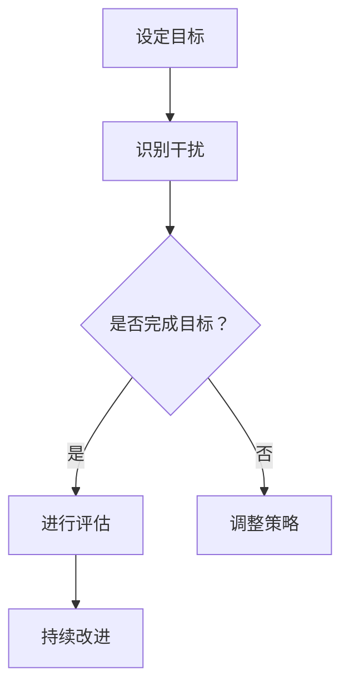
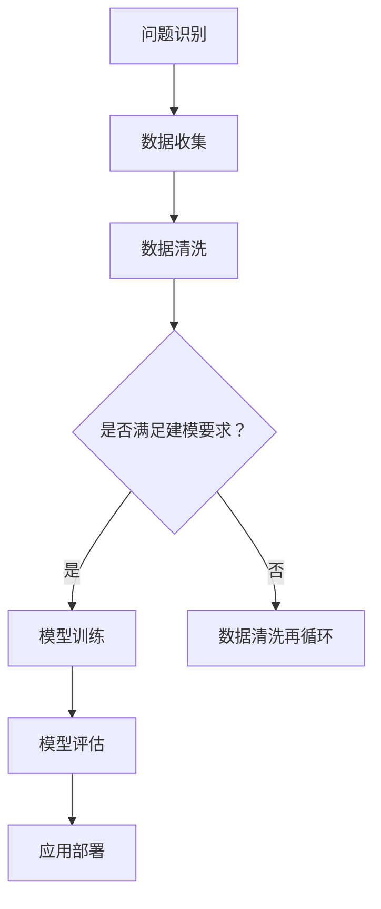
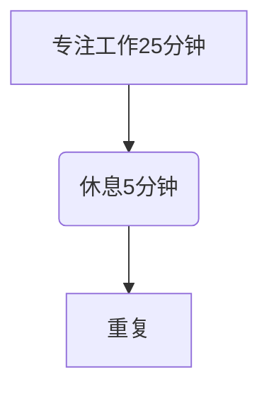
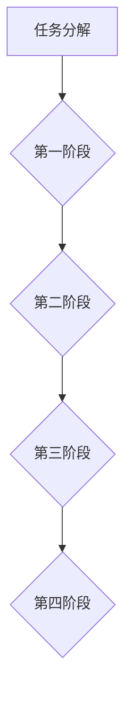
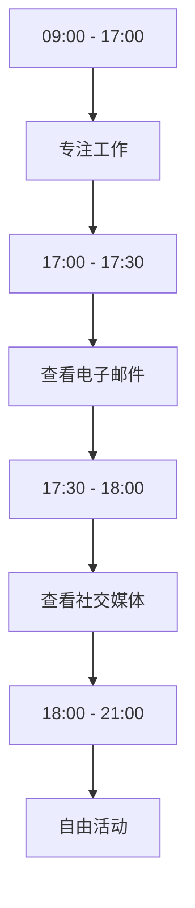
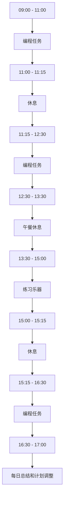
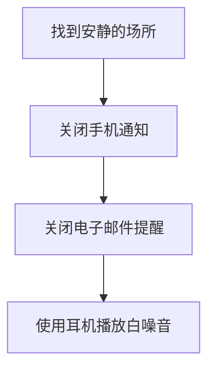
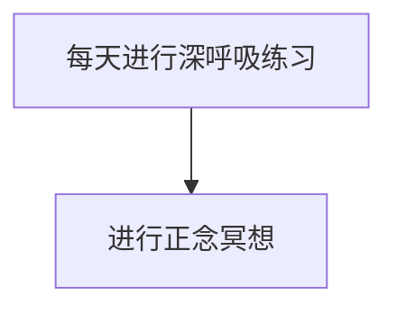
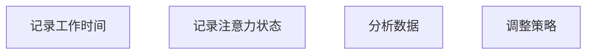

                 

# 文章标题: 注意力的自主权：AI时代的个人选择

> 关键词：注意力，AI，个人选择，注意力管理，专注度，科技依赖

> 摘要：随着人工智能技术的迅猛发展，我们的生活发生了翻天覆地的变化。然而，这些变化也带来了一个新的挑战——如何在AI时代保持注意力的自主权。本文将深入探讨注意力的基本原理、AI时代背景、注意力的自主权以及如何在AI时代实现个人选择策略，旨在帮助读者了解并应对这一挑战。

## 第一部分：理解注意力与AI

### 第1章：注意力的基本原理

#### 1.1 注意力的定义与功能

注意力是人类心智活动的一种特征，它使得个体能够选择性地关注某些信息，同时忽略其他信息。注意力的功能主要包括以下几点：

1. **选择功能**：注意力使我们能够从众多的刺激中选择出与我们当前目标相关的信息。
2. **调节功能**：注意力可以帮助我们调整认知资源的分配，使其更有效地应对不同任务。
3. **维持功能**：注意力使我们能够保持对某一任务的持续关注，即使这一任务可能较为枯燥或耗时。

#### 1.2 注意力的类型与机制

根据关注点的不同，注意力可以分为以下几种类型：

1. **选择性注意力**：指个体在选择信息时表现出高度集中的状态，通常与任务完成效率密切相关。
2. **执行性注意力**：指个体在处理复杂任务时需要的高度集中和自我调节能力。
3. **分配性注意力**：指个体在同时处理多个任务时所需的注意力分配能力。

注意力机制包括以下几个方面：

1. **神经基础**：注意力涉及大脑多个区域的协同工作，如前额叶、顶叶、颞叶等。
2. **认知负荷**：认知负荷是指个体在处理信息时所需的心理资源。注意力与认知负荷之间存在密切关系。
3. **认知控制**：认知控制是指个体通过自我调节来维持注意力的高度集中和灵活性。

#### 1.3 注意力与认知负荷的关系

认知负荷是影响注意力的重要因素之一。当认知负荷较低时，个体能够更轻松地保持注意力集中；而当认知负荷较高时，个体可能需要更多的注意力资源来处理信息，这可能导致注意力分散或疲劳。因此，了解认知负荷与注意力的关系对于优化注意力的使用至关重要。

### 第2章：AI时代背景与注意力变迁

#### 2.1 AI技术的快速发展

人工智能（AI）是一种模拟人类智能的技术，其核心目标是使机器能够执行通常需要人类智能的任务。随着深度学习、自然语言处理、计算机视觉等技术的快速发展，AI的应用领域不断拓展，从工业自动化、医疗诊断到智能助手、自动驾驶等。

#### 2.2 人工智能对日常生活的改变

人工智能对日常生活的影响主要体现在以下几个方面：

1. **信息获取**：AI技术使得我们能够更快速、准确地获取和处理信息，提高了信息获取的效率。
2. **自动化与智能化**：AI技术在各个领域的应用使得自动化和智能化水平不断提升，为我们的生活带来了便利。
3. **个性化服务**：基于用户行为数据的人工智能系统能够提供更加个性化的服务，提高了用户体验。

#### 2.3 注意力资源的重新分配

随着AI技术的快速发展，人们的注意力资源也在发生重新分配。一方面，AI技术减轻了人们在某些任务上的认知负担，使得个体能够将更多注意力投入到其他更有价值的事物上；另一方面，AI技术的普及也导致个体面临更多的信息输入和干扰，这可能导致注意力分散和疲劳。

### 第3章：注意力的自主权

#### 3.1 什么是注意力的自主权

注意力的自主权是指个体在处理信息时能够自主地选择关注点，不受外界干扰和诱惑的能力。在AI时代，保持注意力的自主权对于个人成长和成功至关重要。

#### 3.2 如何保护注意力的自主权

为了保护注意力的自主权，我们可以采取以下措施：

1. **设定明确的目标**：明确的目标有助于我们集中注意力，避免分散。
2. **避免多任务处理**：多任务处理容易导致注意力分散，降低工作效率。
3. **创造专注环境**：减少干扰因素，创造一个有利于专注的环境。
4. **定期休息**：长时间专注于某一项任务可能导致疲劳，定期休息有助于恢复注意力。

#### 3.3 注意力自主权的重要性

注意力的自主权不仅有助于提高工作效率，还能够增强个体的自我控制力和自律能力。在AI时代，保持注意力的自主权对于应对信息过载和科技依赖具有重要意义。

## 第二部分：AI时代的个人选择策略

### 第4章：个人选择中的注意力管理

#### 4.1 识别注意力分散的原因

注意力分散的原因主要包括以下几点：

1. **外部干扰**：如手机通知、社交媒体等。
2. **内部干扰**：如焦虑、压力等情绪问题。
3. **任务难度**：过于复杂的任务可能导致注意力难以集中。

#### 4.2 提高注意力的专注度

提高注意力的专注度可以从以下几个方面入手：

1. **锻炼注意力**：通过日常锻炼，如冥想、专注力训练等，提高注意力集中能力。
2. **合理安排时间**：合理规划时间，避免过度劳累和压力。
3. **减少干扰**：在处理重要任务时，尽量减少外部干扰。

#### 4.3 制定有效的注意力管理计划

制定注意力管理计划包括以下几个方面：

1. **明确目标**：设定明确的目标，有助于集中注意力。
2. **优先级排序**：将任务按照优先级排序，确保注意力集中在最重要的任务上。
3. **定期评估**：定期评估注意力管理效果，及时调整策略。

### 第5章：科技对个人选择的挑战

#### 5.1 信息的泛滥与选择困难

在AI时代，信息的获取变得前所未有的容易，但这同时也带来了信息过载的问题。过多的信息可能导致选择困难，降低决策效率。

#### 5.2 科技依赖与注意力转移

科技依赖使得个体容易陷入注意力转移的陷阱。过多的使用社交媒体、游戏等可能导致注意力分散，降低工作效率。

#### 5.3 面对科技挑战的应对策略

面对科技挑战，我们可以采取以下策略：

1. **限制使用时间**：合理规划科技产品的使用时间，避免过度依赖。
2. **提高信息筛选能力**：学会筛选和处理信息，避免信息过载。
3. **培养自律能力**：增强自律能力，减少科技依赖。

### 第6章：实现注意力的自主权

#### 6.1 培养良好的注意力习惯

培养良好的注意力习惯包括以下几个方面：

1. **养成专注的习惯**：在处理任务时，尽量避免分心。
2. **合理安排时间**：确保有足够的时间进行专注工作。
3. **养成规律的生活习惯**：保证充足的睡眠，提高生活质量。

#### 6.2 利用技术工具辅助注意力管理

技术工具可以帮助我们更好地管理注意力，例如：

1. **专注软件**：如专注力训练软件、番茄工作法等。
2. **提醒工具**：如手机提醒、闹钟等。
3. **应用程序**：如番茄钟、Forest等专注力提升应用程序。

#### 6.3 跨越注意力的陷阱

要跨越注意力的陷阱，我们需要：

1. **认识到注意力分散的危害**：明确注意力分散对个人成长和成功的负面影响。
2. **设定明确的目标**：确保注意力集中在实现目标上。
3. **养成自律的习惯**：通过自律，克服注意力分散的诱惑。

### 第7章：案例研究与成功实践

#### 7.1 案例一：如何减少社交媒体上的时间投入

通过以下步骤，我们可以减少社交媒体上的时间投入：

1. **设定明确的目标**：如每天在社交媒体上的时间不超过30分钟。
2. **合理安排时间**：将社交媒体时间安排在任务完成后。
3. **使用专注软件**：使用专注软件，如Forest，帮助自己减少社交媒体使用。

#### 7.2 案例二：通过冥想提高注意力集中

通过以下步骤，我们可以通过冥想提高注意力集中：

1. **每天进行冥想**：每天设定一定时间进行冥想。
2. **选择适合自己的冥想方法**：如正念冥想、呼吸冥想等。
3. **定期评估冥想效果**：通过自我评估，调整冥想策略。

#### 7.3 案例三：设定明确的目标实现注意力自主

通过以下步骤，我们可以设定明确的目标实现注意力自主：

1. **设定具体的目标**：如每天完成一定的阅读、写作任务。
2. **制定详细的计划**：将目标分解为具体的任务，制定详细的计划。
3. **定期评估和调整**：定期评估目标的完成情况，根据实际情况调整计划。

### 第8章：未来展望与个人选择趋势

#### 8.1 AI技术与注意力自主权的未来发展

随着AI技术的不断发展，未来的注意力自主权将面临新的挑战和机遇。一方面，AI技术将为我们提供更强大的工具，帮助我们更好地管理注意力；另一方面，AI技术的普及也可能导致更多的注意力分散和干扰。

#### 8.2 个人选择趋势分析

在未来，个人选择将越来越注重注意力管理。人们将更加重视如何保持注意力集中，以实现更高的工作效率和个人成长。

#### 8.3 如何应对未来的挑战

为了应对未来的挑战，我们需要：

1. **加强注意力管理能力**：通过锻炼、学习等方法，提高自己的注意力管理能力。
2. **合理规划时间**：合理安排工作和休息时间，确保有足够的时间进行专注工作。
3. **培养自律能力**：通过自律，克服注意力分散的诱惑。

## 第三部分：附录与资源

### 附录 A：注意力自主权相关资源

#### A.1 优秀书籍推荐

1. 《深度工作：如何有效利用每一点脑力》（Deep Work: Rules for Focused Success in a Distracted World）
2. 《注意力：大脑如何集中注意力，摆脱干扰》（The Attention Switch: How Your Brain Decides What to Notice and What to Ignore）
3. 《禅与计算机程序设计艺术》（Zen and the Art of Motorcycle Maintenance）

#### A.2 有用的在线资源和工具

1. [专注力训练软件](https://www.focusathome.com/)
2. [番茄工作法](https://tomato-timer.com/)
3. [Forest](https://www.getforest.com/)

#### A.3 注意力研究的最新论文与报告

1. [The Role of Attention in Human Cognition: A Cognitive Neuroscience Perspective](https://www.ncbi.nlm.nih.gov/pmc/articles/PMC5697594/)
2. [Attention and Memory: An Integrated Framework](https://www.cell.com/trends/cognitive-sciences/fulltext/S1364-6613(16)30082-2)
3. [The Neural Basis of Attention and Its Role in Cognition](https://www.nature.com/articles/s41593-019-0394-3)

### 附录 B：Mermaid 流程图示例

#### B.1 注意力管理流程图



#### B.2 AI技术应用流程图



---

**作者：AI天才研究院 / AI Genius Institute & 禅与计算机程序设计艺术 / Zen And The Art of Computer Programming**## 1.1 注意力的定义与功能

### 注意力的定义

注意力（Attention）是认知心理学中的一个核心概念，它指的是个体在信息处理过程中，对某些特定的刺激进行选择性关注，同时忽略其他无关刺激的能力。这种能力使我们能够有效地在复杂的环境中识别并处理重要的信息，从而指导我们的行为和决策。

### 注意力的功能

注意力在认知过程中具有以下几个关键功能：

1. **选择功能**：选择性注意使我们能够从大量的信息输入中筛选出重要的、相关的信息，避免认知过载。例如，在嘈杂的环境中，我们能够选择关注重要的对话内容，而忽略背景噪音。

2. **调节功能**：注意力在认知资源的调节中起着至关重要的作用。它能够根据不同的任务需求，动态地分配认知资源，如视觉注意、听觉注意、触觉注意等。例如，当我们在阅读时，视觉注意力集中在文字上，同时听觉注意力减弱，以减少干扰。

3. **维持功能**：注意力有助于维持对特定任务的持续关注，确保我们能够完成复杂的任务。例如，在长时间的学习或工作中，我们需要保持注意力集中，以避免分心和效率下降。

### 注意力在认知过程中的作用

注意力在认知过程中起到桥梁的作用，它连接了感知、记忆、思考和行动。以下是注意力在认知过程中的一些具体作用：

1. **感知阶段**：注意力帮助我们感知到外部世界的某些特定信息。通过选择性注意，我们可以从环境中提取出与当前目标相关的信息，例如，在寻找某个特定物品时，我们能够从一堆物品中迅速找到目标。

2. **记忆阶段**：注意力有助于信息在记忆中的存储和检索。当我们集中注意力去记忆某些信息时，这些信息更有可能被长期存储在记忆中。同时，当我们需要回忆这些信息时，注意力可以帮助我们快速定位并提取相关信息。

3. **思考阶段**：注意力在决策和解决问题时至关重要。它使得我们能够集中思考某一问题，避免受到无关信息的干扰。例如，当我们在做决策时，需要将注意力集中在相关因素上，而不是被无关信息所分散。

4. **行动阶段**：注意力帮助我们执行特定的行动。通过选择性注意，我们可以将注意力集中在行动的关键步骤上，从而更有效地完成任务。例如，在驾驶时，我们需要将注意力集中在路况和驾驶操作上，以避免事故发生。

### 注意力与认知负荷的关系

认知负荷是指个体在处理信息时所需的心理资源，包括注意力、记忆、思考和行动能力。注意力与认知负荷之间存在密切的关系：

1. **低认知负荷**：当认知负荷较低时，个体有足够的认知资源来处理信息，这通常有助于注意力的集中。在这种情况下，个体能够更轻松地维持注意力的集中，并有效地完成任务。

2. **高认知负荷**：当认知负荷较高时，个体需要更多的认知资源来处理信息，这可能导致注意力分散和疲劳。在这种情况下，个体可能难以维持注意力的集中，容易出现分心和错误。

因此，了解认知负荷与注意力的关系对于优化注意力的使用和提升工作效率具有重要意义。通过合理规划和分配认知资源，我们可以最大限度地提高注意力的效率，从而更好地应对各种认知挑战。

## 1.2 注意力的类型与机制

### 选择性注意力

选择性注意力是注意力类型中最基础的一种，它指的是个体在处理大量信息时，有选择性地关注某些特定的信息，而忽略其他无关信息。这种注意力机制允许我们在复杂的环境中高效地筛选和处理信息。

#### 机制

选择性注意的机制主要包括以下几个方面：

1. **刺激特征**：个体对某些特定的刺激特征（如颜色、形状、声音等）表现出更高的注意倾向。例如，在嘈杂的环境中，人们可能会更关注与生存相关的声音，如警报声或孩子的哭声。

2. **任务相关**：个体在执行特定任务时，会对与任务相关的信息给予更高的注意。例如，当学生专注于听讲时，他们会更关注老师讲解的内容，而忽略其他无关的声音。

3. **认知需求**：个体的认知需求和目标也会影响选择性注意。当个体有明确的认知目标时，他们会更有意识地选择与目标相关的信息。例如，当医生在手术中专注于患者的状态时，他们会忽略其他不相关的信息。

#### 应用

选择性注意在日常生活和工作中具有重要意义。以下是一些具体的例子：

1. **信息筛选**：在处理大量信息时，选择性注意可以帮助我们快速筛选出重要的信息，避免认知过载。例如，在阅读一篇长文章时，我们可以通过选择性注意，快速识别出关键的观点和结论。

2. **任务专注**：在执行复杂任务时，选择性注意可以帮助我们集中精力，避免分心和错误。例如，在编程时，我们需要将注意力集中在代码上，而忽略其他可能的干扰，如社交媒体或电子邮件。

### 执行性注意力

执行性注意力（也称为任务注意力或工作记忆注意力）是一种高级的注意力机制，它涉及个体对任务的持续关注和调节能力。这种注意力类型在执行复杂任务时尤为重要，它使我们能够在面对干扰和变化时，保持对任务的专注。

#### 机制

执行性注意力的机制主要包括以下几个方面：

1. **任务管理**：执行性注意力可以帮助我们管理任务的执行过程，包括任务的分解、优先级排序和资源分配。例如，在项目管理中，我们需要将注意力集中在关键任务的进度和风险上。

2. **认知控制**：执行性注意力涉及对认知过程的自我调节和控制。例如，在遇到困难或挑战时，我们需要通过执行性注意力来调整策略，解决问题。

3. **记忆维持**：执行性注意力有助于在工作记忆中维持对信息的动态更新。例如，在编程时，我们需要记住代码的不同部分和功能，以确保整个程序的逻辑连贯性。

#### 应用

执行性注意力在日常生活和工作中具有重要意义。以下是一些具体的例子：

1. **复杂任务执行**：在执行复杂任务时，如项目管理、科学研究或软件开发，执行性注意力帮助我们保持对任务的专注，确保任务的高效完成。

2. **问题解决**：在遇到问题时，执行性注意力使我们能够集中精力，思考解决方案。例如，在编程时，当遇到bug时，我们需要通过执行性注意力，分析问题的原因，并提出有效的解决方案。

### 分配性注意力

分配性注意力（也称为分散注意力）指的是个体在同一时间对多个任务或刺激进行注意的能力。这种注意力类型在日常生活中非常重要，因为它使我们能够在多任务环境中有效地管理资源。

#### 机制

分配性注意力的机制主要包括以下几个方面：

1. **任务分离**：分配性注意力允许个体将认知资源分配到不同的任务上，同时保持对每个任务的关注。例如，在开车时，我们需要同时注意道路、交通标志和其他车辆。

2. **认知负载**：分配性注意力涉及到对认知负载的管理。个体需要确保每个任务的认知负荷在可承受范围内，以避免过度疲劳和错误。

3. **任务优先级**：在分配注意力时，个体需要根据任务的紧急程度和重要性来调整注意力的分配。例如，在紧急情况下，我们需要将更多的注意力分配到应对紧急任务上。

#### 应用

分配性注意力在日常生活和工作中具有重要意义。以下是一些具体的例子：

1. **多任务处理**：在多任务环境中，如家庭主妇、医生或飞行员，分配性注意力帮助我们同时处理多个任务，确保每个任务都能得到适当的关注。

2. **时间管理**：在日常生活中，如安排工作、家庭和个人活动，分配性注意力帮助我们合理安排时间，确保每个任务都能在规定的时间内完成。

### 注意力机制的相互作用

在认知过程中，选择性注意力、执行性注意力和分配性注意力并不是孤立存在的，而是相互交织、共同作用。例如，在执行一个复杂任务时，我们需要通过选择性注意力筛选出与任务相关的信息，通过执行性注意力维持对任务的专注，并通过分配性注意力确保在处理多个任务时保持平衡。

了解这些注意力机制及其相互作用，有助于我们更好地理解和优化注意力的使用，从而提高认知效率和完成任务的能力。

## 1.3 注意力与认知负荷的关系

### 认知负荷的定义

认知负荷（Cognitive Load）是指个体在处理信息时所需的心理资源，包括注意力、记忆、思考和行动能力。认知负荷是衡量注意力资源消耗的一个重要指标，它直接影响个体对信息的处理速度和质量。

### 低认知负荷与高认知负荷

**低认知负荷**：当认知负荷较低时，个体有足够的认知资源来处理信息，这通常有助于注意力的集中和效率的提高。在低认知负荷的情况下，个体能够轻松地筛选和处理信息，减少错误和分心。

**高认知负荷**：当认知负荷较高时，个体需要更多的认知资源来处理信息，这可能导致注意力分散和疲劳。在高认知负荷的情况下，个体可能难以维持注意力的集中，容易受到干扰，从而导致错误率的增加。

### 注意力与认知负荷的关系

注意力与认知负荷之间存在密切的关系，具体体现在以下几个方面：

1. **资源分配**：注意力是一种有限的认知资源，它需要根据不同的任务需求进行动态分配。在低认知负荷的情况下，个体能够更有效地分配注意力资源，使其集中在重要的任务上；而在高认知负荷的情况下，个体可能需要将更多的注意力资源用于处理信息，导致其他任务受到忽视。

2. **任务绩效**：注意力集中程度直接影响任务绩效。在低认知负荷的情况下，个体能够更高效地完成任务，因为注意力资源充足，可以更好地处理复杂的信息；而在高认知负荷的情况下，个体可能需要更多的时间来完成任务，并且容易出现错误和分心。

3. **疲劳与恢复**：长期处于高认知负荷状态可能导致个体疲劳，影响注意力的集中和质量。相反，在低认知负荷的状态下，个体能够得到休息和恢复，从而保持较高的注意力和认知效率。

### 优化认知负荷的策略

为了优化认知负荷，我们可以采取以下策略：

1. **任务分解**：将复杂任务分解为多个简单的子任务，有助于降低每个子任务所需的认知负荷，从而减少整体认知负荷。

2. **合理规划**：合理安排工作和休息时间，确保有足够的时间进行专注工作，以降低连续工作导致的认知负荷。

3. **减少干扰**：在处理重要任务时，尽量减少外部干扰，如关闭手机通知、关闭社交媒体等，以提高注意力集中度。

4. **自我监控**：定期评估自己的认知负荷，通过自我监控和调整，确保认知资源得到合理利用。

通过了解注意力与认知负荷的关系，并采取适当的策略，我们可以优化注意力的使用，提高工作效率和质量。

### 3.1 什么是注意力的自主权

注意力的自主权（Attentional Autonomy）是指个体在信息处理过程中，能够自主地选择和调节注意力资源，不受外界干扰和诱惑的能力。这个概念强调了个体在注意力使用上的主动性和自我控制力，是保持注意力高效和专注的关键。

#### 自主权的重要性

在当今信息爆炸和科技高度发展的时代，保持注意力的自主权显得尤为重要。以下是注意力自主权的重要性体现：

1. **工作效率**：拥有注意力的自主权意味着个体能够将注意力集中在最重要的任务上，从而提高工作效率和生产力。在低干扰和高专注的状态下，个体能够更迅速地完成任务，减少错误和返工。

2. **心理健康**：长时间暴露在注意力分散的环境中，可能导致焦虑、压力和疲劳。保持注意力的自主权有助于减少这些负面影响，提升心理健康水平。

3. **学习效果**：在学习过程中，自主的注意力分配有助于深入理解和记忆重要信息。个体可以根据学习目标自主调整注意力，避免被动接受大量无关信息，从而提高学习效果。

4. **决策质量**：在做出重要决策时，注意力的自主权确保个体能够集中精力分析关键信息，减少冲动决策和错误判断。

#### 自主权的影响因素

注意力的自主权受到多种因素的影响，包括：

1. **环境因素**：周围环境中的干扰物，如手机通知、社交媒体、噪音等，可能影响个体的注意力自主权。一个低干扰的环境有助于保持注意力集中。

2. **心理因素**：个体的情绪状态、动机水平、自我效能感等心理因素也影响注意力的自主权。积极的情绪和高的自我效能感有助于增强注意力的自主性。

3. **技术因素**：科技产品和工具的使用，如社交媒体、电子邮件等，可能增加注意力的分散。合理使用技术工具可以帮助个体保持注意力自主权。

#### 自主权的基本原则

为了保持注意力的自主权，我们可以遵循以下基本原则：

1. **明确目标**：设定清晰、具体的目标有助于个体集中注意力，避免分心和无效工作。

2. **自我监控**：定期评估自己的注意力状态，及时调整注意力分配，确保重要任务得到充分关注。

3. **减少干扰**：在处理重要任务时，尽量减少外部干扰，如关闭不必要的通知和社交媒体。

4. **合理休息**：长时间专注可能导致疲劳，适当的休息有助于恢复注意力和效率。

5. **自我激励**：通过设定奖励和目标，保持动机和兴趣，增强注意力的自主权。

通过理解和实践这些原则，个体可以在日益复杂的AI时代中，更好地保持注意力的自主权，从而实现更高的工作、学习和生活质量。

### 3.2 如何保护注意力的自主权

在AI时代，保护注意力的自主权变得尤为重要。以下是一些具体的方法，帮助我们在信息泛滥和科技依赖的环境下，有效地保护注意力的自主权。

#### 1. 设定明确的目标

明确的目标是保持注意力自主权的基础。首先，我们需要为每项任务设定具体、可量化的目标。例如，如果你正在写一篇论文，可以将目标设定为“每天至少完成两页的草稿”。这样的目标具体明确，有助于你集中注意力，避免分心和拖延。

#### 2. 避免多任务处理

多任务处理虽然看似高效，但实际上会严重分散注意力。在处理任务时，尽量专注于一项任务，直到完成。避免同时处理多个任务，可以提高工作效率，减少错误和返工。例如，在编写代码时，关闭不必要的浏览器标签和应用程序，避免被其他信息干扰。

#### 3. 创建专注环境

一个低干扰的环境有助于保持注意力集中。找到能够让你专注于工作的场所，如安静的图书馆或安静的咖啡馆。关闭不必要的通知，如手机通知、电子邮件提醒等，减少外界干扰。此外，使用耳机播放白噪音或轻音乐，可以帮助你更好地集中注意力。

#### 4. 定期休息

长时间专注可能导致疲劳，影响注意力的质量。定期休息有助于恢复注意力和效率。可以采用番茄工作法，每工作25分钟后休息5分钟，以保持精力和注意力。这样的短暂休息可以让你在长时间工作后恢复活力，继续高效地工作。

#### 5. 自我监控和调整

定期评估自己的注意力状态，通过自我监控了解哪些方法有效，哪些需要改进。例如，你可以记录每天的工作时间和注意力状态，分析哪些任务最能集中你的注意力，哪些任务导致你分心。根据这些数据，调整你的工作计划和策略，以更好地保护注意力的自主权。

#### 6. 学会说“不”

在社交活动和科技使用上，学会拒绝那些不符合你目标或对你注意力的要求不高的邀请和使用。例如，在社交聚会中，如果你知道你需要在接下来几天集中精力完成一个重要的项目，可以提前告知朋友，以免他们邀请你参加不必要的外出活动。

#### 7. 培养自律能力

自律是保护注意力自主权的关键。通过培养自律能力，你可以在面对诱惑和干扰时，坚持自己的计划和目标。例如，设定明确的作息时间表，并严格执行，可以帮助你养成良好的工作习惯，提高注意力的集中度。

#### 8. 利用技术工具

现代科技为保护注意力自主权提供了许多工具。例如，使用专注力训练软件，如Focus@Will或Forest，可以帮助你在工作或学习时减少干扰。这些工具可以跟踪你的工作状态，提供奖励机制，以鼓励你保持专注。

#### 9. 培养冥想和放松技巧

冥想和放松技巧有助于提高注意力的稳定性和集中度。通过定期进行冥想，你可以学会如何在面对压力和干扰时保持冷静和专注。例如，每天花几分钟进行深呼吸练习或正念冥想，可以帮助你放松身心，提高注意力的自主权。

#### 10. 培养兴趣和动力

对你所从事的工作或学习内容保持兴趣和动力，可以增强你保持注意力自主权的意愿。当你对某个任务充满热情时，你更容易集中注意力，克服干扰和困难。例如，找到与你的兴趣相关的小项目，可以让你的工作更有意义，提高专注度。

通过以上方法，我们可以在AI时代有效地保护注意力的自主权，提高工作和学习效率，实现个人目标和成长。

### 3.3 注意力自主权的重要性

在AI时代，保持注意力的自主权对于个人的成长和成功至关重要。以下是注意力自主权的重要性以及它在不同领域中的应用和影响：

#### 1. 提高工作效率

注意力自主权有助于我们在处理任务时保持专注，避免分心和干扰。通过设定明确的目标和避免多任务处理，我们能够更高效地完成任务，减少错误和返工。例如，在编程过程中，保持注意力自主权意味着我们能够专注于代码的编写和调试，从而提高开发效率。

#### 2. 增强学习效果

学习过程中，注意力的自主权使我们能够更好地集中精力，深入理解和记忆重要信息。通过减少外部干扰，如手机通知和社交媒体，我们能够专注于教材和课程内容，提高学习效果。例如，通过定期进行冥想和专注力训练，学生可以在考试和准备过程中保持高度集中，提高成绩。

#### 3. 促进心理健康

注意力自主权有助于减少焦虑和压力，提升心理健康。在AI时代，信息过载和科技依赖可能导致心理负担加重，影响情绪和行为。通过保护注意力的自主权，我们可以减少这些负面影响，维持心理健康。例如，通过定期休息和自我监控，我们可以避免长时间高负荷工作导致的疲劳和焦虑。

#### 4. 增强决策质量

在做出重要决策时，注意力自主权使我们能够集中精力分析关键信息，减少冲动决策和错误判断。通过减少外部干扰和保持注意力集中，我们能够更理性地评估各种选择，做出更明智的决策。例如，在商业决策中，保持注意力自主权可以帮助企业家更深入地分析市场和竞争对手，从而制定更有效的战略。

#### 5. 提升创新能力

注意力自主权有助于我们保持对问题的持续关注，激发创新思维。在研究项目和设计工作中，通过集中注意力和避免分心，我们能够更深入地思考问题，发现新的解决方案。例如，科学家和工程师在专注研究时，通过保持注意力自主权，可以更好地发现科学原理和技术突破。

#### 6. 促进人际关系

保持注意力自主权也有助于提升人际关系质量。在与他人交流和合作时，通过专注于对方的发言和需求，我们可以更好地理解对方，建立信任和融洽的关系。例如，在团队会议中，通过保持注意力自主权，团队成员可以更有效地沟通和协作，共同解决问题。

#### 7. 应对信息过载

在AI时代，信息过载是一个普遍问题。保持注意力自主权有助于我们筛选和过滤信息，避免被大量无关信息所淹没。通过设定明确的目标和优先级，我们能够更有效地处理重要信息，避免分心和疲劳。例如，通过合理规划时间和使用专注工具，我们可以更好地管理电子邮件和信息流，保持工作效率。

#### 8. 跨文化适应性

在全球化和多元化的环境中，保持注意力自主权有助于我们更好地适应不同的文化和工作环境。通过保持注意力的集中和灵活，我们能够更好地理解不同文化中的价值观和沟通方式，增强跨文化沟通能力。例如，在国际团队合作中，通过保持注意力自主权，我们可以更好地理解不同团队成员的需求和期望，从而建立有效的合作关系。

总之，注意力自主权在AI时代对于个人的成长和成功具有重要意义。通过理解其重要性并在不同领域中应用，我们可以更好地管理注意力，提高工作效率、学习效果和心理健康，实现个人目标和职业发展。

### 4.1 识别注意力分散的原因

在当今快节奏和高度信息化的社会中，注意力分散成为一个普遍问题，严重影响了我们的工作效率和学习效果。为了有效管理注意力，我们需要首先识别导致注意力分散的各种原因。以下是一些主要因素：

#### 1. 外部干扰

外部干扰是导致注意力分散的主要原因之一。这些干扰可能来自环境、设备和其他人的行为。以下是一些具体的外部干扰：

- **噪声**：例如，交通噪音、嘈杂的办公室、机械设备的噪音等，都会分散我们的注意力。
- **设备通知**：手机、电脑等设备的各种通知，如短信、社交媒体更新、电子邮件提醒等，也会打断我们的专注状态。
- **他人打扰**：在团队合作或共享工作空间中，同事或朋友的无意打扰也可能使我们分心。

#### 2. 内部干扰

内部干扰主要源于我们的情绪和心理状态。这些干扰包括：

- **情绪波动**：焦虑、压力、情绪波动等情绪问题可能导致注意力难以集中。例如，担忧未来任务或对当前任务的挫败感都可能影响我们的专注力。
- **多任务处理**：同时处理多个任务会消耗我们的认知资源，使我们的注意力难以集中。例如，尝试同时在工作、浏览社交媒体和回复电子邮件，会导致注意力分散。

#### 3. 任务复杂性

某些任务的复杂性和难度也会导致注意力分散。例如：

- **复杂任务**：执行复杂任务时，我们需要处理大量的信息和细节，这可能导致认知负荷增加，从而分散注意力。
- **重复性任务**：重复性任务可能使人感到无聊和疲惫，进而影响注意力集中。

#### 4. 科技依赖

在AI时代，科技依赖也是一个导致注意力分散的重要因素。以下是一些具体表现：

- **社交媒体**：频繁查看社交媒体更新会消耗大量的时间和注意力。
- **网络游戏**：沉迷于网络游戏可能导致我们在完成任务时难以保持专注。
- **电子邮件**：不断查看和回复电子邮件可能导致我们在处理重要任务时分心。

#### 5. 环境因素

环境因素也会影响我们的注意力集中。以下是一些环境因素：

- **光线**：不良的光线条件（如过亮或过暗的环境）可能影响我们的视觉注意力。
- **温度**：过热或过冷的环境可能导致我们感到不适，进而影响注意力集中。

#### 6. 生物节律

我们的生物节律，如睡眠质量和作息时间，也会影响注意力集中。例如，睡眠不足或作息不规律可能导致我们在白天感到疲劳和注意力不集中。

为了有效地管理注意力，我们需要识别并理解这些分散注意力的原因，并采取相应的措施来减少干扰和提升专注力。

### 4.2 提高注意力的专注度

提高注意力的专注度是我们在快节奏的AI时代保持高效工作和学习的关键。以下是一些有效的方法，帮助我们在面对各种干扰时保持专注。

#### 1. 设定明确的目标

明确的目标是提高注意力专注度的第一步。在开始任何任务之前，我们应该设定具体、可量化的目标。例如，如果你打算写一篇论文，可以将目标设定为“每天至少写两页”。这样明确的目标有助于我们集中注意力，避免无目的性地浪费时间。

#### 2. 采用番茄工作法

番茄工作法是一种简单而有效的注意力管理技巧。它通过将工作时间划分为25分钟的专注周期，每个周期后休息5分钟，来提高工作效率。这种方法有助于我们保持专注，同时避免疲劳。例如，在编程时，你可以设置一个番茄钟，专注工作25分钟，然后休息5分钟。



#### 3. 创造专注环境

一个低干扰的环境对于保持专注至关重要。找到能够让你专注于工作的场所，如安静的图书馆或安静的咖啡馆。关闭不必要的通知和设备，如手机通知、电子邮件提醒等，减少外界干扰。使用耳机播放白噪音或轻音乐，可以帮助你更好地集中注意力。

#### 4. 学会冥想和放松技巧

冥想和放松技巧有助于提高注意力的稳定性和集中度。通过定期进行冥想，你可以学会如何在面对压力和干扰时保持冷静和专注。例如，每天花几分钟进行深呼吸练习或正念冥想，可以帮助你放松身心，提高专注度。

#### 5. 分阶段完成任务

将复杂的任务分解为小的、可管理的阶段，有助于减少认知负荷，提高专注度。例如，如果你需要写一篇长篇报告，可以将任务分解为几个部分，每天专注于完成一个部分。这样，你可以保持对任务的掌控，避免因任务过于庞大而导致的分心。



#### 6. 自我监控和反馈

定期评估自己的注意力状态，通过自我监控了解哪些方法有效，哪些需要改进。例如，你可以记录每天的工作时间和注意力状态，分析哪些任务最能集中你的注意力，哪些任务导致你分心。根据这些数据，调整你的工作计划和策略，以更好地保护注意力的自主权。

#### 7. 利用技术工具

现代科技为提高注意力提供了许多工具。例如，使用专注力训练软件，如Focus@Will或Forest，可以帮助你在工作或学习时减少干扰。这些工具可以跟踪你的工作状态，提供奖励机制，以鼓励你保持专注。

#### 8. 培养自律能力

自律是提高注意力专注度的关键。通过培养自律能力，你可以在面对诱惑和干扰时，坚持自己的计划和目标。例如，设定明确的作息时间表，并严格执行，可以帮助你养成良好的工作习惯，提高专注度。

#### 9. 培养兴趣和动力

对你所从事的工作或学习内容保持兴趣和动力，可以增强你保持注意力专注度的意愿。当你对某个任务充满热情时，你更容易集中注意力，克服干扰和困难。例如，找到与你的兴趣相关的小项目，可以让你的工作更有意义，提高专注度。

通过以上方法，我们可以在AI时代有效地提高注意力的专注度，提高工作效率和学习效果，实现个人目标和成长。

### 4.3 制定有效的注意力管理计划

为了在快节奏的AI时代保持高效的注意力，我们需要制定一个详细的注意力管理计划。以下是一些关键步骤，帮助你制定一个有效的注意力管理计划：

#### 1. 明确目标和优先级

在制定注意力管理计划之前，首先要明确你的目标和优先级。这些目标可以是短期的，如每天完成特定的工作任务，也可以是长期的，如提高某项技能或完成一个大项目。将目标写下来，并根据其重要性和紧急性进行排序。这有助于你在日常工作中集中注意力。

```markdown
# 目标清单

- 每天完成2小时的编程任务
- 每周进行3次锻炼
- 每周阅读1本专业书籍
- 每月完成1篇技术博客文章
```

#### 2. 制定详细的日程表

基于你的目标，制定一个详细的日程表。将每天的时间分配给不同的任务，确保每个任务都有特定的时间段。在日程表中预留一些弹性时间，以应对突发任务或紧急情况。例如：

```markdown
# 每日日程表

| 时间段 | 任务 |
|--------|------|
| 09:00 - 11:00 | 编程任务 |
| 11:00 - 11:15 | 休息 |
| 11:15 - 12:30 | 编程任务 |
| 12:30 - 13:30 | 午餐休息 |
| 13:30 - 15:00 | 练习乐器 |
| 15:00 - 15:15 | 休息 |
| 15:15 - 16:30 | 编程任务 |
| 16:30 - 17:00 | 完成每日总结和计划调整 |
```

#### 3. 使用时间管理工具

使用时间管理工具，如日历、待办事项列表、番茄工作法等，可以帮助你更好地跟踪和管理时间。这些工具可以提醒你何时开始和结束每个任务，以及完成任务的时间长度。例如，你可以使用Google Calendar或Microsoft To Do来管理你的日程。

#### 4. 设定提醒和警报

为了确保你按时完成任务，设定提醒和警报是至关重要的。将提醒设置在任务开始和结束的时间点，以确保你不会忘记重要任务。例如，你可以使用手机或电脑的闹钟或提醒功能，确保你按时开始和结束每个任务。

```markdown
# 提醒和警报设置

- 09:00 AM：开始编程任务
- 11:15 AM：休息提醒
- 16:30 PM：结束编程任务
```

#### 5. 定期评估和调整

制定注意力管理计划后，定期评估和调整是保持其有效性的关键。每周或每月检查一次你的日程表和目标完成情况，并根据实际情况进行调整。例如，如果你发现某个任务耗时过长，可以调整日程表，减少该任务的时间，或将部分任务转移到其他时间段。

```markdown
# 每周评估和调整

- 编程任务时间从3小时减少到2小时，以减少疲劳
- 将阅读时间从晚上调整到早上，以避免睡前过度刺激
```

#### 6. 坚持和自律

制定计划后，坚持和自律是成功的关键。养成良好的时间管理习惯，坚持执行日程表和计划，即使在面对挑战和干扰时也不放弃。例如，即使某个任务看起来困难，也要尽力完成，以培养自律能力。

通过以上步骤，你将能够制定一个有效的注意力管理计划，帮助你保持专注和高效，实现个人目标和职业发展。

### 5.1 信息的泛滥与选择困难

在AI时代，信息的泛滥成为了我们面临的一个重要挑战。随着互联网和移动设备的普及，我们每天接触到大量的信息，这些信息不仅来自传统的媒体，如报纸、电视和广播，还来自社交媒体、电子邮件、在线新闻和社交媒体推送等。这种信息过载现象使得我们面临前所未有的选择困难，影响我们的注意力和决策能力。

#### 信息的来源和特点

1. **社交媒体**：社交媒体平台如Facebook、Twitter、Instagram等，每天产生海量的信息，用户在浏览这些平台时往往会接触到大量不相关的信息。

2. **在线新闻和博客**：互联网上有无数的新闻网站和博客，每天发布大量的新闻和观点，这些信息虽然丰富，但很多内容重复或质量不高。

3. **电子邮件**：电子邮件是企业和个人之间信息交流的重要方式，但每天收到的邮件数量巨大，许多邮件内容与我们的工作或生活无关。

4. **推送通知**：手机和电脑上的应用会通过推送通知向我们发送实时信息，这些通知往往打断我们的正常工作或学习。

#### 选择困难的影响

选择困难是指在面对大量选择时，个体难以做出决策的心理状态。在AI时代，选择困难的影响主要体现在以下几个方面：

1. **注意力分散**：过多的信息会消耗我们的注意力资源，导致我们在处理任务时容易分心。例如，当我们在工作或学习时，手机上的推送通知可能会打断我们的思考过程，使我们难以集中注意力。

2. **决策疲劳**：长时间面对大量的选择会消耗我们的心理能量，导致决策疲劳。例如，购物时，过多的产品选择可能会使我们感到疲惫，难以做出购买决策。

3. **焦虑和压力**：选择困难可能导致焦虑和压力，尤其是在面对重要决策时。例如，在选择职业道路或教育方向时，过多的选择可能会使我们感到不确定和焦虑。

#### 应对策略

为了应对信息泛滥和选择困难，我们可以采取以下策略：

1. **信息筛选**：学会筛选信息，只关注重要和相关的信息。例如，通过设置邮件过滤器，只接收重要的邮件，避免被无关信息打扰。

2. **设定目标**：明确我们的目标和优先级，有助于我们在面对大量选择时做出决策。例如，在购物时，提前确定自己的预算和需求，有助于快速做出购买决策。

3. **限制使用时间**：合理安排科技产品的使用时间，避免过度使用。例如，每天设定特定时间用于查看社交媒体和电子邮件，其余时间专注于工作或学习。

4. **培养自律能力**：通过自律，我们可以更好地控制自己的行为，避免被信息泛滥所困扰。例如，养成定期清理手机通知和关闭社交媒体推送的习惯。

5. **学习时间管理**：掌握时间管理技巧，如番茄工作法，有助于我们更高效地利用时间，减少信息过载的影响。

通过这些策略，我们可以更好地应对信息泛滥和选择困难，保持注意力的集中和决策的清晰，从而提高工作效率和生活质量。

### 5.2 科技依赖与注意力转移

在AI时代，科技依赖和注意力转移已经成为影响个人选择和决策的重要因素。科技产品，如智能手机、平板电脑、社交媒体和在线游戏等，为我们的生活带来了便利和娱乐，但同时也可能成为分散注意力和影响决策的诱因。

#### 科技依赖的表现

1. **频繁使用手机**：许多人每天都会花费大量时间在手机上，浏览社交媒体、观看视频或玩游戏。这种频繁使用手机的习惯会导致我们注意力分散，影响工作和学习效率。

2. **社交媒体依赖**：社交媒体平台如Facebook、Instagram和Twitter等，通过算法推荐和推送通知，不断吸引用户的注意力。用户在社交媒体上花费的时间越长，越容易受到算法的影响，难以做出独立的决策。

3. **在线游戏沉迷**：在线游戏提供了即时反馈和成就系统，这使得一些用户沉迷其中，难以自拔。沉迷于游戏不仅会影响个人的健康和睡眠，还会影响工作、学习和社交活动。

#### 注意力转移的影响

1. **决策困难**：科技依赖和注意力转移使我们容易受到外界信息的干扰，导致我们在做决策时难以集中注意力。例如，在购物时，过多的产品信息和广告可能会让我们难以做出购买决策。

2. **时间管理困难**：沉迷于科技产品会导致时间管理困难，难以合理安排工作和休息时间。例如，由于频繁使用手机，一些人可能发现自己花费在社交媒体上的时间比预期要长。

3. **情绪波动**：科技依赖和注意力转移可能导致情绪波动。例如，在错过社交媒体上的更新或游戏比赛时，用户可能会感到焦虑或失落。

#### 应对策略

为了应对科技依赖和注意力转移，我们可以采取以下策略：

1. **设定使用时间限制**：为自己设定科技产品的使用时间限制，例如每天使用手机的时间不超过1小时。使用应用锁或家长控制功能，限制对某些应用的使用。

2. **培养自律能力**：通过培养自律能力，我们可以更好地控制自己的行为，减少对科技产品的依赖。例如，在特定时间段内，专注于工作或学习，避免使用手机或平板电脑。

3. **使用注意力管理工具**：使用注意力管理工具，如番茄工作法或专注力训练应用，帮助我们更好地集中注意力。这些工具可以设置定时提醒，帮助我们按时完成任务。

4. **培养其他兴趣爱好**：通过培养其他兴趣爱好，如阅读、运动或学习新技能，我们可以减少对科技产品的依赖，同时丰富自己的生活。

5. **定期休息和反思**：定期进行休息和反思，可以帮助我们了解自己的行为习惯，并调整策略。例如，每周花一些时间反思自己的科技使用习惯，找出需要改进的地方。

通过这些策略，我们可以更好地应对科技依赖和注意力转移，提高决策能力和生活质量。

### 5.3 面对科技挑战的应对策略

在AI时代，科技依赖和注意力分散已经成为影响个人选择和决策的普遍问题。为了应对这些挑战，我们需要采取一系列策略，以增强自我控制力，优化时间管理和保持专注。以下是一些具体的应对策略：

#### 1. 设定明确的目标和优先级

明确的目标和优先级是有效时间管理和决策的基础。在开始任何任务之前，我们应该设定具体、可量化的目标，并根据其重要性和紧急性进行排序。例如，如果你是一名程序员，可以将目标设定为“每天完成2小时的编程任务”或“每周阅读1本专业书籍”。这样，你可以更有针对性地安排时间，避免在无关任务上浪费时间。

#### 2. 使用时间管理工具

使用时间管理工具，如日历、待办事项列表和番茄工作法等，可以帮助我们更高效地安排时间，并避免被科技产品分散注意力。例如，你可以使用Google Calendar或Microsoft To Do来管理你的日程，设定每个任务的开始和结束时间，并设定提醒和警报。番茄工作法通过将工作时间划分为25分钟的专注周期，每个周期后休息5分钟，有助于提高工作效率和专注度。

#### 3. 限制科技产品的使用

为了减少科技依赖，我们需要设定科技产品的使用时间限制。例如，每天设定特定时间段用于查看电子邮件和社交媒体，其余时间专注于工作或学习。使用应用锁或家长控制功能，限制对某些应用的使用，可以帮助我们更好地控制自己的行为。例如，你可以使用AppBlocker或Moment等应用，自动锁定特定的应用，防止在非工作时间使用。



#### 4. 培养自律能力

自律是克服科技依赖和注意力分散的关键。通过培养自律能力，我们可以更好地控制自己的行为，坚持执行计划和目标。例如，设定明确的作息时间表，并严格执行，可以帮助我们养成良好的生活习惯，提高自我控制力。此外，培养自我监控和反思的习惯，定期评估自己的行为，找出需要改进的地方，也是提高自律能力的重要方法。

#### 5. 培养专注习惯

专注习惯有助于我们在面对科技干扰时保持注意力集中。通过练习冥想、专注力训练和专注工作法，我们可以提高注意力的稳定性和集中度。例如，每天花几分钟进行深呼吸练习或正念冥想，可以帮助我们放松身心，提高专注度。此外，定期进行专注力训练，如阅读专注力训练书籍或使用专注力训练应用，也可以提高我们的专注能力。

#### 6. 利用科技工具

现代科技也为应对科技依赖提供了许多工具。例如，使用专注力训练应用，如Focus@Will或Forest，可以帮助我们在工作或学习时减少干扰。这些应用可以通过跟踪我们的工作状态，提供奖励机制，鼓励我们保持专注。此外，使用屏幕时间跟踪应用，如Digital Wellbeing（Google）或Screen Time（Apple），可以帮助我们了解自己的科技使用习惯，并设定使用时间限制。

#### 7. 培养兴趣爱好

培养兴趣爱好可以帮助我们减少对科技产品的依赖，同时丰富我们的生活。例如，阅读、运动、绘画或学习新技能等兴趣爱好可以让我们在非科技环境中找到乐趣和满足感。通过培养兴趣爱好，我们可以更好地管理自己的时间，减少对科技产品的依赖。

#### 8. 社交支持

社交支持在应对科技依赖和注意力分散方面也起着重要作用。与家人、朋友或同事分享你的目标和计划，寻求他们的支持和鼓励，可以帮助你更好地坚持执行计划。此外，参加相关的社交活动或在线社群，与有相似目标的人交流和互动，也可以提供额外的动力和支持。

通过以上策略，我们可以更好地应对科技依赖和注意力分散，提高自我控制力，优化时间管理，并保持专注，从而实现更高的工作效率和生活质量。

### 6.1 培养良好的注意力习惯

在AI时代，培养良好的注意力习惯对于保持注意力的自主权至关重要。以下是一些具体的方法，帮助你养成良好的注意力习惯：

#### 1. 明确目标和任务

开始任何任务前，设定明确的目标和任务。明确的目标可以帮助你集中注意力，避免分心和无效工作。例如，如果你打算写一篇论文，可以将目标设定为“每天至少完成两页的草稿”。这样，你可以专注于目标，避免被其他无关任务干扰。

```markdown
# 明确目标

- 完成每日编程任务
- 每周阅读1本专业书籍
- 每天进行30分钟的运动
```

#### 2. 制定日程表

制定一个详细的日程表，将时间分配给不同的任务和活动。这样，你可以更好地管理时间，确保每个任务都有特定的时间段。在日程表中预留一些弹性时间，以应对突发任务或紧急情况。



#### 3. 创造专注环境

一个低干扰的环境有助于保持注意力集中。找到能够让你专注于工作的场所，如安静的图书馆或安静的咖啡馆。关闭不必要的通知和设备，如手机通知、电子邮件提醒等，减少外界干扰。使用耳机播放白噪音或轻音乐，可以帮助你更好地集中注意力。



#### 4. 学会冥想和放松技巧

冥想和放松技巧有助于提高注意力的稳定性和集中度。通过定期进行冥想，你可以学会如何在面对压力和干扰时保持冷静和专注。例如，每天花几分钟进行深呼吸练习或正念冥想，可以帮助你放松身心，提高专注度。



#### 5. 分阶段完成任务

将复杂的任务分解为小的、可管理的阶段，有助于减少认知负荷，提高专注度。例如，如果你需要写一篇长篇报告，可以将任务分解为几个部分，每天专注于完成一个部分。这样，你可以保持对任务的掌控，避免因任务过于庞大而导致的分心。


#### 6. 自我监控和反馈

定期评估自己的注意力状态，通过自我监控了解哪些方法有效，哪些需要改进。例如，你可以记录每天的工作时间和注意力状态，分析哪些任务最能集中你的注意力，哪些任务导致你分心。根据这些数据，调整你的工作计划和策略，以更好地保护注意力的自主权。



#### 7. 利用技术工具

现代科技为提高注意力提供了许多工具。例如，使用专注力训练软件，如Focus@Will或Forest，可以帮助你在工作或学习时减少干扰。这些工具可以跟踪你的工作状态，提供奖励机制，以鼓励你保持专注。

```mermaid
graph TD
    A[使用Focus@Will]
    B[使用Forest]
```

通过以上方法，你将能够培养良好的注意力习惯，提高注意力的自主权，实现更高的工作效率和个人成长。

### 6.2 利用技术工具辅助注意力管理

在现代科技高度发展的时代，利用技术工具辅助注意力管理变得尤为重要。以下是一些常用的技术工具，它们可以帮助我们更好地集中注意力，提高工作效率。

#### 1. 专注力训练应用

专注力训练应用通过提供专注力训练和挑战，帮助我们提高专注能力。以下是一些推荐的专注力训练应用：

- **Forest**：Forest 是一款以种植虚拟树为主题的应用。用户需要在设定的时间内专注于当前任务，如果中途分心，虚拟树就会枯萎。通过这种方式，Forest 帮助用户保持专注。

- **Focus@Will**：Focus@Will 是一款基于科学研究的专注力训练应用。它通过播放舒缓的音乐和自然声音，帮助用户在专注状态下工作或学习。

- **Pomodoro Timer**：Pomodoro Timer 是一款基于番茄工作法的专注力管理应用。用户可以将工作时间划分为25分钟专注周期，每个周期后休息5分钟，有助于提高工作效率。

#### 2. 屏幕时间管理工具

屏幕时间管理工具可以帮助我们控制科技产品的使用时间，避免过度沉迷。以下是一些推荐的屏幕时间管理工具：

- **Digital Wellbeing (Google)**：Digital Wellbeing 是 Google 推出的一款屏幕时间管理工具。它可以帮助用户监控和限制在手机和应用程序上的使用时间，提供详细的使用数据，帮助用户更好地管理时间。

- **Screen Time (Apple)**：Screen Time 是 Apple 推出的一款屏幕时间管理工具。它提供了类似的功能，包括使用时间统计、屏幕时间限制和应用使用提示，帮助用户控制科技产品的使用。

- **Moment**：Moment 是一款 iOS 应用，它可以记录用户在应用程序上的使用时间，并提供使用数据的可视化展示。通过这些数据，用户可以了解自己在哪些应用程序上花费了最多的时间，从而调整使用习惯。

#### 3. 防干扰应用

防干扰应用可以帮助我们在处理重要任务时，减少外部干扰。以下是一些推荐的防干扰应用：

- **StayFocusd**：StayFocusd 是一款 Google Chrome 插件，它可以帮助用户限制在特定网站上的时间。一旦达到设定的时间限制，该网站将被屏蔽，从而减少干扰。

- **Freedom**：Freedom 是一款跨平台的应用，它可以帮助用户屏蔽特定的网站和应用程序，从而减少干扰。用户可以设定特定的时间段进行屏蔽，例如工作时间内。

- **AppBlocker**：AppBlocker 是一款 iOS 应用，它可以帮助用户锁定特定的应用程序，防止在非工作时间使用。用户可以设定时间段和应用程序，确保在重要任务期间不受干扰。

#### 4. 时间管理工具

时间管理工具可以帮助我们更好地规划时间，提高工作效率。以下是一些推荐的时间管理工具：

- **Trello**：Trello 是一款基于看板的项目管理工具，它可以帮助用户清晰地列出任务和计划，跟踪任务的进度，提高工作效率。

- **Asana**：Asana 是一款功能强大的任务管理工具，它可以帮助团队协作，跟踪项目的进展，确保任务按时完成。

- **Notion**：Notion 是一款多功能的应用，它可以将笔记、任务管理、数据库等功能整合在一起，帮助用户高效地管理工作和生活。

通过利用这些技术工具，我们可以更好地管理注意力，提高工作效率，实现个人目标和成长。

### 6.3 跨越注意力的陷阱

在AI时代，我们面临着越来越多的注意力分散和干扰。这些干扰不仅会影响我们的工作效率，还会损害我们的心理健康。为了跨越这些注意力的陷阱，我们需要采取一系列策略来提高自我控制力，优化时间管理，并培养专注习惯。

#### 1. 提高自我控制力

自我控制力是跨越注意力陷阱的关键。为了提高自我控制力，我们可以采取以下策略：

- **设定明确的目标**：明确的目标可以帮助我们集中注意力，避免分心和拖延。例如，设定每天完成一定量的工作或学习任务，可以帮助我们保持专注。
  
- **学会拒绝诱惑**：学会拒绝无关的诱惑，如社交媒体、手机游戏等，可以帮助我们专注于重要任务。例如，在处理重要任务时，可以将手机静音或放在视线之外的地方。
  
- **培养自律习惯**：通过培养自律习惯，我们可以更好地控制自己的行为，坚持执行计划。例如，每天按时起床、按时休息，可以帮助我们建立稳定的生活节奏。

#### 2. 优化时间管理

有效的时间管理可以帮助我们更好地分配注意力资源，避免时间浪费。以下是一些优化时间管理的方法：

- **制定日程表**：制定一个详细的日程表，将时间分配给不同的任务和活动。这样，我们可以更好地规划时间，确保每个任务都有特定的时间段。
  
- **使用时间管理工具**：使用时间管理工具，如日历、待办事项列表、番茄工作法等，可以帮助我们更高效地安排时间，并避免被科技产品分散注意力。
  
- **设定优先级**：将任务按照优先级排序，确保注意力集中在最重要的任务上。这样，我们可以更有效地利用时间，提高工作效率。

#### 3. 培养专注习惯

专注习惯是保持注意力自主权的重要基础。以下是一些培养专注习惯的方法：

- **减少多任务处理**：多任务处理会消耗我们的注意力资源，降低工作效率。因此，我们应该尽量减少多任务处理，专注于一项任务直到完成。
  
- **创建专注环境**：一个低干扰的环境有助于保持注意力集中。例如，找到安静的场所，关闭不必要的通知，使用耳机播放白噪音或轻音乐，可以帮助我们更好地集中注意力。
  
- **定期休息和放松**：长时间专注于一项任务会导致疲劳和注意力下降。因此，我们应该定期休息和放松，以恢复精力和注意力。例如，每工作25分钟后休息5分钟，可以帮助我们保持专注。

通过提高自我控制力、优化时间管理和培养专注习惯，我们可以更好地跨越注意力的陷阱，提高工作效率和生活质量。

### 7.1 案例一：如何减少社交媒体上的时间投入

社交媒体已经成为我们日常生活中不可或缺的一部分，但过度使用社交媒体可能导致时间浪费、注意力分散和心理健康问题。以下是一个具体的案例，说明如何通过一系列策略来减少在社交媒体上的时间投入。

#### 目标设定

首先，我们需要明确目标。假设小明希望每天在社交媒体上的时间不超过30分钟。为此，他设定了一个明确的目标：每天在社交媒体上的使用时间限制为30分钟，并且在特定时间段内完成。

```markdown
# 目标设定

- 每天在社交媒体上的时间不超过30分钟。
- 将社交媒体时间安排在每天早晨起床后和晚上睡前。
```

#### 策略实施

1. **时间管理工具**

   小明可以使用时间管理工具来监控和限制在社交媒体上的时间。例如，他可以安装“Freedom”这款应用，在每天指定的时间段内自动屏蔽社交媒体应用。

   ```mermaid
   graph TD
       A[安装Freedom应用] --> B[设定屏蔽时间段]
       B --> C[每天早晨起床后和晚上睡前自动屏蔽社交媒体应用]
   ```

2. **合理规划时间**

   小明将社交媒体时间安排在每天的早晨起床后和晚上睡前，这样可以确保他在处理重要任务时不会被社交媒体干扰。例如，他可以在早晨起床后查看当天的重要通知，并在晚上睡前回顾一天的工作和学习情况。

   ```mermaid
   graph TD
       A[早晨起床后30分钟用于社交媒体]
       B[晚上睡前30分钟用于社交媒体]
   ```

3. **替代活动**

   为了避免在非社交媒体时间内感到无聊或焦虑，小明可以寻找其他替代活动。例如，他可以在早晨阅读一些专业书籍或进行冥想，在晚上进行一些轻松的运动或与家人交流。

   ```mermaid
   graph TD
       A[早晨阅读专业书籍]
       B[晚上进行轻松运动]
   ```

4. **自我监控和调整**

   小明需要定期评估自己的社交媒体使用时间，并根据实际情况进行调整。例如，如果某天他发现自己在社交媒体上的时间超过了30分钟，他需要反思原因，并采取相应的措施来减少时间投入。

   ```mermaid
   graph TD
       A[定期评估社交媒体使用时间]
       B[根据实际情况进行调整]
   ```

通过以上策略，小明成功地减少了在社交媒体上的时间投入，提高了工作效率和专注度。他不仅能够更好地管理时间，还保持了对其他活动的兴趣和参与。

### 7.2 案例二：通过冥想提高注意力集中

冥想是一种古老而有效的练习，可以帮助我们提高注意力集中、减少压力和焦虑。以下是一个具体的案例，说明如何通过冥想提高注意力集中。

#### 目标设定

小李是一名程序员，他发现自己的注意力经常在编程时分散，导致工作效率下降和错误率增加。为了提高注意力集中，他设定了一个明确的目标：每天进行30分钟的冥想，并记录冥想的效果。

```markdown
# 目标设定

- 每天进行30分钟的冥想。
- 记录冥想的效果，如注意力集中时间、感觉状态等。
```

#### 策略实施

1. **选择冥想方法**

   小李选择了正念冥想，这是一种通过专注于当下的感觉和体验来提高注意力集中的方法。他每天早晨起床后，找一个安静的房间，坐下或躺下，专注于呼吸，并尝试将注意力保持在呼吸上。

   ```mermaid
   graph TD
       A[选择正念冥想方法]
       B[每天早晨起床后进行冥想]
   ```

2. **设定冥想环境**

   为了确保冥想的效果，小李在冥想时尽量选择一个安静的环境，避免噪音和其他干扰。他可以在房间内播放轻音乐，关闭手机和其他设备的通知。

   ```mermaid
   graph TD
       A[选择安静的冥想环境]
       B[播放轻音乐，关闭通知]
   ```

3. **逐步增加冥想时间**

   小李从每天10分钟的冥想开始，逐渐增加至30分钟。他发现，随着冥想时间的增加，自己的注意力集中能力也得到了显著提升。

   ```mermaid
   graph TD
       A[每天10分钟冥想]
       B[逐渐增加至30分钟]
   ```

4. **记录冥想效果**

   小李每天记录冥想的效果，包括注意力集中时间、感觉状态、工作表现等。这些记录帮助他了解冥想对注意力集中的具体影响，并为他调整冥想策略提供了依据。

   ```mermaid
   graph TD
       A[记录冥想效果]
       B[调整冥想策略]
   ```

5. **结合日常练习**

   小李还将冥想技巧应用到日常生活中。例如，在编程时，他尝试将注意力集中在代码上，避免被其他任务或干扰分心。他还利用冥想后的平静心态，更好地处理工作中的压力和挑战。

   ```mermaid
   graph TD
       A[将冥想技巧应用到编程中]
       B[处理工作中的压力和挑战]
   ```

通过以上策略，小李成功地通过冥想提高了注意力集中，提高了工作效率和心理健康。他的经验和策略为其他人提供了宝贵的参考。

### 7.3 案例三：设定明确的目标实现注意力自主

在这个案例中，我们将探讨李华如何通过设定明确的目标来实现注意力的自主权。李华是一名学生，他发现自己难以集中注意力学习，导致成绩下降。为了解决这个问题，他决定通过设定明确的目标来提高自己的学习效率。

#### 目标设定

李华首先明确了他的学习目标：

- **短期目标**：每天专注于学习4小时，并在期末考试中提高至少20分。
- **长期目标**：培养良好的学习习惯，能够在不依赖外部压力的情况下自主学习。

```markdown
# 目标设定

- 短期目标：每天专注于学习4小时，并在期末考试中提高至少20分。
- 长期目标：培养良好的学习习惯，能够在不依赖外部压力的情况下自主学习。
```

#### 策略实施

1. **分解任务**

   为了实现短期目标，李华将学习任务分解为几个小的、可管理的部分。例如，他将每天的学习时间分为上午2小时、下午2小时，并确保每段时间都有明确的任务。

   ```mermaid
   graph TD
       A[上午2小时] --> B[下午2小时]
   ```

2. **设定具体计划**

   每周，李华会制定一个详细的学习计划，包括每天的具体学习内容、复习时间和休息时间。这样，他可以更清晰地了解自己的学习进度，并在必要时进行调整。

   ```mermaid
   graph TD
       A[每周制定详细学习计划]
       B[每天的具体学习内容]
   ```

3. **使用番茄工作法**

   李华采用番茄工作法来提高学习效率。他每25分钟学习后休息5分钟，确保自己不会过度疲劳。这种方法帮助他保持注意力集中，并提高了学习效果。

   ```mermaid
   graph TD
       A[学习25分钟] --> B[休息5分钟]
   ```

4. **自我监控和反馈**

   李华每天记录自己的学习时间和注意力状态，并定期评估自己的学习效果。通过这些记录，他能够了解哪些方法有效，哪些需要改进。

   ```mermaid
   graph TD
       A[记录学习时间和注意力状态]
       B[定期评估学习效果]
   ```

5. **设定奖励机制**

   为了保持动力，李华为自己设定了一些奖励机制。例如，当他连续一周完成每天的学习计划时，他会给自己买一件喜欢的物品或看一场电影。

   ```mermaid
   graph TD
       A[连续一周完成学习计划] --> B[奖励机制]
   ```

6. **培养自律习惯**

   李华意识到自律是成功的关键，因此他努力培养自律习惯。例如，他设定了严格的作息时间表，并坚持每天早起和早睡。

   ```mermaid
   graph TD
       A[设定作息时间表]
       B[坚持早起和早睡]
   ```

通过以上策略，李华成功地设定了明确的目标，并通过自律和有效的学习计划实现了注意力的自主权。他的成绩稳步提高，学习效率也得到了显著提升。

### 8.1 AI技术与注意力自主权的未来发展

随着人工智能（AI）技术的快速发展，AI技术在帮助个体实现注意力自主权方面展现出了巨大的潜力。未来的AI技术有望通过更加智能和个性化的方式，帮助我们更好地管理注意力，提高工作效率和生活质量。以下是对未来AI技术与注意力自主权发展趋势的探讨。

#### 智能注意力管理

未来的AI技术将能够更准确地识别和预测个体的注意力状态，从而提供个性化的注意力管理建议。通过使用传感器、大脑成像技术和行为分析算法，AI可以实时监测个体的注意力水平，并根据注意力波动提供适当的提醒和建议。例如，AI可以通过监测眼球运动、心跳和呼吸等生理信号，预测个体何时需要休息或调整注意力分配，从而避免疲劳和注意力下降。

#### 个性化学习助手

在教育和学习领域，AI技术将能够根据个体的学习风格和注意力特点，提供个性化的学习计划。通过分析学生的学习记录、测试成绩和注意力状态，AI可以自动调整教学策略，提供针对性的学习资源。例如，AI可以根据个体的注意力集中时间，合理安排学习任务的难度和长度，确保学习过程高效且有趣。

#### 自动化时间管理

AI技术还可以帮助我们更有效地管理时间，减少科技依赖和注意力分散。未来的智能日程管理工具将能够自动识别和排除不重要的会议和任务，优化我们的日程安排，确保我们将更多时间用于高优先级的任务。此外，AI可以通过分析我们的日常行为模式，提供个性化的时间管理建议，帮助我们更好地平衡工作和生活。

#### 注意力追踪和分析

通过AI技术，我们可以对注意力进行更深入的分析和追踪。未来的注意力追踪工具将能够记录和分析个体的注意力波动，提供详细的注意力使用报告。这些报告可以帮助我们了解自己的注意力模式，识别分散注意力的原因，并制定更有效的改进策略。

#### 专注力训练应用

AI技术还可以开发出更加智能的专注力训练应用。这些应用将通过个性化训练计划，帮助用户提高注意力的集中度和稳定性。例如，AI可以通过分析用户的行为和反应，动态调整训练难度和类型，提供个性化的专注力训练方案。

#### 伦理和隐私问题

尽管AI技术在注意力自主权方面具有巨大的潜力，但也需要关注伦理和隐私问题。例如，如何确保AI技术收集的数据安全和隐私保护，以及如何避免对个体的注意力进行过度监控和控制。未来的研究需要在这些方面制定相应的规范和标准，确保AI技术能够安全、负责任地应用。

总之，随着AI技术的不断进步，未来的AI将能够更好地帮助个体实现注意力自主权。通过智能注意力管理、个性化学习助手、自动化时间管理、注意力追踪和分析、专注力训练应用等创新技术，我们可以更有效地管理注意力，提高工作效率和生活质量。

### 8.2 个人选择趋势分析

在AI时代，个人选择趋势发生了显著变化。随着AI技术的广泛应用，人们开始更加注重如何管理注意力，以实现更高的工作效率和生活质量。以下是对个人选择趋势的详细分析：

#### 1. 时间管理意识的提升

随着AI技术的发展，人们逐渐认识到时间管理的重要性。越来越多的个体开始关注如何更有效地安排自己的时间，以避免时间浪费和注意力分散。例如，通过使用时间管理工具和设定明确的日程表，个人能够更好地平衡工作和生活，提高整体生活质量。

#### 2. 自律能力的培养

自律是保持注意力自主权的关键。在AI时代，个人开始更加注重自律能力的培养。通过设定明确的目标、制定详细的计划并严格执行，个人能够更好地控制自己的行为，避免分心和拖延。例如，通过设定作息时间表、限制社交媒体使用时间和坚持锻炼，个人能够保持自律，从而提高生活效率和专注力。

#### 3. 个性化服务的需求

AI技术为个性化服务提供了新的可能。个人选择趋势显示，越来越多的个体倾向于选择能够满足个性化需求的科技产品和服务。例如，个性化的学习计划、健康监测和生活方式管理工具等，都能够帮助个人更有效地管理自己的时间和注意力。通过AI技术的支持，这些个性化服务能够提供更精准的建议和指导，从而提高用户的满意度和生活质量。

#### 4. 专注力提升的关注

在AI时代，专注力提升成为一个重要的个人选择趋势。个体开始意识到，提高专注力能够显著提升工作效率和学习效果。因此，他们开始寻求各种方法来提升自己的专注力，例如通过冥想、专注力训练应用、时间管理和注意力追踪工具等。这些工具和方法的普及，有助于个人在快节奏的AI时代中保持高效的注意力和专注力。

#### 5. 健康生活方式的重视

随着AI技术的发展，健康生活方式也成为个人选择的重要趋势。AI技术可以帮助个人更有效地管理健康，如通过智能穿戴设备监测健康状况、提供个性化的健身计划和饮食建议等。这些科技产品和服务有助于个人实现健康目标，提高生活质量。

#### 6. 生态友好的消费习惯

在AI时代，个人开始更加关注环保和可持续发展。因此，他们更倾向于选择生态友好的产品和服务，如使用环保材料、减少电子废物等。这种趋势不仅有助于减少对环境的负面影响，还能够提高个人的社会责任感和生活满意度。

#### 7. 自我成长和学习的需求

在AI时代，个人选择趋势还体现在对自我成长和学习的需求上。随着AI技术的发展，个人可以通过在线学习平台、AI辅导工具等获取更多知识和技能。这种趋势有助于个人不断更新自己的知识库，提升职业竞争力和生活质量。

总之，AI时代的个人选择趋势显示出对时间管理、自律能力、个性化服务、专注力提升、健康生活方式、生态友好消费习惯和自我成长的高度关注。这些趋势不仅反映了个体对生活质量的追求，也为AI技术提供了新的应用场景和发展方向。

### 8.3 如何应对未来的挑战

在未来的AI时代，个人将面临一系列新的挑战，包括注意力分散、信息过载、科技依赖等。为了应对这些挑战，我们需要采取一系列策略，以保持注意力的自主权，提高生活质量和工作效率。

#### 1. 培养自律能力

自律是应对未来挑战的关键。为了培养自律能力，我们可以采取以下策略：

- **设定明确的目标**：为自己设定具体、可量化的目标，并根据目标制定详细的计划。
- **制定严格的作息时间表**：确保每天有固定的作息时间，避免作息不规律导致的注意力分散。
- **学会拒绝诱惑**：在面对各种干扰时，学会说“不”，坚持执行计划。

#### 2. 优化时间管理

有效的时间管理可以帮助我们更好地平衡工作和生活，减少注意力分散。以下是一些优化时间管理的方法：

- **使用时间管理工具**：如日历、待办事项列表和时间追踪工具，帮助规划和管理时间。
- **设定优先级**：将任务按照重要性和紧急性进行排序，确保注意力集中在最重要的任务上。
- **减少多任务处理**：专注于一项任务，直到完成，以避免分心和降低效率。

#### 3. 提高信息筛选能力

在信息爆炸的时代，提高信息筛选能力变得尤为重要。以下是一些提高信息筛选能力的方法：

- **培养批判性思维**：学会对信息进行批判性分析，辨别信息的真实性和相关性。
- **使用信息过滤器**：如电子邮件过滤器和社交媒体屏蔽工具，减少无关信息的干扰。
- **定期整理和更新信息库**：定期整理和更新自己的信息库，确保信息的准确性和可用性。

#### 4. 减少科技依赖

科技依赖可能导致注意力分散和心理健康问题。为了减少科技依赖，我们可以采取以下策略：

- **设定科技产品使用时间限制**：为自己设定每天或每周使用科技产品的时间限制，避免过度依赖。
- **培养非科技爱好**：如阅读、运动、绘画等，以减少对科技产品的依赖。
- **使用科技工具辅助自我控制**：如屏幕时间管理应用和专注力训练工具，帮助自己减少科技使用。

#### 5. 保持身心健康

身心健康是应对未来挑战的重要保障。以下是一些保持身心健康的方法：

- **定期锻炼**：保持规律的锻炼习惯，增强身体素质，提高注意力集中能力。
- **保证充足睡眠**：确保每天有充足的睡眠，以恢复体力和精神状态。
- **培养良好的饮食习惯**：保持均衡饮食，避免过度摄入咖啡因和糖分，以保持精力充沛。

#### 6. 不断学习和成长

在AI时代，知识更新速度非常快。为了应对未来的挑战，我们需要不断学习和成长。以下是一些学习和成长的方法：

- **定期学习新知识**：利用在线课程、专业书籍和研讨会等资源，不断更新自己的知识库。
- **培养批判性思维**：学会对所学知识进行批判性思考，以深入理解和应用。
- **参与社区和社群**：通过参与相关社区和社群，与同行交流和分享经验，提高自己的专业能力。

通过以上策略，我们可以在未来AI时代中保持注意力的自主权，提高生活质量和工作效率，迎接未来的挑战。

## 附录 A：注意力自主权相关资源

### A.1 优秀书籍推荐

1. 《深度工作：如何有效利用每一点脑力》（Deep Work: Rules for Focused Success in a Distracted World）——作者：Cal Newport
   - 这本书详细介绍了深度工作的概念和实践方法，帮助读者提高专注力和工作效率。

2. 《注意力：大脑如何集中注意力，摆脱干扰》（The Attention Switch: How Your Brain Decides What to Notice and What to Ignore）——作者：Daniel J. Levitin
   - 这本书探讨了注意力的工作机制，以及如何通过科学方法提高注意力的集中度。

3. 《禅与计算机程序设计艺术》（Zen and the Art of Motorcycle Maintenance）——作者：Robert M. Pirsig
   - 这本书虽然不是专门讨论注意力的，但它强调了专注、思维清晰和自我控制的重要性，对培养注意力自主权有很大启示。

### A.2 有用的在线资源和工具

1. [专注力训练软件](https://www.focusathome.com/)
   - 提供各种专注力训练工具，帮助用户提高注意力集中度。

2. [番茄工作法](https://tomato-timer.com/)
   - 番茄工作法是一种时间管理方法，通过将工作时间划分为25分钟的专注周期和5分钟的休息时间，帮助用户提高工作效率。

3. [Forest](https://www.getforest.com/)
   - Forest 是一款专注于提高用户专注力的应用程序，通过种植虚拟树来激励用户保持专注。

4. [冥想和放松应用](https://www.headspace.com/)
   - Headspace 和 Calm 等应用提供冥想和放松课程，帮助用户减少压力和焦虑，提高注意力集中。

### A.3 注意力研究的最新论文与报告

1. [The Role of Attention in Human Cognition: A Cognitive Neuroscience Perspective](https://www.ncbi.nlm.nih.gov/pmc/articles/PMC5697594/)
   - 这篇论文探讨了注意力在人类认知过程中的作用，以及如何通过神经科学方法研究和提高注意力。

2. [Attention and Memory: An Integrated Framework](https://www.cell.com/trends/cognitive-sciences/fulltext/S1364-6613(16)30082-2)
   - 这篇论文提出了一种整合注意力和记忆的理论框架，有助于理解注意力对记忆的影响。

3. [The Neural Basis of Attention and Its Role in Cognition](https://www.nature.com/articles/s41593-019-0394-3)
   - 这篇论文详细介绍了注意力在大脑中的神经基础，以及它在认知过程中的作用。

通过这些书籍、在线资源和最新研究，读者可以深入了解注意力自主权的概念和方法，从而更好地管理自己的注意力，提高工作效率和生活质量。

## 附录 B：Mermaid 流程图示例

### B.1 注意力管理流程图


### B.2 AI技术应用流程图


这些Mermaid流程图示例可以帮助读者更直观地理解注意力管理和AI技术应用的过程，从而更好地应用这些概念和工具。

