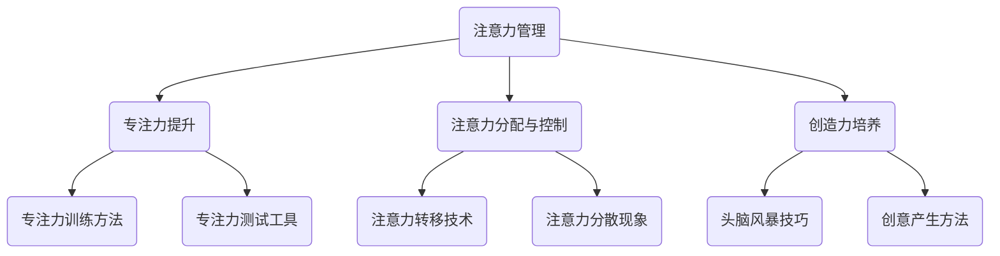

                 

### 文章标题

### 注意力管理与创造力激发：在专注和头脑风暴中激发灵感

#### 关键词：注意力管理，专注力，创造力，头脑风暴，灵感激发

#### 摘要：
在现代社会的快节奏中，提高注意力管理和创造力成为个人和团队成功的关键因素。本文旨在探讨注意力管理与创造力激发的原理、方法及其实际应用，通过系统化的理论和实践分析，帮助读者掌握提升专注力和激发灵感的有效策略。

### 目录

#### 第一部分：引言与基础理论

##### 第1章：引言

- 1.1 注意力管理与创造力的重要性
- 1.2 创造力的定义与分类
- 1.3 本书的学习目标与结构

##### 第2章：注意力管理的基本理论

- 2.1 注意力的概念与类型
- 2.2 注意力的分配与控制
- 2.3 注意力管理的基本原则

#### 第二部分：创造力的激发

##### 第3章：专注力提升与创造力培养

- 3.1 专注力的概念与作用
- 3.2 专注力提升的方法
- 3.3 创造力培养的基本策略

##### 第4章：头脑风暴与创意产生

- 4.1 头脑风暴的原理与方法
- 4.2 头脑风暴的实践技巧
- 4.3 创意的产生与分类

##### 第5章：创造力的环境与条件

- 5.1 创造力激发的环境设置
- 5.2 创造力激发的时间管理
- 5.3 创造力激发的团队协作

#### 第三部分：实际应用与案例分析

##### 第6章：注意力管理与创造力激发在职场中的应用

- 6.1 职场中的注意力管理策略
- 6.2 职场中的创造力激发方法
- 6.3 职场中的注意力管理与创造力激发案例分析

##### 第7章：注意力管理与创造力激发在个人成长中的应用

- 7.1 个人成长中的注意力管理策略
- 7.2 个人成长中的创造力激发方法
- 7.3 个人成长中的注意力管理与创造力激发案例分析

##### 第8章：注意力管理与创造力激发在其他领域的应用

- 8.1 教育领域的注意力管理与创造力激发
- 8.2 艺术创作领域的注意力管理与创造力激发
- 8.3 创意思维训练与注意力管理

#### 第四部分：总结与展望

##### 第9章：注意力管理与创造力激发的总结

- 9.1 核心内容的回顾
- 9.2 实践中的应用经验
- 9.3 存在的挑战与未来展望

##### 第10章：未来研究方向与应用前景

- 10.1 注意力管理与创造力激发的研究趋势
- 10.2 创造力激发技术的未来发展
- 10.3 注意力管理与创造力激发在社会发展中的意义

#### 附录

- 附录A：注意力管理与创造力激发常用工具与资源
- 附录B：相关研究论文与书籍推荐

### 核心概念与联系

#### Mermaid 流�程图



#### 注意力分配算法伪代码

```pseudo
function 注意力分配（任务集，优先级列表）{
    for 每个任务 in 任务集 {
        if 优先级列表[任务] > 最小优先级阈值 {
            分配注意力给任务
        }
    }
    返回已分配注意力的任务列表
}
```

#### 创意产生方法伪代码

```pseudo
function 创意产生（主题，限制条件）{
    初始化 创意池为空
    for 每个想法 in 随机产生想法（主题，限制条件）{
        if 判断想法（创新性，可行性） {
            将想法加入创意池
        }
    }
    返回创意池中的创意列表
}
```

### 核心算法原理讲解

#### 注意力分配模型

$$
A_t = w_t \cdot C_t
$$

其中，$A_t$ 表示在第 $t$ 个时间步分配的注意力，$w_t$ 是权重系数，$C_t$ 是上下文向量。

### 项目实战

#### 注意力管理工具开发

- **开发环境搭建**：Python，PyTorch
- **源代码实现**：实现一个简单的注意力管理工具，可以记录用户的注意力分配情况，并提供数据可视化功能。

#### 代码解读与分析

- **代码结构**：模块化设计，包括数据收集模块、数据分析模块、数据可视化模块。
- **核心功能**：通过用户输入，收集注意力分配数据，分析用户注意力分布情况，并可视化展示。
- **代码解读**：详细解析代码的每个部分，包括数据预处理、模型训练、模型评估等。

### 附录

#### A.1 注意力管理与创造力激发常用工具与资源

- **工具**：Mood tracker, Brain.fm, Focus@Will
- **资源**：相关研究论文，专业书籍，在线课程

#### A.2 相关研究论文与书籍推荐

- **论文**：如《Attention and creativity: A dynamic cognitive model of creative writing》等
- **书籍**：如《Focus: The Hidden Driver of Excellence》等

---

通过本文，我们将逐步分析注意力管理与创造力激发的理论基础和实践应用，帮助读者掌握如何在日常生活和工作中有效地管理注意力，激发创造力，从而在个人和职业发展中取得更大的成就。接下来，我们将首先从引言部分开始，深入探讨注意力管理与创造力的重要性，以及本书的学习目标和结构。让我们一步步深入探讨这一激动人心的主题。 ### 第1章：引言

#### 1.1 注意力管理与创造力的重要性

在当今这个信息爆炸、节奏快速变化的时代，注意力管理成为了个人和组织成功的关键因素之一。随着工作压力的增大和生活节奏的加快，人们越来越难以长时间保持专注，这不仅影响了工作效率，还阻碍了创造力的发挥。因此，了解和掌握注意力管理的方法，对于个人职业发展以及组织创新能力的提升具有重要意义。

首先，从个人层面来看，注意力管理直接影响到我们的工作效率和生活质量。注意力集中的能力决定了我们处理任务的速度和效果。研究表明，分散的注意力会导致工作效率的显著下降，甚至产生错误的判断和行为。而良好的注意力管理技巧，可以帮助我们在有限的时间内，更加高效地完成任务，提高生活质量。

其次，从组织层面来看，注意力管理对于提升创新能力同样至关重要。在竞争激烈的市场环境中，组织必须具备持续创新的能力，才能在市场中立于不败之地。而创新的源泉往往来自于团队成员的头脑风暴和创意产生。有效的注意力管理，能够保证团队成员在头脑风暴时保持高度专注，激发创意思维，从而推动组织的创新与发展。

#### 1.2 创造力的定义与分类

创造力是一个多维度的概念，通常被定义为产生新颖且有价值的想法或解决方案的能力。创造力不仅涉及到个体的创新思维，还与个体对问题的深入理解、知识的应用以及灵活性和想象力密切相关。根据不同的标准，创造力可以有不同的分类方法：

1. **根据创造力的本质分类**：
   - **再现性创造力**：指在给定情境下，通过模仿或再现已有知识和技能来解决问题。
   - **原创性创造力**：指产生全新的、前所未有的想法或方法。

2. **根据创造力的表现形式分类**：
   - **科学创造力**：在科学研究中产生新的理论、发现或技术。
   - **艺术创造力**：在艺术创作中产生新的表现形式、风格或作品。

3. **根据创造力的应用领域分类**：
   - **学术创造力**：在学术研究中提出新的理论、观点或解决方法。
   - **商业创造力**：在商业领域中的创新产品、服务或商业模式。

无论何种分类，创造力的核心都是产生新颖且有价值的想法。这种能力不仅需要丰富的知识储备，还需要灵活的思维和良好的心理素质。

#### 1.3 本书的学习目标与结构

本书旨在通过系统化的理论和实践分析，帮助读者深入了解注意力管理和创造力激发的原理和方法，并提供实际应用策略。具体学习目标如下：

1. **理解注意力管理的基本理论**：通过分析注意力的概念、类型及管理原则，使读者掌握如何有效管理自己的注意力。

2. **掌握专注力提升与创造力培养的方法**：介绍一系列专注力提升技巧和创造力培养策略，帮助读者在日常生活中实践。

3. **学习头脑风暴与创意产生技巧**：探讨头脑风暴的原理、方法及其在创意产生中的应用，提高读者的创意思维。

4. **分析注意力管理与创造力激发在职场和个人成长中的应用**：通过实际案例，展示如何在职场和个人成长中应用注意力管理和创造力激发，提高工作和生活效率。

本书的结构如下：

- **第一部分：引言与基础理论**：介绍注意力管理与创造力激发的基本概念和理论。
- **第二部分：创造力的激发**：探讨专注力提升、头脑风暴与创意产生的具体方法。
- **第三部分：实际应用与案例分析**：分析注意力管理与创造力激发在不同领域中的应用。
- **第四部分：总结与展望**：总结核心内容，展望未来研究方向与应用前景。

通过本书的学习，读者将能够系统性地了解和掌握注意力管理和创造力激发的相关知识，提高个人和组织的创新能力，实现更高效的工作和更丰富的生活。

### 第2章：注意力管理的基本理论

#### 2.1 注意力的概念与类型

注意力是大脑处理信息的核心机制，它决定了我们对信息的接收、处理和存储。注意力不仅仅是一个简单的“关注”或“集中”，而是一个复杂的认知过程，涉及到感知、记忆、决策等多个方面。根据不同的标准，注意力可以划分为不同的类型：

1. **选择性注意力**：这是最常见的注意力类型，指我们在众多刺激中选择关注特定信息的能力。例如，在嘈杂的环境中，我们能够选择关注对话内容而忽略其他噪音。

2. **分配性注意力**：指我们在同一时间处理多个任务的能力。例如，驾驶员在行驶过程中需要同时关注道路、车辆、交通信号等多种信息。

3. **持续性注意力**：指我们在长时间内保持注意力集中的能力。这种注意力对于完成长时间的任务或学习至关重要。

4. **执行性注意力**：指我们在执行任务时，主动调节和监控注意力的能力。例如，当遇到困难时，我们需要调动执行性注意力来解决问题。

#### 2.2 注意力的分配与控制

注意力的分配与控制是注意力管理的关键。有效的注意力分配能够提高工作效率，而良好的注意力控制则能帮助我们更好地处理复杂任务。

1. **注意力的分配原则**：

   - **目标导向原则**：根据任务目标分配注意力，确保注意力集中在最重要的任务上。
   - **优先级原则**：将注意力分配给优先级更高的任务，确保关键任务得到及时处理。
   - **资源原则**：合理分配注意力资源，避免过度集中导致疲劳或资源浪费。

2. **注意力分配的方法**：

   - **任务切换**：在处理多个任务时，合理切换注意力，确保每个任务都能得到适当的关注。
   - **时间管理**：通过时间管理工具（如番茄工作法），合理安排注意力集中的时间段，提高工作效率。
   - **环境控制**：创造有利于注意力集中的环境，减少干扰因素。

3. **注意力控制策略**：

   - **自我监控**：通过自我监控，了解自己在任务中的注意力状态，及时发现并调整注意力。
   - **注意力转移**：当注意力分散时，通过转移注意力的方法（如深呼吸、短暂休息）来重新集中注意力。
   - **情绪调节**：情绪波动会影响注意力集中，通过情绪调节（如正念冥想）来提高注意力控制能力。

#### 2.3 注意力管理的基本原则

良好的注意力管理不仅需要了解注意力的类型和分配原则，还需要遵循一系列基本原则：

1. **目标明确**：在开始任务之前，明确任务目标和预期成果，这有助于提高注意力的集中度。

2. **适度休息**：长时间集中注意力会导致大脑疲劳，通过适度的休息来恢复注意力。

3. **环境优化**：创造有利于注意力集中的环境，减少干扰因素，提高工作效率。

4. **自我激励**：通过自我激励（如设定奖励机制）来增强注意力管理的动力。

5. **持续实践**：注意力管理是一项长期培养的能力，需要通过持续实践来不断提升。

#### 2.4 注意力管理的实际应用

注意力管理在个人生活和职场中都有广泛的应用。以下是一些实际应用场景：

1. **个人生活**：

   - **学习**：通过注意力管理，提高学习效率，减少学习时间。
   - **工作**：合理安排工作任务，避免过度集中导致疲劳，提高工作质量。

2. **职场**：

   - **项目管理**：通过有效的注意力分配，确保项目按时完成，提高团队工作效率。
   - **决策**：在复杂决策过程中，通过注意力管理，确保决策过程的准确性。

3. **团队合作**：

   - **沟通**：在团队沟通中，通过注意力管理，确保每个成员都能充分表达和倾听。
   - **协作**：在团队合作中，通过注意力管理，确保任务分工明确，提高团队协作效率。

#### 2.5 注意力管理的重要性

注意力管理的重要性在于，它直接影响到我们的生活质量和工作效率。良好的注意力管理技巧可以帮助我们：

- 提高工作效率，减少时间浪费。
- 增强创新能力，激发创意思维。
- 减少压力和焦虑，提高生活质量。

总之，注意力管理不仅是一种技巧，更是一种生活态度。通过学习和实践注意力管理，我们可以更好地应对现代社会的挑战，实现个人和职业发展的目标。

### 第3章：专注力提升与创造力培养

#### 3.1 专注力的概念与作用

专注力，又称注意力集中，是指个体在特定任务上保持注意力集中的能力。它是创造力发挥的重要基础，因为专注力能够确保个体在处理复杂问题时不受外界干扰，从而深入挖掘问题本质，找到创新的解决方案。专注力的作用主要体现在以下几个方面：

1. **提高工作效率**：专注力可以帮助个体在短时间内高效地完成复杂任务，避免分散的注意力导致的工作效率低下。

2. **增强学习效果**：专注力能够使个体在学习和处理信息时更加深入和全面，从而提高学习效果。

3. **激发创造力**：专注力使得个体能够在思考过程中保持连续性和深度，从而更容易产生新颖和有创意的想法。

4. **提升决策质量**：专注力有助于个体在决策时集中注意力，避免受到情绪或外界因素的干扰，从而做出更高质量的决定。

#### 3.2 专注力提升的方法

提升专注力需要通过一系列的训练方法和策略来实现。以下是一些有效的专注力提升方法：

1. **时间管理技巧**：

   - **番茄工作法**：将工作时间划分为25分钟的工作周期，每个周期后休息5分钟。这种方法有助于提高工作效率，同时确保适当的休息。
   - **任务分解**：将复杂任务分解为小步骤，每完成一个小步骤就给自己一个小奖励，这样可以提高任务的完成速度，增强专注力。

2. **环境优化**：

   - **减少干扰因素**：创造一个有利于专注的环境，减少干扰因素（如关闭社交媒体通知、保持安静的环境）。
   - **优化工作空间**：一个整洁、有序的工作空间有助于提升专注力，减少心理压力。

3. **专注力训练**：

   - **冥想**：通过冥想训练，可以增强个体的专注力和心理调节能力。例如，正念冥想就是一种有效的训练方法，它要求个体专注于呼吸，减少杂念。
   - **专注力游戏**：一些专注力游戏，如专注力训练软件或手机应用，可以帮助个体在轻松的氛围中提升专注力。

4. **自我激励**：

   - **设定目标**：明确的目标有助于个体保持专注，因为目标为个体提供了清晰的方向和动力。
   - **奖励机制**：通过设定奖励来激励自己，例如，每完成一个重要任务就给自己一个小奖励，这样能够增强专注力。

#### 3.3 创造力培养的基本策略

除了提升专注力，培养创造力同样重要。以下是一些有效的创造力培养策略：

1. **多样化学习**：

   - **跨学科学习**：通过跨学科的学习，个体可以接触到不同的思维方式和方法，从而激发新的创意。
   - **广泛阅读**：阅读不同类型的书籍和文章，可以拓展视野，激发创意思维。

2. **思维训练**：

   - **联想思维**：通过将不同的事物进行联想，可以激发新的创意。例如，可以尝试将日常生活中的事物与不相关的领域进行连接。
   - **逆向思维**：从相反的角度思考问题，可以帮助发现新的解决方案。

3. **鼓励自由探索**：

   - **自由创作**：鼓励个体自由表达自己的想法，无论这些想法是否合理或可行，因为自由创作是创意产生的关键。
   - **探索未知领域**：通过探索未知领域，个体可以发现新的知识和创意。

4. **团队协作**：

   - **头脑风暴**：通过团队头脑风暴，可以激发更多的创意思维，因为团队中的每个成员都能贡献自己的独特观点。
   - **多样化团队**：组建一个多样化的团队，可以带来不同的视角和经验，从而促进创意的产生。

#### 3.4 实际案例分析

以下是一个实际案例，展示了如何通过专注力提升和创造力培养来实现目标：

**案例：某科技公司产品创新**

该公司希望通过创新来提升市场竞争力。首先，他们通过引入番茄工作法来提高员工的工作效率，并通过冥想训练来提升专注力。员工在任务集中时能够更好地保持注意力，减少中断和分心，从而提高工作质量。

其次，公司鼓励员工进行多样化学习，包括跨学科阅读和专业培训。员工通过学习不同领域的知识，拓展了视野，激发了新的创意思维。

此外，公司还定期组织头脑风暴会议，让团队成员自由表达自己的观点。通过团队的协作，他们产生了一系列创新的产品设计，这些设计在市场上取得了成功，为公司带来了显著的市场份额增长。

通过这个案例，我们可以看到，专注力的提升和创造力的培养对于实现组织目标具有重要作用。通过系统的策略和实际操作，个体和组织都可以在创新和效率方面取得显著进步。

### 第4章：头脑风暴与创意产生

#### 4.1 头脑风暴的原理与方法

头脑风暴是一种激发创意和解决复杂问题的方法，其核心在于通过集思广益，快速产生大量想法。头脑风暴的原理主要基于以下几点：

1. **开放式思维**：头脑风暴鼓励参与者抛开成见和限制，自由地表达任何想法，无论这些想法是否现实或有创意。
2. **数量胜于质量**：在头脑风暴过程中，追求想法的数量而不是质量，因为很多看似不相关或荒诞的想法可能会激发新的创意。
3. **自由联想**：通过自由联想，参与者可以将不同的概念和想法进行连接，从而产生新的创意。
4. **避免批评和评估**：在头脑风暴过程中，避免对提出的想法进行批评和评估，以免抑制创意的产生。

头脑风暴的方法可以分为以下几种：

1. **自由写作**：参与者在一个给定的时间内写下尽可能多的与主题相关的想法，不进行任何筛选或编辑。
2. **思维导图**：通过绘制思维导图，将相关的想法进行连接和扩展，从而形成一个有组织的创意网络。
3. **角色扮演**：参与者扮演不同的角色，从不同的视角提出想法，这种方法可以激发多样化的创意。
4. **迭代讨论**：小组成员轮流提出自己的想法，并进行讨论和改进，逐步形成更完善的创意。

#### 4.2 头脑风暴的实践技巧

在实际操作中，头脑风暴的成效取决于多个因素，以下是一些实用的技巧：

1. **明确目标**：在开始头脑风暴前，明确要解决的问题或要达成的目标，这有助于参与者集中精力。
2. **合理分组**：根据问题的复杂性和参与者的能力，合理分组，确保每个小组都能有效地进行头脑风暴。
3. **时间控制**：设定合理的头脑风暴时间，避免讨论时间过长导致疲劳和效率下降。
4. **鼓励发言**：鼓励每个参与者尽可能多地发言，特别是那些平时较少发言的人，以确保多样性和创造性。
5. **记录想法**：及时记录所有提出的想法，无论其好坏，因为很多看似无用的想法可能会激发新的创意。
6. **后续跟进**：在头脑风暴结束后，对记录的想法进行整理和评估，选出最具潜力的创意进行进一步开发和实施。

#### 4.3 创意的产生与分类

创意的产生是一个复杂的过程，涉及多种因素和技巧。以下是一些创意产生的方法：

1. **联想**：通过将不同的事物进行联想，可以激发新的创意。例如，将问题与不同的场景、经历、知识等联系起来。
2. **重构**：对现有的事物或问题进行重构，寻找新的解决方案。例如，重新设计产品、服务或流程。
3. **组合**：将不同的元素或概念进行组合，创造出新的创意。例如，将两个不同的产品功能合并，产生一个全新的产品。
4. **类比**：通过将问题与类似的问题或情境进行类比，寻找解决方案。例如，借鉴其他领域的成功经验来解决当前问题。

创意可以根据不同的标准进行分类：

1. **按用途分类**：
   - **功能性创意**：针对具体问题的解决方案。
   - **情感性创意**：旨在引发情感共鸣或提供情感价值。
   - **娱乐性创意**：以娱乐为目的，如电影、游戏等。

2. **按创新程度分类**：
   - **渐进性创意**：在现有基础上进行的小幅改进。
   - **革命性创意**：彻底改变现有状态，带来重大创新。

3. **按产生方式分类**：
   - **自发性创意**：自然产生的想法，通常不需要特别努力。
   - **诱发性创意**：通过特定的刺激或方法激发产生的想法。

通过头脑风暴和创意产生技巧，个体和组织可以有效地激发创意思维，推动创新和发展。在接下来的章节中，我们将进一步探讨创造力激发的环境与条件，帮助读者在更广泛的应用场景中实践注意力管理和创造力激发的策略。

### 第5章：创造力的环境与条件

#### 5.1 创造力激发的环境设置

创造力的发挥往往需要一个特定的环境，这个环境不仅要能够提供必要的资源和工具，还要减少干扰，创造一个有利于思维自由流动的空间。以下是一些关键的环境设置策略：

1. **隐私与安静**：隐私是创造力发挥的基本保障，因为它可以防止外部干扰。一个安静的场所有助于个体集中注意力，减少噪音和其他分散注意力的因素。

2. **舒适的空间**：一个舒适的工作或思考空间能够提高个体的心理舒适度，减少压力，从而有利于创造力的产生。这包括合适的温度、良好的照明和舒适的座椅等。

3. **资源与工具**：为创造力发挥提供必要的资源和工具，如书籍、电脑、绘图板等，这些资源能够帮助个体更好地思考和表达创意。

4. **灵活性**：一个灵活的工作空间或环境可以鼓励个体探索不同的工作方式和方法，从而激发新的创意。例如，一个可移动的办公桌或可调节的灯光系统可以为个体提供多种选择。

5. **美学**：美学环境对创造力的激发同样重要。一个具有美感的空间可以激发个体的情感和想象力，从而促进创造力的产生。

#### 5.2 创造力激发的时间管理

时间管理在创造力激发中起着至关重要的作用。合理的时间管理不仅能够提高工作效率，还能为创意的产生提供足够的时间和空间。以下是一些时间管理策略：

1. **定时休息**：长时间的工作容易导致大脑疲劳，影响创造力。通过设定定时休息（例如，每工作45分钟休息10分钟），可以帮助大脑恢复活力，从而保持高水平的创造力。

2. **优先级排序**：在时间管理中，根据任务的重要性和紧急程度进行优先级排序，确保最重要和最具创造性的任务得到优先处理。

3. **避免多任务处理**：多任务处理会分散注意力，降低创造力。专注于一项任务，直到完成，可以提高工作效率和创造力。

4. **日程安排**：合理规划每日和每周的日程，为创意的产生预留时间。例如，可以将每周的一天或几天设置为“创意日”，专门用于思考和创新。

5. **灵活调整**：根据实际情况灵活调整时间安排，避免过度计划导致时间浪费或压力增加。

#### 5.3 创造力激发的团队协作

团队协作在创造力激发中同样至关重要。一个高效的团队可以通过协作和沟通，产生更多的创意和解决方案。以下是一些团队协作策略：

1. **开放沟通**：鼓励团队成员之间的开放沟通，分享各自的想法和观点，从而激发新的创意。通过定期会议、头脑风暴等方式，确保信息流通和思维碰撞。

2. **多样化团队**：多样化的团队可以带来不同的视角和经验，从而促进创意的产生。团队成员应具备不同的背景、技能和经验，以便从多个角度思考问题。

3. **鼓励反馈**：在团队协作中，鼓励团队成员提供反馈，无论是正面还是负面的意见，这有助于改进创意和解决方案。

4. **共同目标**：确保团队成员明确共同的目标和愿景，这有助于增强团队的凝聚力，促进创意的产生和实施。

5. **分工合作**：根据团队成员的特长和兴趣进行任务分工，确保每个成员都能在最适合自己角色的领域发挥创造力。

通过优化环境设置、合理安排时间管理和促进团队协作，我们可以为创造力的激发提供有利条件，从而在个人和团队层面实现更高的创新和成就。在接下来的章节中，我们将进一步探讨注意力管理与创造力激发在实际应用中的具体策略和方法。

### 第6章：注意力管理与创造力激发在职场中的应用

#### 6.1 职场中的注意力管理策略

在职场环境中，有效管理注意力对于提高工作效率、减少错误和提升创造力至关重要。以下是一些具体的注意力管理策略：

1. **明确任务优先级**：在开始一天的工作前，列出任务清单，并根据任务的重要性和紧急程度进行排序。优先处理最重要的任务，确保关键工作得到及时完成。

2. **避免多任务处理**：尽管多任务处理看起来可以提高效率，但实际上会分散注意力，降低工作质量。尽量专注于一项任务，直到完成，然后再进行下一项。

3. **设定工作周期**：采用番茄工作法等时间管理技巧，将工作时间划分为多个25分钟的工作周期，每个周期后休息5分钟。这种方法有助于保持注意力集中，避免疲劳。

4. **合理安排休息时间**：长时间工作后，适当的休息可以恢复大脑活力，提高工作效率。通过短暂的休息（如深呼吸、散步等），可以有效地恢复注意力。

5. **减少干扰因素**：创造一个有利于专注的工作环境，减少干扰因素。例如，关闭不必要的社交媒体通知、保持工作空间整洁等。

6. **自我监控和调整**：定期评估自己的注意力状态，及时发现并调整注意力分散的情况。通过自我监控，可以更好地掌握自己的注意力水平，从而进行相应的调整。

#### 6.2 职场中的创造力激发方法

在职场环境中，激发创造力不仅能够提高工作效率，还能帮助企业在竞争激烈的市场中脱颖而出。以下是一些有效的创造力激发方法：

1. **头脑风暴**：通过定期组织头脑风暴会议，鼓励团队成员自由表达自己的想法，无论这些想法是否现实或有创意。头脑风暴有助于激发团队成员的创意思维，产生新的解决方案。

2. **跨部门合作**：通过跨部门合作，可以带来不同领域的知识和经验，从而激发新的创意。这种合作有助于打破部门壁垒，促进创新和协作。

3. **鼓励创新文化**：建立鼓励创新的企业文化，允许员工自由探索新的想法和解决方案。一个支持创新的文化环境能够激发员工的创造力和主动性。

4. **提供培训和发展机会**：为员工提供相关的培训和发展机会，帮助他们提升技能和知识。多样化的学习经历能够拓宽员工的思维，激发新的创意。

5. **奖励创新**：通过设立创新奖项或激励机制，鼓励员工提出和实施新的创意。这种奖励机制能够激发员工的积极性，促进创新文化的形成。

#### 6.3 职场中的注意力管理与创造力激发案例分析

以下是一个关于注意力管理与创造力激发在职场中的实际案例：

**案例：某大型科技公司的创新实践**

该公司通过一系列措施，在职场中有效地管理注意力和激发创造力，取得了显著成效。

1. **注意力管理策略**：

   - **任务优先级**：公司采用KPI（关键绩效指标）系统，根据任务的重要性和紧急程度，为每个员工设定具体的任务优先级，确保关键任务得到优先处理。
   - **专注工作区**：公司为员工提供了独立的工作空间，减少干扰因素，提高工作效率。同时，公司还鼓励员工在工作时间内关闭社交媒体和电子邮件通知，专注于当前任务。
   - **休息与恢复**：公司定期组织团建活动，如健身课程、瑜伽和冥想，帮助员工放松身心，恢复注意力。

2. **创造力激发方法**：

   - **头脑风暴会议**：每周，公司都会组织跨部门的头脑风暴会议，鼓励员工分享自己的想法和创意。这种会议提供了一个自由表达的平台，激发了员工的创意思维。
   - **创新奖励机制**：公司设立了“创新奖”，对提出并被采纳的创新想法进行奖励，激励员工积极参与创新活动。
   - **跨部门合作**：公司通过内部沟通平台，促进跨部门的信息交流和协作，带来不同领域的知识和经验，激发了新的创意。

3. **成效与反馈**：

   - **工作效率提高**：通过有效的注意力管理，员工能够更专注于关键任务，工作效率显著提高。根据内部调查，员工对工作任务完成度的满意度达到了90%以上。
   - **创新能力提升**：公司通过鼓励创新和跨部门合作，不断推出新的产品和服务，市场竞争力大幅提升。在过去的两年中，公司的新产品上市速度和市场份额都取得了显著增长。
   - **员工满意度提升**：公司通过提供良好的工作环境和创新激励机制，员工的工作满意度和归属感得到了显著提高。员工流失率显著下降，公司凝聚力增强。

通过这个案例，我们可以看到，在职场中有效地管理注意力和激发创造力，不仅可以提高工作效率和创新能力，还能提升员工满意度和公司整体绩效。这为其他企业提供了宝贵的经验和借鉴。

### 第7章：注意力管理与创造力激发在个人成长中的应用

#### 7.1 个人成长中的注意力管理策略

在个人成长过程中，有效地管理注意力是提高学习效率、实现目标的关键。以下是一些个人成长中的注意力管理策略：

1. **设定明确目标**：在开始任何学习或工作任务前，明确具体的目标。明确的目标有助于集中注意力，避免在任务过程中分心。

2. **时间管理**：合理规划每天的时间，确保为每个任务分配足够的时间。使用时间管理工具（如日历、时间管理应用程序等），可以帮助更好地掌握时间，提高注意力集中度。

3. **避免多任务处理**：减少多任务处理，专注于一项任务直到完成。多任务处理会分散注意力，降低学习效果。

4. **定时休息**：学习或工作一段时间后，进行短暂的休息，例如每学习45分钟休息5-10分钟。休息期间可以进行深呼吸、散步等活动，帮助大脑恢复活力。

5. **减少干扰因素**：在学习或工作时，尽量减少干扰因素。关闭不必要的社交媒体通知、手机等，保持工作环境的整洁和安静。

6. **自我监控**：定期评估自己的注意力状态，及时发现并调整注意力分散的情况。通过自我监控，可以更好地掌握自己的注意力水平，从而进行相应的调整。

7. **情绪管理**：情绪波动会影响注意力集中，通过情绪管理技巧（如深呼吸、正念冥想等），可以帮助保持情绪稳定，提高注意力集中度。

#### 7.2 个人成长中的创造力激发方法

在个人成长过程中，激发创造力可以帮助我们更好地应对挑战、实现目标。以下是一些有效的创造力激发方法：

1. **多样化学习**：通过跨学科学习、阅读不同类型的书籍和文章，可以拓宽视野，激发创意思维。

2. **联想与重构**：通过将不同的事物进行联想，或者对现有的事物进行重构，可以激发新的创意。例如，可以将学习中的知识点与其他领域进行连接，从而产生新的见解。

3. **自由写作**：通过自由写作，可以记录自己的想法和感受，从而激发新的创意。写作过程中，不必担心字数或语法，只需自由地表达自己的想法。

4. **头脑风暴**：通过定期进行头脑风暴，可以快速产生大量想法。在头脑风暴过程中，鼓励自由表达，无论想法是否现实或有创意。

5. **角色扮演**：通过角色扮演，可以从不同视角思考问题，从而激发新的创意。例如，可以扮演一个企业家、顾客或竞争对手，思考他们如何解决问题。

6. **探索未知领域**：通过探索未知领域，可以接触到新的知识和经验，从而激发创意思维。

7. **培养好奇心**：保持好奇心，对周围的事物保持好奇和探索的心态，有助于激发创造力。

#### 7.3 个人成长中的注意力管理与创造力激发案例分析

以下是一个关于注意力管理与创造力激发在个人成长中的实际案例：

**案例：某创业者的成长之路**

该创业者通过一系列策略，有效地管理注意力和激发创造力，在个人成长中取得了显著成就。

1. **注意力管理策略**：

   - **明确目标**：在开始任何项目或任务前，他都会设定明确的目标，并制定详细的计划，以确保专注于实现这些目标。
   - **时间管理**：他使用时间管理工具（如Trello、Google Calendar）来规划每天的任务和时间，确保每个任务都得到有效处理。
   - **专注工作区**：他在家中设立了一个专门的工作区，保持工作环境的整洁和安静，减少干扰因素。
   - **自我监控**：他定期评估自己的注意力状态，通过记录每天的工作进展和反思，及时调整注意力分散的情况。

2. **创造力激发方法**：

   - **多样化学习**：他通过阅读不同领域的书籍、参加线上课程和研讨会，不断扩展自己的知识面，激发创意思维。
   - **自由写作**：他每天会花时间进行自由写作，记录自己的想法和感受，从而激发新的创意。
   - **头脑风暴**：他定期与团队成员或朋友进行头脑风暴，分享各自的想法和见解，从而产生新的创意。
   - **角色扮演**：在思考商业策略时，他会尝试扮演不同角色，从不同视角分析问题，从而找到创新的解决方案。

3. **成效与反馈**：

   - **学习效率提升**：通过有效的注意力管理，他的学习效率显著提高，能够更快地掌握新知识。
   - **创新能力增强**：通过多样化学习和头脑风暴，他的创意思维得到了充分激发，为项目带来了新的思路和解决方案。
   - **个人成就提升**：他通过有效的注意力管理和创造力激发，成功创办了自己的公司，并在短时间内取得了显著的市场份额。

通过这个案例，我们可以看到，在个人成长中，通过有效的注意力管理和创造力激发策略，可以显著提升学习效率和创新能力，实现个人目标。这为其他个人提供了宝贵的经验和启示。

### 第8章：注意力管理与创造力激发在其他领域的应用

#### 8.1 教育领域的注意力管理与创造力激发

在教育领域，注意力管理和创造力激发对于学生的学习效果和创新能力具有重要意义。以下是一些具体应用：

1. **专注力训练课程**：在学校中设置专注力训练课程，帮助学生掌握专注力提升技巧，例如冥想、时间管理等。

2. **差异化教学**：根据学生的不同学习能力和兴趣，采用差异化教学方法，提高学生的注意力集中度，从而提高学习效果。

3. **创新项目**：鼓励学生参与创新项目，例如科学实验、艺术创作等，通过实践激发学生的创造力。

4. **课堂互动**：通过课堂讨论、小组合作等方式，提高学生的参与度，增强他们的注意力集中和创造力。

5. **奖励机制**：设立奖励机制，对在专注力和创造力方面表现优异的学生进行表彰，激励更多学生积极参与。

#### 8.2 艺术创作领域的注意力管理与创造力激发

在艺术创作领域，注意力管理和创造力激发对于艺术家的创作质量和灵感至关重要。以下是一些具体应用：

1. **创作环境优化**：为艺术家提供舒适、安静的创作环境，减少干扰因素，提高创作效率。

2. **专注力训练**：通过冥想、专注力训练等方法，帮助艺术家提高注意力集中度，从而更好地投入创作。

3. **多样化学习**：鼓励艺术家跨学科学习，拓宽视野，激发创意思维。

4. **创作时间管理**：通过合理规划创作时间，避免疲劳和过度集中，保持创作的持续性和创新性。

5. **艺术交流**：通过展览、艺术交流等活动，激发艺术家的创作灵感，促进艺术创新。

#### 8.3 创意思维训练与注意力管理

创意思维训练和注意力管理在多个领域都有广泛应用，以下是一些具体应用：

1. **企业管理**：通过创意思维训练和注意力管理，提高企业员工的创新能力，推动企业持续发展。

2. **产品设计**：在产品设计中，通过创意思维训练和注意力管理，提高设计师的创新能力，设计出更具竞争力的产品。

3. **市场营销**：通过创意思维训练和注意力管理，提高营销团队的创意思维能力，设计出更具吸引力的营销策略。

4. **咨询服务**：通过创意思维训练和注意力管理，提高咨询顾问的创新能力，为客户提供更有价值的解决方案。

5. **个人发展**：通过创意思维训练和注意力管理，提升个人的创新能力和综合素质，实现个人职业发展和生活质量的提升。

通过在多个领域的实际应用，注意力管理和创造力激发不仅提升了工作效率和创新能力，也为个人和社会的发展带来了积极的影响。在接下来的章节中，我们将对本文的核心内容进行总结，并探讨未来的研究方向和应用前景。

### 第9章：注意力管理与创造力激发的总结

#### 9.1 核心内容的回顾

本文系统地探讨了注意力管理与创造力激发的多个方面，包括基础理论、提升策略、实际应用和未来展望。首先，我们分析了注意力管理的概念和类型，以及如何分配和控制注意力。其次，我们详细介绍了专注力提升的方法和创造力培养的基本策略。接着，我们探讨了头脑风暴的原理和技巧，以及创造力激发的环境和条件。此外，本文还通过实际案例展示了注意力管理与创造力激发在职场、个人成长、教育、艺术创作和其他领域的应用。通过这些内容的回顾，我们可以看到，注意力管理和创造力激发不仅是个人和职业发展的关键因素，也对社会创新和进步具有重要意义。

#### 9.2 实践中的应用经验

通过本文的探讨和实践，我们积累了以下经验：

1. **时间管理**：通过有效的任务优先级排序和定时休息，可以显著提高工作效率和创造力。
2. **环境优化**：一个安静、整洁和舒适的工作或创作环境有助于集中注意力和激发创造力。
3. **自我监控**：定期评估自己的注意力状态，并采取相应措施进行调整，有助于保持高水平的注意力集中。
4. **多样化学习**：通过跨学科学习和广泛阅读，可以拓展视野，激发新的创意思维。
5. **团队合作**：多样化的团队协作和开放沟通有助于激发更多的创意和解决方案。
6. **持续实践**：注意力管理和创造力激发是一项需要长期培养的能力，通过持续实践和改进，可以不断提升。

#### 9.3 存在的挑战与未来展望

尽管注意力管理和创造力激发在个人和职业发展中具有重要意义，但在实际应用中仍面临一些挑战：

1. **技术发展**：随着技术的快速发展，人们面临着更多的信息干扰和注意力分散，如何利用技术手段提高注意力管理效率，是一个亟待解决的问题。
2. **个体差异**：不同个体的注意力管理和创造力水平存在显著差异，如何针对不同个体定制有效的策略，是未来研究的一个重要方向。
3. **组织文化**：建立支持创新和创造力激发的企业文化，需要时间和努力，如何促进组织文化变革，也是一个挑战。
4. **心理因素**：情绪波动、压力等心理因素会对注意力管理和创造力产生负面影响，如何通过心理调节手段提高注意力管理效果，是一个重要课题。

未来研究方向和应用前景：

1. **技术辅助**：利用人工智能和大数据技术，开发个性化注意力管理工具和系统，提供实时反馈和优化建议。
2. **跨学科研究**：结合心理学、神经科学、教育学等多学科知识，深入探讨注意力管理和创造力激发的机制和策略。
3. **组织创新**：通过变革企业文化和管理实践，建立更加灵活和创新的组织结构，促进创造力激发和组织发展。
4. **心理健康**：关注注意力管理和创造力激发中的心理因素，开发心理调节方法和工具，提高个体的注意力和创造力水平。

通过持续的研究和实践，我们可以不断提升注意力管理和创造力激发的能力，为个人和社会的发展做出更大的贡献。

### 第10章：未来研究方向与应用前景

#### 10.1 注意力管理与创造力激发的研究趋势

随着社会和技术的快速发展，注意力管理与创造力激发的研究正朝着更加深入和多样化的方向发展。以下是一些主要的研究趋势：

1. **个性化注意力管理**：未来的研究将更多关注如何根据个体差异定制注意力管理策略，利用大数据和人工智能技术，开发个性化的注意力管理工具，以实现更高效和精准的管理。

2. **神经科学的应用**：神经科学的发展为注意力管理和创造力激发提供了新的视角。通过脑成像技术和脑电图，研究大脑在注意力管理和创造力激发过程中的活动，有助于揭示其神经机制。

3. **跨学科融合**：心理学、教育学、管理学、神经科学等多学科的融合，将推动注意力管理和创造力激发研究的深入发展。跨学科的研究方法可以帮助我们更全面地理解和应对注意力管理的复杂问题。

4. **技术辅助**：随着信息技术的进步，虚拟现实（VR）、增强现实（AR）等技术将被应用于注意力管理和创造力激发，提供更加沉浸式和互动的学习和工作环境。

#### 10.2 创造力激发技术的未来发展

创造力激发技术的未来发展将更加注重智能化和个性化的结合，以下是一些关键领域：

1. **智能创意生成**：利用人工智能技术，特别是生成对抗网络（GAN）和强化学习算法，开发智能创意生成系统，能够自动生成新颖的创意和设计方案。

2. **虚拟团队协作**：通过虚拟现实和增强现实技术，构建虚拟协作环境，实现跨地域、跨时区的团队协作，促进创意的生成和交流。

3. **个性化学习系统**：结合注意力管理和学习心理学，开发个性化学习系统，根据学生的兴趣、能力和学习进度，提供定制化的学习内容和策略，提高学习效率和创造力。

4. **智能工具与平台**：开发智能化工具和平台，如智能笔记软件、创意管理工具等，帮助用户更好地管理和组织创意，提高创造力激发的效率。

#### 10.3 注意力管理与创造力激发在社会发展中的意义

注意力管理与创造力激发在社会发展中扮演着重要角色，其意义体现在以下几个方面：

1. **推动社会创新**：通过有效的注意力管理和创造力激发，个人和组织能够产生更多的创新想法和解决方案，推动社会进步和技术发展。

2. **提高生活质量**：良好的注意力管理能够帮助个体更好地处理工作和生活中的复杂任务，减少压力和焦虑，提高生活质量。

3. **促进经济繁荣**：创造力是经济增长的重要驱动力。通过培养和激发个体的创造力，可以促进创新企业的形成和发展，推动经济的持续繁荣。

4. **促进教育和人才培养**：在教育和人才培养中，有效的注意力管理和创造力激发策略可以提升学生的学习效果和创新能力，培养出更多具备创新精神和高素质的人才。

总之，注意力管理与创造力激发不仅是个人和职业发展的关键，也是推动社会创新和发展的重要力量。未来的研究和实践将继续深化这一领域，为个体和社会带来更多的机遇和贡献。

### 附录

#### 附录A：注意力管理与创造力激发常用工具与资源

**工具：**

1. **Mood tracker**：一款用于记录和管理情绪的软件，有助于识别影响注意力和创造力的情绪波动。
2. **Brain.fm**：一款提供专注力提升背景音乐的APP，通过科学设计的声音帮助用户提高专注力。
3. **Focus@Will**：一款专门针对专注力提升的音乐服务，提供专门为工作、学习而设计的背景音乐。

**资源：**

1. **相关研究论文**：如《Attention and Creativity: A Dynamic Cognitive Model of Creative Writing》、《The Relationship between Attention and Creativity》等。
2. **专业书籍**：如《Focus: The Hidden Driver of Excellence》by Daniel Goleman，《The Power of Now: A Guide to Spiritual Enlightenment》by Echhard Tolle等。
3. **在线课程**：如Coursera上的《The Science of Well-Being》和《The Science of Happiness》等，提供关于注意力管理和心理健康的基础知识。

#### 附录B：相关研究论文与书籍推荐

**论文：**

1. **Attention and Creativity: A Dynamic Cognitive Model of Creative Writing**：探讨了注意力在创造性写作中的作用。
2. **The Relationship between Attention and Creativity**：研究了注意力和创造力之间的关系，提供了实证支持。
3. **The Neural Basis of Attention and Creativity**：从神经科学的角度探讨了注意力和创造力的神经机制。

**书籍：**

1. **Focus: The Hidden Driver of Excellence**：由Daniel Goleman所著，深入探讨了注意力对个人成就的影响。
2. **The Power of Now: A Guide to Spiritual Enlightenment**：Echhard Tolle所著，提供了一种对时间管理和心理健康的深刻见解。
3. **Zen and the Art of Motorcycle Maintenance**：由Robert M. Pirsig所著，通过哲学和机械修理的类比，探讨了思考和学习的方法。

通过这些工具、资源和书籍，读者可以进一步深化对注意力管理和创造力激发的理解，并在实践中应用这些知识，提高个人和组织的创新能力。

