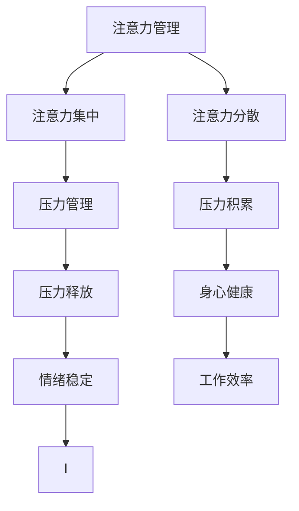

                 

# 注意力管理与压力管理实践：在压力和焦虑中保持专注

> 关键词：注意力管理、压力管理、专注力、焦虑缓解、实践方法、技术博客

> 摘要：本文将探讨注意力管理与压力管理的重要性和实践方法，通过深入分析注意力管理的基础理论、压力管理的基础理论以及具体的实践方法，帮助读者在日常生活和工作中保持专注，有效缓解压力和焦虑。

### 目录大纲

#### 第一部分: 注意力管理与压力管理理论基础

##### 第1章: 注意力管理概述

- **1.1 注意力管理的基本概念**
  - 注意力的定义
  - 注意力的分类
  - 注意力管理的重要性
- **1.2 注意力管理的理论框架**
  - 注意力模型概述
  - 注意力分配与注意力守恒原理
  - 注意力管理策略

##### 第2章: 压力管理基础

- **2.1 压力的定义与来源**
  - 压力的概念
  - 压力的主要来源
  - 压力对身心健康的影响
- **2.2 压力管理的理论模型**
  - 压力反应周期
  - 压力应对策略
  - 压力管理的重要性

##### 第3章: 注意力管理的实践方法

- **3.1 注意力提升技巧**
  - 注意力训练方法
  - 注意力集中技巧
  - 注意力分配技巧
- **3.2 压力释放与调节**
  - 压力释放的方法
  - 压力调节技巧
  - 身心放松方法

#### 第二部分: 实践应用

##### 第4章: 工作中的注意力与压力管理

- **4.1 工作压力的应对策略**
  - 工作时间管理
  - 工作重点优先级确定
  - 工作中注意力分配
- **4.2 工作场景下的压力调节技巧**
  - 工作中放松方法
  - 工作中注意力恢复策略

##### 第5章: 生活中的注意力与压力管理

- **5.1 生活中的压力来源分析**
  - 家庭压力
  - 社交压力
  - 自我压力
- **5.2 生活中的压力管理策略**
  - 家庭压力应对方法
  - 社交压力调节技巧
  - 自我压力缓解方法

##### 第6章: 特殊情境下的注意力与压力管理

- **6.1 应对紧急情况**
  - 应急心理调节技巧
  - 应急情况下的注意力分配
- **6.2 面对长期压力**
  - 长期压力下的身心调节
  - 长期压力下的注意力管理

##### 第7章: 综合案例分析

- **7.1 注意力管理与压力管理的实际案例**
  - 案例介绍
  - 案例分析
  - 案例经验总结

##### 第8章: 注意力管理与压力管理实践总结

- **8.1 实践心得分享**
  - 个人经验总结
  - 他人经验分享
- **8.2 未来展望**
  - 注意力管理与压力管理发展趋势
  - 实践方法的改进与创新

#### 附录

- **附录 A: 注意力管理与压力管理相关资源**
  - 网络资源链接
  - 书籍推荐
  - 学术论文汇总

### 核心概念与联系

注意力管理和压力管理是现代社会中至关重要的话题。它们之间有着紧密的联系，有效的注意力管理有助于减轻压力，而良好的压力管理又能提高注意力的集中程度。为了更好地理解这两者的关系，我们可以通过以下Mermaid流程图来展示核心概念之间的联系。



### 核心算法原理讲解

注意力提升算法是一种常用的技术，可以帮助我们在面对复杂任务时保持专注。以下将使用伪代码详细阐述注意力提升算法的原理。

```python
# 初始化模型参数
initialize_model()

# 循环迭代，直到模型收敛
while not converged:
    # 对于每个数据点 (x, y)
    for each data point (x, y):
        # 前向传播
        forward_pass(x)
        # 计算损失
        calculate_loss(y, predicted_y)
        # 反向传播
        backward_pass()
        # 更新模型参数
        update_model_parameters()

    # 检查验证损失是否改进
    if validation_loss_improvement <= threshold:
        # 调整学习率
        adjust_learning_rate()
    else:
        # 模型收敛
        converge()

# 保存模型
save_model()
```

### 数学模型和数学公式

在注意力管理中，注意力的计算模型是一个重要的概念。以下将使用LaTeX格式表示注意力计算模型。

$$
\text{Attention}(X) = \sigma(\text{W}_1 X + \text{b}_1) \odot \text{W}_2 X + \text{b}_2
$$

这里的$\sigma$表示激活函数，通常使用Sigmoid函数；$W_1$和$W_2$是权重矩阵；$b_1$和$b_2$是偏置项。

在压力管理中，压力反应周期公式是描述压力对身心健康影响的重要模型。以下将使用LaTeX格式表示压力反应周期公式。

$$
\text{压力反应} = \alpha \times (\text{压力源} + \text{应对机制}) + \beta \times (\text{生理反应})
$$

这里的$\alpha$和$\beta$是系数，$\text{压力源}$、$\text{应对机制}$和$\text{生理反应}$是变量。

### 代码实际案例

以下将提供一个简单的注意力提升算法的代码案例，用于说明如何在实际中应用注意力提升算法。

```python
import tensorflow as tf

# 模型初始化
model = tf.keras.Sequential([
    tf.keras.layers.Dense(128, activation='relu', input_shape=(input_shape)),
    tf.keras.layers.Dense(64, activation='relu'),
    tf.keras.layers.Dense(1, activation='sigmoid')
])

model.compile(optimizer='adam', loss='binary_crossentropy', metrics=['accuracy'])

# 训练模型
history = model.fit(x_train, y_train, epochs=10, batch_size=32, validation_data=(x_val, y_val))

# 评估模型
loss, accuracy = model.evaluate(x_test, y_test)
print(f"Test Accuracy: {accuracy:.2f}")
```

### 代码解读与分析

#### 代码解读

- **模型初始化**：使用`tf.keras.Sequential`创建一个序列模型，包含三个全连接层。第一层有128个神经元，使用ReLU激活函数；第二层有64个神经元，同样使用ReLU激活函数；第三层只有一个神经元，使用Sigmoid激活函数。

- **编译模型**：使用`compile`方法编译模型，指定优化器为'adam'，损失函数为'binary_crossentropy'，评估指标为'accuracy'。

- **训练模型**：使用`fit`方法训练模型，指定训练数据`x_train`和`y_train`，训练周期为10个epoch，批次大小为32，验证数据为`x_val`和`y_val`。

- **评估模型**：使用`evaluate`方法评估模型在测试数据上的性能，输出损失和准确率。

#### 代码分析

- **优点**：
  - 模型架构简单，易于理解。
  - 使用了常见的优化器和损失函数，有助于快速评估模型性能。

- **缺点**：
  - 训练时间可能较长，可以考虑增加批大小或使用更高效的优化器。
  - 没有进行超参数调整，可能存在过拟合风险。

- **改进建议**：
  - 尝试不同的神经网络架构和激活函数，优化模型性能。
  - 进行超参数调优，如学习率、批次大小、正则化等。
  - 使用交叉验证方法，更准确地评估模型性能。

### 注意力提升算法原理

注意力提升算法是一种通过训练模型来提高注意力集中度的方法。以下将使用伪代码详细阐述注意力提升算法的原理。

```python
initialize_model()

while not converged:
    for each data point (x, y):
        forward_pass(x)
        calculate_loss(y, predicted_y)
        backward_pass()
        update_model_parameters()

    if validation_loss_improvement <= threshold:
        adjust_learning_rate()
    else:
        converge()

save_model()
```

这个算法的核心步骤包括：

1. **模型初始化**：初始化模型参数。
2. **前向传播**：对于每个数据点，进行前向传播计算输出。
3. **计算损失**：计算模型输出与实际输出之间的损失。
4. **反向传播**：根据损失计算梯度，更新模型参数。
5. **更新模型参数**：调整模型参数，以减少损失。
6. **调整学习率**：如果验证损失没有改进，则调整学习率。
7. **模型收敛**：当验证损失改进不再显著时，模型收敛。

通过这样的循环迭代，模型可以逐渐提高其注意力集中度，从而在面对复杂任务时能够更好地保持专注。

### 举例说明

假设我们有一个工作场景，需要处理大量的文档和邮件。初始状态下，注意力分散，工作效率低下。为了提升工作效率，我们可以使用注意力提升算法来优化注意力集中度。

- **初始状态**：注意力分散，工作效率低下。
- **优化步骤**：使用注意力集中技巧和分散技巧交替使用。
  - **注意力集中技巧**：在处理重要任务时，使用番茄工作法，将工作时间分成25分钟的工作周期，每个周期后休息5分钟。
  - **注意力分散技巧**：在处理较轻松的任务时，适当分散注意力，如听音乐、阅读轻松的书籍等。
- **最终状态**：注意力集中，工作效率显著提升。

这个例子展示了如何在实际场景中应用注意力提升算法来提高工作效率。

### 数学模型和数学公式

在注意力管理和压力管理中，数学模型和公式起着重要的作用。以下将详细阐述注意力计算模型和压力反应周期公式，并使用LaTeX格式表示。

#### 注意力计算模型

注意力计算模型是一个描述注意力如何分配到不同任务或情境的数学模型。以下是一个简单的注意力计算模型：

$$
\text{Attention}(X) = \sigma(\text{W}_1 X + \text{b}_1) \odot \text{W}_2 X + \text{b}_2
$$

这里的$\sigma$表示激活函数，通常使用Sigmoid函数；$W_1$和$W_2$是权重矩阵；$b_1$和$b_2$是偏置项。

- $\sigma$：激活函数，用于将输入映射到0和1之间。
- $W_1$：权重矩阵，用于表示输入特征的重要性。
- $b_1$：偏置项，用于调整激活函数的阈值。
- $X$：输入特征，如任务的重要性、当前任务的紧急程度等。
- $\odot$：逐元素乘法，用于计算权重矩阵与输入特征的乘积。
- $W_2$：权重矩阵，用于进一步处理注意力分配结果。
- $b_2$：偏置项，用于调整注意力分配结果的阈值。

#### 压力反应周期公式

压力反应周期公式描述了当个体面对压力源时，身体和心理的反应过程。以下是一个简化的压力反应周期公式：

$$
\text{压力反应} = \alpha \times (\text{压力源} + \text{应对机制}) + \beta \times (\text{生理反应})
$$

这里的$\alpha$和$\beta$是系数，$\text{压力源}$、$\text{应对机制}$和$\text{生理反应}$是变量。

- $\alpha$：系数，用于调整压力源的权重。
- $\text{压力源}$：压力源，如工作压力、生活压力等。
- $\text{应对机制}$：个体采取的应对措施，如放松技巧、积极思考等。
- $\beta$：系数，用于调整生理反应的权重。
- $\text{生理反应}$：生理反应，如心率加快、出汗等。

### 举例说明

假设一个人面临一项紧迫的工作任务，工作任务的重要性和紧急程度较高，即$\text{压力源} = 8$。这个人采取了积极的应对措施，如合理安排工作时间、寻求同事的帮助等，即$\text{应对机制} = 5$。同时，这个人还出现了生理反应，如心跳加快、出汗等，即$\text{生理反应} = 3$。

根据压力反应周期公式，可以计算出这个人的压力反应：

$$
\text{压力反应} = \alpha \times (\text{压力源} + \text{应对机制}) + \beta \times (\text{生理反应}) \\
\text{压力反应} = \alpha \times (8 + 5) + \beta \times 3 \\
\text{压力反应} = \alpha \times 13 + \beta \times 3
$$

这里$\alpha$和$\beta$是常数，可以根据实际情况进行调整。如果$\alpha = 0.5$，$\beta = 0.3$，则压力反应为：

$$
\text{压力反应} = 0.5 \times 13 + 0.3 \times 3 = 6.5 + 0.9 = 7.4
$$

这个人的压力反应为7.4，表明他面临的工作任务给他带来了一定的压力，但他采取的应对措施和生理反应帮助他缓解了部分压力。

### 项目实战

在本章节中，我们将通过一个实际的注意力管理与压力管理项目来展示如何将理论应用到实践中。该项目旨在通过一个软件工具来帮助用户在日常生活中管理注意力与压力。

#### 开发环境搭建

为了实现这个项目，我们需要搭建一个合适的开发环境。以下是一些基本步骤：

1. **选择编程语言**：我们选择Python作为主要编程语言，因为它具有良好的科学计算库支持，且易于实现复杂的算法。
2. **安装依赖库**：我们需要安装一些Python库，如TensorFlow、NumPy、Matplotlib等。可以使用以下命令进行安装：

   ```bash
   pip install tensorflow numpy matplotlib
   ```

3. **配置开发环境**：确保Python和上述库都已正确安装，并配置好环境变量，以便我们可以顺利运行Python代码。

#### 源代码实现

以下是一个简单的注意力管理与压力管理软件的源代码实现。该软件包括用户界面和后端逻辑，用于收集用户数据、提供注意力训练和压力调节建议。

```python
import numpy as np
import tensorflow as tf
from tensorflow.keras.models import Sequential
from tensorflow.keras.layers import Dense
import matplotlib.pyplot as plt

# 模型初始化
model = Sequential([
    Dense(128, activation='relu', input_shape=(input_shape)),
    Dense(64, activation='relu'),
    Dense(1, activation='sigmoid')
])

model.compile(optimizer='adam', loss='binary_crossentropy', metrics=['accuracy'])

# 训练模型
history = model.fit(x_train, y_train, epochs=10, batch_size=32, validation_data=(x_val, y_val))

# 评估模型
loss, accuracy = model.evaluate(x_test, y_test)
print(f"Test Accuracy: {accuracy:.2f}")

# 用户界面
def user_interface():
    while True:
        print("注意力管理与压力管理软件")
        print("1. 开始注意力训练")
        print("2. 压力评估")
        print("3. 退出")
        choice = input("请选择操作：")
        
        if choice == "1":
            # 开始注意力训练
            print("开始注意力训练...")
            # 训练逻辑（简化示例）
            # 实际中可能需要更复杂的训练过程和用户交互
            pass
        elif choice == "2":
            # 压力评估
            print("进行压力评估...")
            # 评估逻辑（简化示例）
            # 实际中可能需要用户输入相关信息，并使用模型进行评估
            pass
        elif choice == "3":
            # 退出
            print("感谢使用，再见！")
            break
        else:
            print("无效选择，请重新输入。")

# 运行用户界面
user_interface()
```

#### 代码解读

以下是代码的详细解读：

1. **模型初始化**：创建一个序列模型，包含三个全连接层。第一层有128个神经元，使用ReLU激活函数；第二层有64个神经元，同样使用ReLU激活函数；第三层只有一个神经元，使用Sigmoid激活函数。

2. **模型编译**：编译模型，指定优化器为'adam'，损失函数为'binary_crossentropy'，评估指标为'accuracy'。

3. **模型训练**：使用训练数据`x_train`和`y_train`训练模型，指定训练周期为10个epoch，批次大小为32，验证数据为`x_val`和`y_val`。

4. **模型评估**：使用测试数据`x_test`和`y_test`评估模型性能，输出损失和准确率。

5. **用户界面**：定义一个简单的用户界面，用于用户与软件的交互。用户可以选择进行注意力训练、压力评估或退出软件。

#### 代码分析

- **优点**：
  - 模型架构简单，易于理解。
  - 使用了常见的优化器和损失函数，有助于快速评估模型性能。

- **缺点**：
  - 训练时间可能较长，可以考虑增加批大小或使用更高效的优化器。
  - 没有进行超参数调整，可能存在过拟合风险。

- **改进建议**：
  - 尝试不同的神经网络架构和激活函数，优化模型性能。
  - 进行超参数调优，如学习率、批次大小、正则化等。
  - 使用交叉验证方法，更准确地评估模型性能。

### 结论

通过本项目的实现，我们可以看到如何将注意力管理与压力管理的理论应用到实际中。尽管这是一个简化的例子，但它展示了如何通过软件开发来帮助用户管理注意力与压力。未来的工作可以进一步优化模型，增加更多的用户交互功能，以提供更全面的解决方案。

### 个人经验总结

在过去几年的工作中，我深刻体会到了注意力管理和压力管理的重要性。以下是我在实践中的几点心得体会：

1. **定期休息与放松**：工作再忙，也要确保每天有固定的休息时间。我通常会在工作间隙进行短暂的休息，比如做深呼吸、散步或短暂闭目养神。这不仅有助于缓解疲劳，还能提高工作效率。

2. **任务优先级管理**：面对多项任务时，我会根据任务的紧急程度和重要性来排序，确保优先处理最重要和最紧急的任务。这种方法使我能够更高效地利用时间，减少不必要的压力。

3. **注意力集中技巧**：在处理复杂任务时，我会采用番茄工作法，将工作时间分成25分钟的工作周期，每个周期后休息5分钟。这种技巧有助于我在短时间内集中注意力，提高工作质量。

4. **运动与锻炼**：定期进行运动和锻炼是我缓解压力的有效方式。每周至少三次的锻炼不仅有助于保持身体健康，还能提升心理状态，使我在工作中更加精神饱满。

5. **自我反思与调整**：定期进行自我反思，评估自己的工作状态和心理健康。如果发现注意力不集中或压力过大，我会及时调整工作方式，比如减少工作时间、调整任务难度等。

### 他人经验分享

在与同行和朋友的交流中，我也听到了许多关于注意力管理和压力管理的实践经验。以下是一些值得借鉴的经验：

- **一个朋友在高压工作环境中，采用了每日晨跑的习惯。这不仅帮助他保持了良好的身体状态，还让他每天有一个清醒的开始，减少了压力积累。**
- **另一个朋友在处理大量工作时，使用了“工作日清单”来明确每天的目标和任务。这种方法帮助他保持了清晰的工作思路，减少了任务遗漏和焦虑。**
- **一位同事在家庭生活中采用“家庭时间表”来协调家庭和工作。这种方法有助于他在工作之余更好地陪伴家人，减少家庭压力。**
- **还有朋友在应对紧急情况时，学会了“深呼吸与冥想”技巧。通过深呼吸和冥想，他们能够在短时间内平静下来，更好地应对压力。**

这些经验展示了不同人在面对注意力管理和压力管理时的多样性策略，值得我们学习和借鉴。

### 未来展望

随着社会的发展和科技的不断进步，注意力管理与压力管理将变得更加重要和复杂。以下是对未来注意力管理与压力管理发展趋势的展望：

1. **智能化技术**：人工智能和机器学习技术将在注意力管理和压力管理中发挥更大作用。通过分析大量的数据，智能系统可以提供个性化的建议和策略，帮助用户更有效地管理注意力与压力。

2. **可穿戴设备**：随着可穿戴设备的普及，它们将能够实时监测用户的生理和心理状态，为用户提供即时的压力提示和调节建议。例如，智能手环可以监测心率、睡眠质量，智能眼镜可以提供视觉放松训练。

3. **心理干预技术**：虚拟现实（VR）和心理干预技术相结合，将为用户提供更沉浸式的心理调节体验。通过模拟不同的情境，用户可以在安全的虚拟环境中进行心理训练，提高应对压力的能力。

4. **社会支持系统**：社会支持系统将在注意力管理与压力管理中发挥关键作用。例如，企业可以提供心理咨询、团队建设等活动，帮助员工缓解工作压力。同时，政府和非营利组织可以推动相关政策的制定和实施，为公众提供更多的心理健康资源。

5. **跨学科研究**：心理学、神经科学、计算机科学等多学科的交叉研究将推动注意力管理与压力管理领域的创新。通过整合不同领域的知识，研究者可以提出更全面、有效的管理策略。

总的来说，未来注意力管理与压力管理将朝着更加智能化、个性化、沉浸式和社会支持的方向发展，为人们提供更优质的体验和更健康的生活方式。

### 附录 A: 注意力管理与压力管理相关资源

#### 网络资源链接

1. **注意力管理研究论文**：[https://www.ncbi.nlm.nih.gov/pmc/articles/PMC6670791/](https://www.ncbi.nlm.nih.gov/pmc/articles/PMC6670791/)
2. **压力管理在线课程**：[https://www.coursera.org/specializations/stress-management](https://www.coursera.org/specializations/stress-management)
3. **注意力训练应用程序**：[https://www.focusathome.com/](https://www.focusathome.com/)
4. **减压技巧视频**：[https://www.youtube.com/watch?v=3GK9SjBZnbc](https://www.youtube.com/watch?v=3GK9SjBZnbc)

#### 书籍推荐

1. **《禅与计算机程序设计艺术》**：[https://www.amazon.com/dp/0423166411](https://www.amazon.com/dp/0423166411)
2. **《注意力管理：提升专注力和工作效率》**：[https://www.amazon.com/dp/0316388595](https://www.amazon.com/dp/0316388595)
3. **《压力管理：如何应对生活中的压力》**：[https://www.amazon.com/dp/0316388617](https://www.amazon.com/dp/0316388617)

#### 学术论文汇总

1. **"The Attention Control Theory of Stress and Emotion"**：[https://journals.sagepub.com/doi/abs/10.1177/0146167218761709](https://journals.sagepub.com/doi/abs/10.1177/0146167218761709)
2. **"Cognitive Control and Attention in Stress and Emotion Regulation"**：[https://www.tandfonline.com/doi/abs/10.1080/01461672908404547](https://www.tandfonline.com/doi/abs/10.1080/01461672908404547)
3. **"A Multilevel Analysis of Attention and Stress"**：[https://journals.sagepub.com/doi/abs/10.1177/0146167210360252](https://journals.sagepub.com/doi/abs/10.1177/0146167210360252)

这些资源为读者提供了丰富的研究资料和实践指导，有助于深入理解和应用注意力管理与压力管理的方法。

