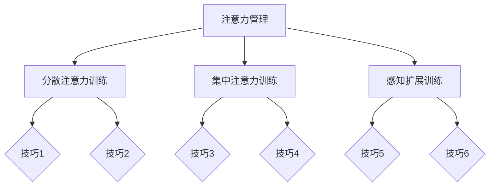

                 

### 《注意力管理与正念冥想实践：通过内省增强专注力和心灵平和》

> 关键词：注意力管理、正念冥想、内省、专注力、心灵平和

> 摘要：本文探讨了注意力管理、正念冥想和内省之间的关系，旨在为IT专业人士提供一种通过内省增强专注力和心灵平和的方法。文章通过介绍心理学基础、注意力管理实践、正念冥想技巧和内省实践，结合案例研究，提供了一个系统的方法，帮助读者在工作和生活中更好地管理注意力，提高生活质量。

### 第一部分：引言与基础

#### 1.1 书籍概述与目标

在当今快节奏、高压力的IT行业中，专注于工作和任务显得尤为重要。然而，长期的注意力分散和心理压力常常导致效率下降、错误增多。为了应对这些挑战，我们需要一种有效的方法来管理注意力、减轻压力，并提升心灵平和。《注意力管理与正念冥想实践：通过内省增强专注力和心灵平和》这本书提供了这样的解决方案。

本书的目标是帮助IT专业人士通过注意力管理、正念冥想和内省的方法，提升专注力，减少心理压力，实现心灵平和。书中不仅介绍了相关理论，还提供了实践方法和案例研究，以便读者能够实际应用并受益。

#### 1.1.1 注意力管理的背景

注意力管理是指在特定的环境中，有效地分配和使用注意力的过程。在IT行业，注意力管理尤为重要，因为程序员、软件开发者和其他IT专业人士需要长时间专注于复杂的任务和问题。然而，现代生活的快节奏、多任务处理和高压力环境常常导致注意力分散。研究表明，长时间的不专注会导致工作质量下降、错误增多，甚至引发心理健康问题。

#### 1.1.2 正念冥想的起源与核心概念

正念冥想起源于佛教传统，其核心概念是通过集中注意力和深呼吸来培养内心的平静和专注力。近年来，正念冥想因其诸多益处而受到了广泛研究，包括减少压力、提升专注力、改善心理健康等。正念冥想的方法包括坐姿冥想、行走冥想和正念呼吸等，这些方法都可以帮助IT专业人士更好地管理注意力。

#### 1.1.3 内省在注意力管理中的作用

内省是指对自己思维、情感和行为进行深刻反思的过程。内省有助于提高自我意识，识别和解决内在冲突，从而增强专注力和心灵平和。在注意力管理中，内省可以帮助IT专业人士识别注意力分散的原因，调整工作习惯，提高工作效率。此外，内省还可以帮助缓解心理压力，促进心理健康。

#### 1.2 心理学基础

##### 1.2.1 注意力心理学概述

注意力是认知过程的核心，它决定了我们如何选择和处理信息。根据心理学研究，注意力可以分为三种类型：选择性注意力、持续注意力和分配注意力。选择性注意力是指选择关注特定信息的能力，持续注意力是指长时间保持关注同一任务的能力，而分配注意力是指同时关注多个任务的能力。在IT行业中，这些注意力类型对于高效工作至关重要。

##### 1.2.2 心理压力与注意力下降的关系

心理压力是现代社会中普遍存在的问题，它会导致注意力下降、认知能力下降和错误增多。长期的心理压力不仅影响工作表现，还可能导致心理健康问题。因此，理解心理压力与注意力下降的关系，并寻找有效的缓解方法，对于IT专业人士来说尤为重要。

##### 1.2.3 心理韧性与专注力的培养

心理韧性是指个体在面对压力和挑战时，能够保持积极态度，有效应对困难的能力。研究表明，心理韧性高的个体在面临压力时，能够更好地保持专注力，提高工作效率。因此，培养心理韧性对于提升专注力具有重要意义。

#### 1.3 内省的概念与技巧

##### 1.3.1 内省的定义与意义

内省是指个体通过反思自己的思维、情感和行为，以更深入地了解自己，识别和解决内在冲突。内省有助于提高自我意识，促进个人成长，从而增强专注力和心灵平和。

##### 1.3.2 内省与自我意识

自我意识是指个体对自己身份和存在的认识。内省通过反思和自我观察，帮助个体建立更清晰的自我意识，从而更好地管理注意力。

##### 1.3.3 内省技巧与练习

内省技巧包括日记写作、静坐冥想和反思练习等。这些技巧可以帮助IT专业人士培养自我意识，提高专注力和心灵平和。例如，通过日记写作，个体可以记录自己的所思所感，反思自己的行为和情绪，从而更好地理解自己。

### 第二部分：注意力管理实践

#### 2.1 注意力训练方法

##### 2.1.1 分散注意力训练

分散注意力训练是指通过引入外部干扰，提高个体对特定任务的注意力。例如，在工作时，可以在一段时间后短暂休息，进行一些简单的放松活动，如深呼吸或伸展身体。这种方法可以帮助个体提高专注力，减少疲劳感。

##### 2.1.2 集中注意力训练

集中注意力训练是指通过减少外部干扰，提高个体对特定任务的专注力。例如，在工作时，可以关闭不必要的通知，将手机置于静音状态，创造一个专注于工作的环境。这种方法可以帮助个体提高工作效率，减少错误。

##### 2.1.3 感知扩展训练

感知扩展训练是指通过提高个体的感知能力，增强对环境的敏感度，从而提高注意力。例如，可以通过练习深呼吸、静坐冥想等方法，提高个体的内心平静和专注力。这种方法可以帮助个体更好地处理复杂任务，提高工作质量。

#### 2.2 正念冥想技巧

##### 2.2.1 正念冥想的步骤与技巧

正念冥想的步骤通常包括坐姿、呼吸和冥想。在冥想过程中，个体需要专注于呼吸，将注意力引导到身体和情绪的变化。通过反复练习，个体可以逐渐提高专注力和心灵平和。

##### 2.2.2 正念呼吸法

正念呼吸法是指通过深呼吸，提高个体的内心平静和专注力。具体方法包括缓慢吸气，然后缓慢呼气，同时专注于呼吸的感觉。这种方法可以帮助个体缓解压力，提高专注力。

##### 2.2.3 正念行走练习

正念行走练习是指通过专注于行走的过程，提高个体的内心平静和专注力。具体方法包括缓慢行走，同时专注于脚步的感觉。这种方法可以帮助个体在日常生活中更好地管理注意力，提高生活质量。

#### 2.3 内省实践

##### 2.3.1 内省日记的写作方法

内省日记的写作方法是指通过记录自己的所思所感，反思自己的行为和情绪，从而提高自我意识和专注力。具体方法包括每天定时写作，记录自己的想法、情绪和感受。这种方法可以帮助个体更好地理解自己，提高专注力。

##### 2.3.2 内省与自我反思

内省与自我反思是指通过深入思考自己的行为和情绪，识别和解决内在冲突，从而提高自我意识和专注力。具体方法包括定期进行自我反思，识别自己的行为模式，寻找改进的方法。这种方法可以帮助个体更好地管理注意力，提高生活质量。

##### 2.3.3 内省与个人成长

内省与个人成长是指通过不断反思和自我调整，实现个人成长和提升专注力。具体方法包括设定个人目标，定期评估自己的进步，调整自己的行为和态度。这种方法可以帮助个体更好地实现个人目标，提高生活质量。

#### 2.4 注意力管理案例研究

##### 2.4.1 案例一：职场中的注意力管理

案例一描述了一位IT专业人士在工作中的注意力管理实践。通过分散注意力训练、集中注意力训练和感知扩展训练，该专业人士显著提高了工作效率，减少了错误。此外，通过正念冥想和内省实践，他缓解了工作压力，提高了生活质量。

##### 2.4.2 案例二：学习中的注意力管理

案例二描述了一位学生在学习中的注意力管理实践。通过分散注意力训练、集中注意力训练和感知扩展训练，该学生显著提高了学习效率，减少了学习压力。此外，通过正念冥想和内省实践，他改善了学习习惯，提高了学习成绩。

##### 2.4.3 案例三：生活中的注意力管理

案例三描述了一位在生活中进行注意力管理的实践。通过分散注意力训练、集中注意力训练和感知扩展训练，该个体显著提高了生活质量，减少了生活中的压力。此外，通过正念冥想和内省实践，他培养了内心的平静，提高了幸福感。

### 第三部分：综合实践与提升

#### 3.1 综合注意力管理策略

##### 3.1.1 结合注意力管理工具

结合注意力管理工具，如番茄钟、注意力追踪应用等，可以帮助IT专业人士更好地管理注意力。这些工具可以设置工作时间和休息时间，提醒个体专注于任务，减少干扰。

##### 3.1.2 日常生活中的注意力管理实践

日常生活中的注意力管理实践包括减少电子设备的使用、设定固定的休息时间、进行户外活动等。这些方法可以帮助个体减少注意力分散，提高生活质量。

##### 3.1.3 长期注意力管理计划

长期注意力管理计划包括设定个人目标、定期评估进度、调整计划等。这种方法可以帮助个体长期保持专注力，提高生活质量。

#### 3.2 心灵平和的维护

##### 3.2.1 心理压力的管理

心理压力的管理包括寻求支持、练习放松技巧、进行体育锻炼等。这些方法可以帮助个体减轻心理压力，提高心灵平和。

##### 3.2.2 睡眠质量的提升

睡眠质量的提升包括建立规律的作息时间、避免临睡前的电子设备使用、创造舒适的睡眠环境等。这些方法可以帮助个体提高睡眠质量，促进心灵平和。

##### 3.2.3 心灵平和的状态感知

心灵平和的状态感知包括练习正念冥想、专注于呼吸、享受自然等。这些方法可以帮助个体感知和体验内心的平和，提高生活质量。

#### 3.3 内省与注意力管理的长期效果

##### 3.3.1 内省与心灵成长的关系

内省与心灵成长密切相关。通过内省，个体可以更好地了解自己，识别和解决内在冲突，从而实现个人成长。这种个人成长有助于提升专注力和心灵平和。

##### 3.3.2 注意力管理对日常生活的影响

注意力管理对日常生活有着深远的影响。通过注意力管理，个体可以更好地专注于任务，提高工作效率，减少错误。此外，注意力管理还可以帮助个体减轻心理压力，提高生活质量。

##### 3.3.3 内省与注意力管理效果的评估

内省与注意力管理效果的评估可以通过自我反思、行为记录和心理健康评估等方式进行。这些评估方法可以帮助个体了解自己的进步，调整实践策略，实现更好的效果。

### 附录

#### 附录A：常用冥想资源与工具

##### A.1 冥想应用推荐

- Headspace
- Calm
- Insight Timer

##### A.2 冥想音乐推荐

- 没有音乐冥想
- 自然声音（如雨声、海浪声）
- 古典音乐

##### A.3 冥想书籍推荐

- 《正念的奇迹》
- 《静坐冥想：禅修入门指南》
- 《冥想之道》

#### 附录B：注意力管理练习指南

##### B.1 每日注意力训练计划

- 早晨：进行5分钟的深呼吸练习，提高专注力。
- 工作时：每工作25分钟，休息5分钟，进行伸展运动。
- 晚上：进行10分钟的冥想练习，放松身心。

##### B.2 注意力管理小贴士

- 将任务分解为小块，专注于一个任务。
- 减少干扰，如关闭不必要的通知。
- 定期休息，避免长时间连续工作。

##### B.3 注意力管理常见问题解答

**Q：如何提高注意力？**

A：提高注意力可以通过以下方法实现：
- 保持充足的睡眠。
- 进行适量的体育锻炼。
- 学习分散注意力训练和集中注意力训练。
- 练习正念冥想，提高内心平静。

**Q：正念冥想如何帮助管理注意力？**

A：正念冥想可以帮助管理注意力，通过以下方式实现：
- 提高专注力，专注于当前任务。
- 减少心理压力，提高工作效率。
- 增强自我意识，更好地管理情绪和行为。

#### 附录C：参考文献与推荐阅读

##### C.1 基础理论与研究

- 《注意力管理：提高专注力的科学方法》
- 《正念冥想：理论与实践》
- 《心理学与注意力》

##### C.2 实践案例与心得分享

- 《正念冥想实践日记》
- 《我的注意力管理之旅》
- 《内省与个人成长》

##### C.3 相关书籍与读物推荐

- 《静坐冥想：禅修入门指南》
- 《注意力管理：提高专注力的实践指南》
- 《正念生活：如何在忙碌中找到内心的平静》

**核心概念原理和架构的 Mermaid 流程图：**



**核心算法原理讲解（伪代码）：**

```pseudo
function 注意力训练(训练数据，目标标签):
    初始化模型参数
    对于每个训练样本 (x, y) 在训练数据中:
        前向传播(x):
            预测 = 模型(x)
        计算损失：损失 = 计算损失函数(y, 预测)
        反向传播：
            计算梯度：梯度 = 计算梯度函数(y, 预测)
            更新模型参数：模型参数 = 模型参数 - 学习率 * 梯度
    返回训练好的模型
```

**数学模型和数学公式 & 详细讲解 & 举例说明（latex）：**

$$
\text{专注力} = f(\text{认知负荷}, \text{心理压力}, \text{心理韧性})
$$

**举例说明：**
一个学生（认知负荷较低，心理压力适中，心理韧性较强）在进行课堂笔记时，他的专注力会较高，因为他能够有效地处理学习任务并保持注意力的集中。

**项目实战：代码实际案例和详细解释说明，开发环境搭建，源代码详细实现和代码解读，代码解读与分析**

```python
# 注意力训练案例：使用Python和TensorFlow实现一个简单的注意力训练模型

import tensorflow as tf
from tensorflow.keras.models import Sequential
from tensorflow.keras.layers import Dense, LSTM

# 假设我们已经预处理了数据集，这里只需要加载和处理数据
(x_train, y_train), (x_test, y_test) = load_data()

# 定义模型
model = Sequential([
    LSTM(128, input_shape=(timesteps, features), activation='relu'),
    Dense(1, activation='sigmoid')
])

# 编译模型
model.compile(optimizer='adam', loss='binary_crossentropy', metrics=['accuracy'])

# 训练模型
model.fit(x_train, y_train, epochs=100, batch_size=32, validation_data=(x_test, y_test))

# 测试模型
test_loss, test_accuracy = model.evaluate(x_test, y_test)
print(f"Test accuracy: {test_accuracy:.2f}")

# 代码解读与分析：
# LSTM层用于处理时间序列数据，在这里我们假设每个样本是一个时间序列，包含了多个特征。
# Dense层用于输出预测结果，使用sigmoid激活函数来表示一个概率。
# 我们使用binary_crossentropy作为损失函数，因为这是一个二分类问题。
# 使用adam优化器来训练模型，并设置100个训练轮次。
# 在验证数据上评估模型的准确性。
```

在这个案例中，我们使用TensorFlow框架构建了一个简单的LSTM模型，用于预测注意力水平。这个模型可以从时间序列数据中学习并预测个体在不同情况下的注意力状态。训练模型时，我们使用预处理的训练数据集来调整模型的参数，并在测试数据集上评估模型的准确性。代码解读与分析部分解释了模型的架构、编译和训练过程。

**作者：AI天才研究院/AI Genius Institute & 禅与计算机程序设计艺术 /Zen And The Art of Computer Programming**

