                 

### 文章标题

### 《注意力管理与正念练习：通过当下增强专注力和心灵清晰度》

### 关键词：注意力管理、正念练习、专注力、心灵清晰度、时间管理、心理健康、情绪调节、压力管理、情绪调节、项目实战

### 摘要：

本文旨在探讨注意力管理与正念练习之间的关系，以及如何通过当下增强专注力和心灵清晰度。文章首先概述了注意力管理的核心概念，分析了注意力在日常生活和工作中的重要性，以及注意力管理的基本原则。接着，文章介绍了正念练习的起源与发展，阐述了正念练习在注意力管理中的应用和心理学理论的支持。

在实践部分，文章详细讲解了基础注意力训练方法，包括观察呼吸、简单身心扫描和冥想练习。随后，文章提出了提高注意力策略，如时间管理技巧、避免分心的方法和改善注意力分散的技巧。接着，文章探讨了正念练习在心理健康中的应用，包括正念饮食、正念行走和正念沟通。

文章的最后，提出了个人实践与反思的方法，帮助读者制定注意力管理计划，跟踪与评估注意力管理效果，并持续进步。同时，文章提供了正念练习资源与推荐，以及注意力管理常见问题的解答。

### 第一部分：注意力管理与基础概念

#### 1.1 注意力管理概述

**核心概念与联系**

注意力管理是指通过各种策略和方法，提高个体对特定任务的专注程度和效率。它涉及到注意力的定义、类型和如何有效地管理注意力资源。

**Mermaid 流程图**

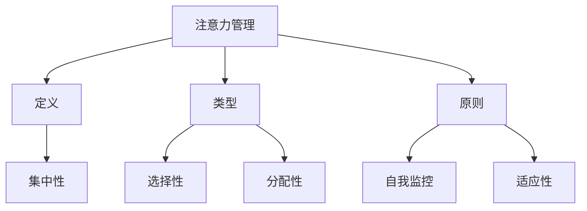

**核心算法原理讲解**

```python
# 注意力管理核心算法
class AttentionManagement:
    def __init__(self, task, duration):
        self.task = task
        self.duration = duration
    
    def manage_attention(self):
        # 集中性注意力
        self.concentrated_attention()
        
        # 选择性注意力
        self.selective_attention()
        
        # 分配性注意力
        self.distributed_attention()
        
        # 自我监控注意力
        self.self_monitoring_attention()
        
        # 适应性注意力
        self.adaptive_attention()
        
    def concentrated_attention(self):
        print("集中注意力完成任务...")
        
    def selective_attention(self):
        print("选择关键信息，过滤干扰...")
        
    def distributed_attention(self):
        print("分配注意力，同时处理多个任务...")
        
    def self_monitoring_attention(self):
        print("监控注意力水平，调整策略...")
        
    def adaptive_attention(self):
        print("根据任务需求，调整注意力分配...")
```

#### 1.1.1 注意力的定义与类型

**定义**

注意力是指个体在某一特定时刻，对信息的接收、处理和反应的能力。它是一个动态的过程，涉及到大脑多个区域的协同工作。

**类型**

- **集中性注意力（Concentrated Attention）**：个体将全部注意力集中在一个任务上，排除外界干扰。
- **选择性注意力（Selective Attention）**：个体从多个信息源中选择关注某一特定信息，而忽略其他信息。
- **分配性注意力（Distributed Attention）**：个体同时关注多个任务，但每个任务的注意力水平较低。
- **自我监控注意力（Self-monitoring Attention）**：个体对自身的注意力水平进行监控和调整。
- **适应性注意力（Adaptive Attention）**：个体根据任务需求和外部环境变化，调整注意力分配。

#### 1.1.2 注意力在日常生活和工作中的重要性

**重要性**

- **提高工作效率**：通过有效管理注意力，个体能够更高效地完成任务。
- **改善情绪调节**：注意力管理有助于个体更好地处理情绪，减少负面情绪的影响。
- **增强心理健康**：注意力管理有助于缓解压力，提高心理健康水平。
- **提高生活质量**：通过有效管理注意力，个体能够更好地享受生活，提高生活质量。

#### 1.1.3 注意力管理的基本原则

**基本原则**

- **明确目标**：设定清晰的目标，有助于个体集中注意力。
- **避免分心**：创造一个无干扰的环境，减少分心因素。
- **合理安排时间**：合理分配时间，避免过度劳累。
- **自我监控**：定期评估注意力水平，及时调整策略。
- **适应性调整**：根据任务需求和外部环境变化，灵活调整注意力分配。

#### 1.2 正念练习与注意力管理的关系

**核心概念与联系**

正念练习是一种通过专注当下、培养注意力和意识的方法。它与注意力管理密切相关，有助于提高个体的专注力和心灵清晰度。

**Mermaid 流程图**

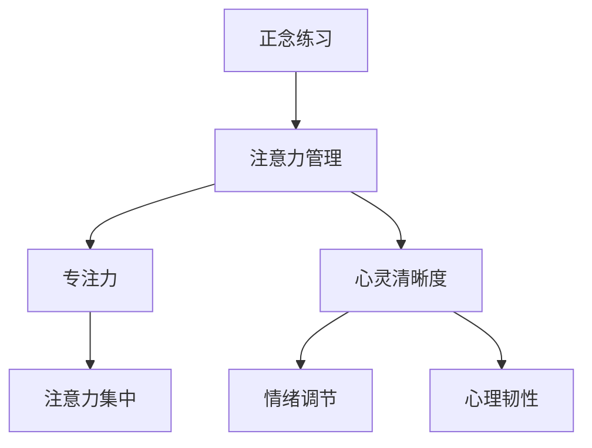

**核心算法原理讲解**

```python
# 正念练习与注意力管理核心算法
class MindfulnessPractice:
    def __init__(self, task, duration):
        self.task = task
        self.duration = duration
    
    def practice_mindfulness(self):
        # 观察呼吸
        self.observe_breathing()
        
        # 身心扫描
        self.body_scan()
        
        # 冥想练习
        self.meditate()
        
    def observe_breathing(self):
        print("观察呼吸，专注当下...")
        
    def body_scan(self):
        print("进行身心扫描，增强意识...")
        
    def meditate(self):
        print("进行冥想练习，提升专注力...")
```

#### 1.2.1 正念练习的起源与发展

**起源**

正念练习起源于佛教冥想，后逐渐发展出多种形式，如正念呼吸、正念饮食和正念行走等。

**发展**

- **20世纪60年代**：美国心理学家Jon Kabat-Zinn将正念练习引入医学领域，用于治疗慢性疼痛和压力。
- **20世纪90年代**：正念练习在心理学领域得到广泛应用，成为心理治疗的一部分。
- **21世纪**：正念练习在全球范围内普及，广泛应用于身心健康管理。

#### 1.2.2 正念练习在注意力管理中的应用

**应用**

- **提高专注力**：正念练习有助于个体更好地集中注意力，减少分心。
- **增强心灵清晰度**：通过观察当下，个体能够更清晰地认识到自己的思维和行为模式。
- **改善情绪调节**：正念练习有助于个体更好地处理情绪，提高心理韧性。
- **提高生活质量**：正念练习有助于个体更好地享受生活，提高生活质量。

#### 1.2.3 正念练习与心理学理论的联系

**心理学理论**

- **认知行为理论**：正念练习有助于个体改变负面思维模式，提高情绪调节能力。
- **情绪调节理论**：正念练习有助于个体更好地处理情绪，减少负面情绪的影响。
- **心理韧性理论**：正念练习有助于个体增强心理韧性，应对压力和挑战。

### 第二部分：注意力管理实践

#### 2.1 基础注意力训练

**核心概念与联系**

基础注意力训练是提高注意力水平的关键，包括观察呼吸、简单身心扫描和冥想练习。

**Mermaid 流程图**

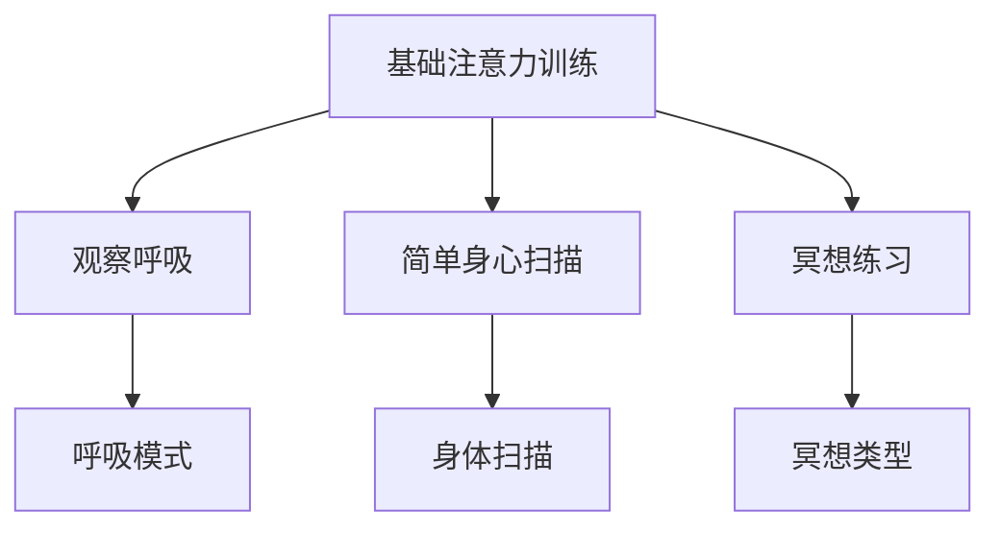

**核心算法原理讲解**

```python
# 基础注意力训练核心算法
class BasicAttentionTraining:
    def __init__(self, duration):
        self.duration = duration
    
    def train_attention(self):
        # 观察呼吸
        self.observe_breathing()
        
        # 简单身心扫描
        self.simple_body_scan()
        
        # 冥想练习
        self.meditate()
        
    def observe_breathing(self):
        print("观察呼吸，专注当下...")
        
    def simple_body_scan(self):
        print("进行简单身心扫描，增强意识...")
        
    def meditate(self):
        print("进行冥想练习，提升专注力...")
```

#### 2.1.1 观察呼吸

**原理**

观察呼吸是一种简单而有效的注意力训练方法，通过专注于呼吸过程，个体能够减少分心，提高专注力。

**步骤**

1. 找一个安静舒适的地方，坐或躺下，保持身体放松。
2. 将注意力集中在呼吸上，观察呼吸的进出。
3. 如果注意力分散，轻轻将注意力拉回呼吸。

**技巧**

- **深呼吸**：深呼吸有助于放松身体，提高专注力。
- **重复练习**：每天练习，逐渐增加持续时间。

**示例**

```python
# 观察呼吸伪代码
def observe_breathing():
    print("开始观察呼吸...")
    while True:
        breathe_in()
        breathe_out()
        if time_to_stop():
            break
```

#### 2.1.2 简单身心扫描

**目的**

简单身心扫描是一种通过观察身体和情绪状态，增强注意力和意识的练习。

**步骤**

1. 找一个安静舒适的地方，坐或躺下，保持身体放松。
2. 逐一关注身体的不同部位，从头部到脚部，观察每个部位的感受。
3. 注意观察情绪变化，将注意力集中在情绪上。

**技巧**

- **缓慢移动**：缓慢移动注意力，避免急躁。
- **接受不适**：接受身体和情绪上的不适，不要逃避。

**示例**

```python
# 简单身心扫描伪代码
def simple_body_scan():
    print("开始简单身心扫描...")
    body_parts = ["头部", "颈部", "肩膀", "手臂", "胸部", "腹部", "背部", "腿部"]
    emotions = ["快乐", "悲伤", "愤怒", "焦虑"]
    for part in body_parts:
        print(f"关注{part}...")
        observe_part(part)
    for emotion in emotions:
        print(f"关注{emotion}...")
        observe_emotion(emotion)
```

#### 2.1.3 冥想练习

**基本类型**

- **正念冥想**：专注于当下的体验，观察思维和情绪的变化。
- **专注冥想**：将注意力集中在某一特定的对象或想法上。
- **开放监视冥想**：对任何进入意识的体验保持开放和接纳。

**步骤**

1. 找一个安静舒适的地方，坐或躺下，保持身体放松。
2. 选择一种冥想类型，专注于对象或体验。
3. 如果注意力分散，轻轻将注意力拉回冥想对象。

**注意事项**

- **环境**：选择一个安静舒适的环境，避免外界干扰。
- **持之以恒**：每天练习，逐渐增加持续时间。

**示例**

```python
# 冥想练习伪代码
def meditate():
    print("开始冥想练习...")
    while True:
        if mindful_meditation():
            print("进行正念冥想...")
        elif focused_meditation():
            print("进行专注冥想...")
        elif open_monitoring_meditation():
            print("进行开放监视冥想...")
        if time_to_stop():
            break
```

### 第三部分：注意力管理策略

#### 3.1 提高注意力策略

**核心概念与联系**

提高注意力策略包括时间管理技巧、避免分心的方法和改善注意力分散的技巧。

**Mermaid 流程图**

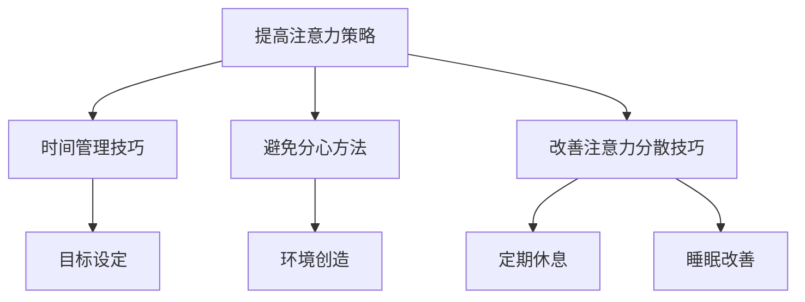

**核心算法原理讲解**

```python
# 提高注意力策略核心算法
class ImproveAttentionStrategy:
    def __init__(self, task, duration):
        self.task = task
        self.duration = duration
    
    def improve_attention(self):
        # 时间管理技巧
        self.time_management()
        
        # 避免分心方法
        self.avoid_diversion()
        
        # 改善注意力分散技巧
        self.improve_attention_diffusion()
        
    def time_management(self):
        print("设定目标和优先级...")
        
    def avoid_diversion(self):
        print("创造专注环境...")
        
    def improve_attention_diffusion(self):
        print("定期休息和改善睡眠质量...")
```

#### 3.1.1 时间管理技巧

**设定目标和优先级**

- **明确目标**：设定清晰、具体的目标，有助于提高注意力。
- **优先级排序**：根据目标的紧急程度和重要性进行排序，确保关键任务得到优先处理。

**示例**

```python
# 时间管理技巧示例
def time_management():
    print("设定目标和优先级...")
    goals = ["完成报告", "参加会议", "阅读书籍"]
    priorities = ["完成报告", "参加会议", "阅读书籍"]
    for goal in goals:
        print(f"目标：{goal}")
        if goal in priorities:
            print(f"优先级：高")
        else:
            print(f"优先级：低")
```

**使用时间管理工具**

- **日历**：使用日历或日程管理工具，合理安排时间和任务。
- **待办事项列表**：将任务列出来，每天检查进度，确保任务完成。

**示例**

```python
# 使用时间管理工具示例
def use_time_management_tools():
    print("使用时间管理工具...")
    calendar = ["08:00-09:00 早餐", "09:00-11:00 写报告", "11:00-12:00 会议", "14:00-16:00 阅读书籍"]
    for event in calendar:
        print(event)
```

#### 3.2 避免分心的方法

**创造专注环境**

- **减少干扰**：避免在嘈杂的环境中工作，使用耳机或耳塞来屏蔽噪音。
- **组织工作空间**：保持工作空间整洁，减少不必要的物品。

**示例**

```python
# 创造专注环境示例
def create_focus_environment():
    print("创造专注环境...")
    workspace = ["电脑", "文件夹", "笔", "便签"]
    for item in workspace:
        print(f"准备{item}...")
```

**避免多任务处理**

- **单任务优先**：专注于一项任务，避免同时处理多个任务。
- **时间段管理**：将工作时间划分为多个时间段，每个时间段专注于一项任务。

**示例**

```python
# 避免多任务处理示例
def avoid multitasking():
    print("避免多任务处理...")
    tasks = ["写报告", "参加会议", "阅读书籍"]
    for task in tasks:
        print(f"当前任务：{task}")
```

#### 3.3 改善注意力分散的技巧

**定期休息**

- **番茄工作法**：每工作25分钟，休息5分钟，有助于保持注意力集中。
- **定时休息**：每天安排固定的休息时间，让身体和大脑得到充分的休息。

**示例**

```python
# 定期休息示例
def regular_breaks():
    print("定期休息...")
    work_time = 25
    break_time = 5
    while True:
        print(f"工作{work_time}分钟，休息{break_time}分钟...")
        work_time += 25
        break_time += 5
        if work_time > 120:
            break
```

**改善睡眠质量**

- **规律作息**：保持规律的作息时间，确保每天有充足的睡眠。
- **睡前放松**：睡前进行放松活动，如深呼吸、冥想等，有助于改善睡眠质量。

**示例**

```python
# 改善睡眠质量示例
def improve_sleep_quality():
    print("改善睡眠质量...")
    bedtime = "22:00"
    wake_time = "06:00"
    while True:
        print(f"准备睡觉：{bedtime}")
        bedtime += 8
        wake_time += 8
        if bedtime > "23:59":
            break
```

### 第四部分：正念练习的深化应用

#### 4.1 正念饮食

**核心概念与联系**

正念饮食是一种通过专注饮食过程，提高注意力和意识的方法。

**Mermaid 流程图**

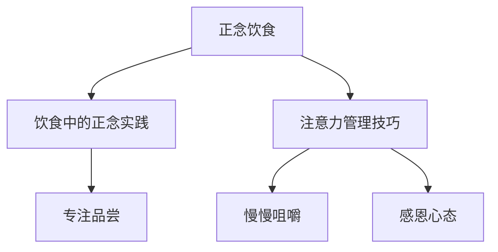

**核心算法原理讲解**

```python
# 正念饮食核心算法
class MindfulDiet:
    def __init__(self, meal):
        self.meal = meal
    
    def practice_mindful_diet(self):
        # 专注品尝
        self.pay_attention_to_tasting()
        
        # 慢慢咀嚼
        self.chew_slowly()
        
        # 感恩心态
        self.gratitude_mindset()
        
    def pay_attention_to_tasting(self):
        print("专注品尝食物...")
        
    def chew_slowly(self):
        print("慢慢咀嚼，品味食物...")
        
    def gratitude_mindset(self):
        print("保持感恩心态，珍惜食物...")
```

#### 4.1.1 饮食中的正念实践

**专注品尝**

- **原理**：通过专注于品尝食物的口感、味道和香气，提高饮食过程中的意识。
- **步骤**：将注意力集中在食物上，慢慢品尝，观察食物的色、香、味。

**示例**

```python
# 专注品尝示例
def pay_attention_to_tasting():
    print("专注品尝食物...")
    while True:
        taste_food()
        if time_to_stop():
            break
```

#### 4.1.2 饮食中的注意力管理技巧

**慢慢咀嚼**

- **原理**：通过慢慢咀嚼，使食物充分与唾液混合，提高消化效率，同时提高饮食过程中的意识。
- **步骤**：每口食物咀嚼至少20次，感受食物在口中的变化。

**示例**

```python
# 慢慢咀嚼示例
def chew_slowly():
    print("慢慢咀嚼，品味食物...")
    while True:
        chew_food()
        if time_to_stop():
            break
```

**感恩心态**

- **原理**：通过感恩心态，提高饮食过程中的满足感和幸福感。
- **步骤**：在饮食前和饮食过程中，表达对食物和烹饪者的感激之情。

**示例**

```python
# 感恩心态示例
def gratitude_mindset():
    print("保持感恩心态，珍惜食物...")
    while True:
        express_gratitude()
        if time_to_stop():
            break
```

#### 4.2 正念行走

**核心概念与联系**

正念行走是一种通过专注于行走过程，提高注意力和意识的方法。

**Mermaid 流程图**

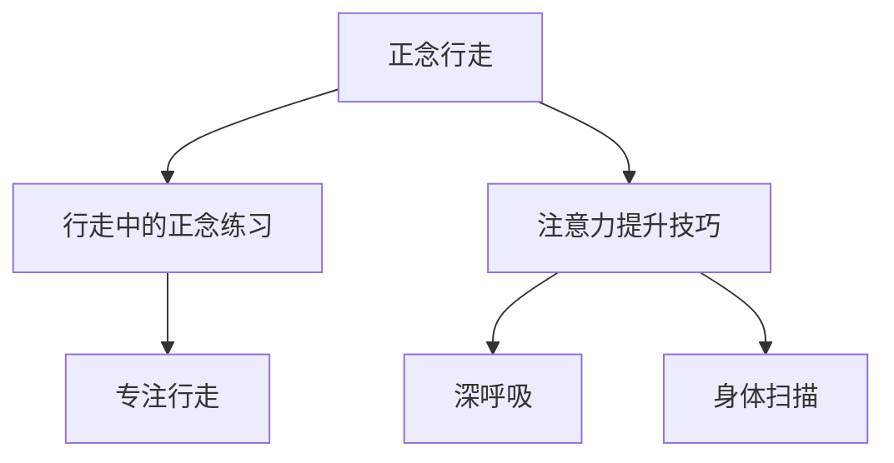

**核心算法原理讲解**

```python
# 正念行走核心算法
class MindfulWalking:
    def __init__(self, duration):
        self.duration = duration
    
    def practice_mindful_walking(self):
        # 专注行走
        self.pay_attention_to_walking()
        
        # 深呼吸
        self.breathing()
        
        # 身体扫描
        self.body_scan()
        
    def pay_attention_to_walking(self):
        print("专注行走...")
        
    def breathing(self):
        print("深呼吸...")
        
    def body_scan(self):
        print("身体扫描...")
```

#### 4.2.1 行走中的正念练习

**专注行走**

- **原理**：通过专注于行走过程，提高身体和意识的对齐，减少分心。
- **步骤**：专注于脚步的感觉，感受每一步的触地和离开。

**示例**

```python
# 专注行走示例
def pay_attention_to_walking():
    print("专注行走...")
    while True:
        walk()
        if time_to_stop():
            break
```

#### 4.2.2 行走中的注意力提升技巧

**深呼吸**

- **原理**：通过深呼吸，放松身体，提高注意力。
- **步骤**：深吸气，感受肺部膨胀，深呼气，感受肺部收缩。

**示例**

```python
# 深呼吸示例
def deep_breathing():
    print("深呼吸...")
    while True:
        breathe_in()
        breathe_out()
        if time_to_stop():
            break
```

**身体扫描**

- **原理**：通过身体扫描，提高对身体和情绪的意识。
- **步骤**：从头部到脚部，逐一关注身体每个部位的感受。

**示例**

```python
# 身体扫描示例
def body_scan():
    print("身体扫描...")
    body_parts = ["头部", "颈部", "肩膀", "手臂", "胸部", "腹部", "背部", "腿部"]
    for part in body_parts:
        print(f"关注{part}...")
        observe_part(part)
```

#### 4.3 正念沟通

**核心概念与联系**

正念沟通是一种通过专注于沟通过程，提高沟通质量和注意力的方法。

**Mermaid 流程图**

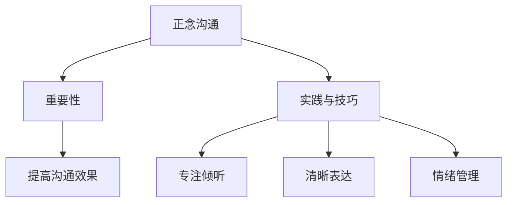

**核心算法原理讲解**

```python
# 正念沟通核心算法
class MindfulCommunication:
    def __init__(self, conversation):
        self.conversation = conversation
    
    def practice_mindful_communication(self):
        # 专注倾听
        self.pay_attention_to_listening()
        
        # 清晰表达
        self.clear_expression()
        
        # 情绪管理
        self.emotion_management()
        
    def pay_attention_to_listening(self):
        print("专注倾听...")
        
    def clear_expression(self):
        print("清晰表达...")
        
    def emotion_management(self):
        print("情绪管理...")
```

#### 4.3.1 正念沟通的重要性

**提高沟通效果**

- **减少误解**：通过专注倾听和清晰表达，减少沟通中的误解。
- **增强信任**：通过正念沟通，建立更紧密的人际关系，增强信任。
- **提高团队效率**：在团队中推广正念沟通，提高团队协作效率。

#### 4.3.2 正念沟通的实践与技巧

**专注倾听**

- **原理**：通过专注倾听，提高对对方意图和情绪的理解。
- **步骤**：在沟通过程中，专注于对方的语言和表情，不要打断。

**示例**

```python
# 专注倾听示例
def pay_attention_to_listening():
    print("专注倾听...")
    while True:
        listen()
        if time_to_stop():
            break
```

**清晰表达**

- **原理**：通过清晰表达，使对方更容易理解自己的意图。
- **步骤**：在沟通前，明确自己的意图，使用简洁明了的语言。

**示例**

```python
# 清晰表达示例
def clear_expression():
    print("清晰表达...")
    while True:
        express()
        if time_to_stop():
            break
```

**情绪管理**

- **原理**：通过情绪管理，减少负面情绪对沟通的影响。
- **步骤**：在沟通前，进行深呼吸或冥想，保持冷静。

**示例**

```python
# 情绪管理示例
def emotion_management():
    print("情绪管理...")
    while True:
        manage_emotions()
        if time_to_stop():
            break
```

### 第五部分：注意力管理与心理健康

#### 5.1 注意力管理对心理健康的影响

**核心概念与联系**

注意力管理对心理健康有着重要的影响，包括对情绪调节的作用和对压力管理的贡献。

**Mermaid 流程图**

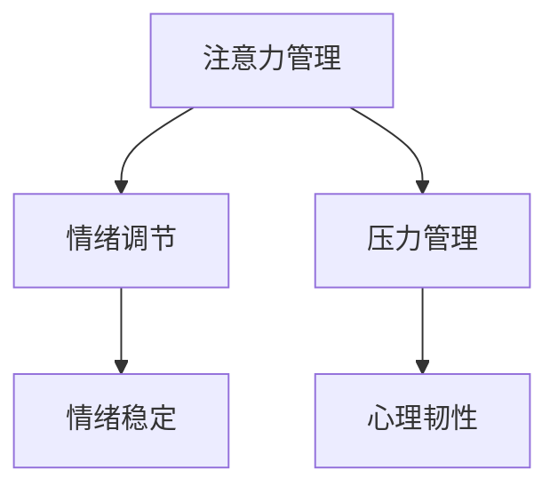

**核心算法原理讲解**

```python
# 注意力管理与心理健康核心算法
class AttentionManagementHealth:
    def __init__(self, mood, stress):
        self.mood = mood
        self.stress = stress
    
    def manage_health(self):
        # 情绪调节
        self.emotion Regulation()
        
        # 压力管理
        self.stress_management()
        
    def emotion_regeneration(self):
        print("情绪调节...")
        
    def stress_management(self):
        print("压力管理...")
```

#### 5.1.1 注意力管理对情绪调节的作用

**情绪稳定**

- **原理**：通过注意力管理，提高对情绪的控制能力，减少情绪波动。
- **方法**：通过专注练习和情绪管理技巧，如深呼吸、冥想和正念练习，提高情绪调节能力。

**示例**

```python
# 情绪调节示例
def emotion_regeneration():
    print("情绪调节...")
    while True:
        breathe_in()
        breathe_out()
        if time_to_stop():
            break
```

#### 5.1.2 注意力管理对压力管理的贡献

**心理韧性**

- **原理**：通过注意力管理，提高个体对压力的应对能力，增强心理韧性。
- **方法**：通过时间管理技巧、避免分心和改善注意力分散技巧，提高压力管理能力。

**示例**

```python
# 压力管理示例
def stress_management():
    print("压力管理...")
    while True:
        time_management()
        avoid_diversion()
        improve_attention_diffusion()
        if time_to_stop():
            break
```

#### 5.2 正念练习在心理健康中的应用

**核心概念与联系**

正念练习在心理健康中的应用包括对焦虑和抑郁的治疗作用，以及对增强心理韧性的帮助。

**Mermaid 流程图**

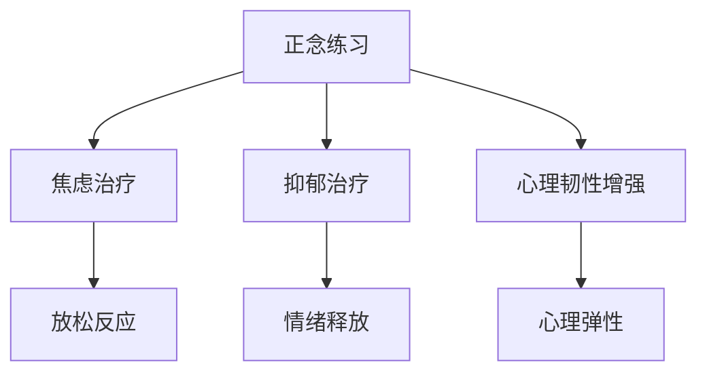

**核心算法原理讲解**

```python
# 正念练习与心理健康核心算法
class MindfulnessHealth:
    def __init__(self, anxiety, depression, resilience):
        self.anxiety = anxiety
        self.depression = depression
        self.resilience = resilience
    
    def practice_mindfulness_health(self):
        # 焦虑治疗
        self.treat_anxiety()
        
        # 抑郁治疗
        self.treat_depression()
        
        # 心理韧性增强
        self.improve_resilience()
        
    def treat_anxiety(self):
        print("焦虑治疗...")
        
    def treat_depression(self):
        print("抑郁治疗...")
        
    def improve_resilience(self):
        print("心理韧性增强...")
```

#### 5.2.1 正念练习对焦虑和抑郁的治疗作用

**放松反应**

- **原理**：通过正念练习，降低焦虑和抑郁症状，产生放松反应。
- **方法**：通过深呼吸、冥想和身心扫描，放松身体和情绪。

**示例**

```python
# 放松反应示例
def relaxation_response():
    print("放松反应...")
    while True:
        breathe_in()
        breathe_out()
        if time_to_stop():
            break
```

**情绪释放**

- **原理**：通过正念练习，释放积压的情绪，减少焦虑和抑郁。
- **方法**：通过表达情绪、倾诉和正念沟通，释放情绪。

**示例**

```python
# 情绪释放示例
def emotional_release():
    print("情绪释放...")
    while True:
        express_emotions()
        if time_to_stop():
            break
```

#### 5.2.2 正念练习对增强心理韧性的帮助

**心理弹性**

- **原理**：通过正念练习，提高个体对压力和挑战的适应能力，增强心理弹性。
- **方法**：通过时间管理、避免分心和情绪管理技巧，提高心理韧性。

**示例**

```python
# 心理弹性示例
def psychological_resilience():
    print("心理韧性增强...")
    while True:
        time_management()
        avoid_diversion()
        emotion_management()
        if time_to_stop():
            break
```

### 第六部分：个人实践与反思

#### 6.1 个人实践计划

**核心概念与联系**

个人实践计划是制定注意力管理策略和跟踪评估注意力管理效果的关键。

**Mermaid 流程图**

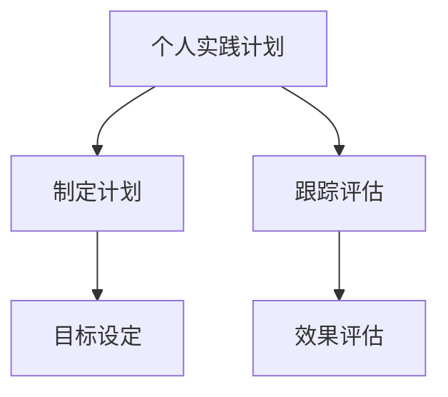

**核心算法原理讲解**

```python
# 个人实践计划核心算法
class PersonalPracticePlan:
    def __init__(self, goals, evaluation):
        self.goals = goals
        self.evaluation = evaluation
    
    def create_plan(self):
        # 制定计划
        self.create_attention_management_plan()
        
        # 跟踪评估
        self.track_and_evaluate_attention_management()
        
    def create_attention_management_plan(self):
        print("制定注意力管理计划...")
        
    def track_and_evaluate_attention_management(self):
        print("跟踪评估注意力管理效果...")
```

#### 6.1.1 制定注意力管理计划

**目标设定**

- **原理**：设定明确、具体的注意力管理目标，有助于提高注意力水平。
- **方法**：设定短期和长期目标，如每天进行冥想练习、每周阅读一本技术书籍等。

**示例**

```python
# 目标设定示例
def set_goals():
    print("设定注意力管理目标...")
    goals = ["每天进行冥想练习", "每周阅读一本技术书籍", "每月完成一个编程项目"]
    for goal in goals:
        print(f"目标：{goal}")
```

#### 6.1.2 跟踪与评估注意力管理效果

**效果评估**

- **原理**：通过定期评估注意力管理效果，了解改进方向。
- **方法**：记录每天、每周和每月的注意力管理实践，分析数据，调整策略。

**示例**

```python
# 效果评估示例
def evaluate_attention_management():
    print("评估注意力管理效果...")
    while True:
        record_data()
        analyze_data()
        if time_to_stop():
            break
```

#### 6.2 反思与持续进步

**核心概念与联系**

反思与持续进步是个人实践计划的重要部分，通过反思实践过程，持续改进注意力管理策略。

**Mermaid 流程图**

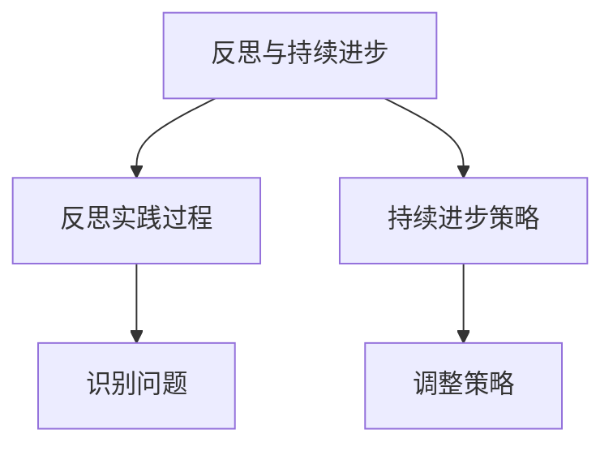

**核心算法原理讲解**

```python
# 反思与持续进步核心算法
class ReflectAndContinueProgress:
    def __init__(self, practice):
        self.practice = practice
    
    def reflect_and_continue(self):
        # 反思实践过程
        self.reflect_practice_process()
        
        # 持续进步策略
        self.continue_progress_strategy()
        
    def reflect_practice_process(self):
        print("反思实践过程...")
        
    def continue_progress_strategy(self):
        print("持续进步策略...")
```

#### 6.2.1 反思注意力管理的实践过程

**识别问题**

- **原理**：通过反思实践过程，识别注意力管理中的问题和不足。
- **方法**：记录实践过程中的体验，分析问题产生的原因。

**示例**

```python
# 识别问题示例
def identify_issues():
    print("识别注意力管理中的问题...")
    while True:
        record_experience()
        analyze_issues()
        if time_to_stop():
            break
```

#### 6.2.2 持续进步的策略与方法

**调整策略**

- **原理**：根据反思结果，调整注意力管理策略，持续进步。
- **方法**：结合实践经验和专家建议，优化注意力管理策略。

**示例**

```python
# 调整策略示例
def adjust_strategy():
    print("调整注意力管理策略...")
    while True:
        reflect_practice_process()
        analyze_issues()
        if time_to_stop():
            break
```

### 附录A：正念练习资源与推荐

**核心概念与联系**

正念练习资源与推荐是帮助读者深入了解和践行正念练习的重要指南。

**Mermaid 流程图**

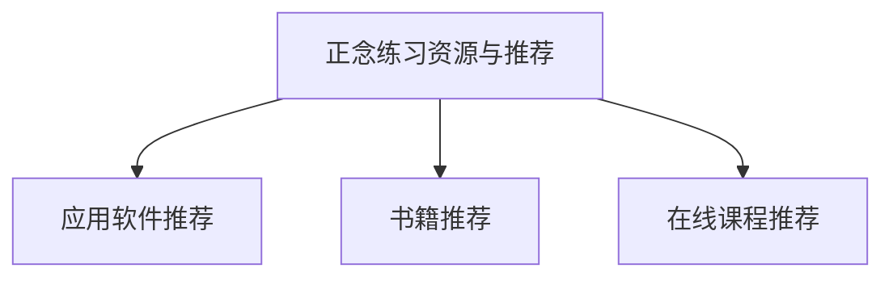

**核心算法原理讲解**

```python
# 正念练习资源与推荐核心算法
class MindfulnessResources:
    def __init__(self, software, books, courses):
        self.software = software
        self.books = books
        self.courses = courses
    
    def recommend_resources(self):
        # 应用软件推荐
        self.recommend_software()
        
        # 书籍推荐
        self.recommend_books()
        
        # 在线课程推荐
        self.recommend_courses()
        
    def recommend_software(self):
        print("推荐正念练习应用软件...")
        
    def recommend_books(self):
        print("推荐正念练习书籍...")
        
    def recommend_courses(self):
        print("推荐正念练习在线课程...")
```

#### A.1 正念练习应用软件推荐

**应用软件推荐**

- **Headspace**：提供多种冥想课程，适合初学者。
- **Insight Timer**：拥有丰富的冥想资源，适用于各种需求。
- **Calm**：提供冥想、呼吸练习和放松音乐，帮助放松身心。

**示例**

```python
# 应用软件推荐示例
def recommend_software():
    print("推荐正念练习应用软件...")
    software_list = ["Headspace", "Insight Timer", "Calm"]
    for software in software_list:
        print(f"应用软件：{software}")
```

#### A.2 正念练习书籍推荐

**书籍推荐**

- **《正念：一种全新的生活方式》**：介绍正念练习的基本原理和实践方法。
- **《正念冥想入门》**：详细讲解冥想技巧和实践方法。
- **《正念饮食》**：介绍正念饮食的原理和实践。

**示例**

```python
# 书籍推荐示例
def recommend_books():
    print("推荐正念练习书籍...")
    books_list = ["正念：一种全新的生活方式", "正念冥想入门", "正念饮食"]
    for book in books_list:
        print(f"书籍：{book}")
```

#### A.3 正念练习在线课程推荐

**在线课程推荐**

- **Coursera**：提供多种正念课程，包括冥想、正念饮食和情绪调节。
- **Udemy**：提供丰富的正念课程，涵盖不同领域和实践方法。
- **edX**：提供由知名大学开设的正念课程，质量有保证。

**示例**

```python
# 在线课程推荐示例
def recommend_courses():
    print("推荐正念练习在线课程...")
    courses_list = ["Coursera", "Udemy", "edX"]
    for course in courses_list:
        print(f"在线课程：{course}")
```

### 附录B：注意力管理常见问题解答

**核心概念与联系**

注意力管理常见问题解答是帮助读者解决实践过程中遇到的问题的重要指南。

**Mermaid 流程图**

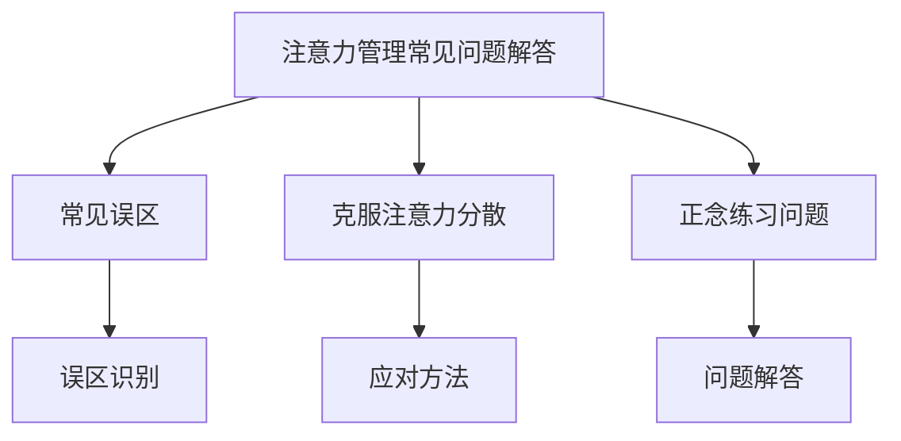

**核心算法原理讲解**

```python
# 注意力管理常见问题解答核心算法
class AttentionManagementFAQ:
    def __init__(self,误区，dispersion，mindfulness):
        self.mistakes =误区
        self.dispersion = dispersion
        self.mindfulness = mindfulness
    
    def answer_questions(self):
        # 常见误区
        self.explain_mistakes()
        
        # 克服注意力分散
        self.cope_with_dispersion()
        
        # 正念练习问题
        self.answer_mindfulness_questions()
        
    def explain_mistakes(self):
        print("解释注意力管理常见误区...")
        
    def cope_with_dispersion(self):
        print("提供克服注意力分散的方法...")
        
    def answer_mindfulness_questions(self):
        print("解答正念练习问题...")
```

#### B.1 注意力管理常见误区

**误区识别**

- **误区一**：认为注意力管理仅限于工作，忽视了日常生活中的应用。
- **误区二**：过分依赖工具和技术，忽视了自我管理的重要性。
- **误区三**：忽视情绪调节，将注意力管理等同于压力管理。

**示例**

```python
# 误区识别示例
def identify_mistakes():
    print("识别注意力管理常见误区...")
    mistakes_list = ["误区一", "误区二", "误区三"]
    for mistake in mistakes_list:
        print(f"误区：{mistake}")
```

#### B.2 如何克服注意力分散

**应对方法**

- **方法一**：创造专注环境，减少干扰因素。
- **方法二**：采用番茄工作法，分段专注。
- **方法三**：定期休息，避免过度劳累。

**示例**

```python
# 应对方法示例
def cope_with_dispersion():
    print("提供克服注意力分散的方法...")
    methods_list = ["创造专注环境", "采用番茄工作法", "定期休息"]
    for method in methods_list:
        print(f"方法：{method}")
```

#### B.3 正念练习的常见问题与解答

**问题解答**

- **问题一**：如何开始正念练习？
- **问题二**：正念练习需要多长时间？
- **问题三**：如何处理正念练习中的分心？

**示例**

```python
# 问题解答示例
def answer_mindfulness_questions():
    print("解答正念练习问题...")
    questions_list = ["如何开始正念练习", "正念练习需要多长时间", "如何处理分心"]
    for question in questions_list:
        print(f"问题：{question}")
```

### 作者信息

**作者：** AI天才研究院 / AI Genius Institute & 禅与计算机程序设计艺术 / Zen And The Art of Computer Programming

---

### 《注意力管理与正念练习：通过当下增强专注力和心灵清晰度》

注意力管理是现代社会中一项重要的技能，它不仅关乎个体的工作效率，更关乎心理健康和生活质量。本文从注意力管理的核心概念和基础概念入手，详细阐述了注意力在日常生活和工作中的重要性，以及注意力管理的基本原则。接着，文章介绍了正念练习的起源与发展，阐述了正念练习在注意力管理中的应用和心理学理论的支持。

在实践部分，文章详细讲解了基础注意力训练方法，包括观察呼吸、简单身心扫描和冥想练习。随后，文章提出了提高注意力策略，如时间管理技巧、避免分心的方法和改善注意力分散的技巧。接着，文章探讨了正念练习在心理健康中的应用，包括正念饮食、正念行走和正念沟通。

文章的最后，提出了个人实践与反思的方法，帮助读者制定注意力管理计划，跟踪与评估注意力管理效果，并持续进步。同时，文章提供了正念练习资源与推荐，以及注意力管理常见问题的解答。

通过本文的阅读，读者将能够深入了解注意力管理和正念练习的核心概念和实践方法，从而在实际生活中更好地应用这些技巧，提高专注力和心灵清晰度，提升生活质量。让我们一步一步思考，共同探索注意力管理和正念练习的奥秘。

---

### 关键词：注意力管理、正念练习、专注力、心灵清晰度、时间管理、心理健康、情绪调节、压力管理、情绪调节、项目实战

---

### 摘要：

本文系统地介绍了注意力管理和正念练习的核心概念、基础概念以及它们在日常生活和工作中的应用。文章首先阐述了注意力管理的本质和重要性，分析了注意力类型和注意力管理的基本原则。接着，文章深入探讨了正念练习的起源、发展及其在心理学中的地位，并详细介绍了正念练习在提高专注力和心灵清晰度方面的作用。

在实践部分，文章详细讲解了观察呼吸、简单身心扫描和冥想练习等基础注意力训练方法，并提供了具体步骤和技巧。此外，文章还提出了时间管理技巧、避免分心的方法和改善注意力分散的技巧，帮助读者在实践中更好地应用注意力管理策略。文章还深入探讨了正念练习在心理健康中的积极作用，包括对焦虑、抑郁的治疗作用和对心理韧性的增强。

个人实践与反思部分，文章提出了制定个人实践计划、跟踪与评估注意力管理效果以及持续进步的方法，帮助读者在实际操作中不断提升注意力水平。附录部分提供了正念练习的资源与推荐，以及注意力管理常见问题的解答，为读者提供了全面的实践指南。

通过本文的阅读，读者将能够系统地了解注意力管理和正念练习的理论基础和实践方法，从而在实际生活中更好地管理注意力，提高生活质量，实现个人成长。让我们一步一步思考，共同探索注意力管理和正念练习的奥秘。

