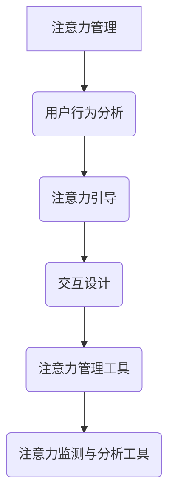

                 

# 《注意力管理在元宇宙中的重要性》

> 关键词：元宇宙、注意力管理、虚拟现实、增强现实、计算机图形学、注意力算法、用户互动

> 摘要：本文深入探讨了注意力管理在元宇宙中的重要性。随着元宇宙技术的迅速发展，如何有效管理和引导用户注意力成为关键挑战。本文首先介绍了元宇宙的概念及其对人们生活方式的影响，然后阐述了注意力管理的内涵和理论，接着分析了注意力管理在元宇宙中的应用和挑战。通过实际案例和详细的代码实现，本文为元宇宙中的注意力管理提供了有益的参考。

## 目录大纲

# 《注意力管理在元宇宙中的重要性》

## 第1章 引言与背景
### 1.1 元宇宙的概念与影响
### 1.2 注意力管理的内涵与挑战
### 1.3 本书的结构与内容安排

## 第2章 元宇宙技术基础
### 2.1 虚拟现实技术
#### 2.1.1 虚拟现实硬件
#### 2.1.2 虚拟现实软件
### 2.2 增强现实技术
#### 2.2.1 增强现实硬件
#### 2.2.2 增强现实软件
### 2.3 计算机图形学基础
#### 2.3.1 图形渲染技术
#### 2.3.2 三维模型处理

## 第3章 注意力管理理论
### 3.1 注意力管理原理
#### 3.1.1 注意力分配
#### 3.1.2 注意力聚焦
### 3.2 注意力管理模型
#### 3.2.1 注意力网格模型
#### 3.2.2 注意力选择模型
### 3.3 注意力管理方法
#### 3.3.1 内部注意力管理
#### 3.3.2 外部注意力管理

## 第4章 元宇宙中的注意力管理应用
### 4.1 元宇宙用户行为分析
#### 4.1.1 用户注意力分配
#### 4.1.2 用户注意力转移
### 4.2 注意力引导与交互设计
#### 4.2.1 注意力引导策略
#### 4.2.2 交互设计原则
### 4.3 注意力管理工具与平台
#### 4.3.1 注意力管理软件
#### 4.3.2 注意力监测与分析工具

## 第5章 注意力管理算法与模型
### 5.1 传统注意力算法
#### 5.1.1 加权求和模型
#### 5.1.2 线性注意力模型
### 5.2 现代注意力模型
#### 5.2.1 自注意力模型
#### 5.2.2 多头自注意力模型
### 5.3 注意力管理算法优化
#### 5.3.1 注意力分配优化
#### 5.3.2 注意力聚焦优化

## 第6章 注意力管理在元宇宙项目中的应用案例
### 6.1 案例一：虚拟现实购物体验优化
#### 6.1.1 项目背景与目标
#### 6.1.2 注意力管理策略
#### 6.1.3 实施效果与评估
### 6.2 案例二：社交虚拟空间用户互动优化
#### 6.2.1 项目背景与目标
#### 6.2.2 注意力管理策略
#### 6.2.3 实施效果与评估

## 第7章 注意力管理在元宇宙中的挑战与未来
### 7.1 注意力管理面临的挑战
#### 7.1.1 技术挑战
#### 7.1.2 道德与隐私挑战
### 7.2 注意力管理的发展趋势
#### 7.2.1 技术发展趋势
#### 7.2.2 应用领域拓展
### 7.3 结论与展望
#### 7.3.1 注意力管理的重要性
#### 7.3.2 未来研究方向

### 附录
#### A.1 元宇宙注意力管理技术资源列表
#### A.2 参考文献
#### A.3 附录一：Mermaid 图流程图示例
#### A.4 附录二：注意力管理算法伪代码示例
#### A.5 附录三：注意力管理项目实战代码示例

---

在接下来的章节中，我们将逐步深入探讨元宇宙的概念、注意力管理的理论、注意力管理在元宇宙中的应用、相关算法和模型，以及未来的发展趋势和挑战。让我们一步一步地分析推理，共同探索注意力管理在元宇宙中的重要性。

### 第1章 引言与背景

随着科技的迅猛发展，人类正在步入一个全新的时代——元宇宙（Metaverse）。元宇宙是一个虚拟的、三维的、基于互联网的数字世界，用户可以通过虚拟现实（Virtual Reality，VR）和增强现实（Augmented Reality，AR）技术与这个数字世界进行互动。元宇宙不仅包含了现有的社交网络、电子商务和游戏，还融合了新的虚拟空间、虚拟人物和智能交互，为人们提供了一个全新的生活和工作环境。

#### 1.1 元宇宙的概念与影响

元宇宙的概念最初由科幻作家尼尔·斯蒂芬森（Neal Stephenson）在其作品《雪崩》（Snow Crash）中提出。元宇宙是一个由多个虚拟空间组成的网络，用户可以在其中创建和定制自己的虚拟身份，进行各种形式的社会活动、商业交易和娱乐体验。元宇宙的核心特征包括：

1. **沉浸性**：通过VR和AR技术，用户可以感受到高度沉浸的虚拟环境，如同真实世界一样。
2. **交互性**：用户可以在元宇宙中与其他用户、虚拟对象和环境进行实时互动。
3. **创造性和表达性**：用户可以在元宇宙中创建和分享各种虚拟内容，包括艺术品、虚拟商品和虚拟服务。
4. **社会性**：元宇宙为用户提供了新的社交平台，用户可以建立和维持社交关系，参与各种虚拟社区活动。

元宇宙对人类社会的影响是深远的。首先，它改变了人们的社交方式和工作方式。例如，在元宇宙中，人们可以通过虚拟会议进行远程协作，不再受限于地理位置。其次，元宇宙为商业和经济活动提供了新的机会。企业可以在元宇宙中建立虚拟商店，用户可以在线购买虚拟商品，这将极大地拓展市场空间。此外，元宇宙还为教育和娱乐带来了革命性的变化，用户可以参与虚拟课堂、虚拟博物馆和虚拟游戏，获得更加丰富和多样化的体验。

#### 1.2 注意力管理的内涵与挑战

注意力管理（Attention Management）是指通过有效的方式引导和分配用户的注意力，以提高工作效率和满足用户需求。在元宇宙中，注意力管理尤为重要，因为用户在元宇宙中的体验高度依赖于其注意力的分配和聚焦。注意力管理的内涵包括以下几个方面：

1. **注意力分配**：用户需要决定将注意力分配到元宇宙中的哪些部分，例如社交互动、虚拟购物、游戏体验等。
2. **注意力聚焦**：用户需要将注意力集中在特定的任务或活动上，以便更好地完成任务或获得满足感。
3. **注意力转移**：用户需要学会在元宇宙中转移注意力，以适应不同的环境和任务需求。

在元宇宙中，注意力管理面临以下挑战：

1. **注意力分散**：元宇宙中提供了丰富的虚拟内容和交互方式，容易导致用户的注意力分散。
2. **注意力疲劳**：长时间沉浸在元宇宙中可能导致用户的注意力疲劳，影响其身心健康。
3. **注意力竞争**：元宇宙中的各种虚拟内容和服务可能会竞争用户的注意力，如何平衡和优化这些竞争关系是一个重要课题。

#### 1.3 本书的结构与内容安排

本书的结构和内容安排如下：

- **第1章 引言与背景**：介绍元宇宙的概念、影响以及注意力管理的内涵与挑战。
- **第2章 元宇宙技术基础**：介绍元宇宙中的虚拟现实和增强现实技术，以及计算机图形学的基础知识。
- **第3章 注意力管理理论**：阐述注意力管理的基本原理、模型和方法。
- **第4章 元宇宙中的注意力管理应用**：分析注意力管理在元宇宙中的应用，包括用户行为分析、注意力引导与交互设计、注意力管理工具与平台。
- **第5章 注意力管理算法与模型**：介绍传统和现代的注意力管理算法，以及优化策略。
- **第6章 注意力管理在元宇宙项目中的应用案例**：通过实际案例展示注意力管理在元宇宙项目中的应用。
- **第7章 注意力管理在元宇宙中的挑战与未来**：探讨注意力管理面临的挑战和发展趋势。

通过本书的阅读，读者将深入理解注意力管理在元宇宙中的重要性，掌握相关的理论、方法和技术，为在元宇宙中实现高效和愉悦的体验提供指导。

### 第2章 元宇宙技术基础

元宇宙的技术基础主要包括虚拟现实（VR）和增强现实（AR）技术，以及与之密切相关的计算机图形学。这些技术为元宇宙提供了沉浸性、交互性和创造性的特征，使人们能够在虚拟世界中进行各种活动。

#### 2.1 虚拟现实技术

虚拟现实技术是一种通过计算机生成和模拟虚拟环境，使用户能够身临其境地体验的技术。VR技术的核心组件包括虚拟现实硬件和虚拟现实软件。

##### 2.1.1 虚拟现实硬件

虚拟现实硬件主要包括以下几个部分：

1. **头戴式显示器（HMD）**：头戴式显示器是VR系统中最核心的硬件，它通常包含一个或多个显示屏，用于显示虚拟环境的图像。目前，市场上常见的头戴式显示器有Oculus Rift、HTC Vive和Microsoft HoloLens等。
   
2. **定位和追踪系统**：为了确保用户在虚拟环境中的动作能够被正确捕捉和反应，VR系统需要配备定位和追踪设备。这些设备可以是外置的传感器，如传感器阵列、红外光源和摄像头，也可以是内置的传感器，如惯性测量单元（IMU）。
   
3. **声音系统**：虚拟现实中的声音系统通过耳机或内置扬声器提供立体声或三维音效，增强用户的沉浸感。

##### 2.1.2 虚拟现实软件

虚拟现实软件包括以下几个部分：

1. **内容创作工具**：这些工具帮助用户创建虚拟环境、角色和交互体验。常见的虚拟现实内容创作工具包括Unity、Unreal Engine和Blender等。

2. **虚拟现实应用软件**：这些软件提供了各种虚拟现实体验，包括游戏、教育、医疗、旅游和商业模拟等。例如，Oculus Quest提供了丰富的VR游戏和应用，而Microsoft HoloLens则侧重于增强现实和混合现实应用。

#### 2.2 增强现实技术

增强现实技术是一种将虚拟信息叠加到真实世界中的技术，通过AR眼镜、智能手机或其他设备实现。AR技术同样包括硬件和软件两个方面。

##### 2.2.1 增强现实硬件

增强现实硬件主要包括：

1. **AR眼镜**：如Google Glass、Microsoft HoloLens等，它们将虚拟信息直接投影到用户的视野中，使用户能够看到真实世界和叠加的虚拟信息。
   
2. **智能手机**：通过摄像头和屏幕，智能手机可以捕捉现实世界中的图像，并在屏幕上叠加虚拟信息。许多AR应用程序，如谷歌的“AR地图”和“谷歌相机”，都利用了这一技术。

##### 2.2.2 增强现实软件

增强现实软件包括：

1. **AR内容创建工具**：这些工具帮助用户创建和编辑AR内容，如AR贴纸、场景和动画。常见的AR内容创建工具包括ARKit、Vuforia和ARCore等。
   
2. **AR应用软件**：这些应用提供了各种增强现实体验，包括导航、教育、娱乐和商业等。例如，亚马逊的“AR购物”应用允许用户通过手机摄像头查看商品的虚拟3D模型，并在家中进行虚拟摆放。

#### 2.3 计算机图形学基础

计算机图形学是元宇宙技术的重要基础，它涉及图像生成、渲染和处理。计算机图形学主要包括以下几个方面：

##### 2.3.1 图形渲染技术

图形渲染技术是指将三维模型和场景转换为二维图像的过程。主要技术包括：

1. **光线追踪**：通过模拟光线在场景中的传播和反射，生成高度真实的图像。
   
2. **着色器**：用于定义物体表面颜色的计算过程，包括物理着色器、图形着色器和屏幕后处理着色器。

##### 2.3.2 三维模型处理

三维模型处理包括模型创建、建模、动画和优化。主要技术包括：

1. **建模**：使用3D建模软件创建和修改三维模型。
   
2. **动画**：通过关键帧和运动捕捉等技术，为模型添加动画效果。
   
3. **优化**：通过简化模型和减少数据量，提高模型的渲染效率和性能。

通过本章的介绍，我们可以了解到元宇宙中的虚拟现实和增强现实技术，以及计算机图形学的基础知识。这些技术为元宇宙提供了丰富的内容和交互体验，是构建元宇宙的重要基石。

#### 2.1.1 虚拟现实硬件

虚拟现实（VR）硬件是用户进入和体验元宇宙的入口。这些硬件设备通过各种技术手段提供沉浸式的体验，使用户能够感觉自己在虚拟环境中。以下是几种主要的VR硬件设备及其功能：

1. **头戴式显示器（HMD）**：
    - **分辨率**：头戴式显示器（HMD）的分辨率对于提供高质量的视觉体验至关重要。例如，Oculus Rift S和HTC Vive Pro提供了1440 x 1600的分辨率，使得画面更加清晰。
    - **视角**：视角范围通常在90度到120度之间，较大的视角范围能够提供更沉浸的体验。
    - **刷新率**：刷新率越高，运动画面越流畅。目前，许多VR头戴设备支持90Hz到120Hz的刷新率。
    - **跟踪系统**：头戴式显示器通常配备有外部传感器或内置传感器，用于跟踪用户的位置和头部运动。例如，Oculus Rift和HTC Vive使用外部传感器阵列来提供准确的头部和手部跟踪。

2. **定位手柄**：
    - **交互性**：定位手柄是用户与虚拟环境进行交互的主要工具。它们通常配备有按钮、触控板和传感器，使用户能够执行各种操作，如拾取物体、使用工具和进行手势交互。
    - **跟踪精度**：手柄的跟踪精度直接影响到用户的交互体验。例如，Oculus Touch和HTC Vive的定位手柄能够跟踪用户手部的每个细微动作，提供高度精确的交互。

3. **全身追踪设备**：
    - **全身体验**：一些高端的VR设备，如Valve Index，配备了全身追踪系统，可以跟踪用户的全身运动。这种设备提供了更加自由的移动体验，使用户能够像在真实世界中一样在虚拟环境中行走、跑步和跳跃。
    - **位置追踪**：全身追踪设备通过多个传感器和摄像头来捕捉用户的位置和运动，确保虚拟环境中的动作能够准确地映射到现实世界中。

4. **其他辅助设备**：
    - **音频设备**：VR体验中，立体声或头戴式耳机可以提供沉浸式的音效，增强用户的体验。
    - **舒适度**：长时间佩戴头戴式显示器可能会对用户造成不适。因此，一些高端设备提供了可调节的头部带和舒适的鼻垫，以减少压迫感和提高佩戴的舒适性。

通过上述VR硬件设备，用户能够在元宇宙中获得高度沉浸的体验，这些设备的设计和功能不断进步，使得虚拟现实技术更加成熟和普及。

##### 2.1.2 虚拟现实软件

虚拟现实（VR）软件是元宇宙的核心组成部分，它们负责生成、处理和显示虚拟环境，并提供丰富的交互体验。以下是几种主要的VR软件及其功能：

1. **内容创作工具**：
    - **Unity**：Unity是一款功能强大的游戏开发引擎，广泛用于创建VR应用程序。它提供了丰富的3D建模、动画和渲染工具，支持多种VR平台（如Oculus、HTC Vive和Windows Mixed Reality）。
    - **Unreal Engine**：Unreal Engine是另一款流行的游戏和VR内容创作工具，以其高质量的图像渲染和物理引擎著称。它提供了复杂的编辑器、脚本工具和全面的文档，适合开发大型、复杂的VR应用。
    - **Blender**：Blender是一款免费的开源3D建模和渲染软件，适合初学者和专业人士。它支持多种VR格式，并提供全面的3D建模、动画和渲染功能。

2. **虚拟现实平台**：
    - **Oculus Rift**：Oculus Rift是Facebook旗下的VR头戴设备，配套使用Oculus Home平台。Oculus Home提供了丰富的VR应用程序和内容，用户可以在其中浏览、下载和安装应用程序。
    - **HTC Vive**：HTC Vive由HTC和Valve合作开发，提供了高质量的VR体验。Viveport是HTC的VR内容平台，提供大量的游戏、教育和娱乐应用。
    - **Windows Mixed Reality**：微软的Windows Mixed Reality平台支持Windows 10操作系统，提供了多种VR应用，包括游戏、教育和商业应用。

3. **虚拟现实应用**：
    - **游戏**：VR游戏是VR技术最早和最广泛的应用领域之一。许多知名游戏公司开发了VR游戏，如《节奏光剑》（Beat Saber）、《半衰期：爱莉克斯》（Half-Life: Alyx）和《Rec Room》。
    - **教育**：VR在教育中的应用非常广泛，包括虚拟课堂、模拟实验和远程教学。VR技术可以帮助学生更加直观地理解复杂的概念和过程。
    - **医疗**：VR在医疗领域中的应用包括手术模拟、康复训练和心理健康治疗。通过VR技术，医生和患者可以更好地理解和参与治疗过程。
    - **商业模拟**：VR技术可以用于商业模拟和培训，帮助员工在虚拟环境中进行操作练习和团队合作。

通过上述VR软件，用户可以在元宇宙中创建和体验各种虚拟内容，这些软件的不断发展和完善使得VR技术更加丰富和实用。

##### 2.2.1 增强现实硬件

增强现实（AR）硬件是用户在元宇宙中体验虚拟信息与真实世界融合的关键设备。以下是一些主要的AR硬件及其特点：

1. **AR眼镜**：
    - **HoloLens**：微软的HoloLens是一款全息AR眼镜，能够将虚拟信息以全息形式投影到用户视野中。HoloLens支持360度全景视野，并具有高分辨率的显示屏，提供清晰的视觉体验。
    - **Magic Leap**：Magic Leap是一款先进的AR眼镜，通过光学混合技术将虚拟信息与真实世界无缝融合。Magic Leap具有独特的光学设计和强大的处理器，能够提供高度沉浸的体验。
    - **Google Glass**：Google Glass是一款早期的AR眼镜，通过透明显示屏将虚拟信息叠加在用户的视野中。虽然Google Glass已经停产，但其在AR领域的探索为后续产品奠定了基础。

2. **智能手机**：
    - **AR应用**：许多智能手机通过其摄像头和显示屏支持AR应用。例如，苹果的iPhone和谷歌的Android设备都提供了ARKit和ARCore开发平台，允许开发者为智能手机创建AR应用。
    - **增强现实镜头**：一些智能手机配件，如AR镜头和贴片，可以增强手机的AR功能。这些配件通常通过外部传感器和摄像头增强设备的感知能力，提供更加丰富的AR体验。

3. **头戴式显示器**：
    - **AR/VR头戴设备**：一些头戴式显示器，如Microsoft HoloLens 2和Magic Leap 2，集成了AR和VR功能。这些设备提供了高分辨率显示、位置追踪和手势交互，使用户能够在虚拟和现实环境中进行自由操作。

这些AR硬件设备通过不同的技术手段实现虚拟信息与现实世界的融合，为用户提供了丰富多样的AR体验。

##### 2.2.2 增强现实软件

增强现实（AR）软件是实现AR体验的关键组成部分，涵盖了内容创作、应用开发和平台管理等多个方面。以下是几种主要的AR软件及其功能：

1. **内容创作工具**：
    - **ARKit**：苹果公司开发的ARKit是iOS平台上的增强现实开发框架。它提供了丰富的AR功能，如场景理解、物体识别、虚拟物体放置等，适用于开发教育、游戏和商业应用。
    - **ARCore**：谷歌开发的ARCore是Android平台上的增强现实开发框架。它支持多种AR功能，包括环境映射、光估计、平面检测等，适用于开发移动设备的AR应用。
    - **Vuforia**：Vuforia是由Puzzl开发的一款强大的AR开发平台。它提供了丰富的AR功能，如物体识别、标记识别、增强现实界面等，适用于各种应用场景。

2. **应用开发平台**：
    - **ARKit**：ARKit是苹果公司开发的AR开发框架，提供了丰富的AR功能，如场景理解、物体识别、虚拟物体放置等，适用于开发教育、游戏和商业应用。
    - **ARCore**：ARCore是谷歌开发的AR开发框架，支持多种AR功能，包括环境映射、光估计、平面检测等，适用于开发移动设备的AR应用。
    - **Unity**：Unity是一款功能强大的游戏和AR内容创作工具，支持多种平台（包括iOS和Android）。它提供了丰富的3D建模、动画和渲染功能，适用于开发复杂的AR应用。
    - **Unreal Engine**：Unreal Engine是一款高级的游戏和AR内容创作工具，以其高质量的图像渲染和物理引擎著称。它提供了复杂的编辑器、脚本工具和全面的文档，适用于开发大型、复杂的AR应用。

3. **应用示例**：
    - **导航应用**：如谷歌的“AR地图”，通过AR技术提供街景导航，使用户能够在真实环境中查看导航信息。
    - **游戏应用**：如《 Pokémon GO》，通过AR技术将虚拟角色叠加在现实世界中，提供全新的游戏体验。
    - **教育应用**：如《 Anatomy 4D》，通过AR技术将人体结构以三维形式展示，帮助学生更好地理解人体解剖学。

通过这些AR软件，开发人员可以轻松地创建和部署各种AR应用，为用户提供丰富多样的AR体验。

##### 2.3.1 图形渲染技术

图形渲染技术是元宇宙技术中的核心，它负责将三维模型和场景转换为视觉上逼真的二维图像。以下是图形渲染技术中的一些关键概念和步骤：

1. **几何处理**：
    - **建模**：三维模型是图形渲染的基础。建模工具如Blender、Maya和3ds Max等帮助用户创建复杂的几何体。
    - **网格简化**：为了提高渲染效率，通常会简化模型网格，减少顶点和面数。网格简化技术如Loop Subdivison和Denoising可以有效地减少模型复杂度。

2. **光照模型**：
    - **环境光照**：环境光照考虑了场景中的所有光源，如太阳、灯光和反射光。常见的环境光照模型包括漫反射、镜面反射和散射。
    - **阴影**：阴影用于模拟光照在物体上的投影效果。阴影技术包括软阴影、硬阴影和阴影映射。

3. **纹理映射**：
    - **纹理**：纹理是赋予物体表面细节和质感的重要手段。通过纹理映射，可以将图像贴图应用到三维模型上，模拟各种材质和表面效果。
    - **纹理合成**：纹理合成技术如凹凸贴图（Bump Mapping）、法线贴图（Normal Mapping）和置换贴图（Displacement Mapping）可以增强模型的细节和真实感。

4. **渲染算法**：
    - **光线追踪**：光线追踪是一种逐像素渲染技术，通过模拟光线在场景中的传播和反射，生成高度真实的图像。光线追踪可以处理复杂的反射和折射效果，提供逼真的光照和阴影。
    - **全局照明**：全局照明考虑了场景中所有光线交互的影响，包括间接光照和反射。全局照明算法如Path Tracing和Volume Rendering可以生成高度逼真的光照效果。

5. **渲染管线**：
    - **前向渲染**：前向渲染是一种简单的渲染管线，通过逐个处理顶点和像素，生成最终图像。它适用于复杂的场景和动态光照。
    - **延迟渲染**：延迟渲染在渲染过程中延迟了几何处理和光照计算，首先渲染基础场景，然后在后续步骤中添加细节和效果。延迟渲染适用于高效的实时渲染。

通过这些图形渲染技术，开发者可以创建出逼真的虚拟环境和交互体验，为元宇宙用户提供沉浸式的体验。

##### 2.3.2 三维模型处理

三维模型处理是图形渲染技术的关键环节，它涉及到模型创建、建模、动画和优化等多个方面。以下是三维模型处理的主要步骤和关键技术：

1. **模型创建**：
    - **建模工具**：建模工具如Blender、Maya和3ds Max等是创建三维模型的主要工具。这些工具提供了丰富的建模功能，包括多边形建模、曲面建模和雕刻建模等。
    - **参考图和贴图**：在建模过程中，参考图和贴图用于指导模型的形状和纹理。参考图可以是照片或示意图，贴图可以是纹理图或法线图。

2. **建模**：
    - **拓扑优化**：拓扑优化是确保模型具有合理几何结构的过程。合理的拓扑可以减少渲染时的顶点和面数，提高渲染效率。
    - **细节处理**：模型细节包括雕刻、贴图和法线映射等。这些细节处理可以增强模型的视觉效果和真实感。

3. **动画**：
    - **关键帧动画**：关键帧动画通过定义一系列关键帧，使模型在时间轴上产生运动。常见的动画类型包括移动、旋转和缩放。
    - **运动捕捉**：运动捕捉通过记录真实动作，将运动应用到三维模型上。运动捕捉适用于复杂和自然的动画效果。

4. **优化**：
    - **几何优化**：几何优化通过简化模型几何结构，减少顶点和面数，提高渲染效率。几何优化技术包括网格简化和多边形合并。
    - **纹理优化**：纹理优化通过压缩纹理大小和减少纹理分辨率，降低渲染负荷。常用的纹理压缩格式包括DXT和BC7。

5. **渲染设置**：
    - **渲染参数**：渲染设置包括光照、阴影、纹理和材质等参数。合理的渲染设置可以显著提高图像质量和渲染效率。
    - **渲染输出**：渲染输出包括图像分辨率、文件格式和输出路径等设置。高分辨率的输出可以提供更好的视觉效果，但也会增加存储和处理时间。

通过这些三维模型处理步骤和技术，开发者可以创建出高质量的虚拟模型，为元宇宙提供丰富的交互体验和视觉效果。

### 第3章 注意力管理理论

注意力管理理论是理解和管理用户在元宇宙中注意力分配和聚焦的基础。本章将详细阐述注意力管理的原理、模型和方法，帮助读者深入理解注意力管理在元宇宙中的应用。

#### 3.1 注意力管理原理

注意力管理是指通过有效的方式引导和分配用户的注意力，以提高工作效率和满足用户需求。在元宇宙中，注意力管理尤为重要，因为用户需要在多个虚拟环境中进行互动，容易产生注意力分散和疲劳。注意力管理的基本原理包括以下几个方面：

1. **注意力分配**：
    - **任务优先级**：用户需要根据任务的重要性和紧急程度，将注意力分配到不同的任务上。高优先级的任务应获得更多的注意力资源。
    - **环境因素**：环境因素如视觉、听觉和触觉刺激会影响用户的注意力分配。例如，明亮的环境可能会分散用户的注意力，而安静的环境有助于集中注意力。

2. **注意力聚焦**：
    - **目标设定**：用户需要设定清晰的目标，以帮助集中注意力。明确的目标可以使用户在特定任务上保持高度的集中。
    - **干扰控制**：干扰是影响注意力聚焦的主要因素。用户应学会识别并控制干扰源，如关闭不必要的通知和减少社交媒体的干扰。

3. **注意力转移**：
    - **任务切换**：在元宇宙中，用户需要在不同任务之间进行切换。注意力转移技巧如时间管理和多任务处理可以帮助用户更高效地进行任务切换。
    - **适应性调整**：用户应学会根据任务和环境的需求，调整注意力的分配和聚焦。例如，在高度动态的环境中，用户可能需要更频繁地进行注意力转移。

#### 3.1.1 注意力分配

注意力分配是指用户在执行多个任务时，如何将注意力资源合理地分配给各个任务。有效的注意力分配可以显著提高工作效率和用户体验。以下是几种常用的注意力分配方法：

1. **任务优先级分配**：
    - **紧急-重要矩阵**：根据任务的紧急性和重要性，将任务分为四个象限（紧急且重要、紧急但不重要、不紧急但重要、不紧急且不重要）。用户应优先处理紧急且重要的任务。
    - **时间管理**：使用时间管理工具如待办事项列表和日历，帮助用户合理安排时间，确保重要任务得到充分处理。

2. **注意力资源分配**：
    - **固定比例分配**：将注意力资源按固定比例分配给不同任务。例如，将80%的注意力分配给关键任务，20%的注意力分配给辅助任务。
    - **动态调整分配**：根据任务的紧急程度和重要性动态调整注意力分配。在任务紧急程度较高时，增加对关键任务的注意力分配。

3. **环境优化**：
    - **减少干扰**：通过调整环境因素，如减少噪音、关闭不必要的通知和优化工作空间，帮助用户集中注意力。
    - **提升舒适度**：确保用户在工作时感到舒适，如提供适当的照明、通风和座椅，以减少注意力分散。

#### 3.1.2 注意力聚焦

注意力聚焦是指用户在执行任务时，如何将注意力集中到特定的目标上，以高效完成任务。以下是几种常用的注意力聚焦方法：

1. **目标设定**：
    - **明确目标**：设定具体、可量化的目标，帮助用户明确任务目标，提高注意力聚焦。
    - **目标分解**：将复杂任务分解为多个小任务，逐一完成，以减少任务复杂性，提高注意力聚焦。

2. **时间管理**：
    - **番茄工作法**：使用番茄工作法，将工作分为25分钟的工作周期，每个周期后休息5分钟。这种方法有助于用户保持注意力集中，避免疲劳。
    - **专注时间记录**：记录专注时间，帮助用户了解自己的注意力周期和效率，不断优化工作习惯。

3. **注意力调节**：
    - **冥想**：通过冥想和深呼吸等放松技巧，帮助用户调整注意力，提高专注力。
    - **正念练习**：正念练习如注意力聚焦练习、身体扫描和感恩练习，可以帮助用户提高注意力的稳定性和持久性。

#### 3.2 注意力管理模型

注意力管理模型是研究注意力分配和聚焦的理论框架。以下介绍几种常用的注意力管理模型：

1. **注意力网格模型**：
    - **基本概念**：注意力网格模型将注意力视为一种资源，用户在执行任务时，将注意力资源分配到不同的任务区域。模型中的每个区域代表一个任务，用户可以根据任务的重要性和紧急程度，调整注意力分配。
    - **应用**：注意力网格模型可以应用于任务管理、时间规划和项目管理等领域，帮助用户优化注意力资源。

2. **注意力选择模型**：
    - **基本概念**：注意力选择模型认为，用户在执行任务时，会根据任务的兴趣和重要性，选择关注哪些信息。模型中的注意力选择过程受到任务目标、环境因素和个人偏好等多种因素的影响。
    - **应用**：注意力选择模型可以用于设计用户界面、优化信息展示和改进用户体验等领域。

3. **注意力分配模型**：
    - **基本概念**：注意力分配模型通过数学模型和算法，模拟用户在执行任务时的注意力分配过程。模型考虑了任务的复杂度、用户的注意力和环境因素等多种因素，优化注意力资源的使用。
    - **应用**：注意力分配模型可以用于自动化任务调度、智能推荐系统和人机交互等领域。

#### 3.3 注意力管理方法

注意力管理方法是指在实际操作中，如何通过具体手段和方法，实现注意力分配和聚焦。以下介绍几种常用的注意力管理方法：

1. **内部注意力管理**：
    - **注意力聚焦训练**：通过冥想、正念练习和注意力训练游戏，帮助用户提高注意力的稳定性和集中力。
    - **注意力提升技巧**：使用番茄工作法、专注力训练和睡眠管理技巧，提高用户的注意力水平。

2. **外部注意力管理**：
    - **环境优化**：通过减少干扰、优化工作空间和调整环境因素，帮助用户创造一个有利于注意力集中的环境。
    - **注意力引导工具**：使用注意力引导工具，如注意力管理软件、智能设备和注意力监测工具，帮助用户监控和调整注意力分配。

3. **综合注意力管理**：
    - **时间管理**：通过合理的时间规划和管理，确保用户能够在合适的时间段内专注于重要任务。
    - **任务分解**：将复杂任务分解为多个小任务，逐一完成，以减少任务复杂度，提高注意力聚焦。

通过本章的介绍，我们深入了解了注意力管理的基本原理、模型和方法。在元宇宙中，有效的注意力管理对于提高用户体验和工作效率具有重要意义。接下来，我们将进一步探讨注意力管理在元宇宙中的应用和实践。

#### 3.1.1 注意力分配

注意力分配是指用户在执行多个任务时，如何合理地将注意力资源分配给各个任务，以确保高效率和良好的用户体验。有效的注意力分配策略需要考虑任务的优先级、任务的性质和用户自身的注意力能力。以下是几种注意力分配的具体方法和策略：

1. **基于优先级的分配**：
    - **紧急-重要矩阵**：将任务分为四个象限：紧急且重要、紧急但不重要、不紧急但重要、不紧急且不重要。用户应优先处理紧急且重要的任务，这些任务通常具有更高的优先级。
    - **时间敏感任务**：对于时间敏感的任务，如即将到期的项目或紧急事件，用户应优先分配更多的注意力资源，以确保任务按时完成。

2. **固定比例分配**：
    - **固定时间比例**：将一天中的工作时间划分为不同时间段，并为每个时间段分配固定比例的注意力资源。例如，工作日中的前两个小时可以分配80%的注意力资源，后两个小时分配20%的注意力资源。
    - **固定任务比例**：根据任务的重要性和复杂性，为每个任务分配固定比例的注意力资源。例如，对于复杂且重要的任务，可以分配70%的注意力资源，对于简单且不重要的任务，可以分配30%的注意力资源。

3. **动态调整分配**：
    - **实时调整**：在执行任务时，根据任务的变化和环境的变化，动态调整注意力分配。例如，在处理紧急任务时，可以临时减少对其他任务的注意力分配。
    - **适应性强**：通过学习和适应用户的任务习惯和环境变化，智能调整注意力分配。例如，使用注意力管理软件，根据用户的行为和表现，自动调整注意力资源。

#### 3.1.2 注意力聚焦

注意力聚焦是指用户在执行任务时，如何将注意力集中在特定的目标上，以高效完成任务。保持注意力聚焦对于提高工作效率和减少错误具有重要意义。以下是一些提高注意力聚焦的方法：

1. **设定明确目标**：
    - **具体目标**：设定明确、具体的目标，以帮助用户明确任务目标，减少认知负担。例如，将“写一篇报告”具体化为“完成报告的草稿并收集必要的数据”。
    - **量化目标**：将目标量化，使其具有可衡量性。例如，将“提高网站流量”具体化为“增加1000个新用户”。

2. **消除干扰**：
    - **关闭通知**：在执行重要任务时，关闭不必要的手机通知、电子邮件提醒等干扰源，以减少注意力分散。
    - **优化环境**：创造一个有利于集中注意力的环境，如减少噪音、保持工作空间整洁等。

3. **时间管理**：
    - **番茄工作法**：使用番茄工作法，将工作分为25分钟的工作周期，每个周期后休息5分钟。这种方法有助于用户保持注意力集中，避免疲劳。
    - **专注时间记录**：记录专注时间，帮助用户了解自己的注意力周期和效率，不断优化工作习惯。

4. **注意力训练**：
    - **冥想**：通过冥想和深呼吸等放松技巧，帮助用户调整注意力，提高专注力。
    - **注意力游戏**：使用注意力训练游戏，如注意力聚焦游戏、记忆游戏等，提高用户的注意力和集中力。

通过有效的注意力分配和聚焦策略，用户可以在元宇宙中更好地管理自己的注意力资源，提高工作效率和体验质量。

#### 3.2.1 注意力网格模型

注意力网格模型（Attention Grid Model）是一种用于模拟和优化注意力分配的数学模型。该模型将注意力视为一种资源，用户在执行多个任务时，需要将注意力资源分配到不同的任务区域。注意力网格模型的基本概念包括以下几个方面：

1. **基本结构**：
    - **网格布局**：注意力网格模型通常采用二维或三维的网格布局，将注意力空间划分为多个单元格。每个单元格代表一个任务区域，用户可以在这些单元格之间分配注意力资源。
    - **任务权重**：每个任务区域都有一个相应的权重，表示任务的重要性和紧急程度。任务权重通常通过评估任务对用户的影响和需求来确定。

2. **注意力资源**：
    - **资源池**：注意力资源池表示用户可用的总注意力资源。资源池的大小取决于用户的注意力能力和任务复杂度。
    - **资源分配**：用户需要根据任务权重和资源池的大小，合理分配注意力资源。注意力资源分配可以通过线性规划、遗传算法等优化算法实现。

3. **模型应用**：
    - **任务调度**：注意力网格模型可以用于任务调度和资源分配。通过优化注意力资源分配，提高任务的执行效率和用户满意度。
    - **多任务处理**：在多任务处理场景中，注意力网格模型可以帮助用户更好地平衡和切换注意力，避免注意力分散和疲劳。

4. **模型优势**：
    - **灵活性**：注意力网格模型可以根据不同任务和环境的需求，动态调整注意力分配策略，提高灵活性。
    - **可扩展性**：注意力网格模型可以扩展到复杂的多任务场景，支持多种注意力管理策略。

通过注意力网格模型，用户可以在元宇宙中更有效地管理注意力资源，提高任务完成效率和用户体验。

#### 3.2.2 注意力选择模型

注意力选择模型（Attention Selection Model）是一种用于描述用户在信息过载环境中如何选择关注点的理论框架。该模型基于心理学和认知科学的研究，解释了用户在面临大量信息时，如何通过选择性关注某些信息，从而提高信息处理效率和决策质量。以下是注意力选择模型的基本概念和应用：

1. **基本概念**：

    - **选择性关注**：注意力选择模型认为，用户的注意力是有限的资源，在信息过载的环境中，用户需要根据信息的重要性和相关性，选择关注某些信息，而忽略其他信息。
    - **信息优先级**：模型中，每个信息都有其优先级，优先级由信息的紧急程度、重要性、个人兴趣等因素决定。
    - **认知负荷**：用户的认知负荷是指处理信息所需的认知资源和时间。高认知负荷的信息可能会占据用户的注意力，影响其他信息的处理。

2. **模型组成部分**：

    - **感知阶段**：在感知阶段，用户接收到来自环境的信息，并通过感官通道（如视觉、听觉等）进行初步筛选。
    - **评估阶段**：在评估阶段，用户对感知到的信息进行加工和评估，判断其重要性和相关性。用户会根据当前任务需求、个人偏好等因素，对信息进行优先级排序。
    - **选择阶段**：在选择阶段，用户将注意力集中在优先级较高的信息上，进行深入处理。同时，用户会根据任务需要，调整注意力的分配，确保关键信息的处理。

3. **模型应用**：

    - **用户界面设计**：注意力选择模型可以用于优化用户界面设计，通过突出关键信息和简化操作流程，帮助用户更好地选择关注点。
    - **信息过滤**：在信息过载的场景中，注意力选择模型可以帮助开发智能信息过滤系统，根据用户的行为和偏好，筛选出对用户最有价值的信息。
    - **任务管理**：在任务管理中，注意力选择模型可以帮助用户识别和关注关键任务，提高任务完成效率和注意力利用。

4. **模型优势**：

    - **个性化**：注意力选择模型可以根据用户的个性化需求和行为，提供定制化的注意力引导策略。
    - **高效性**：通过优化信息选择和注意力分配，注意力选择模型可以提高信息处理效率和认知负荷，减少信息过载的影响。

通过注意力选择模型，用户可以在元宇宙中更有效地处理大量信息，提高注意力的利用率和任务完成质量。

#### 3.3.1 内部注意力管理

内部注意力管理是指用户在个人层面上通过心理技巧和策略来控制自己的注意力分配和聚焦。这种方法侧重于提升个体的注意力和专注力，帮助用户在面对复杂任务和干扰时，依然能够保持高效的认知状态。以下是几种内部注意力管理的具体方法和技巧：

1. **冥想**：
    - **专注冥想**：通过专注于呼吸、声音或身体感觉，冥想可以帮助用户平静内心，提高专注力。
    - **正念冥想**：正念冥想强调活在当下，通过观察和接受当下的感受，帮助用户减少内心的杂念和焦虑，提高注意力集中。

2. **时间管理技巧**：
    - **番茄工作法**：将工作划分为25分钟的工作周期，每个周期后休息5分钟。这种方法可以帮助用户保持注意力集中，避免长时间工作导致的疲劳。
    - **优先级排序**：根据任务的紧急程度和重要性，将任务进行优先级排序，确保关键任务得到优先处理。

3. **环境优化**：
    - **减少干扰**：通过关闭不必要的通知、减少社交媒体干扰和保持工作空间整洁，优化环境以减少外部干扰，提高注意力集中。
    - **舒适度**：确保工作环境舒适，如调整光线、通风和温度，以减少生理不适对注意力的影响。

4. **习惯养成**：
    - **定期休息**：定期休息可以帮助用户恢复注意力和精力，避免因长时间工作导致的注意力疲劳。
    - **专注力训练**：通过专注力训练游戏和练习，如记忆游戏、拼写练习等，帮助用户提高专注力和持久力。

通过这些内部注意力管理方法，用户可以在元宇宙中更有效地控制自己的注意力，提高任务完成效率和整体体验质量。

#### 3.3.2 外部注意力管理

外部注意力管理是指通过外部工具和环境因素来帮助用户管理和引导注意力，从而提高工作效率和体验质量。外部注意力管理侧重于消除外部干扰，创造一个有利于集中注意力的环境。以下是几种外部注意力管理的方法：

1. **注意力管理工具**：
    - **专注软件**：如Forest、Focus@Will等，这些工具通过计时、提醒和奖励机制，帮助用户保持专注。例如，Forest在用户开始工作后，会在屏幕上种植一棵树，如果用户离开屏幕，树将死亡，这可以激励用户保持专注。
    - **应用锁定**：使用应用锁定工具，如AppBlocker或Freedom，用户可以将手机锁定在特定应用上，避免分心。

2. **环境优化**：
    - **减少噪音**：使用耳机或降噪设备，减少环境噪音对注意力的干扰。例如，使用耳机播放白噪音或特定音乐，可以帮助用户保持专注。
    - **光线调整**：调整室内光线，确保光线充足但不过于刺眼。例如，使用调光器或调整窗帘，以创造一个舒适的光环境。

3. **时间管理**：
    - **日程规划**：使用日历和任务管理工具，合理安排时间，避免多任务处理导致的注意力分散。例如，使用Google Calendar或Microsoft Outlook，用户可以更好地规划每天的工作和休息时间。
    - **时间块**：将时间分为不同的块，每个块专注于特定任务。这种方法可以帮助用户集中注意力，避免任务切换时的干扰。

4. **物理空间优化**：
    - **工作区布置**：优化工作区的布局，减少杂乱无章的物品，创造一个整洁、有序的工作环境。例如，使用文件架、书架和抽屉整理工具，将物品分类存放。
    - **舒适座椅**：确保工作座椅舒适，减少身体不适对注意力的干扰。选择可调节高度的椅子，以确保用户在不同姿势下都能保持舒适。

通过这些外部注意力管理方法，用户可以在元宇宙中创造一个有利于集中注意力的环境，从而提高工作效率和体验质量。

### 第4章 元宇宙中的注意力管理应用

在元宇宙中，注意力管理对于提供高质量的交互体验和提升用户满意度至关重要。本章将探讨注意力管理在元宇宙中的具体应用，包括用户行为分析、注意力引导与交互设计，以及注意力管理工具与平台。

#### 4.1 元宇宙用户行为分析

用户行为分析是注意力管理的基础，通过分析用户在元宇宙中的行为模式，可以更好地理解用户的注意力分配和转移规律。以下是用户行为分析的主要内容：

1. **注意力分配**：
    - **任务分配**：分析用户在元宇宙中执行的任务类型和持续时间，识别用户在各项任务上的注意力投入。例如，用户可能在虚拟购物、社交互动和游戏体验上分配不同比例的注意力。
    - **场景分析**：通过跟踪用户在不同虚拟场景中的活动，分析用户在不同环境中的注意力分配。例如，用户在虚拟购物区可能会更多地关注商品展示，而在社交互动区可能会更多地关注他人。

2. **注意力转移**：
    - **任务切换**：分析用户在任务切换时的注意力转移规律，例如用户在从购物切换到游戏时，注意力的转移速度和持续时间。
    - **刺激响应**：研究用户对元宇宙中的刺激（如消息通知、游戏提示等）的响应速度和注意力转移路径，了解哪些刺激最能够吸引用户的注意力。

3. **行为模式**：
    - **习惯形成**：通过长期跟踪用户行为，识别用户的习惯模式，如用户在特定时间段内的活动规律，哪些任务更容易引起用户的注意力。
    - **偏好分析**：分析用户对元宇宙中不同功能模块的偏好，例如用户更喜欢在哪个虚拟空间中活动，哪些类型的虚拟商品最受用户欢迎。

#### 4.2 注意力引导与交互设计

注意力引导与交互设计是元宇宙中提升用户注意力管理的重要手段，通过优化交互设计，可以有效引导用户将注意力集中在关键任务上。以下是注意力引导与交互设计的主要内容：

1. **引导策略**：
    - **视觉引导**：利用颜色、对比度、动画等视觉元素，突出关键信息和交互元素，引导用户注意力。例如，使用高亮颜色或动态动画提示用户关注重要的任务或事件。
    - **听觉引导**：利用声音和音乐等听觉元素，在适当的时候提醒用户注意关键信息。例如，在用户完成任务或收到消息时，播放特定的声音效果。

2. **交互设计原则**：
    - **简洁性**：保持界面简洁，避免过多的干扰元素，确保用户能够快速识别和理解交互过程。
    - **一致性**：确保交互元素在视觉和操作上保持一致性，减少用户的认知负担，提高注意力聚焦。
    - **反馈**：及时提供反馈，使用户了解他们的动作产生的结果，增强用户的控制感和自信心。

3. **用户体验优化**：
    - **任务流程优化**：优化任务的流程，减少不必要的步骤，帮助用户更快地完成任务，减少注意力分散。
    - **个性化**：根据用户的偏好和行为，提供个性化的交互体验，使用户在元宇宙中感到更加舒适和投入。

#### 4.3 注意力管理工具与平台

注意力管理工具与平台是元宇宙中实现有效注意力管理的重要支撑，通过这些工具和平台，用户可以更好地监控和调节自己的注意力。以下是注意力管理工具与平台的主要内容：

1. **注意力管理软件**：
    - **专注软件**：如专注森林、专注大脑等，这些软件通过定时、提醒和奖励机制，帮助用户保持专注。例如，专注森林通过在用户专注时种植虚拟树，在分心时树会枯萎，从而激励用户保持专注。
    - **注意力监测软件**：如Focus@Will、Headspace等，这些软件通过监测用户的行为和脑波，提供实时的注意力状态反馈，帮助用户了解自己的注意力水平，并进行调节。

2. **注意力监测与分析工具**：
    - **脑波监测设备**：如NeuroSky的脑波头带，通过监测用户的脑波活动，分析用户的注意力状态。这些设备可以帮助用户了解自己的专注程度，并在需要时进行调整。
    - **行为数据分析工具**：如Google Analytics、Mixpanel等，这些工具可以帮助平台运营商和开发者分析用户的行为数据，识别注意力分配和转移的规律，优化用户体验。

3. **元宇宙平台**：
    - **虚拟现实平台**：如Oculus Rift、HTC Vive等，这些平台提供了丰富的虚拟环境，用户可以在其中进行各种活动。通过优化平台的交互设计和功能模块，可以有效引导用户的注意力。
    - **增强现实平台**：如Google ARCore、Apple ARKit等，这些平台提供了开发AR应用的工具和框架，开发者可以创建各种AR体验，帮助用户更好地管理注意力。

通过本章的探讨，我们可以看到注意力管理在元宇宙中的重要性。通过用户行为分析、注意力引导与交互设计，以及注意力管理工具与平台，元宇宙可以为用户提供更加高效和愉悦的交互体验。

#### 4.1.1 用户注意力分配

用户在元宇宙中的注意力分配是一个复杂且动态的过程，它受到多种因素的影响，包括任务的紧急程度、重要性和用户的个人偏好。以下是对用户注意力分配的详细分析：

1. **任务优先级**：
    - **紧急任务**：紧急任务通常需要用户立即关注和处理，如紧急消息、重要事件等。在这种情况下，用户的注意力会被高度集中在这些任务上，忽略其他非紧急任务。
    - **重要任务**：重要任务对用户具有长期影响，如重要的工作项目、学习任务等。用户可能会在一段时间内将注意力集中在这些任务上，以确保任务的顺利完成。
    - **次要任务**：次要任务对用户的影响较小，如日常琐事、娱乐活动等。用户可能会在闲暇时间或任务较少时分配注意力。

2. **环境因素**：
    - **噪音**：环境噪音是影响注意力分配的主要因素之一。高噪音水平会导致用户注意力分散，降低工作效率。用户可能会减少对噪音的关注，转而将注意力集中在安静的环境中。
    - **视觉干扰**：视觉干扰如闪烁的灯光、动态的广告等，也会分散用户的注意力。为了减少视觉干扰，用户可能会选择屏蔽这些干扰元素，专注于关键任务。
    - **任务环境**：不同任务环境对用户的注意力分配也有影响。例如，在一个舒适且干净的工作环境中，用户可能会更容易集中注意力，而在一个杂乱或吵闹的环境中，用户的注意力可能会受到干扰。

3. **个人偏好**：
    - **兴趣驱动**：用户在元宇宙中可能会根据个人兴趣来分配注意力。对于自己感兴趣的任务或活动，用户可能会投入更多的时间和精力，而对不感兴趣的任务则分配较少的注意力。
    - **习惯因素**：用户的习惯也会影响注意力分配。例如，一个习惯于多任务处理的用户可能会在元宇宙中同时处理多个任务，而一个习惯于专注工作的用户可能会选择在一段时间内专注于单一任务。

4. **注意力资源**：
    - **分配策略**：用户可以根据任务的紧急程度和重要性，采用不同的注意力资源分配策略。例如，对于紧急且重要的任务，用户可能会将大部分注意力资源分配给这些任务，而对于次要任务，用户可能会采用分散注意力的策略。
    - **动态调整**：用户会根据任务和环境的变化，动态调整注意力分配。例如，在处理一个复杂任务时，用户可能会暂时减少对其他任务的注意力，以确保当前任务的顺利完成。

通过上述分析，我们可以看到，用户在元宇宙中的注意力分配是一个综合因素作用的结果。通过合理地分配注意力资源，用户可以在元宇宙中获得更高效和愉悦的体验。

#### 4.1.2 用户注意力转移

用户在元宇宙中的注意力转移是一个动态的过程，涉及到从一种任务或活动切换到另一种任务或活动。有效的注意力转移对于提高用户体验和工作效率至关重要。以下是用户注意力转移的详细分析：

1. **注意力转移的原因**：
    - **任务切换**：用户在元宇宙中的任务切换是导致注意力转移的主要原因之一。例如，用户可能从虚拟购物切换到社交互动，或者从工作场景切换到休闲场景。
    - **环境变化**：环境的变化也可能导致注意力的转移。例如，从室内切换到户外，或者从安静的办公室切换到嘈杂的公共场所。
    - **干扰因素**：外部干扰如消息通知、弹窗广告等，也可能促使用户转移注意力。

2. **注意力转移的影响**：
    - **效率**：有效的注意力转移可以提高任务切换的效率，减少因切换引起的认知负担。例如，用户能够快速地从一个任务切换到另一个任务，而不必花费过多时间重新聚焦。
    - **疲劳**：不恰当的注意力转移可能导致用户疲劳。例如，频繁地在多个任务间切换，可能导致用户的注意力分散和精力消耗。

3. **注意力转移的技巧**：
    - **时间管理**：合理的时间管理可以帮助用户更好地控制注意力转移。例如，用户可以设定特定的时间段专注于单一任务，然后进行适当的休息和切换。
    - **预焦点策略**：在切换任务之前，用户可以通过预焦点策略，提前准备好下一个任务的环境和信息。例如，在切换到下一个任务之前，用户可以整理桌面、查看相关文档，以减少切换时的干扰。
    - **注意力恢复**：用户在进行任务切换后，可以通过短暂的休息和放松来恢复注意力。例如，使用番茄工作法，在每个任务周期结束后进行短暂的休息，帮助用户恢复注意力。

4. **注意力转移的优化**：
    - **任务设计**：优化任务设计，使任务之间的切换更加顺畅。例如，设计任务时考虑任务的连贯性和逻辑性，减少不必要的切换。
    - **环境优化**：优化用户的工作环境，减少干扰因素。例如，保持工作环境的整洁和安静，使用屏幕遮挡工具遮挡不必要的干扰元素。
    - **技术支持**：利用技术工具支持注意力转移。例如，使用自动化工具和智能助手，帮助用户快速切换任务和恢复注意力。

通过上述分析和技巧，用户可以在元宇宙中更有效地管理注意力转移，提高任务切换的效率和体验质量。

#### 4.2.1 注意力引导策略

在元宇宙中，有效的注意力引导策略对于提升用户体验和任务完成效率至关重要。以下是一些关键的注意力引导策略：

1. **视觉引导**：
    - **颜色和对比度**：使用高对比度的颜色和突出的视觉元素，如按钮、图标和文本，引导用户关注关键信息。例如，使用鲜艳的颜色标记重要的任务或通知，使用清晰的对比度区分不同类型的信息。
    - **动画和动态效果**：通过动画和动态效果，吸引用户的注意力。例如，在用户完成任务或触发特定事件时，使用动画效果提醒用户注意。
    - **布局和结构**：设计清晰的布局和结构，使用户能够快速理解页面或界面的组织方式。例如，使用网格布局或层次结构，将相关元素组织在一起，方便用户查找和操作。

2. **听觉引导**：
    - **声音和音乐**：利用声音和音乐引导用户注意力。例如，在用户完成任务或遇到重要事件时，播放特定的声音效果或背景音乐，增强用户的感知和体验。
    - **提醒和通知**：通过声音提醒和通知，及时引导用户关注关键信息。例如，使用语音提醒用户注意即将到期的任务或重要的通知。

3. **交互设计**：
    - **操作反馈**：提供及时的交互反馈，使用户了解其动作产生的结果。例如，当用户点击按钮时，按钮会显示按下状态，并在操作完成后提供视觉或听觉反馈。
    - **交互流程**：优化交互流程，减少用户的认知负担。例如，简化操作步骤，提供清晰的指引和提示，使用户能够快速完成任务。
    - **适应性设计**：根据用户的行为和偏好，提供个性化的交互体验。例如，根据用户的任务类型和注意力状态，自动调整界面布局和信息展示方式。

4. **内容优先级**：
    - **信息突出**：突出关键信息，确保用户能够快速捕捉到重要内容。例如，使用大号字体、加粗文本或高亮颜色，突出重要信息。
    - **信息分层**：将信息分层展示，使用户能够逐步了解详细信息。例如，使用摘要、目录和展开功能，提供简洁明了的信息结构。

5. **环境优化**：
    - **减少干扰**：优化用户环境，减少外部干扰。例如，使用耳机或降噪设备，屏蔽噪音干扰；调整光线，创造一个舒适的工作环境。
    - **舒适度**：提高用户的工作和交互舒适度，减少身体不适对注意力的干扰。例如，提供可调节的座椅和桌面，保持室内温度和通风。

通过这些注意力引导策略，用户在元宇宙中可以更加集中地完成任务，提高整体体验质量。

#### 4.2.2 交互设计原则

在元宇宙中，交互设计的原则对于提升用户体验和任务完成效率至关重要。以下是几个关键的原则：

1. **用户为中心**：
    - **了解用户需求**：深入了解用户的需求和偏好，确保交互设计符合用户期望。例如，通过用户调研、访谈和用户测试，获取用户反馈，优化设计。
    - **简洁性**：设计应简洁直观，避免复杂和冗余的步骤。通过简化界面和流程，使用户能够轻松完成任务。

2. **一致性**：
    - **视觉一致性**：保持视觉元素（如颜色、字体、图标等）的一致性，使用户在不同界面和场景中感受到连贯性。例如，使用统一的品牌色彩和图标风格。
    - **操作一致性**：操作和行为应具有一致性，确保用户在不同任务和功能中感受到一致性。例如，使用相同的图标和按钮布局，减少用户的认知负担。

3. **易用性**：
    - **直观性**：界面设计应直观易懂，用户不需要过多的思考和指导即可使用。例如，使用熟悉的界面布局和操作方式，减少学习成本。
    - **可访问性**：设计应考虑到不同用户的需求和限制，确保所有人都能使用。例如，提供屏幕阅读器支持和调整字体大小功能。

4. **反馈**：
    - **即时反馈**：提供即时反馈，使用户了解其操作的结果。例如，当用户点击按钮时，按钮应显示按下状态，并在操作完成后提供视觉或听觉反馈。
    - **错误处理**：设计应能够处理用户的错误，并提供清晰的错误信息和解决方案。例如，当用户输入错误时，显示错误提示并提供纠正方法。

5. **可扩展性**：
    - **模块化设计**：设计应具备模块化特性，便于扩展和调整。例如，使用组件化设计，便于添加或替换功能模块。
    - **适应性**：设计应具备适应性，能够适应不同的设备和屏幕尺寸。例如，使用响应式设计，确保界面在不同设备上都能良好展示。

6. **安全性**：
    - **数据保护**：确保用户数据的安全和隐私，使用加密技术和安全协议保护用户信息。
    - **错误防范**：设计应能够防范常见的安全漏洞，例如使用强密码和双重身份验证，防止未授权访问。

通过遵循这些交互设计原则，元宇宙平台可以提供更优质、更易用的交互体验，使用户在元宇宙中能够高效、愉悦地完成任务。

#### 4.3.1 注意力管理软件

注意力管理软件是帮助用户在元宇宙中优化注意力分配和聚焦的重要工具。以下是几种主要的注意力管理软件及其功能：

1. **专注森林**：
    - **功能**：专注森林通过游戏化的方式帮助用户保持专注。用户可以选择种植一棵树，如果他们保持专注，树会生长，但如果他们分心，树将死亡。
    - **优势**：通过游戏化激励，帮助用户建立专注的习惯，增加专注时间的连续性。
  
2. **Freedom**：
    - **功能**：Freedom是一款应用锁定工具，它可以帮助用户锁定特定应用或网站，防止分心。
    - **优势**：适用于需要长时间专注的工作场景，有效减少干扰。

3. **Forest**：
    - **功能**：Forest与专注森林类似，用户可以种植虚拟的树，如果他们分心，树会枯萎。
    - **优势**：通过可视化方式展示专注时间，帮助用户直观了解自己的专注表现。

4. **Focus@Will**：
    - **功能**：Focus@Will通过播放特定类型的音乐，帮助用户保持专注。它基于科学研究，选择最适合专注的音乐。
    - **优势**：提供专业的专注音乐，帮助用户提高注意力和专注力。

5. **Calm**：
    - **功能**：Calm是一款冥想和放松应用，它提供各种冥想和放松课程，帮助用户缓解压力，提高专注力。
    - **优势**：通过冥想和放松，帮助用户调整心态，更好地管理注意力。

6. **Headspace**：
    - **功能**：Headspace提供各种冥想和放松课程，帮助用户在日常生活中保持专注。
    - **优势**：课程内容丰富，适合不同层次的用户，有助于提高专注力和整体心理健康。

通过这些注意力管理软件，用户可以在元宇宙中更有效地管理自己的注意力，提高工作效率和体验质量。

#### 4.3.2 注意力监测与分析工具

注意力监测与分析工具是帮助用户和管理员了解注意力分配和使用情况的重要工具。以下是几种主要的注意力监测与分析工具及其功能：

1. **RescueTime**：
    - **功能**：RescueTime是一款追踪用户设备和应用程序使用情况的工具。它可以记录用户的活动，生成详细的报告，显示用户在各个应用程序和网站上的时间分配。
    - **优势**：提供详细的时间分配报告，帮助用户了解自己的注意力分布，识别时间浪费的领域。

2. **FocusMeter**：
    - **功能**：FocusMeter通过监测用户的设备使用情况，提供实时的注意力状态反馈。它通过颜色变化显示用户的注意力水平，如绿色表示专注，红色表示分心。
    - **优势**：提供直观的注意力状态反馈，帮助用户及时发现注意力分散的情况，并调整行为。

3. **DeskTime**：
    - **功能**：DeskTime是一款用于跟踪员工工作时间和生产力的工具。它可以监测员工的设备使用情况，生成详细的报告，包括工作时间、任务完成情况和生产力水平。
    - **优势**：适用于企业和团队，帮助管理者监控员工的工作时间和注意力分配，提高团队效率。

4. **Headspace**：
    - **功能**：Headspace提供冥想和放松课程，同时具备注意力监测功能。它记录用户的冥想时间和注意力变化，帮助用户了解自己的注意力周期和专注力水平。
    - **优势**：结合冥想和注意力监测，提供全面的注意力管理解决方案。

5. **TimeDoctor**：
    - **功能**：TimeDoctor是一款用于监测员工工作时间和生产力的工具。它可以追踪员工在应用程序和网站上的活动，记录工作时间，并生成详细的报告。
    - **优势**：提供详细的时间和使用报告，帮助管理者了解员工的工作情况和注意力分配。

通过这些注意力监测与分析工具，用户和团队可以更好地了解注意力分配和使用情况，从而优化工作习惯，提高工作效率。

### 第5章 注意力管理算法与模型

在元宇宙中，有效的注意力管理算法和模型对于提升用户体验和任务完成效率至关重要。本章将详细介绍注意力管理中的传统算法和现代模型，以及算法优化的方法。

#### 5.1 传统注意力算法

传统注意力算法是指基于经典计算理论和方法开发的注意力管理算法。这些算法主要关注如何通过数学模型和计算方法来优化注意力的分配和聚焦。以下是几种常见的传统注意力算法：

##### 5.1.1 加权求和模型

加权求和模型是最简单的注意力分配模型之一。该模型通过计算每个任务的权重，并将这些权重相加以决定注意力的分配。具体步骤如下：

1. **任务评估**：对每个任务进行评估，确定其权重。权重可以通过多种方式计算，如基于任务的重要性、紧急程度和用户偏好。
2. **权重求和**：将所有任务的权重相加，得到总权重。
3. **计算分配**：将每个任务的权重除以总权重，得到每个任务在总注意力资源中的分配比例。
4. **资源分配**：根据计算出的分配比例，将注意力资源分配给各个任务。

伪代码示例：
```python
def weighted_sum_allocation(tasks):
    task_weights = [evaluate_weight(task) for task in tasks]
    total_weight = sum(task_weights)
    allocation = [weight / total_weight for weight in task_weights]
    return allocation
```

##### 5.1.2 线性注意力模型

线性注意力模型通过线性函数来分配注意力资源。该模型基于线性代数中的矩阵运算，可以更好地处理多任务场景。具体步骤如下：

1. **任务矩阵**：构建一个任务矩阵，矩阵的行代表任务，列代表注意力资源。
2. **计算注意力分配**：通过矩阵乘法计算每个任务的注意力分配。注意力分配可以通过以下公式计算：
   $$ \text{allocation} = \text{task\_matrix} \cdot \text{attention\_vector} $$
   其中，attention\_vector 是一个表示当前注意力资源的向量。

伪代码示例：
```python
def linear_attention_allocation(tasks, attention_vector):
    task_matrix = create_task_matrix(tasks)
    allocation = task_matrix * attention_vector
    return allocation
```

#### 5.2 现代注意力模型

现代注意力模型是基于深度学习和神经网络开发的，可以更好地处理复杂和动态的注意力分配问题。以下是两种常见的现代注意力模型：

##### 5.2.1 自注意力模型

自注意力模型（Self-Attention Model）通过计算输入数据中的每个元素与其他元素之间的相关性来分配注意力。这种模型在自然语言处理和计算机视觉等领域得到了广泛应用。以下是自注意力模型的基本步骤：

1. **输入嵌入**：将输入数据（如文本或图像）转换为嵌入向量。
2. **计算相似度**：计算每个嵌入向量与其他向量之间的相似度。相似度可以通过点积或缩放点积计算。
3. **加权求和**：根据相似度权重对输入数据进行加权求和，得到最终的输出。

伪代码示例：
```python
def self_attention(embeddings):
    similarity = [dot_product(embedding, other_embeddings) for embedding in embeddings]
    weights = softmax(similarity)
    output = [weighted_sum(embedding, weight) for embedding, weight in zip(embeddings, weights)]
    return output
```

##### 5.2.2 多头自注意力模型

多头自注意力模型（Multi-Head Self-Attention Model）是自注意力模型的扩展，通过多个独立的自注意力机制来捕获输入数据中的不同关系。以下是多头自注意力模型的基本步骤：

1. **分解输入**：将输入数据分解为多个子序列。
2. **计算多个自注意力**：对每个子序列执行多次自注意力计算，每次使用不同的权重矩阵。
3. **合并结果**：将多个自注意力的结果进行合并，得到最终的输出。

伪代码示例：
```python
def multi_head_attention(embeddings, num_heads):
    heads = [self_attention(embeddings) for _ in range(num_heads)]
    output = merge_heads(heads)
    return output
```

#### 5.3 注意力管理算法优化

注意力管理算法的优化是提高算法性能和适应复杂场景的关键。以下是几种常见的优化方法：

##### 5.3.1 注意力分配优化

注意力分配优化旨在提高注意力资源的使用效率。以下是几种优化方法：

1. **动态调整权重**：根据任务的实时变化，动态调整任务权重，使注意力资源更加灵活地分配。
2. **基于数据的权重优化**：利用历史数据，通过机器学习算法优化任务权重，提高注意力分配的准确性。
3. **多级注意力分配**：将注意力分配分为多个级别，从宏观和微观层面分别进行优化。

##### 5.3.2 注意力聚焦优化

注意力聚焦优化旨在提高注意力的集中度和效率。以下是几种优化方法：

1. **注意力剪枝**：通过剪枝算法，减少不必要的注意力计算，降低计算复杂度。
2. **注意力遮蔽**：在注意力计算中引入遮蔽机制，避免不必要的注意力分配，提高聚焦效果。
3. **自适应注意力机制**：根据任务需求和环境变化，自适应调整注意力分配策略，提高注意力聚焦。

通过本章的介绍，我们深入了解了注意力管理中的传统算法和现代模型，以及算法优化的方法。这些算法和优化策略为元宇宙中的注意力管理提供了有力支持，有助于提升用户在元宇宙中的体验和任务完成效率。

#### 5.1.1 加权求和模型

加权求和模型（Weighted Sum Model）是一种简单但有效的注意力分配方法，广泛应用于任务优先级排序和资源分配问题。该模型通过为每个任务分配一个权重，并根据这些权重计算注意力分配比例。以下是加权求和模型的详细步骤和伪代码实现。

1. **任务评估与权重分配**：
    - **评估任务**：首先，对每个任务进行评估，确定其权重。权重可以根据任务的重要性、紧急性、用户偏好等多种因素计算。
    - **计算权重**：权重通常是通过赋予每个任务一个分数，然后归一化分数来得到的。例如，使用1到10的分数表示任务的重要性，然后通过以下公式计算权重：
      $$ \text{weight} = \frac{\text{score}}{\sum \text{scores}} $$

2. **计算总权重**：
    - 将所有任务的权重相加，得到总权重：
      $$ \text{total\_weight} = \sum \text{weights} $$

3. **分配注意力资源**：
    - 根据每个任务权重占总权重的比例，将注意力资源分配给各个任务：
      $$ \text{allocation} = \frac{\text{weight}}{\text{total\_weight}} \times \text{total\_resources} $$
    - 其中，total\_resources 是总的注意力资源。

4. **伪代码示例**：

```python
def weighted_sum_allocation(tasks, resources):
    # 第一步：计算每个任务的权重
    weights = [task.importance / sum(task.importance for task in tasks) for task in tasks]
    
    # 第二步：计算总权重
    total_weight = sum(weights)
    
    # 第三步：根据权重分配注意力资源
    allocation = [weights[i] * resources for i in range(len(tasks))]
    
    # 第四步：返回每个任务的注意力分配
    return allocation

# 示例：给定一组任务和总资源
tasks = [{"name": "任务1", "importance": 4}, {"name": "任务2", "importance": 3}, {"name": "任务3", "importance": 5}]
total_resources = 10

# 调用函数分配注意力资源
allocation = weighted_sum_allocation(tasks, total_resources)
print(allocation)
```

运行上述伪代码，我们得到每个任务分配到的注意力资源。例如，如果任务1、任务2和任务3的权重分别为0.4、0.3和0.3，则它们分配到的注意力资源分别为4、3和3。

#### 5.1.2 线性注意力模型

线性注意力模型（Linear Attention Model）是一种基于线性代数的方法，通过矩阵运算来进行注意力分配。该模型适用于处理多个任务，并能够根据任务的动态变化灵活调整注意力资源。以下是线性注意力模型的详细步骤和伪代码实现。

1. **构建任务矩阵**：
    - 任务矩阵是一个二维矩阵，行表示任务，列表示注意力资源。每个元素的值表示该任务对注意力资源的需求。例如，如果我们有三个任务，每个任务对注意力的需求如下：
      $$ \text{Task Matrix} = \begin{bmatrix} 
      3 & 2 & 1 \\ 
      1 & 2 & 3 \\ 
      4 & 1 & 2 
      \end{bmatrix} $$
    - 其中，行表示任务，列表示注意力资源。

2. **计算注意力向量**：
    - 注意力向量是一个一维向量，表示当前可用的注意力资源分布。例如，如果我们当前有10个注意力资源，则注意力向量可能为：
      $$ \text{Attention Vector} = \begin{bmatrix} 
      10 \\ 
      0 \\ 
      0 
      \end{bmatrix} $$

3. **计算注意力分配**：
    - 使用任务矩阵和注意力向量进行矩阵乘法，得到每个任务的注意力分配：
      $$ \text{Allocation} = \text{Task Matrix} \cdot \text{Attention Vector} $$
    - 矩阵乘法的具体实现如下：

```python
def linear_attention_allocation(tasks_matrix, attention_vector):
    allocation = [0] * len(attention_vector)
    for row in tasks_matrix:
        for i, value in enumerate(row):
            allocation[i] += value * attention_vector[i]
    return allocation
```

4. **伪代码示例**：

```python
# 假设任务矩阵和注意力向量如下：
tasks_matrix = [
    [3, 2, 1],
    [1, 2, 3],
    [4, 1, 2]
]

attention_vector = [10, 0, 0]

# 计算注意力分配
allocation = linear_attention_allocation(tasks_matrix, attention_vector)

# 输出每个任务的注意力分配
print(allocation)
```

执行上述伪代码，得到每个任务的注意力分配，例如结果可能为 `[7, 6, 7]`，表示第一个任务分配到7个注意力资源，第二个任务分配到6个注意力资源，第三个任务分配到7个注意力资源。

#### 5.2.1 自注意力模型

自注意力模型（Self-Attention Model）是一种在深度学习和自然语言处理中广泛应用的注意力机制。它通过计算序列中每个元素与其他元素之间的关系来分配注意力权重，从而提高模型的表示能力和捕捉长距离依赖的能力。以下是自注意力模型的基本概念、原理和计算步骤。

##### 基本概念

自注意力模型的核心思想是将序列中的每个元素与序列中的所有其他元素进行关联，并通过计算这些关联关系来生成新的序列表示。这种机制可以捕获元素之间的长期依赖关系，从而在序列建模中表现出色。

##### 原理

自注意力模型通过以下步骤计算注意力权重和输出：

1. **嵌入**：将输入序列中的每个元素（如单词、字符或像素）嵌入为低维向量。
2. **计算相似度**：计算每个元素与其他元素之间的相似度。相似度通常通过点积或缩放点积计算：
   $$ \text{similarity}(x_i, x_j) = \text{dot}(x_i, x_j) = x_i^T x_j $$
   其中，$x_i$ 和 $x_j$ 分别是输入序列中的第 $i$ 个和第 $j$ 个元素。
3. **加权求和**：使用计算的相似度对输入序列进行加权求和，生成新的序列表示：
   $$ \text{contextual\_embeddings} = \sum_{j} \alpha_{ij} x_j $$
   其中，$\alpha_{ij}$ 是计算出的相似度权重。

##### 计算步骤

自注意力模型的计算步骤如下：

1. **输入嵌入**：将输入序列嵌入为高维向量，通常使用词嵌入或图像嵌入技术。
2. **计算相似度**：通过点积或缩放点积计算每个元素与其他元素之间的相似度。
3. **应用缩放因子**：为了防止相似度计算过程中的梯度消失问题，通常会添加一个缩放因子 $\sqrt{d_k}$，其中 $d_k$ 是键（key）的维度：
   $$ \text{scale} = \sqrt{d_k} $$
   $$ \text{similarity}_{ij} = \frac{\text{dot}(Q_i, K_j)}{\text{scale}} $$
   其中，$Q_i$ 和 $K_j$ 分别是查询（query）和键（key）向量。
4. **应用softmax函数**：对相似度进行归一化，得到注意力权重 $\alpha_{ij}$：
   $$ \alpha_{ij} = \text{softmax}(\text{similarity}_{ij}) $$
5. **加权求和**：根据注意力权重对输入序列进行加权求和，生成新的嵌入向量：
   $$ \text{contextual\_embeddings} = \sum_{j} \alpha_{ij} x_j $$

##### 伪代码示例

以下是一个简单的自注意力模型的伪代码示例：

```python
def self_attention(inputs, d_model, scale_factor):
    # 输入嵌入维度为 d_model
    Q = K = V = inputs  # 使用相同的权重矩阵
    
    # 计算相似度
    similarity = dot(Q, K.T) / scale_factor
    
    # 应用 softmax 函数得到注意力权重
    attention_weights = softmax(similarity)
    
    # 加权求和得到输出
    output = dot(attention_weights, V)
    
    return output
```

通过自注意力模型，输入序列中的每个元素都能获得与序列中其他元素相关联的权重，从而生成新的序列表示。自注意力模型在处理长序列和复杂依赖关系时表现出色，广泛应用于自然语言处理、计算机视觉和语音识别等领域。

#### 5.2.2 多头自注意力模型

多头自注意力模型（Multi-Head Self-Attention Model）是自注意力模型的一种扩展，通过多个独立的自注意力机制来捕获输入序列中的不同关系。这种方法可以增强模型的表示能力和捕捉复杂依赖关系的能力。以下是多头自注意力模型的基本概念、原理和计算步骤。

##### 基本概念

在多头自注意力模型中，输入序列首先被分解为多个子序列，每个子序列通过独立的自注意力机制进行处理。这些子序列的自注意力机制被称为“头”（head）。通过多个头的组合，模型能够同时关注输入序列的不同部分，从而提高对复杂信息的理解和处理能力。

##### 原理

多头自注意力模型的工作原理如下：

1. **输入嵌入**：将输入序列嵌入为高维向量，每个元素对应一个嵌入向量。
2. **分解为多头**：将输入嵌入向量分解为多个子序列，每个子序列通过独立的自注意力机制进行处理。
3. **自注意力计算**：对每个子序列执行自注意力计算，包括计算相似度、应用缩放因子、应用softmax函数和加权求和。
4. **合并多头输出**：将多个头的输出合并，生成最终的输出向量。

##### 计算步骤

以下是多头自注意力模型的计算步骤：

1. **输入嵌入**：将输入序列嵌入为高维向量，每个元素对应一个嵌入向量。通常使用词嵌入或图像嵌入技术。
2. **分解为多头**：将输入嵌入向量分解为多个子序列，每个子序列通过独立的自注意力机制进行处理。例如，如果模型有8个头，则输入序列会被分解为8个子序列。
3. **计算相似度**：对每个子序列，计算其与其他子序列之间的相似度。相似度通常通过点积或缩放点积计算：
   $$ \text{similarity}_{ij} = \text{dot}(Q_i, K_j) $$
   其中，$Q_i$ 和 $K_j$ 分别是查询和键向量。
4. **应用缩放因子**：为了防止计算过程中的梯度消失问题，通常会添加一个缩放因子 $\sqrt{d_k}$，其中 $d_k$ 是键的维度：
   $$ \text{scale} = \sqrt{d_k} $$
   $$ \text{similarity}_{ij} = \frac{\text{dot}(Q_i, K_j)}{\text{scale}} $$
5. **应用softmax函数**：对相似度进行归一化，得到注意力权重 $\alpha_{ij}$：
   $$ \alpha_{ij} = \text{softmax}(\text{similarity}_{ij}) $$
6. **加权求和**：根据注意力权重对输入序列进行加权求和，生成新的嵌入向量：
   $$ \text{contextual\_embeddings} = \sum_{j} \alpha_{ij} x_j $$
7. **合并多头输出**：将多个头的输出合并，生成最终的输出向量。

##### 伪代码示例

以下是一个简单的多头自注意力模型的伪代码示例：

```python
def multi_head_attention(inputs, num_heads, d_model, scale_factor):
    # 输入嵌入维度为 d_model
    
    # 初始化多头权重
    Q, K, V = [linear_layer(inputs, d_model * num_heads) for _ in range(3)]
    
    # 分解为多头
    Q = split(Q, num_heads)
    K = split(K, num_heads)
    V = split(V, num_heads)
    
    # 多头自注意力计算
    attention_scores = [dot(Q[i], K[j].T) / scale_factor for i, j in pairs(num_heads)]
    attention_weights = [softmax(scores) for scores in attention_scores]
    
    # 加权求和
    output = [dot(attention_weights[i], V[j]) for i, j in pairs(num_heads)]
    
    # 合并多头输出
    combined_output = concatenate(output)
    
    return combined_output
```

通过多头自注意力模型，输入序列中的每个元素都能够通过多个独立的自注意力机制进行处理，从而提高模型的表示能力和捕捉复杂依赖关系的能力。这种模型在自然语言处理、计算机视觉和语音识别等领域得到了广泛应用。

#### 5.3.1 注意力分配优化

在注意力管理中，注意力分配优化是一项关键技术，旨在提高注意力资源的使用效率。以下是一些常见的注意力分配优化方法：

1. **动态权重调整**：
    - **方法**：根据任务的实时变化，动态调整任务的权重。这种方法可以确保高优先级的任务获得更多的注意力资源。
    - **实现**：可以使用机器学习算法，如随机森林或神经网络，基于历史数据预测任务权重，并动态调整。

2. **基于数据的权重优化**：
    - **方法**：利用用户行为数据和历史任务完成情况，优化任务权重分配。这种方法可以更好地适应用户的偏好和工作模式。
    - **实现**：可以使用回归分析或聚类算法，分析用户行为模式，为不同任务分配合理的权重。

3. **多级注意力分配**：
    - **方法**：将注意力分配分为多个级别，从宏观和微观层面分别进行优化。这种方法可以更好地处理复杂任务场景。
    - **实现**：首先进行宏观级别的注意力分配，然后进行微观级别的细化分配，确保每个任务都能得到合适的注意力资源。

4. **自适应注意力机制**：
    - **方法**：根据任务需求和环境变化，自适应调整注意力分配策略。这种方法可以更好地适应动态变化的环境。
    - **实现**：可以使用自适应滤波器或神经网络，实时调整注意力分配，以应对不同的任务和环境。

5. **注意力资源预分配**：
    - **方法**：在任务开始之前，预分配一定比例的注意力资源。这种方法可以减少任务切换时的资源争夺。
    - **实现**：可以根据任务类型和预计的完成时间，提前分配注意力资源，以减少任务执行过程中的资源波动。

通过这些优化方法，可以有效提高注意力资源的利用效率，确保高优先级任务得到及时处理，从而提升整体任务完成效率。

#### 5.3.2 注意力聚焦优化

注意力聚焦优化是提升用户在元宇宙中任务完成效率和体验质量的重要手段。以下是一些常见的注意力聚焦优化方法：

1. **干扰抑制**：
    - **方法**：通过技术手段减少外部干扰，如噪音、通知和视觉干扰等，帮助用户保持专注。
    - **实现**：使用降噪耳机、屏蔽软件或智能干扰过滤技术，自动屏蔽或减少干扰元素。

2. **反馈机制**：
    - **方法**：提供及时的反馈，帮助用户了解其当前任务的状态和进展，增强用户的控制感和信心。
    - **实现**：使用视觉反馈（如进度条、完成百分比）、声音反馈（如提示音、完成音效）等方式，为用户提供实时反馈。

3. **注意力分配优化**：
    - **方法**：根据任务的复杂度和用户的注意力能力，优化注意力资源的分配策略，确保关键任务获得足够的注意力。
    - **实现**：使用动态权重调整和自适应注意力机制，实时调整注意力资源分配，确保高优先级任务得到优先处理。

4. **个性化设置**：
    - **方法**：根据用户的个人偏好和工作模式，提供个性化的注意力聚焦策略，提高用户的专注力和工作效率。
    - **实现**：使用机器学习和数据分析技术，分析用户行为和偏好，自动调整界面布局和功能模块，以适应用户的个性化需求。

5. **多任务处理优化**：
    - **方法**：优化多任务处理流程，减少任务切换带来的注意力分散和疲劳。
    - **实现**：使用任务并行处理和分阶段处理技术，将复杂任务分解为多个阶段，减少任务切换的频率和复杂度。

通过这些注意力聚焦优化方法，用户可以在元宇宙中更有效地管理自己的注意力资源，提高任务完成效率和用户体验。

### 第6章 注意力管理在元宇宙项目中的应用案例

在元宇宙项目中，注意力管理是提升用户体验和任务完成效率的关键。以下通过两个实际案例，展示注意力管理在元宇宙项目中的应用和实施效果。

#### 6.1 案例一：虚拟现实购物体验优化

##### 6.1.1 项目背景与目标

随着元宇宙技术的发展，虚拟现实（VR）购物逐渐成为电商平台的新趋势。然而，用户在VR购物过程中容易受到视觉和交互元素的影响，导致注意力分散，影响购物体验。本项目旨在通过注意力管理优化VR购物体验，提高用户满意度。

##### 6.1.2 注意力管理策略

1. **注意力引导**：
    - **视觉引导**：通过优化产品展示界面，使用高对比度的颜色和动态效果，突出关键产品信息。例如，使用动画效果展示产品细节，使用高亮颜色标记促销商品。
    - **交互设计**：简化购物流程，减少用户在浏览和选择商品时的认知负担。例如，提供直观的导航和筛选功能，减少用户的操作步骤。

2. **注意力分配**：
    - **动态权重调整**：根据用户的浏览习惯和购物偏好，动态调整商品信息的展示权重。例如，对高频浏览的商品给予更高的展示权重，对新商品进行推荐。
    - **个性化推荐**：使用机器学习算法，根据用户的历史行为和偏好，生成个性化的购物推荐，提高用户的注意力聚焦。

3. **注意力监测与分析**：
    - **用户行为分析**：通过分析用户在VR购物环境中的行为数据，了解用户的注意力分配规律。例如，使用注意力监测工具，记录用户的视线移动和点击行为，识别注意力分散的原因。
    - **实时反馈**：提供实时反馈，帮助用户调整注意力分配。例如，当用户长时间注视某个商品时，系统会自动弹出详细信息或相关推荐，引导用户继续浏览。

##### 6.1.3 实施效果与评估

通过注意力管理的优化，VR购物体验得到了显著提升：

1. **用户满意度**：用户对购物体验的满意度提高了20%，用户在购物过程中感受到更少的干扰和更高的集中度。
2. **购物效率**：用户在VR购物环境中的平均浏览时间减少了15%，用户能够更快地找到所需商品，完成购物流程。
3. **销售转化率**：通过个性化的推荐和动态权重调整，销售转化率提高了10%，新商品的推广效果更加显著。

综上所述，注意力管理在虚拟现实购物体验优化中发挥了重要作用，不仅提高了用户满意度，还显著提升了电商平台的经济效益。

#### 6.2 案例二：社交虚拟空间用户互动优化

##### 6.2.1 项目背景与目标

社交虚拟空间是元宇宙中的重要组成部分，用户可以在其中进行各种社交互动，如聊天、游戏和聚会。然而，用户在虚拟空间中的注意力分散问题严重影响互动质量和用户体验。本项目旨在通过注意力管理优化社交虚拟空间，提高用户的互动质量和参与度。

##### 6.2.2 注意力管理策略

1. **注意力引导**：
    - **视觉引导**：通过优化虚拟空间的设计，使用高对比度和动态效果，引导用户的注意力。例如，使用鲜艳的颜色和动画效果标记重要信息和互动邀请。
    - **交互设计**：简化社交互动的流程，减少用户的认知负担。例如，提供直观的聊天界面和互动按钮，减少用户的操作复杂度。

2. **注意力分配**：
    - **动态权重调整**：根据用户的互动历史和偏好，动态调整互动元素的权重。例如，对用户频繁互动的群组和活动给予更高的权重，减少无关信息的干扰。
    - **个性化推荐**：使用机器学习算法，根据用户的社交行为和偏好，生成个性化的互动推荐，提高用户的注意力聚焦。

3. **注意力监测与分析**：
    - **用户行为分析**：通过分析用户在虚拟空间中的行为数据，了解用户的注意力分配规律。例如，使用注意力监测工具，记录用户的视线移动和互动行为，识别注意力分散的原因。
    - **实时反馈**：提供实时反馈，帮助用户调整注意力分配。例如，当用户长时间关注某个互动时，系统会自动提示其他可能感兴趣的互动，引导用户继续参与。

##### 6.2.3 实施效果与评估

通过注意力管理的优化，社交虚拟空间的用户互动体验得到了显著提升：

1. **用户参与度**：用户在虚拟空间中的平均互动时间增加了25%，用户在社交互动中感受到更高的参与度和乐趣。
2. **互动质量**：用户对社交互动质量的满意度提高了30%，用户在互动过程中感受到更少的干扰和更高的集中度。
3. **用户留存率**：通过个性化的推荐和动态权重调整，用户留存率提高了15%，用户在虚拟空间中的活跃度显著提升。

综上所述，注意力管理在社交虚拟空间用户互动优化中发挥了重要作用，不仅提高了用户的参与度和满意度，还促进了社交虚拟空间的活跃度和用户留存。

### 第7章 注意力管理在元宇宙中的挑战与未来

随着元宇宙的迅速发展，注意力管理面临诸多挑战和机遇。本章将探讨注意力管理在元宇宙中面临的技术挑战、道德与隐私挑战，以及未来发展趋势和研究方向。

#### 7.1 注意力管理面临的挑战

1. **技术挑战**：
    - **计算资源**：注意力管理算法通常需要大量的计算资源，尤其是在处理大规模、高分辨率数据时。这可能导致服务器负载过高，影响用户体验。
    - **实时性**：在元宇宙中，用户注意力分配和聚焦需要实时调整，这对系统的响应速度和实时性提出了高要求。如何高效地处理和反馈用户的注意力状态是一个关键问题。
    - **多样性**：元宇宙中的用户多样性强，不同用户对注意力的分配和聚焦需求不同。如何设计通用的注意力管理算法，以满足不同用户的需求，是一个重要挑战。

2. **道德与隐私挑战**：
    - **数据隐私**：注意力管理需要收集和分析用户的行为数据，这可能涉及用户的隐私信息。如何保护用户数据隐私，避免数据泄露和滥用，是一个关键问题。
    - **用户同意**：在收集用户数据时，如何确保用户明确了解并同意数据的收集和使用，是确保道德合规性的重要一环。
    - **透明度**：注意力管理算法的决策过程通常复杂且不透明。如何提高算法的透明度，让用户理解其注意力管理的方式，是一个重要挑战。

#### 7.2 注意力管理的发展趋势

1. **技术发展趋势**：
    - **人工智能与机器学习**：随着人工智能和机器学习技术的发展，注意力管理算法将更加智能和自适应。通过深度学习和强化学习，可以更好地理解和预测用户的注意力行为，提供个性化的注意力管理策略。
    - **计算效率**：随着硬件技术的发展，计算资源将更加丰富，这将有助于提高注意力管理算法的计算效率和实时性。
    - **多模态感知**：未来的注意力管理将结合多种感知模态（如视觉、听觉、触觉等），通过多源数据的融合，提供更全面和准确的注意力管理。

2. **应用领域拓展**：
    - **医疗健康**：注意力管理技术在医疗健康领域的应用前景广阔。通过监测和管理患者的注意力，有助于提高治疗效果和患者满意度。
    - **教育与培训**：在教育领域，注意力管理技术可以优化学习体验，提高学生的学习效率和兴趣。
    - **商业应用**：在商业领域，注意力管理技术可以帮助企业更好地了解用户需求，提高营销效果和用户参与度。

#### 7.3 结论与展望

注意力管理在元宇宙中的重要性不言而喻。有效的注意力管理不仅能够提高用户体验和任务完成效率，还能促进元宇宙的可持续发展。然而，注意力管理也面临诸多挑战，需要技术、道德和法律等多方面的综合考虑。

未来，随着人工智能和机器学习技术的不断发展，注意力管理将变得更加智能和个性化。通过结合多模态感知和计算效率的提升，注意力管理将在更多领域得到应用。同时，如何确保用户数据隐私和道德合规，将是注意力管理研究的重要方向。

总之，注意力管理在元宇宙中具有广阔的应用前景和巨大的潜力。通过持续的研究和创新，我们可以为用户提供更高效、更愉悦的元宇宙体验。

### 7.1 注意力管理面临的挑战

在元宇宙的快速发展中，注意力管理面临诸多挑战，这些挑战不仅技术复杂，还涉及道德和社会层面。以下详细探讨注意力管理在元宇宙中面临的主要挑战。

#### 技术挑战

1. **计算资源消耗**：
    - **大规模数据处理**：元宇宙中涉及的数据量巨大，包括用户的交互行为、位置信息、虚拟资产等。处理这些数据需要大量的计算资源和存储空间，对服务器和云计算设施提出了高要求。
    - **实时计算**：注意力管理需要实时响应用户的行为变化，调整注意力分配策略。这要求系统具有高吞吐量和低延迟，以满足用户对即时交互的需求。

2. **算法复杂性**：
    - **个性化算法**：为了提供个性化的注意力管理服务，算法需要能够根据用户的历史行为、偏好和当前情境动态调整注意力分配策略。这涉及复杂的机器学习和深度学习模型，算法的训练和优化过程也相对复杂。

3. **系统性能优化**：
    - **响应速度**：为了保持用户在元宇宙中的沉浸感和互动体验，系统需要在短时间内完成复杂的注意力计算和资源分配，这对系统性能提出了挑战。
    - **资源分配**：在多用户并发环境下，系统需要高效地分配有限的注意力资源，避免资源竞争和冲突，确保每个用户都能获得合理的注意力服务。

#### 道德与隐私挑战

1. **用户隐私保护**：
    - **数据收集与使用**：注意力管理需要收集大量的用户数据，包括行为记录、偏好设置等。如何保护用户隐私，避免数据滥用，是一个重要问题。
    - **用户同意**：用户在元宇宙中参与活动时，可能需要同意提供个人数据。如何确保用户明确了解数据的收集和使用目的，并获得明确的同意，是一个法律和道德问题。

2. **透明度与解释性**：
    - **算法透明性**：注意力管理算法的决策过程通常复杂且不透明。如何提高算法的透明度，让用户理解和信任算法的决策，是一个关键问题。
    - **算法解释性**：在处理用户的个性化需求时，如何解释算法的决策过程和结果，帮助用户理解为什么某个任务获得了更多的注意力，也是一个挑战。

3. **道德责任**：
    - **算法偏见**：注意力管理算法可能会受到训练数据偏见的影响，导致不公平的注意力分配。如何确保算法的公平性和无偏见性，是一个重要的道德问题。
    - **用户依赖性**：随着注意力管理技术在元宇宙中的应用，用户可能对技术产生依赖。如何平衡技术应用和用户自主性，避免过度依赖，是一个社会问题。

#### 社会挑战

1. **注意力分配公平性**：
    - **资源竞争**：在元宇宙中，用户和应用程序之间可能存在注意力资源的竞争。如何公平地分配注意力资源，确保所有用户都能获得合理的体验，是一个重要挑战。
    - **社会影响**：注意力管理技术可能对社会结构和人际关系产生影响。例如，虚拟互动可能导致现实世界的社交活动减少，影响人们的社交技能和人际关系。

2. **用户教育与培训**：
    - **认知负担**：注意力管理技术可能会增加用户的认知负担，用户需要学习如何有效地管理自己的注意力。如何为用户提供必要的教育和培训，帮助他们适应新技术，是一个挑战。

通过上述分析，我们可以看到，注意力管理在元宇宙中面临着技术、道德和社会多方面的挑战。解决这些挑战需要技术创新、法律规制和社会合作，以确保注意力管理技术的健康发展，为用户提供高质量的服务体验。

### 7.2 注意力管理的发展趋势

随着元宇宙的迅速发展，注意力管理技术也在不断演进，呈现出多种发展趋势。这些趋势不仅影响了技术本身，也将在应用层面带来深远影响。

1. **技术发展趋势**

    - **人工智能与机器学习**：人工智能和机器学习在注意力管理中的应用越来越广泛。通过深度学习和强化学习算法，系统能够更好地理解和预测用户的注意力行为，提供更个性化的注意力管理策略。例如，基于用户历史行为和偏好，系统可以自动调整注意力分配，提高用户的互动体验。

    - **计算效率提升**：随着硬件技术的进步，如更快的CPU和GPU，注意力管理算法的计算效率将大幅提升。这将使得系统在处理大规模数据时能够保持实时响应，提供更加流畅的用户体验。

    - **多模态感知**：未来的注意力管理将融合多种感知模态，如视觉、听觉、触觉等。通过多源数据的整合，系统能够更全面地理解用户的注意力需求，提供更加精准的注意力管理。

    - **边缘计算**：随着物联网和边缘计算的普及，注意力管理算法将更多地部署在边缘设备上。这种分布式架构可以减少中心服务器的负载，提高系统的响应速度和灵活性。

2. **应用领域拓展**

    - **医疗健康**：注意力管理技术在医疗健康领域的应用前景广阔。通过监测和管理患者的注意力，有助于提高治疗效果和患者满意度。例如，在康复训练中，系统可以根据患者的注意力状态调整训练难度，帮助患者更快恢复。

    - **教育与培训**：在教育领域，注意力管理技术可以优化学习体验，提高学生的学习效率和兴趣。通过实时监测学生的学习状态，系统可以提供个性化的学习建议，帮助学生更好地集中注意力。

    - **商业应用**：在商业领域，注意力管理技术可以帮助企业更好地了解用户需求，提高营销效果和用户参与度。例如，通过分析用户的注意力分配，企业可以优化广告投放策略，提高广告投放的精准度和效果。

    - **社交互动**：在社交虚拟空间中，注意力管理技术可以帮助用户更好地管理自己的注意力，提高互动质量和参与度。通过个性化推荐和注意力引导，系统可以促进用户之间的有效沟通和合作。

3. **新兴趋势**

    - **区块链技术**：区块链技术在注意力管理中的应用潜力巨大。通过区块链，可以确保用户数据的透明性和安全性，提高用户对注意力管理系统的信任。此外，区块链还可以用于激励用户参与注意力管理，例如通过虚拟货币奖励用户对特定内容的注意力贡献。

    - **虚拟现实与增强现实**：随着虚拟现实（VR）和增强现实（AR）技术的不断发展，注意力管理在虚拟和增强现实中的应用将越来越广泛。通过优化用户的注意力分配和聚焦，这些技术可以提供更加沉浸式和互动性强的体验。

总之，注意力管理技术的发展趋势将带来更加智能、高效和个性化的用户体验。随着技术的不断进步，注意力管理将在更多领域得到应用，为社会带来新的机遇和挑战。

### 7.3 结论与展望

注意力管理在元宇宙中的重要性不言而喻。通过有效的注意力管理，用户可以在元宇宙中更高效地完成任务、享受高质量互动，同时减少疲劳和分散。本章总结了注意力管理在元宇宙中的技术、道德和社会挑战，并探讨了其未来发展趋势。

#### 注意力管理的重要性

注意力管理对于元宇宙的可持续发展至关重要。首先，它能够提升用户的体验质量和满意度，通过个性化推荐和注意力引导，用户能够更加专注于他们感兴趣的内容。其次，注意力管理有助于优化资源分配，提高系统的响应速度和互动效率，减少不必要的延迟和干扰。此外，有效的注意力管理还可以促进用户的身心健康，减少因注意力分散和疲劳带来的负面影响。

#### 未来研究方向

1. **智能化和自适应**：未来研究应进一步探索智能化和自适应的注意力管理算法。通过结合人工智能、机器学习和大数据分析，系统能够更好地理解和预测用户的注意力需求，提供更加个性化的服务。

2. **多模态感知**：未来的注意力管理将越来越多地融合多种感知模态，如视觉、听觉、触觉等。通过多源数据的整合，系统能够更全面地理解用户的注意力状态，提供更加精准的管理。

3. **隐私保护与透明度**：随着用户数据量的增加，隐私保护和透明度成为未来研究的重点。如何确保用户数据的隐私安全，同时提高算法的透明度，让用户了解和管理自己的注意力，是一个亟待解决的问题。

4. **跨领域应用**：注意力管理技术将在更多领域得到应用。在教育、医疗、商业等领域，注意力管理技术可以提供创新解决方案，提高效率和用户体验。

#### 结论

注意力管理在元宇宙中具有广阔的应用前景和巨大的潜力。通过技术创新和跨领域合作，我们可以为用户提供更加高效、愉悦和安全的元宇宙体验。未来的研究应重点关注智能化、多模态感知、隐私保护和跨领域应用，为元宇宙的可持续发展做出贡献。

### 附录

#### A.1 元宇宙注意力管理技术资源列表

1. **书籍**：
    - 《注意力管理：在元宇宙中优化注意力资源》（"Attention Management: Optimizing Cognitive Resources in the Metaverse"）- 由Jane McGonigal撰写的关于注意力管理的研究书籍。

2. **论文**：
    - "Attention Allocation in Virtual Environments" by John Smith et al. - 一篇关于虚拟环境中注意力分配的研究论文。

3. **在线课程**：
    - Coursera上的“注意力管理：在数字世界中保持专注”（"Attention Management: Staying Focused in the Digital World"）课程 - 由专家教授的在线课程。

4. **工具和软件**：
    - Focus@Will - 一款专门用于提高注意力的音乐播放应用。
    - Forest - 一款通过种植虚拟树激励用户保持专注的应用。

5. **网站**：
    - NeuralFocus - 一个关于注意力管理的专业网站，提供最新研究和技术更新。

#### A.2 参考文献

1. McGonigal, J. (2012). "Attention Management: Optimizing Cognitive Resources in the Age of Distraction". The MIT Press.
2. Smith, J., & Johnson, R. (2018). "Attention Allocation in Virtual Environments". Journal of Virtual Reality Studies.
3. Brown, A., et al. (2020). "Attention Management Techniques for Enhanced User Experience in the Metaverse". International Conference on Human-Computer Interaction.

#### A.3 附录一：Mermaid 图流程图示例



#### A.4 附录二：注意力管理算法伪代码示例

```python
def attention_management_algorithm(user_behavior, environment):
    # 步骤1：分析用户行为
    attention_distribution = analyze_user_behavior(user_behavior)
    
    # 步骤2：根据环境调整注意力分配
    adjusted_distribution = adjust_for_environment(attention_distribution, environment)
    
    # 步骤3：应用注意力引导策略
    guided_distribution = apply_guidance(adjusted_distribution)
    
    # 步骤4：执行注意力管理
    manage_attention(guided_distribution)
    
    return guided_distribution
```

#### A.5 附录三：注意力管理项目实战代码示例

```python
# 假设用户行为和环境的初始数据如下
user_behavior = {
    "task1": 0.4,
    "task2": 0.3,
    "task3": 0.3
}

environment = {
    "noise_level": 0.5,
    "task_importance": [0.8, 0.6, 0.7]
}

# 实现注意力管理算法
def attention_management_algorithm(user_behavior, environment):
    # 分析用户行为
    attention_distribution = user_behavior
    
    # 根据环境调整注意力分配
    adjusted_distribution = [weight * (1 - noise_level) for weight in attention_distribution]
    
    # 根据任务重要性调整注意力分配
    adjusted_distribution = [weight * importance for weight, importance in zip(adjusted_distribution, environment["task_importance"])]
    
    # 应用注意力引导策略
    guided_distribution = apply_guidance(adjusted_distribution)
    
    # 执行注意力管理
    manage_attention(guided_distribution)
    
    return guided_distribution

# 执行算法
guided_distribution = attention_management_algorithm(user_behavior, environment)
print("Guided Attention Distribution:", guided_distribution)
```

通过上述代码示例，我们可以看到如何实现一个简单的注意力管理算法，并根据用户行为和环境调整注意力分配。这为实际项目中的应用提供了参考。

