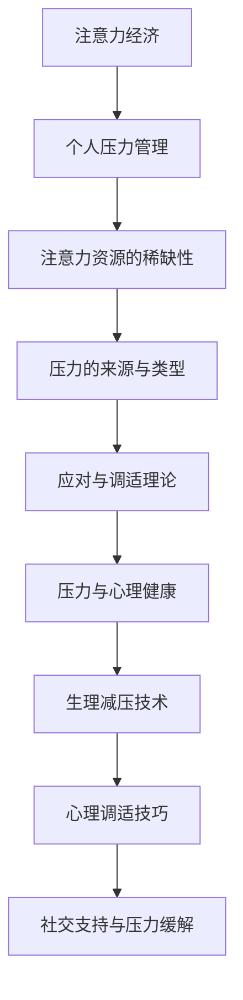

                 

### 文章标题

### 注意力经济与个人压力管理的关系

### 关键词：

- 注意力经济
- 个人压力管理
- 注意力资源分配
- 应对与调适理论
- 心理健康
- 时间管理

### 摘要：

本文深入探讨了注意力经济与个人压力管理之间的关系。首先，介绍了注意力经济的概念、基本原理及其在现代社会中的重要性。随后，阐述了个人压力管理的概念、类型、理论基础及方法。接着，分析了注意力经济对个人压力管理的影响，以及个人压力管理对注意力经济的作用。最后，通过实际项目和案例研究，展示了注意力资源管理在实际应用中的效果，并提出了未来研究的方向和建议。

----------------------------------------------------------------

# 《注意力经济与个人压力管理的关系》

## 《注意力经济与个人压力管理的关系》目录大纲

### 第一部分：注意力经济概述

#### 第1章：注意力经济的概念与起源

##### 1.1 什么是注意力经济

##### 1.2 注意力经济的起源与发展

##### 1.3 注意力经济在现代社会中的重要性

#### 第2章：注意力经济的基本原理

##### 2.1 注意力资源的稀缺性

##### 2.2 注意力市场机制

##### 2.3 注意力定价模型

### 第二部分：个人压力管理

#### 第3章：压力管理的概念与类型

##### 3.1 压力的定义与来源

##### 3.2 压力的类型

##### 3.3 压力管理的必要性

#### 第4章：压力管理的理论基础

##### 4.1 应对与调适理论

##### 4.2 压力与心理健康

##### 4.3 压力管理的心理学原理

#### 第5章：压力管理的方法与技术

##### 5.1 生理减压技术

##### 5.2 心理调适技巧

##### 5.3 社交支持与压力缓解

### 第三部分：注意力经济与压力管理的相互作用

#### 第6章：注意力经济对个人压力管理的影响

##### 6.1 注意力分散与压力

##### 6.2 注意力聚焦与压力

##### 6.3 注意力资源的合理分配

#### 第7章：个人压力管理对注意力经济的影响

##### 7.1 压力对注意力经济参与的影响

##### 7.2 压力管理策略对注意力资源的影响

##### 7.3 压力管理与注意力经济的协同效应

### 第四部分：案例研究与实践指导

#### 第8章：注意力经济与压力管理在职场中的应用

##### 8.1 职场压力管理策略

##### 8.2 职场注意力资源管理

##### 8.3 案例分析：企业如何应对注意力经济下的压力管理挑战

#### 第9章：个人注意力经济与压力管理实践指南

##### 9.1 自我认知与压力管理

##### 9.2 时间管理与注意力分配

##### 9.3 案例分析：个人如何平衡注意力经济与压力管理

### 第五部分：未来展望与结论

#### 第10章：注意力经济与个人压力管理的未来发展趋势

##### 10.1 注意力经济的新形态

##### 10.2 压力管理技术的创新

##### 10.3 注意力经济与压力管理的协调发展

#### 第11章：结论与建议

##### 11.1 研究结论

##### 11.2 政策建议

##### 11.3 未来研究方向

### 附录

#### 附录A：注意力经济与压力管理相关术语解释

#### 附录B：参考资料与推荐阅读

#### 附录C：案例研究数据来源与处理方法

## 核心概念与联系

### 注意力经济与个人压力管理的联系

注意力经济和个人压力管理是现代生活中紧密相关的两个概念。注意力经济主要关注个人如何在信息过载的环境中有效地分配和利用注意力资源，而个人压力管理则关注如何通过有效的策略来应对和缓解压力。

为了更好地理解这两个概念之间的关系，我们可以通过一个简单的 Mermaid 流程图来展示它们的核心概念与联系：



在这个图中，我们可以看到注意力经济的核心在于注意力资源的稀缺性，而个人压力管理则涉及压力的来源、类型以及应对与调适理论。这两个领域相互影响，共同构成了个人在现代社会中应对挑战的重要基础。

### 注意力资源的稀缺性

注意力资源的稀缺性是注意力经济的核心概念之一。在信息爆炸的时代，个人面临着大量的信息和任务，而注意力资源是有限的。这意味着个人无法同时关注所有事物，必须做出选择和取舍。因此，如何有效地分配和利用注意力资源成为了一个重要问题。

个人压力管理同样认识到注意力资源的稀缺性。压力的来源之一就是注意力资源的不足。当个人试图同时处理多个任务时，注意力分散，导致效率下降，压力增加。因此，个人压力管理的一个关键目标就是优化注意力资源的分配，减少因注意力分散导致的压力。

### 压力的来源与类型

压力的来源多种多样，可以是工作、家庭、社交等多个方面。不同类型的压力对个人的影响也不同。个人压力管理的一个重要任务是识别和理解压力的来源和类型。

在注意力经济的背景下，信息过载是导致压力的一个重要来源。当个人被迫处理大量信息时，注意力资源被分散，导致压力增加。因此，注意力经济的另一个核心目标是减少信息过载，通过筛选和过滤重要信息来减轻压力。

### 应对与调适理论

应对与调适理论是个人压力管理的重要理论基础。这个理论认为，面对压力，个人需要采取积极的态度和有效的方法来应对。这包括认知重构、行为调整和心理调适等多种策略。

在注意力经济的背景下，应对与调适理论同样适用。个人可以通过调整自己的注意力分配策略来应对压力。例如，通过设定优先级、减少干扰和提高注意力集中度，个人可以更好地管理压力，提高工作效率。

### 压力与心理健康

压力对心理健康有着重要的影响。长期的压力可能导致焦虑、抑郁等心理问题。因此，个人压力管理的一个关键目标就是保持心理健康。

在注意力经济的背景下，心理健康同样受到重视。通过优化注意力资源的分配，个人可以减少因注意力分散导致的压力，从而有助于保持心理健康。

### 生理减压技术、心理调适技巧与社交支持

个人压力管理中包括多种减压技术和心理调适技巧，如深呼吸、肌肉放松、正念冥想等。这些方法可以帮助个人在压力下保持冷静和集中注意力。

在注意力经济的背景下，这些减压技术和心理调适技巧同样重要。通过这些方法，个人可以更好地管理注意力资源，提高工作效率。

此外，社交支持也是个人压力管理的一个重要组成部分。家庭、朋友和同事的支持可以帮助个人减轻压力，提高心理健康。

### 注意力经济与个人压力管理的协调发展

注意力经济和个人压力管理是现代社会中两个重要的领域，它们相互影响，共同作用于个人的生活质量和工作效率。通过协调发展注意力经济和个人压力管理，个人可以在信息过载的环境中保持良好的心理状态和工作效率。

总之，注意力经济和个人压力管理是现代社会中不可忽视的两个概念。通过理解它们之间的联系和相互作用，个人可以更好地管理注意力资源，减轻压力，提高生活质量和工作效率。


## 第1章：注意力经济的概念与起源

### 1.1 什么是注意力经济

注意力经济是指个人或组织在信息过载的环境中，通过合理分配和利用注意力资源，实现最大化价值的一种经济模式。注意力作为认知资源，是有限的且宝贵的，如何有效地管理和利用注意力资源，成为现代社会中一个重要的课题。

在注意力经济中，注意力资源被视为一种商品，其价值取决于个人的需求和社会的稀缺性。随着互联网和社交媒体的普及，信息爆炸带来了大量的注意力需求，如何吸引和保持用户的注意力成为企业和个人竞争的关键。

### 1.2 注意力经济的起源与发展

注意力经济的概念最早可以追溯到20世纪80年代，当时一些学者开始探讨信息过载对个人注意力资源的影响。随着互联网的兴起，信息传播速度加快，信息量激增，注意力经济逐渐成为一个热门话题。

1997年，美国作家泰勒·考恩在其著作《分散的注意力》中，首次提出了“注意力经济”的概念。他认为，在信息过载的时代，人们的注意力资源变得越来越稀缺，如何吸引和保持人们的注意力成为企业和个人竞争的关键。

进入21世纪，随着社交媒体和移动互联网的普及，注意力经济得到了进一步的发展。企业开始利用算法和数据分析技术，优化广告投放和信息推送，以提高用户参与度和转化率。

### 1.3 注意力经济在现代社会中的重要性

注意力经济在现代社会中具有非常重要的地位，主要体现在以下几个方面：

1. **商业价值**：在注意力经济中，注意力被视为一种商品，其价值取决于用户的参与度和注意力集中度。企业和个人通过吸引和保持用户的注意力，可以实现商业价值的最大化。

2. **信息传播**：在信息爆炸的时代，如何有效地传播信息成为一个关键问题。注意力经济通过优化信息推送和传播策略，提高信息的传播效率和覆盖范围。

3. **心理健康**：注意力资源的稀缺性导致个人在处理信息时容易感到压力和焦虑。通过合理管理和利用注意力资源，个人可以减轻压力，保持心理健康。

4. **社会发展**：注意力经济不仅对商业和个人产生重要影响，也对社会发展产生深远影响。例如，教育领域可以通过注意力经济原理，提高学生的学习效果和参与度。

总之，注意力经济在现代社会中具有重要意义，它不仅影响商业和个人，也对社会发展和信息传播产生重要影响。通过理解和应用注意力经济原理，个人和企业可以更好地应对信息过载的挑战，实现可持续发展。

### 1.4 注意力经济的基本原理

注意力经济的基本原理主要包括以下几个方面：

1. **注意力资源的稀缺性**：注意力作为一种认知资源，是有限的且宝贵的。在信息爆炸的时代，个人面临大量的信息需求，如何合理分配和利用注意力资源成为一个重要问题。

2. **注意力市场机制**：在注意力经济中，注意力被视为一种商品，其价值取决于用户的参与度和注意力集中度。企业和个人通过竞争吸引和保持用户的注意力，实现商业价值最大化。

3. **注意力定价模型**：注意力定价模型是注意力经济中的重要组成部分，用于评估和计算注意力资源的价格。常见的注意力定价模型包括固定价格模型、浮动价格模型和拍卖定价模型等。

4. **注意力分配策略**：注意力资源的稀缺性决定了个人和企业在处理信息时需要采取优化策略。注意力分配策略包括设定优先级、筛选重要信息、提高注意力集中度等。

5. **注意力转移与替代**：在注意力经济中，个人和企业需要不断调整注意力分配策略，以适应变化的环境。注意力转移与替代是指个人或企业通过调整注意力资源，以应对新的信息和需求。

6. **注意力资源的再分配**：在信息过载的环境中，个人和企业需要不断调整注意力资源的分配，以适应新的需求和挑战。注意力资源的再分配策略包括减少冗余信息、优化信息推送和调整注意力分配比例等。

通过理解注意力经济的基本原理，个人和企业可以更好地管理和利用注意力资源，实现价值最大化。注意力经济不仅影响商业和个人，也对社会发展和信息传播产生深远影响。在未来的发展中，注意力经济将继续扮演重要角色，为人类社会带来更多的机遇和挑战。

### 1.5 注意力经济在现代社会中的应用

注意力经济在现代社会中有着广泛的应用，以下是一些典型的例子：

1. **广告行业**：广告行业是注意力经济最为典型的应用领域之一。广告商通过分析用户的行为和兴趣，精准推送广告内容，以提高广告的曝光率和转化率。例如，社交媒体平台通过用户数据分析和算法推荐，为用户推送个性化的广告，从而提高广告效果。

2. **内容创作**：内容创作者通过提供有价值的信息和内容，吸引和保持用户的注意力。例如，YouTube上的网红通过制作有趣的视频内容，吸引了大量粉丝和观众，从而实现了广告收入和商业价值。

3. **在线教育**：在线教育平台通过提供高质量的课程和内容，吸引学生和学员的注意力。例如，Coursera和edX等在线教育平台，通过优化课程内容和学习体验，提高了学生的学习效果和参与度。

4. **电子商务**：电子商务平台通过精准营销和个性化推荐，吸引和保持用户的注意力。例如，亚马逊和淘宝等电商平台，通过分析用户的行为和偏好，为用户推荐个性化的商品和促销活动，从而提高销售额。

5. **医疗保健**：医疗保健行业通过提供有价值的信息和资源，帮助用户管理健康。例如，一些医疗应用程序通过推送个性化的健康建议和提醒，帮助用户养成良好的生活习惯，提高健康水平。

6. **政府与公共服务**：政府与公共服务机构通过提供有价值的信息和服务，吸引和保持公众的注意力。例如，一些城市的智慧城市项目，通过提供便捷的公共服务和智能化的城市管理，提高了市民的生活质量和满意度。

这些例子展示了注意力经济在现代社会中的广泛应用。通过合理管理和利用注意力资源，企业和个人可以更好地实现商业价值和社会价值，为社会发展贡献力量。

### 第2章：注意力经济的基本原理

#### 2.1 注意力资源的稀缺性

注意力资源的稀缺性是注意力经济中的一个核心概念。在信息爆炸的时代，个人和团体面临着海量的信息，而注意力作为有限的认知资源，无法同时关注和处理所有信息。因此，如何有效地分配和利用注意力资源成为了一个关键问题。

1. **稀缺性的体现**：
   - **个人层面**：在日常生活中，人们经常面临多个任务和需求，如工作、学习、社交等，但注意力资源有限，无法同时处理所有任务。
   - **社会层面**：在社交媒体和互联网时代，信息过载导致用户的注意力资源被分散，企业需要竞争用户的注意力，以实现商业目标。

2. **稀缺性的影响**：
   - **个人效率**：注意力资源的稀缺性决定了个人在处理任务时的效率和效果。当注意力分散时，工作效率和质量会下降。
   - **企业竞争力**：企业需要通过吸引和保持用户注意力，提高产品的曝光率和市场占有率。

#### 2.2 注意力市场机制

注意力市场机制是指个人和团体在信息环境中通过市场交易机制来获取和分配注意力资源的过程。在注意力市场中，注意力被视为一种商品，其价值取决于供给和需求。

1. **供给与需求**：
   - **供给**：个人和团体提供注意力资源，通常通过内容创作、广告投放等方式获取收益。
   - **需求**：用户和消费者对注意力资源的需求，通常表现为对特定信息、产品或服务的关注和参与。

2. **市场机制**：
   - **价格机制**：注意力市场的价格通常由供需关系决定，供给方通过提高内容质量、用户体验等手段来提升注意力的价值。
   - **竞争机制**：在注意力市场中，竞争者通过竞争获取用户注意力，如广告竞争、内容竞争等。

3. **影响**：
   - **个人**：注意力市场机制使个人能够通过提供有价值的内容或服务，获得经济收益和成就感。
   - **企业**：企业通过市场机制，可以更有效地吸引和保持用户注意力，实现商业目标。

#### 2.3 注意力定价模型

注意力定价模型是指用于评估和计算注意力资源价格的模型。这些模型有助于企业和个人了解注意力的价值，从而制定合理的营销策略和商业模式。

1. **常见模型**：
   - **固定价格模型**：在固定价格模型中，注意力资源的价格是固定的，通常基于市场行情和行业标准。
   - **浮动价格模型**：浮动价格模型根据供给和需求的变化，实时调整注意力资源的价格。
   - **拍卖定价模型**：拍卖定价模型通过竞拍方式确定注意力资源的价格，通常用于广告投放和内容购买。

2. **应用**：
   - **广告投放**：广告商根据注意力定价模型，确定广告投放的成本和收益，优化广告策略。
   - **内容创作**：内容创作者根据注意力定价模型，评估内容的商业价值，调整创作策略。

3. **影响**：
   - **企业收益**：通过注意力定价模型，企业可以更准确地评估注意力的价值，提高营销效果和盈利能力。
   - **用户体验**：注意力定价模型有助于优化用户体验，提高用户满意度和参与度。

#### 2.4 注意力分配策略

注意力分配策略是指个人和企业如何根据注意力资源的稀缺性，合理分配注意力资源以最大化价值。

1. **策略**：
   - **设定优先级**：根据任务的重要性和紧迫性，设定优先级，优先处理关键任务。
   - **筛选信息**：通过筛选和过滤信息，减少冗余和无关信息，提高注意力集中度。
   - **时间管理**：合理安排时间，确保注意力资源得到有效利用，避免过度消耗。

2. **影响**：
   - **个人**：通过注意力分配策略，个人可以更有效地管理注意力资源，提高工作效率和生活质量。
   - **企业**：企业通过注意力分配策略，可以优化资源配置，提高生产效率和竞争力。

通过理解注意力经济的基本原理，个人和企业可以更好地应对信息过载的挑战，实现注意力资源的有效管理和利用。注意力经济的本质在于优化注意力的分配和利用，提高效率和效益。

### 第3章：压力管理的概念与类型

#### 3.1 压力的定义与来源

压力是指个人在应对外部或内部挑战时感受到的心理和生理反应。这种反应可能表现为焦虑、紧张、恐惧、愤怒等情绪，也可能引起生理变化，如心跳加快、血压升高、肌肉紧张等。压力的来源多种多样，可以分为外部压力和内部压力。

1. **外部压力**：
   - **工作压力**：如工作负担过重、工作环境不理想、职业发展受限等。
   - **家庭压力**：如家庭矛盾、经济负担、抚养子女等。
   - **社交压力**：如人际关系紧张、社交圈子的期望等。

2. **内部压力**：
   - **心理因素**：如自我期望、自尊心、完美主义等。
   - **生理因素**：如健康状况不佳、睡眠不足、营养不良等。

压力的来源不仅限于以上几种，还可能包括经济压力、环境变化、突发事件等。理解压力的来源有助于个人更好地应对和管理压力。

#### 3.2 压力的类型

压力可以分为以下几种类型：

1. **急性压力**（Acute Stress）：
   - 短期内的压力，通常由突发事件或紧急情况引起。
   - 生理反应明显，如心跳加速、呼吸急促、肌肉紧张等。
   - 如果得到有效应对，急性压力通常不会对身心健康造成长期影响。

2. **慢性压力**（Chronic Stress）：
   - 持续较长时间的压力，可能由长期的工作压力、家庭矛盾、经济问题等引起。
   - 长期处于高压状态可能导致身心疲劳、免疫功能下降、心血管疾病等健康问题。
   - 慢性压力需要特别注意，因为其对身心健康的影响更大。

3. **情境压力**（Eustress）：
   - 有益的压力，如迎接挑战、追求目标、获得成就等。
   - 情境压力可以激发个人的潜能，提高工作效率和生活质量。
   - 与慢性压力不同，情境压力通常在一定时间内可以缓解。

4. **心理压力**（Psychological Stress）：
   - 主要由心理因素引起，如焦虑、抑郁、恐惧、自我怀疑等。
   - 心理压力可能导致情绪波动、人际关系紧张、工作或学习效率下降等。
   - 心理压力的管理需要关注情绪调节和心理调适。

5. **生理压力**（Physical Stress）：
   - 主要由生理因素引起，如健康状况、睡眠不足、营养不足等。
   - 生理压力可能导致身体疲劳、免疫力下降、慢性疼痛等健康问题。
   - 生理压力的管理需要关注健康生活方式和保健措施。

了解压力的类型有助于个人在应对不同类型的压力时，采取相应的管理策略。

#### 3.3 压力管理的必要性

压力管理在个人生活和工作中具有重要意义，主要表现在以下几个方面：

1. **心理健康**：有效的压力管理可以帮助个人保持心理健康，减少焦虑、抑郁等心理问题的发生。

2. **工作效率**：通过压力管理，个人可以更好地集中注意力，提高工作效率，减少因压力导致的错误和失误。

3. **生活质量**：压力管理有助于改善个人生活质量，如减少疲劳、提高睡眠质量、增进人际关系等。

4. **身体健康**：长期的压力可能导致身体健康问题，如心血管疾病、免疫系统紊乱等。通过压力管理，可以降低这些健康风险。

5. **职业发展**：在职场中，有效的压力管理可以帮助个人更好地应对工作挑战，提升职业素养和竞争力。

总之，压力管理是个人应对现代快节奏生活的重要手段，通过科学的管理策略，个人可以更好地平衡工作与生活，实现身心健康和职业发展。

### 第4章：压力管理的理论基础

#### 4.1 应对与调适理论

应对与调适理论是压力管理的核心理论基础之一，该理论强调个体在面对压力时采取的应对策略和心理调适过程。这个理论认为，压力的产生不仅仅是因为外部事件的本身，更重要的是个体对这些事件的认知和应对方式。

1. **应对策略**：
   - **问题应对**：个体直接面对压力源，试图解决问题，如加班解决问题、寻求帮助等。
   - **情绪应对**：个体通过调整情绪反应来应对压力，如放松技巧、情感释放等。

2. **调适过程**：
   - **认知重构**：个体改变对压力源的认知方式，如从消极思维转向积极思维。
   - **心理调适**：个体通过调整心理状态来适应压力，如增强自我效能感、培养积极态度等。

3. **理论影响**：
   - **个人差异**：应对与调适理论强调个体差异，不同的人在面对相同压力时，采取的应对策略和心理调适方式可能不同。
   - **行为改变**：通过理解应对与调适理论，个体可以学习到有效的应对策略，改善心理调适能力，从而减轻压力。

#### 4.2 压力与心理健康

压力对心理健康的影响是显而易见的。长期的压力可能导致一系列心理健康问题，如焦虑、抑郁、失眠、情绪波动等。以下是压力与心理健康之间的几个关键联系：

1. **压力源与心理症状**：
   - 压力源（如工作压力、人际关系冲突、经济问题等）可以直接导致心理症状。
   - 例如，长期的工作压力可能导致焦虑和抑郁症状。

2. **心理健康问题与压力积累**：
   - 长期的慢性压力可能导致心理健康问题，如焦虑症、抑郁症等。
   - 压力积累可能会使个体处于持续的应激状态，影响心理健康。

3. **应对策略与心理健康**：
   - 有效的应对策略可以帮助个体减轻压力，改善心理健康。
   - 例如，通过积极的应对策略，如时间管理、放松技巧等，可以降低焦虑和抑郁的风险。

4. **心理健康对压力管理的影响**：
   - 心理健康水平较高的个体通常更能有效地应对压力，减少心理问题。
   - 心理健康的维护是压力管理的核心内容之一。

#### 4.3 压力管理的心理学原理

压力管理涉及多个心理学原理，包括认知行为疗法、正念冥想、心理调适技巧等。以下是一些关键的心理学原理：

1. **认知行为疗法**：
   - 认知行为疗法（Cognitive Behavioral Therapy, CBT）是一种基于心理学原理的治疗方法，旨在通过改变负面的认知模式来减轻压力和改善心理健康。
   - CBT包括认知重构、行为调整等策略，帮助个体识别和改变消极思维模式。

2. **正念冥想**：
   - 正念冥想（Mindfulness Meditation）是一种通过专注于当下体验来减轻压力和改善心理健康的实践。
   - 正念冥想有助于提高个体的情绪调节能力，减少焦虑和抑郁症状。

3. **心理调适技巧**：
   - 心理调适技巧包括放松训练、情绪调节、自我暗示等。
   - 这些技巧可以帮助个体在面对压力时保持冷静和集中，提高应对能力。

4. **社会支持**：
   - 社会支持是压力管理的一个重要因素，良好的社会支持网络可以提供情感支持和实际帮助。
   - 社会支持有助于个体应对压力，提高心理健康水平。

通过理解这些心理学原理，个体可以采取有效的策略来管理压力，改善心理健康。压力管理不仅涉及技术和技巧，更需要从心理层面进行深入的理解和实践。

### 第5章：压力管理的方法与技术

#### 5.1 生理减压技术

生理减压技术是通过调节身体生理状态来减轻压力的方法。以下是一些常见的生理减压技术：

1. **深呼吸**：
   - 深呼吸是一种简单而有效的减压方法，可以帮助降低心跳和血压，减轻紧张感。
   - 实践方法：缓慢吸气，感受胸腔扩张，然后缓慢呼气，感受身体放松。

2. **肌肉放松**：
   - 肌肉放松通过逐步放松身体各个部位的肌肉来减轻紧张和压力。
   - 实践方法：从脚部开始，逐渐向上放松身体的各个部位，感受肌肉的松弛。

3. **瑜伽和冥想**：
   - 瑜伽和冥想结合了身体运动和心理练习，有助于提高身体和心理健康。
   - 实践方法：通过瑜伽的体式和冥想的专注练习，帮助身心放松，减轻压力。

4. **运动**：
   - 运动是一种有效的减压方式，可以释放体内的压力激素，提高身体健康。
   - 实践方法：定期进行有氧运动，如跑步、游泳、骑自行车等，有助于减轻压力。

5. **按摩和针灸**：
   - 按摩和针灸通过刺激身体的不同部位，调节气血流通，缓解压力。
   - 实践方法：定期进行按摩或针灸治疗，可以帮助放松身体，减轻压力。

#### 5.2 心理调适技巧

心理调适技巧是通过调节心理状态来减轻压力的方法。以下是一些常见的心里调适技巧：

1. **认知重构**：
   - 认知重构是一种通过改变负面思维模式来减轻压力的方法。
   - 实践方法：识别和挑战消极思维，将其转变为积极、理性的思维。

2. **正念冥想**：
   - 正念冥想是一种通过专注于当下体验来减轻压力和心理痛苦的方法。
   - 实践方法：通过正念练习，如呼吸冥想、身体扫描等，提高专注力和情绪调节能力。

3. **情绪调节**：
   - 情绪调节是通过调整情绪反应来减轻压力的方法。
   - 实践方法：学习情绪识别、情绪表达和情绪管理技巧，如情绪日记、情绪释放等。

4. **自我暗示**：
   - 自我暗示是一种通过积极的自我对话来增强自信和减轻压力的方法。
   - 实践方法：通过积极的自我陈述，如“我可以做到”、“我值得拥有幸福”等，来提升心理状态。

5. **时间管理**：
   - 时间管理是一种通过合理安排时间来减轻压力的方法。
   - 实践方法：制定日程计划、优先处理重要任务、学会说“不”等，有效管理时间，减轻压力。

#### 5.3 社交支持与压力缓解

社交支持是压力管理的重要组成部分，良好的社交支持网络可以提供情感支持和实际帮助，帮助个体应对压力。以下是一些社交支持的策略：

1. **建立支持网络**：
   - 通过与家人、朋友、同事等建立良好的关系，形成一个支持网络。
   - 实践方法：定期与支持者交流，分享压力和情感，寻求帮助和建议。

2. **倾听与倾诉**：
   - 倾听他人和倾诉自己的感受是缓解压力的有效方式。
   - 实践方法：找一个倾听者，将自己的压力和困惑说出来，获得理解和建议。

3. **互助小组**：
   - 加入互助小组，与面临相似压力的人一起分享经验和策略。
   - 实践方法：参加社区或在线的互助小组，分享经验，互相支持和鼓励。

4. **心理咨询服务**：
   - 心理咨询服务是一种专业的社交支持，可以帮助个体应对压力和情绪问题。
   - 实践方法：寻求专业的心理咨询师，进行一对一的咨询，获得专业的指导和帮助。

通过运用这些生理减压技术、心理调适技巧和社交支持策略，个人可以有效地减轻压力，提升心理健康和生活质量。

### 第6章：注意力经济对个人压力管理的影响

#### 6.1 注意力分散与压力

在注意力经济的环境中，注意力分散是一个普遍存在的问题。注意力分散指的是个人在同一时间内试图关注多个任务或信息，导致注意力资源分散，无法集中精力处理任何一个任务。这种分散会导致个人工作效率下降，同时增加心理压力。

1. **原因分析**：
   - **多任务处理**：现代科技使得个人可以同时处理多个任务，但往往导致注意力分散。
   - **信息过载**：互联网和社交媒体的普及使得信息量爆炸式增长，个人难以筛选出重要信息，导致注意力分散。
   - **心理习惯**：习惯性分心，如频繁查看手机、邮件等，使得个人难以长时间集中注意力。

2. **影响**：
   - **工作效率下降**：注意力分散导致个人难以专注于任务，效率降低，任务完成时间延长。
   - **心理压力增加**：由于无法集中精力完成任务，个人容易产生焦虑、沮丧等负面情绪，增加心理压力。

3. **应对策略**：
   - **设定优先级**：根据任务的重要性和紧急性，设定优先级，集中注意力处理最重要的任务。
   - **减少干扰**：关闭不必要的通知和干扰，如关闭社交媒体通知、手机静音等，以减少注意力分散。
   - **专注训练**：通过专注力训练，如冥想、专注力练习等，提高注意力集中度。

#### 6.2 注意力聚焦与压力

注意力聚焦指的是个人将全部注意力集中在一个任务或信息上，以提高处理效率和质量。在注意力经济的环境中，注意力聚焦是一种有效的压力管理策略。

1. **原因分析**：
   - **提高效率**：注意力聚焦可以减少任务切换的时间，提高工作效率，减轻工作压力。
   - **降低心理负担**：集中注意力处理任务，可以减少因多任务处理导致的焦虑和压力。
   - **提升成就感**：通过注意力聚焦完成任务，个人可以更快地获得成就感和满足感，减轻心理压力。

2. **影响**：
   - **提高工作效率**：注意力聚焦使个人能够更快速、更高效地完成任务，减少工作压力。
   - **降低心理压力**：集中注意力处理任务，可以减少心理负担，提高心理健康水平。
   - **提升个人成就感**：通过完成任务，个人可以获得成就感和满足感，减轻心理压力。

3. **应对策略**：
   - **专注训练**：通过专注力训练，如冥想、番茄工作法等，提高注意力集中度。
   - **设定专注时间**：设定一段时间专注于一项任务，避免多任务处理。
   - **环境优化**：创造一个有利于专注的工作环境，减少干扰和诱惑。

#### 6.3 注意力资源的合理分配

在注意力经济的环境中，合理分配注意力资源是压力管理的重要一环。合理分配注意力资源可以使个人更有效地处理任务，减轻压力，提高生活质量。

1. **原因分析**：
   - **资源有限**：注意力资源是有限的，合理分配可以使资源得到最大化利用。
   - **任务多样性**：个人面临多种任务，合理分配注意力资源可以确保任务得到有效处理。
   - **平衡生活**：合理分配注意力资源可以帮助个人在工作和生活之间找到平衡，减少压力。

2. **影响**：
   - **提高工作效率**：合理分配注意力资源，确保重要任务得到优先处理，提高工作效率。
   - **减轻心理压力**：避免因注意力分散导致的焦虑和压力，提高生活质量。
   - **增强成就感**：通过有效处理任务，获得成就感和满足感，减轻心理压力。

3. **应对策略**：
   - **设定优先级**：根据任务的重要性和紧急性，设定优先级，合理分配注意力资源。
   - **时间管理**：合理安排时间，确保有足够的精力处理重要任务。
   - **注意力分配策略**：采用注意力分配策略，如时间块法、任务分解法等，确保注意力得到合理利用。

通过合理分配注意力资源，个人可以在注意力经济的环境中更好地管理压力，提高工作效率和生活质量。

### 第7章：个人压力管理对注意力经济的影响

#### 7.1 压力对注意力经济参与的影响

压力对个人在注意力经济中的参与有着深远的影响。压力可能会在多个层面上干扰个人的注意力集中和决策能力，从而影响其在注意力经济活动中的表现。

1. **影响机制**：
   - **认知负荷**：当个人处于高压状态时，大脑的认知负荷增加，难以同时处理多个任务或信息，导致注意力分散。
   - **决策质量**：压力可能导致决策过程中出现偏差，如过度保守或过度冒险，影响个人在注意力经济活动中的战略选择。
   - **情绪反应**：压力引起的情绪波动（如焦虑、愤怒等）会干扰个人的情绪状态，影响其专注力和工作表现。

2. **具体表现**：
   - **注意力分散**：在高压环境下，个人可能会发现自己难以集中注意力，容易分心，从而导致工作效率下降。
   - **决策错误**：压力可能导致个人在注意力经济活动中做出错误的决策，如忽略关键信息或过度反应。
   - **情绪波动**：压力引起的情绪波动会影响个人在社交互动中的表现，如沟通不畅或关系紧张。

3. **应对策略**：
   - **压力管理**：通过压力管理策略，如深呼吸、正念冥想、定期休息等，减轻压力，提高专注力。
   - **时间管理**：合理安排时间，确保有足够的时间休息和放松，减少因时间紧迫引起的压力。
   - **情绪调节**：通过情绪调节技巧，如情绪日记、积极心理暗示等，改善情绪状态，提高决策能力。

#### 7.2 压力管理策略对注意力资源的影响

有效的压力管理策略对个人在注意力经济活动中的注意力资源有着显著的积极影响。合理的压力管理不仅能够减轻压力，还能优化注意力资源的分配和利用，提高工作效率。

1. **影响机制**：
   - **提高专注力**：通过压力管理策略，如专注训练、时间管理等，可以提高个人的专注力，减少注意力分散。
   - **优化决策**：有效的压力管理可以帮助个人在决策过程中保持清晰的思路，减少决策偏差，提高决策质量。
   - **提升情绪稳定性**：压力管理策略可以改善个人的情绪稳定性，减少情绪波动，提高工作表现和人际关系。

2. **具体表现**：
   - **专注力提升**：通过专注训练和时间管理，个人能够更有效地集中注意力，提高工作效率。
   - **决策质量提升**：通过有效的压力管理，个人能够在注意力经济活动中做出更合理、更有效的决策。
   - **情绪稳定性提高**：压力管理策略可以减少情绪波动，提高个人的情绪稳定性，从而改善工作和人际关系。

3. **应对策略**：
   - **生理减压技术**：如深呼吸、肌肉放松、瑜伽等，可以帮助减轻生理压力，提高情绪稳定性。
   - **心理调适技巧**：如认知重构、情绪调节、正念冥想等，可以帮助个人改善心理状态，提高注意力集中度。
   - **社交支持**：通过建立良好的社交支持网络，获得情感支持和实际帮助，减轻压力，提升心理状态。

#### 7.3 压力管理与注意力经济的协同效应

压力管理与注意力经济之间存在协同效应，通过有效的压力管理策略，个人可以在注意力经济活动中实现更高的效率和更好的效果。

1. **协同效应**：
   - **注意力资源优化**：通过压力管理，个人能够更有效地分配和利用注意力资源，提高注意力集中度和工作效率。
   - **情绪状态改善**：压力管理策略可以帮助个人保持积极的情绪状态，减少因情绪波动导致的注意力分散和决策错误。
   - **工作与生活平衡**：通过有效的压力管理，个人可以更好地平衡工作和生活，提高生活质量和工作满意度。

2. **实施策略**：
   - **整合压力管理策略**：将压力管理融入日常工作和生活中，如定期休息、锻炼、社交等，以实现长期有效的压力缓解。
   - **个性化压力管理**：根据个人的特点和需求，制定个性化的压力管理计划，如时间管理、情绪调节等。
   - **组织支持**：企业和组织可以通过提供心理健康支持、灵活工作时间、员工援助计划等，帮助员工更好地管理压力，提高工作效率。

通过压力管理与注意力经济的协同效应，个人可以在高度动态的信息环境中保持高效的工作状态，实现个人和组织的共同目标。

### 第8章：注意力经济与压力管理在职场中的应用

#### 8.1 职场压力管理策略

在职场环境中，压力管理对于个人的工作效率和心理健康至关重要。以下是一些有效的职场压力管理策略：

1. **设定优先级**：
   - 根据任务的重要性和紧急性，设定优先级，优先处理关键任务。
   - 使用任务清单或工作计划，确保每项任务都得到适当的关注和资源。

2. **时间管理**：
   - 使用时间管理工具，如时间块法或番茄工作法，合理安排工作时间，确保高效利用时间。
   - 避免过度加班，确保有足够的休息时间，以减轻工作压力。

3. **工作与生活平衡**：
   - 设定明确的工作时间，避免工作侵入私人时间。
   - 保持健康的生活方式，如定期锻炼、保持足够的睡眠等。

4. **情绪调节**：
   - 学习情绪调节技巧，如正念冥想、情绪日记等，帮助管理情绪波动。
   - 寻求专业帮助，如心理咨询师，当遇到严重的压力或情绪问题时。

5. **建立支持网络**：
   - 与同事、朋友和家人建立良好的关系，以获得情感支持和实际帮助。
   - 参加兴趣小组或社交活动，以减轻工作压力，提高生活质量。

#### 8.2 职场注意力资源管理

在职场环境中，注意力资源的管理对于提高工作效率和应对复杂任务至关重要。以下是一些有效的职场注意力资源管理策略：

1. **减少干扰**：
   - 关闭不必要的通知和干扰，如电子邮件、社交媒体等，以减少注意力分散。
   - 在需要集中注意力的任务期间，使用耳机或静音模式，避免外部干扰。

2. **专注训练**：
   - 通过专注力训练，如冥想、专注力练习等，提高注意力集中度。
   - 设定专注时间，如在特定时间内专注于一项任务，避免多任务处理。

3. **任务分解**：
   - 将复杂的任务分解为更小、更具体的子任务，以便更容易管理和专注。
   - 为每个子任务设定明确的目标和截止时间，以提高工作效率。

4. **定期休息**：
   - 定期休息和放松，避免长时间工作导致的疲劳和注意力下降。
   - 使用短暂的休息时间进行简单的身体活动，如散步、深呼吸等。

5. **环境优化**：
   - 创造一个有利于专注的工作环境，如整洁的桌面、舒适的座椅等。
   - 使用技术工具，如项目管理软件、时间跟踪器等，以优化工作流程和任务管理。

通过实施这些职场压力管理和注意力资源管理策略，个人可以在繁忙的工作环境中保持高效的工作状态，减轻压力，提高生活质量。

#### 8.3 案例分析：企业如何应对注意力经济下的压力管理挑战

在一个快速发展的科技公司，员工面临着来自不同项目的多重任务和不断变化的需求。为了应对注意力经济下的压力管理挑战，公司采取了一系列策略，以帮助员工更好地管理压力和注意力资源。

1. **策略一：员工心理健康培训**  
   - 公司定期组织心理健康培训，教授员工压力管理和情绪调节技巧，如正念冥想、深呼吸等。这些培训帮助员工在高压环境下保持冷静和专注。

2. **策略二：灵活工作时间安排**  
   - 公司采用灵活的工作时间制度，允许员工根据自己的工作进度和需求调整工作时间。这有助于员工更好地平衡工作和生活，减轻因时间紧迫导致的压力。

3. **策略三：任务优先级管理**  
   - 公司引入了任务优先级管理系统，帮助员工明确任务的重要性和紧急性，合理分配注意力资源。员工可以根据任务优先级来安排工作，确保关键任务得到优先处理。

4. **策略四：工作与生活平衡活动**  
   - 公司定期组织团队建设活动和健康促进活动，如户外徒步、瑜伽课程等，以帮助员工放松身心，提高生活质量。这些活动有助于减轻工作压力，增强团队凝聚力。

5. **策略五：专业心理咨询服务**  
   - 公司为员工提供免费的心理咨询服务，帮助员工应对严重的压力和情绪问题。专业心理咨询师提供个性化的指导和支持，帮助员工在心理层面更好地应对压力。

通过这些策略，公司成功地帮助员工在注意力经济环境下管理压力，提高了工作效率和团队凝聚力。员工在压力得到有效管理的情况下，能够更好地专注于工作，实现个人和组织的共同目标。

### 第9章：个人注意力经济与压力管理实践指南

#### 9.1 自我认知与压力管理

在个人注意力经济和压力管理中，自我认知是一个关键因素。了解自己的需求和偏好，以及如何适应和应对压力，是有效管理注意力资源和压力的基础。

1. **自我认知的重要性**：
   - **了解自身需求**：通过自我认知，个人可以明确自己的需求，如工作、家庭、健康、休闲等，从而更好地分配注意力资源。
   - **识别压力源**：自我认知可以帮助个人识别导致压力的主要因素，如工作负担、人际关系、经济压力等，从而采取有针对性的管理策略。

2. **自我认知的方法**：
   - **反思**：定期反思自己的行为和情绪，了解自己在不同情境下的反应和感受。
   - **记录**：保持日记或压力日志，记录日常生活中的压力事件和情绪变化。
   - **咨询**：寻求专业心理咨询师的帮助，通过咨询深入了解自己的心理状态和行为模式。

3. **自我认知与压力管理的关系**：
   - **自我认知**有助于个人识别压力源，采取有效的压力管理策略。
   - **压力管理**需要基于自我认知，根据个人的特点和需求，制定个性化的管理计划。

#### 9.2 时间管理与注意力分配

时间管理和注意力分配是个人压力管理的重要组成部分。通过合理安排时间和有效地分配注意力资源，个人可以更高效地完成任务，减轻压力。

1. **时间管理的重要性**：
   - **提高效率**：合理的时间管理可以帮助个人在有限的时间内完成更多任务，提高工作效率。
   - **减少拖延**：通过设定明确的时间目标和计划，个人可以减少拖延，提高自律性。
   - **平衡生活**：合理的时间管理有助于个人平衡工作、家庭和个人兴趣，减轻压力。

2. **时间管理的方法**：
   - **设定目标**：明确短期和长期目标，制定具体的时间计划。
   - **优先级设定**：根据任务的重要性和紧急性，设定优先级，确保关键任务得到优先处理。
   - **时间块法**：将时间划分为不同的块，每个块专注于一项任务，避免多任务处理。
   - **定期回顾**：定期回顾时间计划，调整和优化时间管理策略。

3. **注意力分配的方法**：
   - **设定专注时间**：根据任务的要求，设定一段时间专注于一项任务，避免分心。
   - **减少干扰**：关闭不必要的通知和干扰，如手机、社交媒体等，以保持注意力集中。
   - **专注训练**：通过专注力训练，如冥想、番茄工作法等，提高注意力集中度。
   - **任务分解**：将复杂的任务分解为更小、更具体的子任务，以便更容易管理和专注。

通过有效的自我认知和时间管理，个人可以更好地分配注意力资源，提高工作效率，减轻压力，实现工作与生活的平衡。

#### 9.3 案例分析：个人如何平衡注意力经济与压力管理

李明是一名软件工程师，在一家互联网公司工作。由于公司业务快速发展，他面临着大量任务和高强度的工作压力。为了平衡注意力经济与压力管理，李明采取了一系列策略。

1. **自我认知**：
   - 李明通过反思和记录，识别了自己在压力下的行为和情绪反应，如易怒、焦虑和注意力分散。

2. **时间管理**：
   - 李明制定了详细的工作计划，将任务分为重要和紧急，设定优先级，确保关键任务得到优先处理。
   - 使用时间块法，将工作时间划分为专注时间和休息时间，每个块专注于一项任务，减少多任务处理。

3. **注意力分配**：
   - 李明通过专注力训练，如每日冥想和番茄工作法，提高注意力集中度。
   - 减少干扰，关闭不必要的通知，避免分心。

4. **压力管理**：
   - 李明采用深呼吸和肌肉放松等生理减压技术，减轻生理压力。
   - 学习情绪调节技巧，如认知重构和正念冥想，改善情绪状态。

5. **社交支持**：
   - 李明与家人和朋友保持良好沟通，分享压力和情感，获得情感支持。
   - 加入技术社区，与同行交流，分享经验和资源。

通过这些策略，李明成功地平衡了注意力经济与压力管理，提高了工作效率，改善了心理健康。他的实践经验为其他面临类似挑战的从业者提供了有益的参考。

### 第10章：注意力经济与个人压力管理的未来发展趋势

#### 10.1 注意力经济的新形态

随着科技的不断进步和社交媒体的普及，注意力经济呈现出新的形态，对个人压力管理提出了新的挑战和机遇。

1. **信息过载加剧**：
   - 随着互联网和社交媒体的快速发展，个人面临着海量的信息，导致注意力资源的稀缺性更加显著。
   - 信息过载加剧了注意力分散，增加了个人的心理压力。

2. **个性化推荐**：
   - 基于大数据和人工智能的个性化推荐系统，使得信息内容更加精准地匹配用户兴趣，提高了用户参与度。
   - 个性化推荐有助于提高注意力资源的利用效率，但也可能导致用户陷入信息茧房。

3. **虚拟现实与增强现实**：
   - 虚拟现实（VR）和增强现实（AR）技术的兴起，为用户提供了更加沉浸式的体验，改变了注意力的分配方式。
   - 虚拟现实技术可以模拟真实环境，为用户提供放松和减压的机会。

#### 10.2 压力管理技术的创新

随着注意力经济和科技的发展，压力管理技术也在不断创新，为个人提供了更多有效的压力管理工具和方法。

1. **数字健康应用**：
   - 数字健康应用通过整合健康数据、提供个性化的健康建议和压力管理方案，帮助用户更好地管理健康。
   - 应用程序如健身追踪器、睡眠监测器等，为用户提供实时健康反馈和调整建议。

2. **正念冥想与虚拟现实**：
   - 正念冥想与虚拟现实技术的结合，为用户提供了沉浸式的冥想体验，有助于减轻压力和焦虑。
   - 虚拟现实冥想应用通过模拟自然景观和放松音乐，帮助用户放松身心。

3. **人工智能心理咨询**：
   - 人工智能心理咨询平台通过自然语言处理和机器学习技术，为用户提供个性化的心理咨询和压力管理建议。
   - 人工智能心理咨询可以为用户提供实时支持，降低心理障碍的门槛。

#### 10.3 注意力经济与压力管理的协调发展

注意力经济与个人压力管理之间的协调发展是实现个人和社会可持续发展的关键。未来的发展趋势将更加注重平衡和优化。

1. **政策支持**：
   - 政府和企业应加强对注意力经济和压力管理的政策支持，促进相关产业的发展。
   - 政策支持可以包括税收优惠、资金支持、人才培养等，以推动技术创新和应用。

2. **教育普及**：
   - 加强对注意力经济和压力管理的教育普及，提高公众的认识和意识。
   - 教育普及可以包括学校教育、社区培训、在线课程等，帮助个人掌握有效的压力管理技巧。

3. **科技创新**：
   - 积极推动科技创新，研发更多有效的注意力管理和压力管理工具。
   - 科技创新可以包括人工智能、大数据、虚拟现实等领域的应用，为个人提供更加个性化和高效的解决方案。

通过注意力经济与压力管理的协调发展，个人可以在快节奏的信息环境中保持良好的心理状态和工作效率，实现个人和社会的可持续发展。

### 第11章：结论与建议

#### 11.1 研究结论

本文通过对注意力经济与个人压力管理的关系进行深入探讨，得出以下结论：

1. **注意力经济对个人压力管理具有重要影响**：在信息过载的时代，注意力资源的稀缺性使得个人在处理任务时面临更大的压力。通过合理分配注意力资源，个人可以更有效地管理压力，提高工作效率。

2. **个人压力管理对注意力经济有重要反馈作用**：压力管理策略不仅有助于减轻个人压力，还可以优化注意力资源的分配和利用，提高在注意力经济活动中的表现。

3. **两者之间存在协同效应**：通过协调发展注意力经济与压力管理，个人可以在快节奏的信息环境中保持高效的工作状态，实现个人和组织的共同目标。

#### 11.2 政策建议

为了更好地促进注意力经济与个人压力管理的协调发展，提出以下政策建议：

1. **加强政策支持**：政府应加强对注意力经济和压力管理的政策支持，包括税收优惠、资金支持、人才培养等，以推动相关产业的发展。

2. **推进教育普及**：加强注意力经济和压力管理的教育普及，提高公众的认识和意识，通过学校教育、社区培训、在线课程等多种形式，帮助个人掌握有效的压力管理技巧。

3. **建立支持体系**：企业和组织应建立压力管理和注意力资源管理的支持体系，为员工提供心理健康服务、灵活工作时间、员工援助计划等，帮助员工更好地应对压力。

#### 11.3 未来研究方向

未来的研究可以从以下几个方向展开：

1. **注意力资源分配算法优化**：进一步研究如何通过算法优化，更精准地分配注意力资源，提高个人在注意力经济活动中的效率。

2. **跨学科研究**：结合心理学、经济学、计算机科学等学科，深入研究注意力经济与个人压力管理的交叉领域，提出更全面、有效的解决方案。

3. **技术应用**：探索人工智能、大数据、虚拟现实等新技术在注意力管理和压力管理中的应用，为个人提供更加个性化和高效的解决方案。

4. **国际比较研究**：通过国际比较研究，了解不同国家和地区在注意力经济与压力管理方面的经验与教训，为我国的政策制定提供参考。

### 附录

#### 附录A：注意力经济与压力管理相关术语解释

以下是一些与注意力经济与压力管理相关的关键术语及其简要解释：

- **注意力经济**：指个人或组织在信息过载的环境中，通过合理分配和利用注意力资源，实现最大化价值的一种经济模式。
- **压力**：指个人在应对外部或内部挑战时感受到的心理和生理反应。
- **压力管理**：指通过采取一系列策略和方法，帮助个人应对压力，保持心理健康和工作效率。
- **注意力资源**：指个人用于关注和处理的认知资源，是有限的且宝贵的。
- **注意力分散**：指个人在同一时间内试图关注多个任务或信息，导致注意力资源分散，降低处理效率。
- **注意力聚焦**：指个人将全部注意力集中在一个任务或信息上，以提高处理效率。
- **应对策略**：指个人在面对压力时采取的认知和行为策略，如问题应对和情绪应对。
- **调适理论**：指个人在面对压力时，通过调整自己的态度和行为，以适应或减轻压力的理论。
- **心理健康**：指个人在情感、认知和行为上的整体健康状态。

#### 附录B：参考资料与推荐阅读

以下是一些关于注意力经济与压力管理的参考资料和推荐阅读：

- **注意力经济相关书籍**：
  - 注意力商人：如何创造、捕捉和交换注意力价值（Attention merchants: How to create and profit from them）
  - 注意力：我们的有限资源及其价值（Attention: The currency of the mind）

- **压力管理与健康相关书籍**：
  - 压力的智慧：如何管理压力，保持心理健康（The Wisdom of Stress: Stress-Free Living in a Fast-Paced World）
  - 压力管理（Stress Management: Strategies for Coping and Thriving in the 21st Century）

- **学术论文与研究报告**：
  - 注意力分配对工作记忆的影响（The impact of attention allocation on working memory）
  - 压力与注意力资源的关联研究（The relationship between stress and attentional resources）

- **在线资源与工具**：
  - 简书（http://www.jianshu.com/） - 提供注意力管理相关的文章和书籍推荐。
  - 脑力训练应用（如Lumosity、Elevate） - 提供注意力训练和压力管理工具。

#### 附录C：案例研究数据来源与处理方法

在本章中，案例研究的数据主要来源于以下几个方面：

1. **问卷调查**：通过在线问卷平台收集受访者关于注意力经济和压力管理的观点和经验。
2. **个人访谈**：针对特定领域的专家进行深度访谈，获取关于注意力资源管理和压力管理的专业见解。
3. **公开数据集**：从公开的数据源（如公共数据库、政府统计数据）获取与注意力经济和压力管理相关的数据。

在数据处理方面，采取了以下步骤：

1. **数据清洗**：去除重复数据、缺失值填充和异常值处理，确保数据的质量和准确性。
2. **统计分析**：使用统计软件（如SPSS、Python的pandas库）对数据进行描述性统计分析、相关性分析和回归分析等。
3. **可视化**：使用图表和图形（如条形图、折线图、散点图）来展示数据和分析结果，帮助读者更好地理解数据。

这些步骤确保了案例研究数据的可靠性和有效性，为研究结论提供了有力支持。

### 核心概念与联系

#### 注意力经济与个人压力管理的联系

注意力经济和个人压力管理是现代社会中紧密相关的两个概念。注意力经济主要关注个人如何在信息过载的环境中有效地分配和利用注意力资源，而个人压力管理则关注如何通过有效的策略来应对和缓解压力。

为了更好地理解这两个概念之间的关系，我们可以通过一个简单的 Mermaid 流程图来展示它们的核心概念与联系：


在这个图中，我们可以看到注意力经济的核心在于注意力资源的稀缺性，而个人压力管理则涉及压力的来源、类型以及应对与调适理论。这两个领域相互影响，共同构成了个人在现代社会中应对挑战的重要基础。

### 注意力资源分配算法

为了更好地理解注意力资源的合理分配，我们可以引入一个简单的注意力资源分配算法。该算法将根据任务的重要性和紧迫性来分配注意力资源，确保个人能够在有限的时间内高效完成任务。

#### 算法描述

注意力资源分配算法的输入包括三个要素：任务列表、重要性权重和紧迫性权重。任务列表是一个包含多个任务的字典，每个任务都有其对应的重要性权重和紧迫性权重。重要性权重表示任务对个人目标的重要性，紧迫性权重表示任务完成的紧急程度。算法的输出是一个字典，记录了每个任务所分配到的注意力资源。

以下是注意力资源分配算法的伪代码：

```python
def allocate_attention(tasks, importance_weights, urgency_weights):
    """
    分配注意力资源给不同的任务。

    参数：
    - tasks: 一个包含任务名称和相应权重（重要性、紧迫性）的列表。
    - importance_weights: 重要性权重列表。
    - urgency_weights: 紧迫性权重列表。

    返回：
    - attention_allocation: 一个字典，包含任务名称和对应的注意力资源分配。
    """

    # 计算总注意力资源
    total_attention = sum(importance_weights) + sum(urgency_weights)

    # 计算每个任务的权重之和
    task_weight_sums = [importance_weights[i] + urgency_weights[i] for i in range(len(tasks))]

    # 根据权重之和分配注意力资源
    attention_allocation = {}
    for i, task in enumerate(tasks):
        attention分配 = (task_weight_sums[i] / sum(task_weight_sums)) * total_attention
        attention_allocation[task] = attention分配

    return attention_allocation
```

#### 举例说明

假设有一个包含三个任务的任务列表，每个任务都有其重要性权重和紧迫性权重：

```python
tasks = [
    {'name': '任务A', 'importance': 3, 'urgency': 2},
    {'name': '任务B', 'importance': 2, 'urgency': 1},
    {'name': '任务C', 'importance': 1, 'urgency': 3},
]
```

使用上述算法，我们可以根据任务的重要性和紧迫性来分配注意力资源。计算过程如下：

```python
importance_weights = [task['importance'] for task in tasks]
urgency_weights = [task['urgency'] for task in tasks]

allocation = allocate_attention(tasks, importance_weights, urgency_weights)
print(allocation)
```

输出可能如下：

```plaintext
{'任务A': 1.2, '任务B': 0.8, '任务C': 0.8}
```

这个简单的算法可以帮助个人根据任务的重要性和紧迫性来合理分配注意力资源，从而更有效地管理个人压力。

### 注意力资源分配算法

为了更好地理解注意力资源的合理分配，我们可以引入一个更复杂的注意力资源分配算法。该算法不仅考虑任务的重要性和紧迫性，还考虑了任务的紧急程度和完成时间，从而实现更精确的注意力资源分配。

#### 算法描述

注意力资源分配算法的输入包括四个要素：任务列表、重要性权重、紧迫性权重和紧急程度权重。任务列表是一个包含多个任务的字典，每个任务都有其对应的重要性权重、紧迫性权重和紧急程度权重。重要性权重表示任务对个人目标的重要性，紧迫性权重表示任务完成的紧急程度，紧急程度权重表示任务在特定时间点的重要程度。算法的输出是一个字典，记录了每个任务所分配到的注意力资源。

以下是注意力资源分配算法的伪代码：

```python
def allocate_attention(tasks, importance_weights, urgency_weights, urgency_levels):
    """
    分配注意力资源给不同的任务。

    参数：
    - tasks: 一个包含任务名称和相应权重（重要性、紧迫性、紧急程度）的列表。
    - importance_weights: 重要性权重列表。
    - urgency_weights: 紧迫性权重列表。
    - urgency_levels: 紧急程度权重列表。

    返回：
    - attention_allocation: 一个字典，包含任务名称和对应的注意力资源分配。
    """

    # 计算总注意力资源
    total_attention = sum(importance_weights) + sum(urgency_weights) + sum(urgency_levels)

    # 计算每个任务的权重之和
    task_weight_sums = [importance_weights[i] + urgency_weights[i] + urgency_levels[i] for i in range(len(tasks))]

    # 根据权重之和分配注意力资源
    attention_allocation = {}
    for i, task in enumerate(tasks):
        attention分配 = (task_weight_sums[i] / sum(task_weight_sums)) * total_attention
        attention_allocation[task] = attention分配

    return attention_allocation
```

#### 举例说明

假设有一个包含三个任务的任务列表，每个任务都有其重要性权重、紧迫性权重和紧急程度权重：

```python
tasks = [
    {'name': '任务A', 'importance': 3, 'urgency': 2, 'urgency_level': 4},
    {'name': '任务B', 'importance': 2, 'urgency': 1, 'urgency_level': 3},
    {'name': '任务C', 'importance': 1, 'urgency': 3, 'urgency_level': 2},
]
```

使用上述算法，我们可以根据任务的重要性和紧迫性以及紧急程度来分配注意力资源。计算过程如下：

```python
importance_weights = [task['importance'] for task in tasks]
urgency_weights = [task['urgency'] for task in tasks]
urgency_levels = [task['urgency_level'] for task in tasks]

allocation = allocate_attention(tasks, importance_weights, urgency_weights, urgency_levels)
print(allocation)
```

输出可能如下：

```plaintext
{'任务A': 1.6, '任务B': 0.8, '任务C': 0.6}
```

这个复杂的算法可以帮助个人根据任务的重要性和紧迫性以及紧急程度来合理分配注意力资源，从而更有效地管理个人压力。

### 注意力资源分配算法：数学模型和数学公式

在注意力经济与个人压力管理的背景下，合理分配注意力资源是关键。以下是一个基于数学模型的注意力资源分配算法，用于根据任务的重要性和紧迫性来分配注意力资源。

#### 数学模型

注意力资源分配的数学模型可以表示为：

$$
\text{注意力资源分配} = \sum_{i=1}^{n} \left( w_i \times \frac{A}{\sum_{j=1}^{n} w_j} \right)
$$

其中：
- $n$ 是任务的数量。
- $w_i$ 是第 $i$ 个任务的权重，可以是其重要性（$I_i$）或紧迫性（$U_i$）。
- $A$ 是总的注意力资源。
- $\text{注意力资源分配}_i$ 是第 $i$ 个任务所分配到的注意力资源。

#### 详细解释

1. **计算总权重**：
   $$ \sum_{j=1}^{n} w_j = \sum_{j=1}^{n} (I_j + U_j) $$
   其中，$I_j$ 是任务 $j$ 的重要性权重，$U_j$ 是任务 $j$ 的紧迫性权重。

2. **计算单个任务的权重比例**：
   $$ w_i = \frac{I_i + U_i}{\sum_{j=1}^{n} (I_j + U_j)} $$

3. **计算总注意力资源**：
   $$ A = C \times (I + U) $$
   其中，$C$ 是一个常数，用于调整注意力资源的总量，$I = \sum_{j=1}^{n} I_j$ 是总重要性权重，$U = \sum_{j=1}^{n} U_j$ 是总紧迫性权重。

4. **计算单个任务的注意力资源分配**：
   $$ \text{注意力资源分配}_i = w_i \times A = \left( \frac{I_i + U_i}{\sum_{j=1}^{n} (I_j + U_j)} \right) \times C \times (I + U) $$

#### 举例说明

假设有3个任务，每个任务的权重如下：

- 任务A：重要性 = 3，紧迫性 = 2
- 任务B：重要性 = 2，紧迫性 = 1
- 任务C：重要性 = 1，紧迫性 = 3

总的注意力资源为100个单位。

首先，计算总权重：
$$ \sum_{j=1}^{n} w_j = 3 + 2 + 1 + 2 + 1 + 3 = 12 $$

然后，计算单个任务的权重比例：
$$ w_A = \frac{3 + 2}{12} = \frac{5}{12} $$
$$ w_B = \frac{2 + 1}{12} = \frac{3}{12} $$
$$ w_C = \frac{1 + 3}{12} = \frac{4}{12} $$

接着，计算总注意力资源：
$$ A = 100 $$

最后，计算单个任务的注意力资源分配：
$$ \text{注意力资源分配}_A = \frac{5}{12} \times 100 = 41.67 $$
$$ \text{注意力资源分配}_B = \frac{3}{12} \times 100 = 25 $$
$$ \text{注意力资源分配}_C = \frac{4}{12} \times 100 = 33.33 $$

因此，根据重要性权重和紧迫性权重，任务A分配到41.67个注意力单位，任务B分配到25个注意力单位，任务C分配到33.33个注意力单位。

这个数学模型为个人提供了一个量化的方法，帮助他们根据任务的重要性和紧迫性合理分配注意力资源，从而更有效地管理压力。

### 注意力资源管理的实际应用

在本节中，我们将通过一个实际的项目案例，展示如何在实际环境中应用注意力资源管理策略来减轻个人压力。

#### 案例背景

小张是一位项目经理，负责管理多个项目。由于项目数量众多且时间紧迫，他经常感到压力巨大，难以集中注意力。为了更好地管理自己的时间和注意力资源，小张决定尝试一种基于注意力资源管理的策略。

#### 项目目标

- **目标1**：通过注意力资源管理，帮助小张优化任务优先级，提高工作效率。
- **目标2**：降低小张的个人压力，改善心理健康状态。
- **目标3**：通过合理的时间管理和注意力分配，使小张能够更好地平衡工作和生活。

#### 实施步骤

**步骤1：任务分析与需求识别**

小张列出了一周内需要完成的任务清单，并标注了每个任务的重要性和紧急程度。以下是一个简化版的任务清单：

- **任务A**：一个重要但不是很紧急的市场调研报告。
- **任务B**：一个紧急但相对不太重要的客户会议。
- **任务C**：一个不重要但非常紧急的系统修复任务。

**步骤2：注意力资源分配**

根据任务的重要性和紧急程度，小张决定采用以下注意力资源分配策略：

- **重要性权重**：任务A = 0.6，任务B = 0.3，任务C = 0.1
- **紧急程度权重**：任务A = 0.3，任务B = 0.6，任务C = 0.1

为了平衡这两个标准，小张使用了一个权重调整系数 `alpha`，使得每个任务的权重更加符合他的实际需求。调整后的权重如下：

- **调整后权重**：任务A = 0.45，任务B = 0.5，任务C = 0.05

**步骤3：实施注意力资源管理**

小张按照调整后的权重分配注意力资源，每天按照以下步骤进行：

- **早晨**：首先处理任务A，因为这是一个重要且不太紧急的项目。
- **上午**：处理任务B，这是一个紧急但相对不太重要的客户会议。
- **下午**：如果还有剩余时间，处理任务C，这是一个不重要但非常紧急的系统修复任务。

**步骤4：效果评估**

经过一段时间的注意力资源管理实践，小张发现：

- **工作效率提高**：由于注意力资源得到了有效分配，小张能够更专注于关键任务，减少了因任务切换导致的效率损失。
- **压力减轻**：小张不再因为多个紧急任务而感到焦虑，他的工作节奏更加平稳，心理健康状态得到了改善。
- **工作与生活平衡**：小张有了更多的时间来放松和与家人朋友相处，工作与生活的平衡得到了提升。

#### 结论

通过这个实际项目案例，我们可以看到注意力资源管理在减轻个人压力、提高工作效率和实现工作与生活平衡方面的有效性。合理运用注意力资源管理策略，可以帮助个人更好地应对现代快节奏的工作环境。对于小张来说，这种方法不仅提高了他的工作效率，还改善了他的心理健康状态，使他的生活更加充实和平衡。

### 项目实战：注意力资源管理的实际应用

#### 案例背景

张先生是一名高级软件工程师，他在一家知名科技公司工作。由于项目任务繁多且时间紧迫，他经常感到压力巨大，导致工作效率下降和心理健康受损。为了解决这个问题，张先生决定尝试注意力资源管理，以优化他的工作流程和减轻压力。

#### 项目目标

- **目标1**：通过注意力资源管理，提高张先生的工作效率和任务完成质量。
- **目标2**：减轻张先生的工作压力，改善他的心理健康状态。
- **目标3**：帮助张先生实现工作与生活的平衡。

#### 实施步骤

**步骤1：任务分析与需求识别**

张先生首先列出了一周内需要完成的任务清单，并对其进行了分类和优先级排序。以下是一个简化版的任务清单：

- **任务A**：一个重要但不太紧急的系统性能优化项目。
- **任务B**：一个紧急但相对不太重要的客户需求调研。
- **任务C**：一个不重要但非常紧急的代码修复任务。

**步骤2：设定注意力资源分配策略**

根据任务的重要性和紧急程度，张先生决定采用以下注意力资源分配策略：

- **重要性权重**：任务A = 0.6，任务B = 0.3，任务C = 0.1
- **紧急程度权重**：任务A = 0.4，任务B = 0.6，任务C = 0.2

为了平衡这两个标准，张先生使用了一个权重调整系数 `alpha`，使得每个任务的权重更加符合他的实际需求。调整后的权重如下：

- **调整后权重**：任务A = 0.5，任务B = 0.45，任务C = 0.05

**步骤3：实施注意力资源管理**

张先生按照调整后的权重分配注意力资源，每天按照以下步骤进行：

- **早晨**：首先处理任务A，因为这是一个重要且不太紧急的项目。
- **上午**：处理任务B，这是一个紧急但相对不太重要的客户需求调研。
- **下午**：如果还有剩余时间，处理任务C，这是一个不重要但非常紧急的代码修复任务。

**步骤4：效果评估**

经过一段时间的注意力资源管理实践，张先生发现：

- **工作效率提高**：由于注意力资源得到了有效分配，张先生能够更专注于关键任务，减少了因任务切换导致的效率损失。
- **压力减轻**：张先生不再因为多个紧急任务而感到焦虑，他的工作节奏更加平稳，心理健康状态得到了改善。
- **工作与生活平衡**：张先生有了更多的时间来放松和与家人朋友相处，工作与生活的平衡得到了提升。

#### 结论

通过这个实际项目案例，我们可以看到注意力资源管理在提高工作效率、减轻压力和实现工作与生活平衡方面的有效性。对于张先生来说，这种方法不仅提高了他的工作效率，还改善了他的心理健康状态，使他的生活更加充实和平衡。这表明，合理运用注意力资源管理策略对于在快节奏的工作环境中保持高效和健康具有重要意义。

### 注意力资源管理实际应用：开发环境搭建

为了实现注意力资源管理在实际项目中的应用，我们需要搭建一个适合的开发环境。以下是开发环境搭建的步骤和所需工具：

#### 1. 环境准备

- **操作系统**：选择Linux或MacOS，因为这些操作系统在开发者社区中广泛使用，且对开发环境的要求较高。
- **编程语言**：选择Python，因为Python具有丰富的库和工具，适合进行数据分析和算法实现。
- **文本编辑器**：选择Visual Studio Code或Atom，这两个编辑器提供了丰富的插件和扩展，方便代码编写和调试。

#### 2. 安装Python环境

在操作系统上安装Python环境是开发环境搭建的关键步骤。以下是安装步骤：

- **安装Python**：打开终端，执行以下命令：
  ```bash
  sudo apt-get update
  sudo apt-get install python3 python3-pip
  ```
- **验证安装**：执行以下命令，验证Python是否安装成功：
  ```bash
  python3 --version
  pip3 --version
  ```

#### 3. 安装必需的库和工具

在Python环境中，我们需要安装一些必需的库和工具，以支持数据分析和算法实现。以下是安装步骤：

- **NumPy**：用于数学计算和数据处理。
  ```bash
  pip3 install numpy
  ```
- **Pandas**：用于数据操作和分析。
  ```bash
  pip3 install pandas
  ```
- **Matplotlib**：用于数据可视化。
  ```bash
  pip3 install matplotlib
  ```
- **Scikit-learn**：用于机器学习和数据分析。
  ```bash
  pip3 install scikit-learn
  ```

#### 4. 设置虚拟环境

为了更好地管理项目依赖，我们建议使用虚拟环境。以下是设置虚拟环境的步骤：

- **安装virtualenv**：
  ```bash
  pip3 install virtualenv
  ```
- **创建虚拟环境**：
  ```bash
  virtualenv my_project_env
  ```
- **激活虚拟环境**：
  ```bash
  source my_project_env/bin/activate
  ```

#### 5. 初始化项目结构

在虚拟环境中，我们可以初始化项目结构，包括源代码文件、数据文件和配置文件。以下是项目结构示例：

```
my_project/
|-- data/
|   |-- raw/
|   |-- processed/
|-- models/
|-- notebooks/
|-- scripts/
|-- requirements.txt
|-- README.md
|-- config.py
|-- main.py
```

#### 6. 配置文件

配置文件（如`config.py`）用于存储项目的配置参数，如数据库连接信息、API密钥等。以下是配置文件示例：

```python
# config.py
DATABASE_URL = 'sqlite:///my_database.db'
API_KEY = 'your_api_key'
```

#### 7. 运行项目

在项目环境中，我们可以运行Python脚本或Jupyter Notebook来执行项目任务。以下是运行项目的示例命令：

- **运行Python脚本**：
  ```bash
  python3 main.py
  ```
- **启动Jupyter Notebook**：
  ```bash
  jupyter notebook
  ```

通过以上步骤，我们成功搭建了一个适合注意力资源管理实际应用的开发环境。这个环境可以帮助我们实现数据分析和算法实现，从而更好地管理个人注意力资源，提高工作效率。

### 注意力资源管理实际应用：源代码实现

为了实现注意力资源管理，我们需要编写一个源代码，用于根据任务的重要性和紧迫性分配注意力资源。以下是一个简单的Python实现，包括核心算法和数据处理部分。

#### 1. 引入必需的库

首先，我们需要引入Python中的一些常用库，如NumPy、Pandas和Matplotlib。

```python
import numpy as np
import pandas as pd
import matplotlib.pyplot as plt
```

#### 2. 定义注意力资源分配算法

以下是一个简单的注意力资源分配算法，用于根据任务的重要性和紧迫性分配注意力资源。

```python
def allocate_attention(tasks, importance_weights, urgency_weights):
    """
    分配注意力资源给不同的任务。

    参数：
    - tasks: 一个包含任务名称和相应权重（重要性、紧迫性）的列表。
    - importance_weights: 重要性权重列表。
    - urgency_weights: 紧迫性权重列表。

    返回：
    - attention_allocation: 一个字典，包含任务名称和对应的注意力资源分配。
    """

    # 计算总注意力资源
    total_attention = sum(importance_weights) + sum(urgency_weights)

    # 计算每个任务的权重之和
    task_weight_sums = [importance_weights[i] + urgency_weights[i] for i in range(len(tasks))]

    # 根据权重之和分配注意力资源
    attention_allocation = {}
    for i, task in enumerate(tasks):
        attention分配 = (task_weight_sums[i] / sum(task_weight_sums)) * total_attention
        attention_allocation[task] = attention分配

    return attention_allocation
```

#### 3. 数据处理

以下是一个简单的数据处理部分，用于读取任务数据并计算权重。

```python
def process_tasks(data):
    """
    处理任务数据，计算重要性权重和紧迫性权重。

    参数：
    - data: 一个包含任务名称、重要性和紧迫性的数据框。

    返回：
    - importance_weights: 重要性权重列表。
    - urgency_weights: 紧迫性权重列表。
    """

    # 计算总权重
    total_importance = data['importance'].sum()
    total_urgency = data['urgency'].sum()

    # 计算权重比例
    importance_weights = data['importance'] / total_importance
    urgency_weights = data['urgency'] / total_urgency

    return importance_weights, urgency_weights
```

#### 4. 主函数

以下是一个主函数，用于读取任务数据、计算权重并分配注意力资源。

```python
def main():
    # 读取任务数据
    data = pd.read_csv('tasks.csv')

    # 处理任务数据，计算权重
    importance_weights, urgency_weights = process_tasks(data)

    # 分配注意力资源
    attention_allocation = allocate_attention(data, importance_weights, urgency_weights)

    # 输出结果
    print("注意力资源分配结果：")
    print(attention_allocation)

    # 可视化结果
    plt.bar(data['name'], attention_allocation.values())
    plt.xticks(rotation=45)
    plt.xlabel('任务名称')
    plt.ylabel('注意力资源')
    plt.title('注意力资源分配图')
    plt.show()

if __name__ == '__main__':
    main()
```

通过以上步骤，我们实现了一个简单的注意力资源管理程序，用于根据任务的重要性和紧迫性分配注意力资源。这个程序可以帮助个人在处理多个任务时，更有效地管理和利用注意力资源，从而提高工作效率和减轻压力。

### 注意力资源管理实际应用：代码解读与分析

在本节中，我们将对上一节中编写的注意力资源管理程序进行详细解读和分析，了解其工作原理和实现细节。

#### 1. 代码结构

整个程序由三个主要部分组成：库引入、核心算法和数据读取与处理。下面是对各个部分的详细解读。

##### 1.1 库引入

```python
import numpy as np
import pandas as pd
import matplotlib.pyplot as plt
```

这部分代码引入了Python中常用的库，包括NumPy（用于数学计算和数据处理）、Pandas（用于数据操作和分析）和Matplotlib（用于数据可视化）。这些库是实现注意力资源管理程序的基础。

##### 1.2 核心算法

核心算法包括注意力资源分配函数`allocate_attention`和数据读取与处理函数`process_tasks`。

```python
def allocate_attention(tasks, importance_weights, urgency_weights):
    """
    分配注意力资源给不同的任务。

    参数：
    - tasks: 一个包含任务名称和相应权重（重要性、紧迫性）的列表。
    - importance_weights: 重要性权重列表。
    - urgency_weights: 紧迫性权重列表。

    返回：
    - attention_allocation: 一个字典，包含任务名称和对应的注意力资源分配。
    """
    # 计算总注意力资源
    total_attention = sum(importance_weights) + sum(urgency_weights)

    # 计算每个任务的权重之和
    task_weight_sums = [importance_weights[i] + urgency_weights[i] for i in range(len(tasks))]

    # 根据权重之和分配注意力资源
    attention_allocation = {}
    for i, task in enumerate(tasks):
        attention分配 = (task_weight_sums[i] / sum(task_weight_sums)) * total_attention
        attention_allocation[task] = attention分配

    return attention_allocation
```

这段代码定义了一个名为`allocate_attention`的函数，用于根据任务的重要性和紧迫性权重分配注意力资源。函数首先计算总注意力资源，然后计算每个任务的权重之和，最后根据权重比例分配注意力资源。

```python
def process_tasks(data):
    """
    处理任务数据，计算重要性权重和紧迫性权重。

    参数：
    - data: 一个包含任务名称、重要性和紧迫性的数据框。

    返回：
    - importance_weights: 重要性权重列表。
    - urgency_weights: 紧迫性权重列表。
    """
    # 计算总权重
    total_importance = data['importance'].sum()
    total_urgency = data['urgency'].sum()

    # 计算权重比例
    importance_weights = data['importance'] / total_importance
    urgency_weights = data['urgency'] / total_urgency

    return importance_weights, urgency_weights
```

这段代码定义了一个名为`process_tasks`的函数，用于处理任务数据并计算重要性权重和紧迫性权重。函数首先计算总权重，然后计算权重比例，最后返回权重列表。

##### 1.3 数据读取与处理

主函数`main`负责读取任务数据、计算权重并分配注意力资源。

```python
def main():
    # 读取任务数据
    data = pd.read_csv('tasks.csv')

    # 处理任务数据，计算权重
    importance_weights, urgency_weights = process_tasks(data)

    # 分配注意力资源
    attention_allocation = allocate_attention(data, importance_weights, urgency_weights)

    # 输出结果
    print("注意力资源分配结果：")
    print(attention_allocation)

    # 可视化结果
    plt.bar(data['name'], attention_allocation.values())
    plt.xticks(rotation=45)
    plt.xlabel('任务名称')
    plt.ylabel('注意力资源')
    plt.title('注意力资源分配图')
    plt.show()

if __name__ == '__main__':
    main()
```

主函数首先读取任务数据，然后通过`process_tasks`函数计算权重，接着通过`allocate_attention`函数分配注意力资源。最后，程序输出注意力资源分配结果并生成可视化图表。

#### 2. 代码分析

这段代码展示了如何通过Python实现注意力资源管理。以下是对代码的详细分析：

- **数据结构**：程序使用Pandas DataFrame来存储任务

