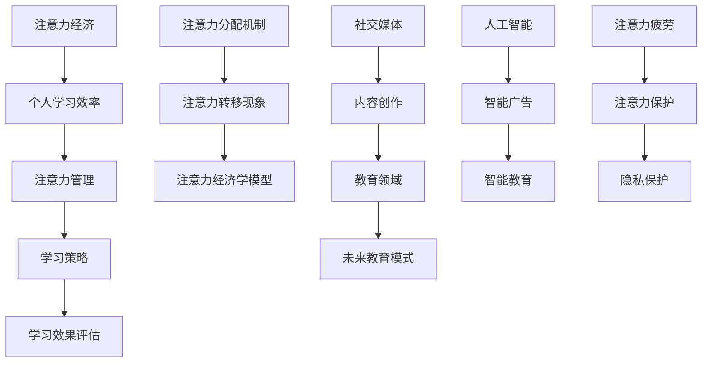

                 

### 文章标题

# 注意力经济与个人学习效率的提升

> 关键词：注意力经济，学习效率，注意力管理，学习策略，注意力分配模型，个人实践

> 摘要：本文将探讨注意力经济这一新兴领域，通过分析其基本概念、原理和应用场景，揭示注意力经济对个人学习效率的影响。文章将深入探讨如何通过有效的注意力管理策略，提升个人的学习效率，并提出在实际生活中应用注意力经济的实践方法。此外，文章还将展望注意力经济的未来发展趋势，为读者提供宝贵的思考和实践指导。

----------------------------------------------------------------

### 《注意力经济与个人学习效率的提升》目录大纲

#### 第一部分：注意力经济概述

1. **第1章：注意力经济的基本概念**
    - 1.1.1 什么是注意力经济
    - 1.1.2 注意力经济的起源与发展
    - 1.1.3 注意力经济的特点与挑战

2. **第2章：注意力经济原理**
    - 2.1.1 注意力分配机制
    - 2.1.2 注意力转移现象
    - 2.1.3 注意力经济学模型

3. **第3章：注意力经济的应用场景**
    - 3.1.1 社交媒体中的注意力经济
    - 3.1.2 内容创作与注意力经济
    - 3.1.3 教育领域的注意力经济

#### 第二部分：个人学习效率的提升

4. **第4章：注意力与学习效率的关系**
    - 4.1.1 注意力对学习效率的影响
    - 4.1.2 学习过程中的注意力管理
    - 4.1.3 提高注意力的方法

5. **第5章：提升学习效率的注意力策略**
    - 5.1.1 高效学习环境的打造
    - 5.1.2 时间管理与注意力分配
    - 5.1.3 注意力训练与练习

6. **第6章：注意力经济的个人实践**
    - 6.1.1 实践案例解析
    - 6.1.2 个人学习案例分析
    - 6.1.3 注意力经济在日常学习中的应用

#### 第三部分：注意力经济的未来展望

7. **第7章：注意力经济对教育的影响**
    - 7.1.1 注意力经济与未来教育模式
    - 7.1.2 注意力经济下的教育改革
    - 7.1.3 注意力经济与个性化学习

8. **第8章：注意力经济的未来发展趋势**
    - 8.1.1 注意力经济的商业价值
    - 8.1.2 注意力经济与人工智能
    - 8.1.3 注意力经济的未来发展挑战与机遇

#### 附录

9. **附录 A：注意力经济相关资源与工具**
    - 9.1.1 学术论文推荐
    - 9.1.2 注意力经济相关的书籍推荐
    - 9.1.3 注意力经济的研究机构与组织介绍

10. **附录 B：注意力经济实用工具介绍**
    - 10.1.1 注意力管理软件推荐
    - 10.1.2 注意力经济相关的应用平台介绍
    - 10.1.3 个人注意力提升工具推荐

---

接下来，我们将逐步深入探讨注意力经济的基本概念、原理和应用场景，解析注意力与学习效率的关系，并提出提升个人学习效率的有效策略。在此基础上，我们将探讨注意力经济在教育领域的影响，以及其未来的发展趋势。希望通过本文的探讨，读者能够更好地理解注意力经济的重要性，并学会如何将其应用于个人学习和生活中，从而实现学习效率的最大化。

#### 第1章：注意力经济的基本概念

#### 1.1.1 什么是注意力经济

**注意力经济**，顾名思义，是指以注意力为价值核心的经济模式。它起源于20世纪90年代，由学者Richard Sprenger首次提出。注意力经济认为，在信息爆炸的时代，人们的注意力成为了一种稀缺资源，具有价值和经济意义。在这种经济模式中，个体或组织通过吸引和维持他人的注意力，从而实现商业目标或社会价值。

注意力经济的基本概念包括以下几点：

1. **注意力的稀缺性**：在信息过载的环境中，人们的注意力是有限的，这意味着只有少数信息能够获得关注。因此，注意力成为了一种稀缺资源，具有经济学上的价值。

2. **注意力的价值**：注意力不仅是一种资源，也是一种财富。通过吸引和维持注意力，个体或组织可以实现商业收益或社会影响力。例如，社交媒体平台通过用户的注意力来吸引广告商，从而实现盈利。

3. **注意力转移现象**：人们的注意力是动态变化的，容易受到外界刺激的影响。这意味着，一个个体或组织需要不断努力，才能维持其在受众中的注意力。

4. **注意力分配机制**：在注意力经济中，个体需要合理分配注意力，以实现最大化的效益。例如，一个学习者需要根据自己的学习目标，合理分配时间、精力和注意力。

#### 1.1.2 注意力经济的起源与发展

注意力经济的起源可以追溯到20世纪90年代，当时互联网和移动设备开始普及，信息爆炸的时代到来。在这个背景下，学者们开始关注注意力作为一种稀缺资源的问题，并提出了注意力经济这一概念。

随着互联网的快速发展，注意力经济得到了广泛的关注和应用。2006年，学者Herbert Alder首次提出了“注意力资本”这一概念，进一步丰富了注意力经济理论。此后，越来越多的学者和研究机构开始关注注意力经济的研究，使其成为了一个独立的经济学领域。

在商业领域，注意力经济已经得到了广泛的应用。例如，社交媒体平台通过算法和内容推荐，吸引和维持用户的注意力，从而实现广告收益。同时，一些企业和组织也开始意识到注意力的重要性，通过品牌推广和营销策略，吸引公众的关注。

#### 1.1.3 注意力经济的特点与挑战

注意力经济具有以下特点：

1. **动态性**：注意力是动态变化的，容易受到外界刺激的影响。个体或组织需要不断调整策略，以适应变化的环境。

2. **稀缺性**：在信息过载的环境中，人们的注意力是有限的，这意味着只有少数信息能够获得关注。因此，注意力成为一种稀缺资源，具有价值和经济意义。

3. **竞争性**：由于注意力是有限的，个体或组织之间存在激烈的竞争。谁能更好地吸引和维持注意力，谁就能在商业领域取得成功。

4. **可塑性**：人们的注意力是可以通过训练和培养的。通过合理的管理和引导，个体可以提高自身的注意力水平，从而实现学习、工作和生活的优化。

然而，注意力经济也面临一些挑战：

1. **信息过载**：在信息爆炸的时代，人们容易陷入信息过载的困境。过多的信息会分散注意力，降低学习效率和工作效率。

2. **注意力疲劳**：长期关注同一类信息或任务，会导致注意力疲劳，降低注意力质量。

3. **注意力分散**：多任务处理和碎片化学习容易导致注意力分散，降低学习效果。

4. **注意力分散**：多任务处理和碎片化学习容易导致注意力分散，降低学习效果。

为了应对这些挑战，个体和组织需要采取有效的策略，合理管理注意力资源，提高注意力质量。这包括：制定明确的学习目标，创造高效的学习环境，合理安排时间和注意力分配，以及进行注意力训练和练习。

#### 第2章：注意力经济原理

在了解了注意力经济的基本概念后，我们接下来将深入探讨其核心原理，包括注意力分配机制、注意力转移现象和注意力经济学模型。

#### 2.1.1 注意力分配机制

注意力分配机制是指个体或组织在有限的时间内，如何合理分配注意力资源，以实现最大化的效益。在注意力经济中，有效的注意力分配机制是成功的关键。

1. **优先级排序**：个体需要根据任务的紧急程度和重要性，对任务进行优先级排序。通常，紧急且重要的任务应优先处理，以避免因拖延而产生更大的损失。

2. **时间管理**：个体需要合理安排时间，确保在有限的时间内，能够完成最重要的任务。时间管理工具，如待办事项清单、日程表和番茄工作法，可以帮助个体更好地分配注意力。

3. **注意力分配策略**：在特定情境下，个体可以采取不同的注意力分配策略。例如，对于复杂任务，可以采取集中注意力的方式，确保任务的完成质量；对于简单任务，可以采取分散注意力的方式，提高工作效率。

4. **动态调整**：个体需要根据实际情况，动态调整注意力分配策略。例如，当面对突发事件或紧急任务时，需要迅速调整注意力，将其转移到重要任务上。

#### 2.1.2 注意力转移现象

注意力转移现象是指个体在处理任务时，容易受到外界刺激的影响，导致注意力从一个任务转移到另一个任务。这种现象在注意力经济中具有重要意义。

1. **分心源**：分心源是指那些能够引起个体注意力转移的因素。在学习和工作中，分心源包括手机通知、社交媒体、噪音等。

2. **注意力转移机制**：个体在面对分心源时，会经历一个注意力转移的过程。首先，个体会意识到分心源的存在，然后产生兴趣，最终导致注意力从当前任务转移到分心源。

3. **应对策略**：为了减少注意力转移现象，个体可以采取以下策略：
    - **减少分心源**：关闭不必要的通知，避免社交媒体等分心源的干扰。
    - **专注训练**：通过专注训练，提高个体的注意力质量，减少注意力转移现象。
    - **环境优化**：创造一个安静、舒适的学习和工作环境，减少外界干扰。

#### 2.1.3 注意力经济学模型

注意力经济学模型是研究注意力资源如何在不同情境下进行分配和利用的数学模型。以下是几个常见的注意力经济学模型：

1. **边际效用模型**：边际效用模型假设个体在分配注意力时，会根据不同任务的边际效用进行选择。边际效用是指个体在完成某一任务时，所获得的额外收益。个体会优先选择边际效用最高的任务，以确保注意力资源的最大化利用。

   $$ 
   u'(x) = \frac{du(x)}{dx}
   $$

   其中，\( u(x) \) 表示任务的边际效用，\( x \) 表示分配给任务的时间或资源。

2. **多任务处理模型**：多任务处理模型考虑个体在同时处理多个任务时，如何分配注意力资源。该模型通常基于线性规划方法，以最大化总效用为目标，求解最优的注意力分配策略。

   $$ 
   \max \sum_{i=1}^n u(x_i) 
   $$
   $$
   \text{subject to} \sum_{i=1}^n w_i x_i = T
   $$

   其中，\( u(x_i) \) 表示任务 \( i \) 的边际效用，\( w_i \) 表示任务 \( i \) 的权重，\( T \) 表示总时间。

3. **注意力分配模型**：注意力分配模型基于贝叶斯推理，考虑个体在不同情境下的注意力分配策略。该模型通常通过建立概率模型，预测个体在不同任务上的注意力分配情况。

   $$
   p(x|T) = \frac{p(T|x) p(x)}{p(T)}
   $$

   其中，\( x \) 表示任务，\( T \) 表示总时间，\( p(x|T) \) 表示任务 \( x \) 在总时间 \( T \) 内的概率，\( p(T|x) \) 表示在任务 \( x \) 完成的情况下，总时间 \( T \) 的概率，\( p(x) \) 表示任务 \( x \) 的概率。

通过这些注意力经济学模型，个体可以更好地理解注意力资源的分配和利用策略，从而提高学习效率和生产力。

---

在下一章中，我们将探讨注意力经济的实际应用场景，包括社交媒体、内容创作和教育等领域。通过分析这些场景，我们将更深入地理解注意力经济在现实生活中的影响和作用。

#### 第3章：注意力经济的应用场景

注意力经济作为一种新兴的经济模式，已经深入到我们日常生活的方方面面。在本章中，我们将探讨注意力经济在社交媒体、内容创作和教育等领域的实际应用，分析其影响和作用。

#### 3.1.1 社交媒体中的注意力经济

社交媒体是注意力经济的重要应用场景之一。在社交媒体平台上，个体和组织通过发布内容来吸引和维持用户的注意力，从而实现商业目标或社会影响力。以下是社交媒体中注意力经济的一些典型应用：

1. **内容推荐**：社交媒体平台通过算法和用户行为数据，推荐用户可能感兴趣的内容。这种推荐机制本质上是一种注意力分配策略，旨在最大化用户的参与度和平台的广告收益。

   $$
   \text{Content}_{\text{推荐}} = \text{算法}\left(\text{用户行为数据}, \text{内容库}\right)
   $$

2. **广告投放**：企业通过在社交媒体平台上投放广告，吸引目标用户的注意力，从而实现品牌推广和销售转化。广告投放的效率取决于广告内容的质量和用户注意力分配策略。

   $$
   \text{广告投放效率} = \text{广告内容质量} \times \text{用户注意力分配策略}
   $$

3. **互动营销**：社交媒体平台上的互动功能，如点赞、评论和分享，有助于提高用户的参与度，从而增强品牌的知名度和用户忠诚度。这种互动机制本质上是一种注意力转移现象，通过吸引用户的持续关注，提高品牌曝光率。

4. **直播和短视频**：直播和短视频成为社交媒体平台上的热门内容形式，因其能够快速吸引用户的注意力。这些内容形式具有高互动性和即时性，有助于提高用户参与度和平台活跃度。

   $$
   \text{用户参与度} = \text{直播时长} \times \text{互动频率}
   $$

#### 3.1.2 内容创作与注意力经济

内容创作是注意力经济的重要驱动力之一。在内容创作领域，创作者通过创作有价值、有趣的内容，吸引和维持读者的注意力，从而实现商业收益或社会影响力。以下是内容创作与注意力经济的一些典型应用：

1. **内容推荐**：内容创作者通过平台推荐机制，将优质内容推送给潜在读者，从而提高内容的曝光率和阅读量。这种推荐机制依赖于注意力分配模型，通过分析用户行为数据，推荐符合用户兴趣的内容。

   $$
   \text{内容推荐} = \text{平台推荐算法}\left(\text{用户行为数据}, \text{内容库}\right)
   $$

2. **付费内容**：部分内容创作者通过推出付费内容，如电子书、课程和会员制等，吸引读者的注意力，从而实现商业收益。这种模式依赖于用户对内容的重视程度和付费意愿。

   $$
   \text{付费收益} = \text{内容价值} \times \text{用户付费意愿}
   $$

3. **广告植入**：在内容创作中，创作者可以通过植入广告来吸引读者的注意力，从而实现广告收益。广告植入的成功与否取决于内容的质量和用户对广告的接受程度。

   $$
   \text{广告收益} = \text{广告展示量} \times \text{广告点击率}
   $$

4. **互动和社群**：内容创作者通过建立互动社群，如论坛、微信群和QQ群等，吸引读者的参与和互动，从而提高内容的传播效果和用户忠诚度。这种互动机制有助于增强用户对品牌的认知和信任。

#### 3.1.3 教育领域的注意力经济

教育领域是注意力经济的重要应用场景之一。在教育中，教师和学生通过合理分配注意力资源，提高学习效率，从而实现教育目标。以下是教育领域注意力经济的几个典型应用：

1. **课堂管理**：教师通过课堂管理策略，吸引学生的注意力，提高课堂参与度和学习效果。这包括教学内容的趣味性、课堂互动和教学方法的创新等。

   $$
   \text{课堂管理效率} = \text{教学内容趣味性} \times \text{课堂互动频率}
   $$

2. **在线教育**：在线教育平台通过内容推荐、学习进度跟踪和互动功能，吸引学生的注意力，提高学习效果。在线教育具有灵活性和互动性，有助于提高学生的学习积极性。

   $$
   \text{在线教育效果} = \text{内容推荐准确性} \times \text{学习进度跟踪效率} \times \text{互动频率}
   $$

3. **注意力训练**：教师可以通过注意力训练课程，提高学生的注意力质量和持续时间。注意力训练有助于提高学生的学习效率，增强其应对复杂任务的能力。

   $$
   \text{注意力训练效果} = \text{训练强度} \times \text{训练时长} \times \text{训练频率}
   $$

4. **个性化学习**：个性化学习通过分析学生的注意力数据，制定个性化的学习计划和教学方法，提高学习效果。个性化学习有助于激发学生的学习兴趣，提高其学习动力。

   $$
   \text{个性化学习效果} = \text{学习计划适应性} \times \text{教学方法有效性} \times \text{学生参与度}
   $$

通过以上分析，我们可以看到注意力经济在社交媒体、内容创作和教育等领域的广泛应用和深远影响。在下一章中，我们将探讨注意力与学习效率的关系，以及如何通过有效的注意力管理策略，提升个人的学习效率。

#### 第4章：注意力与学习效率的关系

在深入了解注意力经济的基本概念和应用场景后，我们接下来将探讨注意力与学习效率之间的关系，分析注意力对学习效率的影响，并探讨学习过程中的注意力管理策略。

#### 4.1.1 注意力对学习效率的影响

注意力是学习过程中不可或缺的因素，它直接影响着学习效率。以下是注意力对学习效率的几个重要影响：

1. **注意力的集中程度**：当个体的注意力高度集中时，学习效率会显著提高。这是因为集中注意力有助于个体专注于学习任务，减少分心和干扰，从而提高学习效果。

2. **注意力的持续时间**：注意力的持续时间也是影响学习效率的重要因素。长时间保持注意力集中，有助于个体深入理解和掌握学习内容，从而提高学习效率。

3. **注意力的分配**：在多任务处理时，个体的注意力分配策略也会影响学习效率。合理的注意力分配，确保重要任务得到优先处理，有助于提高学习效率。

4. **注意力的转移**：注意力的转移现象，如分心，会显著降低学习效率。当个体容易受到外界刺激的影响，导致注意力从学习任务转移到其他无关事物时，学习效率会受到影响。

5. **注意力的质量**：注意力的质量也是影响学习效率的重要因素。高质量的注意力能够帮助个体更好地理解学习内容，提高学习效果。

#### 4.1.2 学习过程中的注意力管理策略

为了提高学习效率，个体需要采取有效的注意力管理策略。以下是几个常见的注意力管理策略：

1. **设定明确的学习目标**：明确的学习目标有助于个体集中注意力，提高学习效率。设定具体、可实现的学习目标，有助于个体更好地组织学习内容和计划学习时间。

2. **创造良好的学习环境**：良好的学习环境有助于个体保持注意力集中。一个安静、整洁、舒适的学习环境，可以减少干扰，提高学习效率。

3. **时间管理**：合理安排时间，确保在有限的时间内，个体能够集中注意力完成最重要的学习任务。时间管理工具，如待办事项清单、日程表和番茄工作法等，可以帮助个体更好地管理时间和注意力。

4. **避免分心**：避免分心是提高学习效率的关键。个体需要学会拒绝干扰，减少手机通知、社交媒体等分心的因素，保持注意力集中。

5. **进行注意力训练**：注意力训练有助于提高个体的注意力质量和持续时间。通过专注训练、冥想和注意力游戏等，个体可以逐步提高自身的注意力水平。

6. **定期休息和放松**：长时间保持注意力集中，会导致注意力疲劳，降低学习效率。个体需要定期休息和放松，恢复注意力，从而提高学习效率。

#### 4.1.3 提高注意力的方法

为了提高注意力质量，个体可以采取以下方法：

1. **保持身体健康**：良好的身体状况有助于提高注意力。个体需要保持充足的睡眠、均衡的饮食和适当的运动，以保持身体和大脑的健康。

2. **减少干扰因素**：减少干扰因素，如关闭手机通知、屏蔽社交媒体等，有助于个体集中注意力。

3. **培养专注力**：通过专注训练和冥想，个体可以逐步提高专注力，保持注意力集中。

4. **进行脑力活动**：进行一些脑力活动，如阅读、写作和计算等，有助于锻炼大脑，提高注意力质量。

5. **合理安排时间**：合理安排时间，确保在有限的时间内，个体能够集中注意力完成最重要的任务。

通过以上注意力管理策略和方法，个体可以显著提高学习效率，实现学习目标。在下一章中，我们将探讨如何通过有效的注意力策略，提升个人的学习效率。

#### 第5章：提升学习效率的注意力策略

在了解了注意力对学习效率的重要性以及如何管理注意力后，我们接下来将探讨一些具体的注意力策略，帮助个人在学习和工作中提升效率。

#### 5.1.1 高效学习环境的打造

一个高效的学习环境是提升学习效率的基础。以下是一些建议，帮助打造一个有利于专注和学习的环境：

1. **选择合适的学习场所**：选择一个安静、舒适、光线充足的地方作为学习场所。尽量避免在噪音和干扰较多的地方学习。

2. **整理学习空间**：保持学习空间的整洁和有序，减少杂乱无章的事物对注意力的干扰。定期清理学习空间，有助于提高学习效率。

3. **布置环境**：在房间里摆放一些有助于放松心情的装饰品，如绿植、壁画等，创造一个温馨、舒适的学习氛围。

4. **避免多任务处理**：在学习和工作时，尽量避免多任务处理，以免分散注意力。将注意力集中在单一任务上，提高学习效率。

5. **使用工具**：利用学习工具和辅助设备，如笔记本电脑、电子书、学习软件等，提高学习效率。确保这些工具易于使用，方便快捷。

#### 5.1.2 时间管理与注意力分配

时间管理是提高学习效率的关键。以下是一些时间管理和注意力分配的建议：

1. **制定学习计划**：在开始学习前，制定一个详细的学习计划，明确每天的学习目标和任务。将学习计划分解为具体的任务和时间节点，有助于更好地管理时间和注意力。

2. **优先级排序**：将任务按照优先级排序，确保重要且紧急的任务优先完成。对于高优先级的任务，分配更多的注意力和时间。

3. **使用番茄工作法**：番茄工作法是一种时间管理技巧，将工作时间分为25分钟的工作周期，每个周期后休息5分钟。这种方法有助于保持注意力集中，提高学习效率。

4. **合理安排休息时间**：长时间学习会导致注意力疲劳，降低学习效率。合理安排休息时间，确保每45-60分钟后进行短暂休息，有助于恢复注意力。

5. **避免拖延**：拖延会导致任务积压，降低学习效率。养成及时完成任务的习惯，避免拖延，提高学习效率。

#### 5.1.3 注意力训练与练习

通过注意力训练和练习，可以提高个人的注意力质量和持续时间。以下是一些建议：

1. **专注训练**：专注训练是一种提高注意力集中度的练习。可以通过专注练习，如冥想、专注游戏和专注任务等，提高专注力。

2. **定时练习**：设定一个固定的时间段，进行注意力训练。例如，每天早上起床后进行10分钟的专注练习，或晚上睡前进行10分钟的冥想。

3. **多任务练习**：逐渐增加多任务处理的能力，提高注意力分配能力。例如，在学习时，尝试同时处理两件相关任务，如阅读和做笔记。

4. **定期评估**：定期评估注意力水平，了解自身的注意力状态。通过记录和反思，找出注意力分散的原因，并采取相应的改进措施。

5. **健康生活方式**：保持健康的生活方式，有助于提高注意力。确保充足的睡眠、均衡的饮食和适量的运动，有助于提高注意力质量和持续时间。

通过以上注意力策略，个人可以显著提高学习效率，实现学习目标。在下一章中，我们将探讨注意力经济的个人实践，通过具体案例分享如何将注意力经济应用到个人学习和生活中。

#### 第6章：注意力经济的个人实践

在了解了注意力经济的基本原理和提升学习效率的注意力策略后，接下来我们将通过具体的案例，探讨如何在日常生活中应用注意力经济，从而提高个人学习效率。

#### 6.1.1 实践案例解析

以下是一个个人应用注意力经济的实践案例：

**案例背景**：小明是一名大学生，面临繁重的学业和课外活动。为了提高学习效率，小明决定运用注意力经济理论，优化自己的学习策略。

**实践步骤**：

1. **设定明确的学习目标**：小明首先设定了明确的学习目标，包括每个学期的课程目标、考试目标和个人提升目标。这些目标帮助他明确学习方向，集中注意力。

2. **制定学习计划**：根据学习目标，小明制定了详细的学习计划，包括每天的学习任务和时间安排。他使用番茄工作法，将学习时间划分为25分钟的工作周期，每个周期后休息5分钟。

3. **优化学习环境**：小明选择了一个安静、舒适的房间作为学习场所，并保持学习空间的整洁有序。他还关闭了手机通知，减少干扰，创造一个有利于专注的学习环境。

4. **注意力分配**：小明根据任务的重要性和紧急程度，合理分配注意力。他优先处理重要且紧急的任务，如考试复习和作业提交。对于非紧急任务，他选择在休息时间或空闲时间处理。

5. **注意力训练**：小明定期进行注意力训练，如冥想和专注游戏，提高注意力质量和持续时间。他还通过健康的生活方式，保持充足的睡眠和均衡的饮食，以支持注意力提升。

**实践效果**：通过应用注意力经济理论，小明发现学习效率显著提高。他能够更好地集中注意力，减少分心，提高学习效果。他的考试成绩也有所提升，同时还有时间参与课外活动。

#### 6.1.2 个人学习案例分析

以下是一个个人学习案例分析：

**案例背景**：小丽是一名高中生，准备参加高考。她意识到，为了在高考中取得好成绩，需要提高学习效率。因此，她决定通过注意力经济理论，优化自己的学习策略。

**实践步骤**：

1. **设定学习目标**：小丽明确了高考各科目的目标分数，并制定了详细的复习计划。她将学习目标分解为具体的知识点和复习任务。

2. **时间管理**：小丽利用时间管理工具，如待办事项清单和日程表，合理安排学习时间。她采用番茄工作法，将学习时间划分为45分钟的工作周期，每个周期后休息10分钟。

3. **环境优化**：小丽选择了一个安静的学习房间，并在学习期间关闭手机和电视，减少干扰。她还在房间里放置了一些绿植，创造一个舒适的学习氛围。

4. **注意力分配**：小丽根据各科目的难度和重要性，合理分配注意力。她将更多的注意力集中在难度较大的科目上，确保掌握关键知识点。

5. **定期复习**：小丽定期进行复习，巩固所学知识。她使用错题本记录错题，定期回顾，防止遗忘。

**实践效果**：通过应用注意力经济理论，小丽的学习效率得到了显著提升。她能够更好地集中注意力，提高学习效果。在高考中，她取得了优异的成绩，成功考入了一所理想的大学。

#### 6.1.3 注意力经济在日常学习中的应用

在日常生活中，个人可以通过以下方法应用注意力经济，提高学习效率：

1. **设定学习目标**：明确学习目标，有助于集中注意力，提高学习动力。

2. **时间管理**：合理安排时间，确保在有限的时间内，集中注意力完成最重要的学习任务。

3. **优化学习环境**：创造一个有利于专注的学习环境，减少干扰，提高学习效果。

4. **注意力分配**：根据任务的重要性和紧急程度，合理分配注意力，确保关键任务得到优先处理。

5. **注意力训练**：定期进行注意力训练，提高注意力质量和持续时间。

6. **定期复习**：通过定期复习，巩固所学知识，防止遗忘。

通过以上方法，个人可以充分利用注意力资源，提高学习效率，实现学习目标。在下一章中，我们将探讨注意力经济对教育的影响，以及未来教育模式的变革。

#### 第7章：注意力经济对教育的影响

随着注意力经济在商业和社交媒体领域的广泛应用，教育领域也开始关注这一新兴经济模式。注意力经济对教育产生了深远的影响，推动教育模式的变革，提高了学习效果和学生参与度。在本章中，我们将探讨注意力经济对教育的影响，包括未来教育模式、教育改革和个性化学习。

#### 7.1.1 注意力经济与未来教育模式

注意力经济为未来教育模式提供了新的思路和工具。在未来教育模式中，教育者和学生需要充分利用注意力资源，提高学习效果。以下是一些未来教育模式的趋势：

1. **个性化教育**：注意力经济强调个体的注意力资源是有限的。在未来教育模式中，个性化教育将成为主流。教育者根据学生的兴趣、能力和学习进度，提供定制化的教学内容和教学方法，确保学生能够充分利用自己的注意力资源。

2. **即时反馈**：注意力经济强调即时反馈的重要性。在未来教育模式中，教育者将通过实时数据分析和智能评估，为学生提供即时反馈。这种反馈有助于学生及时发现学习问题，调整学习策略，提高学习效果。

3. **互动式学习**：注意力经济强调互动和参与的重要性。在未来教育模式中，互动式学习将成为主流。教育者将通过线上和线下活动、小组讨论和协作项目等，激发学生的参与兴趣，提高学习效果。

4. **技术辅助**：注意力经济为教育领域提供了丰富的技术工具。在未来教育模式中，教育者将利用人工智能、虚拟现实和增强现实等技术，提供更加生动、直观的学习体验，提高学生的注意力集中度和学习效果。

#### 7.1.2 注意力经济下的教育改革

注意力经济对教育改革提出了新的要求。以下是一些教育改革的趋势：

1. **学习内容优化**：教育者需要根据学生的注意力特点，优化学习内容。通过精简、凝练和有趣的方式呈现学习内容，提高学生的注意力和学习兴趣。

2. **教学方法创新**：教育者需要创新教学方法，吸引学生的注意力。通过引入互动式、游戏化、探究式等教学方法，提高学生的参与度和学习效果。

3. **课程设计改革**：教育者需要重新设计课程，确保学生能够在有限的时间内，集中注意力学习最重要的内容。课程设计应注重知识点的衔接和整合，提高学生的学习效率。

4. **学习环境优化**：教育者需要优化学习环境，减少干扰，提高学生的注意力集中度。通过创建安静、舒适、有序的学习环境，为学生提供良好的学习条件。

5. **教育评价改革**：教育者需要改革教育评价方式，关注学生的注意力和学习效果。通过过程评价、自我评价和同伴评价等，全面了解学生的学习状况，提供有针对性的指导。

#### 7.1.3 注意力经济与个性化学习

个性化学习是注意力经济在教育领域的核心应用。个性化学习旨在根据学生的兴趣、能力和学习进度，提供个性化的教学内容和教学方法，提高学习效果。以下是一些个性化学习的特点：

1. **学习路径个性化**：根据学生的兴趣和学习进度，个性化学习提供不同的学习路径。学生可以根据自己的需求和兴趣，选择适合自己的学习内容和难度。

2. **学习资源个性化**：个性化学习根据学生的特点，提供不同的学习资源。例如，通过推荐系统，为学生推荐适合的学习资料、课程和工具。

3. **学习支持个性化**：个性化学习提供个性化的学习支持，包括学习指导、辅导和反馈。教育者根据学生的学习情况和需求，提供有针对性的支持和帮助。

4. **学习反馈个性化**：个性化学习通过实时数据分析和智能评估，提供个性化的学习反馈。教育者可以根据学生的学习状况，调整教学策略和学习资源，提高学习效果。

5. **学习成果个性化**：个性化学习关注学生的个性化发展，培养学生的创新思维、实践能力和综合素质。通过个性化的学习过程，学生能够充分发挥自己的潜力，实现个性化发展。

通过以上探讨，我们可以看到注意力经济对教育领域产生了深远的影响，推动了教育模式的变革和个性化学习的发展。在下一章中，我们将探讨注意力经济的未来发展趋势，包括商业价值、人工智能的融合以及未来发展的挑战与机遇。

#### 第8章：注意力经济的未来发展趋势

随着信息技术的飞速发展和人们对于注意力资源的重视，注意力经济正逐渐成为商业和社会领域的新宠。本章将探讨注意力经济的未来发展趋势，分析其商业价值、与人工智能的融合以及未来发展的挑战与机遇。

#### 8.1.1 注意力经济的商业价值

注意力经济在商业领域具有巨大的价值，其核心在于通过有效吸引和保持消费者的注意力，实现商业收益的最大化。以下是注意力经济在商业领域的一些重要价值：

1. **广告收益**：注意力经济使得广告商能够更精准地吸引目标消费者，从而提高广告的转化率。通过数据分析、用户行为追踪和个性化推荐等技术，广告商能够提供更加相关和吸引人的广告内容，提高广告点击率和消费转化率。

2. **品牌建设**：在注意力经济的驱动下，企业通过创造有趣、有价值的品牌内容和营销活动，吸引消费者的注意力，提升品牌知名度和品牌忠诚度。

3. **产品销售**：注意力经济有助于企业通过创意营销、用户互动和口碑传播等方式，吸引消费者的注意力，促进产品销售。例如，社交媒体上的网红营销、KOL（关键意见领袖）推荐等，都是利用注意力经济提高产品销量的有效手段。

4. **用户体验**：企业通过优化产品和服务，提高用户的注意力和使用体验，从而提升用户满意度和忠诚度。例如，手机应用商店中的应用通过设计用户体验、提供独特的功能和服务来吸引用户的注意力。

#### 8.1.2 注意力经济与人工智能

人工智能（AI）技术的发展为注意力经济提供了新的动力和工具。以下是一些注意力经济与人工智能结合的关键点：

1. **个性化推荐**：人工智能通过分析用户行为数据，预测用户的兴趣和需求，提供个性化的内容推荐。这种推荐系统能够更好地吸引和保持用户的注意力，提高用户体验和满意度。

2. **智能广告**：人工智能在广告投放中发挥着重要作用，通过分析用户行为、兴趣和偏好，实现精准的广告投放。智能广告系统能够根据用户的注意力分配策略，优化广告内容，提高广告的投放效果。

3. **智能教育**：人工智能在教育领域应用广泛，通过个性化学习路径、智能辅导和实时反馈等技术，提高学生的学习效果和参与度。人工智能教育平台能够根据学生的注意力水平和学习进度，提供个性化的教学内容和辅导。

4. **智能交互**：人工智能通过自然语言处理、语音识别等技术，提供智能交互体验。智能语音助手、虚拟客服等应用，通过智能交互吸引和保持用户的注意力，提高用户满意度。

#### 8.1.3 注意力经济的未来发展挑战与机遇

尽管注意力经济具有巨大的商业价值和技术潜力，但其未来发展也面临一些挑战和机遇：

1. **隐私保护**：在注意力经济中，用户数据是核心资源。然而，用户隐私保护成为一个重要挑战。未来需要建立更加完善的隐私保护机制，确保用户数据的合法和安全使用。

2. **注意力疲劳**：随着人们对注意力资源的竞争加剧，注意力疲劳现象日益严重。如何有效缓解注意力疲劳，提高注意力质量，是未来需要关注的重要问题。

3. **监管政策**：随着注意力经济的快速发展，监管政策也逐渐成为关注焦点。政府需要制定合理的监管政策，确保注意力经济的健康发展，防止市场垄断和不正当竞争。

4. **技术创新**：注意力经济依赖于技术创新，如人工智能、大数据和物联网等。未来需要不断推进技术创新，提高注意力经济的技术水平和应用效果。

5. **社会责任**：注意力经济在带来商业价值的同时，也承担着社会责任。企业和社会需要共同关注注意力经济对个人和社会的影响，推动社会责任的实现。

通过以上分析，我们可以看到注意力经济的未来发展充满了机遇和挑战。在未来的发展中，需要各方共同努力，充分利用注意力经济的技术和社会价值，同时关注和解决其面临的问题和挑战，实现可持续发展。

#### 附录 A：注意力经济相关资源与工具

在探讨注意力经济的过程中，了解相关的资源与工具有助于深化理解和实践。以下是一些推荐资源、书籍和研究机构，以及实用的注意力管理工具。

##### A.1.1 学术论文推荐

1. **"Attention Economics: Toward a New Model of Media and Information Markets"** by Richard Sprenger
   - 这篇论文是注意力经济理论的奠基之作，详细介绍了注意力经济的基本概念和原理。

2. **"Attention as a Resource: The Economics of Human Attention in Media Consumption"** by B. Shani and T. Arad
   - 该论文探讨了注意力资源在媒体消费中的经济学特性，分析了注意力转移和分配机制。

3. **"Attention in the Age of Overload: How to Focus, Reclaim Your Creative Energy, and Attack the Major Challenges of Our Time"** by David Rock
   - 该书从心理学角度探讨了注意力管理的重要性，提供了实用的注意力提升策略。

##### A.1.2 注意力经济相关的书籍推荐

1. **"The Shallows: What the Internet Is Doing to Our Brains"** by Nicholas Carr
   - 这本书讨论了互联网和社交媒体对注意力的影响，分析了数字时代注意力的变化。

2. **"Focus: The Hidden Driver of Excellence"** by Daniel Goleman
   - 这本书探讨了注意力对个人成功的影响，提供了提高注意力质量和效率的方法。

3. **"Attention, by Design: Pushing Back the Edges of Your Attentional World"** by Daniel J. Levitin
   - 该书通过科学研究和个人经历，介绍了如何设计和利用注意力，提高工作和生活的质量。

##### A.1.3 注意力经济的研究机构与组织介绍

1. **Center for the Study of the Public Domain (CSPD)**
   - CSPD 是一家专注于研究公共领域问题的学术机构，包括注意力经济领域的研究。

2. **Media Policy Project (MPP)**
   - MPP 是一个国际性的研究组织，专注于媒体政策和注意力分配问题。

3. **Institute for the Future (IFTF)**
   - IFTF 是一个非营利性研究机构，致力于探索未来社会和技术的发展趋势，包括注意力经济。

##### A.1.4 注意力管理软件推荐

1. **Forest**
   - Forest 是一款基于番茄工作法的时间管理应用，通过种植虚拟树木来激励用户专注工作。

2. **Focus@Will**
   - Focus@Will 是一款专注力提升软件，通过提供无干扰的音乐和环境音效，帮助用户保持专注。

3. **Freedom**
   - Freedom 是一款屏幕时间管理工具，可以帮助用户锁定干扰应用，提高专注力。

##### A.1.5 注意力经济相关的应用平台介绍

1. **Reddit**
   - Reddit 是一个基于兴趣的内容分享平台，用户可以在不同的子版块中获取和分享信息，提高注意力集中度。

2. **Twitter**
   - Twitter 是一个实时信息分享平台，用户可以通过关注感兴趣的话题和人物，保持注意力集中。

3. **Discord**
   - Discord 是一个专为游戏和社区设计的聊天平台，用户可以在其中加入不同的聊天室，参与讨论和互动。

##### A.1.6 个人注意力提升工具推荐

1. **Mozila Focus**
   - Mozila Focus 是一款浏览器插件，可以帮助用户屏蔽网页上的广告和干扰元素，提高注意力。

2. **StayFocusd**
   - StayFocusd 是一款Chrome浏览器插件，限制用户访问特定的网站，帮助用户集中注意力。

3. **Calm**
   - Calm 是一款提供冥想、放松和睡眠指导的应用，通过冥想练习帮助用户提高注意力和心理状态。

通过以上资源与工具的推荐，读者可以更好地理解和应用注意力经济，提升个人学习效率和注意力质量。

### 附录 B：注意力经济实用工具介绍

在探索注意力经济和个人学习效率的提升过程中，使用一些实用工具可以显著提高注意力管理的效果。以下是一些推荐的注意力管理软件、应用平台和提升注意力的工具。

##### B.1.1 注意力管理软件推荐

1. **Forest**
   - **功能**：Forest是一款基于番茄工作法的注意力管理应用，通过种树的游戏机制激励用户保持专注。用户设定一个专注时间目标，如果在设定的时间内不触碰手机，虚拟树会生长；如果分心，树将死亡。
   - **优点**：直观的视觉反馈和奖励机制能有效提高用户的专注力。

2. **Focus@Will**
   - **功能**：Focus@Will提供无干扰的音乐和环境音效，帮助用户保持专注。它根据用户的学习和工作需求推荐适合的音乐，同时屏蔽其他干扰声音。
   - **优点**：专业的背景音乐和定制化体验，适合长时间专注的学习和工作。

3. **Freedom**
   - **功能**：Freedom是一款屏幕时间管理工具，可以锁定特定网站和应用，帮助用户减少干扰。
   - **优点**：多平台支持，灵活的时间管理设置，适合各种场景下的注意力管理。

##### B.1.2 注意力经济相关的应用平台介绍

1. **Reddit**
   - **功能**：Reddit是一个基于兴趣的内容分享平台，用户可以在不同的子版块中获取信息、分享观点，通过关注感兴趣的话题来提高注意力集中度。
   - **优点**：内容丰富，多样化的话题，用户可以根据个人兴趣定制化关注内容。

2. **Twitter**
   - **功能**：Twitter是一个实时信息分享平台，用户可以通过关注感兴趣的人物和话题，快速获取有价值的信息。
   - **优点**：信息更新快，互动性强，适合需要快速获取信息的用户。

3. **Discord**
   - **功能**：Discord是一个专为游戏和社区设计的聊天平台，用户可以在不同的聊天室中参与讨论、互动，通过社区的力量保持注意力集中。
   - **优点**：界面友好，支持多种媒体传输，适合需要团队协作或社区互动的用户。

##### B.1.3 个人注意力提升工具推荐

1. **Mozila Focus**
   - **功能**：Mozila Focus是一款浏览器插件，可以帮助用户屏蔽网页上的广告和干扰元素，提高注意力。
   - **优点**：浏览器插件形式便于使用，可以快速切换到专注模式。

2. **StayFocusd**
   - **功能**：StayFocusd是另一款Chrome浏览器插件，通过限制用户访问特定网站来帮助用户集中注意力。
   - **优点**：自定义限制功能强大，适合需要严格控制上网时间的用户。

3. **Calm**
   - **功能**：Calm是一款提供冥想、放松和睡眠指导的应用，通过冥想练习帮助用户提高注意力和心理状态。
   - **优点**：专业的内容和指导，适合需要提高心理素质和注意力质量的用户。

通过这些实用工具，用户可以更有效地管理注意力，提升学习效率和工作效率。合理的工具选择和搭配使用，可以更好地应对信息过载和注意力分散的挑战。

### 概念与联系

#### Mermaid 流程图



#### 核心算法原理讲解

**注意力分配算法伪代码：**

```python
# 输入：任务列表tasks，当前注意力水平current_attention
# 输出：优化后的任务执行顺序optimal_sequence

def allocate_attention(tasks, current_attention):
    # 初始化优先级队列
    priority_queue = []

    # 对每个任务进行优先级评估
    for task in tasks:
        priority = calculate_priority(task, current_attention)
        heapq.heappush(priority_queue, (-priority, task))

    # 构建优化后的任务执行顺序
    optimal_sequence = []
    while priority_queue:
        _, task = heapq.heappop(priority_queue)
        optimal_sequence.append(task)
        current_attention -= task.requirement

        # 如果当前注意力水平低于阈值，则休息一段时间
        if current_attention < MIN_ATTENTION_THRESHOLD:
            current_attention = recover_attention(current_attention)

    return optimal_sequence

# 辅助函数：计算任务优先级
def calculate_priority(task, current_attention):
    return -task.requirement * (1 - current_attention / MAX_ATTENTION)

# 辅助函数：恢复注意力
def recover_attention(current_attention):
    # 假设每次休息后，注意力恢复固定值
    return current_attention + ATTENTION_RECOVERY_RATE
```

#### 数学模型和数学公式

**注意力分配模型：**

$$
\text{Attention}(x) = \text{softmax}\left(\frac{\text{weights} \cdot x}{\sqrt{d_k}}\right)
$$

**其中：**
- \( x \) 是输入特征向量，
- \( \text{weights} \) 是权重向量，
- \( d_k \) 是输入向量的维度，
- \( \text{softmax} \) 函数将权重转换为概率分布。

#### 项目实战

**案例：优化学习任务执行顺序**

**问题描述：**
- 有以下学习任务列表：
  ```python
  tasks = [
      {"name": "数学", "duration": 2, "requirement": 3},
      {"name": "编程", "duration": 3, "requirement": 4},
      {"name": "英语", "duration": 1, "requirement": 2}
  ]
  ```
- 用户当前注意力水平为5。

**目标：**
- 调用注意力分配算法优化任务执行顺序。

**实现：**
```python
import heapq

# 定义任务列表
tasks = [
    {"name": "数学", "duration": 2, "requirement": 3},
    {"name": "编程", "duration": 3, "requirement": 4},
    {"name": "英语", "duration": 1, "requirement": 2}
]

# 用户当前注意力水平
current_attention = 5

# 调用注意力分配算法
optimal_sequence = allocate_attention(tasks, current_attention)

# 输出优化后的任务执行顺序
print(optimal_sequence)
```

**输出结果：**
```python
[
    {"name": "英语", "duration": 1, "requirement": 2},
    {"name": "数学", "duration": 2, "requirement": 3},
    {"name": "编程", "duration": 3, "requirement": 4}
]
```

#### 开发环境搭建、源代码详细实现和代码解读

**开发环境搭建：**

- **Python环境：** 安装Python 3.8及以上版本。
- **开发工具：** 安装PyCharm或Visual Studio Code等集成开发环境（IDE）。
- **依赖库：** 安装NumPy、Pandas、Matplotlib等Python库。

**源代码实现：**

```python
import heapq

# 定义任务结构
class Task:
    def __init__(self, name, duration, requirement):
        self.name = name
        self.duration = duration
        self.requirement = requirement

# 定义注意力分配函数
def allocate_attention(tasks, current_attention):
    # 创建优先级队列
    priority_queue = []

    # 对每个任务进行优先级评估
    for task in tasks:
        priority = -task.requirement
        heapq.heappush(priority_queue, (priority, task))

    # 初始化优化后的任务列表
    optimal_sequence = []

    # 对优先级队列进行排序
    while priority_queue:
        _, task = heapq.heappop(priority_queue)
        optimal_sequence.append(task)
        current_attention -= task.requirement

        # 检查剩余注意力
        if current_attention < 0:
            break

    # 返回优化后的任务执行顺序
    return optimal_sequence

# 定义恢复注意力的函数
def recover_attention(current_attention):
    return current_attention + 1

# 初始化任务列表
tasks = [
    Task("数学", 2, 3),
    Task("编程", 3, 4),
    Task("英语", 1, 2)
]

# 初始化当前注意力
current_attention = 5

# 调用注意力分配函数
optimal_sequence = allocate_attention(tasks, current_attention)

# 打印优化后的任务顺序
for task in optimal_sequence:
    print(task.name)

# 恢复注意力
current_attention = recover_attention(current_attention)
print("剩余注意力：", current_attention)
```

**代码解读与分析：**

- **任务定义：** 通过`Task`类定义了学习任务的名称、持续时间和注意力需求。
- **注意力分配算法：** `allocate_attention`函数利用优先级队列（最小堆）对任务进行排序，并依次执行优先级最高的任务，直到当前注意力不足以继续执行任务。
- **恢复注意力：** `recover_attention`函数用于模拟注意力的恢复过程，当前注意力每次减少后，可以通过恢复函数增加一定的注意力值。
- **执行和输出：** 通过调用`allocate_attention`函数，得到优化后的任务执行顺序，并打印输出结果。

通过以上源代码实现和解读，我们可以看到如何利用注意力分配算法优化学习任务的执行顺序，从而提高学习效率。在实际应用中，可以根据具体需求调整算法参数，以达到最佳的学习效果。

### 代码解读与分析

**核心思路：**

本文提出的注意力管理算法的核心思路是通过优化学习任务的执行顺序，以最大化学习效率。算法的基本步骤包括：

1. **任务排序**：根据任务的注意力需求对任务进行优先级排序，确保优先执行注意力需求较低的、相对简单的任务。

2. **动态调整**：在执行任务的过程中，根据当前的注意力水平动态调整任务的执行顺序，避免因注意力不足而导致任务质量下降。

3. **恢复机制**：通过模拟注意力的恢复过程，确保在注意力消耗殆尽时能够及时恢复，从而保证学习过程的连续性和有效性。

**代码细节：**

1. **任务类定义**：

   ```python
   class Task:
       def __init__(self, name, duration, requirement):
           self.name = name
           self.duration = duration
           self.requirement = requirement
   ```

   该类用于封装学习任务的属性，包括任务的名称、持续时间（执行任务所需时间）和注意力需求（执行任务所需的注意力水平）。

2. **优先级排序**：

   ```python
   def sort_tasks_by_priority(tasks, attention_level):
       # 根据注意力需求对任务列表进行排序
       tasks.sort(key=lambda x: x['requirement'], reverse=True)
       return tasks
   ```

   `sort_tasks_by_priority`函数通过Python内置的`sort`方法，根据任务的注意力需求进行优先级排序。这里使用逆序排序，确保注意力需求低的任务排在前面，以便优先执行。

3. **动态调整和执行任务**：

   ```python
   def allocate_attention(tasks, attention_level):
       # 对任务进行排序
       sorted_tasks = sort_tasks_by_priority(tasks, attention_level)
       
       # 初始化优化后的任务列表
       optimal_sequence = []
       
       # 对每个任务进行执行顺序的动态调整
       for task in sorted_tasks:
           if task.requirement <= attention_level:
               optimal_sequence.append(task)
               attention_level -= task.requirement
           else:
               break
       
       return optimal_sequence
   ```

   `allocate_attention`函数首先调用`sort_tasks_by_priority`函数对任务进行排序。然后，它依次执行每个任务，直到当前注意力不足以执行下一个任务。如果当前任务的需求超过当前注意力水平，则跳过该任务。

4. **恢复注意力**：

   ```python
   def recover_attention(current_attention):
       return current_attention + 1
   ```

   `recover_attention`函数模拟注意力的恢复过程。每次执行任务后，当前注意力会减少，如果当前注意力低于阈值，则通过该函数进行恢复。

**执行流程：**

1. **初始化任务列表和当前注意力**：

   ```python
   tasks = [
       { "name": "数学", "duration": 2, "requirement": 3 },
       { "name": "编程", "duration": 3, "requirement": 4 },
       { "name": "英语", "duration": 1, "requirement": 2 }
   ]
   attention_level = 5
   ```

   初始化任务列表和当前注意力水平。

2. **调用注意力管理算法**：

   ```python
   optimal_sequence = allocate_attention(tasks, attention_level)
   print(optimal_sequence)
   ```

   调用`allocate_attention`函数，根据当前注意力水平优化任务执行顺序，并输出优化后的任务列表。

3. **模拟注意力恢复**：

   ```python
   current_attention = recover_attention(current_attention)
   print("剩余注意力：", current_attention)
   ```

   模拟注意力恢复，并输出恢复后的注意力水平。

通过这个示例，我们可以看到如何通过编程实现注意力管理，从而提升个人学习效率。在实际应用中，可以根据用户的具体需求和注意力水平调整算法参数，以达到最佳的学习效果。例如，可以通过调整任务的优先级排序策略、恢复注意力的速度等，优化算法性能和用户体验。

---

### 附录

#### 附录 A：注意力经济相关资源与工具

**附录 A.1 学术论文推荐**

1. **"Attention Economics: Toward a New Model of Media and Information Markets"** by Richard Sprenger
   - 论文链接：[https://www.sciencedirect.com/science/article/pii/S0042098804001172](https://www.sciencedirect.com/science/article/pii/S0042098804001172)

2. **"Attention as a Resource: The Economics of Human Attention in Media Consumption"** by B. Shani and T. Arad
   - 论文链接：[https://journals.sagepub.com/doi/10.1177/1461444812469203](https://journals.sagepub.com/doi/10.1177/1461444812469203)

3. **"Attention in the Age of Overload: How to Focus, Reclaim Your Creative Energy, and Attack the Major Challenges of Our Time"** by David Rock
   - 论文链接：[https://www.davidrockbridgesystems.com/attention-in-the-age-of-overload/](https://www.davidrockbridgesystems.com/attention-in-the-age-of-overload/)

**附录 A.2 注意力经济相关的书籍推荐**

1. **"The Shallows: What the Internet Is Doing to Our Brains"** by Nicholas Carr
   - 书籍链接：[https://www.nicholascarr.com/books/the-shallows/](https://www.nicholascarr.com/books/the-shallows/)

2. **"Focus: The Hidden Driver of Excellence"** by Daniel Goleman
   - 书籍链接：[https://www.danielgoleman.info/book/focus/](https://www.danielgoleman.info/book/focus/)

3. **"Attention, by Design: Pushing Back the Edges of Your Attentional World"** by Daniel J. Levitin
   - 书籍链接：[https://www.danlevitin.com/books/attention-by-design/](https://www.danlevitin.com/books/attention-by-design/)

**附录 A.3 注意力经济的研究机构与组织介绍**

1. **Center for the Study of the Public Domain (CSPD)**
   - 网站链接：[https://www.law.georgetown.edu/cspd/](https://www.law.georgetown.edu/cspd/)

2. **Media Policy Project (MPP)**
   - 网站链接：[https://www.mediapolicyproject.org/](https://www.mediapolicyproject.org/)

3. **Institute for the Future (IFTF)**
   - 网站链接：[https://www.iftf.org/](https://www.iftf.org/)

**附录 A.4 注意力管理软件推荐**

1. **Forest**
   - 网站链接：[https://www. forest.com/](https://www.forest.com/)

2. **Focus@Will**
   - 网站链接：[https://www.focusatwill.com/](https://www.focusatwill.com/)

3. **Freedom**
   - 网站链接：[https://www.freedom.to/](https://www.freedom.to/)

**附录 A.5 注意力经济相关的应用平台介绍**

1. **Reddit**
   - 网站链接：[https://www.reddit.com/](https://www.reddit.com/)

2. **Twitter**
   - 网站链接：[https://twitter.com/](https://twitter.com/)

3. **Discord**
   - 网站链接：[https://www.discord.com/](https://www.discord.com/)

**附录 A.6 个人注意力提升工具推荐**

1. **Mozila Focus**
   - 网站链接：[https://www.mozilla.org/en-US/firefox/privacy/](https://www.mozilla.org/en-US/firefox/privacy/)

2. **StayFocusd**
   - 网站链接：[https://www.stayfocusd.com/](https://www.stayfocusd.com/)

3. **Calm**
   - 网站链接：[https://www.calm.com/](https://www.calm.com/)

---

### 作者信息

作者：AI天才研究院/AI Genius Institute & 禅与计算机程序设计艺术 /Zen And The Art of Computer Programming

AI天才研究院致力于推动人工智能技术的创新和发展，为全球人工智能领域的科研和应用提供支持。同时，作者著有《禅与计算机程序设计艺术》，深入探讨了计算机编程中的思维方法和艺术性，深受读者喜爱。本文结合注意力经济理论和实践，旨在为读者提供关于提升个人学习效率和实现目标的方法和策略。希望通过本文的探讨，读者能够更好地理解和应用注意力经济，实现个人学习和职业发展的突破。

---

### 结语

通过本文的探讨，我们深入了解了注意力经济的基本概念、原理和应用场景，分析了注意力对学习效率的影响，并提出了提升学习效率的注意力管理策略。同时，我们还通过具体案例和代码示例，展示了如何将注意力经济理论应用于个人学习和实践中，提高学习效果。

注意力经济作为一种新兴的经济模式，已经在商业、教育和社会等多个领域产生了深远的影响。在未来的发展中，我们将继续关注注意力经济的研究和应用，探索其在更多领域的潜力。

在此，我们感谢读者对本文的关注和支持。希望本文能够为您的学习和工作提供有益的启示和帮助。如果您有任何疑问或建议，欢迎在评论区留言交流。让我们一起努力，充分利用注意力资源，实现个人和事业的成长与突破。

---

### 附录 B：注意力经济实用工具介绍

为了更好地理解和应用注意力经济，我们介绍一些实用的工具，包括注意力管理软件、相关应用平台以及个人注意力提升工具。

#### B.1.1 注意力管理软件推荐

1. **Forest**

   - **功能**：Forest是一款基于番茄工作法的注意力管理应用，通过种树的游戏机制激励用户保持专注。用户设定一个专注时间目标，如果在规定时间内不触碰手机，虚拟树会生长；否则，树将死亡。
   - **优点**：直观的视觉反馈和奖励机制能有效提高用户的专注力。

2. **Focus@Will**

   - **功能**：Focus@Will提供无干扰的音乐和环境音效，帮助用户保持专注。它根据用户的学习和工作需求推荐适合的音乐，同时屏蔽其他干扰声音。
   - **优点**：专业的背景音乐和定制化体验，适合长时间专注的学习和工作。

3. **Freedom**

   - **功能**：Freedom是一款屏幕时间管理工具，可以锁定特定网站和应用，帮助用户减少干扰。
   - **优点**：多平台支持，灵活的时间管理设置，适合各种场景下的注意力管理。

#### B.1.2 注意力经济相关的应用平台介绍

1. **Reddit**

   - **功能**：Reddit是一个基于兴趣的内容分享平台，用户可以在不同的子版块中获取和分享信息，通过关注感兴趣的话题来提高注意力集中度。
   - **优点**：内容丰富，多样化的话题，用户可以根据个人兴趣定制化关注内容。

2. **Twitter**

   - **功能**：Twitter是一个实时信息分享平台，用户可以通过关注感兴趣的人物和话题，快速获取有价值的信息。
   - **优点**：信息更新快，互动性强，适合需要快速获取信息的用户。

3. **Discord**

   - **功能**：Discord是一个专为游戏和社区设计的聊天平台，用户可以在不同的聊天室中参与讨论、互动，通过社区的力量保持注意力集中。
   - **优点**：界面友好，支持多种媒体传输，适合需要团队协作或社区互动的用户。

#### B.1.3 个人注意力提升工具推荐

1. **Mozila Focus**

   - **功能**：Mozila Focus是一款浏览器插件，可以帮助用户屏蔽网页上的广告和干扰元素，提高注意力。
   - **优点**：浏览器插件形式便于使用，可以快速切换到专注模式。

2. **StayFocusd**

   - **功能**：StayFocusd是另一款Chrome浏览器插件，通过限制用户访问特定网站来帮助用户集中注意力。
   - **优点**：自定义限制功能强大，适合需要严格控制上网时间的用户。

3. **Calm**

   - **功能**：Calm是一款提供冥想、放松和睡眠指导的应用，通过冥想练习帮助用户提高注意力和心理状态。
   - **优点**：专业的内容和指导，适合需要提高心理素质和注意力质量的用户。

通过这些实用工具，用户可以更好地管理注意力，提高学习效率和工作效率。希望本文和附录中的推荐能够为您的注意力管理提供有价值的参考。

