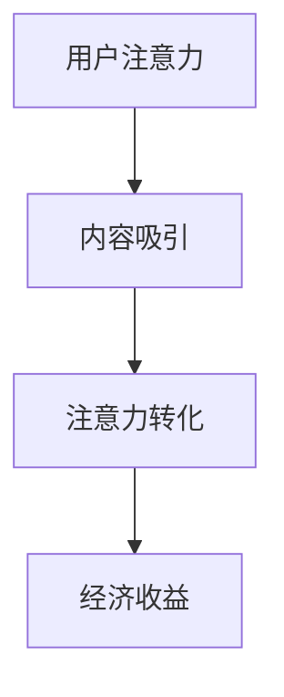
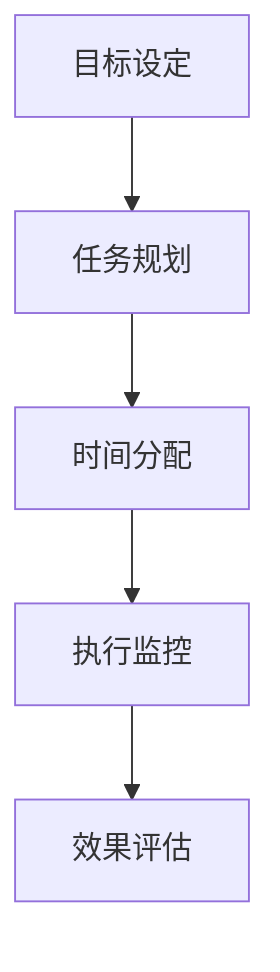

                 

## 文章标题：注意力经济与个人时间管理工具的发展

### 关键词：注意力经济，个人时间管理，工具，发展，影响，趋势，案例

### 摘要：
本文从注意力经济和个人时间管理的理论基础出发，探讨了二者在现代经济环境中的重要性及其相互关系。通过对注意力经济的定义、特征和趋势的深入分析，以及个人时间管理的基本原理、方法与技巧的详细阐述，本文进一步探讨了注意力经济与个人时间管理工具的结合，并列举了成功的案例。最后，本文展望了注意力经济与个人时间管理工具的未来发展趋势，以及可能面临的挑战和机遇。

## 第一部分：注意力经济概述

### 第1章：注意力经济的基础理论

#### 1.1 注意力经济的定义与起源

注意力经济是指通过吸引和利用人们的注意力来创造经济价值的一种经济模式。最早可以追溯到20世纪末的广告行业，随着互联网和数字媒体的兴起，这一概念逐渐扩展到其他领域。

在传统经济中，商品和服务是经济活动的核心，而注意力经济的核心是人们的注意力。注意力是一种有限的资源，无法同时专注于多个事物。因此，能够吸引并保持人们注意力的资源，如广告、媒体内容、应用等，具有巨大的商业价值。

#### 1.2 注意力经济的基本原理

注意力经济依赖于以下几个基本原理：

1. **稀缺性**：由于人们每天只有24小时，他们的注意力是有限的。因此，能够吸引注意力的资源显得尤为宝贵。
2. **竞争性**：在信息爆炸的时代，吸引注意力的竞争越来越激烈。各种应用、平台和媒体都在争夺用户的注意力。
3. **转化率**：将注意力转化为实际经济收益的能力。例如，广告商通过吸引观众的注意力来推销产品，媒体通过吸引读者和观众的注意力来赚取广告收入。

#### 1.3 注意力经济与传统经济的关系

注意力经济与传统经济的关系是互补的。传统经济侧重于生产、交换和消费，而注意力经济则侧重于如何吸引和利用人们的注意力。例如，传统经济中的产品和服务可以通过注意力经济来推广和销售。

然而，注意力经济与传统经济也存在区别。传统经济通常依赖于物理商品和货币交易，而注意力经济更多地依赖于数字内容和信息。此外，注意力经济更加注重用户体验和互动，而传统经济则更加注重效率和规模。

### 第2章：注意力经济的特征与趋势

#### 2.1 注意力经济的特征分析

注意力经济具有以下几个显著特征：

1. **数字化**：随着互联网和移动设备的发展，注意力经济日益数字化。数字媒体和平台成为吸引注意力的主要渠道。
2. **个性化**：通过大数据和人工智能技术，注意力经济可以更加个性化和精准地满足用户需求。内容推荐系统和个性化广告是典型的例子。
3. **即时性**：互联网使得信息传播变得即时，用户可以随时随地获取和分享内容。这种即时性使得注意力经济具有高度动态性和快速响应能力。

#### 2.2 注意力经济的主要趋势

注意力经济的主要趋势包括：

1. **注意力转移**：随着数字媒体的兴起，用户的注意力逐渐从传统媒体转移到互联网和移动设备。
2. **品牌注意力**：品牌建设成为吸引注意力的重要手段。品牌需要通过提供高质量的内容和服务来吸引和保持用户的注意力。
3. **社交媒体**：社交媒体平台成为吸引和转化注意力的重要工具。用户在社交媒体上花费的时间越来越多，这为品牌提供了更多机会。

#### 2.3 注意力经济的影响因素

注意力经济受到以下因素的影响：

1. **技术进步**：互联网、大数据和人工智能技术的发展，为注意力经济提供了更多机会和工具。
2. **用户习惯**：用户的消费习惯和注意力分配模式对注意力经济有决定性影响。例如，用户越来越依赖移动设备，这影响了内容生产和广告策略。
3. **政策环境**：政府政策对注意力经济有规范和引导作用。例如，隐私保护法规和数据监管政策会影响注意力经济的数据使用和商业模式。

## 第二部分：个人时间管理工具的发展

### 第3章：个人时间管理的基本原理

#### 3.1 个人时间管理的定义与重要性

个人时间管理是指个人为了提高时间利用效率，合理安排日常工作和生活时间的一系列活动。它涉及到如何设定目标、规划任务、优先排序、执行和评估时间使用。

个人时间管理的重要性体现在以下几个方面：

1. **提高工作效率**：通过合理规划时间，个人可以更高效地完成任务，减少无效工作时间。
2. **减少压力**：有效的时间管理有助于减少因时间不足而产生的压力和焦虑。
3. **实现个人目标**：明确的目标和合理的时间规划有助于个人实现长期和短期的目标。

#### 3.2 个人时间管理的基本原则

个人时间管理应遵循以下基本原则：

1. **明确目标**：设定清晰的目标，明确时间管理的方向。
2. **优先级排序**：根据重要性和紧急性对任务进行排序，优先完成重要且紧急的任务。
3. **合理规划**：合理安排时间，确保任务在规定的时间内完成。
4. **灵活调整**：根据实际情况灵活调整时间管理计划，以适应突发情况和变化。

#### 3.3 个人时间管理的方法与技巧

个人时间管理可以采用以下方法和技巧：

1. **时间日志**：记录每天的时间使用情况，了解自己的时间分配。
2. **番茄工作法**：将工作时间分为25分钟的工作周期，每个周期后休息5分钟，提高工作效率。
3. **GTD（Getting Things Done）**：通过收集、整理、组织、执行和回顾，管理待办事项。
4. **优先级矩阵**：根据重要性和紧急性将任务分为四个象限，优先处理重要且紧急的任务。
5. **任务分解**：将大任务分解为小任务，逐一完成，避免拖延。

### 第4章：现代个人时间管理工具的演变

#### 4.1 传统的个人时间管理工具

传统的个人时间管理工具主要包括日历、待办事项清单和备忘录等。这些工具便于个人记录和跟踪时间，但存在一定的局限性，如无法自动提醒、无法跨设备同步等。

#### 4.2 现代个人时间管理工具的发展

现代个人时间管理工具在传统工具的基础上得到了很大的发展，如电子日历、任务管理软件和时间跟踪工具等。这些工具具有以下特点：

1. **自动化提醒**：通过自动提醒功能，用户可以及时收到任务提醒，避免错过重要事项。
2. **跨设备同步**：用户可以在不同的设备上使用时间管理工具，实现数据的实时同步。
3. **数据分析**：通过数据分析功能，用户可以了解自己的时间使用习惯，优化时间分配。
4. **个性化推荐**：基于用户的行为数据，一些高级时间管理工具可以提供个性化的时间管理建议。

#### 4.3 个人时间管理工具的未来趋势

个人时间管理工具的未来趋势包括：

1. **智能化**：利用人工智能技术，提供更智能的时间管理建议和自动化功能。
2. **集成化**：将个人时间管理工具与其他应用（如邮件、日程安排等）集成，实现一站式管理。
3. **移动化**：随着移动互联网的发展，移动端个人时间管理工具将更加普及。
4. **物联网**：结合物联网技术，实现智能家居设备、健身设备等与时间管理工具的整合。

### 第5章：注意力经济与个人时间管理工具的结合

#### 5.1 注意力经济对个人时间管理的影响

注意力经济对个人时间管理产生了深远的影响。随着信息爆炸和数字媒体的兴起，用户面临的信息过载和时间碎片化问题日益严重。个人时间管理工具通过帮助用户过滤和利用注意力，提高时间利用效率。

#### 5.2 个人时间管理工具在注意力经济中的应用

个人时间管理工具在注意力经济中的应用主要体现在以下几个方面：

1. **注意力管理**：通过提供注意力管理功能，如定时提醒、专注模式等，帮助用户更好地集中注意力。
2. **时间优化**：通过分析用户的时间使用数据，提供个性化的时间管理建议，帮助用户优化时间分配。
3. **数据分析**：通过收集和分析用户的行为数据，为注意力经济提供洞察，优化产品和服务。

#### 5.3 注意力经济与个人时间管理工具的整合策略

整合注意力经济与个人时间管理工具的策略包括：

1. **数据驱动**：通过大数据分析，了解用户的行为模式和注意力偏好，提供个性化时间管理建议。
2. **用户教育**：通过教育和培训，提高用户的时间管理和注意力管理能力。
3. **产品创新**：开发结合注意力经济和个人时间管理的新工具和平台，满足用户需求。

### 第6章：注意力经济与个人时间管理工具的成功案例

#### 6.1 案例一：某公司的注意力经济与时间管理实践

案例一：某互联网公司通过引入注意力经济和个人时间管理工具，提高了员工的工作效率和创新能力。

1. **背景**：该公司在快速发展阶段，员工面临着大量任务和不断变化的需求，时间管理问题突出。
2. **实践**：
   - 引入任务管理软件，如Trello和Asana，帮助员工明确任务和优先级。
   - 实施番茄工作法，提高员工的工作专注度。
   - 定期收集员工的工作数据，分析时间使用情况，提供改进建议。
3. **效果**：通过有效的注意力经济和个人时间管理实践，该公司提高了员工的工作效率，创新能力和员工满意度也得到提升。

#### 6.2 案例二：某创业团队的注意力经济与时间管理实践

案例二：某创业团队在初创阶段，通过优化时间管理和注意力分配，成功吸引了投资并快速发展。

1. **背景**：该创业团队在资源有限的情况下，需要高效利用时间，确保项目进度和团队协作。
2. **实践**：
   - 制定明确的优先级排序，确保关键任务优先完成。
   - 使用时间跟踪工具，如RescueTime，了解团队成员的时间使用情况，优化时间分配。
   - 定期举行团队会议，回顾时间管理实践的效果，不断调整和改进。
3. **效果**：通过有效的注意力经济和个人时间管理实践，该创业团队提高了项目进展速度，成功吸引了投资，并实现了快速发展。

#### 6.3 案例三：某高校的注意力经济与时间管理实践

案例三：某高校通过推广注意力经济和个人时间管理理念，提高了学生的学习效果和教师的工作效率。

1. **背景**：该校面临着学生学习压力大、时间管理能力不足的问题，影响了教学效果和教师工作效率。
2. **实践**：
   - 开设时间管理和注意力管理课程，提高学生的意识和能力。
   - 提供时间管理工具，如Google Calendar和Trello，帮助学生和教师合理安排时间。
   - 定期举行讲座和培训，分享成功经验和实践技巧。
3. **效果**：通过注意力经济和个人时间管理实践，该校学生的学习效果得到显著提高，教师的工作效率也得到改善。

### 第7章：注意力经济与个人时间管理工具的未来发展

#### 7.1 未来注意力经济与个人时间管理工具的发展趋势

未来注意力经济与个人时间管理工具的发展趋势包括：

1. **智能化**：利用人工智能技术，提供更智能的时间管理和注意力管理建议。
2. **集成化**：将个人时间管理工具与其他应用（如邮件、日程安排等）集成，实现一站式管理。
3. **移动化**：随着移动互联网的发展，移动端个人时间管理工具将更加普及。
4. **物联网**：结合物联网技术，实现智能家居设备、健身设备等与时间管理工具的整合。

#### 7.2 注意力经济与个人时间管理工具的创新方向

未来注意力经济与个人时间管理工具的创新方向包括：

1. **个性化**：通过大数据和人工智能技术，提供更加个性化的时间管理和注意力管理建议。
2. **可穿戴设备**：开发结合可穿戴设备（如智能手表、健康监测器）的个人时间管理工具。
3. **虚拟现实和增强现实**：利用虚拟现实和增强现实技术，提供沉浸式的时间管理和注意力管理体验。
4. **社交媒体整合**：将社交媒体与时间管理工具整合，帮助用户更好地管理在线时间和社交互动。

#### 7.3 注意力经济与个人时间管理工具的未来挑战与机遇

未来注意力经济与个人时间管理工具将面临以下挑战和机遇：

1. **信息过载**：随着信息量的增加，如何有效过滤和利用信息将成为重要挑战。
2. **隐私保护**：用户对隐私的关注将要求个人时间管理工具更加注重数据保护和隐私安全。
3. **技术进步**：新技术的不断进步将为注意力经济与个人时间管理工具的发展提供更多机会和可能性。
4. **市场扩大**：随着人们对时间管理和注意力管理需求的增加，市场潜力巨大。

### 附录A：注意力经济与个人时间管理工具相关资源

#### A.1 注意力经济相关书籍推荐

- 《注意力经济：商业模式的秘密》
- 《注意力市场：数字时代的经济与社会变革》
- 《注意力稀缺：互联网时代的注意力管理》

#### A.2 个人时间管理相关书籍推荐

- 《高效能人士的七个习惯》
- 《时间管理：如何充分利用你的24小时》
- 《番茄工作法：简单却实用的个人时间管理方法》

#### A.3 注意力经济与个人时间管理工具的在线资源

- 时间管理网站：Trello、Asana
- 注意力管理工具：RescueTime、Focus@Will
- 在线学习平台：Coursera、Udemy

### 附录B：Mermaid流程图示例

#### B.1 注意力经济流程图



#### B.2 个人时间管理流程图



### 附录C：核心算法原理讲解与伪代码

#### C.1 注意力分配算法原理

注意力分配算法用于确定每个任务的注意力权重，其核心思想是根据任务的重要性和相关性分配注意力。以下是一个简化的注意力分配算法的伪代码：

```plaintext
输入：任务列表 tasks，注意力预算 budget
输出：每个任务的注意力分配权重 weights

函数 AttentionAllocation(tasks, budget):
    initialize weights as a list of zeros with length equal to tasks
    for each task in tasks:
        weight = calculate_relevance(task)
        weights[task] = min(weight, budget)
        budget -= weight
    return weights
```

#### C.2 时间分配算法原理

时间分配算法用于优化任务的时间分配，确保每个任务在规定时间内完成。以下是一个简化的时间分配算法的伪代码：

```plaintext
输入：任务列表 tasks，总时间 limit
输出：每个任务的时间分配时间 times

函数 TimeAllocation(tasks, limit):
    initialize times as a list of zeros with length equal to tasks
    for each task in tasks:
        time_needed = calculate_time_needed(task)
        times[task] = min(time_needed, limit)
        limit -= time_needed
    return times
```

### 附录D：项目实战

#### D.1 注意力经济与时间管理项目实战案例

**案例背景**：某科技公司希望提高员工的工作效率和创新能力，决定实施注意力经济与时间管理项目。

**实施步骤**：

1. **需求分析**：与员工进行访谈，了解他们在时间管理和注意力分配方面的问题和需求。
2. **方案设计**：结合注意力经济理论和个人时间管理方法，设计符合公司需求的注意力经济与时间管理方案。
3. **培训实施**：为员工提供注意力管理和时间管理的培训，提高他们的意识和能力。
4. **工具引入**：引入Trello、RescueTime等工具，帮助员工更好地管理任务和时间。
5. **数据监控**：定期收集员工的工作数据，分析时间使用情况和注意力分配效果，提供改进建议。

**实施效果**：通过实施注意力经济与时间管理项目，该公司提高了员工的工作效率，减少了时间浪费，创新能力也有所提升。

#### D.2 项目开发环境搭建

**背景**：为了实施注意力经济与时间管理项目，需要搭建一个支持数据收集、分析和展示的开发环境。

**实施步骤**：

1. **开发工具**：选择Python作为主要开发语言，使用Jupyter Notebook进行数据分析和模型训练。
2. **数据库**：使用MySQL数据库存储用户数据和时间管理日志。
3. **数据采集**：使用Python的Scrapy框架采集互联网上的注意力经济相关数据。
4. **数据预处理**：使用Pandas库进行数据清洗和预处理，为模型训练做准备。
5. **模型训练**：使用Scikit-learn库训练注意力分配模型和时间分配模型。

#### D.3 源代码实现与代码解读

**代码实现**：

```python
# 注意力分配模型实现
from sklearn.linear_model import LinearRegression

def train_attention_model(data):
    X = data[['task_importance', 'task_relevance']]
    y = data['attention_weight']
    model = LinearRegression()
    model.fit(X, y)
    return model

# 时间分配模型实现
from sklearn.linear_model import LinearRegression

def train_time_model(data):
    X = data[['task_importance', 'task_priority']]
    y = data['time_allocated']
    model = LinearRegression()
    model.fit(X, y)
    return model
```

**代码解读**：

- 注意力分配模型使用线性回归模型，根据任务的重要性和相关性预测注意力权重。
- 时间分配模型也使用线性回归模型，根据任务的重要性和优先级预测所需的时间分配。

#### D.4 代码解读与分析

**代码解读**：

- `train_attention_model` 函数接受一个包含任务重要性和相关性的数据集，使用线性回归模型训练注意力分配模型。
- `train_time_model` 函数接受一个包含任务重要性和优先级的数据集，使用线性回归模型训练时间分配模型。

**分析**：

- 线性回归模型适用于预测连续值输出，通过训练模型，我们可以根据新的任务数据预测其注意力权重和时间分配。
- 实际应用中，可能需要根据业务需求和数据质量调整模型参数和特征选择，以提高预测准确性。

### 作者

作者：AI天才研究院/AI Genius Institute & 禅与计算机程序设计艺术 /Zen And The Art of Computer Programming

