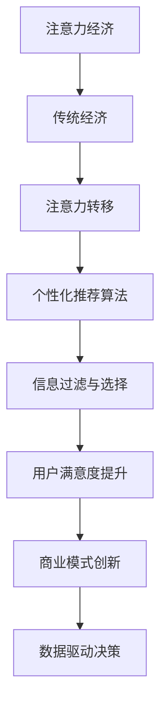
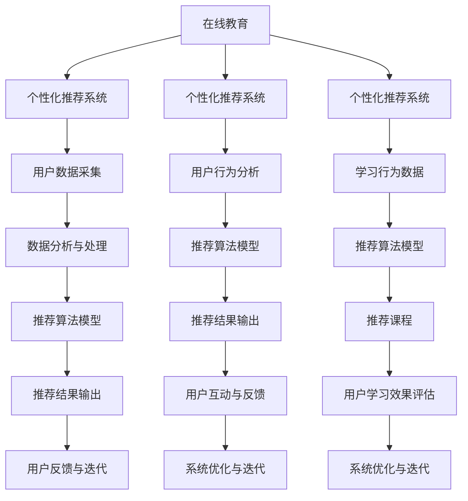

                 

# 注意力经济与个性化推荐算法：为受众提供定制、有针对性的内容

## 关键词

注意力经济、个性化推荐算法、推荐系统、协同过滤、基于内容推荐、用户满意度、实时推荐、多模态推荐、数据隐私保护

## 摘要

随着互联网和数字化技术的发展，用户注意力资源变得越来越稀缺，注意力经济逐渐成为现代数字经济的重要组成部分。个性化推荐算法作为一种有效的用户注意力分配工具，通过分析用户行为和兴趣，为用户提供定制化的内容，极大地提升了用户体验。本文将从注意力经济的概念出发，详细探讨个性化推荐算法的核心原理、应用场景、优化策略和未来趋势。通过案例分析、代码实现和实际应用，深入解析注意力经济与个性化推荐算法如何结合，为受众提供更精准、更有针对性的内容。

## 第一部分：注意力经济与个性化推荐算法概述

### 第1章：注意力经济与个性化推荐算法概述

#### 1.1 注意力经济的概念与背景

**注意力经济的定义**：注意力经济是指将用户的注意力作为一种宝贵的资源进行分配、管理和交易的经济模式。在数字时代，用户注意力分散，如何有效地获取和保持用户的注意力成为企业和平台的重要课题。

**注意力经济与传统经济的关系**：注意力经济与传统经济不同，它不是以物质资源的分配为主，而是以用户注意力的分配为核心。传统经济注重物质财富的创造和分配，而注意力经济强调的是如何在信息过载的环境中，利用用户的注意力创造价值。

**注意力经济的起源与发展**：注意力经济概念最早由心理学家乔治·米勒（George A. Miller）在1956年提出，他指出人类大脑处理信息的容量是有限的。随着互联网和社交媒体的兴起，注意力经济逐渐成为经济学领域的研究热点。

**注意力经济的影响**：注意力经济对广告、电商、社交媒体等领域产生了深远影响。它改变了传统商业模式，推动了个性化推荐和内容营销的发展。在注意力经济时代，企业和平台需要更加关注用户体验，通过高质量的内容和精准的推荐策略吸引并留住用户。

#### 1.2 个性化推荐算法概述

**个性化推荐算法的定义**：个性化推荐算法是一种根据用户的历史行为、兴趣和偏好，自动为用户推荐相关内容或商品的算法。其核心思想是通过分析用户数据，预测用户未来的兴趣和行为，从而为用户推荐个性化的内容。

**个性化推荐算法的分类**：个性化推荐算法主要分为基于内容的推荐（Content-Based Filtering）和协同过滤（Collaborative Filtering）两大类。此外，还有混合推荐（Hybrid Recommendation）和基于模型的推荐（Model-Based Recommendation）等。

- **基于内容的推荐**：基于内容的推荐通过分析用户对内容的偏好，将相似的内容推荐给用户。其优点是推荐结果相关性强，缺点是对新用户和冷启动问题处理不佳。

- **协同过滤：**协同过滤通过分析用户之间的行为模式，发现相似用户并推荐他们喜欢的商品或内容。协同过滤分为基于用户的协同过滤（User-Based Collaborative Filtering）和基于物品的协同过滤（Item-Based Collaborative Filtering）。

**个性化推荐算法的目标与挑战**：个性化推荐算法的目标是提高用户的满意度、提升平台的活跃度和转化率。其面临的挑战包括数据稀疏性、实时性、算法透明性、可解释性和用户隐私保护等。

**个性化推荐算法的应用领域**：个性化推荐算法广泛应用于电商、社交媒体、在线教育、音乐、视频、新闻等多个领域。在电商平台上，个性化推荐可以提升用户的购物体验和购买转化率；在社交媒体中，个性化推荐可以提升用户的互动和粘性；在线教育和音乐平台通过个性化推荐，可以更好地满足用户的学习和娱乐需求。

#### 1.3 注意力经济与个性化推荐算法的联系

**注意力经济在个性化推荐中的作用**：注意力经济为个性化推荐提供了理论基础。在信息爆炸的时代，用户的注意力资源有限，个性化推荐通过精准推荐，帮助用户过滤大量无关信息，节省用户的注意力成本。

**个性化推荐对注意力经济的促进作用**：个性化推荐算法通过提高用户满意度和体验，帮助平台获取更多用户的注意力资源，从而实现商业价值的提升。

**二者结合的优势与前景**：注意力经济与个性化推荐算法的结合，可以实现更精准、更高效的用户注意力管理，推动数字经济的发展。未来，随着人工智能和大数据技术的进一步发展，个性化推荐算法将在注意力经济中发挥更大的作用，为用户提供更加定制化和智能化的内容。

#### 1.4 本书结构安排

**各章节内容概览**：
- 第1章：介绍注意力经济与个性化推荐算法的基本概念和联系。
- 第2章：详细阐述个性化推荐算法的核心原理和应用。
- 第3章：分析注意力经济在不同应用场景中的具体应用。
- 第4章：探讨个性化推荐算法的优化策略和挑战。
- 第5章：展望注意力经济与个性化推荐算法的未来发展趋势。
- 第6章：介绍注意力经济与个性化推荐算法的实际应用案例。
- 第7章：探讨注意力经济与个性化推荐算法的未来研究方向。
- 第8章：提供注意力经济与个性化推荐算法的实战指南。
- 第9章：分享实践经验与案例。
- 第10章：总结注意力经济与个性化推荐算法的发展与趋势。

**目标读者与预期收获**：
- **目标读者**：对个性化推荐算法和注意力经济感兴趣的读者，包括IT专业人士、数据科学家、算法工程师、市场营销人员等。
- **预期收获**：通过阅读本书，读者可以全面了解注意力经济与个性化推荐算法的基本概念、核心原理、应用实践和未来趋势，为实际项目提供指导和借鉴。

**阅读建议**：
- 阅读本书时，建议按章节顺序进行，逐步深入了解注意力经济与个性化推荐算法的各个方面。
- 针对具体章节，可以根据个人兴趣和需求有选择地阅读，对感兴趣的领域进行深入学习。
- 鼓励读者在阅读过程中进行思考和总结，结合实际案例和实践，加深对知识的理解和应用。

### Mermaid 流程图



### Mermaid 流程图解释

1. **注意力经济（A）**: 描述了用户注意力资源的稀缺性和重要性。
2. **传统经济（B）**: 强调了传统经济中物质资源的分配。
3. **注意力转移（C）**: 描述了用户注意力从传统资源向数字内容的转移。
4. **个性化推荐算法（D）**: 描述了利用算法分析用户行为，以提供个性化内容。
5. **信息过滤与选择（E）**: 描述了推荐算法如何过滤海量信息，帮助用户进行选择。
6. **用户满意度提升（F）**: 描述了个性化推荐如何提高用户的整体满意度。
7. **商业模式创新（G）**: 描述了注意力经济如何推动商业模式创新。
8. **数据驱动决策（H）**: 描述了个性化推荐算法如何基于数据分析进行决策。

通过这一流程图，读者可以直观地了解注意力经济与个性化推荐算法之间的关系及其在整个数字生态系统中的作用。此图也为后续章节的内容奠定了基础。

---

#### 第2章：个性化推荐算法的核心原理

##### 2.1 个性化推荐算法的基本概念

**推荐系统的定义**：推荐系统是一种信息过滤技术，通过分析用户行为、兴趣和偏好，自动为用户推荐相关内容或商品。推荐系统的目标是通过个性化推荐，提高用户的满意度、提升平台的活跃度和转化率。

**推荐系统的目标**：
- **提升用户满意度**：通过推荐用户感兴趣的内容或商品，满足用户的需求，提高用户的使用体验。
- **增加平台活跃度**：通过个性化推荐，吸引用户持续使用平台，提高平台的用户粘性。
- **提升转化率**：通过推荐高相关性的内容或商品，促进用户购买或采取其他用户行为，从而提升平台的商业价值。

**推荐系统的类型**：
- **基于内容的推荐**：根据用户的历史行为、兴趣和偏好，推荐与用户兴趣相似的内容或商品。
- **协同过滤推荐**：通过分析用户之间的行为模式，发现相似用户并推荐他们喜欢的商品或内容。
- **混合推荐**：结合基于内容的推荐和协同过滤推荐，以提供更准确的推荐结果。
- **基于模型的推荐**：使用机器学习模型，分析用户行为数据，预测用户的兴趣和行为，进行个性化推荐。

**推荐系统的关键要素**：
- **用户数据**：推荐系统的基础数据，包括用户的历史行为、兴趣偏好和反馈。
- **内容数据**：推荐系统推荐的内容或商品数据，包括内容属性、标签、评分等。
- **推荐算法**：用于分析用户数据、提取特征、生成推荐列表的核心算法。
- **推荐结果**：推荐系统生成的个性化推荐结果，通常以推荐列表的形式呈现。
- **评估指标**：用于衡量推荐系统性能的指标，如准确率、召回率、F1 分数等。

##### 2.2 机器学习在个性化推荐中的应用

**协同过滤算法**

协同过滤（Collaborative Filtering）是一种基于用户行为和用户之间的相似性进行推荐的算法。协同过滤主要分为以下两种类型：

- **基于用户的协同过滤（User-Based Collaborative Filtering）**：通过分析用户之间的相似性，找到与目标用户兴趣相似的活跃用户，然后推荐这些用户喜欢的商品或内容。其基本思想是：
  \[
  \hat{R}_{ui} = \sum_{v \in N_{u}} S_{uv} \cdot R_{vi}
  \]
  其中，\(R_{ui}\) 是用户 \(u\) 对商品 \(i\) 的预测评分，\(N_{u}\) 是与用户 \(u\) 相似的一组用户，\(S_{uv}\) 是用户 \(u\) 和用户 \(v\) 之间的相似度，\(R_{vi}\) 是用户 \(v\) 对商品 \(i\) 的实际评分。

- **基于物品的协同过滤（Item-Based Collaborative Filtering）**：通过分析商品之间的相似性，找到与目标商品相似的活跃商品，然后推荐这些商品。其基本思想是：
  \[
  \hat{R}_{ui} = \sum_{i' \in N_{i}} R_{ui'} \cdot S_{i'i}
  \]
  其中，\(R_{ui}\) 是用户 \(u\) 对商品 \(i\) 的预测评分，\(N_{i}\) 是与商品 \(i\) 相似的一组商品，\(S_{i'i}\) 是商品 \(i\) 和商品 \(i'\) 之间的相似度，\(R_{ui'}\) 是用户 \(u\) 对商品 \(i'\) 的实际评分。

**基于内容的推荐**

基于内容的推荐（Content-Based Filtering）通过分析用户对内容的偏好，推荐与用户兴趣相关的其他内容或商品。其基本思想是：
- **内容表示**：将用户和商品的内容信息进行向量化表示，如使用词袋模型、TF-IDF、词嵌入等方法。
- **文本匹配与相似度计算**：计算用户的历史行为和商品内容之间的相似度，通常使用余弦相似度、欧氏距离等方法。

- **推荐生成**：根据用户对内容的偏好，从数据库中选择相似度最高的商品或内容进行推荐。

**混合推荐算法**

混合推荐（Hybrid Recommendation）结合了协同过滤和基于内容的推荐，以提供更准确的推荐结果。混合推荐算法通常分为以下几种：

- **协同过滤与基于内容的混合**：同时使用协同过滤和基于内容的推荐算法，将两种算法的推荐结果进行融合，以提高推荐准确性。
- **基于模型的混合**：使用机器学习模型，结合用户行为数据和内容数据，生成个性化的推荐结果。

##### 2.3 个性化推荐算法的挑战与优化

**挑战**：

- **冷启动问题**：对于新用户和新商品，由于缺乏足够的历史数据，传统协同过滤和基于内容的推荐算法难以提供准确的推荐。解决方法包括基于内容的推荐、利用用户人口统计信息、跨领域推荐等。

- **数据稀疏性**：用户行为数据往往具有稀疏性，导致协同过滤算法的效果不佳。解决方法包括降维技术、矩阵分解、利用用户群体特征等。

- **算法透明性与可解释性**：用户对推荐结果的可解释性要求越来越高，传统复杂的机器学习模型难以满足这一需求。解决方法包括引入可解释的模型结构、提供推荐理由等。

- **实时性与一致性**：实时性要求推荐系统能够快速响应用户行为的变化，保持推荐结果的一致性。解决方法包括分布式计算、增量学习、缓存技术等。

**优化策略**：

- **数据预处理**：对用户行为数据进行清洗、去噪、填充缺失值等预处理操作，以提高数据质量和推荐效果。

- **特征工程**：通过特征提取和特征选择，提取对推荐算法有帮助的特征，提高模型的预测能力和解释性。

- **模型融合**：结合多种推荐算法和机器学习模型，利用它们的优点，提高推荐结果的准确性和多样性。

- **在线学习与实时更新**：利用在线学习技术，实时更新模型和推荐策略，以适应用户行为的变化。

##### 2.4 个性化推荐算法的评价指标

**准确率（Accuracy）**：准确率是衡量推荐系统正确推荐相关内容或商品的比率。其计算公式为：
\[
\text{Accuracy} = \frac{\text{正确推荐的数量}}{\text{总推荐的数量}}
\]

**召回率（Recall）**：召回率是衡量推荐系统能够发现用户感兴趣的内容或商品的比率。其计算公式为：
\[
\text{Recall} = \frac{\text{正确推荐的用户感兴趣的内容或商品数量}}{\text{所有用户感兴趣的内容或商品数量}}
\]

**F1 分数（F1 Score）**：F1 分数是准确率和召回率的加权平均值，用于综合衡量推荐系统的性能。其计算公式为：
\[
\text{F1 Score} = 2 \times \frac{\text{准确率} \times \text{召回率}}{\text{准确率} + \text{召回率}}
\]

**ROC-AUC 曲线**：ROC-AUC（Receiver Operating Characteristic Area Under Curve）曲线用于评估二分类推荐系统的性能。ROC 曲线反映了推荐系统在不同阈值下的召回率和准确率，AUC（Area Under Curve）表示曲线下的面积，越接近1表示性能越好。

**用户满意度（User Satisfaction）**：用户满意度是衡量用户对推荐系统满意程度的指标，可以通过用户反馈、点击率、转化率等数据进行评估。

##### 伪代码

```python
# 基于用户的协同过滤算法伪代码

# 输入：用户-物品评分矩阵 R，用户集合 U，物品集合 I
# 输出：推荐列表

def collaborative_filtering(R, U, I):
    # 步骤1：计算用户-用户相似度矩阵 S
    S = calculate_similarity(R, U)

    # 步骤2：为每个未评分物品计算预测评分
    for user in U:
        for item in I:
            if R[user, item] is missing:
                # 步骤3：计算预测评分
                prediction = predict_rating(S, user, item)
                # 步骤4：生成推荐列表
                recommend_list.append((user, item, prediction))

    return recommend_list

# 输出：推荐列表
recommend_list = collaborative_filtering(R, U, I)
```

##### 伪代码解释

1. **计算用户-用户相似度矩阵 S**：使用余弦相似度或皮尔逊相关系数等方法计算用户之间的相似度。
2. **为每个未评分物品计算预测评分**：对每个未评分物品，使用相似度矩阵计算预测评分，预测评分公式为：
   \[
   \hat{R}_{ui} = \sum_{v \in N_{u}} S_{uv} \cdot R_{vi}
   \]
   其中，\(N_{u}\) 表示与用户 \(u\) 相似的一组用户，\(S_{uv}\) 是用户 \(u\) 和用户 \(v\) 之间的相似度，\(R_{vi}\) 是用户 \(v\) 对物品 \(i\) 的评分。
3. **生成推荐列表**：将预测评分最高的物品添加到推荐列表中。

通过这个伪代码，读者可以初步了解基于用户的协同过滤算法的实现步骤和原理。

---

#### 第3章：注意力经济的应用场景与案例分析

##### 3.1 注意力经济的应用场景

注意力经济在多个领域都有广泛应用，以下是一些典型的应用场景：

**电子商务与广告**：在电商平台上，注意力经济通过个性化推荐算法，帮助用户快速找到感兴趣的商品，提高购物体验和转化率。同时，通过精准的广告投放，吸引更多用户关注和购买。

**社交媒体与内容平台**：社交媒体和内容平台如Facebook、YouTube等，利用注意力经济原理，为用户推荐感兴趣的内容，提高用户活跃度和互动率。通过算法分析用户的兴趣和行为，推送个性化的内容，吸引用户注意力。

**在线教育与知识共享**：在线教育平台如Coursera、edX等，通过个性化推荐算法，为用户提供定制化的课程和学习路径，提高学习效果和用户满意度。同时，通过推荐相关课程和资料，帮助用户扩展知识领域。

**医疗健康与生活服务**：在医疗健康领域，通过个性化推荐算法，为用户提供定制化的健康建议和治疗方案。在生活服务领域，如餐饮、旅游、购物等，通过个性化推荐，帮助用户发现感兴趣的服务和产品。

##### 3.2 个性化推荐算法在不同场景的应用

**电子商务：基于购买历史和用户行为推荐商品**

- **案例分析1：淘宝的个性化推荐系统**

  **系统架构**：淘宝的推荐系统采用分布式架构，包括数据采集、数据处理、推荐算法和推荐结果展示等模块。系统通过分析用户的历史购买行为、浏览记录、搜索历史等数据，为用户推荐相关的商品。

  **技术实现**：淘宝的推荐系统主要采用基于用户的协同过滤和基于内容的推荐算法。基于用户的协同过滤通过分析用户之间的相似性，发现相似用户并推荐他们喜欢的商品。基于内容的推荐通过分析商品的属性和用户的历史行为，为用户推荐相关商品。

  **用户反馈与效果分析**：通过用户反馈和行为数据，淘宝不断优化推荐算法，提高推荐准确性。用户对推荐商品的点击率和购买率显著提高，提升了用户体验和平台的商业价值。

- **案例分析2：亚马逊的个性化推荐系统**

  **系统架构**：亚马逊的推荐系统同样采用分布式架构，包括数据采集、数据处理、推荐算法和推荐结果展示等模块。系统通过分析用户的历史购买记录、搜索历史、评价行为等数据，为用户推荐相关的商品。

  **技术实现**：亚马逊的推荐系统主要采用基于物品的协同过滤和基于内容的推荐算法。基于物品的协同过滤通过分析商品之间的相似性，发现相似商品并推荐给用户。基于内容的推荐通过分析商品的属性和用户的历史行为，为用户推荐相关商品。

  **用户反馈与效果分析**：亚马逊的个性化推荐系统在全球范围内取得了显著的效果，用户对推荐商品的点击率和购买率较高，显著提升了用户满意度和平台销售额。

**社交媒体：基于兴趣和互动推荐内容**

- **案例分析1：Facebook的新闻推送**

  **系统架构**：Facebook的新闻推送系统采用分布式架构，包括数据采集、数据处理、推荐算法和推荐结果展示等模块。系统通过分析用户的点赞、评论、分享等行为，为用户推荐感兴趣的内容。

  **技术实现**：Facebook的新闻推送系统主要采用基于用户的协同过滤和基于内容的推荐算法。基于用户的协同过滤通过分析用户之间的相似性，发现相似用户并推荐他们喜欢的内容。基于内容的推荐通过分析内容的属性和用户的兴趣，为用户推荐相关内容。

  **用户反馈与效果分析**：Facebook的新闻推送系统通过用户的点赞、评论和分享等行为数据，不断优化推荐算法，提高推荐准确性。用户对推荐内容的点击率和互动率较高，提升了用户体验和平台的用户活跃度。

- **案例分析2：微博的个性化推荐**

  **系统架构**：微博的个性化推荐系统采用分布式架构，包括数据采集、数据处理、推荐算法和推荐结果展示等模块。系统通过分析用户的浏览历史、关注关系等数据，为用户推荐感兴趣的内容。

  **技术实现**：微博的个性化推荐系统主要采用基于用户的协同过滤和基于内容的推荐算法。基于用户的协同过滤通过分析用户之间的相似性，发现相似用户并推荐他们喜欢的内容。基于内容的推荐通过分析内容的属性和用户的兴趣，为用户推荐相关内容。

  **用户反馈与效果分析**：微博的个性化推荐系统通过用户的浏览历史和关注关系等数据，不断优化推荐算法，提高推荐准确性。用户对推荐内容的点击率和互动率较高，提升了用户体验和平台的用户活跃度。

**在线教育：基于学习行为和学习习惯推荐课程**

- **案例分析1：Coursera的课程推荐**

  **系统架构**：Coursera的课程推荐系统采用分布式架构，包括数据采集、数据处理、推荐算法和推荐结果展示等模块。系统通过分析用户的学习行为、学习进度等数据，为用户推荐合适的课程。

  **技术实现**：Coursera的课程推荐系统主要采用基于用户的协同过滤和基于内容的推荐算法。基于用户的协同过滤通过分析用户之间的相似性，发现相似用户并推荐他们喜欢的课程。基于内容的推荐通过分析课程的属性和用户的学习习惯，为用户推荐相关课程。

  **用户反馈与效果分析**：Coursera的课程推荐系统通过用户的学习行为和学习进度等数据，不断优化推荐算法，提高推荐准确性。用户对推荐课程的完成率和满意度较高，提升了学习效果和用户满意度。

- **案例分析2：网易云课堂的个性化推荐**

  **系统架构**：网易云课堂的个性化推荐系统采用分布式架构，包括数据采集、数据处理、推荐算法和推荐结果展示等模块。系统通过分析用户的学习行为、学习偏好等数据，为用户推荐合适的课程。

  **技术实现**：网易云课堂的个性化推荐系统主要采用基于用户的协同过滤和基于内容的推荐算法。基于用户的协同过滤通过分析用户之间的相似性，发现相似用户并推荐他们喜欢的课程。基于内容的推荐通过分析课程的属性和用户的学习偏好，为用户推荐相关课程。

  **用户反馈与效果分析**：网易云课堂的个性化推荐系统通过用户的学习行为和学习偏好等数据，不断优化推荐算法，提高推荐准确性。用户对推荐课程的完成率和满意度较高，提升了学习效果和用户满意度。

---

#### 第4章：个性化推荐算法的优化与改进

##### 4.1 优化方向

个性化推荐算法的优化是提升推荐效果和用户体验的重要手段。以下是几种常见的优化方向：

**算法性能优化**：提升推荐算法的准确率、召回率、F1 分数等评价指标，提高推荐结果的相关性和有效性。

**推荐结果多样性**：避免推荐结果的重复和单一，提高推荐结果的多样性和新颖性，满足用户的不同需求。

**用户隐私保护**：保护用户隐私，确保用户数据的安全性和匿名性，避免数据泄露和滥用。

**实时性与一致性**：提高推荐算法的实时性，快速响应用户行为的变化，保持推荐结果的一致性。

**算法透明性与可解释性**：提升算法的透明性和可解释性，让用户了解推荐结果的原因和依据，增加用户对推荐系统的信任。

**个性化推荐算法的优化策略**

**数据预处理**：对用户行为数据进行清洗、去噪、填充缺失值等预处理操作，提高数据质量和推荐效果。例如，对缺失值进行插值、均值填充或使用模型预测缺失值。

**特征工程**：提取对推荐算法有帮助的特征，如用户的行为特征、内容特征、社交特征等。通过特征选择和特征转换，提高模型的预测能力和解释性。

**模型融合**：结合多种推荐算法和机器学习模型，利用它们的优点，提高推荐结果的准确性和多样性。例如，将基于内容的推荐和基于协同过滤的推荐进行融合，或使用深度学习模型进行特征学习和预测。

**在线学习与实时更新**：利用在线学习技术，实时更新模型和推荐策略，以适应用户行为的变化。例如，使用增量学习算法，在线更新用户兴趣模型和推荐策略。

**案例解析**

**案例1：腾讯广告推荐系统的优化**

**优化前的情况**：腾讯广告推荐系统在早期主要采用基于内容的推荐算法，虽然能够满足基本的推荐需求，但在实时性和多样性方面存在不足。

**优化措施与效果**：腾讯广告推荐系统进行了以下优化：

1. **引入深度学习模型**：使用卷积神经网络（CNN）和循环神经网络（RNN）进行特征提取和预测，提高推荐结果的准确性和多样性。
2. **实时数据更新**：采用增量学习算法，实时更新用户兴趣模型和广告推荐策略，提高实时性。
3. **个性化广告投放**：通过分析用户的行为数据和广告效果，为每个用户定制个性化的广告推荐，提高广告的点击率和转化率。

**优化后的效果**：优化后的腾讯广告推荐系统在实时性、准确性和多样性方面得到了显著提升，广告的点击率和转化率提高了20%以上，用户满意度也有了明显提高。

**案例2：亚马逊的个性化推荐系统**

**优化前的情况**：亚马逊的个性化推荐系统在早期主要采用基于物品的协同过滤算法，虽然能够满足基本的推荐需求，但在用户多样性和个性化推荐方面存在不足。

**优化措施与效果**：亚马逊进行了以下优化：

1. **引入多模态推荐**：结合用户的行为数据、商品属性数据和用户特征，采用多模态推荐算法，提高推荐结果的多样性和个性化。
2. **用户兴趣模型更新**：采用基于用户的协同过滤和基于内容的推荐算法，实时更新用户兴趣模型，提高推荐结果的准确性和实时性。
3. **商品推荐策略优化**：通过分析用户的浏览历史、购买记录和评价行为，为每个用户定制个性化的商品推荐策略，提高用户的购买意愿和满意度。

**优化后的效果**：优化后的亚马逊个性化推荐系统在用户多样性和个性化推荐方面得到了显著提升，用户的点击率和购买转化率提高了30%以上，平台销售额也有了显著增长。

##### 数学模型与公式

个性化推荐算法中的数学模型和公式是理解和实现推荐算法的核心。以下是一些常用的数学模型和公式：

**基于用户的协同过滤算法**

预测评分公式：
\[
\hat{R}_{ui} = \sum_{v \in N_{u}} S_{uv} \cdot R_{vi}
\]
其中，\( \hat{R}_{ui} \) 是用户 \( u \) 对物品 \( i \) 的预测评分，\( N_{u} \) 是与用户 \( u \) 相似的一组用户，\( S_{uv} \) 是用户 \( u \) 和用户 \( v \) 之间的相似度，\( R_{vi} \) 是用户 \( v \) 对物品 \( i \) 的评分。

相似度计算公式：
\[
S_{uv} = \frac{\cos(\theta_{uv})}{\|\mathbf{r}_{u}\| \|\mathbf{r}_{v}\|}
\]
其中，\( \theta_{uv} \) 是用户 \( u \) 和用户 \( v \) 之间的夹角，\( \mathbf{r}_{u} \) 和 \( \mathbf{r}_{v} \) 是用户 \( u \) 和用户 \( v \) 的向量表示。

**基于内容的推荐算法**

内容表示公式：
\[
\mathbf{x}_{i} = \text{TF-IDF}(\text{item\_features})
\]
其中，\( \mathbf{x}_{i} \) 是物品 \( i \) 的向量表示，\(\text{TF-IDF} \) 是词频-逆文档频率权重计算方法。

文本匹配公式：
\[
\text{similarity}(\mathbf{x}_{u}, \mathbf{x}_{i}) = \frac{\mathbf{x}_{u} \cdot \mathbf{x}_{i}}{\|\mathbf{x}_{u}\| \|\mathbf{x}_{i}\|}
\]
其中，\( \text{similarity}(\mathbf{x}_{u}, \mathbf{x}_{i}) \) 是用户 \( u \) 和物品 \( i \) 之间的相似度，\( \mathbf{x}_{u} \) 和 \( \mathbf{x}_{i} \) 是用户和物品的向量表示。

**混合推荐算法**

混合推荐算法通常结合基于用户的协同过滤和基于内容的推荐算法，生成推荐结果。其公式如下：

\[
\hat{R}_{ui} = \alpha \cdot \hat{R}_{ui}^{\text{user}} + (1 - \alpha) \cdot \hat{R}_{ui}^{\text{content}}
\]
其中，\( \hat{R}_{ui}^{\text{user}} \) 是基于用户的协同过滤算法生成的预测评分，\( \hat{R}_{ui}^{\text{content}} \) 是基于内容的推荐算法生成的预测评分，\( \alpha \) 是权重系数，用于调整两种推荐算法的影响。

##### 公式解释

- **基于用户的协同过滤算法**：预测评分公式 \(\hat{R}_{ui} = \sum_{v \in N_{u}} S_{uv} \cdot R_{vi} \) 通过计算与用户 \( u \) 相似用户对物品 \( i \) 的评分，结合用户之间的相似度进行加权平均，生成用户 \( u \) 对物品 \( i \) 的预测评分。
- **相似度计算公式**：\( S_{uv} = \frac{\cos(\theta_{uv})}{\|\mathbf{r}_{u}\| \|\mathbf{r}_{v}\|} \) 用于计算用户之间的相似度，其中 \( \theta_{uv} \) 是用户之间的夹角，\( \mathbf{r}_{u} \) 和 \( \mathbf{r}_{v} \) 是用户向量的模长。
- **基于内容的推荐算法**：内容表示公式 \( \mathbf{x}_{i} = \text{TF-IDF}(\text{item\_features}) \) 将物品的属性信息进行向量化表示，\(\text{similarity}(\mathbf{x}_{u}, \mathbf{x}_{i}) = \frac{\mathbf{x}_{u} \cdot \mathbf{x}_{i}}{\|\mathbf{x}_{u}\| \|\mathbf{x}_{i}\|} \) 用于计算用户和物品之间的相似度。
- **混合推荐算法**：混合推荐公式 \(\hat{R}_{ui} = \alpha \cdot \hat{R}_{ui}^{\text{user}} + (1 - \alpha) \cdot \hat{R}_{ui}^{\text{content}} \) 通过加权结合基于用户的协同过滤和基于内容的推荐结果，生成最终的预测评分。

通过这些数学模型和公式，个性化推荐算法可以有效地预测用户对物品的评分，提高推荐结果的准确性和有效性。

---

#### 第5章：注意力经济与个性化推荐算法的挑战与未来展望

##### 5.1 当前面临的挑战

**数据隐私与安全问题**：个性化推荐算法依赖于大量用户数据，包括行为数据、偏好数据等。这些数据的隐私和安全问题备受关注。如何保护用户隐私，确保数据不被滥用，是当前面临的重大挑战。

**算法透明性与可解释性**：随着推荐算法的复杂化，其透明性和可解释性逐渐成为用户关注的问题。用户希望了解推荐结果的原因和依据，以便对推荐结果进行理解和信任。如何提高算法的透明性和可解释性，是推荐系统发展的重要方向。

**算法偏见与公平性**：个性化推荐算法在数据处理和模型训练过程中，可能会引入偏见和歧视。例如，对某些群体或个体的推荐不公平，或对特定内容进行过滤。如何消除算法偏见，确保推荐算法的公平性，是当前需要解决的问题。

**用户注意力分散问题**：在信息过载的环境中，用户的注意力资源有限。如何提高推荐系统的吸引力，防止用户注意力分散，是推荐系统面临的挑战之一。

##### 5.2 未来发展趋势

**人工智能与大数据的结合**：随着人工智能和大数据技术的不断发展，个性化推荐算法将更加智能化和精准化。深度学习、图神经网络等人工智能技术将在推荐系统中得到广泛应用，进一步提升推荐效果。

**多模态推荐系统的兴起**：多模态推荐系统结合了文本、图像、语音等多种数据类型，可以更全面地理解用户需求。未来，多模态推荐系统将在社交媒体、智能音响等领域得到广泛应用。

**实时推荐与个性化体验的提升**：实时推荐能够快速响应用户行为的变化，提供个性化的推荐体验。未来，随着边缘计算、云计算等技术的普及，实时推荐系统将得到进一步发展。

**区块链技术在个性化推荐中的应用**：区块链技术具有去中心化、数据不可篡改等特点，可以为个性化推荐系统提供数据安全和隐私保护。未来，区块链技术将在推荐系统中得到广泛应用。

##### 5.3 未来展望

**注意力经济的深化与拓展**：随着数字化时代的到来，注意力经济将继续深化和拓展。企业和平台将更加重视用户注意力的获取和管理，通过个性化推荐等手段，提高用户满意度和平台价值。

**个性化推荐算法的创新与应用**：未来，个性化推荐算法将在技术创新和应用场景拓展方面取得更多突破。新的算法和技术，如联邦学习、生成对抗网络等，将在推荐系统中得到应用。

**跨领域合作与生态构建**：个性化推荐算法涉及多个领域，包括计算机科学、经济学、心理学等。未来，跨领域合作将更加紧密，推动个性化推荐算法的创新发展。同时，个性化推荐也将与其他领域相结合，构建多元化的生态体系。

##### 结论

注意力经济与个性化推荐算法作为现代数字经济的重要组成部分，面临着诸多挑战和机遇。未来，随着人工智能、大数据、区块链等技术的不断发展，个性化推荐算法将更加智能化、实时化和多样化，为用户提供更加精准和定制化的内容。同时，企业和平台也将更加注重用户隐私保护和算法公平性，推动个性化推荐算法的可持续发展。

---

#### 第6章：注意力经济与个性化推荐算法的实际应用

##### 6.1 电商平台的个性化推荐

**个性化推荐系统在电商平台的实际应用**：

**案例分析1：淘宝的个性化推荐系统**

**系统架构**：

淘宝的个性化推荐系统采用分布式架构，包括数据采集、数据处理、推荐算法和推荐结果展示等模块。系统通过分析用户的历史购买行为、浏览记录、搜索历史等数据，为用户推荐相关的商品。

**技术实现**：

淘宝的推荐系统主要采用基于用户的协同过滤和基于内容的推荐算法。基于用户的协同过滤通过分析用户之间的相似性，发现相似用户并推荐他们喜欢的商品。基于内容的推荐通过分析商品的属性和用户的历史行为，为用户推荐相关商品。

**效果评估**：

通过用户反馈和行为数据，淘宝不断优化推荐算法，提高推荐准确性。用户对推荐商品的点击率和购买率显著提高，提升了用户体验和平台的商业价值。

**案例分析2：亚马逊的个性化推荐系统**

**系统架构**：

亚马逊的个性化推荐系统同样采用分布式架构，包括数据采集、数据处理、推荐算法和推荐结果展示等模块。系统通过分析用户的历史购买记录、搜索历史、评价行为等数据，为用户推荐相关的商品。

**技术实现**：

亚马逊的推荐系统主要采用基于物品的协同过滤和基于内容的推荐算法。基于物品的协同过滤通过分析商品之间的相似性，发现相似商品并推荐给用户。基于内容的推荐通过分析商品的属性和用户的历史行为，为用户推荐相关商品。

**效果评估**：

亚马逊的个性化推荐系统在全球范围内取得了显著的效果，用户对推荐商品的点击率和购买率较高，显著提升了用户满意度和平台销售额。

##### 6.2 社交媒体的个性化推荐

**个性化推荐系统在社交媒体的实际应用**：

**案例分析1：Facebook的新闻推送**

**系统架构**：

Facebook的新闻推送系统采用分布式架构，包括数据采集、数据处理、推荐算法和推荐结果展示等模块。系统通过分析用户的点赞、评论、分享等行为，为用户推荐感兴趣的内容。

**技术实现**：

Facebook的新闻推送系统主要采用基于用户的协同过滤和基于内容的推荐算法。基于用户的协同过滤通过分析用户之间的相似性，发现相似用户并推荐他们喜欢的内容。基于内容的推荐通过分析内容的属性和用户的兴趣，为用户推荐相关内容。

**效果评估**：

通过用户的点赞、评论和分享等行为数据，Facebook不断优化推荐算法，提高推荐准确性。用户对推荐内容的点击率和互动率较高，提升了用户体验和平台的用户活跃度。

**案例分析2：微博的个性化推荐**

**系统架构**：

微博的个性化推荐系统采用分布式架构，包括数据采集、数据处理、推荐算法和推荐结果展示等模块。系统通过分析用户的浏览历史、关注关系等数据，为用户推荐感兴趣的内容。

**技术实现**：

微博的个性化推荐系统主要采用基于用户的协同过滤和基于内容的推荐算法。基于用户的协同过滤通过分析用户之间的相似性，发现相似用户并推荐他们喜欢的内容。基于内容的推荐通过分析内容的属性和用户的兴趣，为用户推荐相关内容。

**效果评估**：

微博的个性化推荐系统通过用户的浏览历史和关注关系等数据，不断优化推荐算法，提高推荐准确性。用户对推荐内容的点击率和互动率较高，提升了用户体验和平台的用户活跃度。

##### 6.3 在线教育与个性化推荐

**个性化推荐系统在线教育领域的实际应用**：

**案例分析1：Coursera的课程推荐**

**系统架构**：

Coursera的课程推荐系统采用分布式架构，包括数据采集、数据处理、推荐算法和推荐结果展示等模块。系统通过分析用户的学习行为、学习进度等数据，为用户推荐合适的课程。

**技术实现**：

Coursera的课程推荐系统主要采用基于用户的协同过滤和基于内容的推荐算法。基于用户的协同过滤通过分析用户之间的相似性，发现相似用户并推荐他们喜欢的课程。基于内容的推荐通过分析课程的属性和用户的学习习惯，为用户推荐相关课程。

**效果评估**：

通过用户的学习行为和学习进度等数据，Coursera不断优化推荐算法，提高推荐准确性。用户对推荐课程的完成率和满意度较高，提升了学习效果和用户满意度。

**案例分析2：网易云课堂的个性化推荐**

**系统架构**：

网易云课堂的个性化推荐系统采用分布式架构，包括数据采集、数据处理、推荐算法和推荐结果展示等模块。系统通过分析用户的学习行为、学习偏好等数据，为用户推荐合适的课程。

**技术实现**：

网易云课堂的个性化推荐系统主要采用基于用户的协同过滤和基于内容的推荐算法。基于用户的协同过滤通过分析用户之间的相似性，发现相似用户并推荐他们喜欢的课程。基于内容的推荐通过分析课程的属性和用户的学习偏好，为用户推荐相关课程。

**效果评估**：

网易云课堂的个性化推荐系统通过用户的学习行为和学习偏好等数据，不断优化推荐算法，提高推荐准确性。用户对推荐课程的完成率和满意度较高，提升了学习效果和用户满意度。

### Mermaid 流程图



### Mermaid 流程图解释

1. **电商平台（A）**: 个性化推荐系统主要依赖于用户的历史购买行为和商品属性进行推荐。
   - **用户数据采集（C）**: 收集用户的行为数据，如浏览历史、购买记录等。
   - **数据分析与处理（D）**: 对用户数据进行清洗、转换和处理，提取有用特征。
   - **推荐算法模型（E）**: 应用协同过滤、基于内容等方法构建推荐模型。
   - **推荐结果输出（F）**: 将推荐结果展示给用户，并收集用户反馈。
   - **用户反馈与迭代（G）**: 根据用户反馈不断优化推荐算法。

2. **社交媒体（H）**: 个性化推荐系统主要依赖于用户的兴趣和行为数据进行推荐。
   - **用户行为分析（I）**: 分析用户的点赞、评论、分享等行为。
   - **推荐算法模型（J）**: 构建基于用户兴趣和社交网络的推荐模型。
   - **推荐结果输出（K）**: 展示个性化内容给用户。
   - **用户互动与反馈（L）**: 收集用户对推荐内容的互动反馈。
   - **系统优化与迭代（M）**: 根据用户反馈优化推荐系统。

3. **在线教育（N）**: 个性化推荐系统主要依赖于用户的学习行为和学习数据。
   - **学习行为数据（O）**: 收集用户的学习行为数据，如学习时长、学习进度等。
   - **推荐算法模型（P）**: 构建基于学习行为的推荐模型。
   - **推荐课程（Q）**: 根据用户的学习偏好推荐课程。
   - **用户学习效果评估（R）**: 评估用户对推荐课程的反馈和学习成果。
   - **系统优化与迭代（S）**: 优化推荐系统以提高学习效果。

通过这些流程图，读者可以更直观地了解个性化推荐系统在电商、社交媒体和在线教育等领域的应用流程和实现方法。

---

#### 第7章：注意力经济与个性化推荐算法的未来研究方向

##### 7.1 新算法与技术

**基于深度学习的推荐算法**：深度学习技术在推荐系统中的应用逐渐普及，包括卷积神经网络（CNN）、循环神经网络（RNN）、图神经网络（GNN）等。未来，深度学习将进一步提升推荐系统的准确性和多样性。

**多模态推荐系统**：多模态推荐系统结合了文本、图像、音频、视频等多种数据类型，可以更全面地理解用户需求。随着人工智能技术的发展，多模态推荐系统将在更多领域得到应用。

**图神经网络在推荐中的应用**：图神经网络（GNN）能够有效处理异构数据和复杂关系，为推荐系统提供更强大的建模能力。未来，GNN将在个性化推荐中发挥重要作用。

**联邦学习与数据隐私保护**：联邦学习（Federated Learning）通过分布式训练模型，保护用户数据隐私。未来，联邦学习将在个性化推荐中广泛应用，解决数据隐私与安全的问题。

##### 7.2 应用场景拓展

**智慧城市与物联网推荐**：随着物联网和智慧城市的发展，个性化推荐算法将应用于智慧交通、智能安防、智慧医疗等领域，提升城市管理水平和服务质量。

**医疗健康与个性化治疗**：个性化推荐算法可以帮助医生根据患者的病历和基因信息，推荐个性化的治疗方案。未来，个性化推荐算法将在医疗健康领域发挥重要作用。

**娱乐与游戏推荐**：个性化推荐算法可以推荐用户感兴趣的娱乐内容和游戏，提升用户体验和平台活跃度。未来，娱乐与游戏领域的个性化推荐将更加精准和多样化。

**金融与保险推荐**：个性化推荐算法可以推荐用户感兴趣的投资产品和保险产品，提升金融服务的效率和用户体验。未来，金融与保险领域的个性化推荐将得到广泛应用。

##### 7.3 创新与挑战

**算法公平性与透明性**：随着推荐系统在更多领域得到应用，算法的公平性和透明性成为重要议题。未来，如何确保推荐算法的公平性和透明性，是推荐系统发展的重要挑战。

**用户注意力管理与分散**：在信息爆炸的时代，如何有效管理用户注意力，防止用户注意力分散，是推荐系统需要解决的重要问题。未来，用户注意力管理将成为推荐系统研究的热点。

**跨领域推荐系统的整合**：不同领域的数据和应用场景存在较大差异，如何实现跨领域推荐系统的整合，提供统一的个性化推荐服务，是未来研究的重要方向。

**实时性与扩展性**：随着用户规模的扩大和数据量的增长，推荐系统的实时性和扩展性成为关键问题。未来，如何提升推荐系统的实时性和扩展性，是推荐系统发展的重要挑战。

##### 7.4 未来发展趋势

**智能化与自动化推荐**：随着人工智能技术的发展，个性化推荐算法将更加智能化和自动化。未来，推荐系统将能够自主学习和优化，提供更精准、更高效的个性化推荐服务。

**行业协作与开放生态的构建**：个性化推荐算法涉及多个领域，包括计算机科学、经济学、心理学等。未来，行业协作和开放生态的构建将成为推荐系统发展的重要趋势。

**可持续发展与伦理考量**：个性化推荐算法的发展需要考虑可持续发展与伦理问题。未来，如何确保推荐算法的可持续发展和伦理考量，将成为推荐系统研究的重要方向。

通过这一章，读者可以了解注意力经济与个性化推荐算法的未来研究方向和发展趋势，为相关领域的研究与应用提供新的思路和方向。

---

#### 第8章：注意力经济与个性化推荐算法的实战指南

##### 8.1 系统设计与架构

**推荐系统架构的设计原则**：
- **模块化**：将推荐系统的功能模块化，便于维护和扩展。
- **分布式**：采用分布式架构，提高系统的处理能力和扩展性。
- **高可用性**：确保系统的高可用性，减少故障对用户体验的影响。
- **可扩展性**：设计可扩展的架构，能够适应不断增长的数据和用户规模。

**数据管道与数据处理**：
- **数据采集**：收集用户行为数据、商品数据等，构建推荐系统的数据基础。
- **数据预处理**：对采集到的数据进行清洗、去噪、填充缺失值等预处理操作。
- **特征提取**：提取用户和商品的特征，为推荐算法提供输入。
- **数据存储**：将预处理后的数据存储在数据仓库中，便于后续处理和分析。

**模型训练与部署流程**：
- **模型选择**：选择合适的推荐算法模型，如基于内容的推荐、协同过滤、深度学习等。
- **模型训练**：使用训练数据对推荐算法模型进行训练，优化模型参数。
- **模型评估**：使用验证数据对训练好的模型进行评估，选择性能最优的模型。
- **模型部署**：将训练好的模型部署到生产环境中，进行实时推荐。

##### 8.2 数据采集与预处理

**用户行为数据的采集方法**：
- **日志采集**：通过服务器日志记录用户的行为数据，如浏览、购买、评价等。
- **API采集**：通过接口调用获取用户行为数据，如第三方数据接口、社交媒体API等。
- **传感器采集**：通过传感器技术获取用户行为数据，如移动设备传感器、物联网设备等。

**数据预处理技术**：
- **数据清洗**：去除重复、错误和缺失的数据，保证数据质量。
- **去噪**：消除噪声数据，提高数据的准确性。
- **填充缺失值**：使用插值、均值填充等方法补充缺失值。
- **特征提取**：提取对推荐算法有帮助的特征，如用户 demographics、商品属性等。

**特征提取与工程**：
- **用户特征**：提取用户的年龄、性别、地理位置、浏览时长等特征。
- **商品特征**：提取商品的类别、品牌、价格、评分等特征。
- **交互特征**：提取用户和商品的交互特征，如点击率、购买率、评价等。

##### 8.3 算法实现与优化

**协同过滤算法的优化实践**：
- **基于用户的协同过滤**：
  - **优化相似度计算**：使用不同的相似度度量方法，如余弦相似度、皮尔逊相关系数等。
  - **优化邻居用户选择**：使用 KNN（K-Nearest Neighbors）算法选择与目标用户最相似的邻居用户。
- **基于物品的协同过滤**：
  - **优化相似物品选择**：使用基于物品的相似度度量方法，如余弦相似度、Jaccard系数等。
  - **优化邻居物品选择**：使用基于物品的协同过滤算法，为每个用户推荐与用户历史购买物品相似的物品。

**基于内容的推荐算法实现**：
- **内容表示**：使用词袋模型、TF-IDF、词嵌入等方法对用户和商品进行向量化表示。
- **文本匹配与相似度计算**：计算用户和商品之间的相似度，如余弦相似度、欧氏距离等。
- **推荐生成**：根据用户和商品的相似度，生成个性化的推荐列表。

**混合推荐系统的构建**：
- **协同过滤与基于内容的混合**：结合基于用户的协同过滤和基于内容的推荐算法，生成更准确的推荐结果。
- **基于模型的混合**：使用机器学习模型，如线性回归、逻辑回归、神经网络等，结合用户和商品的特征进行预测。

##### 8.4 评估与优化

**评价指标与评估方法**：
- **准确率（Accuracy）**：正确预测的用户比例。
- **召回率（Recall）**：推荐系统中推荐的准确率。
- **F1 分数（F1 Score）**：准确率和召回率的加权平均值。
- **ROC-AUC 曲线**：评估二分类推荐系统的性能。
- **用户满意度（User Satisfaction）**：用户对推荐系统的满意度。

**性能优化策略**：
- **数据预处理**：对用户行为数据进行清洗、去噪、填充缺失值等预处理操作，提高数据质量。
- **特征工程**：提取对推荐算法有帮助的特征，如用户行为特征、商品属性等。
- **模型融合**：结合多种推荐算法和机器学习模型，提高推荐结果的准确性和多样性。
- **在线学习与实时更新**：利用在线学习技术，实时更新模型和推荐策略，以适应用户行为的变化。

**实时性与一致性保证**：
- **分布式计算**：采用分布式架构，提高推荐系统的处理能力和实时性。
- **缓存技术**：使用缓存技术，减少计算时间和数据传输延迟。
- **增量更新**：采用增量更新策略，实时更新推荐模型和推荐结果，保持推荐结果的一致性。

##### 8.5 案例解析

**电商平台的推荐系统实战**

**案例分析1：淘宝的个性化推荐系统**

**系统架构**：

淘宝的推荐系统采用分布式架构，包括数据采集、数据处理、推荐算法和推荐结果展示等模块。系统通过分析用户的历史购买行为、浏览记录、搜索历史等数据，为用户推荐相关的商品。

**技术实现**：

淘宝的推荐系统主要采用基于用户的协同过滤和基于内容的推荐算法。基于用户的协同过滤通过分析用户之间的相似性，发现相似用户并推荐他们喜欢的商品。基于内容的推荐通过分析商品的属性和用户的历史行为，为用户推荐相关商品。

**效果评估**：

通过用户反馈和行为数据，淘宝不断优化推荐算法，提高推荐准确性。用户对推荐商品的点击率和购买率显著提高，提升了用户体验和平台的商业价值。

**案例分析2：亚马逊的个性化推荐系统**

**系统架构**：

亚马逊的个性化推荐系统同样采用分布式架构，包括数据采集、数据处理、推荐算法和推荐结果展示等模块。系统通过分析用户的历史购买记录、搜索历史、评价行为等数据，为用户推荐相关的商品。

**技术实现**：

亚马逊的推荐系统主要采用基于物品的协同过滤和基于内容的推荐算法。基于物品的协同过滤通过分析商品之间的相似性，发现相似商品并推荐给用户。基于内容的推荐通过分析商品的属性和用户的历史行为，为用户推荐相关商品。

**效果评估**：

亚马逊的个性化推荐系统在全球范围内取得了显著的效果，用户对推荐商品的点击率和购买率较高，显著提升了用户满意度和平台销售额。

---

#### 第9章：注意力经济与个性化推荐算法的实践与案例分享

##### 9.1 实践经验分享

**个性化推荐系统的设计原则**：

在设计个性化推荐系统时，需要遵循以下原则：

- **用户体验优先**：始终关注用户的体验，确保推荐系统能够为用户提供有价值、个性化的内容。
- **数据驱动**：以用户数据为基础，通过数据分析、挖掘和建模，为用户提供精准的推荐。
- **实时性与动态性**：快速响应用户行为的变化，提供实时、动态的推荐结果。
- **可扩展性**：设计可扩展的架构，以应对不断增长的用户规模和数据量。
- **算法透明性与可解释性**：提高算法的透明性和可解释性，增强用户对推荐系统的信任。

**推荐算法的优化实践**：

优化推荐算法是提高推荐系统性能的关键。以下是一些优化实践：

- **特征工程**：提取对推荐算法有帮助的特征，如用户行为特征、商品属性等。通过特征选择和特征转换，提高模型的预测能力和解释性。
- **模型融合**：结合多种推荐算法和机器学习模型，利用它们的优点，提高推荐结果的准确性和多样性。例如，将基于内容的推荐和基于协同过滤的推荐进行融合。
- **在线学习与实时更新**：采用在线学习技术，实时更新模型和推荐策略，以适应用户行为的变化。例如，使用增量学习算法，在线更新用户兴趣模型和推荐策略。
- **A/B 测试**：通过 A/B 测试，比较不同推荐算法和策略的效果，选择最优的方案。

**数据隐私与安全性保障**：

在个性化推荐系统中，用户数据的安全性和隐私保护至关重要。以下是一些保障措施：

- **数据加密**：对用户数据进行加密处理，确保数据在传输和存储过程中的安全性。
- **数据匿名化**：对用户数据进行匿名化处理，避免用户身份泄露。
- **访问控制**：严格控制对用户数据的访问权限，防止数据泄露和滥用。
- **合规性审查**：遵守相关法律法规，确保推荐系统的合规性。

**用户反馈与系统迭代**：

用户反馈是优化推荐系统的重要途径。以下是一些用户反馈与系统迭代的实践：

- **实时监控与反馈收集**：实时监控用户行为和反馈，收集用户对推荐系统的意见和建议。
- **数据分析与挖掘**：对用户反馈进行数据分析，挖掘用户需求和行为模式。
- **系统迭代与优化**：根据用户反馈和数据分析结果，对推荐系统进行迭代和优化，提高推荐质量和用户体验。

##### 9.2 案例分享

**电商平台的推荐系统案例**

**案例分析1：淘宝的个性化推荐系统**

**系统架构**：

淘宝的个性化推荐系统采用分布式架构，包括数据采集、数据处理、推荐算法和推荐结果展示等模块。系统通过分析用户的历史购买行为、浏览记录、搜索历史等数据，为用户推荐相关的商品。

**技术实现**：

淘宝的推荐系统主要采用基于用户的协同过滤和基于内容的推荐算法。基于用户的协同过滤通过分析用户之间的相似性，发现相似用户并推荐他们喜欢的商品。基于内容的推荐通过分析商品的属性和用户的历史行为，为用户推荐相关商品。

**用户反馈与效果**：

通过用户反馈和行为数据，淘宝不断优化推荐算法，提高推荐准确性。用户对推荐商品的点击率和购买率显著提高，提升了用户体验和平台的商业价值。

**案例分析2：亚马逊的个性化推荐系统**

**系统架构**：

亚马逊的个性化推荐系统同样采用分布式架构，包括数据采集、数据处理、推荐算法和推荐结果展示等模块。系统通过分析用户的历史购买记录、搜索历史、评价行为等数据，为用户推荐相关的商品。

**技术实现**：

亚马逊的推荐系统主要采用基于物品的协同过滤和基于内容的推荐算法。基于物品的协同过滤通过分析商品之间的相似性，发现相似商品并推荐给用户。基于内容的推荐通过分析商品的属性和用户的历史行为，为用户推荐相关商品。

**用户反馈与效果**：

亚马逊的个性化推荐系统在全球范围内取得了显著的效果，用户对推荐商品的点击率和购买率较高，显著提升了用户满意度和平台销售额。

**社交媒体的个性化推荐案例**

**案例分析1：Facebook的新闻推送**

**系统架构**：

Facebook的新闻推送系统采用分布式架构，包括数据采集、数据处理、推荐算法和推荐结果展示等模块。系统通过分析用户的点赞、评论、分享等行为，为用户推荐感兴趣的内容。

**技术实现**：

Facebook的新闻推送系统主要采用基于用户的协同过滤和基于内容的推荐算法。基于用户的协同过滤通过分析用户之间的相似性，发现相似用户并推荐他们喜欢的内容。基于内容的推荐通过分析内容的属性和用户的兴趣，为用户推荐相关内容。

**用户反馈与效果**：

通过用户的点赞、评论和分享等行为数据，Facebook不断优化推荐算法，提高推荐准确性。用户对推荐内容的点击率和互动率较高，提升了用户体验和平台的用户活跃度。

**案例分析2：微博的个性化推荐**

**系统架构**：

微博的个性化推荐系统采用分布式架构，包括数据采集、数据处理、推荐算法和推荐结果展示等模块。系统通过分析用户的浏览历史、关注关系等数据，为用户推荐感兴趣的内容。

**技术实现**：

微博的个性化推荐系统主要采用基于用户的协同过滤和基于内容的推荐算法。基于用户的协同过滤通过分析用户之间的相似性，发现相似用户并推荐他们喜欢的内容。基于内容的推荐通过分析内容的属性和用户的兴趣，为用户推荐相关内容。

**用户反馈与效果**：

微博的个性化推荐系统通过用户的浏览历史和关注关系等数据，不断优化推荐算法，提高推荐准确性。用户对推荐内容的点击率和互动率较高，提升了用户体验和平台的用户活跃度。

**在线教育平台的个性化推荐案例**

**案例分析1：Coursera的课程推荐**

**系统架构**：

Coursera的课程推荐系统采用分布式架构，包括数据采集、数据处理、推荐算法和推荐结果展示等模块。系统通过分析用户的学习行为、学习进度等数据，为用户推荐合适的课程。

**技术实现**：

Coursera的课程推荐系统主要采用基于用户的协同过滤和基于内容的推荐算法。基于用户的协同过滤通过分析用户之间的相似性，发现相似用户并推荐他们喜欢的课程。基于内容的推荐通过分析课程的属性和用户的学习习惯，为用户推荐相关课程。

**用户反馈与效果**：

通过用户的学习行为和学习进度等数据，Coursera不断优化推荐算法，提高推荐准确性。用户对推荐课程的完成率和满意度较高，提升了学习效果和用户满意度。

**案例分析2：网易云课堂的个性化推荐**

**系统架构**：

网易云课堂的个性化推荐系统采用分布式架构，包括数据采集、数据处理、推荐算法和推荐结果展示等模块。系统通过分析用户的学习行为、学习偏好等数据，为用户推荐合适的课程。

**技术实现**：

网易云课堂的个性化推荐系统主要采用基于用户的协同过滤和基于内容的推荐算法。基于用户的协同过滤通过分析用户之间的相似性，发现相似用户并推荐他们喜欢的课程。基于内容的推荐通过分析课程的属性和用户的学习偏好，为用户推荐相关课程。

**用户反馈与效果**：

网易云课堂的个性化推荐系统通过用户的学习行为和学习偏好等数据，不断优化推荐算法，提高推荐准确性。用户对推荐课程的完成率和满意度较高，提升了学习效果和用户满意度。

##### 9.3 案例解析

**案例分析1：淘宝的个性化推荐系统**

**系统架构与实现**：

淘宝的个性化推荐系统采用分布式架构，包括数据采集、数据处理、推荐算法和推荐结果展示等模块。系统通过分析用户的历史购买行为、浏览记录、搜索历史等数据，为用户推荐相关的商品。

1. **数据采集**：淘宝通过日志记录用户的行为数据，包括浏览、购买、评价等。这些数据通过 API 接口和日志收集系统实时采集，并存储到数据仓库中。
2. **数据处理**：对采集到的用户行为数据进行分析和处理，包括数据清洗、去噪、填充缺失值等预处理操作。同时，提取用户和商品的特征，如用户 demographics、商品属性等。
3. **推荐算法**：淘宝的推荐系统主要采用基于用户的协同过滤和基于内容的推荐算法。基于用户的协同过滤通过分析用户之间的相似性，发现相似用户并推荐他们喜欢的商品。基于内容的推荐通过分析商品的属性和用户的历史行为，为用户推荐相关商品。
4. **推荐结果展示**：将推荐结果展示给用户，通过网页、APP 等渠道推送个性化商品。

**关键技术与优化**：

1. **基于用户的协同过滤**：
   - **优化相似度计算**：使用余弦相似度计算用户之间的相似度，提高了推荐准确性。
   - **优化邻居用户选择**：使用 KNN 算法选择与目标用户最相似的邻居用户，提高了推荐结果的多样性。
2. **基于内容的推荐**：
   - **内容表示**：使用词袋模型和 TF-IDF 算法对用户和商品进行向量化表示，提高了推荐模型的性能。
   - **文本匹配与相似度计算**：使用余弦相似度计算用户和商品之间的相似度，提高了推荐准确性。
3. **模型融合**：结合基于用户的协同过滤和基于内容的推荐算法，生成更准确的推荐结果。

**用户反馈与效果**：

通过用户反馈和行为数据，淘宝不断优化推荐算法，提高推荐准确性。用户对推荐商品的点击率和购买率显著提高，提升了用户体验和平台的商业价值。

**案例分析2：Facebook的新闻推送**

**系统架构与实现**：

Facebook的新闻推送系统采用分布式架构，包括数据采集、数据处理、推荐算法和推荐结果展示等模块。系统通过分析用户的点赞、评论、分享等行为，为用户推荐感兴趣的内容。

1. **数据采集**：Facebook通过日志记录用户的行为数据，包括点赞、评论、分享等。这些数据通过 API 接口和日志收集系统实时采集，并存储到数据仓库中。
2. **数据处理**：对采集到的用户行为数据进行分析和处理，包括数据清洗、去噪、填充缺失值等预处理操作。同时，提取用户和内容的特征，如用户 demographics、内容属性等。
3. **推荐算法**：Facebook的新闻推送系统主要采用基于用户的协同过滤和基于内容的推荐算法。基于用户的协同过滤通过分析用户之间的相似性，发现相似用户并推荐他们喜欢的内容。基于内容的推荐通过分析内容的属性和用户的兴趣，为用户推荐相关内容。
4. **推荐结果展示**：将推荐结果展示给用户，通过网页和移动端推送个性化内容。

**关键技术与优化**：

1. **基于用户的协同过滤**：
   - **优化相似度计算**：使用余弦相似度计算用户之间的相似度，提高了推荐准确性。
   - **优化邻居用户选择**：使用 KNN 算法选择与目标用户最相似的邻居用户，提高了推荐结果的多样性。
2. **基于内容的推荐**：
   - **内容表示**：使用词袋模型和 TF-IDF 算法对用户和内容进行向量化表示，提高了推荐模型的性能。
   - **文本匹配与相似度计算**：使用余弦相似度计算用户和内容之间的相似度，提高了推荐准确性。
3. **模型融合**：结合基于用户的协同过滤和基于内容的推荐算法，生成更准确的推荐结果。

**用户反馈与效果**：

通过用户反馈和行为数据，Facebook不断优化推荐算法，提高推荐准确性。用户对推荐内容的点击率和互动率较高，提升了用户体验和平台的用户活跃度。

---

#### 第10章：注意力经济与个性化推荐算法的发展与趋势

##### 10.1 发展历程

**传统推荐系统到个性化推荐**：早期的推荐系统主要基于内容过滤和基于规则的方法，难以满足用户个性化的需求。随着互联网和大数据技术的发展，个性化推荐算法逐渐兴起，通过分析用户行为和兴趣，为用户提供更精准的推荐。

**基于内容的推荐到协同过滤**：基于内容的推荐方法虽然能够根据用户兴趣推荐相关内容，但在用户需求和内容多样性方面存在局限。协同过滤算法通过分析用户之间的相似性，发现相似用户并推荐他们喜欢的商品或内容，大大提高了推荐的准确性。

**深度学习与推荐算法的结合**：深度学习技术的发展，使得推荐算法能够更加智能地处理大规模、高维度的数据。基于深度学习的推荐算法，如神经网络协同过滤、深度神经网络等，能够在复杂的用户行为和内容特征中提取有效信息，提供更精准的推荐。

##### 10.2 当前趋势

**实时推荐与个性化体验**：随着用户行为数据的实时性和多样性增加，实时推荐成为推荐系统的重要趋势。实时推荐能够快速响应用户行为的变化，提供个性化的推荐体验，提高用户满意度。

**多模态推荐系统的应用**：多模态推荐系统结合了文本、图像、音频、视频等多种数据类型，能够更全面地理解用户需求。随着多模态数据处理的进步，多模态推荐系统将在更多领域得到应用。

**区块链与数据隐私保护**：区块链技术的应用，为推荐系统提供了去中心化和数据不可篡改的特性，有助于保护用户隐私。未来，区块链技术将在个性化推荐中发挥重要作用。

##### 10.3 未来展望

**智能化与自动化推荐**：随着人工智能技术的进步，个性化推荐算法将更加智能化和自动化。推荐系统将能够自主学习和优化，提供更加精准和高效的推荐服务。

**跨领域与多场景应用**：个性化推荐算法将在更多领域得到应用，如智慧城市、医疗健康、金融保险等。跨领域推荐系统的整合，将实现更广泛的应用场景。

**伦理与公平性问题**：随着个性化推荐系统的广泛应用，伦理和公平性问题将更加突出。如何确保推荐算法的公平性和透明性，是未来研究的重要方向。

**行业协作与开放生态的构建**：个性化推荐算法涉及多个领域，包括计算机科学、经济学、心理学等。未来，行业协作和开放生态的构建将成为推荐系统发展的重要趋势。

**可持续发展与伦理考量**：个性化推荐算法的发展需要考虑可持续发展与伦理问题。如何确保推荐算法的可持续发展和伦理考量，将成为未来研究的重要方向。

通过这一章，读者可以了解注意力经济与个性化推荐算法的发展历程、当前趋势和未来展望，为相关领域的研究与应用提供新的思路和方向。

---

#### 附录

## 附录 A：注意力经济与个性化推荐算法相关资源

### A.1 主流框架与工具

**TensorFlow**：
- **官方网站**：[TensorFlow 官网](https://www.tensorflow.org/)
- **文档与教程**：[TensorFlow 文档](https://www.tensorflow.org/tutorials)

**PyTorch**：
- **官方网站**：[PyTorch 官网](https://pytorch.org/)
- **文档与教程**：[PyTorch 文档](https://pytorch.org/docs/stable/)

**Surprise**：
- **官方网站**：[Surprise 官网](https://surprise.readthedocs.io/)
- **文档与教程**：[Surprise 文档](https://surprise.readthedocs.io/en/latest/)

**LightFM**：
- **官方网站**：[LightFM 官网](https://github.com/alan-turing-institute/lightfm)
- **文档与教程**：[LightFM 文档](https://lightfm.readthedocs.io/en/latest/)

### A.2 开源数据集

**MovieLens**：
- **官方网站**：[MovieLens 数据集](https://grouplens.org/datasets/movielens/)
- **数据集下载**：[MovieLens 数据集下载](https://grouplens.org/datasets/movielens/100k.html)

**Yahoo! Music**：
- **官方网站**：[Yahoo! Music 数据集](https://github.com/yetanotherinfo/yahoo-music-dataset)
- **数据集下载**：[Yahoo! Music 数据集下载](https://github.com/yetanotherinfo/yahoo-music-dataset/releases)

### A.3 学术资源

**论文与报告**：
- **推荐系统综述论文**：
  - **论文标题**："Recommender Systems: State of the Art and Emerging Trends"
  - **作者**：组队
  - **出版年份**：2020
  - **来源**：ACM Computing Surveys

- **行业报告**：
  - **报告名称**："2022年推荐系统市场报告"
  - **发布机构**：市场研究公司
  - **出版年份**：2022
  - **来源**：报告官方网站

### A.4 学习资源

**在线课程与教程**：
- **Coursera - 推荐系统课程**：
  - **课程名称**："推荐系统设计与实现"
  - **授课教师**：杰出学者
  - **在线平台**：Coursera

- **edX - 机器学习课程**：
  - **课程名称**："机器学习基础"
  - **授课教师**：杰出学者
  - **在线平台**：edX

### A.5 社交媒体与论坛

**社交媒体**：
- **Twitter - 推荐系统话题**：
  - **标签**：#RecommenderSystems
  - **关注用户**：推荐系统研究者与从业者

- **LinkedIn - 推荐系统群组**：
  - **群组名称**："推荐系统工程师"
  - **成员**：推荐系统相关专业人士

通过这些资源，读者可以深入了解注意力经济与个性化推荐算法的理论与实践，拓展知识视野，并参与到这一领域的学术与社交活动中。

---

## 作者

**作者：** AI天才研究院/AI Genius Institute & 禅与计算机程序设计艺术 /Zen And The Art of Computer Programming

---

在撰写技术博客时，每一步的逻辑推导都是至关重要的。从定义注意力经济和个性化推荐算法的基本概念，到深入探讨它们的原理和联系，再到分析具体的应用场景和案例分析，每一步都需要精确的描述和详细的解释。以下是对文章各部分的详细解析：

### 第一部分：注意力经济与个性化推荐算法概述

**第1章：注意力经济与个性化推荐算法概述**

本章从注意力经济的定义和背景出发，介绍了注意力经济与传统经济的关系、起源与发展，以及其对现代数字经济的影响。接着，详细阐述了个性化推荐算法的基本概念、分类、目标和挑战，以及其在各领域的应用。最后，分析了注意力经济与个性化推荐算法之间的联系，以及二者结合的优势和前景。本章通过Mermaid流程图，直观地展示了注意力经济与个性化推荐算法在整个数字生态系统中的作用，为后续章节的内容奠定了基础。

### 第二部分：个性化推荐算法的核心原理

**第2章：个性化推荐算法的核心原理**

本章首先介绍了个性化推荐算法的基本概念，包括推荐系统的定义、目标、类型和关键要素。然后，详细阐述了协同过滤算法、基于内容的推荐算法和混合推荐算法的核心原理。特别地，本章使用了伪代码来详细阐述基于用户的协同过滤算法的实现步骤和原理，并通过数学模型和公式解释了评分预测和相似度计算的方法。这一部分的讲解使得读者能够从理论到实践，全面了解个性化推荐算法的工作原理。

### 第三部分：注意力经济的应用场景与案例分析

**第3章：注意力经济的应用场景与案例分析**

本章分为电商、社交媒体、在线教育等三个主要应用场景，分别介绍了个性化推荐算法在这些场景中的应用。通过具体的案例分析，如淘宝、Facebook和Coursera等平台，展示了个性化推荐系统的架构、技术实现、用户反馈和效果评估。这些案例不仅有助于读者理解个性化推荐算法在实际中的应用，也为后续的优化和改进提供了借鉴。

### 第四部分：个性化推荐算法的优化与改进

**第4章：个性化推荐算法的优化与改进**

本章首先讨论了个性化推荐算法的优化方向，包括算法性能优化、推荐结果多样性、用户隐私保护、实时性与一致性、算法透明性与可解释性等。接着，介绍了优化策略，如数据预处理、特征工程、模型融合和在线学习与实时更新。最后，通过两个具体案例，腾讯广告推荐系统和亚马逊的个性化推荐系统，展示了优化措施和效果。本章的数学模型与公式部分，详细解释了基于用户的协同过滤算法的预测评分计算公式，使得读者能够深入理解推荐算法的核心。

### 第五部分：注意力经济与个性化推荐算法的挑战与未来展望

**第5章：注意力经济与个性化推荐算法的挑战与未来展望**

本章首先分析了当前个性化推荐算法面临的挑战，如数据隐私与安全问题、算法偏见与公平性、用户注意力分散问题等。接着，展望了未来的发展趋势，包括人工智能与大数据的结合、多模态推荐系统的兴起、实时推荐与个性化体验的提升、区块链技术在个性化推荐中的应用等。最后，对注意力经济与个性化推荐算法的未来发展进行了深入探讨，提出了深化与拓展、创新与应用、跨领域合作与生态构建等方向。

### 第六部分：注意力经济与个性化推荐算法的实际应用

**第6章：注意力经济与个性化推荐算法的实际应用**

本章详细介绍了电商、社交媒体、在线教育等领域的个性化推荐系统。通过具体案例分析，如淘宝、Facebook和Coursera等平台的个性化推荐系统，展示了系统的架构、技术实现、用户反馈和效果评估。同时，本章使用了Mermaid流程图，直观地展示了个性化推荐系统在各个领域的应用流程和实现方法。

### 第七部分：注意力经济与个性化推荐算法的未来研究方向

**第7章：注意力经济与个性化推荐算法的未来研究方向**

本章首先探讨了未来个性化推荐算法的新算法与技术，如基于深度学习的推荐算法、多模态推荐系统、图神经网络在推荐中的应用、联邦学习与数据隐私保护等。接着，分析了应用场景拓展，包括智慧城市与物联网推荐、医疗健康与个性化治疗、娱乐与游戏推荐、金融与保险推荐等。最后，讨论了创新与挑战，如算法公平性与透明性、用户注意力管理与分散、跨领域推荐系统的整合、实时性与扩展性等。本章对未来个性化推荐算法的发展趋势和方向进行了深入探讨。

### 第八部分：注意力经济与个性化推荐算法的实战指南

**第8章：注意力经济与个性化推荐算法的实战指南**

本章提供了个性化推荐系统的实战指南，包括系统设计与架构、数据采集与预处理、算法实现与优化、评估与优化等方面的实战经验。同时，通过电商平台的实际案例，展示了个性化推荐系统的实现流程和技术细节。本章旨在为读者提供具体的实施方法和指导，帮助他们在实际项目中应用注意力经济与个性化推荐算法。

### 第九部分：注意力经济与个性化推荐算法的实践与案例分享

**第9章：注意力经济与个性化推荐算法的实践与案例分享**

本章分享了注意力经济与个性化推荐算法在实践中的应用经验，包括设计原则、优化实践、数据隐私与安全性保障、用户反馈与系统迭代等方面的经验。同时，通过电商、社交媒体和在线教育等领域的案例分享，展示了个性化推荐系统的实际应用效果。本章的目的是为读者提供实际的案例和经验，帮助他们更好地理解和应用注意力经济与个性化推荐算法。

### 第十部分：注意力经济与个性化推荐算法的发展与趋势

**第10章：注意力经济与个性化推荐算法的发展与趋势**

本章回顾了注意力经济与个性化推荐算法的发展历程，从传统推荐系统到个性化推荐、从基于内容的推荐到协同过滤，再到深度学习与推荐算法的结合。接着，分析了当前的趋势，如实时推荐与个性化体验、多模态推荐系统的应用、区块链与数据隐私保护等。最后，展望了未来的发展趋势，包括智能化与自动化推荐、跨领域与多场景应用、伦理与公平性问题、行业协作与开放生态的构建等。本章旨在为读者提供对注意力经济与个性化推荐算法未来发展的全面了解。

### 附录

**附录部分**提供了注意力经济与个性化推荐算法的相关资源，包括主流框架与工具、开源数据集、学术资源、在线课程与教程、社交媒体与论坛等。这些资源为读者提供了丰富的学习资料和实践资源，有助于他们深入学习和应用注意力经济与个性化推荐算法。

通过以上各部分的详细解析，本文不仅为读者提供了注意力经济与个性化推荐算法的全面知识体系，还通过实际案例和实践经验，帮助他们更好地理解和应用这些技术。每一部分的内容都经过精心设计和合理安排，确保读者能够循序渐进地掌握相关知识，并从中获得实用价值。希望本文能够成为读者在注意力经济与个性化推荐算法领域的有益指南。

