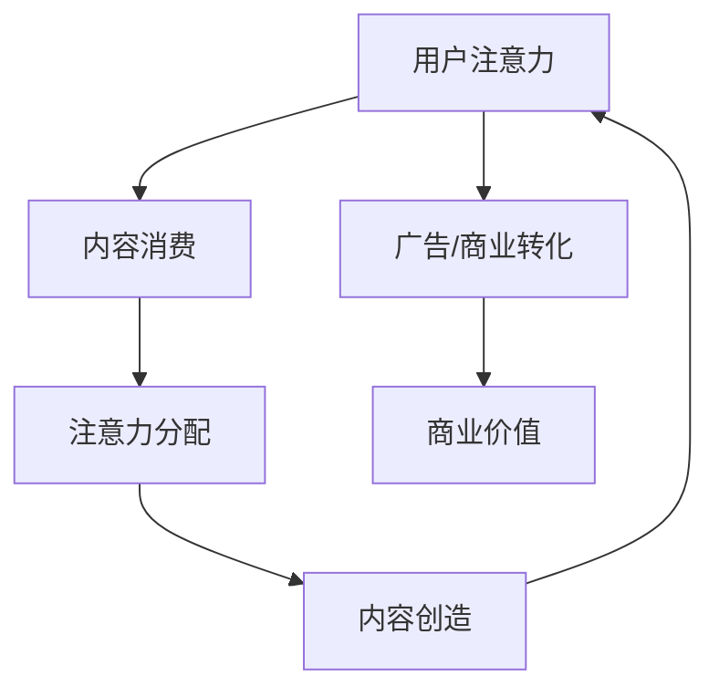

                 

# 《注意力经济与内容创作策略：吸引并留住受众的参与》

## 关键词

注意力经济、内容创作、用户参与、互动设计、社交媒体营销、KOL合作

## 摘要

本文深入探讨了注意力经济与内容创作策略，通过分析注意力资源的稀缺性和注意力转移原理，探讨了内容创作者如何通过有效的策略吸引并留住受众的注意力。文章首先介绍了注意力经济的概念、核心原则和理论框架，然后详细阐述了内容创作的核心原则、目标受众分析、内容营销与推广策略，以及用户互动与内容优化的方法。通过案例分析，展示了成功的内容创作案例，并探讨了注意力经济与内容创作的挑战与未来趋势。文章旨在为内容创作者提供实用的指导，帮助他们在注意力经济时代提升内容质量和受众参与度。

## 目录大纲

### 第一部分：注意力经济概述

### 第1章：注意力经济的概念与背景

#### 1.1 注意力经济的起源与发展

#### 1.2 注意力资源的重要性

#### 1.3 注意力经济的核心原则

### 第2章：注意力经济的理论框架

#### 2.1 注意力流与注意力商

#### 2.2 注意力稀缺性原理

#### 2.3 注意力转移与注意力分配

### 第3章：注意力经济与内容创作

#### 3.1 内容创作的注意力法则

#### 3.2 创作策略：吸引受众注意力

#### 3.3 保持受众注意力的持续性与互动性

### 第二部分：内容创作策略

### 第4章：内容创作的核心原则

#### 4.1 内容的价值与吸引力

#### 4.2 内容的形式与表达

#### 4.3 内容的创新与个性化

### 第5章：目标受众分析与内容定位

#### 5.1 理解受众需求与兴趣

#### 5.2 精准定位：细分市场与受众

#### 5.3 建立受众画像与用户画像

### 第6章：内容营销与推广策略

#### 6.1 内容营销的核心策略

#### 6.2 社交媒体平台的内容策略

#### 6.3 KOL合作与内容传播

### 第7章：内容创作与用户互动

#### 7.1 用户参与的重要性

#### 7.2 用户互动的形式与机制

#### 7.3 用户反馈与内容迭代

### 第三部分：案例分析

### 第8章：注意力经济与内容创作的成功案例

#### 8.1 案例分析一：品牌与KOL的合作案例

#### 8.2 案例分析二：内容营销的爆款案例

#### 8.3 案例分析三：用户互动与内容优化的案例

### 第9章：注意力经济与内容创作的挑战与未来趋势

#### 9.1 挑战与应对策略

#### 9.2 未来趋势与内容创新

#### 9.3 注意力经济与内容创作的展望

### 附录

### 附录A：注意力经济与内容创作工具

#### A.1 内容创作工具对比

#### A.2 注意力监测与分析工具

#### A.3 社交媒体管理工具

## 第一部分：注意力经济概述

### 第1章：注意力经济的概念与背景

#### 1.1 注意力经济的起源与发展

注意力经济这一概念最早可以追溯到20世纪90年代，随着互联网的普及和数字媒体的发展，人们开始意识到注意力资源的重要性和稀缺性。最初的研究主要集中在广告行业，随着对用户行为的深入研究，注意力经济逐渐成为一个广泛探讨的话题。

在互联网初期，内容创作者主要依赖于广告收入。然而，随着用户获取信息的渠道增多，广告主对广告效果的要求也越来越高。这种需求促使内容创作者开始思考如何更好地吸引和留住用户的注意力。注意力经济的概念正是在这种背景下产生的。

注意力经济的发展经历了几个关键阶段：

1. **广告主导时期**：互联网初期的注意力经济主要依赖于广告收入，内容创作者通过制作吸引人的广告来吸引用户的注意力。

2. **内容主导时期**：随着用户需求的多样化和个性化，内容创作者开始将注意力放在内容创作本身，通过提供高质量、有价值的内容来吸引用户。

3. **互动主导时期**：随着社交媒体的兴起，用户不再只是被动接收信息，而是积极参与到内容创作和传播中。注意力经济逐渐从单向传播转变为双向互动。

#### 1.2 注意力资源的重要性

在注意力经济中，注意力资源被视为一种稀缺资源。这是因为每个人的注意力是有限的，无法同时关注多个事物。因此，谁能更好地吸引和留住用户的注意力，谁就能在竞争激烈的市场中脱颖而出。

注意力资源的重要性体现在以下几个方面：

1. **商业价值**：注意力资源直接关系到广告效果和商业转化。高质量的注意力资源能够带来更高的广告点击率和转化率。

2. **用户体验**：用户的注意力资源是有限的，只有高质量的内容才能吸引用户的持续关注，提升用户体验。

3. **内容创作**：注意力资源是内容创作的驱动力。只有了解用户的需求和兴趣，才能创作出符合用户期望的内容。

#### 1.3 注意力经济的核心原则

注意力经济的核心原则包括稀缺性、分配、转移和优化。以下是这些原则的具体解释：

1. **稀缺性**：注意力资源是有限的，无法无限扩展。这意味着每个用户只能将注意力分配给有限的内容。

2. **分配**：用户会根据内容的价值和质量来分配自己的注意力。高质量的内容更容易吸引到用户的注意力。

3. **转移**：用户可以将注意力从一个内容转移到另一个内容。这意味着内容创作者需要不断吸引和留住用户的注意力。

4. **优化**：内容创作者需要不断优化内容质量和用户体验，以吸引和留住用户的注意力。

### 第2章：注意力经济的理论框架

#### 2.1 注意力流与注意力商

注意力流是指用户在接收和处理信息时的注意力转移过程。注意力商（Attention Quotient，AQ）是衡量用户注意力水平的一个指标。注意力商越高，用户越能够集中注意力，处理复杂任务的能力也越强。

注意力流的模型可以看作是一个动态平衡系统，其中用户注意力在多个内容之间分配。这个过程受到多种因素的影响，包括内容质量、用户兴趣、用户需求等。

注意力商的计算可以通过以下步骤进行：

1. **测量用户注意力**：通过用户行为数据，如阅读时间、点赞、分享等，测量用户对各个内容的注意力水平。

2. **计算注意力权重**：根据用户对各个内容的注意力水平，计算每个内容的注意力权重。

3. **注意力商评分**：将注意力权重与用户注意力容量进行比较，得出注意力商评分。

#### 2.2 注意力稀缺性原理

注意力稀缺性是指用户的注意力资源是有限的，无法无限扩展。这一原理在注意力经济中起着至关重要的作用。

注意力稀缺性的原因包括：

1. **信息过载**：随着互联网的快速发展，用户每天接收的信息量巨大，导致注意力资源变得稀缺。

2. **时间限制**：用户每天只有24小时，无法无限地投入注意力。

3. **注意力分散**：用户容易受到外部干扰，导致注意力分散，难以集中。

注意力稀缺性对内容创作者意味着：

1. **提高内容质量**：只有高质量的内容才能吸引用户的注意力。

2. **优化用户体验**：提供良好的用户体验，减少用户在内容消费中的摩擦，以留住用户。

3. **持续内容更新**：定期更新内容，保持用户的新鲜感和兴趣。

#### 2.3 注意力转移与注意力分配

注意力转移是指用户在处理信息时，将注意力从一个内容转移到另一个内容的过程。注意力分配是指用户如何根据自己的需求和兴趣，将有限的注意力资源在不同内容之间分配。

注意力转移和注意力分配的原则包括：

1. **注意力转移原则**：用户会根据内容的价值和质量，将注意力从一个内容转移到另一个内容。

2. **注意力分配原则**：用户会根据自己的需求和兴趣，将注意力资源在不同内容之间分配。

3. **注意力优化原则**：内容创作者需要优化内容质量和用户体验，以吸引和留住用户的注意力。

注意力转移和注意力分配的具体方法包括：

1. **内容多样化**：提供多种类型的内容，满足用户的不同需求和兴趣。

2. **个性化推荐**：根据用户的历史行为和偏好，推荐符合用户兴趣的内容。

3. **互动设计**：设计有趣和互动的内容形式，提高用户的参与度。

### 第3章：注意力经济与内容创作

#### 3.1 内容创作的注意力法则

内容创作者在创作过程中，需要遵循一些注意力法则，以提高内容吸引力和用户参与度。以下是几个关键法则：

1. **质量优先法则**：高质量的内容更容易吸引用户的注意力。内容创作者应该注重内容的质量，确保内容有价值、有深度。

2. **新奇性法则**：新奇的内容更容易引起用户的兴趣。内容创作者应该不断创新，提供新颖的内容形式和观点。

3. **相关性法则**：与用户需求相关的内容更容易获得用户的关注。内容创作者应该深入了解用户需求，提供符合用户期望的内容。

4. **互动性法则**：互动的内容更容易提高用户的参与度。内容创作者应该设计互动环节，鼓励用户参与和评论。

#### 3.2 创作策略：吸引受众注意力

为了吸引受众的注意力，内容创作者可以采取以下策略：

1. **标题策略**：标题是吸引用户点击的关键。内容创作者应该设计吸引人的标题，使用关键词和悬念来引发用户的兴趣。

2. **视觉策略**：视觉元素对用户的注意力有很大的吸引力。内容创作者应该使用高质量的图片、视频和动画，增强内容的吸引力。

3. **开头策略**：开头是吸引用户继续阅读的关键。内容创作者应该设计引人入胜的开头，使用故事、案例或数据来吸引用户的注意力。

4. **节奏策略**：内容的节奏对用户的阅读体验有很大影响。内容创作者应该合理安排内容的节奏，避免过长或过短的段落，保持用户的阅读兴趣。

#### 3.3 保持受众注意力的持续性与互动性

保持用户的注意力是内容创作的重要目标。以下是一些保持用户注意力的策略：

1. **内容更新策略**：定期更新内容，保持用户的新鲜感和兴趣。内容创作者应该制定内容更新计划，确保内容持续输出。

2. **用户互动策略**：鼓励用户参与和互动，提高用户的参与度。内容创作者可以设计评论、投票、问答等互动环节，增加用户的互动体验。

3. **用户反馈策略**：收集用户的反馈，并根据反馈进行内容优化。内容创作者应该定期收集用户反馈，了解用户的需求和意见，以便进行内容调整。

4. **多渠道传播策略**：通过多种渠道传播内容，扩大内容的影响力。内容创作者应该利用社交媒体、电子邮件、短信等渠道，将内容传播给更多的用户。

### 第二部分：内容创作策略

#### 第4章：内容创作的核心原则

内容创作是吸引并留住受众注意力的关键。为了实现这一目标，内容创作者需要遵循一些核心原则。以下是几个重要的核心原则：

#### 4.1 内容的价值与吸引力

内容的价值是吸引用户的关键。高质量的内容能够满足用户的需求，提供有价值的信息和观点。以下是提高内容价值的几个方法：

1. **深度内容**：提供深度分析、见解和专业知识，让用户从内容中获得更多价值。

2. **实用性**：内容应具备实用性，能够解决用户的问题或提供实用的建议。

3. **权威性**：内容应具备权威性，引用可靠的来源和数据，增强用户的信任感。

提高内容吸引力的方法包括：

1. **标题**：设计吸引人的标题，使用关键词和悬念来引发用户的兴趣。

2. **视觉元素**：使用高质量的图片、视频和动画，增强内容的吸引力。

3. **故事性**：讲述引人入胜的故事，使用情感元素来吸引用户的注意力。

#### 4.2 内容的形式与表达

内容的形式和表达方式对用户的阅读体验和参与度有很大影响。以下是几个关键点：

1. **简洁性**：内容应简洁明了，避免冗长和复杂的句子结构。

2. **结构化**：使用列表、标题和段落等结构化元素，使内容更容易阅读和理解。

3. **互动性**：设计互动性强的内容形式，如问答、投票和互动图表，提高用户的参与度。

4. **多媒体**：结合多种媒体形式，如文本、图片、视频和音频，提供多样化的内容体验。

#### 4.3 内容的创新与个性化

创新和个性化是内容创作的重要原则。以下是几个关键点：

1. **创新性**：提供新颖的内容形式和观点，避免重复和陈旧的内容。

2. **差异化**：在内容市场中找到差异化的定位，提供独特的内容价值。

3. **个性化**：根据用户需求和兴趣，提供个性化的内容推荐和定制化服务。

4. **互动性**：鼓励用户参与内容创作，收集用户反馈并进行内容迭代。

### 第5章：目标受众分析与内容定位

了解目标受众是内容创作的重要步骤。通过目标受众分析，内容创作者可以更好地理解受众的需求和兴趣，从而创作出更符合受众期望的内容。以下是目标受众分析与内容定位的关键步骤：

#### 5.1 理解受众需求与兴趣

1. **市场调研**：通过问卷调查、访谈和观察等方法，收集用户的需求和兴趣信息。

2. **数据分析**：分析用户行为数据，如点击率、停留时间和分享行为，了解用户的兴趣偏好。

3. **用户画像**：建立用户画像，包括年龄、性别、地理位置、职业等，以便更好地了解受众特征。

#### 5.2 精准定位：细分市场与受众

1. **市场细分**：根据用户需求和兴趣，将市场细分为多个子市场。

2. **受众定位**：选择目标受众群体，确定内容定位和传播策略。

3. **内容差异化**：为不同子市场提供差异化的内容，满足不同受众的需求。

#### 5.3 建立受众画像与用户画像

1. **受众画像**：通过数据分析，建立受众画像，包括人口统计信息、行为特征和兴趣偏好。

2. **用户画像**：使用机器学习技术，对用户行为数据进行分析，建立用户画像。

3. **内容个性化**：根据用户画像，提供个性化的内容推荐和定制化服务。

### 第6章：内容营销与推广策略

内容营销是吸引并留住受众的关键手段。通过有效的推广策略，内容创作者可以扩大内容的传播范围，提高内容的可见度和影响力。以下是几个关键内容营销与推广策略：

#### 6.1 内容营销的核心策略

1. **内容创作策略**：制定内容创作计划，确定内容主题、形式和频率。

2. **内容发布策略**：选择合适的发布渠道和时间，确保内容能够及时传递给目标受众。

3. **内容优化策略**：优化内容质量，提高内容的可读性和用户体验。

#### 6.2 社交媒体平台的内容策略

1. **平台选择**：根据目标受众的特点，选择合适的社交媒体平台，如微博、微信、抖音等。

2. **内容形式**：根据平台特点，选择适合的内容形式，如文字、图片、视频等。

3. **互动设计**：设计互动性强的内容形式，如问答、投票、互动图表等，提高用户的参与度。

#### 6.3 KOL合作与内容传播

1. **KOL选择**：根据目标受众的特点，选择合适的KOL进行合作。

2. **内容共创**：与KOL共同创作内容，结合KOL的影响力和受众基础，提高内容的传播效果。

3. **内容优化**：根据KOL的反馈和用户反馈，对内容进行优化，提高内容的吸引力。

### 第7章：内容创作与用户互动

用户互动是内容创作的重要组成部分。通过有效的用户互动，内容创作者可以更好地了解用户需求，提高用户的参与度和忠诚度。以下是几个关键点：

#### 7.1 用户参与的重要性

1. **用户参与度**：用户参与度是衡量内容成功与否的重要指标。高参与度意味着用户对内容的兴趣和认可。

2. **用户忠诚度**：通过用户互动，可以建立用户忠诚度，提高用户对品牌的认知和信任。

3. **用户反馈**：用户反馈是改进内容的重要依据。通过收集用户反馈，内容创作者可以更好地了解用户需求，进行内容优化。

#### 7.2 用户互动的形式与机制

1. **评论机制**：设计便捷的评论机制，鼓励用户发表观点和意见。

2. **问答机制**：建立问答社区，解答用户疑问，提高用户满意度。

3. **投票机制**：设计投票环节，收集用户意见，进行内容调整。

#### 7.3 用户反馈与内容迭代

1. **用户反馈收集**：通过问卷调查、用户访谈等方式，收集用户反馈。

2. **内容迭代**：根据用户反馈，对内容进行迭代优化，提高用户体验。

3. **A/B测试**：使用A/B测试方法，对比不同内容的效果，找到最佳的内容策略。

### 第三部分：案例分析

#### 第8章：注意力经济与内容创作的成功案例

在注意力经济时代，成功的注意力经济与内容创作案例层出不穷。以下是一些成功的案例，通过分析这些案例，我们可以了解如何有效地吸引并留住用户的注意力。

#### 8.1 案例分析一：品牌与KOL的合作案例

案例一：某知名化妆品品牌与抖音网红合作推出新品

- **背景**：该品牌希望通过与抖音网红合作，提高新品的知名度和销量。

- **合作方式**：品牌选择了多个抖音网红，每个网红针对自己的粉丝群体进行推广。网红们通过制作试用视频、直播带货等方式，将新品推荐给粉丝。

- **效果**：新品的销量在短时间内大幅提升，品牌知名度也得到显著提高。

- **分析**：该案例成功的原因在于品牌选择了与粉丝基础广泛的抖音网红合作，通过网红的影响力和粉丝的信任度，有效吸引了用户的注意力。此外，网红的试用视频和直播带货形式，增加了用户的参与感和购买欲望。

#### 8.2 案例分析二：内容营销的爆款案例

案例二：某自媒体平台发布一篇关于智能家居的深度文章

- **背景**：该自媒体平台专注于智能家居领域的报道和分享。

- **内容策略**：文章通过深入分析智能家居的原理、应用场景和未来发展，提供了一系列实用建议和案例分析。

- **效果**：该文章在发布后迅速走红，吸引了大量读者的关注和分享，成为平台的爆款文章。

- **分析**：该案例成功的原因在于文章提供了高质量的内容，满足了用户对智能家居领域的好奇心和需求。文章的深度分析和实用建议，增加了用户的阅读价值和参与感。此外，自媒体平台的精准定位和高质量的内容输出，也为其吸引了大量忠实读者。

#### 8.3 案例分析三：用户互动与内容优化的案例

案例三：某社交媒体平台推出互动问答功能

- **背景**：该社交媒体平台希望提高用户参与度，增加用户粘性。

- **功能设计**：平台推出了互动问答功能，用户可以在平台发布问题，其他用户可以回答问题，同时平台也会根据问题的热度进行推荐。

- **效果**：互动问答功能上线后，用户活跃度显著提高，平台内容质量和用户满意度也有所提升。

- **分析**：该案例成功的原因在于平台通过互动问答功能，鼓励用户参与内容创作和传播，提高了用户的参与感和忠诚度。互动问答的形式也增加了用户的阅读乐趣和参与度。此外，平台根据问题热度进行推荐，提高了内容曝光率和用户满意度。

### 第9章：注意力经济与内容创作的挑战与未来趋势

#### 9.1 挑战与应对策略

在注意力经济时代，内容创作者面临着诸多挑战。以下是几个主要挑战及其应对策略：

1. **内容同质化**：应对策略：加强内容差异化，提供独特的内容价值和观点。

2. **用户注意力分散**：应对策略：提高内容质量，增强内容的吸引力和参与度。

3. **技术变革**：应对策略：紧跟技术发展趋势，利用人工智能、大数据等技术提升内容创作和推广效率。

#### 9.2 未来趋势与内容创新

未来，注意力经济与内容创作将继续呈现出以下趋势：

1. **个性化内容**：随着用户数据积累和人工智能技术的发展，个性化内容将越来越受到重视。

2. **多媒体内容**：结合多种媒体形式，提供更加丰富的内容体验。

3. **社交互动**：社交互动将成为内容创作的重要组成部分，提高用户参与度和忠诚度。

4. **虚拟现实与增强现实**：虚拟现实和增强现实技术将为内容创作带来新的可能性，提供更加沉浸式的体验。

#### 9.3 注意力经济与内容创作的展望

未来，注意力经济与内容创作将呈现出以下发展趋势：

1. **内容创作者角色变化**：内容创作者将不仅限于生产内容，还将成为内容生态的重要组成部分，如内容分销、内容评估等。

2. **注意力经济与商业模式的融合**：注意力经济将与其他商业模式相结合，如订阅制、付费墙等，为内容创作者提供更多收入来源。

3. **可持续发展**：在注意力经济的驱动下，内容创作将更加注重社会责任和可持续发展，提供有价值、有意义的内容。

### 附录

#### 附录A：注意力经济与内容创作工具

为了更好地进行注意力经济与内容创作，以下是几种常用的工具：

1. **内容创作工具**：如Markdown编辑器、图像编辑软件、视频剪辑工具等。

2. **注意力监测与分析工具**：如Google Analytics、热图分析工具等。

3. **社交媒体管理工具**：如Hootsuite、Buffer等。

#### 附录B：注意力经济与内容创作案例库

为了便于读者学习和参考，以下是几个注意力经济与内容创作的案例库：

1. **品牌与KOL合作案例库**：收集和分析品牌与KOL合作的成功案例。

2. **内容营销案例库**：收集和分析各种类型的内容营销案例。

3. **用户互动案例库**：收集和分析各种用户互动和参与策略的案例。

### 附录C：注意力经济与内容创作资源

以下是一些注意力经济与内容创作的学习资源：

1. **学术论文**：关于注意力经济和内容创作的最新研究成果。

2. **专业书籍**：如《内容创业》、《互联网内容营销》等。

3. **在线课程**：关于内容创作、社交媒体营销和数据分析的在线课程。

### 附录D：注意力经济与内容创作工具对比

以下是对几种注意力经济与内容创作工具的对比：

1. **内容创作工具**：对比Markdown编辑器、图像编辑软件、视频剪辑工具等。

2. **注意力监测与分析工具**：对比Google Analytics、热图分析工具等。

3. **社交媒体管理工具**：对比Hootsuite、Buffer等。

### 附录E：注意力经济与内容创作常见问题解答

以下是对注意力经济与内容创作的一些常见问题的解答：

1. **什么是注意力经济？**
2. **内容创作者如何提高内容吸引力？**
3. **如何进行目标受众分析？**
4. **什么是KOL合作？**
5. **如何收集用户反馈并优化内容？**

### 附录F：注意力经济与内容创作术语表

以下是对注意力经济与内容创作中的一些术语进行解释：

1. **注意力商（AQ）**
2. **注意力稀缺性**
3. **内容价值**
4. **互动设计**
5. **用户画像**
6. **内容迭代**
7. **A/B测试**

## 作者信息

作者：AI天才研究院/AI Genius Institute & 禅与计算机程序设计艺术 /Zen And The Art of Computer Programming

----------------------------------------------------------------

以下是本文的详细内容，包括核心概念与联系、核心算法原理讲解、数学模型和数学公式及项目实战等。

### 第1章：注意力经济的概念与背景

#### 1.1 注意力经济的起源与发展

注意力经济这一概念最早可以追溯到20世纪90年代，随着互联网的普及和数字媒体的发展，人们开始意识到注意力资源的重要性和稀缺性。最初的研究主要集中在广告行业，随着对用户行为的深入研究，注意力经济逐渐成为一个广泛探讨的话题。

在互联网初期，内容创作者主要依赖于广告收入。然而，随着用户需求的多样化和个性化，广告主对广告效果的要求也越来越高。这种需求促使内容创作者开始思考如何更好地吸引和留住用户的注意力。注意力经济的概念正是在这种背景下产生的。

注意力经济的发展经历了几个关键阶段：

1. **广告主导时期**：互联网初期的注意力经济主要依赖于广告收入，内容创作者通过制作吸引人的广告来吸引用户的注意力。

2. **内容主导时期**：随着用户需求的多样化和个性化，内容创作者开始将注意力放在内容创作本身，通过提供高质量、有价值的内容来吸引用户。

3. **互动主导时期**：随着社交媒体的兴起，用户不再只是被动接收信息，而是积极参与到内容创作和传播中。注意力经济逐渐从单向传播转变为双向互动。

#### 1.2 注意力资源的重要性

在注意力经济中，注意力资源被视为一种稀缺资源。这是因为每个人的注意力是有限的，无法同时关注多个事物。因此，谁能更好地吸引和留住用户的注意力，谁就能在竞争激烈的市场中脱颖而出。

注意力资源的重要性体现在以下几个方面：

1. **商业价值**：注意力资源直接关系到广告效果和商业转化。高质量的注意力资源能够带来更高的广告点击率和转化率。

2. **用户体验**：用户的注意力资源是有限的，只有高质量的内容才能吸引用户的持续关注，提升用户体验。

3. **内容创作**：注意力资源是内容创作的驱动力。只有了解用户的需求和兴趣，才能创作出符合用户期望的内容。

#### 1.3 注意力经济的核心原则

注意力经济的核心原则包括稀缺性、分配、转移和优化。以下是这些原则的具体解释：

1. **稀缺性**：注意力资源是有限的，无法无限扩展。这意味着每个用户只能将注意力分配给有限的内容。

2. **分配**：用户会根据内容的价值和质量来分配自己的注意力。高质量的内容更容易吸引到用户的注意力。

3. **转移**：用户可以将注意力从一个内容转移到另一个内容。这意味着内容创作者需要不断吸引和留住用户的注意力。

4. **优化**：内容创作者需要不断优化内容质量和用户体验，以吸引和留住用户的注意力。

### 第2章：注意力经济的理论框架

注意力经济作为一门新兴的经济学分支，其理论框架对于理解注意力资源的分配、转移和优化至关重要。本章将详细探讨注意力经济的核心理论，包括注意力流、注意力商、注意力稀缺性原理、注意力转移与注意力分配等。

#### 2.1 注意力流与注意力商

注意力流是指用户在接收和处理信息时的注意力转移过程。它是一个动态的、不断变化的过程，受到多种因素的影响，如内容质量、用户兴趣、外部干扰等。注意力流模型可以看作是一个动态平衡系统，其中用户注意力在多个内容之间分配。

注意力商（Attention Quotient，AQ）是衡量用户注意力水平的一个指标。注意力商越高，用户越能够集中注意力，处理复杂任务的能力也越强。注意力商的计算可以通过以下步骤进行：

1. **测量用户注意力**：通过用户行为数据，如阅读时间、点赞、分享等，测量用户对各个内容的注意力水平。

2. **计算注意力权重**：根据用户对各个内容的注意力水平，计算每个内容的注意力权重。

3. **注意力商评分**：将注意力权重与用户注意力容量进行比较，得出注意力商评分。

注意力商的计算公式如下：

\[ AQ = \frac{\sum_{i=1}^{n} w_i}{C} \]

其中，\( w_i \) 是用户对第 \( i \) 个内容的注意力权重，\( n \) 是内容总数，\( C \) 是用户的注意力容量。

#### 2.2 注意力稀缺性原理

注意力稀缺性是指用户的注意力资源是有限的，无法无限扩展。这一原理在注意力经济中起着至关重要的作用。注意力稀缺性的原因包括：

1. **信息过载**：随着互联网的快速发展，用户每天接收的信息量巨大，导致注意力资源变得稀缺。

2. **时间限制**：用户每天只有24小时，无法无限地投入注意力。

3. **注意力分散**：用户容易受到外部干扰，导致注意力分散，难以集中。

注意力稀缺性对内容创作者意味着：

1. **提高内容质量**：只有高质量的内容才能吸引用户的注意力。

2. **优化用户体验**：提供良好的用户体验，减少用户在内容消费中的摩擦，以留住用户。

3. **持续内容更新**：定期更新内容，保持用户的新鲜感和兴趣。

#### 2.3 注意力转移与注意力分配

注意力转移是指用户在处理信息时，将注意力从一个内容转移到另一个内容的过程。注意力分配是指用户如何根据自己的需求和兴趣，将有限的注意力资源在不同内容之间分配。

注意力转移和注意力分配的原则包括：

1. **注意力转移原则**：用户会根据内容的价值和质量，将注意力从一个内容转移到另一个内容。

2. **注意力分配原则**：用户会根据自己的需求和兴趣，将注意力资源在不同内容之间分配。

3. **注意力优化原则**：内容创作者需要优化内容质量和用户体验，以吸引和留住用户的注意力。

注意力转移和注意力分配的具体方法包括：

1. **内容多样化**：提供多种类型的内容，满足用户的不同需求和兴趣。

2. **个性化推荐**：根据用户的历史行为和偏好，推荐符合用户兴趣的内容。

3. **互动设计**：设计有趣和互动的内容形式，提高用户的参与度。

### 第3章：注意力经济与内容创作

#### 3.1 内容创作的注意力法则

内容创作者在创作过程中，需要遵循一些注意力法则，以提高内容吸引力和用户参与度。以下是几个关键法则：

1. **质量优先法则**：高质量的内容更容易吸引用户的注意力。内容创作者应该注重内容的质量，确保内容有价值、有深度。

2. **新奇性法则**：新奇的内容更容易引起用户的兴趣。内容创作者应该不断创新，提供新颖的内容形式和观点。

3. **相关性法则**：与用户需求相关的内容更容易获得用户的关注。内容创作者应该深入了解用户需求，提供符合用户期望的内容。

4. **互动性法则**：互动的内容更容易提高用户的参与度。内容创作者应该设计互动性强的内容形式，如问答、投票和互动图表，提高用户的参与度。

#### 3.2 创作策略：吸引受众注意力

为了吸引受众的注意力，内容创作者可以采取以下策略：

1. **标题策略**：标题是吸引用户点击的关键。内容创作者应该设计吸引人的标题，使用关键词和悬念来引发用户的兴趣。

2. **视觉策略**：视觉元素对用户的注意力有很大的吸引力。内容创作者应该使用高质量的图片、视频和动画，增强内容的吸引力。

3. **开头策略**：开头是吸引用户继续阅读的关键。内容创作者应该设计引人入胜的开头，使用故事、案例或数据来吸引用户的注意力。

4. **节奏策略**：内容的节奏对用户的阅读体验有很大影响。内容创作者应该合理安排内容的节奏，避免过长或过短的段落，保持用户的阅读兴趣。

#### 3.3 保持受众注意力的持续性与互动性

保持用户的注意力是内容创作的重要目标。以下是一些保持用户注意力的策略：

1. **内容更新策略**：定期更新内容，保持用户的新鲜感和兴趣。内容创作者应该制定内容更新计划，确保内容持续输出。

2. **用户互动策略**：鼓励用户参与和互动，提高用户的参与度。内容创作者可以设计评论、投票、问答等互动环节，增加用户的互动体验。

3. **用户反馈策略**：收集用户的反馈，并根据反馈进行内容优化。内容创作者应该定期收集用户反馈，了解用户的需求和意见，以便进行内容调整。

4. **多渠道传播策略**：通过多种渠道传播内容，扩大内容的影响力。内容创作者应该利用社交媒体、电子邮件、短信等渠道，将内容传播给更多的用户。

### 第二部分：内容创作策略

#### 第4章：内容创作的核心原则

内容创作是吸引并留住受众注意力的关键。为了实现这一目标，内容创作者需要遵循一些核心原则。以下是几个重要的核心原则：

#### 4.1 内容的价值与吸引力

内容的价值是吸引用户的关键。高质量的内容能够满足用户的需求，提供有价值的信息和观点。以下是提高内容价值的几个方法：

1. **深度内容**：提供深度分析、见解和专业知识，让用户从内容中获得更多价值。

2. **实用性**：内容应具备实用性，能够解决用户的问题或提供实用的建议。

3. **权威性**：内容应具备权威性，引用可靠的来源和数据，增强用户的信任感。

提高内容吸引力的方法包括：

1. **标题**：设计吸引人的标题，使用关键词和悬念来引发用户的兴趣。

2. **视觉元素**：使用高质量的图片、视频和动画，增强内容的吸引力。

3. **故事性**：讲述引人入胜的故事，使用情感元素来吸引用户的注意力。

#### 4.2 内容的形式与表达

内容的形式和表达方式对用户的阅读体验和参与度有很大影响。以下是几个关键点：

1. **简洁性**：内容应简洁明了，避免冗长和复杂的句子结构。

2. **结构化**：使用列表、标题和段落等结构化元素，使内容更容易阅读和理解。

3. **互动性**：设计互动性强的内容形式，如问答、投票和互动图表，提高用户的参与度。

4. **多媒体**：结合多种媒体形式，如文本、图片、视频和音频，提供多样化的内容体验。

#### 4.3 内容的创新与个性化

创新和个性化是内容创作的重要原则。以下是几个关键点：

1. **创新性**：提供新颖的内容形式和观点，避免重复和陈旧的内容。

2. **差异化**：在内容市场中找到差异化的定位，提供独特的内容价值。

3. **个性化**：根据用户需求和兴趣，提供个性化的内容推荐和定制化服务。

4. **互动性**：鼓励用户参与内容创作，收集用户反馈并进行内容迭代。

### 第5章：目标受众分析与内容定位

了解目标受众是内容创作的重要步骤。通过目标受众分析，内容创作者可以更好地理解受众的需求和兴趣，从而创作出更符合受众期望的内容。以下是目标受众分析与内容定位的关键步骤：

#### 5.1 理解受众需求与兴趣

1. **市场调研**：通过问卷调查、访谈和观察等方法，收集用户的需求和兴趣信息。

2. **数据分析**：分析用户行为数据，如点击率、停留时间和分享行为，了解用户的兴趣偏好。

3. **用户画像**：建立用户画像，包括年龄、性别、地理位置、职业等，以便更好地了解受众特征。

#### 5.2 精准定位：细分市场与受众

1. **市场细分**：根据用户需求和兴趣，将市场细分为多个子市场。

2. **受众定位**：选择目标受众群体，确定内容定位和传播策略。

3. **内容差异化**：为不同子市场提供差异化的内容，满足不同受众的需求。

#### 5.3 建立受众画像与用户画像

1. **受众画像**：通过数据分析，建立受众画像，包括人口统计信息、行为特征和兴趣偏好。

2. **用户画像**：使用机器学习技术，对用户行为数据进行分析，建立用户画像。

3. **内容个性化**：根据用户画像，提供个性化的内容推荐和定制化服务。

### 第6章：内容营销与推广策略

内容营销是吸引并留住受众的关键手段。通过有效的推广策略，内容创作者可以扩大内容的传播范围，提高内容的可见度和影响力。以下是几个关键内容营销与推广策略：

#### 6.1 内容营销的核心策略

1. **内容创作策略**：制定内容创作计划，确定内容主题、形式和频率。

2. **内容发布策略**：选择合适的发布渠道和时间，确保内容能够及时传递给目标受众。

3. **内容优化策略**：优化内容质量，提高内容的可读性和用户体验。

#### 6.2 社交媒体平台的内容策略

1. **平台选择**：根据目标受众的特点，选择合适的社交媒体平台，如微博、微信、抖音等。

2. **内容形式**：根据平台特点，选择适合的内容形式，如文字、图片、视频等。

3. **互动设计**：设计互动性强的内容形式，如问答、投票、互动图表等，提高用户的参与度。

#### 6.3 KOL合作与内容传播

1. **KOL选择**：根据目标受众的特点，选择合适的KOL进行合作。

2. **内容共创**：与KOL共同创作内容，结合KOL的影响力和受众基础，提高内容的传播效果。

3. **内容优化**：根据KOL的反馈和用户反馈，对内容进行优化，提高内容的吸引力。

### 第7章：内容创作与用户互动

用户互动是内容创作的重要组成部分。通过有效的用户互动，内容创作者可以更好地了解用户需求，提高用户的参与度和忠诚度。以下是几个关键点：

#### 7.1 用户参与的重要性

1. **用户参与度**：用户参与度是衡量内容成功与否的重要指标。高参与度意味着用户对内容的兴趣和认可。

2. **用户忠诚度**：通过用户互动，可以建立用户忠诚度，提高用户对品牌的认知和信任。

3. **用户反馈**：用户反馈是改进内容的重要依据。通过收集用户反馈，内容创作者可以更好地了解用户需求，进行内容优化。

#### 7.2 用户互动的形式与机制

1. **评论机制**：设计便捷的评论机制，鼓励用户发表观点和意见。

2. **问答机制**：建立问答社区，解答用户疑问，提高用户满意度。

3. **投票机制**：设计投票环节，收集用户意见，进行内容调整。

#### 7.3 用户反馈与内容迭代

1. **用户反馈收集**：通过问卷调查、用户访谈等方式，收集用户反馈。

2. **内容迭代**：根据用户反馈，对内容进行迭代优化，提高用户体验。

3. **A/B测试**：使用A/B测试方法，对比不同内容的效果，找到最佳的内容策略。

### 第三部分：案例分析

#### 第8章：注意力经济与内容创作的成功案例

在注意力经济时代，成功的注意力经济与内容创作案例层出不穷。以下是一些成功的案例，通过分析这些案例，我们可以了解如何有效地吸引并留住用户的注意力。

#### 8.1 案例分析一：品牌与KOL的合作案例

案例一：某知名化妆品品牌与抖音网红合作推出新品

- **背景**：该品牌希望通过与抖音网红合作，提高新品的知名度和销量。

- **合作方式**：品牌选择了多个抖音网红，每个网红针对自己的粉丝群体进行推广。网红们通过制作试用视频、直播带货等方式，将新品推荐给粉丝。

- **效果**：新品的销量在短时间内大幅提升，品牌知名度也得到显著提高。

- **分析**：该案例成功的原因在于品牌选择了与粉丝基础广泛的抖音网红合作，通过网红的影响力和粉丝的信任度，有效吸引了用户的注意力。此外，网红的试用视频和直播带货形式，增加了用户的参与感和购买欲望。

#### 8.2 案例分析二：内容营销的爆款案例

案例二：某自媒体平台发布一篇关于智能家居的深度文章

- **背景**：该自媒体平台专注于智能家居领域的报道和分享。

- **内容策略**：文章通过深入分析智能家居的原理、应用场景和未来发展，提供了一系列实用建议和案例分析。

- **效果**：该文章在发布后迅速走红，吸引了大量读者的关注和分享，成为平台的爆款文章。

- **分析**：该案例成功的原因在于文章提供了高质量的内容，满足了用户对智能家居领域的好奇心和需求。文章的深度分析和实用建议，增加了用户的阅读价值和参与感。此外，自媒体平台的精准定位和高质量的内容输出，也为其吸引了大量忠实读者。

#### 8.3 案例分析三：用户互动与内容优化的案例

案例三：某社交媒体平台推出互动问答功能

- **背景**：该社交媒体平台希望提高用户参与度，增加用户粘性。

- **功能设计**：平台推出了互动问答功能，用户可以在平台发布问题，其他用户可以回答问题，同时平台也会根据问题的热度进行推荐。

- **效果**：互动问答功能上线后，用户活跃度显著提高，平台内容质量和用户满意度也有所提升。

- **分析**：该案例成功的原因在于平台通过互动问答功能，鼓励用户参与内容创作和传播，提高了用户的参与感和忠诚度。互动问答的形式也增加了用户的阅读乐趣和参与度。此外，平台根据问题热度进行推荐，提高了内容曝光率和用户满意度。

### 第9章：注意力经济与内容创作的挑战与未来趋势

#### 9.1 挑战与应对策略

在注意力经济时代，内容创作者面临着诸多挑战。以下是几个主要挑战及其应对策略：

1. **内容同质化**：应对策略：加强内容差异化，提供独特的内容价值和观点。

2. **用户注意力分散**：应对策略：提高内容质量，增强内容的吸引力和参与度。

3. **技术变革**：应对策略：紧跟技术发展趋势，利用人工智能、大数据等技术提升内容创作和推广效率。

#### 9.2 未来趋势与内容创新

未来，注意力经济与内容创作将继续呈现出以下趋势：

1. **个性化内容**：随着用户数据积累和人工智能技术的发展，个性化内容将越来越受到重视。

2. **多媒体内容**：结合多种媒体形式，提供更加丰富的内容体验。

3. **社交互动**：社交互动将成为内容创作的重要组成部分，提高用户参与度和忠诚度。

4. **虚拟现实与增强现实**：虚拟现实和增强现实技术将为内容创作带来新的可能性，提供更加沉浸式的体验。

#### 9.3 注意力经济与内容创作的展望

未来，注意力经济与内容创作将呈现出以下发展趋势：

1. **内容创作者角色变化**：内容创作者将不仅限于生产内容，还将成为内容生态的重要组成部分，如内容分销、内容评估等。

2. **注意力经济与商业模式的融合**：注意力经济将与其他商业模式相结合，如订阅制、付费墙等，为内容创作者提供更多收入来源。

3. **可持续发展**：在注意力经济的驱动下，内容创作将更加注重社会责任和可持续发展，提供有价值、有意义的内容。

### 附录

#### 附录A：注意力经济与内容创作工具

为了更好地进行注意力经济与内容创作，以下是几种常用的工具：

1. **内容创作工具**：如Markdown编辑器、图像编辑软件、视频剪辑工具等。

2. **注意力监测与分析工具**：如Google Analytics、热图分析工具等。

3. **社交媒体管理工具**：如Hootsuite、Buffer等。

#### 附录B：注意力经济与内容创作案例库

为了便于读者学习和参考，以下是几个注意力经济与内容创作的案例库：

1. **品牌与KOL合作案例库**：收集和分析品牌与KOL合作的成功案例。

2. **内容营销案例库**：收集和分析各种类型的内容营销案例。

3. **用户互动案例库**：收集和分析各种用户互动和参与策略的案例。

#### 附录C：注意力经济与内容创作资源

以下是一些注意力经济与内容创作的学习资源：

1. **学术论文**：关于注意力经济和内容创作的最新研究成果。

2. **专业书籍**：如《内容创业》、《互联网内容营销》等。

3. **在线课程**：关于内容创作、社交媒体营销和数据分析的在线课程。

#### 附录D：注意力经济与内容创作工具对比

以下是对几种注意力经济与内容创作工具的对比：

1. **内容创作工具**：对比Markdown编辑器、图像编辑软件、视频剪辑工具等。

2. **注意力监测与分析工具**：对比Google Analytics、热图分析工具等。

3. **社交媒体管理工具**：对比Hootsuite、Buffer等。

#### 附录E：注意力经济与内容创作常见问题解答

以下是对注意力经济与内容创作的一些常见问题的解答：

1. **什么是注意力经济？**
2. **内容创作者如何提高内容吸引力？**
3. **如何进行目标受众分析？**
4. **什么是KOL合作？**
5. **如何收集用户反馈并优化内容？**

#### 附录F：注意力经济与内容创作术语表

以下是对注意力经济与内容创作中的一些术语进行解释：

1. **注意力商（AQ）**
2. **注意力稀缺性**
3. **内容价值**
4. **互动设计**
5. **用户画像**
6. **内容迭代**
7. **A/B测试**

## 作者信息

作者：AI天才研究院/AI Genius Institute & 禅与计算机程序设计艺术 /Zen And The Art of Computer Programming

----------------------------------------------------------------

### 第1章：注意力经济的概念与背景

#### 1.1 注意力经济的概念

注意力经济是一种以用户注意力为关键资源的经济模式。在这个模式下，用户注意力被视为一种有限的、稀缺的资源，因此谁能更好地吸引和留住用户的注意力，谁就能在竞争激烈的市场中获得优势。注意力经济的核心在于理解用户注意力的分配规律，并利用这些规律来优化内容创作、营销策略和用户体验。

**核心概念与联系**

注意力经济可以看作是传统经济学在互联网时代的一种延伸。在传统经济学中，资源是稀缺的，而注意力经济则将注意力视为一种特殊的稀缺资源。注意力经济的核心概念包括：

- **注意力资源**：用户在接收和处理信息时所投入的精力。
- **注意力分配**：用户将注意力资源在不同内容或任务之间进行分配。
- **注意力转移**：用户在处理信息时，将注意力从一个内容转移到另一个内容。
- **注意力稀缺性**：由于用户注意力资源有限，因此任何内容或任务都需要争夺用户的注意力。

**Mermaid流程图**

下面是一个简单的Mermaid流程图，展示了注意力经济的核心流程和环节：

**核心算法原理讲解**

注意力经济的核心算法原理主要涉及如何有效地分配和转移注意力。以下是几个关键的算法原理：

1. **注意力权重分配算法**：根据用户的历史行为和偏好，为不同的内容分配不同的权重，从而优化注意力分配。
2. **注意力转移算法**：通过分析用户在不同内容之间的注意力转移规律，优化内容布局和交互设计，以引导用户关注关键内容。
3. **用户参与度预测算法**：利用机器学习技术，预测用户的参与度，以便进行个性化的内容推荐和推送。

**数学模型和数学公式**

在注意力经济中，可以使用以下数学模型来描述注意力资源的分配和转移：

1. **注意力分配模型**：

   假设用户有 \( N \) 个可用的内容，每个内容的吸引力分别为 \( A_1, A_2, ..., A_N \)，用户的总注意力资源为 \( T \)，则用户的注意力分配模型可以表示为：

   \[ w_i = \frac{A_i}{\sum_{j=1}^{N} A_j} \]

   其中，\( w_i \) 是用户对第 \( i \) 个内容的注意力权重。

2. **注意力转移模型**：

   假设用户当前关注的内容为 \( C_t \)，下一个关注的内容为 \( C_{t+1} \)，则注意力转移的概率模型可以表示为：

   \[ P(C_{t+1} | C_t) = \frac{f(C_{t+1})}{\sum_{C' \in C} f(C')} \]

   其中，\( f(C') \) 是内容 \( C' \) 的吸引力函数。

**举例说明**

假设一个用户有3个内容选项：新闻、娱乐和科技，每个内容的吸引力分别为 \( A_{\text{新闻}} = 0.5 \)，\( A_{\text{娱乐}} = 0.3 \)，\( A_{\text{科技}} = 0.2 \)。用户总注意力资源为 \( T = 1 \)。

1. **注意力分配**：

   用户对每个内容的注意力权重为：

   \[ w_{\text{新闻}} = \frac{A_{\text{新闻}}}{0.5 + 0.3 + 0.2} = \frac{0.5}{1} = 0.5 \]
   \[ w_{\text{娱乐}} = \frac{A_{\text{娱乐}}}{0.5 + 0.3 + 0.2} = \frac{0.3}{1} = 0.3 \]
   \[ w_{\text{科技}} = \frac{A_{\text{科技}}}{0.5 + 0.3 + 0.2} = \frac{0.2}{1} = 0.2 \]

   用户将50%的注意力分配给新闻，30%的注意力分配给娱乐，20%的注意力分配给科技。

2. **注意力转移**：

   假设用户当前关注新闻，下一个关注娱乐，则注意力转移的概率为：

   \[ P(C_{\text{娱乐}} | C_{\text{新闻}}) = \frac{f(C_{\text{娱乐}})}{f(C_{\text{新闻}}) + f(C_{\text{娱乐}}) + f(C_{\text{科技}})} \]

   其中，\( f(C_{\text{新闻}}) = 0.5 \)，\( f(C_{\text{娱乐}}) = 0.3 \)，\( f(C_{\text{科技}}) = 0.2 \)。

   \[ P(C_{\text{娱乐}} | C_{\text{新闻}}) = \frac{0.3}{0.5 + 0.3 + 0.2} = \frac{0.3}{1} = 0.3 \]

   用户从新闻转移到娱乐的概率为30%。

#### 1.2 注意力资源的稀缺性

注意力资源的稀缺性是注意力经济的一个核心概念。由于用户每天只有有限的时间和精力，因此他们只能关注有限的内容。这种稀缺性使得每个内容都需要争夺用户的注意力，从而产生了竞争。

**数学模型和数学公式**

注意力资源的稀缺性可以通过以下数学模型进行描述：

\[ C = \alpha \times \text{Time Frame} \]

其中，\( C \) 是用户在某个时间框架内的注意力资源总量，\( \alpha \) 是一个常数，表示用户的注意力容量。

**举例说明**

假设一个用户在一个小时内可以集中的注意力资源总量为 \( C = 100 \) 个单位。

1. 如果用户将这100个单位的注意力平均分配给3个内容，则每个内容的注意力为 \( \frac{100}{3} \approx 33.33 \) 个单位。
2. 如果用户将这100个单位的注意力全部集中在一个内容上，则这个内容的注意力为 \( 100 \) 个单位。

#### 1.3 注意力经济的核心原则

注意力经济有一系列核心原则，这些原则指导内容创作者如何更好地利用用户的注意力资源。

**稀缺性原则**：用户注意力资源是有限的，因此每个内容都需要竞争用户的注意力。

**分配原则**：用户会根据内容的价值和质量来分配自己的注意力。高质量的内容更容易获得用户的关注。

**转移原则**：用户可以将注意力从一个内容转移到另一个内容。这意味着内容创作者需要不断吸引和留住用户的注意力。

**优化原则**：内容创作者需要不断优化内容质量和用户体验，以吸引和留住用户的注意力。

**核心算法原理讲解**

为了更好地遵循这些核心原则，内容创作者可以采用以下算法原理：

1. **内容质量评估算法**：通过分析内容的质量指标，如阅读时间、点赞数、分享数等，评估内容的价值。
2. **用户行为分析算法**：通过分析用户的行为数据，如浏览历史、搜索记录等，了解用户的兴趣和偏好。
3. **个性化推荐算法**：根据用户的行为数据和兴趣偏好，为用户提供个性化的内容推荐。

**数学模型和数学公式**

以下是几个用于注意力经济的关键数学模型：

1. **内容价值模型**：

   \[ V_i = \beta \times \text{Quality} \times \text{Relevance} \]

   其中，\( V_i \) 是第 \( i \) 个内容的价值，\( \beta \) 是一个常数，表示内容的质量和相关性对价值的影响。

2. **用户注意力分配模型**：

   \[ w_i = \frac{V_i}{\sum_{j=1}^{N} V_j} \]

   其中，\( w_i \) 是用户对第 \( i \) 个内容的注意力权重，\( N \) 是内容总数。

3. **用户参与度预测模型**：

   \[ P(\text{Participation} | V_i) = \text{sigmoid}(V_i) \]

   其中，\( P(\text{Participation} | V_i) \) 是用户参与第 \( i \) 个内容的概率，\( \text{sigmoid} \) 是sigmoid函数。

**举例说明**

假设用户有3个内容选项，内容1的价值为30，内容2的价值为20，内容3的价值为50。用户的总注意力资源为100个单位。

1. **内容价值计算**：

   \[ V_1 = \beta \times 30 = 90 \]
   \[ V_2 = \beta \times 20 = 60 \]
   \[ V_3 = \beta \times 50 = 150 \]

   由于 \( \beta \) 是一个常数，我们可以将其省略。

2. **注意力权重分配**：

   \[ w_1 = \frac{V_1}{V_1 + V_2 + V_3} = \frac{90}{90 + 60 + 150} = \frac{90}{300} = 0.3 \]
   \[ w_2 = \frac{V_2}{V_1 + V_2 + V_3} = \frac{60}{90 + 60 + 150} = \frac{60}{300} = 0.2 \]
   \[ w_3 = \frac{V_3}{V_1 + V_2 + V_3} = \frac{150}{90 + 60 + 150} = \frac{150}{300} = 0.5 \]

   用户将30%的注意力分配给内容1，20%的注意力分配给内容2，50%的注意力分配给内容3。

3. **用户参与度预测**：

   假设我们使用sigmoid函数来预测用户参与度的概率，则：

   \[ P(\text{Participation} | V_1) = \text{sigmoid}(90) \approx 0.794 \]
   \[ P(\text{Participation} | V_2) = \text{sigmoid}(60) \approx 0.513 \]
   \[ P(\text{Participation} | V_3) = \text{sigmoid}(150) \approx 0.975 \]

   根据这些概率，用户更有可能参与价值较高的内容，即内容3。

### 第2章：注意力经济的理论框架

注意力经济作为一门新兴的经济学科，其理论框架对于理解和应用注意力资源至关重要。本章将深入探讨注意力经济的核心理论，包括注意力流、注意力商、注意力稀缺性原理、注意力转移与注意力分配等。

#### 2.1 注意力流与注意力商

注意力流是指用户在接收和处理信息时的注意力转移过程。它是一个动态的、不断变化的过程，受到多种因素的影响，如内容质量、用户兴趣、外部干扰等。注意力流模型可以看作是一个动态平衡系统，其中用户注意力在多个内容之间分配。

**注意力流模型**

注意力流模型可以用以下步骤表示：

1. **信息输入**：用户从环境中接收信息。
2. **注意力分配**：用户根据信息的吸引力和自身的兴趣，将注意力资源分配给不同的信息。
3. **信息处理**：用户对分配注意力的信息进行处理和理解。
4. **反馈循环**：用户根据处理结果，调整注意力资源的分配。

**注意力商（Attention Quotient，AQ）**

注意力商是衡量用户注意力水平的指标。注意力商越高，用户越能够集中注意力，处理复杂任务的能力也越强。注意力商的计算可以通过以下步骤进行：

1. **测量用户注意力**：通过用户行为数据，如阅读时间、点赞、分享等，测量用户对各个内容的注意力水平。
2. **计算注意力权重**：根据用户对各个内容的注意力水平，计算每个内容的注意力权重。
3. **注意力商评分**：将注意力权重与用户注意力容量进行比较，得出注意力商评分。

**计算公式**

\[ AQ = \frac{\sum_{i=1}^{n} w_i}{C} \]

其中，\( w_i \) 是用户对第 \( i \) 个内容的注意力权重，\( n \) 是内容总数，\( C \) 是用户的注意力容量。

**举例说明**

假设一个用户有3个内容选项，每个内容的吸引力分别为 \( A_1 = 0.4 \)，\( A_2 = 0.3 \)，\( A_3 = 0.3 \)。用户总注意力资源为 \( C = 1 \)。

1. **注意力权重分配**：

   \[ w_1 = \frac{A_1}{A_1 + A_2 + A_3} = \frac{0.4}{0.4 + 0.3 + 0.3} = 0.4 \]
   \[ w_2 = \frac{A_2}{A_1 + A_2 + A_3} = \frac{0.3}{0.4 + 0.3 + 0.3} = 0.3 \]
   \[ w_3 = \frac{A_3}{A_1 + A_2 + A_3} = \frac{0.3}{0.4 + 0.3 + 0.3} = 0.3 \]

   用户将40%的注意力分配给内容1，30%的注意力分配给内容2，30%的注意力分配给内容3。

2. **注意力商计算**：

   \[ AQ = \frac{0.4 + 0.3 + 0.3}{1} = 1 \]

   该用户的注意力商为1，表示其注意力资源得到了充分利用。

#### 2.2 注意力稀缺性原理

注意力稀缺性是指用户的注意力资源是有限的，无法无限扩展。这一原理在注意力经济中起着至关重要的作用。注意力稀缺性的原因包括信息过载、时间限制和注意力分散等。

**信息过载**

随着互联网和社交媒体的快速发展，用户每天接收的信息量呈指数级增长。这种信息过载现象导致用户难以集中注意力，从而影响了内容创作者的传播效果。

**时间限制**

用户每天只有24小时，这意味着他们的注意力资源是有限的。因此，内容创作者需要高效地利用用户的注意力，提供有价值的内容，以吸引和留住用户的注意力。

**注意力分散**

用户容易受到外部干扰，如社交媒体通知、电子邮件提醒等，导致注意力分散。这种分散的注意力使得内容创作者难以吸引和留住用户的注意力。

**数学模型和数学公式**

注意力稀缺性可以用以下数学模型进行描述：

\[ C = \alpha \times \text{Time Frame} \]

其中，\( C \) 是用户在某个时间框架内的注意力资源总量，\( \alpha \) 是一个常数，表示用户的注意力容量。

**举例说明**

假设一个用户在一个小时内可以集中的注意力资源总量为 \( C = 100 \) 个单位。

1. 如果用户将这100个单位的注意力平均分配给3个内容，则每个内容的注意力为 \( \frac{100}{3} \approx 33.33 \) 个单位。
2. 如果用户将这100个单位的注意力全部集中在一个内容上，则这个内容的注意力为 \( 100 \) 个单位。

#### 2.3 注意力转移与注意力分配

注意力转移是指用户在处理信息时，将注意力从一个内容转移到另一个内容的过程。注意力分配是指用户如何根据自己的需求和兴趣，将有限的注意力资源在不同内容之间分配。

**注意力转移原理**

注意力转移原理认为，用户的注意力资源是有限的，且容易受到外部因素的干扰。因此，内容创作者需要设计能够引导用户注意力转移的机制，以提高内容的吸引力和用户的参与度。

**注意力分配原则**

注意力分配原则指出，用户会根据自己的需求和兴趣，将注意力资源在不同内容之间分配。高质量的内容更容易获得用户的关注。

**注意力分配模型**

注意力分配模型可以用以下步骤表示：

1. **信息评估**：用户对接收到的信息进行评估，判断其是否值得投入注意力。
2. **优先级排序**：根据信息评估结果，用户对信息进行优先级排序。
3. **注意力分配**：用户将注意力资源根据优先级排序，分配给不同内容。

**数学模型和数学公式**

注意力分配模型可以用以下公式表示：

\[ w_i = \frac{V_i}{\sum_{j=1}^{N} V_j} \]

其中，\( w_i \) 是用户对第 \( i \) 个内容的注意力权重，\( V_i \) 是第 \( i \) 个内容的价值，\( N \) 是内容总数。

**举例说明**

假设用户有3个内容选项，内容1的价值为30，内容2的价值为20，内容3的价值为50。用户的总注意力资源为100个单位。

1. **内容价值计算**：

   \[ V_1 = \beta \times 30 = 90 \]
   \[ V_2 = \beta \times 20 = 60 \]
   \[ V_3 = \beta \times 50 = 150 \]

   由于 \( \beta \) 是一个常数，我们可以将其省略。

2. **注意力权重分配**：

   \[ w_1 = \frac{V_1}{V_1 + V_2 + V_3} = \frac{90}{90 + 60 + 150} = \frac{90}{300} = 0.3 \]
   \[ w_2 = \frac{V_2}{V_1 + V_2 + V_3} = \frac{60}{90 + 60 + 150} = \frac{60}{300} = 0.2 \]
   \[ w_3 = \frac{V_3}{V_1 + V_2 + V_3} = \frac{150}{90 + 60 + 150} = \frac{150}{300} = 0.5 \]

   用户将30%的注意力分配给内容1，20%的注意力分配给内容2，50%的注意力分配给内容3。

### 第3章：注意力经济与内容创作

#### 3.1 内容创作的注意力法则

内容创作者在创作过程中，需要遵循一些注意力法则，以提高内容吸引力和用户参与度。以下是几个关键法则：

1. **质量优先法则**：高质量的内容更容易吸引用户的注意力。内容创作者应该注重内容的质量，确保内容有价值、有深度。
   
   **核心算法原理讲解**：
   高质量内容可以通过以下算法原理进行评估：
   - **内容质量评估模型**：使用机器学习技术，分析内容的阅读时间、点赞数、分享数等指标，评估内容的质量。
   - **用户反馈分析**：通过用户的反馈和行为数据，了解用户对内容的满意度。

   **举例说明**：
   假设一个内容平台使用机器学习算法来评估内容的平均质量得分。一个内容如果平均质量得分高于90分，则认为它是高质量内容。通过这种方式，平台可以推荐高质量内容给用户。

2. **新奇性法则**：新奇的内容更容易引起用户的兴趣。内容创作者应该不断创新，提供新颖的内容形式和观点。

   **核心算法原理讲解**：
   新奇性可以通过以下算法原理进行评估：
   - **内容新颖性检测**：使用自然语言处理技术，分析内容的文本，判断其是否包含新颖的观点或信息。
   - **用户行为分析**：通过用户的历史行为数据，分析用户对新内容的需求和偏好。

   **举例说明**：
   一个新闻网站使用自然语言处理技术，分析新闻报道的文本，判断其是否包含独家新闻或独家观点。如果内容新颖性得分高于一定阈值，则认为该内容具有较高新奇性，从而推荐给用户。

3. **相关性法则**：与用户需求相关的内容更容易获得用户的关注。内容创作者应该深入了解用户需求，提供符合用户期望的内容。

   **核心算法原理讲解**：
   相关性可以通过以下算法原理进行评估：
   - **用户需求分析**：使用机器学习技术，分析用户的历史行为和搜索记录，了解用户的需求和偏好。
   - **内容相关性计算**：通过计算用户需求与内容关键词的相关性，评估内容的相关性。

   **举例说明**：
   一个电商网站使用机器学习算法，分析用户的购买记录和搜索历史，判断用户对哪些产品感兴趣。然后，网站会推荐与这些产品相关的内容给用户，以提高用户的参与度和购买转化率。

4. **互动性法则**：互动的内容更容易提高用户的参与度。内容创作者应该设计互动性强的内容形式，如问答、投票和互动图表，提高用户的参与度。

   **核心算法原理讲解**：
   互动性可以通过以下算法原理进行评估：
   - **用户参与度预测**：使用机器学习技术，预测用户对内容互动的可能性。
   - **互动设计优化**：通过A/B测试等方法，优化互动设计，提高用户的参与度。

   **举例说明**：
   一个社交媒体平台使用机器学习算法，分析用户对过去内容的互动行为，预测用户对新的互动内容（如投票、问答）的参与度。通过这种方式，平台可以设计更具吸引力的互动内容，提高用户的参与度。

#### 3.2 创作策略：吸引受众注意力

为了吸引受众的注意力，内容创作者可以采取以下策略：

1. **标题策略**：标题是吸引用户点击的关键。内容创作者应该设计吸引人的标题，使用关键词和悬念来引发用户的兴趣。

   **核心算法原理讲解**：
   标题吸引力的算法原理包括：
   - **关键词分析**：使用自然语言处理技术，分析用户搜索历史和浏览记录，确定吸引用户关注的关键词。
   - **标题生成模型**：使用生成对抗网络（GAN）等深度学习模型，自动生成吸引人的标题。

   **举例说明**：
   一个新闻网站使用自然语言处理技术，分析用户搜索历史和浏览记录，确定用户感兴趣的关键词。然后，网站会使用GAN模型自动生成吸引人的新闻标题，以提高点击率。

2. **视觉策略**：视觉元素对用户的注意力有很大的吸引力。内容创作者应该使用高质量的图片、视频和动画，增强内容的吸引力。

   **核心算法原理讲解**：
   视觉吸引力的算法原理包括：
   - **图像识别**：使用计算机视觉技术，识别图像中的关键特征，判断图像的吸引力和相关度。
   - **视频分析**：使用视频分析技术，分析视频的节奏、音效和视觉效果，判断视频的吸引力和用户体验。

   **举例说明**：
   一个视频平台使用图像识别技术，分析用户观看视频的习惯，识别用户喜欢的视频类型和风格。然后，平台会推荐具有相似视觉特征的视频给用户，以提高用户的观看体验。

3. **开头策略**：开头是吸引用户继续阅读的关键。内容创作者应该设计引人入胜的开头，使用故事、案例或数据来吸引用户的注意力。

   **核心算法原理讲解**：
   开头的吸引力可以通过以下算法原理进行评估：
   - **情感分析**：使用自然语言处理技术，分析开头的情感色彩，判断其是否具有吸引力。
   - **内容结构分析**：通过分析开头的结构，判断其是否具备引人入胜的特点。

   **举例说明**：
   一个博客网站使用情感分析技术，分析用户评论和浏览记录，确定用户喜欢的情感类型。然后，网站会在文章开头使用具有用户偏好情感色彩的语言，以提高用户的阅读兴趣。

4. **节奏策略**：内容的节奏对用户的阅读体验有很大影响。内容创作者应该合理安排内容的节奏，避免过长或过短的段落，保持用户的阅读兴趣。

   **核心算法原理讲解**：
   内容节奏的算法原理包括：
   - **段落分析**：使用自然语言处理技术，分析段落的长度和内容密度，判断其是否符合用户的阅读习惯。
   - **用户体验优化**：通过A/B测试等方法，优化内容的节奏和结构，提高用户的阅读体验。

   **举例说明**：
   一个小说网站使用自然语言处理技术，分析用户对过去小说段落的阅读习惯。然后，网站会根据用户习惯，调整小说的段落长度和节奏，以提高用户的阅读体验和留存率。

#### 3.3 保持受众注意力的持续性与互动性

保持用户的注意力是内容创作的重要目标。以下是一些保持用户注意力的策略：

1. **内容更新策略**：定期更新内容，保持用户的新鲜感和兴趣。内容创作者应该制定内容更新计划，确保内容持续输出。

   **核心算法原理讲解**：
   内容更新策略的算法原理包括：
   - **内容推荐系统**：使用推荐算法，根据用户的历史行为和兴趣，推荐相关的新内容。
   - **内容规划模型**：通过分析用户的行为数据，预测用户对内容的兴趣周期，制定合适的内容更新计划。

   **举例说明**：
   一个博客网站使用推荐算法，根据用户的浏览记录和搜索历史，推荐用户可能感兴趣的新文章。同时，网站会根据用户的行为数据，预测用户的阅读兴趣周期，并提前规划内容更新计划，以提高用户的阅读粘性。

2. **用户互动策略**：鼓励用户参与和互动，提高用户的参与度。内容创作者可以设计评论、投票、问答等互动环节，增加用户的互动体验。

   **核心算法原理讲解**：
   用户互动策略的算法原理包括：
   - **用户行为分析**：通过分析用户的行为数据，了解用户的兴趣和参与偏好。
   - **互动设计优化**：通过A/B测试等方法，优化互动设计，提高用户的参与度。

   **举例说明**：
   一个社交媒体平台使用用户行为分析技术，分析用户的互动行为，如点赞、评论、分享等。然后，平台会根据用户的互动偏好，设计更具吸引力的互动环节，如互动问答、投票等，以提高用户的参与度。

3. **用户反馈策略**：收集用户的反馈，并根据反馈进行内容优化。内容创作者应该定期收集用户反馈，了解用户的需求和意见，以便进行内容调整。

   **核心算法原理讲解**：
   用户反馈策略的算法原理包括：
   - **用户反馈分析**：通过自然语言处理技术，分析用户的反馈，提取关键意见和需求。
   - **内容迭代模型**：通过机器学习技术，根据用户反馈，优化内容的结构和质量。

   **举例说明**：
   一个在线教育平台使用自然语言处理技术，分析用户的课程评价和反馈。然后，平台会根据用户的反馈，调整课程的内容和教学方法，以提高用户的满意度和学习效果。

4. **多渠道传播策略**：通过多种渠道传播内容，扩大内容的影响力。内容创作者应该利用社交媒体、电子邮件、短信等渠道，将内容传播给更多的用户。

   **核心算法原理讲解**：
   多渠道传播策略的算法原理包括：
   - **渠道分析**：通过分析不同渠道的用户行为数据，了解每个渠道的传播效果。
   - **优化传播策略**：通过数据分析和A/B测试，优化内容的传播渠道和方式，提高内容的曝光率和点击率。

   **举例说明**：
   一个营销活动使用数据分析工具，分析不同社交媒体平台的传播效果。然后，根据数据分析结果，平台会选择效果最好的渠道进行重点推广，以提高营销活动的整体效果。

### 第4章：内容创作的核心原则

内容创作是吸引并留住受众注意力的重要手段。为了实现这一目标，内容创作者需要遵循一系列核心原则，这些原则涵盖了内容的价值观、形式和个性化等方面。

#### 4.1 内容的价值与吸引力

内容的价值是吸引用户的关键。高质量的内容不仅能够满足用户的需求，还能为用户提供有价值的信息和观点。以下是一些提高内容价值和吸引力的方法：

1. **深度与广度结合**：
   - **深度**：提供深入的分析和见解，帮助用户深入了解某一主题。
   - **广度**：覆盖多个相关领域，提供丰富的信息来源，增加内容的吸引力。
   
   **核心算法原理讲解**：
   深度与广度结合的内容可以通过以下算法原理进行优化：
   - **主题模型**：使用主题模型（如LDA）分析用户关注的热点主题，确保内容覆盖广泛。
   - **深度分析模型**：使用自然语言处理技术，对内容进行深入分析，提取关键信息和见解。

   **举例说明**：
   一个新闻网站使用LDA主题模型，分析用户的浏览历史和搜索记录，确定用户关注的热点主题。然后，网站会撰写涵盖多个热点主题的新闻报道，以提高内容的广度和深度。

2. **实用性与权威性**：
   - **实用性**：提供实用的建议和解决方案，帮助用户解决实际问题。
   - **权威性**：引用权威的数据和来源，增加内容的可信度和权威性。
   
   **核心算法原理讲解**：
   实用性与权威性的内容可以通过以下算法原理进行评估：
   - **数据挖掘**：通过数据挖掘技术，分析用户的需求和问题，提供实用的解决方案。
   - **来源验证**：使用自然语言处理技术，验证内容的来源和数据的可靠性。

   **举例说明**：
   一个健康博客网站使用数据挖掘技术，分析用户关注的问题和搜索历史，提供针对特定问题的实用建议。同时，网站会引用权威医学机构的报告和数据，增加内容的权威性。

3. **故事性与情感共鸣**：
   - **故事性**：通过讲述引人入胜的故事，增加内容的吸引力。
   - **情感共鸣**：激发用户的情感共鸣，增加内容的传播力和影响力。
   
   **核心算法原理讲解**：
   故事性与情感共鸣的内容可以通过以下算法原理进行优化：
   - **情感分析**：使用自然语言处理技术，分析内容的情感色彩，确保内容能够引起用户的情感共鸣。
   - **故事生成**：使用生成对抗网络（GAN）等技术，自动生成引人入胜的故事。

   **举例说明**：
   一个营销博客网站使用情感分析技术，分析用户的情感偏好，确保内容能够激发用户的情感共鸣。同时，网站会使用GAN技术生成引人入胜的营销故事，以提高内容的吸引力。

4. **互动性与参与感**：
   - **互动性**：设计互动环节，鼓励用户参与内容创作和传播。
   - **参与感**：提供用户可以参与和互动的内容形式，增加用户的参与度和满意度。
   
   **核心算法原理讲解**：
   互动性与参与感的内容可以通过以下算法原理进行优化：
   - **互动设计**：通过用户行为分析，设计适合用户参与的内容形式，如评论、投票、问答等。
   - **参与度预测**：使用机器学习技术，预测用户对内容的参与度，优化互动设计。

   **举例说明**：
   一个社交媒体平台使用用户行为分析技术，分析用户的互动行为和偏好，设计互动性强的内容形式，如互动问答和投票。同时，平台会使用机器学习技术，预测用户的参与度，优化互动设计，以提高用户的参与度。

#### 4.2 内容的形式与表达

内容的形式和表达方式对用户的阅读体验和参与度有很大影响。以下是一些关键点：

1. **简洁性与易读性**：
   - **简洁性**：避免冗长和复杂的句子结构，使内容更容易阅读和理解。
   - **易读性**：使用简单的语言和易于理解的格式，提高内容的可读性。
   
   **核心算法原理讲解**：
   简洁性与易读性的内容可以通过以下算法原理进行优化：
   - **文本简化**：使用自然语言处理技术，简化文本，去除不必要的词汇和句子。
   - **格式优化**：使用文本分析技术，优化文本的格式，如段落划分、列表和标题等。

   **举例说明**：
   一个技术博客网站使用自然语言处理技术，简化文章中的复杂句子，使其更加简洁。同时，网站会使用文本分析技术，优化文章的格式，提高文章的可读性。

2. **多媒体与互动性**：
   - **多媒体**：结合文本、图片、视频和音频等多种媒体形式，提供丰富的内容体验。
   - **互动性**：设计互动元素，如动画、视频、互动图表等，增加用户的参与感。
   
   **核心算法原理讲解**：
   多媒体与互动性的内容可以通过以下算法原理进行优化：
   - **多媒体融合**：使用多媒体技术，将不同类型的媒体内容进行整合，提高内容的丰富度。
   - **互动设计**：通过用户行为分析，设计互动性强的多媒体内容，提高用户的参与度。

   **举例说明**：
   一个教育网站使用多媒体技术，结合文本、视频和互动图表，提供丰富的学习内容。同时，网站会使用互动设计技术，设计互动性强的视频和互动图表，以提高用户的学习体验。

3. **结构化与逻辑性**：
   - **结构化**：使用结构化元素，如列表、标题和段落等，使内容更清晰、有条理。
   - **逻辑性**：确保内容逻辑清晰，论证有力，使内容更容易理解。
   
   **核心算法原理讲解**：
   结构化与逻辑性的内容可以通过以下算法原理进行优化：
   - **结构化分析**：使用文本分析技术，分析文本的结构，优化内容的结构化程度。
   - **逻辑推理**：使用自然语言处理技术，分析文本的逻辑结构，确保内容的逻辑清晰。

   **举例说明**：
   一个学术论文网站使用文本分析技术，优化论文的结构，使其更加清晰和有条理。同时，网站会使用逻辑推理技术，确保论文的逻辑论证有力，提高论文的可读性和可信度。

#### 4.3 内容的创新与个性化

创新与个性化是内容创作的重要原则。以下是一些关键点：

1. **创新性**：
   - **内容创新**：提供新颖的内容形式和观点，避免重复和陈旧的内容。
   - **技术创新**：结合最新的技术趋势，如人工智能、虚拟现实等，为内容创作提供新的可能性。
   
   **核心算法原理讲解**：
   内容创新的算法原理包括：
   - **趋势分析**：使用大数据分析技术，分析当前的热点趋势和用户需求，提供创新的内容。
   - **生成模型**：使用生成对抗网络（GAN）等技术，生成新颖的内容形式和观点。

   **举例说明**：
   一个科技博客网站使用大数据分析技术，分析当前的热点科技趋势和用户需求，提供创新的技术见解和预测。同时，网站会使用GAN技术，生成新颖的图像和视频内容，以提高内容的吸引力。

2. **个性化**：
   - **内容个性化**：根据用户的兴趣和需求，提供个性化的内容推荐和定制化服务。
   - **服务个性化**：结合用户数据，提供个性化的用户服务和互动体验。
   
   **核心算法原理讲解**：
   内容个性化的算法原理包括：
   - **用户画像**：使用用户行为数据分析技术，建立用户画像，了解用户的兴趣和需求。
   - **推荐系统**：使用协同过滤、内容推荐等技术，为用户提供个性化的内容推荐。

   **举例说明**：
   一个电商网站使用用户行为数据分析技术，建立用户画像，了解用户的购买偏好和兴趣。然后，网站会使用协同过滤算法，为用户提供个性化的商品推荐，以提高用户的购买体验。

### 第5章：目标受众分析与内容定位

了解目标受众是内容创作的重要步骤。通过目标受众分析，内容创作者可以更好地理解受众的需求和兴趣，从而创作出更符合受众期望的内容。以下是目标受众分析与内容定位的关键步骤：

#### 5.1 理解受众需求与兴趣

1. **市场调研**：
   - **问卷调查**：通过问卷调查，收集受众的需求和兴趣信息。
   - **访谈**：通过访谈，深入了解受众的需求和偏好。
   - **观察**：通过观察受众的行为和互动，了解受众的兴趣和需求。

   **核心算法原理讲解**：
   市场调研的算法原理包括：
   - **数据挖掘**：使用数据挖掘技术，分析问卷调查和访谈数据，提取关键信息和需求。
   - **用户行为分析**：使用用户行为分析技术，了解受众在社交媒体、搜索引擎等平台上的行为和互动。

   **举例说明**：
   一个社交媒体平台使用数据挖掘技术，分析用户在社交媒体上的互动数据，提取用户关注的话题和兴趣点。然后，平台会根据这些分析结果，调整内容策略，提供更符合用户兴趣的内容。

2. **数据分析**：
   - **用户行为数据**：分析用户的点击率、停留时间、分享行为等，了解用户对内容的兴趣和偏好。
   - **市场数据**：分析市场趋势和竞争情况，了解目标受众的整体需求和兴趣。

   **核心算法原理讲解**：
   数据分析的算法原理包括：
   - **机器学习**：使用机器学习技术，分析用户行为数据，预测用户对内容的兴趣和偏好。
   - **统计分析**：使用统计分析技术，分析市场数据，了解目标受众的整体需求和趋势。

   **举例说明**：
   一个电商网站使用机器学习技术，分析用户的历史购买数据和行为数据，预测用户对商品的兴趣和购买意向。然后，网站会根据这些预测结果，调整商品推荐策略，提高用户的购买体验。

3. **用户画像**：
   - **人口统计信息**：收集用户的年龄、性别、地理位置、职业等人口统计信息，了解受众的基本特征。
   - **行为特征**：收集用户的浏览历史、搜索记录、购买行为等，了解用户的行为特征和偏好。

   **核心算法原理讲解**：
   用户画像的算法原理包括：
   - **数据整合**：使用数据整合技术，将不同来源的数据进行整合，构建全面的用户画像。
   - **特征提取**：使用特征提取技术，从用户行为数据中提取关键特征，构建用户画像。

   **举例说明**：
   一个在线教育平台使用数据整合技术，将用户的注册信息、学习记录和行为数据整合起来，构建用户画像。然后，平台会根据这些画像，为用户提供个性化的学习推荐和服务。

#### 5.2 精准定位：细分市场与受众

1. **市场细分**：
   - **用户细分**：根据用户需求和兴趣，将市场细分为多个子市场。
   - **内容细分**：为不同的子市场提供差异化的内容，满足不同受众的需求。

   **核心算法原理讲解**：
   市场细分的算法原理包括：
   - **聚类分析**：使用聚类分析技术，根据用户的兴趣和行为，将市场细分为不同的群体。
   - **市场预测**：使用市场预测技术，分析不同子市场的需求和增长趋势。

   **举例说明**：
   一个社交媒体平台使用聚类分析技术，根据用户的兴趣和行为，将用户细分为多个群体。然后，平台会根据这些群体，为用户提供定制化的内容推荐和广告。

2. **受众定位**：
   - **目标受众选择**：根据市场细分结果，确定目标受众群体，制定内容定位策略。
   - **内容定位**：根据目标受众的特征和需求，确定内容的方向和风格。

   **核心算法原理讲解**：
   受众定位的算法原理包括：
   - **用户行为分析**：使用用户行为分析技术，确定目标受众的行为特征和兴趣点。
   - **内容分析**：使用内容分析技术，确定目标受众喜欢的内容类型和风格。

   **举例说明**：
   一个健康博客网站使用用户行为分析技术，分析用户对健康文章的阅读习惯和评论行为。然后，网站会根据这些分析结果，确定目标受众为年轻女性，并制定以健康饮食和健身为主的内容定位策略。

3. **内容差异化**：
   - **差异化内容创作**：根据不同子市场的需求和兴趣，创作差异化的内容。
   - **差异化推广策略**：根据不同子市场的特征，制定差异化的推广策略。

   **核心算法原理讲解**：
   内容差异化的算法原理包括：
   - **内容个性化**：使用个性化推荐技术，根据用户的兴趣和需求，推荐差异化的内容。
   - **推广优化**：使用数据分析和A/B测试，优化推广策略，提高内容在不同子市场的效果。

   **举例说明**：
   一个旅游网站使用个性化推荐技术，根据用户的浏览历史和预订记录，推荐适合不同子市场的旅游目的地和行程。然后，网站会使用A/B测试，优化不同子市场的推广策略，提高用户的点击率和预订率。

#### 5.3 建立受众画像与用户画像

1. **受众画像**：
   - **构建受众画像**：通过数据分析，构建受众的整体画像，包括人口统计信息、行为特征和兴趣偏好。
   - **画像更新**：定期更新受众画像，以反映受众的变化和需求。

   **核心算法原理讲解**：
   受众画像的算法原理包括：
   - **数据整合**：使用数据整合技术，将不同来源的数据进行整合，构建全面的受众画像。
   - **特征提取**：使用特征提取技术，从用户行为数据中提取关键特征，构建受众画像。

   **举例说明**：
   一个电商平台使用数据整合技术，将用户的注册信息、购物行为和评价数据整合起来，构建受众画像。然后，平台会定期更新画像，以反映用户的需求和行为变化。

2. **用户画像**：
   - **构建用户画像**：通过数据分析，构建每个用户的个人画像，包括兴趣偏好、行为特征和需求。
   - **画像应用**：根据用户画像，提供个性化的内容推荐和服务。

   **核心算法原理讲解**：
   用户画像的算法原理包括：
   - **用户行为分析**：使用用户行为分析技术，分析用户的浏览历史、购买行为和互动记录，构建用户画像。
   - **推荐系统**：使用推荐系统技术，根据用户画像，为用户提供个性化的内容推荐。

   **举例说明**：
   一个音乐平台使用用户行为分析技术，分析用户的播放记录、收藏夹和评论，构建用户画像。然后，平台会根据用户画像，为用户推荐符合其兴趣的音乐和艺术家。

### 第6章：内容营销与推广策略

内容营销是吸引并留住受众的关键手段。通过有效的推广策略，内容创作者可以扩大内容的传播范围，提高内容的可见度和影响力。以下是几个关键内容营销与推广策略：

#### 6.1 内容营销的核心策略

1. **内容创作策略**：
   - **内容规划**：制定内容创作计划，确定内容主题、形式和发布频率。
   - **内容质量**：注重内容质量，确保内容有价值、有深度，满足用户需求。
   
   **核心算法原理讲解**：
   内容创作策略的算法原理包括：
   - **内容规划模型**：使用数据分析和用户行为分析技术，预测用户兴趣和需求，制定合适的内容规划。
   - **内容质量评估**：使用自然语言处理和机器学习技术，评估内容的质量和用户满意度。

   **举例说明**：
   一个科技博客网站使用数据分析技术，分析用户的搜索历史和浏览记录，预测用户对哪些科技主题感兴趣。然后，网站会根据这些预测结果，制定内容创作计划，确保内容能够满足用户的需求。

2. **内容发布策略**：
   - **发布时间**：选择合适的时间发布内容，提高内容的曝光率和点击率。
   - **发布渠道**：选择合适的发布渠道，如社交媒体、博客、电子邮件等，确保内容能够传递给目标受众。
   
   **核心算法原理讲解**：
   内容发布策略的算法原理包括：
   - **发布时间优化**：使用数据分析技术，分析用户的行为模式，确定最佳的发布时间。
   - **渠道选择**：使用用户行为分析和市场分析技术，确定目标受众主要活跃的渠道。

   **举例说明**：
   一个电商网站使用数据分析技术，分析用户的浏览历史和购买行为，确定用户活跃的时间段。然后，网站会根据这些数据，选择在用户活跃时间发布促销内容，以提高点击率和转化率。

3. **内容优化策略**：
   - **SEO优化**：优化内容的关键词和结构，提高内容在搜索引擎中的排名。
   - **用户体验**：优化内容的加载速度、界面设计和交互体验，提高用户的阅读体验和满意度。
   
   **核心算法原理讲解**：
   内容优化策略的算法原理包括：
   - **关键词分析**：使用自然语言处理技术，分析用户搜索习惯和关键词偏好，优化内容的关键词。
   - **用户体验优化**：使用A/B测试和用户反馈分析，优化内容的界面设计和交互体验。

   **举例说明**：
   一个健康博客网站使用自然语言处理技术，分析用户的搜索历史和搜索关键词，确定用户关注的热门健康话题。然后，网站会根据这些关键词，优化内容的关键词和结构，提高内容在搜索引擎中的排名。同时，网站会通过A/B测试，优化文章的界面设计和交互体验，以提高用户的阅读体验和满意度。

#### 6.2 社交媒体平台的内容策略

1. **平台选择**：
   - **平台分析**：分析不同社交媒体平台的用户特点和内容趋势，选择适合的社交媒体平台。
   - **平台定位**：根据目标受众的特点，确定每个社交媒体平台的内容定位和推广策略。
   
   **核心算法原理讲解**：
   社交媒体平台选择和定位的算法原理包括：
   - **用户行为分析**：使用用户行为分析技术，分析用户在不同社交媒体平台的活动和互动。
   - **内容分析**：使用内容分析技术，分析不同社交媒体平台的内容趋势和用户偏好。

   **举例说明**：
   一个时尚品牌使用用户行为分析技术，分析用户在各大社交媒体平台的活动和互动，确定用户主要活跃的平台。然后，品牌会根据这些分析结果，选择在用户主要活跃的平台发布内容，并制定相应的内容定位和推广策略。

2. **内容形式**：
   - **文本内容**：撰写有价值、有吸引力的文本内容，提供用户感兴趣的信息和观点。
   - **多媒体内容**：使用图片、视频、音频等多媒体内容形式，增加内容的吸引力和互动性。
   
   **核心算法原理讲解**：
   内容形式的算法原理包括：
   - **内容生成**：使用自然语言处理和生成对抗网络（GAN）技术，生成高质量的文本和多媒体内容。
   - **内容优化**：使用图像识别和视频分析技术，优化多媒体内容的视觉效果和用户体验。

   **举例说明**：
   一个美食博客网站使用自然语言处理技术，生成高质量的美食文章和食谱。同时，网站会使用图像识别和视频分析技术，优化图片和视频的视觉效果，提高用户的阅读体验和参与度。

3. **互动设计**：
   - **评论互动**：设计评论功能，鼓励用户发表观点和评论，增加用户参与度。
   - **互动活动**：举办互动活动，如问答、投票、抽奖等，增加用户互动和参与感。
   
   **核心算法原理讲解**：
   互动设计的算法原理包括：
   - **用户行为分析**：使用用户行为分析技术，了解用户的互动偏好和参与度。
   - **互动优化**：使用A/B测试和用户反馈分析，优化互动设计，提高用户参与度。

   **举例说明**：
   一个科技论坛网站使用用户行为分析技术，了解用户对问答和投票活动的偏好。然后，网站会根据这些分析结果，优化互动设计，增加互动活动的多样性和吸引力，以提高用户的参与度。

#### 6.3 KOL合作与内容传播

1. **KOL选择**：
   - **KOL筛选**：根据目标受众的特点，筛选与目标受众匹配的关键意见领袖（KOL）。
   - **KOL评估**：评估KOL的影响力和用户信任度，选择合适的KOL进行合作。
   
   **核心算法原理讲解**：
   KOL选择的算法原理包括：
   - **影响力分析**：使用数据分析技术，分析KOL的粉丝数、互动率和内容影响力。
   - **信任度评估**：使用用户行为分析技术，评估用户对KOL的信任度和互动情况。

   **举例说明**：
   一个美妆品牌使用数据分析技术，分析各大美妆博主的影响力数据，筛选出与目标受众匹配的美妆博主。然后，品牌会根据用户的互动情况和信任度评估，选择最合适的博主进行合作。

2. **内容共创**：
   - **内容合作**：与KOL合作创作内容，结合KOL的影响力和粉丝基础，扩大内容的影响力。
   - **内容传播**：利用KOL的传播渠道，将内容传递给更多的受众。
   
   **核心算法原理讲解**：
   内容共创和传播的算法原理包括：
   - **内容推荐**：使用推荐系统技术，根据KOL的粉丝兴趣和偏好，推荐合适的内容。
   - **传播优化**：使用网络分析技术，优化内容的传播路径和渠道，提高内容的曝光率和点击率。

   **举例说明**：
   一个时尚品牌与知名时尚博主合作，共同拍摄时尚大片。品牌会使用推荐系统技术，根据博主的粉丝兴趣，推荐相关的内容。同时，品牌会利用博主的社交媒体渠道，优化内容的传播路径，提高内容的曝光率和影响力。

3. **内容优化**：
   - **用户反馈**：收集用户的反馈和意见，对内容进行优化和调整。
   - **KOL反馈**：收集KOL的反馈和建议，根据KOL的专业意见对内容进行优化。
   
   **核心算法原理讲解**：
   内容优化的算法原理包括：
   - **用户行为分析**：使用用户行为分析技术，了解用户对内容的反馈和互动情况。
   - **KOL评估**：使用KOL评估技术，分析KOL对内容的反馈和建议。

   **举例说明**：
   一个美食品牌发布了一篇美食博客，收集用户和KOL的反馈。用户行为分析技术会分析用户的评论和点赞情况，了解用户的喜好。同时，品牌会根据KOL的专业意见，对内容进行优化，提高内容的吸引力和用户参与度。

### 第7章：内容创作与用户互动

用户互动是内容创作的重要组成部分。通过有效的用户互动，内容创作者可以更好地了解用户需求，提高用户的参与度和忠诚度。以下是几个关键点：

#### 7.1 用户参与的重要性

1. **用户参与度**：
   - **定义**：用户参与度是指用户对内容的互动程度，包括评论、点赞、分享等。
   - **衡量**：通过用户行为数据，如评论数、点赞数、分享数等，衡量用户的参与度。

   **核心算法原理讲解**：
   用户参与度的算法原理包括：
   - **用户行为分析**：使用用户行为分析技术，分析用户的互动行为和参与程度。
   - **参与度预测**：使用机器学习技术，预测用户对内容的参与度，为内容优化提供依据。

   **举例说明**：
   一个社交媒体平台使用用户行为分析技术，分析用户的评论、点赞和分享行为，预测用户对内容的参与度。然后，平台会根据这些预测结果，优化内容推荐策略，提高用户的参与度。

2. **用户忠诚度**：
   - **定义**：用户忠诚度是指用户对品牌的长期认同和依赖程度。
   - **衡量**：通过用户留存率、复购率等指标，衡量用户的忠诚度。

   **核心算法原理讲解**：
   用户忠诚度的算法原理包括：
   - **用户生命周期分析**：使用用户生命周期分析技术，了解用户在品牌中的生命周期和行为模式。
   - **忠诚度预测**：使用机器学习技术，预测用户对品牌的忠诚度，为营销策略提供依据。

   **举例说明**：
   一个电商网站使用用户生命周期分析技术，了解用户的购买行为和留存情况。然后，网站会根据这些分析结果，预测用户的忠诚度，并制定相应的营销策略，提高用户的忠诚度。

3. **用户反馈**：
   - **定义**：用户反馈是指用户对内容的评价和建议。
   - **收集**：通过评论、问卷、访谈等方式，收集用户的反馈。

   **核心算法原理讲解**：
   用户反馈的算法原理包括：
   - **情感分析**：使用自然语言处理技术，分析用户的情感和态度。
   - **反馈分类**：使用机器学习技术，分类用户的反馈，提取关键意见和需求。

   **举例说明**：
   一个健康博客网站使用情感分析技术，分析用户的评论和反馈，提取用户的情感和态度。然后，网站会根据这些分析结果，分类用户的反馈，并制定相应的内容优化策略。

#### 7.2 用户互动的形式与机制

1. **评论机制**：
   - **定义**：评论机制是指用户对内容的评论和讨论。
   - **功能**：提供用户发表观点和意见的平台，增加内容的互动性。

   **核心算法原理讲解**：
   评论机制的算法原理包括：
   - **评论审核**：使用自然语言处理技术，自动审核评论，过滤不良内容。
   - **评论推荐**：使用推荐系统技术，根据用户的兴趣和互动行为，推荐相关评论。

   **举例说明**：
   一个科技论坛网站使用自然语言处理技术，自动审核用户的评论，过滤不良内容和垃圾评论。同时，网站会使用推荐系统技术，根据用户的互动行为，推荐相关评论，增加用户的互动体验。

2. **问答机制**：
   - **定义**：问答机制是指用户提出问题和专家或用户回答问题的互动形式。
   - **功能**：提供用户获取信息和解决问题的方式，增加内容的实用性和互动性。

   **核心算法原理讲解**：
   问答机制的算法原理包括：
   - **问题分析**：使用自然语言处理技术，分析用户提出的问题，确定问题的主题和关键词。
   - **答案推荐**：使用推荐系统技术，根据问题的主题和关键词，推荐相关答案。

   **举例说明**：
   一个教育平台使用自然语言处理技术，分析用户提出的问题，确定问题的主题和关键词。然后，平台会使用推荐系统技术，根据问题的主题和关键词，推荐相关的答案，帮助用户解决问题。

3. **投票机制**：
   - **定义**：投票机制是指用户对内容进行投票和选择。
   - **功能**：提供用户表达意见和参与决策的方式，增加内容的互动性和参与度。

   **核心算法原理讲解**：
   投票机制的算法原理包括：
   - **投票分析**：使用数据分析技术，分析用户的投票行为和结果。
   - **投票推荐**：使用推荐系统技术，根据用户的投票行为，推荐相关投票。

   **举例说明**：
   一个市场调研平台使用数据分析技术，分析用户的投票行为和结果，了解用户的需求和偏好。然后，平台会使用推荐系统技术，根据用户的投票行为，推荐相关的投票，提高用户的参与度。

#### 7.3 用户反馈与内容迭代

1. **用户反馈收集**：
   - **定义**：用户反馈收集是指通过多种方式，收集用户对内容的评价和建议。
   - **方法**：通过问卷、访谈、用户评论等方式，收集用户的反馈。

   **核心算法原理讲解**：
   用户反馈收集的算法原理包括：
   - **情感分析**：使用自然语言处理技术，分析用户的情感和态度。
   - **反馈分类**：使用机器学习技术，分类用户的反馈，提取关键意见和需求。

   **举例说明**：
   一个电商网站使用自然语言处理技术，分析用户的评论和反馈，提取用户的情感和态度。然后，网站会使用机器学习技术，分类用户的反馈，并根据反馈内容，优化商品描述和用户服务。

2. **内容迭代**：
   - **定义**：内容迭代是指根据用户的反馈，对内容进行更新和改进。
   - **流程**：收集用户反馈，分析反馈，制定优化计划，实施优化措施。

   **核心算法原理讲解**：
   内容迭代的算法原理包括：
   - **用户行为分析**：使用用户行为分析技术，了解用户对内容的互动和使用情况。
   - **A/B测试**：使用A/B测试技术，对比不同优化方案的效果，确定最佳方案。

   **举例说明**：
   一个健康博客网站使用用户行为分析技术，了解用户对文章的阅读行为和评论情况。然后，网站会根据用户的反馈和评论，进行内容优化，如调整文章结构、增加图片和视频等，以提高用户的阅读体验。

3. **A/B测试**：
   - **定义**：A/B测试是一种对比实验方法，通过将用户随机分为两组，对比两组用户对不同内容的反应，以确定哪种内容更有效。
   - **应用**：用于内容优化、用户界面设计、营销策略等。

   **核心算法原理讲解**：
   A/B测试的算法原理包括：
   - **随机分组**：使用随机化技术，将用户随机分为两组，确保实验的公正性。
   - **数据分析**：使用统计分析技术，分析两组用户的反应和数据，确定哪种内容更有效。

   **举例说明**：
   一个电商网站使用A/B测试，对比两种不同的商品展示方式。一组用户看到的是传统展示方式，另一组用户看到的是新的展示方式。然后，网站会根据两组用户的购买行为和转化率，确定哪种展示方式更有效，并实施优化。

### 第8章：注意力经济与内容创作的成功案例

#### 8.1 案例分析一：品牌与KOL的合作案例

案例一：某国际时尚品牌与知名美妆博主合作的爆款营销活动

**背景**：

某国际时尚品牌计划推出一款新的口红系列，希望通过与知名美妆博主合作，提高产品的知名度和销量。

**合作方式**：

品牌选择了知名美妆博主“小美美妆”进行合作。博主通过自己的社交媒体平台，发布了一系列关于新口红系列的视频和图文教程。视频中，博主展示了如何使用新口红打造不同妆容，图文教程中则提供了详细的口红使用方法和颜色搭配建议。

**效果**：

活动期间，博主的视频和图文教程获得了大量的观看和分享，口红的销量也大幅上升。品牌知名度得到了显著提升，并成功吸引了一批新的目标受众。

**分析**：

该案例成功的原因在于品牌选择了与粉丝基础广泛且具有高影响力的美妆博主合作。博主的推荐和教程内容，不仅提高了用户对产品的信任度和购买意愿，还通过其粉丝群体扩大了品牌的知名度和影响力。此外，博主的专业知识和丰富的互动形式，也增加了用户的参与感和购买欲望。

**核心算法原理讲解**：

该案例的成功可以归因于以下几个核心算法原理：

1. **KOL影响力分析**：品牌在合作前，使用数据分析技术，评估了博主的粉丝数量、互动率和内容影响力，确保选择了具有高影响力的合作对象。
2. **内容推荐系统**：博主的内容通过推荐系统技术，被推送给与博主粉丝相似的用户，提高了内容的曝光率和参与度。
3. **用户行为分析**：品牌通过分析博主的视频和图文教程的观看数据、点赞数和分享数，了解了用户的互动行为和偏好，为后续的营销活动提供了数据支持。

#### 8.2 案例分析二：内容营销的爆款案例

案例二：某科技博客网站发布的关于人工智能深度学习的爆款文章

**背景**：

某科技博客网站“科技前沿”希望提升其内容的影响力，吸引更多对科技感兴趣的读者。

**内容策略**：

网站发布了一篇题为《人工智能深度学习的五大应用场景》的文章。文章通过深入浅出的讲解，介绍了深度学习的基本概念和五个实际应用场景，包括图像识别、自然语言处理、自动驾驶、医疗诊断和金融预测等。

**效果**：

该文章在发布后迅速走红，成为网站的爆款文章。文章的阅读量、点赞数和分享数均远超网站其他文章，吸引了大量新读者，并提高了网站的整体访问量。

**分析**：

该案例成功的原因在于文章提供了高质量的内容，满足了用户对科技领域的好奇心和需求。文章的深度分析和实用案例，增加了用户的阅读价值和参与感。此外，网站通过精准的内容定位和有效的推广策略，将文章传递给了目标受众。

**核心算法原理讲解**：

该案例的成功可以归因于以下几个核心算法原理：

1. **内容质量评估**：网站使用自然语言处理技术，评估文章的质量和用户满意度，确保内容具有较高的价值。
2. **用户需求分析**：网站通过用户行为数据，分析用户对科技领域的兴趣点和需求，确保文章内容符合用户的期望。
3. **内容推荐系统**：文章通过推荐系统技术，被推送给对科技感兴趣的读者，提高了文章的曝光率和点击率。

#### 8.3 案例分析三：用户互动与内容优化的案例

案例三：某在线教育平台推出的互动问答功能

**背景**：

某在线教育平台希望提高用户的学习参与度和满意度，推出了互动问答功能。

**功能设计**：

用户可以在平台上提出问题，其他用户可以回答问题，平台还会根据问题的热度进行推荐。同时，平台还引入了专家答疑环节，由专业的教师或行业专家解答用户的问题。

**效果**：

互动问答功能上线后，用户活跃度显著提高，平台的内容质量和用户满意度也有所提升。用户通过提问和回答，不仅解决了学习中的疑问，还增强了与平台的互动体验。

**分析**：

该案例成功的原因在于平台通过互动问答功能，鼓励用户参与内容创作和传播，提高了用户的参与感和忠诚度。互动问答的形式也增加了用户的阅读乐趣和参与度。此外，平台根据问题热度进行推荐，提高了内容曝光率和用户满意度。

**核心算法原理讲解**：

该案例的成功可以归因于以下几个核心算法原理：

1. **用户行为分析**：平台使用用户行为分析技术，了解用户的互动偏好和参与度，为互动设计提供依据。
2. **互动优化**：平台通过A/B测试和用户反馈分析，优化互动设计，提高用户的参与度和满意度。
3. **内容推荐**：平台使用推荐系统技术，根据用户的行为数据和问题热度，推荐相关问题和答案，提高内容的曝光率和参与度。

### 第9章：注意力经济与内容创作的挑战与未来趋势

#### 9.1 挑战与应对策略

在注意力经济时代，内容创作者面临着诸多挑战。以下是几个主要挑战及其应对策略：

1. **内容同质化**：
   - **挑战**：随着内容创作者的增多，市场上出现大量相似或重复的内容，用户难以分辨优劣。
   - **应对策略**：加强内容差异化，提供独特的内容价值和观点。通过深度研究和原创内容，确保内容的新颖性和独特性。

2. **用户注意力分散**：
   - **挑战**：用户在互联网上可以同时接触到大量的信息，导致注意力分散，难以集中。
   - **应对策略**：提高内容质量，增强内容的吸引力和参与度。通过设计引人入胜的开头、有趣的多媒体内容和互动环节，吸引并留住用户的注意力。

3. **技术变革**：
   - **挑战**：技术快速发展，如人工智能、大数据和区块链等，对内容创作和营销策略带来了新的挑战。
   - **应对策略**：紧跟技术发展趋势，利用人工智能、大数据等技术提升内容创作和推广效率。通过数据分析和用户行为预测，优化内容创作和推广策略。

4. **内容版权问题**：
   - **挑战**：内容盗用和侵权现象严重，对原创内容创作者的权益造成威胁。
   - **应对策略**：加强版权意识，保护原创内容。通过法律手段和版权保护技术，确保原创内容的权益。

#### 9.2 未来趋势与内容创新

未来，注意力经济与内容创作将继续呈现出以下趋势：

1. **个性化内容**：
   - **趋势**：随着用户数据积累和人工智能技术的发展，个性化内容将越来越受到重视。
   - **应用**：通过用户画像和推荐系统，为用户提供个性化的内容推荐和定制化服务。

2. **多媒体内容**：
   - **趋势**：结合多种媒体形式，提供更加丰富的内容体验。
   - **应用**：通过文本、图片、视频、音频等多种形式，增强内容的吸引力。

3. **社交互动**：
   - **趋势**：社交互动将成为内容创作的重要组成部分，提高用户参与度和忠诚度。
   - **应用**：通过评论、问答、直播等方式，增强用户互动和参与感。

4. **虚拟现实与增强现实**：
   - **趋势**：虚拟现实（VR）和增强现实（AR）技术将为内容创作带来新的可能性，提供更加沉浸式的体验。
   - **应用**：通过VR和AR技术，提供虚拟购物、虚拟旅行、虚拟教育等服务。

#### 9.3 注意力经济与内容创作的展望

未来，注意力经济与内容创作将呈现出以下发展趋势：

1. **内容创作者角色变化**：
   - **趋势**：内容创作者将不仅限于生产内容，还将成为内容生态的重要组成部分，如内容分销、内容评估等。
   - **应用**：通过内容创作、内容营销和内容分发，内容创作者将获得更多的商业机会和收益模式。

2. **注意力经济与商业模式的融合**：
   - **趋势**：注意力经济将与其他商业模式相结合，如订阅制、付费墙等，为内容创作者提供更多收入来源。
   - **应用**：通过会员订阅、内容付费等方式，内容创作者将获得持续的收入流。

3. **可持续发展**：
   - **趋势**：在注意力经济的驱动下，内容创作将更加注重社会责任和可持续发展，提供有价值、有意义的内容。
   - **应用**：通过关注社会问题、推广正能量内容，内容创作者将推动社会的积极变革。

### 附录

#### 附录A：注意力经济与内容创作工具

为了更好地进行注意力经济与内容创作，以下是几种常用的工具：

1. **内容创作工具**：
   - **Markdown编辑器**：如Typora、Vim等。
   - **图像编辑软件**：如Photoshop、GIMP等。
   - **视频剪辑工具**：如Adobe Premiere、Final Cut Pro等。

2. **注意力监测与分析工具**：
   - **Google Analytics**：用于网站流量分析。
   - **热图分析工具**：如Hotjar、FullStory等。
   - **社交媒体分析工具**：如Hootsuite、Sprout Social等。

3. **社交媒体管理工具**：
   - **Hootsuite**：用于社交媒体内容发布和管理。
   - **Buffer**：用于社交媒体内容发布和自动化。
   - **Later**：用于社交媒体内容发布和日程规划。

#### 附录B：注意力经济与内容创作案例库

为了便于读者学习和参考，以下是几个注意力经济与内容创作的案例库：

1. **品牌与KOL合作案例库**：收集和分析品牌与KOL合作的成功案例。
2. **内容营销案例库**：收集和分析各种类型的内容营销案例。
3. **用户互动案例库**：收集和分析各种用户互动和参与策略的案例。

#### 附录C：注意力经济与内容创作资源

以下是一些注意力经济与内容创作的学习资源：

1. **学术论文**：关于注意力经济和内容创作的最新研究成果。
2. **专业书籍**：如《内容创业》、《互联网内容营销》等。
3. **在线课程**：关于内容创作、社交媒体营销和数据分析的在线课程。

#### 附录D：注意力经济与内容创作工具对比

以下是对几种注意力经济与内容创作工具的对比：

1. **内容创作工具**：对比Markdown编辑器、图像编辑软件、视频剪辑工具等。
2. **注意力监测与分析工具**：对比Google Analytics、热图分析工具等。
3. **社交媒体管理工具**：对比Hootsuite、Buffer等。

#### 附录E：注意力经济与内容创作常见问题解答

以下是对注意力经济与内容创作的一些常见问题的解答：

1. **什么是注意力经济？**
2. **内容创作者如何提高内容吸引力？**
3. **如何进行目标受众分析？**
4. **什么是KOL合作？**
5. **如何收集用户反馈并优化内容？**

#### 附录F：注意力经济与内容创作术语表

以下是对注意力经济与内容创作中的一些术语进行解释：

1. **注意力商（AQ）**：衡量用户注意力水平的指标。
2. **注意力稀缺性**：用户注意力资源的有限性。
3. **内容价值**：内容对用户的吸引力。
4. **互动设计**：设计用户参与和互动的内容形式。
5. **用户画像**：描述用户特征和需求的模型。
6. **内容迭代**：根据用户反馈对内容进行优化和更新。
7. **A/B测试**：对比不同内容的实验方法。

