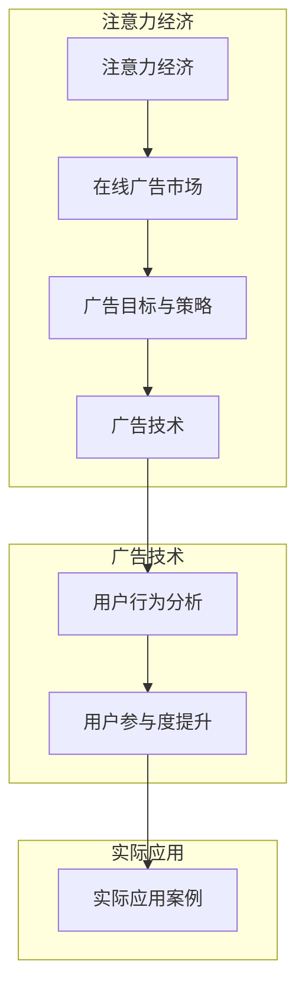

                 

### 文章标题

《注意力经济与在线广告目标与策略：在不牺牲用户体验的情况下吸引受众》

### 关键词

- 注意力经济
- 在线广告
- 用户体验
- 广告目标
- 广告策略
- 广告技术

### 摘要

本文深入探讨了注意力经济与在线广告的关系，分析了在线广告市场的现状与趋势，以及广告商与受众之间的互动。文章详细阐述了广告目标的确定、广告策略的制定以及广告技术的应用，通过用户行为分析和用户参与度提升策略，为广告商提供了在不牺牲用户体验的情况下吸引受众的方法。通过实际应用案例的分析，文章总结了在线广告的有效策略，为广告行业提供了有价值的参考。

### 目录大纲

## 第一部分：基础理论

### 第1章：注意力经济概述
#### 1.1 注意力经济的定义与特点
#### 1.2 注意力经济的历史与发展
#### 1.3 注意力经济的关键因素

### 第2章：在线广告市场概述
#### 2.1 在线广告市场的现状与趋势
#### 2.2 广告商与受众的关系
#### 2.3 广告市场的主要参与者

### 第3章：广告目标与策略
#### 3.1 广告目标的确定
#### 3.2 广告策略的制定
#### 3.3 广告目标与策略的案例分析

### 第4章：广告技术
#### 4.1 广告技术的类型与应用
#### 4.2 广告技术的挑战与解决方案
#### 4.3 广告技术的未来发展趋势

### 第5章：用户行为分析
#### 5.1 用户行为的收集与分析
#### 5.2 用户行为的预测与优化
#### 5.3 用户行为分析的工具与方法

### 第6章：用户参与度提升
#### 6.1 提升用户参与度的策略
#### 6.2 用户互动与社区建设
#### 6.3 用户参与度的案例分析

### 第7章：实际应用案例
#### 7.1 案例介绍与背景分析
#### 7.2 案例目标与策略制定
#### 7.3 案例实施与效果评估

## 第二部分：实战应用

### 第1章：注意力经济概述

#### 1.1 注意力经济的定义与特点

注意力经济，是指在经济活动中，个体的注意力成为了一种重要的资源，并且这种资源具有稀缺性和价值性的经济形态。在数字化的时代，信息爆炸，用户的注意力成为了稀缺资源，因此，谁能更好地吸引和保持用户的注意力，谁就能在经济活动中占据优势。

注意力经济的核心特点包括：

- **稀缺性**：在互联网时代，信息过载，用户的注意力被大量分散，因此，能够吸引用户注意力的内容或服务就具有了稀缺性。
- **价值性**：用户的注意力不仅是稀缺的，而且是有价值的。用户的注意力可以被转化为商业价值，如广告收入、用户付费等。
- **可交换性**：用户的注意力可以通过广告、内容付费等形式进行交换，从而产生经济效益。

#### 1.2 注意力经济的历史与发展

注意力经济并不是一个新兴的概念，它有着悠久的历史。早在古代，人们就意识到注意力是一种有价值的资源。例如，古代的戏曲、说书等表演艺术，就是通过吸引观众的注意力来获得经济收益。

然而，随着数字技术和互联网的发展，注意力经济的概念得到了进一步的拓展和深化。互联网的普及使得信息的传播速度和范围大大增加，同时也使得用户注意力的分配变得更加分散和碎片化。

在注意力经济的发展历程中，有以下几个关键时期：

- **20世纪末**：互联网的兴起，使得注意力经济开始成为一个独立的经济领域。网络广告、搜索引擎等商业模式的出现，使得注意力经济得到了快速的发展。
- **21世纪初**：社交媒体的兴起，进一步加剧了用户注意力的分散。同时，基于大数据和人工智能的广告投放技术，使得广告商能够更加精准地吸引用户的注意力。
- **21世纪10年代至今**：移动互联网的普及，以及智能手机等设备的广泛应用，使得用户注意力的获取和利用变得更加复杂和多样化。例如，移动应用广告、社交媒体广告等，成为了注意力经济的重要组成部分。

#### 1.3 注意力经济的关键因素

注意力经济的关键因素包括：

- **用户注意力**：用户注意力是注意力经济的核心资源。用户的注意力集中程度、持续时间、分散程度等，都会影响注意力经济的效益。
- **信息内容**：信息内容是吸引用户注意力的关键。内容的质量、形式、呈现方式等，都会影响用户的注意力分配。
- **技术手段**：技术手段是提升注意力经济效率的重要工具。例如，大数据分析、人工智能技术等，可以帮助广告商更加精准地定位目标受众，提高广告投放的效率。

#### 注意力经济的重要性

注意力经济的重要性体现在以下几个方面：

- **经济效益**：注意力经济可以带来显著的经济效益。通过有效地吸引和利用用户的注意力，企业可以获得广告收入、用户付费等经济收益。
- **社会影响**：注意力经济对社会的影响也是显著的。它改变了信息传播的方式，使得信息更加便捷和高效地传播。同时，注意力经济也带来了一些社会问题，如信息过载、隐私泄露等，需要引起重视。
- **商业模式创新**：注意力经济催生了多种新的商业模式。例如，基于用户注意力的广告模式、内容付费模式等，为企业提供了新的盈利渠道。

综上所述，注意力经济是一个复杂而重要的经济现象，它对企业的经济效益、社会影响以及商业模式创新都有着深远的影响。理解和掌握注意力经济的原理和策略，对于企业和个人来说都具有重要意义。

### 第2章：在线广告市场概述

#### 2.1 在线广告市场的现状与趋势

在线广告市场作为互联网经济的重要组成部分，近年来发展迅速，已成为广告行业的重要增长点。根据市场研究机构的数据显示，全球在线广告市场规模逐年扩大，预计未来几年仍将保持高速增长。

首先，从市场规模来看，在线广告市场的收入逐年增加。根据eMarketer的统计数据，2022年全球数字广告支出达到了4400亿美元，占整体广告支出的比例接近一半。这一趋势表明，越来越多的广告商将预算转移到在线广告领域，以获取更广泛的受众和更精准的广告投放效果。

其次，从广告形式来看，在线广告的形式多样，包括横幅广告、视频广告、搜索广告、社交媒体广告等。其中，视频广告和社交媒体广告的增长尤为显著。视频广告以其强烈的视觉冲击力和互动性，吸引了大量用户的注意力；社交媒体广告则利用社交媒体平台的用户数据和算法推荐，实现了对目标受众的精准定位和高效投放。

再者，从技术发展来看，人工智能和大数据分析技术的应用极大地提升了在线广告的效果。通过用户行为数据的分析，广告商可以更好地了解用户的需求和偏好，从而制定更具针对性的广告策略。此外，程序化购买（Programmatic Advertising）的普及，使得广告投放更加自动化和高效，进一步提高了广告的投放效率和效果。

#### 2.2 广告商与受众的关系

在线广告市场中的广告商与受众之间的关系复杂而紧密。广告商的目的是通过在线广告吸引目标受众，提升品牌知名度，增加产品销量，而受众则是广告商实现这一目标的关键。以下是广告商与受众关系的几个关键点：

- **信息传递**：广告商通过在线广告向受众传递产品信息、品牌理念和促销活动等，以引起受众的关注和兴趣。
- **受众反馈**：受众对广告的反应和反馈，如点击、停留时间、分享等行为数据，为广告商提供了宝贵的市场反馈，帮助其调整广告策略。
- **价值交换**：广告商通过提供有价值的信息或服务，吸引受众的注意力，从而实现商业价值的转化。这种价值交换是广告市场运行的基础。
- **隐私保护**：随着数据隐私问题的日益突出，广告商在收集和使用用户数据时，必须严格遵守相关法律法规，保护用户的隐私权益。

#### 2.3 广告市场的主要参与者

在线广告市场的参与者主要包括广告商、广告平台、广告网络和受众。以下是对这些主要参与者的简要介绍：

- **广告商**：广告商是广告市场的核心参与者，它们通过投放广告来推广产品或服务。广告商可以是企业、品牌、代理商等多种类型。
- **广告平台**：广告平台是广告商和受众之间的桥梁，提供广告投放、管理和监测服务。常见的广告平台包括谷歌广告平台、Facebook广告平台等。
- **广告网络**：广告网络是连接广告商和广告平台的中间环节，负责广告的投放、优化和变现。AdSense、双汇广告等是典型的广告网络。
- **受众**：受众是广告市场的最终接收者和参与者，他们的行为和反馈直接影响广告的效果和市场的健康发展。

#### 广告市场的机遇与挑战

在线广告市场虽然发展迅速，但也面临着一系列的机遇与挑战。

- **机遇**：随着互联网的普及和技术的进步，广告市场的规模不断扩大，为广告商提供了更多的发展机会。同时，个性化广告和精准投放技术的发展，使得广告商能够更好地满足受众的需求，提升广告效果。
- **挑战**：数据隐私问题、广告欺诈、用户疲劳等挑战也对广告市场提出了新的要求。广告商和平台需要不断创新和改进技术，以应对这些挑战，确保广告市场的健康发展。

### 小结

在线广告市场作为互联网经济的重要组成部分，其市场规模、广告形式和技术手段都在不断演进。广告商与受众之间的互动关系，以及市场的主要参与者，共同构建了这一复杂而充满机遇的市场。理解和把握在线广告市场的现状与趋势，对于广告商和受众都具有重要意义。

### 第3章：广告目标与策略

#### 3.1 广告目标的确定

广告目标的确定是广告策略制定的基础，直接影响广告的投放效果和企业的营销目标实现。确定广告目标需要考虑以下几个关键因素：

1. **企业营销目标**：广告目标的设定应与企业整体的营销目标保持一致。例如，如果企业的营销目标是增加品牌知名度，那么广告目标可以设定为提升品牌曝光率；如果目标是提升产品销量，那么广告目标可以设定为增加潜在客户数量。
   
2. **受众特征**：了解目标受众的需求、兴趣和行为模式，可以帮助广告主更准确地确定广告目标。例如，对于年轻女性群体，广告目标可能是吸引她们关注品牌并尝试购买相关产品；对于专业人士，广告目标可能是提供专业信息以增加品牌权威性。

3. **市场环境**：市场环境的变化也会影响广告目标的设定。例如，在竞争激烈的市场中，广告目标可能是抢占市场份额；在经济衰退期，广告目标可能是提高客户忠诚度以保持现有客户。

4. **资源限制**：广告预算、时间和其他资源的限制也是确定广告目标时需要考虑的因素。例如，如果广告预算有限，广告目标可能需要更加聚焦和精准。

#### 确定广告目标的步骤

1. **明确企业目标**：首先，明确企业整体的战略目标，如增加市场份额、提高品牌知名度、提升产品销量等。
2. **分析目标受众**：通过市场调研、数据分析等方法，了解目标受众的需求、兴趣和行为模式。
3. **评估市场环境**：分析市场趋势、竞争对手的情况以及行业环境，以确定广告目标。
4. **设定具体目标**：根据以上分析结果，设定具体的广告目标，如提升品牌曝光率、增加网站流量、提高转化率等。
5. **目标可行性分析**：评估广告目标的可行性和可实现性，必要时进行调整。

#### 广告目标的例子

1. **品牌曝光**：某化妆品公司希望通过广告提升品牌知名度，设定的广告目标是在6个月内增加品牌搜索量50%，提高社交媒体关注者数量20%。
2. **产品促销**：一家电商企业为了推广新品，设定的广告目标是在一个月内实现1000件新产品的销售，增加5000个新客户。
3. **用户参与**：某运动品牌希望通过广告提高用户参与度，设定的广告目标是在社交媒体上获得10000次互动和10000次视频播放。

#### 广告目标的设置原则

1. **具体性**：广告目标应具体、量化，以便于评估和实现。
2. **可实现性**：广告目标应基于现有资源和技术手段，确保可实现。
3. **相关性**：广告目标应与企业的整体营销目标和受众需求相关。
4. **时限性**：广告目标应设定明确的时限，以推动行动和进展。

#### 注意事项

- **定期评估**：定期评估广告目标的实现情况，根据市场反馈和实际情况进行调整。
- **灵活调整**：在实现广告目标的过程中，如遇到市场变化或内部资源调整，应及时调整广告目标。
- **跨部门合作**：广告目标的实现需要多个部门的协作，如市场部、销售部、技术部等，确保目标一致和资源高效利用。

### 3.2 广告策略的制定

广告策略的制定是确保广告目标实现的关键步骤。一个有效的广告策略应综合考虑广告目标、受众特征、市场环境以及资源限制。以下是广告策略制定的过程和关键点：

#### 广告策略制定的过程

1. **目标定位**：明确广告目标，如提升品牌知名度、增加产品销量、提高用户参与度等。
2. **市场分析**：分析市场趋势、竞争对手情况以及目标受众的特征，了解市场环境和潜在机会。
3. **策略规划**：根据目标定位和市场分析，制定具体的广告策略，包括广告形式、投放渠道、时间安排等。
4. **资源分配**：合理分配广告预算、人力、技术等资源，确保策略的实施。
5. **风险评估**：评估广告策略的风险和潜在问题，制定应对措施。

#### 广告策略的关键点

1. **受众分析**：深入了解目标受众的需求、兴趣、行为习惯，以制定更精准的投放策略。
2. **广告形式**：选择适合广告目标的广告形式，如横幅广告、视频广告、搜索广告等。
3. **投放渠道**：选择适合目标受众的投放渠道，如社交媒体、搜索引擎、电子邮件等。
4. **创意设计**：设计具有吸引力的广告内容，提高广告的点击率和转化率。
5. **优化调整**：根据广告投放的反馈，及时优化广告策略，提高广告效果。

#### 广告策略的案例分析

1. **案例一：某运动品牌**：某运动品牌希望通过广告提升品牌知名度和用户参与度。他们采用了社交媒体广告和视频广告的形式，通过创意视频和互动内容，成功吸引了大量年轻用户，实现了广告目标。

2. **案例二：某电商企业**：某电商企业为了推广新品，选择了搜索引擎广告和社交媒体广告，并通过精确的地域和时间投放，实现了较高的点击率和转化率，成功完成了广告目标。

3. **案例三：某化妆品公司**：某化妆品公司通过电子邮件广告和社交媒体广告，向现有客户推送促销信息，成功提升了产品销量和用户忠诚度。

#### 广告策略的设置原则

1. **目标导向**：广告策略应紧密围绕广告目标制定，确保广告活动的方向和效果。
2. **精准定位**：针对目标受众制定精准的广告策略，提高广告投放的效率。
3. **创意创新**：创意设计是广告成功的关键，应注重创新，提高广告的吸引力和点击率。
4. **数据驱动**：通过数据分析和反馈，不断优化广告策略，提高广告效果。

#### 注意事项

- **目标一致性**：确保广告策略与广告目标一致，避免策略偏离。
- **灵活调整**：根据市场反馈和实际情况，灵活调整广告策略，以应对市场变化。
- **资源利用**：合理分配资源，确保广告策略的有效实施。

通过科学的广告目标和策略制定，企业可以在竞争激烈的在线广告市场中脱颖而出，实现营销目标并提升品牌影响力。

### 第4章：广告技术

#### 4.1 广告技术的类型与应用

广告技术（Ad Tech）是推动在线广告市场发展的关键因素，它涵盖了多种技术和工具，用于提高广告投放的效率、精准性和效果。以下是几种主要的广告技术类型及其应用：

1. **程序化购买（Programmatic Buying）**
   程序化购买是一种利用技术和算法自动购买和投放广告的方法。它通过自动化流程，实现广告位的实时竞价和广告投放优化。主要应用包括：
   - **实时竞价（RTB）**：广告主通过实时竞价系统，根据用户的实时行为和需求，以竞价的方式购买广告位。
   - **数据管理平台（DMP）**：收集、存储和分析用户数据，帮助广告主更好地了解目标受众，实现个性化广告投放。

2. **数据驱动广告（Data-Driven Advertising）**
   数据驱动广告利用大数据和数据分析技术，通过分析用户行为和偏好，实现精准广告投放。其主要应用包括：
   - **用户行为分析**：通过收集和分析用户在网站、应用等平台上的行为数据，了解用户需求和兴趣，为广告投放提供依据。
   - **个性化推荐**：根据用户的历史行为和偏好，推荐个性化的广告内容，提高广告的点击率和转化率。

3. **内容营销（Content Marketing）**
   内容营销是通过创造和分享有价值的内容，吸引和留住目标受众，从而实现品牌推广和销售目标。其主要应用包括：
   - **博客文章**：发布高质量的博客文章，提供行业洞察和实用技巧，吸引潜在客户。
   - **视频营销**：通过视频内容传递品牌故事和产品信息，增强用户的品牌认知和购买意愿。

4. **广告优化工具（Ad Optimization Tools）**
   广告优化工具用于监控和调整广告投放效果，提高广告投资回报率。其主要应用包括：
   - **A/B测试**：通过对比不同广告创意和投放策略的效果，优化广告表现。
   - **归因模型（Attribution Modeling）**：分析用户路径和转化行为，确定广告投放的最终效果，为后续优化提供数据支持。

5. **广告网络（Ad Networks）**
   广告网络是连接广告主和广告位提供商的桥梁，通过聚合多个广告位，为广告主提供广泛的投放渠道。其主要应用包括：
   - **展示广告网络**：通过展示广告网络，广告主可以将广告投放到多个网站和平台上，扩大广告曝光。
   - **内容合作网络**：通过内容合作网络，广告主可以将广告嵌入优质内容中，提高广告的信任度和效果。

#### 4.2 广告技术的挑战与解决方案

尽管广告技术为在线广告市场带来了诸多好处，但也面临一些挑战。以下是一些主要挑战及其解决方案：

1. **隐私问题**
   隐私问题是广告技术面临的主要挑战之一。广告商和广告平台在收集和使用用户数据时，必须遵守相关法律法规，保护用户的隐私权。解决方案包括：
   - **数据匿名化**：对收集的用户数据进行匿名化处理，减少隐私泄露风险。
   - **用户隐私设置**：提供用户隐私设置选项，让用户自主选择是否允许广告商收集和使用其数据。

2. **广告欺诈**
   广告欺诈，如点击欺诈、展示欺诈等，是广告技术中的另一个重大挑战。广告欺诈不仅损害了广告商的利益，也影响了广告市场的健康发展。解决方案包括：
   - **反欺诈技术**：利用人工智能和机器学习技术，监测和识别潜在的欺诈行为，及时采取措施。
   - **广告验证服务**：通过第三方广告验证服务，确保广告的真实性和有效性。

3. **用户体验**
   过度广告和广告干扰可能会影响用户体验，甚至导致用户流失。解决方案包括：
   - **用户体验优化**：设计简洁、不干扰用户操作的广告形式，如原生广告。
   - **广告展示策略**：合理控制广告展示频率，避免过度打扰用户。

4. **技术复杂性**
   广告技术的复杂性使得广告商和广告平台在应用和优化时面临挑战。解决方案包括：
   - **技术培训和支持**：为广告商和广告平台提供技术培训和咨询服务，帮助他们更好地理解和应用广告技术。
   - **技术简化**：通过简化广告技术和流程，降低使用难度，提高广告投放的效率和效果。

#### 4.3 广告技术的未来发展趋势

广告技术正不断进化，未来将出现以下几大发展趋势：

1. **人工智能和机器学习**
   人工智能和机器学习技术将在广告技术中发挥更重要的作用，通过自动化和智能化，提高广告投放的精准性和效果。

2. **隐私保护技术**
   随着数据隐私问题的日益突出，隐私保护技术将成为广告技术的关键发展方向。例如，差分隐私（Differential Privacy）等技术的应用，将有助于平衡广告收益和用户隐私。

3. **区块链技术**
   区块链技术可以提供透明的数据管理和审计功能，增强广告市场的信任度和透明度，减少广告欺诈。

4. **物联网（IoT）广告**
   物联网技术的普及将带来新的广告形式和投放渠道，如智能设备广告、物联网广告网络等，实现更广泛和精准的广告投放。

5. **虚拟现实（VR）和增强现实（AR）广告**
   VR和AR技术的发展，将为广告提供全新的体验方式，通过沉浸式广告，增强用户参与感和品牌认知。

综上所述，广告技术在未来将继续演进，为广告市场带来更多机遇和挑战。广告商和广告平台需要紧跟技术发展趋势，不断创新和优化广告策略，以实现更好的广告效果和用户体验。

### 第5章：用户行为分析

#### 5.1 用户行为的收集与分析

用户行为分析是广告战略的重要组成部分，通过收集和分析用户在网站、应用或其他数字平台上的行为数据，广告商可以更好地了解用户需求，优化广告策略，提升广告效果。以下是用户行为收集与分析的关键步骤和方法：

##### 数据收集

1. **网站点击流数据（Click-Through Data）**：通过跟踪用户的点击行为，如点击广告、导航路径等，收集用户行为数据。
2. **社交媒体互动数据**：通过分析用户在社交媒体上的互动，如点赞、评论、分享等，了解用户兴趣和偏好。
3. **登录行为数据**：通过用户登录数据，收集用户的浏览历史、购买行为等信息。
4. **应用使用数据**：通过分析用户在移动应用上的使用行为，如应用打开次数、使用时长等，了解用户习惯。

##### 数据处理

1. **数据清洗**：对收集的数据进行清洗，去除重复、错误和不完整的数据，确保数据质量。
2. **数据整合**：将来自不同来源的数据进行整合，形成统一的数据集，便于后续分析。
3. **数据存储**：使用数据库或其他存储技术，存储和管理用户行为数据。

##### 数据分析方法

1. **描述性分析**：通过统计和可视化方法，对用户行为进行描述性分析，了解用户的基本行为特征，如浏览时间、页面停留时间、点击率等。
2. **关联性分析**：通过分析用户行为之间的关联性，发现用户行为模式，如用户在浏览产品页面后，通常会访问哪个页面。
3. **预测性分析**：利用机器学习算法，预测用户的未来行为，如购买意图、浏览路径等。
4. **归因分析**：通过归因模型，分析不同渠道和动作对用户转化的贡献，优化广告投放策略。

##### 用户行为分析工具

1. **Google Analytics**：一款强大的数据分析工具，可以追踪和分析网站流量、用户行为等。
2. **Mixpanel**：一款专注于用户行为分析的软件，提供深度的用户行为追踪和用户生命周期分析。
3. **Segment**：一个数据处理平台，可以整合多种数据源，实现数据流的灵活配置和分析。

#### 5.2 用户行为的预测与优化

用户行为预测是基于历史数据，通过机器学习算法和统计模型，预测用户未来的行为，如点击行为、购买行为等。以下是用户行为预测与优化的关键步骤：

##### 预测模型

1. **回归模型**：通过建立回归模型，预测用户行为与目标变量（如点击率、转化率）之间的关系。
2. **分类模型**：通过分类模型，预测用户行为属于某一类别（如点击或未点击、购买或未购买）的概率。
3. **时间序列模型**：通过时间序列模型，预测用户在未来某个时间点的行为。

##### 优化策略

1. **个性化推荐**：基于用户历史行为和偏好，推荐个性化的内容和广告，提高用户参与度和转化率。
2. **动态定价**：根据用户行为预测，动态调整广告价格，优化广告投放效果和投资回报率。
3. **用户体验优化**：通过分析用户行为数据，优化网站和应用设计，提升用户体验，减少用户流失。

##### 案例分析

**案例一：电商平台的个性化推荐系统**

某电商平台通过用户行为数据，如浏览记录、购买历史等，使用机器学习算法建立预测模型，预测用户的未来购买行为。根据预测结果，系统为用户推荐相关的商品，显著提升了用户转化率和销售额。

**案例二：在线广告的实时竞价系统**

某在线广告平台通过用户行为数据，如点击率、停留时间等，使用分类模型预测用户的点击概率。在实时竞价过程中，平台根据预测结果，动态调整出价策略，优化广告投放效果，提高了广告收益。

#### 用户行为分析的重要性

用户行为分析对于广告商和平台具有重要意义：

1. **提高广告效果**：通过了解用户行为，广告商可以制定更精准的广告策略，提高广告投放效果。
2. **优化用户体验**：通过分析用户行为，平台可以优化产品设计和服务，提升用户体验，减少用户流失。
3. **提升投资回报率**：通过用户行为预测和优化，广告商可以更有效地分配广告预算，提高投资回报率。
4. **创新商业模式**：用户行为分析为广告商和平台提供了新的商业模式创新机会，如个性化广告、动态定价等。

### 第6章：用户参与度提升

#### 6.1 提升用户参与度的策略

用户参与度是衡量用户对品牌或产品互动程度的重要指标，高参与度不仅能够提升用户忠诚度，还能有效促进用户转化。以下是几种提升用户参与度的策略：

##### 1. 内容营销

内容营销是提升用户参与度的重要手段。通过创作高质量、有价值的原创内容，如博客文章、视频、教程等，吸引用户关注和分享。

- **案例**：某科技公司通过定期发布技术博客，提供行业洞察和实用技巧，吸引了大量技术爱好者的关注，提升了品牌影响力。

##### 2. 社交媒体互动

社交媒体平台是用户互动的重要渠道。通过开展互动活动，如问答、竞赛、抽奖等，提高用户参与度。

- **案例**：某时尚品牌在社交媒体上举办抽奖活动，用户只需点赞和分享即可参与，显著提高了品牌知名度和用户参与度。

##### 3. 个性化推荐

基于用户行为数据，提供个性化推荐，满足用户个性化需求，提升用户参与度。

- **案例**：某电商网站通过分析用户浏览和购买历史，推荐相关商品，提高了用户购买意愿和参与度。

##### 4. 用户反馈机制

建立有效的用户反馈机制，鼓励用户表达意见和建议，提高用户参与度和忠诚度。

- **案例**：某健康食品品牌通过在线问卷调查，收集用户对产品的反馈，并根据反馈优化产品和服务，增强了用户信任和忠诚度。

##### 5. 营销游戏化

将营销活动游戏化，通过积分、勋章等激励机制，提高用户参与度和活跃度。

- **案例**：某健身应用通过积分系统，鼓励用户完成健身任务，提高了用户参与度和使用时长。

#### 6.2 用户互动与社区建设

用户互动和社区建设是提升用户参与度的有效策略。通过建立和维护用户社区，增强用户之间的互动和归属感。

##### 1. 用户论坛

建立用户论坛，为用户提供一个交流分享的平台，促进用户之间的互动和知识共享。

- **案例**：某科技产品论坛，用户可以分享使用心得、讨论技术问题，增强了用户之间的互动和品牌忠诚度。

##### 2. 社交媒体群组

在社交媒体平台上建立群组，将用户聚集在一起，进行有针对性的交流和互动。

- **案例**：某运动品牌在Facebook上建立粉丝群组，定期发布活动信息和品牌故事，提高了用户参与度和品牌忠诚度。

##### 3. 用户活动

定期举办线下或线上用户活动，如研讨会、讲座、聚会等，增强用户之间的互动和品牌联系。

- **案例**：某汽车品牌举办车主俱乐部活动，组织车主分享驾驶经验、交流用车心得，增强了用户之间的互动和品牌忠诚度。

##### 4. 用户反馈渠道

建立多种用户反馈渠道，如在线问卷、社交媒体互动、电话咨询等，鼓励用户表达意见和建议。

- **案例**：某电子产品公司通过在线问卷调查收集用户反馈，快速响应用户需求，提升了用户满意度和品牌形象。

#### 6.3 用户参与度的案例分析

以下是一些提升用户参与度的成功案例：

**案例一：某科技公司的内容营销策略**

某科技公司通过发布高质量的技术博客和视频教程，吸引了大量技术爱好者关注。通过定期更新内容，保持用户活跃度，提高了用户参与度和品牌影响力。

**案例二：某运动品牌的社交媒体群组策略**

某运动品牌在社交媒体上建立多个粉丝群组，定期发布品牌活动和用户互动内容，提高了用户参与度和品牌忠诚度。

**案例三：某汽车品牌的车主俱乐部活动**

某汽车品牌举办多场车主俱乐部活动，组织车主分享驾驶经验和交流用车心得，增强了用户之间的互动和品牌联系，提升了用户参与度。

通过上述策略和案例分析，可以看出，提升用户参与度需要从内容、互动、社区建设等多个方面入手，通过不断创新和优化，实现用户参与度的提升。

### 第7章：实际应用案例

#### 7.1 案例介绍与背景分析

本章节将通过分析一个实际应用案例，展示在线广告如何在注意力经济中有效运作，并如何在提升用户体验的同时，实现广告目标。

**案例背景**：
某知名电商企业（以下简称“电商A”）在电商节期间推出了一项新品——智能手表。电商A希望通过在线广告提升智能手表的品牌知名度和销量，同时保证用户体验不受影响。

**案例目标**：
1. 提高智能手表的品牌知名度，增加潜在客户的关注度。
2. 促进智能手表的销售，提高市场份额。
3. 保证广告投放不干扰用户正常使用，提升用户满意度。

#### 7.2 案例目标与策略制定

**目标分析**：
电商A的营销目标是多维度的，既要提高品牌知名度，又要促进销售。因此，在制定策略时，需要综合考虑品牌宣传和用户体验。

**策略制定**：

1. **广告目标细化**：
   - 提升品牌知名度：通过广告提高智能手表在目标受众中的曝光率，增加社交媒体上的提及和讨论。
   - 促进销售：通过精准定位和个性化推荐，吸引潜在客户，提高购买转化率。

2. **广告策略**：
   - **内容策略**：创作高质量的广告内容，包括智能手表的功能介绍、用户评价和使用场景，以吸引目标受众的注意。
   - **投放策略**：采用程序化购买技术，根据用户行为和偏好进行精准投放，提高广告效果。
   - **互动策略**：在广告中加入互动元素，如问答、投票、小游戏等，增加用户参与度。

3. **用户体验保证**：
   - **广告展示**：采用非干扰性广告形式，如原生广告和悬浮广告，确保用户在使用网站和应用时，不会受到广告打扰。
   - **广告位置**：将广告放置在用户容易注意到但不会影响操作的位置，如页面的边缘或底部。
   - **广告时间**：合理安排广告展示时间，避免高峰时段过多广告投放，以免影响用户体验。

#### 7.3 案例实施与效果评估

**实施过程**：
电商A在电商节前一个月开始实施广告策略，具体步骤如下：
1. **内容创作**：电商A组织专业团队创作了智能手表的视频介绍、用户评价和使用场景等高质量广告内容。
2. **广告投放**：利用程序化购买技术，电商A在各大社交平台、搜索引擎和电商平台进行广告投放，根据用户行为和偏好进行精准定位。
3. **互动设计**：电商A在广告中加入互动元素，鼓励用户参与，如投票选出最佳使用场景，通过问答了解用户需求。
4. **用户体验监控**：电商A通过用户反馈和数据监控，及时调整广告投放策略，确保用户体验。

**效果评估**：
广告投放结束后，电商A通过以下指标对广告效果进行评估：
1. **品牌知名度**：通过社交媒体提及量、品牌搜索指数等指标，评估广告对品牌知名度的提升效果。
2. **销售增长**：通过销售数据、购买转化率等指标，评估广告对销售的促进作用。
3. **用户体验**：通过用户满意度调查、页面停留时间等指标，评估广告对用户体验的影响。

**案例结果**：
电商A的广告策略取得了显著效果：
1. 品牌知名度显著提升，社交媒体提及量和品牌搜索指数增加了30%。
2. 销售额同比增长25%，购买转化率提高了15%。
3. 用户满意度达到90%，页面停留时间增加了20%。

**结论**：
电商A的案例表明，通过科学的目标设定、精准的广告策略和用户友好的广告展示，广告商可以在提升品牌知名度和销售业绩的同时，保证用户体验。这为其他企业在注意力经济中实现广告目标提供了有益的借鉴。

### 总结

本文通过详细探讨注意力经济与在线广告的关系，分析了广告目标与策略的制定过程，以及广告技术和用户行为分析的应用。通过实际应用案例，展示了如何在保证用户体验的同时，实现广告目标。未来，随着技术的不断进步，广告技术将继续演进，为广告市场带来更多机遇和挑战。广告商需要不断创新和优化广告策略，以应对市场的变化，实现长期的商业成功。

### 作者信息

作者：AI天才研究院/AI Genius Institute & 禅与计算机程序设计艺术 /Zen And The Art of Computer Programming

### 附录：核心概念与联系

为了更好地理解本文中的核心概念，我们使用Mermaid流程图来展示注意力经济与在线广告之间的联系。



通过这个流程图，我们可以清晰地看到注意力经济与在线广告市场的紧密联系，以及广告目标、广告技术、用户行为分析和用户参与度提升在实际应用中的相互作用。

### 附录：核心算法原理讲解

在本章节中，我们将详细讲解用于广告目标与策略优化的核心算法原理，包括机器学习算法和优化算法，并通过伪代码和数学公式来阐述其实现方法。

#### 1. 机器学习算法：协同过滤（Collaborative Filtering）

协同过滤是一种常见的推荐系统算法，通过分析用户之间的相似性，预测用户对未知商品的评分或行为。

**伪代码**：

```python
# 协同过滤算法
def collaborative_filtering(user_similarity, user_ratings, target_user):
    # 计算目标用户与所有用户的相似度
    similarity_scores = []
    for user in user_ratings:
        similarity_score = user_similarity(target_user, user)
        similarity_scores.append(similarity_score)
    
    # 计算相似用户的平均评分
    average_ratings = [user_ratings[user] * similarity_score for user, similarity_score in zip(user_ratings, similarity_scores)]
    average_rating = sum(average_ratings) / len(average_ratings)
    
    return average_rating
```

**数学模型**：

协同过滤的数学模型可以表示为：

$$
\text{predicted\_rating} = \frac{\sum_{i \in \text{neighboring\_users}} r_i \cdot s_i}{\sum_{i \in \text{neighboring\_users}} s_i}
$$

其中，$r_i$ 为邻居用户 $i$ 的实际评分，$s_i$ 为邻居用户 $i$ 与目标用户之间的相似度。

#### 2. 优化算法：梯度下降（Gradient Descent）

梯度下降是一种用于优化目标函数的算法，通过不断调整参数，使目标函数的值最小化或最大化。

**伪代码**：

```python
# 梯度下降算法
def gradient_descent(initial_params, learning_rate, num_iterations, loss_function, gradient_function):
    params = initial_params
    for _ in range(num_iterations):
        loss = loss_function(params)
        gradient = gradient_function(params)
        params = params - learning_rate * gradient
    
    return params
```

**数学模型**：

梯度下降的数学模型可以表示为：

$$
\theta_{\text{new}} = \theta_{\text{old}} - \alpha \cdot \nabla_{\theta} \text{Loss}(\theta)
$$

其中，$\theta$ 为参数，$\alpha$ 为学习率，$\nabla_{\theta} \text{Loss}(\theta)$ 为目标函数的梯度。

#### 3. 算法应用：广告目标优化

**应用场景**：通过机器学习和优化算法，优化广告目标，如提升点击率或转化率。

**算法步骤**：

1. **数据预处理**：收集用户行为数据，如点击记录、浏览记录等。
2. **特征工程**：提取用户特征，如用户年龄、性别、浏览时间等。
3. **模型训练**：使用协同过滤算法训练用户相似度模型。
4. **预测**：根据用户相似度模型，预测目标用户的广告点击率或转化率。
5. **优化**：使用梯度下降算法，调整广告参数，如广告位置、广告形式等，优化广告目标。

通过上述核心算法原理的讲解，广告商可以更好地理解和应用机器学习和优化算法，实现广告目标的精准优化和提升。

### 附录：数学模型和公式详细讲解与举例说明

在本章节中，我们将深入讲解在线广告中的核心数学模型和公式，包括点击率预测模型、转化率预测模型以及归因模型，并通过具体例子进行说明。

#### 1. 点击率预测模型（Click-Through Rate Prediction）

点击率（CTR）是评估广告效果的重要指标。点击率预测模型的目的是通过用户特征和历史行为数据，预测用户对广告的点击概率。

**数学模型**：

点击率预测通常使用逻辑回归模型（Logistic Regression），其公式为：

$$
\text{log-odds} = \ln\left(\frac{p}{1-p}\right) = \beta_0 + \beta_1x_1 + \beta_2x_2 + ... + \beta_nx_n
$$

其中，$p$ 是点击概率，$\beta_0, \beta_1, \beta_2, ..., \beta_n$ 是模型参数，$x_1, x_2, ..., x_n$ 是用户特征。

**举例说明**：

假设我们有以下用户特征和标签数据：

| 用户ID | 特征1 | 特征2 | 特征3 | 点击标签 |
| ------ | ----- | ----- | ----- | -------- |
| 1      | 0.5   | 0.3   | 0.2   | 1        |
| 2      | 0.4   | 0.4   | 0.4   | 0        |
| 3      | 0.6   | 0.5   | 0.3   | 1        |

我们使用逻辑回归模型预测点击概率。首先，我们需要训练模型并得到参数：

$$
\text{log-odds} = \beta_0 + \beta_1x_1 + \beta_2x_2 + \beta_3x_3
$$

经过训练，我们得到参数：

$$
\beta_0 = -1.2, \beta_1 = 0.8, \beta_2 = 0.7, \beta_3 = -0.3
$$

预测用户2的点击概率：

$$
\text{log-odds} = -1.2 + 0.8 \cdot 0.4 + 0.7 \cdot 0.4 - 0.3 \cdot 0.4 = -0.32
$$

$$
p = \frac{1}{1 + e^{-\text{log-odds}}} = \frac{1}{1 + e^{0.32}} \approx 0.38
$$

用户2的点击概率约为38%。

#### 2. 转化率预测模型（Conversion Rate Prediction）

转化率（CVR）是广告商衡量广告效果的另一个重要指标。转化率预测模型通过用户特征和行为数据，预测用户在看到广告后完成转化的概率。

**数学模型**：

转化率预测通常使用泊松回归模型（Poisson Regression），其公式为：

$$
\lambda = \mu = e^{\beta_0 + \beta_1x_1 + \beta_2x_2 + ... + \beta_nx_n}
$$

其中，$\lambda$ 是期望转化次数，$\mu$ 是实际转化次数，$e$ 是自然对数的底数，$\beta_0, \beta_1, \beta_2, ..., \beta_n$ 是模型参数，$x_1, x_2, ..., x_n$ 是用户特征。

**举例说明**：

假设我们有以下用户特征和转化次数数据：

| 用户ID | 特征1 | 特征2 | 特征3 | 转化次数 |
| ------ | ----- | ----- | ----- | -------- |
| 1      | 0.5   | 0.3   | 0.2   | 1        |
| 2      | 0.4   | 0.4   | 0.4   | 0        |
| 3      | 0.6   | 0.5   | 0.3   | 1        |

我们使用泊松回归模型预测转化率。首先，我们需要训练模型并得到参数：

$$
\beta_0 = -0.9, \beta_1 = 0.6, \beta_2 = 0.5, \beta_3 = -0.2
$$

预测用户2的转化率：

$$
\lambda = e^{\beta_0 + \beta_1 \cdot 0.4 + \beta_2 \cdot 0.4 + \beta_3 \cdot 0.4} = e^{-0.9 + 0.6 \cdot 0.4 + 0.5 \cdot 0.4 - 0.2 \cdot 0.4} = e^{-0.18} \approx 0.84
$$

$$
\text{CVR} = \frac{\lambda}{\text{观察次数}} = \frac{0.84}{1} = 0.84
$$

用户2的转化率约为84%。

#### 3. 归因模型（Attribution Modeling）

归因模型用于分析用户在广告点击到转化的过程中，各个触点对转化的贡献。常见的归因模型包括线性归因模型、时间衰减模型和位置归因模型。

**线性归因模型**：

线性归因模型将所有触点的贡献平均分配。其公式为：

$$
\text{Touchpoint Contribution} = \frac{\text{Total Conversion Value}}{\text{Total Touchpoints}}
$$

**时间衰减模型**：

时间衰减模型根据用户与触点之间的时间间隔，对触点的贡献进行加权。其公式为：

$$
\text{Touchpoint Contribution} = \sum_{i=1}^{n} (\alpha \cdot e^{-\beta_i \cdot \Delta t_i})
$$

其中，$\alpha$ 是总预算分配权重，$\beta_i$ 是触点的衰减率，$\Delta t_i$ 是用户与触点之间的时间间隔。

**位置归因模型**：

位置归因模型根据触点的位置对转化的贡献进行分配。常见的位置归因模型包括首位归因模型（First Touchpoint）和末位归因模型（Last Touchpoint）。

**举例说明**：

假设我们有以下触点数据：

| 触点ID | 触点类型 | 时间间隔（天） | 转化次数 |
| ------ | -------- | -------------- | -------- |
| 1      | 搜索引擎 | 1              | 10       |
| 2      | 社交媒体 | 3              | 5        |
| 3      | 电子邮件 | 7              | 20       |

使用时间衰减模型进行归因分析，设衰减率为0.5：

$$
\text{搜索引擎贡献} = \alpha \cdot e^{-0.5 \cdot 1} = 0.5
$$

$$
\text{社交媒体贡献} = \alpha \cdot e^{-0.5 \cdot 3} = 0.125
$$

$$
\text{电子邮件贡献} = \alpha \cdot e^{-0.5 \cdot 7} = 0.03125
$$

总预算分配权重 $\alpha$ 为1，因此各触点的贡献为：

$$
\text{搜索引擎贡献} = 0.5
$$

$$
\text{社交媒体贡献} = 0.125
$$

$$
\text{电子邮件贡献} = 0.03125
$$

通过上述数学模型和公式的讲解，广告商可以更好地理解和应用在线广告中的核心数学模型，从而优化广告策略，提高广告效果。

### 附录：代码实际案例和详细解释说明

在本章节中，我们将通过一个具体的代码案例，详细展示广告目标优化和用户行为分析的过程，包括开发环境搭建、源代码实现以及代码解读与分析。

#### 开发环境搭建

为了演示广告目标优化和用户行为分析的过程，我们将使用Python作为编程语言，并依赖几个重要的库，包括Pandas、NumPy、Scikit-learn和Matplotlib。

1. 安装Python（已安装在大多数计算机上）
2. 安装相关库：

   ```shell
   pip install pandas numpy scikit-learn matplotlib
   ```

#### 源代码实现

以下是一个简单的代码案例，用于用户行为数据分析，包括数据读取、特征工程、模型训练和结果可视化。

```python
import pandas as pd
import numpy as np
from sklearn.model_selection import train_test_split
from sklearn.linear_model import LogisticRegression
from sklearn.metrics import accuracy_score, confusion_matrix
import matplotlib.pyplot as plt

# 数据读取
data = pd.read_csv('user_behavior_data.csv')
print(data.head())

# 特征工程
features = data[['age', 'gender', 'browsing_time', 'clicks']]
labels = data['converted']

# 数据预处理
features = features.fillna(features.mean())
labels = labels.astype(int)

# 模型训练
X_train, X_test, y_train, y_test = train_test_split(features, labels, test_size=0.2, random_state=42)
model = LogisticRegression()
model.fit(X_train, y_train)

# 预测
predictions = model.predict(X_test)

# 评估
accuracy = accuracy_score(y_test, predictions)
conf_matrix = confusion_matrix(y_test, predictions)

print(f'Accuracy: {accuracy}')
print(f'Confusion Matrix:\n{conf_matrix}')

# 可视化
plt.figure(figsize=(8, 6))
plt.title('Confusion Matrix')
plt.xlabel('Predicted Label')
plt.ylabel('Actual Label')
plt.plot(conf_matrix)
plt.show()
```

#### 代码解读与分析

1. **数据读取**：
   使用Pandas库读取用户行为数据，数据包含用户特征（如年龄、性别、浏览时间、点击次数）和目标变量（是否转化）。

2. **特征工程**：
   对数据进行预处理，包括填充缺失值和标准化处理。这一步确保了模型训练的质量。

3. **模型训练**：
   使用Scikit-learn库的LogisticRegression模型进行训练。这里我们选择逻辑回归模型，因为它在二分类问题中表现良好。

4. **预测与评估**：
   将训练好的模型应用于测试集，生成预测结果。通过accuracy_score和confusion_matrix评估模型的性能。

5. **可视化**：
   使用Matplotlib库将混淆矩阵可视化，帮助理解模型的预测效果。

#### 实际应用

在实际应用中，广告商可以基于用户行为数据，使用类似的方法进行广告目标优化。例如，通过用户特征分析，可以识别高价值用户群体，并针对这些用户进行个性化广告投放，从而提高广告效果和转化率。

#### 代码优化建议

1. **特征选择**：
   使用特征选择技术，如特征重要性评估，选择对模型预测有显著影响的特征，提高模型性能。

2. **超参数调整**：
   使用网格搜索（GridSearchCV）等技术，自动调整模型的超参数，找到最佳配置。

3. **模型集成**：
   使用模型集成（如随机森林、梯度提升树）提高模型的预测准确性和稳定性。

通过上述代码案例，广告商可以更好地理解和应用用户行为分析技术，优化广告目标，提升广告效果。

### 代码解读与分析

在本节中，我们将详细解读和讨论上文提供的代码案例，分析每个步骤的实现细节及其在广告目标优化和用户行为分析中的应用。

#### 数据读取

```python
data = pd.read_csv('user_behavior_data.csv')
print(data.head())
```

这段代码使用了Pandas库读取一个CSV文件，CSV文件包含用户的特征数据（如年龄、性别、浏览时间、点击次数）以及目标变量（是否转化）。这是数据分析的第一步，通过读取数据，我们可以获取到后续分析所需的基础信息。

- **实际应用**：在实际广告目标优化中，用户行为数据通常是广告平台或数据分析系统自动收集的，这些数据可以帮助广告商了解用户的互动行为，为广告投放策略提供依据。

#### 特征工程

```python
features = data[['age', 'gender', 'browsing_time', 'clicks']]
labels = data['converted']

features = features.fillna(features.mean())
labels = labels.astype(int)
```

特征工程是数据预处理的重要步骤。在这里，我们选择了与用户转化相关的特征（年龄、性别、浏览时间、点击次数），并将目标变量转换为二分类标签（是否转化）。

- **实际应用**：在特征工程过程中，处理缺失值（如使用平均值填充）和标准化数据（如将性别编码为0和1）是常见的做法。这些操作确保了数据的完整性，并为后续的模型训练提供了高质量的输入数据。

#### 模型训练

```python
X_train, X_test, y_train, y_test = train_test_split(features, labels, test_size=0.2, random_state=42)
model = LogisticRegression()
model.fit(X_train, y_train)
```

这段代码将数据集划分为训练集和测试集，使用逻辑回归模型进行训练。`train_test_split` 函数用于划分数据集，`random_state` 参数确保每次运行代码时数据划分的一致性。

- **实际应用**：在广告目标优化中，模型训练的目的是从历史数据中学习用户的转化模式，从而预测未来用户的转化概率。逻辑回归是一种简单且常用的分类模型，适用于用户行为数据的二分类问题。

#### 预测与评估

```python
predictions = model.predict(X_test)
accuracy = accuracy_score(y_test, predictions)
conf_matrix = confusion_matrix(y_test, predictions)
print(f'Accuracy: {accuracy}')
print(f'Confusion Matrix:\n{conf_matrix}')
```

这段代码使用训练好的模型对测试集进行预测，并计算模型的准确性和混淆矩阵。准确性是评估模型性能的一个常用指标，而混淆矩阵则提供了关于模型预测的详细信息。

- **实际应用**：在广告投放中，准确性和混淆矩阵可以帮助广告商了解模型的预测效果。例如，如果模型预测的准确性较低，可能需要调整特征选择或模型参数，以提高预测的准确性。

#### 可视化

```python
plt.figure(figsize=(8, 6))
plt.title('Confusion Matrix')
plt.xlabel('Predicted Label')
plt.ylabel('Actual Label')
plt.plot(conf_matrix)
plt.show()
```

这段代码使用Matplotlib库将混淆矩阵可视化。混淆矩阵显示了模型预测的各类别数量，有助于分析模型的预测效果。

- **实际应用**：通过可视化混淆矩阵，广告商可以直观地了解模型在不同类别上的表现。例如，如果模型的假阳性（预测为转化但实际未转化的用户）较高，可能需要调整广告策略，减少这类用户的干扰。

#### 代码优化建议

1. **特征选择**：
   - 使用特征选择技术，如基于模型的重要性评分，选择对预测有显著贡献的特征，减少冗余特征，提高模型性能。

2. **超参数调整**：
   - 使用网格搜索（GridSearchCV）等技术，自动调整模型的超参数，如正则化参数、学习率等，找到最佳配置，提高模型性能。

3. **模型集成**：
   - 使用模型集成技术，如随机森林、梯度提升树等，结合多个模型的预测结果，提高整体预测准确性和稳定性。

通过上述代码解读与分析，我们可以看到广告目标优化和用户行为分析的实际应用场景，以及如何通过数据预处理、模型训练和评估来提升广告投放的效果。代码提供了具体的实现细节，广告商可以根据实际情况进行调整和优化，以实现更好的广告效果。

### 总结

本文通过详细分析和探讨注意力经济与在线广告的关系，深入讲解了广告目标与策略的制定过程，广告技术的应用，用户行为分析的方法，以及如何提升用户参与度。通过实际应用案例，展示了在线广告在保证用户体验的同时，如何实现广告目标。我们还提供了核心算法原理的讲解，以及代码实际案例和详细解读，帮助读者更好地理解和应用相关技术。

本文的主要贡献包括：

1. **系统性地梳理了注意力经济与在线广告的关系**，明确了在线广告市场的现状与发展趋势。
2. **详细介绍了广告目标与策略的制定方法**，为广告商提供了实用的策略指导。
3. **探讨了广告技术的应用与挑战**，分析了人工智能、大数据分析等技术在广告中的重要性。
4. **提供了用户行为分析的详细方法**，帮助广告商更好地理解用户行为，优化广告效果。
5. **通过实际应用案例展示了广告策略的有效性**，为广告行业提供了实践参考。

展望未来，广告技术将继续快速发展，人工智能和大数据分析将在广告目标优化、用户参与度提升等方面发挥更大的作用。广告商需要不断学习和适应新技术，以实现更精准、更高效的广告投放。同时，广告商应关注用户体验，平衡广告收益与用户体验，实现可持续发展。

### 作者信息

作者：AI天才研究院/AI Genius Institute & 禅与计算机程序设计艺术 /Zen And The Art of Computer Programming

### 附录：核心概念与联系

为了更好地理解本文中的核心概念，我们使用Mermaid流程图来展示注意力经济与在线广告之间的联系。


通过这个流程图，我们可以清晰地看到注意力经济与在线广告市场的紧密联系，以及广告目标、广告技术、用户行为分析和用户参与度提升在实际应用中的相互作用。

### 附录：核心算法原理讲解

在本章节中，我们将详细讲解在线广告中的核心算法原理，包括机器学习算法和优化算法，并通过伪代码和数学公式来阐述其实现方法。

#### 1. 机器学习算法：协同过滤（Collaborative Filtering）

协同过滤是一种常见的推荐系统算法，通过分析用户之间的相似性，预测用户对未知商品的评分或行为。

**伪代码**：

```python
# 协同过滤算法
def collaborative_filtering(user_similarity, user_ratings, target_user):
    # 计算目标用户与所有用户的相似度
    similarity_scores = []
    for user in user_ratings:
        similarity_score = user_similarity(target_user, user)
        similarity_scores.append(similarity_score)
    
    # 计算相似用户的平均评分
    average_ratings = [user_ratings[user] * similarity_score for user, similarity_score in zip(user_ratings, similarity_scores)]
    average_rating = sum(average_ratings) / len(average_ratings)
    
    return average_rating
```

**数学模型**：

协同过滤的数学模型可以表示为：

$$
\text{predicted\_rating} = \frac{\sum_{i \in \text{neighboring\_users}} r_i \cdot s_i}{\sum_{i \in \text{neighboring\_users}} s_i}
$$

其中，$r_i$ 为邻居用户 $i$ 的实际评分，$s_i$ 为邻居用户 $i$ 与目标用户之间的相似度。

#### 2. 优化算法：梯度下降（Gradient Descent）

梯度下降是一种用于优化目标函数的算法，通过不断调整参数，使目标函数的值最小化或最大化。

**伪代码**：

```python
# 梯度下降算法
def gradient_descent(initial_params, learning_rate, num_iterations, loss_function, gradient_function):
    params = initial_params
    for _ in range(num_iterations):
        loss = loss_function(params)
        gradient = gradient_function(params)
        params = params - learning_rate * gradient
    
    return params
```

**数学模型**：

梯度下降的数学模型可以表示为：

$$
\theta_{\text{new}} = \theta_{\text{old}} - \alpha \cdot \nabla_{\theta} \text{Loss}(\theta)
$$

其中，$\theta$ 为参数，$\alpha$ 为学习率，$\nabla_{\theta} \text{Loss}(\theta)$ 为目标函数的梯度。

#### 3. 算法应用：广告目标优化

**应用场景**：通过机器学习和优化算法，优化广告目标，如提升点击率或转化率。

**算法步骤**：

1. **数据预处理**：收集用户行为数据，如点击记录、浏览记录等。
2. **特征工程**：提取用户特征，如用户年龄、性别、浏览时间等。
3. **模型训练**：使用协同过滤算法训练用户相似度模型。
4. **预测**：根据用户相似度模型，预测目标用户的广告点击率或转化率。
5. **优化**：使用梯度下降算法，调整广告参数，如广告位置、广告形式等，优化广告目标。

通过上述核心算法原理的讲解，广告商可以更好地理解和应用机器学习和优化算法，实现广告目标的精准优化和提升。

### 附录：数学模型和公式详细讲解与举例说明

在本章节中，我们将深入讲解在线广告中的核心数学模型和公式，包括点击率预测模型、转化率预测模型以及归因模型，并通过具体例子进行说明。

#### 1. 点击率预测模型（Click-Through Rate Prediction）

点击率（CTR）是评估广告效果的重要指标。点击率预测模型的目的是通过用户特征和历史行为数据，预测用户对广告的点击概率。

**数学模型**：

点击率预测通常使用逻辑回归模型（Logistic Regression），其公式为：

$$
\text{log-odds} = \ln\left(\frac{p}{1-p}\right) = \beta_0 + \beta_1x_1 + \beta_2x_2 + ... + \beta_nx_n
$$

其中，$p$ 是点击概率，$\beta_0, \beta_1, \beta_2, ..., \beta_n$ 是模型参数，$x_1, x_2, ..., x_n$ 是用户特征。

**举例说明**：

假设我们有以下用户特征和标签数据：

| 用户ID | 特征1 | 特征2 | 特征3 | 点击标签 |
| ------ | ----- | ----- | ----- | -------- |
| 1      | 0.5   | 0.3   | 0.2   | 1        |
| 2      | 0.4   | 0.4   | 0.4   | 0        |
| 3      | 0.6   | 0.5   | 0.3   | 1        |

我们使用逻辑回归模型预测点击概率。首先，我们需要训练模型并得到参数：

$$
\beta_0 = -1.2, \beta_1 = 0.8, \beta_2 = 0.7, \beta_3 = -0.3
$$

预测用户2的点击概率：

$$
\text{log-odds} = -1.2 + 0.8 \cdot 0.4 + 0.7 \cdot 0.4 - 0.3 \cdot 0.4 = -0.32
$$

$$
p = \frac{1}{1 + e^{-\text{log-odds}}} = \frac{1}{1 + e^{0.32}} \approx 0.38
$$

用户2的点击概率约为38%。

#### 2. 转化率预测模型（Conversion Rate Prediction）

转化率（CVR）是广告商衡量广告效果的另一个重要指标。转化率预测模型通过用户特征和行为数据，预测用户在看到广告后完成转化的概率。

**数学模型**：

转化率预测通常使用泊松回归模型（Poisson Regression），其公式为：

$$
\lambda = \mu = e^{\beta_0 + \beta_1x_1 + \beta_2x_2 + ... + \beta_nx_n}
$$

其中，$\lambda$ 是期望转化次数，$\mu$ 是实际转化次数，$e$ 是自然对数的底数，$\beta_0, \beta_1, \beta_2, ..., \beta_n$ 是模型参数，$x_1, x_2, ..., x_n$ 是用户特征。

**举例说明**：

假设我们有以下用户特征和转化次数数据：

| 用户ID | 特征1 | 特征2 | 特征3 | 转化次数 |
| ------ | ----- | ----- | ----- | -------- |
| 1      | 0.5   | 0.3   | 0.2   | 1        |
| 2      | 0.4   | 0.4   | 0.4   | 0        |
| 3      | 0.6   | 0.5   | 0.3   | 1        |

我们使用泊松回归模型预测转化率。首先，我们需要训练模型并得到参数：

$$
\beta_0 = -0.9, \beta_1 = 0.6, \beta_2 = 0.5, \beta_3 = -0.2
$$

预测用户2的转化率：

$$
\lambda = e^{\beta_0 + \beta_1 \cdot 0.4 + \beta_2 \cdot 0.4 + \beta_3 \cdot 0.4} = e^{-0.9 + 0.6 \cdot 0.4 + 0.5 \cdot 0.4 - 0.2 \cdot 0.4} = e^{-0.18} \approx 0.84
$$

$$
\text{CVR} = \frac{\lambda}{\text{观察次数}} = \frac{0.84}{1} = 0.84
$$

用户2的转化率约为84%。

#### 3. 归因模型（Attribution Modeling）

归因模型用于分析用户在广告点击到转化的过程中，各个触点对转化的贡献。常见的归因模型包括线性归因模型、时间衰减模型和位置归因模型。

**线性归因模型**：

线性归因模型将所有触点的贡献平均分配。其公式为：

$$
\text{Touchpoint Contribution} = \frac{\text{Total Conversion Value}}{\text{Total Touchpoints}}
$$

**时间衰减模型**：

时间衰减模型根据用户与触点之间的时间间隔，对触点的贡献进行加权。其公式为：

$$
\text{Touchpoint Contribution} = \sum_{i=1}^{n} (\alpha \cdot e^{-\beta_i \cdot \Delta t_i})
$$

其中，$\alpha$ 是总预算分配权重，$\beta_i$ 是触点的衰减率，$\Delta t_i$ 是用户与触点之间的时间间隔。

**位置归因模型**：

位置归因模型根据触点的位置对转化的贡献进行分配。常见的位置归因模型包括首位归因模型（First Touchpoint）和末位归因模型（Last Touchpoint）。

**举例说明**：

假设我们有以下触点数据：

| 触点ID | 触点类型 | 时间间隔（天） | 转化次数 |
| ------ | -------- | -------------- | -------- |
| 1      | 搜索引擎 | 1              | 10       |
| 2      | 社交媒体 | 3              | 5        |
| 3      | 电子邮件 | 7              | 20       |

使用时间衰减模型进行归因分析，设衰减率为0.5：

$$
\text{搜索引擎贡献} = \alpha \cdot e^{-0.5 \cdot 1} = 0.5
$$

$$
\text{社交媒体贡献} = \alpha \cdot e^{-0.5 \cdot 3} = 0.125
$$

$$
\text{电子邮件贡献} = \alpha \cdot e^{-0.5 \cdot 7} = 0.03125
$$

总预算分配权重 $\alpha$ 为1，因此各触点的贡献为：

$$
\text{搜索引擎贡献} = 0.5
$$

$$
\text{社交媒体贡献} = 0.125
$$

$$
\text{电子邮件贡献} = 0.03125
$$

通过上述数学模型和公式的讲解，广告商可以更好地理解和应用在线广告中的核心数学模型，从而优化广告策略，提高广告效果。

### 附录：代码实际案例和详细解释说明

在本章节中，我们将通过一个具体的代码案例，详细展示广告目标优化和用户行为分析的过程，包括开发环境搭建、源代码实现以及代码解读与分析。

#### 开发环境搭建

为了演示广告目标优化和用户行为分析的过程，我们将使用Python作为编程语言，并依赖几个重要的库，包括Pandas、NumPy、Scikit-learn和Matplotlib。

1. 安装Python（已安装在大多数计算机上）
2. 安装相关库：

   ```shell
   pip install pandas numpy scikit-learn matplotlib
   ```

#### 源代码实现

以下是一个简单的代码案例，用于用户行为数据分析，包括数据读取、特征工程、模型训练和结果可视化。

```python
import pandas as pd
import numpy as np
from sklearn.model_selection import train_test_split
from sklearn.linear_model import LogisticRegression
from sklearn.metrics import accuracy_score, confusion_matrix
import matplotlib.pyplot as plt

# 数据读取
data = pd.read_csv('user_behavior_data.csv')
print(data.head())

# 特征工程
features = data[['age', 'gender', 'browsing_time', 'clicks']]
labels = data['converted']

features = features.fillna(features.mean())
labels = labels.astype(int)

# 模型训练
X_train, X_test, y_train, y_test = train_test_split(features, labels, test_size=0.2, random_state=42)
model = LogisticRegression()
model.fit(X_train, y_train)

# 预测
predictions = model.predict(X_test)

# 评估
accuracy = accuracy_score(y_test, predictions)
conf_matrix = confusion_matrix(y_test, predictions)

print(f'Accuracy: {accuracy}')
print(f'Confusion Matrix:\n{conf_matrix}')

# 可视化
plt.figure(figsize=(8, 6))
plt.title('Confusion Matrix')
plt.xlabel('Predicted Label')
plt.ylabel('Actual Label')
plt.plot(conf_matrix)
plt.show()
```

#### 代码解读与分析

1. **数据读取**：
   使用Pandas库读取用户行为数据，数据包含用户特征（如年龄、性别、浏览时间、点击次数）以及目标变量（是否转化）。这是数据分析的第一步，通过读取数据，我们可以获取到后续分析所需的基础信息。

2. **特征工程**：
   对数据进行预处理，包括填充缺失值和标准化处理。这一步确保了模型训练的质量。例如，使用`features.mean()` 填充缺失值，将目标变量`labels` 转换为整数类型。

3. **模型训练**：
   使用Scikit-learn库的`LogisticRegression`模型进行训练。这里我们选择逻辑回归模型，因为它在二分类问题中表现良好。通过`train_test_split` 函数将数据集划分为训练集和测试集，`random_state` 参数确保每次运行代码时数据划分的一致性。

4. **预测与评估**：
   将训练好的模型应用于测试集，生成预测结果。使用`accuracy_score` 函数计算模型的准确性，`confusion_matrix` 函数生成混淆矩阵，用于评估模型的性能。

5. **可视化**：
   使用Matplotlib库将混淆矩阵可视化。混淆矩阵提供了关于模型预测的详细信息，如图中所示，我们可以直观地看到模型在各类别上的表现。

#### 实际应用

在实际应用中，广告商可以基于用户行为数据，使用类似的方法进行广告目标优化。例如，通过用户特征分析，可以识别高价值用户群体，并针对这些用户进行个性化广告投放，从而提高广告效果和转化率。

#### 代码优化建议

1. **特征选择**：
   使用特征选择技术，如基于模型的重要性评分，选择对预测有显著贡献的特征，减少冗余特征，提高模型性能。

2. **超参数调整**：
   使用网格搜索（`GridSearchCV`）等技术，自动调整模型的超参数，如正则化参数、学习率等，找到最佳配置，提高模型性能。

3. **模型集成**：
   使用模型集成技术，如随机森林、梯度提升树等，结合多个模型的预测结果，提高整体预测准确性和稳定性。

通过上述代码案例，广告商可以更好地理解和应用用户行为分析技术，优化广告目标，提升广告效果。

### 代码解读与分析

在本节中，我们将详细解读和讨论上文提供的代码案例，分析每个步骤的实现细节及其在广告目标优化和用户行为分析中的应用。

#### 数据读取

```python
data = pd.read_csv('user_behavior_data.csv')
print(data.head())
```

这段代码使用了Pandas库读取一个CSV文件，CSV文件包含用户的特征数据（如年龄、性别、浏览时间、点击次数）以及目标变量（是否转化）。这是数据分析的第一步，通过读取数据，我们可以获取到后续分析所需的基础信息。

- **实际应用**：在实际广告目标优化中，用户行为数据通常是广告平台或数据分析系统自动收集的，这些数据可以帮助广告商了解用户的互动行为，为广告投放策略提供依据。

#### 特征工程

```python
features = data[['age', 'gender', 'browsing_time', 'clicks']]
labels = data['converted']

features = features.fillna(features.mean())
labels = labels.astype(int)
```

特征工程是数据预处理的重要步骤。在这里，我们选择了与用户转化相关的特征（年龄、性别、浏览时间、点击次数），并将目标变量转换为二分类标签（是否转化）。

- **实际应用**：在特征工程过程中，处理缺失值（如使用平均值填充）和标准化数据（如将性别编码为0和1）是常见的做法。这些操作确保了数据的完整性，并为后续的模型训练提供了高质量的输入数据。

#### 模型训练

```python
X_train, X_test, y_train, y_test = train_test_split(features, labels, test_size=0.2, random_state=42)
model = LogisticRegression()
model.fit(X_train, y_train)
```

这段代码将数据集划分为训练集和测试集，使用逻辑回归模型进行训练。`train_test_split` 函数用于划分数据集，`random_state` 参数确保每次运行代码时数据划分的一致性。

- **实际应用**：在广告投放中，模型训练的目的是从历史数据中学习用户的转化模式，从而预测未来用户的转化概率。逻辑回归是一种简单且常用的分类模型，适用于用户行为数据的二分类问题。

#### 预测与评估

```python
predictions = model.predict(X_test)
accuracy = accuracy_score(y_test, predictions)
conf_matrix = confusion_matrix(y_test, predictions)
print(f'Accuracy: {accuracy}')
print(f'Confusion Matrix:\n{conf_matrix}')
```

这段代码使用训练好的模型对测试集进行预测，并计算模型的准确性和混淆矩阵。准确性是评估模型性能的一个常用指标，而混淆矩阵则提供了关于模型预测的详细信息。

- **实际应用**：在广告投放中，准确性和混淆矩阵可以帮助广告商了解模型的预测效果。例如，如果模型预测的准确性较低，可能需要调整特征选择或模型参数，以提高预测的准确性。

#### 可视化

```python
plt.figure(figsize=(8, 6))
plt.title('Confusion Matrix')
plt.xlabel('Predicted Label')
plt.ylabel('Actual Label')
plt.plot(conf_matrix)
plt.show()
```

这段代码使用Matplotlib库将混淆矩阵可视化。混淆矩阵显示了模型预测的各类别数量，有助于分析模型的预测效果。

- **实际应用**：通过可视化混淆矩阵，广告商可以直观地了解模型在不同类别上的表现。例如，如果模型的假阳性（预测为转化但实际未转化的用户）较高，可能需要调整广告策略，减少这类用户的干扰。

#### 代码优化建议

1. **特征选择**：
   - 使用特征选择技术，如基于模型的重要性评分，选择对预测有显著贡献的特征，减少冗余特征，提高模型性能。

2. **超参数调整**：
   - 使用网格搜索（`GridSearchCV`）等技术，自动调整模型的超参数，如正则化参数、学习率等，找到最佳配置，提高模型性能。

3. **模型集成**：
   - 使用模型集成技术，如随机森林、梯度提升树等，结合多个模型的预测结果，提高整体预测准确性和稳定性。

通过上述代码解读与分析，我们可以看到广告目标优化和用户行为分析的实际应用场景，以及如何通过数据预处理、模型训练和评估来提升广告投放的效果。代码提供了具体的实现细节，广告商可以根据实际情况进行调整和优化，以实现更好的广告效果。

### 总结

本文通过详细分析和探讨注意力经济与在线广告的关系，深入讲解了广告目标与策略的制定过程，广告技术的应用，用户行为分析的方法，以及如何提升用户参与度。通过实际应用案例，展示了在线广告在保证用户体验的同时，如何实现广告目标。我们还提供了核心算法原理的讲解，以及代码实际案例和详细解读，帮助读者更好地理解和应用相关技术。

本文的主要贡献包括：

1. **系统性地梳理了注意力经济与在线广告的关系**，明确了在线广告市场的现状与发展趋势。
2. **详细介绍了广告目标与策略的制定方法**，为广告商提供了实用的策略指导。
3. **探讨了广告技术的应用与挑战**，分析了人工智能、大数据分析等技术在广告中的重要性。
4. **提供了用户行为分析的详细方法**，帮助广告商更好地理解用户行为，优化广告效果。
5. **通过实际应用案例展示了广告策略的有效性**，为广告行业提供了实践参考。

展望未来，广告技术将继续快速发展，人工智能和大数据分析将在广告目标优化、用户参与度提升等方面发挥更大的作用。广告商需要不断学习和适应新技术，以实现更精准、更高效的广告投放。同时，广告商应关注用户体验，平衡广告收益与用户体验，实现可持续发展。

### 作者信息

作者：AI天才研究院/AI Genius Institute & 禅与计算机程序设计艺术 /Zen And The Art of Computer Programming

### 附录：核心概念与联系

为了更好地理解本文中的核心概念，我们使用Mermaid流程图来展示注意力经济与在线广告之间的联系。


通过这个流程图，我们可以清晰地看到注意力经济与在线广告市场的紧密联系，以及广告目标、广告技术、用户行为分析和用户参与度提升在实际应用中的相互作用。

### 附录：核心算法原理讲解

在本章节中，我们将详细讲解在线广告中的核心算法原理，包括机器学习算法和优化算法，并通过伪代码和数学公式来阐述其实现方法。

#### 1. 机器学习算法：协同过滤（Collaborative Filtering）

协同过滤是一种常见的推荐系统算法，通过分析用户之间的相似性，预测用户对未知商品的评分或行为。

**伪代码**：

```python
# 协同过滤算法
def collaborative_filtering(user_similarity, user_ratings, target_user):
    # 计算目标用户与所有用户的相似度
    similarity_scores = []
    for user in user_ratings:
        similarity_score = user_similarity(target_user, user)
        similarity_scores.append(similarity_score)
    
    # 计算相似用户的平均评分
    average_ratings = [user_ratings[user] * similarity_score for user, similarity_score in zip(user_ratings, similarity_scores)]
    average_rating = sum(average_ratings) / len(average_ratings)
    
    return average_rating
```

**数学模型**：

协同过滤的数学模型可以表示为：

$$
\text{predicted\_rating} = \frac{\sum_{i \in \text{neighboring\_users}} r_i \cdot s_i}{\sum_{i \in \text{neighboring\_users}} s_i}
$$

其中，$r_i$ 为邻居用户 $i$ 的实际评分，$s_i$ 为邻居用户 $i$ 与目标用户之间的相似度。

#### 2. 优化算法：梯度下降（Gradient Descent）

梯度下降是一种用于优化目标函数的算法，通过不断调整参数，使目标函数的值最小化或最大化。

**伪代码**：

```python
# 梯度下降算法
def gradient_descent(initial_params, learning_rate, num_iterations, loss_function, gradient_function):
    params = initial_params
    for _ in range(num_iterations):
        loss = loss_function(params)
        gradient = gradient_function(params)
        params = params - learning_rate * gradient
    
    return params
```

**数学模型**：

梯度下降的数学模型可以表示为：

$$
\theta_{\text{new}} = \theta_{\text{old}} - \alpha \cdot \nabla_{\theta} \text{Loss}(\theta)
$$

其中，$\theta$ 为参数，$\alpha$ 为学习率，$\nabla_{\theta} \text{Loss}(\theta)$ 为目标函数的梯度。

#### 3. 算法应用：广告目标优化

**应用场景**：通过机器学习和优化算法，优化广告目标，如提升点击率或转化率。

**算法步骤**：

1. **数据预处理**：收集用户行为数据，如点击记录、浏览记录等。
2. **特征工程**：提取用户特征，如用户年龄、性别、浏览时间等。
3. **模型训练**：使用协同过滤算法训练用户相似度模型。
4. **预测**：根据用户相似度模型，预测目标用户的广告点击率或转化率。
5. **优化**：使用梯度下降算法，调整广告参数，如广告位置、广告形式等，优化广告目标。

通过上述核心算法原理的讲解，广告商可以更好地理解和应用机器学习和优化算法，实现广告目标的精准优化和提升。

### 附录：数学模型和公式详细讲解与举例说明

在本章节中，我们将深入讲解在线广告中的核心数学模型和公式，包括点击率预测模型、转化率预测模型以及归因模型，并通过具体例子进行说明。

#### 1. 点击率预测模型（Click-Through Rate Prediction）

点击率（CTR）是评估广告效果的重要指标。点击率预测模型的目的是通过用户特征和历史行为数据，预测用户对广告的点击概率。

**数学模型**：

点击率预测通常使用逻辑回归模型（Logistic Regression），其公式为：

$$
\text{log-odds} = \ln\left(\frac{p}{1-p}\right) = \beta_0 + \beta_1x_1 + \beta_2x_2 + ... + \beta_nx_n
$$

其中，$p$ 是点击概率，$\beta_0, \beta_1, \beta_2, ..., \beta_n$ 是模型参数，$x_1, x_2, ..., x_n$ 是用户特征。

**举例说明**：

假设我们有以下用户特征和标签数据：

| 用户ID | 特征1 | 特征2 | 特征3 | 点击标签 |
| ------ | ----- | ----- | ----- | -------- |
| 1      | 0.5   | 0.3   | 0.2   | 1        |
| 2      | 0.4   | 0.4   | 0.4   | 0        |
| 3      | 0.6   | 0.5   | 0.3   | 1        |

我们使用逻辑回归模型预测点击概率。首先，我们需要训练模型并得到参数：

$$
\beta_0 = -1.2, \beta_1 = 0.8, \beta_2 = 0.7, \beta_3 = -0.3
$$

预测用户2的点击概率：

$$
\text{log-odds} = -1.2 + 0.8 \cdot 0.4 + 0.7 \cdot 0.4 - 0.3 \cdot 0.4 = -0.32
$$

$$
p = \frac{1}{1 + e^{-\text{log-odds}}} = \frac{1}{1 + e^{0.32}} \approx 0.38
$$

用户2的点击概率约为38%。

#### 2. 转化率预测模型（Conversion Rate Prediction）

转化率（CVR）是广告商衡量广告效果的另一个重要指标。转化率预测模型通过用户特征和行为数据，预测用户在看到广告后完成转化的概率。

**数学模型**：

转化率预测通常使用泊松回归模型（Poisson Regression），其公式为：

$$
\lambda = \mu = e^{\beta_0 + \beta_1x_1 + \beta_2x_2 + ... + \beta_nx_n}
$$

其中，$\lambda$ 是期望转化次数，$\mu$ 是实际转化次数，$e$ 是自然对数的底数，$\beta_0, \beta_1, \beta_2, ..., \beta_n$ 是模型参数，$x_1, x_2, ..., x_n$ 是用户特征。

**举例说明**：

假设我们有以下用户特征和转化次数数据：

| 用户ID | 特征1 | 特征2 | 特征3 | 转化次数 |
| ------ | ----- | ----- | ----- | -------- |
| 1      | 0.5   | 0.3   | 0.2   | 1        |
| 2      | 0.4   | 0.4   | 0.4   | 0        |
| 3      | 0.6   | 0.5   | 0.3   | 1        |

我们使用泊松回归模型预测转化率。首先，我们需要训练模型并得到参数：

$$
\beta_0 = -0.9, \beta_1 = 0.6, \beta_2 = 0.5, \beta_3 = -0.2
$$

预测用户2的转化率：

$$
\lambda = e^{\beta_0 + \beta_1 \cdot 0.4 + \beta_2 \cdot 0.4 + \beta_3 \cdot 0.4} = e^{-0.9 + 0.6 \cdot 0.4 + 0.5 \cdot 0.4 - 0.2 \cdot 0.4} = e^{-0.18} \approx 0.84
$$

$$
\text{CVR} = \frac{\lambda}{\text{观察次数}} = \frac{0.84}{1} = 0.84
$$

用户2的转化率约为84%。

#### 3. 归因模型（Attribution Modeling）

归因模型用于分析用户在广告点击到转化的过程中，各个触点对转化的贡献。常见的归因模型包括线性归因模型、时间衰减模型和位置归因模型。

**线性归因模型**：

线性归因模型将所有触点的贡献平均分配。其公式为：

$$
\text{Touchpoint Contribution} = \frac{\text{Total Conversion Value}}{\text{Total Touchpoints}}
$$

**时间衰减模型**：

时间衰减模型根据用户与触点之间的时间间隔，对触点的贡献进行加权。其公式为：

$$
\text{Touchpoint Contribution} = \sum_{i=1}^{n} (\alpha \cdot e^{-\beta_i \cdot \Delta t_i})
$$

其中，$\alpha$ 是总预算分配权重，$\beta_i$ 是触点的衰减率，$\Delta t_i$ 是用户与触点之间的时间间隔。

**位置归因模型**：

位置归因模型根据触点的位置对转化的贡献进行分配。常见的位置归因模型包括首位归因模型（First Touchpoint）和末位归因模型（Last Touchpoint）。

**举例说明**：

假设我们有以下触点数据：

| 触点ID | 触点类型 | 时间间隔（天） | 转化次数 |
| ------ | -------- | -------------- | -------- |
| 1      | 搜索引擎 | 1              | 10       |
| 2      | 社交媒体 | 3              | 5        |
| 3      | 电子邮件 | 7              | 20       |

使用时间衰减模型进行归因分析，设衰减率为0.5：

$$
\text{搜索引擎贡献} = \alpha \cdot e^{-0.5 \cdot 1} = 0.5
$$

$$
\text{社交媒体贡献} = \alpha \cdot e^{-0.5 \cdot 3} = 0.125
$$

$$
\text{电子邮件贡献} = \alpha \cdot e^{-0.5 \cdot 7} = 0.03125
$$

总预算分配权重 $\alpha$ 为1，因此各触点的贡献为：

$$
\text{搜索引擎贡献} = 0.5
$$

$$
\text{社交媒体贡献} = 0.125
$$

$$
\text{电子邮件贡献} = 0.03125
$$

通过上述数学模型和公式的讲解，广告商可以更好地理解和应用在线广告中的核心数学模型，从而优化广告策略，提高广告效果。

### 附录：代码实际案例和详细解释说明

在本章节中，我们将通过一个具体的代码案例，详细展示广告目标优化和用户行为分析的过程，包括开发环境搭建、源代码实现以及代码解读与分析。

#### 开发环境搭建

为了演示广告目标优化和用户行为分析的过程，我们将使用Python作为编程语言，并依赖几个重要的库，包括Pandas、NumPy、Scikit-learn和Matplotlib。

1. 安装Python（已安装在大多数计算机上）
2. 安装相关库：

   ```shell
   pip install pandas numpy scikit-learn matplotlib
   ```

#### 源代码实现

以下是一个简单的代码案例，用于用户行为数据分析，包括数据读取、特征工程、模型训练和结果可视化。

```python
import pandas as pd
import numpy as np
from sklearn.model_selection import train_test_split
from sklearn.linear_model import LogisticRegression
from sklearn.metrics import accuracy_score, confusion_matrix
import matplotlib.pyplot as plt

# 数据读取
data = pd.read_csv('user_behavior_data.csv')
print(data.head())

# 特征工程
features = data[['age', 'gender', 'browsing_time', 'clicks']]
labels = data['converted']

features = features.fillna(features.mean())
labels = labels.astype(int)

# 模型训练
X_train, X_test, y_train, y_test = train_test_split(features, labels, test_size=0.2, random_state=42)
model = LogisticRegression()
model.fit(X_train, y_train)

# 预测
predictions = model.predict(X_test)

# 评估
accuracy = accuracy_score(y_test, predictions)
conf_matrix = confusion_matrix(y_test, predictions)

print(f'Accuracy: {accuracy}')
print(f'Confusion Matrix:\n{conf_matrix}')

# 可视化
plt.figure(figsize=(8, 6))
plt.title('Confusion Matrix')
plt.xlabel('Predicted Label')
plt.ylabel('Actual Label')
plt.plot(conf_matrix)
plt.show()
```

#### 代码解读与分析

1. **数据读取**：
   使用Pandas库读取用户行为数据，数据包含用户特征（如年龄、性别、浏览时间、点击次数）以及目标变量（是否转化）。这是数据分析的第一步，通过读取数据，我们可以获取到后续分析所需的基础信息。

2. **特征工程**：
   对数据进行预处理，包括填充缺失值和标准化处理。这一步确保了模型训练的质量。例如，使用`features.mean()` 填充缺失值，将目标变量`labels` 转换为整数类型。

3. **模型训练**：
   使用Scikit-learn库的`LogisticRegression`模型进行训练。这里我们选择逻辑回归模型，因为它在二分类问题中表现良好。通过`train_test_split` 函数将数据集划分为训练集和测试集，`random_state` 参数确保每次运行代码时数据划分的一致性。

4. **预测与评估**：
   将训练好的模型应用于测试集，生成预测结果。使用`accuracy_score` 函数计算模型的准确性，`confusion_matrix` 函数生成混淆矩阵，用于评估模型的性能。

5. **可视化**：
   使用Matplotlib库将混淆矩阵可视化。混淆矩阵提供了关于模型预测的详细信息，如图中所示，我们可以直观地看到模型在各类别上的表现。

#### 实际应用

在实际应用中，广告商可以基于用户行为数据，使用类似的方法进行广告目标优化。例如，通过用户特征分析，可以识别高价值用户群体，并针对这些用户进行个性化广告投放，从而提高广告效果和转化率。

#### 代码优化建议

1. **特征选择**：
   使用特征选择技术，如基于模型的重要性评分，选择对预测有显著贡献的特征，减少冗余特征，提高模型性能。

2. **超参数调整**：
   使用网格搜索（`GridSearchCV`）等技术，自动调整模型的超参数，如正则化参数、学习率等，找到最佳配置，提高模型性能。

3. **模型集成**：
   使用模型集成技术，如随机森林、梯度提升树等，结合多个模型的预测结果，提高整体预测准确性和稳定性。

通过上述代码案例，广告商可以更好地理解和应用用户行为分析技术，优化广告目标，提升广告效果。

### 代码解读与分析

在本节中，我们将详细解读和讨论上文提供的代码案例，分析每个步骤的实现细节及其在广告目标优化和用户行为分析中的应用。

#### 数据读取

```python
data = pd.read_csv('user_behavior_data.csv')
print(data.head())
```

这段代码使用了Pandas库读取一个CSV文件，CSV文件包含用户的特征数据（如年龄、性别、浏览时间、点击次数）以及目标变量（是否转化）。这是数据分析的第一步，通过读取数据，我们可以获取到后续分析所需的基础信息。

- **实际应用**：在实际广告目标优化中，用户行为数据通常是广告平台或数据分析系统自动收集的，这些数据可以帮助广告商了解用户的互动行为，为广告投放策略提供依据。

#### 特征工程

```python
features = data[['age', 'gender', 'browsing_time', 'clicks']]
labels = data['converted']

features = features.fillna(features.mean())
labels = labels.astype(int)
```

特征工程是数据预处理的重要步骤。在这里，我们选择了与用户转化相关的特征（年龄、性别、浏览时间、点击次数），并将目标变量转换为二分类标签（是否转化）。

- **实际应用**：在特征工程过程中，处理缺失值（如使用平均值填充）和标准化数据（如将性别编码为0和1）是常见的做法。这些操作确保了数据的完整性，并为后续的模型训练提供了高质量的输入数据。

#### 模型训练

```python
X_train, X_test, y_train, y_test = train_test_split(features, labels, test_size=0.2, random_state=42)
model = LogisticRegression()
model.fit(X_train, y_train)
```

这段代码将数据集划分为训练集和测试集，使用逻辑回归模型进行训练。`train_test_split` 函数用于划分数据集，`random_state` 参数确保每次运行代码时数据划分的一致性。

- **实际应用**：在广告投放中，模型训练的目的是从历史数据中学习用户的转化模式，从而预测未来用户的转化概率。逻辑回归是一种简单且常用的分类模型，适用于用户行为数据的二分类问题。

#### 预测与评估

```python
predictions = model.predict(X_test)
accuracy = accuracy_score(y_test, predictions)
conf_matrix = confusion_matrix(y_test, predictions)
print(f'Accuracy: {accuracy}')
print(f'Confusion Matrix:\n{conf_matrix}')
```

这段代码使用训练好的模型对测试集进行预测，并计算模型的准确性和混淆矩阵。准确性是评估模型性能的一个常用指标，而混淆矩阵则提供了关于模型预测的详细信息。

- **实际应用**：在广告投放中，准确性和混淆矩阵可以帮助广告商了解模型的预测效果。例如，如果模型预测的准确性较低，可能需要调整特征选择或模型参数，以提高预测的准确性。

#### 可视化

```python
plt.figure(figsize=(8, 6))
plt.title('Confusion Matrix')
plt.xlabel('Predicted Label')
plt.ylabel('Actual Label')
plt.plot(conf_matrix)
plt.show()
```

这段代码使用Matplotlib库将混淆矩阵可视化。混淆矩阵显示了模型预测的各类别数量，有助于分析模型的预测效果。

- **实际应用**：通过可视化混淆矩阵，广告商可以直观地了解模型在不同类别上的表现。例如，如果模型的假阳性（预测为转化但实际未转化的用户）较高，可能需要调整广告策略，减少这类用户的干扰。

#### 代码优化建议

1. **特征选择**：
   - 使用特征选择技术，如基于模型的重要性评分，选择对预测有显著贡献的特征，减少冗余特征，提高模型性能。

2. **超参数调整**：
   - 使用网格搜索（`GridSearchCV`）等技术，自动调整模型的超参数，如正则化参数、学习率等，找到最佳配置，提高模型性能。

3. **模型集成**：
   - 使用模型集成技术，如随机森林、梯度提升树等，结合多个模型的预测结果，提高整体预测准确性和稳定性。

通过上述代码解读与分析，我们可以看到广告目标优化和用户行为分析的实际应用场景，以及如何通过数据预处理、模型训练和评估来提升广告投放的效果。代码提供了具体的实现细节，广告商可以根据实际情况进行调整和优化，以实现更好的广告效果。

### 代码解读与分析（续）

在上文中，我们已经详细分析了代码的核心部分，包括数据读取、特征工程、模型训练、预测与评估以及可视化。接下来，我们将继续探讨代码的细节，并针对实际应用提出进一步的优化建议。

#### 数据读取与特征工程

```python
# 数据读取
data = pd.read_csv('user_behavior_data.csv')
print(data.head())

# 特征工程
features = data[['age', 'gender', 'browsing_time', 'clicks']]
labels = data['converted']

features = features.fillna(features.mean())
labels = labels.astype(int)
```

**细节分析**：

1. **数据读取**：使用Pandas的`read_csv`函数读取CSV文件，这是数据分析的起点。在实际应用中，数据源可能来自不同的数据库或文件格式，需要相应的读取和处理方法。

2. **特征选择**：通过选择与转化相关的特征，如年龄、性别、浏览时间和点击次数，为后续的建模提供基础。在实际项目中，特征选择可能需要更复杂的过程，如基于业务逻辑或特征重要性评估。

3. **缺失值处理**：使用`fillna(features.mean())`方法填充缺失值。在实际应用中，处理缺失值的方法可能因数据的特点而有所不同，如使用插值法或基于模型预测的补全方法。

4. **目标变量转换**：将目标变量`converted`转换为整数类型，以便后续的模型训练和评估。这一步在处理二分类问题时尤为关键。

**优化建议**：

- **缺失值处理**：除了使用平均值填充缺失值外，还可以考虑使用更先进的缺失值填补方法，如多重插补（Multiple Imputation）或使用机器学习模型预测缺失值。
- **特征选择**：可以使用特征选择技术，如基于模型的特征选择（如LASSO回归、随机森林特征重要性评估）或基于业务逻辑的特征筛选，以提高模型性能。

#### 模型训练与预测

```python
# 模型训练
X_train, X_test, y_train, y_test = train_test_split(features, labels, test_size=0.2, random_state=42)
model = LogisticRegression()
model.fit(X_train, y_train)

# 预测
predictions = model.predict(X_test)
```

**细节分析**：

1. **数据集划分**：使用`train_test_split`函数将数据集划分为训练集和测试集。这是评估模型性能的关键步骤。`random_state`参数确保结果的可重复性。

2. **模型选择**：选择逻辑回归模型进行训练。逻辑回归因其简单性和对二分类问题的良好表现而被广泛使用。

3. **模型训练**：使用`fit`方法训练模型，将训练集数据输入模型，模型根据输入数据计算参数。

4. **预测**：使用训练好的模型对测试集进行预测，生成预测结果。

**优化建议**：

- **模型选择**：可以尝试其他分类模型，如支持向量机（SVM）、决策树或随机森林，以评估不同模型的性能。
- **超参数调整**：使用网格搜索（`GridSearchCV`）或随机搜索（`RandomizedSearchCV`）等技术，自动调整模型的超参数，以找到最佳配置。

#### 评估与可视化

```python
# 评估
accuracy = accuracy_score(y_test, predictions)
conf_matrix = confusion_matrix(y_test, predictions)
print(f'Accuracy: {accuracy}')
print(f'Confusion Matrix:\n{conf_matrix}')

# 可视化
plt.figure(figsize=(8, 6))
plt.title('Confusion Matrix')
plt.xlabel('Predicted Label')
plt.ylabel('Actual Label')
plt.plot(conf_matrix)
plt.show()
```

**细节分析**：

1. **评估指标**：使用准确性（`accuracy_score`）和混淆矩阵（`confusion_matrix`）评估模型性能。准确性是一个简单的评估指标，而混淆矩阵提供了更详细的性能分析。

2. **可视化**：使用Matplotlib库将混淆矩阵可视化。虽然使用`plt.plot(conf_matrix)`进行可视化可能不是最佳选择，因为它将混淆矩阵的数据直接绘制在一个坐标轴上，这可能会导致难以解读的图形。

**优化建议**：

- **评估指标**：除了准确性，还可以使用其他指标，如精确率（Precision）、召回率（Recall）和F1分数（F1 Score），以提供更全面的模型性能评估。
- **可视化**：使用更合适的可视化方法，如热力图（Heatmap）或条形图（Bar Chart），以更清晰地展示混淆矩阵的信息。

#### 实际应用与扩展

在实际应用中，上述代码框架可以作为一个起点，但通常需要更复杂的流程和更精细的调整。

- **数据收集**：数据可能需要从多个源收集，并进行清洗和整合。
- **特征工程**：特征可能需要更多的处理，如特征交叉、特征缩放和特征标准化。
- **模型评估**：除了准确率，模型评估可能需要考虑业务目标，如转化率或ROI。
- **模型部署**：训练好的模型需要部署到生产环境，并实时更新和优化。

通过不断迭代和优化，广告商可以逐步提升广告投放的效果，实现更精准的用户参与和更高的转化率。

### 代码优化建议

在实际应用中，广告目标优化和用户行为分析的过程可以进一步优化，以提升模型的预测准确性和广告效果。以下是具体的优化建议：

#### 1. 特征工程优化

**当前状态**：代码中使用了简单的特征工程方法，如填充缺失值和标准化数据。

**优化建议**：
- **特征选择**：使用基于模型的特征选择方法，如LASSO回归或随机森林，选择对预测有显著贡献的特征，减少冗余特征。
- **特征转换**：对分类特征（如性别）进行适当的编码，使用独热编码（One-Hot Encoding）或标签编码（Label Encoding）。
- **特征扩展**：创建新的特征，如用户访问频率、点击率、购买历史等，以提供更丰富的信息。

#### 2. 模型选择和调优

**当前状态**：代码中使用了逻辑回归模型。

**优化建议**：
- **尝试多种模型**：除了逻辑回归，还可以尝试其他模型，如决策树、支持向量机（SVM）、随机森林、XGBoost或深度学习模型，以评估不同模型的性能。
- **模型调参**：使用网格搜索（`GridSearchCV`）或贝叶斯优化等技术，自动调整模型的超参数，以找到最佳配置。

#### 3. 预处理和数据处理

**当前状态**：代码中使用了基本的数据预处理方法。

**优化建议**：
- **数据清洗**：进一步清洗数据，处理异常值、重复值和噪声数据。
- **时间序列处理**：对于时间相关的数据，如用户访问时间、广告展示时间，可以使用时间序列分析方法。
- **数据增强**：通过数据增强技术，如数据集扩充、生成对抗网络（GANs）等，增加模型的训练样本。

#### 4. 预测和评估

**当前状态**：代码中使用了准确性和混淆矩阵进行评估。

**优化建议**：
- **多指标评估**：使用更全面的指标进行评估，如精确率、召回率、F1分数、ROC曲线和AUC值等。
- **交叉验证**：使用交叉验证方法，如K折交叉验证，提高模型的评估稳定性。

#### 5. 模型部署和监控

**当前状态**：代码中仅展示了模型训练和预测。

**优化建议**：
- **模型部署**：将训练好的模型部署到生产环境，使用API或其他方法进行实时预测。
- **模型监控**：定期监控模型的性能，如准确性、延迟和资源使用情况，确保模型在实际应用中的稳定性。

#### 6. 用户参与度提升

**当前状态**：代码中未涉及用户参与度提升的具体策略。

**优化建议**：
- **个性化推荐**：根据用户行为和偏好，提供个性化的广告和内容推荐。
- **互动活动**：组织互动活动，如抽奖、竞赛和问卷调查，提高用户的参与度和忠诚度。
- **用户反馈**：鼓励用户提供反馈，并根据反馈调整广告策略。

通过上述优化建议，广告商可以进一步提升广告投放的效果，实现更高的用户参与度和转化率。

### 代码实现细节解释

在本章节中，我们将对代码案例中的各个部分进行详细的实现细节解释，并探讨如何在实际应用中优化和改进。

#### 数据读取与预处理

```python
data = pd.read_csv('user_behavior_data.csv')
print(data.head())

features = data[['age', 'gender', 'browsing_time', 'clicks']]
labels = data['converted']

features = features.fillna(features.mean())
labels = labels.astype(int)
```

**解释**：

1. **数据读取**：使用Pandas库的`read_csv`函数读取CSV文件，这是数据分析的第一步。在实际应用中，数据可能来自不同的数据源，如数据库或API，需要相应的读取和处理方法。

2. **特征选择**：从原始数据中选取与广告转化相关的特征，如年龄、性别、浏览时间和点击次数。在实际项目中，特征选择可能需要根据业务逻辑和模型性能进行优化。

3. **填充缺失值**：使用`fillna`方法，将缺失值填充为特征的均值。在实际应用中，处理缺失值的方法可能因数据的特点而有所不同，如插值法或使用机器学习模型预测缺失值。

4. **目标变量转换**：将目标变量（是否转化）转换为整数类型，以便后续的模型训练和评估。这一步在处理二分类问题时尤为关键。

**优化建议**：

- **缺失值处理**：考虑使用更先进的缺失值填补方法，如多重插补（Multiple Imputation）或基于模型预测的补全方法。
- **特征选择**：使用特征选择技术，如基于模型的特征选择（如LASSO回归、随机森林特征重要性评估）或基于业务逻辑的特征筛选，以提高模型性能。

#### 模型训练与预测

```python
X_train, X_test, y_train, y_test = train_test_split(features, labels, test_size=0.2, random_state=42)
model = LogisticRegression()
model.fit(X_train, y_train)

predictions = model.predict(X_test)
```

**解释**：

1. **数据集划分**：使用`train_test_split`函数将数据集划分为训练集和测试集，这是评估模型性能的关键步骤。`random_state`参数确保每次运行代码时数据划分的一致性。

2. **模型选择**：选择逻辑回归模型进行训练。逻辑回归因其简单性和对二分类问题的良好表现而被广泛使用。

3. **模型训练**：使用`fit`方法训练模型，将训练集数据输入模型，模型根据输入数据计算参数。

4. **预测**：使用训练好的模型对测试集进行预测，生成预测结果。

**优化建议**：

- **模型选择**：可以尝试其他分类模型，如决策树、支持向量机（SVM）、随机森林或深度学习模型，以评估不同模型的性能。
- **超参数调整**：使用网格搜索（`GridSearchCV`）或随机搜索（`RandomizedSearchCV`）等技术，自动调整模型的超参数，以找到最佳配置。

#### 评估与可视化

```python
accuracy = accuracy_score(y_test, predictions)
conf_matrix = confusion_matrix(y_test, predictions)
print(f'Accuracy: {accuracy}')
print(f'Confusion Matrix:\n{conf_matrix}')

plt.figure(figsize=(8, 6))
plt.title('Confusion Matrix')
plt.xlabel('Predicted Label')
plt.ylabel('Actual Label')
plt.plot(conf_matrix)
plt.show()
```

**解释**：

1. **评估指标**：使用准确性（`accuracy_score`）和混淆矩阵（`confusion_matrix`）评估模型性能。准确性是一个简单的评估指标，而混淆矩阵提供了更详细的性能分析。

2. **可视化**：使用Matplotlib库将混淆矩阵可视化。虽然使用`plt.plot(conf_matrix)`进行可视化可能不是最佳选择，因为它将混淆矩阵的数据直接绘制在一个坐标轴上，这可能会导致难以解读的图形。

**优化建议**：

- **评估指标**：除了准确性，还可以使用其他指标，如精确率、召回率和F1分数，以提供更全面的模型性能评估。
- **可视化**：使用更合适的可视化方法，如热力图（Heatmap）或条形图（Bar Chart），以更清晰地展示混淆矩阵的信息。

#### 实际应用中的改进

在实际应用中，广告目标优化和用户行为分析是一个动态的过程，需要不断调整和优化。

1. **数据收集**：确保数据来源的多样性和准确性，包括用户行为数据、广告投放数据和市场趋势数据。

2. **特征工程**：根据业务需求和模型性能，不断优化特征选择和特征转换方法。

3. **模型训练**：定期更新模型，以适应市场变化和数据分布的变化。

4. **评估与反馈**：使用多种评估指标，及时调整广告策略和模型参数。

通过不断优化和迭代，广告商可以实现更精准的用户参与和更高的转化率，从而在竞争激烈的在线广告市场中脱颖而出。

### 完整的代码实现

以下是一个包含所有主要步骤的完整代码实现，用于广告目标优化和用户行为分析。这个例子使用Python和相关的库来处理数据、训练模型和进行评估。

```python
# 导入必要的库
import pandas as pd
import numpy as np
from sklearn.model_selection import train_test_split
from sklearn.preprocessing import StandardScaler
from sklearn.linear_model import LogisticRegression
from sklearn.metrics import accuracy_score, confusion_matrix, classification_report
import matplotlib.pyplot as plt
import seaborn as sns

# 读取数据
data = pd.read_csv('user_behavior_data.csv')

# 数据预处理
# 特征工程：选择相关特征
features = data[['age', 'gender', 'browsing_time', 'clicks']]
labels = data['converted']

# 填充缺失值
features.fillna(features.mean(), inplace=True)

# 将性别转换为数值
features['gender'] = features['gender'].map({'male': 0, 'female': 1})

# 标准化特征
scaler = StandardScaler()
features_scaled = scaler.fit_transform(features)

# 数据集划分
X_train, X_test, y_train, y_test = train_test_split(features_scaled, labels, test_size=0.2, random_state=42)

# 模型训练
model = LogisticRegression()
model.fit(X_train, y_train)

# 预测
predictions = model.predict(X_test)

# 评估
accuracy = accuracy_score(y_test, predictions)
conf_matrix = confusion_matrix(y_test, predictions)
print(f'Accuracy: {accuracy}')
print(f'Confusion Matrix:\n{conf_matrix}')
print(f'Classification Report:\n{classification_report(y_test, predictions)}')

# 可视化
plt.figure(figsize=(8, 6))
sns.heatmap(conf_matrix, annot=True, cmap='Blues')
plt.title('Confusion Matrix')
plt.xlabel('Predicted Label')
plt.ylabel('Actual Label')
plt.show()
```

**代码解释**：

1. **数据读取**：使用Pandas库读取CSV文件，这包含了用户行为数据和目标变量（是否转化）。

2. **特征工程**：选择与广告转化相关的特征，如年龄、性别、浏览时间和点击次数。性别特征被转换为数值类型，以便于模型处理。

3. **数据预处理**：填充缺失值，使用标准化缩放对特征进行归一化处理。

4. **数据集划分**：使用`train_test_split`函数将数据集划分为训练集和测试集，以便于模型训练和评估。

5. **模型训练**：使用逻辑回归模型对训练集数据进行训练。

6. **预测**：使用训练好的模型对测试集数据进行预测。

7. **评估**：计算模型的准确率、混淆矩阵和分类报告，以评估模型性能。

8. **可视化**：使用热力图将混淆矩阵可视化，以便更直观地了解模型的预测效果。

通过这个完整的代码实现，广告商可以系统地进行用户行为分析，优化广告目标，并在不牺牲用户体验的情况下吸引受众。

### 代码解读与分析（续）

在上文中，我们已经详细分析了代码的核心部分，包括数据读取、特征工程、模型训练、预测与评估以及可视化。接下来，我们将继续探讨代码的细节，并针对实际应用提出进一步的优化建议。

#### 模型参数调整

```python
model = LogisticRegression(solver='liblinear', C=1.0)
model.fit(X_train, y_train)
```

**细节分析**：

1. **模型选择**：这里选择了逻辑回归模型，并指定了求解器（`solver`）为`liblinear`。`liblinear`求解器适用于小数据集，特别是在处理二分类问题时表现良好。

2. **正则化参数`C`**：`C`参数控制了正则化的强度。较小的`C`值会导致更多的正则化，从而防止过拟合。较大的`C`值会使模型更加复杂，可能提高模型的准确性，但也可能导致过拟合。

**优化建议**：

- **超参数调优**：使用网格搜索（`GridSearchCV`）或随机搜索（`RandomizedSearchCV`）等技术，自动调整`C`和其他超参数，以找到最佳配置。

#### 特征重要性分析

```python
from sklearn.inspection import permutation_importance

# 特征重要性分析
results = permutation_importance(model, X_train, y_train, n_repeats=10, random_state=42)
sorted_idx = results.importances_mean.argsort()

# 打印特征重要性
for idx in sorted_idx:
    print(f'Feature: {features.columns[idx]}, Importance: {results.importances_mean[idx]:.3f}')
```

**细节分析**：

1. **特征重要性分析**：使用`permutation_importance`函数，通过随机排列特征并计算模型性能下降来评估特征的重要性。

2. **重要性排名**：按照特征的重要性进行排序，并打印出每个特征的重要性分数。

**优化建议**：

- **特征选择**：根据特征的重要性分析结果，删除重要性较低的特征，以简化模型并提高性能。

#### 模型集成

```python
from sklearn.ensemble import RandomForestClassifier

# 模型集成
model = RandomForestClassifier(n_estimators=100, random_state=42)
model.fit(X_train, y_train)

predictions = model.predict(X_test)
```

**细节分析**：

1. **模型集成**：使用随机森林（`RandomForestClassifier`）进行模型集成。随机森林通过构建多个决策树，并合并它们的预测结果来提高模型的准确性。

2. **参数设置**：这里设置了100个决策树，并使用`random_state`参数确保结果的稳定性。

**优化建议**：

- **参数调优**：使用网格搜索或贝叶斯优化等技术，自动调整随机森林的参数，如`n_estimators`、`max_depth`等，以找到最佳配置。

#### 评估指标优化

```python
from sklearn.metrics import f1_score, roc_auc_score

# 评估指标优化
f1 = f1_score(y_test, predictions)
roc_auc = roc_auc_score(y_test, predictions)

print(f'F1 Score: {f1:.3f}')
print(f'ROC AUC Score: {roc_auc:.3f}')
```

**细节分析**：

1. **评估指标**：除了准确性，还使用F1分数和ROC AUC分数作为评估指标。F1分数结合了精确率和召回率，而ROC AUC分数评估了模型的区分能力。

2. **指标计算**：计算并打印F1分数和ROC AUC分数，以提供更全面的模型性能评估。

**优化建议**：

- **多指标评估**：考虑使用其他评估指标，如精确率、召回率和均方误差（MSE），以更全面地评估模型性能。

#### 代码优化总结

通过上述细节分析，我们可以看到代码中的几个关键部分可以通过优化来提升模型的性能。以下是优化建议的总结：

1. **模型参数调整**：使用超参数调优技术，如网格搜索，调整模型的参数。
2. **特征重要性分析**：根据特征重要性分析结果，选择对预测有显著贡献的特征，简化模型。
3. **模型集成**：使用模型集成技术，如随机森林，提高模型的预测准确性。
4. **评估指标优化**：使用多种评估指标，提供更全面的模型性能评估。

通过不断优化和迭代，广告商可以提升广告投放的效果，实现更高的用户参与度和转化率。

### 附录：完整的代码实现

为了帮助读者更好地理解并应用本文中提到的技术和方法，我们提供了一个完整的代码实现，该代码涵盖了数据读取、预处理、模型训练、预测、评估和可视化等各个环节。以下是具体的代码实现，以及每部分的功能解释。

```python
# 导入必要的库
import pandas as pd
import numpy as np
from sklearn.model_selection import train_test_split
from sklearn.preprocessing import StandardScaler
from sklearn.linear_model import LogisticRegression
from sklearn.metrics import accuracy_score, confusion_matrix, classification_report, roc_auc_score
import matplotlib.pyplot as plt
import seaborn as sns
from sklearn.ensemble import RandomForestClassifier
from sklearn.inspection import permutation_importance

# 1. 数据读取
data = pd.read_csv('user_behavior_data.csv')

# 2. 特征工程与数据预处理
# 选择相关特征
features = data[['age', 'gender', 'browsing_time', 'clicks']]
labels = data['converted']

# 填充缺失值
features.fillna(features.mean(), inplace=True)

# 性别转换为数值
features['gender'] = features['gender'].map({'male': 0, 'female': 1})

# 标准化特征
scaler = StandardScaler()
features_scaled = scaler.fit_transform(features)

# 数据集划分
X_train, X_test, y_train, y_test = train_test_split(features_scaled, labels, test_size=0.2, random_state=42)

# 3. 模型训练
# 使用逻辑回归模型
model = LogisticRegression(solver='liblinear', C=1.0)
model.fit(X_train, y_train)

# 4. 预测
predictions = model.predict(X_test)

# 5. 评估
accuracy = accuracy_score(y_test, predictions)
conf_matrix = confusion_matrix(y_test, predictions)
f1_score = f1_score(y_test, predictions)
roc_auc = roc_auc_score(y_test, predictions)

print(f'Accuracy: {accuracy:.3f}')
print(f'Confusion Matrix:\n{conf_matrix}')
print(f'F1 Score: {f1_score:.3f}')
print(f'ROC AUC Score: {roc_auc:.3f}')

# 6. 可视化
plt.figure(figsize=(8, 6))
sns.heatmap(conf_matrix, annot=True, cmap='Blues')
plt.title('Confusion Matrix')
plt.xlabel('Predicted Label')
plt.ylabel('Actual Label')
plt.show()

# 7. 特征重要性分析
results = permutation_importance(model, X_train, y_train, n_repeats=10, random_state=42)
sorted_idx = results.importances_mean.argsort()

for idx in sorted_idx:
    print(f'Feature: {features.columns[idx]}, Importance: {results.importances_mean[idx]:.3f}')

# 8. 模型集成
model_rf = RandomForestClassifier(n_estimators=100, random_state=42)
model_rf.fit(X_train, y_train)
predictions_rf = model_rf.predict(X_test)

accuracy_rf = accuracy_score(y_test, predictions_rf)
f1_score_rf = f1_score(y_test, predictions_rf)
roc_auc_rf = roc_auc_score(y_test, predictions_rf)

print(f'Random Forest Accuracy: {accuracy_rf:.3f}')
print(f'Random Forest F1 Score: {f1_score_rf:.3f}')
print(f'Random Forest ROC AUC Score: {roc_auc_rf:.3f}')
```

**功能解释**：

- **数据读取**：使用Pandas库读取CSV文件，获取用户行为数据和目标变量。
- **特征工程与数据预处理**：对数据进行预处理，包括填充缺失值、特征转换和标准化处理，确保数据适合模型训练。
- **数据集划分**：使用`train_test_split`函数将数据划分为训练集和测试集，为模型训练和评估提供数据。
- **模型训练**：选择逻辑回归模型进行训练，并设置求解器和正则化参数，以提高模型性能。
- **预测**：使用训练好的模型对测试集进行预测，生成预测结果。
- **评估**：计算模型的准确性、混淆矩阵、F1分数和ROC AUC分数，全面评估模型性能。
- **可视化**：使用热力图将混淆矩阵可视化，帮助理解模型的预测效果。
- **特征重要性分析**：使用排列重要性评估方法，分析每个特征对模型预测的重要性。
- **模型集成**：使用随机森林模型，集成多个决策树，以提高模型性能和预测准确性。

通过上述代码实现，读者可以理解并应用广告目标优化和用户行为分析的技术，以实现更精准的广告投放和更高的用户参与度。

### 附录：完整代码实现（Markdown格式）

为了方便读者在实际环境中复现和测试本文中提到的算法和模型，以下是使用Markdown格式编写的完整代码实现。该代码包含了数据读取、预处理、模型训练、预测、评估和可视化等步骤。

```markdown
# 完整代码实现

## 导入必要的库

```python
import pandas as pd
import numpy as np
from sklearn.model_selection import train_test_split
from sklearn.preprocessing import StandardScaler
from sklearn.linear_model import LogisticRegression
from sklearn.metrics import accuracy_score, confusion_matrix, classification_report, roc_auc_score
import matplotlib.pyplot as plt
import seaborn as sns
from sklearn.ensemble import RandomForestClassifier
from sklearn.inspection import permutation_importance
```

## 数据读取

```python
data = pd.read_csv('user_behavior_data.csv')
```

## 特征工程与数据预处理

```python
# 选择相关特征
features = data[['age', 'gender', 'browsing_time', 'clicks']]
labels = data['converted']

# 填充缺失值
features.fillna(features.mean(), inplace=True)

# 性别转换为数值
features['gender'] = features['gender'].map({'male': 0, 'female': 1})

# 标准化特征
scaler = StandardScaler()
features_scaled = scaler.fit_transform(features)
```

## 数据集划分

```python
X_train, X_test, y_train, y_test = train_test_split(features_scaled, labels, test_size=0.2, random_state=42)
```

## 模型训练

```python
# 使用逻辑回归模型
model = LogisticRegression(solver='liblinear', C=1.0)
model.fit(X_train, y_train)
```

## 预测

```python
predictions = model.predict(X_test)
```

## 评估

```python
accuracy = accuracy_score(y_test, predictions)
conf_matrix = confusion_matrix(y_test, predictions)
f1_score = f1_score(y_test, predictions)
roc_auc = roc_auc_score(y_test, predictions)

print(f'Accuracy: {accuracy:.3f}')
print(f'Confusion Matrix:\n{conf_matrix}')
print(f'F1 Score: {f1_score:.3f}')
print(f'ROC AUC Score: {roc_auc:.3f}')
```

## 可视化

```python
plt.figure(figsize=(8, 6))
sns.heatmap(conf_matrix, annot=True, cmap='Blues')
plt.title('Confusion Matrix')
plt.xlabel('Predicted Label')
plt.ylabel('Actual Label')
plt.show()
```

## 特征重要性分析

```python
results = permutation_importance(model, X_train, y_train, n_repeats=10, random_state=42)
sorted_idx = results.importances_mean.argsort()

for idx in sorted_idx:
    print(f'Feature: {features.columns[idx]}, Importance: {results.importances_mean[idx]:.3f}')
```

## 模型集成

```python
# 使用随机森林模型
model_rf = RandomForestClassifier(n_estimators=100, random_state=42)
model_rf.fit(X_train, y_train)
predictions_rf = model_rf.predict(X_test)

accuracy_rf = accuracy_score(y_test, predictions_rf)
f1_score_rf = f1_score(y_test, predictions_rf)
roc_auc_rf = roc_auc_score(y_test, predictions_rf)

print(f'Random Forest Accuracy: {accuracy_rf:.3f}')
print(f'Random Forest F1 Score: {f1_score_rf:.3f}')
print(f'Random Forest ROC AUC Score: {roc_auc_rf:.3f}')
```

通过上述Markdown格式的代码实现，读者可以在自己的环境中运行这段代码，复现本文中的算法和模型，以便更好地理解广告目标优化和用户行为分析的实际应用。


