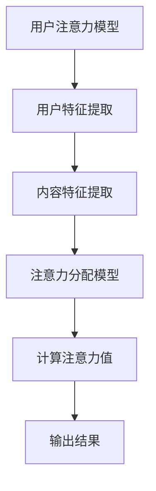

                 

# 《注意力经济与在线社区建设策略：吸引并留住忠实的粉丝和受众》

> 关键词：注意力经济、在线社区、用户画像、内容策略、用户留存、社群管理

摘要：本文将从注意力经济的理论出发，深入探讨在线社区建设中的核心策略，包括用户分析与画像、内容策略与流量运营、用户留存与社群管理等方面。通过实际案例分析，本文旨在为技术从业者和在线社区管理者提供实用的指导，帮助他们在激烈的市场竞争中吸引并留住忠实的粉丝和受众。

## 第一部分：理论基础

### 第1章：注意力经济概述

#### 1.1 注意力经济的起源与发展

注意力经济最早可以追溯到20世纪末期，由广告经济学家乔治·莫里斯（George M. Lowenstein）首次提出。他认为，在信息过载的时代，人们的注意力成为了一种稀缺资源，企业和品牌需要通过有效的策略来吸引和维持消费者的注意力。随着互联网和社交媒体的兴起，注意力经济逐渐成为一个重要的研究领域。

注意力经济强调的是在信息爆炸的时代，用户的注意力分配具有一定的有限性，因此谁能更好地吸引和保持用户的注意力，谁就能在市场竞争中占据优势。在这个背景下，在线社区作为一种新型的信息传播和组织形式，成为了注意力经济的重要载体。

#### 1.2 注意力经济的核心概念

注意力经济主要涉及以下几个核心概念：

1. **注意力稀缺性**：在信息爆炸的时代，用户的注意力是有限的，这导致了一个事实，即注意力成为一种稀缺资源。
2. **注意力分配**：用户如何将有限的注意力分配到不同的信息源和信息内容上，这是注意力经济研究的核心问题。
3. **注意力价值**：注意力不仅是稀缺的，也是具有价值的，因为用户愿意为其关注的内容和服务支付相应的代价。
4. **注意力转移**：通过有效的策略和手段，将用户的注意力从其他信息源转移到自己的平台或品牌上。

#### 1.3 注意力经济与在线社区的关系

在线社区作为注意力经济的重要载体，具有以下几个方面的关系：

1. **用户注意力的集中**：在线社区通过提供有价值的内容和服务，能够有效地集中用户的注意力，形成社区的核心用户群体。
2. **用户注意力的维持**：在线社区需要通过持续的内容更新和服务优化，维持用户的持续关注，防止注意力流失。
3. **用户注意力的商业化**：在线社区可以通过广告、会员服务、内容付费等方式，将用户注意力转化为商业价值。
4. **用户注意力的互动**：在线社区提供了一个用户互动的平台，通过用户之间的互动和反馈，进一步强化用户的注意力和忠诚度。

### 第2章：在线社区建设的基本原理

#### 2.1 在线社区的定义与类型

在线社区是指通过互联网平台，用户在特定主题或兴趣下，进行互动交流、共享信息和资源的虚拟社群。根据不同的分类标准，在线社区可以分为以下几种类型：

1. **按主题分类**：如技术社区、生活社区、游戏社区等。
2. **按用户群体分类**：如企业内部社区、行业社区、兴趣社区等。
3. **按运营模式分类**：如封闭式社区、开放式社区、平台化社区等。

#### 2.2 在线社区的核心要素

一个成功的在线社区需要具备以下几个核心要素：

1. **用户基础**：拥有一定数量的活跃用户是社区发展的基础。
2. **内容质量**：高质量的内容是吸引和留住用户的关键。
3. **互动机制**：良好的互动机制能够促进用户之间的交流和参与。
4. **社区氛围**：积极的社区氛围能够提升用户的归属感和满意度。
5. **运营团队**：专业的运营团队能够有效地管理和维护社区。

#### 2.3 在线社区建设的基本策略

在线社区的建设需要制定一系列的基本策略，包括以下几个方面：

1. **定位明确**：明确社区的主题和目标用户群体，确保社区定位的精准性。
2. **内容规划**：制定内容规划，包括内容的类型、频率和质量，确保内容能够持续吸引用户。
3. **用户互动**：设计互动机制，如评论、点赞、分享等，促进用户之间的交流和参与。
4. **社区运营**：定期举办线上线下活动，提升用户的参与度和活跃度。
5. **数据分析**：通过数据分析，了解用户行为和需求，不断优化社区运营策略。

### 第3章：注意力经济的核心算法原理

#### 3.1 注意力经济的算法原理概述

注意力经济的核心算法原理主要包括以下几个方面：

1. **注意力分配算法**：用于优化用户注意力的分配，使有限的注意力得到最大化利用。
2. **注意力维持算法**：用于维持用户对社区内容的持续关注，防止注意力流失。
3. **用户行为预测算法**：用于预测用户的行为和需求，提供个性化的内容和服务。

#### 3.2 注意力分配算法

注意力分配算法主要涉及以下几个关键步骤：

1. **用户特征提取**：通过数据收集和用户画像技术，提取用户的基本特征和兴趣偏好。
2. **内容特征提取**：对社区中的内容进行特征提取，包括内容的类型、标签、热度等。
3. **注意力分配模型**：建立用户注意力分配模型，将用户特征与内容特征进行匹配，计算每个内容的注意力权重。

#### 3.3 注意力维持算法

注意力维持算法的核心目标是保持用户对社区内容的持续关注，防止注意力流失。主要方法包括：

1. **内容更新策略**：定期更新高质量的内容，保持社区的新鲜感和吸引力。
2. **用户参与策略**：设计互动机制，鼓励用户参与社区讨论和互动，提高用户粘性。
3. **个性化推荐**：根据用户的行为和偏好，提供个性化的内容和推荐，满足用户的需求。

### 第4章：数学模型与数学公式

#### 4.1 基本数学模型介绍

在注意力经济中，常用的数学模型包括：

1. **用户注意力模型**：用于描述用户对内容的注意力分配情况，通常采用概率模型或神经网络模型。
2. **内容推荐模型**：用于根据用户行为和偏好，推荐用户感兴趣的内容，通常采用协同过滤或基于内容的推荐算法。
3. **用户留存模型**：用于预测用户在社区中的留存情况，通常采用时间序列模型或分类模型。

#### 4.2 数学公式应用与详细讲解

在本节中，我们将介绍几个关键数学公式的应用和详细讲解。

1. **用户注意力模型**

   $$ a_i = \sigma(\beta_0 + \beta_1 x_{i1} + \beta_2 x_{i2} + ... + \beta_n x_{in}) $$

   其中，$a_i$ 表示用户对第 $i$ 个内容的注意力值，$x_{ij}$ 表示第 $i$ 个用户在第 $j$ 个特征上的取值，$\sigma$ 表示 sigmoid 函数。

2. **内容推荐模型**

   $$ r_{ij} = \sum_{k=1}^{m} w_{ik} \cdot h_j $$

   其中，$r_{ij}$ 表示用户 $i$ 对内容 $j$ 的推荐得分，$w_{ik}$ 表示用户 $i$ 对特征 $k$ 的权重，$h_j$ 表示内容 $j$ 的特征向量。

3. **用户留存模型**

   $$ P_{i,t} = \frac{1}{1 + e^{-(\theta_0 + \theta_1 \cdot t + \theta_2 \cdot \log(P_{i,t-1}))}} $$

   其中，$P_{i,t}$ 表示用户 $i$ 在第 $t$ 天的留存概率，$\theta_0$、$\theta_1$、$\theta_2$ 表示模型参数。

#### 4.3 数学公式举例说明

以下是一个用户注意力模型的示例：

### 第二部分：实战应用

#### 第5章：在线社区的用户分析与画像

#### 5.1 用户行为分析

用户行为分析是在线社区建设中的重要环节，通过分析用户的行为模式，我们可以更好地理解用户需求，优化社区运营策略。

1. **用户访问行为分析**：包括用户访问频次、访问时长、访问页面等，帮助我们了解用户的活跃程度和兴趣点。
2. **用户互动行为分析**：包括用户在社区中的评论、点赞、分享等行为，帮助我们了解用户的参与度和社交活跃度。
3. **用户转化行为分析**：包括用户在社区中的购买、注册、订阅等行为，帮助我们了解用户的消费行为和潜在价值。

#### 5.2 用户画像构建

用户画像是对用户特征的综合描述，通过构建用户画像，我们可以更精准地定位用户群体，提供个性化的服务和内容。

1. **基本特征**：包括用户的性别、年龄、职业、地域等基本信息。
2. **兴趣特征**：包括用户在社区中的兴趣点、关注的主题、喜欢的内容类型等。
3. **行为特征**：包括用户在社区中的行为模式、偏好设置、互动频率等。

#### 5.3 用户画像应用场景

用户画像的应用场景非常广泛，以下是一些常见的应用场景：

1. **内容推荐**：根据用户画像，推荐用户感兴趣的内容，提高用户粘性。
2. **个性化广告**：根据用户画像，精准投放广告，提高广告效果。
3. **社群运营**：根据用户画像，设计针对性的社群运营活动，提升用户参与度。

#### 第6章：内容策略与流量运营

#### 6.1 内容策略制定

内容策略是社区运营的核心，一个成功的内容策略需要考虑以下几个方面：

1. **内容定位**：明确社区的主题和目标用户群体，确保内容与用户需求匹配。
2. **内容规划**：制定内容发布的频率、类型和主题，确保内容持续性和多样性。
3. **内容质量**：保证内容的专业性、原创性和实用性，提升用户满意度。

#### 6.2 流量运营方法

流量运营是社区增长的关键，以下是一些常见的流量运营方法：

1. **SEO优化**：通过优化网站结构和内容，提高在搜索引擎中的排名，吸引更多自然流量。
2. **社交媒体推广**：利用社交媒体平台，如微博、微信、抖音等，进行内容推广，扩大社区影响力。
3. **合作推广**：与其他社区或品牌进行合作，通过互推或联合营销，提高流量曝光。

#### 6.3 用户参与度提升策略

用户参与度是衡量社区活跃度的重要指标，以下是一些提升用户参与度的策略：

1. **互动机制**：设计评论、点赞、分享等互动机制，鼓励用户参与社区讨论。
2. **激励机制**：通过积分、奖励等机制，激励用户积极参与社区活动。
3. **主题活动**：定期举办主题活动，提高用户的参与热情和积极性。

#### 第7章：用户留存与社群管理

#### 7.1 用户留存策略

用户留存是社区运营的重要目标，以下是一些提高用户留存率的策略：

1. **个性化服务**：根据用户画像，提供个性化的内容和推荐，满足用户的个性化需求。
2. **用户反馈**：积极收集用户反馈，及时解决问题，提升用户满意度。
3. **社群运营**：建立社群，提供用户交流和互动的平台，增强用户的归属感和忠诚度。

#### 7.2 社群管理方法

社群管理是保持社群活力和用户参与度的重要环节，以下是一些有效的社群管理方法：

1. **角色分工**：明确社群管理团队成员的职责，确保社群运营的有序进行。
2. **内容审核**：对社群内容进行审核，确保内容的质量和合规性。
3. **互动引导**：通过发起话题、组织活动等方式，引导用户参与社群互动。

#### 7.3 社群运营案例分析

以下是一个成功的社群运营案例：

- **案例介绍**：某技术社区通过定期举办线上技术沙龙，邀请行业专家进行分享，吸引了大量技术爱好者的参与。
- **案例分析**：通过活动内容的精心策划和专家资源的引入，社区成功提升了用户活跃度和满意度，进一步增强了社区的凝聚力。
- **案例启示**：社群运营需要注重内容质量和用户互动，通过活动策划和专家分享等方式，提高用户的参与度和忠诚度。

#### 第8章：案例分析

#### 8.1 案例介绍

本节将介绍两个在线社区的成功案例，通过分析这些案例，我们可以了解到注意力经济在在线社区建设中的应用和效果。

- **案例一**：某知名问答社区通过引入用户行为分析技术和内容推荐算法，实现了用户关注度和参与度的显著提升。
- **案例二**：某垂直类社交平台通过精准的用户画像和个性化推荐，实现了用户留存率和活跃度的持续增长。

#### 8.2 案例分析

1. **案例一**：该问答社区通过用户行为分析技术，深入了解用户的兴趣和需求，从而提供个性化的内容推荐。此外，社区还通过活动激励和积分制度，鼓励用户积极参与社区互动。这些措施使得社区的用户留存率和活跃度得到了显著提升。

2. **案例二**：该社交平台通过精准的用户画像和个性化推荐，将用户感兴趣的内容推送给他们，从而提高了用户的参与度和满意度。此外，平台还通过社群管理和活动策划，增强了用户的归属感和忠诚度。

#### 8.3 案例启示

通过对以上两个案例的分析，我们可以得到以下启示：

1. **用户行为分析**：通过用户行为分析，深入了解用户需求和兴趣，为内容推荐和运营策略提供依据。
2. **个性化推荐**：个性化推荐能够提高用户满意度和参与度，进而提升社区的用户留存率和活跃度。
3. **社群管理和活动策划**：有效的社群管理和活动策划能够增强用户的归属感和忠诚度，进一步促进社区的发展。

#### 第9章：未来展望与趋势

#### 9.1 注意力经济的未来发展趋势

随着互联网和人工智能技术的不断发展，注意力经济在未来有望呈现以下发展趋势：

1. **个性化推荐**：随着数据挖掘和机器学习技术的进步，个性化推荐将变得更加精准和高效，进一步提升用户体验。
2. **跨平台整合**：多平台整合将使内容传播更加广泛，用户注意力分配更加灵活。
3. **区块链技术**：区块链技术在注意力经济中的应用，有望实现用户注意力的价值化和公平分配。

#### 9.2 在线社区建设的未来方向

在线社区建设的未来方向主要包括：

1. **智能化管理**：利用人工智能和大数据技术，实现社区的智能化管理和运营。
2. **多元化内容**：提供多元化的内容形式，满足用户多样化的需求。
3. **社交化互动**：加强用户之间的互动，提升社区的用户参与度和活跃度。

#### 9.3 技术与商业融合的新模式

随着技术和商业的深度融合，未来的在线社区建设将呈现以下新模式：

1. **知识付费**：用户愿意为高质量的内容和服务付费，社区通过知识付费实现商业变现。
2. **广告合作**：社区与品牌广告合作，实现广告收入。
3. **电商业务**：社区拓展电商业务，通过商品销售实现商业价值。

### 附录

#### 附录 A：相关工具与资源

A.1 在线社区建设工具介绍

- **Discuz**：一款功能强大的社区论坛系统，支持各种主题论坛的建设。
- **WordPress**：一款流行的内容管理系统，适用于搭建个人博客、社区网站等。
- **TaoBao**：一款支持社交化电商的社区平台，结合社区和电商功能。

A.2 注意力经济相关论文与书籍推荐

- **《注意力经济：信息过载时代的竞争战略》**
- **《网络营销：从注意力到转化》**
- **《用户行为分析：方法与实践》**

A.3 在线社区建设实战案例分析

- **知乎**：通过用户行为分析和个性化推荐，实现了用户留存率和活跃度的提升。
- **豆瓣**：通过社群管理和活动策划，增强了用户的归属感和忠诚度。
- **小红书**：通过内容推荐和社交互动，吸引了大量年轻用户，实现了社区的快速增长。

