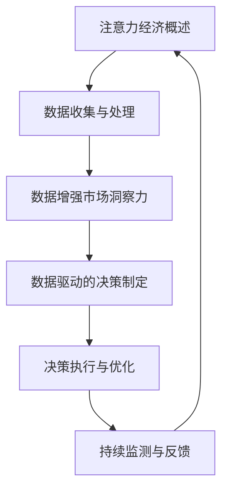

                 

# 文章标题

《注意力经济与数据驱动的决策制定：利用数据增强市场洞察力》

> 关键词：注意力经济、数据驱动、市场洞察力、决策制定、数据分析

> 摘要：本文深入探讨了注意力经济与数据驱动的决策制定之间的关系，分析了注意力经济的定义、理论基础和市场应用，详细阐述了数据驱动的决策制定原理、模型和案例分析，并探讨了如何利用数据增强市场洞察力。文章旨在为读者提供一种全面、系统的理解，帮助他们在复杂的商业环境中做出更加明智的决策。

---

### 第一部分：注意力经济的概述与理论基础

#### 第1章：注意力经济的起源与发展

##### 1.1 注意力经济的定义与核心概念

注意力经济，是21世纪随着互联网和数字媒体发展而产生的一个新概念。它指的是人们对于信息的关注和投入的精力，这些关注和精力作为一种资源被市场所利用，形成了独特的经济现象。注意力经济的核心概念包括注意力的本质、供给与需求、资源配置等。

注意力的本质可以理解为人们对信息的接收、处理和反馈。在经济学中，注意力被视为一种稀缺资源，其价值在于它能够直接影响信息的传播和消费。

##### 1.1.1 注意力的本质与经济学应用

在经济学中，注意力具有以下几个重要特征：

1. **稀缺性**：人们的注意力是有限的，无法无限量地集中。
2. **竞争性**：多个信息争夺用户的注意力，竞争越激烈，单个信息的获取成本越高。
3. **价值性**：有效的注意力能够转化为商业价值，如广告收入、产品销售等。

##### 1.1.2 注意力经济的形成因素

注意力经济的形成主要受到以下因素的影响：

1. **互联网的普及**：互联网使得信息传播速度加快，用户能够接触到海量的信息。
2. **数字媒体的发展**：社交媒体、短视频平台等数字媒体形式，增强了信息的吸引力。
3. **商业模式的创新**：广告、内容付费、知识付费等商业模式，利用了用户的注意力资源。

##### 1.1.3 注意力经济与传统经济学的区别

注意力经济与传统经济学有显著的区别：

1. **资源类型不同**：传统经济学关注的是物质资源，而注意力经济关注的是信息资源。
2. **价值创造方式不同**：传统经济学强调物质生产，而注意力经济强调信息传播和用户体验。
3. **决策制定依据不同**：传统经济学依赖成本-收益分析，而注意力经济更依赖于用户注意力数据。

##### 1.2 注意力市场的形成机制

注意力市场的形成机制主要涉及注意力供给、注意力需求以及注意力资源配置。

1. **注意力供给**：供给方主要包括内容创造者、广告商和平台运营商等，他们提供各种形式的信息来吸引用户的注意力。
2. **注意力需求**：需求方主要是用户，他们通过浏览、观看、点击等方式消耗注意力资源。
3. **注意力资源配置**：市场机制通过价格信号和供需关系，调节注意力资源的分配。

##### 1.2.1 注意力供给与需求

注意力供给与需求的关系决定了市场价格。供给过剩时，价格下降，需求上升；供给不足时，价格上涨，需求下降。市场机制通过调节价格，达到供给与需求的平衡。

##### 1.2.2 注意力资源配置的优化

注意力资源配置的优化目标是最大化整体效益。这可以通过以下几个方面实现：

1. **差异化定价**：根据不同用户和内容的吸引力，实行不同的价格策略。
2. **个性化推荐**：通过大数据分析，为用户推荐其可能感兴趣的内容，提高注意力资源的利用率。
3. **平台协同**：不同平台之间通过数据共享和协同运营，提高注意力资源的整体效益。

##### 1.2.3 注意力市场的调节与平衡

注意力市场的调节与平衡主要通过市场机制和政府干预实现。

1. **市场机制**：市场机制通过价格信号、供需关系和竞争机制，自动调节注意力资源的分配。
2. **政府干预**：政府通过法律法规、政策引导和市场监管，维护注意力市场的公平和秩序。

##### 1.3 注意力经济的案例分析

注意力经济在数字广告、社交媒体、内容创作与分发平台、知识付费与在线教育等领域有着广泛的应用。

1. **数字广告与社交媒体**：广告商通过购买社交媒体平台的广告位，吸引用户的注意力，实现品牌推广和销售转化。
2. **内容创作与分发平台**：平台通过用户流量和内容变现，形成了强大的注意力经济生态系统。
3. **知识付费与在线教育**：用户通过支付费用，获取专业知识和技能，实现了对注意力的投资。

---

#### 第2章：数据驱动的决策制定基础

##### 2.1 数据驱动的决策制定原理

数据驱动的决策制定是一种以数据为核心，利用数据分析技术进行决策的方法。它通过收集、处理和分析数据，为决策者提供科学的依据，从而提高决策的准确性和效率。

##### 2.1.1 数据驱动决策的流程

数据驱动决策的流程主要包括以下几个步骤：

1. **数据收集**：通过内部和外部渠道收集数据，如用户行为数据、市场数据等。
2. **数据预处理**：对收集到的数据进行清洗、处理和整合，使其适合分析。
3. **数据分析**：使用数据分析技术和工具，对预处理后的数据进行探索性分析和预测性分析。
4. **决策制定**：根据分析结果，制定相应的决策策略。
5. **决策执行**：将决策策略付诸实施，并对执行效果进行监控和评估。

##### 2.1.2 数据质量与决策效率的关系

数据质量是数据驱动决策的关键。高质量的数据可以提供准确的决策依据，提高决策的效率和准确性。反之，低质量的数据会导致错误的决策和资源浪费。

数据质量主要体现在以下几个方面：

1. **准确性**：数据应真实、可靠，没有错误或误导信息。
2. **完整性**：数据应包含所有必要的变量和观测值，没有缺失。
3. **一致性**：数据应在不同时间、不同来源之间保持一致性。
4. **及时性**：数据应在决策所需的时间内更新。

##### 2.1.3 数据分析与预测技术概述

数据分析与预测技术是数据驱动决策的核心。常见的数据分析技术包括：

1. **描述性分析**：用于总结和描述数据的基本特征，如平均值、中位数、标准差等。
2. **探索性分析**：通过可视化、聚类等方法，深入挖掘数据中的模式和关系。
3. **预测性分析**：使用统计学和机器学习技术，对未来的趋势和可能性进行预测。

常见的预测技术包括：

1. **回归分析**：用于预测数值型变量的变化。
2. **分类分析**：用于预测离散型变量的分类结果。
3. **时间序列分析**：用于预测时间序列数据的趋势和周期性。

##### 2.2 数据驱动的决策模型

数据驱动的决策模型主要包括决策树、神经网络、强化学习等。

2.2.1 决策树与回归模型

决策树是一种基于特征和阈值进行决策的模型。它通过将数据集划分成多个子集，每个子集对应一个决策规则。回归模型则是用于预测数值型变量的模型，如线性回归、多项式回归等。

决策树模型的伪代码如下：

```python
def decision_tree(data, features):
    if is纯净数据集(data):
        return 类别(data)
    else:
        best_split = 找到最佳分割点(data, features)
        左子树 = decision_tree(分割数据集(data, best_split), features)
        右子树 = decision_tree(分割数据集(data, best_split), features)
        return {"特征": best_split["特征"], "阈值": best_split["阈值"], "左子树": 左子树, "右子树": 右子树}
```

2.2.2 神经网络与深度学习模型

神经网络是一种模仿生物神经系统的计算模型，通过多层神经元的相互连接和激活函数，实现复杂的数据处理和模式识别。深度学习则是基于神经网络的一种更深的网络结构，能够处理大量复杂数据。

神经网络的基本结构包括输入层、隐藏层和输出层。每个神经元接收前一层神经元的输出，通过激活函数处理后，输出到下一层。

神经网络模型的伪代码如下：

```python
def neural_network(data, layers, activation_function):
    for layer in layers:
        data = layer.forward(data, activation_function)
    return layer.output
```

2.2.3 强化学习与策略优化

强化学习是一种通过试错和反馈来学习最优策略的模型。它通过不断调整策略参数，使得策略能够在环境中的每个状态下最大化奖励。

强化学习的基本结构包括环境、策略、状态和动作。策略根据当前状态选择动作，环境根据动作返回状态和奖励。

强化学习模型的伪代码如下：

```python
def reinforce_learning(data, policy, reward_function):
    for state in data:
        action = policy.select_action(state)
        next_state, reward = environment.step(state, action)
        policy.update_parameters(state, action, next_state, reward)
    return policy
```

##### 2.3 数据驱动的决策案例分析

数据驱动的决策制定在零售行业、金融行业和制造业等领域有着广泛的应用。

2.3.1 零售行业的库存管理

零售行业通过数据驱动的决策制定，可以优化库存管理，降低库存成本，提高库存周转率。具体方法包括：

1. **需求预测**：使用时间序列分析、回归分析等方法，预测未来某一时间段内的需求量。
2. **库存优化**：根据需求预测结果，调整库存策略，如增加或减少库存量。
3. **库存监控**：实时监控库存状态，及时调整库存策略。

2.3.2 金融行业的风险控制

金融行业通过数据驱动的决策制定，可以识别和评估风险，制定相应的风险控制策略。具体方法包括：

1. **信用评估**：使用回归分析、逻辑回归等方法，评估客户的信用风险。
2. **市场监控**：实时监控市场变化，预测市场风险。
3. **风险控制**：根据风险预测结果，调整投资组合和风险控制策略。

2.3.3 制造业的供应链优化

制造业通过数据驱动的决策制定，可以优化供应链管理，提高供应链效率。具体方法包括：

1. **需求预测**：使用时间序列分析、回归分析等方法，预测未来某一时间段内的需求量。
2. **供应链规划**：根据需求预测结果，调整生产计划和采购计划。
3. **库存管理**：优化库存策略，降低库存成本。

---

### 第二部分：数据驱动的决策制定

#### 第3章：数据收集与处理

##### 3.1 数据收集的渠道与方法

数据收集是数据驱动决策的重要前提，数据的质量和完整性直接影响到决策的准确性。以下是数据收集的主要渠道和方法：

1. **内部数据源**：包括公司内部业务系统、数据库、日志文件等。这些数据通常比较完整、可靠，是数据驱动的决策制定的重要基础。
2. **外部数据源**：包括公开数据集、第三方数据提供商、社交媒体、API接口等。这些数据通常具有多样性和时效性，可以帮助补充内部数据，提高决策的全面性。
3. **数据爬取**：通过编写爬虫程序，从互联网上获取公开数据。这种方法适用于获取大量、结构化的数据，如电商交易数据、社交媒体数据等。
4. **API接口**：通过访问第三方数据接口，获取数据。这种方法适用于获取实时、高质量的数据，如天气数据、金融数据等。

##### 3.2 数据清洗与预处理

数据清洗与预处理是数据驱动决策的重要步骤，旨在提高数据的质量和完整性，为后续分析奠定基础。以下是数据清洗与预处理的常见方法和步骤：

1. **缺失值处理**：缺失值处理方法包括删除缺失值、填充缺失值等。删除缺失值适用于缺失值比例较高的数据集，而填充缺失值适用于缺失值比例较低的数据集。
2. **异常值检测与处理**：异常值可能对数据分析结果产生严重影响，因此需要对其进行检测和处理。常见的异常值处理方法包括删除异常值、替换异常值、调整异常值等。
3. **数据标准化与归一化**：标准化与归一化是将数据转化为相同量纲，以消除不同特征之间的尺度差异。常见的标准化方法包括Z-score标准化、Min-Max标准化等。
4. **特征工程**：特征工程是通过构造、选择和转换特征，提高数据分析模型的性能。常见的方法包括特征提取、特征选择、特征组合等。

##### 3.3 数据可视化与分析

数据可视化是数据驱动决策的重要手段，通过图形化展示数据，可以帮助我们直观地理解数据分布、趋势和关系。以下是数据可视化与分析的常见方法和工具：

1. **基本数据可视化方法**：包括柱状图、折线图、饼图、散点图等。这些图表可以用于展示数据的基本统计特征和分布情况。
2. **高级数据可视化工具**：如D3.js、Plotly、Tableau等。这些工具提供了丰富的可视化功能，可以满足复杂数据分析和展示的需求。
3. **数据分析的基本步骤**：包括数据准备、数据探索、数据分析、结果验证等。数据准备和探索是数据分析的基础，数据分析和结果验证则是数据分析的核心。

---

### 第三部分：数据增强市场洞察力

#### 第4章：市场分析与消费者行为预测

##### 4.1 市场分析的方法与工具

市场分析是数据驱动决策的重要组成部分，通过分析市场趋势、竞争对手和市场定位，可以帮助企业制定有效的市场策略。以下是市场分析的方法与工具：

1. **市场细分与目标市场定位**：市场细分是将市场划分为若干个子市场，以更好地满足不同消费者的需求。目标市场定位则是确定企业要服务的市场细分群体，制定针对性的市场策略。
2. **竞争分析**：竞争分析是评估企业在市场中的竞争地位和竞争优势的过程。常见的方法包括SWOT分析、波特五力模型等。
3. **市场趋势预测**：市场趋势预测是预测市场未来的发展趋势和变化，为企业制定长期战略提供依据。常见的方法包括时间序列分析、回归分析、机器学习等。

##### 4.2 消费者行为分析

消费者行为分析是理解消费者购买行为、决策过程和需求的关键，通过分析消费者行为数据，可以帮助企业制定更加精准的营销策略。以下是消费者行为分析的方法与工具：

1. **消费者决策过程**：消费者决策过程包括需求识别、信息搜索、评估备选方案、购买决策和购后行为。分析消费者决策过程可以帮助企业了解消费者的需求和痛点，优化产品和服务。
2. **消费者行为数据收集与处理**：消费者行为数据包括用户浏览、点击、购买等行为数据。通过数据收集与处理，可以将原始数据转化为有用的信息，用于消费者行为分析。
3. **消费者行为预测模型**：消费者行为预测模型是基于历史数据，预测消费者未来行为的方法。常见的方法包括回归分析、决策树、神经网络等。

##### 4.3 案例研究：利用数据预测市场需求

以下是一个利用数据预测市场需求的案例研究：

1. **数据收集**：从电商平台上收集用户浏览、点击、购买等行为数据。
2. **数据预处理**：对收集到的数据进行清洗、处理和整合，确保数据的质量和完整性。
3. **特征工程**：根据需求预测目标，提取有用的特征，如用户浏览时长、点击次数、购买频率等。
4. **模型训练**：使用回归分析、决策树等模型，对特征数据进行训练，预测未来某一时间段内的市场需求。
5. **模型评估**：使用交叉验证、均方误差等指标，评估模型的预测性能。
6. **决策制定**：根据预测结果，调整库存、营销策略等，以应对市场变化。

通过上述案例，我们可以看到数据增强市场洞察力的重要性。利用数据驱动的决策制定方法，企业可以更加精准地预测市场需求，优化产品和服务，提高市场竞争力。

---

### 第五部分：实践与优化

#### 第5章：数据驱动的营销策略

##### 5.1 数据驱动的营销策略制定

数据驱动的营销策略制定是基于消费者行为数据和市场趋势预测，制定有效的营销策略，提高营销效果。以下是数据驱动的营销策略制定的方法与步骤：

1. **营销目标与指标**：明确营销目标，如提高品牌知名度、增加销售额、提升用户忠诚度等。制定相应的指标，如点击率、转化率、用户留存率等，用于衡量营销效果。
2. **营销组合策略**：根据营销目标，制定广告、促销、公关等营销组合策略。使用数据驱动的决策制定方法，优化营销组合策略，提高营销效果。
3. **数据驱动的营销优化**：通过数据分析，不断优化营销策略，提高营销效果。例如，通过A/B测试，比较不同营销策略的效果，选择最优策略。

##### 5.2 数据驱动的客户关系管理

数据驱动的客户关系管理是基于客户数据，优化客户关系管理策略，提高客户满意度和忠诚度。以下是数据驱动的客户关系管理的方法与步骤：

1. **客户数据收集与整合**：收集客户的浏览、购买、互动等行为数据，并将其整合到一个统一的客户数据平台中。
2. **客户细分与个性化营销**：根据客户数据，将客户分为不同的细分群体，针对不同细分群体，制定个性化的营销策略。
3. **客户生命周期价值分析**：通过客户数据，分析客户的生命周期价值，识别高价值客户，制定针对性的营销策略。

##### 5.3 数据驱动的产品创新

数据驱动的产品创新是基于市场需求和消费者行为数据，优化产品设计、开发和创新。以下是数据驱动的产品创新的方法与步骤：

1. **产品需求预测与市场定位**：通过数据分析，预测市场需求，确定产品定位和目标市场。
2. **产品设计优化**：根据消费者行为数据，优化产品设计，提高用户体验。
3. **产品迭代与持续改进**：通过持续的数据分析，监控产品性能和市场反馈，不断优化产品，提高市场竞争力。

---

### 第六部分：风险与挑战

#### 第6章：数据驱动决策的风险与挑战

##### 6.1 数据质量的挑战

数据质量是数据驱动决策的关键因素，高质量的数据能够提供准确的决策依据，而低质量的数据则会导致错误的决策和资源浪费。以下是数据质量的一些挑战：

1. **数据准确性**：数据中的错误、误导信息和缺失值会影响数据的准确性，导致错误的决策。
2. **数据完整性**：数据缺失或不完整会限制数据分析的深度和广度，影响决策的全面性。
3. **数据一致性**：不同时间、不同来源的数据之间可能存在不一致性，影响数据的整合和分析。
4. **数据及时性**：过时的数据无法反映当前的市场环境和消费者需求，影响决策的及时性和准确性。

##### 6.2 数据隐私与伦理问题

数据隐私和伦理问题是数据驱动决策中不可忽视的重要方面。以下是一些数据隐私和伦理问题的挑战：

1. **数据收集与使用**：在收集和使用用户数据时，需要遵守相关的法律法规，确保用户的隐私权。
2. **数据共享与安全**：在数据共享和传输过程中，需要确保数据的安全性，防止数据泄露和滥用。
3. **数据责任与伦理**：数据驱动决策过程中，需要对数据的来源、处理和使用负责，遵守伦理规范，确保数据的公正和透明。

##### 6.3 数据驱动决策的可持续性

数据驱动决策的可持续性是确保数据驱动决策长期有效和可持续的关键。以下是一些数据驱动决策可持续性的挑战：

1. **数据策略与规划**：需要制定长期的数据策略和规划，确保数据资源的持续供应和质量。
2. **技术更新与升级**：随着技术的不断更新和发展，需要不断升级数据技术和工具，保持数据驱动决策的竞争力。
3. **人才培养与教育**：数据驱动决策需要专业的人才，需要加强对数据分析、数据科学等领域的教育和培训。

---

### 第七部分：结论与展望

#### 第7章：数据驱动决策的未来趋势与发展方向

##### 7.1 未来数据驱动决策的特点

未来数据驱动决策将具有以下特点：

1. **数据来源的多样化**：随着物联网、社交媒体等技术的发展，数据来源将越来越多样化，包括结构化数据、非结构化数据和实时数据等。
2. **决策算法的智能化**：随着人工智能和机器学习技术的进步，决策算法将更加智能化，能够自动学习和优化，提高决策的准确性和效率。
3. **决策过程的透明化**：随着数据隐私和伦理问题的日益关注，数据驱动决策的过程将更加透明，确保数据的公正和透明。

##### 7.2 数据驱动决策的应用前景

未来数据驱动决策将在更多行业和领域得到广泛应用，以下是一些应用前景：

1. **新兴行业的应用潜力**：如人工智能、区块链、物联网等领域，数据驱动决策将发挥重要作用，推动新兴行业的发展。
2. **跨行业的数据整合与协同**：通过跨行业的数据整合和协同，可以实现数据的最大化利用，提高决策的全面性和准确性。
3. **数据驱动决策在可持续发展中的作用**：数据驱动决策将在环境保护、资源管理、社会服务等领域发挥重要作用，推动可持续发展。

##### 7.3 未来展望与挑战

未来展望方面，数据驱动决策将继续发挥重要作用，推动各行业的发展和进步。然而，也面临以下挑战：

1. **技术进步与数据驱动决策的关系**：随着技术的不断进步，数据驱动决策的方法和工具将不断更新和升级，需要适应新的技术环境。
2. **数据驱动决策与社会影响的平衡**：数据驱动决策在提高效率的同时，也需要关注社会影响，确保数据驱动决策的公平和正义。
3. **数据驱动决策的教育与人才培养**：随着数据驱动决策的重要性日益凸显，需要加强数据驱动决策的教育和人才培养，培养具备数据分析能力和决策能力的人才。

---

#### 附录

##### 附录A：数据驱动决策工具与资源

A.1 数据分析工具介绍

数据分析工具是数据驱动决策的关键，以下是常见的数据分析工具及其特点：

1. **Pandas**：适用于数据清洗、数据转换和数据操作。具有丰富的数据操作函数和方便的数据结构。
2. **NumPy**：提供高效、灵活的数值计算。是Python中处理数值数据的基石。
3. **Matplotlib**：用于数据可视化。提供多种图表绘制方法，可以满足不同需求。
4. **Scikit-learn**：提供多种机器学习算法。是Python中进行数据挖掘和机器学习的重要库。

A.2 数据分析工具的使用方法

以下是常见数据分析工具的使用方法：

1. **Pandas**：使用`read_csv`方法加载数据，使用`dropna`方法处理缺失值，使用`select_dtypes`方法进行特征选择。
2. **NumPy**：使用`np.array`创建数组，使用`np.mean`、`np.std`等函数进行数值计算。
3. **Matplotlib**：使用`plt.scatter`方法绘制散点图，使用`plt.plot`方法绘制线图。
4. **Scikit-learn**：使用`LinearRegression`创建线性回归模型，使用`fit`方法训练模型，使用`predict`方法进行预测。

A.3 数据集与案例资源

以下是常见的数据集和案例资源：

1. **UCI Machine Learning Repository**：提供大量标准数据集，适用于数据分析和机器学习研究。
2. **Kaggle**：提供丰富的数据集和数据分析竞赛案例，可以锻炼数据分析和机器学习技能。
3. **GitHub**：可以找到许多数据分析项目和案例代码，可以参考和学习。

---

在本文中，我们系统地探讨了注意力经济与数据驱动的决策制定之间的关系，分析了注意力经济的定义、理论基础和市场应用，详细阐述了数据驱动的决策制定原理、模型和案例分析，并探讨了如何利用数据增强市场洞察力。文章旨在为读者提供一种全面、系统的理解，帮助他们在复杂的商业环境中做出更加明智的决策。

在未来的研究和实践中，我们需要继续关注注意力经济和数据驱动决策的最新发展趋势，探索新的应用场景和方法，提高数据驱动决策的准确性和效率。同时，我们也需要关注数据隐私和伦理问题，确保数据驱动决策的公平和正义。通过不断的努力和实践，我们有望在数据驱动的决策制定领域取得更大的突破。

---

作者：AI天才研究院/AI Genius Institute & 禅与计算机程序设计艺术 /Zen And The Art of Computer Programming

---

### Mermaid流程图：注意力经济与数据驱动决策流程图



### 核心算法原理讲解：决策树算法伪代码

```python
def decision_tree(data, features):
    """
    决策树算法伪代码
    :param data: 输入数据集
    :param features: 特征集合
    :return: 决策树模型
    """
    if is纯净数据集(data):
        return 类别(data)
    else:
        best_split = 找到最佳分割点(data, features)
        左子树 = decision_tree(分割数据集(data, best_split), features)
        右子树 = decision_tree(分割数据集(data, best_split), features)
        return {"特征": best_split["特征"], "阈值": best_split["阈值"], "左子树": 左子树, "右子树": 右子树}
```

### 数学模型与公式详细讲解：线性回归模型

$$
Y = \beta_0 + \beta_1X + \epsilon
$$

其中，$Y$ 是因变量，$X$ 是自变量，$\beta_0$ 是截距，$\beta_1$ 是斜率，$\epsilon$ 是误差项。

这个模型表示因变量 $Y$ 与自变量 $X$ 之间的关系，其中 $\beta_0$ 表示当 $X$ 为零时的 $Y$ 值，即截距；$\beta_1$ 表示自变量 $X$ 对因变量 $Y$ 的影响程度，即斜率；$\epsilon$ 表示随机误差项，代表模型无法解释的变异性。

在机器学习中，线性回归模型被广泛用于预测连续值变量，其目的是通过学习得到最佳拟合直线，从而预测新的数据点的值。

### 项目实战：数据分析工具应用案例

#### 数据分析工具应用案例：使用Python进行市场预测

##### 环境搭建

- 安装Python
- 安装Pandas、NumPy、Matplotlib、Scikit-learn等库

##### 数据加载

```python
import pandas as pd

data = pd.read_csv('market_data.csv')
```

##### 数据预处理

```python
# 缺失值处理
data = data.dropna()

# 特征工程
X = data[['feature1', 'feature2']]
y = data['target']
```

##### 模型训练

```python
from sklearn.linear_model import LinearRegression

model = LinearRegression()
model.fit(X, y)
```

##### 模型评估

```python
from sklearn.metrics import mean_squared_error

predictions = model.predict(X)
mse = mean_squared_error(y, predictions)
print(f'Mean Squared Error: {mse}')
```

##### 数据可视化

```python
import matplotlib.pyplot as plt

plt.scatter(X, y)
plt.plot(X, predictions, color='red')
plt.xlabel('Feature 1')
plt.ylabel('Target')
plt.title('Linear Regression Plot')
plt.show()
```

#### 代码解读与分析

```python
# 导入线性回归模型
from sklearn.linear_model import LinearRegression

# 创建线性回归模型对象
model = LinearRegression()

# 模型训练
model.fit(X_train, y_train)

# 模型预测
y_pred = model.predict(X_test)

# 模型评估
mse = mean_squared_error(y_test, y_pred)
print(f'Mean Squared Error: {mse}')

- `model.fit(X_train, y_train)`：使用训练集数据对模型进行训练，计算最佳参数。
- `model.predict(X_test)`：使用训练好的模型对测试集数据进行预测。
- `mean_squared_error(y_test, y_pred)`：计算预测结果与真实值的均方误差，用于评估模型的性能。

#### 数学公式：线性回归模型中的损失函数

$$
\text{Loss} = \frac{1}{2}\sum_{i=1}^{n} (y_i - \hat{y}_i)^2
$$`

其中，$y_i$ 是真实值，$\hat{y}_i$ 是预测值，$n$ 是样本数量。

这个损失函数用于衡量预测值与真实值之间的差异，其值越小，说明模型的预测效果越好。

### 常见数据分析工具对比

- **Pandas**：适用于数据清洗、数据转换和数据操作。
- **NumPy**：提供高效、灵活的数值计算。
- **Matplotlib**：用于数据可视化。
- **Scikit-learn**：提供多种机器学习算法。

### 数据分析工具的使用方法

- **Pandas**：使用`read_csv`方法加载数据，使用`dropna`方法处理缺失值，使用`select_dtypes`方法进行特征选择。
- **NumPy**：使用`np.array`创建数组，使用`np.mean`、`np.std`等函数进行数值计算。
- **Matplotlib**：使用`plt.scatter`方法绘制散点图，使用`plt.plot`方法绘制线图。
- **Scikit-learn**：使用`LinearRegression`创建线性回归模型，使用`fit`方法训练模型，使用`predict`方法进行预测。

### 数据集与案例资源

- **UCI Machine Learning Repository**：提供大量标准数据集。
- **Kaggle**：提供丰富的数据集和数据分析竞赛案例。
- **GitHub**：可以找到许多数据分析项目和案例代码。

