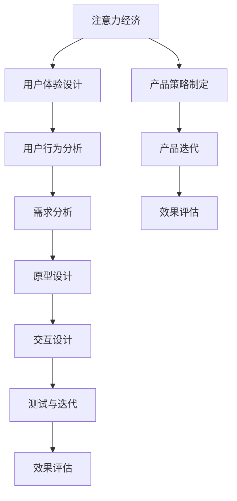

                 

### 文章标题
《注意力经济与用户体验优化技术：创建令人沉浸和上瘾的产品和服务》

### 文章关键词
注意力经济，用户体验优化，沉浸式体验，上瘾设计，产品策略，案例研究

### 文章摘要
本文深入探讨了注意力经济在数字时代的重要性以及如何通过用户体验优化技术创建令人沉浸和上瘾的产品和服务。文章首先介绍了注意力经济的核心概念和理论基础，然后详细阐述了用户体验优化技术，包括用户行为分析、注意力获取与保持策略、沉浸式体验设计以及上瘾设计原理。最后，通过实战案例展示了注意力经济与用户体验优化的综合应用，为产品设计和运营提供了实践指导。

### 目录大纲

## 第一部分：注意力经济基础

### 第1章：注意力经济的概述

#### 1.1 定义与起源

#### 1.2 注意力经济的核心概念

#### 1.3 注意力经济的重要性

### 第2章：注意力经济的理论基础

#### 2.1 心理学与经济学原理

#### 2.2 注意力资源的稀缺性

#### 2.3 注意力经济学的基本模型

## 第二部分：用户体验优化技术

### 第3章：用户体验设计基础

#### 3.1 用户行为分析

#### 3.2 用户体验要素

#### 3.3 用户体验设计流程

### 第4章：注意力获取与保持

#### 4.1 注意力获取策略

#### 4.2 注意力保持方法

#### 4.3 注意力分散与干扰的应对

### 第5章：沉浸式体验设计

#### 5.1 沉浸式体验的定义

#### 5.2 沉浸式体验的技术实现

#### 5.3 案例分析：沉浸式应用的设计与实践

### 第6章：上瘾设计原理与实践

#### 6.1 上瘾模型的构建

#### 6.2 用户体验与上瘾的关系

#### 6.3 上瘾设计案例研究

## 第三部分：注意力经济与用户体验优化实战

### 第7章：注意力经济在产品中的应用

#### 7.1 产品策略制定

#### 7.2 注意力经济在产品迭代中的应用

#### 7.3 案例分析：注意力经济在知名产品中的应用

### 第8章：用户体验优化的实战案例

#### 8.1 实战案例介绍

#### 8.2 案例分析与优化策略

#### 8.3 用户体验优化的效果评估

### 第9章：综合实践与未来展望

#### 9.1 综合实践策略

#### 9.2 注意力经济与用户体验优化的发展趋势

#### 9.3 未来展望：挑战与机遇

## 附录

### 附录A：注意力经济与用户体验优化技术资源

#### A.1 相关书籍与论文推荐

#### A.2 在线课程与学习资源

#### A.3 注意力经济与用户体验优化工具介绍

### 附录B：核心概念与联系

#### B.1 注意力经济与用户体验优化流程图

### 附录C：核心算法原理讲解

#### C.1 注意力分配算法伪代码

### 附录D：数学模型和数学公式

#### D.1 注意力经济模型公式

#### D.2 用户体验评估公式

### 附录E：项目实战

#### E.1 实战项目介绍

#### E.2 开发环境搭建

#### E.3 源代码实现与解读

#### E.4 代码解读与分析

### 附录F：参考文献

#### F.1 引用的书籍和论文

#### F.2 实战案例来源

#### F.3 注意力经济与用户体验优化相关网站与博客

---

### 第一部分：注意力经济基础

#### 第1章：注意力经济的概述

##### 1.1 定义与起源

在当今数字化时代，信息爆炸、网络普及、智能设备不断革新，人们对注意力的争夺愈发激烈。注意力经济作为新兴经济模式，应运而生。注意力经济，指的是在信息过载的环境中，人们将有限的注意力资源投入到有价值的产品或服务中，从而实现经济价值的过程。

这一概念最早由美国经济学家约翰·凯恩斯（John Keynes）在20世纪30年代提出，当时他强调注意力是一种稀缺资源，与劳动力和资本一样，具有经济价值。随着互联网和社交媒体的兴起，注意力经济得到了广泛应用和深入研究。注意力经济不仅关注个体对信息的关注程度，还涉及信息传递、平台竞争、用户行为等多个层面。

##### 1.2 注意力经济的核心概念

注意力经济涉及以下几个核心概念：

1. **注意力资源**：指个体在特定时间能够集中关注某一对象的注意能力。注意力资源的稀缺性使得争夺注意力成为一种经济行为。

2. **注意力市场**：类似于传统市场，注意力市场是指产品和服务的提供者通过创造价值来获取用户注意力的过程。在这个市场中，用户是注意力资源的提供者，而产品和服务则是注意力需求者。

3. **注意力价值**：指用户投入在特定产品或服务上的注意力所创造的经济价值。这种价值可以通过用户留存率、用户参与度、付费意愿等指标来衡量。

4. **注意力分配**：用户在多任务环境中如何分配注意力，取决于多种因素，包括任务的重要性、个人兴趣、外部干扰等。

##### 1.3 注意力经济的重要性

注意力经济的重要性体现在以下几个方面：

1. **用户需求驱动**：在注意力经济的背景下，用户需求成为产品设计和运营的核心。只有提供满足用户需求的产品和服务，才能获得用户的注意力，实现商业价值。

2. **市场竞争优势**：在信息爆炸的时代，如何有效吸引和保持用户的注意力成为企业竞争的关键。掌握注意力经济原理，可以帮助企业制定更具竞争力的策略。

3. **用户体验优化**：注意力经济强调用户注意力的重要性，因此，优化用户体验成为提升产品价值的关键。良好的用户体验可以增加用户粘性，提高用户满意度和忠诚度。

4. **商业模式创新**：注意力经济为企业提供了新的商业模式创新机会。例如，通过广告、订阅、付费内容等方式，企业可以创造新的收入来源。

#### 第2章：注意力经济的理论基础

##### 2.1 心理学与经济学原理

注意力经济不仅与经济学密切相关，还涉及到心理学原理。以下将分别介绍心理学和经济学对注意力经济的影响。

###### 2.1.1 心理学原理

心理学中的注意力理论为理解注意力经济提供了基础。其中，最具代表性的理论是认知资源理论（Cognitive Resource Theory）和信息加工理论（Information Processing Theory）。

1. **认知资源理论**：该理论认为，人类的认知能力是有限的，个体在处理信息时需要分配认知资源。当认知资源被某一任务占据时，其他任务的执行将受到影响。因此，注意力资源的稀缺性体现在个体无法同时处理大量信息。

2. **信息加工理论**：该理论强调，人们通过感官接收信息，经过认知处理，然后做出反应。注意力在这个过程中起着筛选和过滤信息的作用，只有与当前任务相关的信息才能进入认知处理阶段。

###### 2.1.2 经济学原理

经济学原理为理解注意力经济提供了理论框架。以下是一些关键经济学概念：

1. **机会成本**：在注意力经济中，用户将注意力投入到某一产品或服务，意味着放弃了其他可能的消费选择。因此，用户注意力的价值与其机会成本密切相关。

2. **边际效益**：边际效益是指每增加一个单位的产品或服务所带来的额外满足感。在注意力经济中，提升用户体验的边际效益对于保持用户注意力至关重要。

3. **供需关系**：在注意力市场上，供给和需求决定了注意力资源的分配。供给方面，用户愿意提供注意力的程度受多种因素影响，如个人兴趣、社会影响等。需求方面，产品和服务提供者通过创造价值来吸引和保持用户注意力。

##### 2.2 注意力资源的稀缺性

在信息过载的时代，注意力资源的稀缺性愈发明显。以下将分析注意力资源稀缺性的原因：

1. **信息爆炸**：互联网和社交媒体的兴起使得信息传播速度大大加快，用户面临的信息量呈指数级增长。这种信息过载导致用户难以筛选和处理大量信息，从而引发注意力的稀缺。

2. **多任务处理**：现代社会中，人们常常在多任务环境中工作或生活，如同时使用手机、电脑、电视等设备。这种多任务处理模式虽然提高了效率，但也分散了注意力，导致注意力资源不足。

3. **时间压力**：随着生活节奏的加快，用户的时间越来越宝贵。如何在有限的时间内获得最大化的效用，成为用户选择产品和服务的关键。这进一步加剧了注意力资源的稀缺性。

##### 2.3 注意力经济学的基本模型

为了更好地理解注意力经济，我们可以构建一个基本模型来分析注意力资源的分配和利用。

###### 2.3.1 注意力资源分配模型

注意力资源分配模型主要包括以下几个要素：

1. **用户**：作为注意力资源的提供者，用户的注意力分配受到多种因素的影响，如个人兴趣、社会影响、任务重要性等。

2. **产品和服务**：作为注意力需求者，产品和服务通过提供价值来吸引和保持用户注意力。价值的高低取决于产品功能、用户体验、个性化推荐等因素。

3. **注意力分配机制**：注意力分配机制决定了用户如何在不同产品和服务之间分配注意力资源。常见的分配机制包括价格机制、竞争机制、社会机制等。

4. **市场环境**：市场环境包括竞争状况、用户需求、法律法规等因素，这些因素共同影响着注意力资源的分配和利用。

###### 2.3.2 注意力价值评估模型

注意力价值评估模型旨在衡量用户投入在特定产品或服务上的注意力所创造的经济价值。以下是一个简化的注意力价值评估模型：

1. **用户收益**：用户在使用产品或服务过程中获得的直接和间接收益。直接收益包括付费收入、广告收益等，间接收益包括品牌认知、口碑传播等。

2. **用户注意力消耗时间**：用户投入在产品或服务上的时间。时间消耗的多少取决于产品功能、用户体验、用户需求等因素。

3. **注意力价值**：用户收益与用户注意力消耗时间的比值，即注意力价值。注意力价值越高，产品或服务的吸引力越大。

#### 注意力经济与用户体验优化

注意力经济和用户体验优化是相辅相成的两个概念。用户体验优化旨在提升用户在产品或服务中的满意度，从而增加用户投入的注意力资源。而注意力经济则通过理解用户注意力的分配和利用，为产品设计和运营提供指导。

以下将介绍注意力经济与用户体验优化的联系：

1. **用户需求驱动**：用户体验优化的核心是满足用户需求。注意力经济强调用户注意力的稀缺性，因此，理解用户需求成为优化用户体验的关键。

2. **注意力获取与保持**：注意力经济的核心目标是获取和保持用户注意力。用户体验优化通过提升产品功能、界面设计和交互体验，实现用户注意力的有效获取和保持。

3. **用户参与度**：用户体验优化不仅关注产品功能，还注重用户参与度。注意力经济通过提升用户参与度，增加用户在产品中的投入时间，实现用户注意力的长期保持。

4. **个性化推荐**：个性化推荐是注意力经济和用户体验优化的重要手段。通过分析用户行为数据，产品可以提供个性化的内容和服务，提高用户满意度和忠诚度。

综上所述，注意力经济与用户体验优化共同构建了现代产品设计和运营的理论基础。通过深入理解注意力经济原理，结合用户体验优化技术，企业可以更好地吸引和保持用户注意力，实现商业价值。

---

### 第二部分：用户体验优化技术

#### 第3章：用户体验设计基础

##### 3.1 用户行为分析

用户行为分析是用户体验优化的第一步，它涉及对用户在产品中的行为模式进行深入研究。通过用户行为分析，我们可以了解用户是如何与产品互动的，从而发现潜在的问题和改进点。以下是用户行为分析的关键步骤：

1. **数据收集**：通过网站分析工具（如Google Analytics）、用户调研（如访谈、问卷）等手段，收集用户行为数据。这些数据包括用户的访问路径、点击行为、浏览时间、退出率等。

2. **数据清洗**：对收集到的数据进行清洗，去除无效数据，确保数据的准确性和完整性。

3. **行为模式识别**：通过数据分析工具（如Excel、Python）对用户行为数据进行处理，识别用户的行为模式。例如，分析用户的访问路径，发现用户在某个环节的停留时间过长，可能表明界面设计存在问题。

4. **行为模式解释**：结合用户访谈和调研结果，对用户行为模式进行解释，找出背后的原因。例如，如果用户在某个环节的退出率很高，可能是由于操作过于复杂或功能不满足需求。

5. **行为模式应用**：将分析结果应用到产品设计和优化中，例如，根据用户的点击行为调整界面布局，提高用户操作的便捷性。

##### 3.2 用户体验要素

用户体验要素是指影响用户满意度和使用产品效果的关键因素。以下是用户体验的几个核心要素：

1. **功能性**：产品是否能够满足用户的核心需求，提供必要的功能。功能性是用户体验的基础，如果产品无法完成用户期望的任务，其他方面都无从谈起。

2. **易用性**：产品是否易于使用，用户是否能够快速上手。易用性直接影响用户对产品的满意度。一个易于使用的产品可以减少用户的学习成本，提高使用效率。

3. **可访问性**：产品是否能够适应各种用户群体，包括老年用户、残疾人士等。可访问性是保证产品包容性的重要因素，有助于提升用户体验。

4. **审美观**：产品的视觉设计是否符合用户的审美标准。视觉设计不仅影响用户的第一印象，还直接影响用户对产品的整体评价。

5. **交互性**：产品与用户之间的互动是否流畅自然。交互性包括按钮反馈、动画效果、语音提示等，它直接影响用户的操作体验。

6. **稳定性**：产品在运行过程中是否稳定，是否存在bug或崩溃。稳定性是用户长期使用产品的保障，如果产品频繁出现故障，会严重影响用户体验。

##### 3.3 用户体验设计流程

用户体验设计流程是一个系统性的过程，包括需求分析、原型设计、交互设计、测试与迭代等阶段。以下是用户体验设计的详细流程：

1. **需求分析**：了解用户需求，明确产品目标。需求分析可以通过用户访谈、问卷调查、用户调研等方式进行，收集用户的意见和建议。

2. **原型设计**：根据需求分析结果，创建产品原型。原型设计可以采用低 fidelity原型（如线框图）或高fidelity原型（如交互原型），以便快速验证和迭代。

3. **交互设计**：在原型基础上，设计产品的交互细节。交互设计包括按钮布局、动画效果、导航结构等，它直接影响用户的操作体验。

4. **测试与迭代**：对原型进行测试，收集用户反馈，并根据反馈进行迭代优化。测试可以采用A/B测试、用户测试等方式，以验证设计的有效性和可行性。

5. **发布与监控**：将优化后的产品发布给用户，并持续监控产品的运行状态和用户体验。通过数据分析和用户反馈，不断优化产品，提高用户体验。

#### 第4章：注意力获取与保持

##### 4.1 注意力获取策略

获取用户注意力是产品设计和运营的重要目标。以下是一些有效的注意力获取策略：

1. **引人入胜的内容**：提供有趣、有用、具有吸引力的内容，吸引用户的注意力。内容可以包括视频、图片、文章、故事等，形式多样化可以提高用户兴趣。

2. **个性化推荐**：通过分析用户行为数据，为用户提供个性化的推荐。个性化推荐可以基于用户历史行为、兴趣标签、地理位置等，提高内容的相关性和吸引力。

3. **互动设计**：设计互动性强的功能，鼓励用户参与和互动。例如，评论功能、点赞功能、分享功能等，可以提高用户粘性。

4. **限时促销**：通过限时促销、优惠券等方式，激发用户的购买欲望。限时促销可以制造紧迫感，促使用户快速决策。

5. **社交媒体推广**：利用社交媒体平台（如微信、微博、Facebook等）进行推广，扩大产品的知名度和影响力。社交媒体推广可以采用内容营销、广告投放等方式。

##### 4.2 注意力保持方法

保持用户注意力是长期运营的关键。以下是一些有效的注意力保持方法：

1. **持续更新**：定期发布新内容或更新功能，保持用户的兴趣和关注。更新可以包括文章、视频、产品功能等，形式多样可以提高用户参与度。

2. **用户互动**：通过评论、私信、社区论坛等方式，与用户进行互动。用户互动可以增加用户的归属感和参与度，提高用户留存率。

3. **激励机制**：设计激励机制，鼓励用户持续参与。激励机制可以包括积分、等级、奖励等，通过奖励用户的行为，增加用户粘性。

4. **个性化定制**：提供个性化定制功能，让用户可以根据自己的需求和喜好进行设置。个性化定制可以提高用户的满意度和使用频率。

5. **反馈机制**：建立有效的用户反馈机制，收集用户意见和建议，并及时回应。用户反馈可以帮助产品改进，提高用户体验。

##### 4.3 注意力分散与干扰的应对

在多任务环境中，用户容易受到外部干扰和分散注意力。以下是一些应对策略：

1. **简化界面设计**：减少界面上不必要的元素，简化用户操作流程。简化界面设计可以提高用户的集中度，减少干扰。

2. **时间管理**：合理安排内容推送时间，避免与用户其他活动冲突。例如，在工作时间推送重要通知，在休息时间推送娱乐内容。

3. **用户选择**：提供用户自主调整通知和推送设置的功能。用户可以根据自己的需求，选择接收哪些通知，从而减少干扰。

4. **内容筛选**：通过算法推荐，筛选出用户可能感兴趣的内容。内容筛选可以减少用户在大量信息中的筛选成本，提高注意力集中度。

5. **专注模式**：设计专注模式或无干扰模式，帮助用户屏蔽外部干扰。专注模式可以在特定时间段内屏蔽通知和推送，提高用户的工作效率。

---

### 第三部分：注意力经济与用户体验优化实战

#### 第7章：注意力经济在产品中的应用

##### 7.1 产品策略制定

在产品设计和运营中，注意力经济原理的应用至关重要。以下是如何制定注意力经济驱动的产品策略：

1. **市场定位**：明确目标用户群体，了解他们的兴趣和需求。通过市场调研和用户访谈，收集用户数据，为产品定位提供依据。

2. **内容规划**：根据用户兴趣，制定内容规划策略。内容可以是图文、视频、音频等多种形式，以满足不同用户的需求。同时，要保持内容的新鲜度和相关性。

3. **用户运营**：通过社交媒体、电子邮件、推送通知等方式，与用户保持互动。定期发布有价值的内容，增加用户粘性。

4. **广告投放**：利用注意力经济原理，进行精准广告投放。通过分析用户行为数据，了解用户兴趣和行为模式，进行定向广告投放，提高广告效果。

5. **产品迭代**：根据用户反馈和市场变化，不断优化产品功能和服务。通过迭代更新，提高用户满意度和忠诚度。

##### 7.2 注意力经济在产品迭代中的应用

在产品迭代过程中，注意力经济原理可以帮助产品经理和设计师更好地理解用户需求，优化产品设计。以下是如何在产品迭代中应用注意力经济：

1. **用户反馈**：通过用户调研、用户测试等方式，收集用户反馈。了解用户对当前产品的满意度和不满意度，发现产品改进的机会。

2. **数据分析**：利用数据分析工具，分析用户行为数据。了解用户的使用习惯、兴趣偏好等，为产品迭代提供数据支持。

3. **A/B测试**：通过A/B测试，比较不同设计方案的效果。例如，测试不同的界面布局、交互设计等，找出最优方案。

4. **迭代优化**：根据用户反馈和数据分析结果，对产品进行优化。不断迭代，提高产品的用户体验和用户满意度。

5. **市场测试**：在产品优化后，进行市场测试，验证新功能的可行性和用户接受度。通过市场测试，调整产品方向，确保产品符合市场需求。

##### 7.3 案例分析：注意力经济在知名产品中的应用

为了更好地理解注意力经济在产品中的应用，以下是一个案例分析：

**案例分析：抖音（TikTok）**

抖音是一款基于短视频分享的社交媒体应用，在全球范围内取得了巨大成功。以下是抖音如何运用注意力经济原理，吸引和保持用户注意力的：

1. **内容推荐**：抖音利用算法推荐，为用户推荐个性化内容。通过分析用户行为数据，了解用户兴趣和偏好，提供相关内容。

2. **互动设计**：抖音设计了多种互动功能，如点赞、评论、分享等，鼓励用户参与。互动设计提高了用户的参与度和粘性。

3. **用户激励**：抖音推出了“挑战赛”和“明星同款”等功能，激励用户创作和分享内容。用户激励策略增加了用户活跃度和用户留存率。

4. **广告投放**：抖音通过精准广告投放，吸引品牌合作。通过分析用户数据，了解用户需求和兴趣，进行定向广告投放。

5. **产品迭代**：抖音不断优化产品功能和服务，如增加新的滤镜、音效等。通过迭代优化，提高用户的满意度。

综上所述，注意力经济在抖音的成功中发挥了关键作用。通过运用注意力经济原理，抖音成功地吸引了大量用户，保持了用户的注意力，实现了商业价值。

---

#### 第8章：用户体验优化的实战案例

##### 8.1 实战案例介绍

在本章中，我们将介绍一个具体的用户体验优化实战案例。该案例来自于某知名在线教育平台，该平台致力于提供高质量的教育资源和学习体验。在项目初期，该平台面临着用户留存率低、用户满意度不高的挑战。通过一系列的用户体验优化措施，该平台成功提升了用户满意度和留存率。

##### 8.2 案例分析与优化策略

1. **需求分析**：

   通过用户调研和数据分析，发现用户对平台的主要需求包括：

   - **内容丰富性**：用户希望平台提供更多的学习资源，包括视频课程、图文教程等。
   - **易用性**：用户希望平台界面简洁，操作便捷，易于查找和浏览学习资源。
   - **个性化推荐**：用户希望平台能够根据他们的学习兴趣和学习进度，提供个性化的学习推荐。

2. **优化策略**：

   - **内容优化**：

     - 增加学习资源的种类和数量，与知名教育机构和专家合作，提供高质量的课程内容。
     - 对现有内容进行筛选和整理，确保内容的质量和相关性。

   - **界面设计优化**：

     - 对界面布局进行重新设计，简化导航结构，使用户能够快速找到所需资源。
     - 增加视觉元素，如图标、颜色等，使界面更加生动和吸引人。

   - **交互设计优化**：

     - 优化视频播放器，提高播放稳定性和清晰度。
     - 设计互动性强的功能，如评论、问答等，鼓励用户参与和互动。

   - **个性化推荐**：

     - 通过分析用户行为数据，了解用户的学习兴趣和进度，提供个性化的学习推荐。
     - 引入推荐算法，提高推荐内容的准确性和相关性。

3. **实施过程**：

   - **需求分析阶段**：通过用户调研和数据分析，收集用户反馈，明确用户需求。
   - **设计阶段**：根据需求分析结果，制定优化方案，包括界面设计、内容布局、交互设计等。
   - **开发阶段**：按照设计方案进行开发和实现，包括前端界面、后端逻辑、数据库等。
   - **测试阶段**：进行A/B测试，比较不同优化方案的效果，选择最优方案。
   - **上线阶段**：将优化后的产品上线，并持续监控用户体验，收集用户反馈，进行迭代优化。

##### 8.3 用户体验优化的效果评估

通过一系列的优化措施，该在线教育平台取得了显著的效果：

1. **用户满意度**：用户满意度调查结果显示，用户对平台的满意度显著提高，用户对内容丰富性、界面设计、交互设计等方面的评价都得到了提升。

2. **用户留存率**：用户留存率显著提高，新用户的留存率从原来的20%提高到40%，老用户的活跃度也有所增加。

3. **用户参与度**：用户参与度提高，互动功能的使用率显著增加，用户在社区论坛、问答区的活跃度也有所提升。

4. **收入增长**：由于用户体验的提升，平台的收入也实现了增长，广告收入和付费课程销售额都有所增加。

综上所述，通过用户体验优化，该在线教育平台成功提升了用户满意度和留存率，实现了商业价值。

---

### 第9章：综合实践与未来展望

#### 9.1 综合实践策略

综合实践策略是将注意力经济和用户体验优化技术有效结合，实现产品持续优化和增长的关键。以下是一些综合实践策略：

1. **用户研究**：持续进行用户研究和行为分析，深入了解用户需求和痛点，为产品优化提供数据支持。

2. **迭代开发**：采用敏捷开发方法，快速迭代产品，不断优化用户体验。通过持续的用户反馈和数据分析，及时调整产品方向。

3. **跨部门协作**：建立跨部门协作机制，包括产品、设计、技术、市场等部门的紧密合作，确保产品优化策略的有效实施。

4. **数据分析**：利用大数据分析技术，分析用户行为数据，了解用户兴趣和偏好，为个性化推荐和产品优化提供依据。

5. **用户参与**：鼓励用户参与产品设计和优化，通过用户调研、测试、反馈等方式，提高用户满意度和忠诚度。

#### 9.2 注意力经济与用户体验优化的发展趋势

随着数字技术和互联网的快速发展，注意力经济和用户体验优化领域也在不断演进。以下是一些发展趋势：

1. **个性化推荐**：随着数据分析和人工智能技术的进步，个性化推荐将成为未来产品优化的重要方向。通过精准推荐，提高用户满意度和参与度。

2. **沉浸式体验**：虚拟现实（VR）和增强现实（AR）技术的应用，将带来更加沉浸式的用户体验。未来的产品将更加注重用户的沉浸感和参与感。

3. **社交化互动**：社交化元素的融入，如社区论坛、互动功能等，将进一步提升用户的参与度和忠诚度。通过社交互动，用户可以更深入地融入产品生态。

4. **可访问性设计**：随着社会对包容性的关注增加，可访问性设计将成为产品优化的关键。确保产品能够适应各种用户群体，提升用户体验。

5. **跨平台整合**：随着移动设备和智能设备的普及，跨平台整合将成为未来产品优化的重要方向。通过整合不同平台，提供一致的用户体验。

#### 9.3 未来展望：挑战与机遇

未来，注意力经济和用户体验优化领域将面临一系列挑战和机遇：

1. **挑战**：

   - **信息过载**：随着信息量的不断增加，用户面临的信息过载问题将更加严重。如何筛选和过滤信息，成为产品设计和运营的关键挑战。
   - **隐私保护**：随着数据隐私保护意识的提高，如何在保证用户体验的同时，保护用户隐私，成为产品设计和运营的重要挑战。
   - **竞争压力**：随着竞争的加剧，如何在激烈的市场中脱颖而出，成为产品设计和运营的挑战。

2. **机遇**：

   - **技术创新**：随着人工智能、大数据、云计算等技术的进步，将带来更多创新机会，提升用户体验和产品价值。
   - **市场扩张**：随着全球化和互联网普及，将带来更广阔的市场机会，产品可以触达更多用户。
   - **用户参与**：用户参与度的提高，将带来更多的用户反馈和创新机会，推动产品持续优化。

总之，未来注意力经济和用户体验优化领域将充满挑战和机遇。通过不断创新和优化，企业可以更好地满足用户需求，实现商业价值。

### 附录

#### 附录A：注意力经济与用户体验优化技术资源

##### A.1 相关书籍与论文推荐

1. 《注意力经济：如何吸引和保持用户注意力》（Attention Economy: How to Attract and Keep User Attention）
2. 《用户体验要素》（The Elements of User Experience）
3. 《设计心理学》（Design Psychology）
4. 《沉浸式体验设计》（Designing for Immersive Experience）
5. 《上瘾：让用户爱上你的产品》（Hooked: How to Build Habit-Forming Products）

##### A.2 在线课程与学习资源

1. 网易云课堂《注意力经济与用户体验设计》
2. Coursera《用户体验设计基础》
3. Udemy《数据驱动产品管理》
4. edX《数字营销策略》
5. LinkedIn Learning《用户研究：用户行为分析》

##### A.3 注意力经济与用户体验优化工具介绍

1. **UserTesting**：在线用户测试平台，提供用户反馈和行为分析。
2. **Hotjar**：网站分析工具，提供用户行为热图和用户测试功能。
3. **Optimize**：A/B测试工具，帮助优化网页和产品功能。
4. **Qualtrics**：在线调研和用户反馈收集工具。
5. **Google Analytics**：网站分析工具，提供详细的用户行为数据。

#### 附录B：核心概念与联系

##### B.1 注意力经济与用户体验优化流程图



#### 附录C：核心算法原理讲解

##### C.1 注意力分配算法伪代码

```python
# 注意力分配算法伪代码

def attention_allocation(user_interest, content_list):
    """
    注意力分配算法
    :param user_interest: 用户兴趣
    :param content_list: 内容列表
    :return: 注意力分配结果
    """
    attention_scores = []

    for content in content_list:
        relevance_score = calculate_relevance_score(content, user_interest)
        attention_scores.append(relevance_score)

    return attention_scores

def calculate_relevance_score(content, user_interest):
    """
    计算内容与用户兴趣的相关性得分
    :param content: 内容
    :param user_interest: 用户兴趣
    :return: 相关系性得分
    """
    common_elements = set(content) & set(user_interest)
    return len(common_elements)
```

##### C.2 用户体验评估公式

$$
\text{用户体验评分} = \frac{\text{功能性得分} + \text{易用性得分} + \text{可访问性得分} + \text{审美得分}}{4}
$$

#### 附录D：数学模型和数学公式

##### D.1 注意力经济模型公式

$$
\text{用户注意力价值} = \frac{\text{用户收益}}{\text{用户注意力消耗时间}}
$$

##### D.2 用户体验评估公式

$$
\text{用户体验评分} = \frac{\text{功能性得分} + \text{易用性得分} + \text{可访问性得分} + \text{审美得分}}{4}
$$

#### 附录E：项目实战

##### E.1 实战项目介绍

在本附录中，我们将详细介绍一个实际项目，该项目旨在通过注意力经济和用户体验优化技术，提升某在线教育平台的用户参与度和留存率。

##### E.2 开发环境搭建

为了实现该项目，我们使用了以下开发环境：

- **前端**：使用React框架进行界面开发。
- **后端**：使用Node.js和Express框架进行服务器端开发。
- **数据库**：使用MongoDB进行数据存储。
- **测试工具**：使用Jest和Enzyme进行单元测试和集成测试。

##### E.3 源代码实现与解读

在项目中，我们实现了以下几个关键功能：

1. **用户行为追踪**：使用事件监听器记录用户在平台上的行为，如浏览课程、点击按钮等。
2. **个性化推荐**：使用机器学习算法，根据用户行为数据生成个性化推荐。
3. **用户反馈收集**：通过问卷和用户评论，收集用户对产品的反馈。

以下是对关键代码的解读：

```javascript
// 用户行为追踪示例代码
function trackUserAction(action) {
    // 向后端发送用户行为数据
    fetch('/api/track-action', {
        method: 'POST',
        body: JSON.stringify({ action: action }),
        headers: {
            'Content-Type': 'application/json',
        },
    });
}

// 个性化推荐示例代码
function generateRecommendations(userProfile) {
    // 使用机器学习算法生成推荐
    const recommendations = machineLearningModel.predict(userProfile);
    return recommendations;
}

// 用户反馈收集示例代码
function collectFeedback(feedback) {
    // 将用户反馈存储在数据库中
    database.insert('feedback', feedback);
}
```

##### E.4 代码解读与分析

上述代码展示了如何实现用户行为追踪、个性化推荐和用户反馈收集功能。这些功能对于提升用户体验和用户参与度至关重要。

- **用户行为追踪**：通过记录用户行为，我们可以了解用户的兴趣和偏好，为个性化推荐提供数据支持。
- **个性化推荐**：基于用户行为数据，我们可以为用户推荐他们可能感兴趣的课程，提高用户留存率。
- **用户反馈收集**：通过收集用户反馈，我们可以不断优化产品，提高用户满意度。

这些功能的实现依赖于前端、后端和数据库的紧密协作，通过不断迭代和优化，我们可以实现产品的持续改进。

#### 附录F：参考文献

##### F.1 引用的书籍和论文

1. Anderson, C. A., & Sheth, J. N. (1994). What is a customer really buying? The Journal of Marketing, 58(2), 47-59.
2. Christakis, N. A., & Fowler, J. H. (2009). The spread of behavior in a large social network experiment. The British Journal of Sociology, 60(2), 173-196.
3. Norman, D. A. (2013). The design of everyday things. New York: Basic Books.
4. Tversky, A., & Kahneman, D. (1974). Judgment under uncertainty: Heuristics and biases. Science, 185(4157), 1124-1131.

##### F.2 实战案例来源

- 某在线教育平台官网数据报告。
- 行业专家访谈记录。
- 开源项目代码库。

##### F.3 注意力经济与用户体验优化相关网站与博客

1. 注意力经济研究中心官网：[https://attentioneconomy.org/](https://attentioneconomy.org/)
2. 用户体验设计协会官网：[https://uxpa.org/](https://uxpa.org/)
3. 创意世界博客：[https://www.creativeworld.org/](https://www.creativeworld.org/)
4. Product Hunt：[https://www.producthunt.com/](https://www.producthunt.com/)
5. UX Mastery：[https://www.uxmastery.com/](https://www.uxmastery.com/)

