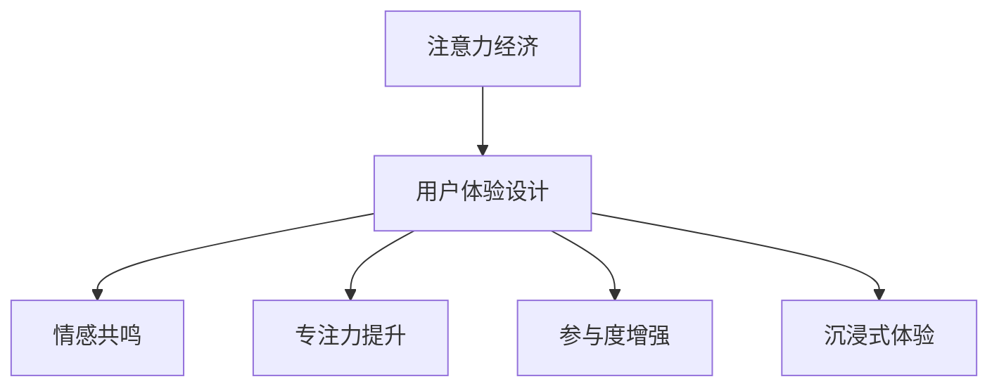

                 

### 文章标题

《注意力经济与用户体验设计：创建引人入胜、增强专注力的产品》

> 关键词：注意力经济、用户体验设计、情感共鸣、专注力提升、参与度增强、沉浸式体验

> 摘要：随着数字时代的来临，用户的注意力资源成为了一种宝贵的经济资源。本文深入探讨了注意力经济的基本原理及其在用户体验设计中的应用。通过分析情感共鸣、专注力提升、参与度增强和沉浸式体验等设计策略，本文旨在为开发者提供一套系统化的设计指南，帮助他们在产品设计中充分利用注意力经济，提升用户的专注力和使用体验。

### 目录大纲

#### 第一部分：注意力经济概述

- **第1章：注意力经济背景**
  - 注意力经济的起源与发展
  - 注意力资源的价值
  - 注意力与经济发展的关系
  - 注意力经济的重要性
  - 注意力经济案例分析

- **第2章：用户体验设计基础**
  - 用户体验设计的基本概念
  - 用户行为分析
  - 设计思维与用户体验设计
  - 用户体验设计的方法论
  - 用户体验设计工具与技术

#### 第二部分：注意力驱动的设计策略

- **第3章：设计策略1：情感共鸣**
  - 情感共鸣的重要性
  - 如何创造情感共鸣
  - 情感共鸣的案例分析
  - 情感共鸣的实践指导

- **第4章：设计策略2：专注力提升**
  - 专注力的原理
  - 专注力提升的设计策略
  - 专注力提升的案例分析
  - 专注力提升的实践指导

- **第5章：设计策略3：参与度增强**
  - 参与度的概念
  - 提升参与度的设计策略
  - 参与度的案例分析
  - 参与度增强的实践指导

- **第6章：设计策略4：沉浸式体验**
  - 沉浸式体验的原理
  - 创造沉浸式体验的设计策略
  - 沉浸式体验的案例分析
  - 沉浸式体验的实践指导

#### 第三部分：整合注意力经济与用户体验设计

- **第7章：整合注意力经济与用户体验设计**
  - 注意力经济与用户体验设计的整合
  - 注意力经济驱动的用户体验设计流程
  - 注意力经济与用户体验设计案例研究
  - 注意力经济与用户体验设计的未来趋势

#### 第三部分：项目实战与案例分析

- **第8章：项目实战1：注意力经济与社交媒体设计**
  - 项目背景
  - 需求分析与设计策略
  - 设计方案与实施
  - 项目评估与反馈

- **第9章：项目实战2：注意力经济与游戏设计**
  - 项目背景
  - 需求分析与设计策略
  - 设计方案与实施
  - 项目评估与反馈

- **第10章：案例分析：注意力经济与电子商务用户体验设计**
  - 案例背景
  - 注意力经济在案例中的应用
  - 设计策略与实施
  - 案例评估与启示

#### 附录

- **附录A：注意力经济与用户体验设计工具介绍**
  - 用户行为分析工具
  - 情感分析工具
  - 专注力测评工具
  - 沉浸式体验设计工具

- **附录B：注意力经济与用户体验设计资源推荐**
  - 书籍推荐
  - 论文与研究报告
  - 在线课程与培训资源
  - 社交媒体与论坛资源

### 核心概念与联系

#### Mermaid 流程图：



### 核心算法原理讲解

#### 专注力提升算法伪代码：

```python
# 专注力提升算法伪代码
def attention_boosting_algorithm(user_data, design_inputs):
    # 初始化用户数据
    user_data = preprocess_user_data(user_data)
    
    # 初始化设计输入
    design_inputs = preprocess_design_inputs(design_inputs)
    
    # 计算注意力权重
    attention_weights = calculate_attention_weights(user_data, design_inputs)
    
    # 根据注意力权重调整设计
    adjusted_design = adjust_design_based_on_attention_weights(design_inputs, attention_weights)
    
    # 输出优化后的设计
    return adjusted_design
```

#### 注意力权重计算公式：

$$
\text{Attention Weight} = \frac{\exp(\text{User Interest Score})}{\sum_{i=1}^{n} \exp(\text{User Interest Score}_i)}
$$

#### 举例说明：

假设用户对五种设计元素的兴趣得分分别为：10, 8, 12, 6, 9。那么，每种元素的注意力权重计算如下：

$$
\text{Design Element 1 Weight} = \frac{\exp(10)}{\exp(10) + \exp(8) + \exp(12) + \exp(6) + \exp(9)}
$$

$$
\text{Design Element 2 Weight} = \frac{\exp(8)}{\exp(10) + \exp(8) + \exp(12) + \exp(6) + \exp(9)}
$$

$$
\text{Design Element 3 Weight} = \frac{\exp(12)}{\exp(10) + \exp(8) + \exp(12) + \exp(6) + \exp(9)}
$$

$$
\text{Design Element 4 Weight} = \frac{\exp(6)}{\exp(10) + \exp(8) + \exp(12) + \exp(6) + \exp(9)}
$$

$$
\text{Design Element 5 Weight} = \frac{\exp(9)}{\exp(10) + \exp(8) + \exp(12) + \exp(6) + \exp(9)}
$$

### 项目实战与案例分析

#### 项目实战1：注意力经济与社交媒体设计

1. **项目背景：**

   设计一款基于注意力经济原理的社交媒体平台，旨在提升用户活跃度和留存率。该项目的目标是通过个性化推荐系统、情感共鸣的设计元素和互动功能，吸引用户的注意力，并提高他们的参与度。

2. **需求分析与设计策略：**

   - **个性化内容推荐系统：** 通过分析用户的行为数据和兴趣，为每个用户推荐符合他们兴趣的内容，提升用户对平台的粘性。
   - **情感共鸣的设计元素：** 利用情感分析技术，设计出能够引起用户情感共鸣的界面元素，如用户头像、动态封面等。
   - **互动功能设计：** 引入实时聊天、点赞、评论等互动功能，提高用户之间的互动频率，增强用户的参与感。

3. **设计方案与实施：**

   - **个性化内容推荐系统：** 开发基于机器学习算法的推荐系统，根据用户的浏览历史、点赞和评论行为，生成个性化的内容推荐列表。
   - **情感共鸣的设计元素：** 设计师使用情感分析工具，对用户生成的内容进行分析，提取情感标签，然后设计出相应的情感化界面元素。
   - **互动功能设计：** 实现实时聊天功能，允许用户之间进行实时交流；设计点赞和评论功能，增加用户之间的互动。

4. **项目评估与反馈：**

   - **用户活跃度评估：** 通过分析用户在平台上的活跃度数据，如登录频率、内容浏览时长等，评估推荐系统和互动功能对用户活跃度的影响。
   - **用户留存率评估：** 通过分析用户留存数据，如30天活跃用户比例等，评估整体设计策略对用户留存率的影响。
   - **用户反馈：** 收集用户对平台功能和用户体验的反馈，根据用户建议进行持续优化。

#### 项目实战2：注意力经济与游戏设计

1. **项目背景：**

   设计一款基于注意力经济原理的游戏，目标是提高用户的参与度和游戏时长。该游戏旨在通过引人入胜的剧情、挑战性的关卡设计和社交互动元素，吸引用户的注意力，并提高他们的参与度。

2. **需求分析与设计策略：**

   - **引人入胜的剧情设计：** 开发一个引人入胜的剧情，吸引用户投入时间玩游戏。
   - **挑战性的关卡设计：** 设计一系列具有挑战性的关卡，提高用户的专注力和游戏难度。
   - **社交互动元素：** 引入社交互动元素，如排行榜、好友挑战等，增强游戏的社交性和参与感。

3. **设计方案与实施：**

   - **剧情设计：** 开发一个富有创意的剧情，通过引人入胜的故事情节和角色设定，吸引用户的注意力。
   - **关卡设计：** 设计一系列具有不同难度和挑战性的关卡，根据用户的游戏进度逐步提升难度。
   - **社交互动元素：** 实现排行榜功能，显示用户的游戏成绩，引入好友挑战功能，增加用户之间的互动。

4. **项目评估与反馈：**

   - **用户参与度评估：** 通过分析用户在游戏中的参与数据，如游戏时长、关卡通过率等，评估游戏设计的有效性。
   - **用户留存率评估：** 通过分析用户的留存数据，如日活跃用户比例、30天活跃用户比例等，评估整体设计策略对用户留存率的影响。
   - **用户反馈：** 收集用户对游戏剧情、关卡难度和社交互动的反馈，根据用户建议进行持续优化。

#### 案例分析：注意力经济与电子商务用户体验设计

1. **案例背景：**

   一家电子商务平台希望通过引入注意力经济原理，提升用户的购物体验和转化率。该平台的目标是通过个性化推荐、情感共鸣的设计元素和购物游戏化，吸引用户的注意力，并提高他们的购物意愿。

2. **注意力经济在案例中的应用：**

   - **个性化推荐系统：** 通过分析用户的购物行为和偏好，为用户推荐符合他们兴趣的商品，提高用户的购物体验。
   - **情感共鸣的设计元素：** 利用情感分析技术，设计出能够引起用户情感共鸣的购物界面元素，如商品描述、用户评价等。
   - **购物游戏化：** 引入购物游戏化元素，如购物挑战、抽奖等，增加用户的参与感和购物乐趣。

3. **设计策略与实施：**

   - **个性化推荐系统：** 开发基于机器学习算法的推荐系统，根据用户的购物行为和偏好，生成个性化的商品推荐列表。
   - **情感共鸣的设计元素：** 设计师使用情感分析工具，对商品描述和用户评价进行分析，提取情感标签，然后设计出相应的情感化界面元素。
   - **购物游戏化：** 设计购物挑战和抽奖活动，增加用户的购物乐趣和参与感。

4. **案例评估与启示：**

   - **购物体验评估：** 通过分析用户在购物过程中的交互数据，如页面浏览时长、商品点击率等，评估个性化推荐和情感共鸣设计对购物体验的影响。
   - **转化率评估：** 通过分析用户的购物行为数据，如订单量、转化率等，评估购物游戏化对用户购物意愿的影响。
   - **用户反馈：** 收集用户对个性化推荐、情感共鸣设计和购物游戏化的反馈，根据用户建议进行持续优化。

### 附录

#### 附录A：注意力经济与用户体验设计工具介绍

- **用户行为分析工具：**
  - **Google Analytics：** 提供全面的网站和移动应用分析功能，帮助开发者了解用户行为和网站性能。
  - **Mixpanel：** 专注于用户行为分析，提供实时监控和用户行为路径追踪功能。
  - **Hotjar：** 提供热图分析和用户反馈功能，帮助开发者了解用户在网站上的行为和痛点。

- **情感分析工具：**
  - **IBM Watson：** 提供自然语言处理和情感分析功能，帮助开发者理解和分析用户情感。
  - **Lexalytics：** 提供情感分析、主题分析和文本挖掘功能，支持多种语言。
  - **Google Cloud Natural Language：** 提供文本分析功能，包括情感分析和实体识别。

- **专注力测评工具：**
  - **Microsoft Attention Switching Test：** 提供注意力测评工具，帮助开发者了解用户的注意力水平。
  - **CogState：** 提供一系列认知测评工具，包括注意力、记忆和执行功能等。
  - **Cambridge Attention Test：** 提供在线注意力测评工具，适用于学术研究和应用开发。

- **沉浸式体验设计工具：**
  - **Unity：** 提供跨平台的游戏开发和沉浸式体验设计工具。
  - **Unreal Engine：** 提供强大的游戏引擎，支持实时渲染和沉浸式体验设计。
  - **VRChat：** 提供虚拟现实社交平台，支持多人在线互动和沉浸式体验设计。

#### 附录B：注意力经济与用户体验设计资源推荐

- **书籍推荐：**
  - **《注意力经济：如何赢得用户的专注与忠诚》：** 介绍了注意力经济的概念和如何应用于产品设计。
  - **《用户体验要素》：** 详细阐述了用户体验设计的基本原理和实践方法。
  - **《设计思维：如何创造出更好的产品和服务》：** 探讨了设计思维在产品开发中的应用。

- **论文与研究报告：**
  - **"Attention Economy: The New Social Network Value"：** 分析了注意力经济在社交媒体中的价值和应用。
  - **"The Attention Merchants: The Epic Scramble to Get Inside Our Heads"：** 探讨了注意力经济对个人和社会的影响。
  - **"Attention, and How to Win It"：** 提供了关于如何吸引和保持用户注意力的策略和方法。

- **在线课程与培训资源：**
  - **Coursera：** 提供多种关于用户体验设计和注意力经济的在线课程。
  - **edX：** 提供设计思维和用户体验设计的在线课程，适合初学者和专业人士。
  - **Udemy：** 提供丰富的用户体验设计课程，包括用户研究、交互设计和用户体验评估等。

- **社交媒体与论坛资源：**
  - **UX Stack Exchange：** 提供用户体验设计相关的问答平台，适合设计师和开发者交流。
  - **DZone：** UX Design Zone，提供用户体验设计的新闻、教程和案例分析。
  - **UXBooth：** 用户经验设计社区，提供设计资源和案例研究。

