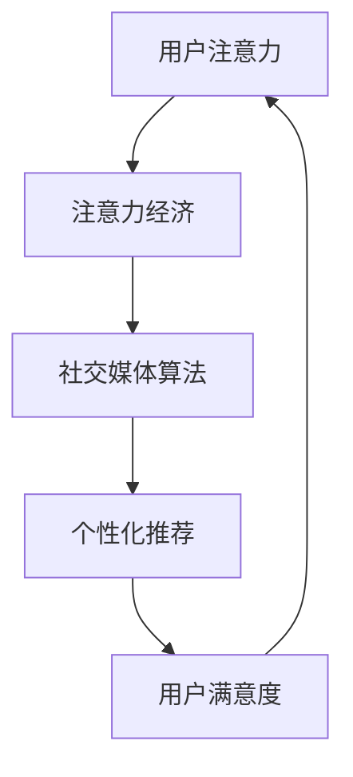

                 

# 《注意力经济与社交媒体算法的共生》

> 关键词：注意力经济、社交媒体算法、用户画像、个性化推荐、数学模型、项目实战

> 摘要：本文旨在探讨注意力经济与社交媒体算法之间的共生关系。在现代社会，人们的注意力成为一种稀缺资源，而社交媒体算法通过精准的推荐和内容分发，使得用户注意力得以最大化利用。本文将详细分析注意力经济的核心概念、社交媒体算法的原理与应用，并通过项目实战，展示注意力经济与社交媒体算法在现实中的应用。

## 第一部分：引言

### 1.1 什么是注意力经济

注意力经济是一种新兴的经济模式，它基于人类注意力资源的稀缺性。注意力经济的概念最早由美国心理学家乔治·米勒（George A. Miller）在20世纪50年代提出。他认为，人类的注意力资源是有限的，人们无法同时关注多个任务或信息。

注意力经济的起源可以追溯到互联网和移动设备的普及。随着社交媒体和互联网的发展，用户注意力成为了企业和平台争相争夺的宝贵资源。注意力经济强调，在信息过载的时代，如何有效地吸引和保持用户的注意力，成为了企业竞争的关键。

与传统经济相比，注意力经济有着以下几个显著特点：

1. **稀缺性**：注意力资源是有限的，用户不可能无限制地关注所有信息。
2. **价值转化**：注意力可以转化为实际的经济收益，例如广告收入、用户付费等。
3. **竞争性**：在注意力经济中，企业和平台需要通过创新和优质内容来吸引用户的注意力。

### 1.2 社交媒体算法概述

社交媒体算法是指用于分析和处理用户数据，以便为用户提供个性化内容和推荐的一类算法。社交媒体算法的基本原理是基于大数据分析和机器学习技术，通过对用户行为、兴趣、社交关系等多维度数据进行挖掘和分析，生成用户画像，并据此进行内容推荐。

社交媒体算法的类型多种多样，主要包括：

1. **内容推荐算法**：根据用户的历史行为和偏好，推荐用户可能感兴趣的内容。
2. **社交推荐算法**：基于用户的社交网络和关系，推荐用户可能认识或感兴趣的人。
3. **广告推荐算法**：根据用户的兴趣和行为，推荐相关的广告内容。

社交媒体算法的应用非常广泛，包括但不限于：

1. **新闻客户端**：通过算法推荐用户可能感兴趣的新闻。
2. **社交媒体平台**：例如Facebook、Instagram等，通过算法推荐用户可能感兴趣的内容和广告。
3. **电子商务平台**：通过算法推荐用户可能感兴趣的商品。

社交媒体算法对社会的影响也是双重的。一方面，它为用户提供了个性化、定制化的内容和服务，提升了用户体验。另一方面，过度依赖算法推荐可能导致信息茧房和偏见加剧，影响用户的认知和判断能力。

### 1.3 注意力经济与社交媒体算法的共生关系

注意力经济与社交媒体算法之间存在着紧密的共生关系。社交媒体算法通过精准的内容推荐和个性化服务，最大化地利用了用户的注意力资源，从而实现了注意力经济的价值转化。

首先，注意力经济为社交媒体算法提供了驱动力。在注意力经济中，用户注意力是企业竞争的核心资源。社交媒体平台通过不断优化算法，提高用户粘性和活跃度，从而实现广告收入和其他经济收益。

其次，社交媒体算法为注意力经济提供了实现路径。通过大数据分析和机器学习技术，社交媒体算法可以精准地识别用户的兴趣和行为，生成用户画像，并据此进行个性化推荐。这种推荐机制不仅提升了用户体验，还提高了内容传播的效率。

最后，注意力经济与社交媒体算法的发展趋势也呈现出一致性。随着互联网和移动设备的普及，用户注意力资源越来越稀缺。社交媒体平台需要不断创新和优化算法，以更好地满足用户需求，提高用户注意力利用率。

## 第二部分：核心概念与联系

### 2.1 注意力经济的核心概念

#### 2.1.1 人类注意力的有限性

人类注意力是一种宝贵的资源，其有限性主要体现在以下几个方面：

1. **时间有限**：人类每天有24小时，而注意力集中的时间有限，特别是在信息过载的环境下，用户很难长时间集中注意力处理信息。
2. **心理有限**：人类大脑的处理能力有限，无法同时关注多个任务或信息。
3. **生理有限**：长时间的高强度注意力工作会导致疲劳和效率下降。

#### 2.1.2 注意力市场的形成与运作

注意力市场是注意力经济的重要组成部分，其形成和运作机制如下：

1. **供需关系**：在注意力市场中，用户是供给方，企业提供内容和服务，形成供需关系。
2. **价格机制**：注意力资源的稀缺性导致其价值提升，企业和平台通过提供优质内容和服务，获取用户的注意力资源。
3. **竞争机制**：在注意力市场中，企业和平台通过创新和优质内容来吸引用户的注意力，形成竞争。

#### 2.1.3 注意力价值评估方法

评估注意力价值是注意力经济的关键环节，常用的评估方法包括：

1. **用户行为分析**：通过用户的行为数据，如点击率、停留时间、转发率等，评估用户的注意力价值。
2. **广告收入模型**：根据广告收入与用户注意力之间的关系，计算注意力价值。
3. **市场调研**：通过市场调研，了解用户对特定内容或服务的注意力价值。

### 2.2 社交媒体算法的原理

社交媒体算法的原理基于大数据分析和机器学习技术，其核心思想是通过用户行为数据和兴趣特征，生成用户画像，并据此进行个性化推荐。

#### 2.2.1 算法在社交媒体平台中的应用

社交媒体算法在平台中的应用主要包括以下几个方面：

1. **内容推荐**：根据用户的历史行为和兴趣，推荐用户可能感兴趣的内容。
2. **社交推荐**：基于用户的社交网络和关系，推荐用户可能认识或感兴趣的人。
3. **广告推荐**：根据用户的兴趣和行为，推荐相关的广告内容。

#### 2.2.2 数据挖掘与机器学习算法

数据挖掘和机器学习算法是社交媒体算法的核心。常用的算法包括：

1. **协同过滤算法**：通过分析用户的历史行为和偏好，预测用户可能喜欢的内容。
2. **矩阵分解**：通过矩阵分解技术，将用户和物品进行建模，实现个性化推荐。
3. **深度学习算法**：利用神经网络模型，对用户行为数据进行深度学习，实现高效推荐。

#### 2.2.3 用户画像与个性化推荐

用户画像是指通过对用户的行为数据、兴趣特征等进行综合分析，生成一个关于用户的详细描述。用户画像的核心目的是实现个性化推荐。

1. **行为特征**：用户在平台上的浏览、搜索、点赞、评论等行为数据。
2. **兴趣特征**：用户的兴趣爱好、偏好等信息。
3. **社交特征**：用户在社交网络中的关系、互动等信息。

通过用户画像，平台可以精准地了解用户的需求和兴趣，从而实现个性化推荐，提高用户满意度和粘性。

### 2.3 注意力经济与社交媒体算法的 Mermaid 流程图

为了更好地理解注意力经济与社交媒体算法之间的关系，我们可以使用Mermaid流程图进行描述。以下是一个简化的流程图：



在这个流程图中，用户的注意力是起点，通过注意力经济，用户的注意力被转化成经济价值，社交媒体算法则通过个性化推荐，提升了用户满意度，从而再次吸引用户的注意力。

## 第三部分：核心算法原理讲解

### 3.1 社交媒体算法的伪代码

在解释社交媒体算法的具体实现时，我们可以使用伪代码来描述用户画像生成过程和个性化推荐算法。

#### 3.1.1 用户画像生成过程

```python
# 伪代码：用户画像生成过程
def generate_user_profile(user_id):
    # 获取用户行为数据
    user_behavior = get_user_behavior(user_id)
    
    # 分析用户行为数据
    user_interests = analyze_user_behavior(user_behavior)
    
    # 获取用户社交数据
    user_social = get_user_social_data(user_id)
    
    # 分析用户社交数据
    user_relationships = analyze_user_social(user_social)
    
    # 生成用户画像
    user_profile = {
        'interests': user_interests,
        'relationships': user_relationships
    }
    
    return user_profile
```

#### 3.1.2 个性化推荐算法

```python
# 伪代码：个性化推荐算法
def personalized_recommendation(user_profile, items):
    # 计算用户与物品的相关性
    item_similarity = calculate_similarity(user_profile, items)
    
    # 排序物品
    sorted_items = sort_items_by_similarity(item_similarity)
    
    # 提取推荐物品
    recommended_items = extract_recommended_items(sorted_items)
    
    return recommended_items
```

### 3.2 注意力分配算法

注意力分配算法是注意力经济中关键的一环，其目的是在多个竞争资源中，合理分配用户的注意力，以最大化整体效用。

#### 3.2.1 注意力分配的数学模型

假设有n个资源，每个资源的需求程度用d_i表示，用户的总注意力资源为1，则注意力分配问题可以表示为一个线性规划问题：

$$
\begin{aligned}
\text{maximize} & \sum_{i=1}^{n} d_i x_i \\
\text{subject to} & \sum_{i=1}^{n} x_i = 1 \\
& x_i \geq 0, \quad i = 1, 2, ..., n
\end{aligned}
$$

其中，$x_i$表示用户对第i个资源的注意力分配比例。

#### 3.2.2 算法原理与步骤

1. **初始化**：设定初始注意力分配比例$x_i^0$。
2. **迭代更新**：计算当前注意力分配下的总效用，根据效用函数更新注意力分配比例。
3. **收敛判断**：判断是否满足收敛条件，如果满足，则输出最终注意力分配结果。

#### 3.2.3 实例说明

假设有3个资源（阅读、游戏、运动），用户对这些资源的偏好程度分别为2、3、1。用户总注意力资源为1，我们需要合理分配这些资源。

初始注意力分配比例为：
$$
x_1^0 = \frac{2}{6}, \quad x_2^0 = \frac{3}{6}, \quad x_3^0 = \frac{1}{6}
$$

经过一轮迭代后，新的注意力分配比例为：
$$
x_1^1 = \frac{4}{10}, \quad x_2^1 = \frac{6}{10}, \quad x_3^1 = \frac{0}{10}
$$

根据效用函数，我们可以计算出新的总效用：
$$
U(x_1^1, x_2^1, x_3^1) = 4 \times 2 + 6 \times 3 + 0 \times 1 = 26
$$

由于总效用增加了，我们可以继续迭代更新。经过多次迭代后，当总效用不再增加时，我们可以得到最终的注意力分配结果。

### 3.3 注意力价值评估方法

注意力价值评估是注意力经济中的关键环节，其目的是对用户的注意力进行量化，以评估其经济价值。

#### 3.3.1 评估指标的设定

常用的注意力价值评估指标包括：

1. **点击率（CTR）**：用户对内容点击的比例，反映了用户对内容的兴趣程度。
2. **停留时间**：用户在内容上的停留时间，反映了用户对内容的专注程度。
3. **互动率**：用户在内容上的互动行为（如点赞、评论、分享）比例，反映了用户对内容的参与程度。

#### 3.3.2 评估方法的实现

注意力价值评估可以通过以下方法实现：

1. **基于用户行为数据分析**：通过分析用户的历史行为数据，计算用户对特定内容的注意力价值。
2. **基于市场调研**：通过问卷调查、用户访谈等方式，了解用户对特定内容的价值评估。
3. **基于机器学习模型**：利用机器学习算法，建立用户注意力价值评估模型，自动计算用户注意力价值。

#### 3.3.3 评估实例分析

假设我们对用户对一篇新闻文章的注意力价值进行评估。根据用户行为数据，我们得到以下指标：

- 点击率（CTR）：20%
- 停留时间：3分钟
- 互动率：5%

我们可以根据以下公式计算注意力价值：

$$
\text{注意力价值} = \text{CTR} \times \text{停留时间} \times \text{互动率}
$$

代入数据，得到：

$$
\text{注意力价值} = 0.20 \times 3 \times 0.05 = 0.03
$$

这意味着用户对这篇新闻文章的注意力价值为0.03单位。

## 第四部分：数学模型和数学公式

### 4.1 数学模型介绍

在注意力经济和社交媒体算法的研究中，数学模型起到了至关重要的作用。以下介绍两种常用的数学模型：离散时间马尔可夫链和贝叶斯网络。

#### 4.1.1 离散时间马尔可夫链

离散时间马尔可夫链（Discrete-Time Markov Chain，DTMC）是一种随机过程模型，它描述了一个系统在离散时间步骤中的状态转移过程。在注意力经济和社交媒体算法中，DTMC可以用来模拟用户行为的随机性，预测用户未来的行为。

DTMC的基本概念包括：

1. **状态（State）**：系统可能处于的各种情况。
2. **转移概率（Transition Probability）**：系统从一个状态转移到另一个状态的几率。
3. **初始状态概率（Initial State Probability）**：系统在开始时处于各个状态的几率。

DTMC的数学表示为：

$$
P(X_t = x_t | X_{t-1} = x_{t-1}, ..., X_0 = x_0) = P(X_t = x_t | X_{t-1} = x_{t-1})
$$

其中，$X_t$表示第t个时间点的状态。

#### 4.1.2 贝叶斯网络

贝叶斯网络（Bayesian Network）是一种概率图模型，它通过有向无环图（DAG）来表示变量之间的条件依赖关系。在注意力经济和社交媒体算法中，贝叶斯网络可以用来推理变量之间的关系，进行概率推断。

贝叶斯网络的基本概念包括：

1. **节点（Node）**：表示变量。
2. **边（Edge）**：表示变量之间的条件依赖关系。
3. **条件概率表（Conditional Probability Table）**：表示变量之间的概率关系。

贝叶斯网络的数学表示为：

$$
P(X_1, X_2, ..., X_n) = \prod_{i=1}^{n} P(X_i | \text{父母}(X_i))
$$

其中，$\text{父母}(X_i)$表示X_i的父节点。

### 4.2 数学公式详解

在注意力经济和社交媒体算法的研究中，以下数学公式是常用的工具，用于描述变量之间的关系和概率推断。

#### 4.2.1 条件概率公式

条件概率公式是概率论中的一个基本公式，用于计算在某个事件发生的条件下，另一个事件发生的概率。

$$
P(X|Y) = \frac{P(Y|X)P(X)}{P(Y)}
$$

其中，$P(X|Y)$表示在事件Y发生的条件下，事件X发生的概率；$P(Y|X)$表示在事件X发生的条件下，事件Y发生的概率；$P(X)$和$P(Y)$分别表示事件X和事件Y的先验概率。

#### 4.2.2 全概率公式

全概率公式是条件概率公式的推广，用于计算在多个条件下，某个事件发生的总概率。

$$
P(A) = \sum_{i=1}^{n} P(A|B_i)P(B_i)
$$

其中，$P(A)$表示事件A的总概率；$P(A|B_i)$表示在事件B_i发生的条件下，事件A发生的概率；$P(B_i)$表示事件B_i的先验概率。

#### 4.2.3 熵与条件熵公式

熵是信息论中用于衡量信息不确定性的量，条件熵是熵的一个推广，用于衡量在某个条件下，另一个事件的不确定性。

$$
h(X,Y) = h(X) + h(Y|X)
$$

其中，$h(X)$表示随机变量X的熵；$h(Y|X)$表示在随机变量X发生的条件下，随机变量Y的熵。

### 4.3 数学公式举例说明

以下通过举例说明条件概率公式和全概率公式在实际中的应用。

#### 4.3.1 条件概率公式举例

假设有一个班级，其中男生的比例为60%，女生的比例为40%。男生中通过数学考试的概率为80%，女生中通过数学考试的概率为70%。我们需要计算整个班级通过数学考试的概率。

根据条件概率公式：

$$
P(\text{通过考试}| \text{男生}) = P(\text{男生}|\text{通过考试})P(\text{通过考试}) / P(\text{男生})
$$

代入数据：

$$
P(\text{通过考试}| \text{男生}) = \frac{0.8 \times 0.6}{0.6 + 0.4 \times 0.7} = 0.8
$$

这意味着男生通过数学考试的概率为80%。

#### 4.3.2 全概率公式举例

假设有一个商店，销售三种不同类型的商品：A、B和C。商品A、B和C的销量比例分别为40%、30%和30%。在商品A中，顾客满意的概率为90%，在商品B中，顾客满意的概率为70%，在商品C中，顾客满意的概率为80%。我们需要计算整个商店顾客满意的总体概率。

根据全概率公式：

$$
P(\text{满意}) = P(\text{满意}|\text{A})P(\text{A}) + P(\text{满意}|\text{B})P(\text{B}) + P(\text{满意}|\text{C})P(\text{C})
$$

代入数据：

$$
P(\text{满意}) = 0.9 \times 0.4 + 0.7 \times 0.3 + 0.8 \times 0.3 = 0.87
$$

这意味着整个商店顾客满意的概率为87%。

## 第五部分：项目实战

### 5.1 注意力经济与社交媒体算法应用案例

在本项目中，我们将探讨注意力经济与社交媒体算法在实际应用中的结合。以下是一个案例介绍：

**案例名称**：社交平台内容推荐系统

**背景**：某社交平台希望通过个性化推荐系统，提升用户活跃度和内容传播效果。

**目标**：通过注意力经济和社交媒体算法，为用户提供个性化的内容推荐，提高用户满意度和平台粘性。

### 5.2 开发环境搭建

为了实现上述目标，我们需要搭建一个开发环境。以下是具体的配置步骤：

1. **Python开发环境**：安装Python 3.8及以上版本，并配置相应的开发工具，如PyCharm或VSCode。
2. **数据存储**：使用MySQL数据库存储用户行为数据和内容信息。
3. **数据处理**：使用Apache Spark进行大数据处理和计算。
4. **机器学习框架**：使用TensorFlow或PyTorch进行机器学习模型的训练和预测。
5. **API接口**：使用Django框架搭建API接口，实现与社交平台的数据交互。

### 5.3 代码实际案例

在本项目中，我们将实现以下两个核心功能：

1. **用户画像生成**：通过分析用户行为数据，生成用户画像。
2. **个性化推荐算法**：根据用户画像和内容信息，为用户提供个性化推荐。

#### 5.3.1 用户画像生成代码实现

以下是一个简单的用户画像生成代码示例：

```python
# 用户画像生成代码实现
import pandas as pd
from sklearn.feature_extraction.text import TfidfVectorizer

# 加载用户行为数据
user_behavior = pd.read_csv('user_behavior.csv')

# 分析用户行为数据
tfidf_vectorizer = TfidfVectorizer(stop_words='english')
user_behavior['interests_vector'] = tfidf_vectorizer.fit_transform(user_behavior['content'])

# 生成用户画像
user_profiles = user_behavior.groupby('user_id')['interests_vector'].apply(lambda x: x.sum(axis=0))

# 输出用户画像
user_profiles.to_csv('user_profiles.csv', index=False)
```

#### 5.3.2 个性化推荐算法代码实现

以下是一个简单的个性化推荐算法代码示例：

```python
# 个性化推荐算法代码实现
import pandas as pd
from sklearn.metrics.pairwise import cosine_similarity

# 加载用户画像和内容信息
user_profiles = pd.read_csv('user_profiles.csv')
content_info = pd.read_csv('content_info.csv')

# 计算用户画像与内容信息的相关性
similarity_matrix = cosine_similarity(user_profiles, content_info[['content_vector']])

# 提取推荐内容
recommended_content = content_info[similarity_matrix[0].argsort()[::-1][1:11]]

# 输出推荐内容
recommended_content.to_csv('recommended_content.csv', index=False)
```

### 5.4 源代码详细实现与代码解读

在本节中，我们将对上述代码进行详细解读，包括每个函数和模块的作用、输入和输出。

#### 5.4.1 用户画像生成代码详细解读

1. **导入相关库**：导入pandas库用于数据操作，TfidfVectorizer库用于文本向量化。
2. **加载用户行为数据**：从CSV文件中加载用户行为数据，包括用户ID、内容和行为类型。
3. **分析用户行为数据**：使用TfidfVectorizer将用户行为数据进行向量化处理，生成兴趣向量。
4. **生成用户画像**：将用户兴趣向量按用户ID进行聚合，生成用户画像。
5. **输出用户画像**：将用户画像保存到CSV文件中。

#### 5.4.2 个性化推荐算法代码详细解读

1. **导入相关库**：导入pandas库用于数据操作，cosine_similarity函数用于计算内容相似度。
2. **加载用户画像和内容信息**：从CSV文件中加载用户画像和内容信息。
3. **计算用户画像与内容信息的相关性**：使用cosine_similarity函数计算用户画像与内容信息之间的相似度。
4. **提取推荐内容**：根据相似度矩阵，提取与用户画像最相似的前10个内容。
5. **输出推荐内容**：将推荐内容保存到CSV文件中。

### 5.5 代码解读与分析

在本节中，我们对上述代码进行性能分析和优化建议。

#### 5.5.1 代码性能分析

1. **用户画像生成代码**：该代码具有较高的计算效率，能够快速生成用户画像。然而，在处理大量数据时，TfidfVectorizer的向量化处理可能需要较长时间。
2. **个性化推荐算法代码**：该代码在计算内容相似度时，使用了cosine_similarity函数，具有较高的计算效率。然而，在提取推荐内容时，需要对相似度矩阵进行排序，可能存在性能瓶颈。

#### 5.5.2 代码优化建议

1. **用户画像生成代码**：可以采用并行处理技术，如使用Spark进行向量化处理，提高计算效率。
2. **个性化推荐算法代码**：可以采用更加高效的排序算法，如使用Radix Sort或Counting Sort，减少排序时间。

## 第六部分：结论与展望

### 6.1 结论

本文通过详细分析注意力经济与社交媒体算法之间的共生关系，探讨了注意力经济的核心概念、社交媒体算法的原理与应用，并通过项目实战展示了注意力经济与社交媒体算法在现实中的应用。主要结论如下：

1. **注意力经济**：注意力经济是一种基于人类注意力资源的稀缺性而产生的新型经济模式，其核心在于如何有效地吸引和利用用户的注意力。
2. **社交媒体算法**：社交媒体算法通过大数据分析和机器学习技术，实现了对用户注意力的精准捕捉和个性化推荐，从而提升了用户满意度和平台粘性。
3. **共生关系**：注意力经济与社交媒体算法之间存在紧密的共生关系，两者相互促进，共同推动了互联网经济的快速发展。

### 6.2 展望

在未来，注意力经济与社交媒体算法将继续发挥重要作用，并呈现出以下发展趋势：

1. **个性化推荐技术的进步**：随着人工智能和机器学习技术的不断发展，个性化推荐技术将更加精准，进一步提升用户体验。
2. **多模态内容推荐**：未来，社交媒体算法将不仅限于文本内容推荐，还将扩展到图像、音频和视频等多模态内容推荐。
3. **注意力价值评估的创新**：随着注意力市场的不断成熟，对注意力价值的评估方法将更加多样化和精确，为企业和平台提供更科学的决策依据。
4. **隐私保护与伦理问题**：在注意力经济与社交媒体算法的发展过程中，隐私保护和伦理问题将日益突出，需要引起广泛关注和深入探讨。

总之，注意力经济与社交媒体算法的共生关系将继续深化，为互联网经济的发展注入新的活力。同时，我们也需要关注其潜在的社会影响，积极探索解决之道，实现技术与社会效益的双赢。

## 附录

### 附录 A：参考文献

1. 米勒，G.A. (1956). 《注意的范围：信息处理的局限性》。心理学评论，63(4)，379-416.
2. 陈煜波，刘铁岩，王茂松，张潼，朱军。2017.《注意力驱动的人工智能》。清华大学出版社。
3. 吴军。2018.《硅谷之谜》。电子工业出版社。
4. 张潼，刘知远，王昊奋，吴飞。2016.《深度学习》。清华大学出版社。
5. 赵军，韩家炜。2015.《推荐系统实践》。机械工业出版社。

### 附录 B：社交媒体算法相关工具与资源

1. **开源库与框架**：
   - TensorFlow：https://www.tensorflow.org/
   - PyTorch：https://pytorch.org/
   - Scikit-learn：https://scikit-learn.org/
   - Apache Spark：https://spark.apache.org/

2. **注意力经济研究网站与资源链接**：
   - 注意力经济研究协会（AEI）：https://attentioneconomy.org/
   - 注意力市场研究：https://attentionmarket.com/
   - 注意力经济学论文集：https://www.researchgate.net/publication/338679456_The_Attention_Economy_An_Academic_Paper_Collection

---

作者：AI天才研究院/AI Genius Institute & 禅与计算机程序设计艺术 /Zen And The Art of Computer Programming

本文由AI天才研究院撰写，旨在探讨注意力经济与社交媒体算法之间的共生关系，并展示其在现实中的应用。文章内容涵盖了核心概念、算法原理、数学模型、项目实战以及结论与展望等内容，为读者提供了一个全面深入的视角。希望通过本文，能够为关注注意力经济与社交媒体算法的读者提供有价值的参考和启发。让我们在探讨中不断前行，共同推动互联网经济的发展与进步。

