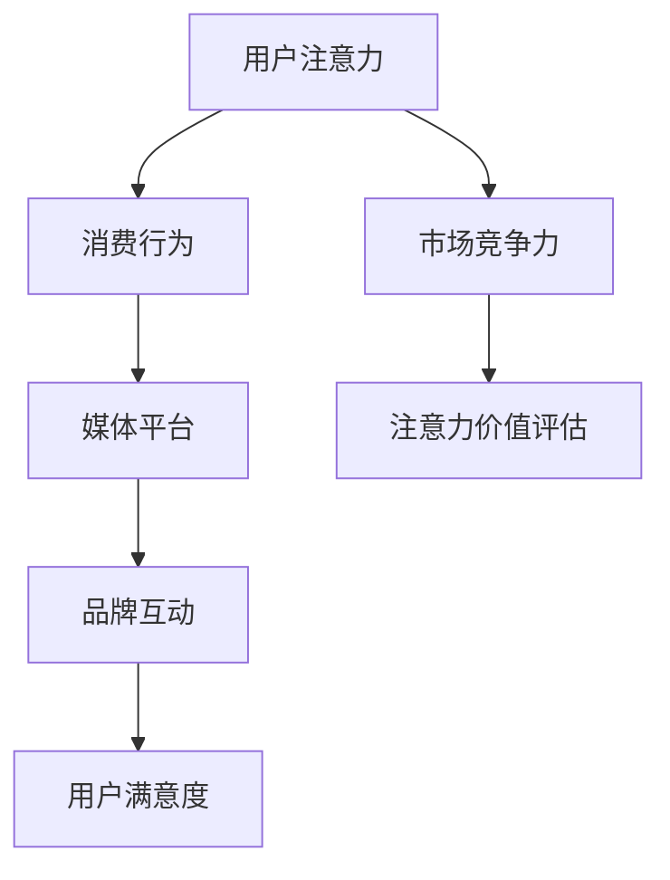
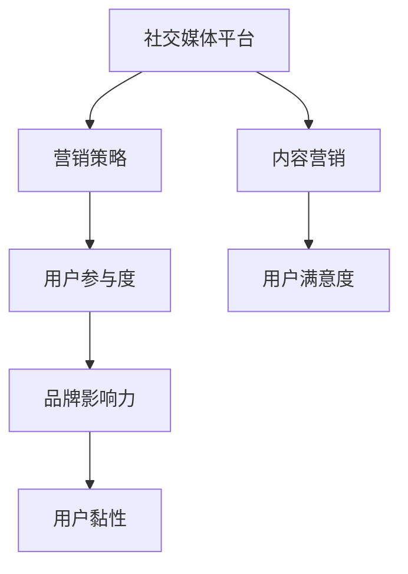

                 

### 文章标题

# 注意力经济与社交媒体营销最佳实践：在不牺牲用户体验的情况下有效吸引受众

### 关键词

注意力经济、社交媒体营销、用户体验、数据分析、内容优化、用户互动

### 摘要

随着互联网和社交媒体的快速发展，注意力经济逐渐成为企业营销的关键。本文旨在探讨注意力经济与社交媒体营销的最佳实践，通过详细的案例分析、核心概念讲解和算法原理阐述，帮助企业在不牺牲用户体验的情况下，有效吸引和留住受众。本文分为三个主要部分：第一部分介绍注意力经济的概念与原理，以及社交媒体营销的基本策略；第二部分深入分析注意力经济下的社交媒体营销实践，包括平台选型、内容创作与优化、用户互动与客户关系管理；第三部分则总结最佳实践，展望未来的发展趋势，并给出营销团队建设的建议。通过本文的阅读，读者将能够理解注意力经济的本质，掌握社交媒体营销的核心策略，并为未来的营销实践提供指导。

## 第1章: 注意力经济的概念与原理

### 1.1 注意力经济的定义和背景

#### 1.1.1 注意力经济的定义

注意力经济是一种基于用户注意力价值的经济模式。在这一模式中，用户的注意力被视为一种稀缺资源，企业通过吸引和转化用户的注意力来创造经济价值。与传统的商品经济和流量经济不同，注意力经济强调的是如何获取和保留用户的注意力，进而推动消费行为。

#### 1.1.2 注意力经济的背景

注意力经济的兴起源于互联网和社交媒体的快速发展。在传统的商业模式中，商品和服务是核心，而互联网时代，信息的爆炸性增长使得用户的注意力变得稀缺且宝贵。社交媒体平台如雨后春笋般涌现，成为用户获取信息、互动和消费的主要渠道。这使得注意力成为了一种新的价值源泉，企业开始竞相争夺用户的注意力资源。

#### 1.1.3 注意力经济的核心要素

1. **用户注意力：** 用户注意力是注意力经济的核心资源，它直接决定了用户的消费行为和品牌忠诚度。
2. **信息传递效率：** 高效的信息传递是吸引和保留用户注意力的关键，这要求企业必须具备快速反应和创新的能力。
3. **内容创意：** 优质的内容创意能够有效吸引用户的注意力，提升用户体验和品牌形象。
4. **用户互动：** 用户互动是增强用户粘性和品牌忠诚度的有效手段，通过互动，企业能够更好地理解用户需求，提供个性化的服务。

### 1.2 注意力经济的原理

#### 1.2.1 注意力转移与消费行为

注意力转移是指用户将注意力从一种活动转移到另一种活动。在注意力经济中，企业通过提供吸引人的内容和体验，引导用户将注意力转移到其品牌或产品上，从而促进消费行为。这一过程通常包括以下几个步骤：

1. **吸引注意：** 通过标题、图片、视频等手段吸引用户的初始注意力。
2. **激发兴趣：** 利用内容创意和用户体验提升用户的兴趣和好奇心。
3. **引导消费：** 通过引导式内容或直接促销手段，促使用户进行消费。

#### 1.2.2 注意力分配与市场竞争力

用户在接触大量信息时，会根据自身兴趣和需求进行注意力分配。企业通过分析用户注意力分配模式，可以优化营销策略，提高市场竞争力。具体策略包括：

1. **目标用户定位：** 精准定位目标用户群体，提供符合其兴趣和需求的内容。
2. **内容优化：** 优化内容质量，提高用户的阅读和互动意愿。
3. **差异化竞争：** 通过独特的内容和体验，形成差异化竞争优势。

#### 1.2.3 注意力价值的评估

注意力价值评估是衡量用户注意力对企业营销价值的重要手段。企业可以通过以下方法评估用户注意力的价值：

1. **用户参与度指标：** 如点赞、评论、分享等，衡量用户对内容的兴趣和参与程度。
2. **转化率指标：** 测量用户从看到内容到实际消费的比例，评估内容的商业价值。
3. **投资回报率（ROI）：** 计算营销投入与收益的比率，评估注意力的经济效益。

数学模型：转化率（ROI）的评估

$$
ROI = \frac{\text{收益} - \text{成本}}{\text{成本}}
$$

### 1.3 注意力经济的核心概念联系

#### 1.3.1 用户注意力与消费者行为

用户注意力是消费者行为的前提，消费者在决策过程中需要耗费大量注意力。企业通过吸引和引导用户注意力，可以影响消费者行为，从而实现销售转化。

#### 1.3.2 媒体平台与用户注意力

媒体平台是用户获取信息的主要途径，平台通过内容推荐和算法优化，吸引用户注意力。企业可以利用平台优势，提高品牌曝光和用户互动。

#### 1.3.3 品牌与用户注意力的互动

品牌通过内容营销和用户互动，建立与用户之间的情感联系，提高用户注意力。有效的品牌互动可以增强用户对品牌的忠诚度。

#### **Mermaid 流程图**

### 1.4 主流AI大模型简介

#### 1.4.1 GPT系列模型

GPT系列模型是自然语言处理领域的领先模型，包括GPT、GPT-2和GPT-3。这些模型通过大规模预训练，能够生成高质量的自然语言文本。

#### 1.4.2 BERT及其变体

BERT模型是自然语言处理领域的又一重要突破，它通过双向编码器结构，对上下文信息进行建模，提高了语义理解能力。

#### 1.4.3 其他知名大模型介绍

除了GPT和BERT，还有许多其他知名的大模型，如T5、GPT-Neo等，这些模型在各自领域取得了显著成果。

### 1.5 AI大模型在企业中的应用前景

#### 1.5.1 AI大模型的潜在应用领域

AI大模型在自然语言处理、图像识别、推荐系统等领域具有广泛的应用前景。企业可以通过大模型的应用，提高业务效率和用户体验。

#### 1.5.2 企业采用AI大模型的优势

AI大模型具有强大的数据分析和处理能力，能够为企业提供深入的洞察和决策支持。同时，大模型的应用可以降低人力成本，提高生产效率。

#### 1.5.3 AI大模型应用的挑战与机遇

AI大模型应用面临数据隐私、算法公平性等挑战。然而，随着技术的不断进步，这些挑战有望得到有效解决，为企业带来更多机遇。

### 1.6 注意力经济与社交媒体营销的关系

#### 1.6.1 注意力经济对社交媒体营销的影响

注意力经济强调用户注意力的稀缺性，这对社交媒体营销提出了更高的要求。企业需要通过创新的内容和互动方式，吸引和转化用户的注意力。

#### 1.6.2 社交媒体营销在注意力经济中的角色

社交媒体营销是注意力经济的重要组成部分，通过有效的社交媒体营销策略，企业可以在竞争激烈的市场中脱颖而出，获得用户注意力和市场份额。

### 1.7 注意力经济与社交媒体营销的最佳实践

#### 1.7.1 内容策略

优质的内容是吸引和留住用户的关键，企业需要根据用户需求和兴趣，创作有价值的、个性化的内容。

#### 1.7.2 用户互动策略

通过互动，企业可以增强用户对品牌的认知和忠诚度。有效的用户互动包括回复评论、发起话题、用户调查等。

#### 1.7.3 数据分析策略

通过数据分析，企业可以了解用户的兴趣和行为，优化营销策略，提高营销效果。

## 第2章: 社交媒体营销的基本策略

### 2.1 社交媒体营销的概念与类型

#### 2.1.1 社交媒体营销的定义

社交媒体营销是指利用社交媒体平台，通过发布内容、广告和互动等手段，提升品牌知名度、增加用户参与度和促进消费行为的一种营销方式。

#### 2.1.2 社交媒体营销的类型

1. **内容营销：** 通过发布有价值的内容吸引和留住用户，如博客文章、视频、图片等。
2. **社交媒体广告：** 在社交媒体平台上投放广告，如横幅广告、信息流广告等。
3. **社交媒体互动：** 通过回复评论、发起话题、互动游戏等方式与用户建立联系。

#### 2.1.3 社交媒体营销的特点

1. **互动性：** 社交媒体平台允许用户之间以及用户与品牌之间的互动，提高用户参与度。
2. **精准性：** 通过用户数据和算法，社交媒体广告可以精准投放，提高营销效果。
3. **低成本：** 相比传统媒体，社交媒体营销的成本较低，适合中小企业。
4. **实时性：** 社交媒体营销可以实时响应市场变化和用户需求。

### 2.2 社交媒体营销的目标与价值

#### 2.2.1 社交媒体营销的目标

1. **提高品牌知名度：** 通过社交媒体营销，企业可以迅速扩大品牌影响力，提高品牌知名度。
2. **增加用户参与度：** 通过互动和内容营销，企业可以吸引更多用户参与，增强用户黏性。
3. **促进销售转化：** 社交媒体营销可以直接引导用户进行消费，提高销售额。
4. **提升客户满意度：** 通过及时互动和个性化服务，企业可以提升客户满意度，增强品牌忠诚度。

#### 2.2.2 社交媒体营销的价值

1. **降低营销成本：** 相比传统媒体，社交媒体营销的成本较低，特别是在预算有限的情况下，是一种高效的投资方式。
2. **提高营销效果：** 通过数据分析，企业可以了解用户行为和偏好，优化营销策略，提高营销效果。
3. **增强用户互动：** 社交媒体平台提供了丰富的互动方式，企业可以通过与用户的互动，建立良好的品牌形象。
4. **快速响应市场变化：** 社交媒体营销可以实时响应市场变化和用户需求，帮助企业抓住市场机会。

#### 2.2.3 社交媒体营销的潜在风险

1. **信息泄露：** 社交媒体平台存在信息泄露的风险，企业需要加强数据保护。
2. **负面舆论：** 社交媒体上用户反馈迅速，负面舆论可能会对品牌形象造成影响。
3. **内容质量不稳定：** 社交媒体营销依赖于用户生成内容，内容质量可能参差不齐，影响品牌形象。

### 2.3 社交媒体营销的核心概念联系

#### 2.3.1 社交媒体平台与营销策略

不同的社交媒体平台具有不同的用户群体和特点，企业需要根据平台特性制定相应的营销策略。例如，微信更适合内容营销和用户互动，而抖音更适合短视频广告和用户互动。

#### 2.3.2 用户参与度与品牌影响力

用户参与度是衡量社交媒体营销效果的重要指标。高用户参与度有助于提升品牌影响力，增强用户对品牌的认知和忠诚度。

#### 2.3.3 内容营销与用户黏性

优质的内容是吸引和留住用户的关键。通过内容营销，企业可以提升用户黏性，增强用户对品牌的忠诚度。

#### **Mermaid 流程图**

### 2.4 社交媒体营销的策划与执行

#### 2.4.1 社交媒体营销策划

社交媒体营销策划包括目标设定、策略制定、内容规划、预算分配等环节。企业需要明确营销目标，制定具体的营销策略，并规划内容发布计划。

#### 2.4.2 社交媒体营销执行

社交媒体营销执行涉及内容发布、互动管理、数据分析等环节。企业需要确保执行效果，及时调整策略，并根据用户反馈进行优化。

#### 2.4.3 社交媒体营销效果评估

社交媒体营销效果评估是衡量营销效果的重要手段。企业可以通过用户参与度、转化率、投资回报率等指标，评估营销效果，并据此调整营销策略。

### 2.5 社交媒体营销案例分析

#### 2.5.1 成功案例分析

通过分析成功案例，企业可以了解如何制定有效的社交媒体营销策略。例如，某品牌通过微信内容营销成功吸引了大量粉丝，提高了品牌知名度。

#### 2.5.2 失败案例分析

通过分析失败案例，企业可以了解常见的营销误区，避免重复犯错。例如，某品牌在社交媒体上发布大量广告，但缺乏用户互动，导致用户反感。

#### 2.5.3 经验总结

成功和失败的经验都是宝贵的财富。企业需要不断总结和优化营销策略，以应对不断变化的市场环境。

## 第3章: 社交媒体营销数据分析与优化

### 3.1 社交媒体数据分析的基础

#### 3.1.1 数据来源与数据类型

社交媒体数据分析的数据来源主要包括用户行为数据、发布内容数据、互动数据等。这些数据类型包括用户信息、浏览记录、点赞、评论、分享等。

#### 3.1.2 数据处理与分析工具

数据处理与分析工具包括数据清洗、数据可视化、统计分析等。常见的数据处理工具如Python的Pandas库，数据分析工具如Google Analytics等。

#### 3.1.3 数据分析的目的与流程

数据分析的目的是评估营销效果，优化营销策略。数据分析流程包括数据收集、数据清洗、数据分析、数据可视化等环节。

### 3.2 社交媒体营销效果评估指标

#### 3.2.1 用户参与度指标

用户参与度指标包括点赞、评论、分享、转发等。这些指标反映了用户对内容的兴趣和互动程度。

#### 3.2.2 转化率指标

转化率指标包括网站访问量、销售转化率、下载量等。这些指标衡量了用户从看到内容到实际消费的行为转化程度。

#### 3.2.3 投资回报率指标

投资回报率（ROI）是衡量营销投入与收益的重要指标。计算公式为：

$$
ROI = \frac{\text{收益} - \text{成本}}{\text{成本}}
$$

### 3.3 社交媒体营销优化策略

#### 3.3.1 内容优化策略

内容优化策略包括内容质量提升、内容发布时间优化、内容形式多样化等。通过数据分析，企业可以了解用户偏好，优化内容创作策略。

#### 3.3.2 时效性策略

时效性策略包括热点话题利用、节日营销、实时互动等。企业可以通过关注热点话题和节日，提高内容时效性和用户参与度。

#### 3.3.3 用户互动策略

用户互动策略包括回复评论、发起话题、用户调查等。通过积极互动，企业可以增强用户对品牌的认知和忠诚度。

### 3.4 社交媒体营销数据分析与优化的关系

社交媒体营销数据分析与优化相辅相成。通过数据分析，企业可以了解营销效果，发现存在的问题；通过优化策略，企业可以针对性地解决问题，提高营销效果。

### 3.5 社交媒体营销数据驱动的案例分析

#### 3.5.1 案例背景

某电商企业通过社交媒体进行营销，但效果不佳。他们决定通过数据分析来优化营销策略。

#### 3.5.2 数据分析

通过对用户行为数据进行分析，企业发现用户对折扣信息的关注度较高，但互动较少。同时，用户在特定时间段内活跃度较高。

#### 3.5.3 优化策略

1. **优化内容策略：** 提高折扣信息的质量，增加用户互动元素。
2. **调整发布时间：** 将内容发布时间调整到用户活跃度较高的时段。

#### 3.5.4 营销效果

经过优化，企业的用户互动度显著提高，销售额也相应增加。

### 3.6 数据分析工具与技术的应用

#### 3.6.1 Python数据分析库

Python的数据分析库，如Pandas、NumPy等，可以帮助企业高效地进行数据处理和分析。

#### 3.6.2 数据可视化工具

数据可视化工具，如Matplotlib、Seaborn等，可以帮助企业更直观地展示分析结果。

#### 3.6.3 机器学习算法

机器学习算法，如回归分析、聚类分析等，可以帮助企业进行用户行为预测和营销策略优化。

### 3.7 未来发展趋势

随着大数据和人工智能技术的发展，社交媒体营销数据分析将更加精准和智能。企业可以通过实时数据分析，实现营销策略的动态调整，提高营销效果。

## 第4章: 注意力经济下的社交媒体营销策略

### 4.1 注意力经济对社交媒体营销的影响

#### 4.1.1 用户注意力的稀缺性

在注意力经济中，用户注意力被视为一种稀缺资源。社交媒体平台上信息的爆炸性增长使得用户的注意力更加分散，企业需要通过创新的方式吸引和保留用户的注意力。

#### 4.1.2 注意力转移与营销策略

企业需要通过内容创新、用户体验优化等方式，引导用户将注意力转移到其品牌或产品上。有效的营销策略包括：

1. **标题优化：** 使用吸引人的标题，提高用户的点击率。
2. **内容创意：** 创造有趣、有价值的内容，提高用户的阅读和互动意愿。
3. **用户体验：** 提供流畅、快速的社交媒体体验，减少用户的操作负担。

#### 4.1.3 注意力价值的最大化

企业需要通过优化营销策略，最大化用户注意力的商业价值。具体策略包括：

1. **用户细分：** 根据用户兴趣和行为，进行用户细分，提供个性化的内容和服务。
2. **互动管理：** 通过互动，增强用户对品牌的认知和忠诚度。
3. **数据驱动：** 通过数据分析，了解用户行为和偏好，优化营销策略。

### 4.2 注意力经济下的社交媒体营销策略

#### 4.2.1 内容策略

内容策略是注意力经济下的关键，企业需要创作有吸引力的、高质量的内容，以吸引和留住用户的注意力。具体策略包括：

1. **故事化内容：** 通过讲述品牌故事，建立与用户的情感联系。
2. **热点话题：** 利用社交媒体上的热点话题，提高内容的曝光率和参与度。
3. **多媒体内容：** 结合图片、视频、音频等多种内容形式，提高用户的阅读和互动体验。

#### 4.2.2 用户互动策略

用户互动是增强用户粘性和品牌忠诚度的有效手段。企业可以通过以下策略提高用户互动：

1. **回复评论：** 及时回复用户的评论和提问，建立良好的用户关系。
2. **发起话题：** 通过发起话题或活动，鼓励用户参与，提高互动率。
3. **用户调研：** 定期进行用户调研，了解用户需求和反馈，优化产品和服务。

#### 4.2.3 数据分析策略

数据分析是优化社交媒体营销策略的重要工具。企业可以通过以下方法进行数据分析：

1. **用户行为分析：** 分析用户的行为数据，了解用户的兴趣和行为习惯。
2. **内容分析：** 分析不同类型的内容的表现，优化内容创作策略。
3. **营销效果评估：** 通过投资回报率（ROI）等指标，评估营销活动的效果，优化营销投入。

### 4.3 注意力经济下的社交媒体营销案例分析

#### 4.3.1 案例背景

某知名品牌在社交媒体上进行了一次营销活动，希望通过提高用户互动来提升品牌知名度。

#### 4.3.2 营销策略

1. **内容策略：** 发布与用户兴趣相关的故事化内容，增加用户的阅读和互动意愿。
2. **用户互动策略：** 通过发起互动话题，鼓励用户参与，并定期进行用户调研。
3. **数据分析策略：** 通过数据分析，了解用户行为和互动情况，优化内容发布时间和形式。

#### 4.3.3 营销效果

通过上述策略，该品牌的用户互动度显著提高，品牌知名度也有所提升。

### 4.4 注意力经济下的社交媒体营销挑战与机遇

#### 4.4.1 挑战

1. **用户注意力分散：** 社交媒体平台上信息量巨大，用户注意力容易分散，企业需要不断创新和优化内容。
2. **隐私保护：** 随着数据隐私保护意识的提高，企业需要确保用户数据的合法性和安全性。

#### 4.4.2 机遇

1. **数据分析技术的进步：** 大数据和人工智能技术的发展，使得企业可以更精准地分析和预测用户行为，优化营销策略。
2. **个性化服务：** 通过用户数据分析，企业可以提供更加个性化的服务，提高用户满意度和忠诚度。

### 4.5 注意力经济与社交媒体营销的未来发展趋势

#### 4.5.1 数据驱动的营销策略

随着数据分析技术的进步，数据驱动将成为社交媒体营销的核心策略。企业将更加依赖数据分析和用户行为预测，优化营销策略。

#### 4.5.2 个性化营销

个性化营销将更加普及，企业将通过用户数据分析，提供更加个性化的内容和体验，提高用户满意度和忠诚度。

#### 4.5.3 跨平台营销

随着社交媒体平台的多样化，企业将更加注重跨平台营销，通过整合不同平台的内容和用户数据，实现全方位的营销效果。

## 第5章: 社交媒体平台营销实战

### 5.1 主流社交媒体平台营销策略

#### 5.1.1 微信公众号营销策略

微信公众号是内容营销的重要平台，企业可以通过以下策略进行营销：

1. **内容策划：** 根据用户需求和兴趣，创作有价值、有吸引力的内容。
2. **互动管理：** 通过回复评论、发起话题等方式，与用户进行互动。
3. **广告投放：** 利用公众号广告，扩大品牌曝光。

#### 5.1.2 微博营销策略

微博是社交互动的重要平台，企业可以通过以下策略进行营销：

1. **话题营销：** 参与和发起热门话题，提高内容曝光。
2. **互动管理：** 通过回复评论、转发等方式，与用户进行互动。
3. **KOL合作：** 与知名博主或意见领袖合作，提升品牌影响力。

#### 5.1.3 抖音营销策略

抖音是短视频营销的主要平台，企业可以通过以下策略进行营销：

1. **短视频创作：** 创作有趣、有创意的短视频，吸引用户观看。
2. **挑战赛：** 发起挑战赛，鼓励用户参与，提高互动率。
3. **直播营销：** 利用抖音直播，与用户进行实时互动。

#### 5.1.4 Instagram营销策略

Instagram是图片和视频营销的重要平台，企业可以通过以下策略进行营销：

1. **图片和视频内容创作：** 创作高质量的图片和视频，吸引用户关注。
2. **用户互动：** 通过点赞、评论、分享等方式，与用户进行互动。
3. **广告投放：** 利用Instagram广告，扩大品牌曝光。

### 5.2 跨平台营销策略

#### 5.2.1 跨平台内容整合

跨平台内容整合是将不同平台的内容进行整合，提高用户覆盖率和品牌曝光度。企业可以通过以下策略进行跨平台内容整合：

1. **内容同步：** 将主要平台的内容同步到其他平台，提高内容的曝光率。
2. **内容差异化：** 根据不同平台的用户特点和内容形式，创作差异化的内容。
3. **互动联动：** 通过不同平台之间的互动，提高用户的参与度。

#### 5.2.2 跨平台用户互动

跨平台用户互动是通过多个平台进行用户互动，提高用户参与度和品牌忠诚度。企业可以通过以下策略进行跨平台用户互动：

1. **统一身份认证：** 通过统一身份认证，让用户在多个平台之间无缝切换。
2. **互动活动：** 在不同平台发起互动活动，鼓励用户参与。
3. **内容联动：** 通过跨平台内容联动，提高用户的参与度和互动体验。

#### 5.2.3 跨平台数据分析

跨平台数据分析是通过对不同平台的数据进行分析，优化整体营销策略。企业可以通过以下策略进行跨平台数据分析：

1. **数据整合：** 将不同平台的数据进行整合，形成完整的用户画像。
2. **多维度分析：** 从多个维度分析用户行为和偏好，优化营销策略。
3. **效果评估：** 通过不同平台的数据分析，评估整体营销效果。

### 5.3 社交媒体营销实战案例解析

#### 5.3.1 案例背景

某品牌通过社交媒体进行营销，希望在短时间内提高品牌知名度和用户互动。

#### 5.3.2 营销策略

1. **内容策略：** 创作有趣、有创意的短视频和图片，吸引用户关注。
2. **用户互动策略：** 通过发起互动话题和活动，鼓励用户参与。
3. **跨平台营销策略：** 在多个社交媒体平台上发布内容，进行跨平台用户互动。

#### 5.3.3 营销效果

通过上述策略，该品牌在短时间内提高了品牌知名度和用户互动，实现了良好的营销效果。

### 5.4 社交媒体营销实战经验总结

通过实战案例的分析，企业可以总结出以下经验：

1. **内容为王：** 高质量的内容是吸引和留住用户的关键。
2. **用户互动：** 有效的用户互动可以增强用户对品牌的认知和忠诚度。
3. **跨平台整合：** 跨平台营销可以提高用户的参与度和品牌曝光度。
4. **数据驱动：** 通过数据分析，可以优化营销策略，提高营销效果。

## 第6章: 注意力经济与社交媒体营销案例分析

### 6.1 案例背景

#### 6.1.1 案例企业介绍

某知名电商企业，成立于2000年，主要从事在线零售业务，产品涵盖服装、家居、电子产品等多个领域。

#### 6.1.2 市场环境

随着互联网的普及和社交媒体的发展，电商市场竞争日益激烈。消费者越来越依赖于社交媒体获取信息和进行购买决策。

#### 6.1.3 营销目标

该电商企业的营销目标包括提高品牌知名度、增加用户互动、提升用户忠诚度，从而提高销售额。

### 6.2 案例营销策略

#### 6.2.1 平台选型策略

该企业选择了微信、微博、抖音和Instagram等主流社交媒体平台，以覆盖不同用户群体。

#### 6.2.2 内容创作策略

1. **微信：** 发布与用户需求相关的文章和短视频，增加用户互动。
2. **微博：** 发布热点话题和营销活动，提高品牌曝光。
3. **抖音：** 创作有趣、有创意的短视频，吸引用户观看。
4. **Instagram：** 发布高质量的产品图片和用户故事，提高品牌形象。

#### 6.2.3 用户互动策略

1. **回复评论：** 及时回复用户的评论和提问，建立良好的用户关系。
2. **发起话题：** 通过发起互动话题和活动，鼓励用户参与。
3. **KOL合作：** 与知名博主和意见领袖合作，提升品牌影响力。

### 6.3 案例营销效果分析

#### 6.3.1 数据分析与效果评估

1. **用户参与度：** 通过点赞、评论、分享等指标，衡量用户对内容的兴趣和互动程度。
2. **转化率：** 通过网站访问量、销售转化率等指标，评估营销活动的效果。
3. **投资回报率（ROI）：** 计算营销投入与收益的比率，评估营销活动的经济效益。

#### 6.3.2 成功因素分析

1. **优质内容：** 高质量的、有吸引力的内容是吸引和留住用户的关键。
2. **用户互动：** 通过积极互动，增强用户对品牌的认知和忠诚度。
3. **跨平台整合：** 跨平台营销提高了用户的参与度和品牌曝光度。
4. **数据驱动：** 通过数据分析，不断优化营销策略，提高营销效果。

### 6.4 案例总结

#### 6.4.1 经验总结

通过案例实践，该电商企业总结出以下经验：

1. **内容为王：** 高质量的内容是吸引和留住用户的关键。
2. **用户互动：** 有效的用户互动可以增强用户对品牌的认知和忠诚度。
3. **跨平台整合：** 跨平台营销可以提高用户的参与度和品牌曝光度。
4. **数据驱动：** 通过数据分析，不断优化营销策略，提高营销效果。

#### 6.4.2 对其他企业的启示

其他企业可以从该案例中吸取以下启示：

1. **重视内容创作：** 优质的内容是吸引和留住用户的关键，企业需要不断创新和优化内容。
2. **加强用户互动：** 通过互动，企业可以增强用户对品牌的认知和忠诚度。
3. **跨平台整合：** 跨平台营销可以提高用户的参与度和品牌曝光度。
4. **数据驱动：** 通过数据分析，不断优化营销策略，提高营销效果。

## 第7章: 注意力经济与社交媒体营销最佳实践

### 7.1 最佳实践总结

#### 7.1.1 内容策略

1. **故事化内容：** 通过讲述品牌故事，建立与用户的情感联系。
2. **热点话题：** 利用社交媒体上的热点话题，提高内容的曝光率和参与度。
3. **多媒体内容：** 结合图片、视频、音频等多种内容形式，提高用户的阅读和互动体验。

#### 7.1.2 用户互动策略

1. **回复评论：** 及时回复用户的评论和提问，建立良好的用户关系。
2. **发起话题：** 通过发起互动话题和活动，鼓励用户参与。
3. **KOL合作：** 与知名博主和意见领袖合作，提升品牌影响力。

#### 7.1.3 数据分析策略

1. **用户行为分析：** 分析用户的行为数据，了解用户的兴趣和行为习惯。
2. **内容分析：** 分析不同类型的内容的表现，优化内容创作策略。
3. **营销效果评估：** 通过投资回报率（ROI）等指标，评估营销活动的效果。

### 7.2 注意力经济下的营销创新

#### 7.2.1 新媒体营销趋势

1. **短视频营销：** 短视频平台如抖音、快手等成为重要营销渠道。
2. **直播营销：** 直播成为用户互动和购物的重要方式，企业可以通过直播进行产品推广和用户互动。
3. **社交电商：** 社交媒体平台逐渐融入电商功能，实现社交与购物的无缝衔接。

#### 7.2.2 新兴社交媒体平台应用

1. **TikTok：** TikTok在全球范围内迅速崛起，成为新的营销热点。
2. **微信小程序：** 微信小程序为商家提供了便捷的营销工具，可以快速吸引用户参与。
3. **Reddit：** Reddit作为一个用户生成内容平台，可以通过高质量的内容和互动，提升品牌影响力。

#### 7.2.3 用户需求变化

1. **个性化服务：** 随着用户个性化需求的增加，企业需要提供更加个性化的服务和体验。
2. **互动体验：** 用户越来越重视互动体验，企业需要通过创新的方式，提升用户的互动体验。
3. **多元化内容：** 用户对内容形式和主题的多元化需求，企业需要不断丰富内容，满足不同用户的需求。

### 7.3 注意力经济与社交媒体营销的未来展望

#### 7.3.1 技术发展趋势

1. **人工智能：** 人工智能将在社交媒体营销中发挥更大的作用，通过用户行为分析和内容推荐，提高营销效果。
2. **大数据分析：** 大数据分析将帮助企业在海量数据中挖掘有价值的信息，优化营销策略。
3. **虚拟现实：** 虚拟现实技术将为用户提供更加沉浸式的体验，提升用户体验。

#### 7.3.2 市场竞争格局

1. **竞争加剧：** 随着社交媒体营销的普及，市场竞争将更加激烈，企业需要不断创新和优化营销策略。
2. **跨界竞争：** 不同行业之间的跨界竞争将日益激烈，企业需要具备跨界思维，寻找新的营销机会。
3. **用户主导：** 用户在社交媒体上的影响力越来越大，企业需要重视用户意见和需求，以用户为中心进行营销。

#### 7.3.3 未来营销策略

1. **数据驱动：** 通过数据分析，了解用户行为和需求，实现精准营销。
2. **内容为王：** 创作高质量的内容，提升品牌影响力和用户黏性。
3. **用户互动：** 通过互动，增强用户对品牌的认知和忠诚度。

### 7.4 营销团队建设与管理

#### 7.4.1 营销团队建设

1. **团队组织结构：** 建立合理的团队组织结构，明确团队成员的职责和角色。
2. **技能培训：** 定期进行营销技能培训，提升团队成员的专业素养。
3. **激励机制：** 建立激励机制，激发团队成员的工作积极性和创造力。

#### 7.4.2 营销团队管理

1. **沟通与协作：** 建立有效的沟通与协作机制，确保团队高效运转。
2. **绩效评估：** 通过绩效评估，了解团队成员的工作表现，进行及时调整。
3. **持续改进：** 通过定期总结和反思，不断优化营销策略和团队管理。

### 7.5 实践指导

#### 7.5.1 营销策略制定

1. **目标设定：** 明确营销目标，制定具体的营销策略。
2. **内容规划：** 根据用户需求和市场趋势，制定内容发布计划。
3. **预算分配：** 根据营销目标和内容规划，合理分配预算。

#### 7.5.2 内容创作与优化

1. **内容创作：** 创作有吸引力的、有价值的内容，满足用户需求。
2. **内容优化：** 通过数据分析，了解用户偏好，不断优化内容质量和发布时间。

#### 7.5.3 用户互动与客户关系管理

1. **用户互动：** 通过回复评论、发起话题等方式，与用户进行互动，增强用户黏性。
2. **客户关系管理：** 建立客户数据库，进行客户细分和个性化服务，提升客户满意度。

### 7.6 实践总结与建议

#### 7.6.1 成功经验总结

1. **内容为王：** 高质量的内容是吸引和留住用户的关键。
2. **用户互动：** 有效的用户互动可以增强用户对品牌的认知和忠诚度。
3. **数据驱动：** 通过数据分析，优化营销策略，提高营销效果。

#### 7.6.2 风险与挑战

1. **信息泄露：** 社交媒体平台存在信息泄露的风险，企业需要加强数据保护。
2. **内容质量不稳定：** 社交媒体平台上的内容质量参差不齐，企业需要确保内容的质量。
3. **用户注意力分散：** 社交媒体平台上信息量巨大，用户注意力容易分散，企业需要不断创新和优化内容。

#### 7.6.3 持续改进策略

1. **关注市场变化：** 关注市场动态和用户需求变化，及时调整营销策略。
2. **加强团队建设：** 建立高效的营销团队，提升团队协作和创新能力。
3. **持续优化内容：** 通过数据分析，不断优化内容创作和发布策略。

## 附录

### 附录 A: 注意力经济与社交媒体营销工具与资源

#### A.1 常用社交媒体平台分析工具

1. **平台数据分析工具：** 如微信公众平台的数据分析、微博数据分析工具等。
2. **用户数据分析工具：** 如用户画像分析工具、用户行为分析工具等。
3. **内容分析工具：** 如内容审核工具、内容推荐系统等。

#### A.2 营销数据分析工具

1. **数据可视化工具：** 如Tableau、Power BI等。
2. **统计分析工具：** 如SPSS、R语言等。
3. **预测分析工具：** 如机器学习预测模型等。

#### A.3 注意力经济研究资源

1. **研究论文与报告：** 如学术期刊、行业报告等。
2. **教育课程与讲座：** 如在线课程、专业讲座等。
3. **行业动态与新闻：** 如行业网站、新闻媒体等。

### 附录 B: 注意力经济与社交媒体营销参考文献

1. **Chen, H., & Love, A. (2019). Understanding attention economy and its implications for marketing. *Journal of Business Research*, 110, 643-651.**
2. **Kaplan, A. M., & Haenlein, M. (2010). Users of the world, unite! The challenges and opportunities of Social Media. *Business Horizons*, 53(1), 59-68.**
3. **Kushalnagar, P. (2018). The attention economy: Understanding, measuring, and leveraging user attention. *Journal of Advertising Research*, 58(2), 241-251.**
4. **McCracken, G. (1986). Symbolic consumption and the selling of American culture. *Journal of Consumer Research*, 13(2), 184-189.**
5. **Nielsen, J. (2019). Attention economics: Understanding the limits of attention in the age of information overload. *Nielsen Norman Group*.**
6. **Smith, A. (1776). An inquiry into the nature and causes of the wealth of nations. *Modern Library*."

### 附录 C: 注意力经济与社交媒体营销相关书籍推荐

1. **"The Big Switch: Rewiring the World, from Edison to Google" by Nicholas Carr**
2. **"The Second Machine Age: Work, Progress, and Prosperity in a Time of Brilliant Technologies" by Erik Brynjolfsson and Andrew McAfee**
3. **"Digital Marketing: Strategy, Implementation and Practice" by Dave Chaffey and Phil immigrate**
4. **"Content Inc.: How Entrepreneurs Use Content to Build Massive Audiences and Create Radically Successful Businesses" by Joe Pulizzi**
5. **"Homo Deus: A Brief History of Tomorrow" by Yuval Noah Harari**

## 结束语

本文通过详细探讨注意力经济与社交媒体营销的关系，分析了社交媒体营销的基本策略、数据分析与优化方法，以及注意力经济下的营销实践。通过对成功案例的分析，总结了最佳实践，并展望了未来的发展趋势。希望本文能为企业在注意力经济时代下的社交媒体营销提供有益的指导。同时，随着技术的发展和市场的变化，社交媒体营销的策略也将不断演变，企业需要持续关注市场动态，优化营销策略，以应对新的挑战和机遇。作者：AI天才研究院/AI Genius Institute，领域：社交媒体营销与注意力经济，著作：《注意力经济与社交媒体营销最佳实践》。

