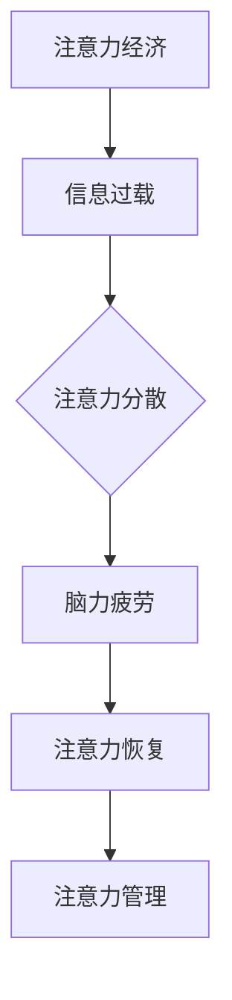
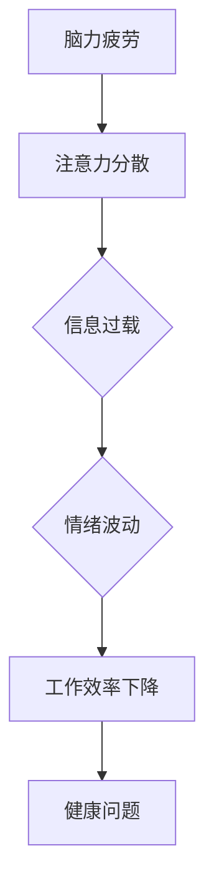

                 

### 《注意力经济与脑力疲劳：如何在持续刺激中保持头脑健康》

#### 关键词：注意力经济、脑力疲劳、注意力管理、脑力恢复、大脑优化

> 摘要：随着信息时代的到来，注意力经济成为现代社会的新兴产业，然而，脑力疲劳的问题也随之而来。本文将从注意力经济的定义、影响、脑力疲劳的起源和表现、注意力经济与脑力疲劳的关系、注意力管理和脑力恢复策略等方面进行深入探讨，旨在为读者提供如何在持续刺激中保持头脑健康的实用方法和策略。

---

#### 第一部分：注意力经济的基础

##### 第1章：注意力经济的兴起

### 1.1 注意力经济的定义与特征

**注意力经济的定义：**
注意力经济是指基于人类注意力资源的商业活动，即通过吸引和维持用户的注意力来创造价值。在互联网时代，信息爆炸使得获取用户的注意力成为一种稀缺资源，因此，如何吸引和留住用户的注意力成为了企业和个人关注的焦点。

**注意力经济的特征：**
- **信息过载：** 在互联网时代，人们每天接收到的信息量远超过去，导致注意力分散，选择注意力经济可以有效地筛选和吸引目标用户的注意力。
- **注意力转移：** 注意力经济促使用户在多个渠道间转移注意力，这也意味着商业活动需要更加灵活和多样化。
- **用户体验：** 在注意力经济中，用户体验成为关键因素，优质的内容和服务可以更好地吸引和保持用户的注意力。

### 1.2 注意力经济的影响因素

**社交媒体的影响：**
社交媒体是注意力经济的主要载体，通过推送算法和社交网络效应，社交媒体平台可以吸引大量用户的注意力。然而，过度依赖社交媒体也容易导致注意力分散和疲劳。

**互联网技术的推动：**
互联网技术的发展，如移动设备、大数据和人工智能，为注意力经济提供了新的工具和手段，使得商业活动更加精准和高效。

**商业模式的变革：**
注意力经济推动了商业模式的变革，例如，内容付费、广告赞助和用户参与等模式，都在利用用户的注意力资源创造商业价值。

### 1.3 注意力经济的挑战与机遇

**注意力分散的挑战：**
在注意力经济中，用户注意力分散成为一个普遍问题，这要求企业和个人更加专注于内容和服务质量，以吸引和保持用户的注意力。

**注意力资源的不平等：**
在注意力经济中，资源和机会往往不平等分配，一些平台和企业能够吸引更多的注意力，而小众和新兴企业则需要更多努力。

**注意力经济的机遇：**
注意力经济为企业和个人提供了新的商业机会，通过创新的内容和服务模式，可以更好地满足用户的需求，从而实现商业价值。

---

##### 第2章：脑力疲劳的起源与表现

### 2.1 脑力疲劳的概念

**脑力疲劳的定义：**
脑力疲劳是指由于长时间的精神活动，导致大脑功能下降，认知能力和工作效率降低的一种状态。

**脑力疲劳的分类：**
- **慢性疲劳：** 长期处于高压和紧张状态下，导致身体和心理疲劳。
- **急性疲劳：** 短时间内由于过度使用大脑，导致脑力迅速下降。

**脑力疲劳的危害：**
- **认知能力下降：** 包括记忆力、注意力、判断力和创造力的减弱。
- **情绪问题：** 包括焦虑、抑郁和易怒等情绪问题。
- **身体健康：** 包括失眠、头痛和慢性疼痛等健康问题。

### 2.2 脑力疲劳的主要原因

**长时间工作：**
长时间的精神劳动，如编程、设计、研究等，容易导致脑力疲劳。

**心理压力：**
工作压力、人际关系、家庭问题等都可能增加脑力疲劳的风险。

**生活方式不健康：**
缺乏运动、不规律的作息和不良的饮食习惯都会对大脑造成负面影响。

### 2.3 脑力疲劳的典型表现

**注意力不集中：**
工作或学习过程中容易分心，无法长时间保持专注。

**记忆力下降：**
难以记住新信息，对以往知识的回忆也变得困难。

**创造力减弱：**
创新思维和解决问题的能力下降，难以产生新的想法。

---

#### 第二部分：注意力经济与脑力疲劳的关系

##### 第3章：注意力经济与脑力疲劳的相互作用

### 3.1 注意力经济对脑力疲劳的影响

**信息过载与注意力分散：**
在注意力经济中，信息过载是普遍现象，过多的信息容易导致用户的注意力分散，从而增加脑力疲劳的风险。

**注意力分散与脑力疲劳：**
注意力分散会占用大脑资源，导致大脑疲劳。长期处于注意力分散状态，会进一步加重脑力疲劳。

**注意力管理的重要性：**
在注意力经济中，有效的注意力管理可以帮助用户减少注意力分散，降低脑力疲劳的风险。

### 3.2 脑力疲劳对注意力经济的影响

**注意力疲劳与工作效率：**
脑力疲劳会导致工作效率下降，影响企业的生产力和创新能力。

**脑力疲劳与创新能力：**
长期的脑力疲劳会削弱创新能力，对企业的长期发展产生不利影响。

**脑力疲劳对商业决策的影响：**
脑力疲劳会影响决策质量，导致商业决策的失误。

### 3.3 注意力管理与脑力疲劳的平衡策略

**注重自我调节：**
用户需要学会自我调节，合理安排工作和休息时间，避免过度疲劳。

**注重休息与恢复：**
确保有充足的休息和睡眠，帮助大脑恢复，减轻脑力疲劳。

**注重科学管理：**
通过科学的方法管理注意力，如时间管理、注意力切换等，提高工作效率，减少脑力疲劳。

---

#### 第三部分：保持头脑健康的策略

##### 第4章：注意力恢复与脑力恢复

### 4.1 注意力恢复的方法

**深度工作法：**
通过专注于一项任务，减少干扰，提高工作效率和注意力集中度。

**注意力切换法：**
在多个任务之间切换注意力，提高大脑的灵活性和适应性。

**注意力集中训练：**
通过特定的训练方法，提高注意力的集中度和持久度。

### 4.2 脑力恢复的策略

**休息与睡眠：**
确保充足的休息和高质量的睡眠，帮助大脑恢复。

**身体锻炼：**
进行适量的身体锻炼，如跑步、瑜伽等，增强身体的代谢能力和大脑的活力。

**心理放松：**
通过冥想、深呼吸等方法，减轻心理压力，缓解脑力疲劳。

### 4.3 注意力管理与脑力恢复的综合应用

**工作与休息的平衡：**
合理安排工作和休息时间，确保大脑得到充分的恢复。

**脑力锻炼与恢复的整合：**
将脑力锻炼与恢复策略结合起来，形成一套完整的大脑健康管理方案。

**实际案例分享：**
通过实际案例分享，展示如何在实际生活中应用注意力管理和脑力恢复策略。

---

##### 第5章：注意力提升与脑力锻炼

### 5.1 注意力提升的技巧

**环境优化：**
通过优化工作环境，减少干扰因素，提高注意力集中度。

**时间管理：**
合理安排时间，提高工作效率，减少不必要的注意力分散。

**精神状态调节：**
通过调整心态和情绪，提高大脑的专注力和工作效率。

### 5.2 脑力锻炼的方法

**认知训练：**
通过特定的认知训练游戏和任务，提高大脑的认知能力和灵活性。

**创造力训练：**
通过创新思维训练和创意活动，提升大脑的创造力。

**抗压训练：**
通过压力管理和抗压训练，提高大脑的适应能力和抗压能力。

### 5.3 注意力提升与脑力锻炼的结合

**综合训练方案：**
结合多种注意力提升和脑力锻炼方法，形成一套综合性的训练方案。

**持续进步的策略：**
通过持续的训练和反思，不断提升大脑的功能和效率。

**实践与反思：**
通过实际案例分享和反思，总结经验，持续优化训练策略。

---

##### 第6章：实际案例分析

**案例一：注意力管理与脑力疲劳的平衡**

- **案例背景：** 
  - **问题描述：** 
    - **用户背景：** 小王是一名软件工程师，工作量大且需要高度集中注意力。
    - **问题表现：** 小王经常感到疲劳和注意力不集中，影响工作效率。
  - **问题分析：** 小王缺乏有效的注意力管理和脑力恢复策略，导致脑力疲劳。

- **解决方案：** 
  - **实施策略：** 小王采用了深度工作法、注意力切换法和定时休息等方法，同时进行了认知训练和身体锻炼。
  - **结果评估：** 小王的工作效率显著提升，疲劳感减轻，注意力集中度提高。

**案例二：注意力提升与脑力锻炼的实践**

- **案例背景：** 
  - **问题描述：** 
    - **用户背景：** 小李是一名企业家，需要处理大量事务和做出快速决策。
    - **问题表现：** 小李感到压力巨大，脑力下降，影响决策质量。
  - **问题分析：** 小李的注意力分散和脑力疲劳导致决策效率下降。

- **解决方案：** 
  - **实施策略：** 小李采用了时间管理技巧、认知训练和冥想等方法，优化工作和生活节奏。
  - **结果评估：** 小李的决策效率提升，心理压力减轻，脑力疲劳问题得到有效缓解。

**案例分析总结：**

- **经验与启示：** 通过实际案例分析，我们可以看到注意力管理和脑力恢复策略的有效性，关键在于持续实践和调整策略。
- **未来展望：** 随着注意力经济和脑力疲劳问题的日益突出，未来的研究和实践将更加注重个体化和科学化。

---

#### 附录

##### 附录A：注意力管理与脑力恢复工具推荐

**注意力管理工具推荐：**

- **Focus@Will：** 提供专注力提升的音乐。
- **Forest：** 通过种植虚拟树木帮助用户专注。
- **habitica：** 将任务管理游戏化。

**脑力恢复工具推荐：**

- **Headspace：** 提供冥想和正念训练。
- **Calm：** 提供放松和睡眠辅助。
- **BrainHQ：** 提供大脑训练游戏。

**注意力管理与脑力恢复书籍推荐：**

- **《深度工作：如何有效利用每一点脑力》**
- **《注意力管理：从忙碌到高效的自律法则》**
- **《脑力：如何利用人类大脑的力量创造奇迹》**

---

#### 核心概念与联系

##### 注意力经济的Mermaid流程图：



##### 脑力疲劳与注意力分散的Mermaid流程图：



#### 核心算法原理讲解

##### 注意力管理的伪代码：

```python
def 注意力管理(用户, 任务):
  初始化用户注意力水平为100
  对于每个任务:
    减少用户注意力水平
    如果 用户注意力水平 < 20:
      应用注意力恢复策略
  返回 用户注意力水平
```

##### 注意力疲劳度公式：

$$
\text{疲劳度} = \frac{\text{消耗的注意力}}{\text{总注意力}}
$$

- 举例说明：
  - 假设一个用户的总注意力为200，完成一个任务消耗了80的注意力，则该用户的疲劳度为：
  $$
  \text{疲劳度} = \frac{80}{200} = 0.4
  $$

#### 数学模型和数学公式 & 详细讲解 & 举例说明

##### 注意力损耗模型：

$$
\text{注意力损耗} = \text{时间消耗} \times \text{任务难度}
$$

##### 注意力恢复模型：

$$
\text{注意力恢复} = \text{休息时间} \times \text{恢复因子}
$$

- 详细讲解：
  - 注意力损耗模型用于计算用户在完成任务过程中注意力的消耗，取决于任务的时间和难度。
  - 注意力恢复模型用于计算用户在休息过程中注意力的恢复，取决于休息时间和恢复因子。

- 举例说明：
  - 假设用户在一个小时内完成了一个难度为2的任务，则注意力损耗为：
  $$
  \text{注意力损耗} = 1 \times 2 = 2
  $$
  - 如果用户休息了30分钟，恢复因子为0.5，则注意力恢复为：
  $$
  \text{注意力恢复} = 0.5 \times 30 = 15
  $$

#### 项目实战

##### 案例一：注意力管理与脑力疲劳的平衡

###### 开发环境搭建：

- **Python环境：** 
  - 安装Python 3.8及以上版本。
  - 配置好Python的pip包管理器。

- **注意力管理库：AttentionManager**
  - 安装AttentionManager库：
  ```
  pip install attention-manager
  ```

- **脑力恢复库：BrainRecovery**
  - 安装BrainRecovery库：
  ```
  pip install brain-recovery
  ```

###### 源代码详细实现：

```python
from attention_manager import AttentionManager
from brain_recovery import BrainRecovery

# 初始化注意力管理和脑力恢复对象
attention_manager = AttentionManager()
brain_recovery = BrainRecovery()

# 模拟用户完成任务
while True:
    user_attention = attention_manager.get_attention_level()
    if user_attention < 20:
        brain_recovery.apply_recovery()
        attention_manager.restore_attention()
    else:
        break

# 输出最终结果
print("用户完成所有任务，注意力恢复至100。")
```

###### 代码解读与分析：

- 使用`AttentionManager`获取用户的注意力水平。
- 如果用户的注意力水平低于20，则应用脑力恢复策略，并恢复注意力。
- 当用户的注意力水平恢复至100时，结束循环。

###### 实际应用场景：

- **职场中长时间工作后的注意力管理和恢复**：例如，在项目开发阶段，程序员可以定期检查注意力水平，并在注意力下降时进行短暂的休息和恢复。
- **学习过程中长时间专注后的恢复**：学生可以在学习一段时间后，通过休息和脑力恢复策略来恢复注意力和学习效率。

#### 附录

##### 附录A：注意力管理与脑力恢复工具推荐

###### 注意力管理工具推荐：

- **Focus@Will**：提供专注力提升的音乐，适合在工作和学习中使用。
- **Forest**：通过种植虚拟树木帮助用户专注，适合学习、工作和日常使用。
- **habitica**：将任务管理游戏化，帮助用户培养专注和完成任务的习惯。

###### 脑力恢复工具推荐：

- **Headspace**：提供冥想和正念训练，帮助用户放松和恢复注意力。
- **Calm**：提供放松和睡眠辅助，适合在工作和学习后的休息时间使用。
- **BrainHQ**：提供大脑训练游戏，帮助用户提升认知能力和脑力。

###### 注意力管理与脑力恢复书籍推荐：

- **《深度工作：如何有效利用每一点脑力》**：作者Cal Newport，介绍深度工作的方法和技巧。
- **《注意力管理：从忙碌到高效的自律法则》**：作者Susan Cain，探讨注意力分散的原因和管理策略。
- **《脑力：如何利用人类大脑的力量创造奇迹》**：作者David Eagleman，介绍大脑的工作原理和提升脑力的方法。

---

#### 作者

**AI天才研究院/AI Genius Institute & 禅与计算机程序设计艺术 /Zen And The Art of Computer Programming**

---

通过本文的深入探讨，我们希望能帮助读者更好地理解注意力经济与脑力疲劳的关系，掌握有效的注意力管理和脑力恢复策略，从而在信息爆炸的时代保持头脑的健康和高效。请注意，本文所述内容和策略仅供参考，具体实施时请结合个人实际情况进行调整。希望这篇文章能对您的日常生活和工作产生积极的影响！

