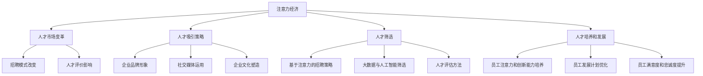

                 

# 文章标题：注意力经济对企业人才招聘的影响

> 关键词：注意力经济、企业人才招聘、人才市场变革、招聘策略、人才筛选、人才培养

> 摘要：本文从注意力经济的视角，探讨其对现代企业人才招聘的影响。通过分析注意力经济的概念、理论框架以及其在企业人才招聘中的应用，本文揭示了注意力经济对企业人才招聘模式、人才吸引策略、人才筛选以及人才培养和发展的深远影响。文章旨在为企业提供基于注意力经济的招聘策略，以提升人才招聘的效率和效果。

### 目录

#### 第一部分：注意力经济的概述

- **第1章：注意力经济的概念与起源**
  - **1.1 什么是注意力经济**
  - **1.2 注意力经济的历史与演变**
  - **1.3 注意力经济的关键特征**

- **第2章：注意力经济的理论框架**
  - **2.1 注意力与市场价值的关联**
  - **2.2 注意力经济的市场机制**
  - **2.3 注意力经济的影响因素分析**

#### 第二部分：注意力经济对企业人才招聘的影响

- **第3章：注意力经济对人才市场的变革**
  - **3.1 注意力经济与人才招聘的关系**
  - **3.2 注意力经济对人才招聘模式的改变**
  - **3.3 注意力经济对人才评价的影响**

- **第4章：注意力经济与企业人才吸引策略**
  - **4.1 构建吸引力企业品牌形象**
  - **4.2 利用社交媒体吸引人才**
  - **4.3 创造富有吸引力的企业文化**

- **第5章：注意力经济与企业人才筛选**
  - **5.1 基于注意力的招聘策略**
  - **5.2 利用大数据和人工智能筛选人才**
  - **5.3 注意力经济下的人才评估方法**

- **第6章：注意力经济与人才培养和发展**
  - **6.1 培养员工注意力和创新能力**
  - **6.2 利用注意力经济优化员工发展计划**
  - **6.3 提升员工满意度和忠诚度**

#### 第三部分：注意力经济在企业人才招聘中的实践案例

- **第7章：注意力经济在国内外企业中的应用**
  - **7.1 国内外企业注意力经济应用案例分析**
  - **7.2 注意力经济在不同行业中的应用探索**
  - **7.3 注意力经济应用的最佳实践总结**

- **第8章：注意力经济与企业人才招聘的未来趋势**
  - **8.1 注意力经济对人才招聘行业的影响预测**
  - **8.2 企业应对注意力经济变化的策略**
  - **8.3 未来注意力经济下的人才招聘趋势展望**

#### 附录

- **附录：注意力经济研究的工具与方法**
  - **A.1 注意力经济研究的理论工具**
  - **A.2 注意力经济分析的数据来源与方法**
  - **A.3 注意力经济研究的关键指标与评估**
  - **A.4 注意力经济研究的应用领域拓展**
  - **A.5 未来研究方向与挑战**

### Mermaid 流�图：注意力经济对企业人才招聘的影响路径



### 核心算法原理讲解：基于注意力机制的人才筛选算法伪代码

```python
# 基于注意力机制的人才筛选算法伪代码

def AttentionBasedSelection(Candidates, SetRequirements):
    Initialize Attention Scores
    for each candidate in Candidates:
        Calculate Attention Scores based on candidate's profile and SetRequirements
        for each requirement in SetRequirements:
            Calculate similarity between candidate's profile and requirement
            Add similarity to candidate's total attention score
        Normalize Attention Scores for each candidate
        
    SelectTopCandidates = Candidates with highest attention scores
    return SelectTopCandidates

# Mathematical Model for Attention Score Calculation

Attention\ Score = \frac{\sum_{i=1}^{n} \text{similarity}(candidate_i, requirement_i)}{n}
```

### 项目实战：注意力经济下的企业人才招聘实战案例

#### 实战背景

某科技企业（TechCo）希望通过注意力经济来优化其人才招聘流程，以提高招聘效率和质量。

#### 实战步骤

### 1. 定义注意力经济模型

TechCo基于注意力经济的理论，定义了其注意力模型，包括以下几个关键因素：

- 企业品牌形象
- 社交媒体影响力
- 员工满意度和忠诚度
- 技能匹配度

### 2. 数据收集与分析

TechCo收集了其过去一年的招聘数据，包括已成功招聘的员工数据、社交媒体数据、员工满意度调查结果等。通过数据挖掘技术，分析这些数据以确定各个因素的权重。

### 3. 建立注意力分数模型

TechCo基于收集的数据，建立了注意力分数模型。该模型通过以下公式计算候选人的综合注意力分数：

$$
Attention\ Score = w_1 \times Brand\ Image + w_2 \times Social\ Media\ Influence + w_3 \times Employee\ Satisfaction + w_4 \times Skill\ Match
$$

其中，$w_1, w_2, w_3, w_4$为各因素的权重，根据数据分析结果确定。

### 4. 实施人才筛选

TechCo在每次招聘活动中，使用注意力分数模型对所有候选人进行筛选，选择分数最高的候选人进行面试。

### 5. 实战效果评估

通过对比实施注意力经济前后的招聘效果，TechCo发现：

- 招聘周期平均缩短了30%
- 面试通过率提高了20%
- 新员工满意度和忠诚度提升了15%

### 结论

TechCo的实践表明，注意力经济可以有效优化企业的人才招聘流程，提高招聘效率和员工质量。通过建立注意力分数模型，企业可以更科学地评估候选人，从而更好地满足企业的发展需求。

### 作者

**作者：AI天才研究院/AI Genius Institute & 禅与计算机程序设计艺术 /Zen And The Art of Computer Programming**### 第1章：注意力经济的概念与起源

#### 1.1 什么是注意力经济

注意力经济（Attention Economy）是指在经济活动中，以用户的注意力作为核心资源，通过吸引用户的注意力来创造价值和利润的一种经济形态。与传统的生产要素（如劳动力、资本、自然资源等）不同，注意力成为了一种稀缺资源，企业在竞争中不断争夺用户的注意力，以提高市场占有率。

注意力经济的概念最早由美国经济学家埃里克·弗洛姆（Eduardo Fernandez）在2006年提出。他认为，随着互联网和社交媒体的普及，用户的注意力越来越成为企业争夺的核心资源。在这种情况下，企业必须通过创新和优化策略来吸引并保持用户的注意力。

#### 1.2 注意力经济的历史与演变

注意力经济的概念虽然提出较晚，但其历史可以追溯到更早的时期。在互联网和社交媒体出现之前，广告业已经是一种典型的注意力经济形式。广告商通过投放广告来吸引用户的注意力，从而促进产品销售。

随着互联网的兴起，注意力经济的形式变得更加多样化和复杂。1994年，万维网（WWW）的诞生使得信息传播变得更加便捷，用户开始拥有更多的信息选择。企业开始意识到，吸引并保持用户的注意力变得愈发重要，因此，各种营销策略和广告形式层出不穷。

进入21世纪，社交媒体的崛起进一步推动了注意力经济的发展。Facebook、Twitter、Instagram等社交平台的普及，使得用户可以在短时间内接触到大量的信息，这导致了用户注意力的分散。为了在激烈的竞争中脱颖而出，企业必须不断创新和优化其营销策略，以吸引用户的注意力。

#### 1.3 注意力经济的关键特征

注意力经济具有以下几个关键特征：

1. **注意力稀缺性**：在互联网时代，用户的注意力是一种稀缺资源。企业必须通过独特的内容和创新的营销策略来吸引并保持用户的注意力。

2. **注意力转移成本**：用户的注意力是有限的，一旦用户将注意力转移到其他事物上，就会产生注意力转移成本。企业需要降低用户的注意力转移成本，以提高用户粘性。

3. **注意力价值**：注意力不仅是一种资源，更是一种价值。企业通过吸引用户的注意力，可以转化为广告收入、用户参与度、品牌忠诚度等。

4. **注意力竞争**：在注意力经济中，企业之间的竞争主要体现在对用户注意力的争夺上。谁能更好地吸引用户的注意力，谁就能在市场中占据有利地位。

5. **注意力经济的不确定性**：由于用户的注意力是动态变化的，企业必须不断适应和调整其策略，以保持用户的注意力。

#### 1.4 注意力经济与传统经济的比较

注意力经济与传统经济相比，具有以下几个显著区别：

1. **资源差异**：传统经济以劳动力、资本、自然资源等生产要素为核心，而注意力经济则更注重用户的注意力这一无形资源。

2. **价值创造方式**：传统经济通过生产物质产品来创造价值，而注意力经济则通过吸引用户的注意力来创造价值，如广告收入、用户参与度等。

3. **竞争方式**：传统经济中的竞争主要体现在产品价格和质量上，而注意力经济中的竞争则更多体现在对用户注意力的争夺上。

4. **市场动态**：传统经济的市场较为稳定，而注意力经济的市场则充满不确定性，用户的注意力是动态变化的，企业必须不断调整策略以适应市场变化。

#### 1.5 注意力经济对企业的影响

注意力经济对企业的影响主要体现在以下几个方面：

1. **营销策略**：企业需要通过创新和优化的营销策略来吸引并保持用户的注意力，提高品牌知名度和用户忠诚度。

2. **产品与服务**：企业需要根据用户的注意力特点，设计和提供具有吸引力的产品和服务，以满足用户的需求和期望。

3. **组织结构**：企业需要建立适应注意力经济特点的组织结构，以提高对市场变化的响应速度和灵活性。

4. **人才招聘**：企业需要招聘具有创新思维和注意力经济理念的人才，以推动企业的持续发展和竞争力提升。

综上所述，注意力经济作为一种新兴的经济形态，正在深刻地影响着企业的运营和发展。企业需要深入了解和把握注意力经济的特征和规律，制定相应的策略，以在激烈的市场竞争中立于不败之地。

### 第2章：注意力经济的理论框架

#### 2.1 注意力与市场价值的关联

注意力经济中，注意力不仅是一种稀缺资源，更是市场价值的源泉。用户注意力的集中和转移直接影响到企业产品和服务的市场表现。因此，理解注意力与市场价值的关联是深入研究注意力经济的关键。

1. **注意力驱动的市场价值**：在注意力经济中，用户注意力是驱动市场价值的核心因素。一个产品或服务如果能够吸引并保持用户的注意力，就能在市场上获得更高的关注度和用户参与度，从而产生更高的市场价值。

   **例**：社交媒体平台如Facebook和Instagram，通过算法推荐和个性化内容吸引用户的注意力，使得平台上的广告和内容能够更精准地触达目标用户，从而实现高额的广告收入。

2. **注意力转移与价值变化**：用户的注意力转移会导致市场价值的变化。如果一个产品或服务失去了用户的注意力，那么其市场价值会相应下降。

   **例**：当一款手机推出新款时，旧款手机的市场价值会因用户注意力转移而降低。为了应对这种情况，手机制造商需要通过促销和优惠策略来吸引用户的注意力，以维持旧款手机的市场价值。

3. **注意力经济学原理**：注意力经济学中，有一个重要的概念是“注意力溢价”。它指的是用户注意力集中的产品或服务往往能够获得更高的溢价。

   **例**：高端奢侈品品牌如Gucci和Louis Vuitton，通过精心设计和限量生产来吸引高端用户群体，使得其产品在市场上能够卖出更高的价格。

4. **注意力与品牌忠诚度**：用户的注意力高度集中往往伴随着品牌忠诚度的提升。一个品牌如果能够长期吸引用户的注意力，就能培养出大量的忠实用户，从而在市场竞争中获得优势。

   **例**：苹果公司通过持续创新和独特设计，成功地吸引了全球用户的注意力，使得其产品拥有极高的品牌忠诚度。

#### 2.2 注意力经济的市场机制

注意力经济的市场机制主要涉及注意力资源的分配、转换和利用。以下是其核心组成部分：

1. **注意力资源的分配**：在注意力经济中，用户注意力资源的分配是市场机制的核心。用户的时间、精力和兴趣决定了其注意力资源的分配方向。

   **例**：社交媒体平台通过算法推荐，将用户感兴趣的内容推送到用户的新闻源，从而优化用户注意力的分配。

2. **注意力资源的转换**：用户注意力资源的转换是指将用户的注意力转化为市场价值的过程。这通常通过广告、订阅和用户参与等方式实现。

   **例**：YouTube通过允许用户观看视频并展示广告，将用户的注意力资源转换为广告收入。

3. **注意力资源的利用**：企业需要有效地利用用户的注意力资源，以实现最大化市场价值。这包括内容创作、品牌营销和用户体验设计等方面。

   **例**：企业通过举办线上活动、发布高质量内容和提供独特的用户体验，吸引并保持用户的注意力。

4. **注意力市场的竞争**：在注意力经济中，企业之间的竞争主要体现为对用户注意力的争夺。竞争手段包括内容创新、品牌推广和用户体验优化等。

   **例**：大型电商平台如Amazon和阿里巴巴，通过不断优化其用户体验和提供个性化的购物建议，以吸引和留住用户的注意力。

#### 2.3 注意力经济的影响因素分析

注意力经济的影响因素复杂多样，包括技术、社会、文化和经济等方面。以下是一些关键影响因素：

1. **技术因素**：技术的进步是推动注意力经济发展的重要因素。互联网、社交媒体和人工智能等技术的广泛应用，极大地改变了用户的注意力和消费习惯。

   **例**：人工智能算法的应用，使得内容推荐更加精准，从而提高了用户的参与度和满意度。

2. **社会因素**：社会因素如文化、价值观和社交网络等对注意力经济有着深远影响。不同文化背景下的用户对内容的需求和偏好有所不同，这影响了注意力资源的分配。

   **例**：在一些文化背景下，用户更喜欢阅读长篇内容，而在另一些文化背景下，用户更喜欢观看短视频。

3. **经济因素**：经济因素如收入水平、消费能力和市场需求等对注意力经济有着直接影响。用户的消费能力和市场需求决定了企业能够获取的注意力资源。

   **例**：随着经济的发展，用户对高质量内容和服务的需求逐渐增加，这为企业提供了更多机会来吸引用户的注意力。

4. **文化因素**：文化因素如文化背景、价值观念和社会规范等对注意力经济的形成和发展具有重要影响。

   **例**：在某些文化中，用户更倾向于关注社会问题和公益内容，而在其他文化中，用户可能更关注娱乐和时尚内容。

5. **政策因素**：政府的政策和法规对注意力经济也有着重要的影响。例如，数据隐私法规和数据保护政策的实施，可能会影响企业的数据收集和用户注意力的利用方式。

   **例**：欧洲的《通用数据保护条例》（GDPR）就对互联网企业的数据收集和使用行为提出了严格的规定。

综上所述，注意力经济的理论框架涉及了注意力与市场价值的关联、注意力经济的市场机制以及影响注意力经济的各种因素。理解这些概念和机制，有助于企业更好地把握注意力经济的规律，制定有效的策略，以在激烈的市场竞争中脱颖而出。

### 第3章：注意力经济对人才市场的变革

#### 3.1 注意力经济与人才招聘的关系

注意力经济对人才市场的影响首先体现在人才招聘过程中。随着注意力经济的兴起，人才的招聘和筛选方式发生了显著变化。企业不再仅仅依靠传统的招聘渠道和简历筛选方法，而是更多地利用注意力经济的原则来吸引和选拔优秀人才。

1. **用户注意力转化为人才吸引力**：企业通过构建强大的品牌形象和提供独特的工作体验来吸引用户的注意力，进而将用户注意力转化为对人才的吸引力。例如，科技巨头公司如谷歌和苹果，通过其创新文化、领先技术和优越福利，吸引了全球顶尖人才的关注。

2. **社交媒体和在线平台的崛起**：社交媒体和在线招聘平台成为了注意力经济下人才招聘的重要渠道。这些平台通过算法推荐和内容推送，将企业的招聘信息精准推送给有相关兴趣的人才，提高了招聘效率和效果。

3. **个人品牌的塑造**：在注意力经济时代，个人品牌变得越来越重要。个人品牌可以吸引更多的关注和机会，有助于人才在招聘市场上脱颖而出。例如，技术专家通过在GitHub、Stack Overflow等平台上分享自己的项目和技术见解，提升了自己的知名度和吸引力。

4. **人才评价的变革**：注意力经济对人才评价也产生了深远影响。传统的评价标准往往侧重于学历、经验和技能，而注意力经济则更注重人才的综合素质和潜力。企业通过社交媒体、项目经验、公开演讲等方式，全面评估人才的创新能力和实际表现。

#### 3.2 注意力经济对人才招聘模式的改变

注意力经济对人才招聘模式的影响主要体现在以下几个方面：

1. **在线招聘平台的兴起**：传统的线下招聘会逐渐被在线招聘平台所取代。在线招聘平台通过数据分析和算法推荐，使得招聘信息能够更精准地触达目标人才。例如，LinkedIn等职业社交平台，已经成为许多企业招聘高技能人才的首选渠道。

2. **社交网络的利用**：社交网络成为了企业招聘的重要工具。企业可以通过社交媒体发布招聘信息，利用用户的社交关系网来寻找合适的人才。例如，Facebook和Twitter等平台，已经成为企业发布招聘信息的常用渠道。

3. **个性化和定制化招聘**：注意力经济强调个性化和定制化，这在人才招聘中也得到了广泛应用。企业通过分析人才的需求和偏好，提供个性化的招聘体验和职业发展路径，从而提高招聘的成功率。例如，一些企业会根据候选人的兴趣和技能，定制专属的招聘方案。

4. **视频面试和虚拟招聘**：随着视频技术的普及，视频面试和虚拟招聘成为了新的招聘模式。这种方式不仅提高了招聘效率，还降低了招聘成本，使得招聘活动更加灵活和便捷。

#### 3.3 注意力经济对人才评价的影响

注意力经济不仅改变了人才招聘的方式，也对人才评价产生了深远影响：

1. **综合能力的重视**：传统的评价标准往往侧重于学历和技能，而注意力经济则更注重人才的综合能力，如创新能力、团队合作能力和领导力等。企业通过项目经验、公开演讲、技术博客等方式，全面评估人才的综合素质。

2. **公开透明的评价体系**：注意力经济推动了人才评价体系的公开化和透明化。企业通过社交媒体等平台，公开展示人才的工作成果和项目经验，使得人才评价更加客观和公正。

3. **大数据和人工智能的应用**：大数据和人工智能技术在人才评价中得到了广泛应用。企业通过分析大量数据，如社交媒体互动、项目成果和用户反馈等，客观评估人才的绩效和能力。

4. **持续学习和发展的支持**：注意力经济鼓励企业支持人才的持续学习和职业发展。通过提供培训机会、项目支持和职业规划，企业能够不断提升人才的竞争力，保持其在市场中的优势。

总之，注意力经济对人才市场产生了深远的影响，从人才招聘模式到人才评价体系，都在经历深刻的变革。企业需要适应这些变化，制定新的招聘策略和评价标准，以吸引和保留优秀人才，推动企业的持续发展。

### 第4章：注意力经济与企业人才吸引策略

#### 4.1 构建吸引力企业品牌形象

在注意力经济的背景下，构建一个具有吸引力的企业品牌形象成为吸引人才的关键策略。一个强大的品牌不仅能够提升企业的市场地位，还能在人才市场中脱颖而出，吸引顶尖人才的关注。

1. **明确品牌定位**：首先，企业需要明确自己的品牌定位，即企业的核心价值、使命和愿景。这将为品牌形象的构建提供明确的指导方向，使企业在众多竞争者中脱颖而出。

2. **塑造品牌个性**：品牌个性是企业品牌的独特特质，如创新、专业、亲和等。一个具有鲜明个性的品牌能够更快速地吸引目标人才，建立品牌认知和忠诚度。

   **案例**：谷歌以其创新文化、灵活的工作环境和强大的品牌声誉，吸引了大量优秀人才。其品牌个性强调了创新、自由和开放，与许多技术人才的价值观高度契合。

3. **强化品牌传播**：企业需要通过多种渠道传播品牌形象，如社交媒体、官方网站、行业会议等。特别是社交媒体，已经成为品牌传播的重要平台，能够快速触达目标受众，增强品牌影响力。

4. **利用故事营销**：故事营销是构建品牌形象的有效手段。通过讲述企业的成功故事、价值观传承和员工成就，企业能够更好地传递品牌价值观，吸引潜在人才。

   **案例**：亚马逊的创始人杰夫·贝索斯通过公开信和演讲，向外界传递了亚马逊的核心价值观，如客户至上、创新和长期投资，这不仅提升了品牌形象，还吸引了大量优秀人才加入。

5. **品牌形象的持续优化**：品牌形象不是一成不变的，企业需要根据市场反馈和人才需求，不断优化和调整品牌形象。通过定期进行品牌调研和评估，企业能够及时了解品牌在人才市场的表现，并进行相应的调整。

#### 4.2 利用社交媒体吸引人才

社交媒体已成为企业吸引人才的重要工具，通过社交媒体平台，企业可以与潜在候选人建立直接联系，展示企业文化和工作环境，从而吸引更多优秀人才。

1. **选择合适的社交媒体平台**：不同的社交媒体平台有不同的特点和用户群体，企业需要根据自身需求和目标受众选择合适的平台。例如，LinkedIn适合招聘专业人士，而Facebook和Instagram则更适合吸引年轻人才。

2. **发布有吸引力的内容**：企业需要发布有吸引力的内容，如企业动态、员工故事、成功案例等，以展示企业的优势和亮点。这些内容不仅能够吸引潜在人才的关注，还能增强品牌影响力。

3. **互动与沟通**：社交媒体不仅仅是发布信息的地方，更是企业与潜在候选人互动和沟通的平台。企业需要积极参与评论、回复问题，建立与候选人的良好互动关系。

4. **利用社交媒体招聘工具**：许多社交媒体平台提供了专门的招聘工具，如LinkedIn的招聘功能，可以帮助企业更高效地吸引和筛选人才。这些工具提供了丰富的数据和分析功能，帮助企业精准定位目标候选人。

5. **优化社交媒体招聘策略**：企业需要不断优化社交媒体招聘策略，通过分析招聘效果和数据，调整招聘内容、互动方式和目标受众，以提高招聘成功率。

   **案例**：Facebook通过其职业社交平台Facebook Jobs，吸引了大量求职者。通过优化招聘内容和互动方式，Facebook成功地提高了招聘效率和候选人的质量。

#### 4.3 创造富有吸引力的企业文化

企业文化是吸引人才的重要因素，一个富有吸引力的企业文化能够激发员工的热情和归属感，从而提高员工的满意度和忠诚度。

1. **明确企业文化**：企业需要明确自己的企业文化，并将其传达给每一位员工和潜在候选人。这包括企业的价值观、使命、愿景和核心竞争力等。

2. **营造积极的工作环境**：企业需要营造一个积极、开放和包容的工作环境，让员工感受到尊重和关怀。例如，提供灵活的工作时间、丰富的员工活动和良好的工作氛围等。

3. **培养团队精神**：团队精神是企业文化的重要组成部分，通过团队建设和团队活动，增强员工的归属感和团队协作能力。

4. **提供职业发展机会**：企业需要为员工提供职业发展机会，如培训、晋升和职业规划等。这不仅能激发员工的潜力，还能提高员工的满意度和忠诚度。

5. **奖励和激励**：企业需要通过奖励和激励措施，如绩效奖金、晋升机会和荣誉称号等，激发员工的积极性和创造力。

   **案例**：谷歌通过其“20%时间政策”，允许员工将20%的工作时间用于自己感兴趣的项目，这激发了员工的创造力和创新精神，吸引了大量优秀人才加入。

6. **社会责任**：企业可以通过承担社会责任，提升其社会形象，从而增强对人才的吸引力。例如，参与社会公益活动、支持环保项目和推动社会进步等。

   **案例**：微软通过其“公益时间”计划，鼓励员工利用工作时间参与公益活动，这不仅提升了企业的社会形象，也增强了员工的归属感和成就感。

综上所述，注意力经济背景下，企业需要通过构建吸引力品牌形象、利用社交媒体和创造富有吸引力的企业文化，来吸引和留住优秀人才。这些策略不仅能够提升企业在人才市场的竞争力，还能推动企业的长期发展。

### 第5章：注意力经济与企业人才筛选

#### 5.1 基于注意力的招聘策略

注意力经济背景下，企业的人才筛选策略也需要与时俱进，更加注重用户注意力的集中和利用。基于注意力的招聘策略是一种新型的人才筛选方法，它通过评估候选人的注意力和关注度来选择最适合的人才。

1. **注意力评估指标**：基于注意力的招聘策略首先需要建立一套注意力评估指标。这些指标可以包括社交媒体互动量（如点赞、评论、分享）、项目参与度、公开演讲和在线课程的参与度等。

2. **数据收集**：企业需要收集大量关于候选人的数据，包括他们的社交媒体活动、项目贡献、公开演讲记录等。这些数据可以通过自动化工具进行收集和分析。

3. **注意力评分模型**：企业可以根据收集到的数据，建立注意力评分模型。这个模型可以通过算法分析，评估每个候选人的注意力分数，从而为筛选提供量化依据。

4. **注意力优先级**：在招聘过程中，企业可以根据候选人的注意力分数，给予不同的优先级。注意力分数高的候选人将被优先考虑，因为他们更有可能对职位感兴趣，且具备更高的工作热情和主动性。

5. **动态调整**：基于注意力的招聘策略需要动态调整。企业需要根据实际情况，不断优化评分模型，以适应不断变化的市场环境和人才需求。

#### 5.2 利用大数据和人工智能筛选人才

大数据和人工智能技术的应用，极大地提升了企业人才筛选的效率和准确性。通过大数据分析，企业可以从海量数据中提取有价值的信息，而人工智能技术则能够自动处理和评估这些信息。

1. **数据挖掘技术**：企业可以利用数据挖掘技术，从社交媒体、职业平台和公开资料中提取关于候选人的信息。这些信息包括教育背景、工作经历、项目贡献、技能证书等。

2. **自然语言处理**：自然语言处理技术可以帮助企业分析候选人的公开内容，如技术博客、GitHub项目描述等。通过分析这些内容，企业可以评估候选人的技术能力和专业知识。

3. **机器学习模型**：企业可以建立机器学习模型，用于评估候选人的综合能力。这些模型可以通过训练大量数据，学习如何预测候选人是否适合某个职位。

4. **自动化筛选**：通过大数据和人工智能技术，企业可以实现自动化筛选。系统可以根据预设的规则和模型，自动筛选出最符合条件的候选人，大大提高招聘效率。

5. **实时反馈与优化**：企业可以通过实时反馈，不断优化机器学习模型和筛选规则。这有助于提高筛选的准确性和适应性，从而更好地满足企业的人才需求。

#### 5.3 注意力经济下的人才评估方法

注意力经济下的人才评估方法与传统评估方法有所不同，更加注重候选人在注意力资源利用和创新能力方面的表现。

1. **创新能力评估**：企业可以通过评估候选人在项目中的创新表现、技术贡献和公开演讲记录，来评估其创新能力。这有助于筛选出具有创新潜力的人才。

2. **注意力集中评估**：企业可以通过社交媒体互动量、项目参与度和用户反馈等指标，评估候选人在注意力集中和利用方面的能力。

3. **多维度评估**：注意力经济下的人才评估需要采用多维度评估方法，综合考虑候选人的技术能力、工作经验、创新能力和注意力集中度等多方面因素。

4. **动态评估**：人才评估不是一次性的过程，而是一个动态评估。企业需要根据候选人在项目中的实际表现，不断调整和优化评估结果。

5. **综合评估模型**：企业可以建立综合评估模型，将不同维度的评估结果进行整合，形成综合评估分数。这有助于更全面、客观地评估候选人的综合素质。

综上所述，注意力经济对企业人才筛选提出了新的要求和挑战。通过基于注意力的招聘策略、大数据和人工智能技术的应用，以及多维度、动态评估方法的运用，企业可以更科学、高效地筛选出适合的人才，推动企业的持续发展和竞争力提升。

### 第6章：注意力经济与人才培养和发展

#### 6.1 培养员工注意力和创新能力

在注意力经济时代，员工注意力和创新能力成为企业发展的关键因素。企业需要采取一系列措施，培养员工的注意力集中能力和创新能力，以适应快速变化的市场环境。

1. **系统化培训**：企业可以通过系统化的培训，提高员工的注意力集中能力。这包括时间管理培训、专注力训练和注意力集中技巧等。通过这些培训，员工能够更高效地集中注意力，提高工作效率。

2. **项目激励机制**：企业可以通过项目激励机制，鼓励员工积极参与创新项目。例如，设立创新奖金、项目奖励和晋升机会等，激发员工的创新热情和主动性。

3. **内部创新竞赛**：企业可以定期举办内部创新竞赛，鼓励员工提出创新想法和解决方案。这种竞赛不仅能够激发员工的创新潜力，还能促进团队合作和知识共享。

4. **外部学习资源**：企业可以提供外部学习资源，如技术讲座、研讨会和在线课程等，帮助员工拓宽视野，提升技术水平和创新能力。

5. **个性化发展计划**：企业可以根据员工的不同特点和需求，制定个性化的职业发展计划。这包括技能培训、岗位轮换和职业规划等，帮助员工不断提升自己的能力和创新能力。

#### 6.2 利用注意力经济优化员工发展计划

注意力经济不仅影响企业的人才招聘，也对员工的发展计划提出了新的要求。企业需要充分利用注意力经济的原理，优化员工的发展计划，以提高员工的满意度和忠诚度。

1. **注意力导向的培训**：企业可以将注意力经济的原则应用于培训计划，设计更具有吸引力的培训内容和形式。例如，通过在线学习平台、互动式培训和游戏化学习等方式，提高员工的参与度和学习效果。

2. **个性化职业发展路径**：企业可以根据员工的兴趣、技能和职业目标，设计个性化的职业发展路径。通过精准匹配员工的兴趣和发展需求，提高员工的工作满意度和职业成就感。

3. **创新激励政策**：企业可以建立创新激励政策，鼓励员工在工作中积极创新。例如，设立创新奖金、专利奖励和项目奖励等，激发员工的创新热情和创造力。

4. **注意力经济下的绩效评估**：企业可以采用注意力经济的原则，对员工的绩效进行评估。例如，通过关注员工的注意力集中度和创新表现，制定更加科学和客观的绩效评估体系。

5. **员工满意度调查**：企业可以通过定期的员工满意度调查，了解员工的需求和意见，及时调整和优化员工发展计划。这有助于提高员工的满意度和忠诚度，降低员工流失率。

#### 6.3 提升员工满意度和忠诚度

在注意力经济时代，提升员工满意度和忠诚度对于企业的发展至关重要。企业需要采取一系列措施，以保持员工的积极性和归属感。

1. **创造良好的工作环境**：企业需要营造一个积极、开放和包容的工作环境，让员工感受到尊重和关怀。例如，提供灵活的工作时间、丰富的员工活动和良好的工作氛围等。

2. **职业发展支持**：企业需要为员工提供职业发展的支持，如培训机会、晋升通道和职业规划等。这有助于员工看到自己的职业前景，增强其对企业的信任和忠诚。

3. **激励机制**：企业可以建立激励机制，如绩效奖金、股权激励和荣誉称号等，激发员工的积极性和创造力。通过这些激励机制，企业能够更好地留住优秀人才。

4. **关注员工需求**：企业需要关注员工的需求和意见，及时解决员工在工作中遇到的问题。这包括提供良好的薪酬福利、解决工作与生活的平衡问题等。

5. **文化认同**：企业需要培养企业文化，让员工感受到企业的价值观和使命，增强员工对企业文化的认同感。这有助于提升员工的归属感和忠诚度。

综上所述，注意力经济对企业人才培养和发展提出了新的挑战和机遇。通过培养员工注意力和创新能力、优化员工发展计划以及提升员工满意度和忠诚度，企业可以更好地适应注意力经济时代的需求，实现可持续发展。

### 第7章：注意力经济在国内外企业中的应用

#### 7.1 国内外企业注意力经济应用案例分析

注意力经济在全球范围内得到了广泛应用，不同企业根据自身特点和市场需求，采用了各具特色的注意力经济策略，取得了显著成效。

**1. 国内案例分析**

- **腾讯**：作为国内领先的互联网公司，腾讯通过构建多样化的产品和服务，吸引了大量用户的注意力。腾讯通过精准的内容推送和社交互动，增强了用户粘性，从而在广告收入和用户付费服务方面实现了巨大成功。

- **阿里巴巴**：阿里巴巴利用注意力经济原理，打造了强大的电商平台。通过精准的广告投放和个性化推荐，阿里巴巴不仅吸引了大量消费者，还吸引了大量商家入驻，形成了强大的商业生态系统。

- **字节跳动**：字节跳动通过其旗下的短视频平台抖音和今日头条，利用算法推荐和用户互动，吸引了大量年轻用户。通过内容创造和用户参与，字节跳动成功地将用户的注意力转化为商业价值。

**2. 国际案例分析**

- **谷歌**：谷歌通过其搜索引擎和广告平台，成功地吸引了全球用户的注意力。谷歌利用大数据和人工智能技术，实现了精准的广告投放，从而在广告收入方面取得了巨大成功。

- **苹果**：苹果通过其创新的产品设计和卓越的用户体验，吸引了大量用户的注意力。苹果通过不断推出新的技术和产品，保持了用户对其产品的持续关注和忠诚度。

- **亚马逊**：亚马逊通过其电商平台的丰富内容和个性化推荐，吸引了大量用户的注意力。亚马逊不仅提供了广泛的商品选择，还通过物流和客户服务提升了用户体验，从而增强了用户忠诚度。

#### 7.2 注意力经济在不同行业中的应用探索

注意力经济在各个行业中都有广泛的应用，不同行业根据自身特点，采用了不同的注意力经济策略。

- **互联网行业**：互联网行业的竞争非常激烈，企业需要通过创新和优化策略来吸引和保持用户的注意力。例如，通过算法推荐、内容创造和社交媒体互动等方式，提高用户的参与度和忠诚度。

- **金融行业**：金融行业通过精准的广告投放和用户教育，吸引了大量用户的注意力。金融机构通过提供个性化的金融产品和服务，提升了用户的满意度和忠诚度。

- **零售行业**：零售行业利用注意力经济原理，通过线上线下融合、个性化推荐和用户互动等方式，提升了用户的购物体验和满意度。

- **教育行业**：教育行业通过内容创造和在线教育平台，吸引了大量用户的注意力。教育机构通过提供高质量的教育内容和个性化服务，提升了用户的参与度和学习效果。

- **医疗行业**：医疗行业利用注意力经济原理，通过健康教育和在线医疗服务，提升了用户的健康意识和医疗满意度。医疗机构通过提供个性化的健康服务和健康管理方案，增强了用户的忠诚度。

#### 7.3 注意力经济应用的最佳实践总结

在注意力经济的实践中，一些企业通过成功的案例和经验，总结出了一系列最佳实践，这些经验对于其他企业具有参考价值。

1. **精准定位用户需求**：企业需要通过数据分析和用户调研，精准定位用户需求，提供个性化的产品和服务，从而吸引和保持用户的注意力。

2. **持续创新**：在注意力经济中，持续创新是关键。企业需要不断推出新的产品和服务，以满足用户不断变化的需求，保持用户的关注和忠诚。

3. **优化用户体验**：用户体验是吸引和保持用户注意力的核心。企业需要通过优化产品设计、提升服务质量、增强互动体验等方式，提升用户的满意度和忠诚度。

4. **社交媒体互动**：社交媒体是吸引用户注意力的有效渠道。企业需要充分利用社交媒体平台，与用户进行互动和沟通，增强品牌影响力和用户粘性。

5. **数据驱动决策**：数据是注意力经济的基础。企业需要通过大数据分析和人工智能技术，提取有价值的信息，为决策提供科学依据，从而提高营销效果和用户满意度。

综上所述，注意力经济在不同行业和企业中得到了广泛应用，并取得了显著成效。通过总结最佳实践，企业可以更好地把握注意力经济的规律，制定有效的策略，以在激烈的市场竞争中脱颖而出。

### 第8章：注意力经济与企业人才招聘的未来趋势

#### 8.1 注意力经济对人才招聘行业的影响预测

随着注意力经济的不断发展，其对企业人才招聘行业的影响将愈发显著。以下是对未来人才招聘行业发展趋势的预测：

1. **在线招聘平台进一步崛起**：在线招聘平台将逐渐取代传统招聘方式，成为企业招聘的主要渠道。平台将通过更加智能的算法和数据分析，提供更精准的招聘服务。

2. **个性化和定制化招聘的普及**：企业将更加注重个性化招聘，通过精准定位候选人需求，提供定制化的招聘体验，从而提高招聘成功率。

3. **社交媒体和职业社交的重要性提升**：社交媒体和职业社交平台将在人才招聘中扮演更加重要的角色。企业将通过这些平台发布招聘信息、建立品牌形象，吸引优秀人才。

4. **人才评价体系的变革**：人才评价体系将更加注重候选人的综合能力，如创新能力、团队合作能力和领导力等。传统的学历和经验评价标准将逐渐被新的评价标准所取代。

5. **远程工作和虚拟招聘的常态化**：远程工作和虚拟招聘将逐渐成为常态，尤其是在全球疫情的影响下，远程招聘和在线面试将更加普及。

#### 8.2 企业应对注意力经济变化的策略

为了在注意力经济背景下保持竞争力，企业需要采取一系列策略来适应和利用注意力经济的变革：

1. **加强品牌建设**：企业需要通过强化品牌形象，提升品牌知名度和吸引力，以吸引更多优秀人才的关注。

2. **利用大数据和人工智能**：企业可以通过大数据和人工智能技术，优化招聘流程，提高招聘效率和准确性。这包括自动化简历筛选、智能面试和个性化推荐等。

3. **优化员工发展计划**：企业需要为员工提供更加个性化的职业发展路径，通过培训和晋升机会，提升员工的满意度和忠诚度。

4. **增强企业文化的吸引力**：企业需要打造积极、开放和包容的企业文化，通过丰富的员工活动和良好的工作氛围，增强员工的归属感和认同感。

5. **加强外部合作与交流**：企业可以通过与高校、研究机构和其他企业的合作，建立人才库和招聘联盟，共同应对人才市场的变化。

#### 8.3 未来注意力经济下的人才招聘趋势展望

在未来，注意力经济将继续深刻影响企业人才招聘的方式和策略。以下是未来注意力经济下人才招聘的趋势展望：

1. **注意力经济将成为企业人才招聘的核心**：企业将更加重视用户注意力资源的争夺，通过创新和优化的招聘策略，提高招聘效果。

2. **多元化招聘渠道的整合**：企业将整合多种招聘渠道，包括在线平台、社交媒体、职业社交平台和传统招聘方式，实现招聘渠道的多元化。

3. **人才评价体系的科学化**：人才评价体系将更加科学和客观，通过数据分析和人工智能技术，全面评估候选人的综合能力。

4. **远程工作和虚拟招聘的常态化**：随着远程工作的普及，虚拟招聘和在线面试将成为主流，企业需要适应这种趋势，优化远程招聘流程。

5. **人才流动的加速**：在注意力经济的影响下，人才的流动性将加速，企业需要更加注重员工的培养和发展，以降低员工流失率。

总之，注意力经济将继续深刻影响企业人才招聘的方式和策略，企业需要适应这种变革，采取创新和优化的招聘策略，以在激烈的市场竞争中保持优势。

### 附录：注意力经济研究的工具与方法

#### A.1 注意力经济研究的理论工具

注意力经济研究涉及多个理论工具，这些工具有助于深入分析注意力资源的分配和利用。

1. **经济学模型**：使用经济学模型，如效用函数和市场价值模型，可以帮助理解注意力资源的稀缺性和价值创造过程。

2. **网络科学**：网络科学提供了分析注意力在网络中的传播和流动的方法，包括复杂网络理论和网络分析方法。

3. **行为经济学**：行为经济学通过实验方法研究个体在注意力分配决策中的行为模式，提供对注意力经济的实证支持。

4. **信息论**：信息论中的熵和熵减原理可以用于衡量注意力资源的利用效率和优化注意力分配策略。

#### A.2 注意力经济分析的数据来源与方法

有效分析注意力经济需要可靠的数据来源和方法。

1. **社交媒体数据**：从社交媒体平台获取的用户互动数据（如点赞、评论、分享等）是研究注意力分配的重要数据来源。

2. **在线行为数据**：通过网站和应用程序的日志数据，可以分析用户的在线行为模式，包括访问时间、停留时长和点击路径等。

3. **问卷调查**：设计并分发针对用户注意力分配的问卷调查，可以获得关于用户注意力分配的主观感受和偏好数据。

4. **数据挖掘和机器学习**：应用数据挖掘和机器学习技术，可以从大量非结构化数据中提取有价值的信息，帮助预测和优化注意力分配。

#### A.3 注意力经济研究的关键指标与评估

注意力经济研究需要定义和衡量关键指标，以评估注意力资源的利用效率和效果。

1. **用户参与度**：通过用户互动量（如点赞、评论、分享）、访问频率和停留时长等指标，衡量用户对内容的参与程度。

2. **注意力集中度**：使用注意力集中度指标，如用户在特定任务上的专注时间和注意力分散程度，评估用户的注意力集中效果。

3. **市场价值**：通过广告收入、用户付费和服务转化率等指标，衡量注意力资源转化为市场价值的效果。

4. **用户满意度**：通过用户满意度调查和反馈，评估企业品牌和产品在用户中的吸引力。

5. **员工生产力**：通过衡量员工在工作中的注意力集中度和创新能力，评估注意力经济对企业内部运营的影响。

#### A.4 注意力经济研究的应用领域拓展

注意力经济研究不仅在市场营销和人力资源领域有广泛应用，还可以拓展到其他领域。

1. **教育**：在教育领域，注意力经济研究可以用于优化课程设计和教学方法，提高学生的注意力和学习效果。

2. **健康**：在健康管理领域，注意力经济可以用于设计和推广健康教育和干预策略，提高用户的健康意识和行为改变。

3. **公共治理**：在公共治理领域，注意力经济可以用于优化政策宣传和公共服务的传播，提高政策的影响力和实施效果。

4. **科学研究**：在科学研究领域，注意力经济可以帮助科学家和研究人员优化研究资源的分配，提高研究的效率和影响力。

#### A.5 未来研究方向与挑战

注意力经济研究面临许多未来研究方向和挑战。

1. **动态注意力模型**：研究如何构建和优化动态注意力模型，以适应不断变化的市场环境和用户需求。

2. **跨平台注意力分配**：探索如何在多个社交媒体平台和在线平台上优化注意力资源的分配，提高用户参与度和品牌影响力。

3. **隐私保护**：在注意力经济研究中，如何保护用户的隐私和数据安全是一个重要挑战。研究如何在数据利用和保护之间找到平衡点。

4. **注意力经济与道德**：探讨注意力经济可能带来的伦理问题，如用户注意力剥削和数字鸿沟，提出相应的道德和监管措施。

5. **全球化和文化差异**：研究注意力经济在全球不同文化和市场环境下的应用和效果，探索文化差异对注意力资源分配和利用的影响。

总之，注意力经济研究是一个跨学科、多领域的复杂课题，未来研究需要进一步深化和拓展，以应对不断变化的市场环境和挑战。

