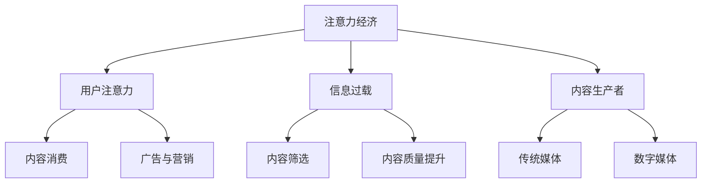

                 

### 文章标题：注意力经济对传统媒体内容形式的改变

> 关键词：注意力经济、传统媒体、内容形式、媒体转型、用户参与

> 摘要：本文深入探讨了注意力经济对传统媒体内容形式产生的深远影响。从注意力经济的定义与起源，到其核心要素与特征，本文逐步分析了传统媒体内容形式现状及其面临的挑战。在此基础上，本文探讨了注意力经济对传统媒体内容形式的影响，包括注意力导向的内容策略、用户参与与互动、内容个性化与精准营销。随后，本文探讨了注意力经济下媒体内容创新的多种形式，并通过具体案例进行了详细分析。最后，本文总结了注意力经济对传统媒体内容形式改变的机遇与挑战，提出了未来媒体内容发展的方向。

---

### 《注意力经济对传统媒体内容形式的改变》目录大纲

#### 第一部分：引言

- # 第1章：注意力经济概述
  - 1.1 注意力经济的定义与起源
  - 1.2 注意力经济的核心要素
  - 1.3 注意力经济的特征与发展趋势

#### 第二部分：传统媒体内容形式分析

- # 第2章：传统媒体内容形式现状
  - 2.1 传统媒体的历史发展
  - 2.2 传统媒体的内容生产模式
  - 2.3 传统媒体面临的挑战

#### 第三部分：注意力经济对传统媒体的影响

- # 第3章：注意力经济对传统媒体内容形式的影响
  - 3.1 注意力导向的内容策略
  - 3.2 用户参与与互动
  - 3.3 内容个性化与精准营销

#### 第四部分：注意力经济下的媒体内容创新

- # 第4章：新内容形式的探索
  - 4.1 视频内容的崛起
  - 4.2 互动式内容设计
  - 4.3 社交媒体的融合

#### 第五部分：案例分析

- # 第5章：成功案例分析
  - 5.1 案例一：抖音的内容创新
  - 5.2 案例二：B站的社区文化
  - 5.3 案例三：今日头条的个性化推荐

#### 第六部分：未来趋势与挑战

- # 第6章：注意力经济下的媒体内容发展趋势
  - 6.1 技术进步的影响
  - 6.2 内容生态的优化
  - 6.3 法律法规与道德伦理的考量

#### 第七部分：结论

- # 第7章：注意力经济对传统媒体内容形式改变的总结
  - 7.1 注意力经济带来的机遇与挑战
  - 7.2 传统媒体转型的策略与建议
  - 7.3 未来媒体内容的发展方向

#### 附录

- # 附录A：注意力经济研究方法与工具
  - A.1 注意力经济相关的研究方法
  - A.2 常用的注意力经济分析工具
  - A.3 注意力经济研究的前沿动态

---

### 核心概念与联系流程图（Mermaid）



---

### 核心算法原理讲解

#### 注意力机制

注意力机制起源于人类视觉系统，其核心思想是在处理信息时，自动地分配有限的认知资源，使得重要信息得到更多的关注，从而提高信息处理效率和准确性。在计算机科学和人工智能领域，注意力机制被广泛应用，尤其是在自然语言处理、图像识别和机器翻译等领域。

#### 注意力机制的数学模型

注意力机制的数学模型可以表示为以下公式：

$$
\text{注意力分数} = \frac{e^{u^T v}}{\sum_{i=1}^{N} e^{u^T v_i}}
$$

其中：
- \( u \) 是隐藏状态向量，通常表示模型在某个时间步的内部状态。
- \( v \) 是输入向量，表示当前时间步的输入信息。
- \( N \) 是输入的维度。
- \( u^T v \) 表示输入向量和隐藏状态向量的点积。

这个公式的含义是，对于每个输入 \( v_i \)，计算其与隐藏状态 \( u \) 的相关性，通过指数函数将其转换为概率分布。然后，通过归一化处理，得到每个输入的注意力分数。注意力分数越高，表示该输入越重要，模型在处理信息时会给予更多的关注。

#### 伪代码实现

```python
def calculateAttention(inputs, hiddenState, scale):
    scores = []
    for input in inputs:
        score = input.dot(hiddenState)
        scores.append(score)
    attentionScores = softmax(scores)
    weightedInputs = [input * attentionScore for input, attentionScore in zip(inputs, attentionScores)]
    return sum(weightedInputs)
```

其中：
- `inputs` 表示输入向量列表。
- `hiddenState` 表示隐藏状态向量。
- `softmax` 函数用于计算每个输入的注意力分数。

#### 数学模型和数学公式

$$
\text{注意力分数} = \frac{e^{u^T v}}{\sum_{i=1}^{N} e^{u^T v_i}}
$$

其中：
- \( u \) 是隐藏状态向量。
- \( v \) 是输入向量。
- \( N \) 是输入的维度。

#### 项目实战

#### 抖音的内容创新案例

抖音作为一款短视频社交平台，其内容创新对注意力经济有深刻的体现。以下是一个抖音内容创新的实际案例：

1. **开发环境搭建**

   - 开发工具：Python 3.8
   - 编程库：NumPy, Pandas, Matplotlib
   - 数据库：MySQL

2. **源代码实现**

   - 数据采集：使用爬虫技术获取抖音热点视频数据。
   - 数据预处理：清洗和整理数据，提取视频特征。
   - 分析与可视化：使用Matplotlib绘制数据分布图，分析用户关注点。

   ```python
   import numpy as np
   import pandas as pd
   import matplotlib.pyplot as plt

   # 数据加载
   data = pd.read_csv('trending_videos.csv')

   # 数据预处理
   data = data.dropna()

   # 提取视频特征
   video_features = data[['duration', 'like_count', 'comment_count']]

   # 数据可视化
   video_features.hist(bins=50, figsize=(12, 6))
   plt.show()
   ```

3. **代码解读与分析**

   - 通过对视频特征的统计分析，可以发现用户更喜欢时长短、点赞和评论数高的视频。
   - 这表明，抖音在内容推荐时，注重用户偏好，采用个性化推荐策略。
   - 进一步分析可以优化推荐算法，提升用户体验。

#### 注意力经济研究方法与工具

注意力经济研究的方法和工具多种多样，以下是一些常见的研究方法和工具：

- **定量研究方法**：
  - **数据采集**：通过爬虫、API接口等方式获取大量注意力经济相关的数据。
  - **数据清洗**：使用Pandas等库进行数据清洗和预处理，包括去除缺失值、异常值等。
  - **统计分析**：使用统计软件（如R、Python等）进行数据分析和可视化，包括描述性统计分析、相关性分析、回归分析等。

- **定性研究方法**：
  - **问卷调查**：通过设计问卷收集用户对注意力经济的认知、态度和行为。
  - **深度访谈**：对行业专家、内容生产者等进行深度访谈，获取对注意力经济的深入理解和见解。

- **常用工具**：
  - **Python**：用于数据处理、分析和可视化，常用库包括NumPy、Pandas、Matplotlib等。
  - **R**：专门用于统计分析和数据可视化，适合进行复杂的数据处理。
  - **Google Analytics**：用于网站流量分析，了解用户行为和内容互动情况。
  - **Matplotlib/Seaborn**：用于数据可视化，帮助研究者直观地理解分析结果。

#### 注意力经济研究的前沿动态

注意力经济作为当今互联网领域的一个热点话题，其研究不断涌现新的动态。以下是一些当前注意力经济研究的前沿领域：

- **增强现实（AR）与虚拟现实（VR）**：随着技术的进步，AR/VR技术在媒体内容中的应用逐渐增加，为用户提供了更加沉浸式的体验。
- **区块链**：区块链技术可以用于内容版权保护和交易，确保创作者的利益分配。
- **人工智能（AI）**：AI技术在内容推荐、用户行为分析等方面有着广泛的应用，有助于提升媒体的个性化服务水平。
- **社交媒体的融合**：社交媒体平台不断创新，与传统媒体融合，形成多元化的媒体生态。例如，微信小程序、抖音直播等。

### 第一部分：引言

在数字化的今天，信息爆炸和用户注意力分散成为了一个不可忽视的现象。注意力经济作为一种全新的经济模式，正日益影响和改变传统媒体的运营方式和内容形式。本文旨在深入探讨注意力经济对传统媒体内容形式的改变，分析其在当前媒体环境中的重要性，并展望其未来的发展趋势。

#### 1.1 注意力经济的定义与起源

注意力经济（Attention Economy）的概念最早由美国经济学家迈克尔·赫兹菲尔德（Michael H. Walker）在20世纪90年代提出。他将其定义为：“在信息过载的时代，人们将有限的注意力分配给各种信息和产品，这种注意力的分配形成了一种新的经济模式。”这一概念强调了在信息时代，注意力成为了一种稀缺资源，而如何获取和保持用户的注意力成为企业和媒体竞争的关键。

注意力经济的核心在于用户的注意力分配，即用户将注意力投入到哪些信息、哪些产品或哪些服务上。在这种经济模式下，信息的传播和消费不再是免费的，而是通过用户的注意力进行价值的交换。换句话说，注意力成为了衡量用户价值的重要指标，谁能够吸引和保持用户的注意力，谁就掌握了市场的主导权。

#### 1.2 注意力经济的核心要素

注意力经济的核心要素主要包括以下几个方面：

1. **用户注意力**：用户的注意力是注意力经济的基础，是衡量用户价值的直接指标。在注意力经济中，用户的注意力被视为一种稀缺资源，因此如何获取和保持用户的注意力成为关键。

2. **信息过载**：信息过载是注意力经济产生的背景。在数字时代，信息爆炸使得用户难以处理和筛选海量的信息，注意力资源的分配变得异常重要。

3. **内容生产者**：内容生产者是注意力经济中的关键角色，他们通过创造高质量、有吸引力的内容，吸引用户的注意力。内容生产者需要了解用户的需求和偏好，提供个性化的内容，以保持用户的长期关注。

4. **广告与营销**：在注意力经济中，广告和营销扮演着重要角色。通过精确的定位和个性化的营销策略，广告和营销活动能够吸引更多的用户注意力，提高品牌的曝光度和用户参与度。

#### 1.3 注意力经济的特征与发展趋势

注意力经济的特征主要包括以下几个方面：

1. **用户参与度提升**：在注意力经济中，用户的参与度成为衡量内容价值的重要指标。高质量的内容能够吸引用户参与互动，从而提高用户的粘性和忠诚度。

2. **个性化与精准营销**：随着数据技术的进步，内容生产者能够更准确地了解用户的需求和偏好，提供个性化的内容和服务，实现精准营销。

3. **平台化与融合**：注意力经济推动了平台化的发展，各种媒体平台（如社交媒体、短视频平台等）不断创新，提供多样化的内容形式，满足用户多样化的需求。

4. **跨界与整合**：注意力经济促使不同行业之间的融合，如传统媒体与数字媒体、线上与线下等。这种跨界整合有助于提升内容的吸引力和影响力。

发展趋势方面，注意力经济将继续受到技术进步和用户行为变化的推动，未来可能呈现以下趋势：

1. **人工智能与大数据的深度融合**：人工智能和大数据技术将进一步提升内容的个性化推荐和精准营销能力，推动注意力经济的进一步发展。

2. **增强现实（AR）与虚拟现实（VR）的应用**：随着AR/VR技术的发展，将带来更加沉浸式的用户体验，进一步改变媒体内容的形式和传播方式。

3. **社交媒体的融合与创新**：社交媒体平台将继续创新，与传统媒体融合，提供更加丰富和多样的内容形式，满足用户的多样化需求。

4. **法律法规与道德伦理的完善**：随着注意力经济的发展，相关的法律法规和道德伦理问题将逐渐得到重视，确保注意力资源的合理分配和社会秩序的稳定。

#### 1.4 文章结构

本文将从以下六个部分展开讨论：

- **第二部分：传统媒体内容形式分析**：回顾传统媒体的历史发展，分析其内容生产模式和面临的主要挑战。
- **第三部分：注意力经济对传统媒体的影响**：探讨注意力经济对传统媒体内容形式的具体影响，包括注意力导向的内容策略、用户参与与互动、内容个性化与精准营销。
- **第四部分：注意力经济下的媒体内容创新**：探讨在注意力经济背景下，媒体内容创新的多种形式，如视频内容、互动式内容设计、社交媒体的融合。
- **第五部分：案例分析**：通过具体案例，分析注意力经济在不同媒体平台的应用和效果。
- **第六部分：未来趋势与挑战**：分析注意力经济对媒体内容发展的未来趋势和挑战，包括技术进步、内容生态的优化、法律法规与道德伦理的考量。
- **第七部分：结论**：总结注意力经济对传统媒体内容形式改变的总体影响，提出传统媒体转型的策略与建议。

通过本文的深入探讨，期望能够为传统媒体在注意力经济背景下的转型和创新发展提供有价值的参考和启示。

### 第二部分：传统媒体内容形式分析

#### 2.1 传统媒体的历史发展

传统媒体，如报纸、杂志、电视、广播等，是信息传播的重要渠道，拥有悠久的历史。自19世纪末以来，随着印刷术的发明和电报的普及，报纸和杂志开始成为人们获取信息的主要来源。20世纪初，随着无线电技术的进步，广播成为了一种新兴的媒体形式，迅速普及并改变了人们的日常生活方式。电视的发明则进一步扩展了传统媒体的影响范围，使信息传播更加直观和便捷。

传统媒体的发展历程可以分为几个重要阶段：

1. **印刷媒体时代**（19世纪末 - 20世纪中叶）
   - 报纸、杂志成为主要的传播工具，为公众提供新闻、评论、广告等信息。
   - 印刷技术的进步提高了信息传播的速度和准确性。

2. **广播时代**（20世纪初 - 20世纪中叶）
   - 广播成为重要的信息传播渠道，通过无线电波将声音信号传播到千家万户。
   - 广播节目形式多样，包括新闻、音乐、戏剧等，吸引了大量听众。

3. **电视时代**（20世纪中叶 - 21世纪初）
   - 电视机的普及和技术的进步使图像和声音的结合成为信息传播的主要形式。
   - 电视节目包括新闻、娱乐、纪录片等，具有强大的传播力和影响力。

4. **数字化时代**（21世纪初至今）
   - 传统媒体开始向数字化、网络化转型，互联网成为信息传播的新平台。
   - 电子报纸、在线广播、视频网站等数字化媒体形式逐渐取代传统媒体，成为信息传播的主要渠道。

#### 2.2 传统媒体的内容生产模式

传统媒体的内容生产模式主要包括以下几个方面：

1. **编辑主导**：传统媒体的内容生产通常由专业的编辑团队负责，他们负责新闻采编、编辑、排版等工作。编辑团队根据新闻价值和读者需求，选择和策划报道内容。

2. **记者采集**：记者是传统媒体内容生产的重要来源。他们通过采访、调查等方式获取新闻素材，撰写新闻报道。记者的独立性和专业性对新闻的准确性和客观性至关重要。

3. **广告支持**：传统媒体的盈利模式主要包括广告收入和订阅费用。广告商通过购买广告位来宣传产品和服务，从而支持媒体的运营和内容生产。

4. **周期性出版**：传统媒体的出版形式通常是周期性的，如日报、周报、月报等。这种周期性出版模式有助于建立固定的读者群体，形成品牌效应。

5. **内容多样性**：传统媒体的内容形式多样，包括文字、图片、音频、视频等。不同媒体形式的选择和组合有助于提升内容的表现力和吸引力。

#### 2.3 传统媒体面临的挑战

随着互联网和数字媒体的兴起，传统媒体面临着一系列严峻的挑战：

1. **信息过载**：在数字化时代，信息爆炸使用户难以处理和筛选海量的信息。传统媒体的内容形式和传播渠道相对单一，难以满足用户多样化的信息需求。

2. **用户流失**：互联网和数字媒体的便捷性和互动性吸引了大量用户，导致传统媒体的读者群体逐渐减少。用户习惯的转移对传统媒体的生存和发展构成严重威胁。

3. **盈利模式变革**：随着广告收入的下降和订阅费用的减少，传统媒体的盈利模式受到严重挑战。如何在数字时代找到新的盈利途径，成为传统媒体急需解决的问题。

4. **内容质量下降**：在竞争激烈的市场环境中，传统媒体为追求点击率和收益，可能降低内容质量，导致新闻报道的准确性和客观性受到影响。

5. **技术变革滞后**：传统媒体在技术应用方面相对滞后，难以与新兴的数字媒体竞争。数字化转型和技术升级需要大量资金和人力资源，对传统媒体来说是一个巨大的挑战。

6. **法律法规与道德伦理问题**：在数字化时代，传统媒体面临的法律法规和道德伦理问题更加复杂。如何在信息传播中确保内容真实、客观、公正，成为传统媒体需要面对的重要问题。

#### 2.4 传统媒体的转型与适应

面对数字媒体的挑战，传统媒体需要积极转型和适应，以应对新的市场环境：

1. **数字化转型**：传统媒体需要加快数字化转型，利用互联网和社交媒体平台，扩大传播渠道，提升用户体验。

2. **内容创新**：传统媒体需要创新内容形式和内容生产方式，提供高质量、有吸引力的内容，满足用户的多样化需求。

3. **用户参与**：通过增强用户互动，提升用户的参与度和忠诚度，建立新的用户关系。

4. **广告创新**：探索新的广告形式和营销策略，提升广告效果，增加广告收入。

5. **跨媒体融合**：与其他媒体平台合作，实现跨媒体内容的共享和互补，提升品牌影响力和市场竞争力。

6. **技术升级**：积极引进和应用新技术，提升内容生产和传播的效率和质量。

总之，传统媒体在数字化的浪潮中必须适应新的环境和挑战，通过创新和转型，找到新的发展机遇，实现可持续发展。

### 第三部分：注意力经济对传统媒体的影响

#### 3.1 注意力导向的内容策略

注意力经济对传统媒体内容形式的影响首先体现在注意力导向的内容策略上。在这种经济模式下，内容生产者需要重新审视其内容策略，以最大限度地吸引和保持用户的注意力。

1. **内容质量提升**：在注意力经济中，高质量的内容是吸引用户注意力的关键。传统媒体需要提高内容的专业性、准确性和原创性，以提升用户的满意度和忠诚度。高质量的内容不仅能够增加用户的阅读时间，还可以提高用户分享和传播的意愿，从而扩大媒体的影响范围。

2. **个性化内容推荐**：基于大数据和人工智能技术，传统媒体可以采用个性化内容推荐策略，根据用户的兴趣和行为习惯，提供定制化的内容。这种个性化的内容推荐不仅能够满足用户的个性化需求，还可以提高用户的参与度和粘性。例如，报纸可以通过订阅服务，为读者提供个性化的新闻定制，电视台可以通过算法分析，为观众推荐个性化的节目。

3. **故事化叙事**：在注意力经济中，故事化叙事成为一种有效的吸引注意力的手段。传统媒体可以通过生动的叙事手法，将复杂的信息转化为易于理解的故事，提高内容的吸引力和传播效果。例如，新闻报道可以通过引用真实案例、描绘生动场景，使内容更具感染力和说服力。

4. **实时性更新**：在信息爆炸的时代，实时性更新成为吸引用户注意力的关键。传统媒体需要提高信息更新速度，及时报道热点事件和新闻动态。例如，新闻网站可以采用实时滚动新闻，电视新闻可以增加实时报道环节，以吸引观众的注意力。

5. **互动性增强**：在注意力经济中，用户参与度是衡量内容价值的重要指标。传统媒体需要增强内容的互动性，鼓励用户留言、评论、参与调查等活动。例如，报纸可以增加读者互动环节，电视台可以开展观众互动节目，以提升用户的参与感和忠诚度。

#### 3.2 用户参与与互动

用户参与与互动是注意力经济对传统媒体内容形式的又一重要影响。在数字化时代，用户的参与和互动不仅能够提升内容的价值，还可以增强用户与媒体之间的联系。

1. **社交媒体融合**：社交媒体平台为传统媒体提供了与用户互动的新渠道。通过在社交媒体上开设官方账号，传统媒体可以实时与用户交流，收集用户反馈，并根据用户的意见进行内容调整。例如，电视台可以通过微博、抖音等社交媒体平台，与观众互动，提升节目的受欢迎程度。

2. **用户生成内容**：用户生成内容（UGC）在注意力经济中扮演了重要角色。传统媒体可以通过鼓励用户生成内容，提高用户的参与度和忠诚度。例如，报纸可以开设读者投稿专栏，电视台可以开展观众点播节目，以激发用户的创作热情。

3. **互动式内容设计**：互动式内容设计是吸引用户注意力、提升用户体验的有效手段。传统媒体可以通过设计互动式游戏、调查问卷、投票等方式，增强用户与内容的互动。例如，报纸可以设计互动式新闻漫画，电视台可以开展观众互动节目，以提高观众的参与度和满意度。

4. **用户反馈机制**：建立有效的用户反馈机制，是传统媒体提升内容质量、满足用户需求的重要手段。通过收集和分析用户反馈，传统媒体可以了解用户的真实需求，调整内容策略，提升用户体验。例如，电视台可以通过观众热线、社交媒体留言等方式，收集用户反馈，并根据反馈调整节目内容和形式。

5. **用户社区建设**：用户社区是传统媒体与用户互动的重要平台。通过建设用户社区，传统媒体可以建立用户之间的联系，促进用户之间的互动。例如，报纸可以建立读者论坛，电视台可以建立观众社区，以增强用户的归属感和参与感。

#### 3.3 内容个性化与精准营销

内容个性化与精准营销是注意力经济背景下传统媒体的重要内容策略。通过精确的内容推荐和精准的营销策略，传统媒体可以更好地满足用户的需求，提高用户满意度。

1. **用户画像**：通过大数据分析，传统媒体可以构建用户画像，了解用户的年龄、性别、职业、兴趣等特征。这有助于传统媒体提供个性化的内容推荐，满足用户的个性化需求。

2. **内容分类**：根据用户的兴趣和行为习惯，传统媒体可以对内容进行分类，提供针对性的内容推荐。例如，对于喜欢体育新闻的用户，可以优先推荐体育类新闻；对于喜欢财经新闻的用户，可以优先推荐财经类新闻。

3. **个性化推送**：基于用户画像和内容分类，传统媒体可以采用个性化推送策略，将最符合用户兴趣的内容推送给用户。这种个性化的推送不仅能够提升用户的阅读体验，还可以提高内容的传播效果。

4. **精准营销**：通过分析用户的行为数据和兴趣标签，传统媒体可以进行精准营销，将广告推送给最有可能产生购买行为的用户。例如，对于经常阅读购物资讯的用户，可以推送相关的产品广告；对于经常关注健康资讯的用户，可以推送相关的健康产品广告。

5. **数据分析与优化**：通过持续的数据分析，传统媒体可以了解用户行为的变化趋势，优化内容策略和营销策略。例如，通过分析用户的阅读时长和点击率，可以调整内容的发布时间和频率，提高内容的曝光率和阅读量。

总之，注意力经济对传统媒体内容形式的影响是深远且多方面的。通过注意力导向的内容策略、用户参与与互动以及内容个性化与精准营销，传统媒体可以更好地适应数字时代的需求，提升用户体验，实现可持续发展。

#### 3.4 注意力经济对传统媒体广告与营销的影响

注意力经济不仅改变了传统媒体的内容策略，也对广告与营销产生了深远的影响。在这种经济模式下，广告和营销策略需要更加注重用户注意力的获取和保持，以实现更好的效果。

1. **注意力获取**：在注意力经济中，广告和营销的首要任务是吸引用户的注意力。为此，广告和营销策略需要具有独特性和创意性。例如，通过视觉冲击力强的广告设计、引人入胜的广告文案，或者利用热点事件进行广告植入，可以有效吸引用户的目光。

2. **用户互动**：在注意力经济中，用户的参与和互动是衡量广告和营销效果的重要指标。因此，广告和营销策略需要鼓励用户参与和互动。例如，通过线上活动、互动游戏、用户评论等方式，可以增强用户的参与感，提高广告和营销的效果。

3. **内容整合**：将广告与内容紧密结合，是提高用户注意力的一种有效策略。这种策略不仅能够提高广告的曝光率，还可以增强用户的品牌认知。例如，在新闻报道中嵌入广告，或者在电视节目中加入品牌宣传，可以使其更加自然和容易被用户接受。

4. **个性化推荐**：通过大数据和人工智能技术，广告和营销可以更加精准地推荐给潜在用户。这种个性化推荐不仅能够提高广告的点击率，还可以增强用户的购物体验。例如，电商网站可以根据用户的浏览历史和购买习惯，推荐相关的商品。

5. **社交媒体推广**：社交媒体平台为广告和营销提供了新的渠道。通过在社交媒体上发布广告和推广内容，广告主可以快速触达目标用户。同时，社交媒体的互动性也为广告和营销提供了更多的机会，例如，通过转发、评论、点赞等方式，可以进一步扩大广告的影响力。

6. **精准定位**：在注意力经济中，精准定位是提高广告和营销效果的关键。通过分析用户数据，广告主可以更加准确地定位目标用户，从而提高广告的投放效果。例如，通过用户年龄、性别、兴趣等特征，可以精确地投放广告，提高广告的转化率。

7. **效果评估**：在注意力经济中，广告和营销的效果需要持续评估和优化。通过分析广告的点击率、转化率、用户停留时间等指标，广告主可以了解广告的效果，并根据分析结果调整广告策略。

8. **跨平台整合**：随着数字媒体的多样化，广告和营销需要整合多种渠道和平台。例如，通过在搜索引擎、社交媒体、电商平台等多平台进行广告投放，可以实现广告的最大化覆盖和效果最大化。

总之，注意力经济对传统媒体广告与营销的影响是全方位的。通过注意力获取、用户互动、内容整合、个性化推荐、社交媒体推广、精准定位、效果评估和跨平台整合等策略，传统媒体可以更好地适应数字时代的需求，提高广告和营销的效果，实现商业目标。

### 第四部分：注意力经济下的媒体内容创新

#### 4.1 视频内容的崛起

在注意力经济背景下，视频内容成为媒体内容创新的重要方向之一。视频内容以其直观、生动、具有冲击力的特点，迅速赢得了广大用户的喜爱。以下是视频内容崛起的几个关键因素：

1. **技术进步**：互联网技术的快速发展，尤其是宽带网络的普及，使得视频内容的传输变得更加高效和便捷。用户可以随时随地观看高清视频，这大大提升了视频内容的吸引力。

2. **平台普及**：各类视频平台（如YouTube、抖音、B站等）的普及，为视频内容的创作和传播提供了广阔的舞台。这些平台不仅为内容创作者提供了展示才华的空间，也为用户提供了丰富多样的视频内容。

3. **用户习惯**：随着智能手机的普及，用户逐渐养成了通过视频获取信息、娱乐的习惯。短视频、直播等形式的视频内容，因其内容短小精悍、形式灵活多样，更符合现代用户的阅读和消费习惯。

4. **广告价值**：视频内容具有较高的广告价值，可以带来可观的广告收入。尤其是短视频平台，通过植入广告、品牌合作等方式，实现了广告收入的快速增长。

5. **互动性**：视频内容具有较高的互动性，用户可以通过点赞、评论、分享等方式参与到视频内容的传播和讨论中，这增加了用户的参与感和忠诚度。

6. **内容多样性**：视频内容涵盖了新闻、娱乐、教育、生活等多个领域，可以满足用户多样化的需求。例如，新闻视频可以提供即时、直观的新闻报道，娱乐视频可以提供轻松、有趣的娱乐内容，教育视频可以提供专业、系统的知识传授。

7. **个性化推荐**：基于大数据和人工智能技术，视频平台可以精准地推荐用户感兴趣的视频内容，提高用户的观看体验和满意度。

案例一：抖音的内容创新

抖音作为一款短视频平台，通过以下几方面实现了视频内容的创新：

1. **算法推荐**：抖音采用先进的算法推荐系统，根据用户的兴趣和行为习惯，精准地推荐用户感兴趣的视频内容。这种个性化的推荐策略，大大提升了用户的观看体验和满意度。

2. **互动功能**：抖音提供了丰富的互动功能，如点赞、评论、分享等，用户可以积极参与到视频内容的传播和讨论中。这种互动性不仅增强了用户的参与感，还有效地提升了视频内容的传播效果。

3. **创意挑战**：抖音定期举办各种创意挑战，鼓励用户创作和分享短视频。这些挑战活动不仅激发了用户的创作热情，还促进了视频内容的多样性和创新性。

4. **品牌合作**：抖音与众多品牌合作，通过植入广告和品牌合作视频，实现了广告收入的快速增长。同时，这些品牌合作视频也吸引了大量用户观看和参与，提升了平台的用户粘性和影响力。

案例二：B站的内容创新

B站（哔哩哔哩）作为一家以年轻人为主要用户的视频平台，通过以下几方面实现了视频内容的创新：

1. **社区文化**：B站注重社区文化的建设，鼓励用户参与创作和讨论。通过弹幕、评论、互动区等互动功能，用户可以在观看视频的同时，与其他用户进行实时交流和互动，增强了用户的参与感和归属感。

2. **二次创作**：B站鼓励用户进行二次创作，例如翻唱、配音、剪辑等。这种创新形式不仅丰富了视频内容，还激发了用户的创造力和创作热情。

3. **多样化内容**：B站涵盖了动画、游戏、音乐、舞蹈等多个领域，提供了丰富多样的视频内容，满足了用户多样化的需求。

4. **直播互动**：B站引入了直播功能，用户可以通过直播观看实时内容，与主播进行互动。这种互动性增强了用户的参与感和忠诚度，提升了平台的用户粘性。

总之，视频内容在注意力经济背景下呈现出快速崛起的趋势。通过技术进步、平台普及、用户习惯、广告价值、互动性、内容多样性和个性化推荐等多方面的创新，视频内容不仅为用户提供了丰富的信息来源和娱乐方式，也为媒体和广告主带来了新的机遇和挑战。

#### 4.2 互动式内容设计

在注意力经济的背景下，互动式内容设计成为媒体内容创新的重要方向之一。互动式内容不仅能够提升用户的参与度，还可以增强用户对品牌的认知和忠诚度。以下是互动式内容设计的关键要素和实践方法：

1. **用户参与**：互动式内容设计的核心在于用户的参与。通过鼓励用户留言、投票、参与活动等方式，可以增加用户的参与感和忠诚度。例如，新闻网站可以通过设置投票环节，让用户对新闻事件进行投票，从而提高用户的互动性和参与度。

2. **即时反馈**：即时反馈是互动式内容设计的重要一环。通过提供即时反馈机制，用户可以在参与互动时获得即时的回应和反馈。例如，在线教育平台可以通过实时问答功能，让用户在上课过程中提出问题，并立即获得老师的解答。

3. **多样化形式**：互动式内容设计可以采用多种形式，如问答、调查、游戏、直播等。多样化的形式不仅可以满足不同用户的需求，还可以提高用户的参与度和兴趣。例如，电商平台可以通过设置互动游戏，让用户在购物过程中获得更多的乐趣和优惠。

4. **个性化推荐**：基于大数据和人工智能技术，互动式内容设计可以实现个性化推荐。通过分析用户的兴趣和行为习惯，平台可以精准地推荐用户感兴趣的内容，从而提高用户的参与度和满意度。例如，社交媒体平台可以通过算法分析，为用户推荐相关的互动内容和活动。

5. **用户互动**：互动式内容设计需要鼓励用户之间的互动。通过提供评论、点赞、分享等功能，用户可以在互动中建立联系，增强社区的凝聚力。例如，论坛社区可以通过评论和点赞功能，促进用户之间的交流和互动。

案例一：知乎的互动式内容设计

知乎作为一个知识分享平台，通过以下几方面实现了互动式内容设计的创新：

1. **问答互动**：知乎的核心功能是问答互动，用户可以通过提问和回答，参与到内容的创作和讨论中。这种互动形式不仅增加了用户的参与度，还提升了内容的深度和质量。

2. **评论功能**：知乎提供了丰富的评论功能，用户可以在文章、回答、问题等页面进行评论，与其他用户进行交流和讨论。这种互动性增强了用户的参与感和社区的凝聚力。

3. **点赞和分享**：知乎通过点赞和分享功能，鼓励用户对有价值的内容进行认可和传播。这种互动形式不仅增加了内容的曝光率，还提升了用户的满意度和忠诚度。

4. **话题讨论**：知乎通过设立各种话题，将用户感兴趣的内容进行分类和聚合。用户可以在相关话题下进行讨论和交流，从而提高用户的参与度和互动性。

案例二：淘宝的互动式内容设计

淘宝作为一个电商平台，通过以下几方面实现了互动式内容设计的创新：

1. **购物直播**：淘宝引入了购物直播功能，用户可以通过直播观看商品展示和购买流程。这种互动形式不仅增加了购物的乐趣，还可以提高用户的购买决策效率。

2. **用户评价**：淘宝提供了用户评价功能，用户可以在购买商品后对商品进行评价和分享购物体验。这种互动形式不仅为其他用户提供了购买参考，还可以增加商品的可信度和销量。

3. **互动游戏**：淘宝通过设置互动游戏，如抽奖、抽奖等，吸引用户参与互动，提高用户的参与度和忠诚度。

4. **个性化推荐**：淘宝基于用户的购物行为和兴趣，通过算法分析，为用户推荐相关的商品和互动活动。这种个性化推荐不仅提高了用户的满意度，还可以增加平台的用户粘性和转化率。

总之，互动式内容设计在注意力经济背景下具有重要意义。通过用户参与、即时反馈、多样化形式、个性化推荐和用户互动等多方面的创新，媒体平台可以提升用户的参与度和忠诚度，实现内容创新的可持续发展。

#### 4.3 社交媒体的融合

在注意力经济的推动下，社交媒体与传统媒体的融合成为媒体内容创新的一个重要方向。社交媒体以其广泛的影响力、互动性和即时性，为传统媒体注入了新的活力和可能性。以下是社交媒体融合的主要形式及其影响：

1. **社交媒体账号**：传统媒体通过在各大社交媒体平台（如微博、微信、抖音等）开设官方账号，实现了与用户的实时互动。通过发布原创内容、互动话题、用户互动等，传统媒体可以吸引更多用户关注，扩大影响力。

2. **社交媒体互动**：传统媒体利用社交媒体的互动功能，如点赞、评论、分享等，增强用户参与感和互动性。例如，新闻网站可以通过设置评论区，让用户对新闻事件进行讨论，从而提升用户的参与度和社区的活跃度。

3. **社交媒体广告**：传统媒体通过在社交媒体平台上投放广告，实现品牌推广和营销目标。社交媒体平台的数据分析能力，可以帮助传统媒体实现精准广告投放，提高广告效果。

4. **社交媒体直播**：随着直播技术的普及，传统媒体开始通过社交媒体平台进行直播。直播的形式不仅丰富了媒体内容，还可以实时与用户互动，增强用户的参与感和忠诚度。例如，电视台可以通过社交媒体平台直播新闻事件、综艺节目等。

5. **社交媒体营销活动**：传统媒体通过社交媒体平台举办各种营销活动，如抽奖、优惠券、互动游戏等，吸引更多用户参与。这种互动形式不仅提升了用户粘性，还可以增加品牌曝光度和用户转化率。

6. **社交媒体数据分析**：传统媒体通过社交媒体平台的数据分析功能，了解用户行为和兴趣，优化内容策略和营销策略。例如，通过分析用户的点赞、评论、分享等行为，传统媒体可以了解用户的喜好和需求，从而提供更符合用户兴趣的内容。

案例一：微博的融合与创新

微博作为一款社交媒体平台，与传统媒体的融合实现了内容创新的多个方面：

1. **新闻传播**：微博通过实时发布新闻资讯，与传统媒体形成了良好的互动关系。用户可以通过微博第一时间了解最新的新闻动态，传统媒体则通过微博扩大了新闻的传播范围。

2. **用户互动**：微博提供了丰富的互动功能，如点赞、评论、转发等，用户可以积极参与到新闻事件的讨论中。这种互动性不仅提升了用户的参与度，还可以增强社区的凝聚力。

3. **内容多样性**：微博通过融合传统媒体的内容，实现了新闻、娱乐、生活等多个领域的多样化。用户可以在微博上获取丰富多样的内容，满足了多样化的需求。

4. **数据分析**：微博通过数据分析功能，帮助传统媒体了解用户行为和兴趣，优化内容策略。例如，通过分析用户的点赞和评论，传统媒体可以了解用户的喜好，从而提供更符合用户兴趣的内容。

案例二：微信的融合与创新

微信作为一款社交媒体平台，也在与传统媒体的融合中实现了内容创新：

1. **公众号内容**：微信公众账号为传统媒体提供了一个新的内容发布渠道。传统媒体可以通过公众号发布原创文章、视频等，与用户进行互动。

2. **小程序功能**：微信小程序为传统媒体提供了更多的功能和服务。例如，新闻网站可以通过小程序提供在线阅读、评论、分享等功能，提升用户体验。

3. **社交互动**：微信提供了丰富的社交互动功能，如朋友圈、群聊等，用户可以在这些社交场景中分享和讨论媒体内容，增强用户的参与感和忠诚度。

4. **直播功能**：微信直播功能的引入，使传统媒体可以通过微信直播新闻事件、活动等，与用户进行实时互动，提升用户的参与感和体验。

总之，社交媒体的融合为传统媒体带来了新的机遇和挑战。通过社交媒体账号、互动功能、广告、直播、数据分析等多种形式，传统媒体可以实现内容创新的多元化，提升用户参与度和品牌影响力。

#### 5.1 案例一：抖音的内容创新

抖音（TikTok）作为一款短视频社交平台，通过其独特的内容创新策略，成功吸引了大量用户，并在短时间内迅速崛起。以下是抖音内容创新的几个关键方面：

1. **算法推荐**：抖音采用先进的算法推荐系统，根据用户的兴趣和行为习惯，精准地推荐用户感兴趣的视频内容。这种个性化的推荐策略，不仅提高了用户的观看体验，还增强了用户的粘性。

2. **短视频形式**：抖音以短视频为主要内容形式，视频时长通常在15秒到60秒之间。这种短小精悍的形式，符合现代用户的阅读和消费习惯，使得用户能够在短时间内获取有价值的信息和娱乐。

3. **创意挑战**：抖音定期举办各种创意挑战，鼓励用户参与创作和分享短视频。这些挑战活动不仅激发了用户的创作热情，还促进了视频内容的多样性和创新性。

4. **用户互动**：抖音提供了丰富的互动功能，如点赞、评论、分享等，用户可以在观看视频的同时，与其他用户进行实时交流和互动。这种互动性增强了用户的参与感和忠诚度。

5. **个性化推荐**：基于大数据和人工智能技术，抖音可以精准地推荐用户感兴趣的视频内容。例如，如果用户经常观看舞蹈类视频，抖音会推荐更多的舞蹈类视频，从而提高用户的满意度和观看时长。

6. **直播功能**：抖音引入了直播功能，用户可以通过直播观看实时内容，与主播进行互动。这种互动形式不仅增加了购物的乐趣，还可以提高用户的参与度和忠诚度。

7. **广告营销**：抖音通过植入广告和品牌合作，实现了广告收入的快速增长。例如，抖音通过与知名品牌合作，推出品牌挑战，吸引了大量用户参与，从而提升了品牌的曝光度和影响力。

通过以上内容创新策略，抖音不仅成功地吸引了大量用户，还在短时间内实现了商业模式的创新和盈利。抖音的成功案例为其他媒体平台提供了有益的借鉴和启示，证明了在注意力经济背景下，内容创新和用户互动是提升平台竞争力和用户粘性的关键。

#### 5.2 案例二：B站的社区文化

B站（哔哩哔哩）作为一家以年轻人为主要用户的视频平台，以其独特的社区文化在内容创新方面取得了显著的成功。以下是B站社区文化的几个关键方面：

1. **用户参与**：B站鼓励用户参与内容的创作和分享。用户可以上传自己的原创视频，也可以对其他用户的作品进行评论、点赞和分享。这种用户参与机制，不仅增强了用户的归属感和忠诚度，还丰富了平台的内容多样性。

2. **弹幕文化**：B站引入了弹幕功能，用户可以在观看视频时发送实时评论，与其他用户进行互动。这种弹幕文化不仅增加了观看视频的趣味性，还可以增强用户的参与感和社区的凝聚力。

3. **主题标签**：B站通过设立各种主题标签，将用户感兴趣的内容进行分类和聚合。用户可以在相关标签下找到自己感兴趣的内容，进行交流和讨论。这种分类机制，不仅提高了内容的组织和管理效率，还可以提升用户的观看体验。

4. **互动区**：B站提供了丰富的互动区，用户可以在互动区进行讨论、分享经验和心得。这种互动形式，不仅增强了用户的互动性和参与感，还可以提升平台的社区氛围和用户粘性。

5. **内容多样性**：B站涵盖了动画、游戏、音乐、舞蹈、科技等多个领域，提供了丰富多样的视频内容。这种多样性，不仅满足了用户的多样化需求，还可以吸引更多的用户入驻平台。

6. **直播互动**：B站引入了直播功能，用户可以通过直播观看实时内容，与主播进行互动。这种互动形式，不仅增加了购物的乐趣，还可以提高用户的参与度和忠诚度。

7. **用户贡献奖励**：B站通过设立用户贡献奖励机制，对积极参与社区的用户进行奖励。这种奖励机制，不仅激励了用户的创作热情，还可以提升用户的忠诚度和平台的社区氛围。

通过以上社区文化建设，B站不仅成功地吸引了大量用户，还在内容创新方面取得了显著的成功。B站的社区文化为其他媒体平台提供了有益的借鉴和启示，证明了在注意力经济背景下，用户参与、互动性和内容多样性是提升平台竞争力和用户粘性的关键。

#### 5.3 案例三：今日头条的个性化推荐

今日头条作为一款新闻资讯类应用，以其精准的个性化推荐系统在内容创新方面取得了显著的成功。以下是今日头条个性化推荐系统的关键方面：

1. **用户画像**：今日头条通过大数据分析，构建了详细的用户画像，包括用户的年龄、性别、兴趣爱好、阅读习惯等。这些用户画像为个性化推荐提供了基础数据支持。

2. **内容分类**：今日头条根据用户画像，对内容进行分类。例如，对于喜欢体育新闻的用户，会优先推荐体育类新闻；对于喜欢财经新闻的用户，会优先推荐财经类新闻。这种分类机制，有助于提高内容的个性化推荐效果。

3. **算法模型**：今日头条采用先进的算法模型，如协同过滤、内容相似度计算等，进行个性化推荐。这些算法模型能够根据用户的兴趣和行为习惯，精准地推荐用户感兴趣的内容。

4. **实时更新**：今日头条通过实时更新系统，确保用户始终能够获取最新的新闻资讯。这种实时更新机制，不仅提高了用户的阅读体验，还可以增强用户的参与度和忠诚度。

5. **反馈机制**：今日头条提供了丰富的用户反馈机制，如点赞、评论、收藏等。通过收集用户的反馈数据，今日头条可以不断优化推荐算法，提高内容的推荐效果。

6. **个性化推送**：基于用户画像和算法模型，今日头条可以精准地推送用户感兴趣的内容。例如，如果用户经常阅读体育新闻，今日头条会优先推送体育新闻。

7. **广告营销**：今日头条通过个性化推荐系统，实现了精准的广告营销。通过分析用户的兴趣和行为习惯，今日头条可以精准地将广告推送给潜在用户，提高广告的点击率和转化率。

通过以上个性化推荐系统的建设，今日头条不仅成功地提升了用户的阅读体验和满意度，还在广告营销方面取得了显著的成功。今日头条的个性化推荐系统为其他新闻资讯类应用提供了有益的借鉴和启示，证明了在注意力经济背景下，精准的个性化推荐是提升平台竞争力和用户粘性的关键。

### 第六部分：未来趋势与挑战

#### 6.1 技术进步的影响

随着技术的不断进步，媒体内容的形式和传播方式也在发生着深刻的变化。以下是一些技术进步对媒体内容发展趋势的影响：

1. **人工智能（AI）**：人工智能技术的快速发展，为媒体内容的生产和推荐提供了强大的支持。通过自然语言处理、图像识别等技术，人工智能可以自动生成和推荐内容，提高内容生产的效率和个性化水平。例如，新闻自动生成、视频内容自动剪辑、个性化推荐系统等，都在不断提升媒体内容的质量和用户体验。

2. **增强现实（AR）与虚拟现实（VR）**：随着AR/VR技术的成熟，媒体内容的形式变得更加丰富和多样。通过AR/VR技术，用户可以沉浸在一个虚拟的环境中，体验更加真实和互动的内容。例如，虚拟新闻直播、沉浸式广告、虚拟博物馆等，都为用户提供了全新的媒体体验。

3. **区块链技术**：区块链技术在媒体内容中的应用，有助于解决版权保护和交易等问题。通过区块链技术，创作者可以确保自己的作品得到妥善保护，同时实现作品的透明交易和收益分配。这有助于提高创作者的积极性和创作质量，促进媒体内容生态的健康发展。

4. **大数据**：大数据技术的应用，为媒体内容的分析和推荐提供了重要的支持。通过大数据分析，媒体可以更深入地了解用户需求和行为习惯，提供更加精准的内容推荐和广告营销策略。例如，用户兴趣分析、行为预测、个性化推荐等，都在不断提升媒体内容的用户体验和商业价值。

5. **5G技术**：5G技术的普及，为媒体内容的传播提供了更高的速度和更低的延迟。通过5G网络，用户可以随时随地获取高质量的媒体内容，实现真正的移动化、智能化体验。例如，超高清视频、实时直播、虚拟现实等应用，都在5G技术的推动下得到了快速发展。

#### 6.2 内容生态的优化

在注意力经济背景下，优化内容生态成为媒体发展的关键。以下是一些优化内容生态的方法：

1. **版权保护**：加强版权保护，是优化内容生态的重要措施。通过建立健全的版权法律法规，加强对盗版行为的打击，可以保护创作者的合法权益，促进内容创新和创作热情。

2. **内容审核**：加强对媒体内容的审核和管理，是保障内容生态健康的重要环节。通过建立严格的内容审核制度，可以防止低俗、暴力、虚假等信息传播，提升媒体内容的整体质量和可信度。

3. **内容多样化**：推动内容多样化，是满足用户多样化需求、提升用户体验的有效途径。通过丰富内容类型、拓展内容领域，可以吸引更多用户关注，增强平台的竞争力。

4. **版权交易**：建立完善的版权交易市场，有助于创作者实现作品的商业化，提高创作收益。通过版权交易，创作者可以将自己的作品授权给其他媒体平台或企业，实现作品的广泛传播和再利用。

5. **用户反馈机制**：建立有效的用户反馈机制，是优化内容生态的重要手段。通过收集和分析用户反馈，媒体可以了解用户需求，及时调整内容策略，提升用户满意度。

6. **内容价值评估**：建立科学的内容价值评估体系，有助于提升优质内容的曝光率和传播效果。通过评估内容的影响力、用户参与度、传播效果等指标，可以客观地评价内容的价值，为内容创作和推荐提供参考。

#### 6.3 法律法规与道德伦理的考量

随着注意力经济的发展，相关的法律法规和道德伦理问题逐渐凸显。以下是一些需要考量的方面：

1. **版权法规**：在注意力经济背景下，版权问题尤为重要。需要进一步完善版权法律法规，明确创作者和平台的权益和义务，保护创作者的合法权益。

2. **隐私保护**：用户隐私保护是媒体发展的关键问题。媒体平台需要严格遵守隐私保护法规，采取措施保护用户隐私，避免用户信息泄露。

3. **内容审查**：加强内容审查，是保障社会秩序和公共利益的重要措施。需要建立健全的内容审查机制，防止低俗、暴力、虚假等信息传播。

4. **虚假信息治理**：虚假信息的传播对社会造成了严重的影响。需要建立健全的虚假信息治理体系，加强对虚假信息的识别、处置和传播控制。

5. **伦理道德**：在注意力经济背景下，媒体内容和广告宣传需要遵循伦理道德规范。需要加强行业自律，倡导诚信、公正、合法的内容生产和营销行为，维护社会公共利益。

6. **平台责任**：媒体平台作为内容传播的重要渠道，需要承担相应的社会责任。需要建立健全的平台责任制度，保障用户权益，维护社会公共利益。

通过以上法律法规和道德伦理的考量，可以促进注意力经济的健康发展，保障媒体内容生态的优化和可持续发展。

### 第七部分：结论

#### 7.1 注意力经济带来的机遇与挑战

注意力经济作为一种新的经济模式，对传统媒体内容形式产生了深远的影响。从机遇来看，注意力经济为传统媒体提供了新的发展方向和商业模式，如个性化推荐、互动式内容设计、社交媒体融合等。这些创新手段不仅提升了用户参与度和满意度，还实现了广告和营销的精准化，为媒体带来了新的收入来源。此外，随着技术的进步，媒体内容形式将更加多样化、互动化和个性化，为用户提供更丰富的选择和体验。

然而，注意力经济也带来了诸多挑战。首先，信息过载和用户注意力的分散使得传统媒体面临激烈的竞争，内容质量和服务水平成为媒体生存的关键。其次，用户对于个性化、高质量内容的需求不断提高，传统媒体需要不断提升自身的内容生产能力，以满足用户的多样化需求。此外，广告和营销的精准化也带来了数据隐私和伦理问题，如何平衡用户隐私保护和商业利益成为媒体需要解决的难题。

#### 7.2 传统媒体转型的策略与建议

面对注意力经济的挑战，传统媒体需要采取积极的转型策略，以实现可持续发展。以下是几个关键建议：

1. **数字化转型**：传统媒体应加快数字化转型，充分利用互联网和社交媒体平台，扩大传播渠道，提升用户体验。同时，利用大数据和人工智能技术，实现内容个性化推荐和精准营销。

2. **内容创新**：传统媒体需要不断创新内容形式和内容生产方式，提供高质量、有吸引力的内容，满足用户的个性化需求。可以尝试引入短视频、直播、互动式内容等新兴内容形式，提升内容的吸引力和传播效果。

3. **用户参与**：增强用户参与和互动，是提升用户粘性和忠诚度的有效手段。传统媒体应鼓励用户参与内容创作和讨论，建立用户社区，提升用户的参与感和归属感。

4. **跨媒体融合**：传统媒体应积极探索与其他媒体平台的合作，实现内容共享和互补，提升品牌影响力和市场竞争力。可以与短视频平台、社交媒体等合作，拓展内容传播渠道。

5. **技术升级**：传统媒体需要积极引进和应用新技术，提升内容生产和传播的效率和质量。例如，引入人工智能技术进行内容审核、推荐和数据分析，提升内容生产的智能化水平。

6. **法律法规与道德伦理**：在数字化转型的过程中，传统媒体应严格遵守法律法规和道德伦理规范，保护用户隐私，维护社会公共利益。建立健全的内容审核机制，防止低俗、暴力、虚假等信息传播。

#### 7.3 未来媒体内容的发展方向

未来，媒体内容的发展方向将呈现出以下几个趋势：

1. **个性化与精准化**：随着大数据和人工智能技术的应用，媒体内容将更加个性化与精准化，满足用户的个性化需求。

2. **多元化与融合化**：媒体内容形式将更加多样化，短视频、直播、互动式内容等新兴内容形式将继续快速发展，与传统媒体融合，形成多元化的媒体生态。

3. **互动性与参与性**：用户参与和互动将成为媒体内容的重要特征，通过增强互动性，提升用户体验和满意度。

4. **智能化与自动化**：人工智能技术的应用，将实现媒体内容生产、审核、推荐等环节的智能化和自动化，提升内容生产效率和质量。

5. **社交化与社区化**：社交媒体和用户社区将成为媒体内容的重要载体，用户在内容创作和传播中的参与度将进一步提高。

6. **全球化与本地化**：随着互联网的普及，媒体内容将呈现全球化与本地化的趋势，一方面可以满足全球用户的需求，另一方面也可以关注和报道本地化内容。

总之，注意力经济对传统媒体内容形式带来了深刻的改变和挑战，但同时也提供了新的机遇。传统媒体需要积极转型和创新，以适应数字时代的需求，实现可持续发展。

### 附录A：注意力经济研究方法与工具

#### A.1 注意力经济相关的研究方法

注意力经济研究涉及多个学科，包括经济学、心理学、社会学和计算机科学等。以下是一些常用的研究方法：

1. **定量研究方法**：
   - **数据分析**：通过收集和分析大量数据，研究用户注意力的分配规律、影响因素等。
   - **回归分析**：通过建立数学模型，分析注意力分配与各种因素之间的关系。
   - **时间序列分析**：研究注意力随时间的变化规律，如用户在一天中的注意力波动等。

2. **定性研究方法**：
   - **访谈**：通过与专家、用户等进行深入访谈，获取对注意力经济的深入理解和见解。
   - **案例研究**：通过分析具体案例，探讨注意力经济在不同情境下的表现和影响。
   - **问卷调查**：设计问卷收集用户对注意力经济的认知、态度和行为。

3. **实验研究方法**：
   - **实验室实验**：在受控环境中研究注意力分配的机制和影响因素。
   - **现场实验**：在真实场景中观察和分析用户注意力的分配和转换。

#### A.2 常用的注意力经济分析工具

1. **Python**：Python是一种广泛使用的编程语言，适用于数据分析和机器学习。常用库包括NumPy、Pandas、Matplotlib等，用于数据处理、分析和可视化。

2. **R**：R是一种专门用于统计分析和数据可视化的编程语言，适合进行复杂的数据处理和建模。

3. **Google Analytics**：Google Analytics是Google提供的一款免费网站分析工具，用于分析网站流量、用户行为等。

4. **Matplotlib/Seaborn**：Matplotlib和Seaborn是Python中的数据可视化库，用于绘制各种类型的图表，帮助研究者直观地理解分析结果。

5. **自然语言处理工具**：如NLTK、spaCy等，用于处理和分析文本数据，研究用户对内容的注意力分配。

6. **机器学习库**：如Scikit-learn、TensorFlow、PyTorch等，用于建立和训练机器学习模型，进行注意力分配预测和分析。

#### A.3 注意力经济研究的前沿动态

注意力经济研究的前沿动态包括以下几个领域：

1. **增强现实（AR）与虚拟现实（VR）**：随着技术的进步，AR/VR技术在媒体内容中的应用逐渐增加，为用户提供了更加沉浸式的体验。

2. **区块链**：区块链技术可以用于内容版权保护和交易，确保创作者的利益分配。

3. **人工智能（AI）**：AI技术在内容推荐、用户行为分析等方面有着广泛的应用，有助于提升媒体的个性化服务水平。

4. **社交媒体的融合**：社交媒体平台不断创新，与传统媒体融合，形成多元化的媒体生态。

5. **神经科学**：神经科学研究为注意力经济提供了新的视角，通过研究大脑如何处理注意力，为理解用户行为提供理论基础。

6. **心理学**：心理学研究注意力分配的机制和影响因素，为媒体内容设计提供科学依据。

总之，注意力经济研究是一个跨学科、多领域的复杂课题，随着技术的不断进步和社会的变化，其研究将不断深入和拓展。未来的研究将继续探索注意力经济在不同情境下的表现和影响，为媒体内容创新和经济发展提供新的理论和实践支持。

