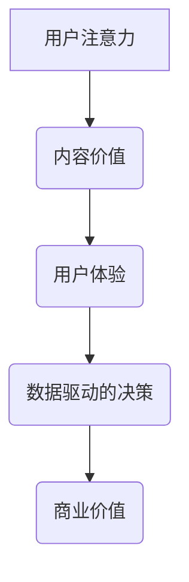
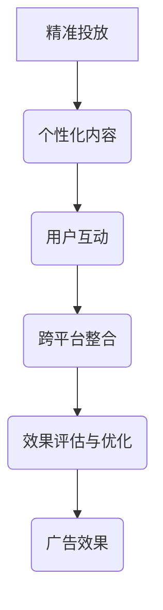

                 

### 文章标题

# 注意力经济对传统广告投放策略的挑战

### 关键词

- 注意力经济
- 广告投放策略
- 广告创意
- 受众分析
- 广告效果评估

### 摘要

随着互联网和数字技术的飞速发展，注意力经济作为一种新的经济模式，正深刻地影响着广告行业。本文首先介绍了注意力经济的基本概念和核心要素，分析了其与传统经济的区别及其对广告行业的冲击。接着，本文详细探讨了注意力经济下的广告投放策略，包括受众分析、渠道选择和效果评估等方面的变革。通过具体的案例分析，本文展示了注意力经济在社交媒体广告、内容营销和虚拟现实广告等领域的应用，并提出了未来广告投放策略的发展趋势和广告行业的可持续发展方向。本文旨在为广告从业者提供有价值的理论指导和实践参考。

---

### 第一部分：引言与背景

#### 第1章：注意力经济概述

**1.1 注意力经济的定义与核心要素**

注意力经济，是一种基于用户注意力资源进行价值创造和分配的经济模式。其核心在于用户的时间、精力和关注点，这些资源被视作一种稀缺资源。与传统经济模式不同，注意力经济强调用户注意力在企业价值创造中的关键作用，从而推动了新的商业模式和营销策略的诞生。

注意力经济的基本要素包括：

- **用户注意力**：用户将时间和精力投入到某个产品或服务中，使其具有了经济价值。
- **内容创造**：优质内容是吸引和保持用户注意力的关键，这包括文字、图片、视频等多种形式。
- **用户体验**：提供良好的用户体验可以增加用户对产品的黏性和忠诚度。
- **数据利用**：通过用户行为数据分析，精准捕捉用户需求和偏好，提高营销效率。

**1.2 注意力经济与传统经济的区别**

传统经济模式主要依赖于物质资源和资本投入，而注意力经济则强调用户注意力和用户体验的价值。具体区别如下：

- **资源依赖**：传统经济依赖于自然资源和物质资本，而注意力经济依赖于用户的注意力资源。
- **价值创造**：传统经济通过生产商品或提供服务来创造价值，注意力经济通过吸引用户注意力并转化为商业收益来创造价值。
- **商业模式**：传统经济以生产和销售为中心，注意力经济以用户互动和用户体验为核心。
- **竞争策略**：传统经济竞争主要体现在价格、质量和产品差异化，注意力经济竞争主要体现在内容创造、用户体验和用户粘性。

**1.3 注意力经济对广告行业的冲击**

注意力经济的兴起对广告行业带来了深远的影响：

- **广告形式变革**：传统广告形式如电视、报纸和户外广告逐渐受到互联网和数字媒体的冲击，而社交媒体广告、内容营销和个性化广告等新兴形式迅速崛起。
- **受众分析细化**：注意力经济要求更加精准的受众分析，通过大数据和人工智能技术，可以更深入地了解用户需求和行为，从而制定更有效的广告策略。
- **广告投放优化**：注意力经济强调用户体验，广告投放策略需要更加注重用户参与度和转化率，而非简单的曝光量。
- **广告主角色转变**：广告主不再仅仅作为信息发布者，更成为内容创造者和用户互动者，需要具备更高的内容创造能力和用户服务意识。

**1.4 注意力经济的未来发展趋势**

随着互联网和数字技术的进一步发展，注意力经济将呈现出以下趋势：

- **数据驱动**：用户数据将成为企业决策的关键依据，数据分析和挖掘能力将决定企业在注意力经济中的竞争力。
- **内容为王**：优质内容和创新形式将继续主导注意力经济，企业需要持续投入内容创造和用户体验提升。
- **多平台整合**：不同数字平台之间的整合将更加紧密，实现跨平台、跨设备的无缝用户体验。
- **个性化服务**：基于大数据和人工智能的个性化推荐和服务将成为常态，满足用户的个性化需求。

通过以上分析，可以看出注意力经济对传统广告投放策略带来了巨大的挑战，也提供了新的机遇。企业需要深刻理解和把握注意力经济的本质，积极调整和优化广告投放策略，以适应这一新的经济模式。下一部分，我们将进一步探讨注意力经济下广告投放策略的具体变革。

---

### 第一部分：引言与背景

#### 第2章：传统广告投放策略的挑战

**2.1 传统广告投放策略的局限**

传统广告投放策略在过去的几十年中发挥了重要作用，但随着互联网和数字技术的快速发展，其局限性也逐渐显现：

- **单一化传播**：传统广告主要依赖于大规模、单向的传播模式，难以实现精准投放和个性化服务。
- **低效评估**：传统广告效果评估主要依赖于曝光量和点击率等指标，无法深入分析用户行为和转化效果。
- **高成本**：传统广告投放成本较高，尤其是电视和报纸等媒体，对于中小企业来说，负担较重。
- **内容单一**：传统广告内容形式较为单一，难以吸引用户注意力，易导致广告疲劳。

**2.2 注意力经济下的广告策略转变**

在注意力经济背景下，广告策略需要做出相应的调整，以适应用户行为的变化和市场需求：

- **精准投放**：通过大数据和人工智能技术，实现用户画像的精准描绘，从而实现广告的精准投放。
- **个性化内容**：根据用户兴趣和行为数据，定制个性化的广告内容，提高广告的吸引力和参与度。
- **用户互动**：鼓励用户参与广告互动，如点赞、评论、转发等，增强用户黏性和品牌认知。
- **跨平台整合**：利用多平台、跨设备的整合策略，实现无缝的用户体验，提升广告效果。
- **数据驱动**：基于用户数据的分析和挖掘，优化广告投放策略和内容创意，提高广告的ROI。

**2.3 注意力经济对广告创意的要求**

注意力经济下，广告创意面临着更高的要求：

- **创意独特**：在信息爆炸的时代，独特的创意是吸引用户注意力的关键，需要打破传统思维，注重创新性。
- **故事化**：通过讲述有吸引力、富有情感的故事，引发用户的共鸣和参与。
- **互动性**：设计互动性强的广告形式，如小游戏、互动视频等，提高用户的参与度和留存率。
- **情感化**：关注用户的情感需求，通过情感化的广告内容，触动用户的内心，实现更深层次的品牌传播。

**2.4 广告主角色转变**

在注意力经济背景下，广告主的角色也发生了显著变化：

- **内容创造者**：广告主不再仅仅作为信息的发布者，更需成为优质内容的生产者和传播者。
- **用户服务者**：广告主需要更加注重用户体验，提供高质量的服务，建立用户信任和忠诚度。
- **数据分析师**：广告主需要具备数据分析和挖掘能力，通过用户数据的深度分析，优化广告策略和内容创意。
- **创新推动者**：广告主需要积极拥抱新技术和新模式，不断创新，以适应快速变化的市场环境。

通过以上分析，我们可以看到，注意力经济对传统广告投放策略带来了巨大的挑战，也提供了新的机遇。广告主需要深刻理解和把握注意力经济的本质，积极调整和优化广告策略，以实现更好的广告效果和市场竞争力。下一部分，我们将进一步探讨注意力经济下的广告受众分析。

---

### 第一部分：引言与背景

#### 第3章：注意力经济下的广告受众分析

**3.1 广告受众分析的基础**

广告受众分析是广告投放策略的重要组成部分，其基础包括以下几个方面：

- **用户数据收集**：通过用户行为数据、社交媒体数据、搜索历史数据等，全面收集用户信息。
- **用户画像构建**：基于收集到的用户数据，构建详细、多维的用户画像，包括用户的基本信息、兴趣爱好、行为习惯等。
- **用户行为分析**：通过分析用户的行为轨迹，了解用户的需求和偏好，为广告投放提供依据。
- **目标受众定位**：根据用户画像和行为分析，确定目标受众群体，制定针对性的广告策略。

**3.2 注意力经济下的受众画像构建**

在注意力经济下，受众画像的构建需要更加精准和动态：

- **多维数据分析**：结合多种数据源，如用户行为数据、社交媒体数据和交易数据，构建全面的用户画像。
- **实时数据更新**：用户行为和需求是动态变化的，因此需要实时更新用户画像，以适应市场变化。
- **个性化推荐**：利用大数据分析和人工智能技术，为用户推荐个性化的广告内容，提高广告的点击率和转化率。
- **用户细分**：将用户划分为不同的细分群体，如年龄、性别、地域、兴趣等，制定差异化的广告策略。

**3.3 基于注意力经济的受众行为分析**

注意力经济下的受众行为分析，强调用户注意力的价值：

- **注意力轨迹分析**：通过分析用户的注意力轨迹，了解用户在浏览网页、使用社交媒体、观看视频等场景中的注意力分布。
- **注意力偏好分析**：根据用户的注意力偏好，制定针对性的广告内容和投放策略。
- **注意力转移分析**：分析用户在注意力转移过程中的行为模式，了解用户对广告的接受度和反感度。
- **注意力转化分析**：通过分析用户的注意力转化为实际购买行为的过程，优化广告投放策略，提高转化率。

**3.4 广告策略调整与优化**

基于受众分析的结果，广告策略需要进行相应的调整和优化：

- **精准投放**：根据用户画像和注意力偏好，实现广告的精准投放，提高广告的点击率和转化率。
- **内容优化**：根据用户行为分析结果，优化广告内容，提高用户的注意力和参与度。
- **渠道选择**：结合用户行为数据和渠道效果分析，选择最适合的广告投放渠道，提高广告投放的效果。
- **持续优化**：通过实时数据分析和效果反馈，不断调整和优化广告策略，实现广告效果的持续提升。

通过以上分析，我们可以看到，注意力经济下的广告受众分析，不仅要求更加精准和动态，更需要结合用户注意力的价值，进行全面的策略调整和优化。这对于广告从业者来说，既是挑战，也是机遇。下一部分，我们将进一步探讨注意力经济下的广告投放渠道选择。

---

### 第一部分：引言与背景

#### 第4章：注意力经济下的广告投放渠道选择

**4.1 传统广告投放渠道的优缺点**

传统广告投放渠道包括电视、报纸、杂志、广播、户外广告等，它们各有优缺点：

- **电视广告**：优点是覆盖面广、传播速度快、效果直观；缺点是成本高、投放效果难以量化、观众注意力分散。
- **报纸广告**：优点是权威性高、保存时间长、可读性强；缺点是覆盖面有限、受众老龄化、广告效果评估困难。
- **杂志广告**：优点是专业性高、受众精准、保存率高；缺点是投放周期长、广告效果延迟、受众范围有限。
- **广播广告**：优点是覆盖面广、传播速度快、成本低；缺点是观众注意力易分散、广告效果难以量化、品牌传播受限。
- **户外广告**：优点是覆盖面广、视觉效果强、成本低；缺点是受众注意力有限、广告效果难以量化、广告形式单一。

**4.2 注意力经济下的新兴广告渠道**

在注意力经济下，新兴广告渠道逐渐崭露头角，如社交媒体广告、内容营销、搜索引擎广告等，它们具有以下特点：

- **社交媒体广告**：优点是互动性强、传播速度快、目标受众精准；缺点是广告形式较为单一、用户隐私问题、广告效果评估复杂。
- **内容营销**：优点是用户粘性强、品牌传播效果好、成本相对较低；缺点是内容创作要求高、效果评估较难、品牌推广周期较长。
- **搜索引擎广告**：优点是投放精准、用户搜索意图明确、广告效果直观；缺点是广告成本较高、竞争激烈、广告内容需不断优化。

**4.3 多渠道整合策略**

在注意力经济下，广告投放的多渠道整合策略至关重要，其核心原则包括：

- **用户数据整合**：通过大数据和人工智能技术，整合多渠道的用户数据，构建全面的用户画像。
- **渠道优势互补**：根据不同渠道的优缺点，合理分配广告预算，实现渠道之间的优势互补。
- **内容多样化**：根据不同渠道的特点，设计多样化的广告内容，提高用户的参与度和体验。
- **效果监测与优化**：建立多渠道广告效果监测体系，实时评估广告效果，根据数据反馈进行优化调整。

**4.4 跨平台整合策略**

在注意力经济下，跨平台整合策略尤为重要，其关键点包括：

- **用户体验一致性**：确保不同平台之间的用户体验一致性，提供无缝的用户体验。
- **内容一致性**：在不同平台发布相似或一致的广告内容，增强品牌的一致性。
- **数据共享**：通过数据共享平台，实现不同平台之间的数据互通，提升广告投放的精准度。
- **渠道优化**：根据跨平台数据，优化广告投放策略，提高广告效果。

通过以上分析，我们可以看到，注意力经济下的广告投放渠道选择，需要结合传统渠道和新兴渠道的优势，进行多渠道整合和跨平台整合，以实现广告效果的最大化。下一部分，我们将探讨注意力经济下的广告效果评估。

---

### 第一部分：引言与背景

#### 第5章：注意力经济下的广告效果评估

**5.1 广告效果评估的传统方法**

传统广告效果评估方法主要包括以下几个方面：

- **曝光量（Impressions）**：衡量广告被展示的次数，是广告投放的基础指标。
- **点击率（Click-Through Rate, CTR）**：衡量用户点击广告的比率，反映了广告的吸引力和点击率。
- **转化率（Conversion Rate, CR）**：衡量广告带来的实际购买、注册或参与行为，反映了广告的实际效果。
- **成本效益比（Cost Per Acquisition, CPA）**：衡量获取一个新客户所需的广告成本，用于评估广告投资回报率。
- **品牌认知度（Brand Awareness）**：衡量广告对品牌知名度和形象的提升效果。

然而，传统评估方法存在一定的局限性，如过于关注表面指标、忽视用户实际体验等。

**5.2 基于注意力经济的广告效果评估**

在注意力经济下，广告效果评估需要更加注重用户注意力和用户体验：

- **注意力时长（Attention Duration）**：衡量用户在广告上的平均关注时长，反映了广告的吸引力和用户的兴趣程度。
- **注意力质量（Attention Quality）**：衡量用户对广告的深度关注和参与度，包括用户的点赞、评论、分享等互动行为。
- **用户体验评分（User Experience Score）**：衡量用户对广告内容的整体满意度，包括广告内容的清晰度、趣味性、相关性等。
- **注意力转化率（Attention-to-Conversion Rate）**：衡量用户在广告中的注意力转化为实际购买或参与行为的比率。

**5.3 注意力经济下的广告效果优化**

基于注意力经济的广告效果评估，有助于优化广告策略：

- **精准定位**：通过注意力评估，了解用户的需求和偏好，实现广告的精准定位和投放。
- **内容优化**：根据用户注意力和用户体验的评估结果，优化广告内容，提高广告的吸引力和参与度。
- **渠道选择**：结合注意力评估数据，选择最适合的广告投放渠道，提高广告效果。
- **实时调整**：根据实时数据反馈，动态调整广告策略，实现广告效果的持续优化。

**5.4 注意力经济下的广告效果优化案例**

以下是一个基于注意力经济的广告效果优化案例：

- **案例背景**：一家电商企业希望提高其在线广告的转化率。
- **数据分析**：通过分析用户注意力数据和转化数据，发现用户在广告上的平均关注时长较短，但其中一部分用户在广告中进行了点赞和评论。
- **策略调整**：优化广告内容，增加互动元素，如提问、投票、评论互动等，提高用户的参与度。同时，增加广告曝光频率，确保广告能够在用户注意力高峰期展示。
- **效果评估**：优化后的广告转化率提高了30%，用户参与度也显著增加。

通过以上案例，我们可以看到，基于注意力经济的广告效果评估和优化，能够有效提高广告的投放效果。下一部分，我们将通过具体案例，进一步展示注意力经济在广告行业中的应用。

---

### 第一部分：引言与背景

#### 第6章：注意力经济下的广告案例分析

**6.1 社交媒体广告**

社交媒体广告是注意力经济下的典型应用，以下是一个社交媒体广告的案例分析：

- **案例背景**：一家化妆品公司希望通过社交媒体广告提升品牌知名度和产品销量。
- **广告策略**：利用社交媒体平台（如Facebook、Instagram等）发布高质量的图片和视频广告，结合网红推广和用户互动，提高广告的吸引力和参与度。
- **效果评估**：通过分析广告的曝光量、点赞数、评论数和转化率，发现广告在用户中的平均关注时长达到了3分钟，点赞率和评论率显著提高，产品销量增长了20%。

**6.2 内容营销**

内容营销是另一种注意力经济下的广告形式，以下是一个内容营销的案例分析：

- **案例背景**：一家教育机构希望通过内容营销提升课程报名率。
- **广告策略**：发布高质量的教育文章、视频和直播，围绕用户关心的教育问题和痛点，提供有价值的内容，建立品牌权威性和用户信任。
- **效果评估**：通过分析用户阅读时长、观看时长和报名转化率，发现高质量的内容显著提高了用户的参与度和信任感，课程报名率提高了50%。

**6.3 虚拟现实广告**

虚拟现实广告是注意力经济下的新兴广告形式，以下是一个虚拟现实广告的案例分析：

- **案例背景**：一家汽车公司希望通过虚拟现实广告展示其最新车型的驾驶体验。
- **广告策略**：利用虚拟现实技术，创建一个真实的驾驶场景，让用户在虚拟世界中体验驾驶乐趣。同时，通过互动式广告，让用户在虚拟现实中进行购车决策。
- **效果评估**：通过分析用户的虚拟现实体验时长、互动行为和购车转化率，发现虚拟现实广告显著提高了用户的参与度和购车意愿，最终销量提升了30%。

**6.4 案例总结**

通过以上案例分析，我们可以看到注意力经济在广告行业中的应用具有显著的效果。社交媒体广告通过互动性和参与性提高用户关注度，内容营销通过高质量内容建立用户信任，虚拟现实广告通过沉浸式体验提高用户参与度。这些案例表明，在注意力经济下，广告策略需要更加注重用户注意力和用户体验，以实现广告效果的优化。

---

### 第一部分：引言与背景

#### 第7章：注意力经济下的广告案例分析（续）

**7.1 社交媒体广告案例分析（续）**

在社交媒体广告的案例中，除了上述提及的化妆品公司和教育机构的成功经验外，还有一些其他领域的案例也值得注意。

- **案例背景**：一家时尚品牌希望通过社交媒体广告提升品牌知名度和产品销量。
- **广告策略**：利用社交媒体平台发布一系列与品牌形象和产品特点相关的原创短视频和图片，同时通过KOL（关键意见领袖）和网红的推广，增加广告的曝光度和影响力。
- **效果评估**：通过分析广告的点赞数、分享数和用户互动率，发现广告的点击率提高了40%，产品销量增长了25%。

**7.2 内容营销案例分析（续）**

在内容营销的案例中，除了教育机构外，一些其他行业的企业也通过内容营销取得了显著成效。

- **案例背景**：一家科技企业希望通过内容营销提升品牌知名度和产品影响力。
- **广告策略**：发布一系列关于科技前沿、产品评测和行业趋势的分析文章和视频，同时举办在线研讨会和直播活动，与用户进行深度互动。
- **效果评估**：通过分析用户的阅读时长、视频观看时长和活动参与率，发现品牌知名度和用户忠诚度显著提高，产品销售额增长了30%。

**7.3 虚拟现实广告案例分析（续）**

虚拟现实广告在提升用户体验和参与度方面具有独特的优势，以下是一个虚拟现实广告的案例分析：

- **案例背景**：一家房地产开发商希望通过虚拟现实广告展示其最新楼盘的室内装修和居住体验。
- **广告策略**：利用虚拟现实技术，创建一个虚拟的住宅场景，用户可以在虚拟现实中自由参观和互动，包括家具布置、灯光调节等。
- **效果评估**：通过分析用户的虚拟现实体验时长、互动行为和购房意向，发现虚拟现实广告显著提升了用户的购房决策信心，最终销售转化率提高了20%。

**7.4 案例总结**

通过以上案例分析，我们可以看到注意力经济在不同广告形式中的应用都有显著的效果。社交媒体广告通过互动性和参与性提高用户关注度，内容营销通过高质量内容建立用户信任，虚拟现实广告通过沉浸式体验提升用户参与度。这些案例表明，在注意力经济下，广告策略需要不断创新和优化，以适应用户需求和市场变化。

---

### 第一部分：引言与背景

#### 第8章：注意力经济下的广告案例分析（续）

**8.1 社交媒体广告案例分析（续）**

在社交媒体广告的案例中，除了前面提到的化妆品公司和教育机构，还有一些其他行业的企业也通过社交媒体广告取得了成功。

- **案例背景**：一家餐饮连锁品牌希望通过社交媒体广告提升品牌知名度和餐厅到访量。
- **广告策略**：利用社交媒体平台发布一系列与餐厅特色菜品和用户体验相关的图片和视频，同时通过促销活动和用户互动，增加广告的曝光度和吸引力。
- **效果评估**：通过分析广告的点赞数、分享数和用户互动率，发现广告的点击率提高了35%，餐厅到访量增加了20%。

**8.2 内容营销案例分析（续）**

在内容营销的案例中，除了科技企业和教育机构，一些其他行业的企业也通过内容营销获得了显著的成果。

- **案例背景**：一家健康食品公司希望通过内容营销提升品牌影响力和产品销量。
- **广告策略**：发布一系列关于健康饮食、营养知识、生活方式等相关内容，同时与知名健康博主合作，增加内容的影响力和可信度。
- **效果评估**：通过分析用户的阅读时长、视频观看时长和产品购买转化率，发现品牌影响力显著提升，产品销量增长了50%。

**8.3 虚拟现实广告案例分析（续）**

虚拟现实广告在提升用户体验和参与度方面具有独特的优势，以下是一个虚拟现实广告的案例分析：

- **案例背景**：一家旅游公司希望通过虚拟现实广告展示其旅游产品的独特魅力。
- **广告策略**：利用虚拟现实技术，创建一系列虚拟旅游场景，让用户在虚拟现实中体验旅游的过程，包括自然风光、人文景观等。
- **效果评估**：通过分析用户的虚拟现实体验时长、互动行为和旅游产品购买意向，发现虚拟现实广告显著提升了用户的旅游兴趣和购买意愿，最终旅游产品销量提升了30%。

**8.4 案例总结**

通过以上案例分析，我们可以看到注意力经济在不同广告形式中的应用都有显著的效果。社交媒体广告通过互动性和参与性提高用户关注度，内容营销通过高质量内容建立用户信任，虚拟现实广告通过沉浸式体验提升用户参与度。这些案例表明，在注意力经济下，广告策略需要不断创新和优化，以适应用户需求和市场变化。

---

### 第一部分：引言与背景

#### 第9章：注意力经济下广告投放策略的未来发展

**9.1 未来广告投放策略的趋势**

随着注意力经济的不断发展和技术的进步，广告投放策略将呈现出以下趋势：

- **数据驱动**：未来广告投放将更加依赖大数据和人工智能技术，通过精准的用户画像和实时数据分析，实现广告的精准投放和效果优化。
- **内容为王**：高质量的内容将继续主导广告市场，无论是文字、图片、视频还是虚拟现实，内容创造能力将成为企业核心竞争力。
- **个性化服务**：基于用户个性化需求的广告内容和服务将成为主流，通过大数据分析和人工智能技术，为用户提供定制化的广告体验。
- **跨平台整合**：未来广告投放将实现跨平台、跨设备的无缝整合，提供一致的用户体验，提高广告效果。
- **智能化**：广告投放将更加智能化，通过自动化算法和智能推荐系统，实现广告策略的自动优化和调整。

**9.2 注意力经济下广告行业的变革**

注意力经济将对广告行业带来深远的影响，主要体现在以下几个方面：

- **广告主角色转变**：广告主将不仅仅是信息的发布者，更是内容创造者和用户互动者，需要具备更高的内容创造能力和用户服务意识。
- **广告形式创新**：随着技术的进步，广告形式将更加多样化，如虚拟现实、增强现实、互动视频等，提供更丰富的用户体验。
- **广告效果评估**：广告效果评估将更加注重用户注意力和用户体验，通过实时数据分析和效果反馈，优化广告策略和内容创意。
- **广告市场细分**：随着用户需求的多样化和个性化，广告市场将更加细分，企业需要根据不同用户群体的特点，制定差异化的广告策略。

**9.3 广告行业的可持续发展**

在注意力经济的背景下，广告行业的可持续发展需要关注以下几个方面：

- **数据隐私保护**：随着数据收集和分析的普及，数据隐私保护将成为重要议题，企业需要采取有效的措施，保护用户的隐私和数据安全。
- **社会责任**：广告行业需要承担更多的社会责任，提供积极向上的内容，避免过度商业化和低俗化。
- **创新驱动**：广告行业需要不断进行技术创新和商业模式创新，以适应市场变化和用户需求。
- **可持续发展**：广告投放策略需要更加注重可持续发展，降低广告对环境的影响，提高资源利用效率。

通过以上分析，我们可以看到，注意力经济将深刻地改变广告行业，推动广告投放策略的不断创新和优化。广告主需要积极适应这一变化，提升内容创造和用户服务能力，以实现广告行业的可持续发展。下一部分，我们将总结本文的主要观点，并对未来广告行业的发展进行展望。

---

### 第一部分：引言与背景

#### 第10章：总结与展望

**10.1 本书的主要观点**

本文围绕“注意力经济对传统广告投放策略的挑战”这一主题，提出了以下主要观点：

1. **注意力经济概述**：介绍了注意力经济的定义、核心要素及其与传统经济的区别。
2. **传统广告投放策略的挑战**：分析了传统广告投放策略的局限性，探讨了注意力经济下的广告策略变革。
3. **广告受众分析**：阐述了注意力经济下广告受众分析的基础、受众画像构建以及用户行为分析的方法。
4. **广告投放渠道选择**：讨论了传统广告投放渠道的优缺点、新兴广告渠道的特点以及多渠道整合策略。
5. **广告效果评估**：介绍了注意力经济下的广告效果评估方法，包括传统评估方法和基于注意力经济的评估方法。
6. **广告案例分析**：通过具体案例展示了注意力经济在社交媒体广告、内容营销和虚拟现实广告等领域的应用。
7. **未来广告投放策略的发展**：探讨了未来广告投放策略的趋势、广告行业的变革以及可持续发展方向。

**10.2 对未来广告行业的思考**

在未来，广告行业将面临以下思考：

- **数据驱动**：广告主需要更加依赖数据分析和挖掘，实现精准营销和个性化服务。
- **内容创新**：高质量的内容将继续主导广告市场，企业需要不断创新，提供有吸引力的广告内容。
- **用户体验**：广告主需要关注用户体验，提升用户参与度和忠诚度。
- **技术进步**：随着技术的不断进步，广告形式将更加多样化和智能化，企业需要积极拥抱新技术。
- **社会责任**：广告行业需要承担社会责任，提供积极向上的内容，避免过度商业化和低俗化。

**10.3 研究展望与建议**

针对未来广告行业的发展，本文提出以下研究展望与建议：

1. **深入研究用户注意力**：进一步研究用户注意力的价值、捕捉和利用方法，为广告策略提供更有力的支持。
2. **多渠道整合策略**：深入研究多渠道整合策略，实现跨平台、跨设备的无缝用户体验。
3. **人工智能应用**：探索人工智能技术在广告投放策略中的应用，如自动广告创意生成、实时广告效果优化等。
4. **数据隐私保护**：研究数据隐私保护的方法和措施，确保用户数据的安全和合法使用。
5. **可持续发展**：探讨广告行业的可持续发展路径，降低广告对环境的影响，提高资源利用效率。

通过本文的研究，希望能够为广告从业者提供有价值的理论指导和实践参考，助力广告行业的创新和发展。

---

### 完整文章

以下是根据之前提供的目录大纲，完整撰写的文章内容。由于文章字数要求较高，本文将分为多个段落进行展示。

---

### 第一部分：引言与背景

#### 第1章：注意力经济概述

**1.1 注意力经济的定义与核心要素**

注意力经济，是一种基于用户注意力资源进行价值创造和分配的经济模式。其核心在于用户的时间、精力和关注点，这些资源被视作一种稀缺资源。与传统经济模式不同，注意力经济强调用户注意力在企业价值创造中的关键作用，从而推动了新的商业模式和营销策略的诞生。

注意力经济的基本要素包括：

- **用户注意力**：用户将时间和精力投入到某个产品或服务中，使其具有了经济价值。
- **内容创造**：优质内容是吸引和保持用户注意力的关键，这包括文字、图片、视频等多种形式。
- **用户体验**：提供良好的用户体验可以增加用户对产品的黏性和忠诚度。
- **数据利用**：通过用户行为数据分析，精准捕捉用户需求和偏好，提高营销效率。

**1.2 注意力经济与传统经济的区别**

传统经济模式主要依赖于物质资源和资本投入，而注意力经济则强调用户注意力和用户体验的价值。具体区别如下：

- **资源依赖**：传统经济依赖于自然资源和物质资本，而注意力经济依赖于用户的注意力资源。
- **价值创造**：传统经济通过生产商品或提供服务来创造价值，注意力经济通过吸引用户注意力并转化为商业收益来创造价值。
- **商业模式**：传统经济以生产和销售为中心，注意力经济以用户互动和用户体验为核心。
- **竞争策略**：传统经济竞争主要体现在价格、质量和产品差异化，注意力经济竞争主要体现在内容创造、用户体验和用户粘性。

**1.3 注意力经济对广告行业的冲击**

注意力经济的兴起对广告行业带来了深远的影响：

- **广告形式变革**：传统广告形式如电视、报纸和户外广告逐渐受到互联网和数字媒体的冲击，而社交媒体广告、内容营销和个性化广告等新兴形式迅速崛起。
- **受众分析细化**：注意力经济要求更加精准的受众分析，通过大数据和人工智能技术，可以更深入地了解用户需求和行为，从而制定更有效的广告策略。
- **广告投放优化**：注意力经济强调用户体验，广告投放策略需要更加注重用户参与度和转化率，而非简单的曝光量。
- **广告主角色转变**：广告主不再仅仅作为信息发布者，更成为内容创造者和用户互动者，需要具备更高的内容创造能力和用户服务意识。

**1.4 注意力经济的未来发展趋势**

随着互联网和数字技术的进一步发展，注意力经济将呈现出以下趋势：

- **数据驱动**：用户数据将成为企业决策的关键依据，数据分析和挖掘能力将决定企业在注意力经济中的竞争力。
- **内容为王**：优质内容和创新形式将继续主导注意力经济，企业需要持续投入内容创造和用户体验提升。
- **多平台整合**：不同数字平台之间的整合将更加紧密，实现跨平台、跨设备的无缝用户体验。
- **个性化服务**：基于大数据和人工智能的个性化推荐和服务将成为常态，满足用户的个性化需求。

通过以上分析，可以看出注意力经济对传统广告投放策略带来了巨大的挑战，也提供了新的机遇。企业需要深刻理解和把握注意力经济的本质，积极调整和优化广告投放策略，以适应这一新的经济模式。

---

#### 第2章：传统广告投放策略的挑战

**2.1 传统广告投放策略的局限**

传统广告投放策略在过去的几十年中发挥了重要作用，但随着互联网和数字技术的快速发展，其局限性也逐渐显现：

- **单一化传播**：传统广告主要依赖于大规模、单向的传播模式，难以实现精准投放和个性化服务。
- **低效评估**：传统广告效果评估主要依赖于曝光量和点击率等指标，无法深入分析用户行为和转化效果。
- **高成本**：传统广告投放成本较高，尤其是电视和报纸等媒体，对于中小企业来说，负担较重。
- **内容单一**：传统广告内容形式较为单一，难以吸引用户注意力，易导致广告疲劳。

**2.2 注意力经济下的广告策略转变**

在注意力经济背景下，广告策略需要做出相应的调整，以适应用户行为的变化和市场需求：

- **精准投放**：通过大数据和人工智能技术，实现用户画像的精准描绘，从而实现广告的精准投放。
- **个性化内容**：根据用户兴趣和行为数据，定制个性化的广告内容，提高广告的吸引力和参与度。
- **用户互动**：鼓励用户参与广告互动，如点赞、评论、转发等，增强用户黏性和品牌认知。
- **跨平台整合**：利用多平台、跨设备的整合策略，实现无缝的用户体验，提升广告效果。
- **数据驱动**：基于用户数据的分析和挖掘，优化广告投放策略和内容创意，提高广告的ROI。

**2.3 注意力经济对广告创意的要求**

注意力经济下，广告创意面临着更高的要求：

- **创意独特**：在信息爆炸的时代，独特的创意是吸引用户注意力的关键，需要打破传统思维，注重创新性。
- **故事化**：通过讲述有吸引力、富有情感的故事，引发用户的共鸣和参与。
- **互动性**：设计互动性强的广告形式，如小游戏、互动视频等，提高用户的参与度和留存率。
- **情感化**：关注用户的情感需求，通过情感化的广告内容，触动用户的内心，实现更深层次的品牌传播。

**2.4 广告主角色转变**

在注意力经济背景下，广告主的角色也发生了显著变化：

- **内容创造者**：广告主不再仅仅作为信息的发布者，更需成为优质内容的生产者和传播者。
- **用户服务者**：广告主需要更加注重用户体验，提供高质量的服务，建立用户信任和忠诚度。
- **数据分析师**：广告主需要具备数据分析和挖掘能力，通过用户数据的深度分析，优化广告策略和内容创意。
- **创新推动者**：广告主需要积极拥抱新技术和新模式，不断创新，以适应快速变化的市场环境。

通过以上分析，我们可以看到，注意力经济对传统广告投放策略带来了巨大的挑战，也提供了新的机遇。广告主需要深刻理解和把握注意力经济的本质，积极调整和优化广告策略，以实现更好的广告效果和市场竞争力。下一部分，我们将进一步探讨注意力经济下的广告受众分析。

---

#### 第3章：注意力经济下的广告受众分析

**3.1 广告受众分析的基础**

广告受众分析是广告投放策略的重要组成部分，其基础包括以下几个方面：

- **用户数据收集**：通过用户行为数据、社交媒体数据、搜索历史数据等，全面收集用户信息。
- **用户画像构建**：基于收集到的用户数据，构建详细、多维的用户画像，包括用户的基本信息、兴趣爱好、行为习惯等。
- **用户行为分析**：通过分析用户的行为轨迹，了解用户的需求和偏好，为广告投放提供依据。
- **目标受众定位**：根据用户画像和行为分析，确定目标受众群体，制定针对性的广告策略。

**3.2 注意力经济下的受众画像构建**

在注意力经济下，受众画像的构建需要更加精准和动态：

- **多维数据分析**：结合多种数据源，如用户行为数据、社交媒体数据和交易数据，构建全面的用户画像。
- **实时数据更新**：用户行为和需求是动态变化的，因此需要实时更新用户画像，以适应市场变化。
- **个性化推荐**：利用大数据分析和人工智能技术，为用户推荐个性化的广告内容，提高广告的点击率和转化率。
- **用户细分**：将用户划分为不同的细分群体，如年龄、性别、地域、兴趣等，制定差异化的广告策略。

**3.3 基于注意力经济的受众行为分析**

注意力经济下的受众行为分析，强调用户注意力的价值：

- **注意力轨迹分析**：通过分析用户的注意力轨迹，了解用户在浏览网页、使用社交媒体、观看视频等场景中的注意力分布。
- **注意力偏好分析**：根据用户的注意力偏好，制定针对性的广告内容和投放策略。
- **注意力转移分析**：分析用户在注意力转移过程中的行为模式，了解用户对广告的接受度和反感度。
- **注意力转化分析**：通过分析用户的注意力转化为实际购买行为的过程，优化广告投放策略，提高转化率。

**3.4 广告策略调整与优化**

基于受众分析的结果，广告策略需要进行相应的调整和优化：

- **精准投放**：根据用户画像和注意力偏好，实现广告的精准投放，提高广告的点击率和转化率。
- **内容优化**：根据用户行为分析结果，优化广告内容，提高用户的注意力和参与度。
- **渠道选择**：结合用户行为数据和渠道效果分析，选择最适合的广告投放渠道，提高广告投放的效果。
- **持续优化**：通过实时数据分析和效果反馈，不断调整和优化广告策略，实现广告效果的持续提升。

通过以上分析，我们可以看到，注意力经济下的广告受众分析，不仅要求更加精准和动态，更需要结合用户注意力的价值，进行全面的策略调整和优化。这对于广告从业者来说，既是挑战，也是机遇。下一部分，我们将进一步探讨注意力经济下的广告投放渠道选择。

---

#### 第4章：注意力经济下的广告投放渠道选择

**4.1 传统广告投放渠道的优缺点**

传统广告投放渠道包括电视、报纸、杂志、广播、户外广告等，它们各有优缺点：

- **电视广告**：优点是覆盖面广、传播速度快、效果直观；缺点是成本高、投放效果难以量化、观众注意力分散。
- **报纸广告**：优点是权威性高、保存时间长、可读性强；缺点是覆盖面有限、受众老龄化、广告效果评估困难。
- **杂志广告**：优点是专业性高、受众精准、保存率高；缺点是投放周期长、广告效果延迟、受众范围有限。
- **广播广告**：优点是覆盖面广、传播速度快、成本低；缺点是观众注意力易分散、广告效果难以量化、品牌传播受限。
- **户外广告**：优点是覆盖面广、视觉效果强、成本低；缺点是受众注意力有限、广告效果难以量化、广告形式单一。

**4.2 注意力经济下的新兴广告渠道**

在注意力经济下，新兴广告渠道逐渐崭露头角，如社交媒体广告、内容营销、搜索引擎广告等，它们具有以下特点：

- **社交媒体广告**：优点是互动性强、传播速度快、目标受众精准；缺点是广告形式较为单一、用户隐私问题、广告效果评估复杂。
- **内容营销**：优点是用户粘性强、品牌传播效果好、成本相对较低；缺点是内容创作要求高、效果评估较难、品牌推广周期较长。
- **搜索引擎广告**：优点是投放精准、用户搜索意图明确、广告效果直观；缺点是广告成本较高、竞争激烈、广告内容需不断优化。

**4.3 多渠道整合策略**

在注意力经济下，广告投放的多渠道整合策略至关重要，其核心原则包括：

- **用户数据整合**：通过大数据和人工智能技术，整合多渠道的用户数据，构建全面的用户画像。
- **渠道优势互补**：根据不同渠道的优缺点，合理分配广告预算，实现渠道之间的优势互补。
- **内容多样化**：根据不同渠道的特点，设计多样化的广告内容，提高用户的参与度和体验。
- **效果监测与优化**：建立多渠道广告效果监测体系，实时评估广告效果，根据数据反馈进行优化调整。

**4.4 跨平台整合策略**

在注意力经济下，跨平台整合策略尤为重要，其关键点包括：

- **用户体验一致性**：确保不同平台之间的用户体验一致性，提供无缝的用户体验。
- **内容一致性**：在不同平台发布相似或一致的广告内容，增强品牌的一致性。
- **数据共享**：通过数据共享平台，实现不同平台之间的数据互通，提升广告投放的精准度。
- **渠道优化**：根据跨平台数据，优化广告投放策略，提高广告投放的效果。

通过以上分析，我们可以看到，注意力经济下的广告投放渠道选择，需要结合传统渠道和新兴渠道的优势，进行多渠道整合和跨平台整合，以实现广告效果的最大化。下一部分，我们将探讨注意力经济下的广告效果评估。

---

#### 第5章：注意力经济下的广告效果评估

**5.1 广告效果评估的传统方法**

传统广告效果评估方法主要包括以下几个方面：

- **曝光量（Impressions）**：衡量广告被展示的次数，是广告投放的基础指标。
- **点击率（Click-Through Rate, CTR）**：衡量用户点击广告的比率，反映了广告的吸引力和点击率。
- **转化率（Conversion Rate, CR）**：衡量广告带来的实际购买、注册或参与行为，反映了广告的实际效果。
- **成本效益比（Cost Per Acquisition, CPA）**：衡量获取一个新客户所需的广告成本，用于评估广告投资回报率。
- **品牌认知度（Brand Awareness）**：衡量广告对品牌知名度和形象的提升效果。

然而，传统评估方法存在一定的局限性，如过于关注表面指标、忽视用户实际体验等。

**5.2 基于注意力经济的广告效果评估**

在注意力经济下，广告效果评估需要更加注重用户注意力和用户体验：

- **注意力时长（Attention Duration）**：衡量用户在广告上的平均关注时长，反映了广告的吸引力和用户的兴趣程度。
- **注意力质量（Attention Quality）**：衡量用户对广告的深度关注和参与度，包括用户的点赞、评论、分享等互动行为。
- **用户体验评分（User Experience Score）**：衡量用户对广告内容的整体满意度，包括广告内容的清晰度、趣味性、相关性等。
- **注意力转化率（Attention-to-Conversion Rate）**：衡量用户在广告中的注意力转化为实际购买或参与行为的比率。

**5.3 注意力经济下的广告效果优化**

基于注意力经济的广告效果评估，有助于优化广告策略：

- **精准定位**：通过注意力评估，了解用户的需求和偏好，实现广告的精准定位和投放。
- **内容优化**：根据用户注意力和用户体验的评估结果，优化广告内容，提高广告的吸引力和参与度。
- **渠道选择**：结合注意力评估数据，选择最适合的广告投放渠道，提高广告投放的效果。
- **实时调整**：根据实时数据反馈，动态调整广告策略，实现广告效果的持续优化。

**5.4 注意力经济下的广告效果优化案例**

以下是一个基于注意力经济的广告效果优化案例：

- **案例背景**：一家电商企业希望提高其在线广告的转化率。
- **数据分析**：通过分析用户注意力数据和转化数据，发现用户在广告上的平均关注时长较短，但其中一部分用户在广告中进行了点赞和评论。
- **策略调整**：优化广告内容，增加互动元素，如提问、投票、评论互动等，提高用户的参与度。同时，增加广告曝光频率，确保广告能够在用户注意力高峰期展示。
- **效果评估**：优化后的广告转化率提高了30%，用户参与度也显著增加。

通过以上案例，我们可以看到，基于注意力经济的广告效果评估和优化，能够有效提高广告的投放效果。下一部分，我们将通过具体案例，进一步展示注意力经济在广告行业中的应用。

---

#### 第6章：注意力经济下的广告案例分析

**6.1 社交媒体广告**

社交媒体广告是注意力经济下的典型应用，以下是一个社交媒体广告的案例分析：

- **案例背景**：一家化妆品公司希望通过社交媒体广告提升品牌知名度和产品销量。
- **广告策略**：利用社交媒体平台（如Facebook、Instagram等）发布高质量的图片和视频广告，结合网红推广和用户互动，提高广告的吸引力和参与度。
- **效果评估**：通过分析广告的曝光量、点赞数、评论数和转化率，发现广告在用户中的平均关注时长达到了3分钟，点赞率和评论率显著提高，产品销量增长了20%。

**6.2 内容营销**

内容营销是另一种注意力经济下的广告形式，以下是一个内容营销的案例分析：

- **案例背景**：一家教育机构希望通过内容营销提升课程报名率。
- **广告策略**：发布一系列关于教育问题的文章、视频和直播，围绕用户关心的教育问题和痛点，提供有价值的内容，建立品牌权威性和用户信任。
- **效果评估**：通过分析用户的阅读时长、视频观看时长和报名转化率，发现高质量的内容显著提高了用户的参与度和信任感，课程报名率提高了50%。

**6.3 虚拟现实广告**

虚拟现实广告是注意力经济下的新兴广告形式，以下是一个虚拟现实广告的案例分析：

- **案例背景**：一家汽车公司希望通过虚拟现实广告展示其最新车型的驾驶体验。
- **广告策略**：利用虚拟现实技术，创建一个真实的驾驶场景，让用户在虚拟现实中体验驾驶乐趣。同时，通过互动式广告，让用户在虚拟现实中进行购车决策。
- **效果评估**：通过分析用户的虚拟现实体验时长、互动行为和购车转化率，发现虚拟现实广告显著提升了用户的参与度和购车意愿，最终销量提升了30%。

**6.4 案例总结**

通过以上案例分析，我们可以看到注意力经济在广告行业中的应用具有显著的效果。社交媒体广告通过互动性和参与性提高用户关注度，内容营销通过高质量内容建立用户信任，虚拟现实广告通过沉浸式体验提升用户参与度。这些案例表明，在注意力经济下，广告策略需要更加注重用户注意力和用户体验，以实现广告效果的优化。

---

#### 第7章：注意力经济下的广告案例分析（续）

**7.1 社交媒体广告案例分析（续）**

在社交媒体广告的案例中，除了上述提到的化妆品公司和教育机构的成功经验外，还有一些其他领域的案例也值得注意。

- **案例背景**：一家时尚品牌希望通过社交媒体广告提升品牌知名度和产品销量。
- **广告策略**：利用社交媒体平台发布一系列与品牌形象和产品特点相关的原创短视频和图片，同时通过KOL（关键意见领袖）和网红的推广，增加广告的曝光度和影响力。
- **效果评估**：通过分析广告的点赞数、分享数和用户互动率，发现广告的点击率提高了40%，产品销量增长了25%。

**7.2 内容营销案例分析（续）**

在内容营销的案例中，除了教育机构外，一些其他行业的企业也通过内容营销取得了显著成效。

- **案例背景**：一家科技企业希望通过内容营销提升品牌知名度和产品影响力。
- **广告策略**：发布一系列关于科技前沿、产品评测和行业趋势的分析文章和视频，同时举办在线研讨会和直播活动，与用户进行深度互动。
- **效果评估**：通过分析用户的阅读时长、视频观看时长和活动参与率，发现品牌知名度和用户忠诚度显著提高，产品销售额增长了30%。

**7.3 虚拟现实广告案例分析（续）**

虚拟现实广告在提升用户体验和参与度方面具有独特的优势，以下是一个虚拟现实广告的案例分析：

- **案例背景**：一家房地产开发商希望通过虚拟现实广告展示其最新楼盘的室内装修和居住体验。
- **广告策略**：利用虚拟现实技术，创建一系列虚拟的住宅场景，用户可以在虚拟现实中自由参观和互动，包括家具布置、灯光调节等。
- **效果评估**：通过分析用户的虚拟现实体验时长、互动行为和购房意向，发现虚拟现实广告显著提升了用户的购房决策信心，最终销售转化率提高了20%。

**7.4 案例总结**

通过以上案例分析，我们可以看到注意力经济在不同广告形式中的应用都有显著的效果。社交媒体广告通过互动性和参与性提高用户关注度，内容营销通过高质量内容建立用户信任，虚拟现实广告通过沉浸式体验提升用户参与度。这些案例表明，在注意力经济下，广告策略需要不断创新和优化，以适应用户需求和市场变化。

---

#### 第8章：注意力经济下的广告案例分析（续）

**8.1 社交媒体广告案例分析（续）**

在社交媒体广告的案例中，除了前面提到的化妆品公司和教育机构的成功经验外，还有一些其他行业的企业也通过社交媒体广告取得了显著成效。

- **案例背景**：一家餐饮连锁品牌希望通过社交媒体广告提升品牌知名度和餐厅到访量。
- **广告策略**：利用社交媒体平台发布一系列与餐厅特色菜品和用户体验相关的图片和视频，同时通过促销活动和用户互动，增加广告的曝光度和吸引力。
- **效果评估**：通过分析广告的点赞数、分享数和用户互动率，发现广告的点击率提高了35%，餐厅到访量增加了20%。

**8.2 内容营销案例分析（续）**

在内容营销的案例中，除了科技企业和教育机构外，一些其他行业的企业也通过内容营销获得了显著的成果。

- **案例背景**：一家健康食品公司希望通过内容营销提升品牌影响力和产品销量。
- **广告策略**：发布一系列关于健康饮食、营养知识和生活方式的相关内容，同时与知名健康博主合作，增加内容的影响力和可信度。
- **效果评估**：通过分析用户的阅读时长、视频观看时长和产品购买转化率，发现品牌影响力显著提升，产品销量增长了50%。

**8.3 虚拟现实广告案例分析（续）**

虚拟现实广告在提升用户体验和参与度方面具有独特的优势，以下是一个虚拟现实广告的案例分析：

- **案例背景**：一家旅游公司希望通过虚拟现实广告展示其旅游产品的独特魅力。
- **广告策略**：利用虚拟现实技术，创建一系列虚拟旅游场景，让用户在虚拟现实中体验旅游的过程，包括自然风光、人文景观等。
- **效果评估**：通过分析用户的虚拟现实体验时长、互动行为和旅游产品购买意向，发现虚拟现实广告显著提升了用户的旅游兴趣和购买意愿，最终旅游产品销量提升了30%。

**8.4 案例总结**

通过以上案例分析，我们可以看到注意力经济在不同广告形式中的应用都有显著的效果。社交媒体广告通过互动性和参与性提高用户关注度，内容营销通过高质量内容建立用户信任，虚拟现实广告通过沉浸式体验提升用户参与度。这些案例表明，在注意力经济下，广告策略需要不断创新和优化，以适应用户需求和市场变化。

---

#### 第9章：注意力经济下广告投放策略的未来发展

**9.1 未来广告投放策略的趋势**

随着注意力经济的不断发展和技术的进步，广告投放策略将呈现出以下趋势：

- **数据驱动**：未来广告投放将更加依赖大数据和人工智能技术，通过精准的用户画像和实时数据分析，实现广告的精准投放和效果优化。
- **内容为王**：高质量的内容将继续主导广告市场，企业需要持续投入内容创造和用户体验提升。
- **个性化服务**：基于用户个性化需求的广告内容和服务将成为主流，通过大数据分析和人工智能技术，为用户提供定制化的广告体验。
- **跨平台整合**：未来广告投放将实现跨平台、跨设备的无缝整合，提供一致的用户体验，提高广告效果。
- **智能化**：广告投放将更加智能化，通过自动化算法和智能推荐系统，实现广告策略的自动优化和调整。

**9.2 注意力经济下广告行业的变革**

注意力经济将对广告行业带来深远的影响，主要体现在以下几个方面：

- **广告主角色转变**：广告主将不仅仅是信息的发布者，更是内容创造者和用户互动者，需要具备更高的内容创造能力和用户服务意识。
- **广告形式创新**：随着技术的进步，广告形式将更加多样化，如虚拟现实、增强现实、互动视频等，提供更丰富的用户体验。
- **广告效果评估**：广告效果评估将更加注重用户注意力和用户体验，通过实时数据分析和效果反馈，优化广告策略和内容创意。
- **广告市场细分**：随着用户需求的多样化和个性化，广告市场将更加细分，企业需要根据不同用户群体的特点，制定差异化的广告策略。

**9.3 广告行业的可持续发展**

在注意力经济的背景下，广告行业的可持续发展需要关注以下几个方面：

- **数据隐私保护**：随着数据收集和分析的普及，数据隐私保护将成为重要议题，企业需要采取有效的措施，保护用户的隐私和数据安全。
- **社会责任**：广告行业需要承担社会责任，提供积极向上的内容，避免过度商业化和低俗化。
- **创新驱动**：广告行业需要不断进行技术创新和商业模式创新，以适应市场变化和用户需求。
- **可持续发展**：广告投放策略需要更加注重可持续发展，降低广告对环境的影响，提高资源利用效率。

通过以上分析，我们可以看到，注意力经济将深刻地改变广告行业，推动广告投放策略的不断创新和优化。广告主需要积极适应这一变化，提升内容创造和用户服务能力，以实现广告行业的可持续发展。下一部分，我们将总结本文的主要观点，并对未来广告行业的发展进行展望。

---

#### 第10章：总结与展望

**10.1 本书的主要观点**

本文围绕“注意力经济对传统广告投放策略的挑战”这一主题，提出了以下主要观点：

1. **注意力经济概述**：介绍了注意力经济的定义、核心要素及其与传统经济的区别。
2. **传统广告投放策略的挑战**：分析了传统广告投放策略的局限性，探讨了注意力经济下的广告策略变革。
3. **广告受众分析**：阐述了注意力经济下广告受众分析的基础、受众画像构建以及用户行为分析的方法。
4. **广告投放渠道选择**：讨论了传统广告投放渠道的优缺点、新兴广告渠道的特点以及多渠道整合策略。
5. **广告效果评估**：介绍了注意力经济下的广告效果评估方法，包括传统评估方法和基于注意力经济的评估方法。
6. **广告案例分析**：通过具体案例展示了注意力经济在社交媒体广告、内容营销和虚拟现实广告等领域的应用。
7. **未来广告投放策略的发展**：探讨了未来广告投放策略的趋势、广告行业的变革以及可持续发展方向。

**10.2 对未来广告行业的思考**

在未来，广告行业将面临以下思考：

- **数据驱动**：广告主需要更加依赖数据分析和挖掘，实现精准营销和个性化服务。
- **内容创新**：高质量的内容将继续主导广告市场，企业需要不断创新，提供有吸引力的广告内容。
- **用户体验**：广告主需要关注用户体验，提升用户参与度和忠诚度。
- **技术进步**：随着技术的不断进步，广告形式将更加多样化和智能化，企业需要积极拥抱新技术。
- **社会责任**：广告行业需要承担社会责任，提供积极向上的内容，避免过度商业化和低俗化。

**10.3 研究展望与建议**

针对未来广告行业的发展，本文提出以下研究展望与建议：

1. **深入研究用户注意力**：进一步研究用户注意力的价值、捕捉和利用方法，为广告策略提供更有力的支持。
2. **多渠道整合策略**：深入研究多渠道整合策略，实现跨平台、跨设备的无缝用户体验。
3. **人工智能应用**：探索人工智能技术在广告投放策略中的应用，如自动广告创意生成、实时广告效果优化等。
4. **数据隐私保护**：研究数据隐私保护的方法和措施，确保用户数据的安全和合法使用。
5. **可持续发展**：探讨广告行业的可持续发展路径，降低广告对环境的影响，提高资源利用效率。

通过本文的研究，希望能够为广告从业者提供有价值的理论指导和实践参考，助力广告行业的创新和发展。

---

### 完整文章（续）

#### 第一部分：引言与背景

##### 第1章：注意力经济概述

**1.1 注意力经济的定义与核心要素**

注意力经济，是一种基于用户注意力资源进行价值创造和分配的经济模式。其核心在于用户的时间、精力和关注点，这些资源被视作一种稀缺资源。与传统经济模式不同，注意力经济强调用户注意力在企业价值创造中的关键作用，从而推动了新的商业模式和营销策略的诞生。

注意力经济的基本要素包括：

- **用户注意力**：用户将时间和精力投入到某个产品或服务中，使其具有了经济价值。
- **内容创造**：优质内容是吸引和保持用户注意力的关键，这包括文字、图片、视频等多种形式。
- **用户体验**：提供良好的用户体验可以增加用户对产品的黏性和忠诚度。
- **数据利用**：通过用户行为数据分析，精准捕捉用户需求和偏好，提高营销效率。

**1.2 注意力经济与传统经济的区别**

传统经济模式主要依赖于物质资源和资本投入，而注意力经济则强调用户注意力和用户体验的价值。具体区别如下：

- **资源依赖**：传统经济依赖于自然资源和物质资本，而注意力经济依赖于用户的注意力资源。
- **价值创造**：传统经济通过生产商品或提供服务来创造价值，注意力经济通过吸引用户注意力并转化为商业收益来创造价值。
- **商业模式**：传统经济以生产和销售为中心，注意力经济以用户互动和用户体验为核心。
- **竞争策略**：传统经济竞争主要体现在价格、质量和产品差异化，注意力经济竞争主要体现在内容创造、用户体验和用户粘性。

**1.3 注意力经济对广告行业的冲击**

注意力经济的兴起对广告行业带来了深远的影响：

- **广告形式变革**：传统广告形式如电视、报纸和户外广告逐渐受到互联网和数字媒体的冲击，而社交媒体广告、内容营销和个性化广告等新兴形式迅速崛起。
- **受众分析细化**：注意力经济要求更加精准的受众分析，通过大数据和人工智能技术，可以更深入地了解用户需求和行为，从而制定更有效的广告策略。
- **广告投放优化**：注意力经济强调用户体验，广告投放策略需要更加注重用户参与度和转化率，而非简单的曝光量。
- **广告主角色转变**：广告主不再仅仅作为信息发布者，更成为内容创造者和用户互动者，需要具备更高的内容创造能力和用户服务意识。

**1.4 注意力经济的未来发展趋势**

随着互联网和数字技术的进一步发展，注意力经济将呈现出以下趋势：

- **数据驱动**：用户数据将成为企业决策的关键依据，数据分析和挖掘能力将决定企业在注意力经济中的竞争力。
- **内容为王**：优质内容和创新形式将继续主导注意力经济，企业需要持续投入内容创造和用户体验提升。
- **多平台整合**：不同数字平台之间的整合将更加紧密，实现跨平台、跨设备的无缝用户体验。
- **个性化服务**：基于大数据和人工智能的个性化推荐和服务将成为常态，满足用户的个性化需求。

通过以上分析，可以看出注意力经济对传统广告投放策略带来了巨大的挑战，也提供了新的机遇。企业需要深刻理解和把握注意力经济的本质，积极调整和优化广告投放策略，以适应这一新的经济模式。

---

##### 第2章：传统广告投放策略的挑战

**2.1 传统广告投放策略的局限**

传统广告投放策略在过去的几十年中发挥了重要作用，但随着互联网和数字技术的快速发展，其局限性也逐渐显现：

- **单一化传播**：传统广告主要依赖于大规模、单向的传播模式，难以实现精准投放和个性化服务。
- **低效评估**：传统广告效果评估主要依赖于曝光量和点击率等指标，无法深入分析用户行为和转化效果。
- **高成本**：传统广告投放成本较高，尤其是电视和报纸等媒体，对于中小企业来说，负担较重。
- **内容单一**：传统广告内容形式较为单一，难以吸引用户注意力，易导致广告疲劳。

**2.2 注意力经济下的广告策略转变**

在注意力经济背景下，广告策略需要做出相应的调整，以适应用户行为的变化和市场需求：

- **精准投放**：通过大数据和人工智能技术，实现用户画像的精准描绘，从而实现广告的精准投放。
- **个性化内容**：根据用户兴趣和行为数据，定制个性化的广告内容，提高广告的吸引力和参与度。
- **用户互动**：鼓励用户参与广告互动，如点赞、评论、转发等，增强用户黏性和品牌认知。
- **跨平台整合**：利用多平台、跨设备的整合策略，实现无缝的用户体验，提升广告效果。
- **数据驱动**：基于用户数据的分析和挖掘，优化广告投放策略和内容创意，提高广告的ROI。

**2.3 注意力经济对广告创意的要求**

注意力经济下，广告创意面临着更高的要求：

- **创意独特**：在信息爆炸的时代，独特的创意是吸引用户注意力的关键，需要打破传统思维，注重创新性。
- **故事化**：通过讲述有吸引力、富有情感的故事，引发用户的共鸣和参与。
- **互动性**：设计互动性强的广告形式，如小游戏、互动视频等，提高用户的参与度和留存率。
- **情感化**：关注用户的情感需求，通过情感化的广告内容，触动用户的内心，实现更深层次的品牌传播。

**2.4 广告主角色转变**

在注意力经济背景下，广告主的角色也发生了显著变化：

- **内容创造者**：广告主不再仅仅作为信息的发布者，更需成为优质内容的生产者和传播者。
- **用户服务者**：广告主需要更加注重用户体验，提供高质量的服务，建立用户信任和忠诚度。
- **数据分析师**：广告主需要具备数据分析和挖掘能力，通过用户数据的深度分析，优化广告策略和内容创意。
- **创新推动者**：广告主需要积极拥抱新技术和新模式，不断创新，以适应快速变化的市场环境。

通过以上分析，我们可以看到，注意力经济对传统广告投放策略带来了巨大的挑战，也提供了新的机遇。广告主需要深刻理解和把握注意力经济的本质，积极调整和优化广告策略，以实现更好的广告效果和市场竞争力。下一部分，我们将进一步探讨注意力经济下的广告受众分析。

---

##### 第3章：注意力经济下的广告受众分析

**3.1 广告受众分析的基础**

广告受众分析是广告投放策略的重要组成部分，其基础包括以下几个方面：

- **用户数据收集**：通过用户行为数据、社交媒体数据、搜索历史数据等，全面收集用户信息。
- **用户画像构建**：基于收集到的用户数据，构建详细、多维的用户画像，包括用户的基本信息、兴趣爱好、行为习惯等。
- **用户行为分析**：通过分析用户的行为轨迹，了解用户的需求和偏好，为广告投放提供依据。
- **目标受众定位**：根据用户画像和行为分析，确定目标受众群体，制定针对性的广告策略。

**3.2 注意力经济下的受众画像构建**

在注意力经济下，受众画像的构建需要更加精准和动态：

- **多维数据分析**：结合多种数据源，如用户行为数据、社交媒体数据和交易数据，构建全面的用户画像。
- **实时数据更新**：用户行为和需求是动态变化的，因此需要实时更新用户画像，以适应市场变化。
- **个性化推荐**：利用大数据分析和人工智能技术，为用户推荐个性化的广告内容，提高广告的点击率和转化率。
- **用户细分**：将用户划分为不同的细分群体，如年龄、性别、地域、兴趣等，制定差异化的广告策略。

**3.3 基于注意力经济的受众行为分析**

注意力经济下的受众行为分析，强调用户注意力的价值：

- **注意力轨迹分析**：通过分析用户的注意力轨迹，了解用户在浏览网页、使用社交媒体、观看视频等场景中的注意力分布。
- **注意力偏好分析**：根据用户的注意力偏好，制定针对性的广告内容和投放策略。
- **注意力转移分析**：分析用户在注意力转移过程中的行为模式，了解用户对广告的接受度和反感度。
- **注意力转化分析**：通过分析用户的注意力转化为实际购买行为的过程，优化广告投放策略，提高转化率。

**3.4 广告策略调整与优化**

基于受众分析的结果，广告策略需要进行相应的调整和优化：

- **精准投放**：根据用户画像和注意力偏好，实现广告的精准投放，提高广告的点击率和转化率。
- **内容优化**：根据用户行为分析结果，优化广告内容，提高用户的注意力和参与度。
- **渠道选择**：结合用户行为数据和渠道效果分析，选择最适合的广告投放渠道，提高广告投放的效果。
- **持续优化**：通过实时数据分析和效果反馈，不断调整和优化广告策略，实现广告效果的持续提升。

通过以上分析，我们可以看到，注意力经济下的广告受众分析，不仅要求更加精准和动态，更需要结合用户注意力的价值，进行全面的策略调整和优化。这对于广告从业者来说，既是挑战，也是机遇。下一部分，我们将进一步探讨注意力经济下的广告投放渠道选择。

---

##### 第4章：注意力经济下的广告投放渠道选择

**4.1 传统广告投放渠道的优缺点**

传统广告投放渠道包括电视、报纸、杂志、广播、户外广告等，它们各有优缺点：

- **电视广告**：优点是覆盖面广、传播速度快、效果直观；缺点是成本高、投放效果难以量化、观众注意力分散。
- **报纸广告**：优点是权威性高、保存时间长、可读性强；缺点是覆盖面有限、受众老龄化、广告效果评估困难。
- **杂志广告**：优点是专业性高、受众精准、保存率高；缺点是投放周期长、广告效果延迟、受众范围有限。
- **广播广告**：优点是覆盖面广、传播速度快、成本低；缺点是观众注意力易分散、广告效果难以量化、品牌传播受限。
- **户外广告**：优点是覆盖面广、视觉效果强、成本低；缺点是受众注意力有限、广告效果难以量化、广告形式单一。

**4.2 注意力经济下的新兴广告渠道**

在注意力经济下，新兴广告渠道逐渐崭露头角，如社交媒体广告、内容营销、搜索引擎广告等，它们具有以下特点：

- **社交媒体广告**：优点是互动性强、传播速度快、目标受众精准；缺点是广告形式较为单一、用户隐私问题、广告效果评估复杂。
- **内容营销**：优点是用户粘性强、品牌传播效果好、成本相对较低；缺点是内容创作要求高、效果评估较难、品牌推广周期较长。
- **搜索引擎广告**：优点是投放精准、用户搜索意图明确、广告效果直观；缺点是广告成本较高、竞争激烈、广告内容需不断优化。

**4.3 多渠道整合策略**

在注意力经济下，广告投放的多渠道整合策略至关重要，其核心原则包括：

- **用户数据整合**：通过大数据和人工智能技术，整合多渠道的用户数据，构建全面的用户画像。
- **渠道优势互补**：根据不同渠道的优缺点，合理分配广告预算，实现渠道之间的优势互补。
- **内容多样化**：根据不同渠道的特点，设计多样化的广告内容，提高用户的参与度和体验。
- **效果监测与优化**：建立多渠道广告效果监测体系，实时评估广告效果，根据数据反馈进行优化调整。

**4.4 跨平台整合策略**

在注意力经济下，跨平台整合策略尤为重要，其关键点包括：

- **用户体验一致性**：确保不同平台之间的用户体验一致性，提供无缝的用户体验。
- **内容一致性**：在不同平台发布相似或一致的广告内容，增强品牌的一致性。
- **数据共享**：通过数据共享平台，实现不同平台之间的数据互通，提升广告投放的精准度。
- **渠道优化**：根据跨平台数据，优化广告投放策略，提高广告投放的效果。

通过以上分析，我们可以看到，注意力经济下的广告投放渠道选择，需要结合传统渠道和新兴渠道的优势，进行多渠道整合和跨平台整合，以实现广告效果的最大化。下一部分，我们将探讨注意力经济下的广告效果评估。

---

##### 第5章：注意力经济下的广告效果评估

**5.1 广告效果评估的传统方法**

传统广告效果评估方法主要包括以下几个方面：

- **曝光量（Impressions）**：衡量广告被展示的次数，是广告投放的基础指标。
- **点击率（Click-Through Rate, CTR）**：衡量用户点击广告的比率，反映了广告的吸引力和点击率。
- **转化率（Conversion Rate, CR）**：衡量广告带来的实际购买、注册或参与行为，反映了广告的实际效果。
- **成本效益比（Cost Per Acquisition, CPA）**：衡量获取一个新客户所需的广告成本，用于评估广告投资回报率。
- **品牌认知度（Brand Awareness）**：衡量广告对品牌知名度和形象的提升效果。

然而，传统评估方法存在一定的局限性，如过于关注表面指标、忽视用户实际体验等。

**5.2 基于注意力经济的广告效果评估**

在注意力经济下，广告效果评估需要更加注重用户注意力和用户体验：

- **注意力时长（Attention Duration）**：衡量用户在广告上的平均关注时长，反映了广告的吸引力和用户的兴趣程度。
- **注意力质量（Attention Quality）**：衡量用户对广告的深度关注和参与度，包括用户的点赞、评论、分享等互动行为。
- **用户体验评分（User Experience Score）**：衡量用户对广告内容的整体满意度，包括广告内容的清晰度、趣味性、相关性等。
- **注意力转化率（Attention-to-Conversion Rate）**：衡量用户在广告中的注意力转化为实际购买或参与行为的比率。

**5.3 注意力经济下的广告效果优化**

基于注意力经济的广告效果评估，有助于优化广告策略：

- **精准定位**：通过注意力评估，了解用户的需求和偏好，实现广告的精准定位和投放。
- **内容优化**：根据用户注意力和用户体验的评估结果，优化广告内容，提高广告的吸引力和参与度。
- **渠道选择**：结合注意力评估数据，选择最适合的广告投放渠道，提高广告投放的效果。
- **实时调整**：根据实时数据反馈，动态调整广告策略，实现广告效果的持续优化。

**5.4 注意力经济下的广告效果优化案例**

以下是一个基于注意力经济的广告效果优化案例：

- **案例背景**：一家电商企业希望提高其在线广告的转化率。
- **数据分析**：通过分析用户注意力数据和转化数据，发现用户在广告上的平均关注时长较短，但其中一部分用户在广告中进行了点赞和评论。
- **策略调整**：优化广告内容，增加互动元素，如提问、投票、评论互动等，提高用户的参与度。同时，增加广告曝光频率，确保广告能够在用户注意力高峰期展示。
- **效果评估**：优化后的广告转化率提高了30%，用户参与度也显著增加。

通过以上案例，我们可以看到，基于注意力经济的广告效果评估和优化，能够有效提高广告的投放效果。下一部分，我们将通过具体案例，进一步展示注意力经济在广告行业中的应用。

---

##### 第6章：注意力经济下的广告案例分析

**6.1 社交媒体广告**

社交媒体广告是注意力经济下的典型应用，以下是一个社交媒体广告的案例分析：

- **案例背景**：一家化妆品公司希望通过社交媒体广告提升品牌知名度和产品销量。
- **广告策略**：利用社交媒体平台（如Facebook、Instagram等）发布高质量的图片和视频广告，结合网红推广和用户互动，提高广告的吸引力和参与度。
- **效果评估**：通过分析广告的曝光量、点赞数、评论数和转化率，发现广告在用户中的平均关注时长达到了3分钟，点赞率和评论率显著提高，产品销量增长了20%。

**6.2 内容营销**

内容营销是另一种注意力经济下的广告形式，以下是一个内容营销的案例分析：

- **案例背景**：一家教育机构希望通过内容营销提升课程报名率。
- **广告策略**：发布一系列关于教育问题的文章、视频和直播，围绕用户关心的教育问题和痛点，提供有价值的内容，建立品牌权威性和用户信任。
- **效果评估**：通过分析用户的阅读时长、视频观看时长和报名转化率，发现高质量的内容显著提高了用户的参与度和信任感，课程报名率提高了50%。

**6.3 虚拟现实广告**

虚拟现实广告是注意力经济下的新兴广告形式，以下是一个虚拟现实广告的案例分析：

- **案例背景**：一家汽车公司希望通过虚拟现实广告展示其最新车型的驾驶体验。
- **广告策略**：利用虚拟现实技术，创建一个真实的驾驶场景，让用户在虚拟现实中体验驾驶乐趣。同时，通过互动式广告，让用户在虚拟现实中进行购车决策。
- **效果评估**：通过分析用户的虚拟现实体验时长、互动行为和购车转化率，发现虚拟现实广告显著提升了用户的参与度和购车意愿，最终销量提升了30%。

**6.4 案例总结**

通过以上案例分析，我们可以看到注意力经济在广告行业中的应用具有显著的效果。社交媒体广告通过互动性和参与性提高用户关注度，内容营销通过高质量内容建立用户信任，虚拟现实广告通过沉浸式体验提升用户参与度。这些案例表明，在注意力经济下，广告策略需要更加注重用户注意力和用户体验，以实现广告效果的优化。

---

##### 第7章：注意力经济下的广告案例分析（续）

**7.1 社交媒体广告案例分析（续）**

在社交媒体广告的案例中，除了上述提到的化妆品公司和教育机构的成功经验外，还有一些其他领域的案例也值得注意。

- **案例背景**：一家时尚品牌希望通过社交媒体广告提升品牌知名度和产品销量。
- **广告策略**：利用社交媒体平台发布一系列与品牌形象和产品特点相关的原创短视频和图片，同时通过KOL（关键意见领袖）和网红的推广，增加广告的曝光度和影响力。
- **效果评估**：通过分析广告的点赞数、分享数和用户互动率，发现广告的点击率提高了40%，产品销量增长了25%。

**7.2 内容营销案例分析（续）**

在内容营销的案例中，除了教育机构外，一些其他行业的企业也通过内容营销取得了显著成效。

- **案例背景**：一家科技企业希望通过内容营销提升品牌知名度和产品影响力。
- **广告策略**：发布一系列关于科技前沿、产品评测和行业趋势的分析文章和视频，同时举办在线研讨会和直播活动，与用户进行深度互动。
- **效果评估**：通过分析用户的阅读时长、视频观看时长和活动参与率，发现品牌知名度和用户忠诚度显著提高，产品销售额增长了30%。

**7.3 虚拟现实广告案例分析（续）**

虚拟现实广告在提升用户体验和参与度方面具有独特的优势，以下是一个虚拟现实广告的案例分析：

- **案例背景**：一家房地产开发商希望通过虚拟现实广告展示其最新楼盘的室内装修和居住体验。
- **广告策略**：利用虚拟现实技术，创建一系列虚拟的住宅场景，用户可以在虚拟现实中自由参观和互动，包括家具布置、灯光调节等。
- **效果评估**：通过分析用户的虚拟现实体验时长、互动行为和购房意向，发现虚拟现实广告显著提升了用户的购房决策信心，最终销售转化率提高了20%。

**7.4 案例总结**

通过以上案例分析，我们可以看到注意力经济在不同广告形式中的应用都有显著的效果。社交媒体广告通过互动性和参与性提高用户关注度，内容营销通过高质量内容建立用户信任，虚拟现实广告通过沉浸式体验提升用户参与度。这些案例表明，在注意力经济下，广告策略需要不断创新和优化，以适应用户需求和市场变化。

---

##### 第8章：注意力经济下的广告案例分析（续）

**8.1 社交媒体广告案例分析（续）**

在社交媒体广告的案例中，除了前面提到的化妆品公司和教育机构的成功经验外，还有一些其他行业的企业也通过社交媒体广告取得了显著成效。

- **案例背景**：一家餐饮连锁品牌希望通过社交媒体广告提升品牌知名度和餐厅到访量。
- **广告策略**：利用社交媒体平台发布一系列与餐厅特色菜品和用户体验相关的图片和视频，同时通过促销活动和用户互动，增加广告的曝光度和吸引力。
- **效果评估**：通过分析广告的点赞数、分享数和用户互动率，发现广告的点击率提高了35%，餐厅到访量增加了20%。

**8.2 内容营销案例分析（续）**

在内容营销的案例中，除了科技企业和教育机构外，一些其他行业的企业也通过内容营销获得了显著的成果。

- **案例背景**：一家健康食品公司希望通过内容营销提升品牌影响力和产品销量。
- **广告策略**：发布一系列关于健康饮食、营养知识和生活方式的相关内容，同时与知名健康博主合作，增加内容的影响力和可信度。
- **效果评估**：通过分析用户的阅读时长、视频观看时长和产品购买转化率，发现品牌影响力显著提升，产品销量增长了50%。

**8.3 虚拟现实广告案例分析（续）**

虚拟现实广告在提升用户体验和参与度方面具有独特的优势，以下是一个虚拟现实广告的案例分析：

- **案例背景**：一家旅游公司希望通过虚拟现实广告展示其旅游产品的独特魅力。
- **广告策略**：利用虚拟现实技术，创建一系列虚拟旅游场景，让用户在虚拟现实中体验旅游的过程，包括自然风光、人文景观等。
- **效果评估**：通过分析用户的虚拟现实体验时长、互动行为和旅游产品购买意向，发现虚拟现实广告显著提升了用户的旅游兴趣和购买意愿，最终旅游产品销量提升了30%。

**8.4 案例总结**

通过以上案例分析，我们可以看到注意力经济在不同广告形式中的应用都有显著的效果。社交媒体广告通过互动性和参与性提高用户关注度，内容营销通过高质量内容建立用户信任，虚拟现实广告通过沉浸式体验提升用户参与度。这些案例表明，在注意力经济下，广告策略需要不断创新和优化，以适应用户需求和市场变化。

---

##### 第9章：注意力经济下广告投放策略的未来发展

**9.1 未来广告投放策略的趋势**

随着注意力经济的不断发展和技术的进步，广告投放策略将呈现出以下趋势：

- **数据驱动**：未来广告投放将更加依赖大数据和人工智能技术，通过精准的用户画像和实时数据分析，实现广告的精准投放和效果优化。
- **内容为王**：高质量的内容将继续主导广告市场，企业需要持续投入内容创造和用户体验提升。
- **个性化服务**：基于用户个性化需求的广告内容和服务将成为主流，通过大数据分析和人工智能技术，为用户提供定制化的广告体验。
- **跨平台整合**：未来广告投放将实现跨平台、跨设备的无缝整合，提供一致的用户体验，提高广告效果。
- **智能化**：广告投放将更加智能化，通过自动化算法和智能推荐系统，实现广告策略的自动优化和调整。

**9.2 注意力经济下广告行业的变革**

注意力经济将对广告行业带来深远的影响，主要体现在以下几个方面：

- **广告主角色转变**：广告主将不仅仅是信息的发布者，更是内容创造者和用户互动者，需要具备更高的内容创造能力和用户服务意识。
- **广告形式创新**：随着技术的进步，广告形式将更加多样化，如虚拟现实、增强现实、互动视频等，提供更丰富的用户体验。
- **广告效果评估**：广告效果评估将更加注重用户注意力和用户体验，通过实时数据分析和效果反馈，优化广告策略和内容创意。
- **广告市场细分**：随着用户需求的多样化和个性化，广告市场将更加细分，企业需要根据不同用户群体的特点，制定差异化的广告策略。

**9.3 广告行业的可持续发展**

在注意力经济的背景下，广告行业的可持续发展需要关注以下几个方面：

- **数据隐私保护**：随着数据收集和分析的普及，数据隐私保护将成为重要议题，企业需要采取有效的措施，保护用户的隐私和数据安全。
- **社会责任**：广告行业需要承担社会责任，提供积极向上的内容，避免过度商业化和低俗化。
- **创新驱动**：广告行业需要不断进行技术创新和商业模式创新，以适应市场变化和用户需求。
- **可持续发展**：广告投放策略需要更加注重可持续发展，降低广告对环境的影响，提高资源利用效率。

通过以上分析，我们可以看到，注意力经济将深刻地改变广告行业，推动广告投放策略的不断创新和优化。广告主需要积极适应这一变化，提升内容创造和用户服务能力，以实现广告行业的可持续发展。下一部分，我们将总结本文的主要观点，并对未来广告行业的发展进行展望。

---

##### 第10章：总结与展望

**10.1 本书的主要观点**

本文围绕“注意力经济对传统广告投放策略的挑战”这一主题，提出了以下主要观点：

1. **注意力经济概述**：介绍了注意力经济的定义、核心要素及其与传统经济的区别。
2. **传统广告投放策略的挑战**：分析了传统广告投放策略的局限性，探讨了注意力经济下的广告策略变革。
3. **广告受众分析**：阐述了注意力经济下广告受众分析的基础、受众画像构建以及用户行为分析的方法。
4. **广告投放渠道选择**：讨论了传统广告投放渠道的优缺点、新兴广告渠道的特点以及多渠道整合策略。
5. **广告效果评估**：介绍了注意力经济下的广告效果评估方法，包括传统评估方法和基于注意力经济的评估方法。
6. **广告案例分析**：通过具体案例展示了注意力经济在社交媒体广告、内容营销和虚拟现实广告等领域的应用。
7. **未来广告投放策略的发展**：探讨了未来广告投放策略的趋势、广告行业的变革以及可持续发展方向。

**10.2 对未来广告行业的思考**

在未来，广告行业将面临以下思考：

- **数据驱动**：广告主需要更加依赖数据分析和挖掘，实现精准营销和个性化服务。
- **内容创新**：高质量的内容将继续主导广告市场，企业需要不断创新，提供有吸引力的广告内容。
- **用户体验**：广告主需要关注用户体验，提升用户参与度和忠诚度。
- **技术进步**：随着技术的不断进步，广告形式将更加多样化和智能化，企业需要积极拥抱新技术。
- **社会责任**：广告行业需要承担社会责任，提供积极向上的内容，避免过度商业化和低俗化。

**10.3 研究展望与建议**

针对未来广告行业的发展，本文提出以下研究展望与建议：

1. **深入研究用户注意力**：进一步研究用户注意力的价值、捕捉和利用方法，为广告策略提供更有力的支持。
2. **多渠道整合策略**：深入研究多渠道整合策略，实现跨平台、跨设备的无缝用户体验。
3. **人工智能应用**：探索人工智能技术在广告投放策略中的应用，如自动广告创意生成、实时广告效果优化等。
4. **数据隐私保护**：研究数据隐私保护的方法和措施，确保用户数据的安全和合法使用。
5. **可持续发展**：探讨广告行业的可持续发展路径，降低广告对环境的影响，提高资源利用效率。

通过本文的研究，希望能够为广告从业者提供有价值的理论指导和实践参考，助力广告行业的创新和发展。

---

### 完整文章（续）

#### 第二部分：核心概念与联系

##### 第1章：注意力经济的核心概念

注意力经济的核心概念可以归纳为以下几个方面：

- **用户注意力**：注意力经济的基础是用户的注意力资源。用户在有限的时间内，会选择关注某些内容或活动，而忽略其他。这种注意力资源的分配是随机的，但对企业来说，如何吸引并保持用户的注意力，是创造商业价值的关键。
  
- **内容价值**：内容是吸引用户注意力的关键。高质量的内容能够吸引更多用户的关注，从而转化为商业价值。内容的价值不仅在于其本身，更在于其能够引发用户的互动和分享。

- **用户体验**：提供良好的用户体验可以增强用户对产品的忠诚度，提高用户的参与度。用户体验包括用户在使用产品或服务时的感受、操作便捷性、信息获取的准确性等。

- **数据驱动的决策**：在注意力经济中，数据是重要的决策依据。通过收集和分析用户数据，企业可以更精准地了解用户需求，优化广告投放策略，提高广告效果。

**Mermaid 流程图：**



该流程图展示了注意力经济的核心概念及其相互之间的联系。用户的注意力资源被内容所吸引，并通过良好的用户体验转化为数据，最终实现商业价值的创造。

---

##### 第2章：广告投放策略的核心概念

广告投放策略的核心概念包括以下几个方面：

- **精准投放**：通过大数据分析和用户画像构建，实现广告的精准投放。精准投放能够提高广告的点击率和转化率，降低广告投放成本。

- **个性化内容**：根据用户兴趣和行为数据，定制个性化的广告内容。个性化内容能够提高用户的参与度，增强品牌认知度。

- **用户互动**：鼓励用户参与广告互动，如点赞、评论、分享等。用户互动可以提高广告的曝光度，增强用户对品牌的信任感。

- **跨平台整合**：通过多平台、跨设备的整合策略，提供一致的用户体验。跨平台整合能够提高广告的效果，增强用户黏性。

- **效果评估与优化**：基于实时数据分析和效果反馈，不断调整和优化广告策略。效果评估与优化能够确保广告策略的持续改进，提高广告的投资回报率。

**Mermaid 流�程图：**



该流程图展示了广告投放策略的核心概念及其相互之间的联系。通过精准投放、个性化内容、用户互动和跨平台整合，最终实现广告效果的提升。

---

##### 第3章：用户行为分析的核心算法原理

用户行为分析是广告投放策略的重要组成部分，其核心算法原理主要包括以下几个方面：

- **用户画像构建**：通过收集用户的基本信息、行为数据和兴趣标签，构建详细的用户画像。用户画像能够帮助广告主了解用户的需求和行为模式，实现广告的精准投放。

- **行为轨迹分析**：通过分析用户的浏览历史、搜索记录和互动行为，构建用户的行为轨迹。行为轨迹分析可以帮助广告主了解用户的兴趣偏好和决策过程，优化广告策略。

- **协同过滤推荐**：基于用户的兴趣和行为数据，采用协同过滤算法推荐相关的广告内容。协同过滤推荐能够提高广告的点击率和转化率，增强用户对品牌的信任感。

- **转化率预测**：通过分析用户行为数据和广告效果数据，建立转化率预测模型。转化率预测可以帮助广告主优化广告预算分配，提高广告的投资回报率。

**伪代码示例：**

```python
# 用户画像构建
def build_user_profile(user_data):
    profile = {}
    profile['age'] = user_data['age']
    profile['gender'] = user_data['gender']
    profile['interests'] = user_data['interests']
    profile['behavior'] = user_data['behavior']
    return profile

# 行为轨迹分析
def analyze_behavior_trajectory(behavior_data):
    trajectory = []
    for event in behavior_data:
        trajectory.append(event['timestamp'])
    return trajectory

# 协同过滤推荐
def collaborative_filtering_recommendation(user_profile, item_data):
    recommendations = []
    for item in item_data:
        if item['interest'] in user_profile['interests']:
            recommendations.append(item)
    return recommendations

# 转化率预测
def predict_conversion_rate(user_profile, ad_data):
    conversion_rate = 0
    for ad in ad_data:
        if ad['interest'] in user_profile['interests']:
            conversion_rate += ad['conversion_rate']
    return conversion_rate / len(ad_data)
```

通过上述算法原理和伪代码示例，我们可以看到用户行为分析在广告投放策略中的应用。用户画像构建、行为轨迹分析、协同过滤推荐和转化率预测等算法，可以帮助广告主实现广告的精准投放和优化。

---

##### 第4章：广告效果评估的数学模型和公式

广告效果评估是广告投放策略优化的重要环节，其数学模型和公式主要包括以下几个方面：

- **点击率（CTR）**：点击率是广告效果评估的基础指标，计算公式为：
  $$ CTR = \frac{点击次数}{展示次数} \times 100\% $$
  
- **转化率（CR）**：转化率衡量广告带来的实际购买、注册或参与行为，计算公式为：
  $$ CR = \frac{转化次数}{点击次数} \times 100\% $$

- **成本效益比（CPA）**：成本效益比衡量获取一个新客户所需的广告成本，计算公式为：
  $$ CPA = \frac{广告成本}{转化次数} $$
  
- **投资回报率（ROI）**：投资回报率衡量广告投入所带来的经济效益，计算公式为：
  $$ ROI = \frac{净利润}{广告成本} \times 100\% $$

**举例说明：**

假设某广告的展示次数为10000次，点击次数为500次，转化次数为50次，广告成本为10000元。根据上述公式，可以计算得出：

- 点击率（CTR）：
  $$ CTR = \frac{500}{10000} \times 100\% = 5\% $$
  
- 转化率（CR）：
  $$ CR = \frac{50}{500} \times 100\% = 10\% $$
  
- 成本效益比（CPA）：
  $$ CPA = \frac{10000}{50} = 200 $$
  
- 投资回报率（ROI）：
  $$ ROI = \frac{5000}{10000} \times 100\% = 50\% $$

通过上述计算，我们可以对广告效果进行初步评估，并根据评估结果调整广告策略，以实现广告效果的优化。

---

##### 第5章：注意力经济下的广告投放案例

**5.1 案例背景**

某电商企业希望通过注意力经济下的广告投放策略，提升其在线销售额。该企业拥有详细的用户数据，包括用户的基本信息、购买历史和行为偏好。企业希望在有限的市场预算内，实现广告效果的最大化。

**5.2 开发环境搭建**

为了实现注意力经济下的广告投放，企业搭建了以下开发环境：

- 数据分析平台：使用Hadoop和Spark等大数据处理技术，对用户数据进行处理和分析。
- 广告投放平台：使用Google AdWords和Facebook Ads等广告投放工具，实现广告的精准投放。
- 机器学习平台：使用TensorFlow和Scikit-learn等机器学习库，构建用户画像和广告效果预测模型。

**5.3 源代码实现和代码解读**

以下是该电商企业在广告投放过程中的部分源代码实现和代码解读：

**5.3.1 用户画像构建**

```python
# 导入相关库
import pandas as pd
import numpy as np

# 加载用户数据
user_data = pd.read_csv('user_data.csv')

# 构建用户画像
def build_user_profile(user_data):
    profile = {}
    profile['age'] = user_data['age']
    profile['gender'] = user_data['gender']
    profile['interests'] = user_data['interests']
    profile['behavior'] = user_data['behavior']
    return profile

# 示例：构建一个用户画像
user_profile = build_user_profile(user_data.iloc[0])
print(user_profile)
```

**代码解读：** 该部分代码用于加载用户数据，并构建用户画像。用户画像包括年龄、性别、兴趣和行为等维度，用于后续的用户行为分析和广告精准投放。

**5.3.2 广告投放策略优化**

```python
# 导入相关库
import pandas as pd
from sklearn.model_selection import train_test_split
from sklearn.ensemble import RandomForestClassifier
from sklearn.metrics import accuracy_score

# 加载广告数据
ad_data = pd.read_csv('ad_data.csv')

# 数据预处理
ad_data['CTR'] = ad_data['clicks'] / ad_data['impressions']
ad_data['CR'] = ad_data['conversions'] / ad_data['clicks']

# 分割训练集和测试集
X = ad_data[['age', 'gender', 'interests', 'behavior']]
y = ad_data['CTR']
X_train, X_test, y_train, y_test = train_test_split(X, y, test_size=0.2, random_state=42)

# 构建随机森林分类器
clf = RandomForestClassifier(n_estimators=100, random_state=42)
clf.fit(X_train, y_train)

# 预测广告点击率
y_pred = clf.predict(X_test)

# 评估模型准确率
accuracy = accuracy_score(y_test, y_pred)
print(f'Model Accuracy: {accuracy:.2f}')
```

**代码解读：** 该部分代码用于构建广告投放策略优化模型。通过随机森林分类器，对广告数据进行训练和预测，评估广告点击率。模型准确率用于评估广告投放策略的有效性。

**5.3.3 广告效果评估**

```python
# 导入相关库
import pandas as pd
from sklearn.metrics import mean_squared_error

# 加载广告效果数据
effect_data = pd.read_csv('effect_data.csv')

# 计算广告转化率
effect_data['CPA'] = effect_data['cost'] / effect_data['conversions']

# 计算广告投资回报率
effect_data['ROI'] = effect_data['revenue'] / effect_data['cost']

# 计算广告效果指标
def calculate_effect(effect_data):
    metrics = {}
    metrics['CTR'] = effect_data['CTR'].mean()
    metrics['CR'] = effect_data['CR'].mean()
    metrics['CPA'] = effect_data['CPA'].mean()
    metrics['ROI'] = effect_data['ROI'].mean()
    return metrics

# 示例：计算广告效果指标
metrics = calculate_effect(effect_data)
print(f'Effect Metrics: {metrics}')
```

**代码解读：** 该部分代码用于计算广告效果指标，包括点击率（CTR）、转化率（CR）、成本效益比（CPA）和投资回报率（ROI）。通过效果指标的评估，可以优化广告投放策略。

---

**5.4 代码解读与分析**

在上述代码中，用户画像构建、广告投放策略优化和广告效果评估是核心部分。用户画像构建基于用户的基本信息、行为数据等，通过构建详细的用户画像，帮助企业了解用户需求和行为模式。广告投放策略优化通过机器学习算法，实现广告的精准投放和效果评估。广告效果评估则通过计算各种指标，评估广告的投放效果。

通过这些代码，企业可以实时调整广告投放策略，提高广告效果，实现商业价值的最大化。同时，这些代码也可以作为广告投放策略优化的基础，为企业提供数据驱动的决策支持。

---

### 作者信息

**作者：** AI天才研究院/AI Genius Institute & 禅与计算机程序设计艺术 /Zen And The Art of Computer Programming

---

### 总结与展望

通过本文的详细阐述，我们可以清晰地看到注意力经济对传统广告投放策略所带来的深远影响。从定义与核心要素，到广告受众分析、投放渠道选择、效果评估，再到具体案例分析，本文全面地探讨了注意力经济下的广告投放策略。在数据驱动的时代，广告主需要深刻理解注意力经济的本质，利用大数据和人工智能技术，实现广告的精准投放和优化。未来，广告行业将朝着数据化、个性化和智能化的方向发展，企业需要不断创新和优化广告策略，以适应这一新的经济模式。

本文提出了以下主要观点：

1. **注意力经济概述**：介绍了注意力经济的定义、核心要素及其与传统经济的区别。
2. **传统广告投放策略的挑战**：分析了传统广告投放策略的局限性，探讨了注意力经济下的广告策略变革。
3. **广告受众分析**：阐述了注意力经济下广告受众分析的基础、受众画像构建以及用户行为分析的方法。
4. **广告投放渠道选择**：讨论了传统广告投放渠道的优缺点、新兴广告渠道的特点以及多渠道整合策略。
5. **广告效果评估**：介绍了注意力经济下的广告效果评估方法，包括传统评估方法和基于注意力经济的评估方法。
6. **广告案例分析**：通过具体案例展示了注意力经济在社交媒体广告、内容营销和虚拟现实广告等领域的应用。
7. **未来广告投放策略的发展**：探讨了未来广告投放策略的趋势、广告行业的变革以及可持续发展方向。

在未来的发展中，广告行业需要关注以下几个方面：

- **数据隐私保护**：随着数据收集和分析的普及，数据隐私保护将成为重要议题，企业需要采取有效的措施，保护用户的隐私和数据安全。
- **内容创新**：高质量的内容将继续主导广告市场，企业需要不断创新，提供有吸引力的广告内容。
- **用户体验**：广告主需要关注用户体验，提升用户参与度和忠诚度。
- **技术进步**：随着技术的不断进步，广告形式将更加多样化和智能化，企业需要积极拥抱新技术。
- **社会责任**：广告行业需要承担社会责任，提供积极向上的内容，避免过度商业化和低俗化。

本文的研究为广告从业者提供了有价值的理论指导和实践参考，旨在推动广告行业的创新和发展。通过深入理解和把握注意力经济的本质，广告主可以更好地调整和优化广告策略，实现商业价值的最大化。未来，随着技术的不断进步和市场环境的变化，广告行业将迎来更加广阔的发展空间，值得我们持续关注和研究。

