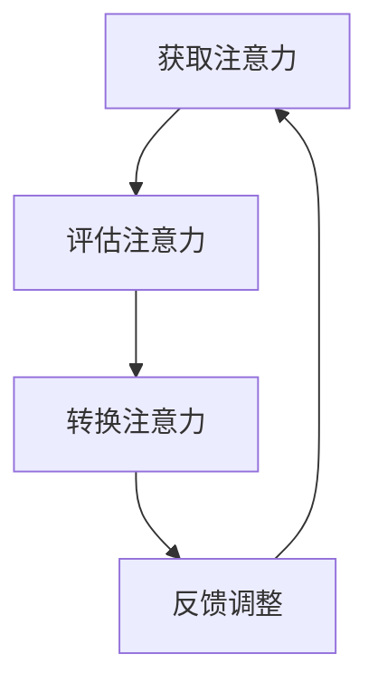
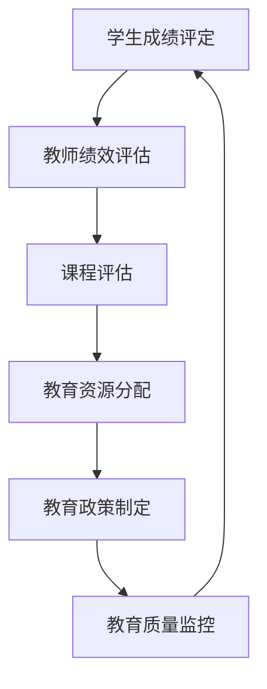
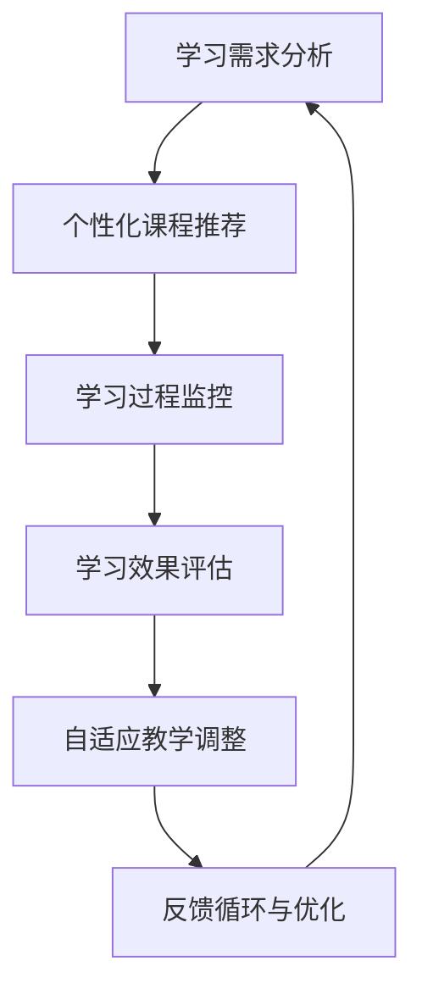
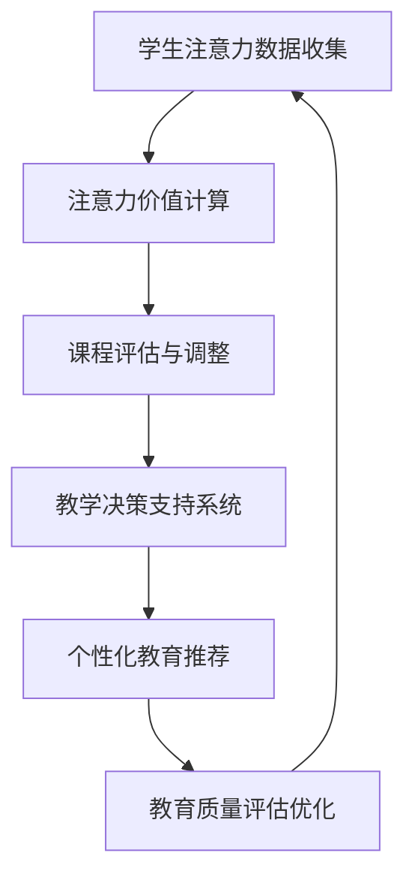
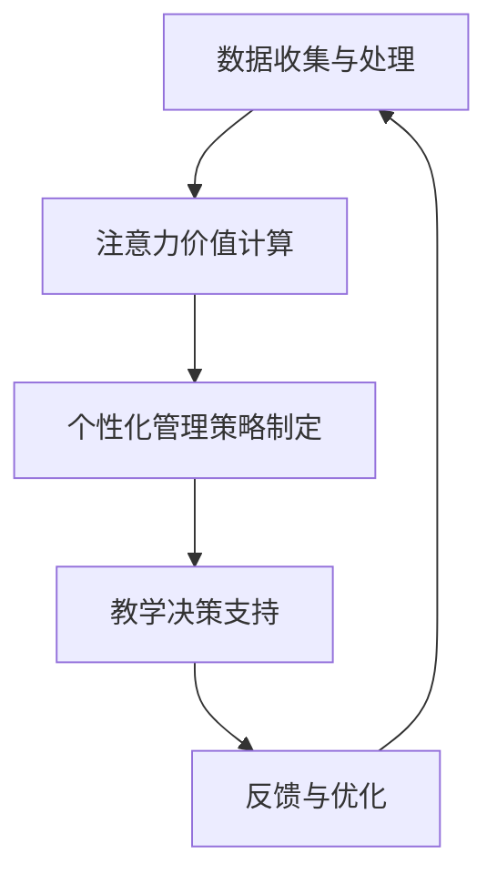
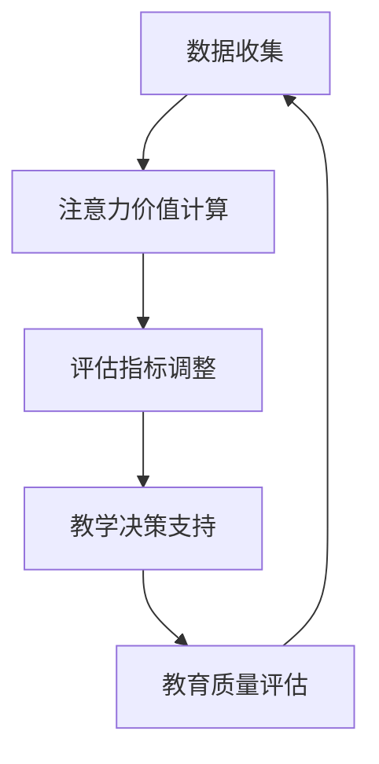

                 

### 文章标题：注意力经济对传统教育评估体系的冲击

#### 关键词：注意力经济、教育评估、传统教育、创新融合、个性化教育

#### 摘要：
本文旨在探讨注意力经济对传统教育评估体系的冲击与影响。随着信息技术和人工智能的发展，人们对于注意力资源的重要性有了新的认识。注意力经济作为一种新兴的经济模式，正在逐步渗透到各个行业，教育领域也不例外。本文首先介绍了注意力经济的基本概念和传统教育评估体系的构成，随后分析了注意力经济对教育评估体系的挑战和机遇。通过具体案例和数学模型，本文展示了注意力经济在教育评估中的实际应用，并探讨了未来教育评估的发展趋势。本文旨在为教育工作者和决策者提供理论指导和实践参考，以推动教育评估体系的创新与发展。

### 第一部分：理论基础与概念介绍

#### 第1章：注意力经济的概念与背景

#### 1.1.1 注意力经济的基本概念

注意力经济，是指在经济活动中，注意力作为一种稀缺资源，其获取、分配和利用的过程和机制。与传统的商品和服务不同，注意力资源无法通过市场直接交易，但其在信息传播、消费行为和人际关系中具有重要作用。注意力经济理论最早由美国学者Herbert A. Simon提出，他将其称为“注意力稀缺性”理论。在此基础上，后续学者进一步发展了这一理论，提出了注意力价值、注意力市场、注意力资本等概念。

**1.1.2 注意力经济的工作流程**

注意力经济的工作流程主要包括以下几个方面：

1. **注意力获取**：通过各种渠道和手段，吸引目标受众的注意力。
2. **注意力评估**：对受众的注意力进行评估，确定其价值。
3. **注意力转换**：将获取的注意力转换为实际的收益，如广告点击、商品购买等。
4. **注意力反馈**：通过反馈机制，调整和优化注意力获取策略。

下面是一个简化的注意力经济工作流程的Mermaid流程图：



**1.1.3 注意力经济在现实中的应用场景**

注意力经济在现实中的应用场景非常广泛，以下是一些典型的例子：

1. **广告行业**：广告商通过投放有吸引力的广告内容，吸引受众的注意力，进而实现商品或服务的销售。
2. **社交媒体**：社交媒体平台通过算法推荐，吸引用户的注意力，提高用户粘性。
3. **内容创作**：内容创作者通过创作高质量、有吸引力的内容，吸引观众的注意力，从而获得广告收入或粉丝支持。
4. **教育培训**：教育机构通过提供高质量、有吸引力的课程，吸引学生的注意力，提高教育效果。

**1.1.4 注意力经济的结论与展望**

注意力经济作为一种新兴的经济模式，具有巨大的潜力和应用价值。未来，随着人工智能和大数据技术的发展，注意力经济将更加精细化、智能化，成为推动经济发展的重要引擎。同时，需要注意注意力资源的公平分配，避免注意力资源集中于少数人手中，造成社会不公。

#### 1.2 传统教育评估体系概述

**1.2.1 传统教育评估体系的构成**

传统教育评估体系主要包括以下几个部分：

1. **学生成绩评定**：通过对学生考试成绩的分析，评估学生的学习效果。
2. **教师绩效评估**：通过对教师教学效果、学生学习成绩等方面的综合评估，评估教师的工作表现。
3. **课程评估**：对课程设置、教学内容、教学方法等方面的评估，以优化课程质量。
4. **教育资源分配**：根据评估结果，合理分配教育资源，如师资力量、教学设备等。
5. **教育政策制定**：基于评估结果，制定和调整教育政策，以促进教育公平和质量提升。
6. **教育质量监控**：通过定期评估和检查，确保教育质量达到标准。

下面是一个简化的传统教育评估体系流程的Mermaid流程图：



**1.2.2 传统教育评估体系的特点与挑战**

传统教育评估体系主要具有以下特点：

1. **标准化**：通过统一的标准和考试，评估学生的知识和能力。
2. **量化**：以分数和指标量化评估结果，便于比较和分析。
3. **权威性**：依赖于权威的教育机构和专家进行评估。
4. **静态性**：评估结果较为滞后，难以实时反映学生的动态变化。

然而，随着教育理念的变化和科技的发展，传统教育评估体系也面临着一系列挑战：

1. **评估单一**：过于依赖考试成绩，忽视学生的全面发展和个性化需求。
2. **忽视过程**：过于注重结果，忽视学习过程和学习方法。
3. **不公问题**：由于资源和机会的不平等，可能导致评估结果的不公平。
4. **滞后性**：评估体系滞后于教育实践，难以适应快速变化的教育环境。

综上所述，传统教育评估体系在当前的数字化和信息化的时代背景下，需要进行改革和创新，以适应新的教育需求和发展趋势。

#### 第2章：注意力经济对传统教育评估体系的冲击

**2.1.1 注意力经济对传统教育评估体系的挑战**

注意力经济的兴起对传统教育评估体系带来了前所未有的挑战。以下从几个方面进行分析：

**2.1.1.1 注意力稀缺性的影响**

注意力经济的基础是注意力稀缺性，这意味着在信息过载的时代，人们能够集中的注意力是有限的。传统教育评估体系过于依赖考试成绩，往往会导致学生为了追求高分而牺牲其他方面的兴趣和发展。在注意力经济的影响下，学生和教师可能会更加关注能够带来实际收益的活动，如课外辅导、科研项目等。这可能会改变教育资源的分配，导致传统评估体系的重心发生转移。

**2.1.1.2 个性化教育需求**

注意力经济强调个性化和定制化的服务，这在教育领域也表现出同样的趋势。传统教育评估体系往往采用统一的评估标准，难以满足学生的个性化需求。在注意力经济的影响下，教育评估体系可能会更加注重学生的兴趣、特长和个性化发展，通过多样化的评估手段，如项目展示、创新实践等，来全面评估学生的能力和潜力。

**2.1.1.3 教育资源分配的改变**

注意力经济对教育资源分配的影响也是显而易见的。在传统教育评估体系中，教育资源的分配往往基于考试成绩和学校排名。而在注意力经济下，教育资源可能会更加倾向于那些能够有效吸引学生注意力的教育机构和教师。这意味着，优秀的教育资源和机会可能会更加集中在那些能够提供高质量、有吸引力教育内容的地方。

**2.1.1.4 教育决策的支持系统**

注意力经济对教育决策的支持系统提出了新的要求。传统教育评估体系依赖于人工分析和判断，而在注意力经济的影响下，可以利用大数据和人工智能技术，对学生的注意力数据进行分析，为教育决策提供更加科学和精确的支持。例如，通过分析学生的学习行为和注意力变化，可以为教师提供个性化的教学建议，为学生提供个性化的学习路径。

**2.1.2 注意力经济与教育评估的创新融合**

尽管注意力经济对传统教育评估体系带来了挑战，但同时也为教育评估的创新融合提供了新的机遇。以下从几个方面进行分析：

**2.1.2.1 注意力数据的收集与应用**

注意力经济的核心是注意力数据的收集和应用。在教育领域，可以通过各种技术手段，如眼动追踪、学习行为分析等，收集学生的注意力数据。这些数据可以为教育评估提供更加全面和细致的参考，有助于发现学生在学习过程中的优势和不足，从而进行有针对性的改进。

**2.1.2.2 评估指标的调整**

在注意力经济的影响下，教育评估的指标体系也需要进行调整。传统的评估指标往往过于单一，难以全面反映学生的学习成果和能力。通过引入注意力价值等新的指标，可以更加准确地评估学生的学习效果，从而提高评估的准确性和科学性。

**2.1.2.3 教学决策的支持系统**

注意力经济为教育决策提供了新的支持系统。通过分析学生的注意力数据，可以为教师提供个性化的教学建议，如调整教学节奏、改进教学方法等，从而提高教学效果。同时，学生也可以通过分析自己的注意力数据，了解自己在学习过程中的注意力集中情况，从而进行自我调整和提高。

**2.1.2.4 个性化教育的推广**

注意力经济强调个性化和定制化服务，这与个性化教育的理念高度契合。通过引入注意力经济的相关技术，可以更加有效地推广个性化教育，为学生提供更加符合其需求和兴趣的学习内容和方法。

**2.1.3 结论与展望**

注意力经济对传统教育评估体系带来了挑战，但同时也为教育评估的创新融合提供了新的机遇。未来，教育评估体系需要充分利用注意力经济的相关技术，进行改革和创新，以适应新的教育环境和需求。通过引入注意力数据、调整评估指标、提供教学决策支持等手段，可以实现更加科学、准确和全面的教育评估，从而推动教育的质量提升和公平发展。

### 第二部分：案例分析与应用

#### 第3章：注意力经济在个性化教育中的应用

**3.1.1 个性化教育的概念与重要性**

个性化教育是指根据学生的兴趣、能力和需求，提供有针对性的教育服务，旨在促进学生的全面发展和个性化成长。与传统的“一刀切”式教育不同，个性化教育强调学生的主体地位，尊重学生的个体差异，通过灵活的教学内容和方式，满足学生的多样化需求。

**3.1.2 个性化教育的框架**

个性化教育框架包括以下几个关键组成部分：

1. **学习需求分析**：通过问卷调查、访谈、观察等方式，全面了解学生的学习兴趣、能力水平和学习需求。
2. **个性化课程推荐**：根据学习需求分析的结果，为每位学生推荐适合其发展的课程和教学内容。
3. **学习过程监控**：实时跟踪学生的学习过程，记录学习行为和注意力数据，为教学调整提供依据。
4. **学习效果评估**：通过定期的评估和反馈，了解学生的学习效果，对教学进行调整和优化。
5. **自适应教学调整**：根据学生的学习效果和反馈，动态调整教学内容和教学策略，实现教学与学生的个性化匹配。
6. **反馈循环与优化**：通过持续的反馈和调整，不断优化教学过程和教学效果，提高个性化教育的质量。

下面是一个简化的个性化教育框架的Mermaid流程图：



**3.1.3 注意力经济在个性化教育中的应用**

注意力经济在个性化教育中的应用，主要通过以下几个步骤实现：

1. **注意力数据的收集**：利用眼动追踪、学习行为分析等技术，收集学生的注意力数据，如学习时长、学习频率、学习专注度等。
2. **注意力价值评估**：通过对注意力数据的分析，评估学生的注意力价值，确定哪些学习内容能够更好地吸引学生的注意力。
3. **个性化课程调整**：根据注意力价值评估的结果，调整课程内容和教学方法，以提高学生的学习兴趣和参与度。
4. **教学效果监测与反馈**：通过实时监测学生的学习效果和注意力变化，及时调整教学策略，优化教学过程。
5. **教学资源的优化配置**：根据注意力价值评估的结果，合理配置教学资源，如师资力量、教学设备等，以提高教育资源的利用效率。

下面是一个简化的注意力经济在个性化教育中应用的Mermaid流程图：



**3.1.4 注意力经济在个性化教育中的案例**

为了更好地理解注意力经济在个性化教育中的应用，我们来看一个实际案例。

**案例：智能教育平台的个性化学习路径推荐**

某智能教育平台通过收集学生的学习行为和注意力数据，建立了一个个性化学习路径推荐系统。以下是一个简化的案例流程：

1. **数据收集**：平台通过学习行为分析，收集学生的学习时长、学习频率、学习内容偏好等数据。
2. **数据预处理**：对收集到的数据进行清洗和预处理，提取关键特征。
3. **注意力价值计算**：利用机器学习算法，对学习行为数据进行建模，计算每个学习内容的注意力价值。
4. **个性化学习路径推荐**：根据学生的注意力价值评估结果，为每位学生推荐最适合其发展的学习路径。
5. **教学效果监测与反馈**：通过实时监测学生的学习效果和注意力变化，对推荐的学习路径进行调整和优化。
6. **教学资源优化配置**：根据学生的个性化需求和学习效果，合理配置教学资源，提高教育资源的利用效率。

通过这个案例，我们可以看到，注意力经济在个性化教育中的应用，不仅提高了教学效果，还优化了教学资源的配置，实现了教育质量的提升。

**3.1.5 结论与展望**

注意力经济在个性化教育中的应用，为教育评估体系的创新提供了新的思路和方法。通过引入注意力价值评估和个性化学习路径推荐，可以更好地满足学生的个性化需求，提高教学效果和教育资源的利用效率。未来，随着人工智能和大数据技术的进一步发展，注意力经济在个性化教育中的应用将更加广泛和深入，为教育的个性化发展和质量提升提供强有力的支持。

#### 第4章：注意力经济与教育管理创新

**4.1.1 教育管理创新模式**

随着注意力经济的兴起，教育管理也在不断进行创新。传统的教育管理模式往往过于僵化和单一，难以适应快速变化的教育需求和社会环境。而注意力经济为教育管理提供了新的视角和工具，通过引入注意力价值评估和个性化管理策略，可以实现更加科学、高效和人性化的教育管理。

**4.1.2 注意力经济与教育管理创新的核心要素**

注意力经济与教育管理创新的核心要素主要包括以下几个方面：

1. **注意力价值评估**：通过对学生的学习行为、兴趣和注意力数据的分析，评估学生的注意力价值，为教育管理提供数据支持。
2. **个性化管理策略**：根据学生的注意力价值评估结果，制定个性化的教育管理策略，如课程安排、教学方法、教育资源分配等。
3. **教学决策支持系统**：利用大数据和人工智能技术，构建教学决策支持系统，为教育管理者提供科学的决策依据。
4. **反馈与优化机制**：建立有效的反馈与优化机制，实时监测教育管理的实际效果，并根据反馈进行调整和优化。

**4.1.3 注意力经济下的教育管理模式**

在注意力经济的影响下，教育管理模式发生了显著的变化。以下是一个简化的注意力经济下的教育管理模式：

1. **数据收集与处理**：利用各种技术手段，如学习行为分析、眼动追踪等，收集学生的注意力数据，并对数据进行预处理和分析。
2. **注意力价值计算**：通过机器学习算法和统计分析方法，计算每个学生的注意力价值，为个性化管理提供依据。
3. **个性化管理策略制定**：根据学生的注意力价值评估结果，制定个性化的教育管理策略，如课程安排、教学方法、教育资源分配等。
4. **教学决策支持**：利用教学决策支持系统，对教育管理策略进行模拟和优化，为教育管理者提供科学的决策依据。
5. **反馈与优化**：通过实时监测和反馈机制，对教育管理策略进行调整和优化，以提高教育管理的效率和效果。

下面是一个简化的注意力经济下的教育管理模式流程图：



**4.1.4 案例分析：智能教育平台的教育管理创新**

为了更好地理解注意力经济在教育管理创新中的应用，我们来看一个实际案例。

**案例：某智能教育平台的教育管理创新**

某智能教育平台通过引入注意力经济的相关技术，实现了教育管理模式的创新。以下是一个简化的案例流程：

1. **数据收集**：平台通过学习行为分析、眼动追踪等技术，收集学生的注意力数据，如学习时长、学习频率、学习内容偏好等。
2. **数据预处理**：对收集到的数据进行清洗和预处理，提取关键特征。
3. **注意力价值计算**：利用机器学习算法，对学习行为数据进行建模，计算每个学生的注意力价值。
4. **个性化管理策略制定**：根据学生的注意力价值评估结果，为每位学生制定个性化的教育管理策略，如课程安排、教学方法、教育资源分配等。
5. **教学决策支持**：通过教学决策支持系统，对个性化管理策略进行模拟和优化，为教育管理者提供科学的决策依据。
6. **反馈与优化**：通过实时监测和反馈机制，对教育管理策略进行调整和优化，以提高教育管理的效率和效果。

通过这个案例，我们可以看到，注意力经济在教育管理创新中的应用，不仅提高了教育管理的科学性和效率，还优化了教育资源的配置，实现了教育质量的提升。

**4.1.5 结论与展望**

注意力经济为教育管理创新提供了新的思路和工具。通过引入注意力价值评估和个性化管理策略，可以实现更加科学、高效和人性化的教育管理。未来，随着人工智能和大数据技术的进一步发展，注意力经济在教育管理创新中的应用将更加广泛和深入，为教育的现代化发展提供强有力的支持。

#### 第5章：注意力经济下的教育公平问题

**5.1.1 注意力经济与教育公平**

随着注意力经济的快速发展，教育公平问题也日益引起关注。注意力经济强调个性化、定制化和高效利用注意力资源，这在一定程度上可能会加剧教育不公平现象。然而，通过合理利用注意力经济的相关技术，也可以在一定程度上缓解教育不公平问题，实现教育资源的公平分配。

**5.1.2 教育公平的概念与重要性**

教育公平是指每个人在教育领域享有平等的机会和待遇，不受性别、种族、经济状况等因素的制约。教育公平不仅关系到个人的发展和幸福，也关系到社会的稳定和进步。实现教育公平是教育发展的重要目标之一，也是衡量一个社会文明程度的重要标准。

**5.1.3 注意力经济对教育公平的潜在影响**

注意力经济对教育公平的影响主要体现在以下几个方面：

1. **资源分配**：在注意力经济下，教育资源可能会更加集中在那些能够吸引更多注意力的地区和学校，这可能会导致教育资源分配的不公平。
2. **教学质量**：优秀的教育资源和教师可能会集中在那些能够吸引更多注意力的学校，这可能会导致教学质量的差异。
3. **学生参与**：注意力经济可能会加剧学生参与教育的差异，因为注意力资源的稀缺性导致部分学生可能无法获得足够的关注和参与机会。
4. **教育机会**：注意力经济可能会影响教育机会的公平性，因为那些能够吸引更多注意力的教育内容和课程可能更加受欢迎，而其他内容可能会被忽视。

**5.1.4 注意力经济与教育公平的数学模型**

为了更直观地分析注意力经济对教育公平的影响，我们可以使用以下数学模型：

$$
\text{公平指数} = \frac{\sum (\text{个体注意力价值} \times \text{教育机会})}{\sum \text{教育机会}}
$$

其中，公平指数用于衡量教育公平的程度。个体注意力价值表示每个学生获得的教育资源的价值，教育机会表示每个学生获得的教育资源数量。

**5.1.5 案例分析：注意力经济与教育公平的实践**

为了更好地理解注意力经济与教育公平的关系，我们来看一个实际案例。

**案例：某地区的教育公平改革**

某地区在实施注意力经济改革的过程中，发现教育资源分配存在不公平现象。为了缓解这一问题，该地区采取了以下措施：

1. **教育资源均衡配置**：通过政策引导，将优质教育资源向偏远地区和薄弱学校倾斜，确保每个学生都能获得公平的教育机会。
2. **注意力价值评估**：利用注意力价值评估技术，对学生的教育需求进行评估，为每个学生提供个性化的教育资源。
3. **教学资源共享**：通过建立教育资源共享平台，将优质教学资源向全体学生开放，提高教育资源的利用效率。
4. **教育政策支持**：制定相关政策，鼓励和引导社会力量参与教育公平改革，形成政府、学校、社会多元合作的教育生态系统。

通过这个案例，我们可以看到，尽管注意力经济可能会带来教育不公平的挑战，但通过合理利用注意力经济的相关技术，可以实现教育资源的公平分配和教育公平的优化。

**5.1.6 结论与展望**

注意力经济对教育公平具有双重影响，既有潜在的不公平性，也有通过合理利用技术手段实现公平的潜力。未来，需要进一步研究和探索如何在注意力经济的框架下，实现教育资源的公平分配和教育公平的优化，为每个学生提供平等的教育机会和成长环境。

### 第三部分：技术实现与工具应用

#### 第6章：注意力经济技术的实现方法

**6.1.1 注意力模型的基本原理**

注意力模型是一种基于信息重要性权重分配的机制，它通过计算输入数据的相对重要性，对数据进行加权处理。在注意力经济中，注意力模型用于评估和分配注意力资源，以提高信息处理的效率和效果。以下是一个简化的注意力机制实现过程：

```python
def attention机制(query, keys, values):
    # 计算查询向量与键向量的点积
    attention_scores = [dot_product(query, key) for key in keys]
    # 对注意力得分应用Softmax函数进行归一化
    attention_scores = softmax(attention_scores)
    # 计算加权值
    output = [score * value for score, value in zip(attention_scores, values)]
    # 返回加权后的输出
    return output

def dot_product(v1, v2):
    # 计算两个向量的点积
    return sum(x * y for x, y in zip(v1, v2))

def softmax(scores):
    # 计算Softmax函数
    e_scores = [math.exp(score) for score in scores]
    sum_scores = sum(e_scores)
    return [score / sum_scores for score in e_scores]
```

**6.1.2 注意力技术在教育评估中的应用**

注意力技术在教育评估中的应用，主要涉及以下几个方面：

1. **学生注意力数据收集**：通过眼动追踪、学习行为分析等技术，收集学生在学习过程中的注意力数据，如注视点分布、学习时长、学习频率等。
2. **注意力价值计算**：利用注意力模型，对收集到的注意力数据进行处理，计算每个学生的学习注意力价值。
3. **评估指标调整**：根据学生的注意力价值，调整教育评估的指标体系，如考试成绩、学习过程、学习态度等。
4. **教学决策支持**：利用注意力价值评估结果，为教师提供个性化的教学建议，优化教学策略。
5. **教育质量评估**：通过注意力价值评估，对教育质量进行全面的评估，提高教育评估的科学性和准确性。

以下是一个简化的注意力技术在教育评估中应用的Mermaid流程图：



**6.1.3 案例分析：注意力模型在智能教育平台中的应用**

为了更好地理解注意力模型在教育评估中的应用，我们来看一个实际案例。

**案例：智能教育平台的注意力评估系统**

某智能教育平台通过引入注意力模型，建立了学生注意力评估系统。以下是一个简化的案例流程：

1. **数据收集**：平台利用眼动追踪技术，实时收集学生的学习注意力数据，如注视点分布、学习时长等。
2. **数据预处理**：对收集到的注意力数据进行分析和清洗，提取关键特征。
3. **注意力价值计算**：利用注意力模型，对预处理后的数据进行处理，计算每个学生的注意力价值。
4. **评估指标调整**：根据学生的注意力价值，调整教育评估的指标体系，增加学习过程、学习态度等方面的权重。
5. **教学决策支持**：利用注意力价值评估结果，为教师提供个性化的教学建议，优化教学策略，提高教学效果。
6. **教育质量评估**：通过注意力价值评估，对教育质量进行全面的评估，提高教育评估的科学性和准确性。

通过这个案例，我们可以看到，注意力模型在智能教育平台中的应用，不仅提高了教育评估的准确性和科学性，还为教学决策提供了有力支持，实现了教育质量的提升。

**6.1.4 结论与展望**

注意力技术在教育评估中的应用，为教育评估体系的创新提供了新的思路和方法。通过引入注意力模型，可以实现更加科学、准确和全面的教育评估，为教育决策提供有力支持。未来，随着人工智能和大数据技术的进一步发展，注意力技术在教育评估中的应用将更加广泛和深入，为教育的现代化发展提供强有力的支持。

### 第四部分：未来发展展望与挑战

#### 第8章：注意力经济与教育评估的未来发展

**8.1.1 注意力经济在教育领域的潜在应用**

注意力经济在教育领域的应用前景广阔，以下是一些潜在的领域：

1. **个性化学习路径规划**：通过注意力价值评估，为每个学生定制个性化的学习路径，提高学习效率。
2. **智能教育平台**：利用注意力数据，构建智能教育平台，提供个性化的教学内容、推荐和学习计划。
3. **教师绩效评估**：通过注意力数据，评估教师的教学效果，为教师提供反馈和改进建议。
4. **教育资源优化配置**：基于注意力经济模型，优化教育资源分配，确保教育机会的公平性。
5. **教育政策制定**：利用注意力数据分析，为教育政策制定提供数据支持，促进教育公平和质量提升。

**8.1.2 注意力经济在教育评估中的发展路径**

注意力经济在教育评估中的发展路径可以概括为以下几个阶段：

1. **数据收集与处理**：通过多种技术手段，如学习行为分析、眼动追踪等，收集学生的注意力数据，并进行预处理。
2. **注意力价值评估**：利用机器学习算法，对注意力数据进行建模，计算学生的注意力价值。
3. **评估指标调整**：根据注意力价值评估结果，调整教育评估的指标体系，增加学习过程、学习态度等方面的权重。
4. **教学决策支持**：利用注意力价值评估，为教师提供个性化的教学建议，优化教学策略。
5. **教育质量评估**：通过注意力价值评估，对教育质量进行全面的评估，提高教育评估的科学性和准确性。
6. **反馈与优化**：建立反馈机制，根据教育评估的结果，不断调整和优化教育评估体系，实现教育评估的持续改进。

**8.1.3 未来发展的挑战与机遇**

注意力经济在教育评估中面临以下挑战：

1. **数据隐私与安全**：注意力数据涉及学生的个人隐私，需要确保数据的安全性和隐私性。
2. **技术门槛**：注意力经济技术的实现和应用需要较高技术门槛，需要培养相关人才。
3. **政策法规**：需要制定相关政策法规，规范注意力经济在教育领域的应用，确保教育公平和质量。

然而，这些挑战也伴随着巨大的机遇：

1. **教育质量提升**：通过注意力经济技术，可以更加科学、准确地评估教育质量，促进教育质量的提升。
2. **教育资源优化**：基于注意力经济模型，可以实现教育资源的最优配置，提高教育资源的利用效率。
3. **教育公平保障**：通过合理利用注意力经济技术，可以缓解教育资源分配不均的问题，促进教育公平。

**8.1.4 结论与展望**

注意力经济在教育评估中的应用具有巨大的潜力和前景。通过引入注意力价值评估和个性化管理策略，可以实现更加科学、准确和全面的教育评估，推动教育质量提升和教育公平实现。未来，随着技术的不断进步和政策法规的完善，注意力经济将在教育领域发挥更大的作用，为教育的现代化发展提供强有力的支持。

### 作者信息

作者：AI天才研究院/AI Genius Institute & 禅与计算机程序设计艺术 /Zen And The Art of Computer Programming

