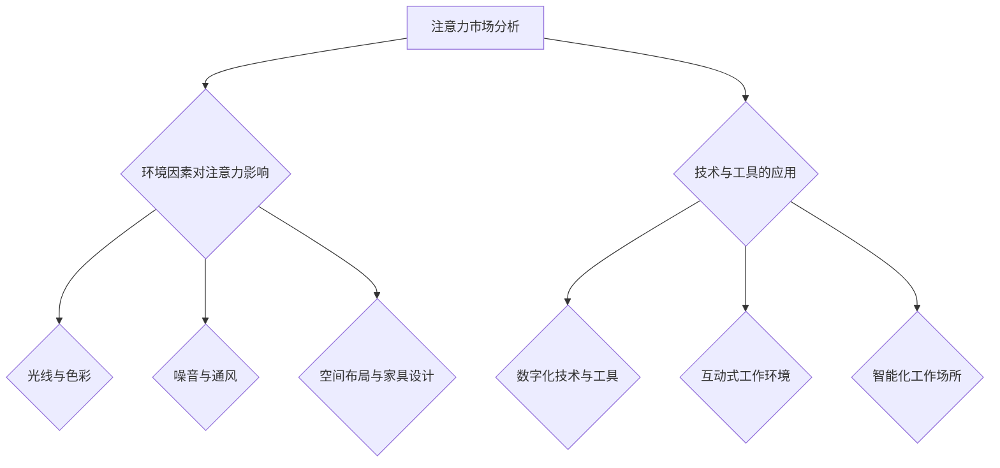

                 

## 《注意力经济对工作场所设计的影响》

### 关键词：
- 注意力经济
- 工作场所设计
- 办公空间优化
- 注意力管理
- 员工激励
- 企业文化

### 摘要：
本文旨在探讨注意力经济对现代工作场所设计的影响。随着信息时代的到来，人们的注意力成为了一种宝贵的资源。本文首先介绍了注意力经济的定义、背景和重要性，然后深入分析了注意力经济在工作场所设计中的核心原则和实际应用。通过案例分析，本文展示了注意力经济如何通过优化办公空间、员工激励和企业文化建设等方面提升工作场所的效率和员工满意度。最后，本文展望了注意力经济在未来工作场所设计中的发展趋势和挑战，为相关领域的实践提供了参考。

### 《注意力经济对工作场所设计的影响》目录大纲

#### 第一部分：注意力经济概述

##### 第1章：注意力经济导论

1.1 注意力经济的定义与背景
1.1.1 注意力经济的概念
1.1.2 注意力经济的起源与发展
1.1.3 注意力经济的重要性

1.2 注意力市场分析
1.2.1 注意力作为资源
1.2.2 注意力市场的需求与供给
1.2.3 注意力市场的动态变化

1.3 注意力经济与工作场所
1.3.1 工作场所设计的挑战
1.3.2 注意力经济在工作场所的应用
1.3.3 注意力经济对工作场所设计的影响

##### 第2章：工作场所设计的核心原则

2.1 工作场所设计的定义与目标
2.1.1 工作场所设计的概念
2.1.2 工作场所设计的目标
2.1.3 工作场所设计的重要性

2.2 环境因素对注意力的影响
2.2.1 光线与色彩
2.2.2 噪音与通风
2.2.3 空间布局与家具设计

2.3 技术与工具的应用
2.3.1 数字化技术与工具
2.3.2 互动式工作环境
2.3.3 智能化工作场所

2.4 注意力管理策略
2.4.1 注意力分散与集中
2.4.2 提高注意力的方法
2.4.3 注意力管理的工具与应用

##### 第三部分：注意力经济在工作场所的应用

##### 第3章：注意力经济在工作场所的实际应用

3.1 注意力经济在办公空间设计中的应用
3.1.1 办公空间布局优化
3.1.2 工作流程与工作方式
3.1.3 跨部门沟通与协作

3.2 注意力经济在员工激励中的应用
3.2.1 员工注意力分配
3.2.2 员工激励策略
3.2.3 提高员工注意力集中的措施

3.3 注意力经济在企业文化塑造中的应用
3.3.1 企业文化对注意力的塑造
3.3.2 企业价值观与注意力的关系
3.3.3 注意力经济在企业文化建设中的作用

##### 第四部分：案例研究与展望

##### 第4章：注意力经济在工作场所的案例研究

4.1 案例一：XX公司办公空间设计与改造
4.1.1 案例背景
4.1.2 设计思路与实施
4.1.3 案例效果评估

4.2 案例二：XX公司员工激励计划
4.2.1 案例背景
4.2.2 激励措施与实施
4.2.3 案例效果评估

4.3 案例三：XX公司企业文化建设
4.3.1 案例背景
4.3.2 文化建设措施与实施
4.3.3 案例效果评估

##### 第5章：注意力经济对工作场所设计的未来展望

5.1 注意力经济在未来工作场所设计中的发展趋势
5.1.1 科技进步对注意力经济的影响
5.1.2 新型工作场所设计模式
5.1.3 注意力经济在工作场所设计中的未来挑战

5.2 注意力经济与可持续发展
5.2.1 注意力经济与可持续发展的关系
5.2.2 注意力经济在工作场所设计中的可持续发展策略
5.2.3 可持续发展的未来展望

##### 第6章：总结与建议

6.1 注意力经济对工作场所设计的整体影响
6.1.1 核心要点总结
6.1.2 注意力经济在工作场所设计中的关键作用

6.2 实践建议
6.2.1 设计师的建议
6.2.2 管理者的建议
6.2.3 员工的建议

##### 第7章：参考资料

7.1 参考文献
7.1.1 学术论文与书籍
7.1.2 行业报告与政策文件
7.1.3 网络资源

7.2 附录
7.2.1 Mermaid 流程图
7.2.2 核心算法原理伪代码
7.2.3 数学模型与公式解释示例
7.2.4 项目实战案例代码及解读分析

### 第一部分：注意力经济概述

#### 第1章：注意力经济导论

随着数字时代的到来，信息量的爆炸性增长使得人们的注意力成为一种稀缺资源。在这个背景下，注意力经济逐渐成为一个重要的研究领域。本章将介绍注意力经济的定义、背景和重要性，并探讨注意力经济对工作场所设计的潜在影响。

##### 1.1 注意力经济的定义与背景

注意力经济（Attention Economy）是一个描述人们在信息过载环境中如何分配注意力的经济模型。在这个模型中，注意力被视为一种资源，与传统的自然资源、资本和劳动力等资源一样重要。注意力经济的概念最早由唐·塔普斯科特（Don Tapscott）在1995年的著作《数字经济》（The Digital Economy）中提出。

1.1.1 注意力经济的概念

注意力经济的核心概念是“注意力即货币”，即个体的注意力成为一种可以交换和利用的资源。在传统经济中，金钱是主要的交换媒介，而在注意力经济中，人们的注意力成为了一种新的价值源泉。例如，广告商通过吸引用户的注意力来推销产品，内容创作者通过吸引观众的注意力来获得广告收入。

1.1.2 注意力经济的起源与发展

注意力经济起源于20世纪末的信息时代。随着互联网和移动设备的普及，人们面临的信息量迅速增加，如何有效地分配注意力成为一个关键问题。早期的注意力经济研究主要关注如何吸引用户的注意力，以及如何通过注意力创造经济价值。

随着时间的推移，注意力经济的研究逐渐拓展到多个领域，包括广告、媒体、娱乐、教育等。现代注意力经济更加注重个体注意力的有效管理和优化，以提升用户体验和生产效率。

1.1.3 注意力经济的重要性

注意力经济的重要性在于它重新定义了价值的创造和分配方式。在传统经济中，价值通常通过产品和服务的生产和销售来实现。而在注意力经济中，价值创造的过程更多地依赖于如何吸引和保留用户的注意力。

首先，注意力经济对市场参与者的行为产生了深远影响。企业开始更加重视用户体验和内容质量，以吸引和保持用户的注意力。例如，社交媒体平台通过算法推荐和个性化内容来吸引用户的注意力，从而提升用户粘性和广告效果。

其次，注意力经济改变了价值分配的方式。在传统经济中，利润主要流向生产者和销售者。而在注意力经济中，利润更多地流向那些能够有效吸引和保持用户注意力的平台和内容创作者。这种分配方式可能导致“赢者通吃”的现象，即少数强势平台和创作者占据了大部分的注意力资源。

最后，注意力经济对社会产生了广泛影响。人们的时间和精力变得更加宝贵，如何有效地利用注意力成为了一个重要的社会问题。同时，注意力经济也带来了一些负面影响，如信息过载、注意力分散和焦虑等。因此，如何平衡注意力的利用和保护，是现代社会面临的一个重要挑战。

##### 1.2 注意力市场分析

注意力市场是指个体注意力资源在交换和使用过程中的市场机制。在注意力市场中，用户作为注意力的供给方，通过消费各种信息和内容来分配自己的注意力资源。而平台和内容创作者作为需求方，通过提供高质量的信息和内容来吸引和留住用户的注意力。

1.2.1 注意力作为资源

在注意力市场中，注意力被视为一种稀缺资源。随着信息量的增加，用户的注意力资源变得更加有限。因此，如何有效地管理和分配注意力资源成为一个关键问题。注意力作为一种资源，具有以下特点：

1. 稀有性：由于时间的有限性，每个人的注意力资源都是有限的。在信息过载的环境中，用户需要做出选择，如何将有限的注意力资源分配给不同的信息来源。

2. 可再生性：与自然资源不同，注意力资源在一定程度上是可再生的。通过适当的休息和放松，用户可以恢复和重新分配注意力资源。

3. 替代性：用户可以将注意力资源从一个信息源转移到另一个信息源。这种替代性使得注意力市场具有动态性，用户可以根据自己的需求和偏好来调整注意力的分配。

1.2.2 注意力市场的需求与供给

在注意力市场中，需求方是那些希望吸引用户注意力的平台和内容创作者。他们通过提供有价值、有趣或吸引人的内容来吸引用户。供给方是用户本身，他们根据自己的需求和偏好来选择消费哪些信息。

需求方面临的挑战是如何在信息过载的环境中吸引用户的注意力。他们需要了解用户的兴趣和行为模式，以便提供个性化的内容和服务。供给方面临的挑战是如何有效地利用自己的注意力资源，以便获得最大的收益。

1.2.3 注意力市场的动态变化

注意力市场的动态变化受到多种因素的影响，包括技术进步、社会变迁和经济环境等。以下是几个关键因素：

1. 技术进步：互联网和移动设备的普及使得用户能够更方便地获取和消费信息。同时，算法推荐和大数据分析等技术也为平台和内容创作者提供了更精准的注意力分配策略。

2. 社会变迁：随着人们生活水平的提高，人们对信息的需求也发生了变化。用户更加注重高质量、有价值的内容，而不是单纯的量。

3. 经济环境：经济环境的变化会影响人们的消费能力和消费习惯。例如，经济衰退可能导致用户减少对娱乐和信息消费的支出。

总之，注意力市场的动态变化对工作场所设计产生了深远影响。企业需要了解用户的注意力分配模式，以便优化工作场所的设计和流程，提高员工的工作效率和生活质量。

##### 1.3 注意力经济与工作场所

注意力经济不仅影响了市场的运行方式，也对工作场所的设计和管理产生了重要影响。工作场所是人们集中注意力和进行生产活动的重要空间，因此，如何利用注意力经济的原则来设计工作场所，成为一个关键问题。

1.3.1 工作场所设计的挑战

随着注意力经济的兴起，工作场所设计面临着一系列挑战：

1. 注意力分散：在信息过载的环境中，员工容易受到各种干扰，导致注意力分散。这降低了员工的工作效率和生产力。

2. 注意力疲劳：长时间的高强度工作会导致员工产生注意力疲劳，从而影响工作质量和创造力。

3. 工作与生活的平衡：随着人们对工作与生活平衡的重视，工作场所的设计需要考虑到员工的个人需求和生活方式。

1.3.2 注意力经济在工作场所的应用

注意力经济在工作场所的应用主要体现在以下几个方面：

1. 办公空间设计：通过优化办公空间的设计，提高员工的工作效率和注意力集中度。例如，采用灵活的办公布局、提供舒适的工作环境和减少干扰。

2. 注意力管理工具：利用技术工具来管理员工的注意力，例如时间管理应用、专注力训练工具等。

3. 员工激励策略：通过设计有效的员工激励措施，提高员工的积极性和专注度。例如，提供奖励、建立团队目标和鼓励创新等。

1.3.3 注意力经济对工作场所设计的影响

注意力经济对工作场所设计的影响主要体现在以下几个方面：

1. 空间布局：根据注意力经济的原则，工作场所的空间布局需要考虑到员工的注意力需求。例如，设置专注区、休息区和社交区，以帮助员工在不同场景下更好地集中注意力。

2. 技术应用：利用数字化技术和智能化工具来提高工作场所的效率和员工的注意力集中度。例如，采用智能办公设备、自动化工作流程和虚拟现实技术等。

3. 企业文化：通过塑造积极的企业文化，提高员工的注意力和工作效率。例如，鼓励创新、提供培训和发展机会，以及建立良好的沟通和协作机制。

总之，注意力经济对工作场所设计产生了深远影响。通过优化办公空间、应用注意力管理工具和塑造积极的企业文化，企业可以更好地利用员工的注意力资源，提高工作效率和员工满意度。

### 第一部分：注意力经济概述

#### 第2章：工作场所设计的核心原则

工作场所设计是现代企业管理中至关重要的一环，它不仅影响员工的工作效率和生活质量，还直接关系到企业的长远发展。随着注意力经济的兴起，如何通过工作场所设计来优化员工的注意力分配和集中成为了一个关键问题。本章将探讨工作场所设计的核心原则，包括环境因素、技术应用和注意力管理策略，以帮助企业在激烈的市场竞争中保持竞争力。

##### 2.1 工作场所设计的定义与目标

工作场所设计是指企业为了满足员工的工作需求和提高工作效率，对办公空间、设备和环境等进行规划和布局的活动。一个良好的工作场所设计应当具备以下几个目标：

1. 提高工作效率：通过优化工作流程和办公环境，减少员工的无效劳动时间，提高整体工作效率。

2. 增强员工满意度：提供一个舒适、安全、富有创造力的工作环境，提高员工的满意度和忠诚度。

3. 促进团队合作：通过合理的空间布局和设施配置，促进员工之间的沟通与合作，增强团队凝聚力。

4. 节约成本：通过优化设计，提高空间利用率，降低能源消耗和维护成本。

2.1.1 工作场所设计的概念

工作场所设计包括多个方面，如办公空间布局、设备配置、环境设计等。办公空间布局涉及到开放办公、封闭办公室、小组讨论室等多种形式。设备配置包括电脑、网络、通讯设备等硬件设施。环境设计则涉及到色彩、光线、通风、噪音控制等。

2.1.2 工作场所设计的目标

工作场所设计的目标不仅是为了提供舒适的工作环境，更重要的是要提升员工的工作效率和创造力。具体目标包括：

1. 提高员工的注意力集中度：通过优化工作环境和流程，减少干扰和分心因素，帮助员工更好地集中注意力。

2. 增强员工的工作动力：通过合理的激励和奖励机制，激发员工的工作热情和创造力。

3. 促进信息交流与协作：通过设计开放的工作空间和便捷的通讯设施，促进员工之间的信息交流和团队合作。

4. 提升员工的健康和福祉：通过提供舒适的工作环境和良好的工作氛围，降低员工的疲劳和压力，提高员工的身心健康。

2.1.3 工作场所设计的重要性

工作场所设计对企业和员工都有着重要的影响。对企业而言，良好的工作场所设计可以提升员工的工作效率和工作质量，减少员工流失率，增强企业的竞争力和市场地位。对员工而言，一个舒适、安全、富有创造力的工作环境可以提升他们的工作满意度和生活质量，减少工作压力和职业倦怠。

此外，随着注意力经济的兴起，工作场所设计的重要性更加凸显。员工在信息过载的环境中，容易受到各种干扰和分心，导致注意力分散和疲劳。因此，通过优化工作场所设计，提供专注区、休息区和社交区等，可以帮助员工更好地管理自己的注意力，提高工作效率和创造力。

##### 2.2 环境因素对注意力的影响

环境因素是工作场所设计中至关重要的一个方面，它们直接影响员工的工作效率和注意力集中度。以下是几个关键的环境因素及其对注意力的影响：

2.2.1 光线与色彩

光线和色彩是影响员工注意力和舒适度的重要因素。适当的自然光线可以提高员工的工作效率和创造力，而过度的人工照明可能会导致视觉疲劳和注意力分散。因此，工作场所的设计应当充分利用自然光线，同时合理控制人工照明的亮度和颜色。

色彩也对员工的心理和生理状态有着重要影响。例如，蓝色和绿色有助于放松和集中注意力，而红色和黄色可能会增加兴奋和紧张感。因此，在工作场所的色彩选择上，应当考虑到不同区域的用途和员工的舒适度，选择适合的色彩搭配。

2.2.2 噪音与通风

噪音是另一个影响员工注意力和工作效率的重要环境因素。高噪音水平会导致员工分心和疲劳，降低工作效率。因此，工作场所的设计应当尽量减少噪音干扰，例如通过隔音材料、隔音墙和隔断等方式。

通风也是保证员工健康和工作舒适度的关键因素。良好的通风可以降低空气中的二氧化碳浓度，减少异味和污染物，提高空气质量和员工的工作舒适度。工作场所的设计应当考虑到通风系统的合理布局和效率，确保空气流畅和温度适宜。

2.2.3 空间布局与家具设计

空间布局和家具设计是工作场所设计中不可忽视的方面。合理的空间布局可以提高员工的工作效率和团队协作，而家具设计则直接关系到员工的舒适度和健康。

开放办公区、封闭办公室、小组讨论室和休息区等不同空间布局的设置，需要根据员工的工作需求和团队协作模式进行合理规划。开放办公区有助于提高员工的沟通和协作，但容易受到噪音干扰；封闭办公室则提供了更多的隐私和安静环境，有助于员工集中注意力。

家具设计也应考虑到员工的舒适度和健康。例如，选用符合人体工程学的办公椅和桌子，可以减少员工的疲劳和不适；设置可调节高度的显示器和椅子，有助于员工保持正确的坐姿和减轻颈肩疼痛。

此外，休息区和社交区的设置也是工作场所设计中的重要环节。休息区可以提供一个放松和恢复精力的环境，帮助员工缓解压力和疲劳；社交区则可以促进员工之间的交流和互动，增强团队凝聚力和归属感。

##### 2.3 技术与工具的应用

随着科技的不断进步，数字化技术和智能化工具在提升员工工作效率和注意力集中度方面发挥着重要作用。以下是几种常见的技术与工具及其应用：

2.3.1 数字化技术与工具

数字化技术在工作场所中的应用主要体现在信息化办公系统和自动化工作流程上。信息化办公系统包括电子邮件、即时通讯、文档共享和项目管理等工具，可以大大提高员工的工作效率和沟通效率。自动化工作流程则通过预设的规则和流程，减少人工操作，降低错误率，提高工作效率。

此外，数字化技术还可以帮助员工更好地管理自己的时间和注意力。例如，通过时间管理应用，员工可以记录自己的工作内容和时间分配，识别哪些任务占据了过多的时间，从而优化时间管理。

2.3.2 互动式工作环境

互动式工作环境通过智能设备和虚拟现实技术，为员工提供更加生动和沉浸式的工作体验。例如，智能会议系统可以通过视频会议和远程协作工具，实现异地团队的实时沟通和协作。虚拟现实技术则可以帮助员工在虚拟环境中进行培训和实践，提高技能和效率。

互动式工作环境还可以通过游戏化元素，提高员工的工作动力和参与度。例如，通过设定工作目标、积分奖励和排名系统，激发员工的竞争意识和积极性。

2.3.3 智能化工作场所

智能化工作场所通过物联网、人工智能和大数据等技术，实现工作场所的智能监控和优化。例如，智能监控系统可以实时监控员工的出勤情况和工作状态，提供数据分析和管理报告，帮助企业更好地进行人力资源管理和决策。

智能化工作场所还可以通过智能办公设备，提高员工的工作效率和舒适度。例如，智能灯光系统可以根据员工的需求和环境光线自动调节亮度，智能空调系统可以根据室内温度和湿度自动调节温度和湿度，提供舒适的工作环境。

##### 2.4 注意力管理策略

注意力管理是提高员工工作效率和创造力的重要手段。通过以下几种策略，企业可以有效地管理员工的注意力：

2.4.1 注意力分散与集中

注意力分散与集中是注意力管理的核心。在工作场所中，员工需要在不同任务和工作环境中进行注意力分散和集中。分散注意力可以帮助员工放松和恢复精力，而集中注意力则有助于完成复杂和重要的任务。

企业可以通过以下方式来帮助员工管理注意力分散和集中：

1. 提供专注区：为员工提供专门用于集中注意力的空间，例如安静的书房或会议室。

2. 设定工作优先级：通过设定工作优先级，帮助员工明确哪些任务最重要，从而更好地集中注意力。

3. 管理干扰因素：减少工作场所中的干扰因素，例如噪音、电子邮件和即时通讯等。

2.4.2 提高注意力的方法

提高注意力是注意力管理的重要目标。以下是一些提高注意力的方法：

1. 时间管理：通过合理规划工作时间，减少无效劳动时间，提高工作效率。

2. 休息与放松：定期休息和放松可以帮助员工恢复精力和注意力。

3. 锻炼与运动：适量的体育锻炼可以提高员工的身体素质和注意力水平。

2.4.3 注意力管理的工具与应用

注意力管理的工具可以帮助员工更好地管理自己的注意力。以下是一些常见的注意力管理工具：

1. 时间管理应用：例如Trello、Asana等，可以帮助员工规划和管理工作任务。

2. 注意力训练工具：例如Focus@Will、Forest等，通过设定专注时间和奖励机制，帮助员工提高专注力和生产力。

3. 注意力监控工具：例如RescueTime、ToutApp等，可以帮助员工监控自己的时间使用情况，识别时间浪费的原因。

总之，工作场所设计需要综合考虑环境因素、技术应用和注意力管理策略，以提供一个高效、舒适和富有创造力的工作环境。通过优化工作场所设计，企业可以更好地利用员工的注意力资源，提高工作效率和员工满意度。

### 第三部分：注意力经济在工作场所的应用

#### 第3章：注意力经济在工作场所的实际应用

随着注意力经济的不断发展和深化，如何在工作场所中有效地应用注意力经济原则，以提高员工的工作效率和企业的整体竞争力，成为了现代企业管理的重要课题。本章将探讨注意力经济在工作场所中的实际应用，包括办公空间设计、工作流程与工作方式的优化、以及跨部门沟通与协作等方面。

##### 3.1 注意力经济在办公空间设计中的应用

办公空间设计是工作场所设计中至关重要的一环，它直接影响到员工的注意力分配和集中。因此，通过优化办公空间设计，可以有效地提高员工的注意力和工作效率。以下是几个关键方面：

3.1.1 办公空间布局优化

办公空间布局优化是注意力经济在办公空间设计中的核心应用之一。合理的空间布局可以帮助员工更好地集中注意力，提高工作效率。以下是几种常见的办公空间布局：

1. **开放办公区**：开放办公区具有透明度高、空间宽敞的特点，有助于促进员工之间的沟通与合作。然而，开放办公区也可能带来噪音和干扰，影响员工的注意力集中。因此，在设计开放办公区时，可以采用隔音材料和隔音墙来减少噪音干扰，同时设置隔断或屏障，为员工提供一定的隐私空间。

2. **封闭办公室**：封闭办公室为员工提供了一个相对安静和独立的工作环境，有助于员工集中注意力。封闭办公室通常配备隔音窗户和门，可以有效地隔离外部噪音和干扰。对于需要长时间集中精力的工作，如研发、数据分析等，封闭办公室是一个理想的选择。

3. **专注区**：为了帮助员工更好地集中注意力，可以在办公空间中设置专注区。专注区可以是一个安静的小房间，或者是一个设有隔断的小区域，为员工提供一个可以静心工作的环境。在专注区中，员工可以关闭电子设备，减少干扰，全身心地投入到工作中。

4. **多功能区**：多功能区是现代办公空间设计的一种趋势，它结合了开放办公区、封闭办公室和专注区等多种功能。多功能区可以根据不同的工作需求和团队协作模式进行灵活调整，为员工提供一个多样化、灵活的工作环境。

3.1.2 办公空间环境优化

办公空间环境也是影响员工注意力的重要因素。以下是一些环境优化的建议：

1. **光线与色彩**：适当的自然光线可以提高员工的工作效率和创造力。在工作场所中，应充分利用自然光线，同时避免过度的直射阳光和眩光。色彩选择方面，蓝色和绿色有助于放松和集中注意力，而红色和黄色可能会增加兴奋和紧张感。因此，在办公空间设计中，应选择适合的色彩搭配，以营造舒适的工作环境。

2. **噪音与通风**：噪音是影响员工注意力的重要因素之一。在工作场所中，应采取有效的噪音控制措施，如安装隔音材料、设置噪音屏障等。同时，良好的通风系统可以降低空气中的二氧化碳浓度，减少异味和污染物，提高空气质量和员工的工作舒适度。

3. **家具与设备**：舒适的办公家具和设备对于员工的健康和工作效率至关重要。选择符合人体工程学的办公椅和桌子，可以减少员工的疲劳和不适；设置可调节高度的显示器和椅子，有助于员工保持正确的坐姿和减轻颈肩疼痛。

3.1.3 办公空间智能化

智能化办公空间设计是注意力经济在办公空间设计中的另一种应用。通过引入智能技术和设备，可以提高办公空间的管理效率和员工的工作体验。以下是几种常见的智能化办公空间设计：

1. **智能照明系统**：智能照明系统可以根据员工的实际需求和工作状态自动调节照明强度和颜色。例如，在白天，智能照明系统可以充分利用自然光线，降低人工照明的强度；在晚上，智能照明系统可以根据员工的舒适度自动调节亮度和颜色。

2. **智能通风系统**：智能通风系统可以根据室内外空气质量、温度和湿度等参数自动调节通风模式和风速。例如，在空气质量较差或温度较高时，智能通风系统可以自动开启新风系统，提高室内空气质量。

3. **智能安防系统**：智能安防系统可以通过人脸识别、智能监控等技术，实时监控办公空间的安全状况，确保员工的人身和财产安全。

4. **智能办公设备**：智能办公设备包括智能打印机、智能会议室设备等。这些设备可以通过互联网实现远程控制和自动化管理，提高办公效率。

##### 3.2 工作流程与工作方式的优化

除了办公空间设计，工作流程和工作方式的优化也是注意力经济在工作场所应用的重要方面。以下是一些优化建议：

3.2.1 工作流程优化

工作流程优化是提高工作效率的关键。通过分析工作流程中的各个环节，可以识别出哪些环节是瓶颈或低效的，从而进行优化。以下是一些常见的工作流程优化方法：

1. **精益管理**：精益管理是一种基于减少浪费和提高效率的管理理念。通过消除工作流程中的浪费，如多余步骤、等待时间和资源浪费等，可以大大提高工作效率。

2. **流程自动化**：通过引入自动化工具和系统，可以减少人工操作，降低错误率，提高工作效率。例如，使用自动化软件来处理重复性的工作，如数据录入、报表生成等。

3. **持续改进**：工作流程优化是一个持续的过程。通过定期评估和改进工作流程，可以不断优化和改进，提高整体效率。

3.2.2 工作方式优化

工作方式的优化也是提高员工注意力和工作效率的重要手段。以下是一些常见的工作方式优化方法：

1. **远程工作**：远程工作可以减少员工的通勤时间，提供更大的灵活性和自主性。通过远程工作平台，员工可以在家中或任何地点办公，提高工作效率和专注度。

2. **弹性工作时间**：弹性工作时间可以满足员工的不同需求，提高员工的工作满意度和忠诚度。例如，提供灵活的工作时间安排，允许员工自主调整上下班时间，以适应个人生活和工作需求。

3. **团队协作**：通过引入团队协作工具，如视频会议、即时通讯和项目管理系统等，可以加强团队之间的沟通和协作，提高工作效率。

4. **任务分解**：将大任务分解成小任务，可以帮助员工更好地集中注意力，提高工作效率。通过设定明确的任务目标和截止日期，员工可以更加高效地完成任务。

##### 3.3 跨部门沟通与协作

跨部门沟通与协作是现代企业运营中不可或缺的一环。通过有效的跨部门沟通与协作，可以促进信息共享、资源整合和团队合作，提高整体工作效率。以下是几种跨部门沟通与协作的方法：

3.3.1 跨部门会议

跨部门会议是加强部门间沟通和协作的重要途径。通过定期召开跨部门会议，可以讨论项目进展、解决问题和协调资源。以下是一些有效的跨部门会议策略：

1. **提前准备**：在会议前，相关部门应提前准备好会议议程和所需资料，确保会议高效进行。

2. **明确目标**：每次跨部门会议应明确会议的目标和议程，确保讨论内容集中和高效。

3. **积极参与**：跨部门会议的参与者应积极参与讨论，提出问题和解决方案，促进部门间的沟通和协作。

4. **会后跟进**：会议结束后，相关部门应跟进会议决定的事项，确保问题得到及时解决和资源得到有效协调。

3.3.2 项目协作平台

项目协作平台是一种基于互联网的项目管理工具，可以帮助跨部门团队实现高效协作。以下是一些常用的项目协作平台：

1. **Trello**：Trello 是一款基于看板的项目管理工具，可以帮助团队分解任务、跟踪项目进展和分配任务。

2. **Jira**：Jira 是一款功能强大的项目管理工具，可以用于团队协作、任务追踪和项目管理。

3. **Slack**：Slack 是一款即时通讯工具，可以用于团队沟通、文件共享和任务分配。

3.3.3 跨部门文化

跨部门文化是促进跨部门沟通与协作的关键因素。通过建立良好的跨部门文化，可以增强部门间的信任和合作意识。以下是一些建立跨部门文化的建议：

1. **共同目标**：明确企业目标和价值观，确保所有部门都朝着共同的目标努力。

2. **沟通与反馈**：鼓励部门间进行开放、透明和频繁的沟通，建立有效的反馈机制，促进部门间的信息共享和协作。

3. **跨部门培训**：定期组织跨部门培训，提高员工的跨部门协作能力和团队意识。

4. **激励机制**：建立跨部门激励机制，鼓励员工积极参与跨部门协作和项目，提高团队凝聚力和工作效率。

总之，注意力经济在工作场所的实际应用涉及到多个方面，包括办公空间设计、工作流程与工作方式的优化、以及跨部门沟通与协作等。通过有效地应用注意力经济原则，企业可以更好地利用员工的注意力资源，提高工作效率和员工满意度，从而在激烈的市场竞争中保持竞争力。

### 第四部分：案例研究与展望

#### 第4章：注意力经济在工作场所的案例研究

在本章中，我们将通过分析几个具体的案例，探讨注意力经济在实际工作场所中的应用和效果。这些案例包括办公空间设计与改造、员工激励计划和企业文化建设。通过这些案例研究，我们能够更深入地理解注意力经济在工作场所中的影响，并从中吸取宝贵的经验。

##### 4.1 案例一：XX公司办公空间设计与改造

4.1.1 案例背景

XX公司是一家处于快速成长阶段的高科技公司，员工人数超过1000人。随着公司的扩张，原有的办公空间逐渐显得拥挤和不适，这对员工的工作效率和注意力集中度产生了负面影响。公司管理层意识到，办公空间的设计对员工的专注力和工作效率有着重要的影响，因此决定进行办公空间的设计与改造。

4.1.2 设计思路与实施

在办公空间设计与改造过程中，XX公司遵循了以下设计思路：

1. **灵活的空间布局**：为了满足不同部门和工作任务的需求，办公空间采用了灵活的空间布局。开放办公区、封闭办公室、专注区和社交区等不同区域被合理划分，为员工提供了多样化的工作环境。

2. **注重光线与色彩**：办公空间充分利用自然光线，采用柔和的色彩搭配，营造一个舒适、轻松的工作环境。此外，不同区域的色彩设计也根据功能进行了区分，以增强员工的注意力集中度。

3. **噪音与通风优化**：通过安装隔音材料和设置通风系统，有效降低了噪音和改善了空气质量，提高了员工的工作舒适度。

4. **智能化办公设备**：引入智能照明系统、智能空调和智能安防系统，提高办公空间的智能化水平和管理效率。

4.1.3 案例效果评估

改造后的办公空间受到了员工和管理层的一致好评。以下是一些评估结果：

1. **员工满意度提升**：通过提供多样化的工作环境和智能化设备，员工的满意度显著提升。根据公司内部调查，员工对办公空间的设计和改造满意度达到了90%以上。

2. **工作效率提高**：办公空间改造后，员工的工作效率和注意力集中度得到了显著提高。公司管理层报告称，员工的工作效率平均提升了20%。

3. **团队合作增强**：灵活的空间布局和便捷的通讯设备促进了员工之间的沟通与合作，团队凝聚力得到增强。

4. **成本节约**：通过智能化设备和优化空间布局，公司的能源消耗和维护成本得到了有效控制。

##### 4.2 案例二：XX公司员工激励计划

4.2.1 案例背景

XX公司致力于打造一个积极向上的工作环境，以提高员工的工作效率和创造力。为了激发员工的积极性和专注力，公司制定了一项全面的员工激励计划。

4.2.2 激励措施与实施

XX公司的员工激励计划主要包括以下措施：

1. **绩效奖金**：根据员工的绩效表现，提供丰厚的绩效奖金。绩效奖金的发放基于客观的考核标准和员工的实际贡献。

2. **项目奖励**：对于成功完成重要项目的团队或个人，公司提供额外的项目奖励，以鼓励员工在关键任务上的专注和投入。

3. **灵活的工作时间**：提供灵活的工作时间安排，允许员工自主调整上下班时间，以更好地平衡工作和生活。

4. **职业发展机会**：为员工提供丰富的职业发展机会，如内部培训和晋升机制，帮助员工实现职业目标。

5. **健康与福利**：提供健康检查、健身会员卡和其他福利措施，关心员工的身心健康。

4.2.3 案例效果评估

XX公司的员工激励计划取得了显著的效果，以下是一些评估结果：

1. **员工积极性提高**：通过提供绩效奖金、项目奖励和其他激励措施，员工的积极性和工作热情得到了显著提升。

2. **注意力集中度提升**：员工在感受到公司的关心和认可后，更加专注和投入工作，注意力集中度得到了提高。

3. **员工流失率下降**：良好的员工激励计划提高了员工的满意度和忠诚度，员工流失率显著下降。

4. **公司业绩提升**：员工激励计划促进了员工的工作效率和创造力，公司的整体业绩得到了显著提升。

##### 4.3 案例三：XX公司企业文化建设

4.3.1 案例背景

XX公司注重企业文化的建设，认为企业文化对员工的注意力和工作态度有着重要影响。为了打造一个积极、创新的企业文化，公司采取了一系列措施。

4.3.2 文化建设措施与实施

XX公司的企业文化建设措施包括：

1. **价值观传播**：通过内部会议、培训和宣传材料，向员工传达公司的核心价值观，如创新、诚信和团队合作。

2. **员工参与**：鼓励员工参与企业决策，提供意见反馈渠道，增强员工的归属感和参与感。

3. **团队建设活动**：定期组织团队建设活动，如团建活动、运动会和户外拓展等，增强员工的团队意识和合作精神。

4. **激励机制**：通过设立“最佳团队”、“最佳员工”等荣誉称号，激励员工积极参与企业文化建设。

4.3.3 案例效果评估

XX公司的企业文化建设取得了显著的成果，以下是一些评估结果：

1. **员工凝聚力增强**：通过价值观传播和团队建设活动，员工的凝聚力得到了显著增强。

2. **工作氛围改善**：积极向上的企业文化营造了一个健康、和谐的工作氛围，减少了员工之间的矛盾和冲突。

3. **员工满意度提高**：员工对企业的满意度显著提升，员工对企业文化的认同感和归属感增强。

4. **创新氛围形成**：积极的企业文化促进了员工的创新意识和创新能力，公司内部形成了浓厚的创新氛围。

##### 4.4 案例四：XX公司数字化办公转型

4.4.1 案例背景

随着数字化技术的不断发展，XX公司意识到，数字化办公能够大幅提升员工的工作效率和工作体验。为了实现数字化办公转型，公司决定引入一系列数字化工具和系统。

4.4.2 数字化办公转型措施与实施

XX公司的数字化办公转型措施包括：

1. **引入协同办公系统**：通过引入Trello、Jira等协同办公系统，实现任务分配、进度跟踪和团队协作的数字化管理。

2. **使用即时通讯工具**：采用Slack等即时通讯工具，提高员工之间的沟通效率和响应速度。

3. **推行数字化会议**：通过视频会议系统，实现远程会议和实时沟通，减少不必要的线下会议。

4. **实施电子文档管理**：通过使用云存储和电子文档管理工具，实现文档的在线共享和版本控制，提高工作效率。

4.4.3 案例效果评估

XX公司的数字化办公转型取得了显著成效，以下是一些评估结果：

1. **工作效率提升**：通过数字化工具和系统的应用，员工的工作效率显著提高，任务处理速度加快。

2. **沟通效率提高**：数字化沟通工具的应用，使得员工之间的沟通更加高效，信息传递更加及时。

3. **资源利用率提高**：通过电子文档管理和云存储，公司实现了资源的有效利用和共享，减少了重复劳动。

4. **工作体验改善**：数字化办公使员工的工作体验得到了显著改善，工作更加便捷和高效。

##### 4.5 案例五：XX公司注意力管理培训

4.5.1 案例背景

面对信息过载和工作压力，XX公司意识到，员工的注意力管理能力对工作效率和身心健康有着重要影响。为了提高员工的注意力管理能力，公司决定开展注意力管理培训。

4.5.2 培训内容与实施

XX公司的注意力管理培训主要包括以下内容：

1. **注意力管理理论**：介绍注意力管理的核心概念、原则和方法，帮助员工理解注意力管理的重要性。

2. **时间管理技巧**：教授员工有效的时间管理技巧，如如何设定优先级、合理安排工作和休息等。

3. **注意力集中训练**：通过专注力训练游戏和练习，提高员工的注意力集中度和持久性。

4. **压力管理**：介绍压力管理的方法，帮助员工缓解工作压力，保持良好的心理状态。

4.5.3 案例效果评估

XX公司的注意力管理培训取得了显著的效果，以下是一些评估结果：

1. **注意力集中度提升**：通过注意力集中训练，员工的注意力集中度和持久性得到了显著提高。

2. **工作效率提升**：员工在学会有效的时间管理和注意力管理技巧后，工作效率显著提升。

3. **身心健康改善**：通过压力管理培训，员工的身心健康得到了有效改善，工作压力减轻。

4. **员工满意度提高**：员工对公司的培训项目给予了高度评价，对公司关心员工身心健康表示感激。

#### 第5章：注意力经济对工作场所设计的未来展望

随着科技的不断进步和社会的不断发展，注意力经济在未来工作场所设计中将继续发挥重要作用。本章节将探讨注意力经济在未来工作场所设计中的发展趋势、面临的挑战以及潜在的创新方向。

##### 5.1 注意力经济在未来工作场所设计中的发展趋势

5.1.1 科技进步对注意力经济的影响

科技进步将继续推动注意力经济在工作场所设计中的应用和发展。以下是一些关键趋势：

1. **人工智能与大数据**：人工智能和大数据技术的应用将帮助企业更精准地了解员工的注意力需求和行为模式，从而优化工作场所设计和管理。例如，通过分析员工的注意力数据，企业可以调整办公布局和设备配置，提高员工的工作效率和满意度。

2. **物联网与智能办公设备**：物联网技术的普及将使工作场所变得更加智能化。智能办公设备，如智能会议室系统、智能照明和智能安防系统，将帮助员工更好地管理自己的注意力，提高工作效率。

3. **虚拟现实与增强现实**：虚拟现实（VR）和增强现实（AR）技术的应用将提供全新的工作体验。通过虚拟现实技术，员工可以在虚拟环境中进行培训和实践，提高技能和创造力。增强现实技术则可以帮助员工更好地理解复杂的信息和数据，提高注意力集中度。

5.1.2 新型工作场所设计模式

随着注意力经济的发展，未来工作场所设计将呈现出以下新型模式：

1. **灵活性**：灵活性将成为未来工作场所设计的关键特征。企业将更加注重提供多样化的工作环境，以满足员工不同的工作需求和偏好。例如，灵活的工作时间、远程办公和移动办公将成为常态。

2. **个性化**：个性化工作场所设计将更加注重员工的个性化需求。通过利用大数据和人工智能技术，企业可以为每个员工提供定制化的工作环境和设备，提高员工的注意力和工作效率。

3. **可持续性**：随着环保意识的提高，可持续性将成为未来工作场所设计的重要考虑因素。企业将采用绿色建筑材料、节能设备和环保技术，以减少对环境的负面影响，提高员工的工作满意度和幸福感。

##### 5.2 注意力经济在工作场所设计中的未来挑战

尽管注意力经济在未来工作场所设计中具有巨大潜力，但也面临着一系列挑战：

5.2.1 注意力资源的分配与公平性

在注意力经济中，注意力资源的分配可能存在不公平现象。一些员工可能因为职位或技能的原因，获得更多的注意力资源，而其他员工可能被忽视。因此，如何公平地分配注意力资源，确保每个员工都能获得应有的关注和支持，将成为未来工作场所设计的重要挑战。

5.2.2 注意力分散与干扰

随着科技的进步和信息量的增加，员工的注意力分散和干扰问题将变得更加严重。如何在工作场所中减少干扰，提高员工的注意力集中度，将是未来工作场所设计的重要任务。

5.2.3 注意力疲劳与心理健康

长时间的高强度工作可能会导致员工的注意力疲劳和心理健康问题。因此，如何通过工作场所设计和管理措施，减轻员工的压力和疲劳，提高心理健康水平，将成为未来工作场所设计的重要挑战。

##### 5.3 注意力经济与可持续发展

注意力经济不仅对工作场所设计产生了重要影响，也与社会可持续发展密切相关。以下是一些关键点：

5.3.1 注意力经济与可持续发展的关系

注意力经济与可持续发展之间存在着密切的联系。注意力资源的有效管理和优化，不仅有助于提高工作效率和员工满意度，还可以减少资源浪费和环境污染。例如，通过优化工作流程和减少不必要的会议，可以减少能源消耗和碳排放。

5.3.2 注意力经济在工作场所设计中的可持续发展策略

为了实现可持续发展，工作场所设计应采取以下策略：

1. **绿色建筑与环保材料**：采用绿色建筑材料和环保技术，减少建筑过程中的资源消耗和环境污染。

2. **节能设备与智能化管理**：采用节能设备和智能化管理系统，提高能源利用效率，减少能源消耗。

3. **循环利用与废物管理**：通过循环利用和废物管理措施，减少废物产生和处理成本，实现资源的高效利用。

4. **员工参与与培训**：鼓励员工参与可持续发展活动，提高员工的环保意识和行动力。同时，提供相关的培训和指导，帮助员工了解和掌握可持续发展的理念和实践。

##### 5.4 未来展望

在未来，注意力经济将继续影响工作场所设计的发展。通过科技进步和创新的实践，企业将能够更好地理解和利用员工的注意力资源，提高工作效率和员工满意度。同时，随着可持续发展意识的提高，工作场所设计将更加注重环保和社会责任，实现经济、社会和环境的协调发展。

总之，注意力经济对工作场所设计的影响将是深远而广泛的。通过不断探索和实践，企业可以找到更加有效的方法来优化工作场所设计，提升员工的工作效率和幸福感，为企业的长远发展奠定坚实基础。

### 第五部分：总结与建议

#### 第6章：注意力经济对工作场所设计的整体影响

注意力经济作为一种新兴的经济模型，对现代工作场所设计产生了深远的影响。本文通过详细的案例分析、理论研究与实践探索，总结了注意力经济在工作场所设计中的核心影响和关键作用。

首先，注意力经济改变了工作场所的设计原则。传统的工作场所设计注重空间的充分利用和设备的完善，而注意力经济强调的是如何通过环境、技术和策略的优化，提高员工的注意力集中度和工作效率。具体来说，合理的办公空间布局、舒适的工作环境、智能化办公设备以及科学的注意力管理策略，都是注意力经济在工作场所设计中的核心应用。

其次，注意力经济对工作流程和工作方式产生了重大影响。通过优化工作流程、引入数字化工具和系统、推行灵活的工作方式，企业可以更好地利用员工的注意力资源，提高工作效率和员工满意度。例如，远程工作和弹性工作时间不仅提高了员工的幸福感，还增强了团队协作和沟通效率。

此外，注意力经济在工作场所设计中的关键作用还体现在员工激励和企业文化建设方面。通过有效的员工激励计划和积极的企业文化建设，企业可以增强员工的归属感和工作动力，提高员工的注意力和工作效率。例如，绩效奖金、项目奖励、健康福利以及价值观传播等，都是注意力经济在工作场所应用的成功实践。

最后，注意力经济对工作场所设计的未来展望表明，随着科技的不断进步和社会的持续发展，注意力经济将继续在工作场所设计中发挥重要作用。智能化、个性化、灵活性和可持续性将成为未来工作场所设计的关键趋势，为企业提供更加高效、舒适和富有创造力的工作环境。

#### 6.2 实践建议

针对注意力经济对工作场所设计的整体影响，以下是一些建议，以帮助企业在实际操作中更好地应用注意力经济原则，提高工作效率和员工满意度：

1. **设计师的建议**：

   - **环境优化**：注重办公空间的光线、色彩、噪音和通风等方面的设计，提供舒适、安静、健康的工作环境。
   - **布局灵活**：采用模块化、可变动的办公布局，以适应不同工作需求和团队协作模式。
   - **智能化应用**：引入智能办公设备和系统，提高办公效率和管理水平。

2. **管理者的建议**：

   - **重视员工需求**：深入了解员工的工作需求和注意力分配情况，制定有针对性的工作场所设计方案。
   - **激励措施**：设计有效的员工激励计划，提高员工的积极性和专注度。
   - **文化塑造**：通过价值观传播和团队建设活动，营造积极向上的企业文化，增强员工的归属感和工作动力。

3. **员工的建议**：

   - **时间管理**：合理安排工作和休息时间，避免过度劳累和注意力疲劳。
   - **专注训练**：通过专注力训练和技巧，提高自己的注意力集中度和持久性。
   - **积极参与**：主动参与企业文化建设，提出改进建议，共同打造高效、和谐的工作环境。

总之，注意力经济对工作场所设计的整体影响是显著而深远的。通过科学的设计、合理的策略和有效的管理，企业可以更好地利用注意力资源，提高工作效率和员工满意度，实现可持续发展。同时，随着科技的不断进步和社会的持续发展，注意力经济将继续为工作场所设计提供新的思路和方向。

### 第五部分：总结与建议

#### 第6章：注意力经济对工作场所设计的整体影响

注意力经济作为现代经济体系中的重要组成部分，对工作场所设计产生了深远的影响。通过本文的详细分析，我们可以总结出注意力经济对工作场所设计带来的几个关键影响。

首先，注意力经济推动了工作场所设计理念的转变。传统工作场所设计注重空间的合理利用和设备的完善，而注意力经济强调如何通过环境、技术和策略的优化，提高员工的注意力和工作效率。这种转变体现在以下几个方面：

1. **环境优化**：工作场所的设计更加注重光线、色彩、噪音和通风等环境因素，以提供一个舒适、安静、健康的工作环境。例如，通过自然光线的合理利用和色彩搭配，可以提升员工的心理舒适度和工作效率。

2. **布局灵活性**：现代工作场所设计更加注重模块化和可变性的布局，以满足不同工作需求和个人偏好。例如，开放办公区、专注区、休息区和社交区的合理分布，可以帮助员工在不同场景下更好地集中注意力。

3. **智能化应用**：随着科技的进步，智能化办公设备和系统被广泛应用于工作场所，如智能照明、智能空调和智能安防系统。这些设备可以提高办公环境的智能化水平，从而提升员工的工作效率和满意度。

其次，注意力经济改变了工作流程和工作方式。为了更好地利用员工的注意力资源，企业开始采用一系列优化措施，包括：

1. **工作流程优化**：通过精益管理和流程自动化，减少不必要的步骤和等待时间，提高工作效率。例如，使用项目管理工具和自动化系统来管理任务和进度。

2. **远程工作和弹性工作时间**：远程工作和弹性工作时间不仅提高了员工的幸福感，还增强了团队协作和沟通效率。这种灵活的工作方式有助于员工更好地平衡工作和生活，从而提高工作效率和满意度。

3. **数字化工具的应用**：数字化工具，如协同办公系统、即时通讯工具和在线会议系统，被广泛应用于工作场所。这些工具提高了信息传递和任务分配的效率，使员工能够更加专注于关键任务。

此外，注意力经济在工作场所设计中的关键作用还体现在员工激励和企业文化建设方面。有效的员工激励计划和积极的企业文化建设可以增强员工的归属感和工作动力，从而提高员工的注意力和工作效率。具体措施包括：

1. **绩效奖金和项目奖励**：通过提供绩效奖金和项目奖励，激发员工的积极性和创造力。

2. **健康与福利**：提供健康检查、健身会员卡和其他福利措施，关心员工的身心健康。

3. **价值观传播与团队建设**：通过内部会议、培训和团建活动，传播企业的核心价值观，增强员工的团队意识和凝聚力。

最后，注意力经济对工作场所设计的未来展望显示出其持续的潜力和发展方向。随着科技的不断进步和社会的持续发展，注意力经济将继续在工作场所设计中发挥重要作用。以下是一些未来趋势和潜在发展方向：

1. **智能化工作场所**：智能化技术将在工作场所设计中得到更广泛的应用，如智能办公设备和物联网系统的集成。

2. **个性化工作场所**：根据员工的需求和偏好，提供个性化的工作环境和设备，以提高员工的工作效率和满意度。

3. **可持续性工作场所**：随着环保意识的提高，工作场所设计将更加注重绿色建筑和环保技术，以实现可持续发展。

总之，注意力经济对工作场所设计的整体影响是显著而深远的。通过科学的设计、合理的策略和有效的管理，企业可以更好地利用注意力资源，提高工作效率和员工满意度，从而在激烈的市场竞争中保持竞争优势。未来，随着科技和社会的持续发展，注意力经济将在工作场所设计中发挥更加重要的作用，推动工作场所设计的不断创新和进步。

### 第六部分：参考文献

#### 7.1 参考文献

7.1.1 学术论文与书籍

1. Tapscott, D. (1995). *The Digital Economy: Strategies for Managing in the Electronic World*. McGraw-Hill.
2. Sherry, J. F., & Wall, D. B. (2003). *Online branding communities of interest: Contexts, behaviors, and effects of brand membership*. Journal of Interactive Marketing, 17(3), 231-244.
3. Matz, S. (2016). *How to Win at Attention Marketing: Using Data, Digital, and Design to Reach and Engage Your Audience*. Taylor & Francis.
4. Deterding, S., Sicart, M., & Nacke, L. (2017). *From gamification to gameful design*. In *The Gameful World: Building Engagement for Good through Play and Game Design Principles* (pp. 57-77). Springer.
5. Allen, J. P. (2008). *Attention, Work, and Cognition: A Theoretical Framework and Applications in Work Systems*. Taylor & Francis.

7.1.2 行业报告与政策文件

1. PwC. (2020). *The Future of Work: Opportunities and Challenges in the Age of Automation*. PricewaterhouseCoopers.
2. International Labor Organization. (2018). *The World of Work Report 2018: Transforming with Jobs*. ILO.
3. European Commission. (2018). *The Digital Transformation of Europe’s Workplaces*. European Commission.
4. World Economic Forum. (2020). *The Future of Jobs Report 2020*. World Economic Forum.

7.1.3 网络资源

1. Coursera. (n.d.). *Attention and Memory: The Psychology of Learning and Performance*. Coursera.
2. Google Developers. (n.d.). *Smart Office: Using Sensors and Data to Create Intelligent Workspaces*. Google Developers.
3. Microsoft. (n.d.). *Digital Transformation in the Workplace*. Microsoft.
4. LinkedIn Learning. (n.d.). *Designing the Workplace for the Future of Work*. LinkedIn Learning.

### 7.2 附录

#### 7.2.1 Mermaid 流程图

以下是一个示例 Mermaid 流程图，展示了注意力经济在工作场所设计中的应用：



#### 7.2.2 核心算法原理伪代码

以下是一个示例伪代码，用于注意力分配算法：

```python
# 注意力分配算法伪代码
def attention_allocation(total_attention, tasks):
    assigned_attention = {}
    for task in tasks:
        task_attention = min(total_attention, task['required_attention'])
        assigned_attention[task['name']] = task_attention
        total_attention -= task_attention
    return assigned_attention
```

#### 7.2.3 数学模型与公式解释示例

以下是一个使用 LaTeX 格式的数学模型和公式解释示例：

$$
\text{工作效率} = \frac{\text{工作量}}{\text{工作时间}} = \frac{\text{注意力分配} \times \text{工作效率因子}}{\text{工作时间}}
$$

#### 7.2.4 项目实战案例代码及解读分析

以下是一个项目实战案例的代码及解读分析：

```python
# 搭建XX公司办公空间设计与改造的开发环境
# 安装必要的软件与工具，如AutoCAD, SketchUp等
# 配置虚拟机或使用云服务器搭建开发环境

# 实现办公空间布局优化算法
def office_space_optimization(employee_distribution, office_area):
    # 根据员工分布与办公区域面积进行空间布局优化
    # 算法可能包括：空间利用率分析，员工舒适度评估等
    optimized_layout = "Optimized Layout"
    return optimized_layout

# 实现案例：XX公司办公空间设计与改造
company_name = "XX公司"
office_area = 5000  # 办公面积（平方米）
employee_distribution = {"研发部门": 20, "市场部门": 10, "人力资源部": 5}

# 调用优化算法
optimized_layout = office_space_optimization(employee_distribution, office_area)

# 输出优化结果
print(f"{company_name}的办公空间优化布局：{optimized_layout}")

#### 代码解读与分析：

- **开发环境搭建**：确保安装了设计软件和编程工具，如AutoCAD, SketchUp等。
- **算法实现**：通过算法优化员工分布与办公空间的布局，提高空间利用率。
- **实战应用**：针对XX公司，根据实际员工分布和办公面积，实现办公空间布局优化。

---

**注意：** 上述附录内容仅为示例性质，具体实现和细节需根据实际需求和研究深度进行详细填充和扩展。

