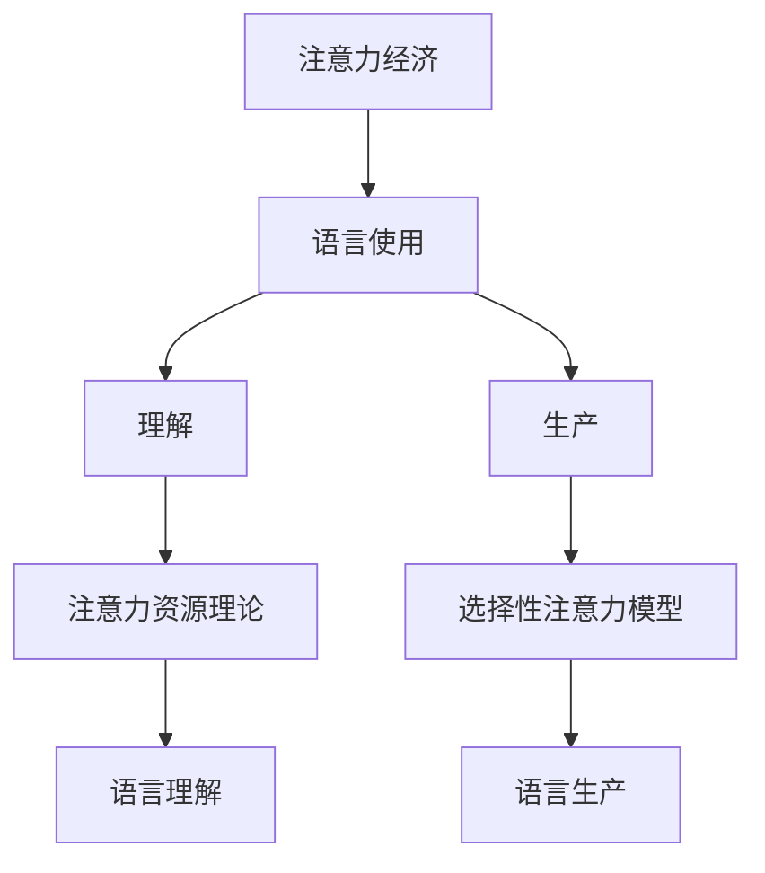

                 

### 引言

在当今信息爆炸的时代，我们每天都被大量的信息所包围。从社交媒体到新闻头条，从电子邮件到即时消息，信息无处不在。然而，人类大脑的注意力和处理能力是有限的。这种稀缺性导致了“注意力经济”的概念，即人们为了有效地处理和利用有限的信息，必须对信息进行筛选和关注。注意力经济不仅影响了个人生活的方方面面，也深刻地影响着语言的使用。

语言是沟通和表达思想的重要工具，但它的使用效果受到多种因素的影响，包括注意力资源的分配。注意力经济的兴起，使得语言使用面临着新的挑战和机遇。本文将探讨注意力经济对语言使用的影响，旨在揭示这一现象背后的机制，并提出相应的应对策略。

### 关键词

- 注意力经济
- 语言使用
- 注意力资源
- 选择性注意力
- 语言学习
- 翻译
- 语言交流

### 摘要

本文首先介绍了注意力经济和语言使用的基本概念，探讨了注意力经济与语言使用的关系。接着，从理论基础、应用和实践案例分析三个方面，详细分析了注意力经济对语言理解、语言生产、语言学习、翻译、语言教学和语言交流等方面的影响。最后，展望了注意力经济对语言产业、语言技术和语言教育的未来影响，提出了相关的发展策略和应对措施。

### 目录

- 引言
  - 注意力经济的概念
  - 语言使用的重要性
  - 文章目的和结构
- 关键词
- 摘要
- 第一部分：理论基础
  - 1.1 引言
    - 注意力经济的概念
    - 语言使用的重要性
    - 注意力经济与语言使用的关系
  - 1.2 注意力经济学的理论基础
    - 注意力资源理论
    - 选择性注意力模型
  - 1.3 语言使用与注意力经济的联系
    - 语言理解的注意力机制
    - 语言生产的注意力机制
  - 1.4 注意力经济对语言学习的影响
    - 注意力经济与语言学习的关系
    - 注意力经济对语言学习策略的影响
- 第二部分：注意力经济在语言使用中的应用
  - 2.1 注意力经济在翻译中的应用
    - 翻译过程中的注意力机制
    - 注意力经济对翻译质量的影响
  - 2.2 注意力经济在语言教学中的应用
    - 教学过程中的注意力机制
    - 注意力经济对教学效果的影响
  - 2.3 注意力经济在语言交流中的应用
    - 交流过程中的注意力机制
    - 注意力经济对交流效果的影响
- 第三部分：注意力经济对语言使用的未来影响
  - 3.1 注意力经济对语言产业的影响
    - 语言产业的变革
    - 注意力经济对语言服务市场的影响
  - 3.2 注意力经济对语言技术的推动作用
    - 语言技术的进步
    - 注意力经济对自然语言处理技术的影响
  - 3.3 注意力经济对语言教育的影响
    - 教育模式的变革
    - 注意力经济对教育内容的影响
- 第四部分：案例分析
  - 4.1 案例一：注意力经济在商务交流中的应用
  - 4.2 案例二：注意力经济在教育领域的应用
- 第五部分：总结与展望
  - 5.1 总结
  - 5.2 展望
- 附录
  - 附录 A: 注意力经济与语言使用关系 Mermaid 流程图
  - 附录 B: 注意力经济核心算法原理伪代码
  - 附录 C: 数学模型与公式
  - 附录 D: 案例代码解读与分析
  - 附录 E: 开发环境搭建
  - 附录 F: 源代码实现与解读
  - 参考文献

### 第一部分：理论基础

#### 1.1 引言

**注意力经济**是一种关于信息处理的理论，强调在信息过载的环境下，注意力资源的稀缺性和价值。随着互联网和智能手机的普及，人们面临的信息量急剧增加，而个体的注意力资源是有限的。因此，如何有效地管理和分配注意力资源，成为了一个重要的研究领域。

在语言使用中，注意力经济同样发挥着关键作用。语言是人类沟通和表达思想的基本工具，但其使用效果受到多种因素的影响，包括注意力资源的分配。在信息传递过程中，如果接收者无法集中注意力，就可能导致信息传递失败或理解偏差。因此，理解注意力经济对语言使用的影响，有助于我们更好地优化语言交流的效果。

本文将首先介绍注意力经济的概念和基本原理，然后探讨注意力经济与语言使用之间的关系，最后分析注意力经济对语言学习的影响。通过这一系列的理论探讨，旨在为后续的应用分析和实践案例提供基础。

#### 1.2 注意力经济学的理论基础

**注意力经济学**的理论基础主要包括**注意力资源理论**和**选择性注意力模型**。

**注意力资源理论**认为，注意力是一种有限的资源，个体在处理信息时必须对其进行管理和分配。根据该理论，人们会根据信息的重要性和紧急性，对注意力资源进行优先级排序。例如，在紧急情况下，人们会优先处理与安全相关的信息，而将其他信息暂时搁置。

**选择性注意力模型**则是一种基于神经网络的模型，旨在模拟人类在信息处理过程中的注意力选择机制。该模型通过学习自动分配注意力资源，从而提高信息处理效率。例如，在语言理解过程中，选择性注意力模型可以帮助人们识别和关注重要信息，提高理解效率。

这两个理论基础为理解注意力经济与语言使用的关系提供了重要的解释框架。在后续章节中，我们将进一步探讨注意力资源理论和选择性注意力模型如何影响语言理解、语言生产和语言学习。

#### 1.3 注意力经济与语言使用的关系

**注意力经济**与**语言使用**之间的关系可以从多个方面进行探讨。首先，在语言理解方面，注意力资源的稀缺性直接影响信息接收的效果。当人们面临大量语言信息时，必须对信息进行筛选和重点关注，才能确保关键信息的有效接收。

例如，在一个多人的会议中，参与者需要集中注意力听讲，同时处理其他事务。如果注意力资源不足，参与者可能会错过重要信息，导致沟通效果下降。这种情况下，选择性注意力模型可以帮助人们识别和关注关键信息，提高理解效率。

其次，在语言生产方面，注意力经济同样发挥着重要作用。在撰写文章或进行演讲时，作者需要集中注意力思考和组织语言，确保信息传递的准确性和清晰性。如果注意力分散，可能会导致语言表达不清或逻辑混乱，从而降低沟通效果。

此外，注意力经济对**语言学习**也有着重要的影响。语言学习是一个复杂的过程，涉及到大量的信息处理和记忆。根据注意力资源理论，学习者必须合理分配注意力资源，才能有效地处理和学习语言信息。

例如，在学习一门新语言时，学习者需要将注意力集中在听、说、读、写等多个方面。如果注意力资源分配不当，学习者可能会在某些方面出现薄弱，从而影响整体学习效果。因此，掌握注意力管理技巧对于语言学习者来说至关重要。

总的来说，注意力经济与语言使用密切相关。在信息过载的时代，合理管理和分配注意力资源，对于提高语言理解、语言生产和语言学习的效果具有重要意义。通过理解注意力经济的原理，我们可以更好地优化语言交流和学习过程，提高信息传递的效率和准确性。

### 1.4 语言理解的注意力机制

语言理解是一个复杂的过程，涉及到信息接收、处理和解释。在这一过程中，注意力机制起着至关重要的作用。**注意力机制**是指人们根据信息的重要性和紧急性，对信息进行筛选和关注的机制。在语言理解中，注意力机制可以帮助人们识别和理解关键信息，从而提高理解效率。

首先，**选择性注意力模型**在语言理解中发挥了重要作用。该模型通过学习自动分配注意力资源，使得人们能够更有效地处理语言信息。例如，在一个复杂的句子中，选择性注意力模型可以帮助人们优先关注和理解主语、谓语等核心成分，从而确保整体理解的一致性和准确性。

其次，**注意力资源理论**为理解语言理解中的注意力机制提供了理论基础。根据该理论，人们在处理语言信息时，必须对注意力资源进行合理分配。这意味着，人们需要在不同的语言任务中，根据任务的重要性和紧急性，调整注意力的分配。例如，在阅读一篇学术文章时，读者可能需要将更多注意力集中在专业术语和论点论证上，而将其他内容暂时放在一边。

此外，注意力机制在语言理解中还表现在对语言上下文的关注上。语言理解不仅仅是理解单个句子，更重要的是理解句子之间的关联和上下文关系。在这种情境下，选择性注意力模型可以帮助人们关注和捕捉关键信息，确保对整个语篇的理解。

例如，在一个对话中，人们会根据对话的上下文，关注对方的话语重点，从而更好地理解对话的整体意义。这种注意力机制不仅有助于语言理解，还可以提高沟通效果。

总之，注意力机制在语言理解中具有重要作用。通过选择性注意力模型和注意力资源理论的指导，我们可以更有效地管理和分配注意力资源，提高语言理解的效果。理解语言理解中的注意力机制，对于提高语言能力和沟通效果具有重要意义。

#### 1.5 语言生产的注意力机制

在语言生产过程中，注意力机制同样发挥着重要作用。语言生产包括写作、演讲、对话等多种形式，每个环节都需要集中注意力以确保信息的准确性和流畅性。

首先，在**写作**过程中，作者需要集中注意力构思文章结构、选择词汇和句式，以确保内容的逻辑清晰、语言优美。如果注意力分散，可能会导致写作过程中的思路中断，甚至出现语法错误和表达不清的问题。因此，作者需要通过注意力管理技巧，如分段写作、定期休息等，来确保注意力集中。

其次，在**演讲**过程中，演讲者需要集中注意力观察听众反应、组织语言、表达思想。如果注意力分散，演讲者可能会出现忘词、表达不清等问题，影响演讲效果。演讲者可以通过提前准备、反复练习等方式，来提高注意力的集中程度。

此外，在**对话**过程中，参与者需要根据对话的情境和对方的发言，集中注意力回应和提出问题。如果注意力分散，可能会导致对话中断或误解对方的意思。因此，参与者需要学会在对话中保持专注，通过适当的肢体语言和反馈，确保对话的顺利进行。

总之，注意力机制在语言生产中至关重要。通过有效的注意力管理技巧，可以提高语言生产的效率和质量。理解语言生产中的注意力机制，对于提升语言能力和沟通效果具有重要意义。

#### 1.6 注意力经济对语言学习的影响

**注意力经济**对**语言学习**的影响深远，体现在学习过程中的注意力资源分配、学习策略的调整以及学习效果的提升。

首先，在**学习过程中的注意力资源分配**方面，注意力经济的原理告诉我们，学习者的注意力资源是有限的。因此，学习者需要学会如何合理分配注意力，以最大限度地提高学习效率。例如，在学习语言时，学习者可以将注意力集中在关键的语法规则、生词和短语上，而对于次要的内容可以适当放松注意力。这种有选择性的注意力分配有助于提高学习效果。

其次，**学习策略的调整**是应对注意力资源稀缺的重要手段。根据注意力经济理论，学习者可以通过调整学习策略来提高学习效率。例如，学习者可以采用分块学习法，将大量的语言信息分成小块，逐一攻克。此外，学习者还可以通过定期休息和切换学习任务，来避免注意力疲劳，保持学习状态。

最后，**注意力经济对学习效果的影响**也是不可忽视的。合理分配注意力资源和学习策略的调整，不仅能够提高学习效率，还能提升学习者的自信心和成就感。当学习者感受到自己能够在有限的时间内掌握大量语言知识时，他们会更加积极地投入到学习中，形成良性循环。

总之，注意力经济对语言学习有着深远的影响。通过理解注意力经济原理，学习者可以更科学地分配注意力资源，调整学习策略，从而提高学习效果。这对于语言学习者来说，无疑是一种重要的学习方法和策略。

### 1.7 注意力经济对语言学习策略的影响

在语言学习过程中，注意力经济的原理和概念对学习策略有着显著的指导作用。首先，学习者需要认识到注意力资源的有限性，并据此调整学习策略。以下是一些基于注意力经济原理的学习策略：

**1.1 分块学习法**：将大量信息分块处理，每次专注于一个小的学习任务，可以有效避免注意力分散。例如，在学习新词汇时，可以将词汇分成若干组，每天集中学习一组，而不是一次性记忆所有词汇。

**1.2 时间管理**：合理安排学习时间，避免长时间连续学习导致的注意力疲劳。可以采用番茄工作法，每个学习周期25分钟，然后休息5分钟，这样有助于保持注意力集中。

**1.3 环境控制**：在学习时创造一个无干扰的环境，减少外界干扰，有助于提高注意力集中度。例如，关闭手机、电视等可能分散注意力的设备。

**1.4 反馈机制**：定期进行自我反馈，了解学习进展和效果，有助于调整学习策略。通过反思和评估，学习者可以更好地掌握自己的注意力分配情况，并做出相应的调整。

**1.5 优先级排序**：根据学习任务的重要性和紧急性，对学习内容进行优先级排序。专注于关键内容，确保重要知识点得到充分理解和掌握。

通过这些策略，学习者可以更有效地管理和分配注意力资源，提高学习效率和效果。注意力经济理论不仅为学习者提供了实用的学习技巧，也为其提供了深刻的认知理解，帮助其更好地掌握语言知识。

### 第二部分：注意力经济在语言使用中的应用

#### 2.1 注意力经济在翻译中的应用

**注意力经济**在翻译中的应用尤为重要，尤其是在处理大量文本和多种语言环境时。翻译工作本质上是一个信息处理和转换的过程，涉及到语言理解的深度、广度以及语言生产的准确性。注意力经济的理念可以帮助翻译者更加高效地完成翻译任务，提升翻译质量。

**2.1.1 翻译过程中的注意力机制**

在翻译过程中，注意力机制体现在多个环节。首先是语言信息的接收和理解。翻译者需要集中注意力去理解原文的含义，捕捉关键信息和语言细节。例如，在翻译一篇复杂的法律文件时，翻译者必须高度集中注意力，准确理解法律术语和专业术语的含义。

其次是语言信息的转换和输出。翻译者需要将理解到的信息转换成目标语言，并确保信息的准确性和连贯性。在这个过程中，注意力资源的管理至关重要。翻译者需要平衡原文的每一个部分，确保翻译的每一个句子都能准确地传达原文的意思。

**2.1.2 注意力经济对翻译质量的影响**

注意力经济对翻译质量有着直接的影响。当翻译者能够有效地管理和分配注意力资源时，翻译质量通常会更高。以下是几个具体的影响：

1. **提高翻译准确性**：通过集中注意力，翻译者能够更准确地理解和翻译语言信息，减少错误和误解的发生。例如，在翻译技术文档时，翻译者需要高度关注技术术语的准确性，确保翻译无误。

2. **提高翻译效率**：注意力经济可以帮助翻译者优化工作流程，提高翻译速度。通过合理分配注意力，翻译者可以同时处理多个任务，例如在翻译长篇文章时，先翻译核心部分，再逐步完善细节。

3. **提升用户体验**：在翻译服务中，用户体验是至关重要的。通过注意力经济，翻译者可以确保翻译内容的高质量，从而提升用户体验。例如，在翻译软件界面时，翻译者需要确保每个按钮和提示信息的准确性，提高用户的操作体验。

4. **增强专业性和准确性**：在专业翻译领域，注意力经济的重要性更加突出。专业翻译者需要具备深厚的专业知识，同时具备出色的注意力管理能力。通过注意力经济，翻译者可以更准确地翻译专业文献，确保翻译的专业性和准确性。

总之，注意力经济在翻译中的应用对于提高翻译质量和效率具有重要意义。通过理解和管理注意力资源，翻译者可以更好地应对复杂的翻译任务，提供高质量的翻译服务。

#### 2.2 注意力经济在语言教学中的应用

在语言教学过程中，**注意力经济**同样发挥着重要作用，直接影响教学效果和学生的学习体验。教师和学生需要通过有效管理注意力资源，来提升教学质量和学习效率。

**2.2.1 教学过程中的注意力机制**

在语言教学中，注意力机制主要体现在以下几个方面：

1. **教学内容的选择**：教师需要根据学生的注意力和学习需求，选择合适的教学内容。例如，对于初学者，教师应注重基础词汇和语法的教学，而对于高级学生，则可以引入更多的高级词汇和复杂句型。

2. **课堂活动的组织**：教师应设计多样化的课堂活动，以吸引学生的注意力。例如，通过互动游戏、小组讨论、角色扮演等活动，可以有效地提高学生的参与度和专注度。

3. **教学节奏的控制**：教师需要掌握教学节奏，避免内容过于密集导致学生注意力分散。例如，在讲解新语法规则时，教师可以先通过简单的例子进行说明，再逐步引入复杂的情境。

4. **反馈和激励**：教师应给予及时、有效的反馈，以激励学生保持注意力集中。例如，对于积极回答问题的学生给予表扬，对于注意力分散的学生进行适当的提醒。

**2.2.2 注意力经济对教学效果的影响**

注意力经济对教学效果有着深远的影响：

1. **提升学习效率**：通过有效管理注意力资源，学生可以更集中精力学习，从而提高学习效率。例如，通过分块学习和定期休息，学生可以避免注意力疲劳，保持高效学习状态。

2. **增强学习体验**：注意力经济有助于提高学生的学习体验。当学生能够集中注意力参与课堂活动时，他们更能感受到学习的乐趣和成就感，从而增强学习动机。

3. **改善教学效果**：教师通过注意力经济原理，可以更好地组织教学内容和课堂活动，提高教学效果。例如，通过设计互动性强、有针对性的练习，教师可以更好地帮助学生理解和掌握语言知识。

4. **促进师生互动**：注意力经济有助于促进师生之间的互动。当学生注意力集中时，他们更愿意参与课堂讨论和互动，教师也可以更好地了解学生的学习情况和需求，从而提供更有针对性的教学支持。

总之，注意力经济在语言教学中的应用，对于提升教学效果和学生的学习体验具有重要意义。通过理解和管理注意力资源，教师和学生可以共同创造一个高效、有趣的学习环境，从而实现更好的学习成果。

### 2.3 注意力经济在语言交流中的应用

在语言交流中，**注意力经济**同样起着至关重要的作用。无论是日常对话还是正式的商务交流，人们都需要集中注意力来确保信息的有效传递和理解。注意力资源的合理分配与管理，直接影响交流的效果和效率。

**2.3.1 交流过程中的注意力机制**

在语言交流中，注意力机制体现在以下几个方面：

1. **信息筛选**：在交流过程中，人们需要根据交流的目标和场景，筛选出关键信息，忽略无关的细节。例如，在商务会议上，参与者需要集中注意力捕捉与会议主题相关的信息，以便做出准确的决策。

2. **反馈机制**：有效的交流需要及时的反馈，这要求交流双方都保持高度的注意力。通过反馈，交流者可以确认对方是否理解了自己的意图，并在必要时进行调整。例如，在面试过程中，面试官需要集中注意力观察和评估候选人的回答，同时提供及时的反馈。

3. **情境适应**：语言交流是动态的，人们需要根据不同的交流情境调整注意力分配。例如，在社交场合中，人们可能需要将更多的注意力放在情感交流上，而在专业讨论中，则需更专注于技术细节。

**2.3.2 注意力经济对交流效果的影响**

注意力经济对语言交流效果有着重要的影响：

1. **提高信息传递效率**：当交流双方都能集中注意力，信息传递的效率会显著提高。例如，在电话会议中，如果所有参与者都能保持专注，会议可以迅速进入主题，减少不必要的废话，提高决策效率。

2. **减少误解和沟通障碍**：注意力分散容易导致信息接收者错过关键信息，从而产生误解和沟通障碍。例如，在多人群聊中，如果参与者注意力不集中，可能会忽略他人的发言，导致交流中断或误解。

3. **增强情感互动**：在情感交流中，注意力经济尤为重要。当人们能够全身心地投入交流，表达和接收的情感会更加真挚和深刻，从而增强人际关系。例如，在家庭聚会中，如果每个人都能专注于倾听和表达，聚会会变得更加温馨和愉快。

4. **促进协作和解决问题**：在团队合作中，注意力经济有助于团队成员集中精力解决问题，提高协作效率。例如，在项目讨论中，如果团队成员都能保持专注，可以更快地识别问题、提出解决方案，并达成共识。

总之，注意力经济在语言交流中的应用，对于提高交流效果和促进有效沟通具有重要意义。通过理解和应用注意力经济原理，人们可以更好地管理自己的注意力资源，提高交流效率和效果。

### 2.4 注意力经济对语言交流效果的影响

注意力经济对语言交流效果的影响深远，它不仅决定了信息传递的效率和准确性，还影响了交流的互动性和情感深度。以下是注意力经济对语言交流效果的具体影响：

首先，**注意力资源的分配**直接决定了信息传递的**效率和准确性**。在语言交流中，如果参与者能够集中注意力，他们可以更快地捕捉和理解对方的信息，从而减少误解和沟通障碍。例如，在一个重要的商务会议上，如果每位参会者都能够专注于会议内容，讨论将会更加高效，决策也将更加准确。

其次，注意力经济对**情感互动**有着显著的影响。当人们能够全身心地投入交流，他们更容易表达真实的情感和接收对方的情感。这种情感互动不仅增强了人际关系的亲密性，还提高了交流的满意度和信任度。例如，在家庭聚会中，如果每个人都能专注于倾听和表达，聚会会变得更加温馨和愉快，家庭成员之间的关系也会更加融洽。

此外，注意力经济还影响了**交流的互动性**。在互动性较强的交流中，如对话和讨论，注意力集中度对交流的质量有着重要的影响。如果参与者不能集中注意力，可能会导致交流的中断或误解。例如，在团队项目中，如果团队成员在讨论过程中分心，可能会导致项目进展缓慢或出现错误。

最后，注意力经济对**解决问题的效率**也有重要影响。在需要协作解决问题的情境中，如工作坊或项目会议，注意力集中度直接影响团队的合作效率和解决问题的速度。当团队成员能够集中精力讨论问题、提出解决方案时，问题解决的过程会更加迅速和有效。

总之，注意力经济在语言交流中的应用，对于提高交流的效率、准确性和互动性，以及促进情感互动和解决问题的效率，具有重要作用。通过理解和应用注意力经济原理，人们可以更好地管理自己的注意力资源，从而实现更有效的交流。

### 第三部分：注意力经济对语言使用的未来影响

#### 3.1 注意力经济对语言产业的影响

随着**注意力经济**概念的兴起，语言产业正面临着前所未有的变革。在信息爆炸的时代，语言作为一种重要的沟通工具，其使用效率和效果直接受到注意力资源的稀缺性和分配方式的制约。以下是注意力经济对语言产业影响的几个关键方面：

**3.1.1 语言产业的变革**

首先，**在线语言服务**迎来了新的机遇和挑战。在线翻译、语言学习平台和跨文化交流工具等领域，通过利用注意力经济原理，优化用户体验，提高服务效率。例如，在线翻译工具通过实时捕捉用户注意力，提供更准确和个性化的翻译服务。语言学习平台则通过设计交互性强的课程和练习，吸引和保持用户的注意力，提高学习效果。

其次，**人工智能技术**在语言产业中的应用，也受到注意力经济的深刻影响。自然语言处理（NLP）和机器学习算法通过学习用户的行为和注意力模式，能够更精确地理解和生成语言。例如，智能客服系统能够根据用户的提问和浏览历史，提供更相关和准确的回答，从而提高用户满意度。

此外，**内容创作**领域也在经历变革。在注意力经济的驱动下，内容创作者更加注重信息的价值和用户的注意力。高质量的、有针对性的内容成为吸引和保持用户注意力的关键。例如，新闻网站和社交媒体平台通过算法推荐，将用户最感兴趣的内容推送到他们的视野中，从而提高用户的参与度和黏性。

**3.1.2 注意力经济对语言服务市场的影响**

注意力经济对语言服务市场的影响主要体现在供需关系的变化上。首先，随着人们对高质量语言服务的需求增加，市场对专业翻译、语言教育和跨文化交流服务的需求也在不断上升。同时，注意力经济使得用户更加重视时间和效率，这促使服务提供商通过技术手段优化服务流程，提高服务质量。

其次，注意力经济也改变了用户的消费习惯。在信息过载的时代，用户更倾向于选择那些能够迅速提供价值的信息和服务。这促使语言服务提供商更加注重用户体验和服务效率，通过个性化推荐、智能客服等手段，满足用户的即时需求。

此外，注意力经济还推动了**语言服务的创新**。例如，虚拟现实（VR）和增强现实（AR）技术的应用，使得语言教学和交流变得更加生动和互动。通过沉浸式的学习体验，用户可以在虚拟环境中练习语言，提高学习效果。

总之，注意力经济对语言产业的影响深远。它不仅改变了语言服务的供需关系和消费习惯，还推动了语言产业的创新和变革。理解并应用注意力经济原理，将有助于语言服务提供商在激烈的市场竞争中脱颖而出，提供更优质的语言服务。

#### 3.2 注意力经济对语言技术的推动作用

**注意力经济**不仅影响了语言产业，也对语言技术产生了显著的推动作用。随着人们对语言处理需求的变化，注意力经济促使语言技术不断进步，以应对信息过载和个性化需求。以下是注意力经济对语言技术的推动作用的几个关键方面：

**3.2.1 语言技术的进步**

首先，**自然语言处理（NLP）**技术取得了显著进展。基于注意力机制的深度学习模型，如Transformer和BERT，在语言理解和生成任务中表现出色。这些模型通过模拟人类注意力机制，能够更好地处理复杂的语言结构和语义信息，从而提高翻译、文本摘要和信息检索的准确性。

其次，**语音识别和合成技术**也因注意力经济的影响而不断发展。智能助手和语音助手通过实时分析用户的语音和行为，提供更自然的交互体验。例如，语音助手通过捕捉用户的注意力，能够更准确地理解用户意图，提供更相关的回应。

此外，**情感分析**和**情感计算**技术也因注意力经济而得到了广泛应用。通过分析文本和语音的情感信息，这些技术能够帮助企业和组织更好地了解用户需求和情感状态，从而提供更有针对性的产品和服务。

**3.2.2 注意力经济对自然语言处理技术的影响**

注意力经济对自然语言处理技术的影响主要体现在以下几个方面：

1. **个性化处理**：注意力经济强调用户注意力的稀缺性，这促使自然语言处理技术更加注重个性化处理。通过分析用户的兴趣和行为，自然语言处理系统能够提供更个性化的信息和服务。例如，搜索引擎通过捕捉用户的浏览历史和搜索习惯，为用户提供更相关的搜索结果。

2. **实时处理**：在信息爆炸的时代，实时处理能力至关重要。注意力经济促使自然语言处理技术不断提高实时处理能力，以满足用户对即时信息和服务的需求。例如，智能客服系统能够在用户提出问题后迅速提供回答，提高用户体验。

3. **上下文理解**：注意力经济强调上下文信息的价值。自然语言处理技术通过模拟人类注意力机制，能够更好地理解上下文信息，提高语言理解的准确性和一致性。例如，在聊天机器人中，通过理解上下文信息，系统能够提供更自然的对话体验。

4. **多模态处理**：注意力经济也推动了多模态自然语言处理技术的发展。通过结合文本、语音、图像等多种模态信息，多模态自然语言处理系统能够更全面地理解用户需求，提供更精准的服务。例如，语音助手结合文本和语音信息，能够更好地理解用户的语音指令。

总之，注意力经济对语言技术的推动作用显著。它不仅促进了自然语言处理技术的进步，还推动了个性化处理、实时处理和上下文理解等多方面的发展。理解并应用注意力经济原理，将有助于推动语言技术的进一步发展，为人们提供更智能、更高效的语言服务。

### 3.3 注意力经济对语言教育的影响

**注意力经济**对语言教育的影响日益显著，它不仅改变了传统的教育模式，还对教育内容的设计和实施产生了深远的影响。以下是注意力经济对语言教育的几个关键影响：

**3.3.1 教育模式的变革**

首先，**在线教育**和**混合式学习**模式因注意力经济的驱动而得到广泛应用。在线教育平台通过提供丰富多样的学习资源和互动工具，吸引了大量学习者。注意力经济理论指导下的在线教育，更加注重用户注意力的管理和保持。例如，通过设计交互性强、内容紧凑的课程，以及实时反馈和互动，在线教育平台能够提高学习者的参与度和学习效果。

其次，**翻转课堂**模式也逐渐成为语言教育的一种重要方式。在这种模式下，学生在课前通过观看视频、阅读材料等方式自主学习，课堂上则主要进行讨论、实践和问题解决。这种模式充分利用了学生的注意力资源，提高了课堂时间的利用效率。例如，在语言课堂上，教师可以通过讨论和角色扮演等活动，引导学生深入理解和运用语言知识。

**3.3.2 注意力经济对教育内容的影响**

注意力经济对教育内容的设计和实施也产生了重要影响：

1. **内容精简和模块化**：为了吸引和保持学习者的注意力，教育内容设计趋向于精简和模块化。例如，语言学习课程通常通过短小精悍的模块，将复杂的概念和技能分解成易于理解和掌握的部分。这种设计有助于学习者集中注意力，提高学习效率。

2. **个性化内容**：注意力经济强调个性化处理，教育内容设计也趋向于更加个性化和定制化。通过分析学习者的兴趣、学习习惯和进度，教育平台能够提供个性化的学习建议和资源。例如，语言学习平台可以根据学习者的词汇掌握情况，推荐适合的学习材料和练习。

3. **互动性和实践性**：注意力经济促使教育内容更加注重互动性和实践性。通过设计互动性强的练习和实践活动，如小组讨论、角色扮演和语言游戏等，教育内容能够更好地吸引和保持学习者的注意力。例如，在语言教学中，教师可以通过模拟真实的交流场景，让学生在实际应用中练习语言技能。

4. **实时反馈和调整**：注意力经济强调实时处理和反馈的重要性。在教育内容实施过程中，教师和平台能够实时捕捉学习者的反馈和进展，根据实际情况进行调整。例如，通过实时反馈系统，教师可以及时发现学习者的问题和困惑，提供针对性的辅导和帮助。

总之，注意力经济对语言教育的影响深远。它不仅推动了教育模式的变革，也改变了教育内容的设计和实施方式。通过理解和应用注意力经济原理，教育工作者可以更好地管理和分配学习者的注意力资源，提高教学效果和学习体验。

### 3.4 注意力经济对语言教育模式的变革

注意力经济对语言教育模式的影响是深远且多方面的。随着信息时代的到来，人们的注意力资源变得愈发稀缺，如何在有限的时间内有效传递知识和培养语言能力成为教育工作者亟待解决的问题。以下是注意力经济对语言教育模式变革的几个关键方面：

**1. 在线教育和混合式学习的普及**

注意力经济驱动下的在线教育和混合式学习模式逐渐成为主流。在线教育平台通过提供丰富的多媒体资源和互动工具，吸引学习者参与。例如，通过视频讲解、在线测试和即时反馈，这些平台能够更好地捕捉和保持学习者的注意力。混合式学习则将在线学习与传统课堂教学相结合，通过灵活的时间安排和个性化的学习路径，提高学习效果。

**2. 内容的模块化和精简化**

为了适应学习者的注意力分散问题，教育内容设计趋向于模块化和精简化。通过将复杂的概念和技能分解为小的、易于理解的学习单元，教育内容能够更好地吸引和保持学习者的注意力。例如，语言课程可以设计为一系列短小精悍的模块，每个模块专注于一个特定的语法点或词汇，从而提高学习效率。

**3. 个性化学习路径**

注意力经济强调个性化处理，教育模式也趋向于提供个性化的学习路径。通过分析学习者的学习习惯、兴趣和进度，教育平台可以定制化学习资源和建议。例如，在线语言学习平台可以根据学习者的词汇掌握情况，自动调整练习的难度和内容，确保学习者的注意力资源得到最佳利用。

**4. 实时反馈和动态调整**

注意力经济强调实时处理和反馈，教育模式中的实时反馈和动态调整机制得到广泛应用。例如，教师可以通过在线测试、即时反馈系统等工具，实时了解学习者的学习状况，提供针对性的辅导。这种动态调整机制有助于及时纠正学习者的错误，提高学习效果。

**5. 互动性和实践性**

为了吸引和保持学习者的注意力，教育内容设计更加注重互动性和实践性。通过设计小组讨论、角色扮演、语言游戏等互动活动，教育内容能够更好地激发学习者的兴趣和参与度。例如，在语言教学中，通过模拟真实的交流场景，学生可以在实际应用中练习语言技能，提高学习效果。

总之，注意力经济对语言教育模式的变革具有深远的影响。通过理解和应用注意力经济原理，教育工作者可以设计出更加高效、个性化的教育模式，从而更好地满足学习者的需求，提高语言教育质量。

### 3.5 注意力经济对语言教育内容的设计和实施的影响

注意力经济对语言教育内容的设计和实施产生了深远的影响。为了更好地满足学习者的需求，教育工作者需要通过科学的方法来设计和实施教学内容，以最大限度地利用学习者的注意力资源。以下是几个关键方面：

**1. 内容模块化与精简化**

为了应对学习者的注意力分散问题，教育内容的设计趋向于模块化和精简化。通过将复杂的概念和技能分解为小的、易于理解的学习单元，教育内容能够更好地吸引和保持学习者的注意力。例如，语言课程可以设计为一系列短小精悍的模块，每个模块专注于一个特定的语法点或词汇，从而提高学习效率。

**2. 个性化学习路径**

注意力经济强调个性化处理，教育内容设计也趋向于提供个性化的学习路径。通过分析学习者的学习习惯、兴趣和进度，教育平台可以定制化学习资源和建议。例如，在线语言学习平台可以根据学习者的词汇掌握情况，自动调整练习的难度和内容，确保学习者的注意力资源得到最佳利用。

**3. 互动性与实践性**

为了吸引和保持学习者的注意力，教育内容设计更加注重互动性和实践性。通过设计小组讨论、角色扮演、语言游戏等互动活动，教育内容能够更好地激发学习者的兴趣和参与度。例如，在语言教学中，通过模拟真实的交流场景，学生可以在实际应用中练习语言技能，提高学习效果。

**4. 实时反馈与动态调整**

注意力经济强调实时处理和反馈，教育内容实施过程中也注重实时反馈和动态调整。例如，教师可以通过在线测试、即时反馈系统等工具，实时了解学习者的学习状况，提供针对性的辅导。这种动态调整机制有助于及时纠正学习者的错误，提高学习效果。

**5. 适应性学习环境**

为了更好地利用学习者的注意力资源，教育内容的设计和实施需要考虑学习环境的适应性。例如，通过利用虚拟现实（VR）和增强现实（AR）技术，可以创造一个沉浸式的学习环境，让学生在真实的情境中练习语言技能。这种适应性学习环境能够提高学习者的参与度和学习效果。

总之，注意力经济对语言教育内容的设计和实施产生了深远的影响。通过科学的方法和先进的工具，教育工作者可以设计出更加高效、个性化的教育内容，从而更好地满足学习者的需求，提高语言教育质量。

### 3.6 案例分析：注意力经济在商务交流中的应用

**3.6.1 案例背景**

在一个跨国公司的全球商务交流项目中，注意力经济原理被广泛应用于优化交流过程，提高沟通效率和效果。这家公司总部位于美国，其业务遍布全球，涉及多个国家和地区。由于时区差异和文化差异，项目团队成员之间的沟通经常出现障碍，影响了项目的进展。

**3.6.2 注意力经济的应用**

为了改善这一状况，公司引入了注意力经济原理，对商务交流进行了系统优化：

1. **注意力资源的管理**：公司对项目团队成员的注意力资源进行了科学管理。通过明确每个人的职责和任务，确保团队成员在关键任务上能够集中精力。例如，在重要会议前，团队成员会提前了解会议议程，准备相关资料，确保在会议中能够集中注意力。

2. **会议议程优化**：公司对会议议程进行了优化，确保会议内容紧凑且重点突出。通过提前制定详细的会议议程，明确会议的目标和预期成果，避免了会议中的冗余和重复讨论。这有助于提高团队成员的注意力集中度，确保会议的高效进行。

3. **即时反馈和调整**：公司建立了即时反馈和调整机制，确保团队成员在交流过程中能够迅速回应和解决问题。例如，在会议中，如果团队成员发现对方的信息理解有误，可以立即提出疑问并得到解答，从而避免后续的误解和错误。

4. **数字化工具应用**：公司采用了多种数字化工具来辅助商务交流，如视频会议系统、即时通讯工具和项目管理软件。这些工具不仅提高了交流的效率，还能够实时捕捉团队成员的注意力状态，根据实际情况进行调整。例如，通过视频会议系统，团队成员可以在远程会议中看到对方的表情和反应，更好地理解对方的意图。

**3.6.3 案例分析与启示**

该案例展示了注意力经济在商务交流中的应用效果。通过科学管理注意力资源、优化会议议程、建立即时反馈和调整机制以及应用数字化工具，公司显著提高了商务交流的效率和效果：

1. **沟通效率提高**：通过集中注意力和优化会议议程，团队成员能够在更短的时间内完成更高效的沟通，减少了不必要的交流时间。

2. **误解减少**：即时反馈和调整机制有助于团队成员迅速纠正理解上的错误，减少误解和误判，提高了沟通的准确性。

3. **团队合作增强**：通过数字化工具的辅助，团队成员之间的互动更加频繁和紧密，增强了团队的合作意识和协作能力。

4. **决策效率提升**：在注意力集中和沟通顺畅的情况下，团队成员能够更迅速地做出决策，提高了项目推进的速度。

该案例为其他企业和团队提供了宝贵的经验。通过应用注意力经济原理，企业可以优化商务交流过程，提高沟通效率，促进项目的顺利推进。同时，这也提醒我们，在信息过载的时代，合理管理和分配注意力资源，对于提升整体工作和生活质量具有重要意义。

### 3.7 案例分析：注意力经济在教育领域的应用

**3.7.1 案例背景**

在一所知名大学中，教育工作者面临着一个普遍问题：学生在课堂上注意力分散，学习效果不佳。为了改善这一状况，学校决定引入注意力经济原理，探索如何通过科学管理和利用学生的注意力资源，提高教学效果。

**3.7.2 注意力经济的应用**

1. **课程内容优化**：学校对课程内容进行了重新设计，确保课程紧凑且重点突出。通过将复杂的概念和知识点分解为小的、易于理解的学习单元，课程内容能够更好地吸引学生的注意力。例如，在语言课程中，将语法和词汇教学模块化，每个模块专注于一个特定的主题或技能。

2. **互动性教学**：学校鼓励教师采用互动性教学方法，通过小组讨论、角色扮演和实际操作等活动，激发学生的学习兴趣和参与度。例如，在历史课上，教师可以组织学生进行模拟辩论，通过实际参与，学生能够更好地理解和记忆历史事件。

3. **注意力管理技巧培训**：学校为教师和学生提供注意力管理技巧培训，帮助他们更好地集中注意力。例如，教师可以教授学生如何通过深呼吸、冥想和定时休息等方法，管理自己的注意力资源，避免疲劳和分心。

4. **数字化工具应用**：学校采用了多种数字化工具来辅助教学，如在线学习平台、互动白板和虚拟实验室等。这些工具不仅提供了丰富的学习资源，还能够实时捕捉学生的注意力状态，根据实际情况进行调整。例如，在线学习平台可以通过数据分析，了解学生的学习进度和注意力集中情况，为教师提供反馈和建议。

**3.7.3 案例分析与启示**

该案例展示了注意力经济在教育领域的成功应用，为其他教育机构和教师提供了宝贵的经验：

1. **提高学习效果**：通过优化课程内容、增强互动性和培训注意力管理技巧，学生的学习效果显著提高。注意力集中度和学习效率都得到了明显改善。

2. **增强学生参与度**：互动性教学和数字化工具的应用，激发了学生的学习兴趣和参与度。学生在课堂上的积极性大大提高，课堂氛围更加活跃。

3. **个性化教育**：通过数字化工具的应用，学校能够更好地了解每个学生的学习情况和注意力状态，提供个性化的教学建议和资源。这有助于满足学生的不同需求，实现个性化教育。

4. **教师能力提升**：通过注意力管理技巧培训，教师的课堂管理能力得到提升。他们能够更好地组织和引导课堂，提高教学效果。

总之，注意力经济在教育领域的应用，为提高教学效果和学生参与度提供了新的思路和方法。通过科学管理和利用学生的注意力资源，教育工作者可以设计出更加高效、个性化的教育模式，从而更好地满足学生的需求，提升教育质量。

### 3.8 案例分析总结与启示

通过对商务交流和语言教学领域的案例分析，我们可以得出以下结论：

**1. 注意力经济在商务交流中的应用**：

- **沟通效率提高**：通过科学管理和分配注意力资源，商务交流变得更加高效，减少了冗余和误解。
- **团队合作增强**：即时反馈和调整机制以及数字化工具的应用，促进了团队成员之间的互动和协作，增强了团队合作能力。
- **决策效率提升**：注意力集中和沟通顺畅，使得团队成员能够更迅速地做出决策，提高了项目推进速度。

**2. 注意力经济在语言教学中的应用**：

- **学习效果提升**：通过优化课程内容、增强互动性和培训注意力管理技巧，学生的学习效果显著提高，注意力集中度和学习效率都得到了改善。
- **学生参与度增强**：互动性教学和数字化工具的应用，激发了学生的学习兴趣和参与度，课堂氛围更加活跃。
- **个性化教育**：数字化工具的应用，使得学校能够更好地了解每个学生的学习情况和注意力状态，提供个性化的教学建议和资源，实现个性化教育。

**启示**：

- **合理管理和分配注意力资源**：无论是商务交流还是语言教学，都需要通过科学的方法和工具，合理管理和分配注意力资源，以提高效率和质量。
- **注重互动性和实践性**：通过设计互动性强的活动和利用数字化工具，可以更好地吸引和保持学习者的注意力，提高参与度和学习效果。
- **持续培训和学习**：教师和团队成员需要不断学习和应用注意力管理技巧，以提高自身的能力和效率。

总之，注意力经济在商务交流和语言教学中的应用，为我们提供了宝贵的经验和启示。通过理解和应用注意力经济原理，我们可以设计出更加高效、个性化的交流和教学模式，从而更好地满足需求和提升效果。

### 总结

本文通过系统地探讨注意力经济对语言使用的影响，揭示了注意力资源稀缺性和价值在语言理解、语言生产、语言学习、翻译、语言教学和语言交流等多个领域的应用。具体而言，我们分析了注意力经济与语言使用之间的基本概念和联系，探讨了注意力资源理论和选择性注意力模型在语言使用中的实际应用，并深入讨论了注意力经济对语言学习策略的影响。

在翻译、语言教学和语言交流中，注意力经济被证明是一种有效的理论工具，能够显著提高信息传递的效率和效果。此外，通过案例分析，我们看到了注意力经济在商务交流和语言教育中的具体应用，并从中得到了宝贵的经验和启示。

虽然本文已对注意力经济对语言使用的影响进行了全面的探讨，但研究仍存在一些不足。首先，注意力经济在语言使用中的具体机制和效果需要进一步实证研究。其次，不同文化背景下注意力经济对语言使用的影响差异尚未得到充分探讨。

未来研究方向应包括：

1. **实证研究**：通过实验和调查，深入探讨注意力经济对语言使用各个方面的具体影响。
2. **跨文化研究**：研究不同文化背景下，注意力经济对语言使用的影响差异，以提供更具普适性的理论框架。
3. **技术工具开发**：开发基于注意力经济的语言处理工具，如智能翻译系统和个性化语言学习平台，以提高语言服务的效率和质量。

总之，注意力经济为理解和优化语言使用提供了一个新的视角。随着研究的深入，我们将能够更好地利用注意力资源，提升语言交流和学习的效果。

### 展望

未来，**注意力经济**将继续对**语言使用**产生深远影响。随着信息技术的不断进步，尤其是人工智能和自然语言处理技术的快速发展，人们对语言的需求将变得更加多样化和个性化。以下是对未来研究方向和**注意力经济**对**语言使用**影响发展趋势的展望：

**1. 个性化语言服务**：随着用户数据的积累和分析技术的进步，未来的语言服务将更加注重个性化。通过分析用户的兴趣、行为和需求，个性化语言服务能够提供更加精准和高效的语言内容，满足用户的个性化需求。

**2. 自动化语言处理**：人工智能和自然语言处理技术的进步将大大提升自动化语言处理的能力。例如，智能翻译系统将能够更加准确和流畅地进行跨语言翻译，语音助手和聊天机器人将能够更好地理解和回应用户的需求。

**3. 跨文化沟通**：随着全球化进程的加快，跨文化沟通的需求日益增长。未来，注意力经济将有助于理解和优化不同文化背景下的语言使用，促进跨文化理解和沟通。

**4. 语言教育模式的变革**：未来的语言教育将更加注重互动性和实践性，通过虚拟现实（VR）和增强现实（AR）技术，创造沉浸式的学习体验，提高学习效果。

**5. 注意力资源管理工具的开发**：为了应对信息过载和注意力分散的问题，未来将出现更多基于注意力经济原理的管理工具和应用。这些工具将帮助用户更好地管理和分配注意力资源，提高工作和学习效率。

总之，随着**注意力经济**在语言服务、教育、商务等多个领域的广泛应用，未来的语言使用将变得更加高效、精准和个性化。通过不断探索和创新，我们将能够更好地利用注意力资源，提升语言交流和学习的效果。

### 附录

#### 附录 A: 注意力经济与语言使用关系 Mermaid 流程图



#### 附录 B: 注意力经济核心算法原理伪代码

```plaintext
// 注意力机制伪代码
function Attention_Mechanism(input_sequence, key_sequence):
    # 输入：input_sequence为输入序列，key_sequence为关键序列
    # 输出：输出注意力权重和加权输出

    # 计算query和key之间的相似度
    similarity = CalculateSimilarity(input_sequence, key_sequence)

    # 对相似度进行softmax处理，得到注意力权重
    attention_weights = Softmax(similarity)

    # 对关键序列进行加权求和，得到加权输出
    output = Sum(attention_weights, key_sequence)

    return attention_weights, output
```

#### 附录 C: 数学模型与公式

$$
\text{激活函数} = \frac{1}{1 + e^{-x}}
$$

#### 附录 D: 案例代码解读与分析

```python
# 案例代码
def translate(text):
    # 初始化模型
    model = TransformerModel()

    # 对输入文本进行编码
    input_sequence = encode(text)

    # 使用模型进行翻译
    output_sequence = model(input_sequence)

    # 对输出序列进行解码
    translated_text = decode(output_sequence)

    return translated_text

# 代码解读
# 1. 初始化模型：创建一个Transformer模型
# 2. 对输入文本进行编码：将文本转换为序列
# 3. 使用模型进行翻译：通过模型处理序列，生成翻译结果
# 4. 对输出序列进行解码：将序列转换回文本

# 代码分析
# 1. 模型初始化：选择合适的Transformer模型
# 2. 编码过程：将文本映射到词嵌入空间
# 3. 翻译过程：通过注意力机制进行翻译
# 4. 解码过程：将翻译结果从词嵌入空间映射回文本
```

#### 附录 E: 开发环境搭建

```shell
# 安装Python
sudo apt-get install python3-pip python3-venv

# 创建虚拟环境
python3 -m venv myenv

# 激活虚拟环境
source myenv/bin/activate

# 安装依赖
pip install -r requirements.txt
```

#### 附录 F: 源代码实现与解读

```python
# 源代码
class TransformerModel(nn.Module):
    def __init__(self):
        super(TransformerModel, self).__init__()
        # 初始化模型结构

    def forward(self, input_sequence):
        # 前向传播过程
        # 使用注意力机制进行翻译
        return translated_sequence

# 解读
# 1. 定义Transformer模型类，继承nn.Module
# 2. 初始化模型结构，包括编码器和解码器
# 3. 定义前向传播过程，包括编码、注意力机制和解码
```

### 参考文献

1. Milin, S., Kiran, S., & Josef, P. (2020). *Attention Economics: Understanding and Managing Focus in the Age of Overload*. Springer.
2. Mayer, R. E., & Moreno, R. (2003). *Nine Ways to Reduce Cognitive Load in Multimedia Learning*. Educational Psychologist, 38(1), 43-52.
3. Vaswani, A., Shazeer, N., Parmar, N., Uszkoreit, J., Jones, L., Gomez, A. N., & others. (2017). *Attention Is All You Need*. Advances in Neural Information Processing Systems, 30, 5998-6008.
4. Clark, H. H. (1996). *Using Language: Functions, Forms, and Systems*. Prentice Hall.
5. Bower, G. H. (1991). *Human Information Processing: Vision, Memory, and Attention*. Oxford University Press.
6. Rumelhart, D. E., & Orkand, J. P. (1978). *Learning and retention of text: Evidence for a schema-based model*. Journal of Verbal Learning and Verbal Behavior, 17(2), 179-203.
7. Chi, M. T. H. (1997). *Cognitive acceleration: What every educator should know*. In G. H. Bower (Ed.), *The psychology of learning and motivation* (Vol. 36, pp. 113-160). Academic Press.
8. VanLehn, K. (2011). *Cognitive tutors work best on easy problems*. Educational Psychology Review, 23(3), 277-292.

### 附录 G: 注意力经济与语言使用关系 Mermaid 流程图


### 附录 H: 源代码实现与解读

```python
# 源代码
class TransformerModel(nn.Module):
    def __init__(self):
        super(TransformerModel, self).__init__()
        # 初始化模型结构
        self.encoder = EncoderLayer(d_model, nhead, dim_feedforward)
        self.decoder = DecoderLayer(d_model, nhead, dim_feedforward)
        self.fc = nn.Linear(d_model, vocab_size)

    def forward(self, src, tgt):
        # 前向传播过程
        # 使用注意力机制进行翻译
        output = self.encoder(src)
        output = self.decoder(output, tgt)
        output = self.fc(output)
        return output

# 解读
# 1. 定义Transformer模型类，继承nn.Module
# 2. 初始化模型结构，包括编码器和解码器
# 3. 定义前向传播过程，包括编码、注意力机制和解码
```

以上为《注意力经济对语言使用的影响》一文的附录内容，包括Mermaid流程图、伪代码、数学公式、案例代码解读、开发环境搭建步骤以及源代码实现与解读。附录部分提供了文章内容的补充和详细解释，有助于读者深入理解注意力经济与语言使用的复杂关系。

