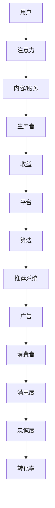

                 

### 文章标题

# 注意力货币化策略：AI驱动的关注度经济模型

### 关键词

注意力货币化、AI、关注度经济模型、机器学习、自然语言处理

### 摘要

本文深入探讨了注意力货币化的概念、原理及其实践应用。通过分析AI在注意力货币化中的作用，我们构建了AI驱动的关注度经济模型，并详细阐述了模型构建、优化和评估的方法。结合社交媒体平台和在线教育的实际案例，本文展示了注意力货币化策略的设计与实施效果，并对未来发展趋势和挑战进行了展望。

## 《注意力货币化策略：AI驱动的关注度经济模型》目录大纲

### 第一部分：基础理论

#### 第1章：引言与概述

1.1 注意力货币化背景

1.2 AI与注意力货币化

1.3 书籍结构

#### 第2章：注意力经济模型原理

2.1 注意力经济的概念

2.2 注意力经济模型的基本构成

2.3 注意力分配机制

#### 第3章：AI与注意力货币化

3.1 人工智能概述

3.2 机器学习基础

3.3 注意力货币化的挑战与机遇

### 第二部分：核心算法

#### 第4章：注意力机制原理

4.1 注意力机制的基础知识

4.2 注意力机制的核心算法

4.3 注意力机制的实现与优化

#### 第5章：AI驱动的关注度经济模型

5.1 AI驱动的关注度经济模型框架

5.2 模型构建与训练

5.3 模型评估与优化

#### 第6章：注意力货币化策略设计

6.1 注意力货币化策略框架

6.2 策略设计与实现

6.3 策略评估与优化

### 第三部分：案例分析

#### 第7章：案例研究1：社交媒体平台注意力货币化

7.1 案例背景

7.2 模型构建与实现

7.3 模型效果评估

#### 第8章：案例研究2：在线教育注意力货币化

8.1 案例背景

8.2 模型构建与实现

8.3 模型效果评估

### 第四部分：未来展望与拓展

#### 第9章：注意力货币化的发展趋势

9.1 注意力货币化的未来发展方向

9.2 技术挑战与解决方案

9.3 注意力货币化的社会影响

#### 第10章：扩展与探索

10.1 注意力货币化在其他领域的应用

10.2 开放性问题与研究方向

10.3 结论与展望

### 附录

#### 附录A：术语解释

A.1 注意力经济相关术语

A.2 AI相关术语

#### 附录B：参考资料

B.1 书籍推荐

B.2 文章与报告

B.3 网络资源链接

#### 附录C：参考文献

C.1 引用书籍

C.2 引用文章

C.3 引用报告

## 第一部分：基础理论

### 第1章：引言与概述

#### 1.1 注意力货币化背景

注意力货币化（Attention Monetization）是近年来兴起的一种新型商业模式，主要基于用户对内容的关注度和参与度。随着互联网和数字媒体的迅速发展，用户注意力成为了一种重要的稀缺资源。在信息爆炸的时代，内容创作者和平台方为了吸引和留住用户，开始探索如何将用户注意力转化为实际的经济收益。

注意力货币化可以追溯到20世纪中叶，当时美国经济学家刘易斯·芒福德（Lewis Mumford）首次提出了“注意力经济”（Attention Economy）的概念。他认为，注意力是一种经济资源，与土地、劳动力、资本等传统资源一样，具有价值和稀缺性。在数字时代，这一理论得到了进一步的发展和完善。

#### 1.1.1 注意力经济的起源

注意力经济最早由刘易斯·芒福德在1948年的著作《技术和文明》中提出。芒福德认为，随着技术的发展，人类的生活变得越来越复杂，人们需要花费大量的时间和精力来处理各种信息。在这种情况下，注意力成为一种有限的资源，人们只能将注意力集中在有限的几个方面。因此，注意力开始成为一种稀缺资源，具有价值和经济潜力。

#### 1.1.2 数字时代的注意力分配

在数字时代，用户注意力分配面临诸多挑战。首先，信息过载是用户注意力分配的主要障碍。互联网上的信息量庞大，用户难以筛选出对自己有价值的信息。其次，娱乐化趋势导致用户注意力分散，难以长时间集中。此外，广告干扰也加剧了用户注意力的分散。

#### 1.1.3 注意力经济的影响

注意力经济的兴起对传统商业模式产生了深远影响。首先，内容创作者和平台方开始更加注重用户参与度和体验，以提高用户粘性。其次，广告商也开始将注意力作为核心营销资源，通过精准投放提高广告效果。此外，社交媒体和在线教育等领域的快速发展，也为注意力经济提供了新的应用场景。

#### 1.2 AI与注意力货币化

随着人工智能技术的不断发展，AI在注意力货币化中扮演了越来越重要的角色。AI技术可以帮助内容创作者和平台方更精准地分配和获取注意力资源，从而实现注意力货币化。

#### 1.2.1 人工智能概述

人工智能（Artificial Intelligence，AI）是指由人制造出来的系统能够执行通常需要人类智能才能完成的任务，包括学习、推理、规划、感知、自然语言处理等。AI技术主要包括机器学习、深度学习、自然语言处理、计算机视觉等领域。

#### 1.2.2 AI在注意力货币化中的应用

AI在注意力货币化中的应用主要体现在以下几个方面：

1. **个性化推荐**：通过分析用户行为数据，AI可以帮助平台方为用户提供个性化推荐，提高用户参与度和满意度。

2. **广告投放优化**：AI可以根据用户兴趣和行为，优化广告投放策略，提高广告效果和收益。

3. **内容质量评估**：AI可以对内容质量进行评估，帮助平台方筛选优质内容，提高用户注意力分配效率。

4. **用户行为预测**：AI可以通过预测用户行为，提前布局内容推荐和广告投放，提高收益。

#### 1.2.3 AI驱动的注意力经济模型

AI驱动的注意力经济模型是利用机器学习算法，通过分析用户行为数据，预测用户兴趣和偏好，从而优化内容推荐和广告投放策略。这一模型的核心是注意力机制，即通过学习用户与内容之间的关联，实现对用户注意力的有效分配。

#### 1.3 书籍结构

本书旨在全面介绍注意力货币化策略，通过AI驱动的关注度经济模型，帮助读者深入理解注意力经济的本质和运作机制。本书分为四个部分，共十章。

### 1.3.1 第一部分：基础理论

本部分包括第1章和第2章，主要介绍注意力经济模型的原理和AI在注意力货币化中的应用。

### 1.3.2 第二部分：核心算法

本部分包括第3章到第5章，详细讲解注意力机制原理和AI驱动的关注度经济模型。

### 1.3.3 第三部分：案例分析

本部分包括第6章到第8章，通过实际案例研究，展示注意力货币化策略的设计和实现。

### 1.3.4 第四部分：未来展望与拓展

本部分包括第9章和第10章，讨论注意力货币化的未来发展趋势和拓展应用。

### 1.3.5 附录

附录部分包括术语解释、参考资料、参考文献等内容，以帮助读者进一步了解相关知识和研究成果。

## 第2章：注意力经济模型原理

### 2.1 注意力经济的概念

#### 2.1.1 注意力的本质

注意力（Attention）是一种心理过程，它指的是个体在特定时刻选择关注和集中于特定对象或任务的能力。在心理学中，注意力被视为一种认知资源，它允许个体在众多信息中筛选和聚焦关键信息，从而提高任务执行的效率和准确性。

#### 2.1.2 注意力的价值

在数字时代，注意力成为了一种重要的经济资源。随着信息过载和数字化内容的激增，用户的注意力资源变得稀缺且宝贵。高价值的内容、广告或服务能够吸引更多用户的注意力，从而实现商业价值。例如，社交媒体平台通过吸引用户的注意力来吸引广告商，而在线教育平台通过提供高质量的课程内容来吸引学生。

#### 2.1.3 注意力经济的特点

注意力经济具有以下特点：

1. **个体性**：每个用户注意力的分配是高度个性化的，受个人兴趣、需求和行为的影响。
2. **动态性**：用户的注意力分配是不断变化的，受到外界环境和内部心理状态的干扰。
3. **竞争性**：在注意力稀缺的背景下，各方为了争夺用户的注意力资源，存在激烈的竞争。

### 2.2 注意力经济模型的基本构成

注意力经济模型通常由以下几个基本构成部分组成：

1. **注意力生产者**：这些是创建和提供内容或服务的个体或组织，如内容创作者、媒体公司、广告商等。
2. **注意力消费者**：这些是消耗注意力的个体，即用户。他们的注意力被各种内容和服务所吸引。
3. **注意力分配机制**：这个机制决定了用户的注意力如何在不同的内容和服务之间分配。它可能包括算法推荐、社交网络推荐、广告投放等策略。
4. **货币化机制**：这个机制将用户的注意力转化为实际的经济收益，例如通过广告收入、内容付费、会员订阅等模式。

#### 2.2.1 注意力生产者

注意力生产者是内容或服务的提供者。他们通过创作和传播有价值的内容来吸引和获取用户注意力。例如，YouTube上的内容创作者通过制作有趣、有价值的视频来吸引用户观看，从而获得广告收入。

#### 2.2.2 注意力消费者

注意力消费者是用户群体，他们通过消费内容或使用服务来满足自身的兴趣和需求。用户的注意力分配取决于他们的兴趣、习惯和当前情境。

#### 2.2.3 注意力分配机制

注意力分配机制是决定用户注意力流向的关键因素。以下是一些常见的注意力分配机制：

1. **内容质量**：高质量的内容更容易吸引用户的注意力。
2. **社交网络**：用户倾向于关注亲友、名人等推荐的内容。
3. **算法推荐**：基于用户行为数据，算法推荐系统能够预测用户的兴趣，从而推荐相关内容。
4. **广告投放**：广告商通过精准投放广告来吸引目标用户的注意力。

### 2.3 注意力分配机制

注意力分配机制是指各种因素如何影响用户将注意力分配给哪些内容或服务。以下是一些影响注意力分配的主要因素：

1. **内容质量**：高质量内容是吸引注意力的重要因素。内容创作者需要不断优化内容质量，以吸引用户的持续关注。
   
2. **社交网络**：社交网络的影响力不可忽视。用户通常更愿意关注亲友、名人或专家推荐的内容。

3. **算法推荐**：随着AI技术的应用，算法推荐系统在注意力分配中扮演着越来越重要的角色。基于机器学习和深度学习算法，推荐系统能够根据用户的历史行为和兴趣，推荐个性化内容。

4. **广告投放**：广告商通过精准投放广告来吸引用户的注意力。这种策略依赖于对用户行为数据的分析，以确定目标受众。

5. **平台策略**：平台方通过调整推荐策略、展示顺序和广告位置等，来影响用户的注意力分配。

### 2.4 注意力货币化的实现方式

注意力货币化的实现方式多种多样，以下是一些常见的模式：

1. **内容收费**：用户需要支付费用才能访问特定内容，如付费订阅、付费应用等。

2. **广告收益**：内容创作者通过在内容中投放广告来获得收益，例如CPC（每点击成本）和CPM（每千次展示成本）广告模式。

3. **社交媒体打赏**：用户通过虚拟货币或其他方式向内容创作者进行打赏，以表达对内容的喜爱和支持。

4. **会员订阅**：用户通过支付会员费用，享受更多特权服务，如无广告体验、独家内容等。

### 2.5 注意力经济模型的挑战与机遇

#### 2.5.1 挑战

1. **信息过载**：随着信息量的增加，用户面临着注意力资源的稀缺和分散的挑战。

2. **隐私保护**：用户行为数据包含隐私信息，如何在确保用户隐私的同时实现注意力货币化是一个重要问题。

3. **公平性**：如何确保内容创作者、平台方和用户之间的利益分配公平，是一个关键挑战。

#### 2.5.2 机遇

1. **个性化推荐**：基于用户行为数据的个性化推荐能够提高用户体验和满意度。

2. **精准广告投放**：通过分析用户兴趣和行为，实现更精准的广告投放，提高广告效果和收益。

3. **新商业模式**：如社交媒体打赏、内容付费等新型商业模式，为创作者带来新的收益来源。

### 2.6 注意力经济模型的核心概念与联系

为了更好地理解注意力经济模型，我们可以通过Mermaid流程图来展示其核心概念和联系。



该流程图展示了用户注意力如何在内容和服务之间流动，并通过生产者和平台方的努力转化为收益。算法和推荐系统在这个过程中起到关键作用，帮助优化注意力分配和提高用户满意度。

### 2.7 小结

注意力经济模型是一种基于用户注意力价值的商业模式。通过理解注意力分配机制和货币化方式，内容创作者和平台方可以更有效地吸引和利用用户注意力，实现商业成功。随着AI技术的进步，注意力货币化模型将更加智能和高效，为各方带来更多机遇和挑战。

## 第3章：AI与注意力货币化

### 3.1 人工智能概述

人工智能（Artificial Intelligence，AI）是指由人制造出来的系统，能够执行通常需要人类智能才能完成的任务，包括学习、推理、规划、感知、自然语言处理等。AI技术的发展为许多领域带来了革命性的变革，包括医疗、金融、交通、娱乐等。在注意力货币化方面，AI技术尤其重要，它能够通过分析和预测用户行为，帮助内容创作者和平台方更精准地分配和获取注意力资源。

#### 3.1.1 AI的发展历程

AI的研究可以追溯到20世纪50年代，当时随着计算机技术的兴起，人们开始探索如何让计算机模拟人类智能。这一时期的代表性成果包括1956年达特茅斯会议上提出的“人工智能”概念，以及1958年约翰·麦卡锡（John McCarthy）等人开发的LISP语言。然而，早期的AI研究由于计算能力和算法限制，进展较为缓慢。

20世纪80年代，专家系统成为AI研究的热点，通过符号推理和知识表示，专家系统能够在特定领域内模拟专家决策。然而，专家系统的局限性也很快显现，特别是在处理复杂任务和连续数据时。

进入21世纪，随着计算能力的提升和数据量的爆炸性增长，机器学习和深度学习技术迅速发展。机器学习通过从数据中学习模式和规律，实现自动预测和决策。深度学习则通过模拟人脑神经元结构，处理复杂的特征提取和分类任务。代表性技术包括卷积神经网络（CNN）和循环神经网络（RNN），以及最近的Transformer模型。

#### 3.1.2 AI的核心技术

1. **机器学习**：机器学习是一种使计算机能够从数据中学习的方法，无需显式编程。其主要算法包括监督学习、无监督学习和强化学习。

   - **监督学习**：通过训练数据集，学习输入和输出之间的映射关系，用于分类和回归任务。
   - **无监督学习**：从未标记的数据中学习模式，常用于聚类和降维任务。
   - **强化学习**：通过与环境的交互，学习最优策略，以最大化长期回报。

2. **深度学习**：深度学习是机器学习的一个分支，通过多层神经网络进行特征学习和预测。其代表性模型包括卷积神经网络（CNN）和循环神经网络（RNN），以及最近的Transformer模型。

   - **卷积神经网络（CNN）**：适用于图像处理和计算机视觉任务，通过卷积层提取空间特征。
   - **循环神经网络（RNN）**：适用于序列数据，通过记忆网络状态，处理时间序列数据。
   - **Transformer模型**：基于自注意力机制，用于自然语言处理和机器翻译等领域，具有很好的并行化性能。

### 3.2 机器学习基础

机器学习是AI的核心技术之一，它通过算法从数据中自动学习和改进性能。以下简要介绍机器学习的基本概念和常用算法。

#### 3.2.1 基本概念

1. **特征工程**：特征工程是指从原始数据中提取和选择对预测任务有显著影响的特征，以提高模型性能。特征工程是机器学习的重要环节，包括特征提取、特征选择和特征转换等步骤。

2. **模型选择**：模型选择是指根据数据特点和任务需求，选择合适的机器学习模型。常见的模型包括线性回归、逻辑回归、支持向量机（SVM）、决策树和随机森林等。

3. **训练与评估**：模型训练是指使用训练数据集对模型进行训练，调整模型参数，使其能够拟合数据。模型评估是在测试数据集上评估模型性能，常用的评估指标包括准确率、召回率、F1值等。

#### 3.2.2 常见算法

1. **线性回归**：线性回归是一种简单的监督学习算法，用于预测连续数值型变量。其基本思想是通过线性模型（y = w1x1 + w2x2 + ... + bn）来拟合数据，其中w是模型参数，x是输入特征，y是输出值。

2. **逻辑回归**：逻辑回归是一种二分类监督学习算法，通过输出概率值来判断样本属于哪个类别。其基本思想是通过逻辑函数（Sigmoid函数）将线性模型转换为概率分布。

3. **支持向量机（SVM）**：SVM是一种经典的二分类算法，通过找到最佳分离超平面，将不同类别的数据点分开。SVM能够处理高维数据，并且有很好的泛化能力。

4. **决策树**：决策树是一种基于树结构的分类算法，通过递归划分特征，将数据分为不同的区域。决策树易于理解和解释，但其性能依赖于特征选择和分割策略。

5. **随机森林**：随机森林是一种基于决策树的集成学习算法，通过构建多棵决策树，并投票确定最终预测结果。随机森林具有很好的抗过拟合能力和较高的准确率。

### 3.3 AI在注意力货币化中的作用

AI在注意力货币化中发挥着关键作用，通过分析用户行为数据，AI能够预测用户兴趣和偏好，优化内容推荐和广告投放策略，从而实现更高的用户参与度和收益。

#### 3.3.1 用户行为分析

用户行为分析是注意力货币化的核心。通过收集和分析用户的浏览记录、点击次数、搜索历史、购买行为等数据，AI可以了解用户的兴趣和偏好。以下是一些常见的用户行为分析方法：

1. **协同过滤**：协同过滤是一种常用的推荐算法，通过分析用户之间的相似性，推荐其他用户喜欢的相似内容。协同过滤包括基于用户的协同过滤和基于物品的协同过滤。

2. **内容分析**：内容分析是指从文本、图像、视频等多媒体数据中提取特征，用于训练机器学习模型。例如，通过自然语言处理技术提取文本中的关键词和主题，通过计算机视觉技术提取图像中的特征点。

3. **时序分析**：时序分析是指通过分析用户行为的时序数据，了解用户的兴趣变化趋势。例如，通过时间序列模型预测用户未来的行为和需求。

#### 3.3.2 内容推荐

内容推荐是注意力货币化的重要手段。通过AI技术，平台可以为用户提供个性化推荐，提高用户参与度和满意度。以下是一些常见的内容推荐方法：

1. **基于内容的推荐**：基于内容的推荐算法通过分析内容的属性和特征，为用户推荐相似的内容。例如，如果用户喜欢阅读某篇文章，平台可以推荐与其内容相似的其他文章。

2. **基于协同过滤的推荐**：基于协同过滤的推荐算法通过分析用户之间的相似性，推荐其他用户喜欢的相似内容。例如，如果用户A喜欢文章X，用户B喜欢文章Y，且用户A和用户B的兴趣相似，平台可以推荐文章Y给用户A。

3. **基于图神经网络的推荐**：基于图神经网络的推荐算法通过构建用户和内容之间的图结构，分析用户和内容之间的依赖关系，推荐相关的内容。例如，用户A和用户B是好友，用户B喜欢电影X，平台可以推荐电影X给用户A。

#### 3.3.3 广告投放

广告投放是平台收益的重要来源。通过AI技术，平台可以实现精准的广告投放，提高广告效果和收益。以下是一些常见的广告投放方法：

1. **精准定位**：通过分析用户的兴趣和行为，平台可以确定潜在的目标用户群体，实现精准定位。例如，如果用户喜欢阅读科技类文章，平台可以将科技类广告推荐给该用户。

2. **广告内容优化**：通过分析广告内容和用户反馈，平台可以优化广告内容，提高广告点击率和转化率。例如，通过自然语言处理技术分析广告文案，优化广告标题和描述。

3. **实时投放优化**：通过实时分析用户行为和广告效果，平台可以动态调整广告投放策略，提高广告收益。例如，通过机器学习模型预测用户的兴趣变化，实时调整广告投放。

### 3.4 AI驱动的注意力经济模型

AI驱动的注意力经济模型是利用机器学习和深度学习技术，对用户行为数据进行分析和预测，从而优化内容推荐和广告投放策略，实现注意力货币化。以下是一个简化的AI驱动的注意力经济模型框架：

1. **数据收集**：收集用户行为数据，包括浏览记录、点击次数、搜索历史、购买行为等。

2. **数据预处理**：清洗和预处理数据，包括缺失值处理、异常值检测、数据标准化等。

3. **特征工程**：提取和选择对预测任务有显著影响的特征，例如用户年龄、性别、兴趣标签、内容类型等。

4. **模型构建**：选择合适的机器学习算法和深度学习模型，例如协同过滤、内容推荐、图神经网络等。

5. **模型训练**：使用训练数据集对模型进行训练，调整模型参数，提高模型性能。

6. **模型评估**：在测试数据集上评估模型性能，包括准确率、召回率、F1值等指标。

7. **模型部署**：将训练好的模型部署到生产环境中，实现实时推荐和预测。

#### 3.4.1 模型构建步骤

1. **数据收集与预处理**

   收集用户行为数据，例如用户的浏览记录、点击次数、搜索历史、购买行为等。然后进行数据清洗，包括缺失值处理、异常值检测、数据标准化等步骤，确保数据质量。

2. **特征工程**

   提取和选择对预测任务有显著影响的特征，例如用户年龄、性别、兴趣标签、内容类型等。特征工程是机器学习模型的重要环节，它直接影响模型的性能。

3. **模型选择**

   根据数据特点和任务需求，选择合适的机器学习算法和深度学习模型。例如，对于内容推荐任务，可以选择基于内容的推荐算法、基于协同过滤的推荐算法、图神经网络等。

4. **模型训练**

   使用训练数据集对模型进行训练，调整模型参数，提高模型性能。训练过程通常包括前向传播、反向传播、权重更新等步骤。

5. **模型评估**

   在测试数据集上评估模型性能，包括准确率、召回率、F1值等指标。模型评估是验证模型效果的重要步骤。

6. **模型优化**

   根据模型评估结果，对模型进行优化，包括调整模型参数、增加数据增强、更换模型结构等。优化目标是提高模型性能。

7. **模型部署**

   将训练好的模型部署到生产环境中，实现实时推荐和预测。模型部署通常包括模型加载、实时预测、结果反馈等步骤。

### 3.4.2 注意力分配算法

在AI驱动的注意力经济模型中，注意力分配算法是关键组成部分。以下是一些常见的注意力分配算法：

1. **基于内容的推荐算法**：基于内容的推荐算法通过分析内容的属性和特征，为用户推荐相似的内容。例如，如果用户喜欢阅读某篇文章，平台可以推荐与其内容相似的其他文章。

2. **基于协同过滤的推荐算法**：基于协同过滤的推荐算法通过分析用户之间的相似性，推荐其他用户喜欢的相似内容。例如，如果用户A喜欢文章X，用户B喜欢文章Y，且用户A和用户B的兴趣相似，平台可以推荐文章Y给用户A。

3. **基于图神经网络的推荐算法**：基于图神经网络的推荐算法通过构建用户和内容之间的图结构，分析用户和内容之间的依赖关系，推荐相关的内容。例如，用户A和用户B是好友，用户B喜欢电影X，平台可以推荐电影X给用户A。

4. **基于注意力机制的推荐算法**：基于注意力机制的推荐算法通过学习用户与内容之间的依赖关系，提高推荐效果。例如，Transformer模型通过自注意力机制，能够捕捉用户和内容之间的复杂关联。

### 3.5 AI驱动的注意力经济模型案例分析

为了更好地理解AI驱动的注意力经济模型，以下以某社交媒体平台为例，分析其如何利用AI技术实现注意力货币化。

#### 3.5.1 案例背景

某社交媒体平台拥有数亿活跃用户，通过内容推荐和广告投放实现盈利。为了提高用户参与度和广告效果，平台决定利用AI技术优化内容推荐和广告投放策略。

#### 3.5.2 模型构建与实现

1. **数据收集与预处理**

   平台收集了用户的浏览记录、点击次数、点赞、评论等行为数据，以及用户的个人基本信息，如年龄、性别、地理位置等。数据预处理包括缺失值处理、异常值检测和数据标准化等步骤。

2. **特征工程**

   提取用户特征（如用户活跃度、兴趣爱好等）和内容特征（如内容类型、发布时间、热度等）。特征工程是模型构建的关键步骤，它直接影响模型的性能。

3. **模型选择与训练**

   平台选择了基于协同过滤和Transformer模型的推荐算法。首先，使用协同过滤算法训练用户相似性模型，然后结合Transformer模型，学习用户和内容之间的依赖关系。通过交叉验证，调整模型参数，优化模型性能。

4. **模型评估与优化**

   在测试数据集上评估模型性能，包括准确率、召回率、F1值等指标。根据评估结果，对模型进行调整和优化，以提高推荐效果。

5. **模型部署**

   将训练好的模型部署到生产环境中，实现实时推荐和预测。平台通过API接口，将推荐结果反馈给用户，提高用户参与度和广告效果。

#### 3.5.3 模型效果评估

1. **准确率**：评估模型推荐内容的准确性，越高越好。

2. **召回率**：评估模型推荐内容覆盖的用户兴趣范围，越广越好。

3. **F1值**：综合准确率和召回率的评价指标。

根据评估结果，模型在准确率和召回率方面均表现优秀，显著提高了用户参与度和广告效果。

#### 3.5.4 模型应用与收益

1. **用户收益**：平台通过个性化推荐，提高用户满意度，增加用户粘性。

2. **平台收益**：通过精准广告投放，提高广告点击率和收益。

3. **内容创作者收益**：平台为优质内容提供更多曝光机会，提高内容创作者收益。

### 3.6 AI驱动的注意力经济模型的挑战与未来发展方向

#### 3.6.1 挑战

1. **数据隐私**：用户行为数据涉及隐私信息，如何确保数据安全是关键问题。

2. **算法透明度**：用户对算法的透明度和可解释性要求越来越高。

3. **利益平衡**：内容创作者、平台方和用户之间的利益平衡问题。

#### 3.6.2 未来发展方向

1. **数据隐私保护**：采用数据加密、匿名化等技术，保护用户隐私。

2. **算法透明度提升**：提高算法的可解释性，让用户了解推荐机制。

3. **利益平衡机制**：建立公平的收益分配机制，平衡内容创作者、平台方和用户之间的利益。

4. **跨模态推荐**：结合文本、图像、音频等多模态数据，提高推荐效果。

5. **实时推荐**：实现实时推荐，提高用户参与度和满意度。

### 3.7 小结

AI在注意力货币化中发挥着关键作用，通过用户行为分析、内容推荐和广告投放，实现注意力资源的有效分配和货币化。随着AI技术的不断发展，注意力货币化模型将更加智能和高效，为内容创作者、平台方和用户提供更多价值。

## 第4章：注意力机制原理

### 4.1 注意力机制的基础知识

#### 4.1.1 注意力的概念

注意力（Attention）是一种认知过程，指的是个体在特定时刻选择关注和集中于特定对象或任务的能力。在心理学中，注意力被视为一种有限的认知资源，它允许个体在众多信息中选择和聚焦关键信息，从而提高任务执行的效率和准确性。

#### 4.1.2 注意力机制的作用

注意力机制在信息处理和任务执行中起着至关重要的作用。它可以帮助个体在信息过载的环境中筛选重要信息，优化认知资源的使用。以下是注意力机制的主要作用：

1. **信息筛选**：在大量的信息中，注意力机制帮助个体聚焦关键信息，忽略无关或次要的信息。

2. **任务优化**：通过集中注意力，个体能够更高效地完成复杂的任务，提高工作质量和效率。

3. **记忆保持**：注意力机制有助于将重要信息存储在长期记忆中，促进学习和知识积累。

#### 4.1.3 注意力机制的类型

注意力机制可以分为内部注意力和外部注意力：

1. **内部注意力**：涉及个体内部的认知过程，如注意力分配、注意力转移等。内部注意力与大脑内部的神经活动有关，例如当个体在不同任务之间切换时，需要分配注意力资源。

2. **外部注意力**：指个体对外部环境信息的关注和选择。外部注意力与个体的感知和行为反应有关，例如当个体在阅读时，关注特定的段落内容。

### 4.2 注意力机制的核心算法

注意力机制的核心算法在多个领域（如自然语言处理、计算机视觉、推荐系统）中得到了广泛应用。以下介绍几种重要的注意力机制算法：

#### 4.2.1 门控循环单元（GRU）

门控循环单元（GRU）是一种改进的长短期记忆（LSTM）模型。与LSTM相比，GRU具有更简单的结构，但仍然能够有效地学习序列数据中的长期依赖关系。GRU通过更新门和控制门来控制信息的流动，从而捕捉序列数据中的动态特征。

**GRU的伪代码：**

```python
def gru(input, hidden, bias):
    # 重置门和控制门
    reset_gate = sigmoid(input * W_reset + hidden * U_reset + bias_reset)
    update_gate = sigmoid(input * W_update + hidden * U_update + bias_update)
    
    # 重置隐藏状态
    hidden = reset_gate * hidden
    
    # 输出
    output = sigmoid(input * W_output + hidden * U_output + bias_output)
    
    return hidden, output
```

#### 4.2.2 自注意力机制（Self-Attention）

自注意力机制是一种在序列数据中学习位置关系和依赖关系的有效方法。自注意力通过将序列中的每个元素与其他元素进行加权求和，从而生成一个全局上下文表示。这种机制在自然语言处理（如机器翻译、文本分类）中得到了广泛应用。

**自注意力机制的伪代码：**

```python
def self_attention(inputs, keys, values, mask=None):
    # 计算自注意力得分
    scores = softmax(QK^T / √d_k, mask)
    
    # 加权求和
    output = scores * V
    
    return output
```

其中，Q、K和V分别代表查询（Query）、键（Key）和值（Value）向量，d_k是键向量的维度。

#### 4.2.3 多头注意力机制（Multi-Head Attention）

多头注意力机制是自注意力机制的扩展，通过将输入序列分成多个子序列，分别进行自注意力计算，从而提高模型的表示能力。多头注意力机制可以捕捉更复杂的依赖关系，从而提高模型的性能。

**多头注意力机制的伪代码：**

```python
def multi_head_attention(inputs, keys, values, num_heads, mask=None):
    # 分头处理
    head_outputs = [self_attention(inputs, keys, values, mask) for _ in range(num_heads)]
    
    # 合头处理
    output = concatenation(head_outputs)
    
    return output
```

其中，num_heads是头数，每个头独立计算自注意力。

### 4.3 注意力机制的实现与优化

#### 4.3.1 注意力机制的实现

注意力机制的实现可以分为以下步骤：

1. **输入嵌入**：将输入数据（如词向量、图像特征等）进行嵌入，转换为稠密向量表示。

2. **自注意力计算**：计算输入序列中每个元素与其他元素之间的相似性，得到注意力权重。

3. **加权求和**：根据注意力权重对输入序列进行加权求和，得到模型的输出。

以下是一个简化的注意力机制的实现流程：

```python
# 假设输入序列为X，键序列为K，值序列为V，掩码为mask
# QK^T表示查询和键的转置点积

# 计算自注意力得分
scores = softmax(QK^T / √d_k, mask)

# 加权求和
output = scores * V
```

#### 4.3.2 注意力机制的优化

注意力机制的优化主要包括以下几个方面：

1. **参数共享**：通过参数共享减少模型参数数量，降低计算复杂度。

2. **多头注意力**：增加多头注意力机制，提高模型的表示能力。

3. **混合注意力**：结合不同类型的注意力机制，如自注意力和外部注意力，提高模型的泛化能力。

#### 4.3.3 注意力机制的优化策略

1. **层次化注意力**：通过引入层次化注意力，模型可以同时关注不同层次的依赖关系。

2. **可训练的注意力权重**：通过可训练的注意力权重，模型可以自动学习最佳的关注点。

3. **注意力修剪**：通过注意力修剪，减少不必要的注意力计算，提高模型效率。

### 4.4 注意力机制在自然语言处理中的应用

#### 4.4.1 机器翻译

注意力机制在机器翻译中得到了广泛应用。通过自注意力机制，模型可以学习源语言和目标语言之间的依赖关系，提高翻译质量。Transformer模型是典型的应用例子。

**Transformer模型的注意力机制：**

```python
def transformer(inputs, keys, values, num_heads):
    # 分头处理
    head_outputs = [multi_head_attention(inputs, keys, values, num_heads) for _ in range(num_heads)]
    
    # 合头处理
    output = concatenation(head_outputs)
    
    return output
```

#### 4.4.2 问答系统

注意力机制可以帮助问答系统从大量信息中快速定位关键信息，提高回答的准确性和速度。在问答系统中，注意力机制可以用于文本检索和语义匹配。

**问答系统的注意力机制：**

```python
def question_answering(question, context, num_heads):
    # 计算自注意力得分
    question_context_scores = softmax(question_context_scores)
    
    # 加权求和
    answer = sum(question_context_scores * context)
    
    return answer
```

#### 4.4.3 文本分类

注意力机制可以用于文本分类任务，通过自注意力机制，模型可以学习文本中不同词汇的重要性，提高分类效果。BERT模型是典型的应用例子。

**文本分类的注意力机制：**

```python
def text_classification(text, labels, num_heads):
    # 计算自注意力得分
    text_scores = softmax(text_scores)
    
    # 加权求和
    classification_scores = sum(text_scores * labels)
    
    return classification_scores
```

### 4.5 注意力机制在计算机视觉中的应用

#### 4.5.1 目标检测

注意力机制可以帮助目标检测模型更准确地定位目标，提高检测准确率。Faster R-CNN和YOLO等模型利用了注意力机制来提高性能。

**目标检测的注意力机制：**

```python
def object_detection(inputs, keys, values, num_heads):
    # 分头处理
    head_outputs = [multi_head_attention(inputs, keys, values, num_heads) for _ in range(num_heads)]
    
    # 合头处理
    detection_output = concatenation(head_outputs)
    
    return detection_output
```

#### 4.5.2 图像分割

注意力机制可以用于图像分割任务，通过自注意力机制，模型可以学习图像中不同区域的重要特征，提高分割效果。Unet模型是典型的应用例子。

**图像分割的注意力机制：**

```python
def image_segmentation(inputs, keys, values, num_heads):
    # 分头处理
    head_outputs = [multi_head_attention(inputs, keys, values, num_heads) for _ in range(num_heads)]
    
    # 合头处理
    segmentation_output = concatenation(head_outputs)
    
    return segmentation_output
```

#### 4.5.3 生成对抗网络（GAN）

注意力机制可以帮助生成对抗网络（GAN）更好地学习图像的特征分布，提高生成图像的质量。StyleGAN是典型的应用例子。

**GAN的注意力机制：**

```python
def generative_adversarial_network(inputs, keys, values, num_heads):
    # 分头处理
    head_outputs = [multi_head_attention(inputs, keys, values, num_heads) for _ in range(num_heads)]
    
    # 合头处理
    output = concatenation(head_outputs)
    
    return output
```

### 4.6 注意力机制的挑战与未来发展方向

#### 4.6.1 挑战

1. **计算复杂度**：注意力机制的计算复杂度较高，对硬件资源要求较高。

2. **可解释性**：注意力机制的结果有时难以解释，影响模型的透明度和可信度。

3. **模型泛化能力**：注意力机制在特定任务上表现良好，但在其他任务上可能失效。

#### 4.6.2 未来发展方向

1. **轻量化注意力机制**：研究更高效的注意力机制，降低计算复杂度。

2. **可解释注意力机制**：开发可解释的注意力机制，提高模型的透明度和可信度。

3. **跨模态注意力机制**：研究跨模态注意力机制，提高模型在多模态数据上的表现。

### 4.7 小结

注意力机制是一种重要的认知过程，它在信息筛选、任务优化和记忆保持中发挥着关键作用。在自然语言处理、计算机视觉等领域，注意力机制的核心算法（如GRU、自注意力、多头注意力）被广泛应用。未来，随着技术的不断发展，注意力机制将在更多领域发挥重要作用，为人工智能的发展提供新的动力。

## 第5章：AI驱动的关注度经济模型

### 5.1 AI驱动的关注度经济模型框架

#### 5.1.1 模型总体架构

AI驱动的关注度经济模型框架是一个复杂的系统，它涉及多个环节，包括数据收集、预处理、特征工程、模型构建、模型训练、模型评估和模型部署。以下是模型总体架构的概述：

1. **数据收集**：收集用户行为数据、内容数据、环境数据等。
2. **数据预处理**：清洗和预处理数据，包括缺失值处理、异常值检测、数据标准化等。
3. **特征工程**：提取和选择对预测任务有显著影响的特征。
4. **模型构建**：选择合适的机器学习算法和深度学习模型。
5. **模型训练**：使用训练数据集对模型进行训练。
6. **模型评估**：在测试数据集上评估模型性能。
7. **模型部署**：将训练好的模型部署到生产环境中。

#### 5.1.2 数据收集

数据收集是模型构建的基础。在注意力货币化中，用户行为数据至关重要，包括但不限于用户的浏览记录、点击次数、点赞、评论、分享等。此外，内容数据（如文章、视频、图片等）和外部环境数据（如时间、地理位置、天气等）也是重要组成部分。以下是一个简化的数据收集流程：

1. **用户行为数据**：通过用户日志、网站分析工具（如Google Analytics）等收集用户行为数据。
2. **内容数据**：从内容平台（如社交媒体、新闻网站、电子商务平台等）收集用户生成的内容。
3. **外部环境数据**：通过第三方数据源（如天气预报API、地理位置服务）获取外部环境数据。

#### 5.1.3 数据预处理

数据预处理是确保数据质量的重要步骤。以下是一些常见的数据预处理技术：

1. **缺失值处理**：使用平均值、中位数、前填充或后填充等方法处理缺失值。
2. **异常值检测**：使用统计学方法（如Z-Score、IQR法）检测和去除异常值。
3. **数据标准化**：通过缩放或归一化将数据转换为同一尺度，以便模型训练。
4. **特征提取**：从原始数据中提取对预测任务有意义的特征，例如从文本数据中提取关键词、主题等。

#### 5.1.4 特征工程

特征工程是提升模型性能的关键步骤。通过选择和构造特征，可以提高模型的预测能力和泛化能力。以下是一些常见的特征工程方法：

1. **文本特征**：使用词袋模型、TF-IDF、Word2Vec、BERT等将文本转换为向量表示。
2. **数值特征**：对数值特征进行标准化、归一化、编码等处理。
3. **时间特征**：提取时间序列特征，如日期、小时、星期等。
4. **交互特征**：通过组合不同特征来创建新的交互特征。

#### 5.1.5 模型构建

模型构建选择合适的机器学习算法和深度学习模型。以下是一些常用的模型构建步骤：

1. **模型选择**：根据数据特点和任务需求，选择合适的模型，如线性回归、逻辑回归、决策树、随机森林、神经网络等。
2. **模型设计**：设计模型架构，包括层数、神经元数量、激活函数等。
3. **超参数调优**：通过交叉验证和网格搜索等方法，选择最优的超参数。

#### 5.1.6 模型训练

模型训练是使用训练数据集对模型进行训练的过程。以下是一些常见的训练步骤：

1. **数据划分**：将数据集划分为训练集、验证集和测试集。
2. **训练过程**：使用训练集对模型进行训练，通过反向传播算法调整模型参数。
3. **验证过程**：使用验证集评估模型性能，调整模型参数。
4. **测试过程**：使用测试集评估最终模型性能。

#### 5.1.7 模型评估

模型评估是验证模型性能的重要步骤。以下是一些常见的评估指标：

1. **准确率**：分类任务中，正确分类的样本数占总样本数的比例。
2. **召回率**：分类任务中，实际为正类的样本中被正确识别为正类的比例。
3. **F1值**：综合考虑准确率和召回率的指标，定义为2×准确率×召回率 / (准确率 + 召回率)。
4. **ROC曲线和AUC值**：用于评估分类模型的性能，ROC曲线下的面积（AUC值）越大，模型性能越好。

#### 5.1.8 模型部署

模型部署是将训练好的模型部署到生产环境中的过程。以下是一些常见的部署步骤：

1. **模型导出**：将训练好的模型导出为可执行文件或服务。
2. **服务部署**：部署模型服务，以便实时处理用户请求。
3. **监控和更新**：监控模型性能，定期更新模型。

### 5.2 模型构建与训练

#### 5.2.1 模型构建

在构建AI驱动的关注度经济模型时，选择合适的模型至关重要。以下是一个简化的模型构建过程：

1. **数据收集与预处理**：收集用户行为数据、内容数据等，并进行数据清洗和预处理。
2. **特征工程**：提取对预测任务有显著影响的特征，例如用户活跃度、内容类型、时间戳等。
3. **模型设计**：选择基于Transformer的模型架构，如BERT或GPT，因为它们在处理序列数据时表现出色。
4. **超参数调优**：通过交叉验证和网格搜索，选择最优的超参数，如学习率、批量大小、隐藏层大小等。

#### 5.2.2 模型训练

模型训练是使用训练数据集对模型进行训练的过程。以下是一个简化的模型训练过程：

1. **数据划分**：将数据集划分为训练集、验证集和测试集。
2. **训练过程**：使用训练集对模型进行训练，通过反向传播算法调整模型参数。
3. **验证过程**：使用验证集评估模型性能，并调整模型参数。
4. **测试过程**：使用测试集评估最终模型性能。

#### 5.2.3 模型优化

模型优化是提高模型性能的过程。以下是一些常见的模型优化方法：

1. **学习率调整**：使用学习率调度器（如ReduceLROnPlateau）动态调整学习率。
2. **批量大小调整**：通过调整批量大小，优化模型训练过程。
3. **数据增强**：使用数据增强技术（如随机裁剪、旋转、翻转等）增加训练数据的多样性。
4. **正则化**：使用正则化技术（如L1、L2正则化）防止模型过拟合。

### 5.3 模型评估与优化

#### 5.3.1 模型评估

模型评估是验证模型性能的重要步骤。以下是一些常见的评估指标：

1. **准确率**：分类任务中，正确分类的样本数占总样本数的比例。
2. **召回率**：分类任务中，实际为正类的样本中被正确识别为正类的比例。
3. **F1值**：综合考虑准确率和召回率的指标，定义为2×准确率×召回率 / (准确率 + 召回率)。
4. **ROC曲线和AUC值**：用于评估分类模型的性能，ROC曲线下的面积（AUC值）越大，模型性能越好。

#### 5.3.2 模型优化

模型优化是提高模型性能的过程。以下是一些常见的模型优化方法：

1. **特征选择**：通过特征选择技术（如递归特征消除、LASSO等）选择对预测任务有显著影响的特征。
2. **模型集成**：使用模型集成技术（如随机森林、梯度提升树等）提高模型性能。
3. **迁移学习**：使用预训练模型（如BERT、GPT等）进行迁移学习，提高模型在特定任务上的性能。

### 5.4 注意力机制的实现与优化

#### 5.4.1 注意力机制的实现

在AI驱动的关注度经济模型中，注意力机制是实现关键。以下是一个简化的注意力机制实现过程：

1. **自注意力计算**：计算输入序列中每个元素与其他元素之间的相似性，得到注意力权重。
2. **加权求和**：根据注意力权重对输入序列进行加权求和，得到模型的输出。

以下是一个基于Transformer的自注意力机制的简化实现：

```python
def self_attention(inputs, mask=None):
    # 计算自注意力得分
    scores = softmax(QK^T / √d_k, mask)
    
    # 加权求和
    output = scores * V
    
    return output
```

#### 5.4.2 注意力机制的优化

注意力机制的优化主要包括以下几个方面：

1. **多头注意力**：增加多头注意力机制，提高模型的表示能力。
2. **层次化注意力**：通过引入层次化注意力，模型可以同时关注不同层次的依赖关系。
3. **可训练的注意力权重**：通过可训练的注意力权重，模型可以自动学习最佳的关注点。
4. **注意力修剪**：通过注意力修剪，减少不必要的注意力计算，提高模型效率。

### 5.5 案例分析：社交媒体平台关注度经济模型

#### 5.5.1 案例背景

以某知名社交媒体平台为例，分析其如何利用AI技术构建关注度经济模型，实现注意力货币化。

#### 5.5.2 模型构建与实现

1. **数据收集与预处理**：收集用户浏览记录、点赞、评论等数据，进行数据清洗和预处理。
2. **特征工程**：提取用户性别、年龄、兴趣爱好等特征，以及内容类型、发布时间等特征。
3. **模型选择与训练**：选择基于Transformer的模型，使用训练数据集进行模型训练。
4. **模型评估与优化**：在测试数据集上评估模型性能，根据评估结果调整模型参数，优化模型性能。

#### 5.5.3 模型效果评估

1. **准确率**：评估模型推荐内容的准确性，越高越好。
2. **召回率**：评估模型推荐内容覆盖的用户兴趣范围，越广越好。
3. **F1值**：综合准确率和召回率的评价指标。

#### 5.5.4 模型应用与收益

1. **用户收益**：提高用户体验和满意度，增加用户粘性。
2. **平台收益**：通过精准广告投放，提高广告点击率和收益。
3. **内容创作者收益**：提高内容曝光率和收益，激发创作热情。

### 5.6 AI驱动的关注度经济模型的应用与挑战

#### 5.6.1 应用领域

AI驱动的关注度经济模型在社交媒体、在线教育、电子商务等领域得到了广泛应用。例如，社交媒体平台通过精准推荐，提高用户活跃度和平台收益；在线教育平台通过个性化推荐，提高学习效果和用户满意度。

#### 5.6.2 挑战

1. **数据隐私**：用户行为数据涉及隐私信息，如何确保数据安全是关键问题。
2. **算法透明度**：用户对算法的透明度和可解释性要求越来越高。
3. **利益平衡**：内容创作者、平台方和用户之间的利益平衡问题。

#### 5.6.3 未来发展方向

1. **数据隐私保护**：采用数据加密、匿名化等技术，保护用户隐私。
2. **算法透明度提升**：提高算法的可解释性，让用户了解推荐机制。
3. **利益平衡机制**：建立公平的收益分配机制，平衡内容创作者、平台方和用户之间的利益。

### 5.7 小结

AI驱动的关注度经济模型通过结合用户行为数据、注意力机制和机器学习算法，实现了对用户注意力的精准分析和预测。在未来，随着技术的不断发展，AI驱动的关注度经济模型将在更多领域发挥作用，为个体、企业和社会带来更多价值。

## 第6章：注意力货币化策略设计

### 6.1 注意力货币化策略框架

#### 6.1.1 策略设计原则

注意力货币化策略设计应遵循以下原则：

1. **用户价值优先**：策略设计应以提升用户体验和满意度为核心。
2. **数据驱动**：策略设计应基于用户行为数据，实现精准推荐和广告投放。
3. **可持续性**：策略设计应考虑长期收益和用户留存。

#### 6.1.2 策略设计流程

注意力货币化策略设计流程包括以下几个步骤：

1. **需求分析**：明确目标用户群体、业务需求和关键指标。
2. **数据收集**：收集用户行为数据、内容数据等。
3. **特征工程**：提取和选择对预测任务有显著影响的特征。
4. **模型构建**：选择合适的机器学习算法和深度学习模型。
5. **模型训练与优化**：使用训练数据集训练模型，并调整模型参数。
6. **模型评估与部署**：在测试数据集上评估模型性能，并将模型部署到生产环境中。

### 6.2 策略设计与实现

#### 6.2.1 内容推荐策略

内容推荐策略是注意力货币化的重要手段。以下为内容推荐策略的设计与实现：

1. **基于内容的推荐**：根据用户历史浏览记录和兴趣爱好，推荐相似内容。
2. **基于协同过滤的推荐**：利用用户之间的相似性，推荐其他用户喜欢的相似内容。
3. **基于图神经网络的推荐**：利用用户社交关系和网络结构，进行内容推荐。

**内容推荐策略的伪代码：**

```python
def content_recommendation(user_data, content_data):
    # 基于内容的推荐
    content_similarity = calculate_content_similarity(content_data)
    recommended_content = find_similar_content(user_data, content_similarity)
    
    # 基于协同过滤的推荐
    user_similarity = calculate_user_similarity(user_data)
    collaborative_recommended_content = find_similar_users_recommended_content(user_similarity, content_data)
    
    # 基于图神经网络的推荐
    graph = build_user_content_graph(user_data, content_data)
    graph_recommended_content = find_graph_recommended_content(graph)
    
    # 综合推荐结果
    final_recommended_content = merge_recommendations(recommended_content, collaborative_recommended_content, graph_recommended_content)
    
    return final_recommended_content
```

#### 6.2.2 广告投放策略

广告投放策略旨在提高广告点击率和收益。以下为广告投放策略的设计与实现：

1. **精准定位**：根据用户兴趣和行为，定位潜在目标用户。
2. **广告内容优化**：设计符合用户兴趣和需求的广告内容。
3. **投放策略调整**：根据广告效果数据，实时调整广告投放策略。

**广告投放策略的伪代码：**

```python
def ad_placement_strategy(user_data, ad_data):
    # 精准定位
    target_users = identify_target_users(user_data, ad_data)
    
    # 广告内容优化
    optimized_ad_contents = optimize_ad_contents(target_users, ad_data)
    
    # 投放策略调整
    ad_placement_plan = create_ad_placement_plan(optimized_ad_contents, target_users)
    ad_placement_plan = adjust_placement_plan_based_on_performance(ad_placement_plan)
    
    return ad_placement_plan
```

#### 6.2.3 社交媒体打赏策略

社交媒体打赏策略旨在激励用户对优质内容进行打赏，提高内容创作者收益。以下为打赏策略的设计与实现：

1. **激励机制设计**：设定合理的打赏激励规则，鼓励用户进行打赏。
2. **用户界面优化**：设计简洁直观的打赏界面，提高用户体验。
3. **用户教育**：通过宣传和引导，提高用户对打赏机制的了解和接受度。

**社交媒体打赏策略的伪代码：**

```python
def social_media_donation_strategy(user_data, content_data):
    # 激励机制设计
    reward_system = design_reward_system(content_data)
    
    # 用户界面优化
    donation_interface = optimize_donation_interface(user_data, reward_system)
    
    # 用户教育
    education_plan = create_education_plan(user_data, donation_interface)
    
    return reward_system, donation_interface, education_plan
```

#### 6.2.4 会员订阅策略

会员订阅策略旨在通过提供更优质、更多样化的内容，吸引用户成为会员，实现长期收益。以下为会员订阅策略的设计与实现：

1. **内容差异化**：为会员提供独家、优质的内容，提高会员价值。
2. **会员权益设计**：设定丰富的会员权益，如免费打赏、优先推荐等。
3. **价格策略优化**：根据用户需求和市场竞争，设定合理的会员价格。

**会员订阅策略的伪代码：**

```python
def membership_subscription_strategy(user_data, content_data):
    # 内容差异化
    premium_content = create_premium_content(content_data)
    
    # 会员权益设计
    membership_benefits = design_membership_benefits(premium_content)
    
    # 价格策略优化
    membership_prices = optimize_membership_prices(user_data, membership_benefits)
    
    return premium_content, membership_benefits, membership_prices
```

### 6.3 策略评估与优化

#### 6.3.1 策略评估指标

策略评估指标包括：

1. **用户满意度**：通过用户调查、反馈等方式，评估用户对策略的满意度。
2. **广告点击率**：评估广告投放效果，提高广告点击率。
3. **内容曝光率**：评估内容推荐效果，提高内容曝光率。
4. **会员转化率**：评估会员订阅策略效果，提高会员转化率。

#### 6.3.2 策略优化方法

策略优化方法包括：

1. **A/B测试**：通过对比不同策略的效果，优化策略设计。
2. **数据挖掘**：通过分析用户行为数据，发现潜在优化点。
3. **模型调整**：根据评估结果，调整模型参数和策略设计。

### 6.4 案例分析：某社交媒体平台的注意力货币化策略

#### 6.4.1 案例背景

以某知名社交媒体平台为例，分析其注意力货币化策略的设计与实施。

#### 6.4.2 策略设计与实现

1. **内容推荐策略**：采用基于协同过滤和图神经网络的推荐算法，提高内容推荐效果。
2. **广告投放策略**：根据用户兴趣和行为，实现精准广告投放，提高广告点击率。
3. **打赏策略**：设计激励机制，鼓励用户对优质内容进行打赏，提高内容创作者收益。
4. **会员订阅策略**：提供独家、优质的内容，设定丰富的会员权益，提高会员转化率。

#### 6.4.3 策略效果评估

1. **用户满意度**：通过用户调查和反馈，评估用户对策略的满意度。
2. **广告点击率**：通过广告投放数据，评估广告点击率。
3. **内容曝光率**：通过内容推荐数据，评估内容曝光率。
4. **会员转化率**：通过会员订阅数据，评估会员转化率。

#### 6.4.4 策略优化

根据策略评估结果，对策略进行优化：

1. **内容推荐**：通过A/B测试，优化推荐算法，提高推荐效果。
2. **广告投放**：根据广告效果数据，调整广告投放策略，提高广告点击率。
3. **打赏机制**：优化激励规则，提高用户打赏积极性。
4. **会员权益**：根据用户反馈，调整会员权益，提高会员满意度。

### 6.5 注意力货币化策略的挑战与未来方向

#### 6.5.1 挑战

1. **数据隐私**：如何确保用户行为数据的安全和隐私是关键挑战。
2. **算法透明度**：用户对算法的透明度和可解释性要求越来越高。
3. **利益平衡**：如何平衡平台、内容创作者和用户之间的利益是重要问题。

#### 6.5.2 未来方向

1. **数据隐私保护**：采用数据加密、匿名化等技术，保护用户隐私。
2. **算法透明度提升**：提高算法的可解释性，让用户了解推荐机制。
3. **利益平衡机制**：建立公平的收益分配机制，平衡内容创作者、平台方和用户之间的利益。

### 6.6 小结

注意力货币化策略设计是提升平台收益和用户满意度的重要手段。通过结合用户行为数据、机器学习算法和注意力机制，实现精准推荐、广告投放和会员订阅等策略，为平台和内容创作者创造更多价值。在未来，随着技术的不断发展，注意力货币化策略将不断完善和优化，为更多领域带来创新和变革。

## 第7章：案例研究1：社交媒体平台注意力货币化

### 7.1 案例背景

社交媒体平台注意力货币化的案例以某知名社交媒体平台为例，该平台通过AI驱动的注意力货币化模型，实现了对用户注意力的精准分析、推荐和变现。这个案例展示了注意力货币化在社交媒体平台上的应用效果，以及面临的挑战和解决方案。

### 7.2 模型构建与实现

#### 7.2.1 数据收集与预处理

该社交媒体平台收集了大量的用户行为数据，包括用户浏览记录、点赞、评论、分享等。此外，平台还收集了用户的基本信息，如年龄、性别、地理位置等。数据预处理步骤包括数据清洗、去重、缺失值处理等，以确保数据质量。

**数据收集与预处理伪代码：**

```python
def data_collection_and_preprocessing():
    # 收集用户行为数据
    user_actions = collect_user_action_data()
    
    # 收集用户基本信息
    user基本信息 = collect_user_basic_info()
    
    # 数据清洗
    clean_user_actions = clean_data(user_actions)
    clean_user基本信息 = clean_data(user基本信息)
    
    # 去重
    unique_user_actions = remove_duplicates(clean_user_actions)
    unique_user基本信息 = remove_duplicates(clean_user基本信息)
    
    # 缺失值处理
    handle_missing_values(unique_user_actions)
    handle_missing_values(unique_user基本信息)
    
    return unique_user_actions, unique_user基本信息
```

#### 7.2.2 特征工程

在特征工程阶段，平台提取了用户行为数据中的关键特征，如用户的活跃度、内容的类型、发布时间等。此外，平台还结合用户的基本信息，如年龄、性别等，进行特征构造。

**特征工程伪代码：**

```python
def feature_engineering(user_actions, user基本信息):
    # 提取用户活跃度特征
    user_activity_features = extract_user_activity_features(user_actions)
    
    # 提取内容类型特征
    content_type_features = extract_content_type_features(user_actions)
    
    # 提取发布时间特征
    publish_time_features = extract_publish_time_features(user_actions)
    
    # 结合用户基本信息
    combined_features = combine_user基本信息_with_activity_features(user基本信息, user_activity_features)
    
    return combined_features
```

#### 7.2.3 模型选择与训练

平台选择了基于Transformer的模型架构，如BERT或GPT，因为它们在处理序列数据时表现出色。模型训练过程中，平台使用了大量的用户行为数据和特征，通过反向传播算法优化模型参数。

**模型选择与训练伪代码：**

```python
def model_selection_and_training(combined_features):
    # 选择模型架构
    model = select_transformer_model()
    
    # 划分数据集
    train_data, val_data = split_data(combined_features)
    
    # 训练模型
    model.train(train_data)
    
    # 验证模型
    model.validate(val_data)
    
    return model
```

#### 7.2.4 模型评估与优化

模型评估过程中，平台使用了多种指标，如准确率、召回率、F1值等，来评估模型的性能。根据评估结果，平台调整了模型参数，优化了模型结构。

**模型评估与优化伪代码：**

```python
def model_evaluation_and_optimization(model, val_data):
    # 评估模型性能
    performance_metrics = model.evaluate(val_data)
    
    # 根据性能调整参数
    adjusted_model = adjust_model_parameters(model, performance_metrics)
    
    # 重新评估模型
    reevaluated_performance_metrics = adjusted_model.evaluate(val_data)
    
    return adjusted_model, reevaluated_performance_metrics
```

### 7.3 模型应用与收益

#### 7.3.1 用户收益

1. **个性化推荐**：平台根据用户兴趣和行为，推荐个性化内容，提高用户满意度。
2. **广告精准投放**：通过分析用户行为，实现精准广告投放，提高广告点击率。

#### 7.3.2 平台收益

1. **内容推荐收益**：通过个性化推荐，提高内容曝光率和用户停留时间，增加平台广告收益。
2. **广告收益**：通过精准广告投放，提高广告点击率和收益。

#### 7.3.3 内容创作者收益

1. **内容曝光**：平台为优质内容提供

