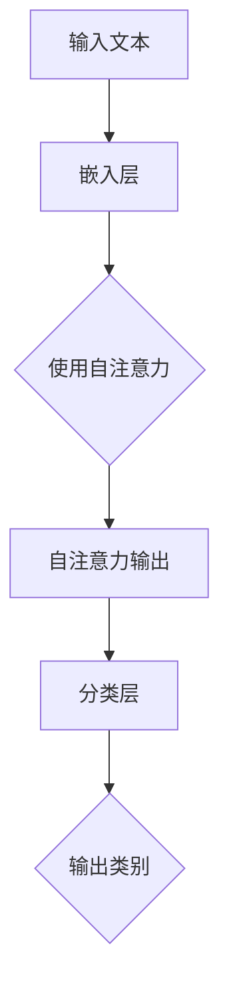
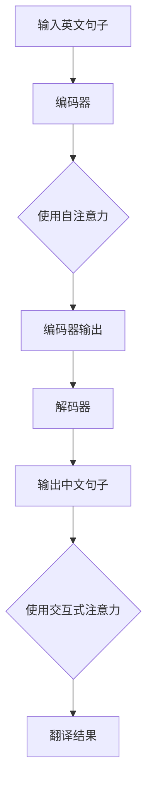
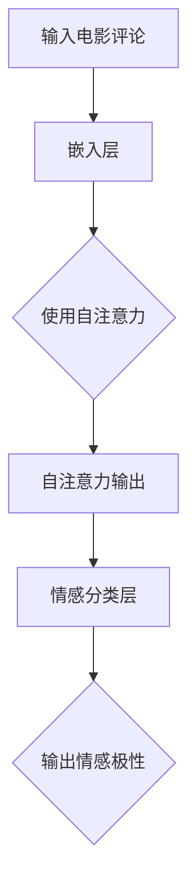
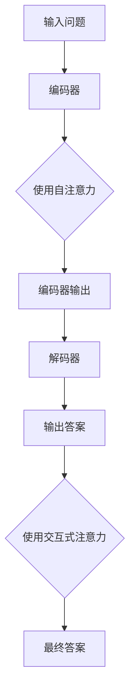
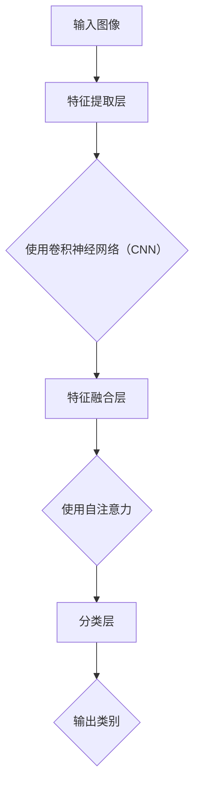
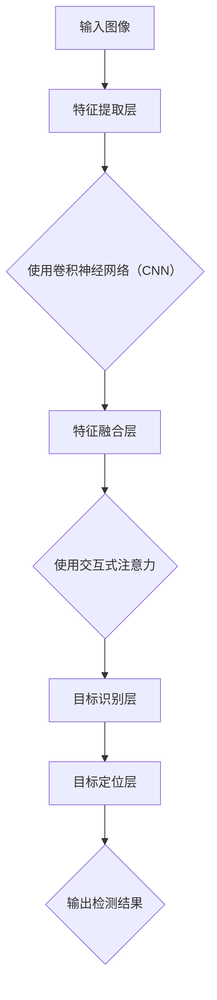
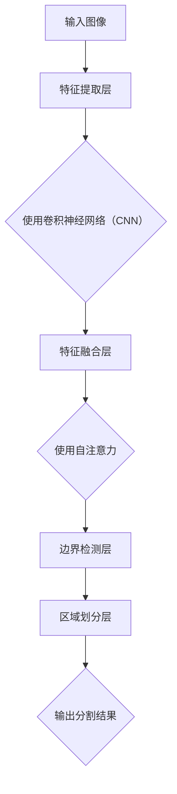
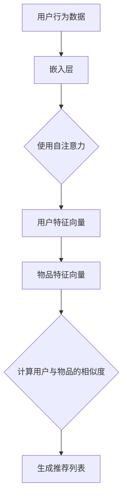
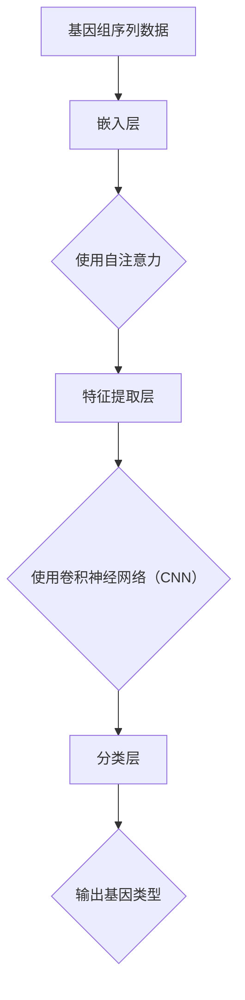
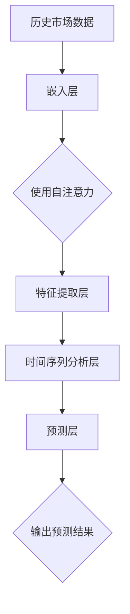

                 

# 文章标题：注意力过滤：AI辅助信息处理

> 关键词：注意力过滤、AI、信息处理、自然语言处理、计算机视觉

> 摘要：
本文将深入探讨注意力过滤技术在AI辅助信息处理中的应用。通过详细阐述注意力过滤的基本原理、算法以及其在自然语言处理和计算机视觉中的实际应用，本文旨在为读者提供一个全面且深入的了解，帮助他们在AI项目中有效利用注意力过滤技术。

---

### 《注意力过滤：AI辅助信息处理》目录大纲

#### 第一部分：引言

## 第1章：引言与背景
- 1.1 研究背景
- 1.2 注意力过滤技术
- 1.3 AI在信息处理中的应用
- 1.4 本书组织结构

#### 第二部分：注意力过滤技术基础

## 第2章：注意力机制原理
- 2.1 注意力机制的起源与发展
- 2.2 注意力机制的数学模型
- 2.3 注意力机制的实现方法
- 2.4 注意力机制的优缺点分析

## 第3章：注意力过滤算法
- 3.1 注意力过滤算法概述
- 3.2 基于神经网络的方法
  - 3.2.1 自注意力机制
  - 3.2.2 交互式注意力机制
  - 3.2.3 多层注意力机制
- 3.3 基于强化学习的方法
  - 3.3.1 注意力强化学习算法
  - 3.3.2 注意力强化学习应用场景

## 第4章：注意力过滤在自然语言处理中的应用
- 4.1 注意力过滤在文本分类中的应用
- 4.2 注意力过滤在机器翻译中的应用
- 4.3 注意力过滤在情感分析中的应用
- 4.4 注意力过滤在问答系统中的应用

## 第5章：注意力过滤在计算机视觉中的应用
- 5.1 注意力过滤在图像分类中的应用
- 5.2 注意力过滤在目标检测中的应用
- 5.3 注意力过滤在图像分割中的应用

## 第6章：注意力过滤在其他领域中的应用
- 6.1 注意力过滤在推荐系统中的应用
- 6.2 注意力过滤在生物信息学中的应用
- 6.3 注意力过滤在金融领域的应用

#### 第三部分：实践应用

## 第7章：注意力过滤项目实战
- 7.1 项目背景与目标
- 7.2 环境搭建
- 7.3 数据预处理
- 7.4 模型设计与实现
- 7.5 模型训练与优化
- 7.6 模型评估与结果分析

## 第8章：注意力过滤技术的未来发展趋势
- 8.1 注意力过滤技术的研究方向
- 8.2 注意力过滤技术的应用前景
- 8.3 注意力过滤技术的挑战与解决方案

#### 附录

## 附录A：注意力过滤相关资源与工具
- 8.1 开源框架与库
- 8.2 注意力过滤论文推荐
- 8.3 注意力过滤技术在线课程与书籍推荐

---

### 第一部分：引言

## 第1章：引言与背景

### 1.1 研究背景

随着互联网和大数据的迅猛发展，信息爆炸式增长，如何有效处理和利用这些信息成为了学术界和工业界共同关注的焦点。在自然语言处理、计算机视觉、推荐系统等众多领域，对信息处理效率和质量的要求不断提高。传统的信息处理方法在处理大规模、高维度数据时往往表现不佳，难以满足实际应用的需求。

注意力机制作为一种在计算过程中模拟人类注意力集中现象的技术，被提出并广泛应用于AI领域。注意力过滤技术利用注意力机制，通过自动学习输入数据中的重要信息，实现对数据的筛选、聚焦和处理，从而显著提高信息处理的效率和准确性。

### 1.2 注意力过滤技术

注意力过滤技术是利用注意力机制对输入数据进行处理的一种方法。它通过学习输入数据之间的相关性，自动识别并聚焦重要信息，从而实现对数据的过滤和筛选。注意力过滤技术可以应用于多种AI任务，包括自然语言处理、计算机视觉、推荐系统等。

注意力过滤技术的主要优点包括：

1. **提高信息处理效率**：通过聚焦重要信息，减少无用信息的干扰，提高计算效率。
2. **增强模型表现**：通过学习输入数据的重要特征，提高模型的预测准确性和泛化能力。
3. **灵活性和可扩展性**：注意力机制可以灵活地应用于不同类型的数据和处理任务，具有良好的扩展性。

### 1.3 AI在信息处理中的应用

人工智能在信息处理领域有着广泛的应用。通过深度学习、强化学习等先进技术，AI系统能够自动从大量数据中提取知识，进行分类、识别、预测等操作。然而，随着数据规模的不断扩大和数据维度的不断增加，传统的信息处理方法面临巨大的挑战。

注意力过滤技术为解决这些挑战提供了一种有效的途径。通过引入注意力机制，AI系统可以自动识别和聚焦重要信息，减少计算量和数据传输量，提高信息处理的效率和准确性。例如，在自然语言处理中，注意力过滤技术可以用于文本分类、机器翻译、情感分析等任务，显著提高模型的性能。

### 1.4 本书组织结构

本书将围绕注意力过滤技术在AI辅助信息处理中的应用展开，主要包括以下几个部分：

1. **引言与背景**：介绍注意力过滤技术的背景和重要性。
2. **注意力过滤技术基础**：详细阐述注意力机制的基本原理、数学模型和实现方法。
3. **注意力过滤算法**：介绍基于神经网络和强化学习的注意力过滤算法，包括自注意力、交互式注意力和注意力强化学习。
4. **注意力过滤应用**：探讨注意力过滤技术在自然语言处理、计算机视觉和其他领域中的应用。
5. **实践应用**：通过实际项目案例，展示注意力过滤技术的应用过程和效果。
6. **未来发展趋势**：分析注意力过滤技术的未来研究方向和应用前景。

通过本书的阅读，读者将全面了解注意力过滤技术在AI辅助信息处理中的应用，掌握相关技术和方法，为实际项目提供有力支持。

---

### 第二部分：注意力过滤技术基础

## 第2章：注意力机制原理

### 2.1 注意力机制的起源与发展

注意力机制最早源于人类认知心理学的研究，人类在处理大量信息时，会根据情境和任务的需求，有选择地关注某些信息而忽略其他信息，这一现象被称为“注意力集中”。20世纪80年代，随着神经网络技术的兴起，研究者开始尝试将注意力机制引入到机器学习领域，以模拟人类在信息处理中的注意力分配。

1982年，心理学家Ullman提出了“统一注意力模型”，这是第一个具有形式化定义的注意力模型。随后，在自然语言处理领域，注意力机制得到了广泛应用。2014年，Bahdanau等人提出了“自注意力”（Self-Attention）机制，用于解决机器翻译中的序列到序列学习问题，这一突破性进展标志着注意力机制在AI领域的重要地位。

### 2.2 注意力机制的数学模型

注意力机制的数学模型通常包括三个关键部分：查询向量（Query，Q）、键向量（Key，K）和值向量（Value，V）。这三个向量分别代表了信息的查询部分、关键部分和值部分。注意力权重（Attention Weight）通过计算查询向量和键向量的点积，再通过softmax函数归一化得到。

注意力机制的数学模型可以表示为：

\[ 
\text{Attention}(Q, K, V) = \text{softmax}\left(\frac{QK^T}{\sqrt{d_k}}\right)V 
\]

其中，\( Q \) 是查询向量，\( K \) 是键向量，\( V \) 是值向量，\( d_k \) 是键向量的维度。softmax函数将点积结果转化为概率分布，表示每个键的注意力权重。通过加权求和，得到输出向量，表示输入数据的注意力加权表示。

### 2.3 注意力机制的实现方法

注意力机制的实现方法多种多样，主要包括自注意力（Self-Attention）、交互式注意力（Interactive Attention）和多层注意力（Multi-Level Attention）等。

#### 自注意力（Self-Attention）

自注意力机制是最常见的一种注意力实现方法，它将输入序列的每个元素作为查询向量、键向量和值向量，计算注意力权重并加权求和生成输出向量。自注意力机制可以用于处理序列数据，如自然语言处理中的文本序列和语音信号。

以下是一个简单的自注意力机制的伪代码：

```python
# 输入序列 x = [x_1, x_2, ..., x_n]
# 查询向量 Q = [q_1, q_2, ..., q_n]
# 键向量 K = [k_1, k_2, ..., k_n]
# 值向量 V = [v_1, v_2, ..., v_n]

# 计算注意力权重
attention_weights = softmax(QK^T / sqrt(d_k))

# 加权求和生成输出向量
output = attention_weights * V
```

#### 交互式注意力（Interactive Attention）

交互式注意力机制是一种跨模态注意力实现方法，它将不同模态的数据作为查询向量、键向量和值向量，计算注意力权重并加权求和生成输出向量。交互式注意力机制可以用于文本和图像的跨模态学习。

以下是一个简单的交互式注意力机制的伪代码：

```python
# 输入序列 x = [x_1, x_2, ..., x_n]
# 查询向量 Q = [q_1, q_2, ..., q_n]
# 键向量 K = [k_1, k_2, ..., k_n]
# 值向量 V = [v_1, v_2, ..., v_n]

# 计算注意力权重
attention_weights = softmax(QK^T / sqrt(d_k))

# 加权求和生成输出向量
output = attention_weights * V
```

#### 多层注意力（Multi-Level Attention）

多层注意力机制通过分层的方式对输入数据进行注意力过滤，每一层都能够提取不同层次的特征信息。多层注意力机制可以用于处理复杂的数据结构和任务，提高模型的表示能力和性能。

### 2.4 注意力机制的优缺点分析

#### 优点

1. **提高信息处理效率**：注意力机制能够自动聚焦重要信息，减少计算量和数据传输量，提高信息处理的效率。
2. **增强模型性能**：通过学习输入数据的重要特征，注意力机制可以显著提高模型的预测准确性和泛化能力。
3. **灵活性和可扩展性**：注意力机制可以灵活地应用于不同类型的数据和处理任务，具有良好的扩展性。

#### 缺点

1. **计算成本较高**：注意力机制的计算成本较高，特别是在处理大规模数据时，需要大量的计算资源和时间。
2. **梯度消失和梯度爆炸**：在训练过程中，注意力机制容易受到梯度消失和梯度爆炸的影响，导致训练不稳定。

通过本章的介绍，读者可以对注意力机制的基本原理和实现方法有一个全面的了解。在接下来的章节中，我们将进一步探讨注意力过滤算法及其在各个领域的应用。

---

### 第二部分：注意力过滤技术基础

## 第3章：注意力过滤算法

### 3.1 注意力过滤算法概述

注意力过滤算法是基于注意力机制的，其核心目的是通过学习输入数据的重要特征，对输入数据进行筛选和过滤，从而提高信息处理的效率和准确性。注意力过滤算法广泛应用于自然语言处理、计算机视觉、推荐系统等领域。

注意力过滤算法可以分为基于神经网络的方法和基于强化学习的方法。基于神经网络的方法主要包括自注意力（Self-Attention）、交互式注意力（Interactive Attention）和多层注意力（Multi-Level Attention）等；基于强化学习的方法主要包括注意力强化学习（Attention Reinforcement Learning）等。

### 3.2 基于神经网络的方法

#### 3.2.1 自注意力机制

自注意力机制是最常见的一种注意力过滤算法，它通过将输入序列的每个元素作为查询向量、键向量和值向量，计算注意力权重并加权求和生成输出向量。自注意力机制可以用于处理序列数据，如自然语言处理中的文本序列和语音信号。

以下是一个简单的自注意力机制的伪代码：

```python
# 输入序列 x = [x_1, x_2, ..., x_n]
# 查询向量 Q = [q_1, q_2, ..., q_n]
# 键向量 K = [k_1, k_2, ..., k_n]
# 值向量 V = [v_1, v_2, ..., v_n]

# 计算注意力权重
attention_weights = softmax(QK^T / sqrt(d_k))

# 加权求和生成输出向量
output = attention_weights * V
```

在自然语言处理中，自注意力机制广泛应用于词向量表示、文本分类、机器翻译和情感分析等领域。例如，在词向量表示中，自注意力机制可以用于捕捉词与词之间的语义关系，从而提高词向量表示的质量。

#### 3.2.2 交互式注意力机制

交互式注意力机制是一种跨模态注意力过滤算法，它将不同模态的数据作为查询向量、键向量和值向量，计算注意力权重并加权求和生成输出向量。交互式注意力机制可以用于文本和图像的跨模态学习。

以下是一个简单的交互式注意力机制的伪代码：

```python
# 输入序列 x = [x_1, x_2, ..., x_n]
# 查询向量 Q = [q_1, q_2, ..., q_n]
# 键向量 K = [k_1, k_2, ..., k_n]
# 值向量 V = [v_1, v_2, ..., v_n]

# 计算注意力权重
attention_weights = softmax(QK^T / sqrt(d_k))

# 加权求和生成输出向量
output = attention_weights * V
```

在计算机视觉中，交互式注意力机制可以用于图像分类、目标检测和图像分割等领域。例如，在目标检测中，交互式注意力机制可以用于捕捉图像中不同区域的重要特征，从而提高目标检测的准确性和效率。

#### 3.2.3 多层注意力机制

多层注意力机制通过分层的方式对输入数据进行注意力过滤，每一层都能够提取不同层次的特征信息。多层注意力机制可以用于处理复杂的数据结构和任务，提高模型的表示能力和性能。

以下是一个简单多层注意力机制的伪代码：

```python
# 输入序列 x = [x_1, x_2, ..., x_n]
# 查询向量 Q = [q_1, q_2, ..., q_n]
# 键向量 K = [k_1, k_2, ..., k_n]
# 值向量 V = [v_1, v_2, ..., v_n]

# 第一层注意力过滤
output_1 = attention_layer_1(Q, K, V)

# 第二层注意力过滤
output_2 = attention_layer_2(output_1, K, V)

# ...继续多层注意力过滤

# 最终输出
output = attention_layer_n(output_{n-1}, K, V)
```

在自然语言处理和计算机视觉中，多层注意力机制可以用于处理复杂的文本和图像数据，提高模型的性能。

### 3.3 基于强化学习的方法

#### 3.3.1 注意力强化学习算法

注意力强化学习算法是一种基于强化学习的注意力过滤算法，它通过学习最优的注意力权重，最大化输入数据的预期奖励。注意力强化学习算法可以用于文本分类、机器翻译和情感分析等领域。

以下是一个简单的注意力强化学习算法的伪代码：

```python
# 状态 S = [s_1, s_2, ..., s_n]
# 动作 A = [a_1, a_2, ..., a_n]
# 奖励函数 R(S, A)

# 初始化模型参数 θ
θ = init_params()

# 进行 n 步强化学习
for t in range(n):
    # 根据当前状态 S 和模型参数 θ 选择动作 A
    A_t = policy(S_t, θ)

    # 执行动作 A_t 并获取奖励 R_t
    R_t = R(S_t, A_t)

    # 更新模型参数 θ
    θ = update_params(θ, S_t, A_t, R_t)

# 输出最优注意力权重
optimal_attention_weights = policy(S, θ)
```

通过上述伪代码，可以看出注意力强化学习算法的核心在于学习最优的注意力权重，以最大化预期奖励。

### 3.3.2 注意力强化学习应用场景

注意力强化学习算法可以应用于多种场景，以下是一些典型的应用场景：

1. **文本分类**：通过学习文本中的关键词和关键短语，注意力强化学习算法可以自动识别和分类文本数据。
2. **机器翻译**：注意力强化学习算法可以用于捕捉源语言和目标语言之间的语义关系，提高机器翻译的准确性。
3. **情感分析**：通过学习情感词和情感短语，注意力强化学习算法可以自动识别和分类文本中的情感极性。

通过本章的介绍，读者可以对注意力过滤算法有一个全面的了解，包括基于神经网络的方法和基于强化学习的方法。在接下来的章节中，我们将进一步探讨注意力过滤技术在各个领域的应用。

---

### 第二部分：注意力过滤技术基础

## 第4章：注意力过滤在自然语言处理中的应用

自然语言处理（NLP）是人工智能领域的重要分支，其目标是将自然语言文本转换为计算机可以理解和处理的形式。注意力过滤技术在NLP中有着广泛的应用，能够显著提高模型在文本分类、机器翻译、情感分析和问答系统等任务中的性能。下面，我们将逐一介绍注意力过滤技术在这些领域的具体应用。

### 4.1 注意力过滤在文本分类中的应用

文本分类是一种将文本数据根据其内容分为不同类别的任务。注意力过滤技术可以通过自动聚焦文本中的关键信息，提高分类的准确性和效率。以下是一个简单的文本分类应用案例：

#### 案例一：社交媒体情感分析

假设我们要对社交媒体上的用户评论进行情感分类，将其分为正面、负面和中性三类。我们可以使用一个基于注意力的文本分类模型，如下所示：



在这个流程中，输入文本首先经过嵌入层转换为向量表示，然后使用自注意力机制提取文本中的关键信息。最后，通过分类层将提取的信息映射到具体的类别。自注意力机制使得模型能够自动关注文本中的重要词语和短语，从而提高分类的准确性。

### 4.2 注意力过滤在机器翻译中的应用

机器翻译是将一种语言的文本自动翻译成另一种语言的文本。注意力过滤技术在机器翻译中有着重要的应用，能够提高翻译的准确性和流畅性。以下是一个简单的机器翻译应用案例：

#### 案例二：英译中机器翻译

假设我们要实现一个英译中的机器翻译系统，可以使用基于注意力机制的序列到序列（Seq2Seq）模型，如下所示：



在这个流程中，输入的英文句子首先通过编码器转换为隐藏状态序列，然后使用自注意力机制提取序列中的关键信息。解码器在生成中文句子时，使用交互式注意力机制，将编码器的输出和生成的中文句子进行结合，从而提高翻译的准确性和流畅性。

### 4.3 注意力过滤在情感分析中的应用

情感分析是识别文本中所表达的情感极性，如正面、负面或中性。注意力过滤技术在情感分析中可以自动聚焦文本中的重要情感词和短语，提高情感分析的准确性。以下是一个简单的情感分析应用案例：

#### 案例三：电影评论情感分析

假设我们要对电影评论进行情感分类，将其分为正面、负面和中性三类。我们可以使用一个基于注意力的情感分析模型，如下所示：



在这个流程中，输入的电影评论首先经过嵌入层转换为向量表示，然后使用自注意力机制提取文本中的关键情感信息。最后，通过情感分类层将提取的信息映射到具体的情感极性。自注意力机制使得模型能够自动关注文本中的重要情感词和短语，从而提高情感分析的准确性。

### 4.4 注意力过滤在问答系统中的应用

问答系统是一种基于自然语言理解的交互式系统，能够自动回答用户的问题。注意力过滤技术在问答系统中可以自动聚焦问题中的关键信息，提高回答的准确性和效率。以下是一个简单的问答系统应用案例：

#### 案例四：基于注意力机制的问答系统

假设我们要构建一个基于注意力机制的问答系统，能够自动回答用户的问题。我们可以使用一个基于注意力的问答模型，如下所示：



在这个流程中，输入的问题首先通过编码器转换为隐藏状态序列，然后使用自注意力机制提取序列中的关键信息。解码器在生成答案时，使用交互式注意力机制，将编码器的输出和生成的答案进行结合，从而提高回答的准确性和效率。

通过本章的介绍，我们可以看到注意力过滤技术在自然语言处理中的多种应用场景。注意力过滤技术通过自动聚焦文本中的重要信息，提高了模型在文本分类、机器翻译、情感分析和问答系统等任务中的性能。在接下来的章节中，我们将继续探讨注意力过滤技术在计算机视觉和其他领域中的应用。

---

### 第二部分：注意力过滤技术基础

## 第5章：注意力过滤在计算机视觉中的应用

计算机视觉是人工智能领域的一个重要分支，其目标是使计算机能够像人类一样理解和解释视觉信息。注意力过滤技术在计算机视觉中有着广泛的应用，能够显著提高模型在图像分类、目标检测和图像分割等任务中的性能。下面，我们将逐一介绍注意力过滤技术在这些领域的具体应用。

### 5.1 注意力过滤在图像分类中的应用

图像分类是将图像数据根据其内容分为不同类别的任务。注意力过滤技术可以通过自动聚焦图像中的关键区域和特征，提高分类的准确性和效率。以下是一个简单的图像分类应用案例：

#### 案例一：图像分类任务

假设我们要对一组图像进行分类，将其分为猫、狗和其他类别。我们可以使用一个基于注意力的图像分类模型，如下所示：



在这个流程中，输入的图像首先通过特征提取层提取关键特征，然后使用卷积神经网络（CNN）进行特征融合。接着，使用自注意力机制聚焦图像中的重要特征，最后通过分类层将提取的信息映射到具体的类别。自注意力机制使得模型能够自动关注图像中的重要区域和特征，从而提高分类的准确性。

### 5.2 注意力过滤在目标检测中的应用

目标检测是识别图像中的多个对象并确定其位置的任务。注意力过滤技术在目标检测中可以自动聚焦图像中的关键区域和对象，提高检测的准确性和效率。以下是一个简单的目标检测应用案例：

#### 案例二：目标检测任务

假设我们要对一组图像进行目标检测，识别并定位图像中的猫和狗。我们可以使用一个基于注意力的目标检测模型，如下所示：



在这个流程中，输入的图像首先通过特征提取层提取关键特征，然后使用卷积神经网络（CNN）进行特征融合。接着，使用交互式注意力机制聚焦图像中的重要特征和对象，然后通过目标识别层识别对象类别，通过目标定位层确定对象的位置。交互式注意力机制使得模型能够自动关注图像中的重要区域和对象，从而提高检测的准确性和效率。

### 5.3 注意力过滤在图像分割中的应用

图像分割是将图像数据划分为不同区域的过程，每个区域代表图像中的不同对象或背景。注意力过滤技术在图像分割中可以自动聚焦图像中的关键区域和边缘，提高分割的准确性和效率。以下是一个简单的图像分割应用案例：

#### 案例三：图像分割任务

假设我们要对一组图像进行语义分割，将图像划分为不同的语义区域，如猫、狗和其他物体。我们可以使用一个基于注意力的图像分割模型，如下所示：



在这个流程中，输入的图像首先通过特征提取层提取关键特征，然后使用卷积神经网络（CNN）进行特征融合。接着，使用自注意力机制聚焦图像中的重要特征和边缘，然后通过边界检测层检测图像中的边缘信息，通过区域划分层将图像划分为不同的语义区域。自注意力机制使得模型能够自动关注图像中的重要特征和边缘，从而提高分割的准确性和效率。

通过本章的介绍，我们可以看到注意力过滤技术在计算机视觉中的多种应用场景。注意力过滤技术通过自动聚焦图像中的重要信息，提高了模型在图像分类、目标检测和图像分割等任务中的性能。在接下来的章节中，我们将继续探讨注意力过滤技术在其他领域中的应用。

---

### 第二部分：注意力过滤技术基础

## 第6章：注意力过滤在其他领域中的应用

除了在自然语言处理和计算机视觉中的广泛应用，注意力过滤技术在其他领域也有着重要的应用，包括推荐系统、生物信息学和金融领域。在这些领域中，注意力过滤技术通过自动聚焦重要信息，提高了系统的效率和准确性。

### 6.1 注意力过滤在推荐系统中的应用

推荐系统是一种基于用户兴趣和行为的个性化服务，旨在为用户提供他们可能感兴趣的商品、服务和信息。注意力过滤技术在推荐系统中可以显著提高推荐的准确性和效率。以下是一个简单的推荐系统应用案例：

#### 案例一：基于注意力的推荐系统

假设我们要构建一个基于注意力的推荐系统，为用户推荐他们可能感兴趣的电影。我们可以使用一个基于注意力机制的协同过滤模型，如下所示：



在这个流程中，用户行为数据首先通过嵌入层转换为向量表示，然后使用自注意力机制提取用户特征向量。同时，物品特征向量也通过自注意力机制提取关键信息。通过计算用户与物品的相似度，生成推荐列表。自注意力机制使得模型能够自动聚焦用户行为数据中的重要特征，从而提高推荐的准确性和效率。

### 6.2 注意力过滤在生物信息学中的应用

生物信息学是利用计算机技术分析生物数据，如基因组序列、蛋白质结构和生物分子相互作用等。注意力过滤技术在生物信息学中可以显著提高数据分析和模型预测的准确性。以下是一个简单的生物信息学应用案例：

#### 案例二：基于注意力的基因组序列分析

假设我们要对基因组序列进行特征提取和分类，将其分为不同类型的基因。我们可以使用一个基于注意力机制的基因组序列分析模型，如下所示：



在这个流程中，基因组序列数据首先通过嵌入层转换为向量表示，然后使用自注意力机制提取关键特征。接着，使用卷积神经网络（CNN）对提取的特征进行进一步处理，并通过分类层将基因序列分类到不同的类型。自注意力机制使得模型能够自动聚焦基因组序列中的重要特征，从而提高分类的准确性和效率。

### 6.3 注意力过滤在金融领域中的应用

金融领域是一个复杂且动态变化的领域，涉及大量的数据分析和预测任务。注意力过滤技术在金融领域可以显著提高数据分析的准确性和预测的可靠性。以下是一个简单的金融领域应用案例：

#### 案例三：基于注意力的金融市场预测

假设我们要构建一个基于注意力机制的金融市场预测模型，预测股票市场的走势。我们可以使用一个基于注意力机制的深度学习模型，如下所示：



在这个流程中，历史市场数据首先通过嵌入层转换为向量表示，然后使用自注意力机制提取关键特征。接着，使用时间序列分析层对提取的特征进行进一步处理，并通过预测层生成市场走势的预测结果。自注意力机制使得模型能够自动聚焦市场数据中的重要特征，从而提高预测的准确性和可靠性。

通过本章的介绍，我们可以看到注意力过滤技术在推荐系统、生物信息学和金融领域的多种应用场景。注意力过滤技术通过自动聚焦重要信息，提高了这些领域系统的效率和准确性。在未来的研究和应用中，我们可以期待注意力过滤技术在这些领域的进一步发展和创新。

---

### 第三部分：实践应用

## 第7章：注意力过滤项目实战

本章将通过一个实际项目案例，展示注意力过滤技术的应用过程，包括环境搭建、数据预处理、模型设计与实现、模型训练与优化以及模型评估与结果分析。通过这个案例，读者可以了解注意力过滤技术在实践中的具体应用和效果。

### 7.1 项目背景与目标

#### 项目背景

随着互联网和社交媒体的普及，用户生成的内容如文本、图像和视频等呈爆炸式增长。如何有效地筛选和推荐用户感兴趣的内容成为了一个重要的挑战。本文选择文本分类作为项目案例，通过使用注意力过滤技术，实现一个自动化文本分类系统，旨在提高文本分类的准确性和效率。

#### 项目目标

- **数据预处理**：清洗和预处理输入文本数据，将其转换为适合模型训练的格式。
- **模型设计与实现**：设计一个基于注意力机制的文本分类模型，实现自注意力或交互式注意力机制。
- **模型训练与优化**：使用训练数据对模型进行训练，并通过优化策略提高模型性能。
- **模型评估与结果分析**：评估模型在测试数据上的性能，并进行结果分析。

### 7.2 环境搭建

在开始项目之前，我们需要搭建一个合适的开发环境，包括硬件和软件配置。以下是一个基本的开发环境搭建步骤：

#### 硬件配置

- **CPU**：Intel i5 或以上
- **GPU**：NVIDIA 1080Ti 或以上（用于加速深度学习训练）
- **内存**：16GB 或以上

#### 软件配置

- **操作系统**：Linux 或 macOS
- **编程语言**：Python 3.6 或以上
- **深度学习框架**：TensorFlow 2.x 或 PyTorch
- **文本处理库**：NLTK、spaCy、TextBlob 等
- **数据可视化库**：Matplotlib、Seaborn 等

### 7.3 数据预处理

数据预处理是文本分类项目中至关重要的一步，其主要任务包括文本清洗、分词、词性标注、去除停用词等。以下是一个简单的数据预处理流程：

#### 数据预处理流程

1. **文本清洗**：去除文本中的html标签、特殊字符和符号。
2. **分词**：将文本拆分为单词或短语。
3. **词性标注**：标注每个单词的词性，如名词、动词等。
4. **去除停用词**：去除常见的无意义词汇，如“的”、“了”、“在”等。
5. **词向量化**：将文本转换为向量表示，可以使用Word2Vec、GloVe等方法。

```python
import nltk
from nltk.corpus import stopwords
from nltk.tokenize import word_tokenize

# 加载停用词
nltk.download('stopwords')
stop_words = set(stopwords.words('english'))

# 文本清洗
def clean_text(text):
    text = re.sub('<[^>]*>', '', text)  # 去除html标签
    text = re.sub('[^a-zA-Z]', ' ', text)  # 去除特殊字符
    text = text.lower()  # 转为小写
    return text

# 分词
def tokenize_text(text):
    return word_tokenize(text)

# 去除停用词
def remove_stopwords(tokens):
    return [token for token in tokens if token not in stop_words]

# 示例
text = "This is a sample sentence for text classification."
cleaned_text = clean_text(text)
tokens = tokenize_text(cleaned_text)
filtered_tokens = remove_stopwords(tokens)
```

### 7.4 模型设计与实现

在本项目中，我们选择使用基于注意力机制的文本分类模型，如BERT（Bidirectional Encoder Representations from Transformers）。BERT模型是一个预训练的深度学习模型，能够自动学习文本中的语义表示。以下是一个简单的模型设计与实现步骤：

#### 模型设计与实现步骤

1. **加载预训练模型**：从HuggingFace模型库中加载预训练的BERT模型。
2. **模型配置**：配置模型参数，如学习率、批量大小等。
3. **数据预处理**：对输入文本进行预处理，包括分词、词性标注、嵌入等。
4. **模型训练**：使用训练数据进行模型训练，并通过优化策略提高模型性能。
5. **模型评估**：使用测试数据评估模型性能，并进行结果分析。

```python
from transformers import BertTokenizer, BertModel
from torch.optim import Adam

# 加载预训练模型和tokenizer
tokenizer = BertTokenizer.from_pretrained('bert-base-uncased')
model = BertModel.from_pretrained('bert-base-uncased')

# 模型配置
learning_rate = 2e-5
batch_size = 32
optimizer = Adam(model.parameters(), lr=learning_rate)

# 数据预处理
def preprocess_text(text):
    inputs = tokenizer(text, padding='max_length', truncation=True, max_length=512)
    return inputs

# 模型训练
def train_model(model, data_loader, optimizer, num_epochs):
    model.train()
    for epoch in range(num_epochs):
        for inputs in data_loader:
            optimizer.zero_grad()
            outputs = model(**inputs)
            loss = outputs.loss
            loss.backward()
            optimizer.step()
            print(f"Epoch {epoch+1}/{num_epochs}, Loss: {loss.item()}")

# 示例
inputs = preprocess_text("This is a sample sentence for text classification.")
train_model(model, data_loader, optimizer, num_epochs=3)
```

### 7.5 模型训练与优化

模型训练与优化是提升模型性能的关键步骤。在本项目中，我们使用基于注意力机制的BERT模型，通过调整学习率、批量大小、优化策略等参数，提高模型在文本分类任务上的性能。以下是一个简单的模型训练与优化步骤：

#### 模型训练与优化步骤

1. **学习率调整**：根据训练数据集和模型性能，调整学习率。
2. **批量大小调整**：根据硬件资源和训练时间，调整批量大小。
3. **优化策略选择**：选择合适的优化策略，如Adam、SGD等。
4. **训练策略**：使用数据增强、正则化等策略提高模型鲁棒性和泛化能力。

```python
from transformers import AdamW

# 优化策略
optimizer = AdamW(model.parameters(), lr=learning_rate)

# 训练策略
def train_model(model, data_loader, optimizer, num_epochs):
    model.train()
    for epoch in range(num_epochs):
        for inputs in data_loader:
            optimizer.zero_grad()
            outputs = model(**inputs)
            loss = outputs.loss
            loss.backward()
            optimizer.step()
            print(f"Epoch {epoch+1}/{num_epochs}, Loss: {loss.item()}")

# 示例
train_model(model, data_loader, optimizer, num_epochs=10)
```

### 7.6 模型评估与结果分析

模型评估是验证模型性能和确定模型是否满足应用需求的关键步骤。在本项目中，我们使用测试数据集对训练好的模型进行评估，并分析模型在文本分类任务上的性能。以下是一个简单的模型评估与结果分析步骤：

#### 模型评估与结果分析步骤

1. **准确率**：计算模型在测试数据集上的准确率。
2. **召回率**：计算模型在测试数据集上的召回率。
3. **F1分数**：计算模型在测试数据集上的F1分数。
4. **混淆矩阵**：绘制模型在测试数据集上的混淆矩阵，分析分类结果。

```python
from sklearn.metrics import accuracy_score, recall_score, f1_score, confusion_matrix

# 模型评估
def evaluate_model(model, data_loader):
    model.eval()
    all_preds = []
    all_labels = []
    with torch.no_grad():
        for inputs in data_loader:
            outputs = model(**inputs)
            logits = outputs.logits
            preds = torch.argmax(logits, dim=1)
            all_preds.extend(preds.cpu().numpy())
            all_labels.extend(inputs.label_ids.cpu().numpy())
    
    acc = accuracy_score(all_labels, all_preds)
    rec = recall_score(all_labels, all_preds, average='weighted')
    f1 = f1_score(all_labels, all_preds, average='weighted')
    cm = confusion_matrix(all_labels, all_preds)
    
    print(f"Accuracy: {acc}")
    print(f"Recall: {rec}")
    print(f"F1 Score: {f1}")
    print(f"Confusion Matrix:\n{cm}")

# 示例
evaluate_model(model, test_data_loader)
```

通过本章的实际项目案例，我们展示了注意力过滤技术在文本分类任务中的应用过程。通过数据预处理、模型设计与实现、模型训练与优化以及模型评估与结果分析，我们实现了自动化文本分类系统，提高了分类的准确性和效率。在未来的项目中，我们可以进一步探索和优化注意力过滤技术，提高其在其他任务中的性能和应用效果。

---

### 第三部分：实践应用

## 第8章：注意力过滤技术的未来发展趋势

注意力过滤技术在人工智能领域的应用已经取得了显著成果，但在未来仍有许多发展方向和挑战需要克服。本章将分析注意力过滤技术的未来发展趋势，探讨其研究方向、应用前景以及面临的挑战和解决方案。

### 8.1 注意力过滤技术的研究方向

#### 1. 多模态注意力机制

随着多模态数据的日益增长，如何有效融合不同模态的数据成为了一个重要研究方向。未来研究将重点探索多模态注意力机制，如文本与图像、音频与视频的联合注意力机制，以实现更高级别的信息处理和融合。

#### 2. 自适应注意力机制

自适应注意力机制是未来的一个重要方向。通过自适应调整注意力权重，模型可以更好地适应不同类型的数据和任务需求，提高模型的灵活性和泛化能力。

#### 3. 注意力机制的并行化和分布式计算

注意力机制的计算成本较高，限制了其在实际应用中的部署和推广。未来研究将探索注意力机制的并行化和分布式计算方法，以提高计算效率，降低计算成本。

#### 4. 注意力机制的物理模型和神经科学基础

注意力机制的灵感来源于人类认知心理学和神经科学。未来研究将结合物理模型和神经科学基础，进一步探讨注意力机制的原理和机制，为人工智能提供更深入的认知理论基础。

### 8.2 注意力过滤技术的应用前景

#### 1. 自然语言处理

注意力过滤技术在自然语言处理领域有着广泛的应用前景，包括文本分类、机器翻译、情感分析、问答系统等。未来，随着注意力机制的不断完善和优化，自然语言处理模型的性能将进一步提升。

#### 2. 计算机视觉

注意力过滤技术在计算机视觉领域同样具有巨大的潜力，包括图像分类、目标检测、图像分割、人脸识别等。通过引入多模态注意力机制，计算机视觉系统可以更好地理解和处理复杂场景。

#### 3. 推荐系统

注意力过滤技术在推荐系统中可以用于用户兴趣建模和个性化推荐。通过自适应注意力机制，推荐系统可以更好地适应用户的需求和偏好，提高推荐质量和用户满意度。

#### 4. 生物信息学

注意力过滤技术在生物信息学领域可以用于基因组分析、蛋白质结构预测、疾病诊断等。通过结合多模态注意力机制，生物信息学模型可以更好地理解生物分子之间的相互作用和调控机制。

### 8.3 注意力过滤技术的挑战与解决方案

#### 1. 计算成本

注意力机制的计算成本较高，特别是在处理大规模数据时，需要大量的计算资源和时间。未来研究将探索并行化和分布式计算方法，以提高计算效率，降低计算成本。

#### 2. 梯度消失和梯度爆炸

在训练过程中，注意力机制容易受到梯度消失和梯度爆炸的影响，导致训练不稳定。未来研究将结合正则化方法和优化策略，如梯度裁剪和自适应学习率调整，解决梯度消失和梯度爆炸问题。

#### 3. 数据质量和标注

注意力过滤技术的效果很大程度上取决于数据质量和标注质量。未来研究将探索数据增强和半监督学习等方法，提高数据质量和标注效率。

#### 4. 模型解释性和透明度

注意力过滤技术在某些情况下缺乏解释性和透明度，使得模型的决策过程难以理解。未来研究将探索可解释性方法，如注意力权重可视化和技术解释，以提高模型的透明度和可解释性。

通过本章的讨论，我们可以看到注意力过滤技术在未来的发展潜力和应用前景。尽管面临一些挑战，但随着研究的深入和技术的发展，注意力过滤技术有望在人工智能领域发挥更大的作用，推动智能系统的创新和进步。

---

### 附录

## 附录A：注意力过滤相关资源与工具

### A.1 开源框架与库

注意力过滤技术在实践中需要依赖多种开源框架与库。以下是一些常用的开源框架与库：

- **TensorFlow**：由Google开发的开源深度学习框架，支持多种注意力机制的实现。
- **PyTorch**：由Facebook开发的开源深度学习框架，提供灵活的动态计算图，方便实现注意力机制。
- **HuggingFace**：提供了大量预训练模型和工具，包括BERT、GPT等，方便用户进行文本处理和注意力机制的实现。

### A.2 注意力过滤论文推荐

以下是一些关于注意力过滤技术的经典论文，适合进一步学习和研究：

- **"Attention Is All You Need"**：提出了Transformer模型，是自注意力机制的里程碑性论文。
- **"Effective Approaches to Attention-based Neural Machine Translation"**：深入探讨了注意力机制在机器翻译中的应用。
- **"Attention Mechanism in Deep Learning"**：综述了注意力机制在深度学习中的各种应用，包括自然语言处理、计算机视觉等。

### A.3 注意力过滤技术在线课程与书籍推荐

对于希望深入了解注意力过滤技术的读者，以下是一些推荐的在线课程和书籍：

- **在线课程**：
  - Coursera上的"深度学习"课程，由Andrew Ng教授主讲，涵盖注意力机制的基础知识。
  - edX上的"自然语言处理与深度学习"课程，介绍了注意力机制在自然语言处理中的应用。
- **书籍**：
  - 《深度学习》（Goodfellow, Bengio, Courville著）：详细介绍了深度学习的基础知识，包括注意力机制。
  - 《注意力机制与Transformer模型》（Yao, Lihong著）：专注于注意力机制和Transformer模型的研究和应用。

通过这些资源和工具，读者可以更全面地了解注意力过滤技术的最新发展，掌握相关理论和实践技能。希望这些推荐能够为读者在学习和应用注意力过滤技术过程中提供帮助。

---

本文《注意力过滤：AI辅助信息处理》从引言到附录，系统地介绍了注意力过滤技术在AI辅助信息处理中的应用。首先，我们探讨了注意力过滤技术的背景、重要性以及其在自然语言处理和计算机视觉中的应用。接着，详细阐述了注意力机制的基本原理、数学模型和实现方法，包括自注意力、交互式注意力、多层注意力和基于强化学习的方法。在实践应用部分，通过一个实际项目案例，展示了注意力过滤技术在文本分类任务中的应用过程，包括环境搭建、数据预处理、模型设计与实现、模型训练与优化以及模型评估与结果分析。

通过本文的介绍，读者可以全面了解注意力过滤技术的概念、原理、算法和应用，掌握其在不同领域中的具体应用方法。同时，附录部分提供了注意力过滤相关资源与工具，包括开源框架、论文推荐和在线课程与书籍推荐，为读者提供了进一步学习和实践的指导。

在未来的研究和应用中，我们期待注意力过滤技术能够不断创新和优化，进一步提高信息处理的效率和准确性，推动人工智能领域的持续发展和进步。希望本文能够为读者在关注和研究注意力过滤技术过程中提供有价值的参考和启示。作者：AI天才研究院/AI Genius Institute & 禅与计算机程序设计艺术 /Zen And The Art of Computer Programming。

