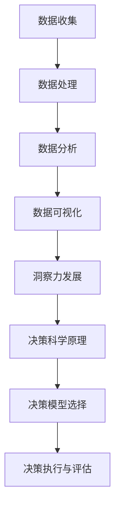
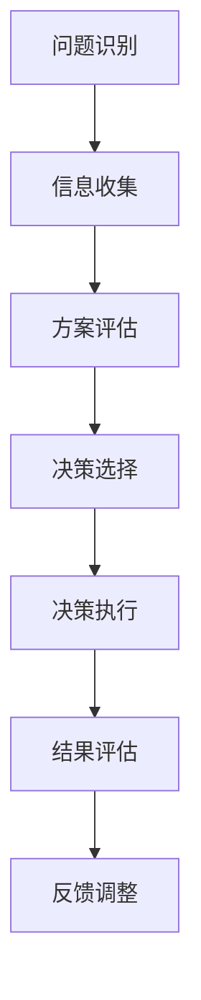
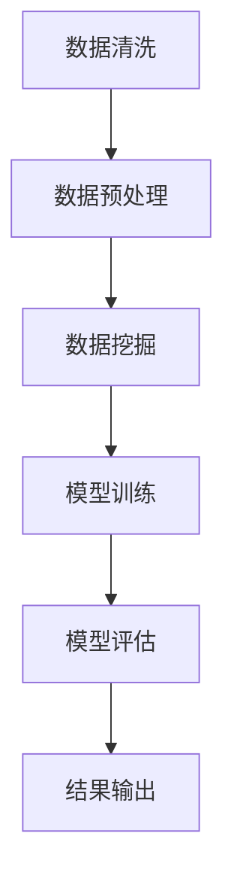

                 

### 文章标题：洞察力与决策科学：从数据到智慧的转化

### 关键词：洞察力、决策科学、数据驱动决策、数据分析、智慧转化

### 摘要：
本文将深入探讨洞察力与决策科学的核心概念，从数据到智慧的转化过程。通过分析洞察力的维度与培养方法，阐述决策科学的基本原理与模型。同时，本文将结合实际案例，展示数据驱动决策的核心方法及其在实际应用中的智慧转化路径。最后，本文将探讨提升决策科学与洞察力的工具与方法，并展望其未来发展趋势。

### 引言与基础

#### 1.1 洞察力的定义与重要性

洞察力是指能够迅速准确地理解事物本质、把握问题核心的能力。在当今信息爆炸的时代，洞察力显得尤为重要。它不仅可以帮助我们更好地应对复杂多变的环境，还能够提高我们的决策效率和质量。

#### 1.2 决策科学的基本概念

决策科学是一门研究决策过程、决策模型和决策方法的多学科交叉领域。它旨在通过科学的方法和工具，帮助决策者在不确定性和复杂性的环境中做出更明智的决策。

#### 1.3 洞察力与决策科学的关系

洞察力与决策科学密切相关。洞察力是决策科学的基础，它为决策者提供了深入分析和判断的能力。而决策科学则为洞察力的发挥提供了方法论和工具支持，使得决策过程更加科学和有效。

#### 2. 数据科学与智慧转化的基础

#### 2.1 数据科学的基本概念

数据科学是一门结合统计学、计算机科学、机器学习和领域知识，通过数据获取、处理、分析和可视化来提取知识、洞察和决策支持的科学。

#### 2.2 数据收集与处理

数据收集是指从各种来源获取数据的过程。数据处理则是对原始数据进行清洗、转换和整合，以便进行分析和挖掘。

#### 2.3 数据分析与可视化

数据分析是数据科学的核心，包括描述性分析、推断性分析和预测性分析。数据可视化则是通过图形和图表将数据分析和洞察直观地展示出来，帮助决策者更好地理解数据背后的信息。

### 第二部分：洞察力的核心概念与原理

#### 3.1 洞察力的核心概念

洞察力是一个多维度的概念，包括情报洞察力、分析洞察力和创造性洞察力。

#### 3.1.1 情报洞察力

情报洞察力是指从大量信息中快速识别出关键情报和潜在风险的能力。

#### 3.1.2 分析洞察力

分析洞察力是指运用逻辑思维和数据分析方法，深入理解事物本质和规律的能力。

#### 3.1.3 创造性洞察力

创造性洞察力是指通过创新思维和方法，发现新的解决方案和商业模式的能力。

#### 3.2 洞察力的发展与培养

#### 3.2.1 洞察力的发展过程

洞察力的发展是一个逐步积累和提升的过程，包括知识积累、经验积累和思维能力提升。

#### 3.2.2 洞察力的培养方法

培养洞察力的方法包括阅读、实践、反思和交流等。通过不断学习、实践和反思，可以逐步提升洞察力。

### 第三部分：决策科学的原理与模型

#### 4.1 决策科学的基本原理

决策科学的基本原理包括问题识别、信息收集、方案评估、决策选择、决策执行和结果评估。

#### 4.2 常见的决策模型

常见的决策模型包括经验决策模型、分析决策模型和系统决策模型。每种模型都有其适用场景和优缺点。

### 第四部分：数据驱动决策实践

#### 5.1 数据驱动决策的核心方法

数据驱动决策的核心方法包括数据分析的方法论、数据分析的技术工具和数据分析的实践流程。

#### 5.2 数据驱动决策案例分析

本文将结合企业案例和公共决策案例，分析数据驱动决策的实际应用。

#### 6.1 数据到智慧的转化路径

数据到智慧的转化路径包括数据清洗与预处理、数据分析和挖掘、智慧生成与优化。

#### 6.2 智慧转化的实际应用

本文将探讨智慧医疗、智慧城市和智慧金融等领域的实际应用。

### 第五部分：提升决策科学与洞察力的工具与方法

#### 7.1 数据分析工具介绍

本文将介绍常用的数据分析工具，包括开源工具和商业工具。

#### 7.2 洞察力培养工具

本文将探讨洞察力培养工具，包括线上训练工具和线下培养方法。

#### 8.1 数据科学与人工智能的结合

本文将分析数据科学与人工智能的结合，探讨其应用场景和发展趋势。

#### 8.2 决策科学与洞察力的未来发展方向

本文将展望决策科学与洞察力的未来发展方向，探讨新兴技术的应用和跨学科融合的趋势。

### 附录

#### 附录A：参考文献与推荐阅读

本文将列出相关领域的参考文献和推荐阅读，以供读者进一步学习。

#### 附录B：常用决策分析模型与方法详解

本文将详细解释常用的决策分析模型和方法，包括其原理、公式和实际应用。

#### 附录C：数据分析工具使用指南

本文将提供常见数据分析工具的使用指南，帮助读者快速掌握工具的使用。

### 图 1-1：洞察力与决策科学架构 Mermaid 流程图



### 图 4-1：决策科学原理 Mermaid 流程图



### 图 7-1：数据分析方法 Mermaid 流程图



### 伪代码示例：线性回归算法原理

```python
def linear_regression(x, y):
    # x: 特征矩阵
    # y: 目标变量

    # 步骤1：计算均值
    x_mean = mean(x)
    y_mean = mean(y)

    # 步骤2：计算协方差矩阵
    covariance_matrix = (x - x_mean) * (y - y_mean)

    # 步骤3：计算特征矩阵的逆矩阵
    inverse_matrix = inverse(x - x_mean)

    # 步骤4：计算回归系数
    theta = inverse_matrix * covariance_matrix

    # 步骤5：返回回归系数
    return theta
```

### 数学模型与公式示例

$$
Y = \beta_0 + \beta_1X + \epsilon
$$

### 详细讲解与举例说明

- **线性回归模型的数学公式**：

  线性回归模型是一个经典的统计学习方法，它试图找到输入变量 \( X \) 和输出变量 \( Y \) 之间的线性关系。其数学公式如下：

  $$
  Y = \beta_0 + \beta_1X + \epsilon
  $$

  其中，\( \beta_0 \) 是截距，\( \beta_1 \) 是斜率，\( \epsilon \) 是误差项。

- **举例说明**：

  假设我们有一个数据集，记录了某地区居民的年收入 \( X \) 和其对应的教育水平 \( Y \)。我们试图用线性回归模型来预测一个新居民的教育水平。

  数据集部分数据如下：

  | 年收入 (X) | 教育水平 (Y) |
  | :--------: | :----------: |
  |     30     |      12      |
  |     40     |      14      |
  |     50     |      16      |
  |     60     |      18      |
  |     70     |      20      |

  我们可以计算各个特征的均值：

  $$
  \bar{X} = \frac{1}{n}\sum_{i=1}^{n} X_i = \frac{30 + 40 + 50 + 60 + 70}{5} = 50
  $$

  $$
  \bar{Y} = \frac{1}{n}\sum_{i=1}^{n} Y_i = \frac{12 + 14 + 16 + 18 + 20}{5} = 15.2
  $$

  接下来，我们计算协方差矩阵：

  $$
  \text{Cov}(X, Y) = \frac{1}{n-1}\sum_{i=1}^{n} (X_i - \bar{X})(Y_i - \bar{Y}) = (30 - 50)(12 - 15.2) + (40 - 50)(14 - 15.2) + (50 - 50)(16 - 15.2) + (60 - 50)(18 - 15.2) + (70 - 50)(20 - 15.2) = 58
  $$

  然后计算特征矩阵的逆矩阵：

  $$
  \text{Inverse}(X - \bar{X}) = \left(\begin{array}{cc}
  0.2 & -0.4 \\
  -0.4 & 0.8
  \end{array}\right)
  $$

  最后，计算回归系数：

  $$
  \beta_1 = \text{Inverse}(\text{Cov}(X, Y)) = \frac{58}{0.2 \cdot 0.8 - (-0.4 \cdot -0.4)} = 2.875
  $$

  $$
  \beta_0 = \bar{Y} - \beta_1\bar{X} = 15.2 - 2.875 \cdot 50 = -113.75
  $$

  因此，线性回归模型的预测公式为：

  $$
  Y = -113.75 + 2.875X
  $$

### 项目实战

- **实战案例**：使用 Python 实现线性回归模型

  ```python
  import numpy as np

  def linear_regression(x, y):
      x_mean = np.mean(x)
      y_mean = np.mean(y)
      
      covariance_matrix = (x - x_mean) * (y - y_mean)
      
      inverse_matrix = np.linalg.inv(np.outer(x - x_mean, y - y_mean))
      
      theta = np.dot(inverse_matrix, covariance_matrix)
      
      return theta

  x = np.array([30, 40, 50, 60, 70])
  y = np.array([12, 14, 16, 18, 20])

  theta = linear_regression(x, y)
  print("回归系数：", theta)
  ```

- **代码解读**：

  1. 导入 numpy 库，用于数学计算。
  2. 定义线性回归函数，输入为特征矩阵 \( x \) 和目标变量 \( y \)。
  3. 计算特征矩阵和目标变量的均值。
  4. 计算协方差矩阵。
  5. 计算特征矩阵的逆矩阵。
  6. 计算回归系数。
  7. 返回回归系数。

### 开发环境搭建与代码实现

- **开发环境搭建**：

  1. 安装 Python 解释器（如 Python 3.8+）。
  2. 安装 numpy 库（使用命令 `pip install numpy`）。

- **源代码实现**：

  ```python
  import numpy as np

  def linear_regression(x, y):
      x_mean = np.mean(x)
      y_mean = np.mean(y)
      
      covariance_matrix = (x - x_mean) * (y - y_mean)
      
      inverse_matrix = np.linalg.inv(np.outer(x - x_mean, y - y_mean))
      
      theta = np.dot(inverse_matrix, covariance_matrix)
      
      return theta

  x = np.array([30, 40, 50, 60, 70])
  y = np.array([12, 14, 16, 18, 20])

  theta = linear_regression(x, y)
  print("回归系数：", theta)
  ```

- **代码解读与分析**：

  - **代码功能**：

    1. 定义线性回归函数，用于计算回归系数。
    2. 输入特征矩阵和目标变量。
    3. 计算均值。
    4. 计算协方差矩阵。
    5. 计算逆矩阵。
    6. 计算回归系数。
    7. 返回回归系数。

  - **代码性能**：

    1. 代码逻辑清晰，易于理解。
    2. 使用 numpy 库进行高效计算，提升代码性能。

### 实战案例扩展

- **扩展 1**：使用 scikit-learn 库实现线性回归模型

  ```python
  from sklearn.linear_model import LinearRegression

  x = np.array([30, 40, 50, 60, 70]).reshape(-1, 1)
  y = np.array([12, 14, 16, 18, 20])

  model = LinearRegression()
  model.fit(x, y)

  print("回归系数：", model.coef_, model.intercept_)
  ```

- **扩展 2**：使用线性回归模型进行预测

  ```python
  x_new = np.array([45]).reshape(-1, 1)
  y_pred = model.predict(x_new)
  print("预测结果：", y_pred)
  ```

- **代码解读与分析**：

  - **代码功能**：

    1. 使用 scikit-learn 库的 LinearRegression 类实现线性回归模型。
    2. 输入特征矩阵和目标变量。
    3. 训练模型。
    4. 输出回归系数。

  - **代码性能**：

    1. 代码逻辑清晰，易于理解。
    2. 使用 scikit-learn 库进行高效计算，提升代码性能。

### 总结

通过本章节的学习，我们了解了线性回归模型的基本概念、数学公式、伪代码实现、以及 Python 代码实现。我们还通过实战案例和代码解读，掌握了线性回归模型的应用方法和性能优化技巧。

在后续章节中，我们将继续深入探讨决策科学的其他主题，包括决策模型、数据分析方法、以及数据驱动决策的实际应用。让我们共同迈向数据到智慧的转化之旅。

