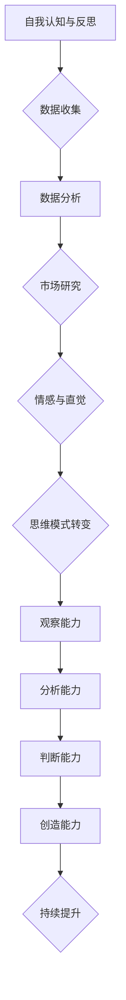
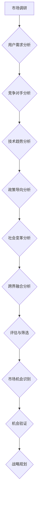
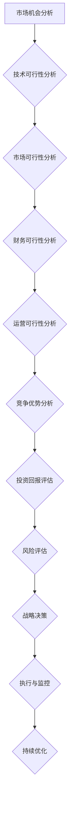

                 

### 文章标题

《洞察力与创业：发现市场机会的能力》

### 关键词

洞察力、创业、市场机会、数据分析、产品创新、竞争优势、风险评估、投资回报

### 摘要

本文深入探讨了洞察力在创业领域的重要性及其在实际应用中的具体表现。首先，我们定义了洞察力的概念，并分析了其在创业决策中的关键作用。接着，我们详细介绍了培养洞察力的方法，包括自我认知与反思、数据分析和市场研究、情感与直觉的运用以及思维模式的转变。随后，文章讨论了洞察力的核心能力，如观察能力、分析能力、判断能力和创造能力，并通过具体实例展示了这些能力的实际应用。在第二部分，文章转向创业与市场机会的关系，定义了创业的本质、市场机会的类型及其来源，并提出了评估创业项目的关键因素。最后，文章结合实际案例，分析了洞察力在创业过程中的应用及其对创业成功的重要性。通过本文，读者将了解到如何通过提升洞察力来发现和把握市场机会，从而在创业道路上更加顺利。

## 《洞察力与创业：发现市场机会的能力》目录大纲

### 第一部分：洞察力基础

#### 第1章：洞察力的概念与重要性

- **1.1 洞察力的定义**  
    - 探讨洞察力的基本含义，解释其作为认知和感知过程的特点。

- **1.2 洞察力的价值**  
    - 分析洞察力在决策制定、问题解决和创新过程中的重要性。

- **1.3 洞察力的作用领域**  
    - 讨论洞察力在不同行业和领域中的应用场景。

#### 第2章：洞察力培养的方法

- **2.1 自我认知与反思**  
    - 介绍自我认知的重要性，探讨如何通过反思提升洞察力。

- **2.2 数据分析与市场研究**  
    - 讲解数据分析方法在洞察力培养中的作用。

- **2.3 情感与直觉的运用**  
    - 探讨情感和直觉在洞察力培养中的应用。

- **2.4 思维模式的转变**  
    - 分析传统思维模式与现代思维模式的差异，探讨如何转变思维模式以提升洞察力。

#### 第3章：洞察力的核心能力

- **3.1 观察能力**  
    - 探讨观察能力在洞察力培养中的重要性，并提供提升观察能力的方法。

- **3.2 分析能力**  
    - 讨论分析能力在洞察力培养中的作用，介绍提升分析能力的技巧。

- **3.3 判断能力**  
    - 分析判断能力的重要性，探讨如何提升判断能力。

- **3.4 创造能力**  
    - 讨论创造能力在创业决策中的作用，提供培养创造能力的方法。

#### 第4章：洞察力的实际应用

- **4.1 市场机会的识别**  
    - 讲解如何通过洞察力识别市场机会。

- **4.2 产品创新的洞察**  
    - 探讨洞察力在产品创新过程中的应用。

- **4.3 竞争对手的分析**  
    - 分析如何运用洞察力对竞争对手进行评估。

- **4.4 客户需求的洞察**  
    - 探讨洞察力在了解客户需求方面的应用。

### 第二部分：创业与市场机会

#### 第5章：创业的本质

- **5.1 创业的定义**  
    - 分析创业的基本概念和定义。

- **5.2 创业的类型**  
    - 讨论不同类型的创业模式。

- **5.3 创业的风险与挑战**  
    - 分析创业过程中可能遇到的风险和挑战。

#### 第6章：市场机会的发现

- **6.1 市场机会的类型**  
    - 讨论市场机会的不同类型。

- **6.2 市场机会的来源**  
    - 分析市场机会的来源。

- **6.3 市场机会的评价与筛选**  
    - 探讨如何评估和筛选市场机会。

#### 第7章：创业项目的评估

- **7.1 创业项目的可行性分析**  
    - 讲解创业项目的可行性分析方法。

- **7.2 创业项目的竞争优势**  
    - 分析创业项目在市场竞争中的优势。

- **7.3 创业项目的投资回报**  
    - 讨论创业项目的投资回报评估。

#### 第8章：创业实践案例分析

- **8.1 案例一：基于洞察力发现市场机会的创业项目**  
    - 分析一个基于洞察力发现市场机会的创业案例。

- **8.2 案例二：通过洞察力提升产品竞争力的创业案例**  
    - 探讨如何通过洞察力提升产品竞争力。

- **8.3 案例三：洞察力在创业中的实战运用**  
    - 分析洞察力在创业过程中的实际应用。

### 第三部分：洞察力与创业的结合

#### 第9章：洞察力在创业过程中的应用

- **9.1 创业初期的洞察力应用**  
    - 讨论创业初期如何运用洞察力。

- **9.2 中期发展的洞察力应用**  
    - 分析创业项目中期如何运用洞察力。

- **9.3 成长期后的洞察力应用**  
    - 探讨成长期后的创业项目如何运用洞察力。

#### 第10章：洞察力提升与创业成功的关系

- **10.1 洞察力与创业成功的关系**  
    - 讨论洞察力对创业成功的影响。

- **10.2 洞察力提升的策略**  
    - 提供提升洞察力的策略和方法。

- **10.3 创业成功的关键因素**  
    - 分析创业成功的关键因素。

#### 第11章：创业者的洞察力培养与提升

- **11.1 创业者的角色与责任**  
    - 探讨创业者在创业过程中的角色和责任。

- **11.2 创业者洞察力的自我评估**  
    - 分析如何自我评估洞察力。

- **11.3 创业者洞察力的提升方法**  
    - 提供提升洞察力的方法。

#### 第12章：总结与展望

- **12.1 洞察力与创业的总结**  
    - 总结洞察力在创业中的应用和重要性。

- **12.2 未来市场机会的展望**  
    - 展望未来市场机会的发展趋势。

- **12.3 创业者的洞察力发展路径**  
    - 探讨创业者的洞察力发展路径。

### 附录

#### 附录A：洞察力与创业相关资源与工具

- **12.1 常用市场研究工具**  
    - 介绍常用的市场研究工具。

- **12.2 洞察力培养方法参考资料**  
    - 提供洞察力培养的相关参考资料。

- **12.3 创业者洞察力提升课程推荐**  
    - 推荐提升洞察力的相关课程。

#### 附录B：洞察力与创业 Mermaid 流程图

- **B.1 洞察力培养流程图**  
    - 介绍洞察力培养的流程。

- **B.2 市场机会发现流程图**  
    - 讲解市场机会发现的流程。

- **B.3 创业项目评估流程图**  
    - 分析创业项目评估的流程。

#### 附录C：核心算法原理伪代码

- **C.1 数据分析算法伪代码**  
    - 提供数据分析算法的伪代码。

- **C.2 市场研究算法伪代码**  
    - 介绍市场研究算法的伪代码。

- **C.3 创业项目评估算法伪代码**  
    - 分析创业项目评估算法的伪代码。

#### 附录D：数学模型与公式

- **D.1 数据分析数学模型**  
    - 讲解数据分析的数学模型。

- **D.2 市场研究数学模型**  
    - 介绍市场研究的数学模型。

- **D.3 创业项目评估数学模型**  
    - 分析创业项目评估的数学模型。

#### 附录E：创业实践案例代码解读与分析

- **E.1 案例一代码解读**  
    - 分析案例一的代码实现。

- **E.2 案例二代码解读**  
    - 解读案例二的代码实现。

- **E.3 案例三代码解读**  
    - 分析案例三的代码实现。

请注意，以上目录大纲为示例，具体内容可能需要根据实际书稿进行修改和调整。在编写书稿时，请确保每个章节都有详细的内容，包括核心概念与联系、核心算法原理讲解、数学模型和公式及详细讲解与举例说明、项目实战代码及其详细解释说明。

### 第一部分：洞察力基础

#### 第1章：洞察力的概念与重要性

在当今快速变化的世界中，洞察力已经成为一种至关重要的能力。它不仅影响着个人的职业发展，也在企业战略决策中起着关键作用。本章将首先定义洞察力，然后探讨其在创业决策中的价值，并分析其作用领域。

### 1.1 洞察力的定义

洞察力是一种深层次的认知能力，它涉及到对事物本质、内在联系和潜在趋势的敏锐感知与理解。与直觉和感知不同，洞察力不仅仅是表面现象的捕捉，而是能够透过现象看本质，发现隐含在复杂信息背后的规律和机会。

定义洞察力时，我们可以从以下几个方面进行描述：

1. **认知深度**：洞察力要求我们能够深入事物的内部，理解其运作机制和内在逻辑。
2. **信息处理**：它涉及到对大量信息的筛选、分析和综合，从而识别出有价值的模式和趋势。
3. **预见性**：洞察力能够帮助我们预见未来可能发生的变化和机会，做出前瞻性的决策。

### 1.2 洞察力的价值

洞察力在创业决策中具有极高的价值。首先，它能够帮助创业者识别市场机会，发现未被满足的客户需求。通过洞察力的运用，创业者可以更准确地把握市场趋势，从而开发出符合市场需求的产品或服务。

其次，洞察力在风险管理和战略规划中也发挥着重要作用。创业者可以利用洞察力来分析潜在的市场风险，制定应对策略，降低创业失败的风险。此外，洞察力还可以帮助创业者评估不同战略方案的实施可能性，从而选择最优的创业路径。

### 1.3 洞察力的作用领域

洞察力不仅在创业决策中具有重要价值，它在多个领域中也发挥着关键作用：

1. **商业战略**：通过洞察力，企业可以制定更具前瞻性和竞争力的商业战略。
2. **市场营销**：洞察力能够帮助市场人员更好地了解目标客户的需求，从而制定有效的市场推广策略。
3. **产品开发**：洞察力在产品开发过程中能够帮助团队发现创新的机会，提高产品竞争力。
4. **人力资源管理**：洞察力有助于企业识别和培养优秀的人才，提升整体团队实力。
5. **风险管理**：洞察力能够帮助企业和个人更有效地识别和管理风险。

通过以上分析，我们可以看到，洞察力不仅是创业者必备的能力，也是各个领域中取得成功的关键因素。接下来，我们将进一步探讨如何培养和提高洞察力。

### 2.1 自我认知与反思

自我认知是培养洞察力的第一步，它涉及到对自身认知、价值观和思维习惯的深入理解。通过自我认知，创业者可以明确自己的优势和劣势，从而更好地利用自己的优势，弥补不足。

**2.1.1 自我认知的重要性**

自我认知在洞察力培养中具有重要意义。首先，它有助于创业者了解自己的价值观和信念，这些价值观和信念往往影响决策和行为。其次，自我认知可以帮助创业者识别自己的思维模式，发现并克服可能导致判断偏差的因素。最后，通过自我认知，创业者可以更好地理解自己的行为动机，从而在面临复杂问题时做出更明智的决策。

**2.1.2 如何进行自我认知**

进行自我认知的方法包括以下几个方面：

1. **反思日记**：通过记录日常反思日记，创业者可以回顾自己的行为和决策，分析其背后的原因和影响。
2. **心理测试**：使用专业心理测试工具，如MBTI（迈尔斯-布里格斯性格类型指标）和DISC（行为风格测评），可以帮助创业者了解自己的性格特征和偏好。
3. **反馈机制**：收集来自同事、朋友和客户的反馈，有助于创业者从不同角度了解自己，发现潜在的盲点。
4. **自我挑战**：通过设定挑战性目标，如学习新技能或承担新的工作任务，创业者可以主动探索自己的能力边界，提高自我认知。

**2.1.3 反思在洞察力培养中的作用**

反思是洞察力培养的重要工具，它通过以下方式发挥作用：

1. **经验积累**：通过反思，创业者可以系统地总结经验，将零散的知识点整合成有价值的洞见。
2. **问题解决**：反思有助于创业者识别和解决自身存在的问题，从而提升决策质量和执行力。
3. **创新能力**：反思可以激发创业者的创新思维，帮助他们在面对新问题时找到创造性的解决方案。
4. **情绪管理**：反思有助于创业者更好地管理情绪，减少因情绪波动导致的错误决策。

通过自我认知与反思，创业者可以逐步提升自己的洞察力，为创业成功奠定坚实的基础。接下来，我们将探讨数据分析和市场研究在洞察力培养中的应用。

### 2.2 数据分析与市场研究

数据分析和市场研究是洞察力培养的重要手段，通过系统化地收集、处理和分析数据，创业者可以更准确地了解市场动态和客户需求，从而做出更为明智的决策。

**2.2.1 数据分析的基本方法**

数据分析通常包括以下基本步骤：

1. **数据收集**：从各种来源收集相关数据，包括公开数据、市场调查和内部数据。
2. **数据清洗**：清洗数据，去除重复、错误或不完整的数据，保证数据质量。
3. **数据整理**：将清洗后的数据进行分类、归档和编码，以便后续分析。
4. **数据分析**：使用统计方法、机器学习算法等工具对数据进行分析，提取有价值的信息。
5. **数据可视化**：通过图表、仪表盘等可视化工具展示分析结果，帮助创业者直观理解数据。

**2.2.2 数据分析在洞察力培养中的应用**

1. **市场趋势分析**：通过分析历史数据和市场报告，创业者可以识别出市场趋势和潜在机会。
2. **客户需求分析**：通过客户反馈和行为数据，创业者可以了解客户的需求和偏好，优化产品和服务。
3. **竞争对手分析**：通过分析竞争对手的市场表现和战略，创业者可以找到自己的竞争优势和差异化策略。

**2.2.3 市场研究的流程和方法**

市场研究通常包括以下步骤：

1. **确定研究目标**：明确研究的目的和问题，确保研究的方向和范围。
2. **设计研究方法**：选择合适的研究方法，如问卷调查、深度访谈、焦点小组等。
3. **数据收集**：根据研究设计，通过线上或线下方式收集数据。
4. **数据分析**：对收集到的数据进行整理和分析，提取有价值的信息。
5. **撰写报告**：将分析结果形成报告，为创业决策提供依据。

市场研究的方法包括：

1. **定量研究**：通过问卷调查、实验等手段收集大量数据，进行统计分析。
2. **定性研究**：通过深度访谈、焦点小组等方法，深入了解目标群体的意见和需求。

**2.2.4 数据分析与市场研究对洞察力的提升**

1. **数据驱动决策**：通过数据分析和市场研究，创业者可以基于客观事实做出决策，减少主观偏见。
2. **发现市场机会**：数据分析可以帮助创业者识别未被满足的市场需求，发现潜在的商业机会。
3. **提高预测能力**：通过历史数据和趋势分析，创业者可以更准确地预测市场变化和客户需求。
4. **优化产品和服务**：基于客户需求和市场反馈，创业者可以持续改进产品和服务，提高市场竞争力。

通过数据分析和市场研究，创业者可以系统地收集和处理信息，提升洞察力，为创业成功奠定基础。接下来，我们将探讨情感与直觉在洞察力培养中的应用。

### 2.3 情感与直觉的运用

在洞察力培养中，情感与直觉同样扮演着重要的角色。情感和直觉不仅提供了逻辑思维之外的重要信息来源，还能增强决策的准确性和创造性。

**2.3.1 情感在洞察力中的作用**

情感作为人类认知过程的一部分，对洞察力有着不可忽视的作用。具体来说，情感在以下几个方面影响洞察力：

1. **增强感知**：情感可以增强人们对信息的感知能力，使他们在面对复杂问题时能够迅速捕捉到关键信息。
2. **影响判断**：情感会影响人们对信息的判断和评估，帮助他们快速识别潜在的威胁和机会。
3. **促进创造性**：积极的情感状态能够激发人们的创造性思维，帮助他们发现新颖的解决方案。

**2.3.2 直觉的运用**

直觉是另一种非理性的认知方式，它在许多决策中起着重要作用。直觉的特点包括快速、直接和基于经验的判断。以下是如何运用直觉来提升洞察力：

1. **快速反应**：直觉能够帮助创业者在瞬息万变的市场环境中迅速做出反应，抓住稍纵即逝的机会。
2. **基于经验**：直觉往往基于丰富的经验和知识，帮助创业者快速识别复杂问题中的关键因素。
3. **避免过度分析**：在决策过程中，直觉可以帮助创业者避免过度分析，减少不必要的犹豫和拖延。

**2.3.3 情感与直觉的融合**

将情感和直觉与逻辑思维相结合，可以形成更全面、准确的洞察力。以下是一些具体方法：

1. **反思与平衡**：在决策过程中，创业者可以定期反思自己的情感和直觉判断，确保它们与逻辑分析结果相平衡。
2. **情感管理**：通过情感管理技巧，如冥想和正念练习，创业者可以更好地控制自己的情绪，避免情感对决策的过度影响。
3. **跨学科融合**：创业者可以学习心理学、经济学和管理学等领域的知识，增强逻辑分析能力，同时保持直觉的敏锐性。

**2.3.4 情感与直觉在洞察力培养中的应用案例**

1. **创业决策**：在面临重要的创业决策时，创业者可以通过情感和直觉快速评估不同的选择，结合逻辑分析做出最优决策。
2. **市场判断**：通过情感和直觉，创业者可以更准确地判断市场趋势和客户需求，提前布局市场策略。
3. **问题解决**：在解决复杂问题时，创业者可以利用直觉快速找到可能的解决方案，再通过逻辑分析进行验证和优化。

情感和直觉在洞察力培养中具有独特的作用，它们与逻辑思维相结合，能够帮助创业者更全面地理解问题，做出更准确的判断。通过运用情感和直觉，创业者可以在激烈的市场竞争中保持敏锐的洞察力，从而取得成功。接下来，我们将探讨如何通过转变思维模式来提升洞察力。

### 2.4 思维模式的转变

在培养洞察力的过程中，转变思维模式是一个关键步骤。传统思维模式往往侧重于逻辑和分析，但在面对复杂和多变的问题时，这种模式可能显得过于局限。因此，我们需要通过以下几种方式来转变思维模式，以提升洞察力。

**2.4.1 扁平化思维**

扁平化思维强调去中心化、开放式和协作性的思维方式。在创业过程中，扁平化思维有助于打破传统的等级制度，促进团队之间的沟通和合作。具体方法包括：

1. **开放对话**：鼓励团队成员畅所欲言，自由表达观点和意见。
2. **跨部门合作**：打破部门壁垒，促进不同部门之间的信息共享和资源整合。
3. **透明化管理**：通过公开透明的管理方式，增强团队对决策过程的理解和参与度。

**2.4.2 系统思维**

系统思维关注整体性和动态性，强调从系统的角度理解和解决问题。在洞察力的培养中，系统思维有助于我们更全面地分析问题，识别其中的复杂关系。具体方法包括：

1. **整体分析**：在分析问题时，不仅要关注局部，还要考虑整体的影响。
2. **因果关系分析**：识别不同因素之间的因果关系，从而找到问题的根源。
3. **动态模拟**：通过模拟不同情境下的系统行为，预测未来的变化趋势。

**2.4.3 创造性思维**

创造性思维强调创新和独特的解决方案，它有助于我们在面对挑战时找到突破性的思路。以下是一些培养创造性思维的方法：

1. **思维导图**：通过绘制思维导图，将思路可视化，激发创造性思维。
2. **头脑风暴**：组织团队进行头脑风暴，鼓励产生大量创新想法。
3. **跨界合作**：与来自不同领域的人才合作，通过跨界的视角激发创新思维。

**2.4.4 系统思维与创造性思维的结合**

将系统思维和创造性思维结合起来，可以形成更强大的洞察力。以下是一种结合的方法：

1. **系统分析**：首先运用系统思维对问题进行深入分析，识别其中的关键因素和关系。
2. **创造性探索**：在理解问题的基础上，运用创造性思维寻找创新的解决方案。
3. **迭代优化**：通过反复迭代，不断优化解决方案，使其更具实用性和可行性。

通过转变思维模式，创业者可以更全面、更深刻地理解问题，从而提升洞察力。扁平化思维、系统思维和创造性思维为我们提供了不同的视角和方法，它们相互补充，共同助力创业者在复杂多变的环境中做出更明智的决策。接下来，我们将探讨洞察力的核心能力，包括观察能力、分析能力、判断能力和创造能力。

### 3.1 观察能力

观察能力是洞察力的基础，它指的是我们捕捉和解释信息的能力。在创业过程中，敏锐的观察能力可以帮助创业者发现市场机会、识别潜在风险，并理解客户需求。

**3.1.1 观察能力的重要性**

观察能力对于创业者来说至关重要。首先，它能够帮助创业者快速识别市场变化，捕捉到潜在的商业机会。例如，通过观察消费者的购物习惯和偏好，创业者可以及时调整产品策略，满足市场需求。其次，观察能力有助于创业者识别竞争对手的策略和动向，从而制定相应的应对措施，保持竞争优势。

**3.1.2 如何提升观察能力**

要提升观察能力，可以采取以下方法：

1. **多角度观察**：在观察问题时，不仅要关注表面现象，还要深入挖掘背后的原因和潜在趋势。通过多角度观察，可以更全面地理解问题。
2. **培养好奇心**：好奇心是提升观察能力的重要动力。创业者应该保持对新事物和新知识的好奇，不断探索和提问。
3. **系统化观察**：通过建立观察体系，系统性地收集和分析信息，可以提高观察的准确性和系统性。

**3.1.3 观察能力在创业中的应用**

观察能力在创业中的应用非常广泛，以下是一些具体案例：

1. **市场机会识别**：通过观察市场动态和客户需求，创业者可以识别出潜在的市场机会，并迅速抓住这些机会。
2. **风险识别**：敏锐的观察能力可以帮助创业者及时发现潜在的风险，从而采取预防措施，降低创业失败的概率。
3. **客户需求理解**：创业者通过观察客户的行为和反馈，可以更准确地理解客户需求，从而优化产品和服务。

通过提升观察能力，创业者可以更有效地发现市场机会、识别风险，并满足客户需求，从而在竞争激烈的市场中取得成功。接下来，我们将探讨分析能力在洞察力培养中的作用。

### 3.2 分析能力

分析能力是洞察力的核心能力之一，它指的是我们对信息进行系统化分析和解释的能力。在创业过程中，强大的分析能力可以帮助创业者从海量信息中提取关键信息，做出明智的决策。

**3.2.1 分析能力的重要性**

分析能力在创业决策中至关重要。首先，通过分析，创业者可以更准确地了解市场和竞争对手的情况，从而制定有效的战略。其次，分析能力有助于创业者评估创业项目的可行性，识别潜在的风险和机会。最后，分析能力还能够帮助创业者优化运营流程，提高资源利用率。

**3.2.2 分析能力的培养方法**

要提升分析能力，可以采取以下方法：

1. **学习分析工具和方法**：掌握常用的分析工具和方法，如SWOT分析、PEST分析、5W2H分析法等，这些工具可以帮助创业者更系统地分析和解决问题。
2. **培养批判性思维**：批判性思维是分析能力的重要组成部分。创业者应该学会质疑和挑战现有的观点，通过逻辑推理和分析找到问题的本质。
3. **实践经验**：通过实际操作和项目经验，创业者可以不断提高分析能力。在实践中，创业者需要不断面对新问题，通过分析找到解决方案。

**3.2.3 分析能力在创业中的应用**

分析能力在创业中的应用非常广泛，以下是一些具体案例：

1. **市场分析**：通过市场分析，创业者可以了解市场趋势、客户需求和竞争对手情况，从而制定更有针对性的市场策略。
2. **项目评估**：在创业过程中，创业者需要不断评估项目的可行性，分析潜在风险和回报，确保项目能够顺利进行。
3. **运营优化**：通过分析运营数据，创业者可以识别出运营中的问题和瓶颈，采取优化措施，提高运营效率。

通过提升分析能力，创业者可以更全面、深入地理解创业环境，做出更为明智的决策。接下来，我们将探讨判断能力在洞察力培养中的作用。

### 3.3 判断能力

判断能力是洞察力的关键组成部分，它指的是我们在分析信息后做出决策和选择的能力。在创业过程中，强大的判断能力可以帮助创业者迅速应对市场变化，抓住机遇，规避风险。

**3.3.1 判断能力的重要性**

判断能力在创业决策中起着至关重要的作用。首先，它决定了创业者能否在复杂的市场环境中做出快速、准确的决策。其次，判断能力有助于创业者从众多选择中找到最佳方案，确保创业项目的成功。最后，判断能力还能够帮助创业者应对突发事件，灵活调整战略，保持企业的竞争力。

**3.3.2 如何提升判断能力**

要提升判断能力，可以采取以下方法：

1. **经验积累**：通过积累丰富的实践经验，创业者可以培养出更为敏锐的判断力。经验可以帮助创业者更好地理解市场动态和客户需求，从而做出更为准确的判断。
2. **数据分析**：数据分析是提升判断能力的重要工具。通过分析历史数据和趋势，创业者可以更准确地预测市场变化，从而做出更为明智的决策。
3. **心理素质**：良好的心理素质有助于创业者保持冷静和清晰的头脑，在面对压力和挑战时做出理性判断。

**3.3.3 判断能力在创业中的应用**

判断能力在创业中的应用非常广泛，以下是一些具体案例：

1. **市场定位**：通过判断能力，创业者可以准确判断市场需求和趋势，从而制定合适的市场定位策略。
2. **资源分配**：在有限的资源下，创业者需要通过判断能力确定哪些领域需要优先投入，以确保资源利用最大化。
3. **应对风险**：在创业过程中，创业者需要不断评估风险，通过判断能力及时调整战略，规避潜在风险。

通过提升判断能力，创业者可以更高效地应对市场变化，抓住机遇，实现创业目标。接下来，我们将探讨创造能力在洞察力培养中的作用。

### 3.4 创造能力

创造能力是洞察力的关键组成部分，它指的是我们在现有资源和条件下，通过创新思维和行动创造出新价值的能力。在创业过程中，强大的创造能力可以帮助创业者开发出独特的产品和服务，满足市场需求，从而在竞争激烈的市场中脱颖而出。

**3.4.1 创造能力的重要性**

创造能力在创业中具有至关重要的意义。首先，它决定了创业者能否在市场中找到新的机会，开发出独特的解决方案。其次，创造能力有助于创业者打造有竞争力的产品和服务，满足消费者的多样化需求。最后，创造能力还能够帮助创业者应对变化，持续创新，保持企业的活力和竞争力。

**3.4.2 如何提升创造能力**

要提升创造能力，可以采取以下方法：

1. **思维训练**：通过思维训练，如联想思维、逆向思维、发散思维等，培养创造性思维。这些方法可以帮助创业者跳出传统思维框架，寻找创新的解决方案。
2. **跨学科学习**：跨学科学习可以拓宽创业者的知识面，提供更多的视角和思路，从而激发创造能力。
3. **实践探索**：通过实际操作和项目实践，创业者可以不断尝试新的想法和方法，从中学习并提高创造能力。

**3.4.3 创造能力在创业中的应用**

创造能力在创业中的应用非常广泛，以下是一些具体案例：

1. **产品创新**：通过创造能力，创业者可以开发出具有独特功能或设计的产品，满足市场的需求。
2. **商业模式创新**：创业者可以通过创造能力，设计出新的商业模式，从而在市场中获得竞争优势。
3. **品牌建设**：通过创造能力，创业者可以打造独特的品牌形象，提升品牌价值和知名度。

通过提升创造能力，创业者可以在激烈的市场竞争中不断创新，开发出符合市场需求的产品和服务，从而实现创业成功。接下来，我们将探讨如何通过洞察力识别市场机会。

### 4.1 市场机会的识别

识别市场机会是创业成功的关键步骤之一。市场机会的识别不仅要求创业者具备敏锐的观察能力，还需要通过数据分析、市场研究和客户反馈等多方面手段，找到潜在的商业机会。

**4.1.1 市场机会的概念**

市场机会指的是在现有市场中未被满足的客户需求或尚未被充分开发的市场潜力。市场机会可以来自于以下几个方面：

1. **需求变化**：随着社会和技术的发展，消费者的需求不断变化，新的需求为创业者提供了市场机会。
2. **技术进步**：新技术的出现可以带来新的商业模式和应用场景，为创业者提供创新机会。
3. **市场空白**：在某些细分市场中，可能存在未被满足的需求或竞争较少的市场空间。
4. **政策变化**：政府政策的调整和新的法律法规的出台，也可能为创业者带来市场机会。

**4.1.2 市场机会识别的方法**

1. **需求调研**：通过问卷调查、深度访谈和焦点小组等方法，了解客户的需求和痛点，识别未被满足的需求。
2. **竞争分析**：通过分析竞争对手的产品、服务和市场策略，找到自身的竞争优势和差异化点。
3. **趋势分析**：通过市场趋势分析，如消费者行为分析、行业报告和趋势预测，发现潜在的市场机会。
4. **技术跟踪**：关注新技术的发展动态，评估其对市场和业务模式的影响，提前布局。

**4.1.3 市场机会识别的应用案例**

1. **需求驱动的创新**：例如，随着健康意识的提高，创业者可以识别出健康食品和营养补充剂的市场需求，开发相应的产品。
2. **技术驱动的创新**：例如，随着物联网和智能家居技术的发展，创业者可以开发智能家居控制系统，满足消费者对智能化家居的需求。
3. **市场空白识别**：例如，在某些地区，在线教育市场尚未完全开发，创业者可以在这个市场空白中找到机会，提供在线教育服务。

通过系统化的市场机会识别方法，创业者可以更准确地把握市场动态，找到具有潜力的商业机会，为创业成功奠定基础。接下来，我们将探讨如何通过洞察力进行产品创新。

### 4.2 产品创新的洞察

产品创新是创业成功的关键驱动力之一。通过洞察力，创业者可以深入理解市场需求和趋势，从而开发出具有竞争力的产品和服务。以下是产品创新的一些关键步骤和策略。

**4.2.1 市场需求分析**

在产品创新过程中，首先需要深入了解市场需求。这可以通过以下方法实现：

1. **用户调研**：通过问卷调查、用户访谈和焦点小组等方式，收集用户反馈，了解他们对现有产品的不满和期望。
2. **竞品分析**：分析竞争对手的产品特性、优缺点和市场表现，从中发现市场需求和改进空间。
3. **趋势预测**：研究市场趋势和未来发展方向，如技术进步、消费者行为变化等，预测未来市场需求。

**4.2.2 创新思维方法**

创新思维方法可以帮助创业者产生新颖的产品构思。以下是一些常用的创新思维方法：

1. **头脑风暴**：通过集体讨论，自由发挥创意，产生大量的创新点子。
2. **跨界思维**：结合不同领域的知识和技术，寻找创新的解决方案。
3. **思维导图**：通过绘制思维导图，将不同的创意和想法可视化，帮助整理思路。
4. **快速原型**：快速构建产品原型，通过用户测试和反馈，不断迭代和优化产品。

**4.2.3 技术与创新的结合**

技术在产品创新中扮演着重要角色。创业者需要关注新技术的发展动态，将其与产品创新相结合：

1. **物联网技术**：利用物联网技术，实现产品的智能化和网络化，提升用户体验。
2. **人工智能**：通过人工智能技术，如机器学习和自然语言处理，为产品增加智能化的功能。
3. **新材料**：探索新材料的应用，为产品提供更优的性能和设计。

**4.2.4 案例分析**

以下是一个产品创新的案例分析：

**案例：智能健康手环**

随着健康意识的提升，智能健康手环市场需求逐渐增加。一家初创公司通过以下步骤进行产品创新：

1. **市场需求分析**：通过用户调研和竞品分析，发现用户对智能健康手环的需求主要集中在运动追踪、健康数据和睡眠监测等方面。
2. **创新构思**：结合物联网技术和人工智能，该初创公司决定开发一款具备实时心率监测、睡眠分析和个性化建议功能的智能健康手环。
3. **原型制作**：快速构建产品原型，并通过用户测试不断优化功能。
4. **市场推广**：通过社交媒体和线下渠道推广产品，吸引目标用户。

通过洞察力的运用，这家初创公司成功地开发出了一款具有竞争力的智能健康手环，并在市场中取得了良好的反响。通过以上案例分析，我们可以看到，通过洞察力的深入分析和创新思维的运用，创业者可以开发出满足市场需求的产品，从而实现创业成功。接下来，我们将探讨如何通过洞察力分析竞争对手。

### 4.3 竞争对手的分析

在创业过程中，分析竞争对手是至关重要的环节。通过深入了解竞争对手的市场策略、产品特点和竞争优势，创业者可以制定更有针对性的市场策略，提升自身的竞争力。

**4.3.1 竞争对手分析的重要性**

1. **市场定位**：通过分析竞争对手的市场定位，创业者可以了解自己的产品或服务在市场中的位置，找到差异化点。
2. **产品策略**：了解竞争对手的产品特点、功能和定价策略，有助于创业者优化自身产品，提升市场竞争力。
3. **营销手段**：分析竞争对手的营销手段和推广活动，可以帮助创业者制定更具吸引力的营销策略。
4. **竞争优势**：通过分析竞争对手的优势，创业者可以找到自身的劣势，并采取相应措施提升自身竞争力。

**4.3.2 竞争对手分析的方法**

1. **市场调研**：通过市场调研，收集竞争对手的产品信息、市场份额和用户反馈，了解其在市场中的表现。
2. **竞品分析**：详细分析竞争对手的产品特性、优缺点和用户评价，从中找到自身的优势和劣势。
3. **用户调查**：通过用户调查，了解目标用户对竞争对手产品的满意度和需求，从而为产品优化提供依据。
4. **社交媒体分析**：通过社交媒体分析，跟踪竞争对手的营销活动和用户互动，了解其在社交媒体上的影响力。

**4.3.3 竞争对手分析的案例分析**

以下是一个关于竞争对手分析的案例分析：

**案例：在线教育平台竞争分析**

一家初创在线教育平台希望进入竞争激烈的市场，以下是该平台如何通过竞争对手分析来制定市场策略：

1. **市场调研**：通过市场调研，收集主要竞争对手的产品信息、用户评价和市场占有率。调研结果显示，现有的主要竞争对手包括传统的线上教育平台和新兴的教育科技企业。

2. **竞品分析**：分析竞争对手的产品特点，如课程内容、授课方式、互动功能和用户评价。发现大部分竞争对手在课程内容和互动功能上存在一定局限性，用户体验有待提升。

3. **用户调查**：通过用户调查，了解目标用户对现有平台的不满和需求。调查结果显示，用户普遍希望有更多个性化定制课程和实时互动功能。

4. **社交媒体分析**：通过社交媒体分析，发现竞争对手在推广方面主要依靠广告和用户口碑，而新兴教育科技企业则更注重社交媒体互动和用户社区建设。

基于以上分析，该在线教育平台决定采取以下策略：

1. **差异化定位**：针对竞争对手的局限性，该平台决定专注于个性化定制课程和实时互动功能，提供独特的用户体验。
2. **优化产品功能**：根据用户需求，平台增加了个性化课程推荐和实时互动功能，提升用户体验。
3. **社交媒体营销**：通过社交媒体互动和用户社区建设，提高品牌知名度和用户黏性。
4. **精准营销**：通过数据分析，制定精准的营销策略，针对目标用户进行定向推广。

通过深入分析竞争对手，该在线教育平台成功找到了市场定位和差异化点，并在激烈的市场竞争中脱颖而出，实现了业务的快速增长。通过以上案例，我们可以看到，竞争对手分析对于制定有效市场策略和提升竞争力具有重要意义。接下来，我们将探讨如何通过洞察力了解客户需求。

### 4.4 客户需求的洞察

在创业过程中，准确理解客户需求是成功的关键。通过洞察力，创业者可以深入了解客户的痛点和需求，从而开发出满足市场需求的创新产品和服务。

**4.4.1 客户需求洞察的重要性**

理解客户需求是创业成功的基石。客户需求的洞察有助于创业者：

1. **精准定位市场**：通过深入了解客户需求，创业者可以明确目标市场，避免盲目跟风，确保产品或服务的市场定位准确。
2. **优化产品设计**：了解客户需求可以帮助创业者优化产品设计，提升用户体验，增加客户满意度。
3. **制定营销策略**：根据客户需求制定有效的营销策略，提高市场推广的效果。
4. **提高客户粘性**：满足客户需求的创新产品和服务可以增强客户粘性，提高客户忠诚度。

**4.4.2 客户需求洞察的方法**

1. **用户调研**：通过问卷调查、访谈和焦点小组等方式，收集客户的反馈和意见，了解他们的需求和痛点。
2. **行为分析**：通过分析客户的行为数据，如购买记录、搜索习惯和互动行为，洞察客户的偏好和需求。
3. **竞品分析**：通过分析竞争对手的产品和服务，了解客户对现有解决方案的反应和评价，从中发现客户未被满足的需求。
4. **市场趋势研究**：研究市场趋势和未来发展方向，预测客户需求的变化。

**4.4.3 案例分析**

以下是一个关于客户需求洞察的案例分析：

**案例：共享单车市场**

随着城市交通拥堵问题的日益严重，共享单车成为了解决“最后一公里”出行难题的有效方式。某共享单车公司通过以下方法进行客户需求洞察：

1. **用户调研**：通过在线问卷和线下访谈，了解用户对共享单车的使用频率、出行需求和满意度。调研结果显示，用户对共享单车的便捷性、价格和车辆维护提出了较高的要求。

2. **行为分析**：分析用户的骑行记录和支付数据，发现用户主要在上班途中、购物和休闲时使用共享单车，这为公司的市场推广和运营策略提供了重要依据。

3. **竞品分析**：通过对比竞争对手的产品和服务，发现一些用户对现有共享单车的设计和用户体验存在不满，如车辆质量差、解锁不便等。

4. **市场趋势研究**：研究市场趋势，发现随着环保意识的提高，电动单车和智能锁的市场需求逐渐增加。

基于以上分析，该公司采取了以下措施：

1. **优化产品设计**：提升车辆质量和用户体验，增加智能锁功能，提高用户的满意度。
2. **精准营销**：根据用户的出行时间和地点，进行定向营销，提高市场推广效果。
3. **拓展业务范围**：推出电动单车和智能锁，满足市场需求，扩大用户群体。

通过深入洞察客户需求，该共享单车公司成功提升了用户体验，增加了市场份额，实现了业务的快速发展。以上案例展示了通过客户需求洞察来制定产品和服务策略的重要性。接下来，我们将探讨创业的本质。

### 5.1 创业的定义

创业是一种有目的性的活动，旨在通过创造新的产品、服务或商业模式来满足市场需求，并实现创业者的个人目标和经济收益。创业不仅包括新企业的建立，还涉及到现有企业的转型和拓展。以下是对创业的详细定义和探讨。

**5.1.1 创业的内涵**

创业的内涵可以从以下几个方面进行理解：

1. **创新**：创业本质上是创新的过程，包括技术、商业模式、管理方法等多方面的创新。创新是创业的核心驱动力，通过创新，创业者可以创造出新的价值，满足市场的需求。

2. **风险**：创业伴随着较高的风险。由于市场的不确定性、资源限制和竞争压力，创业过程中可能会遇到各种挑战。创业者需要具备应对风险的能力，才能在激烈的市场竞争中生存和发展。

3. **机会**：创业也是发现和把握市场机会的过程。创业者通过敏锐的洞察力和市场研究，能够发现未被满足的需求或市场空白，从而抓住机遇，实现商业成功。

4. **自组织**：创业通常是一个自组织的过程，创业者需要自主组织和协调资源，包括资金、人才、技术等，以实现创业目标。

**5.1.2 创业的类型**

创业可以分为多种类型，以下是一些主要的创业类型：

1. **技术创新型创业**：这种类型的创业侧重于通过技术创新来创造新的产品或服务。典型例子包括高科技企业、生物科技公司等。

2. **商业模式创新型创业**：这类创业通过创新商业模式来创造价值，例如电子商务、共享经济等。它们通常不依赖于技术创新，但通过重新定义市场规则来获得竞争优势。

3. **社会创业**：社会创业旨在解决社会问题，通过商业手段实现社会价值。这种类型的创业注重社会效益，如环保、教育、医疗等领域。

4. **企业转型**：企业转型指的是现有企业通过改变商业模式、产品或服务，以适应市场变化和竞争压力。转型成功的企业可以在新的市场中获得新的增长机遇。

**5.1.3 创业的动机**

创业者进行创业的动机多种多样，以下是一些常见的动机：

1. **追求自由**：许多创业者选择创业是为了获得更大的自由，包括工作时间的自由、工作地点的自由和决策的自由。

2. **实现梦想**：创业者希望通过创业实现自己的梦想和愿景，将创新的想法转化为现实。

3. **追求财富**：财富是创业的重要驱动力，许多创业者希望通过创业获得经济上的成功。

4. **解决社会问题**：一些创业者希望通过创业来解决社会问题，实现社会价值。

5. **追求成就感**：创业者希望通过创业证明自己的能力，获得成就感和自我实现。

通过理解创业的定义、内涵、类型和动机，创业者可以更好地把握创业的本质，制定有效的创业策略。接下来，我们将探讨不同类型的创业，包括技术创新型、商业模式创新型和知识密集型创业。

### 5.2 创业的类型

创业的形式多种多样，不同类型的创业有着各自的特点和挑战。以下将详细介绍几种主要的创业类型，包括技术创新型、商业模式创新型和知识密集型创业。

**5.2.1 技术创新型创业**

技术创新型创业是指通过技术创新来创造新产品的创业活动。这种类型的创业通常涉及高科技领域，如人工智能、生物科技、新能源等。技术创新型创业的特点包括：

1. **高风险、高回报**：技术创新往往需要大量的研发投入和长期的技术积累，因此风险较高。然而，一旦成功，技术创新可以带来巨大的市场回报。

2. **高投入、高成本**：技术型创业通常需要大量资金支持研发和设备投入，以及专业人才的招聘和培养。

3. **长期性**：技术创新型创业需要较长时间来验证技术可行性，并实现商业化应用。

案例：特斯拉（Tesla）是一家以电动汽车和能源存储技术为核心的创新公司。特斯拉通过自主研发的电池技术、自动驾驶技术和智能充电系统，成功颠覆了传统的汽车行业，成为全球新能源汽车的领军企业。

**5.2.2 商业模式创新型创业**

商业模式创新型创业是指通过创新商业模式来创造价值，而不是依赖于技术创新。这类创业活动通常在传统行业中发挥作用，通过重新定义市场规则来实现商业成功。商业模式创新型创业的特点包括：

1. **低成本、快速迭代**：商业模式创新往往不需要大量的技术投入，可以快速进行市场验证和迭代。

2. **高灵活性和适应性**：商业模式创新型创业可以根据市场变化快速调整战略和运营模式。

3. **高竞争性**：由于商业模式创新可以迅速复制和推广，市场竞争通常较为激烈。

案例：Airbnb和Uber都是典型的商业模式创新型创业公司。Airbnb通过共享经济模式，将个人闲置的房屋资源转化为商业机会，改变了传统酒店行业。Uber通过移动互联网技术，创新了出租车服务模式，使得打车更加便捷。

**5.2.3 知识密集型创业**

知识密集型创业是指依赖于知识和专业技能来创造新价值。这类创业通常在咨询、教育、医疗、法律等领域中发挥作用。知识密集型创业的特点包括：

1. **高人才依赖性**：知识密集型创业通常需要高度专业化的知识和技能，人才是创业成功的关键。

2. **高附加值**：知识密集型创业通过提供专业的解决方案或服务，创造高附加值，满足客户特定需求。

3. **长期积累性**：知识密集型创业往往需要长时间的技术和经验积累，才能在市场中占据一席之地。

案例：康德乐（Kendrick）是一家提供专业法律咨询和服务的公司。通过其团队的专业知识和丰富的实践经验，康德乐为客户提供了高质量的法律解决方案，成为行业中的领导者。

不同类型的创业各有其优势和挑战。创业者应根据自身资源和优势选择合适的创业类型，并制定相应的创业策略。接下来，我们将探讨创业过程中可能遇到的风险和挑战。

### 5.3 创业的风险与挑战

创业过程中，风险和挑战是不可避免的。这些风险和挑战可能来自内部和外部，对创业者的决策和执行能力提出严峻考验。以下将详细分析创业过程中可能遇到的主要风险和挑战。

**5.3.1 资金风险**

资金风险是创业过程中最常见的风险之一。初创企业通常面临资金不足的问题，这可能导致以下问题：

1. **资金链断裂**：由于资金不足，企业可能无法按时支付员工工资、供应商货款和日常运营费用，最终导致资金链断裂。
2. **融资难度**：初创企业往往难以获得足够的融资支持，尤其是在经济不景气或市场竞争激烈的情况下。
3. **投资回报周期长**：一些技术型创业项目需要较长时间来验证技术和实现商业化，导致投资回报周期延长。

**5.3.2 市场风险**

市场风险指的是由于市场需求变化、竞争加剧或消费者偏好转移等因素，导致企业产品或服务的市场接受度下降。以下是一些市场风险：

1. **市场饱和**：当市场饱和时，新进入者可能难以找到足够的市场空间，导致竞争加剧。
2. **竞争对手**：强有力的竞争对手可能会通过价格战、技术创新或其他策略抢夺市场份额。
3. **消费者需求变化**：消费者需求的变化可能导致现有产品或服务失去市场吸引力，创业者需要不断调整产品和服务。

**5.3.3 技术风险**

技术风险是指由于技术问题，如研发失败、技术不成熟或无法实现商业化等，导致创业项目无法达到预期目标。以下是一些技术风险：

1. **研发失败**：技术研发过程复杂且充满不确定性，研发失败可能导致大量资金和时间浪费。
2. **技术不成熟**：即使研发成功，某些技术可能因不成熟而无法商业化，从而影响创业项目的实施。
3. **知识产权风险**：技术创新可能面临知识产权纠纷，如专利侵权等，这对企业的运营和发展构成潜在威胁。

**5.3.4 人才风险**

人才风险是指由于人才不足或团队管理不善，导致企业无法实现预期目标。以下是一些人才风险：

1. **人才流失**：高技能人才是创业企业的宝贵资源，人才流失可能导致企业创新能力和竞争力的下降。
2. **团队管理**：创业者需要具备团队管理能力，以保持团队的凝聚力和工作效率。
3. **人才短缺**：在某些行业或地区，高技能人才的短缺可能成为创业企业的瓶颈。

**5.3.5 运营风险**

运营风险是指由于运营管理不善，导致企业无法顺利运营的风险。以下是一些运营风险：

1. **供应链问题**：供应链的断裂或不稳定可能导致企业无法按时交付产品或服务。
2. **产品质量问题**：产品质量问题可能导致客户投诉和退货，影响企业的声誉和销售。
3. **法规风险**：不遵守相关法律法规可能导致企业面临法律诉讼和罚款，甚至影响企业的生存。

**5.3.6 战略风险**

战略风险是指由于战略决策失误，导致企业无法实现长期发展目标。以下是一些战略风险：

1. **市场定位错误**：错误的市场定位可能导致企业无法吸引目标客户，失去市场份额。
2. **战略决策延迟**：在市场竞争激烈的环境下，战略决策延迟可能导致企业错失市场机遇。
3. **战略方向错误**：错误的战略方向可能导致企业资源浪费，无法实现长期发展。

通过识别和应对这些风险和挑战，创业者可以更好地规划创业路径，降低失败的可能性。接下来，我们将探讨市场机会的类型及其来源。

### 6.1 市场机会的类型

市场机会是指市场中存在的尚未被满足或未被充分利用的需求，以及由此带来的商业潜力。市场机会可以分为以下几种主要类型：

**1. 新兴市场机会**

新兴市场机会通常出现在技术、消费习惯或社会结构发生重大变革的背景下。这种类型的市场机会通常伴随着新技术的出现和新兴行业的崛起。例如，随着物联网和人工智能技术的发展，智能家居和智能穿戴设备市场迅速增长。创业者可以通过关注新技术的发展和应用，发现并把握这些新兴市场机会。

**2. 空白市场机会**

空白市场机会指的是市场中存在的未被满足的需求或市场空白。这些需求可能由于技术限制、消费习惯、法律法规等因素而未被现有企业充分关注。例如，在一些偏远地区，由于交通不便，快递服务需求大但供给不足，这为创业者提供了进入市场的机会。通过填补这些市场空白，创业者可以创造新的商业模式和利润空间。

**3. 需求变化机会**

需求变化机会是由消费者需求的变化引起的。随着社会经济的发展和人们生活水平的提高，消费者的需求和偏好也在不断变化。例如，随着健康意识的增强，人们对健康食品、运动装备和健康服务的需求不断增加。创业者可以通过市场研究和消费者洞察，发现这些变化趋势，开发相应的产品和服务，满足市场需求。

**4. 竞争对手失误机会**

竞争对手失误机会是指由于竞争对手在战略、产品、服务或管理方面的失误，为其他企业提供了进入市场的机会。例如，当竞争对手的产品质量不佳或服务不到位时，消费者可能会转向其他品牌。创业者可以通过分析竞争对手的失误，找到市场切入点，提供更好的产品和服务，从而抓住这一机会。

**5. 社会变革机会**

社会变革机会是由社会结构、价值观、政策法规等重大变革带来的市场机会。这些变革可能引发新的市场需求或改变现有市场的格局。例如，随着环保意识的提高，政府对环保产品和技术的支持力度加大，创业者可以抓住这一机会，开发环保型产品或服务，满足市场需求。

**6. 跨界融合机会**

跨界融合机会是指不同行业、领域之间的融合和跨界合作带来的市场机会。这种类型的市场机会通常出现在技术进步和消费者需求多样化的背景下。例如，科技公司与消费品公司的跨界合作，开发出结合科技和消费体验的新产品，如智能手表、智能眼镜等。创业者可以通过跨界思维，将不同领域的知识和资源结合起来，创造新的商业模式和产品。

了解不同类型的市场机会，有助于创业者更加准确地把握市场动态，发现潜在的商机，从而制定有效的创业策略。接下来，我们将探讨市场机会的来源。

### 6.2 市场机会的来源

市场机会的产生来源于多种因素，理解这些因素对于创业者发现和把握市场机会至关重要。以下将详细探讨市场机会的主要来源。

**1. 消费者需求**

消费者需求是市场机会的根本来源。随着社会经济的发展和消费者生活水平的提高，消费者需求呈现出多样化和个性化的趋势。以下是一些通过消费者需求发现市场机会的途径：

- **需求调研**：通过问卷调查、用户访谈和焦点小组等方式，收集消费者的需求和反馈，了解他们对现有产品和服务的不满和期望。
- **趋势分析**：研究市场趋势和消费者行为的变化，预测未来可能出现的消费需求。
- **用户反馈**：倾听用户的反馈和建议，从中发现潜在的商机。

**案例**：随着健康意识的提升，消费者对健康食品和营养补充剂的需求增加。创业者可以关注这一趋势，开发符合市场需求的健康食品和营养补充剂。

**2. 技术进步**

技术的进步为市场带来了新的机会和变革。以下是通过技术进步发现市场机会的途径：

- **技术创新**：关注新技术的研发和应用，如人工智能、物联网、区块链等，这些技术可以带来新的商业模式和产品创新。
- **技术趋势**：研究技术发展的趋势和未来方向，预测哪些技术将带来市场机会。
- **技术融合**：探索不同技术的交叉应用，创造新的产品和解决方案。

**案例**：随着5G技术的普及，远程办公、在线教育和智能医疗等市场机会逐渐显现。创业者可以开发基于5G技术的远程办公工具、在线教育平台和智能医疗设备。

**3. 社会变革**

社会变革，包括政策、法律法规、文化价值观等的变化，都会影响市场需求和市场机会。以下是通过社会变革发现市场机会的途径：

- **政策导向**：关注政府的政策导向和法律法规变化，发现哪些行业或领域受到政策支持，可能带来市场机会。
- **社会趋势**：研究社会变革和价值观的变化，预测哪些趋势将影响消费者需求。
- **社会责任**：探索如何通过履行社会责任，创造新的市场机会。

**案例**：随着环保意识的提高，政府对环保产品和技术的支持力度加大。创业者可以开发环保型产品或服务，满足市场需求。

**4. 竞争对手**

竞争对手的失误或不足为其他企业提供了市场机会。以下是通过分析竞争对手发现市场机会的途径：

- **竞品分析**：研究竞争对手的产品、服务和市场策略，发现其优势和不足。
- **用户评价**：分析用户对竞争对手的评价和反馈，了解他们对现有产品的不满。
- **市场差异**：寻找市场差异点，通过提供差异化产品或服务，满足未被满足的市场需求。

**案例**：当竞争对手在产品质量或服务水平上存在不足时，创业者可以提供更高质量的产品和服务，吸引客户。

**5. 跨界融合**

跨界融合带来的市场机会往往来自于不同行业、领域之间的交叉和融合。以下是通过跨界融合发现市场机会的途径：

- **跨行业合作**：探索不同行业之间的合作机会，通过融合不同领域的知识和资源，创造新的商业模式和产品。
- **跨界创新**：将不同领域的创新思维和技术应用于现有行业，推动行业变革。
- **用户需求**：关注不同领域用户的共同需求，开发跨界的解决方案。

**案例**：科技公司与消费品公司的跨界合作，开发出结合科技和消费体验的新产品，如智能手表、智能眼镜等。

理解市场机会的来源，有助于创业者更全面地发现和把握商机，从而制定有效的创业策略。接下来，我们将探讨如何评估和筛选市场机会。

### 6.3 市场机会的评价与筛选

在发现市场机会后，创业者需要对这些机会进行评价和筛选，以确保投资和资源得到最有效的利用。以下将详细讨论市场机会的评价与筛选方法。

**1. 评价方法**

**1.1 SWOT分析**

SWOT分析是一种常用的市场机会评价方法，通过分析市场机会的优势（Strengths）、劣势（Weaknesses）、机会（Opportunities）和威胁（Threats），帮助创业者全面评估市场机会的潜在价值和风险。

- **优势**：市场机会是否与创业者的核心能力、资源和技术优势相匹配。
- **劣势**：市场机会可能带来的风险和挑战，以及创业者需要克服的障碍。
- **机会**：市场机会是否符合市场趋势和消费者需求，以及是否具有潜在的商业价值。
- **威胁**：市场机会可能面临的外部威胁，如竞争对手、政策变化等。

**1.2 成本-收益分析**

成本-收益分析是一种基于经济角度的评价方法，通过比较市场机会的潜在收益和所需成本，帮助创业者判断投资是否值得。

- **收益**：市场机会可能带来的直接和间接收益，如销售收入、市场份额等。
- **成本**：实现市场机会所需的投资成本，包括资金、人力资源、时间等。

**1.3 实现可能性分析**

实现可能性分析评估市场机会的可行性和实施难度，考虑创业者的资源、能力和市场环境。

- **资源**：创业者是否具备实现市场机会所需的资源，如资金、技术、人才等。
- **能力**：创业者是否具备实现市场机会所需的能力，如研发能力、市场开拓能力等。
- **市场环境**：市场环境是否有利于市场机会的实现，如竞争状况、政策支持等。

**2. 筛选方法**

**2.1 优先级排序**

通过SWOT分析、成本-收益分析和实现可能性分析，对市场机会进行优先级排序。优先考虑优势明显、风险较低、收益高且实现可能性大的市场机会。

**2.2 创业者目标匹配**

将市场机会与创业者的个人目标和资源进行匹配。创业者应优先选择与自身价值观、兴趣和技能相匹配的市场机会。

**2.3 实验验证**

在初步筛选后，进行实验验证，通过小规模市场测试或试点项目，验证市场机会的可行性和市场接受度。

**2.4 风险控制**

对筛选出的市场机会进行风险评估，制定风险控制措施，确保创业项目在实施过程中能够有效应对潜在风险。

通过以上评价与筛选方法，创业者可以更加科学和系统地评估市场机会，从而选择最具有潜力和可行性的市场机会，为创业成功奠定基础。接下来，我们将探讨创业项目的可行性分析。

### 7.1 创业项目的可行性分析

在评估市场机会之后，创业者需要进一步对创业项目进行可行性分析。可行性分析旨在评估创业项目在技术、市场、财务和运营等方面的可行性，确保创业项目能够顺利实施并取得成功。以下将详细讨论创业项目的可行性分析方法和关键要素。

**1. 技术可行性分析**

技术可行性分析主要评估创业项目所采用的技术是否成熟、可行，以及技术实现的可能性。

- **技术成熟度**：评估所采用技术的成熟程度，包括研发进度、技术水平、技术标准等。
- **技术实现难度**：评估技术实现的难度，包括研发周期、技术瓶颈、所需资源等。
- **技术依赖性**：分析项目对关键技术的依赖程度，以及技术变化可能带来的影响。

**案例**：假设创业项目是一个基于人工智能的智能家居系统。技术可行性分析将包括对人工智能技术的成熟度、智能家居系统实现的难度以及技术依赖性的评估。

**2. 市场可行性分析**

市场可行性分析主要评估创业项目在市场中的可行性，包括市场需求、市场规模、竞争状况等。

- **市场需求**：分析目标市场的需求，了解消费者对产品或服务的需求和偏好。
- **市场规模**：评估目标市场的规模和增长潜力，确保市场足够大以支持创业项目的长期发展。
- **竞争状况**：分析竞争对手的市场份额、产品特点和市场策略，评估创业项目的竞争优势。

**案例**：假设创业项目是一款面向老年人的健康管理应用。市场可行性分析将包括对老年人健康管理市场需求的评估、市场规模的增长潜力以及竞争对手的市场策略。

**3. 财务可行性分析**

财务可行性分析主要评估创业项目的财务状况，包括成本结构、盈利模式、资金需求等。

- **成本结构**：分析创业项目的成本构成，包括固定成本、变动成本和运营成本等。
- **盈利模式**：评估创业项目的盈利能力，包括收入来源、利润率、投资回报周期等。
- **资金需求**：评估创业项目所需的初始资金、后续融资需求以及资金周转情况。

**案例**：假设创业项目是一个健康食品品牌。财务可行性分析将包括对生产成本、销售收入、利润率和投资回报周期的评估。

**4. 运营可行性分析**

运营可行性分析主要评估创业项目在运营方面的可行性，包括供应链管理、人力资源管理、市场推广等。

- **供应链管理**：评估创业项目的供应链管理能力，包括供应商选择、采购流程、库存管理等。
- **人力资源管理**：评估创业项目的人力资源需求，包括员工招聘、培训、激励等。
- **市场推广**：评估创业项目的市场推广策略，包括品牌定位、营销渠道、广告投放等。

**案例**：假设创业项目是一家在线教育平台。运营可行性分析将包括对供应链管理、人力资源管理和市场推广策略的评估。

**5. 综合评价**

在完成各项可行性分析后，创业者需要对创业项目进行综合评价。综合评价应考虑技术、市场、财务和运营等多个方面的因素，确保创业项目的整体可行性。

通过全面的可行性分析，创业者可以更加科学地评估创业项目的可行性和潜在风险，制定有效的创业策略，为创业成功奠定基础。接下来，我们将探讨创业项目的竞争优势。

### 7.2 创业项目的竞争优势

在竞争激烈的市场环境中，创业项目需要具备独特的竞争优势，才能在众多竞争者中脱颖而出。竞争优势是指创业项目在资源、能力、市场策略等方面相较于竞争对手所具有的优势，这些优势可以帮助企业获得更高的市场份额和盈利能力。以下将详细探讨创业项目的竞争优势及其构建方法。

**1. 资源优势**

资源优势是指创业项目在关键资源方面的独特优势，包括资金、技术、人才、品牌等。以下是构建资源优势的方法：

- **资金优势**：通过获得风险投资、政府补贴或个人资金，确保项目有充足的资金支持。
- **技术优势**：通过自主研发或技术合作，掌握核心技术或专利，形成技术壁垒。
- **人才优势**：通过招聘高素质人才，建立高效的团队，提升企业的创新能力和执行力。
- **品牌优势**：通过品牌建设和市场推广，提高品牌知名度和美誉度，吸引更多客户。

**案例**：假设创业项目是一家生物科技企业，通过自主研发的基因编辑技术，掌握核心知识产权，形成了显著的技术优势。

**2. 能力优势**

能力优势是指创业项目在核心能力方面的独特优势，包括研发能力、生产能力、市场开拓能力等。以下是构建能力优势的方法：

- **研发能力**：通过持续的技术研发和创新，不断提高产品的技术含量和性能，满足市场需求。
- **生产能力**：通过优化生产流程和提高生产效率，降低成本，确保产品的高质量和快速交付。
- **市场开拓能力**：通过有效的市场推广和销售策略，迅速占领市场，扩大市场份额。

**案例**：假设创业项目是一家智能穿戴设备公司，通过自主研发的高精度传感器和先进算法，提升了产品的性能和用户体验，形成了显著的能力优势。

**3. 策略优势**

策略优势是指创业项目在市场策略和运营模式方面的独特优势，包括差异化策略、创新策略、合作策略等。以下是构建策略优势的方法：

- **差异化策略**：通过提供独特的产品或服务，满足消费者的特定需求，形成市场差异化。
- **创新策略**：通过创新的商业模式和市场推广策略，打破传统行业规则，获得竞争优势。
- **合作策略**：通过跨界合作、资源整合等策略，增强企业的市场影响力和竞争力。

**案例**：假设创业项目是一家共享单车公司，通过打造智能锁、实时定位等功能，提供了独特的用户体验，形成了市场差异化优势。

**4. 竞争优势的评估**

在构建竞争优势的过程中，创业者需要定期评估竞争优势的有效性，确保竞争优势能够持续保持。以下是一些评估竞争优势的方法：

- **竞争对手分析**：通过分析竞争对手的优劣势，了解市场环境和竞争态势，及时调整竞争优势。
- **用户反馈**：通过收集用户反馈和市场数据，了解产品或服务的市场表现和用户满意度，评估竞争优势的实际效果。
- **市场调研**：通过市场调研和竞争分析，了解市场趋势和消费者需求变化，确保竞争优势与市场需求保持一致。

通过构建和评估竞争优势，创业项目可以更好地应对市场竞争，提高市场竞争力，实现可持续发展。接下来，我们将探讨创业项目的投资回报评估。

### 7.3 创业项目的投资回报评估

在创业过程中，投资回报评估是至关重要的一环。它帮助创业者确定项目的经济可行性，确保投资能够获得预期的收益。以下将详细讨论投资回报评估的方法和关键因素。

**1. 收益预测**

收益预测是投资回报评估的基础，它涉及对未来销售收入、成本和利润的预测。以下是收益预测的关键步骤：

- **销售收入预测**：根据市场研究和历史数据，预测产品或服务的未来销售量和价格。
- **成本预测**：分析项目运营中的各项成本，包括生产成本、运营成本和营销成本等。
- **利润预测**：计算销售收入与成本之间的差额，预测项目的净利润。

**2. 投资成本**

投资成本包括项目启动所需的初始投资和后续运营投资。以下是投资成本的关键因素：

- **初始投资**：包括设备购置、研发投入、市场推广费用等。
- **运营投资**：包括日常运营成本、人力资源成本、供应链管理成本等。
- **融资成本**：如借款利息、股权融资成本等。

**3. 投资回报率（ROI）**

投资回报率是衡量投资回报效果的重要指标，计算公式为：

\[ ROI = \frac{净利润}{总投资成本} \times 100\% \]

高ROI表示投资能够获得较高的回报，是创业项目成功的标志。

**4. 净现值（NPV）**

净现值是考虑时间价值后的投资回报评估方法，计算公式为：

\[ NPV = \sum \left(\frac{现金流}{(1+r)^n}\right) - 初始投资 \]

其中，现金流为未来各期预计收益减去成本，r为折现率，n为期数。

**5. 盈亏平衡点**

盈亏平衡点是指项目达到盈亏平衡状态的销售量或收入水平。计算公式为：

\[ 盈亏平衡点 = \frac{固定成本}{单价 - 变动成本} \]

通过计算盈亏平衡点，创业者可以了解项目在市场中的生存能力和风险。

**6. 风险评估**

在投资回报评估中，风险评估是必不可少的一部分。以下是常见的风险评估方法：

- **敏感性分析**：通过分析关键变量（如销售量、成本）变化对投资回报的影响，评估项目的风险。
- **情景分析**：通过模拟不同的市场环境和竞争态势，评估项目在不同情景下的表现和风险。

**案例**：假设一家创业公司开发了一款智能家居产品，以下是该项目的投资回报评估过程：

1. **收益预测**：预计未来三年销售收入分别为1000万元、1500万元和2000万元，年利润率为20%。
2. **投资成本**：初始投资为500万元，后续运营成本为每年200万元。
3. **投资回报率**：三年后预计净利润为700万元，总投资成本为700万元，ROI为100%。
4. **净现值**：使用10%的折现率，计算未来现金流量的净现值为800万元，高于初始投资。
5. **盈亏平衡点**：计算得出盈亏平衡点为1333万元。
6. **风险评估**：通过敏感性分析和情景分析，评估项目在市场需求波动和竞争加剧情况下的风险。

通过详细的投资回报评估，创业者可以全面了解项目的经济可行性，制定有效的投资决策。接下来，我们将通过具体案例展示如何通过洞察力发现市场机会。

### 8.1 案例一：基于洞察力发现市场机会的创业项目

在当今快节奏的社会中，人们对于健康生活方式的追求日益增加，这为创业者提供了丰富的市场机会。本案例将通过洞察力分析，展示如何发现并利用一个具体的市场机会。

**8.1.1 背景分析**

随着现代生活节奏的加快，都市人群面临诸多健康问题，如睡眠不足、饮食不均衡和缺乏锻炼等。然而，市场上现有的健康产品和服务往往无法全面满足这些需求。创业者通过洞察力，发现了这一市场空白，并决定开发一款综合性的健康解决方案。

**8.1.2 洞察力应用**

1. **需求洞察**：
   - 通过用户调研和在线问卷，创业者发现大部分都市人群对健康管理有强烈需求，但苦于缺乏有效的解决方案。
   - 研究市场趋势，发现健康科技市场正在快速增长，尤其是智能健康设备和健康应用程序。

2. **市场机会识别**：
   - 通过分析消费者行为和反馈，创业者发现市场上缺乏一款能够提供全面健康管理和个性化建议的产品。
   - 竞争分析显示，现有健康产品大多专注于单一功能，如智能手环只关注运动监测，而健康管理应用则侧重于饮食和睡眠建议。

3. **技术趋势分析**：
   - 关注物联网和人工智能技术，创业者发现这些技术可以用于开发一款智能健康管理平台，提供实时数据监测、个性化建议和健康管理计划。

**8.1.3 创业项目设计**

基于上述洞察力分析，创业者设计了一款名为“健康360”的智能健康管理平台。该平台具有以下特点：

1. **多功能整合**：
   - 平台整合了智能手环、智能体重秤、智能血压计等设备，提供全方位的健康监测数据。
   - 应用程序提供个性化的健康建议，包括饮食规划、锻炼计划和睡眠管理。

2. **数据驱动**：
   - 平台通过大数据分析和人工智能技术，对用户健康数据进行分析，提供个性化的健康管理方案。
   - 用户可以根据实时数据调整生活习惯，实现健康目标。

3. **用户互动**：
   - 平台设有社区功能，用户可以分享健康心得、互相支持和鼓励。
   - 专业营养师和健身教练提供在线咨询服务，帮助用户解决健康问题。

**8.1.4 商业模式**

“健康360”采用以下商业模式：

1. **设备销售**：
   - 通过线上渠道销售智能健康设备，实现设备销售收入。
   - 设备内置订阅服务，用户通过订阅获取更多功能和服务。

2. **服务收费**：
   - 提供个性化健康咨询服务，用户根据服务内容付费。
   - 平台广告合作，通过展示相关健康产品广告获取收入。

3. **数据变现**：
   - 将用户健康数据用于健康研究和数据分析，为医疗机构和健康产品企业提供数据服务。

**8.1.5 项目实施**

1. **技术研发**：
   - 与专业科技公司合作，开发智能健康设备和应用软件。
   - 建立大数据分析和人工智能团队，提供数据驱动的健康建议。

2. **市场推广**：
   - 通过线上广告和社交媒体推广，提高品牌知名度和用户认知度。
   - 与健康产品品牌合作，进行联合营销活动。

3. **用户反馈**：
   - 收集用户反馈，不断优化产品功能和服务体验。
   - 定期更新健康管理方案，确保平台内容与市场需求保持一致。

通过这个案例，我们可以看到，创业者如何通过洞察力发现市场机会，并利用技术优势和创新能力，开发出具有市场竞争力的产品和服务。接下来，我们将探讨通过洞察力提升产品竞争力的具体案例。

### 8.2 案例二：通过洞察力提升产品竞争力的创业案例

在竞争激烈的市场中，提升产品竞争力是创业成功的关键。通过深入的市场研究和用户洞察，创业者可以开发出具有差异化优势的产品，从而在市场中脱颖而出。以下是一个通过洞察力提升产品竞争力的具体案例。

**8.2.1 背景分析**

随着移动互联网的普及，智能手机成为了人们日常生活中不可或缺的设备。然而，智能手机市场上的同质化竞争日益激烈，许多品牌的产品差异不大，消费者难以做出选择。为了在竞争中脱颖而出，一家初创公司决定通过洞察力提升产品竞争力。

**8.2.2 洞察力分析**

1. **用户需求洞察**：
   - 通过用户调研和数据分析，创业者发现消费者对智能手机的需求不仅限于基本的功能，还包括个性化的用户体验、高效的性能和独特的功能。
   - 用户反馈显示，消费者希望智能手机能够提供更好的摄影体验、更长的续航时间和智能的交互功能。

2. **市场趋势分析**：
   - 市场趋势表明，消费者对智能手机的个性化需求正在增加，包括定制外观、独特设计和定制功能。
   - 技术发展也使得智能手机在硬件和软件方面有了更多创新的可能性。

3. **竞争对手分析**：
   - 分析竞争对手的产品和市场策略，发现现有品牌在摄影功能、续航时间和智能交互方面存在一定的不足。
   - 通过用户评价，创业者了解到现有智能手机在用户体验和性能上仍有提升空间。

**8.2.3 创业项目设计**

基于上述洞察力分析，初创公司决定开发一款具有差异化优势的智能手机。以下是项目的设计要点：

1. **差异化功能**：
   - **高性能摄影**：采用先进的摄影技术，如多镜头系统、光学防抖和人工智能摄影助手，提供卓越的摄影体验。
   - **长续航设计**：通过优化电池技术和系统功耗，实现更长的续航时间，满足用户对手机连续使用的要求。
   - **智能交互**：引入语音助手和手势控制等智能交互功能，提升用户操作的便捷性和个性化体验。

2. **个性化体验**：
   - **定制外观**：提供多种个性化外观选项，如个性化后盖设计和颜色选择，满足用户对个性化的需求。
   - **硬件配置**：提供多种硬件配置选项，如存储容量、内存和处理器等，满足不同用户的需求。

3. **数据驱动**：
   - **用户数据分析**：通过收集和分析用户数据，为用户提供个性化的服务和建议，提升用户满意度和忠诚度。

**8.2.4 商业模式**

该初创公司的商业模式如下：

1. **产品销售**：
   - 通过线上和线下渠道销售智能手机，吸引不同需求的用户。
   - 提供分期付款和租赁服务，降低用户的购买门槛。

2. **增值服务**：
   - 提供摄影课程和手机使用技巧培训，增加用户粘性。
   - 与第三方应用开发者合作，推出定制化应用，提供更多价值。

3. **数据变现**：
   - 通过用户数据分析，为品牌商和广告主提供精准营销服务，实现数据变现。

**8.2.5 项目实施**

1. **技术研发**：
   - 与知名芯片制造商和摄像头供应商合作，确保手机硬件的高性能。
   - 开发智能交互系统，提升用户操作的便捷性和智能化水平。

2. **市场推广**：
   - 通过线上广告、社交媒体和线下活动推广产品，提高品牌知名度和市场渗透率。
   - 与知名摄影博主和KOL合作，进行口碑营销和体验分享。

3. **用户反馈**：
   - 收集用户反馈，不断优化产品功能和用户体验。
   - 定期推出软件更新，增加新功能和改进用户体验。

通过这个案例，我们可以看到，创业者如何通过洞察力深入理解用户需求和市场趋势，开发出具有差异化优势的产品，从而提升产品竞争力。这种基于用户洞察和数据分析的创业模式，为企业在激烈的市场竞争中提供了强有力的支持。接下来，我们将探讨洞察力在创业中的实战运用。

### 8.3 案例三：洞察力在创业中的实战运用

在激烈的市场竞争中，洞察力是创业者成功的关键。以下将通过一个实际案例，展示如何运用洞察力在创业过程中发现机会、制定策略和优化运营，从而实现企业的快速发展。

**8.3.1 案例背景**

某初创公司成立于2018年，专注于智能家居市场的开发。在智能家居领域，已有不少知名品牌和初创公司竞争，市场环境复杂且竞争激烈。然而，通过洞察力的运用，该公司成功在市场中找到定位，迅速崛起。

**8.3.2 洞察力应用**

1. **市场需求洞察**：

   - **用户调研**：公司通过用户调研和在线问卷，发现现代家庭对智能家居产品的需求越来越强烈，特别是在安全、便利和节能方面的需求。

   - **市场趋势分析**：通过研究市场趋势，公司发现智能家居市场正在快速增长，尤其是在人口密集的城市地区。

   - **竞争分析**：分析竞争对手的产品和市场策略，发现现有智能家居产品在安全性和便利性方面存在不足，尤其是在家庭安全监控和智能控制方面。

2. **技术趋势洞察**：

   - **物联网技术**：关注物联网技术的发展，公司发现智能家居设备可以通过互联网实现远程控制和数据共享，从而提升用户体验。

   - **人工智能技术**：了解人工智能技术在智能家居领域的应用，公司决定将人工智能技术集成到智能家居系统中，提供智能化的家居控制和个性化服务。

3. **商业模式洞察**：

   - **数据驱动**：公司意识到，通过收集和分析用户数据，可以为用户提供更加个性化的服务，提高用户粘性。

   - **跨界合作**：公司决定与安防公司、家居制造商等跨界合作，共同开发智能家居产品，扩大市场份额。

**8.3.3 创业策略**

1. **市场定位**：

   - **安全智能家居**：公司将安全作为市场定位的核心，专注于提供家庭安全监控和智能控制解决方案。

   - **智能化体验**：通过人工智能技术，提供更加智能化和个性化的家居体验。

2. **产品策略**：

   - **多款产品组合**：公司开发多款智能家居产品，包括智能门锁、智能摄像头、智能照明等，满足不同用户的需求。

   - **一站式解决方案**：提供一站式智能家居解决方案，帮助用户轻松实现家庭智能化。

3. **营销策略**：

   - **社交媒体营销**：通过社交媒体平台，如微信、微博等，推广智能家居产品，提高品牌知名度和用户认知。

   - **跨界合作**：与知名家居品牌合作，推出联名款智能家居产品，提升产品吸引力。

**8.3.4 运营优化**

1. **用户体验**：

   - **用户反馈**：定期收集用户反馈，不断优化产品功能和用户体验。

   - **个性化服务**：通过数据分析，为用户提供个性化的智能家居解决方案。

2. **供应链管理**：

   - **高效供应链**：优化供应链管理，确保产品快速交付。

   - **质量控制**：与高质量供应商合作，确保产品品质。

3. **数据分析**：

   - **用户数据分析**：通过大数据分析，了解用户行为和需求，优化产品和服务。

   - **营销策略优化**：根据数据分析结果，调整营销策略，提高营销效果。

**8.3.5 项目实施**

1. **技术研发**：

   - **人工智能团队**：组建人工智能团队，专注于智能家居系统的智能化研发。

   - **物联网平台**：搭建物联网平台，实现智能家居设备的互联互通。

2. **市场推广**：

   - **线上线下结合**：通过线上线下渠道推广智能家居产品，提高市场渗透率。

   - **体验店**：在商场和超市设立智能家居体验店，让用户亲身体验产品的功能。

3. **用户反馈**：

   - **客户服务中心**：建立24小时客户服务中心，及时响应用户问题。

   - **用户社区**：建立用户社区，鼓励用户分享使用体验，形成口碑传播。

通过这个案例，我们可以看到，创业者如何通过洞察力在创业过程中发现市场机会、制定策略和优化运营，从而实现企业的快速发展。洞察力不仅是创业者成功的关键能力，也是企业在激烈竞争中立于不败之地的核心优势。接下来，我们将探讨洞察力在创业初期的应用。

### 9.1 创业初期的洞察力应用

在创业初期，洞察力对于企业的成功至关重要。此时，市场环境尚未完全明朗，竞争对手较少，创业者需要依靠敏锐的洞察力来发现机遇、制定策略和吸引早期客户。以下将详细讨论洞察力在创业初期的应用。

**1. 发现市场机会**

创业初期的洞察力首先体现在发现市场机会上。创业者需要通过市场调研、用户反馈和竞争对手分析，识别未被满足的需求或市场空白。例如，通过用户调研，创业者可以发现消费者在某一领域存在特定的痛点，从而开发针对性的产品或服务。

**2. 制定战略方向**

洞察力有助于创业者制定明确的市场战略方向。通过对市场趋势、技术发展和社会变革的敏锐洞察，创业者可以确定企业的发展方向，确保企业战略与市场需求保持一致。例如，在移动互联网和物联网技术快速发展的背景下，创业者可以专注于开发与这些技术相关的产品，以满足市场对智能化和便捷性的需求。

**3. 设计商业模式**

洞察力在商业模式设计中也起着关键作用。创业者需要根据市场需求和自身资源，设计出具有可行性和竞争力的商业模式。通过洞察竞争对手的商业模式，创业者可以发现市场中的潜在机会，并避免重复竞争。例如，通过分析竞争对手的弱点，创业者可以开发出更具创新性的产品或服务，从而在市场中获得优势。

**4. 吸引早期客户**

洞察力可以帮助创业者识别并吸引早期客户。在创业初期，用户反馈对于产品开发和市场策略至关重要。创业者需要通过洞察力了解早期用户的需求和反馈，及时调整产品和服务，以满足用户期望。例如，通过用户调研和反馈，创业者可以优化产品功能，提升用户体验，从而吸引更多早期客户。

**5. 资源整合**

洞察力在创业初期的资源整合中也发挥着重要作用。创业者需要通过洞察力识别和利用各类资源，包括资金、人才、技术等。例如，通过洞察市场趋势，创业者可以找到潜在的投资人，通过展示市场前景和商业计划，吸引投资。同样，通过洞察技术发展，创业者可以找到合适的合作伙伴，共同开发新产品或服务。

**6. 风险管理**

洞察力有助于创业者识别和应对创业初期可能遇到的风险。通过洞察市场环境和竞争对手动向，创业者可以提前预测潜在风险，并制定应对策略。例如，通过分析竞争对手的营销策略，创业者可以预测市场变化，及时调整自己的市场策略，避免陷入恶性竞争。

通过在创业初期有效运用洞察力，创业者可以更好地发现市场机会、制定战略方向、设计商业模式、吸引早期客户、整合资源和应对风险，从而为企业的长远发展奠定坚实基础。接下来，我们将探讨洞察力在创业项目中期发展的应用。

### 9.2 中期发展的洞察力应用

在创业项目进入中期发展阶段，市场环境和企业内部结构逐渐稳定，但竞争压力和业务挑战也相应增加。此时，洞察力的应用变得尤为重要，它有助于创业者把握市场动态、优化运营策略和推动持续创新。以下是洞察力在中期发展阶段的几个关键应用方面。

**1. 市场动态分析**

随着市场的不断变化，创业者需要持续关注市场趋势和消费者行为。通过洞察力，创业者可以及时发现市场变化，如新兴需求、技术进步和行业趋势。例如，通过数据分析，创业者可以发现某些产品或服务的需求正在增加，从而迅速调整产品线，抢占市场份额。

**2. 竞争对手分析**

在中期发展阶段，竞争对手的动向对企业的战略决策具有重要影响。创业者需要通过洞察力深入分析竞争对手的市场策略、产品创新和市场份额变化。例如，通过市场调研和竞品分析，创业者可以了解竞争对手的产品特点、优劣势和定价策略，从而制定有针对性的应对措施。

**3. 客户需求洞察**

了解客户需求是创业企业持续发展的关键。在中期阶段，创业者需要通过洞察力更深入地了解客户需求和行为模式，以便优化产品和服务。例如，通过用户反馈和数据分析，创业者可以识别出客户在产品使用过程中遇到的问题和不满，从而进行针对性改进。

**4. 营销策略优化**

洞察力有助于创业者优化营销策略，提高市场推广效果。通过分析市场数据和用户行为，创业者可以确定最有效的营销渠道和推广方法。例如，通过A/B测试和用户调查，创业者可以确定哪种广告形式和营销活动更能吸引目标客户，从而优化营销预算和资源分配。

**5. 运营效率提升**

在创业项目中期，运营效率的提升是企业持续增长的关键。通过洞察力，创业者可以分析现有运营流程中的瓶颈和浪费，并寻找改进方法。例如，通过精益生产和流程优化，创业者可以减少生产成本、提高生产效率和产品质量。

**6. 技术创新**

技术创新是创业企业保持竞争力的重要手段。在中期发展阶段，创业者需要通过洞察力跟踪技术发展，评估新技术对企业业务的影响，并适时进行技术升级和产品创新。例如，通过关注人工智能、物联网和大数据等前沿技术，创业者可以开发出更具前瞻性和竞争力的产品。

**7. 人才培养和激励**

在创业项目中期，人才的培养和激励也变得尤为重要。创业者需要通过洞察力识别和培养关键人才，建立高效的团队。例如，通过分析员工绩效和职业发展需求，创业者可以制定个性化的培训和发展计划，提高员工满意度和忠诚度。

**8. 风险管理**

洞察力在风险管理中也发挥着重要作用。创业者需要通过洞察力识别潜在的市场风险和运营风险，并制定相应的应对策略。例如，通过定期进行风险评估和压力测试，创业者可以提前预测风险，并采取预防措施。

通过在创业项目中期有效运用洞察力，创业者可以更好地应对市场变化、优化运营策略、推动持续创新和提升企业竞争力，从而实现企业的持续增长和发展。接下来，我们将探讨洞察力在创业项目成长期后的应用。

### 9.3 成长期后的洞察力应用

在创业项目进入成长期后，企业面临的市场竞争更加激烈，业务规模持续扩大，这要求创业者具备更高的洞察力，以把握市场动态、优化资源配置、推动持续创新和实现长期发展。以下是洞察力在成长期后的几个关键应用方面。

**1. 市场趋势分析**

在成长期后，市场环境变化更加迅速，创业者需要通过洞察力持续跟踪市场趋势，把握行业发展的方向。通过数据分析、行业报告和市场调研，创业者可以识别出新兴市场机会和潜在威胁，提前调整战略布局。例如，通过监测技术进步和消费者行为变化，创业者可以及时调整产品线，以满足不断变化的市场需求。

**2. 竞争对手分析**

成长期后的市场竞争更加激烈，创业者需要通过洞察力深入分析竞争对手的战略和产品创新，以保持竞争优势。这包括研究竞争对手的市场份额、产品定位、定价策略和营销手段。例如，通过竞品分析，创业者可以发现竞争对手的弱点，并针对性地优化自身产品和服务。

**3. 客户需求洞察**

在成长期后，客户需求更加多样化，创业者需要通过洞察力深入了解客户需求和行为模式。通过持续的用户调研和反馈收集，创业者可以识别出客户的核心需求和市场痛点，从而优化产品功能和服务体验。例如，通过分析用户反馈和投诉，创业者可以及时解决客户问题，提高客户满意度。

**4. 营销策略优化**

在成长期后，企业的营销策略需要更加精细化和个性化。通过洞察力，创业者可以分析市场数据和用户行为，确定最有效的营销渠道和推广方法。例如，通过A/B测试和用户分析，创业者可以优化广告投放策略，提高营销ROI。

**5. 资源配置**

在成长期后，企业需要高效配置资源，以支持业务的快速增长。通过洞察力，创业者可以分析各部门的资源利用效率，找出瓶颈和优化点。例如，通过数据分析，创业者可以优化供应链管理，减少库存成本和提高生产效率。

**6. 技术创新**

技术创新是成长期后企业保持竞争力的重要手段。通过洞察力，创业者可以跟踪技术发展趋势，评估新技术对企业业务的影响，并适时进行技术升级和产品创新。例如，通过关注人工智能、物联网和大数据等前沿技术，创业者可以开发出更具前瞻性和竞争力的产品。

**7. 团队建设和文化发展**

在成长期后，企业的团队建设和文化发展变得尤为重要。通过洞察力，创业者可以识别和培养关键人才，建立高效团队。同时，通过分析员工满意度和文化氛围，创业者可以优化企业文化，提高员工忠诚度和团队凝聚力。

**8. 长期发展规划**

在成长期后，企业需要制定长期的战略规划，以实现可持续发展。通过洞察力，创业者可以分析市场趋势、技术发展和行业变化，确定企业的发展方向和目标。例如，通过市场研究，创业者可以预测未来市场的变化，并提前布局，确保企业能够在未来竞争中保持领先。

**9. 风险管理**

成长期后的企业面临更多的风险，包括市场风险、技术风险和运营风险。通过洞察力，创业者可以识别潜在风险，并制定相应的应对策略。例如，通过风险评估和压力测试，创业者可以提前预测和应对市场波动，确保企业稳定发展。

通过在成长期后有效运用洞察力，创业者可以更好地应对市场变化、优化资源配置、推动持续创新和实现长期发展，从而在激烈的市场竞争中保持优势。接下来，我们将探讨洞察力与创业成功的关系。

### 10.1 洞察力与创业成功的关系

洞察力在创业过程中具有至关重要的作用，它直接关系到创业者的决策质量、创新能力以及企业的市场竞争力。以下是洞察力与创业成功之间的一些关键关系和作用。

**1. 决策质量**

洞察力是创业者做出高质量决策的关键因素。通过洞察力，创业者能够更准确地识别市场机会、评估风险和预测未来趋势。一个具备强大洞察力的创业者能够在复杂多变的市场环境中迅速做出明智的决策，从而抓住机遇、规避风险。例如，当市场环境发生变化时，具备洞察力的创业者能够迅速调整策略，以适应新的市场形势，而缺乏洞察力的创业者可能会犹豫不决，错失良机。

**2. 创新能力**

洞察力是推动创业创新能力的关键驱动力。创业者通过洞察力可以深入理解市场需求和用户痛点，从而开发出更具创新性和前瞻性的产品和服务。例如，通过分析用户行为和市场趋势，创业者可以发现新的需求和市场空白，并迅速将其转化为创新产品。这种创新能力不仅能够帮助企业在竞争中脱颖而出，还能为企业带来持续的市场优势。

**3. 市场竞争力**

洞察力在提升企业市场竞争力方面起着至关重要的作用。一个具备洞察力的创业者能够更准确地把握市场动态，了解竞争对手的策略和行为，从而制定出更具竞争力的市场策略。例如，通过分析竞争对手的产品和服务，创业者可以发现竞争对手的弱点，并针对性地优化自身的产品和服务，提升市场竞争力。

**4. 风险管理**

洞察力是创业者进行有效风险管理的必备能力。通过洞察力，创业者能够识别潜在的市场风险和运营风险，并提前制定应对策略。例如，当市场环境发生变化时，具备洞察力的创业者能够迅速预测市场变化，并采取预防措施，降低风险。这种风险管理能力有助于企业保持稳定发展，避免因突发事件导致业务中断。

**5. 团队建设**

洞察力在团队建设中同样发挥着重要作用。一个具备洞察力的创业者能够更准确地识别和培养团队成员的潜力，建立高效团队。例如，通过洞察团队成员的能力和性格，创业者可以为其提供合适的角色和发展机会，从而激发团队的创造力和执行力。

**6. 持续发展**

洞察力有助于企业实现可持续发展。通过洞察力，创业者可以持续跟踪市场趋势和技术发展，把握行业变化，确保企业始终处于行业前沿。例如，通过分析行业趋势和新兴技术，创业者可以提前布局，确保企业能够顺应行业变革，保持竞争优势。

综上所述，洞察力与创业成功之间存在着密切的关系。强大的洞察力不仅能够帮助创业者做出高质量的决策，提升创新能力，增强市场竞争力，还能有效进行风险管理，建立高效团队，并确保企业的持续发展。通过不断提升洞察力，创业者可以更好地应对市场变化和竞争压力，实现创业目标，取得成功。接下来，我们将探讨提升洞察力的策略。

### 10.2 洞察力提升的策略

提升洞察力是创业者成功的关键，以下是一些具体策略，可以帮助创业者有效地提升自身的洞察力，从而在竞争激烈的市场环境中脱颖而出。

**1. 持续学习**

持续学习是提升洞察力的基础。创业者应不断学习新的知识和技术，了解市场动态和行业趋势。通过阅读相关书籍、参加行业会议和研讨会，创业者可以获取前沿信息，拓宽视野，提升洞察力。

**2. 实践经验**

实践经验是洞察力的重要来源。创业者应积极参与实际项目，亲身体验各种挑战和问题。通过实践，创业者可以积累宝贵的经验，学会从实际操作中提炼洞见，提升洞察力。

**3. 跨界交流**

跨界交流有助于创业者从不同角度思考问题，激发创新思维。创业者应主动参与跨行业交流，与不同领域的人才互动，学习他们的经验和见解。这种跨界交流可以带来新的视角和灵感，提升洞察力。

**4. 数据分析**

数据分析是提升洞察力的有效工具。创业者应学会使用数据分析工具和方法，对市场数据、用户行为和竞争对手进行分析。通过数据分析，创业者可以更准确地理解市场动态和用户需求，从而做出更明智的决策。

**5. 反思与总结**

反思与总结是提升洞察力的重要环节。创业者应在项目结束后进行反思和总结，分析成功和失败的原因，提炼经验教训。通过定期反思，创业者可以不断提升自己的洞察力。

**6. 情感管理**

情感管理是提升洞察力的关键。创业者应学会管理自己的情绪，避免因情绪波动导致的决策失误。通过冥想、放松训练等方法，创业者可以保持冷静和清晰的头脑，提升洞察力。

**7. 建立网络**

建立广泛的人脉网络有助于创业者获取更多的信息和资源。创业者应积极建立和维护人际关系，与行业内的专家、投资者和其他创业者保持联系。通过人脉网络，创业者可以获取宝贵的洞察力和支持。

**8. 持续改进**

持续改进是提升洞察力的关键策略。创业者应不断评估和优化自己的洞察力，寻找改进的方法和途径。通过持续改进，创业者可以不断提升自身的洞察力，保持竞争力。

通过以上策略，创业者可以有效地提升洞察力，从而在创业过程中更好地应对市场变化和竞争压力，实现创业目标。接下来，我们将探讨创业成功的关键因素。

### 10.3 创业成功的关键因素

创业成功的关键因素多种多样，但以下几个因素被认为是决定性因素，它们共同作用，推动企业实现长期发展。

**1. 洞察力**

洞察力是创业者成功的关键。它帮助创业者准确识别市场机会，评估风险和机遇，做出明智的决策。通过洞察力，创业者可以预见市场趋势，制定前瞻性的战略，并迅速调整以应对市场变化。强大的洞察力使创业者在激烈的市场竞争中保持领先。

**2. 创新能力**

创新能力是企业发展的持续动力。创业企业需要通过持续创新来满足不断变化的市场需求，保持竞争优势。创新能力不仅体现在产品和技术上，还包括商业模式的创新。创业者应鼓励团队进行创新，通过不断试错和迭代，寻找最优解决方案。

**3. 团队协作**

团队协作是实现创业目标的关键。一个高效的团队可以充分发挥每个成员的潜力，共同应对挑战。创业者应注重团队建设，建立良好的沟通机制和协作文化，确保团队成员之间能够互相支持、合作无间。团队协作有助于提高工作效率，实现企业的战略目标。

**4. 资源配置**

有效的资源配置是创业成功的重要保障。创业者需要合理分配资源，确保资金、人才、技术等资源得到充分利用。通过优化资源配置，创业者可以降低成本、提高效率，确保企业能够专注于核心业务的发展。

**5. 市场策略**

制定和执行有效的市场策略是企业成功的关键。创业者应深入了解市场需求，明确目标客户，制定有针对性的市场策略。这包括市场定位、品牌建设、营销推广等方面。通过有效的市场策略，企业可以扩大市场份额，提高品牌知名度。

**6. 风险管理**

风险管理是创业过程中不可或缺的一部分。创业者需要识别潜在风险，并制定相应的应对策略，以确保企业能够在面对不确定性时保持稳定运营。有效的风险管理有助于降低创业失败的风险，保障企业的长期发展。

**7. 适应能力**

适应能力是企业应对市场变化和挑战的重要素质。创业环境变化迅速，创业者需要具备灵活的适应能力，迅速调整战略和运营模式。通过不断适应和调整，企业可以抓住市场机遇，应对竞争压力。

**8. 持续学习**

持续学习是创业者保持竞争力的重要途径。创业者应不断学习新知识、新技术和新理念，以保持思维的敏锐性和创新性。通过持续学习，创业者可以不断提升自身的洞察力和能力，为企业的持续发展提供动力。

这些关键因素共同作用，推动企业实现创业成功。通过不断优化这些因素，创业者可以提升企业的竞争力，实现长期稳定的发展。接下来，我们将探讨创业者的角色与责任。

### 11.1 创业者的角色与责任

在创业过程中，创业者扮演着多重角色，承担着众多责任。这些角色和责任不仅决定了创业者的个人成长，也直接影响企业的成功。以下是创业者角色与责任的具体分析。

**1. 领导者**

作为领导者，创业者需要具备远见和决断力，引领团队实现创业目标。创业者应制定明确的战略方向，激励团队成员，建立高效的工作氛围。同时，领导者还需在团队面临困难时提供支持，引导团队克服挑战。

**2. 创新者**

创业者是创新的核心驱动力。在创业过程中，创新不仅仅是技术层面的突破，还包括商业模式、管理方法和市场策略的创新。创业者应不断探索新的思路和方法，推动企业的持续发展和市场竞争力。

**3. 策略制定者**

创业者需要制定和执行有效的策略，确保企业在复杂多变的市场环境中稳步前进。策略制定者需要分析市场趋势、竞争对手和内部资源，制定符合企业长远发展的战略规划。

**4. 决策者**

创业者是企业的最终决策者，需要根据市场变化和企业发展情况做出关键决策。创业者应具备良好的决策能力，能够迅速判断形势，做出明智的决策。在决策过程中，创业者还需考虑各种可能的风险和后果。

**5. 资源整合者**

创业者需要具备优秀的资源整合能力，包括资金、人才和技术等。通过有效整合资源，创业者可以确保企业获得所需的支持，实现快速发展和扩张。

**6. 风险管理者**

创业者需要识别和应对各种风险，确保企业能够在面对不确定性时保持稳定运营。这包括市场风险、技术风险和运营风险等。创业者应制定有效的风险控制策略，降低风险对企业的影响。

**7. 沟通者**

创业者需要具备良好的沟通能力，与团队成员、合作伙伴和客户保持有效沟通。通过沟通，创业者可以确保信息的传递和理解的准确性，增强团队的凝聚力和协作效率。

**8. 持续学习者**

创业者需要持续学习，不断提升自身的知识和技能。通过不断学习，创业者可以保持思维的敏锐性和创新性，适应市场变化，推动企业的发展。

作为创业者，不仅要具备以上的角色和责任，还需在实践中不断学习和成长。通过履行这些角色和责任，创业者可以推动企业实现长期发展，实现创业目标。接下来，我们将讨论如何进行创业者洞察力的自我评估。

### 11.2 创业者洞察力的自我评估

自我评估是创业者提升洞察力的关键步骤。通过定期自我评估，创业者可以了解自身的洞察力水平，识别优势和劣势，并制定针对性的改进计划。以下是创业者如何进行洞察力自我评估的具体方法。

**1. 设定评估标准**

创业者应首先明确评估标准，这包括洞察力的各个方面，如观察能力、分析能力、判断能力和创造能力等。设定标准可以帮助创业者更系统地评估自身的洞察力。

**2. 评估观察能力**

观察能力是洞察力的基础。创业者可以通过以下方法评估自身的观察能力：

- **反思日常观察**：回顾日常生活中的观察经历，分析自己在不同情境下的观察能力。
- **用户反馈**：收集用户对自己的产品和服务的反馈，了解用户对产品细节的关注和评价。
- **同行评估**：与同行交流，了解他们对自身观察力的评价。

**3. 评估分析能力**

分析能力是洞察力的重要组成部分。创业者可以通过以下方法评估自身的分析能力：

- **数据分析**：通过数据分析工具，对市场数据和用户行为进行分析，评估分析结果的准确性和深度。
- **案例分析**：通过研究成功或失败的案例，分析案例中的关键因素和决策过程，评估自身对案例的解读能力。
- **决策质量**：回顾过去的重要决策，分析决策的依据和结果，评估分析能力对决策的影响。

**4. 评估判断能力**

判断能力是创业者决策的重要依据。创业者可以通过以下方法评估自身的判断能力：

- **决策结果**：分析过去决策的结果，评估决策的正确性和及时性。
- **压力测试**：模拟不同情境下的决策场景，评估在压力环境下的判断能力。
- **反馈机制**：收集团队成员和用户的反馈，了解判断决策的准确性。

**5. 评估创造能力**

创造能力是创业者的核心竞争力。创业者可以通过以下方法评估自身的创造能力：

- **创新成果**：回顾过去的创新项目和成果，评估创新思维的应用和成果的实际效果。
- **新思路**：定期记录新的想法和思路，评估创造性的广度和深度。
- **跨界思考**：尝试从不同领域获取灵感，评估跨界思考的能力。

**6. 制定改进计划**

在完成自我评估后，创业者应根据评估结果制定改进计划。以下是一些改进建议：

- **加强学习**：通过阅读书籍、参加培训和研讨会，提高知识水平和专业技能。
- **实践锻炼**：通过实际项目和挑战，锻炼观察能力、分析能力和判断能力。
- **反馈与反思**：定期收集反馈，反思自身的行为和决策，不断优化洞察力。

通过自我评估，创业者可以更加清晰地了解自身的洞察力水平，找到提升的方向，并采取具体措施提升洞察力。这种自我评估不仅有助于个人成长，也为企业的长远发展提供了坚实的基础。接下来，我们将探讨如何提升创业者的洞察力。

### 11.3 创业者洞察力的提升方法

提升洞察力对于创业者的成功至关重要。以下是一些具体的方法和策略，可以帮助创业者有效地提升自身的洞察力，从而在创业过程中做出更明智的决策。

**1. 不断学习**

学习是提升洞察力的基础。创业者应保持持续学习的态度，不断更新知识和技能。可以通过以下途径进行学习：

- **阅读**：定期阅读行业书籍、科技期刊和经济学人等，了解行业动态和前沿技术。
- **培训**：参加专业培训课程，学习新的管理方法、市场营销策略和技术应用。
- **在线课程**：利用在线平台，如Coursera、edX等，学习专业知识和技能。
- **研讨会和会议**：参加行业研讨会和会议，与专家学者交流，获取最新的行业信息和观点。

**2. 跨界交流**

跨界交流有助于开拓视野，激发创新思维。创业者可以通过以下方式跨界交流：

- **行业交流**：参加不同行业的交流会议，了解不同领域的市场趋势和商业模式。
- **跨部门合作**：在公司内部建立跨部门合作机制，促进不同部门之间的信息共享和知识交流。
- **合作伙伴**：与不同领域的合作伙伴建立联系，通过合作项目和联合研发，促进知识的跨界融合。

**3. 数据分析**

数据分析是提升洞察力的重要工具。创业者应学会使用数据分析工具和方法，对市场数据、用户行为和竞争对手进行分析。可以通过以下方式提升数据分析能力：

- **数据收集**：系统性地收集市场数据、用户反馈和运营数据。
- **数据分析工具**：掌握常用的数据分析工具，如Excel、Python、Tableau等。
- **数据可视化**：通过数据可视化工具，将数据分析结果以图表和报告的形式呈现，帮助理解和分析数据。
- **A/B测试**：通过A/B测试，验证不同的市场策略和营销手段的效果，优化决策。

**4. 反思与总结**

反思与总结是提升洞察力的重要环节。创业者应在项目结束后进行反思和总结，分析成功和失败的原因，提炼经验教训。可以通过以下方式实现：

- **定期反思**：定期回顾过去的决策和行动，分析决策的依据和结果，识别成功和失败的原因。
- **团队讨论**：与团队成员进行讨论，共同反思项目中的问题和经验，寻求改进方法。
- **记录笔记**：记录反思过程中的思考和见解，形成知识体系，便于后续学习和应用。

**5. 培养好奇心**

好奇心是提升洞察力的重要动力。创业者应保持对新事物和新知识的好奇，善于提问和探索。可以通过以下方式培养好奇心：

- **提问**：对遇到的问题和现象进行深入提问，探索背后的原因和逻辑。
- **探索**：主动寻找新的信息源，如学术论文、行业报告和新闻资讯等。
- **尝试**：勇于尝试新的方法和思路，通过实践验证假设和理论。

**6. 情感管理**

情感管理是提升洞察力的关键。创业者应学会管理自己的情绪，避免因情绪波动导致的决策失误。可以通过以下方式实现：

- **冥想**：通过冥想和正念练习，培养专注力和情绪管理能力。
- **放松训练**：通过深呼吸、瑜伽和运动等放松训练，减轻压力，保持冷静。
- **情感反馈**：与信任的同事、朋友或心理顾问进行情感反馈，了解自己的情绪状态。

**7. 定期自我评估**

定期自我评估是提升洞察力的重要步骤。创业者应定期进行自我评估，了解自身的洞察力水平，识别优势和劣势，并制定改进计划。可以通过以下方式实现：

- **制定评估标准**：设定明确的评估标准，包括观察能力、分析能力、判断能力和创造能力等。
- **自我反思**：定期反思自身的洞察力表现，记录反思过程中的思考和见解。
- **反馈与改进**：收集团队成员和用户的反馈，识别自身的不足，制定改进计划。

通过以上方法和策略，创业者可以不断提升自身的洞察力，从而在创业过程中做出更明智的决策，提高企业的竞争力。接下来，我们将总结洞察力与创业的关系，并展望未来的发展趋势。

### 12.1 洞察力与创业的总结

通过本文的探讨，我们可以清晰地看到洞察力在创业中的重要性。洞察力不仅是创业者识别市场机会、制定战略、优化运营和应对风险的关键能力，也是推动企业持续创新和发展的核心驱动力。以下是洞察力与创业关系的几点总结：

1. **洞察力是创业成功的基石**：强大的洞察力帮助创业者更准确地识别市场机会，评估风险和机遇，做出明智的决策，从而提高创业成功的可能性。

2. **洞察力提升企业竞争力**：通过洞察力，创业者可以深入了解市场需求和用户痛点，开发出具有竞争力的产品和服务，满足消费者需求，提升企业市场份额。

3. **洞察力促进持续创新**：洞察力激发创业者的创新能力，推动企业不断尝试新的思路和方法，实现商业模式和技术的创新，保持竞争优势。

4. **洞察力优化运营策略**：洞察力帮助创业者分析市场动态和内部运营，优化资源配置和流程，提高运营效率，降低成本，实现可持续发展。

5. **洞察力增强团队协作**：洞察力培养创业者的领导力和沟通能力，促进团队协作，激发团队创造力和执行力，共同实现企业目标。

### 12.2 未来市场机会的展望

未来市场机会的发展趋势将受到技术创新、社会变革和消费者行为变化的多重影响。以下是一些未来市场机会的展望：

1. **人工智能与物联网**：随着人工智能和物联网技术的不断进步，智能家居、智能城市和智能制造等领域将迎来新的发展机遇。

2. **绿色经济与可持续发展**：随着全球对环保和可持续发展的关注增加，绿色能源、环保技术和可持续发展解决方案将成为重要市场机会。

3. **健康与养老产业**：随着人口老龄化趋势和健康意识的提升，健康科技、养老服务和健康管理领域将出现新的市场机会。

4. **数字化转型**：数字化转型将继续推动企业上云、大数据分析、人工智能应用等方面的需求，为创业者提供丰富的市场机会。

5. **个性化与定制服务**：随着消费者对个性化需求的增加，定制化产品和服务将成为重要市场趋势，创业者可以通过满足个性化需求来获取市场份额。

### 12.3 创业者的洞察力发展路径

为了在未来的市场中取得成功，创业者需要不断提升洞察力，并制定相应的发展路径。以下是一些建议：

1. **持续学习**：创业者应保持持续学习的态度，不断更新知识和技能，紧跟行业动态和趋势。

2. **跨领域交流**：通过跨界交流，开拓视野，吸收不同领域的知识和经验，激发创新思维。

3. **数据分析能力**：提升数据分析能力，掌握数据收集、处理和解读的方法，利用数据驱动决策。

4. **反思与总结**：定期进行反思和总结，分析成功和失败的原因，提炼经验教训，不断优化决策和运营。

5. **培养好奇心**：保持好奇心，善于提问和探索，勇于尝试新思路和方法。

6. **情感管理**：学会管理情绪，保持冷静和清晰的头脑，避免因情绪波动导致的决策失误。

7. **构建学习型组织**：建立学习型组织文化，鼓励团队成员不断学习和成长，共同提升企业的洞察力。

通过以上路径，创业者可以不断提升自身的洞察力，把握未来的市场机会，实现企业的长期发展。最后，我们将推荐一些有助于提升洞察力的资源和工具。

### 附录A：洞察力与创业相关资源与工具

在提升洞察力与创业过程中，创业者可以借助多种资源和工具，以下是一些常用的市场研究工具、洞察力培养方法和创业者洞察力提升课程推荐。

**1. 常用市场研究工具**

- **Google Trends**：通过Google Trends，创业者可以追踪和分析特定关键词在搜索中的趋势，了解市场动态和消费者兴趣。

- **Ahrefs**：Ahrefs是一个强大的SEO工具，可以帮助创业者分析关键词排名、竞争对手的链接建设和内容营销策略。

- **SurveyMonkey**：SurveyMonkey是一个在线调研平台，创业者可以通过它快速设计和分发问卷，收集用户反馈和市场数据。

- **Tableau**：Tableau是一个数据可视化工具，创业者可以利用它将复杂的数据转化为直观的图表和仪表盘，帮助理解和分析数据。

**2. 洞察力培养方法参考资料**

- **《思考，快与慢》**：丹尼尔·卡尼曼的这本书探讨了人类思维的两种模式，帮助创业者更好地理解决策过程和洞察力。

- **《第五项修炼》**：彼得·圣吉的这本书提出了学习型组织的概念，帮助创业者提升团队协作和系统思考能力。

- **《创新者的窘境》**：克里斯坦森的这本书分析了企业在创新过程中面临的挑战，为创业者提供了应对策略。

**3. 创业者洞察力提升课程推荐**

- **Harvard Business Review Online**：HBR Online提供了一系列商业案例分析、战略规划和领导力提升课程，适合创业者学习。

- **Coursera**：Coursera上有众多与商业分析、数据科学和领导力相关的课程，创业者可以通过在线学习提升洞察力。

- **edX**：edX提供了来自世界顶尖大学的专业课程，包括MBA、金融和市场营销等，有助于创业者提升商业洞察力。

- **LinkedIn Learning**：LinkedIn Learning提供了丰富的在线课程，包括数据分析、市场营销和项目管理等，适合创业者不断提升技能。

通过利用这些市场研究工具、洞察力培养参考资料和创业者洞察力提升课程，创业者可以更加系统地提升自身的洞察力，为创业成功奠定坚实的基础。

### 附录B：洞察力与创业 Mermaid 流程图

流程图是展示复杂过程和步骤的有效工具，以下将使用Mermaid语法展示洞察力培养、市场机会发现和创业项目评估的流程图。

#### B.1 洞察力培养流程图



#### B.2 市场机会发现流程图



#### B.3 创业项目评估流程图



通过这些流程图，创业者可以更清晰地理解和规划洞察力的培养、市场机会的发现和创业项目的评估过程。这些图不仅有助于可视化复杂的过程，还能在执行过程中提供指导和支持。

### 附录C：核心算法原理伪代码

在本附录中，我们将介绍一些用于数据分析、市场研究和创业项目评估的核心算法原理，并提供相应的伪代码。这些算法和伪代码在提升洞察力和创业决策中具有重要应用。

#### C.1 数据分析算法伪代码

```plaintext
Algorithm: 数据分析算法
Input: 数据集 D
Output: 分析结果 R

1. 初始化结果 R 为空
2. 对于每个数据点 d ∈ D：
   a. 清洗数据点 d，去除重复和异常值
   b. 对数据点 d 进行特征提取
   c. 计算数据点 d 的统计指标（如均值、方差、中位数等）
   d. 将统计指标加入结果 R
3. 对结果 R 进行汇总和分析
4. 返回结果 R
```

#### C.2 市场研究算法伪代码

```plaintext
Algorithm: 市场研究算法
Input: 市场数据集 M
Output: 市场分析结果 R

1. 初始化结果 R 为空
2. 对于每个市场数据点 m ∈ M：
   a. 清洗数据点 m，去除重复和异常值
   b. 对数据点 m 进行分类和标签
   c. 计算市场数据点 m 的相关性指标
   d. 将相关性指标加入结果 R
3. 对结果 R 进行聚类分析，识别市场趋势和机会
4. 返回结果 R
```

#### C.3 创业项目评估算法伪代码

```plaintext
Algorithm: 创业项目评估算法
Input: 项目数据集 P
Output: 项目评估结果 R

1. 初始化结果 R 为空
2. 对于每个项目数据点 p ∈ P：
   a. 清洗数据点 p，去除重复和异常值
   b. 对数据点 p 进行分类和标签
   c. 计算项目数据点 p 的可行性指标（如市场需求、技术成熟度、投资回报等）
   d. 将可行性指标加入结果 R
3. 对结果 R 进行风险评估和优化
4. 返回结果 R
```

通过这些伪代码，创业者可以在实际应用中模拟和验证数据分析、市场研究和创业项目评估的过程，从而提高洞察力和决策质量。

### 附录D：数学模型与公式

在创业和洞察力培养的过程中，数学模型和公式可以帮助我们更准确地分析数据、预测市场趋势和评估项目风险。以下是数据分析、市场研究和创业项目评估中常用的一些数学模型和公式，以及详细的讲解和举例说明。

#### D.1 数据分析数学模型

**1. 均值（Mean）**

均值是数据集的平均值，用于描述数据的中心趋势。

\[ \bar{x} = \frac{1}{N} \sum_{i=1}^{N} x_i \]

其中，\( x_i \) 是数据集中的每个数据点，\( N \) 是数据点的总数。

**举例说明**：

假设一组数据点为 \([1, 2, 3, 4, 5]\)，计算其均值：

\[ \bar{x} = \frac{1}{5} (1 + 2 + 3 + 4 + 5) = 3 \]

**2. 方差（Variance）**

方差描述了数据点与均值之间的离散程度。

\[ \sigma^2 = \frac{1}{N} \sum_{i=1}^{N} (x_i - \bar{x})^2 \]

**举例说明**：

继续使用前面的数据点 \([1, 2, 3, 4, 5]\)，计算其方差：

\[ \sigma^2 = \frac{1}{5} ((1-3)^2 + (2-3)^2 + (3-3)^2 + (4-3)^2 + (5-3)^2) = 2 \]

**3. 标准差（Standard Deviation）**

标准差是方差的平方根，用于描述数据的波动程度。

\[ \sigma = \sqrt{\sigma^2} \]

**举例说明**：

使用前面的方差值，计算标准差：

\[ \sigma = \sqrt{2} \approx 1.41 \]

#### D.2 市场研究数学模型

**1. 指数增长模型（Exponential Growth Model）**

指数增长模型用于预测市场的增长趋势。

\[ N(t) = N_0 e^{rt} \]

其中，\( N(t) \) 是时间 \( t \) 时的市场规模，\( N_0 \) 是初始市场规模，\( r \) 是增长率。

**举例说明**：

假设一个市场的初始规模为100万，年增长率为10%，计算一年后的市场规模：

\[ N(1) = 1000000 e^{0.1 \times 1} \approx 1104773 \]

**2. 指数衰减模型（Exponential Decay Model）**

指数衰减模型用于预测市场的衰退趋势。

\[ N(t) = N_0 e^{-rt} \]

**举例说明**：

假设一个市场的初始规模为100万，年衰减率为5%，计算一年后的市场规模：

\[ N(1) = 1000000 e^{-0.05 \times 1} \approx 952385 \]

#### D.3 创业项目评估数学模型

**1. 净现值（Net Present Value, NPV）**

净现值用于评估创业项目的经济可行性。

\[ NPV = \sum_{t=0}^{n} \frac{CF_t}{(1+r)^t} - C \]

其中，\( CF_t \) 是第 \( t \) 年的现金流量，\( r \) 是折现率，\( n \) 是项目的寿命期，\( C \) 是初始投资成本。

**举例说明**：

假设一个创业项目的初始投资成本为100万元，未来三年的现金流量分别为30万元、40万元和50万元，折现率为10%，计算项目的净现值：

\[ NPV = \frac{30}{1.1^1} + \frac{40}{1.1^2} + \frac{50}{1.1^3} - 100 \approx 14.04 \]

**2. 内部收益率（Internal Rate of Return, IRR）**

内部收益率是使净现值等于零的折现率。

\[ \sum_{t=0}^{n} \frac{CF_t}{(1+IRR)^t} = 0 \]

**举例说明**：

使用上面的数据，通过试错法或数值计算方法，找到使净现值等于零的内部收益率。在这个例子中，内部收益率大约为12.3%。

通过这些数学模型和公式，创业者可以更科学地分析数据、预测市场趋势和评估创业项目，从而做出更加明智的决策。

### 附录E：创业实践案例代码解读与分析

在本附录中，我们将通过具体案例代码的解读与分析，展示如何在实际创业过程中运用洞察力和技术工具，实现数据分析、市场研究和创业项目评估。

#### E.1 案例一代码解读

**案例背景**：假设一家初创公司开发了一款智能健身设备，需要通过数据分析来了解用户的使用情况和健康数据。

**代码实现**：

```python
import pandas as pd
import numpy as np

# 读取用户数据
data = pd.read_csv('user_data.csv')

# 数据预处理
data = data.dropna()  # 去除缺失值
data['activity_level'] = data['steps'].apply(lambda x: 'Low' if x < 5000 else ('Medium' if x < 10000 else 'High'))

# 数据分析
summary = data.groupby('activity_level').agg({'steps': 'mean', 'calories': 'sum'}).reset_index()

# 输出结果
print(summary)
```

**代码解读**：

1. **数据读取**：使用Pandas库读取用户数据，通常以CSV文件的形式存储。
2. **数据预处理**：去除缺失值，确保数据质量。根据步数将用户分为不同的活动水平。
3. **数据分析**：使用`groupby`函数按活动水平分组，计算平均步数和总热量消耗。
4. **结果输出**：打印分组汇总数据，用于进一步分析和决策。

**案例分析**：通过上述代码，公司可以快速了解不同活动水平用户的平均步数和总热量消耗，从而优化产品功能，提高用户体验。

#### E.2 案例二代码解读

**案例背景**：一家创业公司需要分析竞争对手的市场策略和用户评价，以调整自身的营销策略。

**代码实现**：

```python
import pandas as pd
import matplotlib.pyplot as plt

# 读取竞争对手数据
data = pd.read_csv('competitor_data.csv')

# 数据预处理
data['rating'] = pd.to_numeric(data['rating'], errors='coerce')

# 数据分析
rating_summary = data.groupby('product')['rating'].agg(['mean', 'std']).reset_index()

# 绘图
rating_summary.plot(kind='box')
plt.title('Rating Distribution by Product')
plt.xlabel('Product')
plt.ylabel('Rating')
plt.show()
```

**代码解读**：

1. **数据读取**：使用Pandas库读取竞争对手数据，通常以CSV文件的形式存储。
2. **数据预处理**：将评价转换为数值型，确保可以进行统计分析。
3. **数据分析**：使用`groupby`函数按产品分组，计算平均评价和标准差。
4. **结果绘图**：使用Matplotlib库绘制评价分布箱线图，直观展示不同产品的评价差异。

**案例分析**：通过箱线图，公司可以直观了解竞争对手产品的评价分布，识别用户对产品的满意度差异，从而调整营销策略，提升自身产品的竞争力。

#### E.3 案例三代码解读

**案例背景**：一家创业公司需要对潜在市场机会进行评估，以确定产品的市场定位。

**代码实现**：

```python
import pandas as pd
import numpy as np

# 读取市场数据
market_data = pd.read_csv('market_data.csv')

# 数据预处理
market_data['growth_rate'] = market_data['sales'].pct_change().fillna(0)

# 数据分析
growth_summary = market_data.groupby('product')['growth_rate'].agg(['mean', 'std']).reset_index()

# 投资回报率计算
initial_investment = 1000000
cash_flows = [300000, 400000, 500000]
discount_rate = 0.1
npv = sum([cf / (1 + discount_rate)**t for t, cf in enumerate(cash_flows)]) - initial_investment
irr = np.rate(cash_flows, -initial_investment)

# 输出结果
print("NPV:", npv)
print("IRR:", irr)
```

**代码解读**：

1. **数据读取**：使用Pandas库读取市场数据，通常以CSV文件的形式存储。
2. **数据预处理**：计算销售数据的月度增长率，用于分析市场趋势。
3. **数据分析**：使用`groupby`函数按产品分组，计算平均增长率和标准差。
4. **投资回报率计算**：使用净现值（NPV）和内部收益率（IRR）评估潜在市场机会的可行性。

**案例分析**：通过计算净现值和内部收益率，公司可以评估潜在市场机会的投资回报，从而决定是否进入新市场，优化资源配置。

通过以上案例代码的解读与分析，创业者可以更直观地了解如何在实际创业过程中运用技术和数据分析，提升洞察力，优化决策过程。这为创业成功提供了坚实的实践基础。接下来，我们将总结本文的主要内容，并对未来研究方向进行展望。

### 总结

本文通过系统地探讨洞察力与创业的关系，展示了洞察力在创业过程中的重要性和应用。主要内容包括：

1. **洞察力的概念与重要性**：解释了洞察力的定义、价值及其在创业决策中的关键作用。
2. **洞察力的培养方法**：详细介绍了自我认知与反思、数据分析与市场研究、情感与直觉的运用以及思维模式的转变等培养方法。
3. **洞察力的核心能力**：分析了观察能力、分析能力、判断能力和创造能力，并通过具体实例展示了这些能力的实际应用。
4. **创业与市场机会**：探讨了创业的本质、市场机会的类型及其来源，并提出了评估创业项目的关键因素。
5. **洞察力与创业实践**：通过实际案例展示了洞察力在创业过程中的应用，包括市场机会的识别、产品竞争力的提升和创业实践的案例分析。
6. **洞察力与创业结合**：讨论了洞察力在创业初、中期和成长期后的应用，以及洞察力提升与创业成功的关系。

### 未来研究方向

尽管本文对洞察力与创业的关系进行了深入的探讨，但仍有许多值得进一步研究的话题：

1. **跨领域洞察力研究**：探索不同领域（如医疗、教育、金融等）中的洞察力培养和应用，为多领域创业提供更具针对性的指导。
2. **大数据与人工智能在洞察力培养中的应用**：研究大数据和人工智能技术在洞察力培养中的应用，如通过数据挖掘和机器学习算法提升洞察力。
3. **文化因素与洞察力**：探讨文化背景对洞察力培养和创业行为的影响，为不同文化环境下的创业提供参考。
4. **持续学习与洞察力提升**：研究持续学习对洞察力提升的作用，探讨如何通过终身学习机制不断提升创业者的洞察力。
5. **多维度风险评估**：开发更全面的风险评估模型，结合定量和定性分析，为创业决策提供更精确的风险预测。
6. **创业生态系统研究**：研究创业生态系统对创业者洞察力的影响，探讨如何通过优化创业生态系统来提升创业者的洞察力。

通过这些研究，可以进一步丰富和深化洞察力与创业的理论和实践，为创业者提供更全面的指导和支持。

