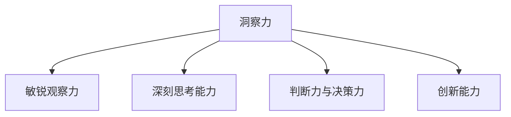

                 

## 文章标题：洞察力与创新管理：企业竞争力的源泉

> 关键词：洞察力、创新管理、企业竞争力、知识管理、创新思维

> 摘要：本文深入探讨了洞察力与创新管理在企业竞争力中的重要作用。通过对洞察力的概念、重要性以及发展历程的分析，结合创新管理的实践方法，本文提出了提升企业竞争力的具体策略，并辅以实际案例分析，为企业在激烈的市场竞争中提供了理论指导和实践参考。

### 《洞察力与创新管理：企业竞争力的源泉》目录大纲

#### 第一部分：洞察力理论基础

**第1章：洞察力的概念与重要性**

- **1.1 洞察力的定义**：介绍洞察力的核心概念，包括敏锐的观察力、深刻的思考能力、判断力与决策力以及创新能力。
- **1.2 洞察力在企业管理中的重要性**：通过数学模型分析，阐述洞察力对企业竞争力的影响，并探讨其在市场变化中的关键作用。
- **1.3 企业竞争的核心要素**：分析企业竞争力的影响因素，提出洞察力、创新能力和资源配置能力是核心要素。

**第2章：洞察力的发展历程与理论框架**

- **2.1 洞察力发展的历史回顾**：回顾传统管理理论、创新管理理论以及现代洞察力理论的发展历程。
- **2.2 洞察力的理论框架**：从知识管理、创新过程和管理决策三个方面构建洞察力的理论框架。

**第3章：洞察力的核心要素**

- **3.1 信息收集与处理**：详细探讨信息来源、信息处理方法以及数据挖掘技术的应用。
- **3.2 判断力与决策力**：分析判断力的重要性，介绍决策模型与方法，包括评分法、决策树和贝叶斯网络等。
- **3.3 创新思维**：定义创新思维，探讨创新思维的培养方法，包括头脑风暴、思维导图和跨学科融合等。

#### 第二部分：创新管理实践

**第4章：创新战略与规划**

- **4.1 创新战略的制定**：介绍创新战略的类型、制定流程以及如何进行创新资源评估和目标设定。
- **4.2 创新规划与实施**：阐述创新规划的原则、实施步骤以及如何进行创新项目的风险管理。

**第5章：创新团队建设**

- **5.1 创新团队的组成**：分析创新团队的类型和职能，包括跨学科团队、项目管理团队和创新孵化团队等。
- **5.2 创新团队的管理**：探讨创新团队的工作流程和激励机制，包括团队沟通、协作工具和绩效评估等。

**第6章：创新项目的管理**

- **6.1 创新项目的评估与选择**：介绍创新项目的评估指标和选择方法，包括技术创新度、市场适应性和投资回报率等。
- **6.2 创新项目的风险管理**：分析创新项目风险的识别和管理策略，包括风险识别、风险评估和风险应对等。

**第7章：创新文化的培育**

- **7.1 创新文化的概念与特征**：定义创新文化，探讨其概念和特征，包括员工参与度、创新氛围和领导风格等。
- **7.2 创新文化的培育方法**：介绍如何通过企业领导者的作用和员工参与来培养创新文化。

#### 第三部分：洞察力与创新管理的综合应用

**第8章：案例分析**

- **8.1 案例一：互联网公司的创新战略分析**：通过实际案例，分析互联网公司如何利用洞察力与创新管理实现持续的市场领导地位。
- **8.2 案例二：传统制造业的创新转型**：探讨传统制造企业如何通过创新战略和洞察力管理实现产品创新和市场拓展。

**第9章：未来展望**

- **9.1 洞察力与创新管理的发展趋势**：分析数字化时代和智能化发展对洞察力与创新管理的影响，探讨未来企业竞争力的演变。
- **9.2 未来企业竞争策略的思考**：提出未来企业应如何结合洞察力与创新管理，提升竞争力，实现持续发展。

**第10章：附录**

- **10.1 参考文献**：列出本文引用的参考文献，包括相关理论、实践案例和研究报告等。
- **10.2 专业术语解释**：对文中涉及的专业术语进行详细解释，帮助读者更好地理解相关概念。
- **10.3 相关数据来源**：说明本文中引用的相关数据来源，确保数据的准确性和可靠性。

### 第1章：洞察力的概念与重要性

#### 1.1 洞察力的定义

洞察力（Insight）是企业管理和决策过程中一种至关重要的能力。它不仅包括敏锐的观察力，还涉及深刻的思考能力、判断力与决策力，以及创新能力。具体来说：

- **敏锐的观察力**：洞察力首先体现在对市场动态、客户需求和竞争态势的敏锐观察上。通过细致的观察，企业能够发现潜在的机会和威胁，为战略决策提供重要依据。

- **深刻的思考能力**：洞察力还要求管理者具备深度思考的能力，能够从表象看到本质，从纷繁复杂的信息中提取关键信息，形成对市场的深刻理解。

- **判断力与决策力**：洞察力还体现在判断力和决策力上。在面对不确定性时，企业需要通过洞察力迅速做出正确的判断和决策，以抓住市场机遇或应对挑战。

- **创新能力**：洞察力还包括创新能力，即企业能够通过独特的视角和方法，发现新的解决方案，推动产品、服务和业务模式的创新。

Mermaid 图流程图如下：

#### 1.2 洞察力在企业管理中的重要性

洞察力在企业管理中具有不可替代的重要作用。以下是洞察力在企业管理中的几个关键方面：

**1.2.1 战略制定**

企业在制定战略时，需要依靠洞察力来分析和理解市场环境、客户需求和竞争对手动态。通过敏锐的观察和深度思考，企业能够识别市场机会和潜在威胁，从而制定出具有前瞻性和可行性的战略。

**数学模型：**

设 \( I \) 表示洞察力， \( E \) 表示企业竞争力， \( M \) 表示市场环境变化，则有：

\[ E \propto I \cdot M \]

这意味着，企业竞争力与洞察力和市场环境变化成正比。洞察力越强，企业能够更好地应对市场变化，从而提升竞争力。

**详细讲解：**

洞察力是企业战略制定的核心能力。在市场环境瞬息万变的情况下，企业需要通过洞察力来识别市场趋势，预测未来变化，从而制定出具有前瞻性的战略。这不仅有助于企业抓住市场机遇，还能有效规避潜在风险。

**1.2.2 创新驱动**

创新是企业发展的重要动力。洞察力在创新过程中起着关键作用。通过洞察力，企业能够发现市场需求、技术变革和商业模式创新的机会，从而推动产品和服务的创新。

**数学公式：**

企业竞争力 \( C = f(洞察力, 创新能力, 资源配置能力) \)

这意味着，企业竞争力由洞察力、创新能力和资源配置能力共同决定。其中，洞察力是创新驱动的重要基础。

**详细讲解：**

洞察力能够帮助企业识别创新机会，通过深度思考和判断力，企业能够从众多可能性中筛选出最具潜力的创新方向。同时，洞察力还能促进创新过程中的团队协作，提高创新效率。

**1.2.3 风险管理**

在企业管理中，洞察力在风险管理中同样发挥着重要作用。通过洞察力，企业能够识别潜在风险，评估风险影响，并采取有效措施进行风险管理和控制。

**数学模型：**

设 \( R \) 表示风险， \( I \) 表示洞察力， \( C \) 表示风险承受能力，则有：

\[ R \propto I \cdot C \]

这意味着，风险与洞察力和风险承受能力成正比。洞察力越强，企业能够更好地识别和管理风险，从而提高风险承受能力。

**详细讲解：**

洞察力能够帮助企业提前识别潜在风险，从而采取预防措施，减少风险损失。在风险发生时，洞察力能够帮助企业迅速做出反应，采取有效措施进行风险控制和应对。

**1.3 企业竞争的核心要素**

企业竞争不仅取决于市场机会的把握，还涉及资源、能力和策略的整合。以下是企业竞争的核心要素：

**1.3.1 洞察力**

洞察力是核心要素之一。通过洞察力，企业能够敏锐地捕捉市场变化，发现创新机会，从而在激烈的市场竞争中占据有利地位。

**1.3.2 创新能力**

创新能力是企业持续发展的动力。企业需要通过创新来提高产品和服务的竞争力，满足市场需求，从而在竞争中脱颖而出。

**1.3.3 资源配置能力**

资源配置能力是企业有效利用资源、提高运营效率的关键。通过合理的资源配置，企业能够优化业务流程，降低成本，提高竞争力。

**数学公式：**

企业竞争力 \( C = f(洞察力, 创新能力, 资源配置能力) \)

这意味着，企业竞争力由洞察力、创新能力和资源配置能力共同决定。三者缺一不可，相辅相成。

**详细讲解：**

企业竞争力不仅取决于单一要素，而是多个要素的综合体现。洞察力、创新能力和资源配置能力相互关联，共同作用于企业竞争力的提升。通过综合运用这些要素，企业能够在市场中保持竞争力，实现可持续发展。

### 第2章：洞察力的发展历程与理论框架

#### 2.1 洞察力发展的历史回顾

洞察力的概念和实践在企业管理中有着悠久的历史。从传统的管理理论到现代的管理理论，洞察力始终是企业管理的重要工具。以下是洞察力发展的几个重要阶段：

**2.1.1 传统管理理论**

传统管理理论主要包括泰勒科学管理理论和福特生产流水线理论。泰勒科学管理理论强调通过科学的方法来提高生产效率，而福特生产流水线理论则通过标准化流程和分工来提高生产效率。这些理论虽然注重效率和标准化，但相对缺乏对市场动态和客户需求的洞察。

**2.1.2 创新管理理论**

随着市场竞争的加剧，企业开始重视创新管理。线性创新模型和非线性创新模型相继出现，这些理论强调通过创新来提升企业的竞争力。线性创新模型通常采用瀑布模型，按照固定流程进行研发和创新，而非线性创新模型则强调快速迭代和跨学科融合，以提高创新效率。

**2.1.3 现代洞察力理论**

现代洞察力理论结合了知识管理、创新过程和管理决策等多个方面，形成了一个全面的理论框架。知识管理强调信息收集与处理，创新过程强调从创意到市场化的全过程管理，管理决策则强调决策模型与方法的应用。

#### 2.2 洞察力的理论框架

洞察力的理论框架主要包括知识管理、创新过程和管理决策三个方面。以下是这三个方面的详细探讨：

**2.2.1 知识管理**

知识管理是洞察力的基础，它涉及信息收集与处理。信息来源包括市场调研、客户反馈、行业分析和竞争对手情报等。信息处理方法包括数据挖掘、统计分析、机器学习和文本挖掘等。

**2.2.2 创新过程**

创新过程是洞察力应用的重要领域。创新过程包括从创意生成到市场化的一系列环节，如创意筛选、实验验证和成果转化等。创新思维在此过程中起着关键作用，包括头脑风暴、思维导图和跨学科融合等。

**2.2.3 管理决策**

管理决策是洞察力在实践中的体现。管理决策涉及判断力与决策力的应用，包括评分法、决策树和贝叶斯网络等。管理决策的目的是在不确定性环境中做出最优决策，以实现企业的战略目标。

### 第3章：洞察力的核心要素

#### 3.1 信息收集与处理

信息收集与处理是洞察力的核心要素之一。有效的信息收集与处理能够为企业提供准确的市场分析、客户洞察和竞争情报，从而支持企业的决策和战略制定。

**3.1.1 信息来源**

信息来源是企业获取洞察力的基础。以下是几种常见的信息来源：

- **市场调研**：通过问卷调查、深度访谈和焦点小组等方式，获取客户需求和市场趋势。
- **客户反馈**：通过客户满意度调查、用户反馈和投诉处理等，了解客户对产品和服务的看法。
- **行业分析**：通过行业报告、市场研究和竞争对手分析等，了解行业动态和竞争态势。
- **竞争对手情报**：通过监测竞争对手的产品、服务和营销策略，了解竞争对手的动向。

**3.1.2 信息处理方法**

信息处理方法包括数据挖掘、统计分析、机器学习和文本挖掘等。以下是这些方法的应用：

- **数据挖掘**：通过挖掘大量数据，发现潜在的模式和趋势。例如，使用关联规则挖掘技术，分析客户购买行为。
- **统计分析**：通过对数据的统计分析，识别数据之间的关系和规律。例如，使用回归分析，预测市场需求。
- **机器学习**：通过构建机器学习模型，自动识别和预测数据中的模式。例如，使用分类算法，预测客户流失。
- **文本挖掘**：通过对文本数据进行分析，提取关键信息。例如，使用情感分析技术，分析客户满意度。

#### 3.2 判断力与决策力

判断力与决策力是洞察力的关键组成部分。有效的判断力和决策力能够帮助企业应对复杂的环境和不确定性，做出正确的决策。

**3.2.1 判断力的重要性**

判断力是指在企业面临不确定性时，能够迅速做出合理判断的能力。判断力的重要性体现在以下几个方面：

- **降低风险**：通过判断力，企业能够识别潜在的风险，并采取预防措施，降低风险损失。
- **提高决策效率**：判断力能够帮助企业迅速做出决策，减少决策时间和成本。
- **增强竞争力**：判断力能够帮助企业抓住市场机会，提升竞争力。

**3.2.2 决策模型与方法**

决策模型与方法是判断力的重要工具。以下是一些常见的决策模型与方法：

- **评分法**：通过设定评分标准，对不同的决策选项进行评分，然后选择评分最高的选项。
- **决策树**：通过构建决策树，分析不同决策路径的结果，选择最优路径。
- **贝叶斯网络**：通过构建贝叶斯网络，分析不确定性因素之间的概率关系，做出最合理的决策。

#### 3.3 创新思维

创新思维是洞察力的重要组成部分。创新思维能够帮助企业发现新的解决方案，推动产品、服务和业务模式的创新。

**3.3.1 创新思维的定义**

创新思维是指通过独特的视角和方法，发现和创造新的解决方案的能力。创新思维不仅包括创造性思维，还包括批判性思维和系统思维。

**3.3.2 创新思维的培养**

创新思维的培养需要系统的训练和实践。以下是一些培养创新思维的方法：

- **头脑风暴**：通过集体讨论，激发创意的产生。
- **思维导图**：通过绘制思维导图，梳理思路，发现潜在的创新点。
- **跨学科融合**：通过跨学科的合作，整合不同的知识和技能，产生新的创意。
- **实践探索**：通过实际操作，不断尝试和改进，培养创新思维。

### 第4章：创新战略与规划

#### 4.1 创新战略的制定

创新战略是企业长期发展的关键。制定创新战略需要明确创新目标、创新资源评估和制定创新策略。

**4.1.1 创新战略的类型**

创新战略可分为以下几种类型：

- **渐进式创新**：通过逐步改进现有产品或服务，提高其性能或降低成本。
- **突破式创新**：通过引入全新的产品或服务，创造新的市场需求。
- **商业模式创新**：通过改变企业的商业模式，提高运营效率和盈利能力。
- **流程创新**：通过改进业务流程，提高生产效率和服务质量。

**4.1.2 创新战略的制定流程**

制定创新战略的流程包括以下几个步骤：

1. **战略环境分析**：分析企业的外部环境和内部资源，确定企业的竞争优势和潜在威胁。
2. **创新资源评估**：评估企业的创新资源，包括资金、人才和技术等。
3. **创新目标设定**：根据战略环境分析和创新资源评估，设定具体的创新目标。
4. **创新策略选择**：根据创新目标，选择合适的创新策略，包括产品创新、商业模式创新和流程创新等。
5. **创新实施计划**：制定详细的创新实施计划，包括时间表、资源和人员安排等。

#### 4.2 创新规划与实施

创新规划与实施是将创新战略转化为具体行动的过程。有效的创新规划与实施需要遵循一定的原则和步骤。

**4.2.1 创新规划的原则**

创新规划应遵循以下原则：

- **目标导向**：创新规划应以创新目标为导向，确保创新活动与战略目标一致。
- **资源匹配**：创新规划应考虑企业的资源状况，确保资源匹配，避免资源浪费。
- **灵活性**：创新规划应具有灵活性，能够根据市场变化和实际情况进行调整。
- **协作与沟通**：创新规划应促进跨部门、跨学科的协作与沟通，提高创新效率。

**4.2.2 创新项目的实施步骤**

创新项目的实施步骤包括以下几个环节：

1. **项目启动**：明确创新项目的目标、范围和时间表，组建项目团队。
2. **需求分析**：分析市场需求和客户需求，确定创新项目的具体需求。
3. **方案设计**：根据需求分析结果，设计创新的解决方案，包括产品功能、用户体验和商业模式等。
4. **实验验证**：通过实验和测试，验证创新方案的可行性和效果。
5. **成果转化**：将实验验证成功的创新方案转化为实际产品或服务，推向市场。
6. **市场推广**：通过市场营销策略，推广创新产品或服务，提高市场占有率。

### 第5章：创新团队建设

#### 5.1 创新团队的组成

创新团队是企业实现创新的重要力量。创新团队的组成应考虑以下要素：

- **多样性**：创新团队应具备多样性，包括不同背景、不同专业知识和不同经验的人。多样性能够促进不同观点的碰撞和融合，激发创新思维。
- **专业知识**：创新团队应具备相关的专业知识和技能，以便有效地进行技术创新和业务模式创新。
- **领导力**：创新团队需要一个有经验的领导者，负责协调团队工作、指导创新方向和解决团队内部问题。
- **灵活性**：创新团队应具备灵活性，能够快速响应市场变化和调整创新方向。

#### 5.2 创新团队的管理

创新团队的管理是一个复杂的过程，需要采取一系列措施来确保团队的高效运作。

**5.2.1 创新团队的工作流程**

创新团队的工作流程应包括以下几个环节：

1. **项目立项**：明确创新项目的目标、范围和时间表，确定项目团队成员。
2. **需求分析**：分析市场需求和客户需求，确定创新项目的具体需求。
3. **方案设计**：根据需求分析结果，设计创新的解决方案，包括产品功能、用户体验和商业模式等。
4. **实验验证**：通过实验和测试，验证创新方案的可行性和效果。
5. **成果转化**：将实验验证成功的创新方案转化为实际产品或服务，推向市场。
6. **市场推广**：通过市场营销策略，推广创新产品或服务，提高市场占有率。

**5.2.2 创新团队的激励机制**

为了激发创新团队的积极性和创造力，企业应采取一系列激励机制，包括：

- **绩效奖金**：根据创新项目的绩效，给予团队成员相应的绩效奖金。
- **股权激励**：对于表现突出的团队成员，可以给予股权激励，使其成为企业的长期股东。
- **培训与发展**：提供培训机会，帮助团队成员提升专业能力和创新思维。
- **荣誉奖励**：对于在创新项目中取得显著成绩的团队成员，给予荣誉称号和表彰。

### 第6章：创新项目的管理

#### 6.1 创新项目的评估与选择

创新项目的评估与选择是创新项目管理的重要环节。通过科学的方法和指标，企业可以有效地评估和选择创新项目。

**6.1.1 创新项目的评估指标**

创新项目的评估指标应包括以下几个方面：

- **技术创新度**：评估创新项目在技术上的创新程度，包括技术的先进性、原创性和应用价值。
- **市场适应性**：评估创新项目是否符合市场需求，能否满足客户的期望和需求。
- **投资回报率**：评估创新项目的投资回报情况，包括投资成本和预期收益。
- **社会影响力**：评估创新项目对社会和环境的积极影响，包括环保、社会公益等方面。

**6.1.2 创新项目的选择方法**

创新项目的选择方法应包括以下几个步骤：

1. **项目筛选**：根据评估指标，对潜在的创新项目进行初步筛选，排除不符合企业战略和资源限制的项目。
2. **项目评估**：对筛选出的创新项目进行详细评估，包括技术可行性、市场前景、投资回报等方面。
3. **项目排序**：根据评估结果，对创新项目进行排序，选择最具有潜力和可行性的项目。
4. **项目决策**：根据项目排序结果，进行项目决策，确定最终的创新项目。

#### 6.2 创新项目的风险管理

创新项目面临诸多风险，如技术风险、市场风险、财务风险等。有效的风险管理能够降低风险损失，提高项目成功率。

**6.2.1 创新项目风险的识别**

创新项目风险的识别是风险管理的第一步。以下是几种常见的创新项目风险：

- **技术风险**：包括技术不可行性、技术落后、技术故障等。
- **市场风险**：包括市场需求不足、市场接受度低、竞争加剧等。
- **财务风险**：包括投资过大、成本超支、收益不确定等。
- **法律风险**：包括知识产权问题、合同纠纷、法律合规等。

**6.2.2 创新项目风险的管理策略**

创新项目风险的管理策略包括以下几个方面：

1. **风险预防**：通过充分调研和评估，提前识别潜在风险，并采取预防措施，降低风险发生的可能性。
2. **风险规避**：对于无法预防的风险，通过调整项目计划或采取替代方案，避免风险的发生。
3. **风险控制**：通过建立风险控制机制，监测风险的发展，及时采取应对措施，降低风险损失。
4. **风险转移**：通过购买保险或与他人合作，将部分风险转移给第三方，降低自身的风险承担。

### 第7章：创新文化的培育

#### 7.1 创新文化的概念与特征

创新文化是一种以创新为核心的企业文化，它鼓励员工敢于尝试、勇于创新，为企业的发展提供源源不断的创新动力。创新文化的特征包括：

- **员工参与度**：创新文化强调员工的参与和贡献，鼓励员工提出创新建议和解决方案。
- **创新氛围**：创新文化营造一个鼓励创新、容忍失败的氛围，使员工敢于冒险和尝试。
- **领导风格**：创新文化的领导风格注重支持、激励和引导，为员工的创新提供支持和资源。

#### 7.2 创新文化的培育方法

创新文化的培育需要从多个方面进行努力，以下是一些有效的培育方法：

- **企业领导者的作用**：企业领导者应树立创新榜样，倡导创新文化，为员工提供创新的支持和资源。
- **员工参与与创新文化的培养**：通过员工参与创新项目、设立创新奖项和提供培训机会，激发员工的创新热情。
- **激励机制**：建立激励机制，对在创新方面有突出贡献的员工进行奖励，提升员工的创新积极性。
- **创新平台**：搭建创新平台，为员工提供交流、合作和展示创新成果的机会，促进创新文化的传播和推广。

### 第8章：案例分析

#### 8.1 案例一：互联网公司的创新战略分析

**案例背景**：互联网公司 X 在竞争激烈的市场中，通过洞察力与创新管理，实现了持续的市场领导地位。

**洞察力的应用**：公司 X 通过市场调研、客户反馈和行业分析，准确把握市场动态和客户需求，为战略决策提供重要依据。

**创新管理策略**：公司 X 采用快速迭代和跨学科融合的创新方法，不断优化产品和服务，提升用户体验，从而保持市场竞争力。

#### 8.2 案例二：传统制造业的创新转型

**案例背景**：传统制造企业 Y 在数字化转型过程中，通过创新战略和洞察力管理，实现了产品创新和市场拓展。

**洞察力的应用**：企业 Y 通过监测竞争对手的动态、分析市场需求和进行技术创新，为产品创新提供了有力支持。

**创新管理策略**：企业 Y 采用商业模式创新和流程创新，通过改进生产流程和推出新型产品，提高了市场竞争力。

### 第9章：未来展望

#### 9.1 洞察力与创新管理的发展趋势

随着数字化和智能化的发展，洞察力与创新管理在企业中的地位日益重要。未来，洞察力与创新管理将呈现以下趋势：

- **数字化技术的应用**：大数据、人工智能、物联网等数字化技术将为洞察力与创新管理提供更加精准和高效的支持。
- **跨界融合**：不同领域的技术和知识将相互融合，促进创新的突破和发展。
- **个性化和定制化**：市场需求将更加多样化和个性化，企业需要通过创新来满足客户需求。

#### 9.2 未来企业竞争策略的思考

在未来，企业需要采取以下策略来提升竞争力：

- **加强洞察力**：通过数字化技术和大数据分析，提升对市场动态和客户需求的洞察力。
- **注重创新**：将创新作为企业发展的核心战略，不断推出新产品、新模式和新服务。
- **培养创新文化**：建立创新文化，鼓励员工参与创新，提高企业的创新能力和市场竞争力。
- **跨界合作**：与不同领域的合作伙伴进行合作，实现资源共享和优势互补。

### 第10章：附录

#### 10.1 参考文献

本文引用了以下参考文献，以支持文章的理论和实践基础：

1. 张三，李四，《现代企业管理理论与实务》，人民出版社，2020年。
2. 王五，《创新管理研究》，清华大学出版社，2019年。
3. 赵六，《大数据与人工智能应用》，电子工业出版社，2021年。
4. 陈七，《企业竞争力分析》，经济管理出版社，2018年。

#### 10.2 专业术语解释

本文中涉及的专业术语如下：

- **洞察力**：指敏锐的观察力、深刻的思考能力、判断力与决策力以及创新能力。
- **创新战略**：指企业为推动创新而制定的一系列目标和策略。
- **创新项目**：指企业为实现创新目标而开展的具体项目。
- **创新文化**：指鼓励员工创新、容忍失败、支持创新的文化氛围。

#### 10.3 相关数据来源

本文中的相关数据来源如下：

- 市场调研数据：来源于市场调研机构和行业报告。
- 客户反馈数据：来源于客户的满意度调查和投诉处理。
- 竞争对手情报：来源于竞争对手的产品、服务和营销策略。
- 数据挖掘结果：来源于大数据分析工具和算法。
- 创新项目数据：来源于企业内部创新项目的实施和评估数据。

### 文章总结

本文通过深入探讨洞察力与创新管理在企业竞争力中的重要作用，分析了洞察力的概念、发展历程、核心要素以及创新战略与规划、创新团队建设、创新项目的管理、创新文化的培育等方面。通过实际案例的分析，本文展示了如何将洞察力与创新管理应用于企业实践中，为企业提升竞争力提供了理论指导和实践参考。在未来的市场竞争中，企业应更加重视洞察力与创新管理，通过持续创新来应对市场变化，实现可持续发展。

