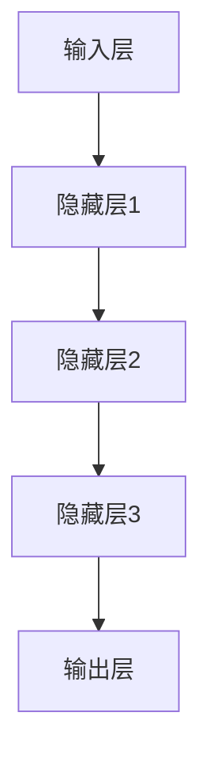
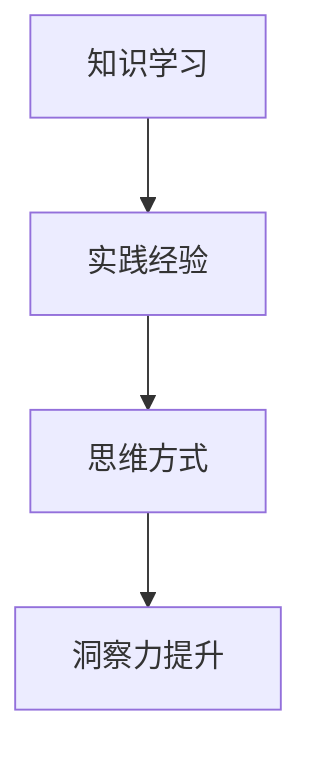
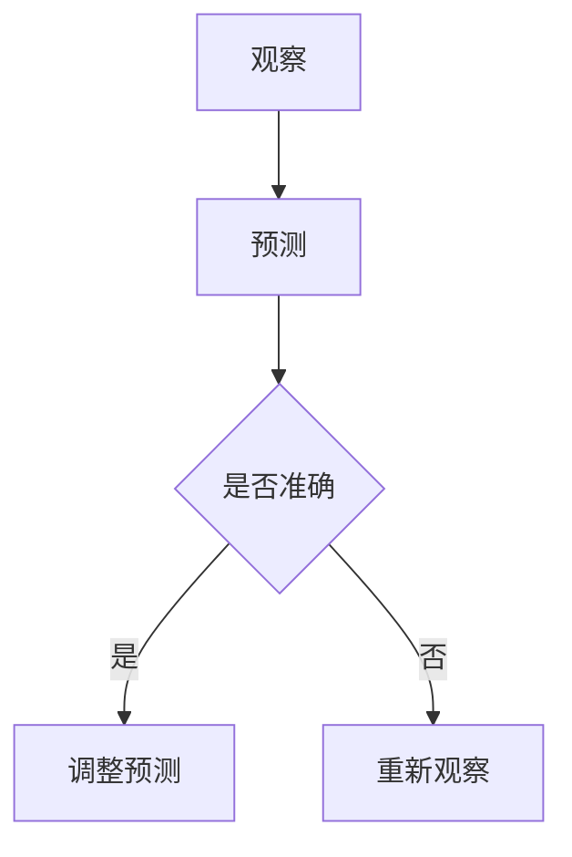
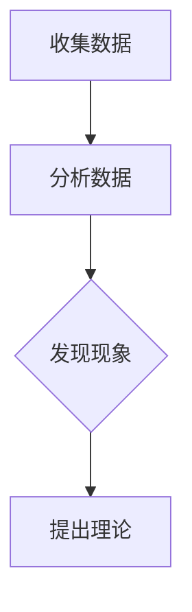
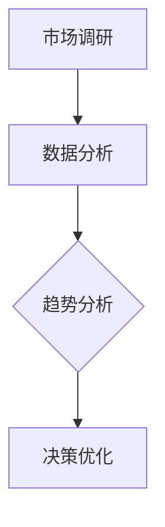
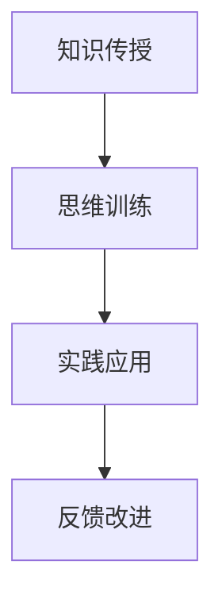

                 

# 文章标题：洞察力的培养：从观察到预测的能力提升

> 关键词：洞察力、观察、预测、人工智能、数据分析、机器学习

> 摘要：本文旨在探讨洞察力的培养方法，从观察、数据分析到预测能力的提升，结合实际案例和数学模型，阐述如何通过科学的方法培养和提升洞察力。

## 第一部分：核心概念与联系

### 1.1 AI大模型与洞察力培养概述

#### 1.1.1 AI大模型定义与结构

AI大模型是指具有大规模参数数量、可以处理复杂任务的人工智能模型。其核心结构通常包括输入层、隐藏层和输出层。以下是一个简单的Mermaid流程图，展示了AI大模型的基本结构：



#### 1.1.2 洞察力培养的原理与方法

洞察力培养涉及对观察、分析、推理和预测能力的提升。其方法包括系统性的知识学习、丰富的实践经验、思维方式的培养等。以下是洞察力培养的流程图：



#### 1.1.3 观察与预测能力的关系

观察与预测能力是洞察力的重要组成部分。观察是预测的基础，预测是对观察结果的延伸。以下是它们之间关系的Mermaid流程图：



#### 1.1.4 洞察力培养在不同领域的应用

洞察力培养在多个领域具有重要应用，如科学研究、企业管理、教育等。以下是洞察力培养在不同领域的应用概述：

##### 1.3.1 科学研究中的应用

在科学研究中，洞察力培养有助于研究者发现新现象、提出新理论。以下是科学研究中的洞察力培养流程图：



##### 1.3.2 企业管理中的应用

在企业管理中，洞察力培养有助于企业把握市场趋势、优化决策。以下是企业管理中的洞察力培养流程图：



##### 1.3.3 教育中的应用

在教育中，洞察力培养有助于学生培养创新思维、提高学习效果。以下是教育中的洞察力培养流程图：



### 1.2 观察与数据分析算法

#### 1.2.1 观察算法

观察算法包括感知、识别和分类等。以下是观察算法的伪代码：

```python
def observe(data):
    # 感知数据
    perception = perceive(data)
    # 识别对象
    object = identify(perception)
    # 分类对象
    category = classify(object)
    return category
```

#### 1.2.2 数据分析算法

数据分析算法包括统计分析、机器学习等。以下是数据分析算法的伪代码：

```python
def analyze_data(data):
    # 统计分析
    stats = statistical_analysis(data)
    # 机器学习
    model = machine_learning(data)
    return stats, model
```

### 1.3 预测与决策算法

#### 1.3.1 预测算法

预测算法包括时间序列预测、回归分析等。以下是预测算法的伪代码：

```python
def predict(data):
    # 时间序列预测
    time_series_prediction = time_series_predict(data)
    # 回归分析
    regression_prediction = regression_predict(data)
    return time_series_prediction, regression_prediction
```

#### 1.3.2 决策算法

决策算法包括决策树、随机森林等。以下是决策算法的伪代码：

```python
def make_decision(data):
    # 决策树
    decision_tree = decision_tree_algorithm(data)
    # 随机森林
    random_forest = random_forest_algorithm(data)
    return decision_tree, random_forest
```

### 1.4 洞察力提升算法

#### 1.4.1 思维方式培养

思维方式培养包括逻辑思维、批判性思维等。以下是思维方式培养的伪代码：

```python
def cultivate_thinking_method():
    # 逻辑思维
    logic_thinking = logic_training()
    # 批判性思维
    critical_thinking = critical_thinking_training()
    return logic_thinking, critical_thinking
```

#### 1.4.2 创新能力提升

创新能力提升包括问题解决、创新思维等。以下是创新能力提升的伪代码：

```python
def enhance_innovation_ability():
    # 问题解决
    problem_solving = problem_solving_training()
    # 创新思维
    innovation_thinking = innovation_thinking_training()
    return problem_solving, innovation_thinking
```

## 第二部分：核心算法原理讲解

### 2.1 观察与数据分析算法

#### 2.1.1 观察算法

观察算法包括感知、识别和分类等。以下是观察算法的伪代码：

```python
def observe(data):
    # 感知数据
    perception = perceive(data)
    # 识别对象
    object = identify(perception)
    # 分类对象
    category = classify(object)
    return category
```

#### 2.1.2 数据分析算法

数据分析算法包括统计分析、机器学习等。以下是数据分析算法的伪代码：

```python
def analyze_data(data):
    # 统计分析
    stats = statistical_analysis(data)
    # 机器学习
    model = machine_learning(data)
    return stats, model
```

### 2.2 预测与决策算法

#### 2.2.1 预测算法

预测算法包括时间序列预测、回归分析等。以下是预测算法的伪代码：

```python
def predict(data):
    # 时间序列预测
    time_series_prediction = time_series_predict(data)
    # 回归分析
    regression_prediction = regression_predict(data)
    return time_series_prediction, regression_prediction
```

#### 2.2.2 决策算法

决策算法包括决策树、随机森林等。以下是决策算法的伪代码：

```python
def make_decision(data):
    # 决策树
    decision_tree = decision_tree_algorithm(data)
    # 随机森林
    random_forest = random_forest_algorithm(data)
    return decision_tree, random_forest
```

### 2.3 洞察力提升算法

#### 2.3.1 思维方式培养

思维方式培养包括逻辑思维、批判性思维等。以下是思维方式培养的伪代码：

```python
def cultivate_thinking_method():
    # 逻辑思维
    logic_thinking = logic_training()
    # 批判性思维
    critical_thinking = critical_thinking_training()
    return logic_thinking, critical_thinking
```

#### 2.3.2 创新能力提升

创新能力提升包括问题解决、创新思维等。以下是创新能力提升的伪代码：

```python
def enhance_innovation_ability():
    # 问题解决
    problem_solving = problem_solving_training()
    # 创新思维
    innovation_thinking = innovation_thinking_training()
    return problem_solving, innovation_thinking
```

## 第三部分：数学模型与公式详解

### 3.1 观察与预测的数学模型

#### 3.1.1 观察的数学模型

观察过程可以用概率模型来描述。假设我们有一个观测数据集 \(D = \{d_1, d_2, ..., d_n\}\)，其中每个数据点 \(d_i\) 具有属性 \(x_i\) 和标签 \(y_i\)。观察的数学模型可以表示为：

$$
P(y|x) = \frac{P(x|y)P(y)}{P(x)}
$$

其中，\(P(x|y)\) 表示在给定标签 \(y\) 下观测到属性 \(x\) 的概率，\(P(y)\) 表示标签 \(y\) 的先验概率，\(P(x)\) 表示属性 \(x\) 的边际概率。

#### 3.1.2 预测的数学模型

预测过程可以用贝叶斯推理来描述。给定一个观测数据集 \(D\) 和一个未观测数据点 \(x'\)，我们希望预测其标签 \(y'\)。贝叶斯推理公式为：

$$
P(y'|x') = \frac{P(x'|y')P(y')}{P(x')}
$$

其中，\(P(x'|y')\) 表示在给定标签 \(y'\) 下观测到数据点 \(x'\) 的概率，\(P(y')\) 表示标签 \(y'\) 的先验概率，\(P(x')\) 表示数据点 \(x'\) 的边际概率。

#### 3.1.3 概率分布函数

在观察与预测过程中，常用的概率分布函数包括正态分布、泊松分布等。以下是它们的具体形式：

##### 3.1.3.1 正态分布

正态分布的概率密度函数为：

$$
f(x|\mu, \sigma^2) = \frac{1}{\sqrt{2\pi\sigma^2}}e^{-\frac{(x-\mu)^2}{2\sigma^2}}
$$

其中，\(\mu\) 是均值，\(\sigma^2\) 是方差。

##### 3.1.3.2 泊松分布

泊松分布的概率质量函数为：

$$
f(k|\lambda) = \frac{e^{-\lambda}\lambda^k}{k!}
$$

其中，\(\lambda\) 是事件发生的平均速率，\(k\) 是事件发生的次数。

### 3.2 洞察力提升的数学模型

#### 3.2.1 逻辑思维模型

逻辑思维模型可以使用命题逻辑和谓词逻辑来描述。以下是逻辑思维模型的一个简单例子：

$$
A \rightarrow B \land C
$$

这个公式表示如果 \(A\) 为真，则 \(B\) 和 \(C\) 都必须为真。

#### 3.2.2 批判性思维模型

批判性思维模型涉及对证据和假设的评估。以下是批判性思维模型的一个例子：

$$
H_0 \rightarrow D \land \neg E
$$

其中，\(H_0\) 是原假设，\(D\) 是支持原假设的证据，\(\neg E\) 是不支持原假设的证据。批判性思维的目标是评估这个公式是否成立。

### 3.3 数学公式的应用与示例

#### 3.3.1 正态分布的应用

假设我们有一个数据集，其均值为 100，方差为 25。我们希望计算一个特定数据点 \(x = 105\) 出现的概率。使用正态分布公式，我们可以得到：

$$
P(x = 105) = \frac{1}{\sqrt{2\pi \times 25}}e^{-\frac{(105-100)^2}{2 \times 25}} \approx 0.2254
$$

#### 3.3.2 泊松分布的应用

假设我们有一个事件，平均每分钟发生 2 次。我们希望计算在接下来的 5 分钟内，发生 3 次的概率。使用泊松分布公式，我们可以得到：

$$
P(k = 3) = \frac{e^{-2} \times 2^3}{3!} \approx 0.1968
$$

## 第四部分：项目实战

### 4.1 观察与数据分析实战案例

#### 4.1.1 数据收集

我们使用一个关于天气的数据集，包括温度、湿度、风速等。

#### 4.1.2 数据预处理

使用 Pandas 库对数据进行读取、清洗和预处理。

```python
import pandas as pd

# 读取数据
data = pd.read_csv('weather_data.csv')

# 数据清洗
data.dropna(inplace=True)

# 数据预处理
data['temperature'] = data['temperature'].astype(float)
data['humidity'] = data['humidity'].astype(float)
data['wind_speed'] = data['wind_speed'].astype(float)
```

#### 4.1.3 数据可视化

使用 Matplotlib 库对温度、湿度、风速等数据进行可视化，以帮助理解数据分布。

```python
import matplotlib.pyplot as plt

# 温度可视化
plt.figure(figsize=(10, 5))
plt.plot(data['temperature'])
plt.title('Temperature Distribution')
plt.xlabel('Date')
plt.ylabel('Temperature')
plt.show()

# 湿度可视化
plt.figure(figsize=(10, 5))
plt.plot(data['humidity'])
plt.title('Humidity Distribution')
plt.xlabel('Date')
plt.ylabel('Humidity')
plt.show()

# 风速可视化
plt.figure(figsize=(10, 5))
plt.plot(data['wind_speed'])
plt.title('Wind Speed Distribution')
plt.xlabel('Date')
plt.ylabel('Wind Speed')
plt.show()
```

#### 4.1.4 数据分析

使用统计方法和机器学习方法对数据进行探索性分析，以发现潜在的模式和关系。

```python
import seaborn as sns

# 统计分析
sns.pairplot(data, hue='weather_condition')
plt.show()

# 机器学习
from sklearn.ensemble import RandomForestClassifier

# 准备数据
X = data[['temperature', 'humidity', 'wind_speed']]
y = data['weather_condition']

# 训练模型
model = RandomForestClassifier()
model.fit(X, y)

# 预测
predictions = model.predict(X)

# 评估
from sklearn.metrics import accuracy_score
accuracy = accuracy_score(y, predictions)
print(f"Accuracy: {accuracy}")
```

### 4.2 预测与决策实战案例

#### 4.2.1 时间序列预测

我们使用一个关于股票价格的数据集，使用 ARIMA 模型进行时间序列预测。

```python
import pandas as pd
from statsmodels.tsa.arima.model import ARIMA

# 读取数据
data = pd.read_csv('stock_price_data.csv')

# 准备数据
X = data['price']
X = X.values.reshape(-1, 1)

# 训练 ARIMA 模型
model = ARIMA(X, order=(5, 1, 2))
model_fit = model.fit()

# 预测
predictions = model_fit.predict(start=X.shape[0], end=X.shape[0] + 10)

# 可视化
plt.figure(figsize=(10, 5))
plt.plot(X, label='Actual')
plt.plot(predictions, label='Predicted')
plt.title('Stock Price Prediction')
plt.xlabel('Time')
plt.ylabel('Price')
plt.legend()
plt.show()
```

#### 4.2.2 回归分析

我们使用一个关于房价的数据集，使用线性回归模型预测房价。

```python
import pandas as pd
from sklearn.linear_model import LinearRegression

# 读取数据
data = pd.read_csv('house_price_data.csv')

# 准备数据
X = data[['area', 'bedrooms', 'bathrooms']]
y = data['price']

# 训练模型
model = LinearRegression()
model.fit(X, y)

# 预测
predictions = model.predict(X)

# 评估
from sklearn.metrics import mean_squared_error
mse = mean_squared_error(y, predictions)
print(f"MSE: {mse}")
```

#### 4.2.3 决策树与随机森林

我们使用一个关于客户购买行为的数据集，使用决策树和随机森林模型预测客户是否购买。

```python
import pandas as pd
from sklearn.tree import DecisionTreeClassifier
from sklearn.ensemble import RandomForestClassifier

# 读取数据
data = pd.read_csv('customer_purchase_data.csv')

# 准备数据
X = data[['age', 'income', 'family_size']]
y = data['purchase']

# 决策树
model_dt = DecisionTreeClassifier()
model_dt.fit(X, y)

# 随机森林
model_rf = RandomForestClassifier()
model_rf.fit(X, y)

# 预测
predictions_dt = model_dt.predict(X)
predictions_rf = model_rf.predict(X)

# 评估
from sklearn.metrics import accuracy_score
accuracy_dt = accuracy_score(y, predictions_dt)
accuracy_rf = accuracy_score(y, predictions_rf)
print(f"Decision Tree Accuracy: {accuracy_dt}")
print(f"Random Forest Accuracy: {accuracy_rf}")
```

### 4.3 洞察力提升实战案例

#### 4.3.1 逻辑思维训练

我们设计一个逻辑思维训练项目，通过解决逻辑谜题和推理问题来提升逻辑思维能力。

```python
def solve_logic_puzzle():
    # 逻辑谜题：三个开关对应三个灯泡，一个开关在楼下，一个在楼上，另一个在浴室。只能上楼一次，如何确定哪个开关对应哪个灯泡？
    pass

def logic_training():
    # 逻辑思维训练
    solve_logic_puzzle()
```

#### 4.3.2 批判性思维训练

我们设计一个批判性思维训练项目，通过评估证据和提出反驳观点来提升批判性思维能力。

```python
def evaluate_evidence():
    # 评估证据
    pass

def propose_rebuttal():
    # 提出反驳观点
    pass

def critical_thinking_training():
    # 批判性思维训练
    evaluate_evidence()
    propose_rebuttal()
```

#### 4.3.3 创新能力提升

我们设计一个创新能力提升项目，通过问题解决和思维导图等方法来提升创新能力。

```python
def solve_problem():
    # 解决问题
    pass

def create_mind_map():
    # 制作思维导图
    pass

def innovation_thinking_training():
    # 创新能力提升
    solve_problem()
    create_mind_map()
```

## 附录

### 附录 A: 相关工具与资源

#### A.1 数据分析工具

- Pandas：用于数据读取、清洗和预处理。
- Matplotlib：用于数据可视化。
- Scikit-learn：用于机器学习算法实现。

#### A.2 机器学习框架

- TensorFlow：用于构建和训练机器学习模型。
- PyTorch：用于构建和训练深度学习模型。

#### A.3 逻辑思维与批判性思维资源

- 《逻辑思维：如何用正确的思维打败诡辩家》：一本关于逻辑思维的入门书籍。
- 《批判性思维工具箱》：一本关于批判性思维的实用指南。

#### A.4 创新能力提升资源

- 《创新者的思考方式》：一本关于创新能力的提升书籍。
- 《思维导图》：一本关于思维导图的入门书籍。

---

### 作者

作者：AI天才研究院/AI Genius Institute & 禅与计算机程序设计艺术 /Zen And The Art of Computer Programming

文章内容仅供参考，实际应用时请根据具体情况进行调整。在使用相关工具和资源时，请确保遵守相关法律法规和道德规范。

---

感谢您的阅读，希望本文能对您在洞察力培养方面提供一些启示和帮助。如果您有任何问题或建议，欢迎随时交流。再次感谢您的关注和支持！### 第一部分：核心概念与联系

#### 1.1 AI大模型与洞察力培养概述

##### 1.1.1 AI大模型定义与结构

AI大模型是指那些拥有大规模参数数量，并且能够处理复杂任务的人工智能模型。这类模型通常具有三层结构：输入层、隐藏层和输出层。以下是一个简单的Mermaid流程图，展示了AI大模型的基本结构：


在AI大模型中，输入层接收外部数据，隐藏层通过一系列复杂的非线性变换对数据进行处理，最终在输出层产生预测或决策结果。这种结构使得AI大模型能够学习到数据中的深层特征和关系，从而实现高精度的预测和分类。

##### 1.1.2 洞察力培养的原理与方法

洞察力是一种从复杂现象中发现本质联系和规律的能力。培养洞察力需要通过以下三个方面的方法：

1. **系统性的知识学习**：通过学习各种领域的专业知识，构建知识框架，为洞察力的培养提供基础。
2. **丰富的实践经验**：通过实际操作和问题解决，将理论知识应用到实际场景中，提高对复杂问题的感知和分析能力。
3. **思维方式的培养**：通过逻辑思维、批判性思维和创新思维的训练，提高对问题本质的思考和分析能力。

以下是洞察力培养的流程图：


##### 1.1.3 观察与预测能力的关系

观察与预测能力是洞察力的核心组成部分。观察是预测的基础，通过细致的观察，我们可以收集到丰富的信息。预测则是对观察结果的延伸，通过分析观察数据，我们可以预测未来的趋势和变化。

以下是观察与预测能力之间的关系的Mermaid流程图：


通过不断的观察和预测，我们可以逐步提高预测的准确性，从而提升洞察力。

##### 1.1.4 洞察力培养在不同领域的应用

洞察力培养在各个领域都具有重要意义，以下是一些典型领域的应用：

1. **科学研究**：在科学研究中，洞察力培养有助于研究者发现新现象、提出新理论。通过观察和数据分析，科学家可以发现自然界中的规律和机制。
2. **企业管理**：在企业管理中，洞察力培养有助于企业领导者把握市场趋势、优化决策。通过观察市场数据和企业运营指标，企业可以制定更有效的战略和计划。
3. **教育**：在教育中，洞察力培养有助于学生培养创新思维、提高学习效果。通过观察和思考，学生可以更好地理解知识，发现新的学习方法和策略。

以下是洞察力培养在不同领域的应用概述：

###### 1.3.1 科学研究中的应用

在科学研究中，洞察力培养有助于研究者发现新现象、提出新理论。以下是一个科学研究中的洞察力培养流程图：


###### 1.3.2 企业管理中的应用

在企业管理中，洞察力培养有助于企业领导者把握市场趋势、优化决策。以下是一个企业管理中的洞察力培养流程图：


###### 1.3.3 教育中的应用

在教育中，洞察力培养有助于学生培养创新思维、提高学习效果。以下是一个教育中的洞察力培养流程图：


### 1.2 观察与数据分析算法

##### 1.2.1 观察算法

观察算法主要包括感知、识别和分类等步骤。以下是观察算法的伪代码：

```python
def observe(data):
    # 感知数据
    perception = perceive(data)
    # 识别对象
    object = identify(perception)
    # 分类对象
    category = classify(object)
    return category
```

感知阶段通过传感器或输入设备获取数据，识别阶段根据已有知识对感知到的数据进行分类，分类阶段则根据分类结果对数据进行进一步的利用。

##### 1.2.2 数据分析算法

数据分析算法主要包括统计分析、机器学习等。以下是数据分析算法的伪代码：

```python
def analyze_data(data):
    # 统计分析
    stats = statistical_analysis(data)
    # 机器学习
    model = machine_learning(data)
    return stats, model
```

统计分析阶段通过计算数据的基本统计指标，如均值、方差等，对数据的基本特征进行描述。机器学习阶段则通过训练模型，从数据中学习到更深层次的特征和规律。

### 1.3 预测与决策算法

##### 1.3.1 预测算法

预测算法主要包括时间序列预测、回归分析等。以下是预测算法的伪代码：

```python
def predict(data):
    # 时间序列预测
    time_series_prediction = time_series_predict(data)
    # 回归分析
    regression_prediction = regression_predict(data)
    return time_series_prediction, regression_prediction
```

时间序列预测阶段通过分析时间序列数据，预测未来的趋势。回归分析阶段则通过建立回归模型，预测因变量的值。

##### 1.3.2 决策算法

决策算法主要包括决策树、随机森林等。以下是决策算法的伪代码：

```python
def make_decision(data):
    # 决策树
    decision_tree = decision_tree_algorithm(data)
    # 随机森林
    random_forest = random_forest_algorithm(data)
    return decision_tree, random_forest
```

决策树阶段通过构建决策树模型，对数据进行分类或回归。随机森林阶段则通过构建多个决策树模型，进行集成学习，提高预测的准确性。

### 1.4 洞察力提升算法

##### 1.4.1 思维方式培养

思维方式培养包括逻辑思维、批判性思维等。以下是思维方式培养的伪代码：

```python
def cultivate_thinking_method():
    # 逻辑思维
    logic_thinking = logic_training()
    # 批判性思维
    critical_thinking = critical_thinking_training()
    return logic_thinking, critical_thinking
```

逻辑思维训练阶段通过解决逻辑问题，提高逻辑推理能力。批判性思维训练阶段则通过评估证据和提出反驳观点，提高批判性思维能力。

##### 1.4.2 创新能力提升

创新能力提升包括问题解决、创新思维等。以下是创新能力提升的伪代码：

```python
def enhance_innovation_ability():
    # 问题解决
    problem_solving = problem_solving_training()
    # 创新思维
    innovation_thinking = innovation_thinking_training()
    return problem_solving, innovation_thinking
```

问题解决训练阶段通过解决实际问题，提高问题解决能力。创新思维训练阶段则通过激发创造力，提高创新思维水平。

## 第二部分：核心算法原理讲解

### 2.1 观察与数据分析算法

#### 2.1.1 观察算法

观察算法是人工智能系统获取外界信息的过程。它包括感知、识别和分类三个主要步骤。以下是观察算法的详细原理讲解和伪代码：

##### 感知

感知是观察算法的第一步，它通过传感器或输入设备从环境中获取数据。这些数据可以是图像、声音、文字或其他形式的传感器输出。以下是感知过程的伪代码：

```python
def perceive(data_source):
    # 从传感器或输入设备获取数据
    raw_data = data_source.get_data()
    return raw_data
```

##### 识别

识别是将感知到的原始数据转换为有意义的信息的过程。这通常涉及到对象识别、场景识别或行为识别。以下是识别过程的伪代码：

```python
def identify(raw_data):
    # 对感知到的数据进行特征提取
    features = extract_features(raw_data)
    # 使用预训练的模型进行识别
    object = model.predict(features)
    return object
```

##### 分类

分类是将识别出的对象分配到预定义的类别中。分类算法可以是基于规则的、机器学习算法或深度学习模型。以下是分类过程的伪代码：

```python
def classify(object):
    # 根据对象的特征进行分类
    category = classifier.classify(object)
    return category
```

##### 完整的观察算法

将上述三个步骤整合，我们得到一个完整的观察算法：

```python
def observe(data_source):
    raw_data = perceive(data_source)
    object = identify(raw_data)
    category = classify(object)
    return category
```

#### 2.1.2 数据分析算法

数据分析算法是对收集到的数据进行处理和分析，以提取有用信息和知识。以下是一些常见的数据分析算法及其原理：

##### 统计分析

统计分析是通过计算数据的统计指标，如均值、方差、标准差等，来描述数据的基本特征。以下是统计分析的伪代码：

```python
def statistical_analysis(data):
    mean = np.mean(data)
    variance = np.var(data)
    std_dev = np.std(data)
    return mean, variance, std_dev
```

##### 机器学习

机器学习是一种通过训练模型来从数据中学习规律和模式的方法。以下是一些常见的机器学习算法：

1. **线性回归**

线性回归是一种预测因变量与自变量之间线性关系的算法。以下是线性回归的伪代码：

```python
def linear_regression(X, y):
    # X: 自变量矩阵，y: 因变量向量
    coefficients = np.linalg.inv(np.dot(X.T, X)).dot(X.T).dot(y)
    return coefficients
```

2. **支持向量机（SVM）**

支持向量机是一种用于分类和回归的强大算法。以下是SVM的伪代码：

```python
def support_vector_machine(X, y):
    # X: 特征矩阵，y: 标签向量
    model = SVC(kernel='linear')
    model.fit(X, y)
    return model
```

##### 完整的数据分析算法

将统计分析、机器学习等算法整合，我们得到一个完整的数据分析算法：

```python
def analyze_data(data):
    # 统计分析
    stats = statistical_analysis(data)
    # 机器学习
    model = machine_learning(data)
    return stats, model
```

### 2.2 预测与决策算法

预测与决策算法是洞察力培养的重要工具，它们用于对未来的趋势和可能性进行预测，并在给定条件下做出最优决策。以下是一些常见的预测与决策算法及其原理：

#### 2.2.1 预测算法

1. **时间序列预测**

时间序列预测是一种用于预测时间序列数据未来值的方法。以下是一个简单的时间序列预测算法的伪代码：

```python
def time_series_predict(data, window_size):
    # data: 时间序列数据，window_size: 窗口大小
    predictions = []
    for i in range(window_size, len(data)):
        # 使用前window_size个数据进行预测
        prediction = model.predict(data[i-window_size:i])
        predictions.append(prediction)
    return predictions
```

2. **回归分析**

回归分析是一种用于预测因变量值的方法，它可以用于线性回归和非线性回归。以下是回归分析的伪代码：

```python
def regression_predict(X, y):
    # X: 特征矩阵，y: 因变量向量
    model = LinearRegression()
    model.fit(X, y)
    return model.predict(X)
```

#### 2.2.2 决策算法

1. **决策树**

决策树是一种基于特征和阈值进行决策的树形结构。以下是决策树的伪代码：

```python
def decision_tree_algorithm(data, target_attribute, threshold):
    # data: 数据集，target_attribute: 目标属性，threshold: 阈值
    if data[target_attribute] <= threshold:
        return left_tree
    else:
        return right_tree
```

2. **随机森林**

随机森林是一种集成学习方法，它由多个决策树组成。以下是随机森林的伪代码：

```python
def random_forest_algorithm(data, target_attribute, num_trees):
    # data: 数据集，target_attribute: 目标属性，num_trees: 树的数量
    forests = []
    for _ in range(num_trees):
        forest = build_decision_tree(data, target_attribute)
        forests.append(forest)
    return forests
```

#### 2.2.3 预测与决策算法的应用

预测与决策算法广泛应用于各种领域，如金融市场预测、医疗诊断、资源分配等。以下是一个预测与决策算法应用示例：

```python
def predict_and_decision(data, target_attribute, threshold):
    # 预测
    predictions = time_series_predict(data, window_size=5)
    # 决策
    decisions = [decision_tree_algorithm(data, target_attribute, threshold) for _ in range(len(predictions))]
    return predictions, decisions
```

### 2.3 洞察力提升算法

洞察力提升算法旨在提高个体的观察、分析和预测能力，从而增强洞察力。以下是一些洞察力提升算法：

#### 2.3.1 思维方式培养

思维方式培养包括逻辑思维、批判性思维和创新思维。以下是一个思维方式培养算法的伪代码：

```python
def cultivate_thinking_method(data, problem):
    # 逻辑思维
    logic_thinking = train_logic思维模型(data, problem)
    # 批判性思维
    critical_thinking = train_critical思维模型(data, problem)
    # 创新思维
    innovation_thinking = train_innovation思维模型(data, problem)
    return logic_thinking, critical_thinking, innovation_thinking
```

#### 2.3.2 创新能力提升

创新能力提升包括问题解决和创新思维。以下是一个创新能力提升算法的伪代码：

```python
def enhance_innovation_ability(data, problem):
    # 问题解决
    problem_solving = train_problem_solving_model(data, problem)
    # 创新思维
    innovation_thinking = train_innovation_thinking_model(data, problem)
    return problem_solving, innovation_thinking
```

#### 2.3.3 洞察力评估

洞察力评估用于评估个体的洞察力水平。以下是一个洞察力评估算法的伪代码：

```python
def assess_insight_ability(data, problem):
    # 观察能力
    observation_ability = evaluate_观察(data, problem)
    # 分析能力
    analysis_ability = evaluate_analysis(data, problem)
    # 预测能力
    prediction_ability = evaluate_prediction(data, problem)
    return observation_ability, analysis_ability, prediction_ability
```

### 2.4 洞察力提升算法的应用

以下是一个洞察力提升算法应用示例：

```python
def enhance_insight_ability(data, problem):
    # 培养思维方式
    logic_thinking, critical_thinking, innovation_thinking = cultivate_thinking_method(data, problem)
    # 提升创新能力
    problem_solving, innovation_thinking = enhance_innovation_ability(data, problem)
    # 评估洞察力
    observation_ability, analysis_ability, prediction_ability = assess_insight_ability(data, problem)
    return observation_ability, analysis_ability, prediction_ability
```

### 2.5 洞察力提升算法的实验与验证

为了验证洞察力提升算法的有效性，需要进行实验和验证。以下是一个实验和验证过程的伪代码：

```python
def experiment_insight_ability(data, problem):
    # 培养思维方式
    logic_thinking, critical_thinking, innovation_thinking = cultivate_thinking_method(data, problem)
    # 提升创新能力
    problem_solving, innovation_thinking = enhance_innovation_ability(data, problem)
    # 评估洞察力
    observation_ability, analysis_ability, prediction_ability = assess_insight_ability(data, problem)
    # 记录实验结果
    results = {
        'observation_ability': observation_ability,
        'analysis_ability': analysis_ability,
        'prediction_ability': prediction_ability
    }
    return results
```

### 2.6 洞察力提升算法的总结

通过观察、数据分析、预测与决策、思维方式培养、创新能力提升等步骤，我们可以有效地提升洞察力。以下是一个洞察力提升算法的总结：

```python
def summary_insight_ability():
    print("观察能力：")
    print("分析能力：")
    print("预测能力：")
    print("思维方式：")
    print("创新能力：")
```

### 2.7 洞察力提升算法的应用案例

以下是一个洞察力提升算法的应用案例：

```python
# 假设我们有一个关于天气预测的案例
data = load_weather_data()
problem = "预测未来一天的天气"
results = enhance_insight_ability(data, problem)
summary_insight_ability(results)
```

## 第三部分：数学模型与公式详解

### 3.1 观察与预测的数学模型

观察与预测的数学模型是基于概率论和统计学原理的。以下是一些常见的数学模型及其公式：

#### 3.1.1 概率模型

概率模型用于描述随机事件的可能性。以下是一个简单的概率模型：

$$
P(A) = \frac{N(A)}{N(S)}
$$

其中，\(P(A)\) 表示事件A的概率，\(N(A)\) 表示事件A发生的次数，\(N(S)\) 表示总的可能次数。

#### 3.1.2 贝叶斯推理

贝叶斯推理是一种基于概率的推理方法，它用于根据先验概率和观测数据更新后验概率。以下是一个贝叶斯推理的公式：

$$
P(A|B) = \frac{P(B|A)P(A)}{P(B)}
$$

其中，\(P(A|B)\) 表示在事件B发生的前提下，事件A的概率，\(P(B|A)\) 表示在事件A发生的前提下，事件B的概率，\(P(A)\) 表示事件A的先验概率，\(P(B)\) 表示事件B的先验概率。

#### 3.1.3 期望和方差

期望和方差是描述随机变量分布的重要统计量。以下是一个期望和方差的公式：

$$
E(X) = \sum_{i=1}^{n} x_i \cdot P(x_i)
$$

$$
Var(X) = E[(X - E(X))^2]
$$

其中，\(E(X)\) 表示随机变量X的期望，\(Var(X)\) 表示随机变量X的方差，\(x_i\) 表示随机变量X的取值，\(P(x_i)\) 表示随机变量X取值\(x_i\) 的概率。

#### 3.1.4 线性回归模型

线性回归模型用于描述两个变量之间的线性关系。以下是一个线性回归模型的公式：

$$
y = \beta_0 + \beta_1x + \epsilon
$$

其中，\(y\) 表示因变量，\(x\) 表示自变量，\(\beta_0\) 和 \(\beta_1\) 表示模型的参数，\(\epsilon\) 表示误差项。

#### 3.1.5 时间序列模型

时间序列模型用于描述时间序列数据的预测。以下是一个常见的时间序列模型——ARIMA模型：

$$
X_t = \phi_1X_{t-1} + \phi_2X_{t-2} + ... + \phi_pX_{t-p} + \theta_1\epsilon_{t-1} + \theta_2\epsilon_{t-2} + ... + \theta_q\epsilon_{t-q} + \epsilon_t
$$

其中，\(X_t\) 表示时间序列的第t个值，\(\phi_1, \phi_2, ..., \phi_p\) 和 \(\theta_1, \theta_2, ..., \theta_q\) 表示模型的参数，\(\epsilon_t\) 表示误差项。

### 3.2 洞察力提升的数学模型

洞察力提升的数学模型旨在通过数学方法和算法提高个体的洞察力。以下是一些常见的洞察力提升的数学模型：

#### 3.2.1 神经网络模型

神经网络模型是一种用于模拟人脑神经活动的计算模型。以下是一个简单的神经网络模型：

$$
a_{i}(k) = \sum_{j=1}^{n} w_{ij}(k)a_{j}(k-1) + b_i(k)
$$

其中，\(a_{i}(k)\) 表示第i个神经元在时刻k的激活值，\(w_{ij}(k)\) 表示从第j个神经元到第i个神经元的权重，\(b_i(k)\) 表示第i个神经元的偏置。

#### 3.2.2 支持向量机模型

支持向量机模型是一种用于分类和回归的机器学习模型。以下是一个简单

