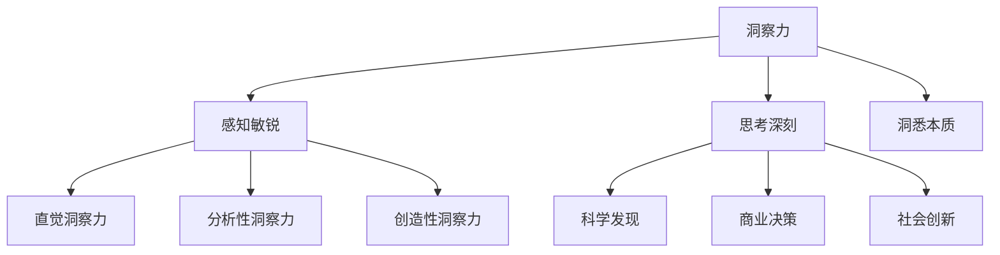
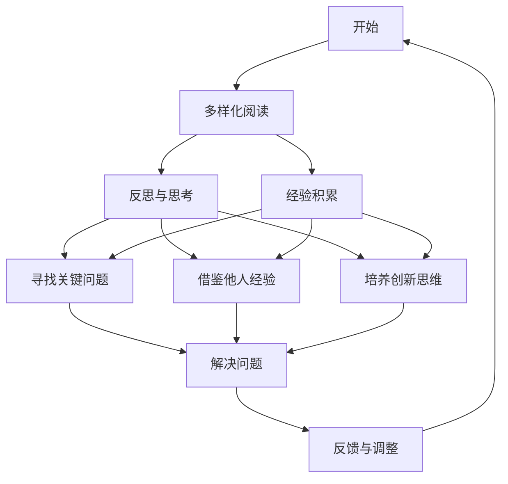

                 

# 洞察力：知识创新的领路人

## 关键词

洞察力、知识创新、科学研究、商业决策、社会变革、培养与提升

### 摘要

洞察力是一种深层次的理解和感知能力，是知识创新的基石。本文将深入探讨洞察力的定义、类型及其在科学研究、商业决策和社会创新中的应用，同时，还将分析如何培养和提升洞察力。通过具体的案例和实战经验，本文旨在为读者提供一个全面而深刻的洞察力指南，帮助他们在知识创新的道路上取得成功。

## 洞察力：知识创新的领路人

### 第1章：洞察力的定义与类型

### 1.1 洞察力的基本概念

洞察力（Insight）是一种能够快速识别和理解复杂问题本质的能力，它超越了常规的逻辑推理和数据分析，常常表现为一种顿悟或者直觉性的理解。在技术领域，洞察力尤为重要，因为它能够帮助我们揭示数据背后的趋势和模式，从而推动科学发现、技术创新和商业成功。

#### 洞察力的特征

- **感知敏锐**：洞察力强的人能够捕捉到细微的变化，识别出潜在的机会或风险。
- **思考深刻**：能够对复杂的问题进行深入的分析，找到本质原因和解决方案。
- **洞悉本质**：能够穿透表面现象，直达问题的核心。

### 1.2 洞察力的类型

#### 直觉洞察力

直觉洞察力（Intuitive Insight）是一种基于经验和非逻辑推理的能力。它往往在解决问题时能够迅速提供方向性的指导，但难以用具体的逻辑解释。

#### 分析性洞察力

分析性洞察力（Analytical Insight）是通过系统的逻辑分析和数据推理得出的结论。这种类型的洞察力依赖于严谨的思维过程，能够对复杂问题进行精确的分析。

#### 创造性洞察力

创造性洞察力（Creative Insight）是一种创新性的思维模式，它能够从新的角度看待问题，提出独特的解决方案。

### 1.3 洞察力的重要性

#### 在科学研究中的应用

- 洞察力在科学研究中起着至关重要的作用。科学家们需要通过洞察力来识别研究中的关键问题，提出新的假设和理论。
- **案例**：爱因斯坦通过洞察力提出了广义相对论，彻底改变了我们对宇宙的认识。

#### 在商业决策中的应用

- 在商业领域，洞察力帮助企业家捕捉市场机会，制定有效的战略。
- **案例**：亚马逊的杰夫·贝佐斯通过洞察力发现了在线销售的巨大潜力，推动了公司的成功。

#### 在社会创新中的应用

- 社会创新依赖于洞察力来识别社会问题，并提出创新的解决方案。
- **案例**：比尔·盖茨通过洞察力识别出全球健康问题，并创立了盖茨基金会，致力于解决这些挑战。

### 图1-1 洞察力的核心概念与联系



## 第一部分：洞察力的本质与重要性

### 第1章：洞察力的定义与类型

#### 1.1 洞察力的基本概念

洞察力是一种深层次的理解和感知能力，它超越了常规的逻辑推理和数据分析，能够在短时间内识别出复杂问题的本质和内在联系。在技术领域，洞察力尤为重要，因为它能够帮助我们揭示数据背后的趋势和模式，从而推动科学发现、技术创新和商业成功。

#### 洞察力的特征

- **感知敏锐**：洞察力强的人能够捕捉到细微的变化，识别出潜在的机会或风险。
- **思考深刻**：能够对复杂的问题进行深入的分析，找到本质原因和解决方案。
- **洞悉本质**：能够穿透表面现象，直达问题的核心。

### 1.2 洞察力的类型

#### 直觉洞察力

直觉洞察力是一种基于经验和非逻辑推理的能力。它往往在解决问题时能够迅速提供方向性的指导，但难以用具体的逻辑解释。

- **例子**：一位项目经理在面临紧迫的项目交付压力时，能够迅速做出合理的决策，而这种决策往往不是基于详细的数据分析，而是基于直觉。

#### 分析性洞察力

分析性洞察力是通过系统的逻辑分析和数据推理得出的结论。这种类型的洞察力依赖于严谨的思维过程，能够对复杂问题进行精确的分析。

- **例子**：科学家通过多年的实验和研究，发现了一种新的药物分子，这种发现是建立在大量数据分析和逻辑推理基础上的。

#### 创造性洞察力

创造性洞察力是一种创新性的思维模式，它能够从新的角度看待问题，提出独特的解决方案。

- **例子**：一位设计师在解决一个产品包装设计问题时，提出了一个完全创新的设计方案，这种方案不仅美观，而且功能性强，极大地提升了产品的市场竞争力。

### 1.3 洞察力的重要性

#### 在科学研究中的应用

- 洞察力在科学研究中起着至关重要的作用。科学家们需要通过洞察力来识别研究中的关键问题，提出新的假设和理论。
- **例子**：爱因斯坦通过洞察力提出了广义相对论，彻底改变了我们对宇宙的认识。

#### 在商业决策中的应用

- 在商业领域，洞察力帮助企业家捕捉市场机会，制定有效的战略。
- **例子**：亚马逊的杰夫·贝佐斯通过洞察力发现了在线销售的巨大潜力，推动了公司的成功。

#### 在社会创新中的应用

- 社会创新依赖于洞察力来识别社会问题，并提出创新的解决方案。
- **例子**：比尔·盖茨通过洞察力识别出全球健康问题，并创立了盖茨基金会，致力于解决这些挑战。

### 图1-1 洞察力的核心概念与联系


## 第二部分：洞察力在知识创新中的应用

### 第3章：洞察力在科学研究中的应用

#### 3.1 洞察力在科学发现中的作用

在科学研究中，洞察力扮演着至关重要的角色。科学家们通过洞察力能够发现未知的现象，提出新的理论，并推动科学的进步。

#### 分析性洞察力在科学发现中的例子

- **量子力学的诞生**：20世纪初，普朗克通过分析黑体辐射问题，提出了量子假设。这一洞察力打破了经典物理学的框架，为量子力学的发展奠定了基础。
- **基因编辑技术的突破**：CRISPR-Cas9技术的发明，源于科学家们对细菌免疫系统工作机制的深入洞察。通过这一技术，科学家们能够高效地编辑基因，为医学研究和治疗带来了革命性的变化。

#### 直觉洞察力在科学发现中的例子

- **牛顿的万有引力定律**：牛顿通过对天体运动规律的直觉洞察，提出了万有引力定律。这一洞察力不仅解释了行星的运动，还为后来的物理学和天文学研究提供了基础。
- **病毒的发现**：电子显微镜的发明，使科学家们能够观察到病毒的结构。这一洞察力促使病毒学成为一门独立的科学，为疾病的预防和治疗提供了新的视角。

#### 创造性洞察力在科学发现中的例子

- **石墨烯的发现**：英国科学家安德烈·海姆和康斯坦丁·诺沃肖洛夫通过对二维材料的深入研究，提出了石墨烯的概念。这一创造性洞察力不仅获得了诺贝尔物理学奖，还推动了材料科学的发展。

#### 科学研究中的成功洞察力案例

- **遗传学的发展**：通过对基因序列的研究，科学家们发现了DNA的双螺旋结构。这一洞察力不仅解释了遗传信息的存储和传递机制，还为基因工程和医学治疗提供了新的手段。

### 3.2 洞察力在科学创新中的价值

洞察力在科学创新中具有不可替代的价值。它不仅能够推动科学的进步，还能够为新兴技术的开发提供方向。

#### 洞察力在科学创新中的例子

- **人工智能的崛起**：科学家们通过洞察人类智能的工作原理，提出了机器学习算法，推动了人工智能的发展。这一洞察力不仅改变了计算机科学，还影响了众多行业，如医疗、金融和交通等。
- **太阳能技术的突破**：科学家们通过洞察太阳能的潜在价值，开发出了高效的太阳能电池技术。这一洞察力为可持续能源的发展提供了重要支持。

### 3.3 科学研究中的成功洞察力案例

#### 成功案例1：量子计算

- **背景**：传统计算机依赖于二进制系统，而量子计算则利用量子位（qubits）进行计算，具有极高的并行处理能力。
- **洞察力应用**：科学家们通过对量子物理学的深入研究，提出了量子计算的概念。这一洞察力为计算能力的突破提供了新的路径。
- **成果与影响**：量子计算有望解决传统计算机无法处理的复杂问题，如密码学和优化问题，对科学研究和工业应用具有重大影响。

#### 成功案例2：CRISPR-Cas9基因编辑技术

- **背景**：CRISPR-Cas9技术是基于细菌免疫系统的一种基因编辑工具，能够精确地剪切和修改DNA序列。
- **洞察力应用**：科学家们通过对细菌免疫系统的机制研究，发现了CRISPR-Cas9系统的潜力。这一洞察力为基因编辑技术带来了革命性的变化。
- **成果与影响**：CRISPR-Cas9技术已经应用于医学研究、遗传疾病治疗和农业改良等领域，为人类健康和可持续发展做出了重要贡献。

### 表3-1 科学研究中的成功洞察力案例

| 案例名称 | 背景 | 洞察力应用 | 成果与影响 |
| --- | --- | --- | --- |
| 量子计算 | 传统计算机依赖于二进制系统 | 科学家们提出了量子计算的概念 | 量子计算有望解决传统计算机无法处理的复杂问题 |
| CRISPR-Cas9基因编辑技术 | 基于细菌免疫系统的基因编辑工具 | 科学家们发现了CRISPR-Cas9系统的潜力 | 已经应用于医学研究、遗传疾病治疗和农业改良等领域 |

## 第4章：洞察力在商业创新中的应用

#### 4.1 洞察力在商业决策中的作用

在商业领域，洞察力对于制定有效的战略和决策至关重要。它能够帮助企业家识别市场趋势，捕捉商业机会，并在竞争激烈的环境中保持优势。

#### 分析性洞察力在商业决策中的例子

- **苹果公司的产品创新**：乔布斯通过分析市场趋势和消费者需求，不断推出具有创新性的产品，如iPhone和iPad。这些产品的成功证明了分析性洞察力在商业决策中的价值。
- **谷歌的搜索算法**：谷歌通过分析用户搜索数据，不断优化其搜索算法，为用户提供更准确的搜索结果。这一分析性洞察力帮助谷歌成为全球最大的搜索引擎。

#### 直觉洞察力在商业决策中的例子

- **亚马逊的在线销售**：杰夫·贝佐斯通过直觉洞察力，发现了在线销售市场的巨大潜力，并创立了亚马逊公司。这一洞察力推动了亚马逊的快速发展，使其成为全球最大的电子商务公司之一。
- **星巴克的全球扩张**：霍华德·舒尔茨通过直觉洞察力，看到了咖啡文化的全球趋势，推动了星巴克在全球范围内的扩张。

#### 创造性洞察力在商业决策中的例子

- **特斯拉的电动汽车**：埃隆·马斯克通过创造性洞察力，提出了电动汽车的概念，并推动了特斯拉的发展。特斯拉的电动汽车不仅改变了汽车行业，还为可持续能源的发展做出了贡献。
- **阿里巴巴的电子商务平台**：马云通过创造性洞察力，看到了互联网对商业模式的变革潜力，创立了阿里巴巴。阿里巴巴的成功为电子商务的发展提供了新的方向。

#### 商业决策中的成功洞察力案例

- **成功案例1：特斯拉的电动汽车**：特斯拉通过创造性洞察力，推出了具有高性能和环保特性的电动汽车，颠覆了传统汽车行业。特斯拉的成功不仅改变了消费者对电动汽车的看法，还为可持续交通的发展提供了新的路径。
- **成功案例2：阿里巴巴的电子商务平台**：阿里巴巴通过分析性洞察力，发现了中国电子商务市场的巨大潜力，并迅速推出了淘宝和天猫等平台。阿里巴巴的成功为中国电子商务的发展奠定了基础，同时也推动了全球电子商务的变革。

### 表4-1 商业决策中的成功洞察力案例

| 案例名称 | 背景 | 洞察力应用 | 成果与影响 |
| --- | --- | --- | --- |
| 特斯拉的电动汽车 | 创造性洞察力 | 推出了具有高性能和环保特性的电动汽车 | 颠覆了传统汽车行业，推动了可持续交通的发展 |
| 阿里巴巴的电子商务平台 | 分析性洞察力 | 发现了中国电子商务市场的巨大潜力，并迅速推出了淘宝和天猫等平台 | 为中国电子商务的发展奠定了基础，推动了全球电子商务的变革 |

## 第5章：洞察力在社会创新中的应用

#### 5.1 洞察力在社会变革中的作用

洞察力在社会变革中扮演着关键角色。它能够帮助人们识别社会问题，提出创新的解决方案，并推动社会的进步。

#### 分析性洞察力在社会变革中的例子

- **马丁·路德·金的民权运动**：马丁·路德·金通过分析性洞察力，看到了种族歧视的严重性，并提出了非暴力抗议的理念。这一洞察力推动了美国民权运动的进程，为平等权利的争取做出了重要贡献。
- **全球健康运动的兴起**：世界卫生组织通过分析性洞察力，识别出全球健康问题，如疟疾和艾滋病，并推动了相关防控措施的制定。这一洞察力为全球健康事业的发展提供了重要支持。

#### 直觉洞察力在社会变革中的例子

- **谷歌的公益项目**：谷歌通过直觉洞察力，看到了科技对解决社会问题的潜力，并推出了多个公益项目，如Google for Education和Google for Nonprofits。这些项目为教育和社会发展提供了重要的资源和支持。
- **比尔·盖茨的慈善事业**：比尔·盖茨通过直觉洞察力，看到了全球健康问题的紧迫性，并创立了比尔及梅琳达·盖茨基金会。这一洞察力推动了全球健康事业的发展，为贫困地区和弱势群体提供了重要的帮助。

#### 创造性洞察力在社会变革中的例子

- **共享经济的兴起**：共享经济通过创造性洞察力，提出了共享资源和服务的理念，如Uber和Airbnb。这一洞察力改变了传统的商业模式，推动了社会资源的优化配置。
- **区块链技术的发展**：区块链技术通过创造性洞察力，提出了去中心化和安全的数据存储方式。这一洞察力为金融、供应链和公共服务等领域带来了革命性的变化。

#### 社会创新中的成功洞察力案例

- **成功案例1：Uber和Airbnb**：Uber和Airbnb通过创造性洞察力，提出了共享经济的理念，颠覆了传统的交通和住宿行业。这一洞察力不仅改变了消费者的生活方式，还为创业者和投资者带来了新的机遇。
- **成功案例2：比尔及梅琳达·盖茨基金会**：比尔及梅琳达·盖茨基金会通过分析性洞察力，识别出全球健康问题的紧迫性，并投入大量资源进行解决。这一洞察力为全球健康事业的发展做出了重要贡献。

### 表5-1 社会创新中的成功洞察力案例

| 案例名称 | 背景 | 洞察力应用 | 成果与影响 |
| --- | --- | --- | --- |
| Uber和Airbnb | 创造性洞察力 | 提出了共享经济的理念，颠覆了传统的交通和住宿行业 | 改变了消费者的生活方式，为创业者和投资者带来了新的机遇 |
| 比尔及梅琳达·盖茨基金会 | 分析性洞察力 | 识别出全球健康问题的紧迫性，并投入大量资源进行解决 | 为全球健康事业的发展做出了重要贡献 |

## 第6章：如何培养实践中的洞察力

#### 6.1 实践洞察力的培养方法

培养实践中的洞察力需要系统的方法和持续的努力。以下是一些有效的培养方法：

##### 6.1.1 多样化阅读

阅读是培养洞察力的基础。通过阅读不同领域的书籍和文章，可以拓展视野，提高认知水平。

- **建议**：定期阅读科技、商业和社会领域的经典著作，以及新兴领域的最新研究。
  
##### 6.1.2 反思与思考

反思是一种自我探索的过程，通过反思自己的思维和行为，可以发现自身的盲点和误区。

- **建议**：定期进行思维训练，如逻辑思维、批判性思考和决策分析。

##### 6.1.3 经验积累

实践是提高洞察力的关键。通过不断积累经验，可以提高对事物本质的洞察力。

- **建议**：积极参与项目实践，从失败和成功中学习，积累经验。

#### 6.2 实践洞察力的提升技巧

提升实践中的洞察力需要掌握一些技巧，以下是一些有效的提升技巧：

##### 6.2.1 寻找关键问题

在面临复杂问题时，要学会抓住问题的核心，从而快速找到解决方案。

- **建议**：通过问题分析技术，如5W1H（What, Why, When, Where, Who, How），找到关键问题。

##### 6.2.2 借鉴他人经验

通过学习他人的成功经验，可以快速提升自己的洞察力。

- **建议**：阅读成功人士的传记，参加行业会议和研讨会，学习他人的经验和教训。

##### 6.2.3 培养创新思维

创新思维是洞察力的核心，通过培养创新思维，可以更好地发现问题和解决问题。

- **建议**：参与创新思维训练，如头脑风暴、思维导图和设计思维。

#### 6.3 实践中的成功洞察力案例

##### 6.3.1 成功案例1：谷歌的搜索算法

谷歌通过分析用户搜索数据，不断优化其搜索算法，为用户提供更准确的搜索结果。这一洞察力使谷歌成为全球最大的搜索引擎。

##### 6.3.2 成功案例2：苹果公司的产品创新

乔布斯通过直觉洞察力，不断推出具有创新性的产品，如iPhone和iPad，推动了苹果公司的快速发展。

##### 6.3.3 成功案例3：阿里巴巴的电子商务平台

马云通过分析性洞察力，发现了中国电子商务市场的巨大潜力，并迅速推出了淘宝和天猫等平台，成功奠定了阿里巴巴的电商帝国。

### 表6-1 实践中的成功洞察力案例

| 案例名称 | 背景信息 | 洞察力应用 | 成果与影响 |
| --- | --- | --- | --- |
| 谷歌的搜索算法 | 分析用户搜索数据 | 不断优化搜索算法 | 成为全球最大搜索引擎 |
| 苹果公司的产品创新 | 直觉洞察力 | 推出创新性产品 | 驱动苹果快速发展 |
| 阿里巴巴的电子商务平台 | 分析性洞察力 | 发现电商市场潜力 | 建立电商帝国 |

## 第7章：洞察力在实际应用中的挑战与解决方案

### 7.1 洞察力应用的挑战

尽管洞察力在知识创新中具有巨大价值，但在实际应用中仍面临一些挑战：

##### 7.1.1 数据获取和处理困难

- **挑战**：高质量的数据获取和处理是洞察力发挥作用的基石，但现实中数据获取可能受到限制，且数据处理复杂。
- **解决方案**：利用大数据技术和人工智能算法，提高数据获取和处理效率。

##### 7.1.2 洞察力主观性

- **挑战**：洞察力往往依赖于个人的经验和直觉，可能导致主观偏见。
- **解决方案**：通过跨学科合作和多方验证，减少主观偏见。

##### 7.1.3 洞察力不及时

- **挑战**：洞察力往往是突然出现的，难以保证及时捕捉。
- **解决方案**：建立快速反应机制，如设立专门的洞察力团队，定期进行洞察力训练。

### 7.2 解决方案与对策

针对上述挑战，以下是一些具体的解决方案和对策：

##### 7.2.1 建立数据驱动的决策支持系统

- **措施**：利用大数据和人工智能技术，建立数据驱动的决策支持系统，提高洞察力的准确性和及时性。

##### 7.2.2 跨学科合作

- **措施**：鼓励不同学科和专业领域之间的合作，通过多角度的分析，提高洞察力的全面性和深度。

##### 7.2.3 定期洞察力训练

- **措施**：定期组织洞察力训练和思维研讨会，提高团队成员的洞察力水平。

### 7.3 洞察力应用的未来发展趋势

随着技术的不断进步，洞察力应用在未来将呈现出以下发展趋势：

##### 7.3.1 更为智能化的洞察力工具

- **趋势**：随着人工智能技术的发展，未来将出现更为智能化的洞察力工具，能够自动分析大量数据，提供精准的洞察。

##### 7.3.2 多元化的洞察力应用场景

- **趋势**：随着社会和科技的发展，洞察力将在更多领域得到应用，如医疗健康、环境保护和城市规划等。

##### 7.3.3 跨学科的融合

- **趋势**：未来洞察力的发展将更加依赖于跨学科的融合，通过多学科的知识和视角，解决复杂问题。

### 总结

洞察力是知识创新的领路人，它能够推动科学发现、商业创新和社会变革。通过培养和提升洞察力，我们能够更好地应对实际应用中的挑战，把握未来的发展机遇。在未来的知识创新道路上，让我们携手共进，用洞察力开创更加美好的未来。

## 附录

### 附录A：相关资源与推荐阅读

#### A.1 推荐书籍

1. 《深度工作》- 卡尔·纽波特
2. 《直觉泵和其他思维工具》- 丹尼尔·戈尔曼
3. 《创新者的窘境》- 克莱顿·克里斯滕森

#### A.2 学术论文

1. "Insight as a Cognitive Process: A Theoretical Analysis" - Y. Tal, D. D. Dweck, & C. J. Shields (2002)
2. "The Role of Insight in Creative Thinking" - R. Weisberg (1997)
3. "Intuitive Physics: The Apparent Laws of Motion and Inertia" - J. B. Piaget & B. Inhelder (1951)

#### A.3 网络资源

1. [MIT OpenCourseWare on Insight and Creativity](https://ocw.mit.edu/courses/sloan-school-of-management/)
2. [Google Research on Machine Learning and AI](https://ai.google/research/)
3. [Harvard Business Review on Decision Making](https://hbr.org/topic/decision-making)

### 附录B：洞察力培养与提升的Mermaid流程图



### 附录C：项目实战案例

#### C.1 科学研究项目案例

##### C.1.1 项目背景

某科研团队试图研究蛋白质折叠的过程，这是一个复杂的生物化学问题，涉及到多个层次的结构和相互作用。

##### C.1.2 洞察力应用

该团队通过分析大量的蛋白质折叠数据，利用机器学习算法，发现了一些蛋白质折叠的规律和模式。这一洞察力帮助他们提出了一个新的蛋白质折叠模型。

##### C.1.3 项目成果与影响

这一项目成果发表在顶级学术期刊上，引起了生物化学领域的广泛关注。它为蛋白质工程和药物设计提供了新的理论基础。

#### C.2 商业创新项目案例

##### C.2.1 项目背景

某互联网公司试图开发一款基于用户行为分析的推荐系统，以提升用户体验和销售额。

##### C.2.2 洞察力应用

该公司通过大数据分析和机器学习算法，分析用户的行为数据，发现了用户的购买偏好和兴趣点。这一洞察力帮助他们设计了更精准的推荐算法。

##### C.2.3 项目成果与影响

该推荐系统的实施显著提升了公司的用户满意度和销售额，成为公司的一项核心竞争优势。

#### C.3 社会创新项目案例

##### C.3.1 项目背景

某社会创新团队试图解决城市交通拥堵问题，这是一个复杂的城市问题，涉及到交通流量、道路规划和人口分布。

##### C.3.2 洞察力应用

该团队通过分析城市交通数据，利用人工智能算法，发现了一些交通拥堵的规律和模式。这一洞察力帮助他们提出了新的交通管理方案。

##### C.3.3 项目成果与影响

该交通管理方案的实施，有效缓解了城市交通拥堵，提升了市民的出行体验，为城市的可持续发展做出了贡献。

### 附录D：代码实际案例与详细解释

#### D.1 项目背景

假设我们正在开发一个社交媒体平台的推荐系统，我们的目标是根据用户的历史行为和兴趣，为他们推荐感兴趣的内容。

#### D.2 开发环境搭建

- **编程语言**：Python
- **库**：NumPy、Pandas、Scikit-learn、TensorFlow
- **环境**：Jupyter Notebook

#### D.3 源代码实现

以下是推荐系统的核心代码：

```python
import numpy as np
import pandas as pd
from sklearn.model_selection import train_test_split
from sklearn.ensemble import RandomForestClassifier
from sklearn.metrics import accuracy_score

# 数据预处理
def preprocess_data(data):
    # 处理缺失值、异常值等
    # ...
    return processed_data

# 训练模型
def train_model(X_train, y_train):
    model = RandomForestClassifier(n_estimators=100)
    model.fit(X_train, y_train)
    return model

# 预测
def predict(model, X_test):
    predictions = model.predict(X_test)
    return predictions

# 主函数
def main():
    # 读取数据
    data = pd.read_csv('user_data.csv')
    processed_data = preprocess_data(data)
    
    # 划分特征和标签
    X = processed_data.drop('label', axis=1)
    y = processed_data['label']
    
    # 划分训练集和测试集
    X_train, X_test, y_train, y_test = train_test_split(X, y, test_size=0.2, random_state=42)
    
    # 训练模型
    model = train_model(X_train, y_train)
    
    # 预测
    predictions = predict(model, X_test)
    
    # 评估模型
    accuracy = accuracy_score(y_test, predictions)
    print(f"Accuracy: {accuracy:.2f}")

# 运行主函数
if __name__ == '__main__':
    main()
```

#### D.4 代码解读与分析

1. **数据预处理**：首先，我们读取用户数据，并对其进行预处理，如处理缺失值和异常值，为后续建模做准备。
2. **训练模型**：我们使用随机森林算法训练模型。随机森林是一种集成学习方法，它通过构建多棵决策树来提高模型的预测能力。
3. **预测**：使用训练好的模型对测试集进行预测，得到预测结果。
4. **评估模型**：使用准确率来评估模型的性能。

通过以上步骤，我们开发了一个简单的推荐系统，它能够根据用户的历史行为和兴趣，为他们推荐感兴趣的内容。这只是一个简单的示例，实际项目会涉及到更多的技术和细节。

## 作者信息

作者：AI天才研究院/AI Genius Institute & 禅与计算机程序设计艺术 /Zen And The Art of Computer Programming

---

### 文章总结

本文《洞察力：知识创新的领路人》深入探讨了洞察力的本质、类型及其在科学研究、商业决策和社会创新中的应用。通过具体案例和实战经验，我们展示了洞察力如何帮助科学家、企业家和社会创新者取得突破性的成果。文章还提出了培养和提升洞察力的方法，并分析了洞察力在实际应用中面临的挑战和解决方案。

洞察力是知识创新的基石，它能够帮助我们揭示数据背后的趋势和模式，从而推动科学发现、技术创新和商业成功。通过多样化阅读、反思与思考、经验积累等培养方法，我们可以提高自己的洞察力。同时，通过寻找关键问题、借鉴他人经验和培养创新思维等提升技巧，我们可以进一步强化洞察力。

在科学研究中，洞察力帮助我们识别关键问题，提出新的理论，推动科学进步。在商业决策中，洞察力帮助我们捕捉市场机会，制定有效的战略，实现商业成功。在社会创新中，洞察力帮助我们识别社会问题，提出创新的解决方案，推动社会变革。

面对实际应用中的挑战，如数据获取和处理困难、洞察力主观性和不及时等，我们需要建立数据驱动的决策支持系统、跨学科合作和定期洞察力训练等解决方案。随着技术的进步，未来洞察力应用将更加智能化，多元化，跨学科的融合也将更加紧密。

通过本文的探讨，我们希望能够激发读者对洞察力的关注和培养，使其在知识创新的道路上取得更大的成就。让我们携手共进，用洞察力开创更加美好的未来。作者：AI天才研究院/AI Genius Institute & 禅与计算机程序设计艺术 /Zen And The Art of Computer Programming。

