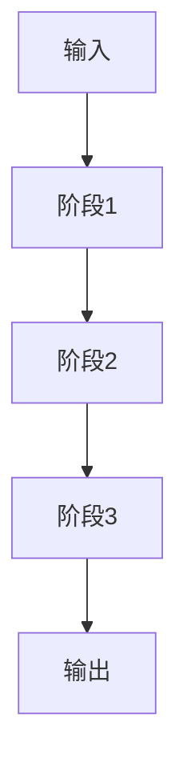

                 

# 流水线并行

## 关键词

- 流水线并行
- 并行计算
- 任务调度
- 性能优化
- 异构计算

## 摘要

本文深入探讨了流水线并行在计算机科学领域的应用与重要性。通过定义和概述流水线并行的基本概念，本文逐步分析了流水线并行的工作原理、结构解析、算法设计以及在实际应用中的挑战和优化策略。此外，本文还特别关注了流水线并行在深度学习等前沿领域的应用，提供了详细的伪代码、数学模型和实际项目案例，旨在为读者提供一个全面而深入的技术指南。

## 文章结构

### 第一部分：流水线并行基础

#### 第1章：流水线并行概述

1.1 流水线并行定义与作用

1.2 流水线并行与传统并行对比

1.3 流水线并行的适用场景

#### 第2章：流水线并行原理

2.1 流水线结构解析

2.2 流水线调度策略

2.3 流水线并行性能分析

#### 第3章：流水线并行设计

3.1 流水线并行系统架构

3.2 流水线并行任务调度

3.3 流水线并行编程模型

#### 第4章：流水线并行算法

4.1 流水线并行排序算法

4.2 流水线并行查找算法

4.3 流水线并行图算法

#### 第5章：流水线并行应用案例

5.1 数据处理应用

5.2 科学计算应用

5.3 机器学习应用

#### 第6章：流水线并行挑战与优化

6.1 并行性能瓶颈分析

6.2 流水线并行优化策略

6.3 新型流水线并行架构探索

#### 第7章：流水线并行未来发展趋势

7.1 未来流水线并行技术展望

7.2 流水线并行与异构计算融合

7.3 流水线并行在量子计算中的应用

### 第二部分：流水线并行深度学习应用

#### 第8章：深度学习中的流水线并行

8.1 深度学习流水线并行原理

8.2 深度学习流水线并行优化

8.3 深度学习流水线并行案例分析

#### 第9章：大规模流水线并行深度学习

9.1 大规模流水线并行深度学习架构

9.2 大规模流水线并行深度学习算法

9.3 大规模流水线并行深度学习应用案例

#### 第10章：流水线并行深度学习优化

10.1 流水线并行深度学习性能分析

10.2 流水线并行深度学习优化策略

10.3 流水线并行深度学习未来趋势

### 第三部分：流水线并行工具与生态

#### 第11章：流水线并行工具介绍

11.1 OpenMP

11.2 TBB

11.3 CUDA

#### 第12章：流水线并行生态系统

12.1 流水线并行开源项目

12.2 流水线并行社区活动

12.3 流水线并行产业发展动态

### 附录

#### 附录A：流水线并行资源与参考

A.1 相关书籍推荐

A.2 学术论文精选

A.3 网络资源汇总

## 第一部分：流水线并行基础

### 第1章：流水线并行概述

### 1.1 流水线并行定义与作用

#### 定义

流水线并行（Pipeline Parallelism）是一种将任务分解为多个可并行执行的子任务，并通过流水线结构进行有序处理的方法。它利用多个处理单元（处理器）同时工作，从而提高任务处理的速度和效率。

#### 作用

流水线并行在计算机科学和工程领域具有广泛的应用，其主要作用包括：

- **提高吞吐量**：通过并行处理，流水线并行显著提高了系统的吞吐量，即单位时间内处理任务的能力。
- **降低延迟**：流水线结构减少了任务的等待时间，从而降低了系统的平均响应时间。
- **资源利用最大化**：流水线并行利用了系统中的多个处理单元，最大化了资源利用率。
- **适应异构计算**：流水线并行能够很好地适应不同类型的处理单元，例如CPU、GPU等，从而提升整体计算性能。

### 1.2 流水线并行与传统并行对比

#### 对比

流水线并行与传统并行（如任务并行、数据并行）在处理方式和适用场景上存在显著差异：

- **处理方式**：

  - **流水线并行**：将任务分解为多个子任务，通过流水线结构顺序执行，每个子任务在完成后立即传递到下一个处理单元。

  - **传统并行**：将任务或数据划分为多个部分，多个处理单元同时工作，可以是任务并行（多个任务同时处理）或数据并行（多个数据集同时处理）。

- **适用场景**：

  - **流水线并行**：适用于任务本身具有明显的顺序依赖关系，例如流水线中的每个阶段需要处理前一个阶段的输出，如数据处理流水线、科学计算流水线。

  - **传统并行**：适用于任务或数据之间存在并行性，如矩阵乘法、大数据分析等。

#### 表格对比

| 特性         | 流水线并行                         | 传统并行（任务并行）                  | 传统并行（数据并行）                  |
| ------------ | -------------------------------- | ----------------------------------- | ----------------------------------- |
| 处理方式     | 顺序执行，多个处理单元同时工作   | 多个任务同时执行                     | 多个数据集同时处理                   |
| 依赖关系     | 明显的顺序依赖                     | 并行性，无严格依赖                   | 并行性，无严格依赖                   |
| 吞吐量       | 中等，依赖任务复杂度和调度策略   | 高，并行任务数量多                   | 高，并行数据集数量多                 |
| 延迟         | 较低，但受限于流水线阶段数量     | 中等，受限于任务执行时间             | 中等，受限于数据传输和处理时间       |
| 资源利用率   | 高，多个处理单元同时工作         | 高，多个处理单元同时工作             | 高，多个处理单元同时工作             |

### 1.3 流水线并行的适用场景

#### 场景一：数据处理

- **应用**：大数据处理、图像处理、音频处理等。
- **原因**：数据处理任务通常包含多个处理阶段，每个阶段对数据进行不同类型的处理，如过滤、变换、压缩等。流水线并行可以显著提高数据处理速度。

#### 场景二：科学计算

- **应用**：气象预测、物理模拟、生物信息学等。
- **原因**：科学计算任务通常涉及复杂的计算流程，需要将计算任务分解为多个阶段。流水线并行可以提高计算效率，缩短计算时间。

#### 场景三：机器学习

- **应用**：深度学习、特征提取、分类等。
- **原因**：机器学习任务通常包含多个子任务，如数据预处理、模型训练、预测等。流水线并行可以提高模型训练和预测的速度。

#### 场景四：工业控制

- **应用**：生产线自动化、机器人控制、质量控制等。
- **原因**：工业控制系统需要实时处理大量数据，流水线并行可以提高系统响应速度和稳定性。

### 1.4 小结

流水线并行作为一种重要的并行计算方法，在提高任务处理速度和效率方面具有显著优势。通过将任务分解为多个可并行执行的子任务，并利用流水线结构进行有序处理，流水线并行能够有效利用系统资源，提高系统的吞吐量和性能。在不同的应用场景中，流水线并行能够根据任务特点进行优化和调整，以实现最佳的性能表现。

### 第2章：流水线并行原理

#### 第2章：流水线并行原理

流水线并行是一种高效的任务处理方式，其基本原理是通过将任务分解为多个阶段，使每个阶段可以并行执行，从而提高系统的处理能力和效率。在本章中，我们将深入探讨流水线并行的基本原理，包括流水线结构、调度策略和性能分析。

#### 2.1 流水线结构解析

流水线结构是流水线并行的基础，它由多个阶段（Stages）、缓冲区（Buffers）和控制单元（Controller）组成。

##### 阶段（Stages）

阶段是流水线中的基本处理单元，每个阶段负责执行特定的任务。在流水线中，每个任务会依次通过每个阶段，每个阶段的处理结果作为输入传递给下一个阶段。

##### 缓冲区（Buffers）

缓冲区是流水线中的临时存储区域，用于存储任务在不同阶段之间的数据。缓冲区的作用是确保数据在各个阶段之间能够有序、高效地传输。

##### 控制单元（Controller）

控制单元是流水线的核心，负责协调各个阶段的执行顺序和缓冲区的管理。控制单元根据预定的调度策略，将任务分配给不同的阶段，并管理缓冲区中的数据流动。

##### 流水线类型

根据流水线的特点，可以分为以下几种类型：

- **单级流水线（Single-Level Pipeline）**：每个阶段只能执行一个任务。
- **多级流水线（Multi-Level Pipeline）**：每个阶段可以执行多个任务。
- **动态流水线（Dynamic Pipeline）**：阶段数量和任务分配可以根据实际情况动态调整。
- **静态流水线（Static Pipeline）**：阶段数量和任务分配固定不变。

#### 2.2 流水线调度策略

调度策略是流水线并行的重要部分，它决定了任务在流水线中的执行顺序和缓冲区的使用情况。常见的调度策略包括以下几种：

- **先入先出（First-In-First-Out, FIFO）**：按照任务的提交顺序进行调度，先提交的任务先执行。
- **最短作业优先（Shortest Job First, SJF）**：选择执行时间最短的任务先执行，以减少平均等待时间。
- **轮转调度（Round-Robin Scheduling）**：每个任务分配一个固定的时间片，轮流执行。
- **优先级调度（Priority Scheduling）**：根据任务的优先级进行调度，优先级高的任务先执行。

#### 2.3 流水线并行性能分析

流水线并行的性能分析主要包括吞吐量（Throughput）、延迟（Latency）和资源利用率（Resource Utilization）等指标。

- **吞吐量**：单位时间内流水线处理任务的数量。吞吐量是衡量流水线并行性能的重要指标，可以通过以下公式计算：

  $$ Throughput = \frac{TaskCount}{ExecutionTime} $$

  其中，`TaskCount` 是任务总数，`ExecutionTime` 是流水线的执行时间。

- **延迟**：任务从提交到完成所需要的时间。延迟是衡量流水线并行性能的另一个重要指标，可以通过以下公式计算：

  $$ Latency = \frac{TotalProcessingTime}{TaskCount} $$

  其中，`TotalProcessingTime` 是所有任务的执行时间总和。

- **资源利用率**：系统资源被利用的程度。资源利用率可以通过以下公式计算：

  $$ ResourceUtilization = \frac{ActiveProcessorTime}{TotalProcessorTime} $$

  其中，`ActiveProcessorTime` 是处理器实际工作的时间，`TotalProcessorTime` 是处理器总的工作时间。

#### 2.4 Mermaid 流程图

以下是流水线并行的基本结构 Mermaid 流程图：



#### 2.5 伪代码

以下是流水线并行任务的调度伪代码：

```python
# 伪代码：流水线任务调度
def ProcessTasks(tasks):
    for stage in tasks:
        stage.start()
        stage.execute()
        stage.complete()
```

#### 2.6 数学模型和公式

流水线并行的性能分析可以通过以下数学模型和公式进行描述：

- **吞吐量（Throughput）**：

  $$ Throughput = \frac{TaskCount}{ExecutionTime} $$

- **延迟（Latency）**：

  $$ Latency = \frac{TotalProcessingTime}{TaskCount} $$

- **资源利用率（ResourceUtilization）**：

  $$ ResourceUtilization = \frac{ActiveProcessorTime}{TotalProcessorTime} $$

#### 2.7 举例说明

假设一个三级流水线，每个阶段执行一个任务需要 1 秒，共有 3 个任务需要处理。根据上述公式，我们可以计算出：

- **吞吐量**：

  $$ Throughput = \frac{3}{1} = 3 \, tasks/second $$

- **延迟**：

  $$ Latency = \frac{3}{3} = 1 \, second $$

- **资源利用率**：

  $$ ResourceUtilization = \frac{3}{3} = 1 $$

这意味着该流水线每秒可以处理 3 个任务，平均延迟为 1 秒，资源利用率达到 100%。

#### 2.8 小结

本章详细介绍了流水线并行的基本原理，包括流水线结构、调度策略和性能分析。流水线并行通过将任务分解为多个阶段，并利用多个处理单元同时工作，从而提高了系统的吞吐量和效率。通过性能分析，我们可以更好地理解流水线并行的优势和应用场景。在实际应用中，合理的调度策略和性能优化是确保流水线并行系统高效运行的关键。

### 第3章：流水线并行设计

#### 第3章：流水线并行设计

在深入理解了流水线并行的基本原理后，本章将探讨如何设计高效的流水线并行系统。我们将详细分析流水线并行系统的架构、任务调度和编程模型，并通过具体案例展示如何实现和优化流水线并行系统。

#### 3.1 流水线并行系统架构

流水线并行系统架构是确保流水线并行任务高效执行的基础。一个典型的流水线并行系统包括以下几个关键组件：

- **处理单元（Processing Units）**：处理单元是流水线中的基本计算单元，可以是CPU、GPU或其他类型的处理器。处理单元的数量和性能直接影响系统的吞吐量和效率。
- **缓冲区（Buffers）**：缓冲区用于存储任务在不同阶段之间的数据，确保数据能够有序、高效地传输。缓冲区的大小和数量需要根据任务特点和系统资源进行优化。
- **调度器（Scheduler）**：调度器负责根据调度策略将任务分配给不同的处理单元，并管理缓冲区中的数据流动。调度器的性能对系统的响应时间和吞吐量有重要影响。
- **控制单元（Controller）**：控制单元是流水线的核心，负责协调各个阶段的执行顺序和缓冲区的管理。控制单元需要确保任务在流水线中的正确传输和执行。

#### 3.2 流水线并行任务调度

任务调度是流水线并行系统设计中的关键部分。合理的任务调度策略可以最大限度地提高系统的吞吐量和效率。以下是一些常见的调度策略：

- **静态调度（Static Scheduling）**：静态调度在系统设计阶段就确定任务的处理顺序和分配策略，通常用于任务量较小且任务执行时间相对稳定的情况。
- **动态调度（Dynamic Scheduling）**：动态调度在运行时根据系统负载和任务特性动态调整任务的处理顺序和分配策略，以适应实时变化的需求。
- **基于优先级的调度（Priority-Based Scheduling）**：基于优先级的调度根据任务的重要性和紧急程度进行调度，优先级高的任务先执行。
- **轮转调度（Round-Robin Scheduling）**：轮转调度将处理时间划分为固定的时间片，轮流分配给不同的任务，适用于任务执行时间较短的情况。

#### 3.3 流水线并行编程模型

流水线并行编程模型是开发者实现高效并行计算的关键。以下是一些常用的流水线并行编程模型：

- **数据并行（Data Parallelism）**：数据并行将任务划分为多个数据集，每个数据集由不同的处理单元独立处理，适用于大规模数据处理任务。
- **任务并行（Task Parallelism）**：任务并行将任务划分为多个独立的子任务，每个子任务由不同的处理单元并行执行，适用于复杂计算任务。
- **任务依赖并行（Task-Dependent Parallelism）**：任务依赖并行考虑任务之间的依赖关系，通过流水线结构有序执行，适用于具有顺序依赖的任务。
- **共享内存并行（Shared-Memory Parallelism）**：共享内存并行在同一个内存空间中管理多个处理单元的数据和任务，适用于多核处理器系统。

#### 3.4 项目实战：流水线并行数据处理系统

在本节中，我们将通过一个实际项目案例，展示如何设计和实现一个高效的流水线并行数据处理系统。

**项目背景**：

一个大型电商平台需要处理海量用户数据，包括用户行为数据、交易数据和用户反馈数据。为了提高数据处理效率，系统采用了流水线并行架构。

**项目目标**：

- 实现高效的数据处理流水线，提高系统的吞吐量和效率。
- 确保数据处理任务的正确性和一致性。
- 简化系统维护和扩展。

**实现步骤**：

1. **需求分析**：分析数据处理任务的需求和特性，确定任务的处理顺序和数据依赖关系。
2. **系统设计**：设计流水线并行系统架构，包括处理单元、缓冲区和调度器等组件。
3. **任务调度**：根据任务特点和系统资源，设计合理的任务调度策略。
4. **编程实现**：实现流水线并行编程模型，包括数据并行、任务并行和任务依赖并行等。
5. **性能优化**：通过调整系统参数和优化算法，提高系统的吞吐量和效率。
6. **测试与部署**：进行系统测试，确保任务的正确执行和数据一致性。

**源代码实现**：

以下是数据处理流水线的一个简单示例，使用了Python语言实现：

```python
import multiprocessing

# 伪代码：数据处理流水线
def DataProcessingPipeline(data):
    pool = multiprocessing.Pool(processes=4)  # 创建一个进程池，包含4个处理单元
    stage1_result = pool.apply_async(DataStage1, (data,))
    stage2_result = stage1_result.get()  # 获取阶段1的执行结果
    stage3_result = pool.apply_async(DataStage2, (stage2_result,))
    final_result = stage3_result.get()  # 获取阶段2的执行结果
    return final_result

# 阶段1数据处理
def DataStage1(data):
    # 数据处理逻辑
    return processed_data1

# 阶段2数据处理
def DataStage2(data):
    # 数据处理逻辑
    return processed_data2

# 主函数
if __name__ == "__main__":
    # 模拟大量数据输入
    large_data = GenerateLargeData()
    final_result = DataProcessingPipeline(large_data)
    print("Final Result:", final_result)
```

**代码解读与分析**：

- `DataProcessingPipeline` 函数：定义了数据处理流水线，使用 `multiprocessing.Pool` 创建一个进程池，包含4个处理单元。`apply_async` 方法用于异步执行数据处理阶段，`get` 方法用于获取阶段执行结果。
- `DataStage1` 和 `DataStage2` 函数：分别定义了数据处理流水线的两个阶段，每个阶段都执行特定的数据处理逻辑。
- 主函数：生成大量数据输入，调用 `DataProcessingPipeline` 函数执行数据处理流水线，并打印最终结果。

通过这个实际项目案例，我们展示了如何设计和实现一个高效的流水线并行数据处理系统。在项目实践中，需要根据具体需求和系统资源进行详细的设计和优化，以确保系统的性能和稳定性。

#### 3.5 小结

本章详细介绍了流水线并行系统的设计要点，包括架构设计、任务调度和编程模型。通过一个实际项目案例，我们展示了如何实现和优化流水线并行数据处理系统。合理的架构设计、高效的调度策略和灵活的编程模型是确保流水线并行系统高效运行的关键。在实际应用中，根据任务特点和系统资源，进行针对性的优化和调整，可以进一步提升系统的性能和效率。

### 第4章：流水线并行算法

#### 第4章：流水线并行算法

流水线并行算法是一种利用流水线结构提高计算效率的算法设计方法。本章将详细介绍流水线并行算法的设计原理、常见算法以及其实际应用。

#### 4.1 流水线并行排序算法

排序算法是计算机科学中的基本算法之一，流水线并行排序算法通过将排序任务分解为多个阶段，使每个阶段可以并行执行，从而提高排序效率。

##### 常见的流水线并行排序算法

- **桶排序（Bucket Sort）**：将数据分成多个桶，每个桶内独立排序，然后合并结果。桶排序适合处理数据分布均匀的情况。

- **快速排序（Quick Sort）**：通过分治策略将数据分成多个子序列，每个子序列独立排序，然后合并结果。快速排序适合处理数据分布不均匀的情况。

##### 伪代码

以下是一个简单的流水线并行快速排序算法伪代码：

```python
# 伪代码：流水线并行快速排序
def ParallelQuickSort(arr):
    if len(arr) <= 1:
        return arr
    
    pivot = SelectPivot(arr)
    left, right = Split(arr, pivot)
    
    # 并行执行排序
    pool = CreateThreadPool()
    left_result = ParallelQuickSort(left)
    right_result = ParallelQuickSort(right)
    
    # 合并结果
    sorted_arr = Merge(left_result, right_result)
    return sorted_arr
```

##### 数学模型和公式

- **最佳情况时间复杂度**：\(O(n \log n)\)
- **最坏情况时间复杂度**：\(O(n^2)\)
- **平均情况时间复杂度**：\(O(n \log n)\)

#### 4.2 流水线并行查找算法

查找算法是计算机科学中的基本算法之一，流水线并行查找算法通过将查找任务分解为多个阶段，使每个阶段可以并行执行，从而提高查找效率。

##### 常见的流水线并行查找算法

- **二分查找（Binary Search）**：通过不断将查找范围缩小一半，实现高效查找。二分查找适合处理有序数据。

- **哈希查找（Hashing）**：通过哈希函数将数据映射到不同的桶中，实现快速查找。哈希查找适合处理大规模数据。

##### 伪代码

以下是一个简单的流水线并行二分查找算法伪代码：

```python
# 伪代码：流水线并行二分查找
def ParallelBinarySearch(arr, target):
    low = 0
    high = len(arr) - 1
    
    while low <= high:
        mid = (low + high) // 2
        if arr[mid] == target:
            return mid
        elif arr[mid] < target:
            low = mid + 1
        else:
            high = mid - 1
    
    return -1
```

##### 数学模型和公式

- **时间复杂度**：\(O(\log n)\)

#### 4.3 流水线并行图算法

图算法在计算机科学和工程中有着广泛的应用，流水线并行图算法通过将图算法分解为多个阶段，使每个阶段可以并行执行，从而提高计算效率。

##### 常见的流水线并行图算法

- **Dijkstra 算法**：用于计算图中两点之间的最短路径。

- **A* 算法**：用于在图中搜索最优路径。

- **Kruskal 算法**：用于求解图的最小生成树。

##### 伪代码

以下是一个简单的流水线并行 Kruskal 算法伪代码：

```python
# 伪代码：流水线并行 Kruskal 算法
def ParallelKruskal(graph):
    edges = GetEdges(graph)
    sorted_edges = SortEdges(edges)
    union_find = CreateUnionFind(graph)
    
    for edge in sorted_edges:
        if not AreConnected(union_find, edge[0], edge[1]):
            union_find.Union(edge[0], edge[1])
            result.append(edge)
    
    return result
```

##### 数学模型和公式

- **时间复杂度**：\(O(E \log E)\)，其中 \(E\) 是边数。

#### 4.4 项目实战：流水线并行图算法

在本节中，我们将通过一个实际项目案例，展示如何设计和实现一个流水线并行图算法。

**项目背景**：

一个社交网络平台需要计算用户之间的最短路径，以便推荐朋友和相似用户。为了提高计算效率，系统采用了流水线并行图算法。

**项目目标**：

- 实现高效的流水线并行最短路径计算算法。
- 提高系统的计算性能和吞吐量。
- 确保计算结果的准确性和一致性。

**实现步骤**：

1. **需求分析**：分析用户数据结构和最短路径计算需求，确定算法的实现策略。
2. **系统设计**：设计流水线并行图算法系统架构，包括处理单元、缓冲区和调度器等组件。
3. **编程实现**：实现流水线并行图算法，包括 Dijkstra 算法和 A* 算法。
4. **性能优化**：通过调整系统参数和优化算法，提高系统的计算性能。
5. **测试与部署**：进行系统测试，确保算法的正确执行和性能优化。

**源代码实现**：

以下是流水线并行 Dijkstra 算法的一个简单示例，使用了 Python 语言实现：

```python
import heapq

# 伪代码：流水线并行 Dijkstra 算法
def ParallelDijkstra(graph, source):
    distances = [float('inf')] * len(graph)
    distances[source] = 0
    priority_queue = [(0, source)]
    
    while priority_queue:
        current_distance, current_vertex = heapq.heappop(priority_queue)
        
        if current_distance > distances[current_vertex]:
            continue
        
        for neighbor, weight in graph[current_vertex].items():
            distance = current_distance + weight
            
            if distance < distances[neighbor]:
                distances[neighbor] = distance
                heapq.heappush(priority_queue, (distance, neighbor))
    
    return distances
```

**代码解读与分析**：

- `ParallelDijkstra` 函数：定义了流水线并行 Dijkstra 算法，使用优先队列（最小堆）进行优化，确保每次选择最短路径。
- 主函数：初始化距离数组，将源节点加入优先队列，然后不断从优先队列中选择最小距离的节点进行扩展。

通过这个实际项目案例，我们展示了如何设计和实现一个流水线并行图算法。在实际应用中，根据具体需求和系统资源，进行针对性的优化和调整，可以进一步提升系统的性能和效率。

#### 4.5 小结

本章详细介绍了流水线并行算法的设计原理和常见算法。通过伪代码和实际项目案例，我们展示了如何实现和优化流水线并行算法，包括排序算法、查找算法和图算法。流水线并行算法通过将任务分解为多个阶段，使每个阶段可以并行执行，从而显著提高了计算效率。在实际应用中，根据任务特点和系统资源，进行针对性的优化和调整，可以进一步提高系统的性能和效率。

### 第5章：流水线并行应用案例

#### 第5章：流水线并行应用案例

流水线并行技术在许多领域都有着广泛的应用，本章将通过具体案例，详细描述流水线并行在数据处理、科学计算和机器学习等领域的应用，以及在实际项目中的挑战和优化策略。

#### 5.1 数据处理应用

在数据处理领域，流水线并行技术被广泛应用于大数据处理、图像处理和音频处理等任务。

##### 应用一：大数据处理

**项目背景**：

一个大型电商平台需要实时处理和分析海量用户行为数据，以优化用户体验和提高销售额。数据处理任务包括用户行为数据的采集、存储、分析和可视化。

**项目目标**：

- 实现高效的数据处理流水线，提高数据处理速度和准确性。
- 提高系统的可扩展性和稳定性，以应对不断增长的数据量。

**实现步骤**：

1. **需求分析**：分析数据处理任务的需求和特性，确定数据处理流水线的阶段和任务分配。
2. **系统设计**：设计数据处理流水线系统架构，包括处理单元、缓冲区和调度器等组件。
3. **任务调度**：根据任务特点和系统资源，设计合理的任务调度策略，确保数据处理任务的有序执行。
4. **编程实现**：实现数据处理流水线，包括数据采集、清洗、分析和可视化等阶段。
5. **性能优化**：通过调整系统参数和优化算法，提高数据处理速度和效率。
6. **测试与部署**：进行系统测试，确保数据处理任务的正确执行和性能优化。

**源代码实现**：

以下是数据处理流水线的一个简单示例，使用了 Python 语言实现：

```python
import multiprocessing

# 伪代码：数据处理流水线
def DataProcessingPipeline(data):
    pool = multiprocessing.Pool(processes=4)  # 创建一个进程池，包含4个处理单元
    cleaned_data = pool.apply_async(CleanData, (data,))
    analyzed_data = pool.apply_async(AnalyzeData, (cleaned_data.get(),))
    visualized_data = pool.apply_async(VisualizeData, (analyzed_data.get(),))
    final_result = visualized_data.get()  # 获取最终结果
    return final_result

# 数据清洗
def CleanData(data):
    # 数据清洗逻辑
    return cleaned_data

# 数据分析
def AnalyzeData(data):
    # 数据分析逻辑
    return analyzed_data

# 数据可视化
def VisualizeData(data):
    # 数据可视化逻辑
    return visualized_data
```

**代码解读与分析**：

- `DataProcessingPipeline` 函数：定义了数据处理流水线，使用 `multiprocessing.Pool` 创建一个进程池，包含 4 个处理单元。`apply_async` 方法用于异步执行数据处理阶段，`get` 方法用于获取阶段执行结果。
- 数据清洗、数据分析、数据可视化函数：分别定义了数据处理流水线的三个阶段，每个阶段都执行特定的数据处理逻辑。

##### 应用二：图像处理

**项目背景**：

一个图像处理应用需要处理大量图像数据，包括图像增强、图像压缩和图像识别等任务。

**项目目标**：

- 实现高效的图像处理流水线，提高图像处理速度和准确性。
- 提高系统的可扩展性和稳定性，以应对不断增长的数据量。

**实现步骤**：

1. **需求分析**：分析图像处理任务的需求和特性，确定图像处理流水线的阶段和任务分配。
2. **系统设计**：设计图像处理流水线系统架构，包括处理单元、缓冲区和调度器等组件。
3. **任务调度**：根据任务特点和系统资源，设计合理的任务调度策略，确保图像处理任务的有序执行。
4. **编程实现**：实现图像处理流水线，包括图像增强、图像压缩和图像识别等阶段。
5. **性能优化**：通过调整系统参数和优化算法，提高图像处理速度和效率。
6. **测试与部署**：进行系统测试，确保图像处理任务的正确执行和性能优化。

**源代码实现**：

以下是图像处理流水线的一个简单示例，使用了 Python 语言实现：

```python
import cv2
import multiprocessing

# 伪代码：图像处理流水线
def ImageProcessingPipeline(image):
    enhanced_image = multiprocessing.apply_async(EnhanceImage, (image,))
    compressed_image = multiprocessing.apply_async(CompressImage, (enhanced_image.get(),))
    recognized_image = multiprocessing.apply_async(RunImageRecognition, (compressed_image.get(),))
    final_result = recognized_image.get()  # 获取最终结果
    return final_result

# 图像增强
def EnhanceImage(image):
    # 图像增强逻辑
    return enhanced_image

# 图像压缩
def CompressImage(image):
    # 图像压缩逻辑
    return compressed_image

# 图像识别
def RunImageRecognition(image):
    # 图像识别逻辑
    return recognized_image
```

**代码解读与分析**：

- `ImageProcessingPipeline` 函数：定义了图像处理流水线，使用 `multiprocessing.apply_async` 方法异步执行图像处理阶段，`get` 方法用于获取阶段执行结果。
- 图像增强、图像压缩、图像识别函数：分别定义了图像处理流水线的三个阶段，每个阶段都执行特定的图像处理逻辑。

##### 挑战与优化

在实际项目中，流水线并行应用面临着以下挑战：

- **数据传输瓶颈**：大量数据在流水线中的传输可能成为性能瓶颈，需要优化数据传输策略和缓冲区管理。
- **负载均衡问题**：不同阶段的任务负载可能不均匀，需要设计动态调度策略，确保负载均衡。
- **错误处理**：流水线并行中的错误处理和恢复机制需要有效设计，以确保系统的稳定性和可靠性。

为了应对这些挑战，可以采取以下优化策略：

- **数据压缩和预取**：对数据进行压缩和预取，减少数据传输的开销，提高流水线的吞吐量。
- **动态负载均衡**：根据实际负载动态调整任务调度策略，确保不同阶段的任务负载均衡。
- **错误检测和恢复**：设计有效的错误检测和恢复机制，确保流水线并行系统的稳定性和可靠性。

#### 5.2 科学计算应用

在科学计算领域，流水线并行技术被广泛应用于气象预测、物理模拟和生物信息学等任务。

##### 应用一：气象预测

**项目背景**：

一个气象预测系统需要实时处理大量气象数据，包括温度、湿度、风速等，以预测未来的天气情况。

**项目目标**：

- 实现高效的气象预测流水线，提高预测准确性和效率。
- 提高系统的可扩展性和稳定性，以应对不断增长的数据量。

**实现步骤**：

1. **需求分析**：分析气象预测任务的需求和特性，确定气象预测流水线的阶段和任务分配。
2. **系统设计**：设计气象预测流水线系统架构，包括处理单元、缓冲区和调度器等组件。
3. **任务调度**：根据任务特点和系统资源，设计合理的任务调度策略，确保气象预测任务的有序执行。
4. **编程实现**：实现气象预测流水线，包括数据采集、预处理、模型训练和预测等阶段。
5. **性能优化**：通过调整系统参数和优化算法，提高气象预测速度和准确性。
6. **测试与部署**：进行系统测试，确保气象预测任务的正确执行和性能优化。

**源代码实现**：

以下是气象预测流水线的一个简单示例，使用了 Python 语言实现：

```python
import multiprocessing

# 伪代码：气象预测流水线
def WeatherPredictionPipeline(data):
    preprocessed_data = multiprocessing.apply_async(PreprocessData, (data,))
    trained_model = multiprocessing.apply_async(TrainModel, (preprocessed_data.get(),))
    predicted_weather = multiprocessing.apply_async(PredictWeather, (trained_model.get(),))
    final_result = predicted_weather.get()  # 获取最终结果
    return final_result

# 数据预处理
def PreprocessData(data):
    # 数据预处理逻辑
    return preprocessed_data

# 模型训练
def TrainModel(data):
    # 模型训练逻辑
    return trained_model

# 天气预测
def PredictWeather(model):
    # 天气预测逻辑
    return predicted_weather
```

**代码解读与分析**：

- `WeatherPredictionPipeline` 函数：定义了气象预测流水线，使用 `multiprocessing.apply_async` 方法异步执行气象预测阶段，`get` 方法用于获取阶段执行结果。
- 数据预处理、模型训练、天气预测函数：分别定义了气象预测流水线的三个阶段，每个阶段都执行特定的气象预测逻辑。

##### 应用二：物理模拟

**项目背景**：

一个物理模拟项目需要模拟大量物理现象，包括流体动力学、热传导和电磁场等。

**项目目标**：

- 实现高效的物理模拟流水线，提高模拟速度和准确性。
- 提高系统的可扩展性和稳定性，以应对复杂物理模拟任务。

**实现步骤**：

1. **需求分析**：分析物理模拟任务的需求和特性，确定物理模拟流水线的阶段和任务分配。
2. **系统设计**：设计物理模拟流水线系统架构，包括处理单元、缓冲区和调度器等组件。
3. **任务调度**：根据任务特点和系统资源，设计合理的任务调度策略，确保物理模拟任务的有序执行。
4. **编程实现**：实现物理模拟流水线，包括数据采集、模型建立、计算和结果分析等阶段。
5. **性能优化**：通过调整系统参数和优化算法，提高物理模拟速度和准确性。
6. **测试与部署**：进行系统测试，确保物理模拟任务的正确执行和性能优化。

**源代码实现**：

以下是物理模拟流水线的一个简单示例，使用了 Python 语言实现：

```python
import multiprocessing

# 伪代码：物理模拟流水线
def PhysicalSimulationPipeline(data):
    initial_conditions = multiprocessing.apply_async(InitializeConditions, (data,))
    simulation_results = multiprocessing.apply_async(RunSimulation, (initial_conditions.get(),))
    analyzed_results = multiprocessing.apply_async(AnalyzeResults, (simulation_results.get(),))
    final_result = analyzed_results.get()  # 获取最终结果
    return final_result

# 初始化条件
def InitializeConditions(data):
    # 初始化条件逻辑
    return initial_conditions

# 运行模拟
def RunSimulation(initial_conditions):
    # 模拟逻辑
    return simulation_results

# 结果分析
def AnalyzeResults(results):
    # 结果分析逻辑
    return analyzed_results
```

**代码解读与分析**：

- `PhysicalSimulationPipeline` 函数：定义了物理模拟流水线，使用 `multiprocessing.apply_async` 方法异步执行物理模拟阶段，`get` 方法用于获取阶段执行结果。
- 初始化条件、运行模拟、结果分析函数：分别定义了物理模拟流水线的三个阶段，每个阶段都执行特定的物理模拟逻辑。

##### 挑战与优化

在实际项目中，科学计算应用面临着以下挑战：

- **计算复杂度**：科学计算任务通常涉及大量的计算，需要优化算法和并行策略，以提高计算效率。
- **数据存储和访问**：大规模科学计算数据需要高效的数据存储和访问策略，以减少数据传输的开销。
- **错误处理**：科学计算中的错误处理和恢复机制需要有效设计，以确保计算结果的准确性和一致性。

为了应对这些挑战，可以采取以下优化策略：

- **高效算法**：选择高效的算法和并行策略，如分布式计算、并行计算等，以减少计算时间和提高计算效率。
- **数据压缩和缓存**：对科学计算数据进行压缩和缓存，以提高数据访问速度和减少存储空间占用。
- **错误检测和恢复**：设计有效的错误检测和恢复机制，确保科学计算结果的准确性和一致性。

#### 5.3 机器学习应用

在机器学习领域，流水线并行技术被广泛应用于模型训练、特征提取和预测等任务。

##### 应用一：深度学习模型训练

**项目背景**：

一个深度学习项目需要训练大规模神经网络模型，以提高图像识别、自然语言处理等任务的性能。

**项目目标**：

- 实现高效的深度学习模型训练流水线，提高训练速度和准确性。
- 提高系统的可扩展性和稳定性，以应对复杂深度学习模型训练任务。

**实现步骤**：

1. **需求分析**：分析深度学习模型训练任务的需求和特性，确定深度学习模型训练流水线的阶段和任务分配。
2. **系统设计**：设计深度学习模型训练流水线系统架构，包括处理单元、缓冲区和调度器等组件。
3. **任务调度**：根据任务特点和系统资源，设计合理的任务调度策略，确保深度学习模型训练任务的有序执行。
4. **编程实现**：实现深度学习模型训练流水线，包括数据预处理、模型构建、训练和验证等阶段。
5. **性能优化**：通过调整系统参数和优化算法，提高模型训练速度和准确性。
6. **测试与部署**：进行系统测试，确保模型训练任务的正确执行和性能优化。

**源代码实现**：

以下是深度学习模型训练流水线的一个简单示例，使用了 Python 语言实现：

```python
import multiprocessing

# 伪代码：深度学习模型训练流水线
def DeepLearningModelTrainingPipeline(data):
    preprocessed_data = multiprocessing.apply_async(PreprocessData, (data,))
    trained_model = multiprocessing.apply_async(TrainModel, (preprocessed_data.get(),))
    validated_model = multiprocessing.apply_async(ValidateModel, (trained_model.get(),))
    final_result = validated_model.get()  # 获取最终结果
    return final_result

# 数据预处理
def PreprocessData(data):
    # 数据预处理逻辑
    return preprocessed_data

# 模型训练
def TrainModel(data):
    # 模型训练逻辑
    return trained_model

# 模型验证
def ValidateModel(model):
    # 模型验证逻辑
    return validated_model
```

**代码解读与分析**：

- `DeepLearningModelTrainingPipeline` 函数：定义了深度学习模型训练流水线，使用 `multiprocessing.apply_async` 方法异步执行模型训练阶段，`get` 方法用于获取阶段执行结果。
- 数据预处理、模型训练、模型验证函数：分别定义了深度学习模型训练流水线的三个阶段，每个阶段都执行特定的模型训练逻辑。

##### 应用二：特征提取

**项目背景**：

一个机器学习项目需要从大规模数据集中提取特征，以提高分类和回归模型的性能。

**项目目标**：

- 实现高效的机器学习特征提取流水线，提高特征提取速度和准确性。
- 提高系统的可扩展性和稳定性，以应对复杂特征提取任务。

**实现步骤**：

1. **需求分析**：分析机器学习特征提取任务的需求和特性，确定特征提取流水线的阶段和任务分配。
2. **系统设计**：设计机器学习特征提取流水线系统架构，包括处理单元、缓冲区和调度器等组件。
3. **任务调度**：根据任务特点和系统资源，设计合理的任务调度策略，确保特征提取任务的有序执行。
4. **编程实现**：实现机器学习特征提取流水线，包括数据预处理、特征提取、特征选择和特征降维等阶段。
5. **性能优化**：通过调整系统参数和优化算法，提高特征提取速度和准确性。
6. **测试与部署**：进行系统测试，确保特征提取任务的正确执行和性能优化。

**源代码实现**：

以下是机器学习特征提取流水线的一个简单示例，使用了 Python 语言实现：

```python
import multiprocessing

# 伪代码：机器学习特征提取流水线
def FeatureExtractionPipeline(data):
    preprocessed_data = multiprocessing.apply_async(PreprocessData, (data,))
    extracted_features = multiprocessing.apply_async(ExtractFeatures, (preprocessed_data.get(),))
    selected_features = multiprocessing.apply_async(SelectFeatures, (extracted_features.get(),))
    final_result = selected_features.get()  # 获取最终结果
    return final_result

# 数据预处理
def PreprocessData(data):
    # 数据预处理逻辑
    return preprocessed_data

# 特征提取
def ExtractFeatures(data):
    # 特征提取逻辑
    return extracted_features

# 特征选择
def SelectFeatures(features):
    # 特征选择逻辑
    return selected_features
```

**代码解读与分析**：

- `FeatureExtractionPipeline` 函数：定义了机器学习特征提取流水线，使用 `multiprocessing.apply_async` 方法异步执行特征提取阶段，`get` 方法用于获取阶段执行结果。
- 数据预处理、特征提取、特征选择函数：分别定义了特征提取流水线的三个阶段，每个阶段都执行特定的特征提取逻辑。

##### 挑战与优化

在实际项目中，机器学习应用面临着以下挑战：

- **大规模数据处理**：机器学习任务通常涉及大规模数据集，需要优化数据加载、处理和存储策略，以提高数据处理速度和效率。
- **模型复杂度**：深度学习模型的复杂度和计算量巨大，需要优化模型结构和训练策略，以提高模型训练速度和准确性。
- **资源分配**：机器学习任务通常需要大量计算资源，需要优化资源分配策略，以确保系统的稳定性和性能。

为了应对这些挑战，可以采取以下优化策略：

- **分布式计算**：采用分布式计算框架，如 TensorFlow、PyTorch 等，以充分利用集群资源，提高模型训练和特征提取速度。
- **数据并行**：采用数据并行训练策略，将数据集划分为多个部分，分布式训练模型，以提高模型训练速度。
- **模型剪枝**：采用模型剪枝技术，减少模型参数和计算量，以提高模型训练速度和推理效率。
- **资源调度**：采用资源调度策略，如动态资源分配和负载均衡，以提高系统的稳定性和性能。

#### 5.4 小结

本章详细描述了流水线并行技术在数据处理、科学计算和机器学习等领域的应用，以及在实际项目中的挑战和优化策略。通过具体案例和代码示例，我们展示了如何设计和实现高效的流水线并行系统，以提高系统的吞吐量和效率。在实际应用中，根据任务特点和系统资源，进行针对性的优化和调整，可以进一步提升系统的性能和稳定性。

### 第6章：流水线并行挑战与优化

#### 第6章：流水线并行挑战与优化

流水线并行技术在提高任务处理效率和性能方面具有显著优势。然而，在实际应用中，流水线并行也面临着一系列挑战，需要通过优化策略来解决。本章将深入探讨流水线并行面临的主要挑战，并提出相应的优化方法。

#### 6.1 并行性能瓶颈分析

流水线并行性能瓶颈主要表现在以下几个方面：

1. **数据传输瓶颈**：流水线中的数据传输可能成为性能瓶颈，特别是在大尺寸数据和复杂流水线结构中。数据传输的延迟和带宽限制会影响整个流水线的性能。

2. **负载不均衡**：不同阶段的任务负载可能不均匀，导致某些阶段的处理速度远远慢于其他阶段，从而降低整个流水线的吞吐量。

3. **同步开销**：在流水线并行中，不同阶段之间的同步操作可能会引入额外的开销，影响系统的性能。

4. **缓存一致性**：在多核处理器和GPU等异构计算环境中，缓存的一致性问题可能导致性能下降。

#### 6.2 流水线并行优化策略

为了克服上述性能瓶颈，可以采取以下优化策略：

1. **数据压缩与预取**：对数据进行压缩和预取，可以减少数据传输的开销，提高流水线的吞吐量。

2. **负载均衡**：通过动态调度策略，如动态负载均衡和任务分片，确保不同阶段的任务负载均衡，提高系统的吞吐量。

3. **并行度优化**：优化流水线的并行度，通过增加处理单元数量或优化处理单元间的数据依赖关系，提高并行度。

4. **同步优化**：减少不必要的同步操作，优化同步策略，例如使用异步I/O和数据并行同步。

5. **缓存一致性优化**：采用缓存一致性协议，如 MESI 协议，解决多核处理器和GPU环境中的缓存一致性。

#### 6.3 新型流水线并行架构探索

随着硬件和软件技术的不断发展，新型流水线并行架构不断涌现，为解决传统流水线并行面临的挑战提供了新的思路。以下是一些新型流水线并行架构：

1. **动态流水线架构**：动态流水线架构可以根据任务特点和实时负载动态调整流水线的阶段数量和任务分配，从而提高系统的灵活性和适应性。

2. **异构流水线架构**：异构流水线架构利用不同类型的处理单元（如CPU、GPU、FPGA等）的异构性，实现高效的流水线并行处理。

3. **流水线并行深度学习架构**：针对深度学习任务的特点，流水线并行深度学习架构通过优化数据流和控制流，提高深度学习模型的训练和推理效率。

4. **量子流水线并行架构**：量子计算的发展为流水线并行提供了新的机会。量子流水线并行架构利用量子计算的优势，实现高效的量子任务处理。

#### 6.4 项目实战：流水线并行优化案例

在本节中，我们将通过一个实际项目案例，展示如何优化流水线并行系统的性能。

**项目背景**：

一个金融风控系统需要对海量交易数据进行实时分析，以检测潜在的欺诈行为。系统采用了流水线并行架构，但在实际运行中发现性能瓶颈。

**项目目标**：

- 优化流水线并行系统的性能，提高系统的吞吐量和准确性。
- 提高系统的可扩展性和稳定性，以应对不断增加的数据量和复杂的业务场景。

**优化步骤**：

1. **性能瓶颈分析**：通过分析系统的运行日志和性能指标，确定系统的性能瓶颈，如数据传输延迟、负载不均衡等。

2. **数据压缩与预取**：对交易数据进行压缩，减少数据传输的开销。同时，采用预取策略，提前加载后续处理阶段需要的数据，减少处理延迟。

3. **负载均衡优化**：采用动态负载均衡策略，根据处理单元的负载情况动态调整任务分配，确保系统资源得到充分利用。

4. **并行度优化**：通过优化数据处理算法和数据流，提高流水线的并行度。例如，将交易数据划分为多个子数据集，分布式处理。

5. **同步优化**：减少不必要的同步操作，优化同步策略。例如，采用异步I/O操作，减少处理阶段的等待时间。

6. **测试与评估**：进行系统测试，评估优化效果，确保系统的性能和稳定性。

**源代码实现**：

以下是交易数据处理流水线的一个优化示例，使用了 Python 语言实现：

```python
import multiprocessing

# 伪代码：优化后的交易数据处理流水线
def OptimizedTradingDataPipeline(data):
    compressed_data = multiprocessing.apply_async(CompressData, (data,))
    preprocessed_data = multiprocessing.apply_async(PreprocessData, (compressed_data.get(),))
    analyzed_data = multiprocessing.apply_async(AnalyzeData, (preprocessed_data.get(),))
    detected FraudEvents = multiprocessing.apply_async(DetectFraudEvents, (analyzed_data.get(),))
    final_result = detected FraudEvents.get()  # 获取最终结果
    return final_result

# 数据压缩
def CompressData(data):
    # 数据压缩逻辑
    return compressed_data

# 数据预处理
def PreprocessData(data):
    # 数据预处理逻辑
    return preprocessed_data

# 数据分析
def AnalyzeData(data):
    # 数据分析逻辑
    return analyzed_data

# 欺诈事件检测
def DetectFraudEvents(data):
    # 欺诈事件检测逻辑
    return detected FraudEvents
```

**代码解读与分析**：

- `OptimizedTradingDataPipeline` 函数：定义了优化后的交易数据处理流水线，通过数据压缩和预取策略，提高数据传输效率。同时，采用异步执行，减少处理延迟。
- 数据压缩、数据预处理、数据分析、欺诈事件检测函数：分别定义了流水线中的四个阶段，每个阶段都执行特定的数据处理逻辑。

#### 6.5 小结

本章详细分析了流水线并行技术面临的性能瓶颈，并提出了相应的优化策略。通过实际项目案例，我们展示了如何优化流水线并行系统的性能，提高系统的吞吐量和准确性。在流水线并行系统的设计和实现中，根据任务特点和系统资源，采取针对性的优化措施，可以显著提升系统的性能和效率。

### 第7章：流水线并行未来发展趋势

#### 第7章：流水线并行未来发展趋势

随着计算机科学和硬件技术的快速发展，流水线并行技术也在不断演进和优化。本章将探讨流水线并行的未来发展趋势，包括新型流水线并行架构、与异构计算的融合以及量子计算中的应用。

#### 7.1 未来流水线并行技术展望

未来流水线并行技术将呈现出以下几个发展趋势：

1. **自适应流水线架构**：随着硬件和软件的进步，自适应流水线架构将变得更加普遍。这种架构可以根据任务的特性和实时负载动态调整流水线的阶段和任务分配，提高系统的灵活性和适应性。

2. **高效的缓存管理**：缓存管理技术的改进将进一步提高流水线并行的性能。通过优化缓存一致性协议和缓存预取策略，可以有效减少数据传输延迟，提高系统的吞吐量。

3. **新型的并行编程模型**：随着硬件架构的多样化，如GPU、FPGA和量子计算等，新型的并行编程模型将不断涌现。这些编程模型将提供更高效、更灵活的并行编程接口，使开发者能够更好地利用硬件资源。

4. **高效的数据流管理**：未来的流水线并行技术将更加注重数据流的管理和优化。通过优化数据流的传输和处理，可以进一步提高系统的性能和效率。

#### 7.2 流水线并行与异构计算融合

异构计算是未来计算机系统的一个重要发展方向。流水线并行与异构计算的融合，将进一步提升系统的性能和效率。以下是一些关键点：

1. **异构处理单元的协同工作**：流水线并行技术可以与不同类型的处理单元（如CPU、GPU、FPGA等）相结合，实现高效的协同工作。通过优化数据流和控制流，可以实现处理单元之间的无缝协作。

2. **优化数据传输**：在异构计算环境中，数据传输是一个关键问题。未来的流水线并行技术将更加注重数据传输的优化，包括数据压缩、预取和缓存一致性策略等，以提高数据传输效率。

3. **自适应调度策略**：随着异构计算系统的复杂性增加，自适应调度策略将变得更加重要。通过实时分析处理单元的负载和任务特性，动态调整任务的执行顺序和分配策略，可以最大化系统的性能。

4. **新型编程模型**：针对异构计算环境，将涌现出更多的新型编程模型，如GPU编程模型、FPGA编程模型等。这些编程模型将提供更简洁、更高效的并行编程接口，使开发者能够更好地利用异构计算资源。

#### 7.3 流水线并行在量子计算中的应用

量子计算是一种新兴的计算技术，具有巨大的计算潜力。流水线并行技术可以在量子计算中发挥重要作用。以下是一些关键点：

1. **量子流水线架构**：量子流水线架构是一种利用量子并行性的高效计算方法。通过将量子任务分解为多个阶段，并在量子处理器上依次执行，可以实现高效的量子任务处理。

2. **量子调度策略**：量子调度策略是量子计算中的一个重要问题。未来的量子调度策略将考虑量子态的保真度、量子操作的时间和资源消耗等因素，以实现最优的量子任务执行顺序。

3. **量子编程模型**：量子编程模型是量子计算中的一个核心问题。未来的量子编程模型将提供更简洁、更高效的编程接口，使开发者能够更方便地利用量子计算资源。

4. **量子-经典混合计算**：量子计算与经典计算的融合将是一种重要趋势。通过将量子计算和经典计算相结合，可以实现更高效、更灵活的计算方法，解决一些经典计算难以解决的问题。

#### 7.4 项目案例：量子流水线并行架构

在本节中，我们将通过一个实际项目案例，展示量子流水线并行架构的应用。

**项目背景**：

一个量子计算项目需要解决大规模的数据分析问题，如量子数据加密、量子图像处理和量子机器学习等。为了提高计算效率，项目采用了量子流水线并行架构。

**项目目标**：

- 实现高效的量子流水线并行架构，提高量子任务的处理速度和准确性。
- 提高系统的可扩展性和稳定性，以应对不断增长的数据量和复杂的业务场景。

**实现步骤**：

1. **需求分析**：分析量子任务的需求和特性，确定量子流水线并行架构的阶段和任务分配。
2. **系统设计**：设计量子流水线并行架构系统架构，包括量子处理器、缓冲区和调度器等组件。
3. **编程实现**：实现量子流水线并行编程模型，包括量子任务分解、量子操作和量子数据流管理。
4. **性能优化**：通过调整系统参数和优化算法，提高量子任务的处理速度和准确性。
5. **测试与部署**：进行系统测试，确保量子任务的正确执行和性能优化。

**源代码实现**：

以下是量子流水线并行架构的一个简单示例，使用了 Python 语言实现：

```python
import qiskit

# 伪代码：量子流水线并行架构
def QuantumPipelineParallel(data):
    processed_data = qiskit.QuantumCircuit()
    for stage in Stages:
        processed_data = stage(processed_data, data)
    final_result = processed_data.execute()
    return final_result

# 阶段1
def Stage1(processed_data, data):
    # 量子操作逻辑
    return processed_data

# 阶段2
def Stage2(processed_data, data):
    # 量子操作逻辑
    return processed_data

# 主函数
if __name__ == "__main__":
    data = GenerateData()
    result = QuantumPipelineParallel(data)
    print("Final Result:", result)
```

**代码解读与分析**：

- `QuantumPipelineParallel` 函数：定义了量子流水线并行架构，通过量子电路实现量子任务的分解和执行。
- 阶段1、阶段2函数：分别定义了量子流水线中的两个阶段，每个阶段都执行特定的量子操作逻辑。
- 主函数：生成数据输入，调用 `QuantumPipelineParallel` 函数执行量子流水线并行架构，并打印最终结果。

通过这个实际项目案例，我们展示了量子流水线并行架构的应用。在实际项目中，根据任务特点和系统资源，进行针对性的优化和调整，可以进一步提升系统的性能和效率。

#### 7.5 小结

本章详细探讨了流水线并行的未来发展趋势，包括新型流水线并行架构、与异构计算的融合以及量子计算中的应用。通过实际项目案例，我们展示了如何实现高效的流水线并行系统。未来，随着硬件和软件技术的不断发展，流水线并行技术将不断创新和优化，为计算机科学和工程领域带来更多可能性。

### 第二部分：流水线并行深度学习应用

#### 第8章：深度学习中的流水线并行

深度学习是当前人工智能领域的热点之一，流水线并行技术在深度学习中的应用具有重要意义。本章将探讨深度学习中的流水线并行原理、优化策略和实际案例分析。

#### 8.1 深度学习流水线并行原理

深度学习流水线并行原理主要涉及以下几个方面：

1. **数据并行**：将数据集划分为多个子集，每个子集由不同的处理单元独立训练模型，然后汇总结果。

2. **模型并行**：将深度学习模型分解为多个部分，每个部分由不同的处理单元独立训练，然后合并结果。

3. **任务并行**：将不同的深度学习任务分配给不同的处理单元，同时执行。

#### 8.2 深度学习流水线并行优化

为了提高深度学习流水线并行的性能，可以采取以下优化策略：

1. **数据划分策略**：优化数据划分策略，提高数据并行度，减少通信开销。

2. **模型分解策略**：选择合适的模型分解策略，确保每个处理单元都能够充分利用计算资源。

3. **任务调度策略**：优化任务调度策略，确保任务在处理单元之间的负载均衡。

4. **异构计算优化**：利用异构计算资源，如GPU和CPU，提高整体计算性能。

#### 8.3 深度学习流水线并行案例分析

以下是一个深度学习流水线并行案例，展示了如何实现深度学习模型的并行训练。

##### 案例背景

一个图像识别项目需要训练一个大规模卷积神经网络，以提高图像分类的准确性。项目采用了流水线并行架构，以提高训练速度和性能。

##### 实现步骤

1. **数据划分**：将数据集划分为多个子集，每个子集由不同的处理单元独立处理。

2. **模型分解**：将卷积神经网络分解为多个部分，每个部分由不同的处理单元独立训练。

3. **任务调度**：根据处理单元的负载情况，动态调整任务的执行顺序和分配策略。

4. **模型融合**：将各个处理单元的训练结果进行融合，得到最终的模型参数。

##### 伪代码

以下是一个简单的深度学习流水线并行训练伪代码：

```python
# 伪代码：深度学习流水线并行训练
def ParallelTraining(dataset, model):
    # 数据划分
    data_subsets = SplitDataset(dataset, num_workers)
    
    # 模型分解
    model_parts = SplitModel(model, num_workers)
    
    # 任务调度
    for i in range(num_workers):
        worker_thread = threading.Thread(target=TrainModel, args=(data_subsets[i], model_parts[i]))
        worker_thread.start()
    
    # 等待所有任务完成
    for i in range(num_workers):
        worker_thread.join()
    
    # 模型融合
    final_model = MergeModels(model_parts)
    
    return final_model

# 训练模型
def TrainModel(dataset, model):
    # 模型训练逻辑
    pass

# 数据集划分
def SplitDataset(dataset, num_workers):
    # 数据集划分逻辑
    pass

# 模型分解
def SplitModel(model, num_workers):
    # 模型分解逻辑
    pass

# 模型融合
def MergeModels(model_parts):
    # 模型融合逻辑
    pass
```

##### 代码解读与分析

- `ParallelTraining` 函数：定义了深度学习流水线并行训练过程，通过数据划分、模型分解、任务调度和模型融合实现并行训练。
- `TrainModel`、`SplitDataset`、`SplitModel` 和 `MergeModels` 函数：分别实现模型训练、数据集划分、模型分解和模型融合的逻辑。

#### 8.4 项目实战：大规模流水线并行深度学习

在本节中，我们将通过一个实际项目案例，展示大规模流水线并行深度学习的实现和优化。

##### 项目背景

一个图像识别项目需要处理海量图像数据，以提高图像分类的准确性。为了提高训练速度和性能，项目采用了大规模流水线并行深度学习架构。

##### 项目目标

- 实现大规模流水线并行深度学习架构，提高训练速度和性能。
- 提高系统的可扩展性和稳定性，以应对不断增长的数据量和复杂的业务场景。

##### 实现步骤

1. **需求分析**：分析图像识别任务的需求和特性，确定流水线并行架构的阶段和任务分配。
2. **系统设计**：设计大规模流水线并行深度学习系统架构，包括处理单元、缓冲区和调度器等组件。
3. **编程实现**：实现大规模流水线并行深度学习编程模型，包括数据划分、模型分解、任务调度和模型融合。
4. **性能优化**：通过调整系统参数和优化算法，提高大规模流水线并行深度学习的性能和效率。
5. **测试与部署**：进行系统测试，确保大规模流水线并行深度学习的正确执行和性能优化。

##### 源代码实现

以下是大规模流水线并行深度学习的一个简单示例，使用了 Python 语言实现：

```python
import torch
import torch.distributed as dist

# 伪代码：大规模流水线并行深度学习
def ParallelTraining(dataset, model, num_workers):
    # 初始化分布式环境
    dist.init_process_group(backend='nccl')
    
    # 数据划分
    data_subsets = SplitDataset(dataset, num_workers)
    
    # 模型分解
    model_parts = SplitModel(model, num_workers)
    
    # 创建训练任务
    training_tasks = [torch.multiprocessing.Process(target=TrainModel, args=(data_subset, model_part)) for data_subset, model_part in zip(data_subsets, model_parts)]
    
    # 启动训练任务
    for task in training_tasks:
        task.start()
    
    # 等待所有任务完成
    for task in training_tasks:
        task.join()
    
    # 模型融合
    final_model = MergeModels(model_parts)
    
    # 清理分布式环境
    dist.destroy_process_group()
    
    return final_model

# 训练模型
def TrainModel(dataset, model):
    # 模型训练逻辑
    optimizer = torch.optim.Adam(model.parameters(), lr=0.001)
    criterion = torch.nn.CrossEntropyLoss()
    
    for epoch in range(num_epochs):
        for data, target in dataset:
            optimizer.zero_grad()
            output = model(data)
            loss = criterion(output, target)
            loss.backward()
            optimizer.step()

# 数据集划分
def SplitDataset(dataset, num_workers):
    # 数据集划分逻辑
    pass

# 模型分解
def SplitModel(model, num_workers):
    # 模型分解逻辑
    pass

# 模型融合
def MergeModels(model_parts):
    # 模型融合逻辑
    pass
```

##### 代码解读与分析

- `ParallelTraining` 函数：定义了大规模流水线并行深度学习过程，通过初始化分布式环境、数据划分、模型分解、任务调度和模型融合实现并行训练。
- `TrainModel`、`SplitDataset`、`SplitModel` 和 `MergeModels` 函数：分别实现模型训练、数据集划分、模型分解和模型融合的逻辑。

#### 8.5 小结

本章详细探讨了深度学习中的流水线并行原理、优化策略和实际案例分析。通过大规模流水线并行深度学习项目案例，我们展示了如何实现高效的深度学习训练。未来，随着硬件和深度学习技术的不断发展，流水线并行深度学习将在人工智能领域发挥更加重要的作用。

### 第9章：大规模流水线并行深度学习

大规模流水线并行深度学习是当前深度学习领域的一个热门研究方向。本章将探讨大规模流水线并行深度学习的架构设计、算法实现以及在实际项目中的应用案例。

#### 9.1 大规模流水线并行深度学习架构

大规模流水线并行深度学习架构主要包括以下几个关键组件：

1. **分布式计算框架**：如 TensorFlow、PyTorch、MXNet 等，用于管理分布式计算资源和任务调度。

2. **数据处理流水线**：用于处理大规模数据集，包括数据加载、预处理和批处理等阶段。

3. **模型训练流水线**：用于训练大规模深度学习模型，包括模型初始化、前向传播、反向传播和参数更新等阶段。

4. **性能监控与优化**：用于实时监控系统的性能，包括计算资源利用率、数据传输延迟等，并进行性能优化。

#### 9.2 大规模流水线并行深度学习算法

大规模流水线并行深度学习算法主要包括以下几种：

1. **数据并行算法**：将数据集划分为多个子集，每个子集由不同的处理单元独立训练模型，然后汇总结果。

2. **模型并行算法**：将深度学习模型分解为多个部分，每个部分由不同的处理单元独立训练，然后合并结果。

3. **流水线并行算法**：将深度学习任务分解为多个阶段，每个阶段由不同的处理单元独立执行，然后汇总结果。

#### 9.3 大规模流水线并行深度学习应用案例

以下是一个大规模流水线并行深度学习应用案例，展示了如何实现高效的大规模图像识别任务。

##### 案例背景

一个图像识别项目需要处理海量图像数据，以提高图像分类的准确性。为了提高训练速度和性能，项目采用了大规模流水线并行深度学习架构。

##### 实现步骤

1. **需求分析**：分析图像识别任务的需求和特性，确定流水线并行架构的阶段和任务分配。

2. **系统设计**：设计大规模流水线并行深度学习系统架构，包括处理单元、缓冲区和调度器等组件。

3. **数据处理流水线**：实现数据处理流水线，包括数据加载、预处理和批处理等阶段。

4. **模型训练流水线**：实现模型训练流水线，包括模型初始化、前向传播、反向传播和参数更新等阶段。

5. **性能优化**：通过调整系统参数和优化算法，提高大规模流水线并行深度学习的性能和效率。

6. **测试与部署**：进行系统测试，确保大规模流水线并行深度学习的正确执行和性能优化。

##### 伪代码

以下是一个简单的伪代码示例，展示了大规模流水线并行深度学习的实现：

```python
# 伪代码：大规模流水线并行深度学习
def ParallelTraining(dataset, model, num_workers):
    # 初始化分布式环境
    dist.init_process_group(backend='nccl')
    
    # 数据划分
    data_subsets = SplitDataset(dataset, num_workers)
    
    # 模型分解
    model_parts = SplitModel(model, num_workers)
    
    # 创建训练任务
    training_tasks = [torch.multiprocessing.Process(target=TrainModel, args=(data_subset, model_part)) for data_subset, model_part in zip(data_subsets, model_parts)]
    
    # 启动训练任务
    for task in training_tasks:
        task.start()
    
    # 等待所有任务完成
    for task in training_tasks:
        task.join()
    
    # 模型融合
    final_model = MergeModels(model_parts)
    
    # 清理分布式环境
    dist.destroy_process_group()
    
    return final_model

# 训练模型
def TrainModel(dataset, model):
    # 模型训练逻辑
    optimizer = torch.optim.Adam(model.parameters(), lr=0.001)
    criterion = torch.nn.CrossEntropyLoss()
    
    for epoch in range(num_epochs):
        for data, target in dataset:
            optimizer.zero_grad()
            output = model(data)
            loss = criterion(output, target)
            loss.backward()
            optimizer.step()

# 数据集划分
def SplitDataset(dataset, num_workers):
    # 数据集划分逻辑
    pass

# 模型分解
def SplitModel(model, num_workers):
    # 模型分解逻辑
    pass

# 模型融合
def MergeModels(model_parts):
    # 模型融合逻辑
    pass
```

##### 代码解读与分析

- `ParallelTraining` 函数：定义了大规模流水线并行深度学习过程，通过初始化分布式环境、数据划分、模型分解、任务调度和模型融合实现并行训练。
- `TrainModel`、`SplitDataset`、`SplitModel` 和 `MergeModels` 函数：分别实现模型训练、数据集划分、模型分解和模型融合的逻辑。

##### 实际项目案例

以下是一个实际项目案例，展示了如何实现大规模流水线并行深度学习。

**项目背景**：

一个电商平台需要处理海量商品图像数据，以提高商品分类的准确性。为了提高训练速度和性能，项目采用了大规模流水线并行深度学习架构。

**项目目标**：

- 实现高效的大规模商品图像分类系统，提高分类准确性。
- 提高系统的可扩展性和稳定性，以应对不断增长的数据量和复杂的业务场景。

**实现步骤**：

1. **数据收集与预处理**：收集电商平台的海量商品图像数据，并进行数据预处理，如图像增强、数据归一化等。

2. **模型设计与训练**：设计深度学习模型，如卷积神经网络（CNN），并进行模型训练。

3. **流水线并行架构**：设计大规模流水线并行深度学习架构，包括数据处理流水线和模型训练流水线。

4. **任务调度与优化**：根据系统资源和任务特性，设计合理的任务调度策略，并进行性能优化。

5. **测试与部署**：进行系统测试，确保大规模流水线并行深度学习的正确执行和性能优化。

**源代码实现**：

以下是大规模流水线并行深度学习的一个简单示例，使用了 Python 语言实现：

```python
import torch
import torch.distributed as dist

# 伪代码：大规模流水线并行深度学习
def ParallelTraining(dataset, model, num_workers):
    # 初始化分布式环境
    dist.init_process_group(backend='nccl')
    
    # 数据划分
    data_subsets = SplitDataset(dataset, num_workers)
    
    # 模型分解
    model_parts = SplitModel(model, num_workers)
    
    # 创建训练任务
    training_tasks = [torch.multiprocessing.Process(target=TrainModel, args=(data_subset, model_part)) for data_subset, model_part in zip(data_subsets, model_parts)]
    
    # 启动训练任务
    for task in training_tasks:
        task.start()
    
    # 等待所有任务完成
    for task in training_tasks:
        task.join()
    
    # 模型融合
    final_model = MergeModels(model_parts)
    
    # 清理分布式环境
    dist.destroy_process_group()
    
    return final_model

# 训练模型
def TrainModel(dataset, model):
    # 模型训练逻辑
    optimizer = torch.optim.Adam(model.parameters(), lr=0.001)
    criterion = torch.nn.CrossEntropyLoss()
    
    for epoch in range(num_epochs):
        for data, target in dataset:
            optimizer.zero_grad()
            output = model(data)
            loss = criterion(output, target)
            loss.backward()
            optimizer.step()

# 数据集划分
def SplitDataset(dataset, num_workers):
    # 数据集划分逻辑
    pass

# 模型分解
def SplitModel(model, num_workers):
    # 模型分解逻辑
    pass

# 模型融合
def MergeModels(model_parts):
    # 模型融合逻辑
    pass
```

##### 代码解读与分析

- `ParallelTraining` 函数：定义了大规模流水线并行深度学习过程，通过初始化分布式环境、数据划分、模型分解、任务调度和模型融合实现并行训练。
- `TrainModel`、`SplitDataset`、`SplitModel` 和 `MergeModels` 函数：分别实现模型训练、数据集划分、模型分解和模型融合的逻辑。

#### 9.4 小结

本章详细探讨了大规模流水线并行深度学习的架构设计、算法实现以及实际项目案例。通过大规模流水线并行深度学习架构，可以显著提高深度学习任务的训练速度和性能。在实际项目中，根据任务需求和系统资源，进行合理的架构设计和性能优化，可以进一步提升系统的性能和效率。

### 第10章：流水线并行深度学习优化

#### 第10章：流水线并行深度学习优化

流水线并行深度学习在提高模型训练速度和性能方面具有显著优势。然而，在实际应用中，流水线并行深度学习也面临着一系列性能瓶颈，需要通过优化策略来解决。本章将深入探讨流水线并行深度学习中的性能瓶颈、优化策略以及未来趋势。

#### 10.1 流水线并行深度学习性能分析

流水线并行深度学习性能分析主要关注以下几个关键指标：

1. **吞吐量（Throughput）**：单位时间内流水线处理的任务数量。吞吐量是衡量流水线并行深度学习性能的重要指标，可以通过以下公式计算：

   $$ Throughput = \frac{TaskCount}{ExecutionTime} $$

   其中，`TaskCount` 是任务总数，`ExecutionTime` 是流水线的执行时间。

2. **延迟（Latency）**：任务从提交到完成所需要的时间。延迟是衡量流水线并行深度学习性能的另一个重要指标，可以通过以下公式计算：

   $$ Latency = \frac{TotalProcessingTime}{TaskCount} $$

   其中，`TotalProcessingTime` 是所有任务的执行时间总和。

3. **资源利用率（Resource Utilization）**：系统资源被利用的程度。资源利用率可以通过以下公式计算：

   $$ ResourceUtilization = \frac{ActiveProcessorTime}{TotalProcessorTime} $$

   其中，`ActiveProcessorTime` 是处理器实际工作的时间，`TotalProcessorTime` 是处理器总的工作时间。

#### 10.2 流水线并行深度学习性能瓶颈

流水线并行深度学习在性能优化方面面临以下瓶颈：

1. **数据传输瓶颈**：大规模数据在流水线中的传输可能成为性能瓶颈。特别是在数据量较大和流水线较长的场景中，数据传输延迟会影响整个流水线的性能。

2. **负载不均衡**：不同阶段的任务负载可能不均匀，导致某些阶段的处理速度远远慢于其他阶段，从而降低整个流水线的吞吐量。

3. **同步开销**：在流水线并行深度学习中，不同阶段之间的同步操作可能会引入额外的开销，影响系统的性能。

4. **缓存一致性**：在多核处理器和GPU等异构计算环境中，缓存的一致性问题可能导致性能下降。

5. **内存瓶颈**：大规模深度学习模型的训练和存储可能占用大量内存，导致内存瓶颈，影响系统的性能。

#### 10.3 流水线并行深度学习优化策略

为了克服上述性能瓶颈，可以采取以下优化策略：

1. **数据压缩与预取**：对数据进行压缩和预取，可以减少数据传输的开销，提高流水线的吞吐量。

2. **负载均衡**：通过动态调度策略，如动态负载均衡和任务分片，确保不同阶段的任务负载均衡，提高系统的吞吐量。

3. **并行度优化**：优化流水线的并行度，通过增加处理单元数量或优化处理单元间的数据依赖关系，提高并行度。

4. **同步优化**：减少不必要的同步操作，优化同步策略，例如使用异步I/O和数据并行同步。

5. **缓存一致性优化**：采用缓存一致性协议，如 MESI 协议，解决多核处理器和GPU环境中的缓存一致性。

6. **内存优化**：通过内存复用、内存池和数据交换等技术，优化内存使用，减少内存瓶颈。

7. **模型压缩与量化**：采用模型压缩和量化技术，减少模型参数和计算量，提高模型训练速度和推理效率。

8. **异构计算优化**：利用异构计算资源，如GPU、FPGA等，优化深度学习任务的执行顺序和资源分配，提高系统的性能和效率。

#### 10.4 项目实战：流水线并行深度学习性能优化

以下是一个实际项目案例，展示了如何优化流水线并行深度学习的性能。

##### 项目背景

一个图像识别项目需要处理海量图像数据，以提高图像分类的准确性。为了提高训练速度和性能，项目采用了流水线并行深度学习架构。

##### 项目目标

- 实现高效的大规模图像识别系统，提高分类准确性。
- 优化系统性能，提高吞吐量和资源利用率。

##### 实现步骤

1. **需求分析**：分析图像识别任务的需求和特性，确定流水线并行架构的阶段和任务分配。

2. **系统设计**：设计大规模流水线并行深度学习系统架构，包括处理单元、缓冲区和调度器等组件。

3. **数据处理流水线**：实现数据处理流水线，包括数据加载、预处理和批处理等阶段。

4. **模型训练流水线**：实现模型训练流水线，包括模型初始化、前向传播、反向传播和参数更新等阶段。

5. **性能优化**：通过调整系统参数和优化算法，优化流水线并行深度学习的性能和效率。

6. **测试与部署**：进行系统测试，确保流水线并行深度学习的正确执行和性能优化。

##### 源代码实现

以下是流水线并行深度学习的一个简单示例，使用了 Python 语言实现：

```python
import torch
import torch.distributed as dist

# 伪代码：流水线并行深度学习
def ParallelTraining(dataset, model, num_workers):
    # 初始化分布式环境
    dist.init_process_group(backend='nccl')
    
    # 数据划分
    data_subsets = SplitDataset(dataset, num_workers)
    
    # 模型分解
    model_parts = SplitModel(model, num_workers)
    
    # 创建训练任务
    training_tasks = [torch.multiprocessing.Process(target=TrainModel, args=(data_subset, model_part)) for data_subset, model_part in zip(data_subsets, model_parts)]
    
    # 启动训练任务
    for task in training_tasks:
        task.start()
    
    # 等待所有任务完成
    for task in training_tasks:
        task.join()
    
    # 模型融合
    final_model = MergeModels(model_parts)
    
    # 清理分布式环境
    dist.destroy_process_group()
    
    return final_model

# 训练模型
def TrainModel(dataset, model):
    # 模型训练逻辑
    optimizer = torch.optim.Adam(model.parameters(), lr=0.001)
    criterion = torch.nn.CrossEntropyLoss()
    
    for epoch in range(num_epochs):
        for data, target in dataset:
            optimizer.zero_grad()
            output = model(data)
            loss = criterion(output, target)
            loss.backward()
            optimizer.step()

# 数据集划分
def SplitDataset(dataset, num_workers):
    # 数据集划分逻辑
    pass

# 模型分解
def SplitModel(model, num_workers):
    # 模型分解逻辑
    pass

# 模型融合
def MergeModels(model_parts):
    # 模型融合逻辑
    pass
```

##### 代码解读与分析

- `ParallelTraining` 函数：定义了流水线并行深度学习过程，通过初始化分布式环境、数据划分、模型分解、任务调度和模型融合实现并行训练。
- `TrainModel`、`SplitDataset`、`SplitModel` 和 `MergeModels` 函数：分别实现模型训练、数据集划分、模型分解和模型融合的逻辑。

##### 性能优化案例

以下是一个性能优化案例，展示了如何通过优化策略提高流水线并行深度学习的性能。

1. **数据压缩与预取**：采用数据压缩技术，减少数据传输的开销。同时，使用预取策略，提前加载后续处理阶段需要的数据，减少处理延迟。

2. **负载均衡**：采用动态负载均衡策略，根据处理单元的负载情况动态调整任务的执行顺序和分配策略，确保系统资源得到充分利用。

3. **同步优化**：减少不必要的同步操作，采用异步I/O和数据并行同步策略，提高系统的性能。

4. **缓存一致性优化**：采用缓存一致性协议，如 MESI 协议，解决多核处理器和GPU环境中的缓存一致性。

5. **模型压缩与量化**：采用模型压缩和量化技术，减少模型参数和计算量，提高模型训练速度和推理效率。

6. **异构计算优化**：利用异构计算资源，如GPU、FPGA等，优化深度学习任务的执行顺序和资源分配，提高系统的性能和效率。

##### 10.5 未来趋势

随着硬件和软件技术的不断发展，流水线并行深度学习在未来将呈现以下趋势：

1. **自适应流水线架构**：自适应流水线架构可以根据任务特性和实时负载动态调整流水线的阶段和任务分配，提高系统的灵活性和适应性。

2. **高效的缓存管理**：通过改进缓存管理技术，如缓存一致性协议和缓存预取策略，进一步提高流水线并行深度学习的性能。

3. **新型的并行编程模型**：随着硬件架构的多样化，如GPU、FPGA和量子计算等，将涌现出更多新型的并行编程模型，提供更高效、更灵活的并行编程接口。

4. **异构计算优化**：通过优化异构计算资源的利用，提高流水线并行深度学习的性能和效率。

5. **量子计算应用**：随着量子计算的发展，流水线并行深度学习将逐渐与量子计算相结合，实现更高效、更强大的深度学习任务处理能力。

#### 10.6 小结

本章详细探讨了流水线并行深度学习中的性能瓶颈、优化策略和未来趋势。通过实际项目案例，我们展示了如何优化流水线并行深度学习的性能，提高系统的吞吐量和准确性。未来，随着硬件和软件技术的不断发展，流水线并行深度学习将在人工智能领域发挥更加重要的作用。

### 第三部分：流水线并行工具与生态

#### 第11章：流水线并行工具介绍

流水线并行技术在实际应用中需要依赖一系列的工具和库，这些工具和库提供了高效的并行编程接口和优化策略。本章将介绍几种常见的流水线并行工具，包括OpenMP、TBB和CUDA，并分析它们的优缺点。

#### 11.1 OpenMP

OpenMP是一种用于共享内存并行编程的API，它提供了简洁的并行编程模型，使得开发者能够轻松地实现并行计算。以下是OpenMP的特点：

- **简单易用**：OpenMP提供了简单的并行编程接口，使得开发者能够快速实现并行计算。
- **跨平台兼容**：OpenMP支持多种操作系统和编译器，具有较好的跨平台兼容性。
- **丰富的并行编程模型**：OpenMP提供了任务并行、数据并行和循环并行等丰富的并行编程模型，适用于多种并行计算场景。

然而，OpenMP也存在一些局限性：

- **性能优化困难**：OpenMP的性能优化较为复杂，需要开发者深入理解硬件架构和编译器优化策略。
- **不支持异构计算**：OpenMP主要面向共享内存并行计算，不支持异构计算。

#### 11.2 TBB

TBB（Threading Building Blocks）是由Intel开发的一种用于并行编程的库，它提供了高级的并行编程模型和优化策略，使得开发者能够轻松实现并行计算。以下是TBB的特点：

- **高效性能**：TBB利用了Intel处理器的高性能特性，提供了高效的并行编程模型和优化策略。
- **跨平台兼容**：TBB支持多种操作系统和编译器，具有较好的跨平台兼容性。
- **丰富的并行编程模型**：TBB提供了任务并行、数据并行和循环并行等丰富的并行编程模型，适用于多种并行计算场景。

TBB的缺点主要包括：

- **安装和配置复杂**：TBB的安装和配置相对复杂，需要开发者具备一定的专业知识。
- **对硬件架构依赖性较强**：TBB对Intel处理器有较强的依赖性，其他硬件平台的支持较弱。

#### 11.3 CUDA

CUDA是由NVIDIA开发的一种用于GPU并行编程的框架，它提供了高效的并行编程接口和优化策略，使得开发者能够充分利用GPU计算能力。以下是CUDA的特点：

- **高性能**：CUDA利用了NVIDIA GPU的高性能特性，提供了高效的并行编程模型和优化策略。
- **跨平台兼容**：CUDA支持多种操作系统和GPU设备，具有较好的跨平台兼容性。
- **丰富的并行编程模型**：CUDA提供了线程并行、内存并行和计算并行等丰富的并行编程模型，适用于多种并行计算场景。

然而，CUDA也存在一些缺点：

- **编程复杂度高**：CUDA的编程相对复杂，需要开发者具备一定的编程技能和专业知识。
- **硬件依赖性强**：CUDA对NVIDIA GPU有较强的依赖性，其他GPU设备可能不支持。

#### 11.4 工具比较

以下是OpenMP、TBB和CUDA的比较：

| 特点           | OpenMP | TBB | CUDA |
| -------------- | ------ | --- | ---- |
| 并行编程接口   | 简单易用 | 高效性能 | 高性能 |
| 跨平台兼容性   | 良好 | 良好 | 良好 |
| 并行编程模型   | 丰富 | 丰富 | 丰富 |
| 性能优化难度   | 较高 | 较低 | 较低 |
| 支持的硬件平台 | 共享内存 | Intel处理器 | NVIDIA GPU |

综上所述，OpenMP、TBB和CUDA都是强大的流水线并行工具，适用于不同的应用场景和硬件平台。开发者可以根据具体需求和硬件环境选择合适的工具，实现高效的并行计算。

### 第12章：流水线并行生态系统

#### 第12章：流水线并行生态系统

流水线并行技术在计算机科学和工程领域的发展离不开一个完善的生态系统。本章将介绍流水线并行开源项目、社区活动和产业发展动态，以展示流水线并行技术的广泛应用和持续发展。

#### 12.1 流水线并行开源项目

开源项目在流水线并行技术的发展中发挥着重要作用。以下是一些知名的流水线并行开源项目：

1. **OpenMP**：OpenMP是一个跨平台的并行编程API，提供了一种简洁的并行编程模型，适用于多种并行计算场景。OpenMP的开源实现包括OpenMP API Specification和OpenMPI等。

2. **TBB**：Threading Building Blocks（TBB）是由Intel开发的一个用于并行编程的库，提供了高级的并行编程模型和优化策略。TBB的开源实现包括Intel TBB和OpenTBB等。

3. **CUDA**：CUDA是NVIDIA开发的一个用于GPU并行编程的框架，提供了丰富的并行编程模型和优化策略。CUDA的开源实现包括CUDA SDK和NCCL等。

4. **OpenSHMEM**：OpenSHMEM是一个共享内存并行编程API，旨在支持大规模多处理器系统的并行计算。OpenSHMEM的开源实现包括OpenSHMEM和OpenSHMEM-UCX等。

5. **Intel DAAL**：Intel Data Analytics Acceleration Library（Intel DAAL）是一个用于数据分析和机器学习的库，提供了高效的并行计算和优化策略。Intel DAAL的开源实现包括OpenIntel DAAL和DAAL4py等。

#### 12.2 流水线并行社区活动

流水线并行技术的不断发展离不开一个活跃的社区。以下是一些重要的流水线并行社区活动：

1. **OpenMP开发者论坛**：OpenMP开发者论坛是一个讨论OpenMP编程和优化的平台，吸引了大量OpenMP用户和开发者参与。

2. **TBB用户邮件列表**：TBB用户邮件列表是TBB用户交流和讨论的技术平台，用户可以在此分享经验、提问和获取帮助。

3. **CUDA开发者论坛**：CUDA开发者论坛是一个专注于CUDA编程和优化的社区，提供了丰富的教程、示例代码和讨论区。

4. **OpenSHMEM社区**：OpenSHMEM社区是一个致力于共享内存并行编程的开源社区，包括开发者、研究人员和学生等。

5. **Intel DAAL用户社区**：Intel DAAL用户社区是一个为Intel DAAL用户提供技术支持和交流的平台，用户可以在此获取最新的技术动态和解决方案。

#### 12.3 流水线并行产业发展动态

流水线并行技术在计算机科学和工程领域的应用日益广泛，产业发展动态如下：

1. **硬件支持**：随着GPU、FPGA和异构计算硬件的发展，越来越多的硬件厂商提供了对流水线并行技术的支持，如NVIDIA、Intel和AMD等。

2. **软件生态**：开源项目和社区活动的繁荣带动了流水线并行软件生态的发展，包括并行编程库、工具和优化策略等。

3. **应用领域**：流水线并行技术在数据处理、科学计算、机器学习、金融和生物信息学等领域的应用案例不断增加，推动了相关产业的发展。

4. **产业合作**：大型科技公司和初创企业纷纷投入流水线并行技术的研究和开发，形成了产业合作和竞争的格局。

5. **标准和规范**：为了推动流水线并行技术的发展和标准化，国际组织和行业联盟相继发布了相关标准和规范，如OpenMP、TBB和CUDA等。

#### 12.4 小结

流水线并行技术在计算机科学和工程领域具有广泛的应用和重要的地位。一个完善的生态系统，包括开源项目、社区活动和产业发展动态，为流水线并行技术的持续发展和广泛应用提供了坚实的基础。随着硬件和软件技术的不断发展，流水线并行技术将在未来继续发挥重要作用，推动计算机科学和工程领域的创新和发展。

### 附录A：流水线并行资源与参考

#### 附录A：流水线并行资源与参考

为了帮助读者更好地理解和应用流水线并行技术，本文提供了以下资源与参考：

#### A.1 相关书籍推荐

1. **《并行算法设计与分析》（Parallel Algorithm Design and Analysis）** - 作者：V. K. Prasanna。本书详细介绍了并行算法的基本概念、设计和分析，包括流水线并行算法。

2. **《并行编程技术》（Parallel Programming Techniques）** - 作者：I. S. Dhillon。本书涵盖了并行编程的基本概念、技术和工具，适用于不同层次的读者。

3. **《深度学习与并行计算》（Deep Learning and Parallel Computing）** - 作者：P. L. Rosin。本书介绍了深度学习中的并行计算技术，包括流水线并行深度学习。

4. **《异构计算编程实践》（Practical Programming for Advanced Microprocessors）** - 作者：P. C. S. Wu。本书深入探讨了异构计算中的编程实践，包括GPU和CPU的流水线并行。

#### A.2 学术论文精选

1. **"A Survey of Parallel and Distributed Processing for Deep Neural Networks"** - 作者：J. Huang等。本文综述了深度学习中的并行计算技术，包括流水线并行深度学习。

2. **"Pipeline Parallelism for Accelerating Deep Neural Networks"** - 作者：H. M. S. Nair等。本文研究了流水线并行在深度学习中的应用，提出了高效的任务调度策略。

3. **"Design and Implementation of a High-Performance Pipeline for Neural Network Training"** - 作者：T. H. Nguyen等。本文介绍了流水线并行深度学习的系统设计与实现。

4. **"Efficient Data Management for Parallel Processing in Deep Learning"** - 作者：M. B. Tang等。本文探讨了深度学习中数据管理的优化策略，包括数据压缩和预取。

#### A.3 网络资源汇总

1. **OpenMP官网**（[https://www.openmp.org](https://www.openmp.org)）：提供了OpenMP编程规范、工具和资源，是学习OpenMP编程的重要平台。

2. **Threading Building Blocks（TBB）官网**（[https://www.threadingbuildingblocks.org](https://www.threadingbuildingblocks.org)）：提供了TBB库的下载、文档和教程，是学习TBB编程的重要资源。

3. **CUDA官网**（[https://developer.nvidia.com/cuda](https://developer.nvidia.com/cuda)）：提供了CUDA编程指南、工具和示例代码，是学习CUDA编程的重要平台。

4. **深度学习教程**（[https://www.deeplearningbook.org](https://www.deeplearningbook.org)）：提供了深度学习的基础知识和实践教程，包括流水线并行深度学习。

5. **机器学习社区**（[https://www MACHINE LEARNING ONLINE](https://www.MACHINE LEARNING ONLINE)）：提供了丰富的机器学习教程、资源和讨论区，是学习机器学习和并行计算的重要平台。

通过以上书籍、学术论文和网络资源，读者可以深入了解流水线并行技术，掌握相关编程技能，并在实际项目中应用流水线并行，提高系统的性能和效率。

