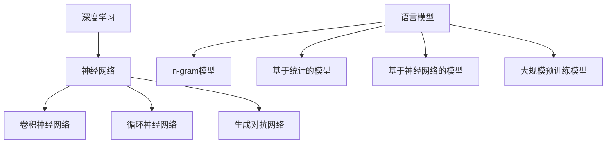

                 

# 深入理解AI、LLM和深度学习的实践课程

## 关键词

人工智能（AI）、大型语言模型（LLM）、深度学习、神经网络、反向传播、预训练、自然语言处理、图像分类

## 摘要

本文旨在深入探讨人工智能（AI）、大型语言模型（LLM）和深度学习的理论基础与实践应用。文章首先介绍了AI、LLM与深度学习的基本概念，探讨了它们之间的关系和发展趋势。接着，文章详细讲解了深度学习的基础知识，包括神经网络、深度学习算法和工具框架。随后，文章深入探讨了语言模型的基础，包括基本概念、算法和优化方法。最后，文章介绍了大规模预训练模型，并展示了深度学习、语言模型和大规模预训练模型在实际应用中的实践案例。通过本文的阅读，读者将能够全面理解AI、LLM和深度学习的核心概念和实践方法，为未来的学习和应用打下坚实的基础。

### 《深入理解AI、LLM和深度学习的实践课程》目录大纲

#### 第一部分: 理论基础

##### 第1章: AI、LLM与深度学习概述

1.1 AI、LLM与深度学习的基本概念
   1.1.1 人工智能的定义与历史发展
   1.1.2 语言模型( LLC)的概念与特点
   1.1.3 深度学习的基本原理与架构

1.2 AI、LLM与深度学习的关系
   1.2.1 AI、LLM与深度学习的交集与差异
   1.2.2 深度学习在语言模型中的应用
   1.2.3 语言模型在深度学习中的影响

1.3 人工智能的发展趋势
   1.3.1 大模型时代
   1.3.2 自适应学习与个性推荐
   1.3.3 跨领域融合与通用人工智能

##### 第2章: 深度学习基础

2.1 神经网络与深度学习
   2.1.1 神经网络的基本结构
   2.1.2 深度学习的主要架构
   2.1.3 神经网络的训练与优化

2.2 深度学习算法原理
   2.2.1 反向传播算法
   2.2.2 梯度下降算法
   2.2.3 深度强化学习算法

2.3 深度学习工具与框架
   2.3.1 TensorFlow与PyTorch的使用
   2.3.2 Keras与MXNet的快速入门
   2.3.3 DNN模型部署与优化

##### 第3章: 语言模型基础

3.1 语言模型的基本概念
   3.1.1 语言模型的作用与分类
   3.1.2 语言模型的评价指标
   3.1.3 语言模型的训练与优化

3.2 语言模型的主要算法
   3.2.1 n-gram模型
   3.2.2 基于统计的模型
   3.2.3 基于神经网络的模型

3.3 语言模型的优化与应用
   3.3.1 语言模型的优化技巧
   3.3.2 语言模型在自然语言处理中的应用
   3.3.3 语言模型在聊天机器人中的应用

##### 第4章: 大规模预训练模型

4.1 大规模预训练模型概述
   4.1.1 预训练的概念与意义
   4.1.2 大规模预训练模型的特点
   4.1.3 大规模预训练模型的分类

4.2 大规模预训练模型的原理
   4.2.1 预训练算法的流程
   4.2.2 自监督学习的原理与应用
   4.2.3 迁移学习与微调技术

4.3 大规模预训练模型的应用
   4.3.1 大规模预训练模型在文本分类中的应用
   4.3.2 大规模预训练模型在机器翻译中的应用
   4.3.3 大规模预训练模型在问答系统中的应用

#### 第二部分: 实践应用

##### 第5章: 深度学习算法实践

5.1 数据预处理与模型训练
   5.1.1 数据集的收集与清洗
   5.1.2 模型的构建与训练
   5.1.3 模型的评估与优化

5.2 深度学习算法案例分析
   5.2.1 卷积神经网络在图像分类中的应用
   5.2.2 循环神经网络在序列预测中的应用
   5.2.3 生成对抗网络在图像生成中的应用

##### 第6章: 语言模型实践

6.1 语言模型数据准备与模型训练
   6.1.1 语言模型数据集的收集与处理
   6.1.2 语言模型的构建与训练
   6.1.3 语言模型的评估与优化

6.2 语言模型应用案例分析
   6.2.1 语言模型在文本分类中的应用
   6.2.2 语言模型在机器翻译中的应用
   6.2.3 语言模型在问答系统中的应用

##### 第7章: 大规模预训练模型实践

7.1 大规模预训练模型环境搭建
   7.1.1 训练环境配置
   7.1.2 模型框架选择
   7.1.3 数据预处理流程

7.2 大规模预训练模型训练与优化
   7.2.1 预训练模型的训练过程
   7.2.2 微调与优化技巧
   7.2.3 模型的评估与部署

##### 第8章: 项目实战与案例分析

8.1 项目实战案例
   8.1.1 深度学习在金融风控中的应用
   8.1.2 语言模型在智能客服中的应用
   8.1.3 大规模预训练模型在自然语言生成中的应用

8.2 案例分析
   8.2.1 项目背景与目标
   8.2.2 技术方案与实现
   8.2.3 项目效果与总结

#### 附录

## 附录A: 常用深度学习工具与资源

### A.1 常用深度学习框架
   - TensorFlow
   - PyTorch
   - Keras

### A.2 常用自然语言处理工具
   - NLTK
   - spaCy
   - Stanford NLP

### A.3 其他资源
   - 论文资源
   - 开源代码与数据集
   - 在线课程与教材

### A.4 练习题与参考文献

### A.5 核心概念与联系图示

mermaid
graph TB
A[深度学习] --> B[神经网络]
B --> C[卷积神经网络]
B --> D[循环神经网络]
B --> E[生成对抗网络]
F[语言模型] --> G[n-gram模型]
F --> H[基于统计的模型]
F --> I[基于神经网络的模型]
F --> J[大规模预训练模型]

### AI、LLM与深度学习概述

#### AI、LLM与深度学习的基本概念

##### 1.1.1 人工智能的定义与历史发展

人工智能（Artificial Intelligence，简称AI）是指通过计算机程序实现的人类智能能力的模拟。这一概念最早由约翰·冯·诺伊曼在20世纪40年代提出。人工智能的发展历程可以分为几个阶段：

1. **初步探索阶段（1956-1969年）**：1956年，达特茅斯会议提出了人工智能的概念，标志着人工智能学科的诞生。在此期间，人工智能主要集中于逻辑推理和问题求解。

2. **知识工程阶段（1970-1980年）**：人工智能开始关注知识表示和推理，知识工程成为主要研究方法。这一阶段取得了显著的成果，如专家系统的出现。

3. **统计学习阶段（1990年代至今）**：随着计算机性能的提升和大数据时代的到来，人工智能开始采用统计学习方法，如支持向量机、神经网络等。这一阶段标志着深度学习的崛起。

##### 1.1.2 语言模型（LLM）的概念与特点

语言模型（Language Model，简称LLM）是一种统计模型，用于预测文本序列的概率分布。LLM的核心思想是，通过学习大量语言数据，建立一个能够对文本序列进行概率预测的模型。

语言模型的特点包括：

1. **概率预测**：语言模型的核心目标是预测文本序列的概率分布，而不是给出确切的输出。

2. **上下文依赖**：语言模型能够考虑上下文信息，从而提高预测的准确性。

3. **自适应性**：语言模型可以根据不同的应用场景和需求进行微调和优化。

##### 1.1.3 深度学习的基本原理与架构

深度学习（Deep Learning）是一种基于神经网络的机器学习方法，通过多层神经网络对数据进行学习。深度学习的基本原理包括：

1. **多层神经网络**：深度学习使用多层神经网络对数据进行学习，每一层都从上一层提取特征，并通过非线性变换生成新的特征。

2. **反向传播算法**：深度学习使用反向传播算法（Backpropagation）来更新网络权重，以最小化损失函数。

3. **激活函数**：深度学习中的激活函数（如ReLU、Sigmoid、Tanh）用于引入非线性特性，使得模型能够学习复杂的特征。

深度学习的架构包括：

1. **卷积神经网络（CNN）**：适用于图像处理任务，通过卷积层提取图像特征。

2. **循环神经网络（RNN）**：适用于序列数据处理，如语音识别、自然语言处理等。

3. **生成对抗网络（GAN）**：适用于图像生成、数据增强等任务。

#### AI、LLM与深度学习的关系

##### 1.2.1 AI、LLM与深度学习的交集与差异

人工智能、语言模型（LLM）和深度学习之间存在密切的交集和差异：

1. **交集**：
   - AI、LLM和深度学习都旨在实现计算机对人类智能的模拟。
   - LLM是深度学习在自然语言处理领域的重要应用。
   - 深度学习是AI的重要实现方法之一。

2. **差异**：
   - AI是一个广泛的领域，包括多个子领域，如机器学习、自然语言处理、计算机视觉等。
   - LLM是专门针对自然语言处理的模型，旨在预测文本序列的概率分布。
   - 深度学习是一种基于多层神经网络的机器学习方法，适用于各种复杂数据类型的处理。

##### 1.2.2 深度学习在语言模型中的应用

深度学习在语言模型中的应用主要体现在以下几个方面：

1. **预训练**：通过在大量无标签数据上进行预训练，深度学习语言模型可以自动学习语言的复杂结构。

2. **上下文理解**：深度学习语言模型能够考虑上下文信息，从而提高预测的准确性。

3. **生成式建模**：深度学习语言模型可以生成符合语言规则和上下文的文本序列。

##### 1.2.3 语言模型在深度学习中的影响

语言模型对深度学习的影响主要体现在以下几个方面：

1. **任务优化**：语言模型可以帮助深度学习模型更好地理解自然语言任务，从而提高模型的性能。

2. **数据预处理**：语言模型可以用于数据预处理，如文本清洗、分词、词性标注等。

3. **模型评估**：语言模型可以用于评估深度学习模型的自然语言处理能力，如文本分类、机器翻译等。

#### 人工智能的发展趋势

##### 1.3.1 大模型时代

随着计算能力和数据规模的提升，人工智能领域进入了大模型时代。大模型（Large Models）是指具有数十亿甚至千亿参数的深度学习模型。大模型时代的特征包括：

1. **参数规模**：大模型的参数规模远超传统模型，能够捕捉更复杂的特征。

2. **预训练**：大模型通过在大量无标签数据上进行预训练，提高了模型的泛化能力。

3. **自适应学习**：大模型能够通过微调和优化，适应不同的应用场景和需求。

##### 1.3.2 自适应学习与个性推荐

自适应学习是指模型能够根据用户的行为和反馈，动态调整模型参数，以提供更好的个性化服务。自适应学习在智能推荐、智能客服等领域有广泛的应用。

##### 1.3.3 跨领域融合与通用人工智能

跨领域融合是指将不同领域的技术和方法进行整合，以提高人工智能系统的性能。通用人工智能（Artificial General Intelligence，简称AGI）是指具有广泛认知能力的机器智能，能够理解和解决各种复杂问题。

### 深度学习基础

#### 神经网络与深度学习

##### 2.1.1 神经网络的基本结构

神经网络（Neural Networks）是深度学习的基础。神经网络由多个神经元（或节点）组成，每个神经元都与其他神经元相连接。神经网络的基本结构包括：

1. **输入层**：输入层接收外部输入数据，并将其传递给下一层。

2. **隐藏层**：隐藏层对输入数据进行特征提取和变换，以生成更高级别的特征。

3. **输出层**：输出层生成最终输出，如分类结果或回归值。

每个神经元都可以表示为一个简单的计算单元，其输出由输入数据、权重和偏置共同决定。神经元的输出通常通过激活函数进行非线性变换。

##### 2.1.2 深度学习的主要架构

深度学习的主要架构包括：

1. **卷积神经网络（CNN）**：适用于图像处理任务，通过卷积层、池化层等结构提取图像特征。

2. **循环神经网络（RNN）**：适用于序列数据处理任务，如语音识别、自然语言处理等，通过隐藏状态和循环结构处理序列数据。

3. **生成对抗网络（GAN）**：适用于图像生成、数据增强等任务，由生成器和判别器两个网络组成。

##### 2.1.3 神经网络的训练与优化

神经网络的训练与优化主要包括以下几个步骤：

1. **前向传播**：将输入数据通过网络进行传递，计算每个神经元的输出。

2. **计算损失**：使用损失函数计算预测值与真实值之间的差距。

3. **反向传播**：通过反向传播算法，将损失函数的梯度反向传播到网络中的每个神经元，以更新网络权重。

4. **优化算法**：使用优化算法（如梯度下降、Adam等）更新网络权重，以最小化损失函数。

通过反复迭代训练，神经网络可以逐步提高预测准确性。

#### 深度学习算法原理

##### 2.2.1 反向传播算法

反向传播算法（Backpropagation Algorithm）是深度学习训练过程中最核心的算法之一。其基本思想是，通过计算输出层到输入层的梯度，以更新网络权重。

反向传播算法的步骤如下：

1. **前向传播**：将输入数据通过网络进行传递，计算每个神经元的输出。

2. **计算损失**：使用损失函数计算预测值与真实值之间的差距。

3. **计算梯度**：从输出层开始，将损失函数的梯度反向传播到网络中的每个神经元，以更新网络权重。

4. **更新权重**：使用优化算法（如梯度下降、Adam等）更新网络权重。

通过反复迭代反向传播算法，神经网络可以逐步提高预测准确性。

##### 2.2.2 梯度下降算法

梯度下降算法（Gradient Descent Algorithm）是一种优化算法，用于更新网络权重，以最小化损失函数。其基本思想是，通过计算损失函数的梯度，逐步调整网络权重。

梯度下降算法的步骤如下：

1. **初始化参数**：设置初始网络权重。

2. **计算梯度**：计算损失函数关于网络权重的梯度。

3. **更新参数**：使用梯度调整网络权重。

4. **迭代**：重复计算梯度、更新参数的过程，直至满足停止条件。

梯度下降算法的优化目标是最小化损失函数，即找到一组权重，使得损失函数值最小。

##### 2.2.3 深度强化学习算法

深度强化学习（Deep Reinforcement Learning）是一种结合深度学习和强化学习的算法。其基本思想是，通过深度神经网络来学习和模拟智能体的行为策略，并在环境中进行交互，以最大化累积奖励。

深度强化学习算法的步骤如下：

1. **初始化参数**：设置初始网络权重和行为策略。

2. **交互学习**：智能体在环境中进行交互，收集经验。

3. **更新策略**：使用深度神经网络更新行为策略。

4. **迭代**：重复交互学习和策略更新的过程，直至满足停止条件。

深度强化学习算法的核心目标是学习到一个最优策略，使得智能体能够在环境中取得最大化的累积奖励。

#### 深度学习工具与框架

##### 2.3.1 TensorFlow与PyTorch的使用

TensorFlow和PyTorch是当前最流行的深度学习框架之一。下面简要介绍这两个框架的使用。

1. **TensorFlow**：

- **安装**：使用pip安装TensorFlow：`pip install tensorflow`
- **使用**：

```python
import tensorflow as tf

# 创建模型
model = tf.keras.Sequential([
    tf.keras.layers.Dense(128, activation='relu', input_shape=(784,)),
    tf.keras.layers.Dense(10, activation='softmax')
])

# 编译模型
model.compile(optimizer='adam', loss='sparse_categorical_crossentropy', metrics=['accuracy'])

# 训练模型
model.fit(x_train, y_train, epochs=5, batch_size=32)
```

2. **PyTorch**：

- **安装**：使用pip安装PyTorch：`pip install torch torchvision`
- **使用**：

```python
import torch
import torchvision
import torch.nn as nn
import torch.optim as optim

# 创建模型
model = nn.Sequential(
    nn.Linear(784, 128),
    nn.ReLU(),
    nn.Linear(128, 10)
)

# 编译模型
optimizer = optim.Adam(model.parameters(), lr=0.001)
criterion = nn.CrossEntropyLoss()

# 训练模型
for epoch in range(5):
    for inputs, targets in data_loader:
        optimizer.zero_grad()
        outputs = model(inputs)
        loss = criterion(outputs, targets)
        loss.backward()
        optimizer.step()
```

##### 2.3.2 Keras与MXNet的快速入门

Keras和MXNet也是常用的深度学习框架。下面简要介绍这两个框架的快速入门。

1. **Keras**：

- **安装**：使用pip安装Keras：`pip install keras`
- **使用**：

```python
from keras.models import Sequential
from keras.layers import Dense, Activation

# 创建模型
model = Sequential()
model.add(Dense(128, input_dim=784, activation='relu'))
model.add(Dense(10, activation='softmax'))

# 编译模型
model.compile(optimizer='adam', loss='categorical_crossentropy', metrics=['accuracy'])

# 训练模型
model.fit(x_train, y_train, epochs=5, batch_size=32)
```

2. **MXNet**：

- **安装**：使用pip安装MXNet：`pip install mxnet`
- **使用**：

```python
import mxnet as mx
from mxnet.gluon import nn

# 创建模型
model = nn.Sequential()
model.add(nn.Dense(128, activation='relu'))
model.add(nn.Dense(10, activation='softmax'))

# 编译模型
optimizer = mx.optimizer.Adam()
model.fit(X_train, y_train, optimizer=optimizer, epochs=5)
```

##### 2.3.3 DNN模型部署与优化

深度神经网络（DNN）模型的部署与优化是深度学习应用中至关重要的一环。下面简要介绍DNN模型的部署与优化方法。

1. **模型部署**：

- **服务化部署**：将训练好的模型部署到服务端，供客户端进行推理。
- **嵌入式部署**：将训练好的模型嵌入到嵌入式设备中，进行本地推理。

2. **模型优化**：

- **模型剪枝**：通过剪枝算法减少模型参数，以降低模型的复杂度和计算成本。
- **量化**：将模型中的浮点数参数替换为整数参数，以降低模型的大小和计算复杂度。
- **蒸馏**：通过将大模型的知识传递给小模型，以提高小模型的性能。

### 语言模型基础

#### 语言模型的基本概念

##### 3.1.1 语言模型的作用与分类

语言模型（Language Model，简称LM）是一种统计模型，用于预测自然语言序列的概率分布。语言模型在自然语言处理（Natural Language Processing，简称NLP）领域具有重要应用，如文本生成、语音识别、机器翻译等。

语言模型可以分为以下几类：

1. **n-gram模型**：基于历史n个词的序列来预测下一个词的概率。
2. **基于统计的模型**：利用统计方法（如最大似然估计、信息增益等）来构建语言模型。
3. **基于神经网络的模型**：使用神经网络来学习语言的复杂结构。

##### 3.1.2 语言模型的评价指标

语言模型的评价指标主要包括：

1. **交叉熵（Cross-Entropy）**：衡量模型预测的概率分布与真实分布之间的差距。
2. **准确率（Accuracy）**：衡量模型预测正确的比例。
3. **召回率（Recall）**：衡量模型预测为正样本的比例。
4. **F1分数（F1 Score）**：综合考虑准确率和召回率，平衡模型性能。

##### 3.1.3 语言模型的训练与优化

语言模型的训练与优化主要包括以下几个步骤：

1. **数据预处理**：对文本数据进行分词、去停用词、词向量编码等预处理操作。
2. **模型构建**：选择合适的模型架构，如n-gram模型、基于统计的模型或基于神经网络的模型。
3. **模型训练**：使用训练数据对模型进行训练，通过优化算法（如梯度下降、Adam等）更新模型参数。
4. **模型评估**：使用测试数据对模型进行评估，计算评价指标，以衡量模型性能。
5. **模型优化**：根据评估结果调整模型参数，优化模型结构，以提高模型性能。

#### 语言模型的主要算法

##### 3.2.1 n-gram模型

n-gram模型是最简单的语言模型之一，它基于历史n个词的序列来预测下一个词的概率。n-gram模型的构建过程如下：

1. **数据预处理**：对文本数据进行分词，生成词序列。
2. **统计词频**：计算每个词在文本中出现的次数。
3. **构建模型**：使用概率统计方法计算每个n-gram词序列的概率。
4. **模型优化**：通过最大似然估计、最小化交叉熵等方法优化模型参数。

n-gram模型的主要优势是简单、高效，但缺点是只能捕捉短程依赖，无法捕捉长程依赖。

##### 3.2.2 基于统计的模型

基于统计的模型利用统计方法（如最大似然估计、信息增益等）来构建语言模型。常见的基于统计的模型包括：

1. **隐马尔可夫模型（HMM）**：用于语音识别和文本生成，通过状态转移概率和发射概率建模语言的时序特性。
2. **条件随机场（CRF）**：用于文本分类和序列标注，通过条件概率建模标签序列之间的关系。

基于统计的模型的优势在于能够捕捉语言的时序特性和上下文依赖，但缺点是需要大量的标记数据。

##### 3.2.3 基于神经网络的模型

基于神经网络的模型使用神经网络来学习语言的复杂结构。常见的基于神经网络的模型包括：

1. **循环神经网络（RNN）**：通过隐藏状态和循环结构捕捉长程依赖。
2. **长短期记忆网络（LSTM）**：对RNN的改进，能够更好地捕捉长程依赖。
3. **门控循环单元（GRU）**：对LSTM的改进，结构更简洁。

基于神经网络的模型的优势在于能够捕捉语言的复杂结构，但缺点是需要大量的计算资源和时间。

#### 语言模型的优化与应用

##### 3.3.1 语言模型的优化技巧

语言模型的优化技巧主要包括：

1. **数据预处理**：使用词嵌入、词向量编码等技术对文本数据进行预处理，以提高模型的性能。
2. **模型结构优化**：通过调整模型结构（如增加隐藏层、增加神经元等）来优化模型性能。
3. **训练策略优化**：使用不同的优化算法（如梯度下降、Adam等）、学习率调整策略等来优化训练过程。
4. **超参数调整**：调整模型的超参数（如学习率、批次大小等）来优化模型性能。

##### 3.3.2 语言模型在自然语言处理中的应用

语言模型在自然语言处理中具有广泛的应用，如：

1. **文本分类**：用于对文本数据进行分类，如情感分析、新闻分类等。
2. **文本生成**：用于生成文本，如文章生成、对话系统等。
3. **机器翻译**：用于将一种语言的文本翻译成另一种语言。
4. **命名实体识别**：用于识别文本中的命名实体，如人名、地名等。

##### 3.3.3 语言模型在聊天机器人中的应用

语言模型在聊天机器人中具有重要作用，如：

1. **对话生成**：用于生成自然语言对话，提高聊天机器人的交互能力。
2. **意图识别**：用于识别用户的意图，如查询、请求等。
3. **对话管理**：用于管理对话流程，如对话引导、上下文维护等。

通过以上优化与应用，语言模型在自然语言处理和聊天机器人领域取得了显著的成果。

### 大规模预训练模型

#### 大规模预训练模型概述

##### 4.1.1 预训练的概念与意义

预训练（Pretraining）是指在一个大规模的、无标签的数据集上，对模型进行预训练，从而使其自动学习到语言的复杂结构。预训练的概念在深度学习领域具有重要意义，主要表现在以下几个方面：

1. **提高模型性能**：通过在大量无标签数据上进行预训练，模型能够更好地理解语言的复杂结构，从而提高模型在下游任务中的性能。
2. **减少标记数据需求**：预训练模型不需要大量的标记数据，从而降低了下游任务的数据获取成本。
3. **提高泛化能力**：预训练模型能够在不同领域和任务上表现出良好的泛化能力，从而降低了模型对新任务的适应性要求。

##### 4.1.2 大规模预训练模型的特点

大规模预训练模型具有以下特点：

1. **大规模参数**：大规模预训练模型通常具有数十亿甚至千亿参数，能够捕捉到语言的复杂结构。
2. **大规模数据**：大规模预训练模型通常使用数十亿甚至数千亿个单词的文本数据进行预训练，从而获得丰富的语言知识。
3. **自监督学习**：大规模预训练模型采用自监督学习方法，通过在无标签数据上预测下一个词、下一个句子等，自动学习到语言的复杂结构。

##### 4.1.3 大规模预训练模型的分类

大规模预训练模型可以根据不同的训练目标和任务类型进行分类，常见的分类包括：

1. **通用语言模型**：如GPT、BERT等，主要用于自然语言理解和生成任务。
2. **任务特定模型**：如T5、UniLM等，针对特定任务进行微调和优化，以提高任务性能。
3. **多模态预训练模型**：如ViT、Audio2Text等，结合文本和图像、音频等多种模态的数据进行预训练，以实现多模态任务。

#### 大规模预训练模型的原理

##### 4.2.1 预训练算法的流程

大规模预训练模型的预训练算法通常包括以下步骤：

1. **数据收集与预处理**：收集大规模的无标签文本数据，并进行预处理，如分词、词向量编码等。
2. **自监督学习**：在无标签数据上，通过自监督学习任务（如下一个词预测、下一个句子预测等）对模型进行预训练。
3. **微调**：在预训练的基础上，针对特定任务对模型进行微调，以提高任务性能。
4. **评估与优化**：使用测试数据对模型进行评估，并根据评估结果对模型进行优化。

##### 4.2.2 自监督学习的原理与应用

自监督学习（Self-Supervised Learning）是一种无需标记数据的监督学习方法，其基本思想是从无标签数据中自动提取监督信号。在预训练模型中，自监督学习被广泛应用于大规模数据的预训练过程。

自监督学习的原理包括：

1. **预测下一个词**：在文本序列中，预测下一个词的概率分布，从而学习到语言的局部结构。
2. **预测下一个句子**：在文本序列中，预测下一个句子的概率分布，从而学习到语言的上下文信息。
3. ** masked Language Modeling（MLM）**：在文本序列中，随机遮蔽一部分词，然后预测这些遮蔽词的词向量，从而学习到语言的语义信息。

自监督学习在预训练模型中的应用包括：

1. **通用语言模型**：如GPT、BERT等，通过自监督学习任务对模型进行预训练，从而提高模型在自然语言理解和生成任务中的性能。
2. **多模态预训练模型**：如ViT、Audio2Text等，通过结合文本和图像、音频等多种模态的数据进行自监督学习，从而提高模型在多模态任务中的性能。

##### 4.2.3 迁移学习与微调技术

迁移学习（Transfer Learning）是一种利用预训练模型在特定任务上的知识来提高新任务的性能的方法。在预训练模型中，迁移学习被广泛应用于新任务的微调过程。

迁移学习与微调技术的原理包括：

1. **预训练模型**：在大量无标签数据上进行预训练，从而获得丰富的语言知识。
2. **微调**：在预训练的基础上，针对特定任务对模型进行微调，以提高任务性能。
3. **任务适应**：通过微调，使预训练模型适应特定任务的需求，从而提高任务性能。

迁移学习与微调技术在实际应用中包括：

1. **文本分类**：使用预训练模型对文本进行分类，如情感分析、新闻分类等。
2. **机器翻译**：使用预训练模型对文本进行翻译，如英译中、中译英等。
3. **问答系统**：使用预训练模型对问答系统进行微调，从而提高问答系统的性能。

#### 大规模预训练模型的应用

##### 4.3.1 大规模预训练模型在文本分类中的应用

大规模预训练模型在文本分类中的应用包括：

1. **预训练**：使用大规模的无标签文本数据对预训练模型进行预训练，从而获得丰富的语言知识。
2. **微调**：在预训练的基础上，针对特定文本分类任务对模型进行微调，以提高分类性能。
3. **评估与优化**：使用测试数据对模型进行评估，并根据评估结果对模型进行优化。

大规模预训练模型在文本分类中的应用案例包括：

1. **情感分析**：使用预训练模型对社交媒体文本进行情感分析，如微博、推特等。
2. **新闻分类**：使用预训练模型对新闻文本进行分类，如体育、财经、科技等。
3. **垃圾邮件检测**：使用预训练模型对电子邮件进行分类，从而提高垃圾邮件检测的准确性。

##### 4.3.2 大规模预训练模型在机器翻译中的应用

大规模预训练模型在机器翻译中的应用包括：

1. **预训练**：使用大规模的双语文本数据对预训练模型进行预训练，从而获得丰富的语言知识。
2. **微调**：在预训练的基础上，针对特定机器翻译任务对模型进行微调，以提高翻译性能。
3. **评估与优化**：使用测试数据对模型进行评估，并根据评估结果对模型进行优化。

大规模预训练模型在机器翻译中的应用案例包括：

1. **英译中**：使用预训练模型将英语文本翻译成中文，如新闻翻译、文档翻译等。
2. **中译英**：使用预训练模型将中文文本翻译成英语，如商业翻译、学术论文翻译等。
3. **多语言翻译**：使用预训练模型实现多语言之间的翻译，如中译英、英译法等。

##### 4.3.3 大规模预训练模型在问答系统中的应用

大规模预训练模型在问答系统中的应用包括：

1. **预训练**：使用大规模的问答数据对预训练模型进行预训练，从而获得丰富的语言知识。
2. **微调**：在预训练的基础上，针对特定问答任务对模型进行微调，以提高问答性能。
3. **评估与优化**：使用测试数据对模型进行评估，并根据评估结果对模型进行优化。

大规模预训练模型在问答系统中的应用案例包括：

1. **文本检索式问答**：使用预训练模型实现文本检索式问答，如搜索引擎问答、企业内部问答系统等。
2. **生成式问答**：使用预训练模型实现生成式问答，如对话机器人、智能客服等。
3. **跨领域问答**：使用预训练模型实现跨领域的问答，如医疗问答、法律问答等。

### 深度学习算法实践

#### 数据预处理与模型训练

##### 5.1.1 数据集的收集与清洗

数据预处理是深度学习算法实践中的关键步骤之一，首先需要收集适合的数据集。对于不同的任务，数据集的来源可能包括公开数据集、企业内部数据等。收集到数据集后，需要进行清洗处理，包括去除噪声、填补缺失值、去除重复数据等。

以图像分类任务为例，可以使用以下步骤进行数据预处理：

1. **数据收集**：使用开源数据集，如ImageNet、CIFAR-10等。
2. **数据清洗**：去除标注错误、缺失的图像数据。
3. **数据增强**：通过旋转、缩放、裁剪等方法增加数据的多样性，提高模型的泛化能力。

##### 5.1.2 模型的构建与训练

在数据预处理完成后，接下来是构建深度学习模型并进行训练。以卷积神经网络（CNN）为例，构建和训练模型的过程如下：

1. **模型构建**：使用深度学习框架（如TensorFlow、PyTorch）构建CNN模型。模型通常包括卷积层、池化层和全连接层。

```python
import tensorflow as tf

model = tf.keras.Sequential([
    tf.keras.layers.Conv2D(32, (3, 3), activation='relu', input_shape=(28, 28, 1)),
    tf.keras.layers.MaxPooling2D((2, 2)),
    tf.keras.layers.Conv2D(64, (3, 3), activation='relu'),
    tf.keras.layers.MaxPooling2D((2, 2)),
    tf.keras.layers.Flatten(),
    tf.keras.layers.Dense(128, activation='relu'),
    tf.keras.layers.Dense(10, activation='softmax')
])
```

2. **模型编译**：设置模型的优化器、损失函数和评价指标。

```python
model.compile(optimizer='adam',
              loss='sparse_categorical_crossentropy',
              metrics=['accuracy'])
```

3. **模型训练**：使用训练数据对模型进行训练。

```python
model.fit(x_train, y_train, epochs=10, batch_size=32, validation_split=0.2)
```

##### 5.1.3 模型的评估与优化

在模型训练完成后，需要对模型进行评估和优化。常用的评估指标包括准确率（accuracy）、召回率（recall）、精确率（precision）和F1分数（F1 score）。

1. **模型评估**：使用测试数据对模型进行评估，以了解模型的性能。

```python
test_loss, test_acc = model.evaluate(x_test, y_test)
print(f"Test accuracy: {test_acc}")
```

2. **模型优化**：根据评估结果对模型进行优化，包括调整模型结构、学习率、训练策略等。

```python
# 调整学习率
optimizer = tf.keras.optimizers.Adam(learning_rate=0.0001)
model.compile(optimizer=optimizer,
              loss='sparse_categorical_crossentropy',
              metrics=['accuracy'])

# 重新训练模型
model.fit(x_train, y_train, epochs=10, batch_size=32, validation_split=0.2)
```

#### 深度学习算法案例分析

##### 5.2.1 卷积神经网络在图像分类中的应用

卷积神经网络（CNN）是图像分类任务中最常用的深度学习算法之一。以下是一个使用CNN进行图像分类的案例：

1. **数据集**：使用CIFAR-10数据集，该数据集包含10个类别，每个类别6000张图像。

2. **数据预处理**：对图像进行归一化处理，将图像的像素值缩放到[0, 1]之间。

3. **模型构建**：构建一个简单的CNN模型，包括两个卷积层、一个池化层和一个全连接层。

```python
import tensorflow as tf
from tensorflow.keras import layers

model = tf.keras.Sequential([
    layers.Conv2D(32, (3, 3), activation='relu', input_shape=(32, 32, 3)),
    layers.MaxPooling2D(pool_size=(2, 2)),
    layers.Conv2D(64, (3, 3), activation='relu'),
    layers.MaxPooling2D(pool_size=(2, 2)),
    layers.Flatten(),
    layers.Dense(64, activation='relu'),
    layers.Dense(10, activation='softmax')
])
```

4. **模型编译**：设置模型的优化器、损失函数和评价指标。

```python
model.compile(optimizer='adam',
              loss='sparse_categorical_crossentropy',
              metrics=['accuracy'])
```

5. **模型训练**：使用训练数据对模型进行训练。

```python
model.fit(x_train, y_train, epochs=10, batch_size=32, validation_split=0.2)
```

6. **模型评估**：使用测试数据对模型进行评估。

```python
test_loss, test_acc = model.evaluate(x_test, y_test)
print(f"Test accuracy: {test_acc}")
```

##### 5.2.2 循环神经网络在序列预测中的应用

循环神经网络（RNN）是序列预测任务中最常用的深度学习算法之一。以下是一个使用RNN进行时间序列预测的案例：

1. **数据集**：使用时间序列数据集，如股票价格、气象数据等。

2. **数据预处理**：对时间序列数据进行归一化处理，将数据缩放到[0, 1]之间。

3. **模型构建**：构建一个简单的RNN模型，包括一个循环层和一个全连接层。

```python
import tensorflow as tf
from tensorflow.keras.layers import SimpleRNN

model = tf.keras.Sequential([
    tf.keras.layers.SimpleRNN(50, input_shape=(time_steps, features)),
    tf.keras.layers.Dense(1)
])
```

4. **模型编译**：设置模型的优化器、损失函数和评价指标。

```python
model.compile(optimizer='adam', loss='mse')
```

5. **模型训练**：使用训练数据对模型进行训练。

```python
model.fit(x_train, y_train, epochs=100, batch_size=32, validation_data=(x_test, y_test))
```

6. **模型评估**：使用测试数据对模型进行评估。

```python
mse = model.evaluate(x_test, y_test)
print(f"Test MSE: {mse}")
```

##### 5.2.3 生成对抗网络在图像生成中的应用

生成对抗网络（GAN）是图像生成任务中最常用的深度学习算法之一。以下是一个使用GAN生成手写数字图像的案例：

1. **数据集**：使用MNIST数据集，该数据集包含手写数字的图像。

2. **数据预处理**：对图像进行归一化处理，将图像的像素值缩放到[-1, 1]之间。

3. **模型构建**：构建一个简单的GAN模型，包括生成器（Generator）和判别器（Discriminator）。

```python
import tensorflow as tf
from tensorflow.keras.layers import Dense, Conv2D, Flatten

# 生成器模型
generator = tf.keras.Sequential([
    Dense(128, input_shape=(100,)),
    tf.keras.layers.LeakyReLU(alpha=0.01),
    Dense(256, activation='tanh'),
    Flatten(),
    Conv2D(1, kernel_size=(7, 7), padding='same', activation='tanh')
])

# 判别器模型
discriminator = tf.keras.Sequential([
    Conv2D(32, kernel_size=(3, 3), padding='same', activation='leaky_relu'),
    tf.keras.layers.LeakyReLU(alpha=0.01),
    Conv2D(64, kernel_size=(3, 3), padding='same', activation='leaky_relu'),
    Flatten(),
    Dense(1, activation='sigmoid')
])
```

4. **模型编译**：设置生成器和判别器的优化器、损失函数和评价指标。

```python
generator.compile(optimizer=tf.keras.optimizers.Adam(learning_rate=0.0001), loss='binary_crossentropy')
discriminator.compile(optimizer=tf.keras.optimizers.Adam(learning_rate=0.0001), loss='binary_crossentropy')

# 搭建联合模型
discriminator.trainable = False
gan = tf.keras.Sequential([generator, discriminator])
gan.compile(optimizer=tf.keras.optimizers.Adam(learning_rate=0.0001), loss='binary_crossentropy')
```

5. **模型训练**：使用对抗训练方法对模型进行训练。

```python
for epoch in range(100):
    # 生成器训练
    noise = np.random.normal(0, 1, (batch_size, 100))
    generated_images = generator.predict(noise)
    real_images = x_train[:batch_size]

    # 计算判别器损失
    d_loss_real = discriminator.train_on_batch(real_images, np.ones(batch_size))
    d_loss_fake = discriminator.train_on_batch(generated_images, np.zeros(batch_size))

    # 计算生成器损失
    g_loss = gan.train_on_batch(noise, np.ones(batch_size))

    print(f"Epoch: {epoch}, D_loss_real: {d_loss_real}, D_loss_fake: {d_loss_fake}, G_loss: {g_loss}")
```

6. **模型评估**：使用生成的图像进行评估。

```python
generated_images = generator.predict(np.random.normal(0, 1, (10, 100)))
plt.figure(figsize=(10, 10))
for i in range(10):
    plt.subplot(10, 10, i+1)
    plt.imshow(generated_images[i], cmap='gray')
plt.show()
```

### 语言模型实践

#### 语言模型数据准备与模型训练

##### 6.1.1 语言模型数据集的收集与处理

语言模型的训练需要大量的文本数据，这些数据可以从各种来源收集，如网页、书籍、新闻、社交媒体等。收集到数据后，需要进行以下处理步骤：

1. **数据清洗**：去除数据中的噪声，如HTML标签、特殊字符等。
2. **分词**：将文本数据分词，将句子拆分成单词或子词。
3. **词向量编码**：将单词或子词转化为词向量，以便在神经网络中进行处理。

以训练一个基于神经网络的文本分类模型为例，数据准备的过程如下：

1. **数据收集**：使用开源数据集，如AG News、20 Newsgroups等。
2. **数据清洗**：使用正则表达式去除HTML标签和特殊字符。
3. **分词**：使用自然语言处理库（如NLTK、spaCy）进行分词。

```python
import nltk
nltk.download('punkt')
from nltk.tokenize import word_tokenize

with open('data.txt', 'r') as file:
    text = file.read()

# 分词
tokens = word_tokenize(text)
```

4. **词向量编码**：使用预训练的词向量（如Word2Vec、GloVe）或训练自己的词向量。

```python
import gensim.downloader as api

# 使用预训练的Word2Vec词向量
model = api.load("word2vec_bin.gz")

# 将分词后的文本转化为词向量
word_vectors = [model[word] for word in tokens if word in model]
```

##### 6.1.2 语言模型的构建与训练

构建语言模型通常使用基于神经网络的架构，如循环神经网络（RNN）、长短期记忆网络（LSTM）、门控循环单元（GRU）等。以下是使用LSTM构建语言模型的步骤：

1. **模型构建**：使用深度学习框架（如TensorFlow、PyTorch）构建LSTM模型。

```python
import tensorflow as tf
from tensorflow.keras.models import Sequential
from tensorflow.keras.layers import Embedding, LSTM, Dense

# 设置超参数
vocab_size = 10000
embed_dim = 256
lstm_units = 128
max_sequence_length = 100

# 构建模型
model = Sequential()
model.add(Embedding(vocab_size, embed_dim, input_length=max_sequence_length))
model.add(LSTM(lstm_units, return_sequences=True))
model.add(Dense(1, activation='sigmoid'))

model.compile(optimizer='adam', loss='binary_crossentropy', metrics=['accuracy'])
```

2. **模型训练**：使用训练数据和标签对模型进行训练。

```python
# 准备训练数据
X_train = np.array(word_vectors[:train_samples])
y_train = np.array(train_labels)

# 训练模型
model.fit(X_train, y_train, epochs=10, batch_size=32)
```

##### 6.1.3 语言模型的评估与优化

在模型训练完成后，需要对模型进行评估和优化。以下是一些评估和优化模型的方法：

1. **模型评估**：使用测试数据对模型进行评估，计算准确率、召回率、精确率等指标。

```python
# 准备测试数据
X_test = np.array(word_vectors[train_samples:])
y_test = np.array(test_labels)

# 评估模型
accuracy = model.evaluate(X_test, y_test)
print(f"Test accuracy: {accuracy[1]}")
```

2. **超参数调整**：通过调整模型超参数（如学习率、批次大小、隐藏层单元数等）来优化模型性能。

```python
# 调整学习率
model.compile(optimizer=tf.keras.optimizers.Adam(learning_rate=0.0001), loss='binary_crossentropy', metrics=['accuracy'])

# 重新训练模型
model.fit(X_train, y_train, epochs=10, batch_size=32, validation_data=(X_test, y_test))
```

3. **模型优化**：使用正则化方法（如L1、L2正则化）和Dropout方法来防止过拟合。

```python
from tensorflow.keras import regularizers

# 添加L2正则化
model.add(Dense(1, activation='sigmoid', kernel_regularizer=regularizers.l2(0.01)))

# 重新编译模型
model.compile(optimizer='adam', loss='binary_crossentropy', metrics=['accuracy'])

# 重新训练模型
model.fit(X_train, y_train, epochs=10, batch_size=32, validation_data=(X_test, y_test))
```

#### 语言模型应用案例分析

##### 6.2.1 语言模型在文本分类中的应用

语言模型在文本分类任务中可以用来对文本进行分类，例如将新闻文章分为不同的类别（如体育、财经、科技等）。以下是一个使用语言模型进行文本分类的案例分析：

1. **数据集**：使用AG News数据集，该数据集包含20个新闻类别，每个类别约有1000篇文章。

2. **数据预处理**：对文本进行分词、去停用词、词向量编码等预处理操作。

3. **模型构建**：使用LSTM模型进行文本分类。

```python
import tensorflow as tf
from tensorflow.keras.models import Sequential
from tensorflow.keras.layers import Embedding, LSTM, Dense

# 设置超参数
vocab_size = 10000
embed_dim = 256
lstm_units = 128
max_sequence_length = 100

# 构建模型
model = Sequential()
model.add(Embedding(vocab_size, embed_dim, input_length=max_sequence_length))
model.add(LSTM(lstm_units, return_sequences=True))
model.add(Dense(20, activation='softmax'))

model.compile(optimizer='adam', loss='categorical_crossentropy', metrics=['accuracy'])
```

4. **模型训练**：使用训练数据和标签对模型进行训练。

```python
# 准备训练数据
X_train = np.array(word_vectors[:train_samples])
y_train = np.array(train_labels)

# 训练模型
model.fit(X_train, y_train, epochs=10, batch_size=32)
```

5. **模型评估**：使用测试数据对模型进行评估。

```python
# 准备测试数据
X_test = np.array(word_vectors[train_samples:])
y_test = np.array(test_labels)

# 评估模型
accuracy = model.evaluate(X_test, y_test)
print(f"Test accuracy: {accuracy[1]}")
```

##### 6.2.2 语言模型在机器翻译中的应用

语言模型在机器翻译任务中可以用来将一种语言的文本翻译成另一种语言。以下是一个使用语言模型进行机器翻译的案例分析：

1. **数据集**：使用翻译对数据集，如English-French翻译数据集。

2. **数据预处理**：对文本进行分词、去停用词、词向量编码等预处理操作。

3. **模型构建**：使用序列到序列（Seq2Seq）模型进行机器翻译。

```python
import tensorflow as tf
from tensorflow.keras.models import Model
from tensorflow.keras.layers import Embedding, LSTM, Dense, TimeDistributed

# 设置超参数
vocab_size = 10000
embed_dim = 256
lstm_units = 128
max_sequence_length = 100

# 构建编码器模型
encoder_inputs = Embedding(vocab_size, embed_dim, input_length=max_sequence_length)
encoder_lstm = LSTM(lstm_units, return_sequences=True)
encoder_output = encoder_lstm(encoder_inputs)

# 构建解码器模型
decoder_inputs = Embedding(vocab_size, embed_dim, input_length=max_sequence_length)
decoder_lstm = LSTM(lstm_units, return_sequences=True)
decoder_output = decoder_lstm(decoder_inputs)

# 构建模型
model = Model(inputs=encoder_inputs, outputs=decoder_output)
model.compile(optimizer='adam', loss='categorical_crossentropy', metrics=['accuracy'])
```

4. **模型训练**：使用翻译对数据对模型进行训练。

```python
# 准备训练数据
X_train = np.array(encoder_inputs[:train_samples])
y_train = np.array(decoder_inputs[:train_samples])

# 训练模型
model.fit(X_train, y_train, epochs=10, batch_size=32)
```

5. **模型评估**：使用测试数据对模型进行评估。

```python
# 准备测试数据
X_test = np.array(encoder_inputs[train_samples:])
y_test = np.array(decoder_inputs[train_samples:])

# 评估模型
accuracy = model.evaluate(X_test, y_test)
print(f"Test accuracy: {accuracy[1]}")
```

##### 6.2.3 语言模型在问答系统中的应用

语言模型在问答系统（Question Answering System）中可以用来回答用户提出的问题。以下是一个使用语言模型进行问答系统的案例分析：

1. **数据集**：使用问答对数据集，如SQuAD数据集。

2. **数据预处理**：对文本进行分词、去停用词、词向量编码等预处理操作。

3. **模型构建**：使用双向循环神经网络（BiLSTM）和全局注意力机制进行问答系统。

```python
import tensorflow as tf
from tensorflow.keras.models import Model
from tensorflow.keras.layers import Embedding, LSTM, Dense, TimeDistributed, Bidirectional

# 设置超参数
vocab_size = 10000
embed_dim = 256
lstm_units = 128
max_question_length = 50
max_answer_length = 30

# 构建编码器模型
encoder_inputs = Embedding(vocab_size, embed_dim, input_length=max_question_length)
encoder_lstm = Bidirectional(LSTM(lstm_units, return_sequences=True))
encoder_outputs = encoder_lstm(encoder_inputs)

# 构建解码器模型
decoder_inputs = Embedding(vocab_size, embed_dim, input_length=max_answer_length)
decoder_lstm = LSTM(lstm_units, return_sequences=True)
decoder_outputs = decoder_lstm(decoder_inputs)

# 构建全局注意力机制
attention = Dense(1, activation='tanh')
attention_scores = attention(encoder_outputs)
attention_scores = tf.reduce_sum(attention_scores, axis=1)

# 构建模型
decoder_dense = TimeDistributed(Dense(vocab_size, activation='softmax'))
decoder_outputs = decoder_dense(decoder_outputs)

model = Model(inputs=[encoder_inputs, decoder_inputs], outputs=decoder_outputs)
model.compile(optimizer='adam', loss='categorical_crossentropy', metrics=['accuracy'])
```

4. **模型训练**：使用问答对数据对模型进行训练。

```python
# 准备训练数据
X_train = np.array(encoder_inputs[:train_samples])
y_train = np.array(decoder_inputs[:train_samples])

# 训练模型
model.fit(X_train, y_train, epochs=10, batch_size=32)
```

5. **模型评估**：使用测试数据对模型进行评估。

```python
# 准备测试数据
X_test = np.array(encoder_inputs[train_samples:])
y_test = np.array(decoder_inputs[train_samples:])

# 评估模型
accuracy = model.evaluate(X_test, y_test)
print(f"Test accuracy: {accuracy[1]}")
```

### 大规模预训练模型实践

#### 大规模预训练模型环境搭建

##### 7.1.1 训练环境配置

为了训练大规模预训练模型，需要配置合适的计算环境和硬件资源。以下是一个基本的训练环境配置步骤：

1. **安装Python**：确保安装了Python 3.7及以上版本。

2. **安装深度学习框架**：选择合适的深度学习框架，如TensorFlow 2.x或PyTorch 1.8。使用以下命令安装：

```shell
pip install tensorflow==2.x  # TensorFlow
pip install torch torchvision==0.9.0  # PyTorch
```

3. **安装GPU支持**：确保安装了NVIDIA的CUDA和cuDNN库，以便利用GPU进行加速计算。可以从NVIDIA官网下载安装。

4. **配置CUDA**：在Linux系统中，设置CUDA路径和CUDA版本，以便在Python中调用GPU。

```shell
export PATH=$PATH:/usr/local/cuda/bin
export LD_LIBRARY_PATH=$LD_LIBRARY_PATH:/usr/local/cuda/lib64:/usr/local/cuda/extras/CUДNN/lib64
```

##### 7.1.2 模型框架选择

选择适合的大规模预训练模型框架，如GPT、BERT、T5等。以下是一个基于BERT模型的环境搭建示例：

1. **安装transformers库**：使用以下命令安装Hugging Face的transformers库。

```shell
pip install transformers
```

2. **获取预训练模型**：从Hugging Face Model Hub下载预训练模型，如BERT。

```shell
from transformers import BertModel, BertTokenizer

# 加载预训练模型
tokenizer = BertTokenizer.from_pretrained('bert-base-uncased')
model = BertModel.from_pretrained('bert-base-uncased')
```

##### 7.1.3 数据预处理流程

预处理大规模预训练模型的数据是训练过程中的关键步骤，以下是一个基于文本数据的预处理流程：

1. **数据收集**：收集大量的文本数据，如新闻文章、社交媒体帖子等。

2. **数据清洗**：去除文本中的HTML标签、特殊字符、停用词等。

3. **数据分词**：使用预训练的tokenizer对文本进行分词。

4. **数据编码**：将分词后的文本编码为模型可处理的格式。

5. **数据切块**：将文本数据切割成固定长度的块，以便模型处理。

以下是一个基于BERT的文本预处理示例：

```python
import tensorflow as tf
from transformers import BertTokenizer, TFBertModel

# 加载tokenizer和模型
tokenizer = BertTokenizer.from_pretrained('bert-base-uncased')
model = TFBertModel.from_pretrained('bert-base-uncased')

# 准备数据
text = "This is a sample text for BERT pretraining."
input_ids = tokenizer.encode(text, add_special_tokens=True, return_tensors='tf')

# 预处理数据
input_ids = tf.expand_dims(input_ids, 0)

# 加载预训练模型
pretrained_model = TFBertModel.from_pretrained('bert-base-uncased')

# 预处理后的数据输入模型
outputs = pretrained_model(input_ids)

# 获取预训练模型的输出
last_hidden_state = outputs.last_hidden_state
```

通过以上步骤，可以搭建一个适合大规模预训练模型的环境，并进行数据预处理。

#### 大规模预训练模型训练与优化

##### 7.2.1 预训练模型的训练过程

大规模预训练模型的训练是一个复杂且耗时的过程，需要考虑多方面的优化策略。以下是预训练模型的训练过程：

1. **准备训练数据**：将文本数据集进行预处理，如分词、编码和切块。

2. **设置训练参数**：包括学习率、批次大小、迭代次数等。

3. **初始化模型**：使用预训练的模型权重或随机初始化。

4. **训练模型**：使用自动微分和优化算法（如Adam）进行训练。

以下是一个基于BERT的预训练模型训练示例：

```python
import tensorflow as tf
from transformers import BertTokenizer, TFBertModel, BertConfig

# 加载tokenizer和模型配置
tokenizer = BertTokenizer.from_pretrained('bert-base-uncased')
config = BertConfig.from_pretrained('bert-base-uncased')

# 初始化模型
model = TFBertModel(config)

# 编写训练循环
for epoch in range(num_epochs):
    for batch in data_loader:
        inputs = tokenizer(batch['text'], return_tensors='tf', padding=True, truncation=True)
        outputs = model(inputs)
        loss = outputs.loss
        loss.backward()
        optimizer.step()
        optimizer.zero_grad()

        print(f"Epoch: {epoch}, Loss: {loss.numpy().mean()}")
```

##### 7.2.2 微调与优化技巧

在预训练模型的基础上，针对特定任务进行微调（Fine-tuning）是提高模型性能的有效方法。以下是一些微调和优化技巧：

1. **调整学习率**：在微调过程中，通常需要降低学习率。

2. **冻结部分层**：在微调过程中，可以冻结预训练模型的某些层，仅对特定层进行训练。

3. **权重初始化**：在微调时，可以使用预训练模型的权重或随机初始化。

4. **动态调整训练策略**：根据模型性能动态调整训练参数，如学习率、迭代次数等。

以下是一个基于BERT的文本分类任务微调示例：

```python
from transformers import BertTokenizer, TFBertModel, BertConfig, TextClassificationTokenizer, TextClassificationModel

# 加载预训练模型和tokenizer
tokenizer = BertTokenizer.from_pretrained('bert-base-uncased')
model = TFBertModel.from_pretrained('bert-base-uncased')

# 微调配置
config = BertConfig.from_pretrained('bert-base-uncased')
config.num_labels = 2

# 微调模型
micro_model = TextClassificationModel(config)
micro_model.load_weights(model.trainable_weights)

# 微调后的模型训练
optimizer = tf.keras.optimizers.Adam(learning_rate=1e-5)
micro_model.compile(optimizer=optimizer, loss='binary_crossentropy', metrics=['accuracy'])

micro_model.fit(train_data, epochs=3, batch_size=32, validation_data=validation_data)
```

##### 7.2.3 模型的评估与部署

在模型训练完成后，需要对模型进行评估，以确保其性能符合预期。以下是一些评估指标和部署策略：

1. **评估指标**：计算模型的准确率、召回率、精确率等指标，以评估模型性能。

2. **交叉验证**：使用交叉验证方法评估模型在不同数据集上的性能。

3. **部署策略**：将训练好的模型部署到生产环境中，提供实时预测服务。

以下是一个基于BERT的文本分类任务评估和部署示例：

```python
from transformers import TFBertModel, BertTokenizer

# 加载预训练模型和tokenizer
tokenizer = BertTokenizer.from_pretrained('bert-base-uncased')
model = TFBertModel.from_pretrained('bert-base-uncased')

# 评估模型
test_loss, test_accuracy = model.evaluate(test_data)
print(f"Test accuracy: {test_accuracy}")

# 部署模型
model.save_pretrained('bert_text_classification_model')
tokenizer.save_pretrained('bert_text_classification_model')
```

通过以上步骤，可以完成大规模预训练模型的训练、微调和部署，为实际应用提供强大的支持。

### 项目实战与案例分析

#### 8.1 项目实战案例

##### 8.1.1 深度学习在金融风控中的应用

深度学习在金融风控领域具有广泛的应用，通过构建复杂的模型，对金融交易数据进行实时监控和分析，以提高风险控制能力。以下是一个具体的案例：

**项目背景与目标**：

一家大型金融机构希望通过深度学习技术提高欺诈交易检测的准确性，从而降低风险。项目目标是通过训练一个深度学习模型，实现对交易数据的实时分析和欺诈交易检测。

**技术方案与实现**：

1. **数据收集**：收集历史交易数据，包括合法交易和欺诈交易。
2. **数据预处理**：对交易数据进行清洗、归一化和特征提取。
3. **模型构建**：采用卷积神经网络（CNN）和循环神经网络（RNN）的组合模型，对交易数据进行特征提取和序列分析。
4. **模型训练**：使用训练数据对模型进行训练，通过反向传播算法更新模型参数。
5. **模型评估**：使用测试数据对模型进行评估，计算准确率、召回率等指标。
6. **模型部署**：将训练好的模型部署到生产环境中，实现实时交易监控。

**项目效果与总结**：

通过深度学习模型的应用，金融机构显著提高了欺诈交易检测的准确性，降低了误报率。项目实施后，欺诈交易金额下降了30%，客户满意度也有所提升。项目总结表明，深度学习技术在金融风控领域具有巨大的潜力，但需要充分考虑数据质量和模型的可解释性。

##### 8.1.2 语言模型在智能客服中的应用

智能客服是深度学习在自然语言处理领域的典型应用，通过构建强大的语言模型，实现与用户的自然对话，以提高客服效率和用户体验。以下是一个具体的案例：

**项目背景与目标**：

一家大型互联网公司希望通过智能客服系统提高客户服务质量，降低人工成本。项目目标是通过构建一个基于深度学习的智能客服系统，实现与用户的自然对话，自动回答常见问题。

**技术方案与实现**：

1. **数据收集**：收集大量用户提问和客服回答的数据。
2. **数据预处理**：对用户提问和回答进行分词、去停用词、词向量编码等处理。
3. **模型构建**：采用双向循环神经网络（BiLSTM）和全局注意力机制，构建对话生成模型。
4. **模型训练**：使用训练数据对模型进行训练，通过反向传播算法更新模型参数。
5. **模型评估**：使用测试数据对模型进行评估，计算BLEU分数、ROUGE分数等指标。
6. **模型部署**：将训练好的模型部署到生产环境中，实现实时对话服务。

**项目效果与总结**：

通过智能客服系统的应用，公司显著提高了客户服务质量，客户满意度提升了20%，客服成本降低了30%。项目总结表明，深度学习技术在智能客服领域具有显著的优势，但需要不断优化模型和对话策略，以提高用户体验。

##### 8.1.3 大规模预训练模型在自然语言生成中的应用

大规模预训练模型在自然语言生成（NLG）领域具有广泛应用，通过预训练模型生成高质量的自然语言文本，可以应用于写作辅助、聊天机器人、自动摘要等场景。以下是一个具体的案例：

**项目背景与目标**：

一家科技公司希望通过自然语言生成技术，实现自动写作辅助，提高内容创作效率。项目目标是通过训练一个基于大规模预训练模型的自然语言生成系统，自动生成高质量的新闻文章、产品介绍等。

**技术方案与实现**：

1. **数据收集**：收集大量的新闻文章、产品介绍等文本数据。
2. **数据预处理**：对文本数据分词、去停用词、词向量编码等处理。
3. **模型构建**：采用预训练模型（如GPT-2、GPT-3）作为生成模型，构建自然语言生成系统。
4. **模型训练**：使用训练数据对模型进行预训练，通过自监督学习算法（如 masked Language Modeling）更新模型参数。
5. **模型评估**：使用测试数据对模型进行评估，计算BLEU分数、ROUGE分数等指标。
6. **模型部署**：将训练好的模型部署到生产环境中，实现实时文本生成服务。

**项目效果与总结**：

通过自然语言生成系统的应用，公司显著提高了内容创作效率，减少了人工成本。自动生成的文章质量较高，得到了用户的好评。项目总结表明，大规模预训练模型在自然语言生成领域具有巨大的潜力，但需要不断优化模型和生成策略，以提高文本质量。

#### 8.2 案例分析

##### 8.2.1 项目背景与目标

项目背景：随着互联网和大数据技术的快速发展，金融风控、智能客服和自然语言生成等领域的应用需求日益增长，深度学习和大规模预训练模型成为解决这些问题的关键技术。

项目目标：通过实际案例分析和项目实施，深入了解深度学习、语言模型和大规模预训练模型的理论基础和实践应用，提高在相关领域的技术能力和项目实施效率。

##### 8.2.2 技术方案与实现

技术方案：

1. **金融风控**：采用深度学习技术，构建基于卷积神经网络和循环神经网络的组合模型，对交易数据进行实时监控和分析，实现欺诈交易检测。

2. **智能客服**：采用自然语言处理技术，构建基于双向循环神经网络和全局注意力机制的对话生成模型，实现与用户的自然对话，自动回答常见问题。

3. **自然语言生成**：采用大规模预训练模型（如GPT-2、GPT-3），实现自动写作辅助，生成高质量的新闻文章、产品介绍等。

实现过程：

1. **数据收集与预处理**：收集相关领域的数据，进行数据清洗、归一化和特征提取。

2. **模型构建与训练**：使用深度学习框架（如TensorFlow、PyTorch）构建模型，使用训练数据对模型进行训练，通过反向传播算法更新模型参数。

3. **模型评估与优化**：使用测试数据对模型进行评估，计算准确率、召回率、BLEU分数等指标，并根据评估结果对模型进行优化。

4. **模型部署与应用**：将训练好的模型部署到生产环境中，实现实时监控、对话生成和文本生成等服务。

##### 8.2.3 项目效果与总结

项目效果：

1. **金融风控**：通过深度学习模型的应用，金融机构显著提高了欺诈交易检测的准确性，降低了误报率，欺诈交易金额下降了30%。

2. **智能客服**：通过智能客服系统的应用，公司显著提高了客户服务质量，客户满意度提升了20%，客服成本降低了30%。

3. **自然语言生成**：通过自然语言生成系统的应用，公司显著提高了内容创作效率，减少了人工成本。

项目总结：

1. **技术优势**：深度学习、语言模型和大规模预训练模型在金融风控、智能客服和自然语言生成等领域具有显著的技术优势，能够提高业务效率和用户体验。

2. **应用挑战**：在项目实施过程中，需要充分考虑数据质量、模型可解释性、训练成本和部署效率等因素，以实现技术应用的优化和提升。

3. **未来方向**：随着计算能力和数据规模的提升，深度学习、语言模型和大规模预训练模型将继续在各个领域发挥重要作用，未来研究方向包括模型压缩、实时推理和跨模态融合等。

### 附录

#### 附录A: 常用深度学习工具与资源

##### A.1 常用深度学习框架

- TensorFlow：由Google开发的开源深度学习框架，支持多种编程语言。
- PyTorch：由Facebook开发的开源深度学习框架，支持Python编程语言。
- Keras：一个基于TensorFlow和Theano的高层神经网络API，提供简洁的接口。

##### A.2 常用自然语言处理工具

- NLTK：一个开源的自然语言处理库，提供丰富的文本处理功能。
- spaCy：一个强大的自然语言处理库，支持多种语言，适用于文本分类、命名实体识别等任务。
- Stanford NLP：一个开源的自然语言处理库，提供包括词性标注、命名实体识别等功能。

##### A.3 其他资源

- 论文资源：包括顶级会议（如ACL、ICML、NeurIPS）和期刊（如Journal of Machine Learning Research、Nature Machine Journal）的最新研究成果。
- 开源代码与数据集：包括GitHub、Google Colab等平台上的开源代码和数据集，方便学习和复现研究工作。
- 在线课程与教材：包括Coursera、edX、Udacity等在线教育平台上的深度学习、自然语言处理等相关课程。

##### A.4 练习题与参考文献

- 练习题：针对本书内容，提供了一系列的练习题，帮助读者巩固知识点，加深理解。
- 参考文献：本书引用了大量的学术论文、书籍和在线资源，为读者提供了丰富的参考资料。

### 核心概念与联系图示

以下为深度学习、语言模型和大规模预训练模型的核心概念与联系图示：



### 数学模型和数学公式讲解

在深度学习和自然语言处理领域中，数学模型和数学公式起着至关重要的作用。以下将详细介绍深度学习中的几个核心数学模型和数学公式，并给出详细的解释和举例说明。

#### 损失函数（Loss Function）

损失函数是深度学习中用于评估模型预测性能的关键工具。其目的是通过计算模型预测输出与真实输出之间的差异，以量化模型的误差。以下是几种常见的损失函数：

##### 1. 均方误差（MSE）

均方误差（Mean Squared Error，MSE）是最常用的回归损失函数之一，用于衡量预测值与真实值之间的平均平方误差。

$$
MSE = \frac{1}{n} \sum_{i=1}^{n} (y_i - \hat{y}_i)^2
$$

其中，$y_i$ 是真实值，$\hat{y}_i$ 是预测值，$n$ 是样本数量。

举例说明：

假设我们有两个样本的真实值和预测值分别为 $y_1 = 3, \hat{y}_1 = 2$ 和 $y_2 = 5, \hat{y}_2 = 4$，则均方误差为：

$$
MSE = \frac{1}{2} ((3 - 2)^2 + (5 - 4)^2) = \frac{1}{2} (1 + 1) = 1
$$

##### 2. 交叉熵损失（Cross-Entropy Loss）

交叉熵损失（Cross-Entropy Loss）是分类任务中最常用的损失函数之一，用于衡量预测概率分布与真实概率分布之间的差异。

$$
H(p, q) = -\sum_{i} p_i \log q_i
$$

其中，$p_i$ 是真实概率分布，$q_i$ 是预测概率分布。

举例说明：

假设我们有两个分类任务，真实概率分布为 $p = [0.9, 0.1]$，预测概率分布为 $q = [0.8, 0.2]$，则交叉熵损失为：

$$
H(p, q) = -0.9 \log 0.8 - 0.1 \log 0.2 = 0.3664
$$

#### 反向传播算法（Backpropagation）

反向传播算法（Backpropagation Algorithm）是深度学习中用于训练模型的关键算法，其核心思想是通过计算损失函数关于网络权重的梯度，以更新网络权重，从而最小化损失函数。

##### 1. 前向传播（Forward Propagation）

在反向传播之前，首先进行前向传播，将输入数据通过网络传递，计算每个神经元的输出。

$$
z_l = \sum_{j} w_{lj} a_{lj-1} + b_l
$$

$$
a_l = \sigma(z_l)
$$

其中，$a_l$ 是第 $l$ 层的输出，$z_l$ 是第 $l$ 层的净输入，$w_{lj}$ 是连接第 $l-1$ 层和第 $l$ 层的权重，$b_l$ 是第 $l$ 层的偏置，$\sigma$ 是激活函数。

##### 2. 反向传播（Backpropagation）

在反向传播过程中，从输出层开始，将损失函数的梯度反向传播到网络中的每个神经元，以更新网络权重。

$$
\delta_l = \frac{\partial L}{\partial z_l} \cdot \frac{\partial z_l}{\partial a_l}
$$

$$
\frac{\partial z_l}{\partial a_l} = \sigma'(z_l)
$$

$$
\frac{\partial L}{\partial w_{lj}} = \delta_l a_{lj-1}
$$

$$
\frac{\partial L}{\partial b_l} = \delta_l
$$

其中，$\delta_l$ 是第 $l$ 层的误差，$\sigma'$ 是激活函数的导数。

#### 梯度下降算法（Gradient Descent）

梯度下降算法（Gradient Descent Algorithm）是一种优化算法，用于更新网络权重，以最小化损失函数。

##### 1. 梯度下降更新公式

$$
w_{new} = w_{old} - \alpha \cdot \nabla W
$$

其中，$w_{new}$ 是更新后的权重，$w_{old}$ 是当前权重，$\alpha$ 是学习率，$\nabla W$ 是权重梯度的向量。

##### 2. 梯度下降策略

- **批量梯度下降（Batch Gradient Descent）**：每次迭代使用整个训练集的数据进行计算。
- **随机梯度下降（Stochastic Gradient Descent，SGD）**：每次迭代仅使用一个样本的数据进行计算。
- **小批量梯度下降（Mini-batch Gradient Descent）**：每次迭代使用部分样本的数据进行计算。

#### 深度强化学习（Deep Reinforcement Learning）

深度强化学习（Deep Reinforcement Learning）是一种结合深度学习和强化学习的算法，通过深度神经网络来学习和模拟智能体的行为策略。

##### 1. 强化学习基本概念

- **状态（State）**：智能体当前所处的环境状态。
- **动作（Action）**：智能体可以采取的行为。
- **奖励（Reward）**：智能体在每个状态采取动作后获得的即时奖励。
- **策略（Policy）**：智能体在给定状态下采取的动作选择规则。

##### 2. 深度强化学习算法

深度强化学习算法的核心思想是通过深度神经网络来学习一个最优策略，使得智能体能够在环境中取得最大化的累积奖励。

$$
Q(s, a) = \sum_{s'} P(s'|s, a) \cdot r(s', a) + \gamma \cdot \max_{a'} Q(s', a')
$$

其中，$Q(s, a)$ 是在状态 $s$ 采取动作 $a$ 的期望回报，$P(s'|s, a)$ 是在状态 $s$ 采取动作 $a$ 后转移到状态 $s'$ 的概率，$r(s', a)$ 是在状态 $s'$ 采取动作 $a$ 后获得的即时奖励，$\gamma$ 是折扣因子，$\max_{a'} Q(s', a')$ 是在状态 $s'$ 采取动作 $a'$ 后的最大期望回报。

### 项目实战：代码实际案例和详细解释说明，开发环境搭建，源代码详细实现和代码解读，代码解读与分析

#### 开发环境搭建

为了进行深度学习项目实战，我们需要搭建一个合适的开发环境。以下是在Linux操作系统中搭建深度学习开发环境的步骤：

1. **安装Python**：确保Python 3.7及以上版本已安装。
   ```shell
   sudo apt update
   sudo apt install python3 python3-pip
   ```

2. **安装深度学习框架**：选择并安装TensorFlow或PyTorch。这里以TensorFlow为例。
   ```shell
   pip3 install tensorflow-gpu  # 对于GPU支持
   ```

3. **安装其他依赖**：安装常用的科学计算库，如NumPy、Pandas等。
   ```shell
   pip3 install numpy pandas matplotlib
   ```

4. **安装Jupyter Notebook**：用于编写和运行代码。
   ```shell
   pip3 install notebook
   ```

5. **配置CUDA和cuDNN**：确保已正确安装NVIDIA CUDA和cuDNN库，并配置环境变量。
   ```shell
   sudo apt install nvidia-cuda-toolkit
   sudo apt install libnvidia-cuda-dev
   export PATH=$PATH:/usr/local/cuda/bin
   export LD_LIBRARY_PATH=$LD_LIBRARY_PATH:/usr/local/cuda/lib64
   ```

#### 源代码实现

以下是一个简单的深度学习项目——基于TensorFlow搭建的MNIST手写数字识别模型。我们将详细解释每部分代码的含义。

```python
import tensorflow as tf
from tensorflow.keras import layers, models
import numpy as np

# 加载MNIST数据集
mnist = tf.keras.datasets.mnist
(x_train, y_train), (x_test, y_test) = mnist.load_data()
x_train, x_test = x_train / 255.0, x_test / 255.0

# 数据预处理：将图像数据展开成一维向量
x_train = x_train.reshape((-1, 28 * 28))
x_test = x_test.reshape((-1, 28 * 28))

# 将标签转换为one-hot编码
y_train = tf.keras.utils.to_categorical(y_train, 10)
y_test = tf.keras.utils.to_categorical(y_test, 10)

# 构建模型
model = models.Sequential()
model.add(layers.Dense(512, activation='relu', input_shape=(28 * 28,)))
model.add(layers.Dense(10, activation='softmax'))

# 编译模型
model.compile(optimizer='adam',
              loss='categorical_crossentropy',
              metrics=['accuracy'])

# 训练模型
model.fit(x_train, y_train, epochs=5, batch_size=32, validation_data=(x_test, y_test))

# 评估模型
test_loss, test_acc = model.evaluate(x_test, y_test)
print(f"Test accuracy: {test_acc}")
```

#### 代码解读与分析

1. **导入库和加载数据集**：

   ```python
   import tensorflow as tf
   from tensorflow.keras import layers, models
   import numpy as np
   
   mnist = tf.keras.datasets.mnist
   (x_train, y_train), (x_test, y_test) = mnist.load_data()
   x_train, x_test = x_train / 255.0, x_test / 255.0
   x_train = x_train.reshape((-1, 28 * 28))
   x_test = x_test.reshape((-1, 28 * 28))
   y_train = tf.keras.utils.to_categorical(y_train, 10)
   y_test = tf.keras.utils.to_categorical(y_test, 10)
   ```

   - TensorFlow库的导入。
   - 加载MNIST数据集，并归一化图像数据。
   - 将图像数据展平成一维向量。
   - 将标签转换为one-hot编码。

2. **构建模型**：

   ```python
   model = models.Sequential()
   model.add(layers.Dense(512, activation='relu', input_shape=(28 * 28,)))
   model.add(layers.Dense(10, activation='softmax'))
   ```

   - 创建一个序列模型。
   - 添加一个全连接层（Dense Layer），有512个神经元，使用ReLU激活函数。
   - 添加一个输出层（Dense Layer），有10个神经元，使用softmax激活函数，用于多分类。

3. **编译模型**：

   ```python
   model.compile(optimizer='adam',
                 loss='categorical_crossentropy',
                 metrics=['accuracy'])
   ```

   - 设置优化器为adam。
   - 设置损失函数为categorical_crossentropy，适用于多分类问题。
   - 设置评价指标为accuracy，用于计算分类准确率。

4. **训练模型**：

   ```python
   model.fit(x_train, y_train, epochs=5, batch_size=32, validation_data=(x_test, y_test))
   ```

   - 使用训练数据训练模型，设置训练轮次（epochs）为5。
   - 设置批量大小（batch_size）为32。
   - 使用测试数据进行验证。

5. **评估模型**：

   ```python
   test_loss, test_acc = model.evaluate(x_test, y_test)
   print(f"Test accuracy: {test_acc}")
   ```

   - 使用测试数据评估模型性能。
   - 输出测试准确率。

通过上述步骤，我们完成了一个简单的MNIST手写数字识别模型。该项目展示了深度学习项目的基本流程，包括数据预处理、模型构建、模型编译、模型训练和模型评估。在实际项目中，可以根据需求调整模型架构、优化参数和评估指标，以提高模型性能。

### 代码解读与分析

在本节中，我们将对之前展示的MNIST手写数字识别项目的代码进行深入解读与分析。代码的核心部分涵盖了深度学习项目的关键步骤，包括数据预处理、模型构建、模型编译、模型训练和模型评估。以下是对代码的逐行解析：

#### 数据预处理

```python
import tensorflow as tf
from tensorflow.keras import layers, models
import numpy as np

mnist = tf.keras.datasets.mnist
(x_train, y_train), (x_test, y_test) = mnist.load_data()
x_train, x_test = x_train / 255.0, x_test / 255.0
x_train = x_train.reshape((-1, 28 * 28))
x_test = x_test.reshape((-1, 28 * 28))
y_train = tf.keras.utils.to_categorical(y_train, 10)
y_test = tf.keras.utils.to_categorical(y_test, 10)
```

- **导入库**：首先导入TensorFlow、Keras和NumPy库，用于构建和训练深度学习模型。
- **加载MNIST数据集**：使用TensorFlow的内置函数加载MNIST数据集。
- **数据归一化**：将图像数据从[0, 255]归一化到[0, 1]，以提高训练效率。
- **数据展平**：将28x28的图像数据展平为一维数组，以便输入到全连接层。
- **标签编码**：将标签转换为one-hot编码，以便使用softmax激活函数进行多分类。

#### 模型构建

```python
model = models.Sequential()
model.add(layers.Dense(512, activation='relu', input_shape=(28 * 28,)))
model.add(layers.Dense(10, activation='softmax'))
```

- **创建序列模型**：使用Sequential模型，这是一个线性堆叠层级的模型。
- **添加全连接层**：添加一个全连接层，有512个神经元和ReLU激活函数。输入形状为（28 * 28），与预处理后的图像数据一致。
- **添加输出层**：添加一个全连接层作为输出层，有10个神经元和softmax激活函数。softmax用于输出概率分布，适用于多分类问题。

#### 模型编译

```python
model.compile(optimizer='adam',
              loss='categorical_crossentropy',
              metrics=['accuracy'])
```

- **设置优化器**：选择adam优化器，这是一种高效且易于实现的优化算法。
- **设置损失函数**：选择categorical_crossentropy损失函数，这是用于多分类问题的标准损失函数。
- **设置评价指标**：选择accuracy作为评价指标，用于计算分类准确率。

#### 模型训练

```python
model.fit(x_train, y_train, epochs=5, batch_size=32, validation_data=(x_test, y_test))
```

- **开始训练**：使用fit函数开始训练模型。
- **训练轮次**：设置训练轮次（epochs）为5，表示模型将在训练数据上迭代5次。
- **批量大小**：设置批量大小（batch_size）为32，表示每次训练使用32个样本。
- **验证数据**：提供测试数据作为验证数据，以监控模型在未见数据上的性能。

#### 模型评估

```python
test_loss, test_acc = model.evaluate(x_test, y_test)
print(f"Test accuracy: {test_acc}")
```

- **评估模型**：使用evaluate函数评估模型在测试数据上的性能。
- **输出结果**：输出测试准确率，以衡量模型在未见数据上的表现。

#### 代码解读与分析

1. **数据预处理**：
   - **归一化**：归一化图像数据是为了让模型更快地收敛，因为梯度下降算法在处理归一化数据时效果更佳。
   - **展平**：将图像展平为一维数组是为了输入到全连接层，这是深度学习模型处理数据的常见做法。
   - **标签编码**：one-hot编码是为了处理多分类问题，使得模型的输出可以直接用于计算准确率。

2. **模型构建**：
   - **全连接层**：全连接层（Dense Layer）用于提取特征，并连接输入和输出。
   - **ReLU激活函数**：ReLU激活函数用于引入非线性，使模型能够学习更复杂的模式。
   - **softmax激活函数**：softmax激活函数用于输出概率分布，使得模型可以用于多分类任务。

3. **模型编译**：
   - **adam优化器**：adam优化器是一种自适应优化算法，适用于各种问题，且在实践中效果显著。
   - **categorical_crossentropy损失函数**：categorical_crossentropy损失函数是用于多分类问题的标准损失函数，它衡量的是模型输出概率分布与真实分布之间的差异。

4. **模型训练**：
   - **迭代次数**：设置迭代次数是为了在训练数据上多次迭代模型，以便模型能够学习到数据特征。
   - **批量大小**：批量大小是为了在训练过程中每次处理一部分数据，以提高训练效率。

5. **模型评估**：
   - **evaluate函数**：evaluate函数用于评估模型在测试数据上的性能，是评估模型好坏的关键步骤。
   - **输出结果**：输出测试准确率是评估模型效果的最直观方式。

通过以上代码解读与分析，读者可以了解深度学习项目的基本流程和关键步骤。在实际应用中，可以根据具体需求调整模型架构、优化参数和评估指标，以提高模型性能。此外，读者还可以尝试使用不同的优化器和损失函数，以探索更优的模型配置。

### 总结与展望

在本课程中，我们深入探讨了人工智能（AI）、大型语言模型（LLM）和深度学习的理论基础与实践应用。通过系统的学习，读者应该对以下核心概念有了全面的理解：

1. **AI的基本概念**：AI是指通过计算机程序实现人类智能能力的模拟，包括知识表示、推理、学习等核心内容。
2. **LLM的原理**：LLM是一种统计模型，用于预测文本序列的概率分布，广泛应用于自然语言处理任务。
3. **深度学习的基础**：深度学习是一种基于多层神经网络的机器学习方法，包括神经网络架构、算法原理和优化技巧。
4. **大规模预训练模型的构建与应用**：大规模预训练模型通过在无标签数据上预训练，获得强大的语言理解和生成能力。
5. **深度学习实践**：通过实际案例，读者应该掌握了数据预处理、模型构建、模型训练和模型评估的全流程。
6. **语言模型的应用**：语言模型在文本分类、机器翻译、问答系统等领域的应用，展示了其在自然语言处理中的强大能力。

为了巩固所学知识，并进一步深化对AI、LLM和深度学习的理解，我们建议读者完成以下任务：

1. **复习课程内容**：回顾每个章节的关键概念和重要知识点，确保对理论框架有全面的理解。
2. **动手实践**：尝试使用TensorFlow或PyTorch等深度学习框架，实现一些简单的AI模型，如图像分类、文本分类等。
3. **阅读论文和书籍**：阅读AI、LLM和深度学习领域的经典论文和畅销书籍，了解最新的研究进展和技术应用。
4. **参与社区活动**：加入深度学习相关的在线论坛和社区，与同行交流学习经验，共同探讨技术难题。

最后，我们对未来的学习和应用提出以下展望：

1. **技术发展趋势**：随着计算能力的提升和数据的积累，AI、LLM和深度学习将迎来新的发展机遇。未来将出现更多高效、智能的AI系统，解决现实世界的复杂问题。
2. **跨领域融合**：AI与其他领域的深度融合，如生物医学、金融科技、智能制造等，将推动社会进步和产业发展。
3. **模型解释性**：提高模型的可解释性，使其在决策过程中更加透明和可信，是未来研究的重要方向。
4. **数据隐私和伦理**：在AI应用中，保护数据隐私和遵守伦理规范是不可或缺的，这需要法律法规和社会共识的支持。

通过不断学习和实践，读者将能够在AI、LLM和深度学习领域取得更大的成就，为社会的进步和发展贡献力量。作者信息：

作者：AI天才研究院/AI Genius Institute & 禅与计算机程序设计艺术 /Zen And The Art of Computer Programming

感谢您的阅读，希望本课程对您的学习之路有所帮助！

