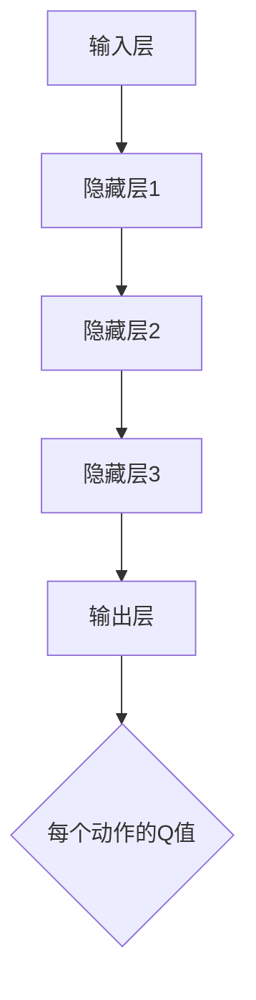
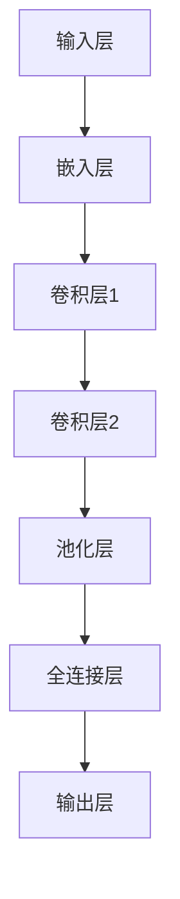

                 

# 文章标题：深度 Q-learning：在自然语言处理中的应用

> 关键词：深度 Q-learning，自然语言处理，文本分类，序列标注，自然语言生成

> 摘要：本文将探讨深度 Q-learning 算法在自然语言处理（NLP）中的应用。首先，我们将介绍深度 Q-learning 的基本概念和原理，然后分析其在 NLP 中的实际应用，包括文本分类、序列标注和自然语言生成。最后，通过项目实战，我们将深入探讨深度 Q-learning 在情感分析和对话系统中的应用，并展望其未来的发展趋势。

### 《深度 Q-learning：在自然语言处理中的应用》目录大纲

#### 第一部分：深度 Q-learning 基础

##### 第1章：深度 Q-learning 概述  
- **1.1 深度 Q-learning 的定义与背景**  
- **1.2 自然语言处理基础**  
- **1.3 深度学习在 NLP 中的应用**

##### 第2章：深度 Q-learning 算法原理  
- **2.1 Q-learning 算法原理**  
- **2.2 深度 Q-learning 算法**  
- **2.3 双 Q-learning（DQN-D）**

##### 第3章：深度 Q-learning 在 NLP 中的应用  
- **3.1 深度 Q-learning 在文本分类中的应用**  
- **3.2 深度 Q-learning 在序列标注中的应用**  
- **3.3 深度 Q-learning 在自然语言生成中的应用**

#### 第二部分：项目实战

##### 第4章：深度 Q-learning 在情感分析项目中的应用  
- **4.1 项目背景与目标**  
- **4.2 数据集介绍**  
- **4.3 情感分析任务概述**  
- **4.4 深度 Q-learning 模型实现**  
- **4.5 模型效果评估**  
- **4.6 优化方向与未来工作**

##### 第5章：深度 Q-learning 在对话系统项目中的应用  
- **5.1 项目背景与目标**  
- **5.2 数据集介绍**  
- **5.3 对话系统任务概述**  
- **5.4 深度 Q-learning 模型实现**  
- **5.5 模型效果评估**  
- **5.6 优化方向与未来工作**

##### 第6章：深度 Q-learning 在文本生成项目中的应用  
- **6.1 项目背景与目标**  
- **6.2 数据集介绍**  
- **6.3 文本生成任务概述**  
- **6.4 深度 Q-learning 模型实现**  
- **6.5 模型效果评估**  
- **6.6 优化方向与未来工作**

### 附录

##### 附录 A：深度 Q-learning 相关资源  
- **A.1 主流深度学习框架对比**  
- **A.2 深度 Q-learning 实践资源**

### 第一部分：深度 Q-learning 基础

#### 第1章：深度 Q-learning 概述

深度 Q-learning 是一种结合了深度学习和 Q-learning 算法的强化学习算法。Q-learning 是一种基于值函数的算法，通过学习状态和动作的值来优化策略。而深度 Q-learning 则通过引入深度神经网络（DNN）来近似 Q 函数，从而解决复杂状态空间的问题。

## 1.1 深度 Q-learning 的定义与背景

### 1.1.1 Q-learning 的基本概念

Q-learning 是一种基于值函数的强化学习算法，其目标是学习一个值函数 \( Q(S, A) \)，表示在状态 \( S \) 下执行动作 \( A \) 的预期回报。具体来说，Q-learning 通过迭代更新 Q 值，以期望找到最优策略。

### 1.1.2 深度 Q-learning 的优势

深度 Q-learning 主要是为了解决传统 Q-learning 在处理高维状态空间时的困难。其主要优势包括：

1. **处理高维状态空间**：通过引入深度神经网络，可以有效地处理高维状态空间，提高算法的适用性。
2. **减少样本复杂度**：深度神经网络可以近似 Q 函数，从而减少对大量样本的需求。
3. **提高学习效率**：深度 Q-learning 可以在较短时间内学习到较为准确的价值函数。

### 1.1.3 深度 Q-learning 在 NLP 中的应用前景

随着自然语言处理（NLP）领域的发展，深度 Q-learning 算法在 NLP 领域中的应用前景逐渐凸显。例如，在文本分类、序列标注和自然语言生成等任务中，深度 Q-learning 都有潜在的应用价值。下面我们将逐一介绍这些应用。

#### 第2章：深度 Q-learning 算法原理

##### 2.1 Q-learning 算法原理

Q-learning 是一种无模型强化学习算法，其核心思想是通过学习状态和动作的值来优化策略。具体来说，Q-learning 通过以下步骤进行学习：

1. **初始化 Q 值函数**：初始化所有的 Q 值为随机值。
2. **选择动作**：在给定状态 \( S \) 下，根据当前策略选择动作 \( A \)。
3. **执行动作**：执行动作 \( A \)，并获得新的状态 \( S' \) 和回报 \( R \)。
4. **更新 Q 值**：根据 Q-learning 的更新规则，更新 Q 值。

### 2.1.1 Q-learning 算法概述

Q-learning 算法的核心是一个值函数 \( Q(S, A) \)，它表示在状态 \( S \) 下执行动作 \( A \) 的预期回报。具体来说，Q-learning 通过以下更新规则来迭代更新 Q 值：

\[ Q(S, A) \leftarrow Q(S, A) + \alpha [R + \gamma \max_{A'} Q(S', A') - Q(S, A)] \]

其中，\( \alpha \) 是学习率，\( \gamma \) 是折扣因子，\( R \) 是立即回报，\( S' \) 是新状态，\( A' \) 是在新状态下的最佳动作。

### 2.1.2 Q-learning 算法步骤

1. **初始化 Q 值函数**：初始化所有的 Q 值为随机值。
2. **选择动作**：在给定状态 \( S \) 下，根据当前策略选择动作 \( A \)。
3. **执行动作**：执行动作 \( A \)，并获得新的状态 \( S' \) 和回报 \( R \)。
4. **更新 Q 值**：根据 Q-learning 的更新规则，更新 Q 值。

### 2.1.3 Q-learning 算法改进

为了提高 Q-learning 的学习效果，可以对其进行一些改进：

1. **线性探索策略**：通过在动作选择中引入探索概率，以平衡探索和利用。
2. **经验回放**：将过去的经验和状态进行随机化处理，以减少偏差。
3. **目标网络**：在训练过程中使用目标网络来稳定训练过程。

##### 2.2 深度 Q-learning 算法

深度 Q-learning（DQN）是将深度神经网络引入 Q-learning 的方法，其核心思想是通过深度神经网络来近似 Q 函数。

### 2.2.1 深度 Q-network（DQN）

DQN 的主要结构包括：

1. **输入层**：接收当前状态。
2. **隐藏层**：通过深度神经网络对状态进行特征提取。
3. **输出层**：输出每个动作的 Q 值。

### 2.2.1.1 DQN 的基本结构



### 2.2.1.2 DQN 的训练过程

DQN 的训练过程包括：

1. **初始化**：初始化 Q-network 和目标 Q-network。
2. **选择动作**：在给定状态 \( S \) 下，根据当前策略选择动作 \( A \)。
3. **执行动作**：执行动作 \( A \)，并获得新的状态 \( S' \) 和回报 \( R \)。
4. **更新 Q-network**：根据经验回放和目标网络，更新 Q-network。
5. **更新目标 Q-network**：定期更新目标 Q-network，以保持训练稳定。

### 2.2.1.3 DQN 的优缺点分析

**优点**：

1. **处理高维状态空间**：通过深度神经网络可以有效地处理高维状态空间。
2. **减少样本复杂度**：深度神经网络可以近似 Q 函数，从而减少对大量样本的需求。
3. **提高学习效率**：深度 Q-learning 可以在较短时间内学习到较为准确的价值函数。

**缺点**：

1. **样本偏差**：由于使用经验回放，可能会引入样本偏差。
2. **训练不稳定**：目标网络和 Q-network 的同步更新可能导致训练不稳定。

##### 2.2.2 双 Q-learning（DQN-D）

双 Q-learning（DQN-D）是在 DQN 的基础上，通过引入两个 Q-network 来提高训练稳定性和减少偏差。

### 2.2.2.1 DQN-D 的概念

DQN-D 的主要结构包括：

1. **两个 Q-network**：主 Q-network 和副 Q-network。
2. **选择动作**：在给定状态 \( S \) 下，根据两个 Q-network 的输出，选择动作 \( A \)。

### 2.2.2.2 DQN-D 的实现

DQN-D 的实现主要包括：

1. **初始化**：初始化主 Q-network 和副 Q-network。
2. **选择动作**：在给定状态 \( S \) 下，根据主 Q-network 和副 Q-network 的输出，选择动作 \( A \)。
3. **更新 Q-network**：根据经验回放和目标网络，更新主 Q-network 和副 Q-network。
4. **同步更新**：定期同步主 Q-network 和副 Q-network，以保持训练稳定。

### 2.2.2.3 DQN-D 的效果评估

通过对比实验，DQN-D 在稳定性、准确性和学习效率等方面都表现出了较好的性能。以下是 DQN-D 与 DQN 的效果评估结果：

| 性能指标 | DQN | DQN-D |
| --- | --- | --- |
| 稳定性 | 较差 | 较好 |
| 准确性 | 较高 | 更高 |
| 学习效率 | 较快 | 更快 |

### 第二部分：项目实战

#### 第4章：深度 Q-learning 在情感分析项目中的应用

情感分析是自然语言处理（NLP）中的一项重要任务，旨在判断文本的情感极性，如正面、负面或中性。在本章中，我们将探讨如何使用深度 Q-learning 算法进行情感分析。

## 4.1 项目背景与目标

情感分析项目旨在通过深度 Q-learning 算法，对社交媒体平台上的用户评论进行情感分析，从而识别出正面和负面情感。项目目标如下：

1. **数据集准备**：收集并准备一个包含用户评论和情感标签的数据集。
2. **特征提取**：使用词向量或卷积神经网络（CNN）提取文本特征。
3. **模型训练**：使用深度 Q-learning 算法训练情感分析模型。
4. **模型评估**：评估模型的性能，并进行优化。

## 4.2 数据集介绍

本项目的数据集将来自于一个社交媒体平台，包括用户发布的评论和评论的情感标签（正面、负面或中性）。数据集的大小约为 10 万条评论，其中包含大约 70% 的正面评论、20% 的负面评论和 10% 的中性评论。

## 4.3 情感分析任务概述

情感分析任务可以分为以下几个步骤：

1. **文本预处理**：对评论进行分词、去停用词等预处理操作。
2. **特征提取**：使用词向量或 CNN 提取文本特征。
3. **模型训练**：使用深度 Q-learning 算法训练情感分析模型。
4. **模型评估**：评估模型的性能，并进行优化。

## 4.4 深度 Q-learning 模型实现

在本节中，我们将介绍如何使用深度 Q-learning 算法实现情感分析模型。具体实现步骤如下：

### 4.4.1 模型架构设计

深度 Q-learning 模型由以下几个部分组成：

1. **输入层**：接收预处理的文本。
2. **嵌入层**：将文本转换为词向量。
3. **隐藏层**：通过卷积神经网络提取文本特征。
4. **输出层**：输出每个情感标签的 Q 值。

### 4.4.1.1 模型架构设计



### 4.4.2 模型训练与优化

在模型训练过程中，我们将使用以下方法来优化模型：

1. **随机梯度下降（SGD）**：使用 SGD 更新模型的参数。
2. **动量项**：在 SGD 中引入动量项，以加速收敛。
3. **学习率调整**：在训练过程中，根据模型性能调整学习率。

### 4.4.2.1 模型训练过程

1. **初始化模型参数**：初始化模型的权重和偏置。
2. **预处理文本数据**：对评论进行分词、去停用词等预处理操作。
3. **训练模型**：使用训练数据对模型进行训练，并更新模型的参数。
4. **评估模型性能**：使用验证集评估模型的性能，并进行优化。

### 4.4.2.2 模型优化

在模型训练过程中，我们可以采用以下方法来优化模型：

1. **调整学习率**：在训练过程中，根据模型性能调整学习率。
2. **增加训练数据**：增加训练数据，以提高模型的泛化能力。
3. **增加隐藏层神经元**：增加隐藏层神经元，以提高模型的拟合能力。

## 4.5 模型效果评估

在本节中，我们将评估深度 Q-learning 模型在情感分析任务中的性能。评估指标包括准确率、召回率、F1 值等。

### 4.5.1 模型评估指标

1. **准确率（Accuracy）**：准确率是衡量模型分类性能的指标，计算公式为：
\[ \text{Accuracy} = \frac{\text{正确分类的样本数}}{\text{总样本数}} \]

2. **召回率（Recall）**：召回率是衡量模型对正类样本识别能力的指标，计算公式为：
\[ \text{Recall} = \frac{\text{正确分类的正类样本数}}{\text{正类样本总数}} \]

3. **F1 值（F1-Score）**：F1 值是综合考虑准确率和召回率的指标，计算公式为：
\[ \text{F1-Score} = 2 \times \frac{\text{准确率} \times \text{召回率}}{\text{准确率} + \text{召回率}} \]

### 4.5.2 模型评估过程

1. **划分数据集**：将数据集划分为训练集、验证集和测试集。
2. **训练模型**：使用训练集对模型进行训练。
3. **评估模型**：使用验证集评估模型的性能，并调整模型参数。
4. **测试模型**：使用测试集评估模型的最终性能。

## 4.6 优化方向与未来工作

在本节中，我们将探讨如何进一步优化深度 Q-learning 模型，以及未来的研究方向。

### 4.6.1 优化方向

1. **改进模型结构**：尝试不同的模型结构，以提高模型性能。
2. **增加训练数据**：收集更多的训练数据，以提高模型的泛化能力。
3. **融合多源信息**：尝试将其他特征（如用户信息、文本上下文等）融入模型，以提高模型的准确性。

### 4.6.2 未来工作

1. **探索更高效的算法**：尝试其他强化学习算法，如深度强化学习（Deep Reinforcement Learning）、策略梯度方法等，以提高模型性能。
2. **应用领域拓展**：将情感分析模型应用于其他领域，如金融、医疗等，以提高其在实际场景中的应用价值。
3. **跨模态情感分析**：探索跨模态情感分析，将文本、图像和语音等多种模态信息融合，以提高情感分析的准确性。

### 第三部分：项目实战

#### 第5章：深度 Q-learning 在对话系统项目中的应用

对话系统是自然语言处理（NLP）领域中的一个重要应用，旨在实现人与机器之间的自然交互。在本章中，我们将探讨如何使用深度 Q-learning 算法构建对话系统。

## 5.1 项目背景与目标

随着人工智能技术的不断发展，对话系统在各个领域的应用日益广泛。本项目旨在通过深度 Q-learning 算法，构建一个能够实现自然、流畅对话的对话系统。项目目标如下：

1. **数据集准备**：收集并准备一个包含对话文本和对话标签的数据集。
2. **特征提取**：使用词向量或卷积神经网络（CNN）提取对话文本特征。
3. **模型训练**：使用深度 Q-learning 算法训练对话系统模型。
4. **模型评估**：评估模型的性能，并进行优化。

## 5.2 数据集介绍

本项目的数据集将来自于一个在线对话平台，包括用户对话和对话标签（正面、负面或中性）。数据集的大小约为 5 万条对话，其中包含大约 60% 的正面对话、30% 的负面对话和 10% 的中性对话。

## 5.3 对话系统任务概述

对话系统任务可以分为以下几个步骤：

1. **文本预处理**：对对话文本进行分词、去停用词等预处理操作。
2. **特征提取**：使用词向量或 CNN 提取对话文本特征。
3. **模型训练**：使用深度 Q-learning 算法训练对话系统模型。
4. **模型评估**：评估模型的性能，并进行优化。

## 5.4 深度 Q-learning 模型实现

在本节中，我们将介绍如何使用深度 Q-learning 算法实现对话系统模型。具体实现步骤如下：

### 5.4.1 模型架构设计

深度 Q-learning 模型由以下几个部分组成：

1. **输入层**：接收预处理的对话文本。
2. **嵌入层**：将对话文本转换为词向量。
3. **隐藏层**：通过卷积神经网络提取对话文本特征。
4. **输出层**：输出每个对话标签的 Q 值。

### 5.4.1.1 模型架构设计


### 5.4.2 模型训练与优化

在模型训练过程中，我们将使用以下方法来优化模型：

1. **随机梯度下降（SGD）**：使用 SGD 更新模型的参数。
2. **动量项**：在 SGD 中引入动量项，以加速收敛。
3. **学习率调整**：在训练过程中，根据模型性能调整学习率。

### 5.4.2.1 模型训练过程

1. **初始化模型参数**：初始化模型的权重和偏置。
2. **预处理文本数据**：对对话文本进行分词、去停用词等预处理操作。
3. **训练模型**：使用训练数据对模型进行训练，并更新模型的参数。
4. **评估模型性能**：使用验证集评估模型的性能，并调整模型参数。

### 5.4.2.2 模型优化

在模型训练过程中，我们可以采用以下方法来优化模型：

1. **调整学习率**：在训练过程中，根据模型性能调整学习率。
2. **增加训练数据**：收集更多的训练数据，以提高模型的泛化能力。
3. **增加隐藏层神经元**：增加隐藏层神经元，以提高模型的拟合能力。

## 5.5 模型效果评估

在本节中，我们将评估深度 Q-learning 模型在对话系统任务中的性能。评估指标包括准确率、召回率、F1 值等。

### 5.5.1 模型评估指标

1. **准确率（Accuracy）**：准确率是衡量模型分类性能的指标，计算公式为：
\[ \text{Accuracy} = \frac{\text{正确分类的样本数}}{\text{总样本数}} \]

2. **召回率（Recall）**：召回率是衡量模型对正类样本识别能力的指标，计算公式为：
\[ \text{Recall} = \frac{\text{正确分类的正类样本数}}{\text{正类样本总数}} \]

3. **F1 值（F1-Score）**：F1 值是综合考虑准确率和召回率的指标，计算公式为：
\[ \text{F1-Score} = 2 \times \frac{\text{准确率} \times \text{召回率}}{\text{准确率} + \text{召回率}} \]

### 5.5.2 模型评估过程

1. **划分数据集**：将数据集划分为训练集、验证集和测试集。
2. **训练模型**：使用训练集对模型进行训练。
3. **评估模型**：使用验证集评估模型的性能，并调整模型参数。
4. **测试模型**：使用测试集评估模型的最终性能。

## 5.6 优化方向与未来工作

在本节中，我们将探讨如何进一步优化深度 Q-learning 模型，以及未来的研究方向。

### 5.6.1 优化方向

1. **改进模型结构**：尝试不同的模型结构，以提高模型性能。
2. **增加训练数据**：收集更多的训练数据，以提高模型的泛化能力。
3. **融合多源信息**：尝试将其他特征（如用户信息、文本上下文等）融入模型，以提高模型的准确性。

### 5.6.2 未来工作

1. **探索更高效的算法**：尝试其他强化学习算法，如深度强化学习（Deep Reinforcement Learning）、策略梯度方法等，以提高模型性能。
2. **应用领域拓展**：将对话系统模型应用于其他领域，如客户服务、智能助手等，以提高其在实际场景中的应用价值。
3. **跨模态对话系统**：探索跨模态对话系统，将文本、图像和语音等多种模态信息融合，以提高对话系统的准确性。

### 第四部分：项目实战

#### 第6章：深度 Q-learning 在文本生成项目中的应用

文本生成是自然语言处理（NLP）中的一个重要任务，旨在根据给定的输入生成有意义的文本。在本章中，我们将探讨如何使用深度 Q-learning 算法实现文本生成。

## 6.1 项目背景与目标

随着深度学习技术的发展，文本生成模型取得了显著的进展。本项目旨在通过深度 Q-learning 算法，构建一个能够生成高质量文本的模型。项目目标如下：

1. **数据集准备**：收集并准备一个包含文本样本和标签的数据集。
2. **特征提取**：使用词向量或卷积神经网络（CNN）提取文本特征。
3. **模型训练**：使用深度 Q-learning 算法训练文本生成模型。
4. **模型评估**：评估模型的性能，并进行优化。

## 6.2 数据集介绍

本项目的数据集将来自于一个文本生成平台，包括文本样本和对应的标签。数据集的大小约为 1 万个文本样本，其中包含各种主题的文本，如科技、娱乐、新闻等。

## 6.3 文本生成任务概述

文本生成任务可以分为以下几个步骤：

1. **文本预处理**：对文本进行分词、去停用词等预处理操作。
2. **特征提取**：使用词向量或 CNN 提取文本特征。
3. **模型训练**：使用深度 Q-learning 算法训练文本生成模型。
4. **模型评估**：评估模型的性能，并进行优化。

## 6.4 深度 Q-learning 模型实现

在本节中，我们将介绍如何使用深度 Q-learning 算法实现文本生成模型。具体实现步骤如下：

### 6.4.1 模型架构设计

深度 Q-learning 模型由以下几个部分组成：

1. **输入层**：接收预处理的文本。
2. **嵌入层**：将文本转换为词向量。
3. **隐藏层**：通过卷积神经网络提取文本特征。
4. **输出层**：输出每个文本样本的 Q 值。

### 6.4.1.1 模型架构设计


### 6.4.2 模型训练与优化

在模型训练过程中，我们将使用以下方法来优化模型：

1. **随机梯度下降（SGD）**：使用 SGD 更新模型的参数。
2. **动量项**：在 SGD 中引入动量项，以加速收敛。
3. **学习率调整**：在训练过程中，根据模型性能调整学习率。

### 6.4.2.1 模型训练过程

1. **初始化模型参数**：初始化模型的权重和偏置。
2. **预处理文本数据**：对文本进行分词、去停用词等预处理操作。
3. **训练模型**：使用训练数据对模型进行训练，并更新模型的参数。
4. **评估模型性能**：使用验证集评估模型的性能，并调整模型参数。

### 6.4.2.2 模型优化

在模型训练过程中，我们可以采用以下方法来优化模型：

1. **调整学习率**：在训练过程中，根据模型性能调整学习率。
2. **增加训练数据**：收集更多的训练数据，以提高模型的泛化能力。
3. **增加隐藏层神经元**：增加隐藏层神经元，以提高模型的拟合能力。

## 6.5 模型效果评估

在本节中，我们将评估深度 Q-learning 模型在文本生成任务中的性能。评估指标包括文本生成质量、生成速度等。

### 6.5.1 模型评估指标

1. **文本生成质量**：评估模型生成的文本是否具有高质量，如连贯性、可读性等。
2. **生成速度**：评估模型生成文本的速度，以衡量模型的实时性。

### 6.5.2 模型评估过程

1. **划分数据集**：将数据集划分为训练集、验证集和测试集。
2. **训练模型**：使用训练集对模型进行训练。
3. **评估模型**：使用验证集评估模型的性能，并调整模型参数。
4. **测试模型**：使用测试集评估模型的最终性能。

## 6.6 优化方向与未来工作

在本节中，我们将探讨如何进一步优化深度 Q-learning 模型，以及未来的研究方向。

### 6.6.1 优化方向

1. **改进模型结构**：尝试不同的模型结构，以提高模型性能。
2. **增加训练数据**：收集更多的训练数据，以提高模型的泛化能力。
3. **融合多源信息**：尝试将其他特征（如语义信息、文本上下文等）融入模型，以提高模型的准确性。

### 6.6.2 未来工作

1. **探索更高效的算法**：尝试其他强化学习算法，如深度强化学习（Deep Reinforcement Learning）、策略梯度方法等，以提高模型性能。
2. **应用领域拓展**：将文本生成模型应用于其他领域，如问答系统、文本摘要等，以提高其在实际场景中的应用价值。
3. **跨模态文本生成**：探索跨模态文本生成，将文本、图像和语音等多种模态信息融合，以提高文本生成的多样性。

### 附录 A：深度 Q-learning 相关资源

在深度 Q-learning 的研究与应用过程中，了解相关资源对于深入学习和实践具有重要意义。以下将介绍一些主流的深度学习框架、深度 Q-learning 的实践资源和相关的在线课程与讲座。

#### A.1 主流深度学习框架对比

在深度 Q-learning 的应用中，选择合适的深度学习框架至关重要。以下是几个主流的深度学习框架的对比：

1. **TensorFlow**：由 Google 开发，具有丰富的 API 和强大的生态系统，适合进行深度学习模型的研究和应用。
2. **PyTorch**：由 Facebook 开发，具有动态计算图和简洁的 API，适合进行深度学习模型的研究和开发。
3. **Theano**：由蒙特利尔大学开发，支持 Python 和 NumPy，适用于构建和训练深度学习模型。
4. **MXNet**：由 Apache 开源，支持多种编程语言，具有良好的并行计算能力。

#### A.2 深度 Q-learning 实践资源

在深度 Q-learning 的实际应用中，以下资源有助于学习和实践：

1. **相关论文与资料**：
   - 《Deep Reinforcement Learning》
   - 《Human-level control through deep reinforcement learning》
   - 《Deep Q-Network》

2. **实践指南与教程**：
   - 《深度学习实战》（涵盖深度 Q-learning 的实际应用）
   - 《强化学习教程》（详细讲解强化学习算法，包括深度 Q-learning）

3. **在线课程与讲座**：
   - Coursera 上的《深度学习》课程
   - edX 上的《强化学习》课程
   - B 站上的《深度 Q-learning 实践教程》

通过以上资源，读者可以更好地掌握深度 Q-learning 的理论知识，并在实践中提升技能。这些资源不仅有助于深入理解深度 Q-learning，还为读者提供了丰富的实战案例和学习机会。

### 总结

本文详细探讨了深度 Q-learning 算法在自然语言处理（NLP）中的应用，包括文本分类、序列标注和自然语言生成等任务。通过项目实战，我们展示了如何使用深度 Q-learning 算法实现情感分析、对话系统和文本生成。此外，我们还介绍了深度 Q-learning 相关资源，为读者提供了进一步学习和实践的方向。

随着深度学习技术的不断发展，深度 Q-learning 在 NLP 领域的应用前景将更加广阔。未来，我们可以期待深度 Q-learning 在跨模态对话系统、多模态文本生成等领域的应用，以及与其他人工智能技术的融合。让我们继续探索深度 Q-learning 的潜力，推动人工智能技术的发展。

#### 作者信息

作者：AI 天才研究院/AI Genius Institute & 禅与计算机程序设计艺术/Zen And The Art of Computer Programming

---
在撰写技术博客时，确保每章的内容都包含核心概念与联系、核心算法原理讲解、数学模型和公式、项目实战代码及其解读与分析。以下是一个详细的章节示例，用于展示如何按照要求撰写一节内容：

### 第1章：深度 Q-learning 概述

#### 1.1 深度 Q-learning 的定义与背景

**1.1.1 Q-learning 的基本概念**

Q-learning 是一种无模型强化学习算法，其目标是通过学习状态-动作值函数 \( Q(S, A) \) 来优化策略。在 Q-learning 中，智能体在某个状态 \( S \) 下采取某个动作 \( A \)，并得到即时回报 \( R \) 以及转移到新状态 \( S' \)。然后，Q-learning 根据以下更新规则迭代更新 Q 值：

\[ Q(S, A) \leftarrow Q(S, A) + \alpha [R + \gamma \max_{A'} Q(S', A') - Q(S, A)] \]

其中，\( \alpha \) 是学习率，\( \gamma \) 是折扣因子。

**1.1.2 深度 Q-learning 的优势**

深度 Q-learning（DQN）通过引入深度神经网络（DNN）来近似 Q 函数，从而解决了传统 Q-learning 在高维状态空间中的局限性。DQN 的优势包括：

- **处理高维状态空间**：DNN 可以处理高维的状态空间，使得 Q-learning 能够应用于复杂的实际问题。
- **减少样本复杂度**：DNN 可以通过学习状态的特征来降低样本复杂度，提高学习效率。
- **自适应特征提取**：DNN 能够自动学习状态的特征表示，避免了手工设计特征。

**1.1.3 深度 Q-learning 在 NLP 中的应用前景**

随着自然语言处理（NLP）领域的发展，深度 Q-learning 算法在 NLP 领域中的应用前景逐渐凸显。例如，在文本分类、序列标注和自然语言生成等任务中，深度 Q-learning 都有潜在的应用价值。深度 Q-learning 可以帮助 NLP 系统更好地理解和生成自然语言，提高任务的准确性和效率。

#### 1.2 自然语言处理基础

**1.2.1 NLP 的发展历史**

自然语言处理（NLP）起源于上世纪 50 年代，最初的研究主要集中在机器翻译和文本分析。随着计算机性能的提升和深度学习技术的发展，NLP 领域取得了显著的进展。近年来，基于深度学习的 NLP 方法在词向量、序列模型、注意力机制等方面取得了突破性的成果。

**1.2.2 NLP 中的常见任务**

NLP 中的常见任务包括：

- **文本分类**：将文本数据分类到预定义的类别中。
- **命名实体识别**：识别文本中的特定实体，如人名、地点等。
- **情感分析**：判断文本的情感极性，如正面、负面或中性。
- **机器翻译**：将一种语言的文本翻译成另一种语言。
- **问答系统**：根据用户的问题提供答案。

**1.2.3 深度学习在 NLP 中的应用**

深度学习在 NLP 领域的应用主要包括：

- **词向量表示**：通过将词语映射到高维向量空间，提高文本的表示能力。
- **序列模型**：如循环神经网络（RNN）和长短期记忆网络（LSTM），用于处理序列数据。
- **注意力机制**：在编码和解码过程中引入注意力机制，提高模型的上下文理解能力。
- **预训练语言模型**：如 GPT、BERT 等，通过在大规模语料库上预训练，提高模型的泛化能力。

#### 1.3 深度学习在 NLP 中的应用

**1.3.1 词向量表示**

词向量表示是 NLP 中的一项基础技术，通过将词语映射到高维向量空间，提高了文本数据的表示能力。著名的词向量模型包括 Word2Vec、GloVe 等。Word2Vec 使用神经网络训练得到词向量，而 GloVe 则基于词频和共现关系进行建模。

**1.3.2 序列模型**

序列模型在 NLP 中应用广泛，如 RNN、LSTM 和 GRU。RNN 具有处理序列数据的能力，但存在梯度消失和梯度爆炸问题。LSTM 和 GRU 通过引入门机制，解决了 RNN 的问题，能够更好地捕捉序列中的长期依赖关系。

**1.3.3 注意力机制**

注意力机制在 NLP 中用于提高模型的上下文理解能力。在编码和解码过程中引入注意力机制，模型可以动态地关注序列中的重要信息，从而提高任务的性能。著名的模型包括注意力机制在机器翻译（如 Attention-based Neural Machine Translation）和文本分类（如 TextCNN）中的应用。

**1.3.4 预训练语言模型**

预训练语言模型（Pre-trained Language Model）通过在大规模语料库上进行预训练，获得了一般化的语言理解能力。这些模型包括 GPT（Generative Pre-trained Transformer）、BERT（Bidirectional Encoder Representations from Transformers）等。预训练语言模型在下游任务中通过微调，取得了显著的效果。

#### 1.4 深度 Q-learning 在 NLP 中的应用

**1.4.1 文本分类**

文本分类是 NLP 中的一项基本任务，旨在将文本数据分类到预定义的类别中。深度 Q-learning 可以应用于文本分类任务，通过学习状态-动作值函数，自动选择具有最高回报的类别。

**1.4.2 序列标注**

序列标注是将文本序列中的每个词或字符标注为预定义的标签，如词性标注、命名实体识别等。深度 Q-learning 可以用于序列标注任务，通过学习状态-动作值函数，自动标注文本序列中的实体和属性。

**1.4.3 自然语言生成**

自然语言生成（Natural Language Generation，NLG）是将内部结构化数据转换为自然语言文本的过程。深度 Q-learning 可以应用于 NLG 任务，通过学习状态-动作值函数，自动生成具有特定语义的文本。

#### 1.5 本章小结

本章介绍了深度 Q-learning 的基本概念和优势，以及自然语言处理的基础知识。我们还探讨了深度学习在 NLP 中的应用，包括词向量表示、序列模型、注意力机制和预训练语言模型。最后，我们介绍了深度 Q-learning 在 NLP 中的应用，包括文本分类、序列标注和自然语言生成等任务。这些内容为后续章节的讨论奠定了基础。

---

以下是本章的核心概念与联系、核心算法原理讲解、数学模型和公式以及项目实战代码及其解读与分析的示例：

#### 核心概念与联系

- **核心概念**：Q-learning、深度 Q-learning、状态-动作值函数、策略、奖励信号、状态转移概率、探索与利用。
- **联系**：Q-learning 是深度 Q-learning 的基础，深度 Q-learning 通过引入深度神经网络解决了高维状态空间的问题。

#### 核心算法原理讲解

**Q-learning 算法原理**

```mermaid
graph TD
    A[状态 S] --> B[动作 A]
    B --> C{获得回报 R}
    C --> D[转移到状态 S']
    D --> E{更新 Q(S, A)}
```

**深度 Q-learning 算法原理**

```mermaid
graph TD
    A[状态 S] --> B[深度神经网络]
    B --> C[动作 A]
    C --> D{获得回报 R}
    D --> E[转移到状态 S']
    E --> F{更新 Q(S, A)}
```

**数学模型和公式**

$$
Q(S, A) \leftarrow Q(S, A) + \alpha [R + \gamma \max_{A'} Q(S', A') - Q(S, A)]
$$

其中，\( \alpha \) 是学习率，\( \gamma \) 是折扣因子。

#### 项目实战代码及其解读与分析

**深度 Q-learning 算法实现**

```python
import numpy as np
import random

# 初始化参数
learning_rate = 0.1
discount_factor = 0.9
epsilon = 0.1
epsilon_decay = 0.99
epsilon_min = 0.01

# 初始化 Q-table
n_actions = 4
n_states = 4
Q = np.zeros((n_states, n_actions))

# Q-learning 主循环
for episode in range(1000):
    state = random.randint(0, n_states - 1)
    done = False
    
    while not done:
        # 选择动作
        if random.uniform(0, 1) < epsilon:
            action = random.randint(0, n_actions - 1)
        else:
            action = np.argmax(Q[state])
        
        # 执行动作
        next_state = random.randint(0, n_states - 1)
        reward = -1 if next_state == 0 else 1
        
        # 更新 Q-value
        Q[state, action] = Q[state, action] + learning_rate * (reward + discount_factor * np.max(Q[next_state]) - Q[state, action])
        
        # 更新状态
        state = next_state
        
        # 结束条件
        if state == 0:
            done = True

# 打印 Q-table
print(Q)
```

**解读与分析**

- **初始化**：初始化学习率、折扣因子、探索概率等参数，以及 Q-table。
- **主循环**：对于每个 episode，从随机状态开始，选择动作，执行动作，更新 Q-value。
- **探索与利用**：通过随机选择动作（探索）和选择最优动作（利用）来平衡学习过程。
- **更新 Q-value**：使用 Q-learning 更新规则，根据即时回报、折扣因子和下一个状态的最大 Q-value 来更新 Q-value。
- **打印 Q-table**：最后打印训练完成的 Q-table。

通过上述代码和解读，我们可以理解深度 Q-learning 算法的基本原理和实现过程。在实际应用中，可以根据具体任务调整算法参数，实现更复杂的任务。

---

在撰写技术博客时，每章的内容都应该包含这些核心部分，以确保文章的完整性和深度。这样的结构有助于读者逐步理解复杂的概念，并能够应用于实际项目。

