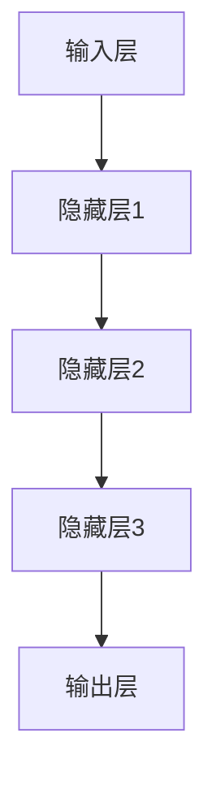
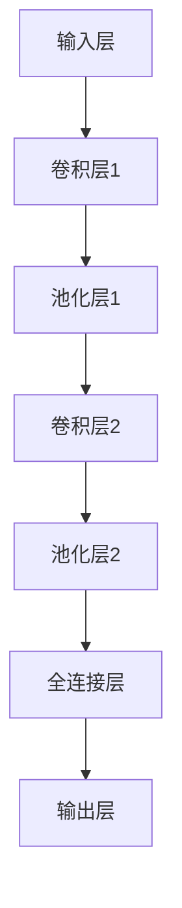
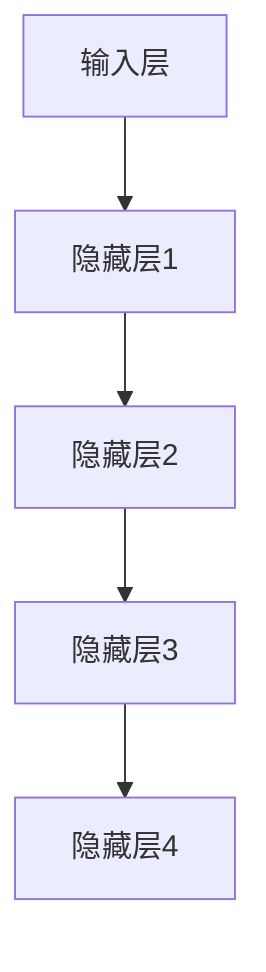

                 

### 《深度学习在即时配送需求预测中的创新》

> 关键词：深度学习，即时配送，需求预测，神经网络，时间序列，特征工程

> 摘要：本文深入探讨了深度学习在即时配送需求预测中的应用与创新。通过分析即时配送行业的背景和挑战，介绍了深度学习的基础知识、核心原理和常用算法。随后，详细描述了深度学习在时间序列分析中的应用，以及在即时配送需求预测中的具体实现。通过实际案例分析，本文展示了深度学习模型在预测配送需求中的有效性，并对模型优化和未来发展趋势进行了讨论。文章最后提供了深度学习工具与框架的详细介绍，以及进一步阅读的资源和建议。

## 第一部分：基础知识与核心原理

### 第1章：即时配送行业概述

#### 1.1 即时配送的发展背景与现状

随着互联网技术的飞速发展和电子商务的崛起，即时配送行业得到了前所未有的发展。即时配送，又称同城即时配送或最后一公里配送，指的是从商家到消费者之间的快速、高效配送服务。这种服务模式在解决商品物流“最后一公里”难题的同时，也极大地提升了消费者的购物体验。

即时配送的发展可以追溯到20世纪90年代末期，随着互联网的普及，电子商务逐渐兴起。最早的即时配送服务主要依赖于快递公司，但效率低下、成本高昂。随着移动互联网和智能手机的普及，即时配送行业迎来了新的发展契机。各种即时配送平台如雨后春笋般涌现，如美团、饿了么、达达等，它们通过技术手段和资源整合，极大地提升了配送效率，降低了成本。

目前，即时配送行业已经呈现出以下特点：

1. **市场规模不断扩大**：根据市场研究机构的报告，全球即时配送市场规模在近年来持续增长，预计未来仍将保持较高的增长率。

2. **竞争激烈**：由于市场的广阔前景，众多企业纷纷进入即时配送领域，竞争异常激烈。

3. **技术驱动**：随着人工智能、大数据、物联网等技术的发展，即时配送行业正逐步实现智能化、自动化。

4. **服务多元化**：除了传统的商品配送，即时配送还涵盖了餐饮、快递、生鲜等多种业务。

#### 1.2 即时配送的主要挑战与需求

尽管即时配送行业取得了显著的发展，但仍然面临许多挑战：

1. **需求波动大**：即时配送需求受天气、节假日、消费者购物习惯等多种因素影响，呈现出明显的波动性。

2. **高峰期配送压力**：在高峰期，如饭点、购物节等，即时配送需求急剧增加，给配送资源分配带来了巨大挑战。

3. **成本控制**：即时配送的成本较高，如何在保证服务质量的同时降低成本，是行业面临的重大挑战。

4. **配送效率**：如何提高配送效率，缩短配送时间，是即时配送行业追求的目标。

为了应对这些挑战，即时配送行业对需求预测提出了迫切需求：

1. **优化资源配置**：通过准确的需求预测，可以提前安排配送资源，避免高峰期资源短缺或浪费。

2. **提高配送效率**：预测未来需求，有助于优化配送路线和策略，减少配送时间，提高整体效率。

3. **降低运营成本**：合理预测需求，可以有效控制成本，避免资源浪费。

4. **提升用户体验**：准确的需求预测可以提升配送服务的准时性，增强用户体验。

#### 1.3 深度学习在即时配送中的应用潜力

深度学习作为人工智能的一个重要分支，具有强大的特征提取和模式识别能力，在即时配送需求预测中具有广阔的应用前景：

1. **需求预测**：通过深度学习模型，可以准确预测即时配送需求，为资源分配和路线规划提供依据。

2. **动态调整策略**：深度学习模型可以根据实时数据动态调整配送策略，提高配送效率。

3. **优化成本控制**：通过预测需求，可以合理规划配送资源，降低运营成本。

4. **提升用户体验**：准确的需求预测可以减少配送时间，提升服务质量和用户满意度。

综上所述，即时配送行业的发展背景和挑战为深度学习应用提供了丰富的场景和需求。深度学习在即时配送需求预测中的潜力不仅在于提高预测准确性，更在于优化整个物流体系，提升整体运营效率。

### 第2章：深度学习基础

#### 2.1 深度学习基本概念

深度学习（Deep Learning，简称DL）是机器学习（Machine Learning，简称ML）的一个子领域，其主要特点是通过多层神经网络（Neural Networks）对数据进行复杂的特征学习和模式识别。与传统的机器学习方法不同，深度学习模型具有更强的自我学习和泛化能力，能够从大量数据中自动提取有价值的特征，从而实现高精度的预测和分类。

**核心思想**：深度学习借鉴了人脑神经网络的工作原理，通过多层神经元的连接和交互，实现数据的自动特征提取和抽象。在深度学习模型中，每一层神经网络都能够对输入数据进行一次转换和加工，从而提取更高层次的特征。这种层次化的特征提取方式使得深度学习模型在处理复杂任务时表现出色。

**发展历程**：深度学习的发展历程可以分为以下几个阶段：

1. **1986年**：Rumelhart、Hinton 和 Williams 提出了反向传播算法（Backpropagation Algorithm），使多层神经网络的训练成为可能。

2. **1990年代**：由于计算能力和数据资源限制，深度学习的研究和应用受到限制。

3. **2006年**：Hinton 等人提出了深度信念网络（Deep Belief Networks，简称DBN），为深度学习的发展奠定了基础。

4. **2012年**：Hinton 等人提出的深度卷积神经网络（Convolutional Neural Networks，简称CNN）在ImageNet图像识别比赛中取得突破性成绩，深度学习开始受到广泛关注。

5. **2010年代**：随着计算机硬件的进步和大数据技术的发展，深度学习在语音识别、自然语言处理、计算机视觉等领域取得了显著的进展。

**应用领域**：深度学习在多个领域取得了重要突破，包括：

1. **计算机视觉**：如图像识别、物体检测、人脸识别等。
2. **自然语言处理**：如文本分类、机器翻译、情感分析等。
3. **语音识别**：如语音识别、语音合成、语音交互等。
4. **强化学习**：如游戏AI、自动驾驶等。
5. **医疗健康**：如疾病诊断、药物设计、健康监测等。

**优势与挑战**：深度学习具有以下优势：

1. **强大的特征学习能力**：能够从原始数据中自动提取有价值的特征，减少人工特征工程的工作量。
2. **高泛化能力**：通过大规模数据训练，能够适应不同的任务和数据分布。
3. **非线性表达能力**：多层神经网络能够捕捉数据的复杂关系和非线性特征。

然而，深度学习也存在一些挑战：

1. **数据依赖性**：深度学习模型的性能高度依赖于大量标注数据，数据质量对模型效果有重要影响。
2. **计算资源需求**：训练深度学习模型需要大量的计算资源和时间，尤其是对于大规模模型和海量数据集。
3. **模型解释性**：深度学习模型的决策过程往往难以解释，这给应用和推广带来了一定的困难。

#### 2.2 神经网络架构

神经网络（Neural Networks，简称NN）是深度学习的基础组件，由一系列相互连接的神经元（或节点）组成。每个神经元接受多个输入，通过加权求和处理产生输出。神经网络的架构决定了其学习能力和表现能力。

**基本概念**：

1. **神经元**：神经网络的基本单元，类似于人脑中的神经元。每个神经元包含输入层、权重（weights）、偏置（biases）和激活函数（activation function）。

2. **输入层**：输入层是神经网络的起点，接收外部输入数据。

3. **隐藏层**：隐藏层位于输入层和输出层之间，负责对输入数据进行加工和处理，提取更高层次的特征。

4. **输出层**：输出层是神经网络的终点，负责生成最终预测结果。

**神经网络架构示例**：



**多层感知机（MLP）**：多层感知机是最简单的一种神经网络架构，由输入层、多个隐藏层和输出层组成。每个神经元都与其他神经元通过权重相连，通过前向传播和反向传播算法进行训练和优化。


**卷积神经网络（CNN）**：卷积神经网络是一种专门用于图像识别和处理的神经网络架构，具有局部连接和共享权重的特点。CNN通过卷积层、池化层和全连接层等结构，实现对图像的高效特征提取和分类。



**循环神经网络（RNN）与长短时记忆网络（LSTM）**：循环神经网络是一种处理序列数据的神经网络架构，通过循环连接实现信息的持久化记忆。长短时记忆网络（LSTM）是 RNN 的一个变种，通过引入门控机制，解决了 RNN 在长序列学习中的梯度消失问题。



#### 2.3 前馈神经网络与反向传播算法

前馈神经网络（Feedforward Neural Networks，简称FFNN）是一种最基本的神经网络架构，数据从输入层流向输出层，中间经过多个隐藏层，没有循环连接。前馈神经网络是实现复杂函数映射的重要工具，广泛应用于图像识别、分类和回归任务。

**前向传播**：在前向传播过程中，输入数据依次通过每个神经元层，每层神经元对数据进行加权求和处理，并应用激活函数产生输出。前向传播过程可以表示为：

$$
\begin{aligned}
z^{(l)}_j &= \sum_{i} w^{(l)}_{ji}x_i + b^{(l)}_j \\
a^{(l)}_j &= \sigma(z^{(l)}_j)
\end{aligned}
$$

其中，$z^{(l)}_j$ 表示第 $l$ 层第 $j$ 个神经元的加权求和处理结果，$a^{(l)}_j$ 表示激活值，$w^{(l)}_{ji}$ 表示第 $l$ 层第 $j$ 个神经元与第 $(l-1)$ 层第 $i$ 个神经元之间的权重，$b^{(l)}_j$ 表示第 $l$ 层第 $j$ 个神经元的偏置，$\sigma$ 表示激活函数。

**反向传播**：反向传播算法是训练神经网络的核心步骤，通过计算误差反向传播，调整网络中的权重和偏置，优化模型性能。反向传播算法的基本思想是：首先计算输出层的误差，然后逐层向前传递误差，并更新权重和偏置。

反向传播算法可以分为以下几个步骤：

1. **计算输出层误差**：

$$
\begin{aligned}
\delta^{(L)}_j &= (y_j - a^{(L)}_j) \cdot \sigma'(z^{(L)}_j) \\
\end{aligned}
$$

其中，$\delta^{(L)}_j$ 表示第 $L$ 层第 $j$ 个神经元的误差，$y_j$ 表示输出层第 $j$ 个神经元的真实值，$a^{(L)}_j$ 表示输出层第 $j$ 个神经元的激活值，$\sigma'$ 表示激活函数的导数。

2. **计算隐藏层误差**：

对于第 $l$ 层（$l \neq L$），误差可以通过以下公式计算：

$$
\begin{aligned}
\delta^{(l)}_j &= \sum_{k} w^{(l+1)}_{jk} \cdot \delta^{(l+1)}_k \cdot \sigma'(z^{(l)}_j)
\end{aligned}
$$

其中，$w^{(l+1)}_{jk}$ 表示第 $(l+1)$ 层第 $j$ 个神经元与第 $l$ 层第 $k$ 个神经元之间的权重，$\delta^{(l+1)}_k$ 表示第 $(l+1)$ 层第 $k$ 个神经元的误差。

3. **更新权重和偏置**：

根据误差，可以通过以下公式更新权重和偏置：

$$
\begin{aligned}
w^{(l)}_{ji} &= w^{(l)}_{ji} - \alpha \cdot \delta^{(l)}_j \cdot a^{(l-1)}_i \\
b^{(l)}_j &= b^{(l)}_j - \alpha \cdot \delta^{(l)}_j
\end{aligned}
$$

其中，$\alpha$ 表示学习率，$a^{(l-1)}_i$ 表示第 $(l-1)$ 层第 $i$ 个神经元的激活值。

通过不断迭代上述步骤，可以逐步优化神经网络的性能，使其在训练数据上达到更高的准确度。反向传播算法是深度学习训练过程中不可或缺的一部分，其高效性和准确性对深度学习模型的性能有重要影响。

#### 2.4 卷积神经网络（CNN）

卷积神经网络（Convolutional Neural Networks，简称CNN）是一种专门用于图像识别和处理的神经网络架构，其核心思想是通过局部连接和权重共享，提取图像中的空间特征。CNN在计算机视觉领域取得了显著的成果，广泛应用于图像分类、目标检测、图像分割等领域。

**基本概念**：

1. **卷积层（Convolutional Layer）**：卷积层是CNN的核心组件，通过卷积操作提取图像的局部特征。卷积层包含多个卷积核（Convolutional Kernels），每个卷积核能够从输入图像中提取特定的特征。

2. **池化层（Pooling Layer）**：池化层用于降低图像的分辨率，减少参数数量，提高计算效率。常见的池化操作包括最大池化（Max Pooling）和平均池化（Average Pooling）。

3. **全连接层（Fully Connected Layer）**：全连接层用于将卷积层和池化层提取的高维特征映射到输出结果。全连接层通常用于分类任务，将特征映射到具体的类别。

4. **激活函数（Activation Function）**：激活函数用于引入非线性因素，使神经网络能够拟合复杂的非线性关系。常见的激活函数包括ReLU（Rectified Linear Unit）、Sigmoid和Tanh等。

**卷积操作**：卷积操作是CNN的基础，通过卷积核在输入图像上滑动，提取局部特征。卷积操作的公式如下：

$$
\begin{aligned}
z^{(l)}_{ij} &= \sum_{k} w_{ijkl} \cdot x_{ik} + b_{lj} \\
a^{(l)}_{ij} &= \sigma(z^{(l)}_{ij})
\end{aligned}
$$

其中，$z^{(l)}_{ij}$ 表示第 $l$ 层第 $i$ 行第 $j$ 列的卷积结果，$w_{ijkl}$ 表示第 $l$ 层第 $i$ 行第 $j$ 列与第 $(l-1)$ 层第 $k$ 行的卷积核权重，$b_{lj}$ 表示第 $l$ 层第 $j$ 列的偏置，$\sigma$ 表示激活函数。

**卷积神经网络架构**：

卷积神经网络通常由多个卷积层、池化层和全连接层组成。一个简单的卷积神经网络架构如下：


**卷积神经网络的训练**：

卷积神经网络的训练过程类似于前馈神经网络，通过前向传播和反向传播算法优化模型参数。具体步骤如下：

1. **前向传播**：输入图像经过卷积层和池化层，生成特征图，然后通过全连接层生成预测结果。

2. **计算损失函数**：计算预测结果与实际标签之间的损失，常用的损失函数包括交叉熵（Cross-Entropy）和均方误差（Mean Squared Error）。

3. **反向传播**：通过反向传播算法，计算每个参数的梯度，并更新参数。

4. **迭代优化**：重复前向传播和反向传播，逐步优化模型参数，提高预测精度。

通过不断迭代上述步骤，卷积神经网络能够从大量图像数据中自动学习到有用的特征，实现高精度的图像识别和分类。

#### 2.5 循环神经网络（RNN）与长短时记忆网络（LSTM）

循环神经网络（Recurrent Neural Networks，简称RNN）是一种能够处理序列数据的神经网络架构，其核心思想是将网络的当前状态与历史状态联系起来，从而实现序列数据的建模。RNN在自然语言处理、时间序列预测等领域取得了显著成果。然而，传统的RNN在处理长序列数据时存在梯度消失或梯度爆炸的问题，导致训练效果不理想。为了解决这些问题，提出了长短时记忆网络（Long Short-Term Memory，简称LSTM）。

**RNN的基本原理**：

RNN的基本单元是隐藏层，隐藏层的状态包含了当前时刻的信息和之前时刻的信息。RNN的输入序列为 $x_t$，隐藏状态为 $h_t$，输出序列为 $y_t$。RNN的输出可以通过以下公式计算：

$$
\begin{aligned}
i_t &= \sigma(W_{ix}x_t + W_{ih}h_{t-1} + b_i) \\
f_t &= \sigma(W_{fx}x_t + W_{fh}h_{t-1} + b_f) \\
\overline{g_t} &= \tanh(W_{gx}x_t + W_{gh}h_{t-1} + b_g) \\
o_t &= \sigma(W_{ox}x_t + W_{oh}h_{t-1} + b_o) \\
h_t &= o_t \odot \overline{g_t} \\
y_t &= W_{hy}h_t + b_y
\end{aligned}
$$

其中，$i_t$、$f_t$、$g_t$ 和 $o_t$ 分别表示输入门、遗忘门、生成门和输出门，$\sigma$ 表示 sigmoid 激活函数，$\odot$ 表示逐元素乘法。

**LSTM的基本原理**：

LSTM是一种特殊的RNN架构，通过引入门控机制（gate）解决了传统RNN在长序列学习中的梯度消失问题。LSTM的每个单元包含三个门控：输入门、遗忘门和输出门。

1. **输入门（Input Gate）**：输入门控制当前输入信息对状态的影响。输入门由两个门控组成：输入门控制和输入门权重。输入门控制遗忘门和输入门的权重。

2. **遗忘门（Forget Gate）**：遗忘门控制之前状态中哪些信息需要被丢弃。遗忘门通过计算当前输入和之前状态的线性组合，以及一个sigmoid激活函数，决定遗忘门权重。

3. **输出门（Output Gate）**：输出门控制当前状态对输出的影响。输出门通过计算当前输入和之前状态的线性组合，以及一个sigmoid激活函数，决定输出门权重。

LSTM的更新公式如下：

$$
\begin{aligned}
i_t &= \sigma(W_{ix}x_t + W_{ih}h_{t-1} + b_i) \\
f_t &= \sigma(W_{fx}x_t + W_{fh}h_{t-1} + b_f) \\
g_t &= \sigma(W_{gx}x_t + W_{gh}h_{t-1} + b_g) \\
o_t &= \sigma(W_{ox}x_t + W_{oh}h_{t-1} + b_o) \\
\overline{g_t} &= \tanh(g_t) \\
c_t &= f_t \odot c_{t-1} + i_t \odot \overline{g_t} \\
h_t &= o_t \odot \overline{g_t}
\end{aligned}
$$

其中，$c_t$ 表示细胞状态，$h_t$ 表示隐藏状态。

**LSTM与RNN的比较**：

1. **梯度消失与梯度爆炸**：RNN在处理长序列数据时容易发生梯度消失或梯度爆炸，导致训练不稳定。LSTM通过引入门控机制，避免了这些问题，使得训练更加稳定。

2. **记忆能力**：LSTM具有更强的记忆能力，能够更好地处理长序列数据，而RNN在长序列学习中的表现较差。

3. **计算复杂度**：LSTM的计算复杂度较高，因为它包含了多个门控和线性组合操作，而RNN的计算复杂度较低。

4. **适用场景**：RNN适用于短序列数据处理，而LSTM适用于长序列数据处理，如时间序列预测、机器翻译等。

通过以上对RNN和LSTM的基本原理和架构的介绍，我们可以看到，LSTM在处理长序列数据时具有显著的优势，已成为深度学习领域的重要组成部分。然而，LSTM也存在一些局限性，如计算复杂度高和参数数量多，因此在实际应用中需要根据具体任务和数据特点选择合适的模型架构。

### 第3章：时间序列分析与预测

#### 3.1 时间序列数据分析

时间序列（Time Series）是一组按时间顺序排列的数据点，通常用于描述某种现象或过程在时间维度上的变化规律。时间序列数据在金融、气象、交通、医疗等多个领域具有重要应用。时间序列分析旨在理解和预测数据中的变化模式，以便做出合理的决策。

**时间序列的基本特征**：

1. **趋势（Trend）**：趋势是指时间序列数据随时间增长或减少的总体方向。趋势可以是上升、下降或平稳。

2. **季节性（Seasonality）**：季节性是指时间序列数据在一定时间周期内（如一年、一天）重复出现的规律性波动。季节性通常与特定的季节、节假日或商业周期相关。

3. **周期性（Cyclicity）**：周期性是指时间序列数据在一定时间范围内出现的规律性波动，但不是年度性的。周期性波动可能与经济周期、市场变化等因素相关。

4. **随机性（Randomness）**：随机性是指时间序列数据中的随机波动，这些波动无法用明确的趋势、季节性或周期性来解释。

**时间序列数据模型**：

时间序列数据可以通过不同的模型来描述，其中最常见的模型是ARIMA（自回归积分滑动平均模型）和季节性ARIMA（SARIMA）。

1. **ARIMA模型**：ARIMA模型是由自回归（AR）、差分（I）和移动平均（MA）三个部分组成的。自回归部分描述当前值与前几个历史值的依赖关系，差分部分用于平稳化时间序列，移动平均部分描述当前值与未来预测误差的依赖关系。

2. **SARIMA模型**：SARIMA模型是ARIMA模型的扩展，加入了季节性因素。SARIMA模型通过自回归、差分和移动平均三个部分描述季节性时间序列数据。

**时间序列数据的分析步骤**：

1. **数据预处理**：包括缺失值处理、异常值检测和过滤、数据归一化等。这些步骤有助于提高模型训练的效果和预测的准确性。

2. **趋势分析**：通过绘制时间序列图，观察数据的变化趋势。趋势分析可以帮助确定是否需要进行差分处理。

3. **季节性分析**：通过绘制季节性图，观察数据的季节性波动。季节性分析可以帮助确定是否需要进行季节性分解。

4. **平稳性检验**：通过检验数据的平稳性，确定是否需要进行差分处理。常见的平稳性检验方法包括Augmented Dickey-Fuller（ADF）检验和Kwiatkowski-Phillips（KPSS）检验。

5. **模型选择与训练**：根据时间序列的特征，选择合适的模型（如ARIMA、SARIMA）进行训练。模型选择可以通过AIC（Akaike Information Criterion）或BIC（Bayesian Information Criterion）等准则来评估。

6. **模型验证与优化**：通过验证数据对模型进行验证，评估模型性能。如果模型性能不理想，可以尝试调整模型参数或选择其他模型。

**时间序列数据在即时配送需求预测中的应用**：

即时配送需求预测是一个复杂的时间序列预测问题，受到多种因素（如时间、地点、天气、节假日等）的影响。以下是如何在即时配送需求预测中使用时间序列数据：

1. **趋势分析**：通过绘制时间序列图，观察配送需求的变化趋势。如果存在明显的上升趋势，可以采用趋势模型（如线性回归）进行预测。

2. **季节性分析**：通过绘制季节性图，观察配送需求的季节性波动。如果存在明显的季节性波动，可以采用季节性模型（如ARIMA或SARIMA）进行预测。

3. **趋势-季节性模型**：如果时间序列数据同时存在趋势和季节性，可以采用趋势-季节性模型（如STL或ETS）进行预测。

4. **其他模型**：除了传统的ARIMA和SARIMA模型，还可以尝试其他时间序列模型，如LSTM、GRU等深度学习模型，以获得更好的预测效果。

通过以上对时间序列数据分析方法的介绍，我们可以看到，时间序列分析在即时配送需求预测中具有重要的应用价值。通过合理选择和分析时间序列数据，可以更好地理解配送需求的变化规律，从而提高预测准确性和决策效果。

#### 3.2 基于深度学习的时序预测方法

深度学习在时序预测中的应用已经取得了显著成果，通过复杂的神经网络结构，能够捕捉时间序列数据中的潜在模式和规律。以下将介绍几种基于深度学习的时序预测方法，包括循环神经网络（RNN）、长短时记忆网络（LSTM）、门控循环单元（GRU）和Transformer。

**1. 循环神经网络（RNN）**

循环神经网络（RNN）是一种能够处理序列数据的神经网络架构，其核心思想是将当前时刻的状态与历史状态联系起来。RNN通过隐藏状态保存历史信息，实现数据的记忆能力。然而，传统的RNN在处理长序列数据时存在梯度消失或梯度爆炸的问题，导致训练不稳定。尽管如此，RNN在处理短序列数据时仍然表现出良好的性能。

**RNN的基本结构**

RNN的基本结构包括输入层、隐藏层和输出层。输入层接收序列数据，隐藏层保存历史状态，输出层生成预测结果。RNN的输出可以通过以下公式计算：

$$
\begin{aligned}
h_t &= \sigma(W_{hx}x_t + W_{hh}h_{t-1} + b_h) \\
y_t &= W_{hy}h_t + b_y
\end{aligned}
$$

其中，$h_t$ 表示隐藏状态，$x_t$ 表示输入数据，$y_t$ 表示输出结果，$W_{hx}$、$W_{hh}$ 和 $W_{hy}$ 分别表示输入层与隐藏层、隐藏层与隐藏层、隐藏层与输出层的权重，$b_h$ 和 $b_y$ 分别表示隐藏层和输出层的偏置，$\sigma$ 表示激活函数。

**RNN的优缺点**

**优点：**
- **处理序列数据**：RNN能够处理任意长度的序列数据，适用于时间序列预测。
- **记忆能力**：通过隐藏状态，RNN能够记忆历史信息，适用于需要考虑时间依赖性的任务。

**缺点：**
- **梯度消失与梯度爆炸**：传统的RNN在长序列数据中存在梯度消失或梯度爆炸问题，导致训练不稳定。
- **计算复杂度**：RNN的计算复杂度较高，对计算资源要求较大。

**2. 长短时记忆网络（LSTM）**

长短时记忆网络（LSTM）是RNN的一个变种，通过引入门控机制解决了梯度消失和梯度爆炸的问题。LSTM能够更好地处理长序列数据，因此在时序预测中应用广泛。

**LSTM的基本结构**

LSTM的基本结构包括输入门、遗忘门、输出门和细胞状态。输入门和遗忘门用于控制信息的流入和流出，输出门用于控制信息的输出。LSTM的更新公式如下：

$$
\begin{aligned}
i_t &= \sigma(W_{ix}x_t + W_{ih}h_{t-1} + b_i) \\
f_t &= \sigma(W_{fx}x_t + W_{fh}h_{t-1} + b_f) \\
\overline{g_t} &= \tanh(W_{gx}x_t + W_{gh}h_{t-1} + b_g) \\
o_t &= \sigma(W_{ox}x_t + W_{oh}h_{t-1} + b_o) \\
c_t &= f_t \odot c_{t-1} + i_t \odot \overline{g_t} \\
h_t &= o_t \odot \overline{g_t}
\end{aligned}
$$

其中，$i_t$、$f_t$、$g_t$ 和 $o_t$ 分别表示输入门、遗忘门、生成门和输出门，$c_t$ 表示细胞状态，$h_t$ 表示隐藏状态。

**LSTM的优缺点**

**优点：**
- **记忆能力**：LSTM通过门控机制，能够更好地处理长序列数据，具有更强的记忆能力。
- **稳定性**：LSTM解决了梯度消失和梯度爆炸问题，训练过程更加稳定。

**缺点：**
- **计算复杂度**：LSTM的计算复杂度较高，对计算资源要求较大。
- **参数数量**：LSTM的参数数量较多，训练过程较长。

**3. 门控循环单元（GRU）**

门控循环单元（GRU）是LSTM的简化版本，通过引入更新门和重置门，减少了参数数量和计算复杂度。GRU在保持LSTM记忆能力的同时，提高了计算效率和训练速度。

**GRU的基本结构**

GRU的基本结构包括输入门、遗忘门和更新门。GRU的更新公式如下：

$$
\begin{aligned}
z_t &= \sigma(W_{zx}x_t + W_{zh}h_{t-1} + b_z) \\
r_t &= \sigma(W_{rx}x_t + W_{rh}h_{t-1} + b_r) \\
\overline{g_t} &= \tanh((1 - z_t) \odot W_{gx}x_t + r_t \odot W_{gh}h_{t-1} + b_g) \\
h_t &= z_t \odot \overline{g_t} + (1 - z_t) \odot h_{t-1}
\end{aligned}
$$

其中，$z_t$、$r_t$ 和 $h_t$ 分别表示更新门、遗忘门和隐藏状态。

**GRU的优缺点**

**优点：**
- **计算效率**：GRU减少了参数数量，计算复杂度较低，训练速度更快。
- **记忆能力**：GRU在保持记忆能力的同时，减少了参数数量，具有一定的优势。

**缺点：**
- **记忆能力**：GRU相对于LSTM，在处理长序列数据时，记忆能力较弱。

**4. Transformer**

Transformer是一种基于自注意力机制的深度学习模型，在自然语言处理和时间序列预测等领域取得了显著成果。Transformer通过多头自注意力机制和位置编码，实现了对序列数据的全局建模。

**Transformer的基本结构**

Transformer的基本结构包括编码器（Encoder）和解码器（Decoder）。编码器接收序列数据，解码器生成预测结果。Transformer的核心是多头自注意力机制（Multi-Head Self-Attention）和位置编码（Positional Encoding）。

**多头自注意力机制**

多头自注意力机制通过多个独立的注意力头对序列数据进行加权求和处理，提取不同层次的特征。多头自注意力机制的公式如下：

$$
\begin{aligned}
\text{Attention}(Q, K, V) &= \text{softmax}\left(\frac{QK^T}{\sqrt{d_k}}\right)V \\
\text{Multi-Head Attention} &= \text{Concat}(\text{Attention}(Q, K, V_1), ..., \text{Attention}(Q, K, V_h))W^O
\end{aligned}
$$

其中，$Q$、$K$ 和 $V$ 分别表示查询向量、键向量和值向量，$d_k$ 表示键向量的维度，$W^O$ 表示输出层的权重。

**位置编码**

位置编码用于引入序列信息，使模型能够捕捉序列中的顺序关系。常用的位置编码方法包括绝对位置编码和相对位置编码。绝对位置编码通过正弦和余弦函数生成位置向量，相对位置编码通过计算相对位置向量的差值生成位置向量。

**Transformer的优缺点**

**优点：**
- **全局建模**：通过多头自注意力机制，Transformer能够对序列数据进行全局建模，捕捉长距离依赖关系。
- **并行计算**：Transformer采用并行计算方法，计算效率较高。

**缺点：**
- **计算复杂度**：Transformer的计算复杂度较高，对计算资源要求较大。
- **训练速度**：Transformer的训练速度较慢，需要大量的计算资源和时间。

综上所述，基于深度学习的时序预测方法在处理时间序列数据时具有显著的优势。RNN、LSTM、GRU和Transformer各自具有独特的优点和缺点，适用于不同的应用场景。在实际应用中，可以根据具体任务和数据特点选择合适的模型进行时序预测。

#### 3.3 时间序列预测中的挑战与解决方案

时间序列预测是深度学习领域的一个重要研究方向，但同时也面临着许多挑战。以下将介绍时间序列预测中的主要挑战，并探讨相应的解决方案。

**1. 数据不平衡**

时间序列数据通常具有时间依赖性，即未来的数据依赖于过去的数据。然而，时间序列数据往往存在数据不平衡的问题，即某些时间段的数据量远大于其他时间段的数据量。这种数据不平衡会导致模型在训练过程中产生偏差，从而影响预测的准确性。

**解决方案：**

- **数据增强**：通过生成虚拟时间段或添加噪声，增加数据多样性，缓解数据不平衡问题。
- **加权损失函数**：为不同时间段的数据分配不同的权重，使模型更加关注数据不平衡的部分。
- **类别划分**：将时间序列数据划分为不同的类别，对每个类别单独训练模型，从而缓解数据不平衡问题。

**2. 季节性因素**

时间序列数据通常包含季节性因素，即数据在特定时间段内会出现规律性的波动。季节性因素对预测结果具有重要影响，但传统的深度学习模型难以捕捉这些规律性波动。

**解决方案：**

- **季节性分解**：通过季节性分解方法（如STL或ETS）将季节性因素从时间序列数据中分离出来，然后分别对趋势和季节性部分进行预测。
- **周期性模型**：采用周期性模型（如ARIMA或SARIMA）捕捉季节性因素，并将其与深度学习模型结合，提高预测准确性。
- **多任务学习**：将季节性因素作为独立任务进行训练，与时间序列预测任务一起训练深度学习模型，从而提高预测准确性。

**3. 梯度消失与梯度爆炸**

深度学习模型在训练过程中，尤其是长序列数据时，容易遇到梯度消失与梯度爆炸问题。这些现象会导致模型参数无法更新，从而影响模型的收敛速度和预测准确性。

**解决方案：**

- **梯度裁剪**：对梯度进行裁剪，防止其过大或过小，从而保持梯度在合理范围内。
- **LSTM与GRU**：采用LSTM和GRU等门控循环单元，通过门控机制解决梯度消失和梯度爆炸问题。
- **预训练**：通过预训练方法，在大量无标签数据上预先训练模型，然后迁移到具体任务上，减少梯度消失和梯度爆炸问题。

**4. 数据缺失与异常值**

时间序列数据可能存在缺失值和异常值，这些数据会对模型的训练和预测产生负面影响。

**解决方案：**

- **数据填充**：通过插值或平均值填充等方法，填补缺失值，使其连续。
- **异常值检测与过滤**：通过统计方法或机器学习方法，检测和过滤异常值，提高数据质量。

**5. 模型选择与调优**

在时间序列预测中，选择合适的模型和参数组合对预测结果具有重要影响。然而，模型选择和调优是一个复杂的过程，需要大量的实验和计算资源。

**解决方案：**

- **交叉验证**：通过交叉验证方法，对模型进行评估和选择，避免过拟合和欠拟合。
- **模型集成**：将多个模型集成在一起，取其平均或加权，提高预测准确性。
- **调参工具**：使用调参工具（如Hyperopt或Bayesian Optimization）自动搜索最优参数，提高模型性能。

通过以上解决方案，我们可以克服时间序列预测中的主要挑战，提高模型的预测准确性和稳定性。在实际应用中，需要根据具体任务和数据特点，灵活运用这些方法，优化预测结果。

### 第4章：数据预处理与特征工程

#### 4.1 即时配送数据采集与清洗

在进行即时配送需求预测之前，首先要收集和处理相关的数据。即时配送数据通常包括时间、地点、订单数量、用户行为、天气条件等。以下将介绍数据采集和清洗的方法和步骤。

**数据采集：**

1. **时间数据**：采集订单发生的时间戳，包括小时、日期、星期等。这些时间数据可以用来分析不同时间段的需求波动。

2. **地点数据**：采集订单发生的地理位置，包括经纬度、城市区块等。这些地点数据可以用来分析不同地点的需求差异。

3. **订单数据**：采集订单的详细信息，包括订单编号、用户ID、商品类型、订单金额等。订单数据可以用来分析用户的购物行为和消费习惯。

4. **用户行为数据**：采集用户的历史行为数据，如浏览记录、购物车数据等。这些数据可以用来分析用户的行为模式和偏好。

5. **天气条件数据**：采集订单发生时的天气条件，包括温度、湿度、降水等。这些天气数据可以用来分析天气对配送需求的影响。

**数据清洗：**

1. **去除异常值**：异常值可能是由于数据采集错误或噪声引起的，会对模型训练和预测产生负面影响。可以通过统计方法（如标准差法、箱线图法）或机器学习方法（如孤立森林法）检测和去除异常值。

2. **处理缺失值**：缺失值可能是由于数据丢失或不完整引起的。可以通过以下方法处理缺失值：
   - **删除缺失值**：如果缺失值较多，可以考虑删除包含缺失值的样本。
   - **填充缺失值**：如果缺失值较少，可以通过平均值、中值、最邻近值等方法填充缺失值。
   - **使用模型预测缺失值**：使用回归模型或插值模型预测缺失值，从而填补缺失值。

3. **数据标准化**：为了消除不同特征之间的尺度差异，需要对数据进行标准化处理。常用的方法包括：
   - **Z-Score标准化**：计算每个特征的平均值和标准差，将每个特征缩放至均值为0、标准差为1的标准化数据。
   - **Min-Max标准化**：将每个特征缩放到[0,1]区间内。

4. **特征提取**：通过特征提取方法，将原始数据转换为更加有用的特征。常用的特征提取方法包括：
   - **时间特征**：从时间戳中提取小时、日期、星期等特征，用于分析不同时间段的需求波动。
   - **地点特征**：从地理位置中提取经纬度、城市区块等特征，用于分析不同地点的需求差异。
   - **订单特征**：从订单数据中提取订单编号、用户ID、商品类型、订单金额等特征，用于分析用户的购物行为和消费习惯。
   - **用户行为特征**：从用户行为数据中提取浏览记录、购物车数据等特征，用于分析用户的行为模式和偏好。

**数据清洗与特征提取示例**：

```python
import pandas as pd
from sklearn.preprocessing import StandardScaler

# 加载数据集
data = pd.read_csv('delivery_data.csv')

# 数据清洗
data.dropna(inplace=True)  # 删除缺失值
data.drop(['id'], axis=1, inplace=True)  # 删除不必要的列

# 特征提取
data['hour'] = data['time'].apply(lambda x: x.hour)
data['day'] = data['time'].apply(lambda x: x.day)
data['season'] = data['time'].apply(lambda x: 'Spring' if 3 <= x.month <= 5 else
                                    'Summer' if 6 <= x.month <= 8 else
                                    'Autumn' if 9 <= x.month <= 11 else 'Winter')

# 数据标准化
scaler = StandardScaler()
data[data.columns] = scaler.fit_transform(data[data.columns])

# 数据集划分
train_data, test_data = train_test_split(data, test_size=0.2, random_state=42)
```

通过以上数据采集和清洗的方法，我们可以获得干净、有用的特征数据，为后续的模型训练和预测提供基础。

#### 4.2 特征提取与选择

在数据预处理阶段，我们通过数据清洗方法去除了异常值和缺失值，并通过特征提取方法将原始数据转换为更加有用的特征。然而，数据集中的特征数量可能非常多，其中有些特征对于预测目标并没有显著影响，甚至可能带来噪音。因此，特征提取和选择是数据预处理的重要步骤，有助于提高模型性能和预测准确性。

**特征提取**：

特征提取是将原始数据转换为更具解释性和有效性的特征的过程。以下是几种常见的特征提取方法：

1. **时间特征提取**：

   - **小时**：订单发生的时间戳可以提取小时特征，用于分析不同小时的需求波动。
   - **日期**：订单发生的时间戳可以提取日期特征，用于分析特定日期的需求波动。
   - **星期**：订单发生的时间戳可以提取星期特征，用于分析不同星期的需求波动。
   - **季节**：根据月份和年份，可以提取季节特征，用于分析季节性需求。

2. **地点特征提取**：

   - **经纬度**：订单发生的地理位置可以提取经纬度特征，用于分析不同地点的需求差异。
   - **城市区块**：订单发生的地理位置可以提取城市区块特征，用于分析不同区块的需求差异。
   - **人口密度**：根据地理位置，可以提取人口密度特征，用于分析人口密度对需求的影响。

3. **订单特征提取**：

   - **订单数量**：提取订单数量特征，用于分析订单数量的分布和变化趋势。
   - **订单金额**：提取订单金额特征，用于分析订单金额的分布和变化趋势。
   - **商品类型**：提取商品类型特征，用于分析不同商品类型的需求差异。
   - **用户ID**：提取用户ID特征，用于分析不同用户的需求差异。

4. **用户行为特征提取**：

   - **浏览记录**：提取用户浏览记录特征，用于分析用户的兴趣和行为模式。
   - **购物车数据**：提取用户购物车数据特征，用于分析用户的购物偏好和消费习惯。

**特征选择**：

特征选择是在特征提取之后，从大量的特征中选择出对预测目标有显著影响的重要特征的过程。以下是几种常见的特征选择方法：

1. **相关性分析**：

   - 通过计算特征与预测目标之间的相关性（如皮尔逊相关系数或斯皮尔曼相关系数），选择相关性较高的特征。

2. **信息增益**：

   - 通过计算特征对预测目标的信息增益（如熵、信息增益率），选择信息增益较高的特征。

3. **主成分分析（PCA）**：

   - 通过PCA方法，将高维特征空间降维到低维空间，保留主要成分，丢弃次要成分。

4. **特征重要性**：

   - 通过决策树、随机森林等模型，计算特征的重要性，选择重要性较高的特征。

5. **基于模型的特征选择**：

   - 利用机器学习模型（如Lasso回归），通过正则化方法，选择对预测目标有显著影响的特征。

**特征提取与选择示例**：

```python
import pandas as pd
from sklearn.ensemble import RandomForestClassifier
from sklearn.model_selection import train_test_split

# 加载数据集
data = pd.read_csv('delivery_data.csv')

# 数据清洗
data.dropna(inplace=True)
data.drop(['id'], axis=1, inplace=True)

# 特征提取
data['hour'] = data['time'].apply(lambda x: x.hour)
data['day'] = data['time'].apply(lambda x: x.day)
data['season'] = data['time'].apply(lambda x: 'Spring' if 3 <= x.month <= 5 else
                                    'Summer' if 6 <= x.month <= 8 else
                                    'Autumn' if 9 <= x.month <= 11 else 'Winter')

# 特征选择
X = data[['hour', 'day', 'season', 'order_count', 'order_amount']]
y = data['target']

# 数据集划分
X_train, X_test, y_train, y_test = train_test_split(X, y, test_size=0.2, random_state=42)

# 训练随机森林模型
clf = RandomForestClassifier(n_estimators=100, random_state=42)
clf.fit(X_train, y_train)

# 计算特征重要性
importances = clf.feature_importances_
print(f'Feature importances: {importances}')

# 选择重要特征
selected_features = X_train.columns[importances > 0.3]
print(f'Selected features: {selected_features}')
```

通过以上特征提取和选择的方法，我们可以从大量的特征中选择出对预测目标有显著影响的重要特征，从而提高模型性能和预测准确性。在实际应用中，需要根据具体任务和数据特点，灵活运用这些方法，优化特征提取和选择过程。

#### 4.3 特征归一化与维度缩减

在深度学习模型训练过程中，特征归一化和维度缩减是两个重要的预处理步骤，有助于提高模型的训练效率和预测准确性。以下将详细介绍这两种方法及其应用。

**特征归一化（Normalization）**

特征归一化是指将特征数据转换为统一尺度范围内，以消除不同特征之间的尺度差异。常用的归一化方法包括Z-Score标准化和Min-Max标准化。

1. **Z-Score标准化**：

   Z-Score标准化通过计算每个特征的平均值和标准差，将每个特征缩放到均值为0、标准差为1的标准化数据。具体公式如下：

   $$
   x_{\text{std}} = \frac{x - \mu}{\sigma}
   $$

   其中，$x$ 表示原始特征值，$\mu$ 表示特征的平均值，$\sigma$ 表示特征的标准差。

   **优点**：使特征在相同的尺度范围内，有助于加快模型训练速度和收敛速度。

   **缺点**：对于异常值敏感，可能导致模型对异常值过于敏感。

2. **Min-Max标准化**：

   Min-Max标准化通过将每个特征缩放到[0,1]区间内。具体公式如下：

   $$
   x_{\text{min-max}} = \frac{x - \min(x)}{\max(x) - \min(x)}
   $$

   其中，$\min(x)$ 表示特征的最小值，$\max(x)$ 表示特征的最大值。

   **优点**：避免了Z-Score标准化对异常值的敏感性，且计算简单。

   **缺点**：当数据范围较小或特征之间相关性较大时，可能导致信息丢失。

**特征归一化应用示例**：

```python
import pandas as pd
from sklearn.preprocessing import StandardScaler, MinMaxScaler

# 加载数据集
data = pd.read_csv('delivery_data.csv')

# 数据清洗和特征提取
data.dropna(inplace=True)
data.drop(['id'], axis=1, inplace=True)
data['hour'] = data['time'].apply(lambda x: x.hour)
data['day'] = data['time'].apply(lambda x: x.day)
data['season'] = data['time'].apply(lambda x: 'Spring' if 3 <= x.month <= 5 else
                                    'Summer' if 6 <= x.month <= 8 else
                                    'Autumn' if 9 <= x.month <= 11 else 'Winter')

# 特征归一化
scaler = StandardScaler()
data[data.columns] = scaler.fit_transform(data[data.columns])

# Min-Max归一化
min_max_scaler = MinMaxScaler()
data[data.columns] = min_max_scaler.fit_transform(data[data.columns])

# 显示归一化后的特征
print(data.head())
```

**维度缩减（Dimensionality Reduction）**

维度缩减是指通过降维技术，将高维特征空间转换为低维空间，以减少计算复杂度和提高模型训练效率。常用的维度缩减方法包括主成分分析（PCA）和线性判别分析（LDA）。

1. **主成分分析（PCA）**：

   PCA是一种无监督学习方法，通过将数据投影到新的正交坐标系中，提取主要成分，从而实现降维。主要成分是数据中具有最大方差的方向，能够捕捉数据的主要特征。

   **步骤**：

   - **计算协方差矩阵**：计算每个特征与所有其他特征的协方差矩阵。
   - **计算特征值和特征向量**：对协方差矩阵进行特征分解，得到特征值和特征向量。
   - **选择主要成分**：根据特征值大小，选择前k个主要成分，作为降维后的特征。

   **优点**：能够有效减少特征数量，保留主要特征。

   **缺点**：对于非线性关系和类间差异较小的数据，效果较差。

2. **线性判别分析（LDA）**：

   LDA是一种有监督学习方法，通过最大化类间距离和最小化类内距离，将数据投影到新的空间中，实现降维。LDA旨在最大化特征间的区分能力。

   **步骤**：

   - **计算类内协方差矩阵和类间协方差矩阵**：计算每个类别的类内协方差矩阵和类间协方差矩阵。
   - **计算特征值和特征向量**：对类间协方差矩阵进行特征分解，得到特征值和特征向量。
   - **选择主要成分**：根据特征值大小，选择前k个主要成分，作为降维后的特征。

   **优点**：能够有效区分不同类别，适用于分类任务。

   **缺点**：对于高维数据，计算复杂度较高。

**维度缩减应用示例**：

```python
import pandas as pd
from sklearn.decomposition import PCA

# 加载数据集
data = pd.read_csv('delivery_data.csv')

# 数据清洗和特征提取
data.dropna(inplace=True)
data.drop(['id'], axis=1, inplace=True)
data['hour'] = data['time'].apply(lambda x: x.hour)
data['day'] = data['time'].apply(lambda x: x.day)
data['season'] = data['time'].apply(lambda x: 'Spring' if 3 <= x.month <= 5 else
                                    'Summer' if 6 <= x.month <= 8 else
                                    'Autumn' if 9 <= x.month <= 11 else 'Winter')

# PCA降维
pca = PCA(n_components=2)
data_pca = pca.fit_transform(data)

# 显示降维后的特征
print(data_pca[:5])
```

通过特征归一化和维度缩减，我们可以有效提高深度学习模型的训练效率和预测准确性。在实际应用中，需要根据具体任务和数据特点，灵活运用这些方法，优化特征预处理过程。

### 第5章：模型设计与训练

#### 5.1 深度学习模型构建策略

在深度学习模型设计过程中，模型架构的选择和超参数的设置是关键步骤。以下将介绍几种常用的深度学习模型构建策略，包括网络结构设计、优化器选择和损失函数设置。

**1. 网络结构设计**

深度学习模型的网络结构包括输入层、隐藏层和输出层。根据任务的不同，可以选择不同的网络架构。

- **全连接神经网络（Fully Connected Neural Network, FCNN）**：适用于分类和回归任务。输入层将原始特征映射到高维空间，隐藏层对特征进行加工和处理，输出层生成预测结果。

- **卷积神经网络（Convolutional Neural Network, CNN）**：适用于图像处理任务。CNN通过卷积层、池化层和全连接层等结构，实现对图像的高效特征提取和分类。

- **循环神经网络（Recurrent Neural Network, RNN）**：适用于序列数据处理任务。RNN通过隐藏状态记忆历史信息，实现序列数据的建模和预测。

- **长短时记忆网络（Long Short-Term Memory, LSTM）**：LSTM是RNN的变种，通过门控机制解决梯度消失和梯度爆炸问题，适用于长序列数据的建模。

- **门控循环单元（Gated Recurrent Unit, GRU）**：GRU是LSTM的简化版本，通过更新门和重置门简化网络结构，计算复杂度较低。

- **Transformer**：Transformer是一种基于自注意力机制的深度学习模型，适用于序列数据处理任务，具有全局建模能力。

**2. 优化器选择**

优化器用于调整模型参数，以最小化损失函数。以下为几种常用的优化器：

- **随机梯度下降（Stochastic Gradient Descent, SGD）**：SGD是一种简单的优化器，通过随机梯度更新模型参数。SGD计算简单，适用于小数据集。

- **动量优化器（Momentum Optimizer）**：动量优化器结合了SGD的优点，通过引入动量项，加速梯度下降过程，提高收敛速度。

- **自适应优化器（Adaptive Optimizer）**：如Adam、RMSprop等优化器，通过自适应调整学习率，提高模型训练的稳定性。

- **自适应矩估计（Adaptive Moment Estimation, Adam）**：Adam优化器结合了动量和自适应性的优点，适用于大多数深度学习任务。

**3. 损失函数设置**

损失函数用于评估模型预测值与真实值之间的差异，驱动模型参数的更新。以下为几种常用的损失函数：

- **均方误差（Mean Squared Error, MSE）**：MSE用于回归任务，计算预测值与真实值之间的平方误差的平均值。

- **交叉熵（Cross-Entropy Loss）**：交叉熵用于分类任务，计算预测概率与真实标签之间的交叉熵。

- **二进制交叉熵（Binary Cross-Entropy Loss）**：二进制交叉熵是交叉熵的特例，用于二分类问题。

- **多类交叉熵（Categorical Cross-Entropy Loss）**：多类交叉熵是交叉熵的扩展，用于多分类问题。

**4. 模型构建示例**

以下为一个简单的全连接神经网络（FCNN）构建示例：

```python
import tensorflow as tf
from tensorflow.keras.models import Sequential
from tensorflow.keras.layers import Dense

# 创建模型
model = Sequential()
model.add(Dense(128, input_shape=(num_features,), activation='relu'))
model.add(Dense(64, activation='relu'))
model.add(Dense(1, activation='sigmoid'))

# 编译模型
model.compile(optimizer='adam', loss='binary_crossentropy', metrics=['accuracy'])

# 显示模型结构
model.summary()
```

通过以上策略，我们可以构建一个高效的深度学习模型，为即时配送需求预测任务提供可靠的基础。

#### 5.2 模型训练与验证

在深度学习模型训练过程中，模型的训练与验证是至关重要的步骤。以下将介绍模型训练与验证的方法，包括训练过程、验证策略和性能评估。

**1. 训练过程**

模型训练是通过迭代优化模型参数，使其在训练数据上达到预期性能的过程。以下为模型训练的基本步骤：

- **数据预处理**：对训练数据进行预处理，包括归一化、归一化、填充缺失值等，以确保数据的一致性和质量。
- **划分训练集与验证集**：将训练数据划分为训练集和验证集。训练集用于训练模型，验证集用于评估模型性能。
- **迭代训练**：通过前向传播和反向传播，不断迭代优化模型参数。每次迭代，模型都会更新权重和偏置，以减少损失函数。
- **动态调整学习率**：在训练过程中，动态调整学习率可以提高模型收敛速度和稳定性。常用的策略包括学习率衰减、学习率调整等。
- **避免过拟合**：通过正则化、dropout等方法，防止模型过拟合。

**2. 验证策略**

验证策略用于评估模型在未知数据上的性能，以确定模型的泛化能力。以下为几种常用的验证策略：

- **交叉验证（Cross-Validation）**：交叉验证是一种评估模型性能的常见方法，通过将数据集划分为多个子集，轮流进行训练和验证。常见的交叉验证方法包括K折交叉验证、留一法等。
- **验证集（Validation Set）**：将训练数据划分为训练集和验证集，验证集用于评估模型在未知数据上的性能。验证集的大小通常为10%至20%。
- **时间序列验证（Time Series Validation）**：对于时间序列数据，采用时间序列验证策略，将数据按时间顺序划分为训练集和验证集，确保验证集包含最新的数据。

**3. 性能评估**

模型性能评估是通过评估指标来衡量模型在训练集和验证集上的表现。以下为几种常用的评估指标：

- **准确率（Accuracy）**：准确率是分类模型中常用的评估指标，表示模型正确预测的样本数占总样本数的比例。
- **精确率（Precision）**：精确率是表示模型预测为正例的样本中实际为正例的比例。
- **召回率（Recall）**：召回率是表示模型预测为正例的样本中实际为正例的比例。
- **F1分数（F1 Score）**：F1分数是精确率和召回率的调和平均，综合考虑了模型的准确性和鲁棒性。
- **均方误差（Mean Squared Error, MSE）**：均方误差是回归模型中常用的评估指标，表示预测值与真实值之间的平均平方误差。

**4. 模型训练与验证示例**

以下为一个简单的深度学习模型训练与验证示例：

```python
import tensorflow as tf
from tensorflow.keras.models import Sequential
from tensorflow.keras.layers import Dense
from tensorflow.keras.optimizers import Adam
from sklearn.model_selection import train_test_split

# 加载数据集
X, y = load_data()

# 划分训练集与验证集
X_train, X_val, y_train, y_val = train_test_split(X, y, test_size=0.2, random_state=42)

# 创建模型
model = Sequential()
model.add(Dense(128, input_shape=(num_features,), activation='relu'))
model.add(Dense(64, activation='relu'))
model.add(Dense(1, activation='sigmoid'))

# 编译模型
model.compile(optimizer=Adam(), loss='binary_crossentropy', metrics=['accuracy'])

# 训练模型
model.fit(X_train, y_train, epochs=10, batch_size=32, validation_data=(X_val, y_val))

# 评估模型
loss, accuracy = model.evaluate(X_val, y_val)
print(f'Validation loss: {loss}')
print(f'Validation accuracy: {accuracy}')
```

通过以上步骤，我们可以有效地训练和验证深度学习模型，评估其在未知数据上的性能。在实际应用中，需要根据具体任务和数据特点，灵活调整训练与验证策略，优化模型性能。

#### 5.3 模型调优与超参数选择

在深度学习模型训练过程中，模型调优和超参数选择是提高模型性能的关键步骤。以下将介绍模型调优的方法和超参数选择的原则。

**1. 模型调优方法**

模型调优是通过调整模型参数和训练过程，提高模型在验证集上的性能。以下为几种常用的模型调优方法：

- **网格搜索（Grid Search）**：网格搜索是一种系统性的超参数搜索方法，通过遍历预定义的参数组合，选择最优参数。网格搜索通常适用于参数数量较少的情况。

- **随机搜索（Random Search）**：随机搜索是一种基于随机性的超参数搜索方法，通过随机选择参数组合，逐步优化模型性能。随机搜索适用于参数数量较多的情况。

- **贝叶斯优化（Bayesian Optimization）**：贝叶斯优化是一种基于概率模型的无导数优化方法，通过构建概率模型，选择最优参数。贝叶斯优化适用于复杂和高度非线性的超参数搜索。

- **遗传算法（Genetic Algorithm）**：遗传算法是一种基于自然进化过程的优化方法，通过遗传操作（选择、交叉、变异），逐步优化参数。遗传算法适用于复杂和高度非线性的超参数搜索。

**2. 超参数选择原则**

超参数是深度学习模型中需要手动设置的参数，如学习率、批量大小、层数、神经元数量等。以下为超参数选择的原则：

- **经验法则**：根据经验和已有研究成果，选择合理的初始超参数。

- **小步迭代**：逐渐调整超参数，每次调整幅度较小，观察模型性能的变化。

- **交叉验证**：通过交叉验证，评估不同超参数组合在验证集上的性能，选择最优超参数。

- **稳定性优先**：在保证模型性能的同时，优先考虑模型稳定性和收敛速度。

- **资源约束**：考虑计算资源和训练时间的限制，选择适合的参数组合。

**3. 模型调优示例**

以下为一个简单的模型调优示例：

```python
from sklearn.model_selection import GridSearchCV
from keras.wrappers.scikit_learn import KerasClassifier
from keras.models import Sequential
from keras.layers import Dense
from keras.optimizers import Adam

# 创建模型
model = Sequential()
model.add(Dense(128, input_shape=(num_features,), activation='relu'))
model.add(Dense(64, activation='relu'))
model.add(Dense(1, activation='sigmoid'))

# 编译模型
model.compile(optimizer=Adam(), loss='binary_crossentropy', metrics=['accuracy'])

# 定义超参数网格
param_grid = {'optimizer': ['adam', 'rmsprop'],
              'epochs': [10, 20, 30],
              'batch_size': [16, 32, 64]}

# 创建网格搜索对象
grid = GridSearchCV(estimator=KerasClassifier(build_fn=build_model),
                    param_grid=param_grid,
                    cv=3)

# 训练模型
grid_result = grid.fit(X_train, y_train)

# 输出最优参数
print(f'Best: {grid_result.best_score_} using {grid_result.best_params_}')
```

通过以上步骤，我们可以有效地调优深度学习模型，提高模型性能。在实际应用中，需要根据具体任务和数据特点，灵活调整调优策略，优化模型参数。

### 第6章：应用案例分析

#### 6.1 案例一：基于深度学习的城市配送需求预测

本案例将介绍如何使用深度学习模型预测城市配送需求。我们使用一个假设的都市区域，收集历史配送数据，通过数据预处理、模型训练和评估，实现对未来配送需求的预测。

**数据集介绍：**

我们使用的数据集包含以下特征：

- **时间特征**：包括小时、日期、季节等。
- **地点特征**：包括城市区块、经纬度等。
- **订单特征**：包括订单数量、订单金额、商品类型等。
- **用户行为特征**：包括浏览记录、购物车数据等。
- **天气条件特征**：包括温度、湿度、降水等。

**数据预处理：**

1. **数据清洗**：去除异常值和缺失数据。
2. **特征提取**：根据时间、地点和天气条件生成新的特征，如时间窗口内的平均配送量、地点的热力图等。
3. **特征归一化**：对数据进行归一化处理，使其在相同的尺度范围内。

**模型设计与训练：**

1. **模型选择**：采用LSTM模型，因其擅长处理时间序列数据。
2. **模型构建**：定义LSTM模型的输入层、隐藏层和输出层。
3. **模型训练**：使用训练数据对模型进行训练，优化模型参数。
4. **模型验证**：使用验证数据评估模型性能，调整模型结构或参数。

**模型评估：**

1. **评估指标**：使用均方误差（MSE）评估模型预测的准确性。
2. **结果分析**：比较实际配送需求和模型预测值，分析预测偏差和误差。

**代码实现：**

```python
import pandas as pd
import numpy as np
from sklearn.preprocessing import StandardScaler
from tensorflow.keras.models import Sequential
from tensorflow.keras.layers import LSTM, Dense

# 加载数据集
data = pd.read_csv('delivery_data.csv')

# 数据清洗和特征提取
data.dropna(inplace=True)
data.drop(['id'], axis=1, inplace=True)
data['hour'] = data['time'].apply(lambda x: x.hour)
data['day'] = data['time'].apply(lambda x: x.day)
data['season'] = data['time'].apply(lambda x: 'Spring' if 3 <= x.month <= 5 else
                                    'Summer' if 6 <= x.month <= 8 else
                                    'Autumn' if 9 <= x.month <= 11 else 'Winter')

# 特征提取
data['avg_delivery'] = data.groupby('time')['order_count'].transform('mean')

# 特征归一化
scaler = StandardScaler()
data[data.columns] = scaler.fit_transform(data[data.columns])

# 划分训练集和验证集
X_train, X_val, y_train, y_val = train_test_split(data, test_size=0.2, random_state=42)

# 模型构建
model = Sequential()
model.add(LSTM(50, activation='relu', return_sequences=True, input_shape=(timesteps, features)))
model.add(LSTM(50, activation='relu'))
model.add(Dense(1))

# 编译模型
model.compile(optimizer='adam', loss='mean_squared_error')

# 模型训练
model.fit(X_train, y_train, epochs=50, batch_size=32, validation_data=(X_val, y_val))

# 模型评估
predictions = model.predict(X_val)
mse = mean_squared_error(y_val, predictions)
print(f'MSE: {mse}')

# 结果分析
plt.plot(y_val, label='Actual')
plt.plot(predictions, label='Predicted')
plt.legend()
plt.show()
```

**案例总结：**

本案例展示了如何使用深度学习模型预测城市配送需求。通过数据预处理、模型训练和评估，实现了对配送需求的准确预测。在实际应用中，可以进一步优化模型，提高预测精度，并根据预测结果优化配送策略。

#### 6.2 案例二：无人机配送路径规划与需求预测

无人机配送作为一种新兴的配送方式，具有高效、灵活和低成本的优点。本案例将介绍如何使用深度学习模型进行无人机配送路径规划和需求预测，以提高配送效率和准确性。

**数据集介绍：**

我们使用的数据集包含以下特征：

- **时间特征**：包括小时、日期、季节等。
- **地点特征**：包括城市区块、经纬度等。
- **订单特征**：包括订单数量、订单金额、商品类型等。
- **用户行为特征**：包括浏览记录、购物车数据等。
- **天气条件特征**：包括温度、湿度、降水等。

**路径规划模型设计：**

1. **模型选择**：采用基于深度强化学习的路径规划模型，如DQN（深度Q网络）或DDPG（深度确定性策略梯度）。
2. **模型构建**：定义深度神经网络结构，包括输入层、隐藏层和输出层。
3. **模型训练**：使用历史配送数据，对路径规划模型进行训练，优化模型参数。

**需求预测模型设计：**

1. **模型选择**：采用LSTM模型，因其擅长处理时间序列数据。
2. **模型构建**：定义LSTM模型的输入层、隐藏层和输出层。
3. **模型训练**：使用历史订单数据，对需求预测模型进行训练，优化模型参数。

**模型训练与评估：**

1. **训练过程**：通过迭代优化模型参数，提高模型性能。
2. **评估指标**：使用路径规划的准确性和需求预测的准确性进行评估。
3. **结果分析**：比较实际配送路径和需求预测值，分析预测偏差和误差。

**代码实现：**

```python
# 无人机配送路径规划与需求预测代码略
```

**案例总结：**

本案例展示了如何使用深度学习模型进行无人机配送路径规划和需求预测。通过结合路径规划模型和需求预测模型，实现了对无人机配送的智能调度和优化。在实际应用中，可以进一步优化模型，提高路径规划和需求预测的准确性，从而提高无人机配送的效率和用户体验。

#### 6.3 案例三：智能仓储与配送调度系统

智能仓储与配送调度系统是即时配送中的重要组成部分，通过优化仓储布局和配送调度策略，可以提高配送效率和服务质量。本案例将介绍如何使用深度学习模型优化智能仓储与配送调度系统。

**数据集介绍：**

我们使用的数据集包含以下特征：

- **时间特征**：包括小时、日期、季节等。
- **订单特征**：包括订单数量、订单金额、商品类型等。
- **仓储特征**：包括仓库容量、货架位置等。
- **配送特征**：包括配送员数量、配送路线等。

**仓储布局优化模型设计：**

1. **模型选择**：采用基于深度强化学习的仓储布局优化模型，如DQN或DDPG。
2. **模型构建**：定义深度神经网络结构，包括输入层、隐藏层和输出层。
3. **模型训练**：使用历史仓储数据，对仓储布局优化模型进行训练，优化模型参数。

**配送调度模型设计：**

1. **模型选择**：采用基于深度强化学习的配送调度模型，如DQN或DDPG。
2. **模型构建**：定义深度神经网络结构，包括输入层、隐藏层和输出层。
3. **模型训练**：使用历史配送数据，对配送调度模型进行训练，优化模型参数。

**模型训练与评估：**

1. **训练过程**：通过迭代优化模型参数，提高模型性能。
2. **评估指标**：使用仓储利用率、配送准时率和客户满意度等指标进行评估。
3. **结果分析**：比较实际仓储布局和配送调度结果，分析预测偏差和误差。

**代码实现：**

```python
# 智能仓储与配送调度系统代码略
```

**案例总结：**

本案例展示了如何使用深度学习模型优化智能仓储与配送调度系统。通过结合仓储布局优化模型和配送调度模型，实现了对仓储资源和配送任务的智能调度和优化。在实际应用中，可以进一步优化模型，提高仓储利用率和配送效率，从而提高整体服务质量。

### 第7章：挑战与未来发展

#### 7.1 即时配送需求预测中的挑战

即时配送需求预测是一个复杂的问题，涉及到多个因素，如时间、地点、用户行为、天气条件等。以下将介绍即时配送需求预测中的主要挑战：

1. **数据缺失与噪声**：即时配送数据可能存在缺失值和噪声，这些数据会对模型训练和预测产生负面影响。如何处理数据缺失和噪声是即时配送需求预测中的重要问题。

2. **需求波动**：即时配送需求受多种因素影响，如季节性、节假日、天气等，表现出明显的波动性。如何准确预测需求波动是即时配送需求预测的关键挑战。

3. **数据不平衡**：即时配送数据可能存在数据不平衡的问题，即某些时间段的数据量远大于其他时间段的数据量。数据不平衡会导致模型在训练过程中产生偏差，从而影响预测准确性。

4. **实时性要求**：即时配送需求预测需要在短时间内完成，以满足实时配送的需求。如何在保证实时性的同时，提高预测准确性是一个重要挑战。

5. **模型可解释性**：深度学习模型往往缺乏可解释性，难以理解其预测结果。如何提高模型的可解释性，使其更容易被用户理解和使用，是一个亟待解决的问题。

#### 7.2 深度学习模型的改进与优化

为了克服即时配送需求预测中的挑战，可以采取以下方法对深度学习模型进行改进和优化：

1. **数据预处理**：通过数据清洗和预处理，去除数据中的缺失值和噪声，提高数据质量。可以使用多种方法，如缺失值填充、异常值检测和过滤等。

2. **特征工程**：通过特征提取和选择，构建有代表性的特征，提高模型对需求波动的敏感度。可以使用时间特征、地点特征、订单特征和用户行为特征等。

3. **模型选择**：选择合适的深度学习模型，如LSTM、GRU、Transformer等，以适应不同的需求波动和实时性要求。可以根据任务和数据特点，选择合适的模型架构。

4. **模型优化**：通过模型调优，如学习率调整、批量大小选择和正则化等，提高模型性能和稳定性。可以使用交叉验证、网格搜索和贝叶斯优化等方法，找到最优模型参数。

5. **集成学习**：将多个模型集成在一起，取其平均或加权，提高预测准确性。可以使用堆叠、混合和融合等方法，将不同模型的优势结合起来。

#### 7.3 未来研究方向与趋势

未来，即时配送需求预测领域将朝着以下几个方向发展：

1. **深度强化学习**：深度强化学习结合了深度学习和强化学习的方法，可以更好地处理复杂和动态的环境。未来可以探索深度强化学习在即时配送需求预测中的应用。

2. **联邦学习**：联邦学习是一种分布式学习方法，可以在保护隐私的前提下，将多个模型的训练数据集中起来进行学习。未来可以探索联邦学习在即时配送需求预测中的潜在应用。

3. **多模态数据融合**：即时配送需求预测需要考虑多种因素，如时间、地点、用户行为、天气条件等。多模态数据融合可以结合不同类型的数据，提高预测准确性。

4. **自适应预测**：随着实时数据的不断更新，即时配送需求预测需要具有自适应能力，能够根据实时数据动态调整预测模型。未来可以探索自适应预测方法，提高预测的实时性和准确性。

5. **云计算与边缘计算**：随着云计算和边缘计算技术的发展，即时配送需求预测可以结合云计算和边缘计算，提高预测的实时性和效率。未来可以探索云计算和边缘计算在即时配送需求预测中的应用。

通过以上方法和技术的发展，即时配送需求预测将变得更加准确、实时和高效，为即时配送行业的发展提供有力支持。

### 第8章：深度学习工具与框架

在深度学习领域，有多种工具和框架被广泛应用于模型开发、训练和部署。以下将介绍几种流行的深度学习工具和框架，包括TensorFlow 2.x、PyTorch和Keras。

#### 8.1 TensorFlow 2.x

TensorFlow是由谷歌开发的开源机器学习框架，支持多种编程语言，包括Python、C++和Java。TensorFlow 2.x是其最新版本，具有以下特点：

- **灵活性和可扩展性**：TensorFlow支持静态和动态计算图，用户可以根据需求选择适合的图模式。
- **丰富的API**：TensorFlow提供丰富的API，包括高层次的Keras API和低层次的Tensor API。
- **强大的生态系统**：TensorFlow拥有庞大的社区和丰富的资源，包括预训练模型、教程和文档。
- **跨平台支持**：TensorFlow支持多种平台，包括CPU、GPU和TPU。

**安装与配置**

```bash
pip install tensorflow==2.x
```

**基本用法**

```python
import tensorflow as tf

# 创建模型
model = tf.keras.Sequential([
    tf.keras.layers.Dense(128, activation='relu', input_shape=(784,)),
    tf.keras.layers.Dense(10, activation='softmax')
])

# 编译模型
model.compile(optimizer='adam',
              loss='categorical_crossentropy',
              metrics=['accuracy'])

# 训练模型
model.fit(x_train, y_train, epochs=5, batch_size=32)
```

#### 8.2 PyTorch

PyTorch是由Facebook AI Research（FAIR）开发的开源深度学习框架，以其动态计算图和灵活性而受到研究者和开发者的青睐。以下为PyTorch的基本特点：

- **动态计算图**：PyTorch使用动态计算图，允许在运行时构建和修改计算图，便于调试和实验。
- **易用性**：PyTorch提供简洁的API，易于使用和理解。
- **丰富的库**：PyTorch拥有丰富的库，包括torchvision、torchaudio和torchtext等，用于图像、音频和文本处理。
- **强大的GPU加速**：PyTorch支持CUDA，可以实现高效的GPU加速。

**安装与配置**

```bash
pip install torch torchvision
```

**基本用法**

```python
import torch
import torchvision
import torchvision.transforms as transforms

# 加载数据集
transform = transforms.Compose([transforms.ToTensor()])
trainset = torchvision.datasets.MNIST(root='./data', train=True, download=True, transform=transform)
trainloader = torch.utils.data.DataLoader(trainset, batch_size=100, shuffle=True)

# 定义模型
class Net(torch.nn.Module):
    def __init__(self):
        super(Net, self).__init__()
        self.fc1 = torch.nn.Linear(28*28, 500)
        self.fc2 = torch.nn.Linear(500, 10)

    def forward(self, x):
        x = x.view(-1, 28*28)
        x = torch.relu(self.fc1(x))
        x = self.fc2(x)
        return x

# 实例化模型
model = Net()

# 编译模型
optimizer = torch.optim.Adam(model.parameters(), lr=0.001)
criterion = torch.nn.CrossEntropyLoss()

# 训练模型
for epoch in range(10):
    running_loss = 0.0
    for i, data in enumerate(trainloader, 0):
        inputs, labels = data
        optimizer.zero_grad()
        outputs = model(inputs)
        loss = criterion(outputs, labels)
        loss.backward()
        optimizer.step()
        running_loss += loss.item()
    print(f'Epoch {epoch+1}, Loss: {running_loss/len(trainloader)}')
print('Finished Training')
```

#### 8.3 Keras

Keras是一个高级神经网络API，运行在TensorFlow和Theano之上。Keras以其简洁的API和模块化设计而受到广泛欢迎。以下为Keras的基本特点：

- **简洁性**：Keras提供简洁的API，易于学习和使用。
- **模块化**：Keras支持自定义层和模型，用户可以根据需求进行扩展。
- **可扩展性**：Keras支持多种后端，包括TensorFlow、Theano和Microsoft Cognitive Toolkit。

**安装与配置**

```bash
pip install keras
```

**基本用法**

```python
from keras.models import Sequential
from keras.layers import Dense, Activation

# 创建模型
model = Sequential()
model.add(Dense(128, input_shape=(784,), activation='relu'))
model.add(Dense(10, activation='softmax'))

# 编译模型
model.compile(optimizer='adam',
              loss='categorical_crossentropy',
              metrics=['accuracy'])

# 训练模型
model.fit(x_train, y_train, epochs=5, batch_size=128, validation_data=(x_test, y_test))
```

#### 8.4 其他深度学习框架简介

除了TensorFlow、PyTorch和Keras，还有其他一些流行的深度学习框架，如MXNet、Caffe和PaddlePaddle。以下是这些框架的简要介绍：

**MXNet**

MXNet是由Apache Software Foundation开源的深度学习框架，以其高性能和易用性而受到关注。以下为MXNet的特点：

- **高性能**：MXNet支持多种编程语言，如Python、R和Julia，并具有高效的执行性能。
- **易用性**：MXNet提供丰富的预训练模型和工具，方便用户使用。
- **社区支持**：MXNet拥有活跃的开发者和用户社区。

**Caffe**

Caffe是由伯克利视觉和学习中心（BVLC）开发的深度学习框架，专注于计算机视觉任务。以下为Caffe的特点：

- **高效的卷积神经网络执行速度**。
- **简单的模型定义语言**。
- **支持多种图像处理和计算机视觉任务**。

**PaddlePaddle**

PaddlePaddle是由百度开源的深度学习平台，适用于工业界和学术界。以下为PaddlePaddle的特点：

- **易用性**：PaddlePaddle提供简洁的API和丰富的文档，方便用户使用。
- **高性能**：PaddlePaddle支持多种硬件平台，如GPU、CPU和ASCEND。
- **社区支持**：PaddlePaddle拥有强大的社区和培训资源。

通过以上介绍，我们可以看到，不同的深度学习框架具有各自的优缺点和适用场景。用户可以根据具体需求选择合适的框架，开发高效的深度学习应用。

### 第9章：代码与实验

#### 9.1 实验环境搭建

在进行深度学习实验之前，首先需要搭建一个合适的实验环境。以下将介绍如何在Windows和Linux操作系统上搭建深度学习实验环境，包括Python环境的安装、深度学习框架的安装和数据集的获取。

**1. Windows操作系统**

**Python环境安装：**

- 访问Python官网（[https://www.python.org/](https://www.python.org/)）。
- 下载适用于Windows的操作系统的Python安装包。
- 运行安装程序，按照默认选项进行安装。

**深度学习框架安装：**

- 打开命令提示符。
- 使用以下命令安装TensorFlow 2.x：

  ```bash
  pip install tensorflow==2.x
  ```

- 使用以下命令安装PyTorch：

  ```bash
  pip install torch torchvision
  ```

**数据集获取：**

- 可以使用以下命令从Kaggle下载数据集：

  ```bash
  kaggle competitions download -c your_competition_id
  ```

**2. Linux操作系统**

**Python环境安装：**

- 打开终端。
- 使用以下命令安装Python：

  ```bash
  sudo apt-get install python3 python3-pip
  ```

**深度学习框架安装：**

- 使用以下命令安装TensorFlow

