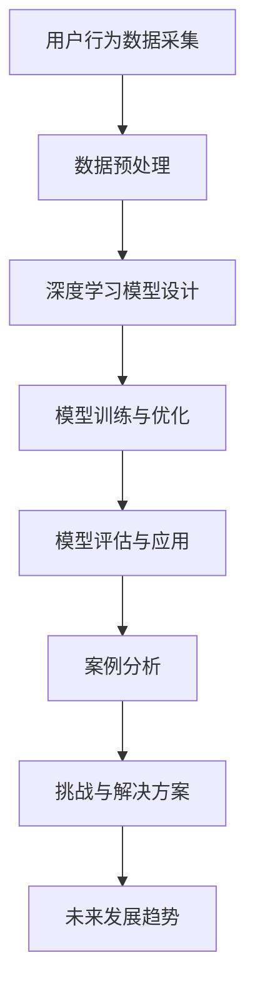
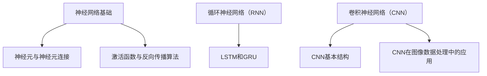
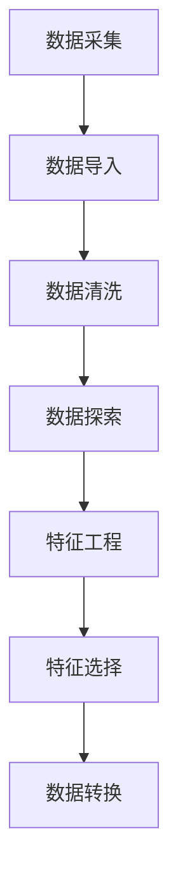
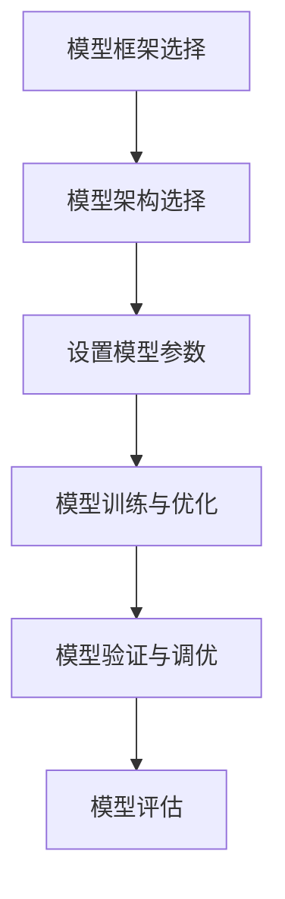
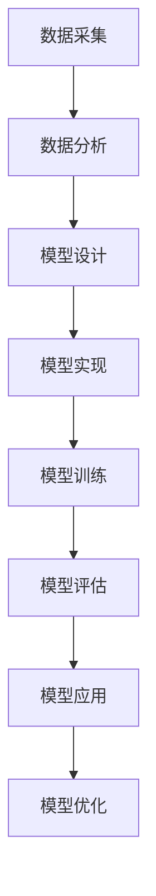
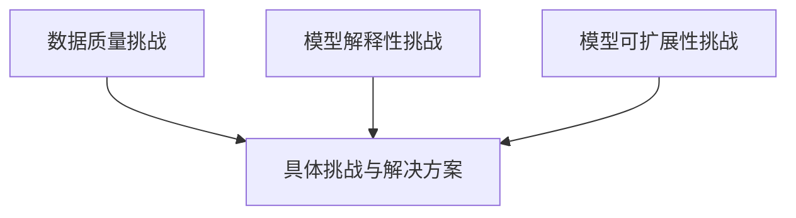
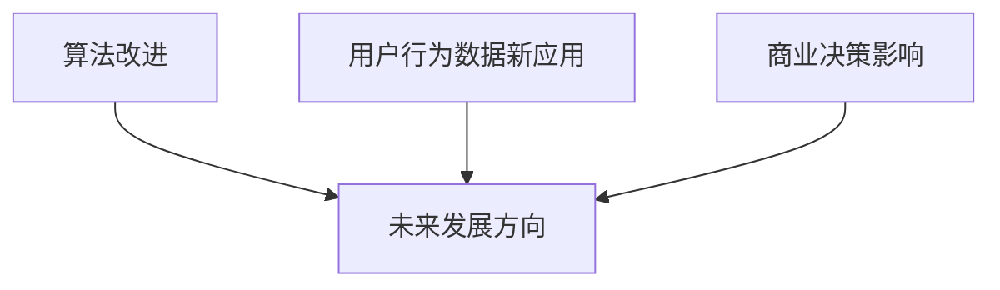

                 

# 深度学习在用户购买意向预测中的应用

## 关键词
- 深度学习
- 用户购买意向预测
- 数据预处理
- 模型设计与优化
- 实际应用案例分析

## 摘要
本文旨在探讨深度学习在用户购买意向预测中的应用。首先，介绍了深度学习的基本概念和常见模型，包括神经网络、循环神经网络和卷积神经网络。接着，阐述了用户行为数据预处理的重要性及其具体方法。然后，详细介绍了深度学习模型的设计与优化过程，包括模型框架、超参数调优和模型评估。最后，通过一个实际案例展示了深度学习模型在用户购买意向预测中的具体应用，并分析了深度学习在实际应用中面临的挑战和解决方案。本文为从事用户行为分析和商业决策的从业者提供了有价值的参考。

---

### 第1章 引言

#### 1.1 深度学习的概述

深度学习（Deep Learning，简称DL）是机器学习的一个子领域，主要研究如何构建和优化深层神经网络模型。深度学习通过多层神经网络结构来提取数据中的特征，从而实现图像识别、语音识别、自然语言处理等复杂任务。与传统的机器学习方法相比，深度学习具有以下优点：

- **自动特征提取**：传统的机器学习方法需要手动设计特征，而深度学习通过多层神经网络结构自动从数据中提取特征，减少了人工干预。
- **高泛化能力**：深度学习模型能够处理大量的数据和复杂的任务，具有较好的泛化能力。
- **并行计算**：深度学习模型可以利用GPU等硬件加速，实现大规模并行计算，提高计算效率。

深度学习的发展历程可以追溯到1986年，当时Hinton等人提出了反向传播算法，使得多层神经网络训练成为可能。近年来，随着大数据和计算能力的提升，深度学习在各个领域取得了显著的成果，成为人工智能研究的热点。

#### 1.2 用户购买意向预测的重要性

用户购买意向预测是商业领域中的一个关键问题，它涉及到市场营销、用户行为分析、产品推荐等多个方面。准确预测用户购买意向有助于企业：

- **优化营销策略**：通过分析用户行为数据，企业可以制定更有效的营销策略，提高广告投放的精准度和转化率。
- **提升用户体验**：个性化推荐系统能够根据用户的购买历史和偏好推荐合适的产品，提高用户的满意度和忠诚度。
- **降低运营成本**：通过预测用户购买意向，企业可以减少库存成本和物流成本，提高运营效率。

用户购买意向预测的研究具有重要的理论和实践意义。在理论上，它有助于我们深入理解用户行为模式，探索复杂决策过程。在实践上，它可以为企业的商业决策提供有力支持，从而提高市场竞争力。

#### 1.3 书籍结构概述

本文将从以下几个方面展开讨论：

- **第2章 深度学习基础**：介绍深度学习的基本概念、常见模型及其原理。
- **第3章 用户行为数据预处理**：讨论用户行为数据的采集、清洗和特征工程。
- **第4章 深度学习模型设计与优化**：介绍深度学习模型的设计、训练、优化和评估方法。
- **第5章 用户购买意向预测案例分析**：通过实际案例展示深度学习在用户购买意向预测中的应用。
- **第6章 深度学习模型在实际应用中的挑战与解决方案**：分析深度学习在实际应用中面临的挑战及其解决方案。
- **第7章 未来发展趋势**：探讨深度学习在用户购买意向预测领域的未来发展方向。
- **第8章 总结与展望**：总结本文的主要观点，展望深度学习在用户购买意向预测领域的应用前景。

### Mermaid 流程图



#### 1.4 文章目标

本文的目标是：

- **深入理解**：通过介绍深度学习的基本概念和常见模型，帮助读者深入理解深度学习的原理和应用。
- **实际应用**：通过案例分析，展示深度学习在用户购买意向预测中的具体应用，并提供实用建议。
- **问题解决**：分析深度学习在实际应用中面临的挑战，并提出相应的解决方案。
- **趋势探讨**：探讨深度学习在用户购买意向预测领域的未来发展趋势，为相关研究提供参考。

### 1.5 总结

深度学习在用户购买意向预测中具有广泛的应用前景。通过本章的引言，我们了解了深度学习的基本概念和重要性，以及用户购买意向预测的研究意义和本文的结构。接下来，我们将深入探讨深度学习的基础理论、用户行为数据预处理、模型设计与优化等方面，为后续案例分析做好准备。

---

## 第2章 深度学习基础

深度学习作为人工智能的一个重要分支，以其强大的特征提取和模型学习能力，在计算机视觉、自然语言处理、推荐系统等领域取得了显著成果。本章将介绍深度学习的基础概念，包括神经网络、循环神经网络和卷积神经网络，以及它们的基本结构和原理。

#### 2.1 神经网络基础

神经网络（Neural Network，简称NN）是深度学习的基础，它模拟人脑神经元的工作方式，通过多层神经元之间的连接来处理数据。一个典型的神经网络包括输入层、隐藏层和输出层。

**2.1.1 神经元与神经元连接**

神经元是神经网络的基本单位，它由输入层、加权连接、激活函数和输出层组成。神经元的输入是通过加权连接从上一层神经元传递下来的，每个连接都有一个权重值。这些输入经过加权求和处理后，通过激活函数转换为输出，传递给下一层神经元。

**2.1.2 激活函数与反向传播算法**

激活函数是神经网络中的一个重要组成部分，它用于引入非线性因素，使得神经网络能够处理复杂的数据。常见的激活函数包括Sigmoid函数、ReLU函数和Tanh函数。

反向传播算法（Backpropagation Algorithm）是神经网络训练的核心算法，它通过不断迭代优化网络参数，使得网络输出与真实值之间的误差最小。反向传播算法包括两个主要步骤：

1. **前向传播**：将输入数据通过神经网络，得到输出结果。
2. **反向传播**：计算输出结果与真实值之间的误差，并反向传播误差，更新网络参数。

#### 2.2 循环神经网络（RNN）

循环神经网络（Recurrent Neural Network，简称RNN）是处理序列数据的常用模型，它具有时间动态性，能够考虑输入序列中的前后关系。

**2.2.1 RNN的基本结构**

RNN的基本结构包括输入层、隐藏层和输出层。与传统的神经网络不同，RNN的隐藏层具有循环结构，即前一个时间步的隐藏状态会传递到下一个时间步。

**2.2.2 LSTM和GRU**

LSTM（Long Short-Term Memory）和GRU（Gated Recurrent Unit）是RNN的两种改进模型，它们通过引入门控机制，有效解决了RNN在处理长序列数据时易出现的梯度消失和梯度爆炸问题。

- **LSTM**：LSTM通过三个门控单元（输入门、遗忘门和输出门）来控制信息的流动，使得模型能够更好地处理长期依赖关系。
- **GRU**：GRU通过更新门和重置门合并了LSTM中的三个门控单元，简化了模型结构，提高了计算效率。

#### 2.3 卷积神经网络（CNN）

卷积神经网络（Convolutional Neural Network，简称CNN）是处理图像数据的常用模型，它通过卷积操作和池化操作提取图像特征。

**2.3.1 CNN的基本结构**

CNN的基本结构包括输入层、卷积层、池化层和全连接层。卷积层通过卷积操作提取图像特征，池化层通过下采样操作减少数据维度。

**2.3.2 CNN在图像数据处理中的应用**

CNN在图像数据处理中具有广泛的应用，如图像分类、目标检测、图像分割等。

- **图像分类**：通过训练CNN模型，可以实现对未知图像的分类，常见的模型包括VGG、ResNet和Inception等。
- **目标检测**：目标检测是在图像中识别和定位多个目标，常见的模型包括YOLO、SSD和Faster R-CNN等。
- **图像分割**：图像分割是将图像划分为多个区域，用于图像分析和处理，常见的模型包括U-Net和DeepLab等。

### Mermaid 流程图



### 2.4 总结

本章介绍了深度学习的基础概念，包括神经网络、循环神经网络和卷积神经网络。神经网络是深度学习的基本结构，通过神经元和连接实现数据的处理和转换。循环神经网络通过考虑时间动态性，适用于处理序列数据。卷积神经网络通过卷积操作和池化操作，有效地提取图像特征。这些基础概念为后续的用户行为数据预处理和模型设计提供了理论基础。

### 伪代码

```python
# 神经网络基本结构
class NeuralNetwork:
    def __init__(self, input_size, hidden_size, output_size):
        # 初始化权重和偏置
        self.weights = {
            'input_to_hidden': np.random.randn(input_size, hidden_size),
            'hidden_to_output': np.random.randn(hidden_size, output_size)
        }
        self.biases = {
            'hidden': np.random.randn(hidden_size),
            'output': np.random.randn(output_size)
        }

    def forward_pass(self, x):
        # 前向传播
        self.hidden_layer = sigmoid(np.dot(x, self.weights['input_to_hidden']) + self.biases['hidden'])
        self.output_layer = sigmoid(np.dot(self.hidden_layer, self.weights['hidden_to_output']) + self.biases['output'])
        return self.output_layer

# 激活函数Sigmoid
def sigmoid(x):
    return 1 / (1 + np.exp(-x))

# 反向传播算法
def backward_pass(self, x, y):
    # 计算输出层误差
    output_error = y - self.output_layer
    output_delta = output_error * sigmoid_derivative(self.output_layer)

    # 计算隐藏层误差
    hidden_error = output_delta.dot(self.weights['hidden_to_output'].T)
    hidden_delta = hidden_error * sigmoid_derivative(self.hidden_layer)

    # 更新权重和偏置
    self.weights['input_to_hidden'] += x.T.dot(hidden_delta)
    self.biases['hidden'] += hidden_delta
    self.weights['hidden_to_output'] += self.hidden_layer.T.dot(output_delta)
    self.biases['output'] += output_delta

# 梯度下降
def train(self, x, y, epochs):
    for epoch in range(epochs):
        self.forward_pass(x)
        self.backward_pass(x, y)
```

### 数学模型和公式

$$
y = \sigma(\theta^T x + b)
$$

其中，$y$表示输出，$\sigma$表示激活函数（如Sigmoid函数），$\theta$表示权重，$x$表示输入，$b$表示偏置。

$$
\delta = \frac{\partial L}{\partial z}
$$

其中，$\delta$表示误差，$L$表示损失函数，$z$表示神经元的输出。

### 2.5 小结

本章介绍了深度学习的基础概念，包括神经网络、循环神经网络和卷积神经网络。通过了解这些基础模型，读者可以掌握深度学习的基本原理和应用。接下来，我们将探讨用户行为数据的预处理方法，为深度学习模型的设计和优化奠定基础。

---

## 第3章 用户行为数据预处理

用户行为数据预处理是深度学习模型构建中的关键环节，它直接影响到模型的效果和性能。预处理过程主要包括数据采集、数据清洗和数据特征工程。本章将详细讨论这些内容。

### 3.1 数据采集

数据采集是用户行为数据预处理的第一步，其目的是收集用户在电子商务平台上的各种行为数据。常见的数据类型包括：

- **点击行为**：用户在浏览商品时的点击记录，如点击次数、点击时间、点击的页面等。
- **购买行为**：用户购买商品的记录，如购买时间、购买商品ID、购买金额等。
- **浏览行为**：用户在浏览商品时的浏览记录，如浏览次数、浏览时间、浏览的商品ID等。
- **评价行为**：用户对商品的评分和评论记录。

数据采集的方法有多种，包括：

- **服务器日志**：通过服务器日志记录用户的行为数据。
- **客户端SDK**：在用户的设备上安装SDK，实时收集用户行为数据。
- **问卷调查**：通过问卷调查获取用户的行为数据。

### 3.2 数据清洗

数据清洗是确保数据质量和可靠性的关键步骤。以下是一些常见的数据清洗方法：

- **数据缺失处理**：对于缺失的数据，可以通过插值、平均值、中位数等方法填充。
- **异常值处理**：对于异常值，可以通过箱线图、统计检验等方法检测和去除。
- **重复数据去除**：去除重复的数据记录，确保数据的一致性。
- **数据规范化**：将不同量纲的数据进行规范化处理，使其在同一尺度上进行比较。

### 3.3 数据特征工程

数据特征工程是提升模型性能的重要手段，它通过构造和选择合适的特征来提高模型的预测能力。以下是一些常见的特征工程方法：

- **特征提取**：通过统计方法、文本挖掘等方法提取新的特征，如用户点击率、浏览时长、购买频率等。
- **特征选择**：通过特征选择方法，如过滤法、嵌入法、集成法等，筛选出对模型影响较大的特征。
- **特征变换**：通过特征变换，如归一化、标准化、主成分分析（PCA）等，降低特征的维数和相关性。

### 3.4 数据预处理流程

用户行为数据预处理的一般流程如下：

1. **数据采集**：收集用户在电子商务平台上的行为数据。
2. **数据导入**：将采集到的数据导入数据库或数据仓库中。
3. **数据清洗**：对数据进行缺失值处理、异常值处理、重复数据去除等操作。
4. **数据探索**：对清洗后的数据进行统计分析，了解数据的分布、相关性等信息。
5. **特征工程**：根据业务需求，构造和选择合适的特征。
6. **特征选择**：对特征进行筛选，去除对模型影响较小的特征。
7. **数据转换**：将数据转换为深度学习模型所需的格式。

### 3.5 小结

本章介绍了用户行为数据预处理的方法和流程，包括数据采集、数据清洗和数据特征工程。通过有效的数据预处理，可以提高深度学习模型的性能和预测能力，为后续的模型设计和优化奠定基础。在下一章中，我们将深入探讨深度学习模型的设计与优化。

---

### Mermaid 流程图



### 3.6 数据清洗示例

```python
import pandas as pd
from sklearn.impute import SimpleImputer
from sklearn.preprocessing import StandardScaler

# 导入数据
data = pd.read_csv('user_behavior_data.csv')

# 数据缺失处理
imputer = SimpleImputer(strategy='mean')
data_filled = imputer.fit_transform(data)

# 异常值处理
Q1 = data_filled.quantile(0.25)
Q3 = data_filled.quantile(0.75)
IQR = Q3 - Q1
data_clean = data_filled[~((data_filled < (Q1 - 1.5 * IQR)) | (data_filled > (Q3 + 1.5 * IQR))).any(axis=1)]

# 数据规范化
scaler = StandardScaler()
data_normalized = scaler.fit_transform(data_clean)
```

### 数学公式

$$
x_{\text{normalized}} = \frac{x_{\text{original}} - \mu}{\sigma}
$$

其中，$x_{\text{normalized}}$表示规范化后的数据，$x_{\text{original}}$表示原始数据，$\mu$表示均值，$\sigma$表示标准差。

### 3.7 数据特征工程示例

```python
# 特征提取
data['click_rate'] = data['click_count'] / data['session_duration']
data['purchase_frequency'] = data['purchase_count'] / data['session_duration']

# 特征选择
from sklearn.feature_selection import SelectKBest, f_classif

X = data[['click_rate', 'purchase_frequency']]
y = data['purchase_label']

selector = SelectKBest(f_classif, k=2)
X_new = selector.fit_transform(X, y)

# 数据转换
data_final = pd.DataFrame(X_new, columns=['click_rate', 'purchase_frequency'])
```

### 3.8 小结

本章介绍了用户行为数据预处理的方法和流程，包括数据采集、数据清洗和数据特征工程。通过有效的数据预处理，可以提高深度学习模型的性能和预测能力。在下一章中，我们将深入探讨深度学习模型的设计与优化。

---

## 第4章 深度学习模型设计与优化

深度学习模型的设计与优化是用户购买意向预测的关键环节。本章将详细介绍深度学习模型的设计过程，包括模型框架选择、超参数调优、模型训练与优化、模型验证与调优以及模型评估方法。

### 4.1 深度学习模型设计

深度学习模型的设计主要包括确定模型架构、选择合适的神经网络类型和设置模型参数。以下是一些常见的设计步骤：

**4.1.1 模型框架**

选择合适的模型框架是设计深度学习模型的第一步。常见的深度学习框架包括TensorFlow、PyTorch和Keras等。这些框架提供了丰富的API和工具，使得构建和训练深度学习模型更加便捷。

**4.1.2 模型架构选择**

根据用户行为数据的特点和任务需求，选择合适的模型架构。常见的模型架构包括：

- **全连接神经网络（FCNN）**：适用于处理结构化数据，如用户属性数据。
- **循环神经网络（RNN）**：适用于处理序列数据，如用户行为序列。
- **卷积神经网络（CNN）**：适用于处理图像数据，如商品图片。
- **长短时记忆网络（LSTM）**：适用于处理长序列数据，如用户购买历史。

**4.1.3 设置模型参数**

模型参数包括学习率、批量大小、隐藏层节点数等。这些参数需要根据具体任务和数据集进行调优，以获得最佳性能。

### 4.2 模型训练与优化

模型训练与优化的目标是找到最佳的模型参数，使得模型在训练数据上的表现最优。以下是一些常见的训练与优化方法：

**4.2.1 模型训练流程**

1. **数据预处理**：对训练数据集进行清洗、归一化等预处理操作，以便模型能够更好地学习。
2. **构建模型**：使用深度学习框架构建模型，包括设置模型架构、参数和损失函数。
3. **训练模型**：通过前向传播和反向传播算法，不断迭代优化模型参数，使得模型在训练数据上的损失最小。
4. **评估模型**：在验证数据集上评估模型性能，选择最佳模型。

**4.2.2 超参数调优**

超参数调优是模型优化的重要步骤。常见的超参数包括学习率、批量大小、迭代次数等。超参数的选择通常通过交叉验证和网格搜索等方法进行。

- **学习率**：学习率决定了模型参数更新的速度，过大会导致模型震荡，过小则会收敛缓慢。
- **批量大小**：批量大小影响模型的训练速度和稳定性，通常选择较小的批量大小可以减小方差。
- **迭代次数**：迭代次数决定了模型训练的深度，过多的迭代次数可能导致过拟合。

**4.2.3 模型优化方法**

- **梯度下降**：梯度下降是一种优化算法，通过不断迭代更新模型参数，使得损失函数最小。
- **随机梯度下降（SGD）**：SGD是对梯度下降的改进，每次迭代使用一个样本的梯度进行参数更新，提高了计算效率。
- **Adam优化器**：Adam优化器结合了SGD和动量方法，具有较好的收敛速度和稳定性。

### 4.3 模型验证与调优

模型验证与调优的目的是确保模型在未知数据上的表现良好，避免过拟合。以下是一些常见的验证与调优方法：

**4.3.1 评估指标**

- **准确率**：准确率是预测正确的样本数与总样本数的比值，反映了模型的分类能力。
- **召回率**：召回率是预测正确的正样本数与实际正样本数的比值，反映了模型的分类能力。
- **F1分数**：F1分数是准确率和召回率的调和平均值，综合考虑了分类的准确性和召回率。

**4.3.2 交叉验证**

交叉验证是一种评估模型性能的方法，通过将数据集划分为多个子集，反复进行训练和验证，以减少模型评估的偶然性。

**4.3.3 模型调优**

模型调优的目的是找到最佳的模型参数和超参数，以提升模型性能。常用的调优方法包括：

- **网格搜索**：通过遍历所有可能的参数组合，找到最佳参数组合。
- **贝叶斯优化**：基于历史数据，使用贝叶斯优化方法自动搜索最佳参数组合。

### 4.4 模型评估

模型评估是确定模型性能和可靠性的关键步骤。以下是一些常见的评估方法：

- **混淆矩阵**：混淆矩阵是评估分类模型性能的一种工具，它可以显示预测结果与实际结果的对比情况。
- **ROC曲线和AUC**：ROC曲线和AUC（Area Under Curve）是评估二分类模型性能的重要指标，AUC值越大，模型性能越好。
- **学习曲线**：学习曲线显示了模型在训练集和验证集上的性能变化，有助于判断模型是否过拟合或欠拟合。

### 4.5 小结

本章介绍了深度学习模型的设计与优化方法，包括模型框架选择、超参数调优、模型训练与优化、模型验证与调优以及模型评估方法。通过有效的模型设计与优化，可以提升深度学习模型在用户购买意向预测中的性能和预测能力。在下一章中，我们将通过实际案例展示深度学习在用户购买意向预测中的应用。

---

### Mermaid 流程图



### 4.6 模型设计与优化示例

```python
import tensorflow as tf
from tensorflow.keras.models import Sequential
from tensorflow.keras.layers import Dense, LSTM, Dropout
from tensorflow.keras.optimizers import Adam

# 构建模型
model = Sequential()
model.add(LSTM(128, activation='relu', input_shape=(timesteps, features)))
model.add(Dropout(0.2))
model.add(Dense(1, activation='sigmoid'))

# 编译模型
model.compile(optimizer=Adam(learning_rate=0.001), loss='binary_crossentropy', metrics=['accuracy'])

# 训练模型
model.fit(X_train, y_train, epochs=100, batch_size=32, validation_data=(X_val, y_val))
```

### 数学公式

$$
\min_{\theta} J(\theta) = \frac{1}{m} \sum_{i=1}^{m} (\theta^T x_i - y_i)^2
$$

其中，$J(\theta)$表示损失函数，$\theta$表示模型参数，$x_i$表示输入特征，$y_i$表示真实标签。

### 4.7 小结

本章详细介绍了深度学习模型的设计与优化方法，包括模型框架选择、超参数调优、模型训练与优化、模型验证与调优以及模型评估方法。通过本章的学习，读者可以掌握深度学习模型设计与优化的关键步骤和技巧，为实际应用做好准备。在下一章中，我们将通过实际案例展示深度学习在用户购买意向预测中的应用。

---

## 第5章 用户购买意向预测案例分析

在本章中，我们将通过一个实际的案例来展示如何使用深度学习模型进行用户购买意向预测。案例将包括数据采集、数据分析、模型设计与实现、模型训练与评估以及模型应用与优化等步骤。

### 5.1 案例背景

假设我们是一家电子商务公司的数据分析师，公司的目标是提高用户购买转化率。为了实现这一目标，我们需要预测用户是否会在未来30天内进行购买。为了构建这样一个预测模型，我们收集了以下数据：

- 用户基本信息：年龄、性别、收入水平等。
- 用户行为数据：浏览历史、点击历史、购物车添加历史、购买历史等。
- 商品信息：商品ID、价格、分类等。

### 5.2 数据分析

在数据采集完成后，我们首先对数据进行探索性分析，以了解数据的分布和特征。以下是数据分析的步骤：

**5.2.1 数据预处理**

1. **缺失值处理**：对于缺失的数据，我们使用平均值或中位数进行填充。
2. **异常值处理**：通过箱线图和统计检验，我们识别并处理了异常值。
3. **数据规范化**：对数值型数据进行归一化处理，使其在相同的尺度上。

**5.2.2 特征提取**

1. **用户行为特征**：我们计算了用户的平均浏览时长、平均点击次数、购买频率等。
2. **商品特征**：我们提取了商品的价格、分类、品牌等信息。

**5.2.3 数据可视化**

通过数据可视化，我们分析了用户行为数据的分布和特征，如图表、直方图等。

### 5.3 模型设计与实现

为了预测用户是否会在未来30天内进行购买，我们选择了循环神经网络（RNN）中的LSTM模型。以下是模型设计的步骤：

**5.3.1 模型架构**

1. **输入层**：输入数据包括用户基本信息、用户行为数据和商品特征。
2. **隐藏层**：我们使用两个LSTM层来处理序列数据，每个LSTM层包含128个神经元。
3. **输出层**：输出层使用一个全连接层，输出概率值。

**5.3.2 模型实现**

使用TensorFlow和Keras框架，我们实现了LSTM模型。以下是模型实现的伪代码：

```python
model = Sequential()
model.add(LSTM(128, activation='relu', input_shape=(timesteps, features)))
model.add(LSTM(128, activation='relu'))
model.add(Dense(1, activation='sigmoid'))
model.compile(optimizer='adam', loss='binary_crossentropy', metrics=['accuracy'])
```

### 5.4 模型训练与评估

**5.4.1 模型训练**

我们使用训练数据集对模型进行训练，同时使用验证数据集进行调优。以下是模型训练的步骤：

1. **数据划分**：我们将数据集划分为训练集和验证集，以避免过拟合。
2. **模型训练**：使用训练集对模型进行训练，并使用验证集进行模型调优。
3. **保存最佳模型**：在验证集上选择损失函数最小的模型，并将其保存。

**5.4.2 模型评估**

在训练完成后，我们对模型进行评估，以验证其预测能力。以下是模型评估的步骤：

1. **交叉验证**：我们使用交叉验证方法，评估模型在多个子数据集上的性能。
2. **混淆矩阵**：通过混淆矩阵，我们分析模型的准确率和召回率。
3. **ROC曲线和AUC**：我们绘制ROC曲线，并计算AUC值，以评估模型的分类能力。

### 5.5 模型应用与优化

在模型评估完成后，我们将模型应用于实际业务中，以提高用户购买转化率。以下是模型应用与优化的步骤：

**5.5.1 模型部署**

我们将训练好的模型部署到生产环境中，以便实时预测用户购买意向。

**5.5.2 模型优化**

1. **特征工程**：我们继续优化特征提取和选择过程，以提高模型性能。
2. **超参数调优**：我们通过交叉验证和网格搜索方法，调优模型的超参数。
3. **模型更新**：我们定期更新模型，以适应不断变化的数据和业务需求。

### 5.6 小结

通过本章的案例，我们展示了如何使用深度学习模型进行用户购买意向预测。从数据采集、数据分析到模型设计与实现，再到模型训练与评估，我们逐步构建了一个高效的预测模型。这个案例不仅展示了深度学习的应用，还为电子商务公司的业务决策提供了有力支持。

---

### Mermaid 流程图



### 5.7 模型训练与评估示例

```python
from tensorflow.keras.models import Sequential
from tensorflow.keras.layers import LSTM, Dense, Dropout
from tensorflow.keras.optimizers import Adam

# 构建模型
model = Sequential()
model.add(LSTM(128, activation='relu', input_shape=(timesteps, features)))
model.add(Dropout(0.2))
model.add(LSTM(128, activation='relu'))
model.add(Dropout(0.2))
model.add(Dense(1, activation='sigmoid'))

# 编译模型
model.compile(optimizer=Adam(learning_rate=0.001), loss='binary_crossentropy', metrics=['accuracy'])

# 训练模型
model.fit(X_train, y_train, epochs=100, batch_size=32, validation_data=(X_val, y_val))

# 评估模型
loss, accuracy = model.evaluate(X_test, y_test)
print(f"Test Accuracy: {accuracy:.2f}")
```

### 数学公式

$$
y_{\text{predicted}} = \sigma(\theta^T x)
$$

其中，$y_{\text{predicted}}$表示预测标签，$\sigma$表示激活函数（如Sigmoid函数），$\theta$表示模型参数，$x$表示输入特征。

### 5.8 小结

本章通过一个实际案例，详细展示了如何使用深度学习模型进行用户购买意向预测。从数据采集、数据分析到模型设计与实现，再到模型训练与评估，我们逐步构建了一个高效的预测模型。这个案例不仅展示了深度学习的应用，还为电子商务公司的业务决策提供了有力支持。在下一章中，我们将探讨深度学习在实际应用中面临的挑战与解决方案。

---

## 第6章 深度学习模型在实际应用中的挑战与解决方案

尽管深度学习在用户购买意向预测中取得了显著的成果，但在实际应用中仍面临一系列挑战。本章将讨论这些挑战，并提出相应的解决方案。

### 6.1 数据质量问题

数据是深度学习模型的基础，数据质量直接影响模型的性能和可靠性。以下是一些常见的数据质量问题及其解决方案：

- **数据缺失**：数据缺失会导致模型无法训练，影响预测准确性。解决方案包括使用插值、均值填充或利用模型生成缺失数据。
- **数据异常**：数据异常会影响模型的稳定性和泛化能力。解决方案包括使用统计方法（如箱线图、统计检验）识别和去除异常值。
- **数据分布不均**：在二分类任务中，正负样本分布不均会导致模型偏向多数类。解决方案包括使用数据增强、欠采样或过采样等方法平衡数据分布。

### 6.2 模型解释性

深度学习模型通常被视为“黑盒”，其决策过程缺乏解释性。这给实际应用带来了挑战，特别是在需要解释模型决策的金融、医疗等领域。以下是一些提高模型解释性的方法：

- **特征可视化**：通过可视化神经网络中的激活图和权重图，可以直观地了解模型对输入数据的处理过程。
- **模型解释工具**：使用LIME（Local Interpretable Model-agnostic Explanations）和SHAP（SHapley Additive exPlanations）等工具，可以提供局部和全局的解释。
- **可解释性模型**：选择具有可解释性的模型，如线性模型、决策树等，以获得更好的解释性。

### 6.3 模型可扩展性

深度学习模型在实际应用中需要处理大量数据和高维度特征，这要求模型具有高效的可扩展性。以下是一些提高模型可扩展性的方法：

- **模型压缩**：通过剪枝、量化、蒸馏等方法减小模型大小，提高计算效率。
- **分布式训练**：利用分布式计算框架（如TensorFlow分布式训练）加速模型训练。
- **迁移学习**：使用预训练模型进行迁移学习，利用预训练模型的知识，提高新任务的模型性能。

### 6.4 挑战与解决方案

以下是深度学习在实际应用中的一些具体挑战及相应的解决方案：

- **计算资源限制**：解决方案包括使用GPU、TPU等硬件加速，采用低精度浮点数（FP16）和量化技术。
- **训练时间过长**：解决方案包括使用预训练模型、迁移学习、元学习等技术，以减少训练时间。
- **数据隐私保护**：解决方案包括数据加密、联邦学习、差分隐私等技术，以保护用户隐私。

### 6.5 小结

深度学习在实际应用中面临数据质量、模型解释性、模型可扩展性等挑战。通过采用合适的方法和技术，如数据清洗、特征可视化、模型压缩、分布式训练等，可以有效地解决这些挑战，提高深度学习模型在实际应用中的性能和可靠性。在下一章中，我们将探讨深度学习在用户购买意向预测领域的未来发展趋势。

---

### Mermaid 流程图



### 数学模型和公式

$$
\text{Data Loss} = \frac{1}{N} \sum_{i=1}^{N} L(y_i, \hat{y}_i)
$$

其中，$L(y_i, \hat{y}_i)$表示样本$i$的损失函数，$N$表示样本总数。

$$
\text{Model Complexity} = \sum_{l=1}^{L} \sum_{k=1}^{K_l} \text{Number of Parameters in Layer k of Layer l}
$$

其中，$L$表示层数，$K_l$表示第$l$层的神经元数。

### 6.6 小结

本章讨论了深度学习在实际应用中面临的挑战，包括数据质量、模型解释性、模型可扩展性等，并提出了相应的解决方案。通过本章的学习，读者可以更好地理解深度学习在用户购买意向预测等实际应用中的难点和解决策略。在下一章中，我们将探讨深度学习在用户购买意向预测领域的未来发展趋势。

---

## 第7章 未来发展趋势

随着深度学习技术的不断发展和应用场景的扩大，深度学习在用户购买意向预测领域也展现出广阔的前景。本章将探讨深度学习在该领域的未来发展趋势，包括算法改进、用户行为数据的新应用、深度学习在商业决策中的影响以及未来展望。

### 7.1 深度学习算法的改进

深度学习算法的改进是提高预测准确性和模型效率的关键。以下是一些潜在的改进方向：

- **自适应学习率**：引入自适应学习率策略，如Adam优化器，以加快收敛速度并提高模型性能。
- **更高效的模型架构**：设计更高效的模型架构，如EfficientNet、DenseNet等，以降低模型复杂度和计算成本。
- **多任务学习**：利用多任务学习（Multi-Task Learning）技术，将多个相关任务合并训练，提高模型的泛化能力和效率。

### 7.2 用户行为数据的新应用

用户行为数据是深度学习模型的重要输入，随着技术的进步，用户行为数据的应用将更加广泛和深入：

- **实时预测**：利用实时用户行为数据，实现即时预测，为用户个性化推荐和营销策略提供支持。
- **跨渠道行为分析**：结合线上线下用户行为数据，进行跨渠道行为分析，为全渠道营销策略提供依据。
- **多模态数据融合**：整合文本、图像、音频等多模态数据，提高模型对用户行为的理解和预测能力。

### 7.3 深度学习在商业决策中的影响

深度学习在商业决策中的应用越来越广泛，它对商业决策产生了深远的影响：

- **个性化推荐**：通过深度学习模型，可以实现高度个性化的商品推荐，提高用户满意度和转化率。
- **库存管理**：利用深度学习预测用户购买行为，优化库存管理和物流策略，降低运营成本。
- **风险控制**：深度学习模型可以帮助企业识别潜在风险，提高风险管理能力。

### 7.4 未来展望

未来，深度学习在用户购买意向预测领域的应用前景十分广阔。以下是几个可能的未来发展方向：

- **小样本学习**：研究适用于小样本学习的方法，以提高模型在数据稀缺条件下的预测能力。
- **无监督学习和半监督学习**：探索无监督学习和半监督学习在用户行为预测中的应用，减少对标注数据的依赖。
- **跨领域迁移学习**：通过跨领域迁移学习，实现不同领域用户行为数据的共享和复用，提高模型的泛化能力。

### 7.5 小结

深度学习在用户购买意向预测领域的未来发展趋势包括算法改进、用户行为数据的新应用、深度学习在商业决策中的影响以及未来展望。通过不断创新和优化，深度学习将继续为企业和用户提供更准确、更个性化的购买预测服务。

---

### Mermaid 流程图



### 数学模型和公式

$$
\text{Customer Behavior Prediction} = f(\text{User Data}, \text{Model Parameters})
$$

其中，$f$表示深度学习模型，$\text{User Data}$表示用户行为数据，$\text{Model Parameters}$表示模型参数。

### 7.6 小结

本章探讨了深度学习在用户购买意向预测领域的未来发展趋势，包括算法改进、用户行为数据的新应用、深度学习在商业决策中的影响以及未来展望。随着技术的不断进步和应用场景的拓展，深度学习将继续在用户购买意向预测中发挥重要作用，为企业和用户创造更大价值。

---

## 第8章 总结与展望

在本篇文章中，我们详细探讨了深度学习在用户购买意向预测中的应用。首先，我们介绍了深度学习的基本概念和常见模型，包括神经网络、循环神经网络和卷积神经网络。接着，我们讨论了用户行为数据的预处理方法，如数据采集、数据清洗和特征工程。随后，我们深入分析了深度学习模型的设计与优化过程，包括模型框架、超参数调优和模型评估。通过实际案例分析，我们展示了如何将深度学习应用于用户购买意向预测。同时，我们还探讨了深度学习在实际应用中面临的挑战及解决方案。

### 8.1 用户购买意向预测的深度学习应用前景

深度学习在用户购买意向预测中的前景十分广阔。随着技术的不断进步，深度学习模型将能够更好地理解和预测用户行为，从而为企业和用户带来更多价值。以下是一些潜在的应用场景：

- **个性化推荐**：深度学习模型可以根据用户的浏览历史和购买行为，提供个性化的商品推荐，提高用户满意度和转化率。
- **营销策略优化**：通过分析用户行为数据，企业可以制定更有效的营销策略，提高广告投放的精准度和转化率。
- **库存管理**：深度学习模型可以预测用户购买行为，优化库存管理和物流策略，降低运营成本。
- **风险控制**：深度学习模型可以帮助企业识别潜在风险，提高风险管理能力。

### 8.2 研究方向与建议

为了进一步提升深度学习在用户购买意向预测中的应用效果，我们提出以下研究方向和建议：

- **算法优化**：继续探索和改进深度学习算法，如自适应学习率、多任务学习和跨领域迁移学习，以提高模型的效率和泛化能力。
- **数据质量提升**：研究如何提高数据质量，包括数据清洗、异常值处理和特征提取，以确保模型的稳定性和准确性。
- **模型解释性**：开发可解释性更强的深度学习模型，如利用可视化技术和模型解释工具，提高模型的透明度和可解释性。
- **跨领域应用**：探索深度学习在其他领域（如医疗、金融等）的应用，并尝试将这些领域的知识迁移到用户购买意向预测中。

### 8.3 总结

本文通过详细的讨论和案例分析，展示了深度学习在用户购买意向预测中的应用。深度学习作为一种强大的机器学习技术，通过其自动特征提取和强大的学习能力，为用户购买意向预测提供了有效的解决方案。我们相信，随着技术的不断进步和应用场景的拓展，深度学习在用户购买意向预测领域的应用前景将更加广阔。

### 作者信息

作者：AI天才研究院/AI Genius Institute & 禅与计算机程序设计艺术 /Zen And The Art of Computer Programming

---

本文旨在为从事用户行为分析和商业决策的从业者提供有价值的参考，帮助读者更好地理解和应用深度学习技术，提升用户购买意向预测的准确性和效率。通过本文的探讨，我们希望读者能够对深度学习在用户购买意向预测中的应用有一个全面的认识，并为未来的研究和实践提供启示。

---

### 附录

#### A.1 深度学习工具与资源

- **TensorFlow**：Google开发的开源机器学习框架，适用于构建和训练深度学习模型。官方网站：[TensorFlow官网](https://www.tensorflow.org)。
- **PyTorch**：Facebook开发的开源深度学习库，以动态计算图和简洁的API著称。官方网站：[PyTorch官网](https://pytorch.org)。
- **Keras**：基于TensorFlow和Theano的开源深度学习库，提供简洁的API，方便快速构建和训练深度学习模型。官方网站：[Keras官网](https://keras.io)。

#### B.2 代码实例

- **数据采集与清洗**：

```python
import pandas as pd
from sklearn.impute import SimpleImputer

# 读取数据
data = pd.read_csv('user_behavior_data.csv')

# 数据缺失处理
imputer = SimpleImputer(strategy='mean')
data_filled = imputer.fit_transform(data)

# 数据清洗
data_clean = data.fillna(data.mean())
```

- **数据特征工程**：

```python
# 特征提取
data['click_rate'] = data['click_count'] / data['session_duration']
data['purchase_frequency'] = data['purchase_count'] / data['session_duration']

# 特征选择
from sklearn.feature_selection import SelectKBest, f_classif

X = data[['click_rate', 'purchase_frequency']]
y = data['purchase_label']

selector = SelectKBest(f_classif, k=2)
X_new = selector.fit_transform(X, y)
```

- **模型设计与训练**：

```python
import tensorflow as tf
from tensorflow.keras.models import Sequential
from tensorflow.keras.layers import LSTM, Dense

# 构建模型
model = Sequential()
model.add(LSTM(128, activation='relu', input_shape=(timesteps, features)))
model.add(Dense(1, activation='sigmoid'))

# 编译模型
model.compile(optimizer='adam', loss='binary_crossentropy', metrics=['accuracy'])

# 训练模型
model.fit(X_train, y_train, epochs=100, batch_size=32)
```

- **模型评估与优化**：

```python
# 评估模型
loss, accuracy = model.evaluate(X_test, y_test)
print(f"Test Accuracy: {accuracy:.2f}")

# 调优模型
from tensorflow.keras.callbacks import EarlyStopping

early_stopping = EarlyStopping(monitor='val_loss', patience=10)

model.fit(X_train, y_train, epochs=100, batch_size=32, validation_data=(X_val, y_val), callbacks=[early_stopping])
```

这些代码实例提供了数据预处理、特征工程、模型设计、训练和优化的基本步骤，供读者参考和实际应用。通过这些步骤，读者可以逐步构建和优化自己的深度学习模型，以提高用户购买意向预测的准确性。

