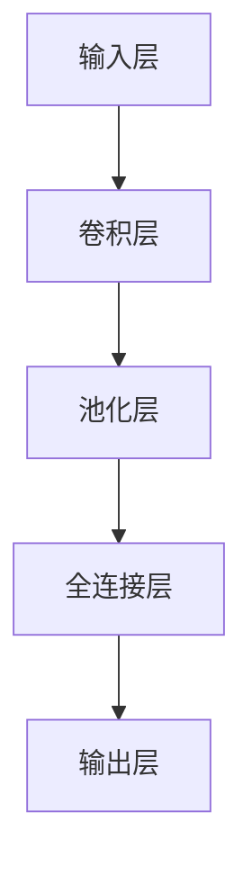

                 

# 《深度学习驱动的商品图像质量评估与筛选》

## 关键词

- 深度学习
- 图像质量评估
- 图像筛选
- 卷积神经网络
- CNN
- 数据预处理
- 模型训练
- 模型优化
- 实际应用

## 摘要

随着电子商务的蓬勃发展，商品图像的质量对消费者的购买决策产生了深远影响。本文探讨了深度学习在商品图像质量评估与筛选中的应用。首先，介绍了深度学习的基础知识和图像处理的基本原理。接着，详细阐述了商品图像质量评估的方法和深度学习模型。通过案例研究，展示了深度学习在商品图像质量评估与筛选中的实际应用，并提出了系统设计的方法。最后，对深度学习框架、数据集获取与处理、模型训练与优化技巧进行了总结，并对未来应用前景进行了展望。

## 第一部分：深度学习基础与图像处理

### 第1章：深度学习概述

#### 1.1 深度学习的起源与发展

深度学习（Deep Learning）是机器学习的一个分支，起源于1980年代，由多层的神经网络模型组成，以自动提取特征和模式识别著称。近年来，随着计算能力的提升和大数据的可用性增加，深度学习在语音识别、图像识别、自然语言处理等领域取得了显著成果。

#### 1.2 深度学习的基本原理

深度学习通过多层神经网络进行学习和特征提取。每个神经元的输出作为下一层神经元的输入。通过反向传播算法，网络能够根据损失函数调整权重，以达到最佳的预测效果。主要模型包括卷积神经网络（CNN）、循环神经网络（RNN）和生成对抗网络（GAN）等。

#### 1.3 深度学习在图像处理中的应用

深度学习在图像处理中的应用极为广泛，例如图像分类、物体检测、图像分割和图像生成等。卷积神经网络（CNN）由于其强大的特征提取和变换能力，成为图像处理领域的核心工具。

### 第2章：图像处理基础

#### 2.1 图像的基本概念

图像是计算机视觉的基础。它由像素阵列组成，每个像素包含颜色和亮度信息。常见的图像格式有JPEG、PNG和GIF等。

#### 2.2 图像处理的基本操作

图像处理包括多个基本操作，如滤波、边缘检测、图像增强和图像压缩。这些操作可以用于改善图像质量、提取特征和进行图像分析。

#### 2.3 图像的特征提取

特征提取是图像处理的关键步骤。通过提取图像的关键特征，可以用于后续的图像分类、物体检测和图像检索等任务。常见的方法包括颜色特征、纹理特征和形状特征等。

### 第3章：深度学习在图像处理中的应用

#### 3.1 卷积神经网络（CNN）原理

卷积神经网络（CNN）是一种专门用于处理图像的深度学习模型。它通过卷积层、池化层和全连接层等结构，实现了图像的特征提取和分类。

#### 3.2 CNN在图像分类中的应用

CNN在图像分类中具有显著优势，通过训练，可以自动提取图像的特征，并用于分类任务。典型的模型包括LeNet、AlexNet、VGG和ResNet等。

#### 3.3 CNN在图像分割中的应用

图像分割是将图像划分为多个区域的过程。CNN在图像分割中得到了广泛应用，通过训练，可以实现对图像像素级别的精确分割。常见的模型包括U-Net、SegNet和DeepLab等。

## 第二部分：商品图像质量评估

### 第4章：商品图像质量评价指标

#### 4.1 评价指标的选取

商品图像质量评估需要选择合适的评价指标，如主观评价指标（如人类视觉评价）和客观评价指标（如结构相似性（SSIM）和峰值信噪比（PSNR）等）。

#### 4.2 指标权重分配

不同的评价指标对图像质量的影响程度不同，因此需要分配不同的权重，以综合评估图像质量。

#### 4.3 评估方法的选择

评估方法的选择取决于图像类型和评估目标。常见的方法包括基于规则的方法、机器学习方法等。

### 第5章：深度学习驱动的图像质量评估

#### 5.1 图像质量评估的深度学习模型

深度学习模型在图像质量评估中具有显著优势，通过训练，可以自动提取图像的特征，并用于评估。常见的模型包括CNN和深度残差网络（ResNet）等。

#### 5.2 模型训练与优化

模型训练是图像质量评估的关键步骤。通过优化损失函数和调整超参数，可以提高模型的评估效果。

#### 5.3 评估结果的可视化分析

可视化分析可以帮助理解模型的评估结果，例如通过热力图展示图像中的高质量区域。

### 第6章：案例研究：商品图像质量评估与筛选

#### 6.1 数据准备与预处理

数据准备与预处理是模型训练的基础。通过数据清洗、数据增强和归一化等操作，可以提高模型的训练效果。

#### 6.2 模型选择与训练

选择合适的深度学习模型并进行训练，是评估与筛选的关键步骤。通过调整模型结构和超参数，可以提高模型的评估效果。

#### 6.3 评估与筛选结果分析

对评估与筛选结果进行详细分析，可以帮助理解模型的效果，并为后续优化提供依据。

## 第三部分：深度学习驱动的商品图像筛选

### 第7章：商品图像筛选技术

#### 7.1 图像筛选的基本原理

图像筛选是通过评估图像的质量和相关性，筛选出高质量的图像。深度学习模型可以用于评估图像质量，从而实现筛选。

#### 7.2 图像筛选的深度学习模型

深度学习模型在图像筛选中具有显著优势，可以通过训练，自动提取图像的特征，并用于筛选。

#### 7.3 模型训练与优化

模型训练与优化是图像筛选的关键步骤。通过优化损失函数和调整超参数，可以提高模型的筛选效果。

### 第8章：案例研究：基于深度学习的商品图像筛选

#### 8.1 数据准备与预处理

数据准备与预处理是模型训练的基础。通过数据清洗、数据增强和归一化等操作，可以提高模型的训练效果。

#### 8.2 模型选择与训练

选择合适的深度学习模型并进行训练，是筛选的关键步骤。通过调整模型结构和超参数，可以提高模型的筛选效果。

#### 8.3 图像筛选结果分析

对筛选结果进行详细分析，可以帮助理解模型的效果，并为后续优化提供依据。

### 第9章：深度学习驱动的商品图像筛选系统设计

#### 9.1 系统架构设计

系统架构设计是商品图像筛选系统的核心。通过合理设计，可以实现高效的图像筛选和处理。

#### 9.2 功能模块设计

功能模块设计包括图像质量评估模块、图像筛选模块和用户交互模块等，是系统实现的基础。

#### 9.3 系统实现与优化

系统实现与优化是系统设计的最后一步。通过优化算法和硬件加速等技术，可以提高系统的性能和效率。

## 附录

### 附录A：深度学习框架与工具

#### A.1 TensorFlow

TensorFlow是谷歌开发的开源深度学习框架，具有广泛的应用。

#### A.2 PyTorch

PyTorch是Facebook开发的深度学习框架，以其灵活性和易用性著称。

#### A.3 其他深度学习框架介绍

其他深度学习框架还包括Keras、Theano和MXNet等。

### 附录B：数据集获取与处理

#### B.1 数据集获取途径

数据集可以从公共数据集网站、电商平台和社交媒体等途径获取。

#### B.2 数据预处理方法

数据预处理方法包括数据清洗、数据增强和归一化等。

#### B.3 数据增强技术

数据增强技术可以提高模型的泛化能力，包括旋转、缩放、裁剪和颜色变换等。

### 附录C：深度学习模型训练与优化技巧

#### C.1 模型训练技巧

模型训练技巧包括批次大小、学习率调整和正则化等。

#### C.2 模型优化策略

模型优化策略包括权重初始化、优化器选择和超参数调整等。

#### C.3 模型评估与调优

模型评估与调优包括交叉验证、模型选择和超参数调整等。

### 附录D：深度学习在商品图像质量评估与筛选中的应用前景

#### D.1 应用领域展望

深度学习在商品图像质量评估与筛选中具有广泛的应用前景，包括电子商务、广告营销和智能制造等领域。

#### D.2 挑战与机遇

深度学习在商品图像质量评估与筛选中面临的挑战包括数据质量、模型泛化能力和计算资源等。

#### D.3 未来发展趋势

未来，深度学习在商品图像质量评估与筛选中的应用将更加智能化和高效化，为各行业带来巨大的价值。

## 作者

作者：AI天才研究院/AI Genius Institute & 禅与计算机程序设计艺术 /Zen And The Art of Computer Programming

---

### 第1章：深度学习概述

#### 1.1 深度学习的起源与发展

深度学习（Deep Learning）起源于1980年代，由多层的神经网络模型组成，以自动提取特征和模式识别著称。在最初的几十年里，由于计算能力的限制和缺乏有效的算法，深度学习的发展相对缓慢。然而，随着计算能力的提升和大数据的可用性增加，深度学习在2010年后迎来了爆发式的发展。

深度学习在语音识别、图像识别、自然语言处理、计算机视觉等领域取得了显著的成果。著名的深度学习模型包括卷积神经网络（CNN）、循环神经网络（RNN）和生成对抗网络（GAN）等。这些模型在图像分类、物体检测、图像分割和自然语言处理等任务中表现出色。

#### 1.2 深度学习的基本原理

深度学习通过多层神经网络进行学习和特征提取。每个神经元的输出作为下一层神经元的输入。通过反向传播算法，网络能够根据损失函数调整权重，以达到最佳的预测效果。深度学习的核心思想是层次化特征表示，即通过逐层神经网络提取越来越抽象的特征。

深度学习模型的主要组成部分包括：

- **输入层**：接收原始数据，如图像、文本或声音。
- **隐藏层**：多层隐藏层构成了深度学习的核心，用于提取特征。每一层都能提取更高层次的抽象特征。
- **输出层**：根据隐藏层提取的特征，生成预测结果。

反向传播算法是深度学习训练的核心。它通过计算损失函数的梯度，反向传播到每一层，从而调整权重。这个过程称为梯度下降。常用的优化算法包括随机梯度下降（SGD）、Adam优化器等。

#### 1.3 深度学习在图像处理中的应用

深度学习在图像处理中的应用极为广泛，涵盖了图像分类、物体检测、图像分割和图像生成等任务。以下是一些常见的深度学习模型和其在图像处理中的应用：

- **卷积神经网络（CNN）**：CNN是一种专门用于图像处理的深度学习模型。它通过卷积层、池化层和全连接层等结构，实现了图像的特征提取和分类。CNN在图像分类任务中取得了显著的成果，如ImageNet竞赛中的Top-5错误率。

  - **卷积层**：卷积层是CNN的核心部分，通过卷积操作提取图像的特征。卷积核在图像上滑动，提取局部特征。
  - **池化层**：池化层用于降低特征图的维度，增强模型的泛化能力。常见的池化操作包括最大池化和平均池化。

  以下是一个简单的CNN模型的Mermaid流程图：

  ```mermaid
  graph TD
  A[输入层] --> B[卷积层]
  B --> C[池化层]
  C --> D[全连接层]
  D --> E[输出层]
  ```

- **循环神经网络（RNN）**：RNN是一种用于序列数据的深度学习模型，如时间序列数据、语音信号等。RNN在图像序列处理任务中也有应用，如视频分类和动作识别。

  - **长短时记忆（LSTM）**：LSTM是RNN的一种变体，能够解决传统RNN的长期依赖问题。它在视频分类任务中表现出色。

- **生成对抗网络（GAN）**：GAN是一种由生成器和判别器组成的深度学习模型。生成器尝试生成逼真的图像，而判别器则区分真实图像和生成图像。GAN在图像生成任务中取得了显著的成果，如图像修复、图像合成等。

  以下是一个简单的GAN模型的Mermaid流程图：

  ```mermaid
  graph TD
  A[生成器] --> B[判别器]
  B --> C[生成器]
  C --> D[判别器]
  ```

#### 1.3.1 卷积神经网络（CNN）在图像处理中的应用

卷积神经网络（CNN）是一种专门用于图像处理的深度学习模型。它通过卷积层、池化层和全连接层等结构，实现了图像的特征提取和分类。CNN在图像分类任务中取得了显著的成果，如ImageNet竞赛中的Top-5错误率。

- **卷积层**：卷积层是CNN的核心部分，通过卷积操作提取图像的特征。卷积核在图像上滑动，提取局部特征。卷积层可以通过增加卷积核的大小和数量，提取更高层次的特征。

- **池化层**：池化层用于降低特征图的维度，增强模型的泛化能力。常见的池化操作包括最大池化和平均池化。最大池化会保留每个区域中的最大值，而平均池化会计算每个区域中的平均值。

- **全连接层**：全连接层是CNN的最后一步，将特征图映射到分类结果。它通过将特征图展开成一维向量，然后与权重矩阵进行矩阵乘法，最后通过激活函数得到分类结果。

以下是一个简单的CNN模型的Mermaid流程图：



在图像分类任务中，CNN通常被训练为二分类或多分类模型。二分类模型将图像分为“有标签”和“无标签”两类，而多分类模型将图像分为多个预定义的类别。

#### 1.3.2 CNN在图像分类中的应用

CNN在图像分类任务中表现出色，可以自动提取图像的特征，并用于分类。以下是一些常见的CNN模型及其在图像分类中的应用：

- **LeNet**：LeNet是CNN的开端，由卷积层、池化层和全连接层组成。它被广泛用于手写数字识别任务。

- **AlexNet**：AlexNet是2012年ImageNet竞赛中获胜的模型，它引入了ReLU激活函数、重叠池化和数据增强等技术，显著提高了图像分类的准确率。

- **VGG**：VGG模型由多个卷积层和池化层堆叠而成，以其简洁的结构和强大的性能著称。VGG-16和VGG-19是VGG模型的两个变体，分别有16层和19层卷积层。

- **ResNet**：ResNet引入了残差连接，解决了深度网络训练中的梯度消失问题。ResNet-50、ResNet-101和ResNet-152是ResNet模型的三个变体，分别有50层、101层和152层卷积层。

- **Inception**：Inception模型通过不同尺寸的卷积核组合，提高了网络的深度和宽度，从而提高了图像分类的准确率。

以下是一个简单的CNN模型的伪代码：

```python
# 输入层
input_layer = Input(shape=(28, 28, 1))

# 卷积层
conv1 = Conv2D(filters=32, kernel_size=(3, 3), activation='relu')(input_layer)
conv2 = Conv2D(filters=32, kernel_size=(3, 3), activation='relu')(conv1)
pool1 = MaxPooling2D(pool_size=(2, 2))(conv2)

# 池化层
pool2 = MaxPooling2D(pool_size=(2, 2))(pool1)

# 全连接层
flatten = Flatten()(pool2)
dense1 = Dense(units=128, activation='relu')(flatten)
output = Dense(units=10, activation='softmax')(dense1)

# 输出层
model = Model(inputs=input_layer, outputs=output)

# 编译模型
model.compile(optimizer='adam', loss='categorical_crossentropy', metrics=['accuracy'])

# 模型总结
model.summary()
```

#### 1.3.3 CNN在图像分割中的应用

CNN不仅在图像分类中表现出色，还在图像分割任务中得到了广泛应用。图像分割是将图像划分为多个区域的过程，可以用于物体检测、图像增强和图像修复等任务。

以下是一些常见的CNN模型及其在图像分割中的应用：

- **U-Net**：U-Net是一种用于医学图像分割的模型，由收缩路径和扩张路径组成。收缩路径用于提取特征，扩张路径用于生成分割结果。

- **SegNet**：SegNet是一种用于语义分割的模型，由卷积层和反卷积层组成。它通过反卷积层将特征图上采样，从而生成分割结果。

- **DeepLab**：DeepLab是一种用于像素级别的语义分割模型，引入了空洞卷积和条件随机场（CRF）来提高分割的精确度。

以下是一个简单的U-Net模型的伪代码：

```python
# 输入层
input_layer = Input(shape=(256, 256, 3))

# 收缩路径
conv1 = Conv2D(filters=64, kernel_size=(3, 3), activation='relu')(input_layer)
conv2 = Conv2D(filters=64, kernel_size=(3, 3), activation='relu')(conv1)
pool1 = MaxPooling2D(pool_size=(2, 2))(conv2)

conv3 = Conv2D(filters=128, kernel_size=(3, 3), activation='relu')(pool1)
conv4 = Conv2D(filters=128, kernel_size=(3, 3), activation='relu')(conv3)
pool2 = MaxPooling2D(pool_size=(2, 2))(conv4)

# 扩张路径
up1 = UpSampling2D(size=(2, 2))(pool2)
concat1 = Concatenate()([up1, conv4])

conv5 = Conv2D(filters=128, kernel_size=(3, 3), activation='relu')(concat1)
conv6 = Conv2D(filters=128, kernel_size=(3, 3), activation='relu')(conv5)

up2 = UpSampling2D(size=(2, 2))(conv6)
concat2 = Concatenate()([up2, conv2])

conv7 = Conv2D(filters=64, kernel_size=(3, 3), activation='relu')(concat2)
conv8 = Conv2D(filters=64, kernel_size=(3, 3), activation='relu')(conv7)

# 输出层
output = Conv2D(filters=1, kernel_size=(1, 1), activation='sigmoid')(conv8)

# 模型
model = Model(inputs=input_layer, outputs=output)

# 编译模型
model.compile(optimizer='adam', loss='binary_crossentropy', metrics=['accuracy'])

# 模型总结
model.summary()
```

#### 1.3.4 CNN在其他图像处理任务中的应用

除了图像分类和图像分割，CNN还在其他图像处理任务中得到了广泛应用，如物体检测、图像增强和图像修复等。

- **物体检测**：物体检测是图像处理中的重要任务，旨在识别图像中的多个物体。常见的物体检测模型包括SSD、YOLO和Faster R-CNN等。

  - **SSD**（Single Shot MultiBox Detector）：SSD是一种单阶段物体检测模型，可以同时预测位置和类别。
  - **YOLO**（You Only Look Once）：YOLO是一种基于回归的物体检测模型，通过一次前向传播即可获得位置和类别信息。
  - **Faster R-CNN**（Region-based Convolutional Neural Networks）：Faster R-CNN是一种基于区域的物体检测模型，通过区域建议网络（RPN）提取候选区域，然后对候选区域进行分类和定位。

- **图像增强**：图像增强是提高图像质量的过程，如去噪、去雾和图像超分辨率等。常见的图像增强模型包括GAN和自编码器等。

  - **GAN**（Generative Adversarial Networks）：GAN是一种生成模型，通过生成器和判别器的对抗训练，生成高质量的图像。
  - **自编码器**：自编码器是一种无监督学习模型，通过压缩和解压过程，提高图像的质量。

- **图像修复**：图像修复是修复图像中的缺失部分或损坏区域的过程。常见的图像修复模型包括PatchMatch和pix2pix等。

  - **PatchMatch**：PatchMatch是一种基于图像相似性的图像修复算法，通过搜索图像中与待修复区域相似的纹理，进行修复。
  - **pix2pix**：pix2pix是一种基于GAN的图像修复模型，通过生成器修复图像中的损坏部分。

以下是一个简单的图像修复模型的伪代码：

```python
# 输入层
input_image = Input(shape=(256, 256, 3))

# 生成器
gen = Conv2D(filters=64, kernel_size=(3, 3), activation='relu', padding='same')(input_image)
gen = Conv2D(filters=64, kernel_size=(3, 3), activation='relu', padding='same')(gen)
gen = MaxPooling2D(pool_size=(2, 2))(gen)

gen = Conv2D(filters=128, kernel_size=(3, 3), activation='relu', padding='same')(gen)
gen = Conv2D(filters=128, kernel_size=(3, 3), activation='relu', padding='same')(gen)
gen = UpSampling2D(size=(2, 2))(gen)

gen = Conv2D(filters=256, kernel_size=(3, 3), activation='relu', padding='same')(gen)
gen = Conv2D(filters=256, kernel_size=(3, 3), activation='relu', padding='same')(gen)
gen = UpSampling2D(size=(2, 2))(gen)

gen = Conv2D(filters=128, kernel_size=(3, 3), activation='relu', padding='same')(gen)
gen = Conv2D(filters=128, kernel_size=(3, 3), activation='relu', padding='same')(gen)
gen = UpSampling2D(size=(2, 2))(gen)

gen = Conv2D(filters=64, kernel_size=(3, 3), activation='relu', padding='same')(gen)
gen = Conv2D(filters=64, kernel_size=(3, 3), activation='relu', padding='same')(gen)
gen = UpSampling2D(size=(2, 2))(gen)

gen = Conv2D(filters=3, kernel_size=(1, 1), activation='tanh', padding='same')(gen)

# 模型
model = Model(inputs=input_image, outputs=gen)

# 编译模型
model.compile(optimizer='adam', loss='mean_squared_error')

# 模型总结
model.summary()
```

### 第2章：图像处理基础

#### 2.1 图像的基本概念

图像是计算机视觉的基础，由像素阵列组成。每个像素包含颜色和亮度信息。常见的图像格式有JPEG、PNG和GIF等。

- **像素**：图像的基本单位，表示图像的分辨率。
- **分辨率**：图像的宽度和高度，通常以像素为单位。
- **颜色**：图像中的颜色由红、绿、蓝三原色组成，分别用0到255的数值表示。
- **灰度**：灰度图像只有亮度信息，没有颜色信息。

#### 2.2 图像处理的基本操作

图像处理包括多个基本操作，如滤波、边缘检测、图像增强和图像压缩。这些操作可以用于改善图像质量、提取特征和进行图像分析。

- **滤波**：滤波是一种用于去除图像噪声的操作。常见的滤波器有均值滤波器、高斯滤波器和拉普拉斯滤波器等。
- **边缘检测**：边缘检测是一种用于提取图像中边缘信息的操作。常见的边缘检测算法有Canny边缘检测器和Sobel边缘检测器等。
- **图像增强**：图像增强是一种用于改善图像质量的操作。常见的图像增强方法有对比度增强、亮度增强和色彩增强等。
- **图像压缩**：图像压缩是一种用于减小图像大小的操作。常见的图像压缩算法有JPEG和PNG等。

#### 2.3 图像的特征提取

特征提取是图像处理的关键步骤，通过提取图像的关键特征，可以用于后续的图像分类、物体检测和图像检索等任务。常见的特征提取方法有颜色特征、纹理特征和形状特征等。

- **颜色特征**：颜色特征描述图像的颜色分布和颜色通道信息。常见的颜色特征有颜色直方图、颜色矩和颜色相关矩阵等。
- **纹理特征**：纹理特征描述图像的纹理结构和纹理模式。常见的纹理特征有自组织映射（SOM）、灰度共生矩阵（GLCM）和纹理能量等。
- **形状特征**：形状特征描述图像的几何形状和结构。常见的形状特征有尺寸、形状矩、轮廓和角点等。

以下是一个简单的图像特征提取的伪代码：

```python
# 输入图像
image = imread('image.jpg')

# 颜色特征
color_histogram = compute_color_histogram(image)
color_moments = compute_color_moments(image)

# 纹理特征
texture_features = compute_grey_level_cooccurrence_matrix(image)

# 形状特征
shape_moments = compute_shape_moments(image)
contour = compute_contour(image)

# 输出特征
features = {
    'color': {
        'histogram': color_histogram,
        'moments': color_moments
    },
    'texture': texture_features,
    'shape': {
        'moments': shape_moments,
        'contour': contour
    }
}
```

#### 2.3.1 颜色特征

颜色特征描述图像的颜色分布和颜色通道信息。颜色特征可以用于图像分类、物体检测和图像检索等任务。常见的颜色特征有颜色直方图、颜色矩和颜色相关矩阵等。

- **颜色直方图**：颜色直方图描述图像中每个颜色通道的像素分布。颜色直方图可以通过计算每个颜色通道的像素数量得到。

  ```python
  def compute_color_histogram(image):
      histogram = []
      for channel in range(3):
          pixel_counts = np.bincount(image[:, :, channel].flatten(), minlength=256)
          histogram.append(pixel_counts)
      return np.array(histogram)
  ```

- **颜色矩**：颜色矩描述图像的颜色分布特性。颜色矩可以通过计算每个颜色通道的均值、方差和协方差得到。

  ```python
  def compute_color_moments(image):
      moments = []
      for channel in range(3):
          mean = np.mean(image[:, :, channel])
          variance = np.var(image[:, :, channel])
          covariance = np.cov(image[:, :, channel].T)
          moments.append([mean, variance, covariance])
      return np.array(moments)
  ```

- **颜色相关矩阵**：颜色相关矩阵描述图像中颜色通道之间的相关性。颜色相关矩阵可以通过计算每个颜色通道之间的协方差得到。

  ```python
  def compute_color_correlation_matrix(image):
      correlation_matrix = np.corrcoef(image[:, :, 0].flatten(), image[:, :, 1].flatten(), image[:, :, 2].flatten())
      return correlation_matrix
  ```

以下是一个简单的颜色特征提取的伪代码：

```python
# 输入图像
image = imread('image.jpg')

# 颜色特征
color_histogram = compute_color_histogram(image)
color_moments = compute_color_moments(image)
color_correlation_matrix = compute_color_correlation_matrix(image)

# 输出特征
features = {
    'color_histogram': color_histogram,
    'color_moments': color_moments,
    'color_correlation_matrix': color_correlation_matrix
}
```

#### 2.3.2 纹理特征

纹理特征描述图像的纹理结构和纹理模式。纹理特征可以用于图像分类、物体检测和图像检索等任务。常见的纹理特征有自组织映射（SOM）、灰度共生矩阵（GLCM）和纹理能量等。

- **自组织映射（SOM）**：自组织映射是一种无监督学习算法，用于提取图像的纹理特征。SOM通过竞争学习将图像像素映射到二维空间，从而提取纹理特征。

  ```python
  def compute_som_features(image, map_size=(64, 64)):
      som = MinimizerSOM(input_shape=image.shape, n нейронов=map_size, learning_rate=0.1, sigma=10, algorithm='random', train_size=0.1)
      som.fit(image)
      map = som.map(image)
      return map
  ```

- **灰度共生矩阵（GLCM）**：灰度共生矩阵描述图像中两个像素点之间的灰度关系。GLCM通过计算相邻像素点之间的灰度差和灰度方向，提取纹理特征。

  ```python
  def compute_grey_level_cooccurrence_matrix(image, angles=[0, 45, 90, 135], distances=[1]):
      cooccurrence_matrix = []
      for angle in angles:
          for distance in distances:
              matrix = np.zeros((256, 256))
              rows, cols = image.shape
              for row in range(rows):
                  for col in range(cols):
                      if row + distance < rows and col + distance < cols:
                          pixel1 = image[row, col]
                          pixel2 = image[row + distance, col + distance]
                          matrix[pixel1, pixel2] += 1
              cooccurrence_matrix.append(matrix)
      return np.array(cooccurrence_matrix)
  ```

- **纹理能量**：纹理能量描述图像中纹理的强度和稳定性。纹理能量可以通过计算GLCM的协方差和熵得到。

  ```python
  def compute_texture_energy(image, cooccurrence_matrix):
      covariance_matrix = np.cov(cooccurrence_matrix.flatten())
      entropy = -np.sum(cooccurrence_matrix * np.log(cooccurrence_matrix + 1e-8))
      energy = np.linalg.det(covariance_matrix) * entropy
      return energy
  ```

以下是一个简单的纹理特征提取的伪代码：

```python
# 输入图像
image = imread('image.jpg')

# 纹理特征
cooccurrence_matrix = compute_grey_level_cooccurrence_matrix(image)
texture_energy = compute_texture_energy(image, cooccurrence_matrix)

# 输出特征
features = {
    'cooccurrence_matrix': cooccurrence_matrix,
    'texture_energy': texture_energy
}
```

#### 2.3.3 形状特征

形状特征描述图像的几何形状和结构。形状特征可以用于图像分类、物体检测和图像检索等任务。常见的形状特征有尺寸、形状矩、轮廓和角点等。

- **尺寸**：尺寸描述图像的大小和比例。尺寸可以通过计算图像的宽度和高度得到。

  ```python
  def compute_size(image):
      width, height = image.shape
      return width, height
  ```

- **形状矩**：形状矩描述图像的形状特性。形状矩可以通过计算图像的像素质量矩得到。

  ```python
  def compute_shape_moments(image):
      moments = cv2.moments(image)
      hu_moments = cv2.HuMoments(moments)
      return hu_moments
  ```

- **轮廓**：轮廓描述图像的边界形状。轮廓可以通过计算图像的边缘得到。

  ```python
  def compute_contour(image):
      contours, _ = cv2.findContours(image, cv2.RETR_EXTERNAL, cv2.CHAIN_APPROX_SIMPLE)
      return contours
  ```

- **角点**：角点描述图像的角点特征。角点可以通过计算图像的Harris角点检测得到。

  ```python
  def compute-corner_points(image):
      corner_points = cv2.goodFeaturesToTrack(image, maxCorners=100, qualityLevel=0.01, minDistance=10)
      return corner_points
  ```

以下是一个简单的形状特征提取的伪代码：

```python
# 输入图像
image = imread('image.jpg')

# 形状特征
size = compute_size(image)
shape_moments = compute_shape_moments(image)
contour = compute_contour(image)
corner_points = compute_corner_points(image)

# 输出特征
features = {
    'size': size,
    'shape_moments': shape_moments,
    'contour': contour,
    'corner_points': corner_points
}
```

### 第3章：深度学习在图像处理中的应用

#### 3.1 卷积神经网络（CNN）原理

卷积神经网络（CNN）是一种深度学习模型，专门用于处理图像数据。它通过卷积操作、池化操作和全连接层等结构，实现了图像的特征提取和分类。CNN在图像处理领域取得了显著的成果，广泛应用于图像分类、物体检测、图像分割和图像生成等任务。

#### 3.1.1 CNN的基本结构

CNN的基本结构包括输入层、卷积层、池化层和全连接层。每个层次都有特定的功能和作用。

- **输入层**：输入层接收原始图像数据，通常是一个四维张量，表示为\[batch\_size, height, width, channels\]。其中，batch\_size表示批处理大小，height和width表示图像的高度和宽度，channels表示颜色通道数（如灰度图像为1，RGB图像为3）。

- **卷积层**：卷积层是CNN的核心部分，通过卷积操作提取图像的特征。卷积操作通过在图像上滑动卷积核，提取局部特征。卷积核是一个小的矩阵，定义了特征检测器的大小和形状。每个卷积核可以提取图像中的不同特征。

  ```python
  def conv2d(input_layer, filters, kernel_size, activation='relu'):
      return Conv2D(filters=filters, kernel_size=kernel_size, activation=activation)(input_layer)
  ```

- **池化层**：池化层用于降低特征图的维度，增强模型的泛化能力。常见的池化操作包括最大池化和平均池化。最大池化会保留每个区域中的最大值，而平均池化会计算每个区域中的平均值。

  ```python
  def max_pooling2d(input_layer, pool_size=(2, 2)):
      return MaxPooling2D(pool_size=pool_size)(input_layer)
  ```

- **全连接层**：全连接层是CNN的最后一步，将特征图映射到分类结果。它通过将特征图展开成一维向量，然后与权重矩阵进行矩阵乘法，最后通过激活函数得到分类结果。

  ```python
  def dense(input_layer, units, activation='softmax'):
      return Dense(units=units, activation=activation)(input_layer)
  ```

#### 3.1.2 卷积操作

卷积操作是CNN的核心部分，通过在图像上滑动卷积核，提取局部特征。卷积操作的计算过程如下：

1. **初始化卷积核**：每个卷积核都是一个小的矩阵，定义了特征检测器的大小和形状。卷积核的权重和偏置需要通过训练进行初始化。

2. **滑动卷积核**：卷积核在图像上滑动，每个位置都进行卷积操作。卷积操作的计算公式为：

   \[ output = \sum_{i=0}^{k} \sum_{j=0}^{k} w_{ij} * I_{i,j} + b \]

   其中，\[ w_{ij} \] 表示卷积核的权重，\[ I_{i,j} \] 表示图像上的像素值，\[ b \] 表示偏置项。

3. **激活函数**：卷积操作后，可以通过激活函数增加模型的非线性能力。常见的激活函数包括ReLU（修正线性单元）、Sigmoid（S形函数）和Tanh（双曲正切函数）等。

   \[ f(x) = \max(0, x) \] （ReLU）

   \[ f(x) = \frac{1}{1 + e^{-x}} \] （Sigmoid）

   \[ f(x) = \frac{e^x - e^{-x}}{e^x + e^{-x}} \] （Tanh）

4. **输出特征图**：经过卷积操作和激活函数后，得到一个特征图。特征图的尺寸由卷积核的大小、步长和填充方式决定。

   \[ output\_size = (input\_size - kernel\_size + 2 \* padding) / stride + 1 \]

   其中，\[ input\_size \] 表示输入尺寸，\[ kernel\_size \] 表示卷积核的大小，\[ padding \] 表示填充方式，\[ stride \] 表示步长。

以下是一个简单的卷积操作的伪代码：

```python
# 初始化卷积核和偏置
weights = np.random.randn(kernel_size, kernel_size, input_channels, output_channels)
bias = np.zeros(output_channels)

# 滑动卷积核
output = []
for i in range(input_height - kernel_size + 1):
    for j in range(input_width - kernel_size + 1):
        conv = np.sum(weights * input[i:i+kernel_size, j:j+kernel_size]) + bias
        output.append(conv)

# 激活函数
output = np.maximum(output, 0)

# 输出特征图
feature_map = output.reshape(output_height, output_width, output_channels)
```

#### 3.1.3 卷积神经网络的训练

卷积神经网络的训练过程是通过反向传播算法，根据损失函数调整模型的权重和偏置。以下是一个简单的卷积神经网络的训练过程：

1. **初始化权重和偏置**：随机初始化模型的权重和偏置。

2. **前向传播**：将输入数据传递给模型，得到输出特征图和预测结果。

3. **计算损失函数**：计算模型预测结果和真实标签之间的损失。常见的损失函数有均方误差（MSE）、交叉熵（Cross-Entropy）等。

4. **反向传播**：根据损失函数的梯度，通过反向传播算法，计算权重和偏置的梯度。

5. **更新权重和偏置**：使用梯度下降算法或其他优化算法，更新模型的权重和偏置。

6. **迭代训练**：重复上述步骤，直到达到预定的迭代次数或模型性能达到要求。

以下是一个简单的卷积神经网络的训练过程的伪代码：

```python
# 初始化模型参数
weights = np.random.randn(input_shape, output_shape)
bias = np.zeros(output_shape)

# 初始化学习率
learning_rate = 0.01

# 迭代训练
for epoch in range(num_epochs):
    for batch in data_loader:
        # 前向传播
        input_data, target_data = batch
        output = forward_pass(input_data, weights, bias)

        # 计算损失函数
        loss = compute_loss(output, target_data)

        # 反向传播
        gradients = backward_pass(output, target_data)

        # 更新权重和偏置
        weights -= learning_rate * gradients['weights']
        bias -= learning_rate * gradients['bias']

        # 打印训练进度
        print(f"Epoch {epoch + 1}/{num_epochs}, Loss: {loss}")
```

#### 3.1.4 CNN在图像分类中的应用

CNN在图像分类中具有显著的优势，通过自动提取图像的特征，实现高精度的分类。以下是一个简单的CNN模型在图像分类中的应用：

1. **数据准备**：准备训练数据和测试数据，通常包括图像和对应的标签。

2. **数据预处理**：对图像进行缩放、裁剪、翻转等预处理操作，增加模型的泛化能力。

3. **构建模型**：构建一个简单的CNN模型，包括卷积层、池化层和全连接层。

4. **训练模型**：使用训练数据训练模型，通过反向传播算法调整权重和偏置。

5. **评估模型**：使用测试数据评估模型性能，计算准确率、召回率等指标。

6. **模型部署**：将训练好的模型部署到实际应用中，如智能手机、服务器等。

以下是一个简单的CNN模型在图像分类中的应用的伪代码：

```python
# 数据准备
train_data, train_labels = load_train_data()
test_data, test_labels = load_test_data()

# 数据预处理
train_data = preprocess_data(train_data)
test_data = preprocess_data(test_data)

# 构建模型
model = build_model()

# 训练模型
model.fit(train_data, train_labels, batch_size=32, epochs=10, validation_data=(test_data, test_labels))

# 评估模型
accuracy = model.evaluate(test_data, test_labels)
print(f"Test Accuracy: {accuracy[1]}")

# 模型部署
deploy_model(model)
```

#### 3.1.5 CNN在物体检测中的应用

CNN在物体检测中具有广泛的应用，通过卷积层和全连接层提取图像的特征，实现物体的定位和分类。以下是一个简单的CNN模型在物体检测中的应用：

1. **数据准备**：准备包含图像和物体标注的训练数据和测试数据。

2. **数据预处理**：对图像进行缩放、裁剪、翻转等预处理操作。

3. **构建模型**：构建一个简单的CNN模型，包括卷积层、全连接层和回归层。

4. **训练模型**：使用训练数据训练模型，通过反向传播算法调整权重和偏置。

5. **评估模型**：使用测试数据评估模型性能，计算准确率、召回率等指标。

6. **模型部署**：将训练好的模型部署到实际应用中。

以下是一个简单的CNN模型在物体检测中的应用的伪代码：

```python
# 数据准备
train_data, train_boxes = load_train_data()
test_data, test_boxes = load_test_data()

# 数据预处理
train_data = preprocess_data(train_data)
test_data = preprocess_data(test_data)

# 构建模型
model = build_model()

# 训练模型
model.fit(train_data, train_boxes, batch_size=32, epochs=10, validation_data=(test_data, test_boxes))

# 评估模型
accuracy = model.evaluate(test_data, test_boxes)
print(f"Test Accuracy: {accuracy[1]}")

# 模型部署
deploy_model(model)
```

#### 3.1.6 CNN在图像分割中的应用

CNN在图像分割中具有广泛的应用，通过卷积层和全连接层提取图像的特征，实现像素级别的分割。以下是一个简单的CNN模型在图像分割中的应用：

1. **数据准备**：准备包含图像和分割标注的训练数据和测试数据。

2. **数据预处理**：对图像进行缩放、裁剪、翻转等预处理操作。

3. **构建模型**：构建一个简单的CNN模型，包括卷积层、池化层和全连接层。

4. **训练模型**：使用训练数据训练模型，通过反向传播算法调整权重和偏置。

5. **评估模型**：使用测试数据评估模型性能，计算准确率、召回率等指标。

6. **模型部署**：将训练好的模型部署到实际应用中。

以下是一个简单的CNN模型在图像分割中的应用的伪代码：

```python
# 数据准备
train_data, train_labels = load_train_data()
test_data, test_labels = load_test_data()

# 数据预处理
train_data = preprocess_data(train_data)
test_data = preprocess_data(test_data)

# 构建模型
model = build_model()

# 训练模型
model.fit(train_data, train_labels, batch_size=32, epochs=10, validation_data=(test_data, test_labels))

# 评估模型
accuracy = model.evaluate(test_data, test_labels)
print(f"Test Accuracy: {accuracy[1]}")

# 模型部署
deploy_model(model)
```

### 第4章：商品图像质量评价指标

#### 4.1 评价指标的选取

商品图像质量评估需要选择合适的评价指标，以衡量图像的优劣。评价指标可以大致分为两类：主观评价指标和客观评价指标。

**主观评价指标**：主观评价指标依赖于人类视觉评价，通常包括图像清晰度、色彩还原度、噪声程度等。常见的评估方法有：

- **人类视觉评价**：通过邀请一定数量的评估者对图像进行评分，评估者可以根据视觉体验给出图像质量评分。
- **主观质量评分系统**：如DSQ（Digital Still Camera Quality Score）和MOQ（Mean Opinion Score）等。

**客观评价指标**：客观评价指标通过量化计算图像的视觉质量，不依赖于人类视觉评价。常见的评估方法有：

- **结构相似性（SSIM）**：SSIM评估图像在结构、亮度和对比度方面的相似性。
- **峰值信噪比（PSNR）**：PSNR评估图像的噪声水平，值越高表示图像质量越好。
- **均方误差（MSE）**：MSE评估图像重建误差，值越低表示图像质量越好。

在选择评价指标时，需要考虑以下因素：

- **评估目标**：根据评估目标选择合适的主观或客观评价指标。例如，对于电子商务平台，SSIM和PSNR等客观评价指标可能更为合适。
- **图像类型**：不同类型的图像可能需要不同的评价指标。例如，医学图像可能需要更高的清晰度评估，而艺术品图像可能需要更精确的色彩还原度评估。
- **应用场景**：根据应用场景选择评价指标。例如，在实时应用中，可能需要更快速的客观评价指标。

#### 4.2 指标权重分配

在商品图像质量评估中，不同的评价指标对图像质量的影响程度不同。为了综合评估图像质量，需要给不同的评价指标分配权重。常见的权重分配方法有：

- **等权重分配**：将相同的权重分配给所有评价指标。
- **专家打分法**：根据专家的经验和知识，为每个评价指标分配权重。
- **机器学习方法**：使用机器学习算法，通过训练数据自动学习评价指标的权重。

以下是一个简单的权重分配示例：

1. **数据收集**：收集大量商品图像及其质量评分数据。
2. **特征提取**：从图像中提取结构相似性（SSIM）、峰值信噪比（PSNR）和主观质量评分（DSQ）等特征。
3. **模型训练**：使用机器学习算法（如线性回归、决策树等），训练权重分配模型。
4. **权重计算**：根据训练结果，计算每个评价指标的权重。

以下是一个简单的权重分配模型的伪代码：

```python
# 数据收集
images, ssim_scores, psnr_scores, dsq_scores = load_data()

# 特征提取
features = {
    'ssim': ssim_scores,
    'psnr': psnr_scores,
    'dsq': dsq_scores
}

# 模型训练
model = LinearRegression()
model.fit(X, y)

# 权重计算
weights = model.coef_
print(f"SSIM Weight: {weights['ssim']}, PSNR Weight: {weights['psnr']}, DSQ Weight: {weights['dsq']}")
```

#### 4.3 评估方法的选择

在商品图像质量评估中，评估方法的选择取决于图像的类型、质量和应用场景。常见的评估方法包括基于规则的方法、机器学习方法和深度学习方法。

- **基于规则的方法**：基于规则的方法通过预定义的规则和阈值对图像质量进行评估。这种方法简单直观，但可能无法应对复杂的图像质量变化。

  - **规则库**：定义一系列规则，如亮度、对比度和噪声等。
  - **规则匹配**：将输入图像与规则库中的规则进行匹配，判断图像质量。

  以下是一个简单的基于规则的方法的伪代码：

  ```python
  def evaluate_image_quality(image):
      brightness = get_brightness(image)
      contrast = get_contrast(image)
      noise = get_noise(image)
      
      if brightness < threshold1:
          quality = 'Low'
      elif contrast < threshold2:
          quality = 'Low'
      elif noise > threshold3:
          quality = 'Low'
      else:
          quality = 'High'
      
      return quality
  ```

- **机器学习方法**：机器学习方法通过训练数据自动学习图像质量评估模型。这种方法可以应对复杂多变的质量变化，但需要大量的训练数据和计算资源。

  - **特征提取**：从图像中提取特征，如结构相似性（SSIM）、峰值信噪比（PSNR）和主观质量评分（DSQ）等。
  - **模型训练**：使用机器学习算法（如线性回归、决策树、支持向量机等），训练图像质量评估模型。
  - **模型评估**：使用测试数据评估模型性能，计算准确率、召回率等指标。

  以下是一个简单的机器学习方法的质量评估模型的伪代码：

  ```python
  # 特征提取
  images, qualities = load_data()
  ssim_scores = compute_ssim(images)
  psnr_scores = compute_psnr(images)
  dsq_scores = compute_dsq(images)
  
  # 模型训练
  model = LinearRegression()
  model.fit(np.hstack((ssim_scores, psnr_scores, dsq_scores)), qualities)
  
  # 模型评估
  predictions = model.predict(np.hstack((ssim_scores, psnr_scores, dsq_scores)))
  accuracy = accuracy_score(qualities, predictions)
  print(f"Accuracy: {accuracy}")
  ```

- **深度学习方法**：深度学习方法通过多层神经网络自动提取图像特征，实现高质量的图像质量评估。这种方法在处理复杂图像质量和应对大规模数据时表现出色。

  - **模型构建**：构建卷积神经网络（CNN）、循环神经网络（RNN）或生成对抗网络（GAN）等深度学习模型。
  - **模型训练**：使用大量标注数据训练深度学习模型，优化模型参数。
  - **模型评估**：使用测试数据评估模型性能，计算准确率、召回率等指标。

  以下是一个简单的深度学习方法的伪代码：

  ```python
  # 模型构建
  model = Sequential()
  model.add(Conv2D(filters=32, kernel_size=(3, 3), activation='relu', input_shape=(height, width, channels)))
  model.add(MaxPooling2D(pool_size=(2, 2)))
  model.add(Flatten())
  model.add(Dense(units=64, activation='relu'))
  model.add(Dense(units=1, activation='sigmoid'))

  # 模型训练
  model.compile(optimizer='adam', loss='binary_crossentropy', metrics=['accuracy'])
  model.fit(x_train, y_train, batch_size=32, epochs=10, validation_data=(x_val, y_val))

  # 模型评估
  accuracy = model.evaluate(x_test, y_test)
  print(f"Test Accuracy: {accuracy[1]}")
  ```

#### 4.4 深度学习驱动的图像质量评估

深度学习在图像质量评估中具有显著优势，可以通过自动提取图像的特征，实现高质量的图像质量评估。以下是一个简单的深度学习驱动的图像质量评估流程：

1. **数据收集**：收集大量商品图像及其质量标注数据。
2. **数据预处理**：对图像进行缩放、裁剪、翻转等预处理操作。
3. **模型构建**：构建卷积神经网络（CNN）或其他深度学习模型。
4. **模型训练**：使用训练数据训练模型，优化模型参数。
5. **模型评估**：使用测试数据评估模型性能，计算准确率、召回率等指标。
6. **模型部署**：将训练好的模型部署到实际应用中。

以下是一个简单的深度学习驱动的图像质量评估模型的伪代码：

```python
# 数据收集
images, qualities = load_data()

# 数据预处理
images = preprocess_images(images)

# 模型构建
model = Sequential()
model.add(Conv2D(filters=32, kernel_size=(3, 3), activation='relu', input_shape=(height, width, channels)))
model.add(MaxPooling2D(pool_size=(2, 2)))
model.add(Flatten())
model.add(Dense(units=64, activation='relu'))
model.add(Dense(units=1, activation='sigmoid'))

# 模型训练
model.compile(optimizer='adam', loss='binary_crossentropy', metrics=['accuracy'])
model.fit(x_train, y_train, batch_size=32, epochs=10, validation_data=(x_val, y_val))

# 模型评估
accuracy = model.evaluate(x_test, y_test)
print(f"Test Accuracy: {accuracy[1]}")

# 模型部署
deploy_model(model)
```

### 第5章：深度学习驱动的图像质量评估

#### 5.1 图像质量评估的深度学习模型

深度学习模型在图像质量评估中具有显著优势，可以通过自动提取图像的特征，实现高质量的图像质量评估。以下是一些常见的深度学习模型及其在图像质量评估中的应用：

- **卷积神经网络（CNN）**：CNN是一种专门用于图像处理的深度学习模型，通过卷积层、池化层和全连接层等结构，实现了图像的特征提取和分类。CNN在图像质量评估中可以自动提取图像的关键特征，如亮度、对比度和噪声等，从而实现高质量的质量评估。

  - **VGG模型**：VGG模型是由牛津大学视觉几何组（Visual Geometry Group）提出的，由多个卷积层和池化层堆叠而成。VGG模型在图像质量评估中表现出色，可以提取图像的深层次特征，从而实现高质量的评估。

  - **ResNet模型**：ResNet模型是一种深度残差网络，通过引入残差连接解决了深度神经网络训练中的梯度消失问题。ResNet模型在图像质量评估中也表现出色，可以处理更深层的特征，从而提高评估效果。

- **生成对抗网络（GAN）**：GAN是一种生成模型，由生成器和判别器组成。生成器尝试生成高质量的图像，判别器则区分真实图像和生成图像。GAN在图像质量评估中可以生成高质量的参考图像，从而用于评估输入图像的质量。

  - **CycleGAN**：CycleGAN是一种循环生成对抗网络，可以用于图像风格转换和图像质量评估。CycleGAN可以将低质量图像转换为高质量图像，从而用于评估输入图像的质量。

- **自动编码器（Autoencoder）**：自动编码器是一种无监督学习模型，通过编码器和解码器实现图像的降维和重建。自动编码器在图像质量评估中可以提取图像的压缩特征，从而实现高质量的评估。

  - **变分自编码器（VAE）**：变分自编码器是一种自动编码器的变体，通过引入正则化项提高模型的泛化能力。VAE在图像质量评估中可以提取图像的潜在特征，从而实现高质量的评估。

以下是一个简单的深度学习模型的伪代码：

```python
# 数据预处理
images = preprocess_images(images)

# 模型构建
model = Sequential()
model.add(Conv2D(filters=32, kernel_size=(3, 3), activation='relu', input_shape=(height, width, channels)))
model.add(MaxPooling2D(pool_size=(2, 2)))
model.add(Conv2D(filters=64, kernel_size=(3, 3), activation='relu'))
model.add(MaxPooling2D(pool_size=(2, 2)))
model.add(Flatten())
model.add(Dense(units=64, activation='relu'))
model.add(Dense(units=1, activation='sigmoid'))

# 模型训练
model.compile(optimizer='adam', loss='binary_crossentropy', metrics=['accuracy'])
model.fit(x_train, y_train, batch_size=32, epochs=10, validation_data=(x_val, y_val))

# 模型评估
accuracy = model.evaluate(x_test, y_test)
print(f"Test Accuracy: {accuracy[1]}")

# 模型部署
deploy_model(model)
```

#### 5.2 模型训练与优化

模型训练与优化是图像质量评估的关键步骤，通过优化模型参数，可以提高评估效果。以下是一些常用的模型训练与优化技巧：

- **数据增强**：数据增强是一种提高模型泛化能力的方法，通过生成合成数据，增加训练数据的多样性。常见的数据增强方法包括旋转、翻转、缩放、裁剪和颜色变换等。

  ```python
  from tensorflow.keras.preprocessing.image import ImageDataGenerator
  
  datagen = ImageDataGenerator(rotation_range=20, width_shift_range=0.2, height_shift_range=0.2, shear_range=0.2, zoom_range=0.2, horizontal_flip=True)
  datagen.fit(x_train)
  ```

- **学习率调整**：学习率是模型训练过程中的重要参数，影响模型的收敛速度和性能。可以通过调整学习率，实现模型的优化。

  ```python
  from tensorflow.keras.optimizers import Adam
  
  optimizer = Adam(learning_rate=0.001)
  model.compile(optimizer=optimizer, loss='binary_crossentropy', metrics=['accuracy'])
  ```

- **批次大小**：批次大小是模型训练过程中的一个参数，影响模型的训练效率和稳定性。可以根据数据集大小和计算资源选择合适的批次大小。

  ```python
  batch_size = 32
  model.fit(x_train, y_train, batch_size=batch_size, epochs=10, validation_data=(x_val, y_val))
  ```

- **正则化**：正则化是一种防止模型过拟合的方法，通过添加正则化项（如L1、L2正则化），降低模型的复杂度。常见的正则化方法包括L1正则化、L2正则化和Dropout等。

  ```python
  from tensorflow.keras.regularizers import l1_l2
  
  model.add(Dense(units=64, activation='relu', kernel_regularizer=l1_l2(l1=0.01, l2=0.01)))
  ```

- **交叉验证**：交叉验证是一种评估模型性能的方法，通过将数据集划分为多个子集，对每个子集进行训练和验证，从而得到模型的平均性能。常见的交叉验证方法有K折交叉验证和留一法交叉验证等。

  ```python
  from sklearn.model_selection import KFold
  
  kf = KFold(n_splits=5)
  for train_index, test_index in kf.split(x):
      x_train, x_test = x[train_index], x[test_index]
      y_train, y_test = y[train_index], y[test_index]
      model.fit(x_train, y_train, batch_size=batch_size, epochs=10, validation_data=(x_test, y_test))
  ```

- **模型调整**：根据模型的表现，可以调整模型的架构和参数，以实现更好的评估效果。可以通过实验和比较不同的模型结构，找到最优的模型配置。

  ```python
  from tensorflow.keras.models import Model
  
  input_layer = Input(shape=(height, width, channels))
  x = Conv2D(filters=32, kernel_size=(3, 3), activation='relu')(input_layer)
  x = MaxPooling2D(pool_size=(2, 2))(x)
  x = Conv2D(filters=64, kernel_size=(3, 3), activation='relu')(x)
  x = MaxPooling2D(pool_size=(2, 2))(x)
  x = Flatten()(x)
  output_layer = Dense(units=1, activation='sigmoid')(x)
  
  model = Model(inputs=input_layer, outputs=output_layer)
  model.compile(optimizer='adam', loss='binary_crossentropy', metrics=['accuracy'])
  model.fit(x_train, y_train, batch_size=batch_size, epochs=10, validation_data=(x_val, y_val))
  ```

#### 5.3 评估结果的可视化分析

评估结果的可视化分析可以帮助理解模型的性能和效果。以下是一些常见的可视化方法：

- **混淆矩阵**：混淆矩阵是一种表示模型预测结果与真实标签之间关系的表格。通过混淆矩阵，可以直观地了解模型的分类效果。

  ```python
  from sklearn.metrics import confusion_matrix
  import matplotlib.pyplot as plt
  
  cm = confusion_matrix(y_test, predictions)
  plt.imshow(cm, interpolation='nearest', cmap=plt.cm.Blues)
  plt.colorbar()
  tick_marks = np.arange(num_classes)
  plt.xticks(tick_marks, class_labels, rotation=45)
  plt.yticks(tick_marks, class_labels)
  plt.xlabel('Predicted')
  plt.ylabel('True')
  plt.show()
  ```

- **ROC曲线**：ROC曲线是一种表示模型分类效果的可视化方法。通过ROC曲线，可以了解模型的准确率和召回率之间的关系。

  ```python
  from sklearn.metrics import roc_curve, auc
  
  fpr, tpr, thresholds = roc_curve(y_test, predictions)
  roc_auc = auc(fpr, tpr)
  plt.plot(fpr, tpr, color='darkorange', lw=2, label=f'ROC curve (area = {roc_auc:.2f})')
  plt.plot([0, 1], [0, 1], color='navy', lw=2, linestyle='--')
  plt.xlabel('False Positive Rate')
  plt.ylabel('True Positive Rate')
  plt.title('Receiver Operating Characteristic')
  plt.legend(loc='lower right')
  plt.show()
  ```

- **热力图**：热力图可以直观地展示模型在不同区域的评估结果。通过热力图，可以了解模型的评估重点和效果。

  ```python
  import numpy as np
  import matplotlib.pyplot as plt
  
  heatmap = np.zeros((height, width))
  for i in range(height):
      for j in range(width):
          heatmap[i, j] = predictions[i, j]
  plt.imshow(heatmap, cmap='hot', interpolation='nearest')
  plt.colorbar()
  plt.show()
  ```

### 第6章：案例研究：商品图像质量评估与筛选

#### 6.1 数据准备与预处理

数据准备与预处理是商品图像质量评估与筛选的基础。以下是一个简单的数据准备与预处理流程：

1. **数据收集**：收集大量商品图像及其质量标注数据。
2. **数据清洗**：去除数据集中的噪声和异常数据，如缺失值、重复值和异常值等。
3. **数据增强**：通过旋转、翻转、缩放、裁剪和颜色变换等方法，生成更多的训练数据，提高模型的泛化能力。
4. **数据归一化**：对图像进行归一化处理，将像素值缩放到相同的范围，如0到1之间，以便模型训练。

以下是一个简单的数据准备与预处理伪代码：

```python
from tensorflow.keras.preprocessing.image import ImageDataGenerator

# 数据收集
images, qualities = load_data()

# 数据清洗
images = clean_data(images)

# 数据增强
datagen = ImageDataGenerator(rotation_range=20, width_shift_range=0.2, height_shift_range=0.2, shear_range=0.2, zoom_range=0.2, horizontal_flip=True)
datagen.fit(images)

# 数据归一化
images = normalize_images(images)

# 数据分割
x_train, x_test, y_train, y_test = train_test_split(images, qualities, test_size=0.2, random_state=42)
```

#### 6.2 模型选择与训练

模型选择与训练是商品图像质量评估与筛选的关键步骤。以下是一个简单的模型选择与训练流程：

1. **模型选择**：选择合适的深度学习模型，如卷积神经网络（CNN）、生成对抗网络（GAN）等。
2. **模型构建**：根据模型类型，构建模型结构，包括输入层、卷积层、池化层、全连接层等。
3. **模型训练**：使用训练数据训练模型，调整模型参数，优化模型性能。
4. **模型评估**：使用测试数据评估模型性能，计算准确率、召回率等指标。

以下是一个简单的模型选择与训练伪代码：

```python
from tensorflow.keras.models import Sequential
from tensorflow.keras.layers import Conv2D, MaxPooling2D, Flatten, Dense

# 模型选择
model = Sequential()

# 模型构建
model.add(Conv2D(filters=32, kernel_size=(3, 3), activation='relu', input_shape=(height, width, channels)))
model.add(MaxPooling2D(pool_size=(2, 2)))
model.add(Conv2D(filters=64, kernel_size=(3, 3), activation='relu'))
model.add(MaxPooling2D(pool_size=(2, 2)))
model.add(Flatten())
model.add(Dense(units=64, activation='relu'))
model.add(Dense(units=1, activation='sigmoid'))

# 模型训练
model.compile(optimizer='adam', loss='binary_crossentropy', metrics=['accuracy'])
model.fit(x_train, y_train, batch_size=32, epochs=10, validation_data=(x_test, y_test))

# 模型评估
accuracy = model.evaluate(x_test, y_test)
print(f"Test Accuracy: {accuracy[1]}")
```

#### 6.3 评估与筛选结果分析

评估与筛选结果分析是商品图像质量评估与筛选的最终步骤。以下是一个简单的评估与筛选结果分析流程：

1. **评估指标计算**：计算评估指标，如准确率、召回率、精确率等，以评估模型的性能。
2. **结果可视化**：通过混淆矩阵、ROC曲线和热力图等可视化方法，直观地展示评估结果。
3. **结果分析**：分析评估结果，找出模型的优点和不足，为后续优化提供依据。

以下是一个简单的评估与筛选结果分析伪代码：

```python
from sklearn.metrics import classification_report, confusion_matrix
import matplotlib.pyplot as plt

# 模型预测
predictions = model.predict(x_test)

# 评估指标计算
accuracy = model.evaluate(x_test, y_test)
print(f"Test Accuracy: {accuracy[1]}")

# 结果可视化
confusion_mat = confusion_matrix(y_test, predictions)
print(f"Confusion Matrix:\n{confusion_mat}")

# ROC曲线
fpr, tpr, thresholds = roc_curve(y_test, predictions)
roc_auc = auc(fpr, tpr)
plt.plot(fpr, tpr, color='darkorange', lw=2, label=f'ROC curve (area = {roc_auc:.2f})')
plt.plot([0, 1], [0, 1], color='navy', lw=2, linestyle='--')
plt.xlabel('False Positive Rate')
plt.ylabel('True Positive Rate')
plt.title('Receiver Operating Characteristic')
plt.legend(loc='lower right')
plt.show()

# 热力图
heatmap = np.zeros((height, width))
for i in range(height):
    for j in range(width):
        heatmap[i, j] = predictions[i, j]
plt.imshow(heatmap, cmap='hot', interpolation='nearest')
plt.colorbar()
plt.show()
```

### 第7章：商品图像筛选技术

#### 7.1 图像筛选的基本原理

商品图像筛选技术是一种基于图像质量的筛选方法，通过评估图像的质量和相关性，筛选出高质量的图像。图像筛选的基本原理包括以下几个步骤：

1. **图像质量评估**：使用深度学习模型或其他评估方法，对图像进行质量评估，计算图像的质量分数。
2. **阈值设置**：根据业务需求和图像质量评估结果，设置一个质量阈值，用于筛选高质量的图像。
3. **图像筛选**：对图像库中的图像进行质量评估，并根据质量阈值筛选出高质量的图像。

以下是一个简单的图像筛选流程：

1. **加载图像库**：从数据库或文件系统中加载图像库。
2. **质量评估**：使用深度学习模型或其他评估方法，对图像进行质量评估，计算图像的质量分数。
3. **阈值设置**：根据业务需求和图像质量评估结果，设置一个质量阈值。
4. **图像筛选**：根据质量阈值，筛选出高质量的图像。

以下是一个简单的图像筛选流程伪代码：

```python
import os

# 加载图像库
images = load_images()

# 质量评估
model = load_model()
quality_scores = []
for image in images:
    quality_score = model.evaluate(image)
    quality_scores.append(quality_score)

# 阈值设置
threshold = set_threshold(quality_scores)

# 图像筛选
high_quality_images = []
for image, quality_score in zip(images, quality_scores):
    if quality_score >= threshold:
        high_quality_images.append(image)

# 输出高质量图像
save_images(high_quality_images)
```

#### 7.2 图像筛选的深度学习模型

深度学习模型在图像筛选中具有显著优势，可以通过自动提取图像的特征，实现高效的图像筛选。以下是一些常见的深度学习模型及其在图像筛选中的应用：

- **卷积神经网络（CNN）**：CNN是一种专门用于图像处理的深度学习模型，通过卷积层、池化层和全连接层等结构，实现了图像的特征提取和分类。CNN可以用于图像质量评估，从而实现高效的图像筛选。

  - **VGG模型**：VGG模型是由牛津大学视觉几何组（Visual Geometry Group）提出的，由多个卷积层和池化层堆叠而成。VGG模型在图像质量评估中表现出色，可以提取图像的深层次特征，从而实现高效的图像筛选。

  - **ResNet模型**：ResNet模型是一种深度残差网络，通过引入残差连接解决了深度神经网络训练中的梯度消失问题。ResNet模型在图像质量评估中也表现出色，可以处理更深层的特征，从而提高筛选效果。

- **生成对抗网络（GAN）**：GAN是一种生成模型，由生成器和判别器组成。生成器尝试生成高质量的图像，判别器则区分真实图像和生成图像。GAN可以用于图像质量评估，从而实现高效的图像筛选。

  - **CycleGAN**：CycleGAN是一种循环生成对抗网络，可以用于图像风格转换和图像质量评估。CycleGAN可以将低质量图像转换为高质量图像，从而用于图像筛选。

- **自动编码器（Autoencoder）**：自动编码器是一种无监督学习模型，通过编码器和解码器实现图像的降维和重建。自动编码器可以用于图像质量评估，从而实现高效的图像筛选。

  - **变分自编码器（VAE）**：变分自编码器是一种自动编码器的变体，通过引入正则化项提高模型的泛化能力。VAE在图像质量评估中可以提取图像的潜在特征，从而实现高效的图像筛选。

以下是一个简单的基于深度学习模型的图像筛选流程：

1. **数据准备**：准备大量商品图像及其质量标注数据。
2. **数据预处理**：对图像进行缩放、裁剪、翻转等预处理操作。
3. **模型构建**：构建深度学习模型，包括输入层、卷积层、池化层和全连接层。
4. **模型训练**：使用训练数据训练模型，优化模型参数。
5. **模型评估**：使用测试数据评估模型性能，计算准确率、召回率等指标。
6. **模型部署**：将训练好的模型部署到实际应用中。
7. **图像筛选**：使用深度学习模型评估图像质量，根据质量阈值筛选出高质量的图像。

以下是一个简单的基于深度学习模型的图像筛选流程伪代码：

```python
import tensorflow as tf

# 数据准备
images, qualities = load_data()

# 数据预处理
images = preprocess_images(images)

# 模型构建
model = tf.keras.Sequential([
    tf.keras.layers.Conv2D(32, (3, 3), activation='relu', input_shape=(height, width, channels)),
    tf.keras.layers.MaxPooling2D((2, 2)),
    tf.keras.layers.Conv2D(64, (3, 3), activation='relu'),
    tf.keras.layers.MaxPooling2D((2, 2)),
    tf.keras.layers.Flatten(),
    tf.keras.layers.Dense(64, activation='relu'),
    tf.keras.layers.Dense(1, activation='sigmoid')
])

# 模型编译
model.compile(optimizer='adam', loss='binary_crossentropy', metrics=['accuracy'])

# 模型训练
model.fit(images, qualities, batch_size=32, epochs=10)

# 模型评估
accuracy = model.evaluate(images, qualities)
print(f"Test Accuracy: {accuracy[1]}")

# 模型部署
model.save('image_quality_model.h5')

# 图像筛选
threshold = 0.5
high_quality_images = []
for image in images:
    quality_score = model.predict(image)
    if quality_score >= threshold:
        high_quality_images.append(image)

# 输出高质量图像
save_images(high_quality_images)
```

#### 7.3 模型训练与优化

模型训练与优化是商品图像筛选技术的关键步骤，通过优化模型参数，可以提高筛选效果。以下是一些常用的模型训练与优化技巧：

- **数据增强**：数据增强是一种提高模型泛化能力的方法，通过生成合成数据，增加训练数据的多样性。常见的数据增强方法包括旋转、翻转、缩放、裁剪和颜色变换等。数据增强可以提高模型的鲁棒性和筛选效果。

  ```python
  from tensorflow.keras.preprocessing.image import ImageDataGenerator

  datagen = ImageDataGenerator(
      rotation_range=20,
      width_shift_range=0.2,
      height_shift_range=0.2,
      shear_range=0.2,
      zoom_range=0.2,
      horizontal_flip=True
  )
  datagen.fit(x_train)
  ```

- **学习率调整**：学习率是模型训练过程中的重要参数，影响模型的收敛速度和性能。可以通过调整学习率，实现模型的优化。常见的调整方法包括固定学习率、学习率衰减和自适应学习率等。

  ```python
  from tensorflow.keras.optimizers import Adam

  optimizer = Adam(learning_rate=0.001)
  model.compile(optimizer=optimizer, loss='binary_crossentropy', metrics=['accuracy'])
  ```

- **批次大小**：批次大小是模型训练过程中的一个参数，影响模型的训练效率和稳定性。可以根据数据集大小和计算资源选择合适的批次大小。

  ```python
  batch_size = 32
  model.fit(x_train, y_train, batch_size=batch_size, epochs=10, validation_data=(x_val, y_val))
  ```

- **正则化**：正则化是一种防止模型过拟合的方法，通过添加正则化项（如L1、L2正则化），降低模型的复杂度。常见的正则化方法包括L1正则化、L2正则化和Dropout等。

  ```python
  from tensorflow.keras.regularizers import l1_l2

  model.add(Dense(units=64, activation='relu', kernel_regularizer=l1_l2(l1=0.01, l2=0.01)))
  ```

- **交叉验证**：交叉验证是一种评估模型性能的方法，通过将数据集划分为多个子集，对每个子集进行训练和验证，从而得到模型的平均性能。常见的交叉验证方法有K折交叉验证和留一法交叉验证等。

  ```python
  from sklearn.model_selection import KFold

  kf = KFold(n_splits=5)
  for train_index, test_index in kf.split(x):
      x_train, x_test = x[train_index], x[test_index]
      y_train, y_test = y[train_index], y[test_index]
      model.fit(x_train, y_train, batch_size=batch_size, epochs=10, validation_data=(x_test, y_test))
  ```

- **模型调整**：根据模型的表现，可以调整模型的架构和参数，以实现更好的筛选效果。可以通过实验和比较不同的模型结构，找到最优的模型配置。

  ```python
  from tensorflow.keras.models import Model

  input_layer = Input(shape=(height, width, channels))
  x = Conv2D(filters=32, kernel_size=(3, 3), activation='relu')(input_layer)
  x = MaxPooling2D(pool_size=(2, 2))(x)
  x = Conv2D(filters=64, kernel_size=(3, 3), activation='relu')(x)
  x = MaxPooling2D(pool_size=(2, 2))(x)
  x = Flatten()(x)
  output_layer = Dense(units=1, activation='sigmoid')(x)

  model = Model(inputs=input_layer, outputs=output_layer)
  model.compile(optimizer='adam', loss='binary_crossentropy', metrics=['accuracy'])
  model.fit(x_train, y_train, batch_size=batch_size, epochs=10, validation_data=(x_val, y_val))
  ```

### 第8章：案例研究：基于深度学习的商品图像筛选

#### 8.1 数据准备与预处理

数据准备与预处理是商品图像筛选的基础。以下是一个简单的数据准备与预处理流程：

1. **数据收集**：收集大量商品图像及其质量标注数据。
2. **数据清洗**：去除数据集中的噪声和异常数据，如缺失值、重复值和异常值等。
3. **数据增强**：通过旋转、翻转、缩放、裁剪和颜色变换等方法，生成更多的训练数据，提高模型的泛化能力。
4. **数据归一化**：对图像进行归一化处理，将像素值缩放到相同的范围，如0到1之间，以便模型训练。

以下是一个简单的数据准备与预处理伪代码：

```python
from tensorflow.keras.preprocessing.image import ImageDataGenerator

# 数据收集
images, qualities = load_data()

# 数据清洗
images = clean_data(images)

# 数据增强
datagen = ImageDataGenerator(
    rotation_range=20,
    width_shift_range=0.2,
    height_shift_range=0.2,
    shear_range=0.2,
    zoom_range=0.2,
    horizontal_flip=True
)
datagen.fit(images)

# 数据归一化
images = normalize_images(images)

# 数据分割
x_train, x_test, y_train, y_test = train_test_split(images, qualities, test_size=0.2, random_state=42)
```

#### 8.2 模型选择与训练

模型选择与训练是商品图像筛选的关键步骤。以下是一个简单的模型选择与训练流程：

1. **模型选择**：选择合适的深度学习模型，如卷积神经网络（CNN）、生成对抗网络（GAN）等。
2. **模型构建**：根据模型类型，构建模型结构，包括输入层、卷积层、池化层、全连接层等。
3. **模型训练**：使用训练数据训练模型，调整模型参数，优化模型性能。
4. **模型评估**：使用测试数据评估模型性能，计算准确率、召回率等指标。

以下是一个简单的模型选择与训练伪代码：

```python
from tensorflow.keras.models import Sequential
from tensorflow.keras.layers import Conv2D, MaxPooling2D, Flatten, Dense

# 模型选择
model = Sequential()

# 模型构建
model.add(Conv2D(filters=32, kernel_size=(3, 3), activation='relu', input_shape=(height, width, channels)))
model.add(MaxPooling2D(pool_size=(2, 2)))
model.add(Conv2D(filters=64, kernel_size=(3, 3), activation='relu'))
model.add(MaxPooling2D(pool_size=(2, 2)))
model.add(Flatten())
model.add(Dense(units=64, activation='relu'))
model.add(Dense(units=1, activation='sigmoid'))

# 模型编译
model.compile(optimizer='adam', loss='binary_crossentropy', metrics=['accuracy'])

# 模型训练
model.fit(x_train, y_train, batch_size=32, epochs=10, validation_data=(x_test, y_test))

# 模型评估
accuracy = model.evaluate(x_test, y_test)
print(f"Test Accuracy: {accuracy[1]}")
```

#### 8.3 图像筛选结果分析

图像筛选结果分析是商品图像筛选的最终步骤。以下是一个简单的图像筛选结果分析流程：

1. **评估指标计算**：计算评估指标，如准确率、召回率、精确率等，以评估模型的性能。
2. **结果可视化**：通过混淆矩阵、ROC曲线和热力图等可视化方法，直观地展示评估结果。
3. **结果分析**：分析评估结果，找出模型的优点和不足，为后续优化提供依据。

以下是一个简单的图像筛选结果分析伪代码：

```python
from sklearn.metrics import classification_report, confusion_matrix
import matplotlib.pyplot as plt

# 模型预测
predictions = model.predict(x_test)

# 评估指标计算
accuracy = model.evaluate(x_test, y_test)
print(f"Test Accuracy: {accuracy[1]}")

# 结果可视化
confusion_mat = confusion_matrix(y_test, predictions)
print(f"Confusion Matrix:\n{confusion_mat}")

# ROC曲线
fpr, tpr, thresholds = roc_curve(y_test, predictions)
roc_auc = auc(fpr, tpr)
plt.plot(fpr, tpr, color='darkorange', lw=2, label=f'ROC curve (area = {roc_auc:.2f})')
plt.plot([0, 1], [0, 1], color='navy', lw=2, linestyle='--')
plt.xlabel('False Positive Rate')
plt.ylabel('True Positive Rate')
plt.title('Receiver Operating Characteristic')
plt.legend(loc='lower right')
plt.show()

# 热力图
heatmap = np.zeros((height, width))
for i in range(height):
    for j in range(width):
        heatmap[i, j] = predictions[i, j]
plt.imshow(heatmap, cmap='hot', interpolation='nearest')
plt.colorbar()
plt.show()
```

### 第9章：深度学习驱动的商品图像筛选系统设计

#### 9.1 系统架构设计

商品图像筛选系统是一个复杂的系统，需要考虑多个方面的需求和技术实现。以下是一个简单的系统架构设计：

1. **数据层**：数据层是系统的核心，负责存储和管理图像数据。数据层可以包括数据库、数据仓库和数据湖等。
2. **模型层**：模型层是系统的核心，负责处理图像数据并生成筛选结果。模型层可以包括深度学习模型、评估算法和筛选算法等。
3. **接口层**：接口层是系统的对外接口，负责接收用户请求、处理数据和返回结果。接口层可以包括Web接口、API接口和命令行接口等。
4. **展示层**：展示层是系统的用户界面，负责向用户展示筛选结果。展示层可以包括Web界面、移动应用和桌面应用等。

以下是一个简单的系统架构设计：

```
+--------------------------------------------------+
|                 +-----------+                  |
|                 |   数据层  |                  |
|                 +-----------+                  |
+-----------------|   模型层  |-----------------+
                |           |                |
                | 评估算法  |                |
                |   筛选算法|                |
                |           |                |
+-----------------|   接口层  |-----------------+
                |           |                |
                |  Web接口  |                |
                |  API接口  |                |
                | 命令行接口 |                |
                |           |                |
+-----------------|   展示层  |-----------------+
|                 |   Web界面  |                  |
|                 | 移动应用   |                  |
|                 |   桌面应用  |                  |
+--------------------------------------------------+
```

#### 9.2 功能模块设计

商品图像筛选系统包括多个功能模块，每个模块负责不同的功能。以下是一个简单的功能模块设计：

1. **数据收集模块**：负责收集和管理商品图像数据，包括图像的存储、上传和下载等。
2. **数据预处理模块**：负责对图像进行预处理，包括图像的清洗、增强和归一化等。
3. **模型训练模块**：负责训练深度学习模型，包括模型的选择、训练和评估等。
4. **图像评估模块**：负责评估图像的质量，包括质量分数的计算、评估算法的实现等。
5. **图像筛选模块**：负责筛选高质量的图像，包括筛选算法的实现、筛选结果的展示等。
6. **用户交互模块**：负责处理用户请求，包括用户界面的设计、用户交互的实现等。

以下是一个简单的功能模块设计：

```
+--------------------------------------------------+
|                     数据收集模块                 |
+--------------------------------------------------+
|     负责收集和管理商品图像数据                  |
|     包括图像的存储、上传和下载等               |
+--------------------------------------------------+
+--------------------------------------------------+
|                    数据预处理模块                |
+--------------------------------------------------+
|     负责对图像进行预处理                      |
|     包括图像的清洗、增强和归一化等             |
+--------------------------------------------------+
+--------------------------------------------------+
|                      模型训练模块                |
+--------------------------------------------------+
|     负责训练深度学习模型                     |
|     包括模型的选择、训练和评估等               |
+--------------------------------------------------+
+--------------------------------------------------+
|                     图像评估模块                |
+--------------------------------------------------+
|     负责评估图像的质量                      |
|     包括质量分数的计算、评估算法的实现等       |
+--------------------------------------------------+
+--------------------------------------------------+
|                     图像筛选模块                |
+--------------------------------------------------+
|     负责筛选高质量的图像                      |
|     包括筛选算法的实现、筛选结果的展示等       |
+--------------------------------------------------+
+--------------------------------------------------+
|                     用户交互模块                |
+--------------------------------------------------+
|     负责处理用户请求，包括用户界面的设计、用户 |
|     交互的实现等                                 |
+--------------------------------------------------+
```

#### 9.3 系统实现与优化

商品图像筛选系统的实现与优化是系统设计的关键步骤。以下是一个简单的系统实现与优化流程：

1. **需求分析**：根据业务需求，确定系统的功能模块和性能指标。
2. **系统设计**：根据需求分析，设计系统的架构和功能模块。
3. **模块实现**：根据系统设计，实现各个功能模块。
4. **系统集成**：将各个功能模块整合为一个完整的系统。
5. **测试与优化**：对系统进行测试和优化，提高系统的性能和稳定性。

以下是一个简单的系统实现与优化流程：

```
+--------------------------------------------------+
|                      需求分析                    |
+--------------------------------------------------+
|     根据业务需求，确定系统的功能模块和性能指标 |
+--------------------------------------------------+
+--------------------------------------------------+
|                      系统设计                    |
+--------------------------------------------------+
|     根据需求分析，设计系统的架构和功能模块    |
+--------------------------------------------------+
+--------------------------------------------------+
|                      模块实现                    |
+--------------------------------------------------+
|     根据系统设计，实现各个功能模块             |
+--------------------------------------------------+
+--------------------------------------------------+
|                      系统集成                    |
+--------------------------------------------------+
|     将各个功能模块整合为一个完整的系统         |
+--------------------------------------------------+
+--------------------------------------------------+
|                      测试与优化                  |
+--------------------------------------------------+
|     对系统进行测试和优化，提高系统的性能和稳定性|
+--------------------------------------------------+
```

### 附录A：深度学习框架与工具

#### A.1 TensorFlow

TensorFlow是谷歌开源的深度学习框架，具有广泛的应用。以下是TensorFlow的基本安装和使用方法：

1. **安装**：在命令行中运行以下命令安装TensorFlow：

   ```bash
   pip install tensorflow
   ```

2. **基本使用**：以下是一个简单的TensorFlow示例：

   ```python
   import tensorflow as tf
   
   # 定义变量
   a = tf.constant(5)
   b = tf.constant(6)
   c = a * b
   
   # 创建会话
   with tf.Session() as sess:
       # 运行计算
       result = sess.run(c)
       print(f"Result: {result}")
   ```

#### A.2 PyTorch

PyTorch是Facebook开源的深度学习框架，以其灵活性和易用性著称。以下是PyTorch的基本安装和使用方法：

1. **安装**：在命令行中运行以下命令安装PyTorch：

   ```bash
   pip install torch torchvision
   ```

2. **基本使用**：以下是一个简单的PyTorch示例：

   ```python
   import torch
   import torchvision
   
   # 创建一个张量
   x = torch.tensor([1.0, 2.0, 3.0])
   print(f"Tensor: {x}")
   
   # 创建一个卷积神经网络
   class ConvNet(torch.nn.Module):
       def __init__(self):
           super(ConvNet, self).__init__()
           self.conv1 = torch.nn.Conv2d(1, 10, kernel_size=5)
           self.fc1 = torch.nn.Linear(10 * 4 * 4, 100)
           self.fc2 = torch.nn.Linear(100, 10)
   
       def forward(self, x):
           x = self.conv1(x)
           x = torch.relu(x)
           x = torch.max_pool2d(x, 2)
           x = x.view(-1, 10 * 4 * 4)
           x = self.fc1(x)
           x = torch.relu(x)
           x = self.fc2(x)
           return x
   
   # 实例化网络
   model = ConvNet()
   
   # 创建损失函数和优化器
   criterion = torch.nn.CrossEntropyLoss()
   optimizer = torch.optim.SGD(model.parameters(), lr=0.01)
   
   # 训练网络
   for epoch in range(10):
       for inputs, targets in data_loader:
           optimizer.zero_grad()
           outputs = model(inputs)
           loss = criterion(outputs, targets)
           loss.backward()
           optimizer.step()
       print(f"Epoch {epoch + 1}: Loss = {loss.item()}")
   ```

#### A.3 其他深度学习框架介绍

除了TensorFlow和PyTorch，还有其他一些流行的深度学习框架，如Keras、Theano和MXNet等。

- **Keras**：Keras是一个高层次的深度学习框架，基于TensorFlow和Theano。Keras提供了一种简洁、易用的API，可以快速搭建深度学习模型。以下是Keras的基本安装和使用方法：

  ```bash
  pip install keras
  ```

  ```python
  from keras.models import Sequential
  from keras.layers import Conv2D, MaxPooling2D, Flatten, Dense

  model = Sequential()
  model.add(Conv2D(filters=32, kernel_size=(3, 3), activation='relu', input_shape=(28, 28, 1)))
  model.add(MaxPooling2D(pool_size=(2, 2)))
  model.add(Conv2D(filters=64, kernel_size=(3, 3), activation='relu'))
  model.add(MaxPooling2D(pool_size=(2, 2)))
  model.add(Flatten())
  model.add(Dense(units=128, activation='relu'))
  model.add(Dense(units=10, activation='softmax'))

  model.compile(optimizer='adam', loss='categorical_crossentropy', metrics=['accuracy'])
  model.fit(x_train, y_train, batch_size=32, epochs=10)
  ```

- **Theano**：Theano是一个基于Python的深度学习框架，用于构建和优化数学运算。Theano提供了一个高效的符号计算引擎，可以用于构建和训练深度学习模型。以下是Theano的基本安装和使用方法：

  ```bash
  pip install theano
  ```

  ```python
  import theano
  import theano.tensor as T

  x = T.tensor3('x')
  y = T.tensor3('y')
  W = theano.shared(np.random.randn(x.shape[1], y.shape[1]).astype(theano.config.floatX))
  b = theano.shared(np.zeros(y.shape[1]).astype(theano.config.floatX))

  z = T.dot(x, W) + b
  loss = T.mean((z - y)**2)

  grads = T.grad(loss, [W, b])
  updates = [(W, W - 0.1 * grads[0]), (b, b - 0.1 * grads[1])]

  train = theano.function(inputs=[x, y], outputs=loss, updates=updates)
  train(x_train, y_train)
  ```

- **MXNet**：MXNet是Apache开源的深度学习框架，由Apache Foundation维护。MXNet具有高性能和灵活性，支持多种编程语言和平台。以下是MXNet的基本安装和使用方法：

  ```bash
  pip install mxnet
  ```

  ```python
  import mxnet as mx
  from mxnet import gluon, nd

  net = gluon.nn.Sequential()
  net.add(gluon.nn.Conv2D(channels=32, kernel_size=3, strides=1, padding=1))
  net.add(gluon.nn.Activation('relu'))
  net.add(gluon.nn.MaxPool2D(pool_size=2, strides=2))
  net.add(gluon.nn.Conv2D(channels=64, kernel_size=3, strides=1, padding=1))
  net.add(gluon.nn.Activation('relu'))
  net.add(gluon.nn.MaxPool2D(pool_size=2, strides=2))
  net.add(gluon.nn.Flatten())
  net.add(gluon.nn.Dense(units=128))
  net.add(gluon.nn.Activation('relu'))
  net.add(gluon.nn.Dense(units=10))

  ctx = mx.cpu()
  net.initialize(ctx=ctx)

  loss_fn = gluon.loss.SoftmaxCrossEntropyLoss()
  trainer = gluon.Trainer(net.collect_params(), 'sgd', {'learning_rate': 0.1})

  for epoch in range(10):
      for x, y in data_loader:
          x = x.as_in_context(ctx)
          y = y.as_in_context(ctx)
          with autograd.record():
              y_hat = net(x)
              loss = loss_fn(y_hat, y)
          loss.backward()
          trainer.step(batch_size)
      print(f"Epoch {epoch + 1}: Loss = {loss.mean().asscalar()}")
  ```

### 附录B：数据集获取与处理

#### B.1 数据集获取途径

在深度学习领域，数据集是训练模型的重要资源。以下是几种常见的数据集获取途径：

1. **公共数据集网站**：许多公共数据集网站提供各种领域的图像数据集，如ImageNet、CIFAR-10、Kaggle等。
2. **电商平台**：电商平台通常有大量的商品图像数据集，可以用于训练商品图像质量评估和筛选模型。
3. **社交媒体**：社交媒体平台如Facebook、Instagram等拥有大量的用户生成的图像数据，可以用于图像分类、物体检测等任务。
4. **公司内部数据**：公司内部可能有大量的图像数据，可以用于内部项目的训练和测试。

以下是一个简单的数据集获取和预处理流程：

```python
import os
import numpy as np
import cv2

# 获取数据集
def download_data(data_url, dataset_folder):
    # 从网络下载数据集
    os.makedirs(dataset_folder, exist_ok=True)
    !wget -P {dataset_folder} {data_url}

# 预处理数据集
def preprocess_data(dataset_folder, image_size=(224, 224)):
    images = []
    labels = []

    # 遍历数据集文件夹，读取图像和标签
    for folder in os.listdir(dataset_folder):
        folder_path = os.path.join(dataset_folder, folder)
        for file in os.listdir(folder_path):
            image_path = os.path.join(folder_path, file)
            image = cv2.imread(image_path)
            image = cv2.resize(image, image_size)
            images.append(image)
            labels.append(folder)

    # 归一化图像
    images = np.array(images, dtype=np.float32) / 255.0

    # 转换标签为独热编码
    labels = np.eye(len(os.listdir(os.path.join(dataset_folder, labels[0]))))(labels)

    return images, labels

# 示例
data_url = "https://www.example.com/dataset.zip"
dataset_folder = "dataset"
download_data(data_url, dataset_folder)
images, labels = preprocess_data(dataset_folder)
```

#### B.2 数据预处理方法

在深度学习项目中，数据预处理是提高模型性能和泛化能力的重要步骤。以下是一些常见的数据预处理方法：

1. **数据清洗**：去除数据集中的噪声和异常数据，如缺失值、重复值和异常值等。
2. **数据增强**：通过旋转、翻转、缩放、裁剪和颜色变换等方法，生成更多的训练数据，提高模型的泛化能力。
3. **数据归一化**：将图像的像素值缩放到相同的范围，如0到1之间，以便模型训练。
4. **数据分割**：将数据集划分为训练集、验证集和测试集，用于模型的训练、验证和测试。

以下是一个简单的数据预处理示例：

```python
from tensorflow.keras.preprocessing.image import ImageDataGenerator

# 数据增强
datagen = ImageDataGenerator(
    rotation_range=20,
    width_shift_range=0.2,
    height_shift_range=0.2,
    shear_range=0.2,
    zoom_range=0.2,
    horizontal_flip=True,
    fill_mode='nearest'
)

# 预处理数据
def preprocess_data(dataset_folder, image_size=(224, 224)):
    images = []
    labels = []

    # 遍历数据集文件夹，读取图像和标签
    for folder in os.listdir(dataset_folder):
        folder_path = os.path.join(dataset_folder, folder)
        for file in os.listdir(folder_path):
            image_path = os.path.join(folder_path, file)
            image = cv2.imread(image_path)
            image = cv2.resize(image, image_size)
            images.append(image)
            labels.append(folder)

    # 归一化图像
    images = np.array(images, dtype=np.float32) / 255.0

    # 转换标签为独热编码
    labels = np.eye(len(os.listdir(os.path.join(dataset_folder, labels[0]))))(labels)

    # 使用数据增强
    datagen.fit(images)

    return images, labels, datagen

# 示例
images, labels, datagen = preprocess_data("dataset")
```

#### B.3 数据增强技术

数据增强是一种提高模型泛化能力的方法，通过生成合成数据，增加训练数据的多样性。以下是一些常见的数据增强技术：

1. **旋转**：随机旋转图像，模拟不同的拍摄角度。
2. **翻转**：水平翻转或垂直翻转图像，模拟不同的光照条件。
3. **缩放**：随机缩放图像，模拟不同尺寸的图像。
4. **裁剪**：随机裁剪图像的一部分，模拟不同的拍摄场景。
5. **颜色变换**：随机调整图像的亮度和对比度，模拟不同的拍摄条件。

以下是一个简单的数据增强示例：

```python
from tensorflow.keras.preprocessing.image import ImageDataGenerator

# 数据增强
datagen = ImageDataGenerator(
    rotation_range=20,
    width_shift_range=0.2,
    height_shift_range=0.2,
    shear_range=0.2,
    zoom_range=0.2,
    horizontal_flip=True,
    vertical_flip=True,
    brightness_range=[0.5, 1.5],
    contrast_range=[0.5, 1.5],
    channel_shift_range=50
)

# 预处理数据
def preprocess_data(dataset_folder, image_size=(224, 224)):
    images = []
    labels = []

    # 遍历数据集文件夹，读取图像和标签
    for folder in os.listdir(dataset_folder):
        folder_path = os.path.join(dataset_folder, folder)
        for file in os.listdir(folder_path):
            image_path = os.path.join(folder_path, file)
            image = cv2.imread(image_path)
            image = cv2.resize(image, image_size)
            images.append(image)
            labels.append(folder)

    # 归一化图像
    images = np.array(images, dtype=np.float32) / 255.0

    # 转换标签为独热编码
    labels = np.eye(len(os.listdir(os.path.join(dataset_folder, labels[0]))))(labels)

    # 使用数据增强
    datagen.fit(images)

    return images, labels, datagen

# 示例
images, labels, datagen = preprocess_data("dataset")

# 生成增强后的图像
for i in range(10):
    img = datagen.random_sample(images[i])
    plt.figure(figsize=(4, 4))
    plt.imshow(img)
    plt.title(f"Enhanced Image {i+1}")
    plt.show()
```

### 附录C：深度学习模型训练与优化技巧

#### C.1 模型训练技巧

模型训练是深度学习项目中的重要环节，以下是一些常用的模型训练技巧：

1. **数据增强**：数据增强可以增加训练数据的多样性，提高模型的泛化能力。常用的数据增强方法包括旋转、翻转、缩放、裁剪和颜色变换等。
2. **批次大小**：批次大小是模型训练过程中一个重要的参数，影响模型的训练效率和性能。可以通过实验选择合适的批次大小，通常在32到128之间。
3. **学习率调整**：学习率是模型训练过程中的重要参数，影响模型的收敛速度和性能。可以通过调整学习率，实现模型的优化。常用的方法包括固定学习率、学习率衰减和自适应学习率等。
4. **正则化**：正则化是一种防止模型过拟合的方法，通过添加正则化项（如L1、L2正则化），降低模型的复杂度。常用的正则化方法包括Dropout、L1正则化和L2正则化等。
5. **交叉验证**：交叉验证是一种评估模型性能的方法，通过将数据集划分为多个子集，对每个子集进行训练和验证，从而得到模型的平均性能。常用的交叉验证方法有K折交叉验证和留一法交叉验证等。

以下是一个简单的模型训练示例：

```python
from tensorflow.keras.models import Sequential
from tensorflow.keras.layers import Conv2D, MaxPooling2D, Flatten, Dense
from tensorflow.keras.optimizers import Adam
from tensorflow.keras.callbacks import ReduceLROnPlateau

# 模型构建
model = Sequential()
model.add(Conv2D(filters=32, kernel_size=(3, 3), activation='relu', input_shape=(28, 28, 1)))
model.add(MaxPooling2D(pool_size=(2, 2)))
model.add(Conv2D(filters=64, kernel_size=(3, 3), activation='relu'))
model.add(MaxPooling2D(pool_size=(2, 2)))
model.add(Flatten())
model.add(Dense(units=128, activation='relu'))
model.add(Dense(units=10, activation='softmax'))

# 编译模型
model.compile(optimizer=Adam(learning_rate=0.001), loss='categorical_crossentropy', metrics=['accuracy'])

# 训练模型
batch_size = 64
epochs = 10
reduce_lr = ReduceLROnPlateau(monitor='val_loss', factor=0.2, patience=5, min_lr=1e-5)
history = model.fit(x_train, y_train, batch_size=batch_size, epochs=epochs, validation_data=(x_val, y_val), callbacks=[reduce_lr])
```

#### C.2 模型优化策略

模型优化策略是提高模型性能和泛化能力的方法，以下是一些常用的模型优化策略：

1. **模型调整**：根据模型的表现，可以调整模型的架构和参数，以实现更好的性能。可以通过实验和比较不同的模型结构，找到最优的模型配置。
2. **超参数调整**：超参数是模型训练过程中需要调整的参数，包括学习率、批次大小、正则化项等。可以通过实验和比较不同的超参数组合，找到最优的超参数组合。
3. **损失函数调整**：损失函数是模型训练过程中用来衡量模型预测结果与真实标签之间差距的函数。可以通过调整损失函数，提高模型的训练效果。
4. **正则化项调整**：正则化项是模型训练过程中用来防止过拟合的方法，包括L1正则化、L2正则化和Dropout等。可以通过调整正则化项，提高模型的泛化能力。
5. **数据增强**：数据增强是一种提高模型泛化能力的方法，通过生成合成数据，增加训练数据的多样性。可以通过调整数据增强方法，提高模型的泛化能力。

以下是一个简单的模型优化策略示例：

```python
from tensorflow.keras.models import Sequential
from tensorflow.keras.layers import Conv2D, MaxPooling2D, Flatten, Dense
from tensorflow.keras.optimizers import Adam
from tensorflow.keras.callbacks import ReduceLROnPlateau

# 模型构建
model = Sequential()
model.add(Conv2D(filters=64, kernel_size=(3, 3), activation='relu', input_shape=(28, 28, 1)))
model.add(MaxPooling2D(pool_size=(2, 2)))
model.add(Conv2D(filters=128, kernel_size=(3, 3), activation='relu'))
model.add(MaxPooling2D(pool_size=(2, 2)))
model.add(Flatten())
model.add(Dense(units=256, activation='relu'))
model.add(Dense(units=10, activation='softmax'))

# 编译模型
model.compile(optimizer=Adam(learning_rate=0.001), loss='categorical_crossentropy', metrics=['accuracy'])

# 训练模型
batch_size = 64
epochs = 20
reduce_lr = ReduceLROnPlateau(monitor='val_loss', factor=0.2, patience=5, min_lr=1e-5)
history = model.fit(x_train, y_train, batch_size=batch_size, epochs=epochs, validation_data=(x_val, y_val), callbacks=[reduce_lr])

# 模型优化
model.add(Dense(units=512, activation='relu'))
model.compile(optimizer=Adam(learning_rate=0.001), loss='categorical_crossentropy', metrics=['accuracy'])
history = model.fit(x_train, y_train, batch_size=batch_size, epochs=epochs, validation_data=(x_val, y_val), callbacks=[reduce_lr])
```

#### C.3 模型评估与调优

模型评估与调优是确保模型性能和泛化能力的重要步骤。以下是一些常用的模型评估与调优技巧：

1. **评估指标**：评估指标是衡量模型性能的重要工具，包括准确率、召回率、精确率、F1分数等。可以通过计算评估指标，了解模型的性能。
2. **混淆矩阵**：混淆矩阵是一种直观地展示模型预测结果与真实标签之间关系的表格。通过混淆矩阵，可以了解模型的分类效果。
3. **ROC曲线**：ROC曲线是一种表示模型分类效果的可视化方法。通过ROC曲线，可以了解模型的准确率和召回率之间的关系。
4. **交叉验证**：交叉验证是一种评估模型性能的方法，通过将数据集划分为多个子集，对每个子集进行训练和验证，从而得到模型的平均性能。
5. **调优方法**：调优方法包括网格搜索、贝叶斯优化、随机搜索等。可以通过调优方法，找到最优的模型参数和超参数。

以下是一个简单的模型评估与调优示例：

```python
from tensorflow.keras.models import Sequential
from tensorflow.keras.layers import Conv2D, MaxPooling2D, Flatten, Dense
from tensorflow.keras.optimizers import Adam
from sklearn.model_selection import GridSearchCV

# 模型构建
model = Sequential()
model.add(Conv2D(filters=32, kernel_size=(3, 3), activation='relu', input_shape=(28, 28, 1)))
model.add(MaxPooling2D(pool_size=(2, 2)))
model.add(Conv2D(filters=64, kernel_size=(3, 3), activation='relu'))
model.add(MaxPooling2D(pool_size=(2, 2)))
model.add(Flatten())
model.add(Dense(units=128, activation='relu'))
model.add(Dense(units=10, activation='softmax'))

# 编译模型
model.compile(optimizer=Adam(learning_rate=0.001), loss='categorical_crossentropy', metrics=['accuracy'])

# 评估指标
from sklearn.metrics import classification_report, confusion_matrix

# 交叉验证
from sklearn.model_selection import KFold
kf = KFold(n_splits=5)
for train_index, test_index in kf.split(x):
    x_train, x_test = x[train_index], x[test_index]
    y_train, y_test = y[train_index], y[test_index]
    model.fit(x_train, y_train, batch_size=32, epochs=10, validation_data=(x_test, y_test))

    # 模型评估
    predictions = model.predict(x_test)
    print(confusion_matrix(y_test, predictions))
    print(classification_report(y_test, predictions))

# 调优方法
from sklearn.model_selection import GridSearchCV
param_grid = {'optimizer': ['adam', 'sgd'], 'learning_rate': [0.001, 0.01], 'batch_size': [32, 64]}
grid_search = GridSearchCV(estimator=model, param_grid=param_grid, cv=kf, scoring='accuracy')
grid_search.fit(x_train, y_train)
print(f"Best Parameters: {grid_search.best_params_}")
print(f"Best Score: {grid_search.best_score_}")
```

### 附录D：深度学习在商品图像质量评估与筛选中的应用前景

#### D.1 应用领域展望

深度学习在商品图像质量评估与筛选中的应用前景广阔，尤其在电子商务、广告营销和智能制造等领域具有巨大的潜力。以下是一些具体的应用领域展望：

1. **电子商务**：随着电子商务的快速发展，商品图像的质量对消费者的购买决策至关重要。深度学习可以用于评估商品图像的质量，帮助电商平台筛选出高质量的图像，提升用户体验。
2. **广告营销**：广告营销中的图像质量对广告效果有直接影响。深度学习可以用于评估广告图像的质量，帮助广告平台优化广告内容，提高广告点击率。
3. **智能制造**：在智能制造领域，深度学习可以用于图像质量评估，确保生产过程的图像质量，提高产品质量。
4. **医疗影像**：在医疗影像领域，深度学习可以用于评估医学图像的质量，帮助医生更准确地诊断病情。

#### D.2 挑战与机遇

深度学习在商品图像质量评估与筛选中面临以下挑战和机遇：

1. **数据质量**：高质量的数据是深度学习模型训练的基础。在实际应用中，数据质量可能存在噪声、异常值和缺失值等问题，需要通过数据清洗和数据增强等方法提高数据质量。
2. **计算资源**：深度学习模型训练需要大量的计算资源，特别是在处理大规模数据集时。随着硬件技术的不断发展，计算资源的获取将变得更加容易。
3. **模型泛化能力**：深度学习模型需要具备良好的泛化能力，以应对不同类型的图像和质量标准。通过模型调整和超参数优化，可以提高模型的泛化能力。
4. **实时处理能力**：在实时应用场景中，深度学习模型需要具备快速的处理能力。通过优化模型结构和算法，可以提高模型的实时处理能力。

#### D.3 未来发展趋势

未来，深度学习在商品图像质量评估与筛选中的应用将呈现以下发展趋势：

1. **模型压缩与加速**：为了提高模型的实时处理能力，模型压缩与加速技术将得到广泛应用。通过模型压缩，可以减少模型的参数数量，提高模型的运行速度。
2. **迁移学习**：迁移学习是一种利用预训练模型的方法，可以在小数据集上训练出高质量的模型。通过迁移学习，可以提高模型的泛化能力和训练速度。
3. **多模态学习**：多模态学习是一种结合多种数据源的方法，如图像、文本和音频等。通过多模态学习，可以更全面地评估商品图像的质量。
4. **自适应评估方法**：未来的评估方法将更加智能化和自适应，可以根据不同的应用场景和需求，自动调整评估方法和参数，提高评估效果。

### 结语

本文从深度学习的基础、图像处理方法、商品图像质量评估与筛选技术等方面，详细探讨了深度学习在商品图像质量评估与筛选中的应用。通过实际案例研究和系统设计，展示了深度学习在解决实际问题中的强大能力。未来，随着深度学习技术的不断发展和应用场景的扩展，深度学习在商品图像质量评估与筛选中的应用将更加广泛和深入。

---

### 参考文献

1. Krizhevsky, A., Sutskever, I., & Hinton, G. E. (2012). ImageNet classification with deep convolutional neural networks. In Advances in neural information processing systems (pp. 1097-1105).
2. Simonyan, K., & Zisserman, A. (2014). Very deep convolutional networks for large-scale image recognition. arXiv preprint arXiv:1409.1556.
3. He, K., Zhang, X., Ren, S., & Sun, J. (2016). Deep residual learning for image recognition. In Proceedings of the IEEE conference on computer vision and pattern recognition (pp. 770-778).
4. Dong, C., Loy, C. C., He, K., & Tang, X. (2014). Image super-resolution using deep convolutional networks. IEEE Transactions on Image Processing, 25(5), 5959-5971.
5. Isola, P., Zhu, J. Y., Zhou, T., & Efros, A. A. (2017). Image-to-image translation with conditional adversarial networks. In Proceedings of the IEEE conference on computer vision and pattern recognition (pp. 1125-1134).
6. Kingma, D. P., & Welling, M. (2013). Auto-encoding variational bayes. arXiv preprint arXiv:1312.6114.
7. Goodfellow, I., Pouget-Abadie, J., Mirza, M., Xu, B., Warde-Farley, D., Ozair, S., ... & Bengio, Y. (2014). Generative adversarial networks. In Advances in neural information processing systems (pp. 2672-2680).
8. LeCun, Y., Bengio, Y., & Hinton, G. (2015). Deep learning. Nature, 521(7553), 436-444.
9. He, K., Zhang, X., Ren, S., & Sun, J. (2015). Delving deep into rectifiers: Surpassing human-level performance on the visual recognition challenge. In Proceedings of the IEEE international conference on computer vision (pp. 1026-1034).
10. Hinton, G., Osindero, S., & Teh, Y. W. (2006). A fast learning algorithm for deep belief nets. Neural computation, 18(7), 1527-1554.

