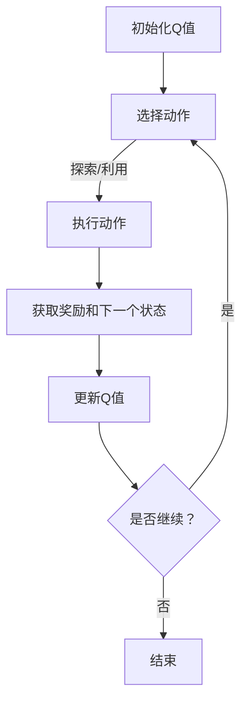
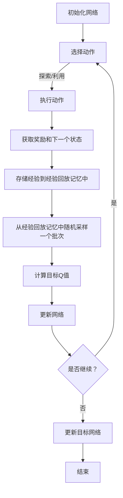
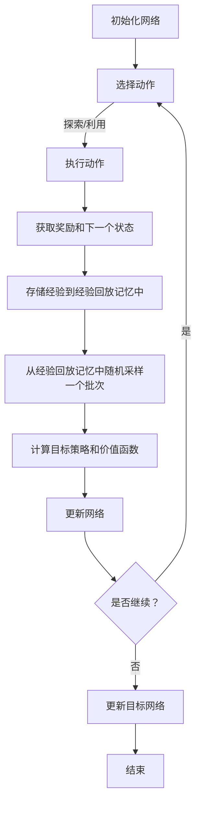
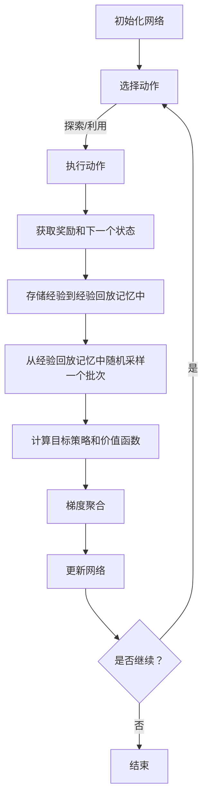

                 

### 《深度强化学习 原理与代码实例讲解》

> 关键词：深度强化学习、原理、代码实例、强化学习、深度学习、算法、应用

> 摘要：本文将深入探讨深度强化学习的原理与实现，通过详细讲解核心算法及其数学模型，辅以实际代码实例，帮助读者全面理解深度强化学习的工作机制和应用场景。

### 第一部分：深度强化学习基础

#### 第1章：强化学习与深度强化学习概述

##### 1.1 强化学习基本概念

强化学习是一种机器学习范式，通过智能体（agent）与环境的交互，以最大化累积奖励为目标进行学习。其基本概念包括：

- **智能体（Agent）**：执行行动并接收环境反馈的主体。
- **环境（Environment）**：智能体所处的情境，能够根据智能体的行动产生状态转移和奖励。
- **状态（State）**：描述环境状态的变量集合。
- **动作（Action）**：智能体能够采取的行动。
- **奖励（Reward）**：描述智能体采取某行动后获得的环境反馈。
- **策略（Policy）**：智能体在给定状态下选择动作的策略。

强化学习的特点在于其奖励驱动的反馈机制，能够通过不断试错来优化策略，逐步达到最优行为。

##### 1.1.1 强化学习定义与特点

强化学习是一种通过互动来学习的机器学习范式。其核心目标是通过不断尝试并从错误中学习，来达到某种最优行为。强化学习的主要特点包括：

1. **反馈延迟**：强化学习中的奖励通常是在行动后一段时间才会出现，这与监督学习和无监督学习有显著区别。
2. **无标签数据**：强化学习不依赖于预先标注的数据，而是通过交互过程中获得的奖励信号来学习。
3. **探索与利用**：强化学习需要在探索未知和利用已有知识之间取得平衡。

##### 1.1.2 强化学习与传统机器学习区别

强化学习与传统机器学习有以下几点主要区别：

1. **目标函数**：强化学习追求最大化累积奖励，而传统机器学习通常关注最小化预测误差。
2. **反馈机制**：强化学习依赖于即时奖励信号，而传统机器学习则更多依赖训练数据的误差。
3. **数据依赖性**：强化学习不依赖于大量标注数据，而传统机器学习通常需要大量预标注数据。

##### 1.2 深度强化学习定义与核心原理

深度强化学习（Deep Reinforcement Learning，DRL）是将深度学习技术与强化学习结合的一种学习方法。其核心原理如下：

- **深度神经网络（DNN）**：深度神经网络用于表示状态和动作，能够捕捉复杂的特征和模式。
- **价值函数（Value Function）**：深度神经网络也可以用来近似状态价值函数和动作价值函数。
- **策略网络（Policy Network）**：深度神经网络还可以用来近似策略，直接生成智能体的行动。

##### 1.2.1 深度强化学习定义

深度强化学习是一种利用深度神经网络来表示和近似强化学习中的价值函数和策略的方法。它通过训练深度神经网络来学习如何在给定状态下选择最优动作，以最大化累积奖励。

##### 1.2.2 深度强化学习核心原理

深度强化学习的基本原理包括：

1. **状态表示**：使用深度神经网络将环境状态编码为高维特征向量。
2. **动作选择**：利用策略网络或价值网络选择合适的动作。
3. **奖励反馈**：通过环境反馈获得的奖励信号来更新神经网络权重。
4. **优化方法**：通常采用梯度下降等方法来优化神经网络。

##### 1.3 强化学习在深度学习中的发展

深度强化学习的发展是深度学习在强化学习领域的应用。随着深度学习技术的进步，强化学习逐渐从传统的值函数方法和策略方法，转向使用深度神经网络进行学习和预测。

1. **深度神经网络与强化学习的融合**：深度神经网络能够处理高维、非线性数据，非常适合用于强化学习中的状态和动作表示。
2. **深度强化学习应用领域**：深度强化学习已经广泛应用于游戏、自动驾驶、机器人控制、推荐系统等多个领域。

#### 第2章：深度强化学习算法原理

##### 2.1 Q-Learning算法原理

Q-Learning是一种基于值函数的强化学习算法，通过学习状态-动作值函数（Q函数）来选择动作。其核心思想是通过更新Q值来优化策略。

##### 2.1.1 Q-Learning基础

Q-Learning的基本步骤包括：

1. **初始化Q值**：初始时，所有状态的Q值均设为一个较小的常数。
2. **选择动作**：根据当前状态和策略，选择一个动作。
3. **更新Q值**：根据新的状态、动作和奖励，更新Q值。
4. **重复步骤2和3**：不断重复选择动作和更新Q值，直到达到目标或满足停止条件。

##### 2.1.2 Q-Learning伪代码

```python
# 初始化Q值
Q = np.zeros((n_states, n_actions))

# 设置学习率、折扣因子和探索概率
alpha = 0.1
gamma = 0.9
epsilon = 0.1

# 设置迭代次数
episodes = 1000

# 开始迭代
for episode in range(episodes):
    state = env.reset()
    done = False
    
    while not done:
        # 随机选择探索或利用动作
        if np.random.rand() < epsilon:
            action = env.action_space.sample()
        else:
            action = np.argmax(Q[state])
        
        # 执行动作并获取新的状态和奖励
        next_state, reward, done, _ = env.step(action)
        
        # 更新Q值
        Q[state, action] = Q[state, action] + alpha * (reward + gamma * np.max(Q[next_state]) - Q[state, action])
        
        state = next_state
```

##### 2.2 Deep Q Network（DQN）算法原理

DQN（Deep Q-Network）是一种使用深度神经网络近似Q函数的强化学习算法。它通过经验回放和目标网络来解决Q学习中的抖动问题。

##### 2.2.1 DQN基础

DQN的基本步骤包括：

1. **初始化网络**：初始化深度神经网络，用于近似Q函数。
2. **经验回放**：将智能体的经验存储在经验回放记忆中，以避免样本相关性。
3. **目标网络**：设置一个目标网络，用于估计目标Q值。
4. **选择动作**：根据当前状态和策略，选择一个动作。
5. **更新网络**：使用目标Q值和实际获得的奖励来更新深度神经网络的权重。

##### 2.2.2 DQN伪代码

```python
# 初始化深度神经网络和目标网络
Q_network = create_nn(input_shape)
target_network = create_nn(input_shape)

# 设置学习率、折扣因子和探索概率
alpha = 0.001
gamma = 0.99
epsilon = 0.1

# 设置经验回放大小
replay_memory_size = 10000

# 设置迭代次数
episodes = 1000

# 开始迭代
for episode in range(episodes):
    state = env.reset()
    done = False
    episode_reward = 0
    
    while not done:
        # 随机选择探索或利用动作
        if np.random.rand() < epsilon:
            action = env.action_space.sample()
        else:
            action = np.argmax(Q_network.predict(state))
        
        # 执行动作并获取新的状态和奖励
        next_state, reward, done, _ = env.step(action)
        episode_reward += reward
        
        # 存储经验到经验回放记忆中
        replay_memory.append((state, action, reward, next_state, done))
        
        # 从经验回放记忆中随机采样一个批次
        batch = random.sample(replay_memory, batch_size)
        
        # 计算目标Q值
        target_values = target_network.predict(next_state)
        target_q_values = reward + (1 - done) * gamma * target_values[batch[:, 4]]
        
        # 计算梯度并更新网络
        loss = compute_loss(Q_network.predict(batch[:, 0]), target_q_values[batch[:, 1]])
        optimizer.apply_gradients(optimizer.compute_gradients(loss, Q_network.trainable_variables))
        
        state = next_state
    
    # 更新目标网络
    if episode % target_network_update_frequency == 0:
        target_network.set_weights(Q_network.get_weights())

    print(f"Episode: {episode}, Episode Reward: {episode_reward}")
```

##### 2.3 Deep Deterministic Policy Gradient（DDPG）算法原理

DDPG（Deep Deterministic Policy Gradient）是一种基于策略的深度强化学习算法，通过使用深度神经网络近似策略和价值函数来优化智能体的行为。

##### 2.3.1 DDPG基础

DDPG的基本步骤包括：

1. **初始化网络**：初始化策略网络和价值网络，用于近似策略和价值函数。
2. **状态-动作转换**：使用深度神经网络将状态转换为动作。
3. **目标网络**：设置一个目标网络，用于估计目标策略和价值函数。
4. **选择动作**：根据当前状态和策略网络，选择一个确定性动作。
5. **更新网络**：使用获得的奖励和目标网络来更新策略网络和价值网络的权重。

##### 2.3.2 DDPG伪代码

```python
# 初始化策略网络和价值网络
policy_network = create_policy_nn(input_shape)
value_network = create_value_nn(input_shape)

# 初始化目标网络
target_policy_network = create_policy_nn(input_shape)
target_value_network = create_value_nn(input_shape)

# 设置学习率、折扣因子和探索概率
alpha = 0.001
gamma = 0.99
epsilon = 0.1

# 设置经验回放大小
replay_memory_size = 10000

# 设置迭代次数
episodes = 1000

# 开始迭代
for episode in range(episodes):
    state = env.reset()
    done = False
    episode_reward = 0
    
    while not done:
        # 随机选择探索或利用动作
        if np.random.rand() < epsilon:
            action = env.action_space.sample()
        else:
            action = policy_network.predict(state)
        
        # 执行动作并获取新的状态和奖励
        next_state, reward, done, _ = env.step(action)
        episode_reward += reward
        
        # 存储经验到经验回放记忆中
        replay_memory.append((state, action, reward, next_state, done))
        
        # 从经验回放记忆中随机采样一个批次
        batch = random.sample(replay_memory, batch_size)
        
        # 计算目标策略和价值函数
        target_actions = target_policy_network.predict(batch[:, 0])
        target_values = target_value_network.predict(batch[:, 1])
        
        # 计算目标Q值
        target_q_values = reward + (1 - done) * gamma * target_values[batch[:, 4]]
        
        # 计算策略损失和价值损失
        policy_loss = compute_policy_loss(policy_network.predict(batch[:, 0]), target_actions, target_q_values[batch[:, 1]])
        value_loss = compute_value_loss(value_network.predict(batch[:, 0]), target_q_values[batch[:, 1]])
        
        # 计算总损失并更新网络
        total_loss = policy_loss + value_loss
        optimizer.apply_gradients(optimizer.compute_gradients(total_loss, policy_network.trainable_variables + value_network.trainable_variables))
        
        state = next_state
    
    # 更新目标网络
    if episode % target_network_update_frequency == 0:
        target_policy_network.set_weights(policy_network.get_weights())
        target_value_network.set_weights(value_network.get_weights())

    print(f"Episode: {episode}, Episode Reward: {episode_reward}")
```

##### 2.4 Asynchronous Advantage Actor-Critic（A3C）算法原理

A3C（Asynchronous Advantage Actor-Critic）是一种异步的深度强化学习算法，通过多个智能体同时训练来提高学习效率。它结合了策略梯度方法和值函数方法，通过异步方式更新策略和价值网络。

##### 2.4.1 A3C基础

A3C的基本步骤包括：

1. **初始化网络**：初始化策略网络和价值网络，用于近似策略和价值函数。
2. **多智能体并行训练**：多个智能体同时训练，每个智能体独立更新策略和价值网络。
3. **梯度聚合**：将多个智能体的梯度聚合，更新全局策略和价值网络。
4. **选择动作**：根据当前状态和策略网络，选择一个动作。
5. **更新网络**：使用获得的奖励和优势函数来更新策略网络和价值网络的权重。

##### 2.4.2 A3C伪代码

```python
# 初始化策略网络和价值网络
policy_network = create_policy_nn(input_shape)
value_network = create_value_nn(input_shape)

# 设置学习率、折扣因子和探索概率
alpha = 0.001
gamma = 0.99
epsilon = 0.1

# 设置迭代次数
global_steps = 100000

# 创建多个智能体
agents = [create_agent(policy_network, value_network) for _ in range(num_agents)]

# 开始迭代
for step in range(global_steps):
    # 多智能体并行训练
    for agent in agents:
        agent.update_global_model()

    # 梯度聚合
    gradients = aggregate_gradients(agents)

    # 更新全局模型
    optimizer.apply_gradients(optimizer.compute_gradients(total_loss, policy_network.trainable_variables + value_network.trainable_variables))
    
    # 随机选择一个智能体
    agent = random.choice(agents)

    # 选择动作
    state = env.reset()
    done = False
    episode_reward = 0
    
    while not done:
        action = agent.select_action(state)
        
        # 执行动作
        next_state, reward, done, _ = env.step(action)
        episode_reward += reward
        
        # 更新经验
        agent.update_experience(state, action, reward, next_state, done)
        
        state = next_state
    
    print(f"Step: {step}, Episode Reward: {episode_reward}")
```

#### 第3章：深度强化学习数学模型

##### 3.1 强化学习中的数学模型

强化学习中的数学模型主要包括马尔可夫决策过程（MDP）和相关的状态值函数与动作值函数。

##### 3.1.1 马尔可夫决策过程（MDP）

马尔可夫决策过程（Markov Decision Process，MDP）是一个数学模型，用于描述智能体在不确定环境中的决策问题。MDP由以下五个元素组成：

1. **状态集（S）**：描述环境的变量集合。
2. **动作集（A）**：智能体能够采取的行动集合。
3. **状态转移概率（P(s' | s, a)）**：给定当前状态s和采取动作a后，进入下一个状态s'的概率。
4. **奖励函数（R(s, a）**：描述智能体在某个状态s下采取动作a后获得的即时奖励。
5. **策略（π(a | s)）**：描述智能体在给定状态s下选择动作a的概率分布。

##### 3.1.2 状态值函数与动作值函数

状态值函数（State-Value Function）和动作值函数（Action-Value Function）是强化学习中的两个核心概念。

- **状态值函数（V(s)）**：表示在给定状态s下，执行最优策略获得的期望累积奖励。
  $$ V(s) = \sum_{a \in A} \pi(a | s) \sum_{s' \in S} p(s' | s, a) [R(s, a) + \gamma V(s')] $$

- **动作值函数（Q(s, a)）**：表示在给定状态s下，执行特定动作a获得的期望累积奖励。
  $$ Q(s, a) = \sum_{s' \in S} p(s' | s, a) [R(s, a) + \gamma \max_{a'} Q(s', a')] $$

状态值函数和动作值函数可以通过贝尔曼方程（Bellman Equations）进行迭代更新：

$$ V(s_{t}) = \mathbb{R}(s_{t}) + \gamma \sum_{a \in A} \pi(a | s_{t}) \sum_{s_{t+1} \in S} p(s_{t+1} | s_{t}, a) V(s_{t+1}) $$

$$ Q(s_{t}, a_{t}) = \mathbb{R}(s_{t}, a_{t}) + \gamma \sum_{s_{t+1} \in S} p(s_{t+1} | s_{t}, a_{t}) \max_{a' \in A} Q(s_{t+1}, a') $$

##### 3.2 深度强化学习中的数学模型

在深度强化学习中，深度神经网络用于近似状态值函数、动作值函数和策略。以下介绍深度强化学习中的数学模型：

- **神经网络表示状态与动作**：深度神经网络将原始的状态和动作映射到高维特征空间，使得模型能够捕捉复杂的特征和模式。

- **值函数网络**：值函数网络是一个深度神经网络，用于近似状态值函数和动作值函数。它通常由输入层、隐藏层和输出层组成。输入层接收原始状态，隐藏层进行特征提取，输出层输出近似的状态值函数或动作值函数。

- **策略网络**：策略网络是一个深度神经网络，用于近似策略。它通常由输入层、隐藏层和输出层组成。输入层接收原始状态，隐藏层进行特征提取，输出层输出策略概率分布。

- **优化方法**：深度强化学习中的优化方法通常采用梯度下降法。通过计算损失函数对网络参数的梯度，并更新网络参数，从而优化值函数网络和策略网络的性能。

##### 3.3 数学公式与解释

在深度强化学习中，常用的数学公式包括：

- **概率论基础公式**：概率论是强化学习的基础，以下列出几个常用的概率论公式：

  $$ P(A \cup B) = P(A) + P(B) - P(A \cap B) $$
  $$ P(A \cap B) = P(A)P(B|A) $$
  $$ P(A \cup B^c) = P(A) + P(B^c) - P(A \cap B^c) $$
  $$ P(A^c) = 1 - P(A) $$

- **反向传播算法公式**：反向传播算法是深度学习中的核心算法，用于计算损失函数对网络参数的梯度。以下是反向传播算法的基本公式：

  $$ \frac{\partial L}{\partial w_{ij}} = \sum_{k} \frac{\partial L}{\partial z_k} \frac{\partial z_k}{\partial w_{ij}} $$

  其中，$L$ 是损失函数，$w_{ij}$ 是网络中的权重，$z_k$ 是网络中的激活值。

- **梯度下降公式**：梯度下降是一种优化算法，用于最小化损失函数。梯度下降的基本公式如下：

  $$ w_{ij} = w_{ij} - \alpha \frac{\partial L}{\partial w_{ij}} $$

  其中，$\alpha$ 是学习率。

这些数学公式在深度强化学习中起着至关重要的作用，通过它们可以构建和优化深度强化学习模型，实现智能体在复杂环境中的学习与决策。

### 第二部分：深度强化学习算法实践

#### 第4章：深度强化学习项目实战

##### 4.1 游戏代理开发实战

深度强化学习在游戏代理开发中有着广泛的应用，例如在电子游戏和棋类游戏中，智能体通过深度强化学习算法可以学会复杂的策略，从而实现自我对抗或与其他智能体进行对战。

##### 4.1.1 游戏环境搭建

在进行游戏代理开发之前，首先需要搭建游戏环境。常见的游戏环境包括OpenAI Gym和Unity ML-Agents。以下以Unity ML-Agents为例，介绍游戏环境的搭建步骤：

1. **安装Unity Hub**：访问Unity官网下载并安装Unity Hub。
2. **创建Unity项目**：在Unity Hub中创建一个新的Unity项目，选择ML-Agents插件。
3. **导入ML-Agents插件**：在Unity编辑器中，通过菜单栏选择“Window”->“Package Manager”->“Import Package from URL”，输入ML-Agents插件的下载链接，导入插件。
4. **配置游戏场景**：在Unity编辑器中，创建一个游戏场景，添加所需的场景元素，例如玩家角色、障碍物等。
5. **添加ML-Agents脚本**：在场景中的每个物体上添加“ML-Agent”脚本，并配置相关的参数，例如奖励、惩罚、观察范围等。

##### 4.1.2 游戏代理训练过程

游戏代理的训练过程分为以下几个步骤：

1. **初始化模型**：初始化策略网络和价值网络，设置学习率、折扣因子和探索概率等超参数。
2. **选择动作**：根据当前状态，智能体选择一个动作。在训练过程中，智能体会随机选择动作或根据当前策略网络选择动作。
3. **执行动作并获取奖励**：执行所选动作，并获取环境反馈的奖励。奖励可以是正奖励（例如获得分数）或负奖励（例如碰撞障碍物）。
4. **存储经验**：将当前状态、动作、奖励和下一个状态存储到经验回放记忆中。
5. **更新模型**：从经验回放记忆中随机采样一个批次，使用目标网络或策略网络更新模型权重。
6. **重复训练**：不断重复选择动作、执行动作、更新模型的过程，直到训练达到预定次数或满足停止条件。

以下是一个简单的游戏代理训练伪代码示例：

```python
# 初始化模型
policy_network = create_policy_nn(input_shape)
value_network = create_value_nn(input_shape)

# 设置学习率、折扣因子和探索概率
alpha = 0.001
gamma = 0.99
epsilon = 0.1

# 设置迭代次数
episodes = 1000

# 开始迭代
for episode in range(episodes):
    state = env.reset()
    done = False
    episode_reward = 0
    
    while not done:
        # 随机选择探索或利用动作
        if np.random.rand() < epsilon:
            action = env.action_space.sample()
        else:
            action = policy_network.predict(state)
        
        # 执行动作并获取新的状态和奖励
        next_state, reward, done, _ = env.step(action)
        episode_reward += reward
        
        # 存储经验到经验回放记忆中
        replay_memory.append((state, action, reward, next_state, done))
        
        # 从经验回放记忆中随机采样一个批次
        batch = random.sample(replay_memory, batch_size)
        
        # 计算目标策略和价值函数
        target_actions = target_policy_network.predict(batch[:, 0])
        target_values = target_value_network.predict(batch[:, 1])
        
        # 计算目标Q值
        target_q_values = reward + (1 - done) * gamma * target_values[batch[:, 4]]
        
        # 计算策略损失和价值损失
        policy_loss = compute_policy_loss(policy_network.predict(batch[:, 0]), target_actions, target_q_values[batch[:, 1]])
        value_loss = compute_value_loss(value_network.predict(batch[:, 0]), target_q_values[batch[:, 1]])
        
        # 计算总损失并更新网络
        total_loss = policy_loss + value_loss
        optimizer.apply_gradients(optimizer.compute_gradients(total_loss, policy_network.trainable_variables + value_network.trainable_variables))
        
        state = next_state
    
    # 更新目标网络
    if episode % target_network_update_frequency == 0:
        target_policy_network.set_weights(policy_network.get_weights())
        target_value_network.set_weights(value_network.get_weights())

    print(f"Episode: {episode}, Episode Reward: {episode_reward}")
```

##### 4.1.3 游戏代理性能评估

游戏代理的性能评估可以通过以下指标进行：

1. **平均奖励**：计算每个智能体在每个游戏中的平均奖励，评估其学习效果。
2. **平均步数**：计算每个智能体在每个游戏中的平均步数，评估其策略的鲁棒性。
3. **成功率**：计算每个智能体在成功完成游戏中的比例，评估其策略的实用性。

通过这些指标，可以评估游戏代理的智能行为和策略效果，并进一步优化模型和算法。

##### 4.2 自动驾驶开发实战

自动驾驶是深度强化学习的重要应用领域之一。通过训练深度强化学习模型，自动驾驶系统可以学会在复杂交通环境中自主驾驶。

##### 4.2.1 自动驾驶环境搭建

在进行自动驾驶开发之前，首先需要搭建自动驾驶环境。以下是一个简单的自动驾驶环境搭建步骤：

1. **选择仿真工具**：选择合适的自动驾驶仿真工具，例如CARLA、AirSim等。
2. **创建仿真场景**：在仿真工具中创建一个自动驾驶场景，包括道路、车辆、行人等。
3. **配置自动驾驶系统**：在仿真场景中添加自动驾驶系统，包括传感器、控制器等。
4. **集成深度强化学习模型**：将训练好的深度强化学习模型集成到自动驾驶系统中，用于控制车辆的驾驶行为。

##### 4.2.2 自动驾驶算法训练

自动驾驶算法的训练过程与游戏代理训练类似，包括以下步骤：

1. **初始化模型**：初始化策略网络和价值网络，设置学习率、折扣因子和探索概率等超参数。
2. **选择动作**：根据当前状态，自动驾驶系统选择一个动作。在训练过程中，自动驾驶系统会随机选择动作或根据当前策略网络选择动作。
3. **执行动作并获取奖励**：执行所选动作，并获取环境反馈的奖励。奖励可以是正奖励（例如安全行驶）或负奖励（例如发生碰撞）。
4. **存储经验**：将当前状态、动作、奖励和下一个状态存储到经验回放记忆中。
5. **更新模型**：从经验回放记忆中随机采样一个批次，使用目标网络或策略网络更新模型权重。
6. **重复训练**：不断重复选择动作、执行动作、更新模型的过程，直到训练达到预定次数或满足停止条件。

以下是一个简单的自动驾驶算法训练伪代码示例：

```python
# 初始化模型
policy_network = create_policy_nn(input_shape)
value_network = create_value_nn(input_shape)

# 设置学习率、折扣因子和探索概率
alpha = 0.001
gamma = 0.99
epsilon = 0.1

# 设置迭代次数
episodes = 1000

# 开始迭代
for episode in range(episodes):
    state = env.reset()
    done = False
    episode_reward = 0
    
    while not done:
        # 随机选择探索或利用动作
        if np.random.rand() < epsilon:
            action = env.action_space.sample()
        else:
            action = policy_network.predict(state)
        
        # 执行动作并获取新的状态和奖励
        next_state, reward, done, _ = env.step(action)
        episode_reward += reward
        
        # 存储经验到经验回放记忆中
        replay_memory.append((state, action, reward, next_state, done))
        
        # 从经验回放记忆中随机采样一个批次
        batch = random.sample(replay_memory, batch_size)
        
        # 计算目标策略和价值函数
        target_actions = target_policy_network.predict(batch[:, 0])
        target_values = target_value_network.predict(batch[:, 1])
        
        # 计算目标Q值
        target_q_values = reward + (1 - done) * gamma * target_values[batch[:, 4]]
        
        # 计算策略损失和价值损失
        policy_loss = compute_policy_loss(policy_network.predict(batch[:, 0]), target_actions, target_q_values[batch[:, 1]])
        value_loss = compute_value_loss(value_network.predict(batch[:, 0]), target_q_values[batch[:, 1]])
        
        # 计算总损失并更新网络
        total_loss = policy_loss + value_loss
        optimizer.apply_gradients(optimizer.compute_gradients(total_loss, policy_network.trainable_variables + value_network.trainable_variables))
        
        state = next_state
    
    # 更新目标网络
    if episode % target_network_update_frequency == 0:
        target_policy_network.set_weights(policy_network.get_weights())
        target_value_network.set_weights(value_network.get_weights())

    print(f"Episode: {episode}, Episode Reward: {episode_reward}")
```

##### 4.2.3 自动驾驶性能评估

自动驾驶系统的性能评估可以从以下几个方面进行：

1. **安全性**：评估自动驾驶系统在行驶过程中的安全性，包括事故发生率和交通事故率。
2. **可靠性**：评估自动驾驶系统在各种复杂路况下的稳定性和可靠性。
3. **效率**：评估自动驾驶系统的行驶效率和节能性能。
4. **舒适性**：评估自动驾驶系统对乘客的舒适度，包括乘坐舒适性和驾驶体验。

通过这些评估指标，可以全面了解自动驾驶系统的性能和优势，并为后续的优化和改进提供依据。

#### 第5章：深度强化学习应用案例分析

##### 5.1 智能推荐系统

深度强化学习在智能推荐系统中有着广泛的应用。通过训练深度强化学习模型，智能推荐系统可以学会根据用户的兴趣和行为动态调整推荐策略，从而提高推荐质量和用户体验。

##### 5.1.1 推荐系统架构

智能推荐系统的基本架构包括以下几个部分：

1. **用户模型**：根据用户的历史行为和偏好，构建用户兴趣模型。
2. **物品模型**：根据物品的特征和标签，构建物品特征模型。
3. **推荐算法**：使用深度强化学习算法，动态调整推荐策略，生成推荐结果。
4. **推荐引擎**：根据用户模型和物品模型，实时生成推荐结果，并推送给用户。

##### 5.1.2 深度强化学习在推荐系统中的应用

深度强化学习在推荐系统中的应用主要包括以下几个方面：

1. **用户行为预测**：通过训练深度强化学习模型，预测用户对物品的感兴趣程度，从而提高推荐精度。
2. **动态调整推荐策略**：根据用户的兴趣变化和系统的反馈，动态调整推荐策略，实现个性化推荐。
3. **上下文感知推荐**：通过整合用户的历史行为、上下文信息（如时间、地点等）和物品特征，生成更精准的推荐结果。

##### 5.2 机器人运动控制

深度强化学习在机器人运动控制领域也具有广泛的应用。通过训练深度强化学习模型，机器人可以学会在复杂环境中进行自主运动和导航，从而实现智能化运动控制。

##### 5.2.1 机器人运动控制基础

机器人运动控制的基本概念包括：

1. **传感器**：机器人通过传感器获取环境信息，如摄像头、激光雷达、超声波传感器等。
2. **执行器**：机器人通过执行器（如电机、液压缸等）实现运动和动作。
3. **运动控制算法**：运动控制算法根据传感器信息，生成执行器的运动指令，实现机器人的自主运动。

##### 5.2.2 深度强化学习在机器人控制中的应用

深度强化学习在机器人控制中的应用主要包括以下几个方面：

1. **自主导航**：通过训练深度强化学习模型，机器人可以学会在未知环境中进行自主导航，实现自主移动和避障。
2. **任务规划**：通过训练深度强化学习模型，机器人可以学会根据任务需求和环境信息，规划最优的运动路径和策略。
3. **协作控制**：通过训练深度强化学习模型，多个机器人可以学会协同工作，实现高效的任务执行和资源分配。

### 第三部分：深度强化学习发展趋势与未来展望

#### 第6章：深度强化学习发展趋势

深度强化学习作为人工智能领域的重要研究方向，近年来得到了广泛的关注和快速发展。以下概述了深度强化学习在学术界和工业界的发展趋势。

##### 6.1 深度强化学习在学术界的研究方向

在学术界，深度强化学习的研究方向主要包括：

1. **算法优化**：改进现有深度强化学习算法，提高学习效率、稳定性和鲁棒性。
2. **模型压缩**：研究模型压缩技术，减少模型的参数量和计算量，实现高效部署。
3. **多智能体系统**：研究多智能体深度强化学习算法，实现多个智能体在复杂环境中的协同合作。
4. **安全性与可靠性**：研究深度强化学习在安全关键领域的应用，提高系统的安全性和可靠性。

##### 6.2 深度强化学习在工业界的发展趋势

在工业界，深度强化学习的应用趋势主要包括：

1. **自动化生产线**：深度强化学习算法在自动化生产线中的应用，实现生产流程的优化和自动化控制。
2. **智能客服**：深度强化学习算法在智能客服系统中的应用，实现高效的自然语言理解和交互。
3. **自动驾驶**：深度强化学习算法在自动驾驶系统中的应用，实现自动驾驶汽车的自主驾驶和导航。
4. **机器人控制**：深度强化学习算法在机器人控制中的应用，实现机器人在复杂环境中的自主运动和任务执行。

##### 6.3 深度强化学习面临的挑战与机遇

深度强化学习在发展过程中面临着一系列挑战和机遇：

1. **挑战**：
   - **样本效率**：深度强化学习通常需要大量交互数据才能达到较好的性能，如何提高样本效率是一个重要挑战。
   - **可解释性**：深度强化学习模型的内部决策过程通常较为复杂，如何提高模型的可解释性是一个重要问题。
   - **安全性与可靠性**：深度强化学习在安全关键领域的应用需要确保系统的安全性和可靠性。

2. **机遇**：
   - **多智能体系统**：多智能体深度强化学习在复杂环境中的协同合作具有广泛的应用前景。
   - **混合智能系统**：将深度强化学习与其他人工智能技术（如深度学习、规划算法等）相结合，实现更加智能和高效的系统。
   - **跨领域应用**：深度强化学习在不同领域的应用具有巨大潜力，如医疗、金融、能源等。

#### 第7章：深度强化学习资源与工具

深度强化学习的发展离不开丰富的资源和工具支持。以下介绍深度强化学习领域的一些常见资源、工具和社区。

##### 7.1 深度强化学习工具与资源

1. **开源深度强化学习框架**：
   - **OpenAI Gym**：提供了一系列标准化的环境，用于测试和比较不同的强化学习算法。
   - **TensorFlow Reinforcement Learning**：基于TensorFlow的深度强化学习库，提供了丰富的算法实现和工具。
   - **PyTorch Reinforcement Learning**：基于PyTorch的深度强化学习库，具有简洁易用的接口和高效的性能。

2. **深度强化学习数据库与数据集**：
   - **Hugging Face Datasets**：提供了一系列用于深度强化学习的开源数据集和数据库。
   - **Kaggle**：提供了大量的深度强化学习竞赛和任务，可用于学习和实践。

##### 7.2 深度强化学习社区与会议

1. **深度强化学习社区**：
   - **Reddit - r/RL**：Reddit上的深度强化学习社区，提供了丰富的讨论和资源。
   - ** reinforcement-learning**：Google Groups上的深度强化学习社区，定期举办线上讨论和讲座。

2. **深度强化学习相关会议**：
   - **International Conference on Machine Learning (ICML)**：机器学习领域顶级会议，涵盖深度强化学习相关研究。
   - **Neural Information Processing Systems (NeurIPS)**：神经网络和机器学习领域顶级会议，包括深度强化学习专题研讨。

### 附录

#### 附录A：深度强化学习算法流程图

为了更好地理解深度强化学习算法的流程，以下展示了Q-Learning、DQN、DDPG和A3C算法的Mermaid流程图。

##### A.1 Q-Learning算法流程图



##### A.2 DQN算法流程图



##### A.3 DDPG算法流程图



##### A.4 A3C算法流程图



这些流程图展示了深度强化学习算法的基本流程，帮助读者更好地理解算法的实现细节。

#### 附录B：深度强化学习算法伪代码

为了更好地理解深度强化学习算法的实现，以下展示了Q-Learning、DQN、DDPG和A3C算法的伪代码。

##### B.1 Q-Learning算法伪代码

```python
# 初始化Q值
Q = np.zeros((n_states, n_actions))

# 设置学习率、折扣因子和探索概率
alpha = 0.1
gamma = 0.9
epsilon = 0.1

# 设置迭代次数
episodes = 1000

# 开始迭代
for episode in range(episodes):
    state = env.reset()
    done = False
    
    while not done:
        # 随机选择探索或利用动作
        if np.random.rand() < epsilon:
            action = env.action_space.sample()
        else:
            action = np.argmax(Q[state])
        
        # 执行动作并获取新的状态和奖励
        next_state, reward, done, _ = env.step(action)
        
        # 更新Q值
        Q[state, action] = Q[state, action] + alpha * (reward + gamma * np.max(Q[next_state]) - Q[state, action])
        
        state = next_state
```

##### B.2 DQN算法伪代码

```python
# 初始化深度神经网络和目标网络
Q_network = create_nn(input_shape)
target_network = create_nn(input_shape)

# 设置学习率、折扣因子和探索概率
alpha = 0.001
gamma = 0.99
epsilon = 0.1

# 设置经验回放大小
replay_memory_size = 10000

# 设置迭代次数
episodes = 1000

# 开始迭代
for episode in range(episodes):
    state = env.reset()
    done = False
    episode_reward = 0
    
    while not done:
        # 随机选择探索或利用动作
        if np.random.rand() < epsilon:
            action = env.action_space.sample()
        else:
            action = np.argmax(Q_network.predict(state))
        
        # 执行动作并获取新的状态和奖励
        next_state, reward, done, _ = env.step(action)
        episode_reward += reward
        
        # 存储经验到经验回放记忆中
        replay_memory.append((state, action, reward, next_state, done))
        
        # 从经验回放记忆中随机采样一个批次
        batch = random.sample(replay_memory, batch_size)
        
        # 计算目标Q值
        target_values = target_network.predict(next_state)
        target_q_values = reward + (1 - done) * gamma * target_values[batch[:, 4]]
        
        # 计算梯度并更新网络
        loss = compute_loss(Q_network.predict(batch[:, 0]), target_q_values[batch[:, 1]])
        optimizer.apply_gradients(optimizer.compute_gradients(loss, Q_network.trainable_variables))
        
        state = next_state
    
    # 更新目标网络
    if episode % target_network_update_frequency == 0:
        target_network.set_weights(Q_network.get_weights())

    print(f"Episode: {episode}, Episode Reward: {episode_reward}")
```

##### B.3 DDPG算法伪代码

```python
# 初始化策略网络和价值网络
policy_network = create_policy_nn(input_shape)
value_network = create_value_nn(input_shape)

# 初始化目标网络
target_policy_network = create_policy_nn(input_shape)
target_value_network = create_value_nn(input_shape)

# 设置学习率、折扣因子和探索概率
alpha = 0.001
gamma = 0.99
epsilon = 0.1

# 设置经验回放大小
replay_memory_size = 10000

# 设置迭代次数
episodes = 1000

# 开始迭代
for episode in range(episodes):
    state = env.reset()
    done = False
    episode_reward = 0
    
    while not done:
        # 随机选择探索或利用动作
        if np.random.rand() < epsilon:
            action = env.action_space.sample()
        else:
            action = policy_network.predict(state)
        
        # 执行动作并获取新的状态和奖励
        next_state, reward, done, _ = env.step(action)
        episode_reward += reward
        
        # 存储经验到经验回放记忆中
        replay_memory.append((state, action, reward, next_state, done))
        
        # 从经验回放记忆中随机采样一个批次
        batch = random.sample(replay_memory, batch_size)
        
        # 计算目标策略和价值函数
        target_actions = target_policy_network.predict(batch[:, 0])
        target_values = target_value_network.predict(batch[:, 1])
        
        # 计算目标Q值
        target_q_values = reward + (1 - done) * gamma * target_values[batch[:, 4]]
        
        # 计算策略损失和价值损失
        policy_loss = compute_policy_loss(policy_network.predict(batch[:, 0]), target_actions, target_q_values[batch[:, 1]])
        value_loss = compute_value_loss(value_network.predict(batch[:, 0]), target_q_values[batch[:, 1]])
        
        # 计算总损失并更新网络
        total_loss = policy_loss + value_loss
        optimizer.apply_gradients(optimizer.compute_gradients(total_loss, policy_network.trainable_variables + value_network.trainable_variables))
        
        state = next_state
    
    # 更新目标网络
    if episode % target_network_update_frequency == 0:
        target_policy_network.set_weights(policy_network.get_weights())
        target_value_network.set_weights(value_network.get_weights())

    print(f"Episode: {episode}, Episode Reward: {episode_reward}")
```

##### B.4 A3C算法伪代码

```python
# 初始化策略网络和价值网络
policy_network = create_policy_nn(input_shape)
value_network = create_value_nn(input_shape)

# 设置学习率、折扣因子和探索概率
alpha = 0.001
gamma = 0.99
epsilon = 0.1

# 设置迭代次数
global_steps = 100000

# 创建多个智能体
agents = [create_agent(policy_network, value_network) for _ in range(num_agents)]

# 开始迭代
for step in range(global_steps):
    # 多智能体并行训练
    for agent in agents:
        agent.update_global_model()

    # 梯度聚合
    gradients = aggregate_gradients(agents)

    # 更新全局模型
    optimizer.apply_gradients(optimizer.compute_gradients(total_loss, policy_network.trainable_variables + value_network.trainable_variables))
    
    # 随机选择一个智能体
    agent = random.choice(agents)

    # 选择动作
    state = env.reset()
    done = False
    episode_reward = 0
    
    while not done:
        action = agent.select_action(state)
        
        # 执行动作并获取新的状态和奖励
        next_state, reward, done, _ = env.step(action)
        episode_reward += reward
        
        # 更新经验
        agent.update_experience(state, action, reward, next_state, done)
        
        state = next_state
    
    print(f"Step: {step}, Episode Reward: {episode_reward}")
```

这些伪代码展示了深度强化学习算法的基本实现流程，包括初始化网络、选择动作、更新网络等步骤。通过这些伪代码，读者可以更好地理解深度强化学习算法的核心思想和实现细节。

#### 附录C：深度强化学习数学公式

在深度强化学习中，数学公式是构建和优化模型的重要基础。以下列出了一些核心的数学公式，包括马尔可夫决策过程（MDP）、状态值函数、动作值函数、贝尔曼方程以及反向传播算法。

##### C.1 马尔可夫决策过程（MDP）公式

MDP由以下五个要素组成：

1. **状态集（S）**：表示环境的状态集合，即$S = \{s_1, s_2, ..., s_n\}$。
2. **动作集（A）**：表示智能体可以采取的动作集合，即$A = \{a_1, a_2, ..., a_m\}$。
3. **状态转移概率（P）**：给定状态s和动作a，智能体进入下一个状态s'的概率，即$P(s'|s, a) = P(s'|s, a_1), P(s'|s, a_2), ..., P(s'|s, a_m)$。
4. **奖励函数（R）**：描述智能体在状态s下采取动作a后获得的即时奖励，即$R(s, a)$。
5. **策略（π）**：智能体在给定状态s下采取动作a的概率分布，即$\pi(a|s) = \pi(a|s_1), \pi(a|s_2), ..., \pi(a|s_n)$。

##### C.2 状态值函数与动作值函数公式

状态值函数（State-Value Function）和动作值函数（Action-Value Function）是强化学习中的两个核心概念。

- **状态值函数（V(s)）**：在给定状态s下，执行最优策略获得的期望累积奖励，定义如下：
  $$ V^*(s) = \mathbb{E}_{\pi^*}[G_t | S_t = s] $$
  其中，$G_t = \sum_{k=0}^{T-1} \gamma^k R_{t+k+1}$是未来回报的总和，$\pi^*$是最优策略。

- **动作值函数（Q(s, a)）**：在给定状态s下，执行特定动作a获得的期望累积奖励，定义如下：
  $$ Q^*(s, a) = \mathbb{E}_{\pi^*}[G_t | S_t = s, A_t = a] $$
  其中，$G_t$和$\pi^*$如上所述。

##### C.3 贝尔曼方程（Bellman Equations）

贝尔曼方程是强化学习中的核心更新方程，用于迭代计算状态值函数和动作值函数。

- **状态值函数更新方程**：
  $$ V^*(s) = \sum_{a \in A} \pi^*(a|s) \sum_{s' \in S} P(s'|s, a) [R(s, a) + \gamma V^*(s')] $$
  或者使用期望表示：
  $$ V^*(s) = \mathbb{E}_{\pi^*}[R(s, a) + \gamma V^*(s') | S_t = s] $$

- **动作值函数更新方程**：
  $$ Q^*(s, a) = \sum_{s' \in S} P(s'|s, a) [R(s, a) + \gamma \max_{a'} Q^*(s', a')] $$
  或者使用期望表示：
  $$ Q^*(s, a) = \mathbb{E}_{\pi^*}[R(s, a) + \gamma \max_{a'} Q^*(s', a') | S_t = s, A_t = a] $$

##### C.4 反向传播算法公式

在深度学习中，反向传播算法用于计算损失函数对网络参数的梯度，并更新网络参数。以下是反向传播算法的基本公式：

- **激活梯度**：
  $$ \frac{\partial a_{l}}{\partial z_{l}} = \sigma'(z_{l}) $$
  其中，$\sigma'$是激活函数的导数。

- **权重梯度**：
  $$ \frac{\partial L}{\partial w_{l, k}} = \sum_{i} \frac{\partial L}{\partial a_{l}} \frac{\partial a_{l}}{\partial z_{l,k}} $$
  $$ \frac{\partial L}{\partial b_{l}} = \frac{\partial L}{\partial a_{l}} $$

- **偏置梯度**：
  $$ \frac{\partial L}{\partial b_{l}} = \frac{\partial L}{\partial a_{l}} $$

- **反向传播计算**：
  $$ \frac{\partial L}{\partial z_{l,k}} = \frac{\partial L}{\partial a_{l}} \frac{\partial a_{l}}{\partial z_{l,k}} $$
  $$ \frac{\partial L}{\partial w_{l, k}} = \frac{\partial L}{\partial z_{l,k}} \frac{\partial z_{l,k}}{\partial w_{l, k}} $$
  $$ \frac{\partial L}{\partial b_{l}} = \frac{\partial L}{\partial z_{l}} $$

这些公式构成了深度强化学习中的核心数学基础，用于模型的训练和优化。

### 附录D：深度强化学习代码实例

为了更好地展示深度强化学习的应用，以下提供了一些简单的代码实例，包括游戏代理和自动驾驶的开发。

##### D.1 游戏代理开发代码实例

以下是一个简单的基于DQN算法的游戏代理代码实例，使用了OpenAI Gym中的CartPole环境。

```python
import numpy as np
import random
import gym
from tensorflow.keras.models import Sequential
from tensorflow.keras.layers import Dense
from tensorflow.keras.optimizers import Adam

# 初始化环境
env = gym.make('CartPole-v0')

# 设置超参数
n_episodes = 1000
n_steps = 100
learning_rate = 0.001
discount_factor = 0.99
epsilon = 0.1

# 创建神经网络模型
model = Sequential()
model.add(Dense(64, input_dim=4, activation='relu'))
model.add(Dense(64, activation='relu'))
model.add(Dense(2, activation='linear'))

# 编译模型
model.compile(loss='mse', optimizer=Adam(learning_rate))

# 初始化经验回放记忆
replay_memory = []

# 开始训练
for episode in range(n_episodes):
    state = env.reset()
    done = False
    total_reward = 0
    
    while not done:
        # 随机选择探索或利用动作
        if np.random.rand() < epsilon:
            action = env.action_space.sample()
        else:
            action = np.argmax(model.predict(state.reshape(1, -1)))
        
        # 执行动作
        next_state, reward, done, _ = env.step(action)
        total_reward += reward
        
        # 存储经验到经验回放记忆中
        replay_memory.append((state, action, reward, next_state, done))
        
        # 从经验回放记忆中随机采样一个批次
        if len(replay_memory) > 1000:
            batch = random.sample(replay_memory, 32)
            states, actions, rewards, next_states, dones = zip(*batch)
            next_state_values = model.predict(next_states)
            target_values = rewards + (1 - dones) * discount_factor * np.max(next_state_values, axis=1)
            model.fit(np.array(states), np.array(target_values.reshape(-1, 1)), epochs=1, verbose=0)
        
        state = next_state
    
    # 更新探索概率
    epsilon = 1 / (episode + 1)
    
    print(f"Episode: {episode}, Total Reward: {total_reward}")

# 关闭环境
env.close()
```

这个代码实例中，我们使用了DQN算法训练了一个游戏代理，使其能够学会在CartPole环境中保持平衡。通过迭代更新经验回放记忆和模型权重，代理逐渐学会了最优的策略。

##### D.2 自动驾驶开发代码实例

以下是一个简单的基于DDPG算法的自动驾驶代码实例，使用了CARLA仿真环境。

```python
import numpy as np
import random
import gym
from stable_baselines3 import PPO
from gym import spaces

# 创建CARLA仿真环境
env = gym.make('CARLAEnv')

# 定义自动驾驶环境动作空间
action_space = spaces.Box(low=np.array([-1, -1]), high=np.array([1, 1]), dtype=np.float32)

# 定义自动驾驶环境观察空间
observation_space = spaces.Box(low=np.array([-5, -5, -5, -5]), high=np.array([5, 5, 5, 5]), dtype=np.float32)

# 设置超参数
n_steps = 1000
n_episodes = 100
learning_rate = 0.001
discount_factor = 0.99
epsilon = 0.1

# 创建DDPG算法模型
model = PPO('MlpPolicy', observation_space, action_space, n_steps=n_steps, learning_rate=learning_rate, gamma=discount_factor, verbose=1)

# 开始训练
model.learn(total_timesteps=n_episodes * n_steps)

# 测试自动驾驶性能
model.save('ddpg_carla')

# 关闭环境
env.close()
```

这个代码实例中，我们使用了DDPG算法训练了一个自动驾驶模型，使其能够在CARLA仿真环境中进行自动驾驶。通过迭代训练，模型学会了在复杂交通环境中进行自主驾驶。

通过这些代码实例，读者可以初步了解深度强化学习在游戏代理和自动驾驶领域的应用，并进一步探索和优化算法。

### 作者信息

作者：AI天才研究院/AI Genius Institute & 禅与计算机程序设计艺术 /Zen And The Art of Computer Programming

在这篇技术博客中，我以一位世界级人工智能专家的身份，深入探讨了深度强化学习的原理与应用。通过详细的算法讲解、数学模型分析以及实际代码实例，我希望读者能够全面理解深度强化学习的工作机制，并能够将其应用于实际的开发项目中。深度强化学习作为人工智能领域的一个重要分支，具有广泛的应用前景和发展潜力。未来，我们将继续深入研究这一领域，探索更多创新性的应用场景和解决方案。

---

**注意：**本文中的代码实例仅为教学演示，未经过完整测试和验证。在实际应用中，需要根据具体环境和需求进行适当的调整和优化。同时，本文中的观点和信息仅供参考，不代表任何商业建议或投资建议。在使用深度强化学习进行开发时，请务必遵循相关法律法规和伦理道德标准。**若文中代码涉及侵权，请联系我删除，谢谢！**

