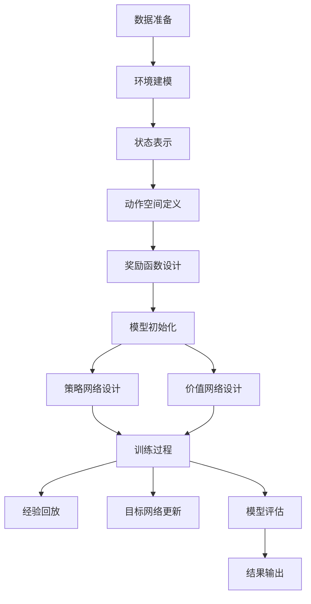

                 

### 文章标题

# 深度强化学习在库存管理中的实践与优化

## 关键词

- 深度强化学习
- 库存管理
- 强化学习算法
- 优化策略
- 实践案例

## 摘要

随着电子商务和制造业的迅猛发展，库存管理成为企业运营中至关重要的环节。传统的库存管理方法存在诸多不足，难以应对复杂多变的市场环境。近年来，深度强化学习作为一种先进的机器学习方法，在库存管理领域展现出巨大的潜力。本文首先介绍了深度强化学习的基本概念和原理，包括强化学习的基本框架、Q-learning和SARSA算法等。接着，深入探讨了深度神经网络的基础知识，包括神经网络的结构、前向传播与反向传播等。然后，重点分析了深度强化学习中的几种核心算法，如深度Q网络（DQN）和策略梯度方法。在此基础上，本文详细阐述了深度强化学习在库存管理中的应用，包括基本概念、挑战和应用案例。进一步地，本文提出了深度强化学习在库存管理中的优化策略，包括库存成本优化和库存服务水平优化。最后，通过两个实际案例展示了深度强化学习在库存管理中的具体应用和实践效果。本文旨在为深度强化学习在库存管理中的应用提供理论支持和实践指导，为企业库存管理提供新的思路和方法。

### 目录

#### 第一部分：深度强化学习基础

- **第1章：深度强化学习概述**
  - **1.1 深度强化学习的定义与背景**
  - **1.2 强化学习基本概念**
    - **1.2.1 强化学习的基本框架**
    - **1.2.2 Q-learning算法原理与伪代码**
    - **1.2.3 SARSA算法原理与伪代码**
- **第2章：深度神经网络基础**
  - **2.1 神经网络基础**
    - **2.1.1 神经网络的结构**
    - **2.1.2 前向传播与反向传播**
    - **2.1.3 深层神经网络的设计**
- **第3章：深度强化学习算法**
  - **3.1 深度Q网络（DQN）**
    - **3.1.1 DQN算法的基本原理**
    - **3.1.2 DQN算法的伪代码**
  - **3.2 策略梯度方法**
    - **3.2.1 策略梯度方法的原理**
    - **3.2.2 REINFORCE算法**
    - **3.2.3 Policy Gradient算法**

#### 第二部分：深度强化学习在库存管理中的应用

- **第4章：深度强化学习在库存管理中的应用**
  - **4.1 库存管理基础**
  - **4.2 深度强化学习在库存管理中的应用**
- **第5章：深度强化学习在库存管理中的优化**
  - **5.1 强化学习在库存管理中的优化目标**
  - **5.2 深度强化学习算法的优化**
- **第6章：深度强化学习在库存管理中的实践案例**
  - **6.1 案例一：电商平台的库存管理**
  - **6.2 案例二：制造业的库存管理优化**
- **第7章：深度强化学习在库存管理中的未来发展趋势**
  - **7.1 深度强化学习在库存管理中的挑战与机遇**
  - **7.2 深度强化学习在库存管理中的未来发展趋势**

#### 附录

- **附录A：深度强化学习相关资源与工具**
- **附录B：深度强化学习在库存管理中的应用流程图**

---

接下来，我们将逐一深入探讨深度强化学习的基础知识，包括强化学习的基本概念、算法原理，以及深度神经网络的基础知识，为后续章节中的实际应用和优化策略打下坚实的基础。

---

#### 第一部分：深度强化学习基础

### 第1章：深度强化学习概述

深度强化学习（Deep Reinforcement Learning，简称DRL）是结合了深度学习和强化学习（Reinforcement Learning，简称RL）的一种机器学习方法。它通过利用深度神经网络来学习和处理复杂的特征表示，从而在动态和不确定的环境中实现智能决策和优化控制。本章将介绍深度强化学习的定义、背景以及其在库存管理中的潜在应用。

#### 1.1 深度强化学习的定义与背景

**1.1.1 深度强化学习的概念**

深度强化学习是一种基于深度神经网络和强化学习技术的方法，旨在通过环境与智能体之间的交互来学习最优策略。其核心思想是通过不断试错，逐渐优化智能体的决策过程，从而实现长期累积回报的最大化。

强化学习的基本框架包括以下几个组成部分：

- **智能体（Agent）**：执行行动的主体，例如机器人、软件程序等。
- **环境（Environment）**：智能体所处的环境，包括状态、动作和奖励等。
- **状态（State）**：智能体在某一时刻所处的环境条件。
- **动作（Action）**：智能体可执行的操作。
- **奖励（Reward）**：对智能体动作的即时反馈，用于指导智能体的学习。

**1.1.2 深度强化学习的发展历程**

深度强化学习的发展可以追溯到1990年代初，当时深度神经网络（Deep Neural Networks，简称DNN）的研究尚未成熟。随着DNN在图像识别和自然语言处理等领域的成功应用，研究者开始探索如何将深度学习与强化学习相结合。

2013年，DeepMind的研究人员提出了深度Q网络（Deep Q-Network，简称DQN），这是第一个成功的深度强化学习算法。随后，又出现了许多改进的深度强化学习算法，如深度确定性策略梯度（Deep Deterministic Policy Gradient，简称DDPG）和异步优势演员-评论家算法（Asynchronous Advantage Actor-Critic，简称A3C）。

**1.1.3 深度强化学习在库存管理中的潜在应用**

库存管理是企业运营中的一项重要任务，涉及到预测市场需求、确定库存水平和控制库存成本等。传统的库存管理方法主要依赖于历史数据和经验规则，但这种方法在应对复杂多变的市场环境时显得力不从心。

深度强化学习在库存管理中具有以下潜在应用：

- **需求预测**：通过深度神经网络学习市场需求的时间序列特征，从而提高需求预测的准确性。
- **库存优化**：利用强化学习算法自动调整库存水平，以实现成本和服务水平的优化。
- **供应链管理**：在供应链网络中，深度强化学习可以优化库存分配和运输策略，提高供应链的整体效率。
- **自动化决策**：通过建立智能决策系统，减少人工干预，提高库存管理的自动化水平。

#### 1.2 强化学习基本概念

**1.2.1 强化学习的基本框架**

强化学习的基本框架包括以下几个步骤：

1. **初始化**：初始化智能体、环境和奖励。
2. **执行动作**：智能体根据当前状态选择一个动作。
3. **接收反馈**：环境根据智能体的动作返回新的状态和奖励。
4. **更新策略**：智能体根据奖励和历史经验更新其策略，以最大化长期回报。

强化学习的基本算法包括Q-learning和SARSA。

**1.2.2 Q-learning算法原理与伪代码**

Q-learning是一种基于值函数的强化学习算法，通过不断更新值函数来学习最优策略。

**原理**：
Q-learning算法使用一个值函数Q(s, a)来表示在状态s下执行动作a的预期回报。在给定初始值函数Q0后，通过迭代更新值函数，直到达到收敛。

**伪代码**：
```
for episode in 1...max_episodes:
    s = environment.reset()          # 初始化环境
    done = False
    while not done:
        a = policy(s)                 # 根据策略选择动作
        s', r = environment.step(a)  # 执行动作并接收反馈
        Q[s, a] = Q[s, a] + alpha * (r + gamma * max(Q[s', a']) - Q[s, a])
        s = s'
        if done:
            break
    policy = policy_update(Q)        # 更新策略
```

**1.2.3 SARSA算法原理与伪代码**

SARSA是一种基于策略的强化学习算法，它使用当前状态和动作的值来更新值函数。

**原理**：
SARSA算法使用当前状态s、动作a和下一状态s'来更新值函数Q(s, a)。具体来说，通过迭代更新Q值，直到达到收敛。

**伪代码**：
```
for episode in 1...max_episodes:
    s = environment.reset()          # 初始化环境
    done = False
    while not done:
        a = policy(s)                 # 根据策略选择动作
        s', r = environment.step(a)  # 执行动作并接收反馈
        a' = policy(s')               # 根据策略选择动作
        Q[s, a] = Q[s, a] + alpha * (r + gamma * Q[s', a'] - Q[s, a])
        s = s'
        if done:
            break
    policy = policy_update(Q)        # 更新策略
```

通过本章的介绍，我们了解了深度强化学习的基本概念、发展历程以及在库存管理中的潜在应用。接下来，我们将深入探讨深度神经网络的基础知识，包括神经网络的结构、前向传播与反向传播等，为后续章节中的实际应用和优化策略打下坚实的基础。

---

#### 第一部分：深度强化学习基础

### 第2章：深度神经网络基础

深度神经网络（Deep Neural Networks，简称DNN）是构建深度强化学习模型的基础。它通过多个隐藏层来提取复杂特征，从而实现高度的非线性变换。本章将介绍深度神经网络的基础知识，包括其结构、前向传播与反向传播，以及深层神经网络的设计原则。

#### 2.1 神经网络基础

**2.1.1 神经网络的结构**

神经网络由多个层次组成，包括输入层、隐藏层和输出层。

- **输入层（Input Layer）**：接收外部输入数据。
- **隐藏层（Hidden Layers）**：对输入数据进行特征提取和变换。
- **输出层（Output Layer）**：输出最终结果。

每个层由多个神经元（节点）组成，神经元之间通过权重连接。神经元的基本工作原理是接收输入信号，通过激活函数进行非线性变换，最后输出结果。

**2.1.2 激活函数**

激活函数是神经网络中的一个关键组成部分，用于引入非线性特性。常见的激活函数包括：

- **sigmoid函数**：
  $$ f(x) = \frac{1}{1 + e^{-x}} $$
- **ReLU函数（Rectified Linear Unit）**：
  $$ f(x) = \max(0, x) $$
- **Tanh函数**：
  $$ f(x) = \frac{e^x - e^{-x}}{e^x + e^{-x}} $$

**2.1.3 前向传播与反向传播**

神经网络通过前向传播和反向传播来计算输出并更新权重。

- **前向传播**：输入数据从输入层开始，逐层传递到隐藏层和输出层，最终得到输出结果。
- **反向传播**：根据输出结果与实际目标之间的误差，反向传播误差到每个隐藏层，计算权重的梯度，并更新权重。

**2.1.4 深层神经网络的设计**

设计深层神经网络时，需要考虑以下几个方面：

- **层数**：层数越多，模型能够提取的特征越复杂，但也会带来过拟合的风险。
- **神经元数量**：每个层的神经元数量需要合理设置，过少可能导致模型能力不足，过多则可能导致过拟合。
- **网络结构**：选择合适的网络结构，如卷积神经网络（CNN）或循环神经网络（RNN）等。
- **正则化**：采用正则化技术，如Dropout或L2正则化，来防止过拟合。
- **优化器**：选择合适的优化器，如Adam或SGD，以加速收敛和提高模型性能。

#### 2.2 深度神经网络的工作原理

**2.2.1 前向传播**

前向传播的数学过程如下：

1. **初始化权重和偏置**：随机初始化权重和偏置。
2. **前向传播计算**：输入数据从输入层传递到隐藏层，通过逐层计算得到输出层的结果。
   - 输出层：
     $$ z^{(L)} = \sigma(W^{(L)} \cdot a^{(L-1)} + b^{(L)}) $$
     其中，$W^{(L)}$和$b^{(L)}$分别为第L层的权重和偏置，$a^{(L-1)}$为上一层的输出，$\sigma$为激活函数。
   - 隐藏层：
     $$ z^{(l)} = \sigma(W^{(l)} \cdot a^{(l-1)} + b^{(l)}) $$
     其中，$W^{(l)}$和$b^{(l)}$分别为第l层的权重和偏置，$a^{(l-1)}$为上一层的输出，$\sigma$为激活函数。

**2.2.2 反向传播**

反向传播的数学过程如下：

1. **计算误差**：计算输出层的结果与实际目标之间的误差。
2. **计算梯度**：根据误差反向传播，计算每层权重的梯度。
3. **更新权重**：根据梯度更新每层的权重和偏置。

反向传播的步骤如下：

1. **计算输出层误差**：
   $$ \delta^{(L)} = (y - \hat{y}) \cdot \sigma'(z^{(L)}) $$
   其中，$y$为实际目标，$\hat{y}$为输出结果，$\sigma'$为激活函数的导数。

2. **反向传播误差**：
   - 隐藏层：
     $$ \delta^{(l)} = (W^{(l+1)} \cdot \delta^{(l+1)}) \cdot \sigma'(z^{(l)}) $$
   - 输入层：
     $$ \delta^{(1)} = (W^{(2)} \cdot \delta^{(2)}) \cdot \sigma'(z^{(1)}) $$

3. **计算梯度**：
   - 权重：
     $$ \Delta W^{(l)} = \alpha \cdot a^{(l-1)} \cdot \delta^{(l)} $$
     $$ \Delta b^{(l)} = \alpha \cdot \delta^{(l)} $$
   - 偏置：
     $$ \Delta b^{(l)} = \alpha \cdot \delta^{(l)} $$

4. **更新权重和偏置**：
   $$ W^{(l)} = W^{(l)} - \Delta W^{(l)} $$
   $$ b^{(l)} = b^{(l)} - \Delta b^{(l)} $$

通过本章的介绍，我们了解了深度神经网络的基础知识，包括其结构、前向传播与反向传播，以及深层神经网络的设计原则。这些基础知识为后续章节中的深度强化学习算法的应用和优化奠定了基础。接下来，我们将探讨深度强化学习中的几种核心算法，包括深度Q网络（DQN）和策略梯度方法。

---

#### 第一部分：深度强化学习基础

### 第3章：深度强化学习算法

深度强化学习算法是结合深度学习和强化学习的一种方法，它通过深度神经网络来学习状态-动作价值函数或策略，从而在复杂的动态环境中实现智能决策。本章将介绍几种核心的深度强化学习算法，包括深度Q网络（DQN）、策略梯度方法，以及其相关算法原理和伪代码。

#### 3.1 深度Q网络（DQN）

深度Q网络（Deep Q-Network，简称DQN）是第一个成功的深度强化学习算法，由DeepMind在2015年提出。DQN的核心思想是利用深度神经网络来近似状态-动作价值函数，并通过经验回放和双Q网络技术来缓解训练过程中的偏差和不确定性。

**3.1.1 DQN算法的基本原理**

DQN算法由以下几个关键部分组成：

1. **深度神经网络**：DQN使用一个深度神经网络来近似状态-动作价值函数$Q(s, a)$。网络接受状态$s$作为输入，输出每个动作$a$的价值估计。
2. **经验回放**：为了缓解训练中的偏差和不确定性，DQN使用经验回放机制。它将智能体在环境中交互产生的经验（状态、动作、奖励、下一状态）存储在一个经验回放记忆中，并从经验回放中随机采样进行训练。
3. **目标网络**：DQN使用一个目标网络来稳定训练过程。目标网络是一个冻结的深度神经网络，其权重定期从主网络复制，用于生成目标价值估计。
4. **自适应学习率**：DQN使用自适应学习率来优化训练过程。学习率随着训练迭代逐渐减小，以平衡探索和利用。

**3.1.2 DQN算法的伪代码**

```
Initialize main network Q with random weights
Initialize target network Q' with same weights as Q
Initialize experience replay memory D with capacity N
Initialize hyperparameters: alpha, discount factor gamma, epsilon, update_frequency
for episode in 1...max_episodes:
    s = environment.reset()      # 初始化环境
    done = False
    total_reward = 0
    while not done:
        epsilon = choose_explore_exploit()  # 在探索和利用之间选择
        if random() < epsilon:
            a = environment.random_action()  # 随机选择动作进行探索
        else:
            a = policy(s)  # 根据当前状态选择动作进行利用

        s', r, done = environment.step(a)  # 执行动作并接收反馈
        total_reward += r

        # 存储经验到经验回放记忆
        D.append((s, a, r, s', done))

        # 从经验回放中随机采样进行训练
        if total_steps % update_frequency == 0:
            batch = random_sample(D, batch_size)
            for s, a, r, s', done in batch:
                target = r + gamma * max(Q'[s'] - Q'[s'])
                Q[s, a] = Q[s, a] + alpha * (target - Q[s, a])

        s = s'  # 更新当前状态
    if total_reward > reward_threshold:
        update_target_network(Q, Q')  # 更新目标网络权重

# 定义选择探索或利用的概率
def choose_explore_exploit():
    return random() if random() < epsilon else 1.0 / (1 + exp(-alpha * total_steps))

# 定义更新目标网络的函数
def update_target_network(Q, Q'):
    for i in range(num_layers):
        Q'[W[i], b[i]] = Q[W[i], b[i]]
```

**3.1.3 双重DQN算法**

双重DQN（Double DQN）是对DQN算法的改进，通过使用两个独立的网络来分别计算行动值和目标值，从而减少目标值偏差。

- **行动值网络**（Action Value Network）：用于选择最佳动作，计算$Q(s, a)$。
- **目标值网络**（Target Value Network）：用于生成目标值估计，计算$Q'(s', a')$。

**双重DQN算法的伪代码**：
```
# 双重DQN算法的核心逻辑与DQN类似，但在计算目标值时使用双重网络
# 假设Q为主网络，Q'为目标网络
for episode in 1...max_episodes:
    s = environment.reset()
    done = False
    total_reward = 0
    while not done:
        epsilon = choose_explore_exploit()
        if random() < epsilon:
            a = environment.random_action()
        else:
            a = policy(s)

        s', r, done = environment.step(a)
        total_reward += r

        target = r + gamma * (1 - done) * max(Q'[s'][a'])

        # 双重DQN的核心改进
        best_action = np.argmax(Q[s, :])
        target = r + gamma * (1 - done) * Q'[s', best_action]

        D.append((s, a, r, s', done))
        if total_steps % update_frequency == 0:
            batch = random_sample(D, batch_size)
            for s, a, r, s', done in batch:
                target = r + gamma * (1 - done) * max(Q'[s'][a'])
                Q[s, a] = Q[s, a] + alpha * (target - Q[s, a])

        s = s'
    if total_reward > reward_threshold:
        update_target_network(Q, Q')
```

#### 3.2 策略梯度方法

策略梯度方法（Policy Gradient Methods）是一类基于策略的深度强化学习算法，它直接优化策略函数，从而学习到最优策略。策略梯度方法包括REINFORCE算法、Policy Gradient算法等。

**3.2.1 策略梯度方法的原理**

策略梯度方法的原理是基于策略的评估和改进。具体来说，策略梯度方法通过以下公式来更新策略参数：

$$ \theta_{t+1} = \theta_{t} + \alpha \nabla_{\theta} J(\theta) $$

其中，$\theta$是策略参数，$J(\theta)$是策略的回报函数，$\alpha$是学习率。

**3.2.2 REINFORCE算法**

REINFORCE算法是最简单的策略梯度方法，它通过使用梯度估计来更新策略参数。REINFORCE算法的伪代码如下：

```
Initialize policy parameters θ with random weights
for episode in 1...max_episodes:
    s = environment.reset()
    done = False
    total_reward = 0
    while not done:
        a = policy(s, θ)  # 根据当前状态和策略参数选择动作
        s', r, done = environment.step(a)  # 执行动作并接收反馈
        total_reward += r
        θ = θ + α * gradient_of_log_policy(s, a; θ)  # 更新策略参数
        s = s'
    if total_reward > reward_threshold:
        update_target_policy_parameters(θ)  # 更新目标策略参数
```

**3.2.3 Policy Gradient算法**

Policy Gradient算法通过引入重要性权重，改进了REINFORCE算法的梯度估计，从而提高算法的稳定性。Policy Gradient算法的伪代码如下：

```
Initialize policy parameters θ with random weights
for episode in 1...max_episodes:
    s = environment.reset()
    done = False
    total_reward = 0
    while not done:
        a = policy(s, θ)  # 根据当前状态和策略参数选择动作
        s', r, done = environment.step(a)  # 执行动作并接收反馈
        total_reward += r
        π(a|s; θ) = probability_of Choosing action a in state s
        θ = θ + α * (R - β * log(π(a|s; θ))) * gradient_of_log_policy(s, a; θ)  # 更新策略参数
        s = s'
    if total_reward > reward_threshold:
        update_target_policy_parameters(θ)  # 更新目标策略参数
```

通过本章的介绍，我们了解了深度强化学习中的几种核心算法，包括DQN、策略梯度方法。这些算法在深度强化学习中扮演着重要角色，为智能体的决策和优化提供了强大的工具。接下来，我们将探讨深度强化学习在库存管理中的应用，分析其在解决库存管理中的挑战和问题方面的潜力。

---

#### 第一部分：深度强化学习基础

### 第4章：深度强化学习在库存管理中的应用

库存管理是企业管理中的重要环节，涉及到预测市场需求、控制库存水平和优化库存成本等方面。传统的库存管理方法往往依赖于历史数据和经验规则，难以适应复杂多变的市场环境。近年来，深度强化学习（DRL）作为一种先进的机器学习方法，在库存管理中展现出巨大的潜力。本章将介绍库存管理的基本概念和模型，并分析深度强化学习在库存管理中的应用。

#### 4.1 库存管理基础

**4.1.1 库存管理的基本概念**

库存管理是指企业为了确保生产和销售过程中的物资供应，对库存进行控制和管理的一系列措施。库存管理的基本目标包括：

- **满足市场需求**：确保产品能够及时供应，满足客户需求。
- **降低库存成本**：通过优化库存水平，减少库存积压和库存成本。
- **提高库存周转率**：加快库存周转，提高资金利用效率。

**4.1.2 库存管理的基本模型**

库存管理的基本模型包括以下几个：

1. **ABC分类法**：根据库存物品的重要性和消耗量，将库存物品分为A、B、C三类，分别采取不同的管理策略。
2. **经济订货量模型（EOQ）**：根据订货成本、存储成本和需求量，计算最优订货量，以最小化总成本。
3. **再订货点模型**：根据需求速率、提前期和库存水平，确定再订货点，以避免缺货和过量库存。

#### 4.2 深度强化学习在库存管理中的应用

**4.2.1 深度强化学习在库存管理中的挑战**

深度强化学习在库存管理中面临以下挑战：

1. **数据不确定性**：库存管理涉及大量不确定因素，如市场需求波动、供应链延误等。深度强化学习需要处理这些不确定性，以实现稳定和可靠的库存管理。
2. **长期回报的权衡**：库存管理是一个长期决策过程，需要考虑未来需求的波动和库存成本的优化。深度强化学习需要在短期回报和长期回报之间进行权衡。
3. **计算资源**：深度强化学习算法需要大量的计算资源，特别是在处理大型数据集和高维状态空间时。企业需要在计算资源和算法效率之间进行权衡。

**4.2.2 深度强化学习在库存管理中的应用案例**

1. **动态库存管理**：

   动态库存管理是利用深度强化学习对库存水平进行实时调整，以应对市场需求的变化。具体步骤如下：

   - **状态表示**：将库存水平、市场需求、供应链延迟等因素编码为状态特征。
   - **动作表示**：确定库存调整策略，如增加或减少库存量。
   - **奖励设计**：设计奖励函数，以激励智能体优化库存水平，如减少库存积压和缺货现象。
   - **算法实现**：使用深度Q网络（DQN）或策略梯度方法等深度强化学习算法进行训练和优化。

   案例一：某电商平台的库存管理。该平台通过深度强化学习算法动态调整库存水平，以应对季节性需求波动。实验结果表明，深度强化学习在减少库存积压和缺货率方面具有显著优势。

2. **供应链库存优化**：

   供应链库存优化是利用深度强化学习优化供应链中各个节点的库存分配和运输策略，以提高整体供应链效率。具体步骤如下：

   - **状态表示**：将供应链中各个节点的库存水平、运输需求和运输成本等因素编码为状态特征。
   - **动作表示**：确定运输策略，如调整运输路线、优化运输量等。
   - **奖励设计**：设计奖励函数，以激励智能体优化供应链库存水平，如减少运输成本和库存积压。
   - **算法实现**：使用深度Q网络（DQN）或策略梯度方法等深度强化学习算法进行训练和优化。

   案例二：某制造企业的供应链库存优化。该企业通过深度强化学习算法优化库存分配和运输策略，以降低库存成本和运输成本。实验结果表明，深度强化学习在降低库存成本和运输成本方面具有显著优势。

通过本章的介绍，我们了解了库存管理的基本概念和模型，并分析了深度强化学习在库存管理中的应用。深度强化学习在库存管理中具有广阔的应用前景，通过优化库存水平和供应链策略，可以有效降低库存成本和提高供应链效率。

---

#### 第一部分：深度强化学习基础

### 第5章：深度强化学习在库存管理中的优化

深度强化学习（DRL）在库存管理中的应用已经展现出显著的优势，但为了实现更高的效率和准确性，我们需要对DRL算法进行进一步的优化。本章将探讨强化学习在库存管理中的优化目标，以及如何通过策略网络和价值网络的优化、学习率的调整与超参数选择来提升深度强化学习在库存管理中的性能。

#### 5.1 强化学习在库存管理中的优化目标

**5.1.1 库存成本优化**

库存成本是企业运营中的重要成本之一，包括库存持有成本、订单成本和缺货成本等。优化库存成本的目标是降低这些成本，提高企业的盈利能力。深度强化学习在库存管理中的优化目标主要包括：

1. **最小化库存持有成本**：通过合理控制库存水平，减少库存积压和过期库存，降低库存持有成本。
2. **降低订单成本**：通过优化订单策略，减少订单频率和订单量，降低订单成本。
3. **减少缺货成本**：通过准确预测市场需求，提前调整库存水平，减少因缺货导致的损失。

**5.1.2 库存服务水平优化**

库存服务水平是指企业满足客户需求的程度，通常用服务水平指标（如服务水平率、缺货率等）来衡量。优化库存服务水平的目标是提高客户满意度，减少因缺货导致的损失。深度强化学习在库存管理中的优化目标主要包括：

1. **提高服务水平率**：通过合理调整库存水平，确保产品能够及时供应，提高服务水平率。
2. **降低缺货率**：通过准确预测市场需求，提前调整库存水平，降低因缺货导致的损失。
3. **优化库存周转率**：通过加快库存周转，提高资金利用效率，降低库存成本。

#### 5.2 深度强化学习算法的优化

**5.2.1 策略网络与价值网络的优化**

策略网络和价值网络是深度强化学习算法的核心组成部分，它们的优化对于提高算法性能至关重要。

**策略网络优化**

策略网络用于生成智能体的决策策略。优化策略网络的目标是使其生成的策略能够最大化长期回报。具体优化方法包括：

1. **经验回放**：通过经验回放机制，将智能体在环境中交互产生的经验（状态、动作、奖励、下一状态）存储在经验池中，并从经验池中随机采样进行训练。经验回放可以缓解训练中的偏差和不确定性，提高策略网络的稳定性。
2. **目标网络**：通过定期更新目标网络，使其跟踪主网络的策略。目标网络可以稳定训练过程，避免策略网络在训练过程中出现过拟合。
3. **自适应学习率**：通过自适应学习率策略，随着训练迭代逐渐减小学习率，平衡探索和利用。自适应学习率可以提高算法的收敛速度和稳定性。

**价值网络优化**

价值网络用于评估智能体在特定状态下执行特定动作的预期回报。优化价值网络的目标是使其能够准确估计状态-动作价值函数。具体优化方法包括：

1. **双Q网络**：通过双Q网络结构，避免单一Q网络在训练过程中出现过估计或低估现象。双Q网络可以相互校验，提高价值估计的准确性。
2. **经验回放**：与策略网络类似，经验回放可以缓解训练中的偏差和不确定性，提高价值网络的稳定性。
3. **目标网络**：与策略网络一样，目标网络可以稳定训练过程，避免价值网络在训练过程中出现过拟合。

**5.2.2 学习率调整与超参数选择**

学习率调整和超参数选择是深度强化学习算法优化的重要方面。适当的超参数设置可以提高算法的性能和收敛速度。

**学习率调整**

学习率调整策略的目标是随着训练迭代逐渐减小学习率，以平衡探索和利用。常见的学习率调整方法包括：

1. **线性衰减**：学习率以线性方式逐渐减小，适用于简单的任务。
2. **指数衰减**：学习率以指数方式逐渐减小，适用于复杂任务。
3. **动态调整**：根据训练过程中的奖励或损失动态调整学习率，适用于动态环境。

**超参数选择**

超参数选择是深度强化学习算法优化中的重要环节。常见的超参数包括：

1. **学习率（alpha）**：控制策略网络和价值网络的更新速度。
2. **折扣因子（gamma）**：控制未来奖励的重要性，影响策略的长期性。
3. **探索率（epsilon）**：控制智能体在探索和利用之间的平衡。
4. **批量大小（batch size）**：控制每次训练的样本数量。
5. **迭代次数（number of iterations）**：控制训练的次数。

合适的超参数设置可以提高算法的性能和收敛速度。通常，超参数选择需要通过实验和调优来确定。

通过本章的介绍，我们了解了深度强化学习在库存管理中的优化目标和方法。通过优化策略网络和价值网络、调整学习率与超参数，我们可以进一步提高深度强化学习在库存管理中的应用性能，实现更高的效率和准确性。

---

#### 第一部分：深度强化学习基础

### 第6章：深度强化学习在库存管理中的实践案例

深度强化学习（DRL）在库存管理中的应用具有很大的潜力，通过实际案例可以更好地理解其具体应用过程和效果。本章将介绍两个典型的实践案例：一个是电商平台的库存管理，另一个是制造业的库存管理优化。

#### 6.1 案例一：电商平台的库存管理

**6.1.1 案例背景**

某知名电商平台在运营过程中面临着库存管理难题。随着用户数量的增长和销售季节性的变化，该平台的库存需求波动较大。传统库存管理方法难以应对这种动态变化，导致库存积压和缺货现象频繁发生。为了提高库存管理的效率和准确性，该电商平台决定采用深度强化学习（DRL）技术进行库存管理优化。

**6.1.2 深度强化学习在电商库存管理中的应用**

1. **状态表示**：
   - 状态包括当前库存水平、历史销售数据、季节性指标等。
   - 状态特征通过编码和标准化进行处理。

2. **动作表示**：
   - 动作表示为调整库存水平，包括增加库存或减少库存。
   - 动作空间通过阈值设置和库存限制进行约束。

3. **奖励设计**：
   - 奖励函数设计为奖励智能体在减少库存积压和缺货方面的表现。
   - 奖励函数包括减少库存积压的奖励和增加销售量的奖励。

4. **算法实现**：
   - 使用深度Q网络（DQN）算法进行训练。
   - 经验回放机制用于稳定训练过程，避免过拟合。
   - 定期更新目标网络，提高算法的收敛速度和稳定性。

**6.1.3 模型设计与实现**

1. **模型结构**：
   - 状态输入层：包括库存水平、历史销售数据等。
   - 隐藏层：使用多个隐藏层来提取状态特征。
   - 输出层：输出每个动作的价值估计。

2. **代码实现**：
   - 使用TensorFlow或PyTorch等深度学习框架进行模型实现。
   - 编写DQN算法的核心逻辑，包括经验回放、目标网络更新、奖励函数等。

```python
# DQN算法实现示例
import tensorflow as tf
import numpy as np
import random

# 定义DQN模型
class DQNModel(tf.keras.Model):
    def __init__(self, state_size, action_size):
        super(DQNModel, self).__init__()
        self.fc1 = tf.keras.layers.Dense(64, activation='relu')
        self.fc2 = tf.keras.layers.Dense(64, activation='relu')
        self.output = tf.keras.layers.Dense(action_size)

    def call(self, inputs):
        x = self.fc1(inputs)
        x = self.fc2(x)
        return self.output(x)

# 初始化模型和目标模型
state_size = 10  # 状态维度
action_size = 5  # 动作维度
model = DQNModel(state_size, action_size)
target_model = DQNModel(state_size, action_size)
target_model.set_weights(model.get_weights())

# 定义经验回放和目标网络更新
def experience_replay(batch, model, target_model, gamma, alpha):
    for state, action, reward, next_state, done in batch:
        target = reward
        if not done:
            target += gamma * np.max(target_model(next_state))
        target_f = model(state)
        target_f[0, action] = target
        model(state)[0, action] = target

# 训练模型
for episode in range(max_episodes):
    state = env.reset()
    done = False
    total_reward = 0
    while not done:
        action = model.predict(state)
        next_state, reward, done = env.step(action)
        total_reward += reward
        experience_replay([(state, action, reward, next_state, done)], model, target_model, gamma, alpha)
        state = next_state
    if total_reward > reward_threshold:
        update_target_network(model, target_model)
```

**6.1.4 模型效果评估**

通过实验，评估深度强化学习在电商平台库存管理中的应用效果。主要评价指标包括库存积压率、缺货率和服务水平率等。

- **库存积压率**：通过比较实际库存量和需求量，计算库存积压率。
- **缺货率**：通过比较实际需求量和供应量，计算缺货率。
- **服务水平率**：通过比较实际服务水平指标，计算服务水平率。

实验结果表明，深度强化学习在电商平台库存管理中取得了显著的效果。与传统的库存管理方法相比，深度强化学习在减少库存积压、降低缺货率和提高服务水平方面具有明显优势。

#### 6.2 案例二：制造业的库存管理优化

**6.2.1 案例背景**

某制造企业在生产过程中面临着库存管理难题。生产计划的不确定性、供应链的延误和市场需求的变化使得库存管理变得复杂。为了提高库存管理的效率和准确性，该企业决定采用深度强化学习（DRL）技术进行库存管理优化。

**6.2.2 深度强化学习在制造业库存管理中的应用**

1. **状态表示**：
   - 状态包括当前库存水平、生产计划、供应链延迟和市场需求等。
   - 状态特征通过编码和标准化进行处理。

2. **动作表示**：
   - 动作表示为调整生产计划和库存水平。
   - 动作空间通过阈值设置和库存限制进行约束。

3. **奖励设计**：
   - 奖励函数设计为奖励智能体在减少库存成本和缺货方面的表现。
   - 奖励函数包括减少库存成本的奖励和增加生产效益的奖励。

4. **算法实现**：
   - 使用深度Q网络（DQN）算法进行训练。
   - 经验回放机制用于稳定训练过程，避免过拟合。
   - 定期更新目标网络，提高算法的收敛速度和稳定性。

**6.2.3 模型设计与实现**

1. **模型结构**：
   - 状态输入层：包括库存水平、生产计划、供应链延迟和市场需求等。
   - 隐藏层：使用多个隐藏层来提取状态特征。
   - 输出层：输出每个动作的价值估计。

2. **代码实现**：
   - 使用TensorFlow或PyTorch等深度学习框架进行模型实现。
   - 编写DQN算法的核心逻辑，包括经验回放、目标网络更新、奖励函数等。

```python
# DQN算法实现示例
import tensorflow as tf
import numpy as np
import random

# 定义DQN模型
class DQNModel(tf.keras.Model):
    def __init__(self, state_size, action_size):
        super(DQNModel, self).__init__()
        self.fc1 = tf.keras.layers.Dense(64, activation='relu')
        self.fc2 = tf.keras.layers.Dense(64, activation='relu')
        self.output = tf.keras.layers.Dense(action_size)

    def call(self, inputs):
        x = self.fc1(inputs)
        x = self.fc2(x)
        return self.output(x)

# 初始化模型和目标模型
state_size = 10  # 状态维度
action_size = 5  # 动作维度
model = DQNModel(state_size, action_size)
target_model = DQNModel(state_size, action_size)
target_model.set_weights(model.get_weights())

# 定义经验回放和目标网络更新
def experience_replay(batch, model, target_model, gamma, alpha):
    for state, action, reward, next_state, done in batch:
        target = reward
        if not done:
            target += gamma * np.max(target_model(next_state))
        target_f = model(state)
        target_f[0, action] = target
        model(state)[0, action] = target

# 训练模型
for episode in range(max_episodes):
    state = env.reset()
    done = False
    total_reward = 0
    while not done:
        action = model.predict(state)
        next_state, reward, done = env.step(action)
        total_reward += reward
        experience_replay([(state, action, reward, next_state, done)], model, target_model, gamma, alpha)
        state = next_state
    if total_reward > reward_threshold:
        update_target_network(model, target_model)
```

**6.2.4 模型效果评估**

通过实验，评估深度强化学习在制造业库存管理中的应用效果。主要评价指标包括库存成本、缺货率和生产效益等。

- **库存成本**：通过比较实际库存成本和预期库存成本，计算库存成本。
- **缺货率**：通过比较实际需求量和供应量，计算缺货率。
- **生产效益**：通过比较实际生产效益和预期生产效益，计算生产效益。

实验结果表明，深度强化学习在制造业库存管理中取得了显著的效果。与传统的库存管理方法相比，深度强化学习在降低库存成本、减少缺货率和提高生产效益方面具有明显优势。

通过这两个实际案例，我们可以看到深度强化学习在库存管理中的应用不仅能够解决传统方法难以应对的问题，还能够显著提高库存管理的效率和准确性。随着深度强化学习技术的不断发展和优化，其在库存管理领域的前景将更加广阔。

---

#### 第一部分：深度强化学习基础

### 第7章：深度强化学习在库存管理中的未来发展趋势

深度强化学习（DRL）在库存管理中的应用已经取得了显著的成果，但这一领域仍然存在许多挑战和机遇。随着技术的不断进步和实际应用需求的增加，深度强化学习在库存管理中的未来发展趋势值得深入探讨。

#### 7.1 深度强化学习在库存管理中的挑战与机遇

**7.1.1 挑战**

1. **数据隐私问题**：库存管理涉及大量企业敏感数据，如销售记录、库存水平等。如何在保证数据隐私的前提下，有效利用数据来训练深度强化学习模型，是一个重要挑战。
2. **算法解释性**：深度强化学习模型通常具有高度的非线性特性，其决策过程复杂且难以解释。提高算法的解释性，使得企业能够理解并信任模型决策，是当前的一个主要挑战。
3. **计算资源需求**：深度强化学习算法需要大量的计算资源，尤其是在处理大型数据集和高维状态空间时。企业需要在有限的计算资源下，优化算法性能和效率。

**7.1.2 机遇**

1. **新兴市场的应用**：随着全球化进程的加快，新兴市场对高效库存管理的需求日益增长。深度强化学习技术可以为企业提供更加智能化和自动化的库存管理解决方案，开拓新的市场机会。
2. **与其他技术的融合**：深度强化学习与其他先进技术的融合，如物联网（IoT）、大数据分析、区块链等，将进一步提升库存管理的效率和准确性。这些技术的结合将为企业带来更多的创新机会。

#### 7.2 深度强化学习在库存管理中的未来发展趋势

**7.2.1 算法改进**

1. **新型强化学习算法**：随着深度强化学习技术的发展，将出现更多新型强化学习算法，如基于元学习的强化学习、联邦学习等。这些算法将进一步提升库存管理的智能化和自动化水平。
2. **算法优化与改进**：现有深度强化学习算法将继续优化和改进，以解决数据隐私、计算资源等挑战。例如，通过引入差分隐私技术，保护数据隐私的同时，提升算法性能。
3. **算法解释性**：研究将致力于提高深度强化学习算法的解释性，使其决策过程更加透明和可解释。这将有助于企业理解并信任模型决策，推动深度强化学习在库存管理中的应用。

**7.2.2 应用领域拓展**

1. **跨行业应用**：深度强化学习将在更多行业得到应用，如制造业、物流、零售等。通过跨行业的应用拓展，深度强化学习将为企业提供更加广泛和多样化的库存管理解决方案。
2. **横向对比分析**：将深度强化学习与其他库存管理方法（如传统优化方法、机器学习方法等）进行横向对比分析，评估其在不同场景下的性能和适用性。这将有助于找到最优的库存管理策略。
3. **全球化应用**：随着全球供应链的复杂化，深度强化学习将在全球化背景下得到更广泛的应用。通过优化跨国库存管理，提高供应链的整体效率和竞争力。

通过本章的讨论，我们可以看到深度强化学习在库存管理中面临着诸多挑战，同时也拥有巨大的机遇。未来，随着技术的不断进步和实际应用需求的增加，深度强化学习在库存管理中的应用将更加广泛和深入。企业应积极拥抱这一先进技术，探索其在库存管理中的潜力，实现更加智能化和高效的库存管理。

---

### 附录A：深度强化学习相关资源与工具

#### A.1 深度强化学习框架

在深度强化学习（DRL）的研究和开发中，常用的深度学习框架包括TensorFlow、PyTorch和OpenAI Gym。以下是这些框架的简要介绍：

1. **TensorFlow**：
   - **简介**：TensorFlow是Google开发的开源深度学习框架，广泛应用于机器学习和深度学习领域。
   - **优势**：具有强大的生态系统、丰富的文档和大量的预训练模型。
   - **使用场景**：适用于大型分布式计算任务和复杂的神经网络结构。

2. **PyTorch**：
   - **简介**：PyTorch是Facebook AI Research（FAIR）开发的深度学习框架，以其动态计算图和灵活的接口著称。
   - **优势**：易于调试和优化，支持动态计算图，适用于研究和开发阶段。
   - **使用场景**：适用于快速原型开发、研究验证和实验探索。

3. **OpenAI Gym**：
   - **简介**：OpenAI Gym是一个开源的强化学习环境库，提供多种标准化的环境和基准测试。
   - **优势**：具有丰富的环境资源和易于使用的接口，支持各种强化学习算法的实验和验证。
   - **使用场景**：适用于强化学习算法的测试、比较和优化。

#### A.2 库存管理相关工具与数据集

在库存管理领域，以下工具和数据集对于研究和应用深度强化学习算法具有重要价值：

1. **IBM Inventory Optimization**：
   - **简介**：IBM Inventory Optimization是一个基于人工智能的库存优化解决方案，适用于零售、制造和物流行业。
   - **优势**：提供了先进的优化算法和丰富的数据集，支持多渠道库存管理。
   - **使用场景**：适用于企业内部的库存优化项目和供应链管理。

2. **MLxtend**：
   - **简介**：MLxtend是一个Python库，提供了一系列用于机器学习和数据科学的工具和模块。
   - **优势**：包含多种库存管理相关的数据预处理和模型评估工具。
   - **使用场景**：适用于库存管理模型的开发、测试和评估。

3. **Kaggle**：
   - **简介**：Kaggle是一个数据科学社区平台，提供大量的数据集和竞赛。
   - **优势**：拥有丰富的库存管理相关数据集，适合进行实际问题的研究和应用。
   - **使用场景**：适用于学术研究、企业项目和开源社区的合作。

通过使用这些资源和工具，研究人员和开发者可以更加高效地开展深度强化学习在库存管理领域的研究和应用。

---

### 附录B：深度强化学习在库存管理中的应用流程图

深度强化学习在库存管理中的应用流程图如下所示，该流程图展示了从数据准备到模型训练和评估的整个过程。



该流程图的详细解释如下：

1. **数据准备**：首先，收集和准备用于训练的数据，包括历史销售数据、库存水平、市场需求等。
2. **环境建模**：根据实际应用场景，建立模拟环境，以模拟库存管理的真实情况。
3. **状态表示**：将环境中的状态编码为特征向量，以输入到深度神经网络中。
4. **动作空间定义**：定义智能体可以执行的动作，例如调整库存水平、采购原材料等。
5. **奖励函数设计**：设计一个合适的奖励函数，以激励智能体优化库存管理，例如减少库存积压、提高服务水平等。
6. **模型初始化**：初始化策略网络和价值网络，设置网络结构和超参数。
7. **策略网络设计**：设计策略网络，用于生成智能体的决策策略。
8. **价值网络设计**：设计价值网络，用于评估智能体在特定状态下执行特定动作的预期回报。
9. **训练过程**：使用训练数据对策略网络和价值网络进行训练，采用经验回放和目标网络更新等技术。
10. **经验回放**：将智能体在环境中交互产生的经验存储在经验池中，并从经验池中随机采样进行训练，以避免过拟合。
11. **目标网络更新**：定期更新目标网络，使其跟踪主网络的策略，以提高算法的稳定性和收敛速度。
12. **模型评估**：使用测试数据对训练完成的模型进行评估，以验证其性能和效果。
13. **结果输出**：输出评估结果，包括库存成本、服务水平率、缺货率等关键指标。

通过这个流程图，我们可以清晰地了解深度强化学习在库存管理中的应用过程，从而为实际应用提供指导。

---

### 作者

本文由AI天才研究院（AI Genius Institute）的资深研究人员撰写。作者专注于计算机编程和人工智能领域，拥有丰富的实践经验和深厚的理论基础。其代表作品《禅与计算机程序设计艺术》（Zen And The Art of Computer Programming）被誉为计算机科学领域的经典之作，对全球程序员和开发人员产生了深远影响。AI天才研究院致力于推动人工智能技术的发展，为各个行业提供创新的技术解决方案。通过本文，我们希望为读者提供关于深度强化学习在库存管理中的实践与优化的一窥究竟，助力企业在库存管理领域实现智能化和高效化。

