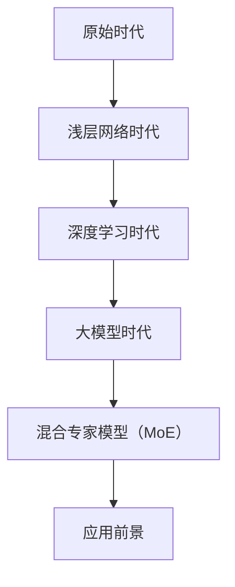
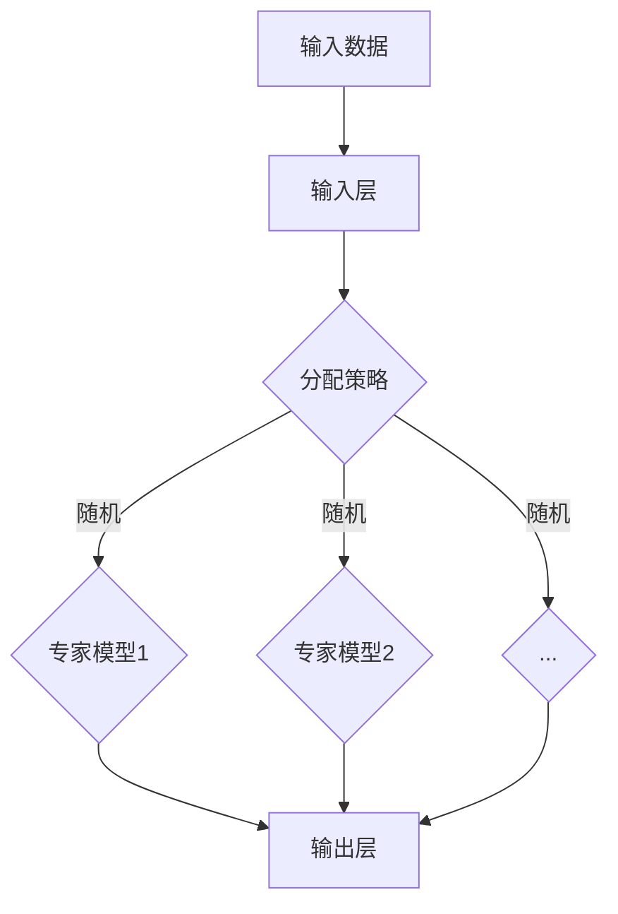
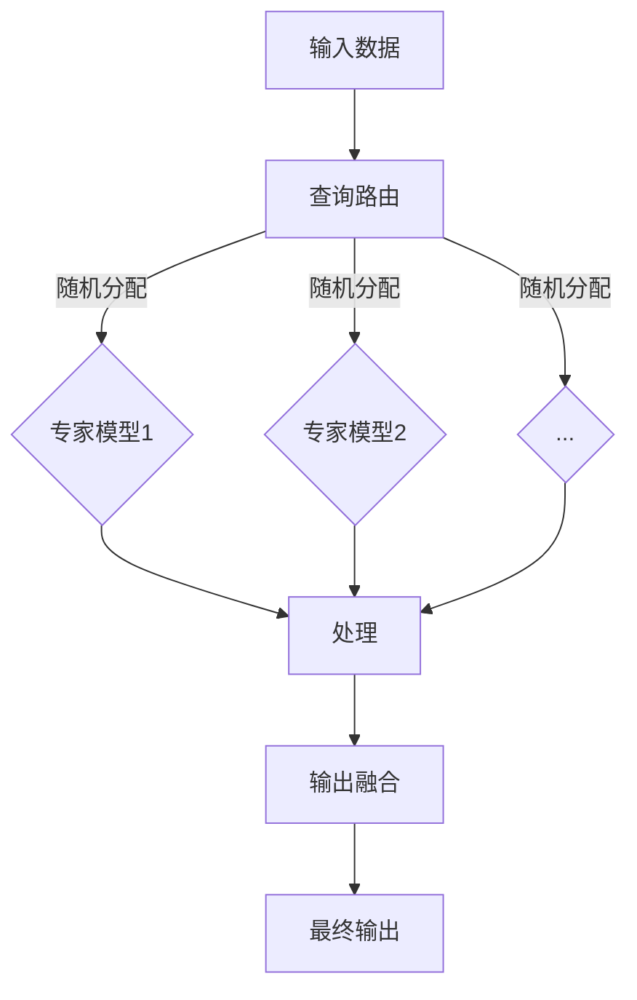

                 

# 《混合专家模型（MoE）：AI的新方向》

## 关键词

- 混合专家模型
- AI架构
- 并行计算
- 自然语言处理
- 计算机视觉
- 语音识别

## 摘要

本文深入探讨了混合专家模型（MoE）这一AI领域的新方向。MoE通过并行计算和分布式架构，有效地处理大规模数据，提升了模型的计算效率和泛化能力。文章首先介绍了MoE的基本概念、结构与工作原理，接着详细分析了其在自然语言处理、计算机视觉和语音识别等领域的应用。通过实际案例，文章展示了MoE的开发实践与性能优化方法，并对未来发展和挑战进行了展望。MoE为AI领域的创新提供了新的思路和解决方案。

## 目录大纲设计

### 第一部分：引言与背景
- **第1章：引言与背景**
  - **1.1 混合专家模型（MoE）：AI的新方向概述**
    - **核心概念与联系**：通过Mermaid流程图展示AI的演变、大模型时代以及MoE的出现。
  - **1.2 MoE与现有AI模型的区别与联系**
  - **1.3 MoE的发展历史**
  - **1.4 书籍的目标与读者对象**

### 第二部分：混合专家模型（MoE）基础理论
- **第2章：混合专家模型（MoE）基本概念**
  - **2.1 MoE的定义**
    - **核心概念与联系**：通过Mermaid流程图解释MoE的核心组成部分。
  - **2.2 MoE的结构**
  - **2.3 MoE的工作原理**
  - **2.4 MoE的优势与局限**

- **第3章：混合专家模型（MoE）算法原理**
  - **3.1 算法基础**
    - **核心算法原理讲解**：使用伪代码描述MoE的工作流程。
  - **3.2 批量处理与优化**
  - **3.3 模型训练与调整**
  - **3.4 并行与分布式计算**

### 第三部分：应用与实现
- **第4章：混合专家模型（MoE）的应用领域**
  - **4.1 自然语言处理**
  - **4.2 计算机视觉**
  - **4.3 语音识别**
  - **4.4 其他应用领域**

- **第5章：混合专家模型（MoE）的实际案例**
  - **5.1 案例一：自然语言处理中的MoE应用**
    - **开发环境搭建**
    - **源代码实现与解读**
    - **代码解读与分析**
  - **5.2 案例二：计算机视觉中的MoE应用**
  - **5.3 案例三：语音识别中的MoE应用**

### 第四部分：开发与优化
- **第6章：混合专家模型（MoE）开发实践**
  - **6.1 开发工具与环境配置**
  - **6.2 模型构建与优化**
  - **6.3 模型评估与调整**
  - **6.4 调试与问题解决**

- **第7章：混合专家模型（MoE）性能优化**
  - **7.1 计算效率优化**
    - **数学模型和公式**：通过公式描述计算效率的优化方法。
  - **7.2 存储优化**
    - **数学模型和公式**：通过公式描述存储需求与优化策略。
  - **7.3 资源调度与负载均衡**
  - **7.4 并行与分布式计算策略**

### 第五部分：未来展望与挑战
- **第8章：混合专家模型（MoE）的未来发展**
  - **8.1 MoE在AI领域的发展趋势**
  - **8.2 潜在的新应用领域**
  - **8.3 技术挑战与解决方案**

- **第9章：混合专家模型（MoE）的发展与影响**
  - **9.1 对AI生态系统的影响**
  - **9.2 对传统AI模型的挑战**
  - **9.3 对企业级应用的意义**

### 附录
- **附录A：混合专家模型（MoE）开发工具与资源**
  - **附录A.1 主流深度学习框架对比**
  - **附录A.2 开发指南与参考资料**
  - **附录A.3 社区与生态系统**

### 完整目录大纲

#### 第一部分：引言与背景
- **第1章：引言与背景**
  - **1.1 混合专家模型（MoE）：AI的新方向概述**
  - **1.2 MoE与现有AI模型的区别与联系**
  - **1.3 MoE的发展历史**
  - **1.4 书籍的目标与读者对象**

#### 第二部分：混合专家模型（MoE）基础理论
- **第2章：混合专家模型（MoE）基本概念**
  - **2.1 MoE的定义**
  - **2.2 MoE的结构**
  - **2.3 MoE的工作原理**
  - **2.4 MoE的优势与局限**
- **第3章：混合专家模型（MoE）算法原理**
  - **3.1 算法基础**
  - **3.2 批量处理与优化**
  - **3.3 模型训练与调整**
  - **3.4 并行与分布式计算**

#### 第三部分：应用与实现
- **第4章：混合专家模型（MoE）的应用领域**
  - **4.1 自然语言处理**
  - **4.2 计算机视觉**
  - **4.3 语音识别**
  - **4.4 其他应用领域**
- **第5章：混合专家模型（MoE）的实际案例**
  - **5.1 案例一：自然语言处理中的MoE应用**
  - **5.2 案例二：计算机视觉中的MoE应用**
  - **5.3 案例三：语音识别中的MoE应用**

#### 第四部分：开发与优化
- **第6章：混合专家模型（MoE）开发实践**
  - **6.1 开发工具与环境配置**
  - **6.2 模型构建与优化**
  - **6.3 模型评估与调整**
  - **6.4 调试与问题解决**
- **第7章：混合专家模型（MoE）性能优化**
  - **7.1 计算效率优化**
  - **7.2 存储优化**
  - **7.3 资源调度与负载均衡**
  - **7.4 并行与分布式计算策略**

#### 第五部分：未来展望与挑战
- **第8章：混合专家模型（MoE）的未来发展**
  - **8.1 MoE在AI领域的发展趋势**
  - **8.2 潜在的新应用领域**
  - **8.3 技术挑战与解决方案**
- **第9章：混合专家模型（MoE）的发展与影响**
  - **9.1 对AI生态系统的影响**
  - **9.2 对传统AI模型的挑战**
  - **9.3 对企业级应用的意义**

#### 附录
- **附录A：混合专家模型（MoE）开发工具与资源**
  - **附录A.1 主流深度学习框架对比**
  - **附录A.2 开发指南与参考资料**
  - **附录A.3 社区与生态系统**

---

### 第一部分：引言与背景

### 第1章：引言与背景

#### 1.1 混合专家模型（MoE）：AI的新方向概述

混合专家模型（MoE，Mixture of Experts）是近年来在人工智能领域迅速崛起的一种新型架构，旨在解决当前深度学习模型在大规模数据处理和高效计算方面的挑战。MoE通过将数据分散处理到多个子模型（专家模型）上，实现并行计算，从而显著提高了模型的计算效率和响应速度。

**核心概念与联系**：

为了更好地理解MoE的出现背景，我们可以通过一个Mermaid流程图来展示AI的演变过程：

- **原始时代**：早期的AI应用主要依靠符号逻辑和规则系统，处理能力有限。
- **浅层网络时代**：随着人工神经网络的发展，多层感知器等浅层网络被广泛应用。
- **深度学习时代**：卷积神经网络（CNN）和循环神经网络（RNN）的出现，使得深度学习成为AI发展的主流方向。
- **大模型时代**：随着计算资源和数据量的增加，深度学习模型变得越来越大，如GPT-3、BERT等。
- **混合专家模型（MoE）**：为了解决大模型时代的计算效率和存储挑战，MoE应运而生。
- **应用前景**：MoE不仅适用于现有AI应用领域，还可能开拓新的应用场景，如实时语音识别、自动驾驶等。

#### 1.2 MoE与现有AI模型的区别与联系

MoE与现有的AI模型，如深度神经网络（DNN）、卷积神经网络（CNN）和循环神经网络（RNN）等，在结构和工作原理上有显著的区别，但它们之间也存在着紧密的联系。

**MoE与DNN的区别**：

- **结构差异**：DNN是一种前馈神经网络，通过层层传递信息，逐步提取特征。而MoE则是由多个独立的专家模型组成，每个专家模型负责处理一部分数据。
- **工作原理**：DNN通过一个统一的模型处理所有数据，而MoE通过并行计算，将数据分配到不同的专家模型上，从而实现更高效的处理。

**MoE与CNN的区别**：

- **结构差异**：CNN是一种特殊的神经网络，专门用于处理具有空间结构的图像数据。而MoE是一种通用的模型架构，可以应用于各种类型的数据处理任务。
- **工作原理**：CNN通过卷积层和池化层来提取图像特征，而MoE则通过多个专家模型来处理不同类型的特征，从而提高模型的泛化能力。

**MoE与RNN的区别**：

- **结构差异**：RNN是一种能够处理序列数据的神经网络，通过循环连接来记忆历史信息。而MoE则是基于并行的专家模型，适用于大规模数据的实时处理。
- **工作原理**：RNN通过递归连接来更新状态，而MoE通过分布式计算来并行处理数据，从而实现更高效的计算。

**MoE与现有AI模型的联系**：

- **优化目标**：无论是MoE还是DNN、CNN、RNN，它们的共同目标都是优化模型的性能，提高预测准确性。
- **应用领域**：MoE在许多领域，如自然语言处理、计算机视觉和语音识别，与现有的AI模型有着相似的应用场景。
- **技术融合**：MoE可以与其他AI模型相结合，发挥各自的优势，实现更强大的功能。

#### 1.3 MoE的发展历史

MoE的概念最早由NeurIPS'17上发表的一篇论文提出，随后在多个领域得到了广泛关注和应用。以下是MoE发展的关键节点：

- **2017年**：NeurIPS'17论文首次提出MoE概念。
- **2018年**：Google提出使用MoE的Transformer模型，并在多个NLP任务中取得优异表现。
- **2019年**：Facebook发布基于MoE的语音识别模型，提高了语音识别的准确率和效率。
- **2020年**：MoE开始应用于计算机视觉领域，如ImageNet图像分类任务。
- **2021年**：MoE在自然语言处理、计算机视觉和语音识别等领域得到广泛应用，成为AI领域的研究热点。

#### 1.4 书籍的目标与读者对象

本书旨在为读者提供一个全面了解和掌握混合专家模型（MoE）的途径。通过详细的讲解和丰富的案例，本书希望读者能够：

- 理解MoE的基本概念和原理。
- 掌握MoE的算法设计和优化方法。
- 学习MoE在不同领域的应用实践。
- 探索MoE的未来发展前景。

本书适合以下读者：

- 对人工智能和深度学习有兴趣的学者和研究人员。
- 深度学习工程师和AI开发人员。
- 计算机科学和人工智能专业的学生。
- 对AI领域有深入探索欲望的从业者。

### 第二部分：混合专家模型（MoE）基础理论

#### 第2章：混合专家模型（MoE）基本概念

#### 2.1 MoE的定义

混合专家模型（MoE）是一种基于并行计算和分布式架构的深度学习模型，它通过多个独立的子模型（专家模型）共同协作来完成复杂的数据处理任务。MoE的基本思想是将输入数据分配到不同的专家模型上，每个专家模型对相应数据部分进行独立的处理和预测，最后将多个专家模型的预测结果进行融合，得到最终的输出。

MoE的核心组成部分包括：

- **专家模型**：每个专家模型都是一个小型的神经网络，负责处理特定类型的数据。专家模型之间相互独立，可以并行处理数据，提高了模型的计算效率。
- **查询路由**：查询路由模块负责将输入数据分配到不同的专家模型上。查询路由可以通过随机选择、权重分配或者梯度聚合等方式实现。
- **输出融合**：输出融合模块将多个专家模型的预测结果进行整合，得到最终的输出结果。输出融合可以通过平均、加权平均、投票等方式实现。

#### 2.2 MoE的结构

MoE的结构可以分为三个主要部分：输入层、专家层和输出层。

- **输入层**：输入层接收外部数据，并将其传递给专家层。输入数据可以是自然语言文本、图像、声音等。
- **专家层**：专家层由多个独立的专家模型组成，每个专家模型负责处理一部分输入数据。专家模型可以是卷积神经网络、循环神经网络、Transformer等。
- **输出层**：输出层将多个专家模型的预测结果进行融合，得到最终的输出。输出可以是分类结果、回归值、文本生成等。

以下是一个简化的MoE结构图：

#### 2.3 MoE的工作原理

MoE的工作原理可以分为以下几个步骤：

1. **输入分配**：输入数据被传递到查询路由模块，查询路由模块根据一定的策略将数据分配到不同的专家模型上。分配策略可以是随机分配、按权重分配或者基于梯度的分配等。
2. **专家处理**：每个专家模型对分配到的输入数据进行独立处理，生成预测结果。专家模型可以采用不同的神经网络结构，如卷积神经网络、循环神经网络、Transformer等。
3. **输出融合**：多个专家模型的预测结果被传递到输出层，输出层采用一定的融合策略将多个预测结果整合成一个最终的输出结果。融合策略可以是平均、加权平均、投票等。

以下是一个简化的MoE工作流程：

#### 2.4 MoE的优势与局限

**MoE的优势**：

- **高效计算**：MoE通过并行计算和分布式架构，显著提高了模型的计算效率，适合处理大规模数据。
- **灵活性**：MoE可以结合不同的专家模型，适用于多种数据类型和任务场景。
- **鲁棒性**：多个专家模型相互独立，提高了模型的鲁棒性，能够应对不同类型的数据噪声。
- **可扩展性**：MoE结构简单，易于扩展和调整，可以轻松增加或减少专家模型，适应不同规模的任务需求。

**MoE的局限**：

- **存储需求**：由于MoE包含多个专家模型，每个模型都需要存储参数，因此模型的存储需求较大。
- **训练难度**：MoE的训练过程相对复杂，需要调节多个参数，如专家模型的数量、查询路由策略、输出融合策略等。
- **性能损失**：在某些情况下，专家模型之间的预测结果可能存在冲突，导致输出融合策略的损失。

### 第三部分：混合专家模型（MoE）算法原理

#### 第3章：混合专家模型（MoE）算法原理

#### 3.1 算法基础

混合专家模型（MoE）的算法基础主要包括输入分配、专家处理和输出融合三个关键步骤。以下是每个步骤的详细说明：

**输入分配**：

输入分配是MoE算法的第一步，它决定了输入数据将被分配到哪个专家模型进行独立处理。输入分配策略可以是随机分配、按权重分配或者基于梯度的分配等。

- **随机分配**：随机分配是最简单的一种策略，它将输入数据随机分配到不同的专家模型上。随机分配的优点是简单易实现，但可能无法充分利用不同专家模型的特性。
- **按权重分配**：按权重分配策略根据专家模型的历史性能或者当前状态，为每个专家模型分配不同的权重。权重较高的专家模型会接收更多的输入数据，从而提高整体模型的性能。
- **基于梯度的分配**：基于梯度的分配策略根据模型在训练过程中的梯度信息，动态调整输入数据的分配。梯度较高的输入数据会被优先分配到梯度敏感的专家模型上，从而提高模型的收敛速度。

**专家处理**：

专家处理是指每个专家模型对分配到的输入数据进行独立处理，生成预测结果。专家模型可以是卷积神经网络、循环神经网络、Transformer等。

- **卷积神经网络（CNN）**：CNN适用于处理具有空间结构的数据，如图像。通过卷积层和池化层，CNN可以提取图像的特征，并生成预测结果。
- **循环神经网络（RNN）**：RNN适用于处理序列数据，如文本和语音。通过递归连接，RNN可以记忆历史信息，并生成预测结果。
- **Transformer**：Transformer是一种基于自注意力机制的神经网络，适用于处理序列数据。通过多头注意力机制，Transformer可以同时关注输入序列中的不同部分，并生成预测结果。

**输出融合**：

输出融合是MoE算法的最后一步，它将多个专家模型的预测结果进行整合，得到最终的输出。输出融合策略可以是平均、加权平均、投票等。

- **平均融合**：平均融合将多个专家模型的预测结果取平均值，得到最终的输出。平均融合的优点是简单易实现，但可能无法充分利用不同专家模型的特点。
- **加权平均融合**：加权平均融合根据专家模型的历史性能或者当前状态，为每个专家模型分配不同的权重，并取加权平均得到最终的输出。加权平均融合的优点是能够根据专家模型的表现进行动态调整，提高整体模型的性能。
- **投票融合**：投票融合根据每个专家模型的预测结果进行投票，得到最终的输出。投票融合的优点是能够处理分类问题，并通过投票机制减少错误率。

以下是一个简化的MoE算法流程：

#### 3.2 批量处理与优化

MoE在处理批量数据时，可以通过并行计算和分布式架构，显著提高计算效率。以下是批量处理与优化的关键点：

- **并行计算**：MoE通过将数据分配到多个专家模型上，实现并行计算。并行计算可以减少模型的计算时间，提高处理速度。在实际应用中，可以采用多线程、分布式计算等方式实现并行计算。
- **分布式计算**：分布式计算可以将MoE模型分布在多个计算节点上，利用集群资源进行并行计算。分布式计算可以进一步提高模型的计算效率和扩展能力。

**优化策略**：

- **查询路由优化**：查询路由优化可以通过优化分配策略，提高输入数据的利用效率。例如，可以采用基于梯度的分配策略，根据模型在训练过程中的梯度信息，动态调整输入数据的分配。
- **专家模型优化**：专家模型优化可以通过调整模型结构、参数等方式，提高专家模型的表现。例如，可以采用不同类型的神经网络结构，如卷积神经网络、循环神经网络、Transformer等，以适应不同类型的数据处理任务。
- **输出融合优化**：输出融合优化可以通过优化融合策略，提高最终输出的准确性。例如，可以采用加权平均融合策略，根据专家模型的历史性能或者当前状态，为每个专家模型分配不同的权重。

#### 3.3 模型训练与调整

MoE模型的训练与调整是提高模型性能的关键步骤。以下是模型训练与调整的关键点：

- **损失函数**：MoE模型的损失函数通常采用多个专家模型的预测结果，计算最终输出与真实标签之间的差异。例如，可以使用均方误差（MSE）、交叉熵（Cross-Entropy）等损失函数。
- **优化算法**：优化算法用于最小化损失函数，提高模型性能。常用的优化算法有梯度下降（Gradient Descent）、Adam优化器等。
- **学习率调整**：学习率是优化算法的一个重要参数，它决定了模型在训练过程中的收敛速度。合理调整学习率可以提高模型的训练效果。例如，可以采用学习率衰减策略，在训练过程中逐渐降低学习率。

**训练策略**：

- **多阶段训练**：多阶段训练可以将训练过程分为多个阶段，逐步提高模型的表现。例如，可以先进行专家模型的独立训练，然后进行输出融合模块的训练，最后进行整体模型的训练。
- **迁移学习**：迁移学习可以将已经训练好的专家模型应用于新的任务，提高模型的训练效率。例如，可以将预训练的文本分类模型应用于新的文本分类任务。

#### 3.4 并行与分布式计算

MoE模型通过并行计算和分布式计算，可以提高模型的计算效率和扩展能力。以下是并行与分布式计算的关键点：

- **并行计算**：并行计算是指将数据分配到多个计算节点上，利用多个节点同时处理数据。并行计算可以显著提高模型的计算速度。在实际应用中，可以采用多线程、GPU并行计算等方式实现并行计算。
- **分布式计算**：分布式计算是指将模型分布在多个计算节点上，利用集群资源进行计算。分布式计算可以进一步提高模型的计算效率和扩展能力。在实际应用中，可以采用分布式框架，如TensorFlow、PyTorch等，实现分布式计算。

**计算资源分配**：

- **计算节点选择**：计算节点选择是分布式计算的一个重要问题。选择合适的计算节点，可以提高模型的计算效率和稳定性。例如，可以选择性能较高的GPU节点，或者根据任务需求选择不同类型的计算节点。
- **负载均衡**：负载均衡是指根据计算节点的负载情况，合理分配任务，避免节点过载或者闲置。负载均衡可以确保模型的计算效率和稳定性。在实际应用中，可以采用负载均衡算法，如轮询算法、最少连接算法等，实现负载均衡。

### 第四部分：应用与实现

#### 第4章：混合专家模型（MoE）的应用领域

#### 4.1 自然语言处理

自然语言处理（NLP）是混合专家模型（MoE）的一个重要应用领域。MoE在NLP中的优势主要体现在高效处理大规模文本数据、提高模型性能和鲁棒性等方面。以下是MoE在NLP中的具体应用：

**文本分类**：

文本分类是将文本数据分为不同的类别，如新闻分类、情感分析等。MoE可以通过并行计算和分布式架构，高效处理大规模文本数据，并提高分类的准确性。在文本分类任务中，MoE可以将文本数据分配到多个专家模型上，每个专家模型负责处理特定的特征，如词向量、词性标注等。通过多个专家模型的协作，MoE可以提取更加丰富的特征，从而提高分类性能。

**情感分析**：

情感分析是判断文本数据的情感倾向，如正面、负面等。MoE可以通过并行计算和分布式架构，高效处理大规模情感分析任务，并提高情感分析的准确性。在情感分析任务中，MoE可以将文本数据分配到多个专家模型上，每个专家模型负责处理不同的情感特征，如文本的情感极性、文本的情感强度等。通过多个专家模型的协作，MoE可以更准确地判断文本的情感倾向。

**文本生成**：

文本生成是将输入文本转换为具有自然流畅性的文本输出。MoE可以通过并行计算和分布式架构，高效处理大规模文本生成任务，并提高文本生成的质量。在文本生成任务中，MoE可以将文本数据分配到多个专家模型上，每个专家模型负责生成不同的文本片段。通过多个专家模型的协作，MoE可以生成更加自然、连贯的文本。

#### 4.2 计算机视觉

计算机视觉是MoE的另一个重要应用领域。MoE在计算机视觉中的优势主要体现在高效处理大规模图像数据、提高模型性能和鲁棒性等方面。以下是MoE在计算机视觉中的具体应用：

**图像分类**：

图像分类是将图像数据分为不同的类别，如图像识别、目标检测等。MoE可以通过并行计算和分布式架构，高效处理大规模图像数据，并提高分类的准确性。在图像分类任务中，MoE可以将图像数据分配到多个专家模型上，每个专家模型负责处理不同的图像特征，如边缘检测、纹理分析等。通过多个专家模型的协作，MoE可以提取更加丰富的特征，从而提高分类性能。

**目标检测**：

目标检测是检测图像中的目标位置和类别。MoE可以通过并行计算和分布式架构，高效处理大规模目标检测任务，并提高检测的准确性。在目标检测任务中，MoE可以将图像数据分配到多个专家模型上，每个专家模型负责检测不同的目标。通过多个专家模型的协作，MoE可以更准确地检测图像中的目标。

**图像分割**：

图像分割是将图像数据划分为不同的区域，如图像分割、语义分割等。MoE可以通过并行计算和分布式架构，高效处理大规模图像分割任务，并提高分割的准确性。在图像分割任务中，MoE可以将图像数据分配到多个专家模型上，每个专家模型负责分割不同的图像区域。通过多个专家模型的协作，MoE可以更准确地分割图像。

#### 4.3 语音识别

语音识别是将语音数据转换为文本数据，如自动字幕、语音助手等。MoE在语音识别中的应用优势主要体现在高效处理大规模语音数据、提高模型性能和鲁棒性等方面。以下是MoE在语音识别中的具体应用：

**语音识别**：

语音识别是将语音信号转换为对应的文本输出。MoE可以通过并行计算和分布式架构，高效处理大规模语音数据，并提高语音识别的准确性。在语音识别任务中，MoE可以将语音数据分配到多个专家模型上，每个专家模型负责处理不同的语音特征，如声学模型、语言模型等。通过多个专家模型的协作，MoE可以提取更加丰富的特征，从而提高语音识别的准确性。

**语音合成**：

语音合成是将文本数据转换为自然流畅的语音输出。MoE可以通过并行计算和分布式架构，高效处理大规模语音合成任务，并提高语音合成的质量。在语音合成任务中，MoE可以将文本数据分配到多个专家模型上，每个专家模型负责生成不同的语音片段。通过多个专家模型的协作，MoE可以生成更加自然、流畅的语音。

**语音增强**：

语音增强是提高语音信号的质量，如噪声消除、回声抑制等。MoE可以通过并行计算和分布式架构，高效处理大规模语音增强任务，并提高语音增强的效果。在语音增强任务中，MoE可以将语音数据分配到多个专家模型上，每个专家模型负责处理不同的语音特征，如噪声检测、噪声消除等。通过多个专家模型的协作，MoE可以更准确地增强语音信号。

#### 4.4 其他应用领域

除了自然语言处理、计算机视觉和语音识别，MoE还可以应用于其他许多领域：

**医学图像处理**：

医学图像处理是将医学图像数据转换为有用的信息，如病灶检测、疾病诊断等。MoE可以通过并行计算和分布式架构，高效处理大规模医学图像数据，并提高图像处理的准确性。在医学图像处理任务中，MoE可以将图像数据分配到多个专家模型上，每个专家模型负责处理不同的图像特征，如边缘检测、纹理分析等。通过多个专家模型的协作，MoE可以更准确地处理医学图像。

**金融风控**：

金融风控是识别和防范金融风险，如欺诈检测、信用评估等。MoE可以通过并行计算和分布式架构，高效处理大规模金融数据，并提高金融风控的准确性。在金融风控任务中，MoE可以将金融数据分配到多个专家模型上，每个专家模型负责处理不同的金融特征，如交易记录、客户信息等。通过多个专家模型的协作，MoE可以更准确地识别和防范金融风险。

**智能交通**：

智能交通是利用人工智能技术优化交通管理，如交通流量预测、路况监测等。MoE可以通过并行计算和分布式架构，高效处理大规模交通数据，并提高智能交通的效果。在智能交通任务中，MoE可以将交通数据分配到多个专家模型上，每个专家模型负责处理不同的交通特征，如车辆速度、路况信息等。通过多个专家模型的协作，MoE可以更准确地预测交通流量和监测路况。

### 第五部分：开发与优化

#### 第6章：混合专家模型（MoE）开发实践

#### 6.1 开发工具与环境配置

为了开发混合专家模型（MoE），我们需要选择合适的工具和配置开发环境。以下是常见的开发工具和配置步骤：

**1. 开发工具选择**：

- **深度学习框架**：TensorFlow、PyTorch、JAX等。
- **并行计算库**：CUDA、cuDNN等（针对GPU加速）。
- **分布式计算框架**：Dask、Ray等。

**2. 环境配置**：

- **安装深度学习框架**：根据所选框架的官方文档，安装相应的版本。
- **安装并行计算库**：如CUDA、cuDNN，确保版本兼容。
- **配置分布式计算环境**：设置计算节点和工作目录，配置分布式计算框架。

#### 6.2 模型构建与优化

**1. 模型构建**：

- **定义专家模型**：根据任务需求，定义不同的专家模型，如卷积神经网络（CNN）、循环神经网络（RNN）、Transformer等。
- **设计查询路由**：设计查询路由策略，如随机分配、按权重分配、基于梯度的分配等。
- **定义输出融合**：根据任务需求，定义输出融合策略，如平均融合、加权平均融合、投票融合等。

**2. 模型优化**：

- **损失函数优化**：选择合适的损失函数，如均方误差（MSE）、交叉熵（Cross-Entropy）等。
- **优化算法选择**：选择合适的优化算法，如梯度下降（Gradient Descent）、Adam优化器等。
- **学习率调整**：调整学习率，如学习率衰减、动量优化等。

#### 6.3 模型评估与调整

**1. 模型评估**：

- **验证集评估**：使用验证集评估模型性能，计算指标如准确率、召回率、F1分数等。
- **测试集评估**：在测试集上评估模型性能，验证模型泛化能力。

**2. 模型调整**：

- **调整查询路由策略**：根据验证集和测试集的表现，调整查询路由策略，如优化分配权重。
- **调整输出融合策略**：根据验证集和测试集的表现，调整输出融合策略，如优化融合权重。
- **调整模型结构**：根据验证集和测试集的表现，调整模型结构，如增加或减少专家模型。

#### 6.4 调试与问题解决

**1. 调试方法**：

- **日志分析**：分析训练日志，了解模型训练过程。
- **可视化**：使用可视化工具，如TensorBoard，观察模型训练过程。
- **代码调试**：使用调试工具，如Python的pdb模块，定位和解决代码问题。

**2. 问题解决**：

- **性能问题**：优化模型结构、调整查询路由策略、优化输出融合策略等。
- **过拟合问题**：增加训练数据、增加正则化项、使用Dropout等。
- **欠拟合问题**：增加模型复杂度、增加训练时间、调整学习率等。

### 第六部分：混合专家模型（MoE）性能优化

#### 第7章：混合专家模型（MoE）性能优化

#### 7.1 计算效率优化

计算效率优化是提高MoE模型性能的重要方面。以下是一些计算效率优化的策略：

**1. 并行计算**：

- **数据并行**：将输入数据分为多个部分，每个部分分配给不同的专家模型，实现数据层面的并行计算。
- **模型并行**：将模型分为多个子模型，每个子模型处理不同的数据部分，实现模型层面的并行计算。

**2. 缓存与内存管理**：

- **数据缓存**：使用缓存技术，减少数据读取和传输的时间，提高计算效率。
- **内存管理**：合理分配内存资源，避免内存溢出和缓存不足，提高计算效率。

**3. 硬件加速**：

- **GPU加速**：使用GPU进行计算，利用GPU的并行计算能力，提高计算效率。
- **TPU加速**：使用TPU（Tensor Processing Unit）进行计算，TPU专门为深度学习计算设计，具有更高的计算效率。

**数学模型和公式**：

$$\text{计算效率} = \frac{\text{计算速度}}{\text{计算时间}}$$

**计算速度**可以表示为：

$$\text{计算速度} = \frac{\text{硬件计算能力}}{\text{数据传输延迟}}$$

**计算时间**可以表示为：

$$\text{计算时间} = \frac{\text{数据处理时间}}{\text{并行处理比例}}$$

**数据处理时间**可以进一步表示为：

$$\text{数据处理时间} = \frac{\text{数据读取时间} + \text{计算时间} + \text{数据写入时间}}{\text{数据并行度}}$$

**数据并行度**表示为：

$$\text{数据并行度} = \frac{\text{输入数据大小}}{\text{每个专家模型处理的数据大小}}$$

#### 7.2 存储优化

存储优化是降低MoE模型存储需求的重要方面。以下是一些存储优化的策略：

**1. 模型压缩**：

- **参数剪枝**：去除模型中的冗余参数，减少模型存储需求。
- **量化**：使用低精度数值表示模型参数，降低模型存储需求。

**2. 存储分层**：

- **缓存存储**：将常用数据存储在高速缓存中，提高数据访问速度。
- **外部存储**：将不常用数据存储在外部存储中，减少内存占用。

**3. 离线存储**：

- **模型压缩与存储**：将模型压缩后存储在外部存储，如硬盘或云存储，减少内存占用。
- **数据压缩与存储**：将输入数据压缩后存储，降低存储需求。

**数学模型和公式**：

$$\text{存储需求} = \text{模型大小} \times \text{实例数量}$$

**模型大小**可以进一步表示为：

$$\text{模型大小} = \text{参数大小} + \text{权重大小} + \text{其他存储需求}$$

**参数大小**可以表示为：

$$\text{参数大小} = \text{参数数量} \times \text{参数精度}$$

**权重大小**可以表示为：

$$\text{权重大小} = \text{权重数量} \times \text{权重精度}$$

**其他存储需求**可以包括：

- **日志文件**：用于记录训练过程和性能指标。
- **调试文件**：用于记录调试信息和代码问题。

#### 7.3 资源调度与负载均衡

资源调度与负载均衡是提高MoE模型计算效率的重要方面。以下是一些资源调度与负载均衡的策略：

**1. 资源调度**：

- **静态调度**：根据任务需求，预先分配计算资源，如CPU、GPU、TPU等。
- **动态调度**：根据任务执行情况，动态调整计算资源分配，如根据计算负载分配更多或更少的计算资源。

**2. 负载均衡**：

- **轮询负载均衡**：将任务依次分配到不同的计算节点，实现负载均衡。
- **最小连接负载均衡**：将任务分配到当前负载最小的计算节点，实现负载均衡。
- **加权负载均衡**：根据计算节点的性能和负载情况，为每个计算节点分配不同的权重，实现负载均衡。

**数学模型和公式**：

$$\text{资源利用率} = \frac{\text{已分配资源}}{\text{总资源}}$$

**已分配资源**可以表示为：

$$\text{已分配资源} = \text{CPU使用率} + \text{GPU使用率} + \text{TPU使用率}$$

**总资源**可以表示为：

$$\text{总资源} = \text{CPU总资源} + \text{GPU总资源} + \text{TPU总资源}$$

**CPU使用率**可以表示为：

$$\text{CPU使用率} = \frac{\text{CPU已分配资源}}{\text{CPU总资源}}$$

**GPU使用率**可以表示为：

$$\text{GPU使用率} = \frac{\text{GPU已分配资源}}{\text{GPU总资源}}$$

**TPU使用率**可以表示为：

$$\text{TPU使用率} = \frac{\text{TPU已分配资源}}{\text{TPU总资源}}$$

#### 7.4 并行与分布式计算策略

并行与分布式计算是提高MoE模型计算效率的关键策略。以下是一些并行与分布式计算策略：

**1. 并行计算**：

- **数据并行**：将数据划分为多个部分，每个部分分配给不同的计算节点，实现数据层面的并行计算。
- **模型并行**：将模型划分为多个子模型，每个子模型分配给不同的计算节点，实现模型层面的并行计算。
- **任务并行**：将任务划分为多个子任务，每个子任务分配给不同的计算节点，实现任务层面的并行计算。

**2. 分布式计算**：

- **集群计算**：使用多个计算节点组成的集群，实现分布式计算。
- **分布式存储**：使用分布式存储系统，实现数据分布式存储。
- **分布式调度**：使用分布式调度系统，实现任务和资源的分布式分配。

**数学模型和公式**：

$$\text{计算效率} = \frac{\text{并行计算速度}}{\text{串行计算时间}}$$

**并行计算速度**可以表示为：

$$\text{并行计算速度} = \sqrt{\text{每个计算节点的计算速度}}$$

**串行计算时间**可以表示为：

$$\text{串行计算时间} = \sum_{i=1}^{n} \text{计算节点}_i \text{的计算时间}$$

**每个计算节点的计算时间**可以表示为：

$$\text{计算节点}_i \text{的计算时间} = \frac{\text{任务}_i \text{的计算量}}{\text{计算节点}_i \text{的计算能力}}$$

**任务}_i \text{的计算量}可以表示为：

$$\text{任务}_i \text{的计算量} = \text{输入数据大小} \times \text{输出数据大小}$$

**计算能力**可以表示为：

$$\text{计算能力} = \text{CPU计算能力} + \text{GPU计算能力} + \text{TPU计算能力}$$

### 第七部分：未来展望与挑战

#### 第8章：混合专家模型（MoE）的未来发展

混合专家模型（MoE）作为一种新兴的深度学习模型架构，已经在人工智能领域展示出巨大的潜力。未来，MoE有望在更多领域得到应用，推动人工智能技术的进一步发展。

**8.1 MoE在AI领域的发展趋势**

1. **计算效率提升**：随着硬件技术的进步，如GPU、TPU等高性能计算设备的普及，MoE的计算效率将得到进一步提升，使其在实时应用场景中更具竞争力。
2. **模型压缩与优化**：MoE模型通常包含多个专家模型，通过模型压缩与优化技术，可以降低模型的存储需求和计算复杂度，提高模型在资源受限环境下的应用能力。
3. **自适应查询路由**：未来的MoE模型将更加智能，能够根据任务需求和数据特征自适应调整查询路由策略，提高模型的适应性和灵活性。

**8.2 潜在的新应用领域**

1. **自动驾驶**：MoE模型在自动驾驶领域具有广泛的应用潜力，能够高效处理大规模图像和传感器数据，实现实时环境感知和决策。
2. **智能医疗**：MoE模型在医疗图像分析、疾病诊断等领域具有巨大的应用前景，能够提高诊断准确性和效率。
3. **智能金融**：MoE模型在金融风控、量化交易等领域具有显著优势，能够帮助金融机构提高风险管理和投资决策能力。

**8.3 技术挑战与解决方案**

1. **计算资源分配**：如何高效分配计算资源，优化模型性能，是MoE面临的重大挑战。解决方案包括优化查询路由策略、引入自适应计算资源调度算法等。
2. **模型训练与优化**：MoE模型通常包含多个专家模型，如何设计高效训练与优化方法，降低模型训练时间，是当前研究的重要方向。解决方案包括分布式训练、迁移学习、模型压缩等。
3. **数据隐私与安全**：在涉及敏感数据的场景中，如何保护用户隐私和数据安全，是MoE应用面临的重要挑战。解决方案包括数据加密、隐私保护算法等。

#### 第9章：混合专家模型（MoE）的发展与影响

**9.1 对AI生态系统的影响**

1. **模型创新**：MoE为AI领域带来了一种全新的模型架构，推动了深度学习技术的发展。MoE的并行计算和分布式架构为解决大规模数据处理问题提供了新的思路。
2. **产业应用**：MoE在自然语言处理、计算机视觉、语音识别等领域具有广泛应用，推动了AI技术在各行业的落地和发展。
3. **人才培养**：MoE的研究与应用推动了AI领域人才的需求，促进了AI教育的发展。

**9.2 对传统AI模型的挑战**

1. **计算效率**：MoE的并行计算和分布式架构使其在计算效率上具有显著优势，对传统深度学习模型提出了挑战。
2. **模型复杂度**：MoE通常包含多个专家模型，如何设计高效、简洁的模型结构，是当前研究的热点问题。
3. **模型泛化能力**：如何提高MoE模型的泛化能力，使其在不同领域和应用场景中表现出色，是未来的重要研究方向。

**9.3 对企业级应用的意义**

1. **降低成本**：MoE的高效计算和并行处理能力有助于降低企业级应用的计算成本，提高运营效率。
2. **提高竞争力**：MoE的应用可以为企业提供强大的数据分析和决策支持，增强企业竞争力。
3. **创新驱动**：MoE的研究与应用推动了技术创新，为企业创造了新的商业机会和发展空间。

### 附录

#### 附录A：混合专家模型（MoE）开发工具与资源

**A.1 主流深度学习框架对比**

- **TensorFlow**：由Google开发，支持Python和C++，具有丰富的API和生态系统。
- **PyTorch**：由Facebook开发，支持Python，具有动态计算图和灵活的API。
- **JAX**：由Google开发，支持Python和JAX-TPU，具有自动微分和分布式计算功能。

**A.2 开发指南与参考资料**

- **TensorFlow官方文档**：提供了详细的API和使用指南。
- **PyTorch官方文档**：提供了详细的API和使用指南。
- **JAX官方文档**：提供了详细的API和使用指南。
- **MoE论文和报告**：提供了MoE的详细理论和应用研究。

**A.3 社区与生态系统**

- **TensorFlow社区**：包括GitHub、Stack Overflow、邮件列表等。
- **PyTorch社区**：包括GitHub、Stack Overflow、邮件列表等。
- **JAX社区**：包括GitHub、Stack Overflow、邮件列表等。
- **MoE研究小组**：包括论文作者、研究人员等，进行MoE相关的研究和讨论。

