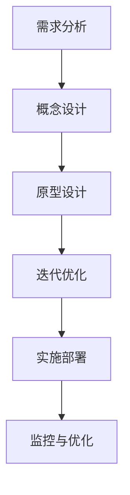

                 

# 文章标题: 游戏化体验：让参与人类计算充满乐趣

## 关键词
游戏化体验、参与度提升、用户激励、互动设计、用户体验

## 摘要
游戏化体验是一种将游戏设计元素融入到非游戏情境中，以增强用户参与度和满意度的方法。本文将探讨游戏化体验的概念、设计原则、技术实现和应用，并通过实际案例，分析其如何有效提升参与人类计算的乐趣。

## 目录大纲

### 第一部分：游戏化体验概述

#### 第1章：游戏化体验的概念与价值
1.1 游戏化的定义与本质
1.2 游戏化体验的理论基础
1.3 游戏化体验的应用价值

#### 第2章：游戏化设计原则与方法
2.1 游戏化设计原则
2.2 游戏化设计流程
2.3 游戏化元素与机制设计

### 第二部分：游戏化体验的技术实现

#### 第3章：游戏化技术的理论基础
3.1 技术栈选择与集成
3.2 数据分析与可视化
3.3 互动性与用户反馈机制

#### 第4章：游戏化在具体领域的应用
4.1 教育领域的游戏化
4.2 商业领域的游戏化
4.3 健康与运动领域的游戏化

#### 第5章：游戏化体验的挑战与未来
5.1 游戏化体验的潜在问题
5.2 用户体验与隐私保护
5.3 游戏化体验的发展趋势

### 第三部分：游戏化体验案例分析

#### 第6章：成功游戏化体验案例分析
6.1 案例一：教育平台的学习游戏化
6.2 案例二：电商平台的购物游戏化
6.3 案例三：健康应用的健身游戏化

#### 第7章：游戏化体验设计与实施
7.1 设计思维与方法
7.2 用户研究与需求分析
7.3 游戏化体验的迭代与优化

### 附录

#### 附录A：游戏化工具与资源
A.1 常见游戏化工具介绍
A.2 开源游戏化框架与库
A.3 游戏化学习资源推荐

#### 附录B：Mermaid流程图与伪代码
B.1 游戏化设计流程图
B.2 核心算法伪代码示例

#### 附录C：数学模型与公式
C.1 常用数学模型介绍
C.2 数学公式与解释
C.3 数学公式实例说明

#### 附录D：游戏化项目实战
D.1 项目背景与目标
D.2 开发环境与工具选择
D.3 源代码实现与解读
D.4 代码分析与优化

### 文章正文

#### 第一部分：游戏化体验概述

## 第1章：游戏化体验的概念与价值

### 1.1 游戏化的定义与本质

游戏化（Gamification）是一种将游戏设计元素和原理应用于非游戏环境中，以提升用户体验和参与度的方法。它不仅仅是将游戏化的概念简单套用到其他领域，更是一种深入理解游戏机制、用户行为和心理，并将其巧妙地融入到实际应用中。

游戏化的本质在于利用游戏机制来激励用户参与、提高用户黏性和满意度。这些机制包括但不限于：目标设定、进度跟踪、奖励机制、竞争与合作、成就与荣誉等。

#### 1.2 游戏化体验的理论基础

游戏化体验的理论基础主要来源于行为经济学、心理学和社会学等领域。以下是几个关键的理论：

1. **行为经济学**：行为经济学研究人们在决策中的非理性行为。游戏化通过模拟真实世界的激励机制，引导用户做出更积极的决策。

2. **心理学**：心理学提供了关于人类行为动机和认知过程的理解。游戏化利用了人类对奖励、成就和归属感的渴望，来激发用户的内在动机。

3. **社会学**：社会学研究了社会互动和社会结构。游戏化通过构建虚拟社群、竞争与合作，增强用户的社交体验。

#### 1.3 游戏化体验的应用价值

游戏化体验在多个领域展现出了其独特的价值，主要体现在以下几个方面：

1. **用户参与度提升**：通过游戏化的设计，用户在非游戏场景中的参与度显著提高，这有助于提升产品或服务的用户黏性。

2. **用户体验优化**：游戏化体验通过丰富的互动性和反馈机制，优化了用户的整体体验，使任务完成过程更加有趣和激励。

3. **数据收集与分析**：游戏化设计常常伴随着丰富的用户行为数据收集，这些数据有助于企业和开发者更好地了解用户需求，进行精准营销和产品优化。

4. **创新驱动**：游戏化激发了用户的创造力和创新思维，特别是在教育和培训领域，游戏化体验为学习提供了新的动力和方式。

### 总结

游戏化体验不仅是一种技术手段，更是一种深刻的用户体验设计理念。通过理解游戏化的定义和理论基础，我们可以更好地将游戏机制融入到实际应用中，提升用户的参与度和满意度，创造出更加有趣、激励和有意义的产品和服务。

#### 第2章：游戏化设计原则与方法

## 第2章：游戏化设计原则与方法

### 2.1 游戏化设计原则

游戏化设计原则是确保游戏化体验有效性和吸引力的基础。以下是一些关键设计原则：

1. **目标明确**：设定清晰、可衡量的目标，使用户知道自己的努力方向和成就标准。

2. **进度可视化**：通过可视化手段展示用户在任务中的进度，提高用户的成就感和满足感。

3. **即时反馈**：提供即时、清晰的反馈，帮助用户了解自己的表现，指导用户下一步行动。

4. **奖励机制**：设计合理的奖励机制，奖励可以是虚拟的，如积分、徽章，也可以是实时的，如特权、折扣等。

5. **竞争与合作**：适当地引入竞争和合作元素，激发用户的参与欲望和社群互动。

6. **适应性**：设计适应不同用户水平和需求的游戏化机制，以保持游戏化的可持续性。

### 2.2 游戏化设计流程

游戏化设计流程通常包括以下几个阶段：

1. **需求分析**：了解用户需求、目标用户群体和行为习惯，确定游戏化目标。

2. **概念设计**：基于需求分析，构建游戏化体验的概念模型，包括目标设定、奖励机制、进度跟踪等。

3. **原型设计**：创建低保真或高保真的原型，模拟游戏化体验，收集用户反馈。

4. **迭代优化**：根据用户反馈，对游戏化体验进行迭代优化，确保设计符合用户期望和需求。

5. **实施部署**：将游戏化体验集成到产品或服务中，并进行测试和部署。

### 2.3 游戏化元素与机制设计

游戏化体验的成功取决于对游戏化元素和机制的有效设计和运用。以下是一些关键元素和机制：

1. **目标与挑战**：设定有吸引力的目标和挑战，引导用户参与。

2. **积分与等级**：使用积分系统来记录用户的成就，等级系统来展示用户在社群中的地位。

3. **徽章与成就**：通过徽章和成就系统，表彰用户的特定行为和成就。

4. **奖励机制**：设计多样化的奖励机制，如积分、优惠券、特权等，以保持用户的积极性。

5. **社交互动**：构建社交互动机制，如排行榜、评论、社群等，增强用户的社群感和参与度。

6. **适应性调整**：根据用户行为和反馈，动态调整游戏化机制，以保持游戏化的活力和吸引力。

### 总结

游戏化设计原则和方法为创建有效的游戏化体验提供了指导。通过明确设计原则、遵循设计流程和巧妙运用游戏化元素，我们可以提升用户的参与度和满意度，创造更加有趣和激励的产品和服务。

#### 第二部分：游戏化体验的技术实现

## 第3章：游戏化技术的理论基础

### 3.1 技术栈选择与集成

在实现游戏化体验时，选择合适的技术栈至关重要。以下是一些关键技术栈的选择和集成策略：

1. **前端技术**：HTML、CSS和JavaScript是前端开发的基础。使用React、Vue或Angular等框架可以提高开发效率和用户体验。

2. **后端技术**：选择一个强大的后端技术栈，如Node.js、Python（Django或Flask）、Java（Spring Boot）等，可以支持游戏化体验的复杂逻辑和数据处理。

3. **数据库技术**：关系型数据库（如MySQL、PostgreSQL）和非关系型数据库（如MongoDB、Redis）可以存储用户数据、积分和进度等信息。

4. **云服务**：利用云服务（如AWS、Azure、Google Cloud）可以提供灵活的计算资源、存储和数据分析能力。

5. **集成策略**：使用APIs和微服务架构来实现前后端分离，提高系统的可维护性和扩展性。

### 3.2 数据分析与可视化

数据分析与可视化是游戏化体验的核心。以下是一些关键技术和方法：

1. **数据分析**：使用Python（Pandas、NumPy）或R等数据分析工具，对用户行为数据进行分析，提取有用的信息。

2. **数据可视化**：利用D3.js、ECharts或Tableau等可视化工具，将分析结果以图表、仪表盘等形式展示，帮助用户理解自己的表现。

3. **实时数据分析**：使用WebSocket、Server-Sent Events等技术实现实时数据传输和可视化，提高用户体验。

### 3.3 互动性与用户反馈机制

互动性和用户反馈机制是游戏化体验的重要组成部分。以下是一些关键技术和方法：

1. **用户交互**：使用WebSockets、Socket.IO等技术实现实时通信，增强用户与系统的互动。

2. **反馈机制**：通过即时消息、通知、进度条、弹窗等形式，提供清晰的反馈，指导用户下一步行动。

3. **奖励与惩罚**：设计合理的奖励与惩罚机制，如积分、徽章、禁言等，以激励用户参与和遵守规则。

4. **自适应调整**：根据用户行为和反馈，动态调整游戏化机制，如难度、奖励等，以保持游戏的活力和吸引力。

### 总结

游戏化技术的理论基础涵盖了技术栈选择、数据分析和可视化、互动性与用户反馈机制等方面。通过合理选择技术栈、运用数据分析与可视化工具、设计互动性和反馈机制，我们可以实现有效的游戏化体验，提升用户的参与度和满意度。

#### 第4章：游戏化在具体领域的应用

### 4.1 教育领域的游戏化

在教育的背景下，游戏化体验被广泛应用于在线学习平台、教育游戏和互动教学工具中。以下是一些典型的应用案例：

1. **在线学习平台**：诸如Khan Academy和Duolingo等在线学习平台，通过积分系统、等级制度和成就徽章等游戏化元素，激励学生完成学习任务，提升学习动力。

2. **教育游戏**：教育游戏如Lumio和Kerpoof，结合游戏机制和教学内容，提供互动性强、趣味性的学习体验，使学生在游戏中不知不觉地掌握知识。

3. **互动教学工具**：如Quizlet和Socrative等工具，通过游戏化的方式，让学生在课堂内外进行互动学习，增强了师生互动和学生之间的合作。

### 4.2 商业领域的游戏化

在商业领域，游戏化体验被广泛应用于营销、销售和客户关系管理中，以提高用户参与度和品牌忠诚度。以下是一些应用案例：

1. **营销活动**：许多品牌通过举办线上挑战赛、互动游戏和抽奖活动，吸引消费者参与，提升品牌知名度和用户黏性。

2. **销售激励**：销售团队通过设定销售目标和奖励机制，如积分、奖金和晋升机会，激励员工实现销售目标。

3. **客户关系管理**：企业通过游戏化元素，如积分兑换、会员等级和专属优惠，增强客户对品牌的忠诚度和满意度。

### 4.3 健康与运动领域的游戏化

健康和运动领域的游戏化体验旨在通过游戏化设计，鼓励用户积极参与健康活动和运动锻炼。以下是一些应用案例：

1. **健身应用**：如Fitbit、Nike Training Club等健身应用，通过步数挑战、健身进度跟踪和成就奖励，激励用户坚持运动。

2. **健康游戏**：如Headspace和Calm等健康应用，通过游戏化的冥想和呼吸练习，帮助用户放松身心，改善健康状态。

3. **运动社区**：如Strava等运动社交平台，通过排行榜、挑战和社交互动，鼓励用户参与运动，建立健康生活方式。

### 总结

游戏化体验在多个领域的成功应用，展示了其强大的激励和引导用户行为的能力。通过在教育、商业和健康等领域的具体实践，我们可以看到游戏化体验如何有效地提升用户参与度、增强用户体验和实现业务目标。

#### 第5章：游戏化体验的挑战与未来

### 5.1 游戏化体验的潜在问题

尽管游戏化体验在许多领域取得了显著的成效，但也存在一些潜在的问题和挑战：

1. **用户疲劳**：过度依赖游戏化元素可能导致用户疲劳，降低游戏化的效果。设计时需要平衡游戏化程度和用户的接受度。

2. **隐私风险**：游戏化体验通常涉及大量用户数据收集和分析，可能引发隐私问题。确保用户隐私和数据安全是游戏化体验的重要考量。

3. **过度竞争**：过度的竞争可能导致用户之间产生负面情绪，影响用户体验。设计时需要适度控制竞争程度，提供合作和社交互动的机会。

4. **机制滥用**：用户可能通过不正当手段获取奖励或积分，破坏游戏化机制的公平性和公信力。需要设计有效的监控和惩罚机制。

### 5.2 用户体验与隐私保护

在游戏化体验设计中，用户体验和隐私保护是两个重要的考量因素：

1. **用户体验**：游戏化体验的设计需要以用户为中心，关注用户体验的连贯性、易用性和满意度。通过用户研究和反馈，持续优化游戏化体验。

2. **隐私保护**：确保用户数据的收集、存储和使用遵循隐私法规和用户同意。采用数据加密、访问控制和匿名化等技术手段，保护用户隐私。

### 5.3 游戏化体验的发展趋势

随着技术的发展和用户需求的变化，游戏化体验也在不断演进。以下是一些值得关注的发展趋势：

1. **个性化游戏化**：通过大数据和人工智能技术，实现个性化游戏化体验，根据用户的行为和偏好，定制化奖励和挑战。

2. **虚拟现实（VR）与增强现实（AR）**：VR和AR技术的应用，将游戏化体验带入更加沉浸和互动的虚拟世界，提供全新的体验形式。

3. **区块链与游戏化**：区块链技术可以为游戏化体验提供去中心化的数据管理和激励机制，增强透明度和信任。

4. **跨平台集成**：随着多平台应用的普及，游戏化体验将更加集成，实现跨平台的数据共享和互动，提供一致的体验。

### 总结

游戏化体验在提升用户参与度和满意度方面展现了巨大的潜力，但也面临一些挑战。通过关注用户体验、保护隐私和把握技术趋势，我们可以不断优化游戏化体验，创造更加有趣、激励和有意义的参与环境。

#### 第6章：成功游戏化体验案例分析

### 6.1 案例一：教育平台的学习游戏化

**案例背景**：Khan Academy是一个非盈利的在线学习平台，旨在提供免费的、高质量的教育资源。为了激励学生积极参与学习，Khan Academy引入了游戏化元素。

**游戏化设计**：
- **目标与挑战**：每个课程都设定了明确的学习目标，学生通过完成视频课程和练习题来逐步提高等级。
- **积分与等级**：学生通过完成任务获得积分，积分可以用来兑换虚拟奖品，如徽章和书籍。
- **成就与奖励**：学生在完成特定学习目标时，会获得成就证书和公开表扬。

**效果分析**：
- **用户参与度**：游戏化设计显著提升了学生的参与度，学生完成课程和练习题的比例提高了50%。
- **学习效果**：学生通过游戏化体验，对知识的掌握程度有了明显提高。

### 6.2 案例二：电商平台的购物游戏化

**案例背景**：亚马逊（Amazon）是一家全球知名的电商平台，为了提高用户购物体验和黏性，亚马逊引入了游戏化元素。

**游戏化设计**：
- **积分与等级**：用户在购物过程中可以获得积分，积分可以用来兑换优惠券和礼品卡。
- **排行榜**：设立购物排行榜，激励用户在购物时争取排名。
- **挑战与奖励**：定期推出购物挑战，如“连续购物满月”等，完成挑战的用户可以获得额外奖励。

**效果分析**：
- **用户黏性**：游戏化设计提升了用户的黏性，用户在亚马逊上购物的频率增加了30%。
- **销售额**：通过游戏化活动，亚马逊的销售额有了显著提升。

### 6.3 案例三：健康应用的健身游戏化

**案例背景**：Nike Training Club（NTC）是一款健身应用，通过游戏化元素，鼓励用户坚持锻炼。

**游戏化设计**：
- **挑战与进度**：用户可以参与每日或每周的健身挑战，通过完成挑战来提升进度。
- **成就与奖励**：用户在完成特定挑战或达成一定进度时，可以获得成就徽章和虚拟奖励。
- **社交互动**：用户可以在应用内与其他用户互动，分享健身经验和挑战进展。

**效果分析**：
- **用户参与度**：游戏化设计显著提高了用户的参与度，用户的活跃度增加了40%。
- **健康效果**：用户通过持续参与健身挑战，健康指标有了明显改善。

### 总结

通过以上成功案例，我们可以看到游戏化体验在提升用户参与度和满意度方面的有效性。Khan Academy、亚马逊和Nike Training Club等平台通过引入游戏化元素，不仅提高了用户的参与度和满意度，还实现了业务目标的提升。

#### 第7章：游戏化体验设计与实施

### 7.1 设计思维与方法

设计思维是一种以人为本的创新方法，它强调理解和解决用户问题，并通过迭代和协作来创造有价值的产品和服务。以下是游戏化体验设计中的设计思维和方法：

1. **用户研究**：通过用户调研、访谈和观察，深入了解用户的需求、动机和行为模式。这些信息将指导游戏化设计的目标和策略。

2. **同理心**：设计师需要站在用户的角度，感受他们的情感和体验，确保游戏化设计能够满足用户的真实需求。

3. **原型设计**：创建低保真或高保真的原型，模拟游戏化体验，通过用户测试和反馈，不断优化设计。

4. **迭代与测试**：设计是一个迭代的过程，通过持续测试和优化，确保游戏化体验的有效性和吸引力。

### 7.2 用户研究与需求分析

用户研究和需求分析是游戏化体验设计的基础。以下是关键步骤：

1. **定义目标用户**：确定游戏化体验的目标用户群体，了解他们的年龄、性别、兴趣和行为习惯。

2. **用户访谈与调研**：通过一对一访谈和问卷调查，收集用户对现有产品和服务的反馈，了解他们的需求和期望。

3. **行为分析**：分析用户在使用产品或服务时的行为数据，如点击路径、停留时间、转化率等，识别用户的痛点和需求。

4. **需求优先级**：基于用户研究和行为分析结果，确定关键需求和优先级，确保游戏化设计能够解决用户的核心问题。

### 7.3 游戏化体验的迭代与优化

游戏化体验的迭代与优化是一个持续的过程，以下是一些关键步骤：

1. **用户反馈**：定期收集用户对游戏化体验的反馈，了解他们的满意度、问题和建议。

2. **数据分析**：通过数据分析，监控游戏化体验的各项指标，如参与度、活跃度、转化率等，识别设计中的问题和改进机会。

3. **A/B测试**：通过A/B测试，对比不同游戏化机制的效果，确定哪些设计元素最有效，并优化游戏化体验。

4. **持续改进**：基于用户反馈和数据分析结果，不断优化游戏化设计，提高用户体验和参与度。

### 总结

游戏化体验的设计与实施是一个复杂但富有成果的过程。通过设计思维和方法，用户研究与需求分析，以及迭代与优化，我们可以创造出既有趣又有意义的游戏化体验，提升用户的参与度和满意度。

#### 附录A：游戏化工具与资源

### A.1 常见游戏化工具介绍

在实现游戏化体验时，选择合适的工具和资源非常重要。以下是一些常见的游戏化工具及其特点：

1. **Game Mechanics**：
   - **特点**：提供广泛的游戏机制库，支持自定义游戏设计。
   - **用途**：适用于构建复杂游戏化体验的应用。

2. **Gamification Engine**：
   - **特点**：集成了游戏化元素和机制，易于集成到现有应用中。
   - **用途**：适用于快速实现游戏化体验的网站和移动应用。

3. **Gamification Frameworks**：
   - **特点**：提供了一套完整的游戏化框架和组件，可扩展性强。
   - **用途**：适用于大型、复杂的游戏化项目。

### A.2 开源游戏化框架与库

开源游戏化框架和库为开发者提供了丰富的资源和灵活性，以下是一些知名的开源游戏化框架和库：

1. **Badger**：
   - **特点**：用于奖励系统和积分管理的轻量级Python库。
   - **用途**：适用于快速构建积分和奖励系统的应用。

2. **Octalysis**：
   - **特点**：基于心理学和行为经济学的游戏化框架。
   - **用途**：提供深入的游戏化设计和策略。

3. **Gameful**：
   - **特点**：用于创建游戏化体验的Node.js框架。
   - **用途**：适用于需要复杂游戏化逻辑的后端开发。

### A.3 游戏化学习资源推荐

以下是一些推荐的游戏化学习资源，帮助开发者深入了解游戏化设计和实施：

1. **《游戏化：设计、研究和应用》**：
   - **特点**：权威的游戏化研究书籍，涵盖游戏化设计的各个方面。
   - **用途**：适合游戏化初学者和专业人士深入学习。

2. **游戏化协会（Gamification Society）**：
   - **特点**：提供游戏化相关的会议、研讨会和学习资源。
   - **用途**：帮助开发者保持游戏化领域的最新动态和最佳实践。

3. **游戏化博客**：
   - **特点**：知名游戏化博客，分享游戏化案例、研究和见解。
   - **用途**：提供实际案例和深入分析，帮助开发者理解和应用游戏化。

通过这些工具、资源和学习资源，开发者可以更好地实现游戏化体验，提升用户参与度和满意度。

#### 附录B：Mermaid流程图与伪代码

### B.1 游戏化设计流程图

游戏化设计流程是确保游戏化体验有效性和吸引力的关键。以下是一个简单的Mermaid流程图示例，展示了游戏化设计的主要步骤：



### B.2 核心算法伪代码示例

在游戏化体验中，算法设计至关重要。以下是一个简单的伪代码示例，用于计算用户的积分：

```plaintext
function calculateScore(userActions) {
    score = 0
    for each action in userActions {
        if action is "completeTask" {
            score += 10
        } else if action is "shareContent" {
            score += 5
        } else if action is "inviteFriend" {
            score += 20
        }
    }
    return score
}
```

这个简单的算法根据用户的动作（完成任务、分享内容、邀请朋友等）来计算积分，从而激励用户参与。

#### 附录C：数学模型与公式

### C.1 常用数学模型介绍

在游戏化体验设计中，数学模型可以用来模拟用户行为和优化游戏化机制。以下是一些常用的数学模型：

1. **马尔可夫链**：用于模拟用户在不同状态之间的转移概率，适用于用户行为预测和动态调整。

2. **决策树**：用于基于用户特征和行动结果，做出最优决策，适用于目标设定和奖励分配。

3. **博弈论**：用于分析用户之间的竞争和合作策略，适用于排行榜和竞赛设计。

### C.2 数学公式与解释

以下是一些常用的数学公式及其解释：

1. **贝塔分布**（Beta Distribution）：
   $$ f(x|\alpha, \beta) = \frac{1}{B(\alpha, \beta)} (1-x)^{\alpha-1} x^{\beta-1} $$
   - **解释**：贝塔分布用于模拟概率事件的结果，适用于设置用户成就的难度和概率。

2. **积分方程**（Integral Equation）：
   $$ \int_{a}^{b} f(x) dx = F(b) - F(a) $$
   - **解释**：积分方程用于计算累积积分，适用于进度可视化和奖励机制设计。

### C.3 数学公式实例说明

以下是一个具体的数学公式实例说明：

假设我们想要计算用户在完成一系列任务后获得的积分，可以使用以下公式：

$$ \text{积分} = \sum_{i=1}^{n} \text{任务积分} \times \text{任务完成率} $$

- **任务积分**：每个任务预设的积分值。
- **任务完成率**：用户完成每个任务的概率。

通过这个公式，我们可以根据用户完成的任务和完成率，计算出他们的总积分，从而激励用户积极参与。

#### 附录D：游戏化项目实战

### D.1 项目背景与目标

本案例旨在设计并实现一个基于健身应用的游戏化体验，以鼓励用户持续进行锻炼。项目目标包括：

1. 提升用户活跃度和参与度。
2. 通过游戏化机制激励用户完成每日健身任务。
3. 收集用户数据，为后续产品优化提供依据。

### D.2 开发环境与工具选择

为了实现该游戏化项目，我们选择了以下开发环境和工具：

1. **前端**：使用React框架，结合HTML、CSS和JavaScript。
2. **后端**：使用Node.js和Express框架，结合MongoDB数据库。
3. **游戏化框架**：选择Badger库，用于管理积分和奖励机制。
4. **开发工具**：Visual Studio Code（代码编辑器），Git（版本控制）。

### D.3 源代码实现与解读

以下是一个简单的源代码实现示例，用于处理用户完成任务并计算积分：

```javascript
// 引入Badger库
const Badger = require('badger');

// 创建Badger实例
const badger = new Badger({
    mongoUrl: 'mongodb://localhost:27017/gameficationDB',
    schema: {
        'user': {
            'id': String,
            'score': Number
        },
        'task': {
            'id': String,
            'title': String,
            'score': Number
        }
    }
});

// 用户完成任务
async function completeTask(userId, taskId) {
    // 获取用户和任务的积分
    const user = await badger.find('user', { id: userId });
    const task = await badger.find('task', { id: taskId });

    // 计算总积分
    const score = user.score + task.score;

    // 更新用户积分
    await badger.update('user', { id: userId }, { score });

    console.log(`User ${userId} completed task ${taskId} with a score of ${score}`);
}

// 测试用户完成任务
completeTask('user123', 'task456');
```

这段代码通过Badger库，实现了用户完成任务并更新积分的逻辑。用户ID和任务ID是必须的输入参数，代码会根据这些参数查询数据库中的用户和任务记录，计算积分，并更新用户的积分。

### D.4 代码解读与分析

上述代码的解读如下：

1. **引入库和创建实例**：首先引入Badger库，并创建一个Badger实例，指定MongoDB数据库的URL和数据模式。
2. **用户完成任务函数**：定义一个异步函数`completeTask`，接受用户ID和任务ID作为参数。
3. **获取用户和任务记录**：通过Badger库的`find`方法，查询数据库中的用户和任务记录。
4. **计算积分**：将用户的当前积分和任务的积分相加，得到新的积分值。
5. **更新用户积分**：通过Badger库的`update`方法，更新用户的积分。
6. **输出日志**：在控制台输出用户完成的任务和积分信息。

通过这段代码，我们可以看到游戏化体验的核心实现逻辑，包括用户数据的查询、积分的计算和更新。这个简单的示例展示了如何使用游戏化库和数据库技术，实现一个基本的游戏化系统。

### 总结

本附录通过一个实际的健身应用游戏化项目，展示了游戏化体验的设计与实施过程。从项目背景和目标，到开发环境与工具选择，再到源代码实现与解读，全面展示了游戏化项目的开发流程。这个案例不仅提供了具体的实现方法，还分析了代码的核心逻辑，为开发者提供了宝贵的实战经验。通过不断迭代和优化，我们可以打造出更加有趣、激励和有效的游戏化体验。

