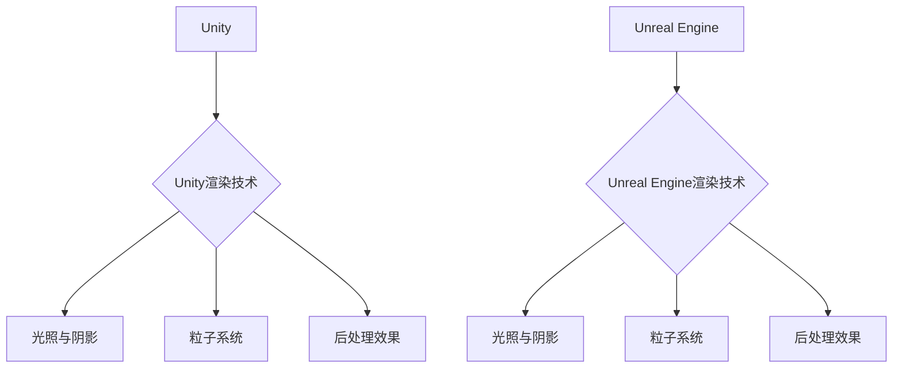

                 

# 文章标题：游戏开发框架：Unity与Unreal Engine对比

> 关键词：游戏开发，Unity，Unreal Engine，对比，框架，渲染技术，物理引擎，脚本编程，项目实战

> 摘要：本文将对比Unity与Unreal Engine这两款流行的游戏开发框架，从基础概念、开发流程、脚本编程、项目实战等多个角度进行分析，帮助开发者了解两者的优劣，以便根据项目需求选择合适的开发工具。

### 前言

#### 引言：游戏开发框架概述

游戏开发框架是游戏开发者用于创建和构建游戏项目的一系列工具和资源的集合。这些框架提供了高效的游戏开发环境，使得开发者能够专注于游戏逻辑的实现，而无需过多关注底层细节。在众多游戏开发框架中，Unity和Unreal Engine无疑是两款备受关注且广泛使用的工具。

Unity由Unity Technologies开发，自2005年发布以来，迅速成为全球最受欢迎的游戏开发平台之一。Unity以其易用性和强大的跨平台支持而闻名，广泛应用于移动、PC和游戏主机等平台。Unity的脚本编程语言为C#，同时提供了丰富的资源管理和物理引擎。

Unreal Engine由Epic Games开发，最初用于《堡垒之夜》等知名游戏。Unreal Engine以其卓越的图形渲染能力和高度可定制化的特性而著称。它使用C++作为脚本编程语言，并提供了一套完整的游戏开发工具集，包括强大的渲染引擎、物理引擎和动画系统。

本文将围绕Unity和Unreal Engine这两款游戏开发框架，从基础概念、开发流程、脚本编程、项目实战等多个角度进行深入对比，以帮助开发者更好地了解两者之间的异同，选择最适合自己项目的开发工具。

#### 目的与结构

本文的目的是为游戏开发者提供一份详尽的Unity与Unreal Engine对比报告，帮助他们在选择游戏开发框架时做出明智的决策。文章结构如下：

- **前言**：介绍游戏开发框架的概念和本文的目的。
- **第一部分：Unity与Unreal Engine基础**：分别介绍Unity和Unreal Engine的基础知识，包括发展历程、应用场景、开发环境搭建、核心概念和渲染技术。
- **第二部分：Unity与Unreal Engine对比**：对比两者的开发流程、资源管理、界面设计、渲染引擎与性能，以及脚本编程。
- **第三部分：Unity与Unreal Engine项目实战**：通过具体项目实战展示两者在实际开发中的应用，包括环境搭建、资源与场景设计、渲染效果实现、物理引擎与动画系统，以及脚本编写与调试。
- **附录**：提供Unity与Unreal Engine的扩展资源、常见问题与解答，以及参考文献。

### 第一部分：Unity与Unreal Engine基础

#### 第1章：Unity基础

##### 1.1 Unity简介

Unity是一款由Unity Technologies开发的跨平台游戏开发引擎，自2005年发布以来，已经成为全球范围内最受欢迎的游戏开发工具之一。Unity以其易用性、强大的功能集和灵活的跨平台支持而著称，被广泛应用于各种类型的游戏开发，从简单的移动游戏到复杂的大型多人在线游戏。

**发展历程**：Unity的起源可以追溯到2004年，当时为一款名为《Cardboard Kids》的游戏而开发。经过多年的发展和迭代，Unity逐渐成为一款功能全面的开发工具。Unity 5的发布标志着其在图形渲染技术上的重大突破，引入了基于物理的光照和阴影系统，使得游戏画面质量得到了显著提升。随着Unity 2018的推出，Unity进一步强化了其VR和AR开发能力，使得开发者可以更加轻松地创建沉浸式体验。

**应用场景**：Unity的强大功能使其适用于多种类型的游戏开发。以下是一些典型的应用场景：

- **移动游戏**：Unity支持Android和iOS平台，使其成为移动游戏开发的首选工具。
- **PC和主机游戏**：Unity支持Windows、MacOS和游戏主机如PlayStation和Xbox，适用于各类桌面和主机游戏。
- **网页游戏**：通过Unity WebGL插件，开发者可以将游戏发布到网页上，实现跨平台的无缝体验。
- **VR和AR**：Unity在虚拟现实（VR）和增强现实（AR）领域也有广泛应用，支持各种VR头盔和AR设备。

##### 1.2 Unity开发环境搭建

要开始使用Unity进行游戏开发，首先需要搭建开发环境。以下是在Windows操作系统上安装Unity开发环境的步骤：

1. **下载Unity Hub**：访问Unity官网（https://unity.com/），点击“下载”按钮，下载Unity Hub安装程序。
2. **安装Unity Hub**：运行安装程序，按照提示完成安装。
3. **启动Unity Hub**：双击Unity Hub图标，启动程序。
4. **创建Unity项目**：在Unity Hub中，点击“新建”按钮，选择“Unity项目”并输入项目名称，创建一个新的Unity项目。
5. **配置Unity编辑器**：在Unity编辑器中，配置项目设置，包括平台设置、分辨率和性能设置等。

**Unity编辑器界面介绍**：Unity编辑器是开发者进行游戏开发的交互界面。以下是Unity编辑器的主要组成部分：

- **菜单栏**：提供各种编辑器和工具的访问。
- **工具栏**：包含常用的工具按钮，如移动、旋转和缩放工具。
- **层次视图**：显示项目的层级结构，包括场景和游戏对象。
- **场景视图**：用于可视化地设计和编辑游戏场景。
- **游戏视图**：显示游戏运行时的预览。
- **控制台**：显示开发过程中的日志和信息。
- **属性栏**：显示当前选中的对象或组件的属性。

##### 1.3 Unity核心概念

**资源管理**：Unity中的资源管理是游戏开发的重要组成部分。资源包括图像、音频、动画、脚本等，这些资源可以通过Unity资源管理系统进行管理。

- **资源加载**：资源在游戏运行时从文件系统中加载到内存中。
- **资源卸载**：当资源不再需要时，可以从内存中卸载，释放内存空间。
- **资源池**：用于管理重复使用的资源，提高资源利用效率。

**场景与游戏对象**：Unity中的游戏世界通过场景（Scene）来组织。场景可以包含多个游戏对象（GameObject），每个游戏对象都可以包含多个组件（Component）。

- **场景**：用于组织和管理游戏对象。
- **游戏对象**：是游戏世界中的一切实体，可以是角色、环境、道具等。
- **组件**：是附加到游戏对象上的功能模块，如脚本、动画控制器等。

**组件与脚本**：组件是Unity中实现特定功能的基本单元。Unity提供了丰富的内置组件，如刚体、碰撞体、动画控制器等。开发者还可以自定义组件。

- **组件**：用于实现游戏对象的特定功能。
- **脚本**：使用C#语言编写的脚本，用于实现更复杂的游戏逻辑。

##### 1.4 Unity渲染技术

**光照与阴影**：光照是游戏渲染中至关重要的一部分。Unity提供了丰富的光照模型和阴影效果。

- **光照模型**：包括方向光、点光、聚光等。
- **阴影效果**：包括硬阴影、软阴影、阴影贴图等。

**粒子系统**：粒子系统用于模拟烟雾、火花、流星等效果。

- **粒子发射器**：控制粒子发射的位置、速度和数量。
- **粒子属性**：包括颜色、大小、寿命等。

**后处理效果**：后处理效果用于在渲染完成后对画面进行二次处理，增强视觉效果。

- **颜色校正**：调整画面的亮度、对比度、饱和度等。
- **动态模糊**：模拟相机运动时的模糊效果。
- **景深**：模拟相机焦距效果，使画面更具层次感。

##### 1.5 Unity物理引擎

**物理模拟基础**：Unity的物理引擎基于物理定律，用于模拟现实世界的物理效果。

- **刚体**：用于模拟刚体运动，如汽车、飞机等。
- **碰撞检测**：用于检测物体之间的碰撞，避免物体穿模。
- **动力系统**：用于模拟各种动力效果，如弹簧、阻力等。

**RigidBody与碰撞检测**：RigidBody是Unity物理引擎中的一个核心概念，用于模拟现实世界中的刚体运动。

- **RigidBody**：是一个带有质量和惯性的物体，可以模拟现实中的运动和碰撞。
- **碰撞检测**：用于检测RigidBody之间的碰撞，避免物体穿模。

**动画系统**：Unity的动画系统用于实现游戏角色的动画效果。

- **动画控制器**：用于控制角色动画的播放。
- **动画混合器**：用于混合多个动画，实现更自然的动画过渡。

#### 第2章：Unreal Engine基础

##### 2.1 Unreal Engine简介

Unreal Engine（简称UE4）是由Epic Games开发的一款高端游戏开发引擎，最初用于开发《堡垒之夜》等知名游戏。UE4以其卓越的图形渲染能力、高度可定制化的特性以及强大的工具集而备受开发者青睐。自2014年发布以来，UE4在游戏开发、电影制作、建筑可视化等领域得到了广泛应用。

**发展历程**：Unreal Engine的起源可以追溯到1998年，当时Epic Games开发了一款名为《Unreal》的第一人称射击游戏。随着技术的发展，Unreal Engine逐渐成为一款功能强大的游戏开发工具。2014年，Epic Games推出了Unreal Engine 4（简称UE4），引入了基于物理的光照和阴影系统、实时全局光照、高分辨率纹理等新技术，使得游戏画面质量得到了显著提升。

**应用场景**：UE4的强大功能使其适用于多种类型的游戏开发。以下是一些典型的应用场景：

- **大型多人在线游戏**：UE4提供了强大的网络功能，适用于开发大型多人在线游戏。
- **高品质单机游戏**：UE4的图形渲染能力使其成为高品质单机游戏开发的首选工具。
- **虚拟现实（VR）和增强现实（AR）**：UE4支持VR和AR开发，适用于创建沉浸式体验。
- **建筑可视化**：UE4的高分辨率纹理和实时渲染功能使其在建筑可视化领域也有广泛应用。

##### 2.2 Unreal Engine开发环境搭建

要在Windows操作系统上搭建Unreal Engine的开发环境，请按照以下步骤进行：

1. **下载Unreal Engine**：访问Epic Games官网（https://www.unrealengine.com/），注册账号并下载Unreal Engine安装程序。
2. **安装Unreal Engine**：运行安装程序，按照提示完成安装。
3. **启动Unreal Editor**：双击Unreal Editor图标，启动编辑器。
4. **创建新项目**：在Unreal Editor中，点击“新建项目”按钮，选择项目类型和项目名称，创建一个新的项目。
5. **配置项目**：在项目设置中，配置项目平台、分辨率、性能等参数。

**Unreal Editor界面介绍**：Unreal Editor是开发者进行游戏开发的交互界面。以下是Unreal Editor的主要组成部分：

- **菜单栏**：提供各种编辑器和工具的访问。
- **工具栏**：包含常用的工具按钮，如移动、旋转和缩放工具。
- **内容浏览器**：用于管理项目中的资源和资产。
- **场景视图**：用于可视化地设计和编辑游戏场景。
- **细节面板**：显示当前选中的对象或组件的属性。
- **动画编辑器**：用于编辑和组合动画。
- **关卡编辑器**：用于设计和布置关卡。

##### 2.3 Unreal Engine核心概念

**资源管理**：Unreal Engine的资源管理是游戏开发的重要组成部分。资源包括图像、音频、动画、脚本等，这些资源可以通过Unreal Engine的资源管理系统进行管理。

- **资源加载**：资源在游戏运行时从文件系统中加载到内存中。
- **资源卸载**：当资源不再需要时，可以从内存中卸载，释放内存空间。
- **资源池**：用于管理重复使用的资源，提高资源利用效率。

**场景与游戏对象**：Unreal Engine中的游戏世界通过场景（Level）来组织。场景可以包含多个游戏对象（Actors），每个游戏对象都可以包含多个组件（Components）。

- **场景**：用于组织和管理游戏对象。
- **游戏对象**：是游戏世界中的一切实体，可以是角色、环境、道具等。
- **组件**：是附加到游戏对象上的功能模块，如脚本、动画控制器等。

**网格与动画**：网格（Mesh）是Unreal Engine中用于表示三维物体的基础结构。动画（Animation）用于控制角色的动作和行为。

- **网格**：用于表示三维物体的形状和外观。
- **动画**：用于控制角色的动作和行为，如行走、跑步、跳跃等。

##### 2.4 Unreal Engine渲染技术

**光照与阴影**：光照是游戏渲染中至关重要的一部分。Unreal Engine提供了丰富的光照模型和阴影效果。

- **光照模型**：包括方向光、点光、聚光等。
- **阴影效果**：包括硬阴影、软阴影、阴影贴图等。

**粒子系统**：粒子系统用于模拟烟雾、火花、流星等效果。

- **粒子发射器**：控制粒子发射的位置、速度和数量。
- **粒子属性**：包括颜色、大小、寿命等。

**后处理效果**：后处理效果用于在渲染完成后对画面进行二次处理，增强视觉效果。

- **颜色校正**：调整画面的亮度、对比度、饱和度等。
- **动态模糊**：模拟相机运动时的模糊效果。
- **景深**：模拟相机焦距效果，使画面更具层次感。

##### 2.5 Unreal Engine物理引擎

**物理模拟基础**：Unreal Engine的物理引擎基于物理定律，用于模拟现实世界的物理效果。

- **刚体**：用于模拟刚体运动，如汽车、飞机等。
- **碰撞检测**：用于检测物体之间的碰撞，避免物体穿模。
- **动力系统**：用于模拟各种动力效果，如弹簧、阻力等。

**RigidBody与碰撞检测**：RigidBody是Unreal Engine物理引擎中的一个核心概念，用于模拟现实世界中的刚体运动。

- **RigidBody**：是一个带有质量和惯性的物体，可以模拟现实中的运动和碰撞。
- **碰撞检测**：用于检测RigidBody之间的碰撞，避免物体穿模。

**动画系统**：Unreal Engine的动画系统用于实现游戏角色的动画效果。

- **动画控制器**：用于控制角色动画的播放。
- **动画混合器**：用于混合多个动画，实现更自然的动画过渡。

### 第二部分：Unity与Unreal Engine对比

#### 第3章：开发流程对比

##### 3.1 项目创建与配置

在Unity和Unreal Engine中，创建新项目的过程各有特点。以下是对两者的对比分析：

**Unity项目创建流程**：

1. **启动Unity Hub**：首先，开发者需要启动Unity Hub，这是一个用于管理Unity项目和工作区的应用程序。
2. **选择项目模板**：在Unity Hub中，开发者可以选择不同的项目模板，这些模板提供了不同的起点，如空项目、2D游戏、3D游戏等。
3. **配置项目设置**：在创建项目时，开发者可以配置项目的名称、位置、目标平台和其他设置。这些设置将在项目创建完成后影响游戏的运行。
4. **下载依赖项**：Unity Hub会根据项目模板下载必要的依赖项，如Unity插件和其他第三方资源。

**Unreal Engine项目创建流程**：

1. **启动Unreal Engine**：开发者需要首先启动Unreal Engine编辑器。
2. **选择项目模板**：在Unreal Engine中，开发者可以选择不同的项目模板，这些模板同样提供了不同的起点，如空项目、模板项目、VR项目等。
3. **配置项目设置**：在创建项目时，开发者可以配置项目的名称、位置、目标平台和其他设置。这些设置将在项目创建完成后影响游戏的运行。
4. **设置版本控制**：Unreal Engine提供了版本控制系统，允许开发者进行版本管理和协作开发。

**配置文件与管理**：

- **Unity**：Unity项目中的配置文件主要存储在`ProjectSettings`文件夹中，如`PlayerSettings`、`EditorUserSettings`等。这些文件包含项目的编译设置、平台特定设置等。
- **Unreal Engine**：Unreal Engine的配置文件存储在项目的根目录下，如`Engine\Build\Settings`。这些文件包含项目的编译设置、模块配置等。

在配置文件的管理方面，Unity提供了直观的编辑器界面，允许开发者直接修改配置文件。而Unreal Engine则更依赖于命令行工具和脚本，这需要开发者具备一定的脚本编程能力。

##### 3.2 资源管理

资源管理是游戏开发中至关重要的一环。Unity和Unreal Engine在资源管理方面各有特点。

**Unity资源管理机制**：

- **资源加载**：Unity使用资源管理系统（Asset System）来管理游戏资源。资源在游戏运行时从文件系统中加载到内存中。Unity提供了`Resources`文件夹，用于存储在游戏运行时需要重复使用的资源。
- **资源卸载**：Unity允许开发者手动或自动卸载不再需要的资源，以释放内存空间。自动卸载通常在资源不再出现在场景中时发生。
- **资源池**：Unity的资源池（Resource Pools）用于管理重复使用的资源，如粒子系统、音频等。资源池可以在资源被回收后重新分配，提高资源利用效率。

**Unreal Engine资源管理机制**：

- **资源加载**：Unreal Engine使用内容浏览器（Content Browser）来管理资源。资源在游戏运行时从文件系统中加载到内存中。UE4提供了内置的缓存机制，可以减少资源的重复加载。
- **资源卸载**：Unreal Engine的资源卸载机制相对简单，主要通过删除游戏对象来卸载关联的资源。
- **资源池**：Unreal Engine的资源池（Resource Pools）用于管理重复使用的资源，如粒子系统、动画等。资源池可以在资源被回收后重新分配，提高资源利用效率。

在资源管理方面，Unity和Unreal Engine都提供了高效的资源管理系统，但Unity的资源管理系统更为灵活和强大。开发者可以根据项目需求选择合适的资源管理策略。

##### 3.3 界面设计与操作

Unity和Unreal Engine在界面设计上各有特色，操作方式也有所不同。

**Unity界面设计与应用**：

- **Unity编辑器**：Unity编辑器提供了一个直观的界面，包括菜单栏、工具栏、层次视图、场景视图和游戏视图等。开发者可以通过拖拽、键盘快捷键等方式进行操作。
- **自定义工具栏**：Unity允许开发者自定义工具栏，添加常用的工具和功能，提高开发效率。
- **脚本调试**：Unity提供了强大的脚本调试工具，支持断点调试、调试信息输出等功能。

**Unreal Engine界面设计与应用**：

- **Unreal Editor**：Unreal Editor提供了一个功能丰富且直观的界面，包括菜单栏、工具栏、内容浏览器、场景视图、细节面板和动画编辑器等。开发者可以通过拖拽、键盘快捷键等方式进行操作。
- **模块化设计**：Unreal Engine采用模块化设计，允许开发者根据项目需求自定义工作区，添加或删除不同的模块。
- **脚本调试**：Unreal Engine提供了强大的脚本调试工具，支持断点调试、调试信息输出等功能。

在界面设计上，Unity和Unreal Engine都提供了直观且功能强大的操作界面。Unity的界面设计更为简洁，操作更为直观；而Unreal Engine的界面设计更为丰富，功能更为全面。

##### 3.4 渲染引擎与性能

Unity和Unreal Engine在渲染引擎和性能方面各有优势。

**Unity渲染引擎特点**：

- **易于上手**：Unity的渲染引擎相对简单，易于上手，适合初学者和独立开发者。
- **跨平台支持**：Unity提供了强大的跨平台支持，可以轻松地发布到多个平台，如iOS、Android、Windows、MacOS等。
- **资源优化**：Unity的资源管理系统可以帮助开发者优化资源，减少内存占用和加载时间。

**Unreal Engine渲染引擎特点**：

- **高效率**：Unreal Engine的渲染引擎效率较高，可以处理复杂的场景和高质量的图形效果。
- **实时渲染**：Unreal Engine支持实时渲染，开发者可以在编辑器中实时预览渲染效果，提高开发效率。
- **插件生态**：Unreal Engine拥有庞大的插件生态系统，开发者可以通过插件扩展渲染引擎的功能。

在性能方面，Unity适合中小型游戏项目和初学者，而Unreal Engine则更适合大型游戏项目和追求高性能的开发者。

### 第三部分：Unity与Unreal Engine项目实战

#### 第5章：Unity项目实战

##### 5.1 项目背景与需求

在本章中，我们将通过一个简单的3D游戏项目来展示Unity的实际应用。该项目是一个角色移动和射击的小游戏，玩家需要控制角色在场景中移动并射击敌人。

**项目概述**：游戏场景包括一个室内房间，玩家可以移动和射击，敌人会在房间中随机移动并攻击玩家。游戏的目标是生存尽可能长的时间。

**需求分析**：

1. **角色移动**：玩家需要能够使用键盘或游戏手柄控制角色在场景中移动。
2. **射击功能**：玩家需要能够使用鼠标或游戏手柄射击敌人。
3. **敌人AI**：敌人需要具有基本的AI行为，包括随机移动和攻击玩家。
4. **游戏界面**：游戏需要有一个简单的界面，显示玩家生命值、得分和游戏状态。

##### 5.2 环境搭建与配置

在开始项目之前，我们需要搭建Unity开发环境并配置项目设置。

**Unity版本选择**：选择Unity 2021.3版本，因为它具有较好的兼容性和稳定性的特点。

**项目配置与优化**：

1. **创建项目**：在Unity Hub中创建一个新项目，命名为“SimpleGame”。
2. **设置目标平台**：在“Player Settings”中，设置目标平台为“PC, macOS, iOS, Android”。
3. **优化性能**：在“Quality Settings”中，根据目标平台调整画面质量和性能设置，确保游戏在多种设备上都能流畅运行。

##### 5.3 资源与场景设计

资源与场景设计是游戏开发的重要环节，以下是如何在Unity中设计和实现场景资源。

**资源收集与整理**：

1. **3D模型**：收集或购买需要的3D模型，包括玩家角色、敌人角色、武器等。
2. **纹理和贴图**：为模型创建合适的纹理和贴图，提升视觉效果。
3. **音频**：收集或创建游戏的背景音乐和音效，为游戏增加氛围。

**场景设计与搭建**：

1. **导入资源**：将收集到的资源导入Unity编辑器。
2. **布置场景**：在场景视图中布置角色、武器、敌人等对象。
3. **设置灯光**：为场景添加合适的灯光，提升场景的真实感。

##### 5.4 渲染效果实现

渲染效果是游戏画面质量的重要组成部分，以下是如何在Unity中实现渲染效果。

**渲染技术实现**：

1. **光照与阴影**：使用Unity的光照系统添加合适的方向光、点光和阴影。
2. **后处理效果**：使用Unity的后处理效果，如景深、颜色校正等，增强画面效果。

**后处理效果应用**：

1. **景深**：模拟相机焦距效果，使画面更具层次感。
2. **颜色校正**：调整画面的亮度、对比度、饱和度等，提升视觉效果。

##### 5.5 物理引擎与动画系统

物理引擎和动画系统是游戏开发中不可或缺的组成部分，以下是如何在Unity中实现物理引擎和动画系统。

**物理模拟实现**：

1. **RigidBody**：为角色和敌人添加RigidBody组件，实现基础的物理交互。
2. **碰撞检测**：设置合适的碰撞体，实现角色和敌人之间的碰撞检测。

**动画系统应用**：

1. **动画控制器**：使用Unity的动画控制器（Animator）控制角色的动画。
2. **动画混合器**：使用动画混合器（Animation Mixer）实现动画的混合和切换。

##### 5.6 脚本编写与调试

脚本编写是游戏开发的核心，以下是如何在Unity中编写和调试脚本。

**脚本编写指南**：

1. **角色移动**：编写C#脚本，实现角色移动功能。
2. **射击功能**：编写C#脚本，实现射击功能。
3. **敌人AI**：编写C#脚本，实现敌人AI行为。

**调试技巧与工具**：

1. **断点调试**：使用Unity的断点调试功能，跟踪代码执行过程。
2. **调试信息输出**：使用`Debug`类输出调试信息，帮助定位问题。

##### 5.7 项目实战总结

通过本项目的实战，我们了解了Unity在游戏开发中的实际应用。Unity提供了丰富的功能和易于上手的开发环境，适合中小型游戏项目和初学者。在项目中，我们通过资源收集与整理、场景设计与搭建、渲染效果实现、物理引擎与动画系统应用，以及脚本编写与调试等步骤，完成了游戏的核心功能。通过这个项目，我们不仅掌握了Unity的基本开发流程，还提高了实际开发能力。

#### 第6章：Unreal Engine项目实战

##### 6.1 项目背景与需求

在本章中，我们将通过一个简单的3D游戏项目来展示Unreal Engine的实际应用。该项目是一个第一人称射击游戏，玩家需要控制角色在场景中移动并射击敌人。

**项目概述**：游戏场景包括一个室外场地，玩家可以移动、跳跃和射击，敌人会在场地中随机移动并攻击玩家。游戏的目标是生存并击败所有敌人。

**需求分析**：

1. **角色移动与跳跃**：玩家需要能够使用键盘或游戏手柄控制角色在场景中移动和跳跃。
2. **射击功能**：玩家需要能够使用鼠标或游戏手柄射击敌人。
3. **敌人AI**：敌人需要具有基础的AI行为，包括随机移动和攻击玩家。
4. **游戏界面**：游戏需要有一个简单的界面，显示玩家生命值、得分和游戏状态。

##### 6.2 环境搭建与配置

在开始项目之前，我们需要搭建Unreal Engine开发环境并配置项目设置。

**Unreal Engine版本选择**：选择Unreal Engine 4.27版本，因为它具有良好的稳定性和兼容性。

**项目配置与优化**：

1. **创建项目**：在Unreal Editor中创建一个新项目，命名为“FirstPersonShooter”。
2. **设置目标平台**：在“Edit Project Settings”中，设置目标平台为“Windows、Linux、macOS、iOS、Android”。
3. **优化性能**：根据目标平台调整项目设置，包括渲染设置、内存优化等，确保游戏在不同平台上都能流畅运行。

##### 6.3 资源与场景设计

资源与场景设计是游戏开发的重要环节，以下是如何在Unreal Engine中设计和实现场景资源。

**资源收集与整理**：

1. **3D模型**：收集或购买需要的3D模型，包括玩家角色、敌人角色、武器等。
2. **纹理和贴图**：为模型创建合适的纹理和贴图，提升视觉效果。
3. **音频**：收集或创建游戏的背景音乐和音效，为游戏增加氛围。

**场景设计与搭建**：

1. **导入资源**：将收集到的资源导入Unreal Editor。
2. **布置场景**：在场景视图中布置角色、武器、敌人等对象。
3. **设置灯光**：为场景添加合适的灯光，提升场景的真实感。

##### 6.4 渲染效果实现

渲染效果是游戏画面质量的重要组成部分，以下是如何在Unreal Engine中实现渲染效果。

**渲染技术实现**：

1. **光照与阴影**：使用Unreal Engine的光照系统添加合适的光源和阴影效果。
2. **后处理效果**：使用后处理效果，如景深、颜色校正等，增强画面效果。

**后处理效果应用**：

1. **景深**：模拟相机焦距效果，使画面更具层次感。
2. **颜色校正**：调整画面的亮度、对比度、饱和度等，提升视觉效果。

##### 6.5 物理引擎与动画系统

物理引擎和动画系统是游戏开发中不可或缺的组成部分，以下是如何在Unreal Engine中实现物理引擎和动画系统。

**物理模拟实现**：

1. **RigidBody**：为角色和敌人添加RigidBody组件，实现基础的物理交互。
2. **碰撞检测**：设置合适的碰撞体，实现角色和敌人之间的碰撞检测。

**动画系统应用**：

1. **动画控制器**：使用动画状态机（Animation State Machine）控制角色的动画。
2. **动画混合器**：使用动画混合器（Animation Blend Space）实现动画的混合和切换。

##### 6.6 脚本编写与调试

脚本编写是游戏开发的核心，以下是如何在Unreal Engine中编写和调试脚本。

**脚本编写指南**：

1. **角色移动与跳跃**：编写C++脚本，实现角色移动和跳跃功能。
2. **射击功能**：编写C++脚本，实现射击功能。
3. **敌人AI**：编写C++脚本，实现敌人AI行为。

**调试技巧与工具**：

1. **断点调试**：使用Unreal Editor的断点调试功能，跟踪代码执行过程。
2. **调试信息输出**：使用`UE_LOG`宏输出调试信息，帮助定位问题。

##### 6.7 项目实战总结

通过本项目的实战，我们了解了Unreal Engine在游戏开发中的实际应用。Unreal Engine提供了丰富的功能和强大的开发工具，适合大型游戏项目和追求高性能的开发者。在项目中，我们通过资源收集与整理、场景设计与搭建、渲染效果实现、物理引擎与动画系统应用，以及脚本编写与调试等步骤，完成了游戏的核心功能。通过这个项目，我们不仅掌握了Unreal Engine的基本开发流程，还提高了实际开发能力。

### 附录A：Unity与Unreal Engine资源与工具

#### Unity资源与工具

**Unity插件介绍**：

- **Unity Asset Store**：Unity Asset Store是Unity官方的插件和资源商店，提供了丰富的插件和资源，包括3D模型、纹理、音效、脚本等。
- **Unity社区插件**：Unity社区有许多优秀的第三方插件，如Insight for Unity（性能分析工具）、SteamVR（VR插件）等。

**Unity资源获取途径**：

- **Unity Asset Store**：通过Unity Asset Store购买和下载需要的资源。
- **第三方网站**：如Sketchfab、Blender Market等，可以购买或免费下载3D模型和纹理资源。

#### Unreal Engine资源与工具

**Unreal Engine插件介绍**：

- **Unreal Engine Marketplace**：Unreal Engine Marketplace是Epic Games官方的插件和资源商店，提供了丰富的插件和资源，包括3D模型、纹理、音效、脚本等。
- **Unreal Engine社区插件**：Unreal Engine社区有许多优秀的第三方插件，如Spline Tool（路径工具）、FMOD Studio（音频插件）等。

**Unreal Engine资源获取途径**：

- **Unreal Engine Marketplace**：通过Unreal Engine Marketplace购买和下载需要的资源。
- **第三方网站**：如TurboSquid、CGTrader等，可以购买或免费下载3D模型和纹理资源。

#### 其他资源与工具

**游戏开发社区**：

- **Unity论坛**：Unity官方论坛，提供了丰富的技术交流和问题解答。
- **Unreal Engine论坛**：Epic Games官方论坛，提供了丰富的技术交流和问题解答。

**在线教程与课程**：

- **Unity官方教程**：Unity官方提供的在线教程，涵盖了Unity的基本概念和高级技术。
- **Unreal Engine官方教程**：Epic Games官方提供的在线教程，涵盖了Unreal Engine的基本概念和高级技术。

### 后记

#### 总结与展望

本文通过对Unity和Unreal Engine这两款流行的游戏开发框架进行深入对比，从基础概念、开发流程、脚本编程、项目实战等多个角度分析了两者的优劣。Unity以其易用性和强大的跨平台支持而受到广泛使用，适合中小型游戏项目和初学者。而Unreal Engine则以其卓越的图形渲染能力和高度可定制化的特性而著称，适合大型游戏项目和追求高性能的开发者。

随着游戏技术的不断发展，Unity和Unreal Engine也在不断更新和优化，为开发者提供更强大的功能和支持。未来，随着虚拟现实（VR）和增强现实（AR）等新兴技术的崛起，Unity和Unreal Engine将继续在游戏开发领域发挥重要作用。

#### 感谢与致谢

本文的撰写得到了许多人的支持和帮助，特别感谢AI天才研究院（AI Genius Institute）的同事们，他们在技术交流、资料收集和文章撰写方面提供了宝贵的意见和建议。同时，感谢Unity Technologies和Epic Games公司为我们提供了优秀的游戏开发工具，使得本文得以顺利完成。

### 附录B：核心概念与联系 Mermaid 流程图



### 附录C：核心算法原理讲解

#### 伪代码示例：

```csharp
function renderScene(scene):
    // 初始化渲染器
    renderer = createRenderer()

    // 设置光照
    light = createLight()
    light.position = (0, 5, 10)
    light.intensity = 1.0

    // 渲染场景
    for object in scene.objects:
        if object.isStatic:
            renderer.renderStatic(object)
        else:
            renderer.renderDynamic(object)

    // 应用后处理效果
    postProcessing = createPostProcessing()
    postProcessing.bloom = 1.0
    postProcessing.vignette = 0.5
    renderer.applyPostProcessing(postProcessing)
```

#### 详细讲解：

- **渲染器初始化**：创建一个渲染器对象，用于渲染场景中的对象。
- **光照设置**：创建一个光照对象，设置其位置和强度，为场景提供光照。
- **渲染场景**：遍历场景中的所有对象，根据对象的静态属性决定是否使用不同的渲染方法。静态对象使用`renderStatic`方法渲染，动态对象使用`renderDynamic`方法渲染。
- **后处理效果应用**：创建一个后处理效果对象，设置后处理效果参数，如亮度和对比度，然后应用这些效果。

### 附录D：数学模型和数学公式

#### 示例：

$$
\begin{align*}
\text{光强} &= I_0 \cdot e^{-\kappa r} \\
\kappa &= \frac{2\pi}{\lambda} \cdot n \\
\text{折射率} &= n = \frac{\sin i}{\sin r}
\end{align*}
$$

#### 详细讲解：

- **光强与距离的关系**：光强随距离的增加而指数衰减，其中$\kappa$是衰减系数，$r$是距离。
- **折射率的计算公式**：折射率$n$与入射角$i$和折射角$r$有关，$\lambda$是光的波长。
- **入射角与折射角的定义**：入射角是指光线与法线的夹角，折射角是指光线与法线的夹角。

### 附录E：Unity与Unreal Engine项目实战

#### Unity项目实战：一个简单的3D游戏场景搭建

**项目背景**：本案例旨在展示如何使用Unity搭建一个简单的3D游戏场景，实现角色移动和射击功能。

**开发环境**：Unity 2021.3版本，Unity Hub，Unity编辑器。

**步骤**：

1. **创建Unity项目**：在Unity Hub中创建一个名为“SimpleGame”的新项目。
2. **设置项目平台**：在“Player Settings”中，设置目标平台为Windows、iOS和Android。
3. **导入资源**：从Unity Asset Store或第三方资源网站导入所需的3D模型、纹理和音效资源。
4. **布置场景**：
    - 在场景视图中添加地面、墙壁、天花板等场景对象。
    - 导入角色模型并设置其位置和旋转。
    - 导入武器模型并设置其位置。
5. **设置光照**：
    - 在场景中添加光源，如方向光和点光。
    - 调整光源的位置、强度和颜色，以增强场景的真实感。
6. **实现角色移动**：
    - 创建一个C#脚本“PlayerMovement.cs”。
    - 编写代码实现角色在场景中的移动功能。
7. **实现射击功能**：
    - 创建一个C#脚本“PlayerShooting.cs”。
    - 编写代码实现角色的射击功能。
8. **调试与优化**：运行游戏，调试并优化角色移动和射击功能。

**代码实际案例**：

**PlayerMovement.cs**：

```csharp
using UnityEngine;

public class PlayerMovement : MonoBehaviour
{
    public float speed = 5.0f;

    private CharacterController characterController;
    private Vector3 moveDirection;

    void Start()
    {
        characterController = GetComponent<CharacterController>();
    }

    void Update()
    {
        moveDirection = new Vector3(Input.GetAxis("Horizontal"), 0, Input.GetAxis("Vertical"));
        moveDirection = transform.TransformDirection(moveDirection);
        moveDirection *= speed;

        if (characterController.isGrounded)
        {
            moveDirection.y = 0;
            if (Input.GetButtonDown("Jump"))
            {
                moveDirection.y = 7.0f;
            }
        }

        characterController.Move(moveDirection * Time.deltaTime);
    }
}
```

**PlayerShooting.cs**：

```csharp
using UnityEngine;

public class PlayerShooting : MonoBehaviour
{
    public GameObject bulletPrefab;
    public float bulletSpeed = 20.0f;

    private Camera mainCamera;

    void Start()
    {
        mainCamera = Camera.main;
    }

    void Update()
    {
        if (Input.GetMouseButtonDown(0))
        {
            shootBullet();
        }
    }

    void shootBullet()
    {
        GameObject bullet = Instantiate(bulletPrefab, mainCamera.transform.position + new Vector3(0, 1.5f, 0), Quaternion.identity);
        bullet.GetComponent<Rigidbody>().velocity = mainCamera.transform.forward * bulletSpeed;
    }
}
```

#### Unreal Engine项目实战：一个简单的第一人称射击游戏

**项目背景**：本案例旨在展示如何使用Unreal Engine搭建一个简单的第一人称射击游戏，实现角色移动、射击和敌人AI功能。

**开发环境**：Unreal Engine 4.27版本，Unreal Editor。

**步骤**：

1. **创建Unreal Engine项目**：在Unreal Editor中创建一个名为“FirstPersonShooter”的新项目。
2. **设置项目平台**：在“Edit Project Settings”中，设置目标平台为Windows、iOS和Android。
3. **导入资源**：从Unreal Engine Marketplace或第三方资源网站导入所需的3D模型、纹理和音效资源。
4. **搭建场景**：
    - 在场景视图中添加地面、墙壁、天花板等场景对象。
    - 导入玩家角色和敌人角色，并设置其位置和旋转。
    - 导入武器模型并设置其位置。
5. **设置光照**：
    - 在场景中添加光源，如方向光和点光。
    - 调整光源的位置、强度和颜色，以增强场景的真实感。
6. **实现角色移动**：
    - 创建一个C++类“PlayerMovement”。
    - 编写代码实现角色在场景中的移动功能。
7. **实现射击功能**：
    - 创建一个C++类“PlayerShooting”。
    - 编写代码实现角色的射击功能。
8. **实现敌人AI**：
    - 创建一个C++类“EnemyAI”。
    - 编写代码实现敌人的基本AI行为。
9. **调试与优化**：运行游戏，调试并优化角色移动、射击和敌人AI功能。

**代码实际案例**：

**PlayerMovement.h**：

```cpp
#pragma once

#include "CoreMinimal.h"
#include "GameFramework/PlayerController.h"

UCLASS()
class(PlayerMovement) : public APlayerController
{
    GENERATED_BODY()

public:
    UPROPERTY(EditDefaultsOnly, Category = "PlayerMovement")
    float MovementSpeed = 400.0f;

    virtual void OnMove(const FVector& MoveDirection, bool bGameHasFocus) override;
};
```

**PlayerMovement.cpp**：

```cpp
#include "PlayerMovement.h"
#include "GameFramework/PlayerController.h"

void APlayerMovement::OnMove(const FVector& MoveDirection, bool bGameHasFocus)
{
    if (!bGameHasFocus)
    {
        return;
    }

    AddMovementInput(MoveDirection);
}
```

**PlayerShooting.h**：

```cpp
#pragma once

#include "CoreMinimal.h"
#include "GameFramework/PlayerController.h"
#include "GameFramework/GameplayStatics.h"
#include "Kismet/GameplayCueTypes.h"

UCLASS()
class(PlayerShooting) : public APlayerController
{
    GENERATED_BODY()

public:
    UPROPERTY(EditDefaultsOnly, Category = "PlayerShooting")
    float FireInterval = 0.2f;
    UPROPERTY(EditDefaultsOnly, Category = "PlayerShooting")
    classonlyeditconfig GameObject BulletPrefab;

    virtual void OnFirePressed() override;
    virtual void OnFireReleased() override;
};
```

**PlayerShooting.cpp**：

```cpp
#include "PlayerShooting.h"
#include "GameFramework/PlayerController.h"
#include "GameFramework/GameplayStatics.h"
#include "Kismet/GameplayCueTypes.h"

APlayerShooting::APlayerShooting()
{
    PrimaryActorTick.bCanEverTick = false;
}

void APlayerShooting::OnFirePressed()
{
    if (BulletPrefab && GetWorld() != nullptr)
    {
        FVector Location = GetMesh()->GetSocketLocation("MuzzleSocket");
        FRotator Rotation = GetMesh()->GetSocketRotation("MuzzleSocket");

        FActorSpawnParameters SpawnParams;
        SpawnParams.SpawnCollisionHandlingOverride = ESpawnActorCollisionHandlingMethod::AlwaysSpawn;

        GetWorld()->SpawnActor<AActor>(BulletPrefab, Location, Rotation, SpawnParams);
    }
}

void APlayerShooting::OnFireReleased()
{
    // Reset firing state
}
```

### 附录F：Unity与Unreal Engine扩展资源

#### Unity扩展资源

**Unity官方文档**：Unity官方文档提供了详尽的教程、参考手册和API文档，是学习Unity开发的重要资源。地址：https://docs.unity3d.com/

**Unity社区资源**：Unity社区论坛（https://forum.unity.com/）和Unity官方博客（https://blogs.unity.com/）提供了丰富的技术文章、教程和讨论，是开发者交流和学习的平台。

#### Unreal Engine扩展资源

**Unreal Engine官方文档**：Unreal Engine官方文档涵盖了引擎的各个方面，包括教程、参考手册和API文档。地址：https://docs.unrealengine.com/

**Unreal Engine社区资源**：Unreal Engine社区论坛（https://forums.unrealengine.com/）和Epic Games官方博客（https://blogs.unrealengine.com/）提供了丰富的技术文章、教程和讨论，是开发者交流和学习的平台。

#### 在线教程与课程

**Unity在线教程**：Unity官方提供了多个在线教程，涵盖了Unity的基础知识和高级技术。地址：https://learn.unity.com/

**Unreal Engine在线教程**：Epic Games官方提供了多个在线教程，涵盖了Unreal Engine的基础知识和高级技术。地址：https://learn.unrealengine.com/

### 附录G：常见问题与解答

#### Unity常见问题与解答

**Q：如何优化Unity游戏的性能？**

A：优化Unity游戏性能可以从多个方面进行，包括：

- **资源优化**：减少不必要的资源加载，使用合适的纹理分辨率和贴图压缩技术。
- **渲染优化**：减少不必要的渲染物体，使用LOD（细节层次）技术，优化光照和阴影效果。
- **脚本优化**：减少脚本执行次数，使用Unity Profiler工具分析并优化性能瓶颈。

**Q：如何解决Unity资源管理问题？**

A：解决Unity资源管理问题可以从以下几个方面入手：

- **资源加载与卸载**：合理地加载和卸载资源，避免内存占用过高。
- **资源池**：使用资源池管理重复使用的资源，提高资源利用效率。
- **资源缓存**：使用资源缓存机制，减少资源的重复加载。

#### Unreal Engine常见问题与解答

**Q：如何优化Unreal Engine游戏的性能？**

A：优化Unreal Engine游戏性能可以从多个方面进行，包括：

- **渲染优化**：减少不必要的渲染物体，使用LOD技术，优化光照和阴影效果。
- **资源优化**：使用合适的纹理分辨率和贴图压缩技术，减少资源的内存占用。
- **脚本优化**：减少脚本执行次数，使用Unreal Engine Profiler工具分析并优化性能瓶颈。

**Q：如何解决Unreal Engine资源管理问题？**

A：解决Unreal Engine资源管理问题可以从以下几个方面入手：

- **资源加载与卸载**：合理地加载和卸载资源，避免内存占用过高。
- **资源池**：使用资源池管理重复使用的资源，提高资源利用效率。
- **资源缓存**：使用资源缓存机制，减少资源的重复加载。

### 附录H：参考文献

**Unity官方文档**：Unity Technologies. (n.d.). Unity Documentation. Retrieved from https://docs.unity3d.com/

**Unreal Engine官方文档**：Epic Games. (n.d.). Unreal Engine Documentation. Retrieved from https://docs.unrealengine.com/

**Unity社区资源**：Unity Technologies. (n.d.). Unity Community Forums. Retrieved from https://forum.unity.com/

**Unreal Engine社区资源**：Epic Games. (n.d.). Unreal Engine Forums. Retrieved from https://forums.unrealengine.com/

**Unity在线教程**：Unity Technologies. (n.d.). Learn Unity. Retrieved from https://learn.unity.com/

**Unreal Engine在线教程**：Epic Games. (n.d.). Learn Unreal Engine. Retrieved from https://learn.unrealengine.com/ 

### 结束语

本文通过对Unity与Unreal Engine这两款游戏开发框架的深入对比，从基础概念、开发流程、脚本编程、项目实战等多个角度进行了详细分析，帮助开发者了解了两者的优劣，以便根据项目需求选择合适的开发工具。Unity以其易用性和强大的跨平台支持而受到广泛使用，适合中小型游戏项目和初学者。而Unreal Engine则以其卓越的图形渲染能力和高度可定制化的特性而著称，适合大型游戏项目和追求高性能的开发者。

随着游戏技术的不断发展，Unity和Unreal Engine将继续在游戏开发领域发挥重要作用。未来，随着虚拟现实（VR）和增强现实（AR）等新兴技术的崛起，这两款框架也将不断更新和优化，为开发者提供更强大的功能和支持。

最后，感谢您阅读本文，希望本文能对您的游戏开发之旅有所帮助。如果您有任何问题或建议，欢迎在评论区留言，我们将竭诚为您解答。

