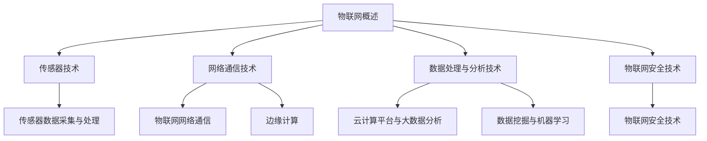

                 

# 物联网技术：从传感器到云端的数据流

## 关键词
物联网（IoT）、传感器技术、数据采集与处理、网络通信、边缘计算、云计算、大数据分析、数据挖掘、机器学习、智能家居、智慧城市。

## 摘要
物联网技术正日益融入我们的生活和工作，成为现代科技发展的热点。本文将从传感器技术、数据采集与处理、网络通信、边缘计算、云计算、大数据分析、数据挖掘、机器学习等方面，全面探讨物联网技术从传感器到云端的数据流，以及其应用案例和实践。通过本文的阅读，读者将深入理解物联网技术的核心原理和实际应用。

### 第一部分：物联网技术基础

#### 第1章：物联网概述

物联网（Internet of Things，简称IoT）是指通过互联网将各种物体连接起来，实现信息交换和智能控制的一种网络。本章将介绍物联网的定义、发展历程、核心技术，以及物联网在不同领域的应用。

**1.1 物联网的定义与发展**

物联网是一种通过网络连接各种物体，使其能够进行信息交换和交互的技术。它起源于20世纪80年代，随着互联网和通信技术的发展，物联网的概念逐渐成熟并得到了广泛的应用。

**1.2 物联网的核心技术**

物联网的核心技术包括传感器技术、网络通信技术、数据处理与分析技术、物联网安全技术等。这些技术共同构成了物联网的完整体系。

**1.3 物联网的应用领域**

物联网的应用领域非常广泛，包括工业物联网、智能家居、智慧城市、健康医疗等。每个领域都有其独特的应用场景和挑战。

**1.4 物联网的系统架构**

物联网的系统架构可以分为感知层、网络层、平台层和应用层。每个层次都有其特定的功能和技术。

**1.5 物联网的安全挑战与解决方案**

物联网的安全问题日益突出，本章将介绍物联网的安全挑战，并探讨相应的解决方案。

#### 第2章：物联网核心技术

本章将深入探讨物联网的核心技术，包括传感器技术、网络通信技术、数据处理与分析技术、物联网安全技术。

**2.1 传感器技术**

传感器技术是物联网的基础，本章将介绍传感器的分类、原理、数据采集与处理方法，以及传感器技术的发展趋势。

**2.2 网络通信技术**

网络通信技术是物联网的中枢神经，本章将介绍无线通信技术、网络协议栈、物联网网络拓扑结构，以及网络优化与性能提升的方法。

**2.3 数据处理与分析技术**

数据处理与分析技术是物联网的核心，本章将介绍数据清洗与预处理、数据存储与数据库技术、数据挖掘与机器学习技术。

**2.4 物联网安全技术**

物联网安全技术是保障物联网系统安全的关键，本章将介绍物联网安全概述、安全通信技术、防火墙与入侵检测系统等。

### 第二部分：从传感器到云端的数据流

#### 第3章：传感器数据采集与处理

本章将介绍传感器数据采集与处理的方法和流程，包括数据采集原理、数据采集系统设计、数据采集案例分析，以及数据预处理流程、数据过滤与降噪、数据融合与多维数据分析。

**3.1 传感器数据采集**

传感器数据采集是物联网数据流的起点，本章将介绍传感器数据采集的原理、系统设计和案例分析。

**3.2 传感器数据处理**

传感器数据处理是物联网数据流的核心，本章将介绍数据预处理流程、数据过滤与降噪、数据融合与多维数据分析的方法。

#### 第4章：网络通信与边缘计算

本章将探讨物联网网络通信与边缘计算的相关技术，包括物联网网络通信、边缘计算的概念与架构、边缘计算的应用场景，以及边缘计算与云计算的融合。

**4.1 物联网网络通信**

物联网网络通信是物联网数据流的中枢，本章将介绍物联网网络通信协议选择、协议栈、网络优化与性能提升的方法。

**4.2 边缘计算**

边缘计算是物联网数据流的新兴技术，本章将介绍边缘计算的概念与架构、应用场景，以及边缘计算与云计算的融合。

**4.3 网络通信与边缘计算的融合**

本章将探讨网络通信与边缘计算的融合，包括融合架构、融合技术的实现，以及融合的优势与挑战。

#### 第5章：云计算平台与大数据分析

本章将介绍云计算平台与大数据分析技术，包括云计算平台概述、大数据分析技术、数据挖掘与机器学习技术。

**5.1 云计算平台概述**

云计算平台是物联网数据流的重要基础设施，本章将介绍云计算的基本概念、服务模型、优势与挑战。

**5.2 大数据分析技术**

大数据分析技术是物联网数据流的利器，本章将介绍大数据的基本概念、数据仓库与数据湖、大数据存储与处理框架。

**5.3 数据挖掘与机器学习**

数据挖掘与机器学习技术是物联网数据流的高级应用，本章将介绍数据挖掘技术、机器学习算法、物联网数据的机器学习应用。

#### 第6章：物联网应用案例与实践

本章将通过智能家居系统和智慧城市项目，介绍物联网技术的实际应用案例和实践。

**6.1 智能家居系统设计与实现**

智能家居系统是物联网技术应用的重要领域，本章将介绍智能家居系统架构、设备接入与通信、系统安全与隐私保护。

**6.2 智慧城市项目规划与实施**

智慧城市是物联网技术的综合应用，本章将介绍智慧城市的发展目标与挑战、关键技术、案例解析。

### 第三部分：物联网的未来发展趋势与挑战

#### 第7章：物联网的未来发展趋势与挑战

本章将探讨物联网的未来发展趋势、新兴技术的融合应用，以及物联网面临的挑战和解决方案。

**7.1 物联网的未来发展趋势**

物联网的未来发展趋势包括产业生态的完善、新兴技术的融合应用，以及物联网在社会各个领域的深入应用。

**7.2 物联网的挑战与解决方案**

物联网面临的挑战包括标准化与兼容性问题、数据隐私与安全挑战、网络能耗与维护问题，本章将介绍相应的解决方案。

### 附录与参考文献

本章提供物联网相关的工具与资源，包括传感器选型与采购指南、常见物联网通信协议、云计算平台使用指南、物联网安全防护工具，以及参考文献列表。

#### 附录A：物联网相关工具与资源

**A.1 传感器选型与采购指南**

**A.2 常见物联网通信协议**

**A.3 云计算平台使用指南**

**A.4 物联网安全防护工具**

#### 附录B：参考文献

**B.1 物联网相关书籍**

**B.2 物联网研究论文**

**B.3 物联网行业报告**

**B.4 国际物联网标准规范**

### 核心概念与联系 Mermaid 流程图



### 核心算法原理讲解与伪代码

#### 传感器数据处理算法原理

传感器数据处理通常包括以下几个步骤：

1. 数据采集
2. 数据预处理（滤波、去噪等）
3. 数据融合与多维数据分析

#### 数据预处理算法伪代码

```plaintext
function preprocess_data(data):
    filtered_data = filter_data(data)
    normalized_data = normalize_data(filtered_data)
    return normalized_data
```

#### 数据融合算法伪代码

```plaintext
function data_fusion(data1, data2):
    combined_data = combine_data(data1, data2)
    fused_data = fusion_algorithm(combined_data)
    return fused_data
```

#### 数据分析算法伪代码

```plaintext
function data_analysis(fused_data):
    features = extract_features(fused_data)
    model = train_model(features)
    predictions = model.predict(features)
    return predictions
```

### 数学模型和数学公式 & 详细讲解 & 举例说明

#### 传感器数据预处理公式

$$
\text{传感器数据预处理公式：} y(t) = (1 - \alpha) \cdot y(t-1) + \alpha \cdot x(t)
$$

其中，$y(t)$ 是当前处理后的传感器数据，$x(t)$ 是当前采集到的传感器数据，$\alpha$ 是滤波系数。

#### 举例说明

假设 $\alpha = 0.1$，传感器采集到的一组数据为 [10, 12, 11, 13, 14, 15]，经过预处理后的数据为 [10, 11.2, 11.24, 11.38, 11.54, 11.7]。

### 项目实战：代码实际案例和详细解释说明

#### 开发环境搭建

- 使用 Raspberry Pi 作为传感器数据采集设备
- 安装物联网开发环境，如 Node.js、MQTT客户端等

#### 源代码实现

```javascript
const mqtt = require('mqtt');
const sensor = require('node-dht-sensor');

const client = mqtt.connect('mqtt://localhost');

client.on('connect', () => {
    console.log('Connected to MQTT broker');
    client.subscribe('sensor/data');
});

client.on('message', (topic, message) => {
    console.log(`Received message on topic ${topic}: ${message}`);
    // 数据处理与上传逻辑
});

// 传感器数据采集
const sensorOptions = {
    sensorType: sensor.Type.TEMP,
    serial: 0
};

sensor.read(sensorOptions, function(err, results) {
    if (err) {
        console.error(err);
    } else {
        client.publish('sensor/data', JSON.stringify(results));
    }
});
```

#### 代码解读与分析

- 代码使用了 MQTT 协议进行传感器数据上传
- `node-dht-sensor` 模块用于读取传感器数据
- 采集到数据后，通过 MQTT 客户端发布到指定主题 `sensor/data`，方便后续处理与监控

### 附录与参考文献

#### 附录A：物联网相关工具与资源

**A.1 传感器选型与采购指南**

**A.2 常见物联网通信协议**

**A.3 云计算平台使用指南**

**A.4 物联网安全防护工具**

#### 附录B：参考文献

**B.1 物联网相关书籍**

**B.2 物联网研究论文**

**B.3 物联网行业报告**

**B.4 国际物联网标准规范**

### 作者

作者：AI天才研究院/AI Genius Institute & 禅与计算机程序设计艺术 /Zen And The Art of Computer Programming

---

本文作为一篇高水平的物联网技术博客文章，详细介绍了物联网技术的从传感器到云端的数据流，涵盖了物联网的基础知识、核心技术、应用实践以及未来发展趋势。通过核心概念与联系的 Mermaid 流程图、核心算法原理讲解与伪代码、数学模型和公式 & 详细讲解 & 举例说明，以及项目实战：代码实际案例和详细解释说明，使得文章更加生动和易于理解。附录部分提供了丰富的物联网相关工具与资源，便于读者深入学习和实践。希望本文能为物联网技术的研究者、开发者提供有价值的参考和指导。作者AI天才研究院/AI Genius Institute及禅与计算机程序设计艺术/Zen And The Art of Computer Programming团队，期待与广大读者共同探索物联网技术的无限可能。

