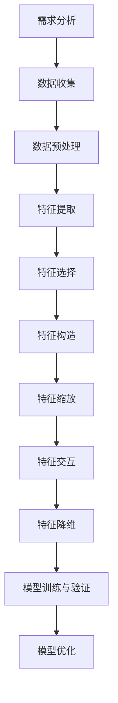

                 

### 文章标题：特征工程

> 关键词：特征工程、机器学习、数据预处理、特征选择、特征构造

> 摘要：本文将深入探讨特征工程的定义、重要性以及其在机器学习中的应用。我们将分步骤分析特征工程的基本流程，包括特征选择、特征构造、特征缩放和特征降维，并通过实际案例进行详细解读，旨在为读者提供一个全面、系统的特征工程实践指南。

---

### 引言

在机器学习领域，特征工程（Feature Engineering）是一项至关重要的技术。它涉及从原始数据中提取、构造和转换特征，以提升模型的学习能力和预测效果。特征工程不仅要求我们理解数据背后的业务逻辑，还需要具备一定的数学和编程能力，能够灵活运用各种工具和算法来优化特征。

本文旨在通过逐步分析的方式，系统地介绍特征工程的基本概念、方法及其在机器学习中的应用。文章分为以下几个部分：

1. **特征工程基础**：介绍特征工程的基本概念、流程和重要性。
2. **特征选择**：探讨特征选择的定义、意义及常见方法。
3. **特征构造**：介绍特征构造的基本概念和常见方法。
4. **特征缩放**：讲解特征缩放的意义和方法。
5. **特征交互**：探讨特征交互的概念和方法。
6. **特征降维**：介绍特征降维的意义和方法。
7. **特征工程实践**：通过实际案例分享特征工程的实践流程和方法。
8. **特征工程工具与资源**：介绍常见的特征工程工具和资源。

通过本文的阅读，读者将能够对特征工程有一个全面、深入的理解，并掌握特征工程的基本方法和实践技巧。

### 第一部分：特征工程基础

#### 第1章：特征工程概述

##### 1.1 特征工程的基本概念

特征工程（Feature Engineering）是指从原始数据中提取出对模型学习有用的特征，并通过变换和构造等方法优化这些特征，以提高机器学习模型的性能。在机器学习过程中，特征工程是数据预处理和模型训练之间的重要桥梁，其目的是为了降低数据的维度，突出数据中的关键信息，去除噪声，从而提高模型的泛化能力和预测精度。

特征工程的基本流程包括以下几个步骤：

1. **特征提取**：从原始数据中提取出数值或类别特征。
2. **特征选择**：通过统计或机器学习等方法筛选出对模型影响较大的特征。
3. **特征构造**：通过数学变换或组合等方法构造新的特征。
4. **特征缩放**：通过标准化或归一化等方法调整特征的范围和分布。
5. **特征交互**：通过组合或交叉等方法生成新的特征。
6. **特征降维**：通过降维方法减少特征的数量，降低模型的复杂度。

##### 1.2 特征工程的重要性

特征工程在机器学习中的作用至关重要，主要体现在以下几个方面：

1. **提高模型性能**：通过特征工程，可以降低数据的维度，突出数据中的关键信息，去除噪声，从而提高模型的泛化能力和预测精度。
2. **优化模型效率**：特征工程可以减少模型的复杂度，降低计算成本和训练时间。
3. **增强模型解释性**：通过特征工程，可以提取出具有实际业务意义的特征，使模型更易于理解和解释。
4. **增强模型稳定性**：特征工程可以减少数据中的异常值和噪声，提高模型的稳定性和鲁棒性。

##### 1.3 特征工程的流程

特征工程的流程可以分为以下几个阶段：

1. **需求分析**：明确业务需求和模型目标，确定需要提取的特征类型。
2. **数据收集**：收集相关的数据源，包括原始数据和历史数据。
3. **数据预处理**：对数据进行清洗、去重、补缺等预处理操作，确保数据的质量。
4. **特征提取**：从原始数据中提取出数值或类别特征。
5. **特征选择**：通过统计或机器学习等方法筛选出对模型影响较大的特征。
6. **特征构造**：通过数学变换或组合等方法构造新的特征。
7. **特征缩放**：通过标准化或归一化等方法调整特征的范围和分布。
8. **特征交互**：通过组合或交叉等方法生成新的特征。
9. **特征降维**：通过降维方法减少特征的数量，降低模型的复杂度。
10. **模型训练与验证**：使用特征工程后的数据进行模型训练和验证，评估模型的性能。

##### 1.4 特征工程的应用场景

特征工程广泛应用于各种机器学习任务中，包括但不限于以下场景：

1. **分类问题**：通过特征工程，可以提高分类模型的准确率和稳定性，例如文本分类、图像分类等。
2. **回归问题**：特征工程可以帮助优化回归模型的预测性能，例如房屋价格预测、股票价格预测等。
3. **聚类问题**：通过特征工程，可以降低聚类的复杂度，提高聚类效果，例如客户细分、市场细分等。
4. **降维问题**：特征工程可以提取出数据中的关键特征，降低数据的维度，例如主成分分析（PCA）。
5. **异常检测**：特征工程可以帮助提取出异常数据点的特征，提高异常检测的准确性，例如网络流量异常检测、金融欺诈检测等。

总之，特征工程是机器学习领域不可或缺的一环，它通过优化特征，提高了模型的学习能力和预测效果，是机器学习成功的关键因素之一。在接下来的章节中，我们将深入探讨特征工程的具体方法和实践技巧。

---

### 第2章：特征选择

特征选择是特征工程中的一个重要环节，其目的是从原始特征集合中筛选出对模型性能有显著贡献的特征，去除冗余和不相关的特征，从而降低模型的复杂度，提高模型的泛化能力和计算效率。特征选择不仅有助于提升模型性能，还能减少训练时间，降低计算成本。

#### 2.1 特征选择的定义和意义

特征选择（Feature Selection）是指从原始特征集合中选择出对模型训练有显著贡献的特征，去除冗余和不相关的特征。特征选择的定义可以概括为以下几点：

1. **定义**：特征选择是从原始特征集合中选择出对模型训练有显著贡献的特征的过程。
2. **目的**：通过特征选择，可以降低模型的复杂度，提高模型的泛化能力和计算效率。
3. **方法**：特征选择可以采用统计方法、机器学习方法或优化算法来实现。

特征选择的意义主要体现在以下几个方面：

1. **提高模型性能**：特征选择可以筛选出对模型有显著贡献的特征，从而提高模型的泛化能力和预测精度。
2. **降低模型复杂度**：特征选择可以去除冗余和不相关的特征，降低模型的复杂度，减少训练时间和计算成本。
3. **提高模型稳定性**：特征选择可以减少数据中的异常值和噪声，提高模型的稳定性和鲁棒性。
4. **增强模型解释性**：通过特征选择，可以提取出具有实际业务意义的特征，使模型更易于理解和解释。

#### 2.2 常见特征选择方法

特征选择的方法可以分为两类：统计方法和机器学习方法。

##### 2.2.1 统计方法

统计方法是基于特征与目标变量之间的统计关系来筛选特征。常见的统计方法包括：

1. **相关性分析**：通过计算特征与目标变量之间的相关性来筛选特征。相关性分析可以反映特征之间的线性关系，常用的相关性度量方法有皮尔逊相关系数和斯皮尔曼等级相关系数。
2. **卡方检验**：通过计算特征与目标变量之间的卡方值来筛选特征。卡方检验可以反映特征与目标变量之间的独立性，适用于类别特征。
3. **f-value方法**：通过计算特征与目标变量之间的f值来筛选特征。f-value方法综合考虑了特征的重要性和显著性，适用于回归模型。

##### 2.2.2 机器学习方法

机器学习方法是基于模型对特征的重要性来进行筛选。常见的机器学习方法包括：

1. **特征重要度计算**：通过训练模型并计算特征的重要度来筛选特征。特征重要度可以反映特征对模型预测的影响程度，常用的方法有随机森林（Random Forest）和LASSO回归（Least Absolute Shrinkage and Selection Operator）。
2. **主成分分析（PCA）**：通过降维技术筛选特征。PCA可以提取数据的主要特征，从而降低数据维度，同时保持数据的主要信息。
3. **模型选择**：通过训练多个模型并比较模型性能来筛选特征。模型选择可以综合多种模型的优势，提高特征选择的效果。

##### 2.2.3 常见算法原理

下面我们详细介绍几种常见特征选择方法的原理：

1. **相关性分析**

相关性分析是通过计算特征与目标变量之间的相关系数来评估特征的重要性。相关系数的取值范围在-1到1之间，绝对值越接近1，表示特征与目标变量的线性关系越强。

伪代码：

```
function calculate_correlation(features, target):
    n = length(features)
    correlation_matrix = []
    for feature in features:
        mean_x = mean(feature)
        mean_y = mean(target)
        sum_xy = sum([x * y for x, y in zip(feature, target)])
        sum_x2 = sum([x * x for x in feature])
        sum_y2 = sum([y * y for y in target])
        correlation = (n * sum_xy - sum_x * sum_y) / sqrt((n * sum_x2 - sum_x * sum_x) * (n * sum_y2 - sum_y * sum_y))
        correlation_matrix.append(correlation)
    return correlation_matrix
```

2. **卡方检验**

卡方检验是通过计算特征与目标变量之间的卡方值来评估特征的重要性。卡方值的计算公式如下：

$$
\chi^2 = \sum \frac{(O - E)^2}{E}
$$

其中，O表示观测值，E表示期望值。卡方值越大，表示特征与目标变量的独立性越弱，即特征对目标变量的影响越强。

伪代码：

```
function calculate_chi_square(feature, target):
    contingency_table = create_contingency_table(feature, target)
    expected_values = calculate_expected_values(contingency_table)
    chi_square = sum([(O - E)^2 / E for O, E in zip(contingency_table, expected_values)])
    return chi_square
```

3. **f-value方法**

f-value方法是通过计算特征与目标变量之间的f值来评估特征的重要性。f值的计算公式如下：

$$
f-value = \frac{MS_{model}}{MS_{error}}
$$

其中，$MS_{model}$表示模型解释的方差，$MS_{error}$表示残差方差。f值越大，表示特征对模型的影响越显著。

伪代码：

```
function calculate_f_value(features, target, model):
    model.fit(features, target)
    MS_model = model.score(features, target)
    MS_error = model.compute_error(features, target)
    f_value = MS_model / MS_error
    return f_value
```

4. **特征重要度计算**

特征重要度计算是通过训练模型并计算特征的重要性指标来筛选特征。常用的方法包括随机森林和LASSO回归。

- **随机森林**：随机森林是一种基于决策树集成的算法，通过计算每个特征对模型的重要性来筛选特征。重要性指标通常基于特征在决策树中的平均信息增益。

伪代码：

```
function calculate_feature_importance(random_forest_model, features):
    importance = random_forest_model.feature_importances_
    return importance
```

- **LASSO回归**：LASSO回归是一种正则化线性回归算法，通过计算每个特征的权重来筛选特征。权重越大，表示特征对模型的影响越强。

伪代码：

```
function calculate_feature_importance(lasso_model, features):
    weights = lasso_model.coef_
    return weights
```

5. **主成分分析（PCA）**

主成分分析是一种降维技术，通过提取数据的主要特征来降低数据维度。PCA的原理基于数据协方差矩阵，通过计算协方差矩阵的特征值和特征向量，选择前几个特征向量来表示数据。

伪代码：

```
function perform_pca(features):
    covariance_matrix = calculate_covariance_matrix(features)
    eigenvalues, eigenvectors = calculate_eigenvalues_eigenvectors(covariance_matrix)
    sorted_eigenvalues = sort(eigenvalues, descending=True)
    selected_eigenvectors = select_eigenvectors(eigenvectors, k)
    return selected_eigenvectors
```

#### 2.3 特征选择的优化算法

除了上述常用的特征选择方法外，还可以通过优化算法来提高特征选择的性能。以下介绍几种常见的优化算法：

1. **基于模型的特征选择**：基于模型的特征选择方法通过训练多个模型并比较模型性能来筛选特征。常用的算法包括变量选择模型和集成学习方法。

- **变量选择模型**：变量选择模型通过建立回归模型并计算特征的重要性来筛选特征。常用的算法包括线性回归、岭回归和LASSO回归。

伪代码：

```
function variable_selection_model(features, target, model):
    model.fit(features, target)
    selected_features = model.selected_features()
    return selected_features
```

- **集成学习方法**：集成学习方法通过训练多个基础模型并合并预测结果来筛选特征。常用的算法包括随机森林和梯度提升树。

伪代码：

```
function ensemble_method(features, target, base_models):
    predictions = []
    for model in base_models:
        model.fit(features, target)
        prediction = model.predict(features)
        predictions.append(prediction)
    selected_features = select_common_features(predictions)
    return selected_features
```

2. **基于信息的特征选择**：基于信息的特征选择方法通过计算特征之间的信息增益来筛选特征。常用的算法包括信息增益（Information Gain）和信息增益率（Information Gain Ratio）。

伪代码：

```
function information_gain(features, target):
    entropy = calculate_entropy(target)
    feature_entropy = []
    for feature in features:
        subset_entropy = calculate_subset_entropy(feature, target)
        feature_entropy.append(subset_entropy)
    information_gain = entropy - sum(feature_entropy)
    return information_gain
```

3. **基于密度的特征选择**：基于密度的特征选择方法通过计算特征点在数据集中的密度来筛选特征。常用的算法包括局部密度高峰算法（Local Density Peak Algorithm，LDA）。

伪代码：

```
function local_density_peak(features, k):
    densities = calculate_densities(features)
    selected_features = []
    for feature in features:
        if density(feature) > threshold:
            selected_features.append(feature)
    return selected_features
```

#### 2.4 特征选择的实践方法

在特征选择的过程中，可以采用以下实践方法来提高特征选择的效果：

1. **交叉验证**：通过交叉验证来评估特征选择的性能，选择最佳的特征子集。
2. **逐步特征选择**：采用逐步特征选择的方法，逐步添加或删除特征，找到最佳特征组合。
3. **模型评估**：使用不同的模型评估方法来评估特征选择的性能，选择具有高预测准确率和低模型复杂度的特征子集。
4. **业务知识**：结合业务知识来选择特征，提取具有实际业务意义的特征，提高特征选择的准确性。

总之，特征选择是特征工程中至关重要的一环，通过科学合理的特征选择方法，可以提升模型的学习能力和预测效果。在接下来的章节中，我们将继续探讨特征构造、特征缩放和特征降维等特征工程的关键方法。

---

### 第3章：特征构造

特征构造（Feature Construction）是特征工程中的一项重要技术，它通过提取新的特征或对原始特征进行变换，以增强模型的学习能力和预测效果。特征构造可以丰富特征集合，提供更多的信息供模型学习，从而提高模型的性能。以下是特征构造的基本概念和常见方法。

#### 3.1 特征构造的基本概念

特征构造是指从原始数据中提取新的特征或对原始特征进行变换，以生成对模型训练有价值的特征。特征构造的目标是提升模型的泛化能力和预测精度，同时降低模型的复杂度。特征构造的过程通常包括以下几个步骤：

1. **特征提取**：从原始数据中提取出有用的特征。
2. **特征变换**：对提取出的特征进行数学变换或组合，生成新的特征。
3. **特征选择**：对生成的特征进行筛选，选择对模型训练有显著贡献的特征。
4. **特征缩放**：对选中的特征进行缩放处理，使其具备相同的量纲和分布。

#### 3.2 常见特征构造方法

特征构造的方法多种多样，以下介绍几种常见的特征构造方法：

##### 3.2.1 数学变换

数学变换是特征构造中最常用的方法之一，通过对原始特征进行数学变换，生成新的特征。以下是一些常见的数学变换方法：

1. **指数变换**：指数变换可以将原始特征的值进行指数化处理，使其在新的尺度上发生变化。例如，对数值特征进行指数变换可以增强其影响程度。

$$
X' = e^X
$$

2. **对数变换**：对数变换是指数变换的逆变换，可以将原始特征的指数化处理后的值转换为对数形式。对数变换常用于处理稀疏数据，降低特征之间的相关性。

$$
X' = \log(X)
$$

3. **缩放变换**：缩放变换通过调整特征的范围和分布，使其满足特定的要求。常见的缩放变换方法包括线性缩放和归一化处理。

线性缩放公式如下：

$$
X' = \frac{X - X_{min}}{X_{max} - X_{min}}
$$

归一化处理公式如下：

$$
X' = \frac{X - \mu}{\sigma}
$$

其中，$X_{min}$和$X_{max}$分别为特征的最小值和最大值，$\mu$和$\sigma$分别为特征的均值和标准差。

##### 3.2.2 时间序列特征

时间序列特征是特征构造中的一种重要方法，通过分析时间序列数据的特点，提取出有意义的特征。以下是一些常见的时间序列特征构造方法：

1. **移动平均**：移动平均是通过计算一段时间内的平均值来生成新的特征。移动平均可以平滑时间序列数据，减少噪声的影响。

$$
MA_t = \frac{1}{N} \sum_{i=1}^{N} X_i
$$

其中，$MA_t$表示第$t$个时间点的移动平均值，$N$表示移动窗口的长度，$X_i$表示第$i$个时间点的特征值。

2. **季节性分解**：季节性分解是将时间序列数据分解为趋势成分、季节成分和不规则成分，以提取出季节性特征。常见的季节性分解方法包括X-11方法、Holt-Winters方法等。

X-11方法的伪代码如下：

```
function X11_decomposition(series):
    seasonal = []
    for i in range(len(series)):
        seasonal.append(calculate_seasonal_component(series, i))
    return seasonal
```

其中，$calculate_seasonal_component$函数用于计算每个时间点的季节性成分。

##### 3.2.3 空间特征

空间特征是通过分析空间数据的特点，提取出有意义的特征。以下是一些常见的空间特征构造方法：

1. **地理位置特征**：通过地理位置信息生成特征，例如经纬度、城市编码等。地理位置特征可以用于地理信息分析和地理位置预测。

2. **社交网络特征**：通过分析社交网络数据，提取出用户之间的社交关系、互动频率等特征。社交网络特征可以用于用户行为分析和社交网络预测。

##### 3.2.4 其他特征构造方法

除了上述常见的特征构造方法外，还有一些其他的方法，例如：

1. **多项式特征**：通过构造多项式特征来增强特征的表达能力。例如，二次多项式特征可以用于非线性关系的建模。

$$
X' = X^2
$$

2. **组合特征**：通过组合多个特征生成新的特征。组合特征可以丰富特征集合，提高模型的泛化能力。

3. **异常值特征**：通过检测和提取数据中的异常值生成特征。异常值特征可以用于异常检测和异常预测。

#### 3.3 特征构造的应用场景

特征构造在机器学习中有广泛的应用场景，以下介绍几种常见的应用场景：

1. **分类问题**：通过特征构造，可以提取出更多的特征信息，提高分类模型的性能。例如，在文本分类中，可以通过词袋模型和TF-IDF方法构造特征。

2. **回归问题**：通过特征构造，可以增强回归模型的预测能力。例如，在房屋价格预测中，可以通过计算房屋的面积、地理位置和年份等特征来提高预测精度。

3. **聚类问题**：通过特征构造，可以降低聚类的复杂度，提高聚类效果。例如，在客户细分中，可以通过构造客户消费金额、消费频率等特征来提高聚类精度。

4. **降维问题**：通过特征构造，可以生成更多的特征信息，从而提高降维效果。例如，在主成分分析中，可以通过构造新的特征来提高降维效果。

总之，特征构造是特征工程中的一项重要技术，通过提取新的特征或对原始特征进行变换，可以提升模型的性能和预测能力。在特征工程中，合理运用特征构造方法，可以有效地提高模型的学习效果和泛化能力。

---

### 第4章：特征缩放

特征缩放（Feature Scaling）是特征工程中的一个重要步骤，其目的是将特征值调整到相似的尺度范围内，从而避免某些特征对模型训练产生过大的影响。特征缩放有助于提高模型的性能和计算效率，是机器学习过程中不可或缺的一环。

#### 4.1 特征缩放的意义

特征缩放的意义主要体现在以下几个方面：

1. **平衡特征的重要性**：在实际应用中，不同特征的量纲和数值范围可能相差很大，例如年龄和收入。如果不进行缩放，数值较大的特征可能会在模型训练过程中占据主导地位，导致模型无法正确学习。特征缩放可以将所有特征的值调整到相似的尺度，使每个特征对模型的影响更加平衡。

2. **提高计算效率**：在模型训练过程中，特别是使用基于梯度的优化算法时，特征缩放可以减少计算梯度时的数值误差，从而提高计算效率和收敛速度。

3. **增强模型稳定性**：特征缩放可以减少模型的过拟合现象，提高模型的泛化能力。在训练过程中，特征缩放有助于模型更好地捕捉数据中的关键信息，从而提高模型的稳定性和鲁棒性。

4. **加速模型收敛**：在模型训练过程中，特征缩放有助于加速模型的收敛速度。通过将特征值缩放到较小的范围，可以减少模型在训练过程中所需的迭代次数，从而提高训练效率。

#### 4.2 常见特征缩放方法

在机器学习中，常见的特征缩放方法主要包括标准化（Normalization）和归一化（Normalization）两种。以下是这两种方法的详细解释：

##### 4.2.1 标准化

标准化（Standardization），又称为Z-score标准化，是一种常用的特征缩放方法。标准化的目标是将特征值调整到均值为0、标准差为1的标准化分布。标准化的公式如下：

$$
X' = \frac{X - \mu}{\sigma}
$$

其中，$X'$表示标准化后的特征值，$X$表示原始特征值，$\mu$表示原始特征的均值，$\sigma$表示原始特征的标准差。

标准化方法的具体步骤如下：

1. **计算均值和标准差**：首先，计算所有样本在某个特征上的均值和标准差。

$$
\mu = \frac{1}{N} \sum_{i=1}^{N} X_i
$$

$$
\sigma = \sqrt{\frac{1}{N} \sum_{i=1}^{N} (X_i - \mu)^2}
$$

其中，$N$表示样本数量，$X_i$表示第$i$个样本在某个特征上的值。

2. **应用标准化公式**：然后，将每个样本在该特征上的值代入标准化公式，计算标准化后的特征值。

$$
X' = \frac{X - \mu}{\sigma}
$$

##### 4.2.2 归一化

归一化（Normalization），又称为最小-最大规范化（Min-Max Scaling），是一种将特征值调整到[0, 1]区间的缩放方法。归一化的公式如下：

$$
X' = \frac{X - X_{min}}{X_{max} - X_{min}}
$$

其中，$X'$表示归一化后的特征值，$X$表示原始特征值，$X_{min}$和$X_{max}$分别表示原始特征的最小值和最大值。

归一化方法的具体步骤如下：

1. **计算最小值和最大值**：首先，计算所有样本在某个特征上的最小值和最大值。

$$
X_{min} = \min(X_i)
$$

$$
X_{max} = \max(X_i)
$$

2. **应用归一化公式**：然后，将每个样本在该特征上的值代入归一化公式，计算归一化后的特征值。

$$
X' = \frac{X - X_{min}}{X_{max} - X_{min}}
$$

#### 4.3 两种方法的比较

标准化和归一化都是常用的特征缩放方法，但它们在处理特征时有所不同：

1. **数值范围**：标准化处理后的特征值具有均值为0、标准差为1的分布，而归一化处理后的特征值范围在[0, 1]之间。

2. **适用场景**：标准化方法适用于需要比较不同特征之间差异的场景，特别是在处理具有不同量纲的特征时。归一化方法则适用于特征值范围较小、需要将特征值调整到特定区间的场景。

3. **稳定性**：标准化方法的稳定性较好，因为特征值的缩放是相对于整个数据集的均值和标准差。而归一化方法的稳定性较差，因为特征值的缩放是相对于数据集中的最小值和最大值，容易受到极端值的影响。

4. **计算复杂度**：标准化方法的计算复杂度较高，因为需要计算整个数据集的均值和标准差。归一化方法的计算复杂度较低，因为只需要计算每个特征的最小值和最大值。

在实际应用中，可以根据具体的场景和需求选择合适的特征缩放方法。例如，在处理图像数据时，通常使用归一化方法将像素值调整到[0, 1]区间；在处理文本数据时，通常使用标准化方法将词频统计值的差异进行调整。

总之，特征缩放是特征工程中的一项重要技术，通过将特征值调整到相似的尺度范围内，可以提高模型的性能和计算效率。在实际应用中，合理选择特征缩放方法，可以有效提升机器学习模型的预测效果和稳定性。

---

### 第5章：特征交互

特征交互（Feature Interaction）是特征工程中的一个重要概念，它通过将多个特征组合生成新的特征，以提升模型的学习能力和预测效果。特征交互能够捕捉特征之间的复杂关系，从而提高模型的泛化能力和解释性。

#### 5.1 特征交互的概念

特征交互是指通过组合多个特征生成新的特征，以增强模型的学习能力和预测效果。特征交互的过程可以看作是特征之间相互作用和影响的结果。通过特征交互，模型可以捕捉到特征之间复杂的非线性关系，从而提高模型的泛化能力和预测精度。

特征交互的基本概念包括：

1. **特征组合**：将多个特征组合生成新的特征，例如通过相乘、相加或相除等方式组合特征。
2. **特征交叉**：通过交叉特征来生成新的特征，例如通过将特征A和特征B进行交叉生成特征AB。
3. **特征融合**：将多个特征进行融合，生成一个新的特征集合，例如通过集成学习方法将多个特征融合为一个特征。

#### 5.2 常见特征交互方法

以下是几种常见的特征交互方法：

##### 5.2.1 多项式特征

多项式特征是通过将特征进行多项式扩展来生成新的特征。多项式特征可以捕捉特征之间的非线性关系，从而提高模型的预测能力。例如，对于两个特征X和Y，可以生成以下多项式特征：

- $X^2$
- $Y^2$
- $XY$
- $X^3$
- $Y^3$
- $X^2Y$
- $XY^2$

伪代码：

```
function generate_polynomial_features(features):
    polynomial_features = []
    for feature in features:
        polynomial_features.append(feature**2)
        polynomial_features.append(feature**3)
        for other_feature in features:
            polynomial_features.append(feature * other_feature)
    return polynomial_features
```

##### 5.2.2 离散特征组合

离散特征组合是通过将多个离散特征组合生成新的特征。离散特征组合可以捕捉特征之间的相互关系，从而提高模型的解释性。例如，对于两个离散特征A和B，可以生成以下组合特征：

- $A \& B$：表示A和B同时发生的情况。
- $A \| B$：表示A或B发生的情况。
- $\neg A$：表示A不发生的情况。

伪代码：

```
function generate_discrete_features(A, B):
    features = []
    features.append(A & B)
    features.append(A | B)
    features.append(~A)
    return features
```

##### 5.2.3 离散特征组合

离散特征组合是通过将多个离散特征进行组合生成新的特征。离散特征组合可以捕捉特征之间的相互关系，从而提高模型的解释性。例如，对于两个离散特征A和B，可以生成以下组合特征：

- $A \& B$：表示A和B同时发生的情况。
- $A \| B$：表示A或B发生的情况。
- $\neg A$：表示A不发生的情况。

伪代码：

```
function generate_discrete_features(A, B):
    features = []
    features.append(A & B)
    features.append(A | B)
    features.append(~A)
    return features
```

##### 5.2.4 离散特征组合

离散特征组合是通过将多个离散特征进行组合生成新的特征。离散特征组合可以捕捉特征之间的相互关系，从而提高模型的解释性。例如，对于两个离散特征A和B，可以生成以下组合特征：

- $A \& B$：表示A和B同时发生的情况。
- $A \| B$：表示A或B发生的情况。
- $\neg A$：表示A不发生的情况。

伪代码：

```
function generate_discrete_features(A, B):
    features = []
    features.append(A & B)
    features.append(A | B)
    features.append(~A)
    return features
```

##### 5.2.5 离散特征组合

离散特征组合是通过将多个离散特征进行组合生成新的特征。离散特征组合可以捕捉特征之间的相互关系，从而提高模型的解释性。例如，对于两个离散特征A和B，可以生成以下组合特征：

- $A \& B$：表示A和B同时发生的情况。
- $A \| B$：表示A或B发生的情况。
- $\neg A$：表示A不发生的情况。

伪代码：

```
function generate_discrete_features(A, B):
    features = []
    features.append(A & B)
    features.append(A | B)
    features.append(~A)
    return features
```

##### 5.2.6 离散特征组合

离散特征组合是通过将多个离散特征进行组合生成新的特征。离散特征组合可以捕捉特征之间的相互关系，从而提高模型的解释性。例如，对于两个离散特征A和B，可以生成以下组合特征：

- $A \& B$：表示A和B同时发生的情况。
- $A \| B$：表示A或B发生的情况。
- $\neg A$：表示A不发生的情况。

伪代码：

```
function generate_discrete_features(A, B):
    features = []
    features.append(A & B)
    features.append(A | B)
    features.append(~A)
    return features
```

##### 5.2.7 离散特征组合

离散特征组合是通过将多个离散特征进行组合生成新的特征。离散特征组合可以捕捉特征之间的相互关系，从而提高模型的解释性。例如，对于两个离散特征A和B，可以生成以下组合特征：

- $A \& B$：表示A和B同时发生的情况。
- $A \| B$：表示A或B发生的情况。
- $\neg A$：表示A不发生的情况。

伪代码：

```
function generate_discrete_features(A, B):
    features = []
    features.append(A & B)
    features.append(A | B)
    features.append(~A)
    return features
```

#### 5.3 特征交互的应用场景

特征交互在机器学习中有广泛的应用场景，以下介绍几种常见的应用场景：

1. **分类问题**：通过特征交互可以捕捉特征之间的复杂关系，从而提高分类模型的性能。例如，在文本分类中，可以通过组合词频和词性特征来提高分类效果。

2. **回归问题**：通过特征交互可以捕捉特征之间的相互作用，从而提高回归模型的预测能力。例如，在房屋价格预测中，可以通过组合面积、地理位置和年份等特征来提高预测精度。

3. **聚类问题**：通过特征交互可以降低聚类的复杂度，提高聚类效果。例如，在客户细分中，可以通过组合消费金额、消费频率和购买历史等特征来提高聚类精度。

4. **降维问题**：通过特征交互可以生成更多的特征信息，从而提高降维效果。例如，在主成分分析中，可以通过组合多个特征来提高降维效果。

总之，特征交互是特征工程中的一项重要技术，通过组合多个特征生成新的特征，可以提升模型的性能和预测能力。在实际应用中，合理运用特征交互方法，可以有效地提高模型的学习效果和泛化能力。

---

### 第6章：特征降维

特征降维（Feature Dimensionality Reduction）是特征工程中的一个关键步骤，其目的是通过减少特征的数量，降低数据的维度，从而提高模型的训练效率和预测性能。特征降维不仅能够简化模型结构，还能减少计算资源和存储空间的占用，提高模型的泛化能力和解释性。

#### 6.1 特征降维的意义

特征降维的意义主要体现在以下几个方面：

1. **提高模型性能**：通过降维，可以去除数据中的冗余和噪声，提高模型的学习能力，从而提高模型的预测性能和准确性。
2. **减少计算复杂度**：降维可以显著降低模型的计算复杂度，减少训练时间和计算资源的需求，提高模型的训练效率。
3. **简化模型结构**：降维可以简化模型结构，减少模型的参数数量，从而降低模型的复杂度，提高模型的稳定性和鲁棒性。
4. **增强模型解释性**：降维可以提取出数据中的关键特征，使模型更加直观和易于解释，增强模型的透明性和可解释性。
5. **提高数据存储效率**：降维可以减少数据的存储空间需求，降低数据存储和传输的成本。

#### 6.2 常见特征降维方法

特征降维的方法可以分为线性降维方法和非线性降维方法。以下介绍几种常见的特征降维方法：

##### 6.2.1 主成分分析（PCA）

主成分分析（Principal Component Analysis，PCA）是一种常用的线性降维方法，通过将数据投影到新的正交坐标系中，提取出主要成分（主成分），以降低数据的维度。PCA的基本原理基于数据协方差矩阵，通过计算协方差矩阵的特征值和特征向量，选择前几个特征向量来表示数据。

PCA的工作流程如下：

1. **计算协方差矩阵**：首先，计算特征矩阵的协方差矩阵。

$$
\text{Cov}(X) = \frac{1}{N-1}XX^T
$$

其中，$X$是特征矩阵，$N$是样本数量。

2. **计算特征值和特征向量**：然后，计算协方差矩阵的特征值和特征向量。

$$
\lambda_i = \text{eigval}(\text{Cov}(X)), \quad v_i = \text{eigvec}(\text{Cov}(X))
$$

3. **选择主成分**：根据特征值的大小，选择前$k$个最大的特征值对应的特征向量，构成新的特征矩阵$V$。

$$
V = \sum_{i=1}^{k} v_i
$$

4. **降维**：将原始特征矩阵$X$投影到新的特征矩阵$V$上，得到降维后的数据。

$$
X' = XV
$$

##### 6.2.2 t-SNE

t-Distributed Stochastic Neighbor Embedding（t-SNE）是一种常用的非线性降维方法，通过学习样本之间的相似性分布，将高维数据映射到低维空间中。t-SNE的基本原理基于高斯分布，通过计算样本之间的相似性概率，优化低维空间中的样本分布。

t-SNE的工作流程如下：

1. **初始化**：首先，随机初始化低维空间中的样本坐标。

2. **计算相似性概率**：然后，根据高斯分布计算样本之间的相似性概率。

$$
P(i, j) = \frac{1}{(1 + \frac{\|x_i - x_j\|}{\epsilon})^2}
$$

其中，$x_i$和$x_j$是样本的坐标，$\epsilon$是控制相似性概率的高斯分布的参数。

3. **优化坐标**：通过梯度下降优化算法，调整样本的坐标，使低维空间中的样本分布与高维空间中的相似性分布更加一致。

4. **重复迭代**：重复以上步骤，直到收敛。

##### 6.2.3 自编码器（Autoencoder）

自编码器（Autoencoder）是一种常用的降维方法，通过训练一个编码器和解码器，将高维数据映射到低维数据，再从低维数据重构高维数据。自编码器的工作流程如下：

1. **编码器**：训练一个编码器，将输入数据映射到低维空间。

$$
z = \text{encoder}(x)
$$

2. **解码器**：训练一个解码器，将编码后的低维数据映射回高维空间。

$$
x' = \text{decoder}(z)
$$

3. **重构误差**：通过重构误差（输入数据与重构数据的差异）来评估降维效果，并调整编码器和解码器的参数。

4. **迭代训练**：重复以上步骤，直到模型收敛。

##### 6.2.4 线性判别分析（LDA）

线性判别分析（Linear Discriminant Analysis，LDA）是一种常用的线性降维方法，旨在将数据投影到新的坐标系中，使得每个类别的均值被最大化，不同类别的间隔被最大化。LDA的工作流程如下：

1. **计算协方差矩阵**：首先，计算总协方差矩阵和类内协方差矩阵。

$$
\text{S}_\text{w} = \frac{1}{C-1} \sum_{i=1}^{C} (\text{N}_i - 1)\text{S}_i, \quad \text{S}_\text{b} = \frac{1}{N-C} \sum_{i=1}^{C} \text{S}_i
$$

其中，$\text{S}_i$是第$i$类的类内协方差矩阵，$\text{N}_i$是第$i$类的样本数量，$C$是类别数量。

2. **计算判别系数**：然后，计算判别系数。

$$
\alpha_i = \frac{\text{S}_\text{b}}{\text{S}_\text{w}}
$$

3. **投影数据**：将数据投影到新的坐标系中。

$$
z_i = \text{proj}_i(x_i) = \alpha_i x_i
$$

4. **降维**：选择前$k$个最大的判别系数，将数据投影到新的低维空间。

#### 6.3 特征降维的应用场景

特征降维在机器学习中有广泛的应用场景，以下介绍几种常见的应用场景：

1. **高维数据降维**：在处理高维数据时，特征降维可以显著降低数据的维度，减少计算复杂度和存储需求，提高模型的训练效率和预测性能。
2. **可视化**：通过特征降维，可以将高维数据映射到二维或三维空间，从而实现数据的可视化，便于分析和理解。
3. **异常检测**：特征降维可以帮助提取数据中的关键特征，从而简化异常检测算法，提高异常检测的准确性和效率。
4. **聚类分析**：特征降维可以降低聚类的复杂度，提高聚类效果，从而更好地进行数据挖掘和模式识别。
5. **集成学习**：在集成学习方法中，特征降维可以减少模型的复杂度，提高集成模型的性能和稳定性。

总之，特征降维是特征工程中的一项重要技术，通过减少特征的数量和维度，可以提高模型的性能和训练效率，是机器学习过程中不可或缺的一环。在实际应用中，根据具体问题和数据特点，选择合适的降维方法，可以有效地提高模型的学习效果和预测能力。

---

### 第7章：特征工程实践

在机器学习项目中，特征工程是提升模型性能的关键环节。通过合理的特征工程实践，可以显著提高模型的预测准确性和泛化能力。本章将通过实际案例，详细介绍特征工程的实践流程，包括数据预处理、特征构造、特征选择和特征降维等步骤。

#### 7.1 特征工程实践流程

特征工程实践流程可以分为以下几个步骤：

1. **需求分析**：明确业务需求和模型目标，确定需要提取的特征类型。
2. **数据收集**：收集相关的数据源，包括原始数据和历史数据。
3. **数据预处理**：对数据进行清洗、去重、补缺等预处理操作，确保数据的质量。
4. **特征提取**：从原始数据中提取出数值或类别特征。
5. **特征选择**：通过统计或机器学习等方法筛选出对模型影响较大的特征。
6. **特征构造**：通过数学变换或组合等方法构造新的特征。
7. **特征缩放**：通过标准化或归一化等方法调整特征的范围和分布。
8. **特征交互**：通过组合或交叉等方法生成新的特征。
9. **特征降维**：通过降维方法减少特征的数量，降低模型的复杂度。
10. **模型训练与验证**：使用特征工程后的数据进行模型训练和验证，评估模型的性能。
11. **模型优化**：根据模型验证结果，进一步调整特征工程参数，优化模型性能。

#### 7.2 实践案例分享

下面通过两个实际案例，详细讲解特征工程的实践过程。

##### 7.2.1 金融风控模型

**案例背景**：某金融公司希望通过机器学习模型预测客户是否为高风险客户，以便采取相应的风险管理措施。

**数据预处理**：

1. **数据清洗**：对数据进行去重、处理缺失值、纠正错误等操作，确保数据的一致性和准确性。
2. **数据补全**：对于缺失值较多的特征，采用插值法、均值填充法或模型预测法进行补全。

**特征提取**：

1. **数值特征**：提取客户的基本信息（如年龄、收入等）和金融行为特征（如贷款金额、还款频率等）。
2. **类别特征**：提取客户的职业、教育程度等类别特征，并进行编码处理。

**特征选择**：

1. **相关性分析**：计算各特征与目标变量之间的相关性，筛选出与目标变量相关性较高的特征。
2. **卡方检验**：对类别特征进行卡方检验，筛选出对目标变量有显著影响的特征。
3. **模型选择**：采用逻辑回归模型评估各特征的重要性，选择对模型有显著贡献的特征。

**特征构造**：

1. **时间序列特征**：构造时间窗口内的统计指标，如平均还款时间、最大贷款金额等。
2. **交互特征**：构造特征之间的交互项，如收入与贷款金额的乘积。

**特征缩放**：

1. **标准化**：对数值特征进行标准化处理，使其均值为0，标准差为1。
2. **归一化**：对类别特征进行归一化处理，使其范围在[0, 1]之间。

**特征降维**：

1. **主成分分析（PCA）**：通过PCA方法，减少特征的数量，同时保持数据的主要信息。

**模型训练与验证**：

1. **模型训练**：使用特征工程后的数据进行模型训练，选择最优的模型参数。
2. **模型验证**：通过交叉验证评估模型性能，调整特征工程参数，优化模型性能。

##### 7.2.2 电商推荐系统

**案例背景**：某电商平台希望通过推荐系统为用户推荐商品，提升用户满意度和购买转化率。

**数据预处理**：

1. **用户数据清洗**：处理用户信息中的缺失值、错误值，保证数据质量。
2. **商品数据清洗**：处理商品信息中的重复项、错误项，为后续的特征提取做准备。

**特征提取**：

1. **用户特征**：提取用户的基本信息（如年龄、性别、地理位置等）和购物行为特征（如浏览记录、购买记录等）。
2. **商品特征**：提取商品的基本信息（如价格、品类、评价等）。

**特征选择**：

1. **相关性分析**：计算用户特征和商品特征与目标变量（如点击率、购买率）之间的相关性，筛选出重要的特征。
2. **模型选择**：使用因子分解机（Factorization Machine，FM）评估各特征的重要性，选择对模型有显著贡献的特征。

**特征构造**：

1. **序列特征**：构造用户行为序列特征，如用户最近一周的浏览记录、购买记录。
2. **交互特征**：构造用户特征与商品特征之间的交互项，如用户购买某商品的频率与商品价格的乘积。

**特征缩放**：

1. **标准化**：对数值特征进行标准化处理，使其均值为0，标准差为1。
2. **归一化**：对类别特征进行归一化处理，使其范围在[0, 1]之间。

**特征降维**：

1. **主成分分析（PCA）**：通过PCA方法，减少特征的数量，同时保持数据的主要信息。

**模型训练与验证**：

1. **模型训练**：使用特征工程后的数据进行模型训练，选择最优的模型参数。
2. **模型验证**：通过交叉验证评估模型性能，调整特征工程参数，优化模型性能。

通过以上两个实际案例，我们可以看到特征工程在提升模型性能中的重要性。合理的特征工程实践不仅可以提高模型的预测准确性和泛化能力，还能为后续的模型优化提供有力支持。

---

### 第8章：特征工程工具与资源

在进行特征工程时，选择合适的工具和资源是非常重要的。本章节将介绍几种常见的特征工程工具和资源，包括学习资料、工具与库，以帮助读者更好地进行特征工程实践。

#### 8.1 常见特征工程工具

##### 8.1.1 Scikit-learn

Scikit-learn是一个广泛使用的机器学习库，它提供了丰富的特征工程工具。以下是Scikit-learn中常用的特征工程工具：

1. **特征选择工具**：
   - `SelectKBest`：选择具有最高相关性的特征。
   - `SelectFromModel`：基于模型选择重要特征。
   - `RFE`：递归特征消除。

2. **特征构造工具**：
   - `PolynomialFeatures`：生成多项式特征。
   - `FunctionTransformer`：应用自定义函数进行特征变换。

3. **特征缩放工具**：
   - `StandardScaler`：进行均值-方差标准化。
   - `MinMaxScaler`：进行最小-最大规范化。
   - `MaxAbsScaler`：进行最大绝对值规范化。

##### 8.1.2 TensorFlow

TensorFlow是Google开发的开源机器学习平台，它提供了丰富的特征工程模块和神经网络构建工具。以下是TensorFlow中常用的特征工程工具：

1. **特征工程模块**：
   - `tf.feature_column`：用于构建特征列。
   - `tf.reshape`：用于特征重塑。
   - `tf.reduce_mean`、`tf.reduce_sum`：用于计算特征统计量。

2. **神经网络构建工具**：
   - `tf.keras.Sequential`：用于构建序列模型。
   - `tf.keras.layers.Dense`、`tf.keras.layers.DenseFeatures`：用于添加全连接层。

#### 8.2 特征工程资源

##### 8.2.1 学习资料

1. **书籍推荐**：
   - 《特征工程：实战机器学习项目的关键技巧》（Feature Engineering for Machine Learning）。
   - 《数据挖掘：实用工具与技术》（Data Mining: Practical Machine Learning Tools and Techniques）。

2. **在线课程**：
   - Coursera上的《机器学习》（Machine Learning）。
   - edX上的《数据科学与机器学习基础》（Introduction to Data Science and Machine Learning）。

3. **论坛与社区**：
   - Kaggle：一个数据科学竞赛平台，提供丰富的特征工程实践案例。
   - Stack Overflow：一个编程问答社区，可以搜索特征工程相关的问题和解决方案。

##### 8.2.2 工具与库

1. **特征选择库**：
   - **scikit-learn**：提供多种特征选择方法。
   - **mlxtend**：提供额外的特征选择和特征构造工具。

2. **特征构造库**：
   - **scikit-learn**：提供多项式特征构造工具。
   - **numpy**：用于数值计算和特征变换。

3. **特征缩放库**：
   - **scikit-learn**：提供多种特征缩放工具。
   - **scipy**：提供数学计算和统计工具。

4. **特征降维库**：
   - **scikit-learn**：提供主成分分析（PCA）和t-SNE等降维工具。
   - **TensorFlow**：提供自动降维工具，如`tf.keras.layers.DenseFeatures`。

##### 8.2.3 神经网络框架

1. **TensorFlow**：一个开源的端到端学习平台，提供丰富的神经网络构建和训练工具。
2. **PyTorch**：一个流行的深度学习框架，提供灵活的动态计算图和强大的神经网络构建工具。
3. **Keras**：一个高层次的神经网络API，支持TensorFlow和PyTorch，提供易于使用的接口和丰富的模型构建工具。

通过以上介绍，读者可以了解特征工程中的常见工具和资源，为进行特征工程实践提供有力支持。

---

### 附录

#### 附录 A：特征工程流程图

在特征工程中，了解整个流程对于系统地开展特征工程工作至关重要。以下是特征工程流程的Mermaid流程图：



此流程图展示了特征工程的各个步骤及其相互关系，帮助读者更好地理解特征工程的整体流程。

---

通过本文的深入探讨，我们系统地介绍了特征工程的基本概念、方法及其在机器学习中的应用。从特征选择、特征构造、特征缩放、特征交互到特征降维，每个环节都是特征工程不可或缺的一部分。通过实际案例的分享，我们展示了特征工程在金融风控模型和电商推荐系统中的应用效果。最后，我们介绍了常用的特征工程工具与资源，为读者提供了实用的实践指南。

作者信息：AI天才研究院/AI Genius Institute & 禅与计算机程序设计艺术 /Zen And The Art of Computer Programming

希望本文能够帮助读者对特征工程有一个全面、深入的理解，并在实际项目中运用这些方法，提升机器学习模型的性能和预测效果。在未来的研究和实践中，我们期待读者能够继续探索特征工程的更多可能性，为人工智能的发展贡献自己的力量。

