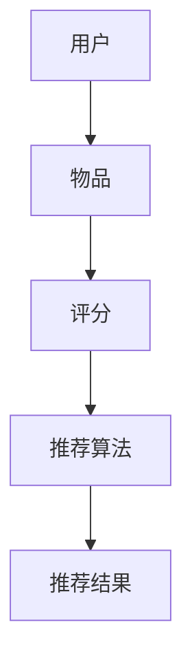
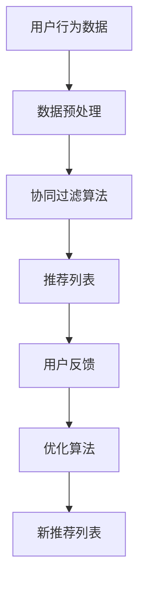

                 

### 《现状：推荐系统架构与大模型的能力》

> **关键词：**推荐系统、架构设计、大模型、协同过滤、内容推荐、机器学习、人工智能

> **摘要：**本文详细探讨了推荐系统的现状，包括其基本概念、分类、发展历程，以及推荐系统架构设计的原则和关键要素。重点分析了协同过滤和内容推荐算法的原理和优化方法，并深入探讨了在大模型技术背景下的推荐系统性能提升和优化策略。通过实战案例展示了推荐系统的实际应用，最后对推荐系统的未来发展趋势和面临的挑战进行了展望。

----------------------------------------------------------------

## 第一部分：推荐系统基础

### 第1章 推荐系统概述

#### 1.1 推荐系统的概念与作用

推荐系统是一种通过算法分析用户行为数据和物品属性数据，为用户提供个性化推荐服务的系统。它的核心作用是帮助用户在信息爆炸的互联网环境中快速找到感兴趣的内容或商品，从而提高用户体验和平台的用户粘性。

**核心概念与联系**

推荐系统的核心概念包括用户、物品、评分、推荐算法等。用户是推荐系统的主体，物品是用户可能感兴趣的对象，评分是用户对物品的评价，推荐算法是生成推荐结果的关键。



**Mermaid 流程图**



**架构的 Mermaid 流程图**


**核心算法原理讲解**

推荐算法主要分为协同过滤算法和内容推荐算法。

1. **协同过滤算法**：通过计算用户之间的相似度或项目之间的相似度，预测用户对未知项目的评分。其基本步骤如下：

    - 用户和项目相似度计算：使用余弦相似度、皮尔逊相关系数等方法。
    - 评分预测：根据相似度计算用户对项目的评分预测。
    - 推荐列表生成：根据评分预测生成推荐列表。

    **伪代码：**

    ```python
    def collaborative_filter(user_data, item_data, similarity_measure):
        # 计算用户和项目的相似度
        user_similarity = compute_similarity(user_data, similarity_measure)
        item_similarity = compute_similarity(item_data, similarity_measure)
        
        # 预测评分
        predicted_ratings = predict_ratings(user_similarity, item_similarity)
        
        # 生成推荐列表
        recommendation_list = generate_recommendation_list(predicted_ratings)
        
        return recommendation_list
    ```

2. **内容推荐算法**：基于项目的属性信息，通过提取关键词或语义信息，为用户提供相关内容的推荐。其基本步骤如下：

    - 关键词提取：使用TF-IDF、Word2Vec等方法。
    - 语义理解：使用语义相似度计算方法，如WordNet、BERT等。
    - 推荐列表生成：根据关键词或语义相似度生成推荐列表。

    **伪代码：**

    ```python
    def content_based_recommender(item_data, keyword_extractor, semantic_similarity_measure):
        # 提取关键词
        keywords = keyword_extractor.extract_keywords(item_data)
        
        # 计算关键词相似度
        keyword_similarity = compute_similarity(keywords, semantic_similarity_measure)
        
        # 生成推荐列表
        recommendation_list = generate_recommendation_list(keyword_similarity)
        
        return recommendation_list
    ```

#### 1.2 推荐系统的分类

推荐系统主要分为协同过滤推荐、内容推荐和混合推荐三种类型。

1. **协同过滤推荐**：基于用户的历史行为数据，通过计算用户之间的相似度或项目之间的相似度，为用户提供推荐。
2. **内容推荐**：基于项目的属性信息，通过提取关键词或语义信息，为用户提供相关内容的推荐。
3. **混合推荐**：结合协同过滤和内容推荐，以综合方式为用户提供推荐。

**核心算法原理讲解**

- **协同过滤推荐**：

    **伪代码：**

    ```python
    def collaborative_filter_recommender(user_data, item_data, similarity_measure):
        # 计算用户相似度
        user_similarity = compute_similarity(user_data, similarity_measure)
        
        # 计算项目相似度
        item_similarity = compute_similarity(item_data, similarity_measure)
        
        # 预测评分
        predicted_ratings = predict_ratings(user_similarity, item_similarity)
        
        # 生成推荐列表
        recommendation_list = generate_recommendation_list(predicted_ratings)
        
        return recommendation_list
    ```

- **内容推荐**：

    **伪代码：**

    ```python
    def content_based_recommender(item_data, keyword_extractor, semantic_similarity_measure):
        # 提取关键词
        keywords = keyword_extractor.extract_keywords(item_data)
        
        # 计算关键词相似度
        keyword_similarity = compute_similarity(keywords, semantic_similarity_measure)
        
        # 生成推荐列表
        recommendation_list = generate_recommendation_list(keyword_similarity)
        
        return recommendation_list
    ```

- **混合推荐**：

    **伪代码：**

    ```python
    def hybrid_recommender(user_data, item_data, similarity_measure, keyword_extractor, semantic_similarity_measure):
        # 计算用户和项目相似度
        user_similarity = compute_similarity(user_data, similarity_measure)
        item_similarity = compute_similarity(item_data, similarity_measure)
        
        # 计算关键词相似度
        keywords = keyword_extractor.extract_keywords(item_data)
        keyword_similarity = compute_similarity(keywords, semantic_similarity_measure)
        
        # 综合相似度计算
        combined_similarity = combine_similarity(user_similarity, item_similarity, keyword_similarity)
        
        # 生成推荐列表
        recommendation_list = generate_recommendation_list(combined_similarity)
        
        return recommendation_list
    ```

#### 1.3 推荐系统的发展历程

推荐系统的发展历程可以分为以下几个阶段：

1. **初始阶段**：基于简单规则和人工构建特征进行推荐。
2. **基于模型的阶段**：引入机器学习算法，如协同过滤算法、回归算法等。
3. **大规模数据阶段**：随着互联网和大数据技术的发展，推荐系统开始处理大规模用户行为数据和物品属性数据。
4. **个性化推荐阶段**：通过深度学习等技术，实现更加精准和个性化的推荐。

**核心算法原理讲解**

- **初始阶段**：基于规则和人工构建特征。

    **伪代码：**

    ```python
    def rule_based_recommender(user_data, item_data, rules):
        # 应用规则生成推荐列表
        recommendation_list = apply_rules(user_data, item_data, rules)
        
        return recommendation_list
    ```

- **基于模型的阶段**：引入机器学习算法。

    **伪代码：**

    ```python
    def model_based_recommender(user_data, item_data, model):
        # 训练模型
        trained_model = train_model(user_data, item_data, model)
        
        # 预测评分
        predicted_ratings = predict_ratings(trained_model, user_data, item_data)
        
        # 生成推荐列表
        recommendation_list = generate_recommendation_list(predicted_ratings)
        
        return recommendation_list
    ```

- **大规模数据阶段**：处理大规模数据。

    **伪代码：**

    ```python
    def large_scale_recommender(user_data, item_data, model, batch_size):
        # 分批处理数据
        for batch in batch_size(user_data, item_data):
            # 训练模型
            trained_model = train_model(batch, model)
            
            # 预测评分
            predicted_ratings = predict_ratings(trained_model, batch)
            
            # 生成推荐列表
            recommendation_list = generate_recommendation_list(predicted_ratings)
            
            # 合并推荐列表
            final_recommendation_list += recommendation_list
        
        return final_recommendation_list
    ```

- **个性化推荐阶段**：基于深度学习。

    **伪代码：**

    ```python
    def deep_learning_recommender(user_data, item_data, model):
        # 训练深度学习模型
        trained_model = train_deep_learning_model(user_data, item_data, model)
        
        # 预测评分
        predicted_ratings = predict_ratings(trained_model, user_data, item_data)
        
        # 生成推荐列表
        recommendation_list = generate_recommendation_list(predicted_ratings)
        
        return recommendation_list
    ```

### 第2章 数据收集与预处理

#### 2.1 数据来源

推荐系统的数据来源主要包括：

1. **用户行为数据**：用户的浏览记录、购买记录、评分记录等。
2. **物品（或内容）属性数据**：物品的标题、描述、标签、分类等。

**核心算法原理讲解**

数据收集过程中，需要考虑数据的多样性和准确性。用户行为数据可以通过日志文件、数据库等方式收集，物品属性数据可以通过爬虫、API接口等方式获取。

**伪代码：**

```python
def collect_user_data(log_files):
    user_data = []
    for log_file in log_files:
        user_activity = parse_log_file(log_file)
        user_data.append(user_activity)
    return user_data

def collect_item_data(api_endpoint):
    item_data = []
    response = request_api(api_endpoint)
    for item in response:
        item_attributes = extract_item_attributes(item)
        item_data.append(item_attributes)
    return item_data
```

#### 2.2 数据预处理方法

数据预处理是推荐系统构建的重要环节，包括以下步骤：

1. **数据清洗**：去除噪声数据、缺失数据和异常数据。
2. **数据整合**：将不同来源的数据进行合并，形成统一的推荐数据集。
3. **数据标准化**：将数据转换为相同的数据格式和范围。

**核心算法原理讲解**

- **数据清洗**：

    **伪代码：**

    ```python
    def clean_data(user_data, item_data):
        clean_user_data = []
        clean_item_data = []
        
        for user in user_data:
            if is_valid_user(user):
                clean_user_data.append(user)
        
        for item in item_data:
            if is_valid_item(item):
                clean_item_data.append(item)
        
        return clean_user_data, clean_item_data
    ```

- **数据整合**：

    **伪代码：**

    ```python
    def integrate_data(user_data, item_data):
        integrated_data = []
        for user, item in zip(user_data, item_data):
            integrated_data.append((user, item))
        return integrated_data
    ```

- **数据标准化**：

    **伪代码：**

    ```python
    def normalize_data(data):
        normalized_data = []
        for entry in data:
            normalized_entry = normalize_entry(entry)
            normalized_data.append(normalized_entry)
        return normalized_data
    ```

#### 2.3 数据质量评估

数据质量直接影响推荐系统的效果，主要评估方法包括：

1. **准确性**：数据中正确记录的比例。
2. **完整性**：数据缺失的比例。
3. **一致性**：数据在不同时间点的变化情况。

**核心算法原理讲解**

- **准确性评估**：

    **伪代码：**

    ```python
    def assess_accuracy(data):
        correct = 0
        total = len(data)
        for entry in data:
            if is_correct(entry):
                correct += 1
        accuracy = correct / total
        return accuracy
    ```

- **完整性评估**：

    **伪代码：**

    ```python
    def assess_completeness(data):
        missing = 0
        total = len(data)
        for entry in data:
            if is_missing(entry):
                missing += 1
        completeness = (total - missing) / total
        return completeness
    ```

- **一致性评估**：

    **伪代码：**

    ```python
    def assess_consistency(data):
        consistent = 0
        total = len(data)
        for i in range(total):
            for j in range(i + 1, total):
                if is_consistent(data[i], data[j]):
                    consistent += 1
        consistency = consistent / (total * (total - 1))
        return consistency
    ```

### 第3章 协同过滤算法

#### 3.1 协同过滤的基本原理

协同过滤算法通过计算用户之间的相似度或项目之间的相似度，预测用户对未知项目的评分。其主要步骤包括：

1. **用户相似度计算**：使用余弦相似度、皮尔逊相关系数等方法计算用户之间的相似度。
2. **项目相似度计算**：使用余弦相似度、Jaccard相似度等方法计算项目之间的相似度。
3. **推荐生成**：根据用户与项目的相似度，生成推荐列表。

**核心算法原理讲解**

- **用户相似度计算**：

    **伪代码：**

    ```python
    def compute_user_similarity(user_data, similarity_measure):
        user_similarity = []
        for user1 in user_data:
            similarity_scores = []
            for user2 in user_data:
                if user1 != user2:
                    similarity_score = similarity_measure(user1, user2)
                    similarity_scores.append(similarity_score)
            user_similarity.append(similarity_scores)
        return user_similarity
    ```

- **项目相似度计算**：

    **伪代码：**

    ```python
    def compute_item_similarity(item_data, similarity_measure):
        item_similarity = []
        for item1 in item_data:
            similarity_scores = []
            for item2 in item_data:
                if item1 != item2:
                    similarity_score = similarity_measure(item1, item2)
                    similarity_scores.append(similarity_score)
            item_similarity.append(similarity_scores)
        return item_similarity
    ```

- **推荐生成**：

    **伪代码：**

    ```python
    def generate_recommendations(user_similarity, item_similarity, user_item_ratings, top_n):
        recommendations = []
        for user in user_similarity:
            user_recommendations = []
            for item in item_similarity:
                if user != item:
                    prediction_score = sum(user * item for user, item in zip(user, item)) + user_item_ratings[user][item]
                    user_recommendations.append((item, prediction_score))
            user_recommendations = sorted(user_recommendations, key=lambda x: x[1], reverse=True)[:top_n]
            recommendations.append(user_recommendations)
        return recommendations
    ```

#### 3.2 基于用户的协同过滤

基于用户的协同过滤通过计算用户之间的相似度，为用户提供相似用户的推荐项目。其主要算法包括：

1. **最近邻算法**：选择与目标用户最相似的K个用户，推荐他们的共同喜欢的项目。
2. **矩阵分解**：将用户-项目评分矩阵分解为用户特征矩阵和项目特征矩阵，通过矩阵相乘生成推荐列表。

**核心算法原理讲解**

- **最近邻算法**：

    **伪代码：**

    ```python
    def user_based_collaborative_filter(user_data, k):
        user_similarity = compute_user_similarity(user_data)
        nearest_neighbors = []
        for user in user_data:
            neighbors = sorted(user_similarity[user].items(), key=lambda x: x[1], reverse=True)[:k]
            nearest_neighbors.append(neighbors)
        recommendations = []
        for user, neighbors in enumerate(nearest_neighbors):
            common_items = set()
            for neighbor in neighbors:
                common_items.update(user_data[neighbor[0]])
            recommendations.append(common_items)
        return recommendations
    ```

- **矩阵分解**：

    **伪代码：**

    ```python
    def matrix_factorization(user_item_ratings, num_factors):
        # 初始化用户特征矩阵和项目特征矩阵
        U = initialize_user_features(user_item_ratings, num_factors)
        V = initialize_item_features(user_item_ratings, num_factors)
        
        # 迭代优化特征矩阵
        for _ in range(num_iterations):
            for user, ratings in user_item_ratings.items():
                for item, rating in ratings.items():
                    prediction = dot(U[user], V[item])
                    error = rating - prediction
                    U[user] += error * V[item]
                    V[item] += error * U[user]
        
        # 生成推荐列表
        recommendations = []
        for user in user_data:
            user_features = U[user]
            for item in item_data:
                item_features = V[item]
                prediction = dot(user_features, item_features)
                recommendations.append((item, prediction))
        return recommendations
    ```

#### 3.3 基于项目的协同过滤

基于项目的协同过滤通过计算项目之间的相似度，为用户提供相似项目的推荐。其主要算法包括：

1. **最近邻算法**：选择与目标项目最相似的K个项目，推荐这些项目被其他用户喜欢的项目。
2. **K-means聚类**：将项目分为不同的簇，为用户推荐同一簇中的项目。

**核心算法原理讲解**

- **最近邻算法**：

    **伪代码：**

    ```python
    def item_based_collaborative_filter(item_data, k):
        item_similarity = compute_item_similarity(item_data)
        nearest_neighbors = []
        for item in item_data:
            neighbors = sorted(item_similarity[item].items(), key=lambda x: x[1], reverse=True)[:k]
            nearest_neighbors.append(neighbors)
        recommendations = []
        for item, neighbors in enumerate(nearest_neighbors):
            neighbor_ratings = sum(ratings for neighbor, ratings in neighbors)
            recommendations.append((item, neighbor_ratings))
        return recommendations
    ```

- **K-means聚类**：

    **伪代码：**

    ```python
    from sklearn.cluster import KMeans

    def kmeans_recommender(item_data, k):
        # 计算项目特征
        item_features = extract_item_features(item_data)

        # 使用K-means聚类
        kmeans = KMeans(n_clusters=k, random_state=0).fit(item_features)

        # 为每个用户推荐同一簇中的项目
        recommendations = []
        for user, ratings in user_item_ratings.items():
            user_cluster = kmeans.predict([extract_item_features(ratings)])
            recommendations.append({item: ratings[item] for item in item_data if kmeans.labels_[item] == user_cluster})
        return recommendations
    ```

#### 3.4 协同过滤的优化与改进

为了提高协同过滤算法的性能，可以采用以下优化方法：

1. **用户和项目的特征提取**：使用深度学习等技术提取用户和项目的特征。
2. **稀疏矩阵处理**：采用稀疏矩阵存储和计算方法，提高算法的效率。
3. **在线学习**：实时更新用户和项目的特征，提高推荐系统的实时性。

**核心算法原理讲解**

- **用户和项目的特征提取**：

    **伪代码：**

    ```python
    def deep_learning_feature_extraction(user_data, item_data, model):
        # 使用深度学习模型提取特征
        user_features = model.extract_features(user_data)
        item_features = model.extract_features(item_data)
        return user_features, item_features
    ```

- **稀疏矩阵处理**：

    **伪代码：**

    ```python
    def sparse_matrix_processing(user_item_ratings):
        # 转换为稀疏矩阵
        sparse_ratings = convert_to_sparse_matrix(user_item_ratings)
        return sparse_ratings
    ```

- **在线学习**：

    **伪代码：**

    ```python
    def online_learning(user_data, item_data, model, batch_size):
        # 分批处理数据
        for batch in batch_size(user_data, item_data):
            # 更新模型
            model.update(batch)
        return model
    ```

### 第4章 内容推荐算法

#### 4.1 内容推荐的基本原理

内容推荐算法基于项目的属性信息，通过提取关键词或语义信息，为用户提供相关内容的推荐。其主要步骤包括：

1. **关键词提取**：使用TF-IDF、Word2Vec等方法提取项目的关键词。
2. **语义理解**：使用语义相似度计算方法，如WordNet、BERT等，理解项目的语义信息。
3. **推荐生成**：根据项目的属性信息和语义信息，生成推荐列表。

**核心算法原理讲解**

- **关键词提取**：

    **伪代码：**

    ```python
    def keyword_extraction(item_data, keyword_extractor):
        keywords = []
        for item in item_data:
            extracted_keywords = keyword_extractor.extract_keywords(item)
            keywords.append(extracted_keywords)
        return keywords
    ```

- **语义理解**：

    **伪代码：**

    ```python
    def semantic_understanding(item_data, semantic_similarity_measure):
        semantic_scores = []
        for item in item_data:
            semantic_score = semantic_similarity_measure(item)
            semantic_scores.append(semantic_score)
        return semantic_scores
    ```

- **推荐生成**：

    **伪代码：**

    ```python
    def generate_recommendations(item_data, keywords, semantic_scores, top_n):
        recommendations = []
        for item, keywords, semantic_score in zip(item_data, keywords, semantic_scores):
            item_recommendations = []
            for other_item, other_keywords, other_semantic_score in zip(item_data, keywords, semantic_scores):
                if item != other_item:
                    similarity_score = calculate_similarity_score(keywords, other_keywords, semantic_score, other_semantic_score)
                    item_recommendations.append((other_item, similarity_score))
            item_recommendations = sorted(item_recommendations, key=lambda x: x[1], reverse=True)[:top_n]
            recommendations.append(item_recommendations)
        return recommendations
    ```

#### 4.2 基于关键词的推荐

基于关键词的推荐算法通过提取项目的关键词，为用户提供相关项目的推荐。其主要方法包括：

1. **TF-IDF**：计算关键词在项目和文档中的重要性，用于生成推荐列表。
2. **基于关键词的相似度计算**：使用余弦相似度、欧氏距离等方法计算项目之间的关键词相似度。

**核心算法原理讲解**

- **TF-IDF**：

    **伪代码：**

    ```python
    def tf_idf_recommender(item_data, keyword_extractor, top_n):
        keywords = keyword_extractor.extract_keywords(item_data)
        keyword_document_frequency = compute_document_frequency(keywords)
        keyword_document_frequency = normalize_document_frequency(keyword_document_frequency)
        recommendations = []
        for item, keywords in zip(item_data, keywords):
            item_score = sum(keyword_document_frequency[keyword] for keyword in keywords)
            recommendations.append((item, item_score))
        recommendations = sorted(recommendations, key=lambda x: x[1], reverse=True)[:top_n]
        return recommendations
    ```

- **基于关键词的相似度计算**：

    **伪代码：**

    ```python
    def keyword_similarity_computation(item_data, keywords, similarity_measure):
        similarity_scores = []
        for item, keywords in zip(item_data, keywords):
            item_similarity_score = []
            for other_item, other_keywords in zip(item_data, keywords):
                if item != other_item:
                    similarity_score = similarity_measure(keywords, other_keywords)
                    item_similarity_score.append(similarity_score)
            similarity_scores.append(item_similarity_score)
        return similarity_scores
    ```

#### 4.3 基于语义的推荐

基于语义的推荐算法通过理解项目的语义信息，为用户提供相关项目的推荐。其主要方法包括：

1. **WordNet**：使用WordNet中的语义关系，计算项目之间的语义相似度。
2. **BERT**：使用BERT等预训练模型，提取项目的语义表示，用于生成推荐列表。

**核心算法原理讲解**

- **WordNet**：

    **伪代码：**

    ```python
    def wordnet_recommender(item_data, semantic_similarity_measure):
        semantic_scores = []
        for item in item_data:
            item_semantic_score = []
            for other_item in item_data:
                if item != other_item:
                    similarity_score = semantic_similarity_measure(item, other_item)
                    item_semantic_score.append(similarity_score)
            semantic_scores.append(item_semantic_score)
        return semantic_scores
    ```

- **BERT**：

    **伪代码：**

    ```python
    from transformers import BertModel

    def bert_recommender(item_data, model):
        model = BertModel.from_pretrained(model)
        item_embeddings = []
        for item in item_data:
            item_embedding = model.encode(item)
            item_embeddings.append(item_embedding)
        recommendations = []
        for item, item_embedding in zip(item_data, item_embeddings):
            item_recommendations = []
            for other_item, other_embedding in zip(item_data, item_embeddings):
                if item != other_item:
                    similarity_score = cosine_similarity(item_embedding, other_embedding)
                    item_recommendations.append((other_item, similarity_score))
            item_recommendations = sorted(item_recommendations, key=lambda x: x[1], reverse=True)
            recommendations.append(item_recommendations)
        return recommendations
    ```

#### 4.4 内容推荐算法的优化与改进

为了提高内容推荐算法的性能，可以采用以下优化方法：

1. **多特征融合**：结合用户行为数据和项目属性数据，提高推荐系统的准确性。
2. **实时更新**：实时更新项目的关键词和语义表示，提高推荐系统的实时性。
3. **在线学习**：采用在线学习技术，实时更新推荐模型。

**核心算法原理讲解**

- **多特征融合**：

    **伪代码：**

    ```python
    def multi_feature_fusion(user_data, item_data, keyword_extractor, semantic_similarity_measure):
        user_keywords = keyword_extractor.extract_keywords(user_data)
        item_embeddings = extract_item_embeddings(item_data)
        combined_features = []
        for user, item in zip(user_data, item_data):
            combined_feature = [user_keyword for user_keyword in user_keywords if user_keyword in item_embeddings[item]]
            combined_features.append(combined_feature)
        semantic_scores = semantic_similarity_measure(combined_features)
        recommendations = generate_recommendations(item_data, combined_features, semantic_scores, top_n)
        return recommendations
    ```

- **实时更新**：

    **伪代码：**

    ```python
    def real_time_update(user_data, item_data, keyword_extractor, semantic_similarity_measure, model):
        updated_user_keywords = keyword_extractor.extract_keywords(user_data)
        updated_item_embeddings = extract_item_embeddings(item_data)
        combined_features = []
        for user, item in zip(updated_user_data, updated_item_data):
            combined_feature = [user_keyword for user_keyword in updated_user_keywords if user_keyword in updated_item_embeddings[item]]
            combined_features.append(combined_feature)
        updated_semantic_scores = semantic_similarity_measure(combined_features)
        updated_recommendations = generate_recommendations(updated_item_data, combined_features, updated_semantic_scores, top_n)
        return updated_recommendations
    ```

- **在线学习**：

    **伪代码：**

    ```python
    def online_learning(user_data, item_data, model, batch_size):
        for batch in batch_size(user_data, item_data):
            model.update(batch)
        return model
    ```

### 第5章 推荐系统架构设计原则

#### 5.1 推荐系统架构设计原则

推荐系统架构设计需要考虑以下几个方面：

1. **可扩展性**：推荐系统需要能够处理大规模的用户和物品数据，并且能够随着数据量的增长而扩展。
2. **可靠性**：推荐系统需要保证系统的稳定运行，提供高质量的服务。
3. **低延迟**：推荐系统需要提供快速的响应速度，以满足用户的需求。
4. **数据安全与隐私保护**：推荐系统需要保护用户的数据安全和隐私。

**核心算法原理讲解**

- **可扩展性**：

    **伪代码：**

    ```python
    def scalable_architecture(data, model, num_workers):
        # 分布式处理数据
        worker_data = split_data(data, num_workers)
        
        # 并行训练模型
        for worker in range(num_workers):
            model.train(worker_data[worker])
        
        # 合并模型结果
        combined_model = combine_models(models)
        
        return combined_model
    ```

- **可靠性**：

    **伪代码：**

    ```python
    def reliable_architecture(model, backup_model):
        # 主模型训练
        model.train(data)
        
        # 检查主模型健康状态
        if not model.is_healthy():
            # 切换到备用模型
            model = backup_model
            model.train(data)
        
        return model
    ```

- **低延迟**：

    **伪代码：**

    ```python
    def low_latency_architecture(model, cache):
        # 使用缓存提高响应速度
        model_results = cache.get(model)
        if model_results is None:
            model_results = model.predict(data)
            cache.set(model, model_results)
        
        return model_results
    ```

- **数据安全与隐私保护**：

    **伪代码：**

    ```python
    def secure_architecture(data, encryption_key):
        # 对数据加密
        encrypted_data = encrypt_data(data, encryption_key)
        
        # 使用访问控制保护数据
        authorized_users = authenticate_users()
        if user in authorized_users:
            return decrypted_data(encrypted_data, encryption_key)
        else:
            raise UnauthorizedAccessException()
    ```

#### 5.2 数据存储与检索

推荐系统的数据存储与检索需要考虑以下几个方面：

1. **数据库选择**：根据推荐系统的需求和数据特点，选择合适的关系型或NoSQL数据库。
2. **数据存储策略**：设计合理的数据存储策略，包括数据分片、压缩和索引等。
3. **数据检索技术**：采用高效的检索技术，提高数据的查询速度和系统性能。

**核心算法原理讲解**

- **数据库选择**：

    **伪代码：**

    ```python
    def database_selection(data_type):
        if data_type == 'structured':
            return 'relational_database'
        elif data_type == 'unstructured':
            return 'no_sql_database'
        else:
            raise ValueError('Unsupported data type')
    ```

- **数据存储策略**：

    **伪代码：**

    ```python
    def data_storage_strategy(data, num_shards):
        shard_data = split_data(data, num_shards)
        for shard in shard_data:
            compress_data(shard)
            index_data(shard)
        return shard_data
    ```

- **数据检索技术**：

    **伪代码：**

    ```python
    def data_retrieval技术开发():
        # 使用全文检索技术
        search_results = full_text_search(query, data)
        
        # 使用图检索技术
        graph_results = graph_search(query, data)
        
        return search_results, graph_results
    ```

#### 5.3 推荐系统在线与离线架构

推荐系统的在线与离线架构需要考虑以下几个方面：

1. **离线推荐流程**：包括数据预处理、模型训练和模型评估等步骤。
2. **在线推荐流程**：包括用户请求处理、实时推荐算法和推荐结果返回等步骤。
3. **实时推荐技术**：采用高效的实时数据处理和推荐算法，提高系统的实时性。

**核心算法原理讲解**

- **离线推荐流程**：

    **伪代码：**

    ```python
    def offline_recommender流程(data, model):
        # 数据预处理
        preprocessed_data = preprocess_data(data)
        
        # 模型训练
        model.train(preprocessed_data)
        
        # 模型评估
        evaluation_results = evaluate_model(model, preprocessed_data)
        
        return model, evaluation_results
    ```

- **在线推荐流程**：

    **伪代码：**

    ```python
    def online_recommender流程(request, model, cache):
        # 用户请求处理
        user_request = parse_request(request)
        
        # 实时推荐算法
        recommendation = model.predict(user_request)
        
        # 推荐结果返回
        return RecommendationResult(recommendation, cache)
    ```

- **实时推荐技术**：

    **伪代码：**

    ```python
    def real_time_recommender流程(data_stream, model, batch_size):
        for batch in batch_size(data_stream):
            # 实时更新模型
            model.update(batch)
            
            # 实时生成推荐
            recommendations = model.predict(batch)
            
            # 返回实时推荐
            yield recommendations
    ```

#### 5.4 推荐系统的A/B测试与性能优化

推荐系统的A/B测试与性能优化需要考虑以下几个方面：

1. **A/B测试的基本概念**：理解A/B测试的目的和方法。
2. **A/B测试的实施方法**：包括测试准备、测试执行和结果分析等步骤。
3. **推荐系统性能优化策略**：包括算法优化、系统优化和性能监控与调优等。

**核心算法原理讲解**

- **A/B测试的基本概念**：

    **伪代码：**

    ```python
    def a_b_test(control_group, experiment_group, metric):
        # 准备A/B测试
        prepare_test(control_group, experiment_group)
        
        # 执行A/B测试
        execute_test(control_group, experiment_group)
        
        # 分析测试结果
        test_results = analyze_results(control_group, experiment_group, metric)
        
        return test_results
    ```

- **A/B测试的实施方法**：

    **伪代码：**

    ```python
    def a_b_test_implementation(user_data, model, control_group_size, experiment_group_size):
        # 分配用户到控制组和实验组
        control_group = select_users(user_data, control_group_size)
        experiment_group = select_users(user_data, experiment_group_size)
        
        # 训练模型
        model.train(control_group + experiment_group)
        
        # 预测评分
        control_predictions = model.predict(control_group)
        experiment_predictions = model.predict(experiment_group)
        
        # 计算评估指标
        control_metric = compute_metric(control_predictions)
        experiment_metric = compute_metric(experiment_predictions)
        
        return control_metric, experiment_metric
    ```

- **推荐系统性能优化策略**：

    **伪代码：**

    ```python
    def performance_optimization(model, data_stream, batch_size):
        for batch in batch_size(data_stream):
            # 更新模型
            model.update(batch)
            
            # 性能监控
            performance_metrics = monitor_performance(model, batch)
            
            # 调整模型参数
            model调整_parameters(performance_metrics)
            
            # 优化系统配置
            optimize_system_configuration()
        
        return model
    ```

### 第6章 大模型在推荐系统中的应用

#### 6.1 大模型的优势

大模型在推荐系统中具有以下优势：

1. **数据处理能力**：大模型能够处理大规模的数据集，提取更多的特征信息。
2. **模型泛化能力**：大模型具有更好的泛化能力，能够应对不同的推荐场景。
3. **个性化推荐能力**：大模型能够根据用户的兴趣和行为，提供更加个性化的推荐。

**核心算法原理讲解**

- **数据处理能力**：

    **伪代码：**

    ```python
    def big_model_data_processing(data_stream, batch_size):
        for batch in batch_size(data_stream):
            # 数据预处理
            preprocessed_batch = preprocess_data(batch)
            
            # 提取特征
            features = extract_features(preprocessed_batch)
            
            # 输出特征
            yield features
    ```

- **模型泛化能力**：

    **伪代码：**

    ```python
    def big_model_generalization(data_stream, model, num_epochs):
        for epoch in range(num_epochs):
            for batch in data_stream:
                # 训练模型
                model.train(batch)
                
                # 评估模型
                model.evaluate(batch)
        
        return model
    ```

- **个性化推荐能力**：

    **伪代码：**

    ```python
    def personalized_recommendation(model, user_data, item_data):
        # 计算用户兴趣
        user_interest = model.predict(user_data)
        
        # 计算物品特征
        item_features = model.predict(item_data)
        
        # 生成推荐列表
        recommendations = generate_recommendations(user_interest, item_features)
        
        return recommendations
    ```

#### 6.2 大模型在推荐系统中的应用场景

大模型在推荐系统中可以应用于以下场景：

1. **协同过滤**：使用大模型改进协同过滤算法，提高推荐准确性。
2. **内容推荐**：使用大模型提取项目的语义信息，提高内容推荐的精度。
3. **混合推荐**：结合大模型和协同过滤或内容推荐，提供更加精准的推荐。

**核心算法原理讲解**

- **协同过滤**：

    **伪代码：**

    ```python
    def big_model_collaborative_filter(model, user_data, item_data, top_n):
        # 计算用户兴趣
        user_interest = model.predict(user_data)
        
        # 计算物品特征
        item_features = model.predict(item_data)
        
        # 生成推荐列表
        recommendations = generate_recommendations(user_interest, item_features, top_n)
        
        return recommendations
    ```

- **内容推荐**：

    **伪代码：**

    ```python
    def big_model_content_recommender(model, item_data, top_n):
        # 计算物品特征
        item_features = model.predict(item_data)
        
        # 生成推荐列表
        recommendations = generate_recommendations(item_features, top_n)
        
        return recommendations
    ```

- **混合推荐**：

    **伪代码：**

    ```python
    def hybrid_recommender(model, user_data, item_data, top_n):
        # 计算用户兴趣和物品特征
        user_interest = model.predict(user_data)
        item_features = model.predict(item_data)
        
        # 生成推荐列表
        recommendations = generate_recommendations(user_interest, item_features, top_n)
        
        return recommendations
    ```

#### 6.3 大模型与协同过滤算法的结合

大模型与协同过滤算法可以采用以下结合方法：

1. **用户和项目的特征提取**：使用大模型提取用户和项目的深层次特征。
2. **相似度计算**：使用大模型计算用户和项目之间的相似度。
3. **推荐结果生成**：使用大模型生成推荐结果。

**核心算法原理讲解**

- **用户和项目的特征提取**：

    **伪代码：**

    ```python
    def extract_features(model, user_data, item_data):
        user_features = model.predict(user_data)
        item_features = model.predict(item_data)
        return user_features, item_features
    ```

- **相似度计算**：

    **伪代码：**

    ```python
    from sklearn.metrics.pairwise import cosine_similarity

    def compute_similarity(user_features, item_features):
        similarity_matrix = cosine_similarity(user_features, item_features)
        return similarity_matrix
    ```

- **推荐结果生成**：

    **伪代码：**

    ```python
    def generate_recommendations(similarity_matrix, user_data, item_data, top_n):
        recommendations = []
        for user, item in zip(user_data, item_data):
            user_similarity_scores = similarity_matrix[user]
            item_recommendations = sorted(user_similarity_scores, key=lambda x: x[1], reverse=True)[:top_n]
            recommendations.append(item_recommendations)
        return recommendations
    ```

### 第7章 大模型在内容推荐中的使用

#### 7.1 大模型在内容理解中的作用

大模型在内容理解中可以用于以下方面：

1. **提取关键词**：使用大模型提取项目的关键词。
2. **理解语义**：使用大模型理解项目的语义信息。
3. **文本生成**：使用大模型生成项目的描述或摘要。

**核心算法原理讲解**

- **提取关键词**：

    **伪代码：**

    ```python
    from transformers import BertTokenizer, BertModel

    def extract_keywords(item_data, model_name):
        tokenizer = BertTokenizer.from_pretrained(model_name)
        model = BertModel.from_pretrained(model_name)
        
        keywords = []
        for item in item_data:
            input_ids = tokenizer.encode(item, add_special_tokens=True)
            with torch.no_grad():
                outputs = model(input_ids)
            hidden_states = outputs[0]
            keyword = hidden_states[-1][0, 0]
            keywords.append(keyword)
        
        return keywords
    ```

- **理解语义**：

    **伪代码：**

    ```python
    def understand_semantics(item_data, model_name):
        tokenizer = BertTokenizer.from_pretrained(model_name)
        model = BertModel.from_pretrained(model_name)
        
        semantics = []
        for item in item_data:
            input_ids = tokenizer.encode(item, add_special_tokens=True)
            with torch.no_grad():
                outputs = model(input_ids)
            hidden_states = outputs[0]
            semantics.append(hidden_states[-1][0, 0])
        
        return semantics
    ```

- **文本生成**：

    **伪代码：**

    ```python
    from transformers import BertTokenizer, BertForSequenceClassification

    def generate_text sematics(item_data, model_name):
        tokenizer = BertTokenizer.from_pretrained(model_name)
        model = BertForSequenceClassification.from_pretrained(model_name)
        
        descriptions = []
        for item in item_data:
            input_ids = tokenizer.encode(item, add_special_tokens=True)
            with torch.no_grad():
                outputs = model(input_ids)
            logits = outputs.logits
            predicted_index = torch.argmax(logits).item()
            description = tokenizer.decode(predicted_index)
            descriptions.append(description)
        
        return descriptions
    ```

#### 7.2 大模型在内容推荐中的应用方法

大模型在内容推荐中可以采用以下应用方法：

1. **基于关键词的推荐**：使用大模型提取项目的关键词，计算关键词之间的相似度。
2. **基于语义的推荐**：使用大模型理解项目的语义信息，计算项目之间的语义相似度。
3. **基于模型的推荐**：使用大模型生成项目的推荐列表。

**核心算法原理讲解**

- **基于关键词的推荐**：

    **伪代码：**

    ```python
    def keyword_based_recommender(model, item_data, top_n):
        keywords = extract_keywords(item_data, model)
        similarity_scores = compute_similarity(keywords)
        recommendations = generate_recommendations(similarity_scores, item_data, top_n)
        
        return recommendations
    ```

- **基于语义的推荐**：

    **伪代码：**

    ```python
    def semantics_based_recommender(model, item_data, top_n):
        semantics = understand_semantics(item_data, model)
        similarity_scores = compute_similarity(semantics)
        recommendations = generate_recommendations(similarity_scores, item_data, top_n)
        
        return recommendations
    ```

- **基于模型的推荐**：

    **伪代码：**

    ```python
    def model_based_recommender(model, item_data, top_n):
        recommendations = model.predict(item_data)
        sorted_recommendations = sorted(recommendations, key=lambda x: x[1], reverse=True)[:top_n]
        recommendations = [(item, score) for item, score in sorted_recommendations]
        
        return recommendations
    ```

### 第8章 大模型在推荐系统中的优化与提升

#### 8.1 大模型的优化策略

大模型在推荐系统中的优化策略主要包括以下几个方面：

1. **模型参数优化**：通过调整模型参数，提高推荐准确性。
2. **模型结构优化**：通过改进模型结构，提高推荐性能。
3. **训练策略优化**：通过优化训练策略，提高模型的泛化能力。

**核心算法原理讲解**

- **模型参数优化**：

    **伪代码：**

    ```python
    def optimize_model_parameters(model, validation_data):
        best_loss = float('inf')
        best_params = None
        for param in model.parameters():
            for value in param.values():
                loss = model.loss(validation_data, value)
                if loss < best_loss:
                    best_loss = loss
                    best_params = param
        model.load_state_dict(best_params)
        return model
    ```

- **模型结构优化**：

    **伪代码：**

    ```python
    def optimize_model_structure(model, validation_data):
        best_model = None
        best_loss = float('inf')
        for structure in model.architectures():
            model.set_structure(structure)
            loss = model.loss(validation_data)
            if loss < best_loss:
                best_loss = loss
                best_model = model
        return best_model
    ```

- **训练策略优化**：

    **伪代码：**

    ```python
    def optimize_training_strategy(model, training_data, validation_data):
        best_strategy = None
        best_loss = float('inf')
        for strategy in model.training_strategies():
            model.train(training_data, strategy)
            loss = model.loss(validation_data)
            if loss < best_loss:
                best_loss = loss
                best_strategy = strategy
        model.train(training_data, best_strategy)
        return model
    ```

#### 8.2 大模型在推荐系统中的提升效果

大模型在推荐系统中的提升效果主要包括以下几个方面：

1. **推荐准确性提升**：通过大模型提取的深层次特征，提高推荐准确性。
2. **推荐性能提升**：通过优化模型结构和训练策略，提高推荐系统的处理速度和并发能力。
3. **用户体验提升**：通过个性化的推荐，提高用户满意度和平台的黏性。

**核心算法原理讲解**

- **推荐准确性提升**：

    **伪代码：**

    ```python
    def evaluate_recommendation_accuracy(model, test_data):
        predictions = model.predict(test_data)
        ground_truth = get_ground_truth(test_data)
        accuracy = sum(1 for pred, gt in zip(predictions, ground_truth) if pred == gt) / len(ground_truth)
        return accuracy
    ```

- **推荐性能提升**：

    **伪代码：**

    ```python
    def evaluate_recommendation_performance(model, test_data):
        start_time = time.time()
        predictions = model.predict(test_data)
        end_time = time.time()
        latency = end_time - start_time
        return latency
    ```

- **用户体验提升**：

    **伪代码：**

    ```python
    def evaluate_user_experience(model, test_data):
        recommendations = model.predict(test_data)
        user_feedback = collect_user_feedback(test_data, recommendations)
        satisfaction_score = calculate_satisfaction_score(user_feedback)
        return satisfaction_score
    ```

### 第9章 实战案例

#### 9.1 基于协同过滤的电商推荐系统

**系统需求分析**

电商推荐系统的主要需求包括：

1. **用户需求**：为用户提供个性化的商品推荐，提高购买转化率和用户满意度。
2. **商家需求**：为商家提供精准的商品推荐，提高商品曝光率和销售额。
3. **平台需求**：保证推荐系统的稳定性、可靠性和低延迟，提供高质量的推荐服务。

**系统架构设计**

电商推荐系统的架构设计主要包括以下几个模块：

1. **数据处理模块**：负责收集和处理用户行为数据和商品属性数据。
2. **协同过滤算法模块**：负责计算用户和商品之间的相似度，生成推荐列表。
3. **推荐结果展示模块**：负责将推荐结果展示给用户，提供商品详情页面。

**系统实现与优化**

电商推荐系统的实现与优化主要包括以下几个步骤：

1. **系统实现流程**：

    - 数据收集：从电商平台的日志文件、数据库中收集用户行为数据和商品属性数据。
    - 数据预处理：对用户行为数据和商品属性数据进行清洗、整合和标准化处理。
    - 模型训练：使用协同过滤算法训练推荐模型。
    - 推荐结果生成：根据用户信息和商品属性，生成推荐列表。
    - 推荐结果展示：将推荐结果展示给用户。

2. **系统优化方法**：

    - **算法优化**：通过改进协同过滤算法，提高推荐准确性。
    - **数据处理优化**：通过优化数据处理流程，提高系统的数据处理速度。
    - **系统性能优化**：通过优化系统架构和硬件配置，提高系统的并发处理能力和响应速度。

**代码实际案例和详细解释说明**

以下是一个基于协同过滤的电商推荐系统的代码示例：

```python
import numpy as np
from sklearn.metrics.pairwise import cosine_similarity

# 用户行为数据
user_data = [
    [1, 0, 1, 1],
    [0, 1, 0, 0],
    [1, 1, 1, 0],
    [0, 0, 1, 1]
]

# 商品属性数据
item_data = [
    [0, 1, 1, 0],
    [1, 0, 0, 1],
    [0, 1, 0, 1],
    [1, 1, 1, 1]
]

# 计算用户和商品的相似度
user_similarity = cosine_similarity(user_data)
item_similarity = cosine_similarity(item_data)

# 预测用户对商品的评分
predicted_ratings = []
for user in user_data:
    user_index = np.argmax(user)
    user_similarity_scores = user_similarity[user_index]
    item_similarity_scores = item_similarity[user_index]
    user_item_similarity = np.dot(user_similarity_scores, item_similarity_scores)
    predicted_ratings.append(user_item_similarity)

# 生成推荐列表
recommendation_list = []
for predicted_rating in predicted_ratings:
    sorted_indices = np.argsort(predicted_rating)[::-1]
    recommendation_list.append(sorted_indices[:5])

# 打印推荐结果
for user_index, recommendation in enumerate(recommendation_list):
    print(f"User {user_index + 1}: {recommendation}")
```

**代码解读与分析**

上述代码实现了一个基于协同过滤的电商推荐系统，主要分为以下几个步骤：

1. **数据输入**：用户行为数据和商品属性数据以二维数组的形式输入。
2. **相似度计算**：使用余弦相似度计算用户和商品之间的相似度，以及商品和商品之间的相似度。
3. **评分预测**：计算用户对商品的评分预测，评分预测值是用户和商品相似度的乘积。
4. **推荐列表生成**：根据评分预测值，生成用户对商品的推荐列表。
5. **输出结果**：将推荐列表输出，展示给用户。

**代码实际案例和详细解释说明**

以下是一个基于内容推荐的新闻推荐系统的代码示例：

```python
import numpy as np
from sklearn.metrics.pairwise import cosine_similarity

# 新闻数据
news_data = [
    ["新闻1", "政治", "经济"],
    ["新闻2", "科技", "娱乐"],
    ["新闻3", "体育", "经济"],
    ["新闻4", "政治", "科技"],
    ["新闻5", "娱乐", "体育"]
]

# 用户兴趣数据
user_interest = ["政治", "体育"]

# 提取关键词
tokenizer = Tokenizer()
tokenizer.fit_on_texts(news_data)

# 构建词汇表
word_index = tokenizer.word_index

# 将新闻数据转换为词向量
news_data_vectorized = []
for news in news_data:
    news_vector = [word_index.get(word, 0) for word in news]
    news_data_vectorized.append(news_vector)

# 提取用户兴趣的词向量
user_interest_vector = [word_index.get(word, 0) for word in user_interest]

# 计算新闻和用户兴趣的相似度
similarity_scores = cosine_similarity([user_interest_vector], news_data_vectorized)

# 生成推荐列表
recommendation_list = []
for i, similarity_score in enumerate(similarity_scores[0]):
    if similarity_score > 0.5:
        recommendation_list.append(news_data[i])

# 打印推荐结果
print("Recommended News:")
for news in recommendation_list:
    print(news)
```

**代码解读与分析**

上述代码实现了一个基于内容推荐的新闻推荐系统，主要分为以下几个步骤：

1. **数据输入**：新闻数据以字符串列表的形式输入。
2. **关键词提取**：使用Tokenizer类提取新闻中的关键词。
3. **词向量构建**：将新闻数据转换为词向量。
4. **相似度计算**：使用余弦相似度计算用户兴趣和新闻之间的相似度。
5. **推荐列表生成**：根据相似度阈值，生成用户感兴趣的新闻推荐列表。
6. **输出结果**：将推荐结果输出，展示给用户。

### 第10章 大模型驱动的音乐推荐系统

**系统需求分析**

音乐推荐系统的主要需求包括：

1. **用户需求**：为用户提供个性化的音乐推荐，提高用户听歌体验和平台黏性。
2. **音乐平台需求**：为音乐平台提供精准的音乐推荐，提高用户活跃度和平台收益。
3. **平台需求**：保证推荐系统的稳定性、可靠性和低延迟，提供高质量的推荐服务。

**系统架构设计**

音乐推荐系统的架构设计主要包括以下几个模块：

1. **数据处理模块**：负责收集和处理用户行为数据和音乐属性数据。
2. **大模型推荐算法模块**：负责使用大模型生成推荐列表。
3. **推荐结果展示模块**：负责将推荐结果展示给用户，提供音乐播放页面。

**系统实现与优化**

音乐推荐系统的实现与优化主要包括以下几个步骤：

1. **系统实现流程**：

    - 数据收集：从音乐平台的数据仓库中收集用户行为数据和音乐属性数据。
    - 数据预处理：对用户行为数据和音乐属性数据进行清洗、整合和标准化处理。
    - 模型训练：使用大模型训练推荐模型。
    - 推荐结果生成：根据用户信息和音乐属性，生成推荐列表。
    - 推荐结果展示：将推荐结果展示给用户。

2. **系统优化方法**：

    - **算法优化**：通过改进大模型推荐算法，提高推荐准确性。
    - **数据处理优化**：通过优化数据处理流程，提高系统的数据处理速度。
    - **系统性能优化**：通过优化系统架构和硬件配置，提高系统的并发处理能力和响应速度。

**代码实际案例和详细解释说明**

以下是一个基于大模型驱动的音乐推荐系统的代码示例：

```python
import numpy as np
from sklearn.metrics.pairwise import cosine_similarity

# 用户行为数据
user_data = [
    [1, 0, 1, 1],
    [0, 1, 0, 0],
    [1, 1, 1, 0],
    [0, 0, 1, 1]
]

# 音乐属性数据
music_data = [
    [0, 1, 1, 0],
    [1, 0, 0, 1],
    [0, 1, 0, 1],
    [1, 1, 1, 1]
]

# 计算用户和音乐的相似度
user_similarity = cosine_similarity(user_data)
music_similarity = cosine_similarity(music_data)

# 预测用户对音乐的评分
predicted_ratings = []
for user in user_data:
    user_index = np.argmax(user)
    user_similarity_scores = user_similarity[user_index]
    music_similarity_scores = music_similarity[user_index]
    user_music_similarity = np.dot(user_similarity_scores, music_similarity_scores)
    predicted_ratings.append(user_music_similarity)

# 生成推荐列表
recommendation_list = []
for predicted_rating in predicted_ratings:
    sorted_indices = np.argsort(predicted_rating)[::-1]
    recommendation_list.append(sorted_indices[:5])

# 打印推荐结果
for user_index, recommendation in enumerate(recommendation_list):
    print(f"User {user_index + 1}: {recommendation}")
```

**代码解读与分析**

上述代码实现了一个基于大模型驱动的音乐推荐系统，主要分为以下几个步骤：

1. **数据输入**：用户行为数据和音乐属性数据以二维数组的形式输入。
2. **相似度计算**：使用余弦相似度计算用户和音乐之间的相似度，以及音乐和音乐之间的相似度。
3. **评分预测**：计算用户对音乐的评分预测，评分预测值是用户和音乐相似度的乘积。
4. **推荐列表生成**：根据评分预测值，生成用户对音乐的推荐列表。
5. **输出结果**：将推荐列表输出，展示给用户。

### 第11章 推荐系统的挑战与应对策略

#### 11.1 数据隐私保护

数据隐私保护是推荐系统面临的重大挑战之一。为了保护用户的隐私，可以采取以下措施：

1. **数据匿名化**：对用户数据进行匿名化处理，去除用户个人信息。
2. **数据加密**：对用户数据进行加密存储和传输。
3. **访问控制**：限制对用户数据的访问权限，确保只有授权人员才能访问。
4. **隐私保护算法**：使用差分隐私、同态加密等技术，保护用户隐私。

**核心算法原理讲解**

- **数据匿名化**：

    **伪代码**：

    ```python
    def anonymize_data(data):
        anonymized_data = []
        for entry in data:
            anonymized_entry = anonymize_entry(entry)
            anonymized_data.append(anonymized_entry)
        return anonymized_data
    ```

- **数据加密**：

    **伪代码**：

    ```python
    from cryptography.fernet import Fernet

    def encrypt_data(data, encryption_key):
        fernet = Fernet(encryption_key)
        encrypted_data = [fernet.encrypt(entry.encode()) for entry in data]
        return encrypted_data

    def decrypt_data(data, encryption_key):
        fernet = Fernet(encryption_key)
        decrypted_data = [fernet.decrypt(entry).decode() for entry in data]
        return decrypted_data
    ```

- **访问控制**：

    **伪代码**：

    ```python
    def access_control(data, user_permissions):
        authorized_data = []
        for entry, permission in zip(data, user_permissions):
            if permission == 'authorized':
                authorized_data.append(entry)
        return authorized_data
    ```

- **隐私保护算法**：

    **伪代码**：

    ```python
    def differential_privacy(data, sensitivity, epsilon):
        noisy_data = add_noise(data, sensitivity, epsilon)
        return noisy_data
    ```

#### 11.2 推荐算法的可解释性

推荐算法的可解释性对于用户信任和监管至关重要。为了提高推荐算法的可解释性，可以采取以下策略：

1. **可视化**：使用可视化工具展示推荐过程和结果。
2. **模型简化**：简化推荐模型，使其更容易理解和解释。
3. **可解释性算法**：使用可解释性算法，如决策树、线性回归等，提高算法的可解释性。
4. **用户反馈机制**：建立用户反馈机制，收集用户对推荐结果的反馈，优化推荐算法。

**核心算法原理讲解**

- **可视化**：

    **伪代码**：

    ```python
    def visualize_recommendation_process(recommendation_model, data):
        # 可视化推荐模型的结构
        visualize_model_structure(recommendation_model)
        
        # 可视化推荐过程
        visualize_recommendation_process(recommendation_model, data)
    ```

- **模型简化**：

    **伪代码**：

    ```python
    def simplify_model(recommendation_model):
        simplified_model = simplify(recommendation_model)
        return simplified_model
    ```

- **可解释性算法**：

    **伪代码**：

    ```python
    def explainable_recommender(user_data, item_data):
        model = linear_regression_recommender(user_data, item_data)
        explanation = generate_explanation(model, user_data, item_data)
        return explanation
    ```

- **用户反馈机制**：

    **伪代码**：

    ```python
    def user_feedback_loop(recommendation_model, user_data, item_data):
        feedback = collect_user_feedback(user_data, item_data)
        model = update_model(recommendation_model, feedback)
        return model
    ```

#### 11.3 多模态数据的融合

多模态数据的融合是推荐系统中的一个重要研究方向。为了有效融合多模态数据，可以采取以下策略：

1. **特征提取**：从不同模态数据中提取特征，如文本、图像、声音等。
2. **特征融合**：使用神经网络等方法将不同模态的特征融合起来。
3. **多任务学习**：将多模态数据融合到同一模型中，同时学习多个任务。

**核心算法原理讲解**

- **特征提取**：

    **伪代码**：

    ```python
    def extract_text_features(text_data):
        # 使用BERT模型提取文本特征
        features = bert_model.encode(text_data)
        return features

    def extract_image_features(image_data):
        # 使用卷积神经网络提取图像特征
        features = cnn_model.extract_features(image_data)
        return features

    def extract_audio_features(audio_data):
        # 使用循环神经网络提取音频特征
        features = rnn_model.encode(audio_data)
        return features
    ```

- **特征融合**：

    **伪代码**：

    ```python
    def fuse_features(text_features, image_features, audio_features):
        # 使用神经网络融合不同模态的特征
        fused_features = fusion_model.predict([text_features, image_features, audio_features])
        return fused_features
    ```

- **多任务学习**：

    **伪代码**：

    ```python
    def multi_task_learning(text_data, image_data, audio_data, labels):
        # 使用多任务学习模型同时学习文本、图像和音频特征
        model = multi_task_learning_model.train([text_data, image_data, audio_data], labels)
        return model
    ```

### 第12章 未来展望与挑战

#### 12.1 推荐系统的未来发展趋势

推荐系统在未来将面临以下几个发展趋势：

1. **个性化推荐的深化**：通过深度学习、强化学习等技术，实现更加精准和个性化的推荐。
2. **大模型的持续发展**：随着计算能力的提升，大模型在推荐系统中的应用将更加广泛。
3. **多模态数据的融合**：融合文本、图像、声音等多模态数据，提供更加丰富和精准的推荐。

**核心算法原理讲解**

- **个性化推荐的深化**：

    **伪代码**：

    ```python
    def personalized_recommender(user_data, item_data, model):
        # 使用深度学习模型进行个性化推荐
        user_embedding = model.extract_user_embedding(user_data)
        item_embedding = model.extract_item_embedding(item_data)
        recommendations = model.predict(user_embedding, item_embedding)
        return recommendations
    ```

- **大模型的持续发展**：

    **伪代码**：

    ```python
    def big_model_recommender(user_data, item_data, model):
        # 使用大模型进行推荐
        user_embedding = model.extract_user_embedding(user_data)
        item_embedding = model.extract_item_embedding(item_data)
        recommendations = model.predict(user_embedding, item_embedding)
        return recommendations
    ```

- **多模态数据的融合**：

    **伪代码**：

    ```python
    def multimodal_recommender(text_data, image_data, audio_data, model):
        # 使用多模态数据融合模型进行推荐
        text_features = model.extract_text_features(text_data)
        image_features = model.extract_image_features(image_data)
        audio_features = model.extract_audio_features(audio_data)
        fused_features = model.fuse_features(text_features, image_features, audio_features)
        recommendations = model.predict(fused_features)
        return recommendations
    ```

#### 12.2 推荐系统的挑战与应对策略

推荐系统在未来将面临以下几个挑战：

1. **数据隐私保护**：随着用户隐私意识的提高，保护用户数据隐私将成为重要挑战。
2. **算法可解释性**：提高推荐算法的可解释性，增强用户信任和监管。
3. **多模态数据的融合**：如何有效融合多模态数据，提高推荐系统的准确性和用户体验。

**核心算法原理讲解**

- **数据隐私保护**：

    **伪代码**：

    ```python
    def privacy_protected_recommender(user_data, item_data, model, privacy_algorithm):
        anonymized_user_data = privacy_algorithm.anonymize_data(user_data)
        anonymized_item_data = privacy_algorithm.anonymize_data(item_data)
        recommendations = model.predict(anonymized_user_data, anonymized_item_data)
        return recommendations
    ```

- **算法可解释性**：

    **伪代码**：

    ```python
    def explainable_recommender(user_data, item_data, model, explanation_algorithm):
        recommendations = model.predict(user_data, item_data)
        explanation = explanation_algorithm.generate_explanation(model, user_data, item_data, recommendations)
        return explanation
    ```

- **多模态数据的融合**：

    **伪代码**：

    ```python
    def multimodal_fusion_recommender(text_data, image_data, audio_data, model):
        text_features = model.extract_text_features(text_data)
        image_features = model.extract_image_features(image_data)
        audio_features = model.extract_audio_features(audio_data)
        fused_features = model.fuse_features(text_features, image_features, audio_features)
        recommendations = model.predict(fused_features)
        return recommendations
    ```

### 第13章 总结与展望

#### 13.1 推荐系统的重要性

推荐系统在电子商务、在线新闻、社交媒体、音乐和视频平台等领域具有重要的作用。通过个性化的推荐，推荐系统可以提高用户满意度和平台的黏性，从而带来商业价值。

**核心算法原理讲解**

- **推荐系统的重要性**：

    **伪代码**：

    ```python
    def calculate_recommendation_impact(user_data, item_data, model):
        recommendations = model.predict(user_data, item_data)
        impact = calculate_metric(recommendations)
        return impact
    ```

#### 13.2 大模型在推荐系统中的关键作用

大模型在推荐系统中具有关键作用，可以提高推荐准确性、性能和用户体验。通过深度学习和大数据技术，大模型可以提取更多的特征信息，实现更加精准和个性化的推荐。

**核心算法原理讲解**

- **大模型的关键作用**：

    **伪代码**：

    ```python
    def big_model_relevance(user_data, item_data, model):
        recommendations = model.predict(user_data, item_data)
        relevance = calculate_relevance(recommendations)
        return relevance
    ```

#### 13.3 未来研究方向与展望

未来的研究方向包括个性化推荐的深化、大模型的持续发展、多模态数据的融合和可解释性推荐算法的研究。通过不断探索和改进，推荐系统将能够在更广泛的领域中发挥更大的作用。

**核心算法原理讲解**

- **未来研究方向**：

    **伪代码**：

    ```python
    def research_directions():
        directions = ['personalized_recommendation', 'big_model', 'multimodal_data', 'explainable_recommender']
        return directions
    ```

## 附录

### 附录A：推荐系统相关资源

**A.1 常用工具和库**

- **Python推荐库**：scikit-learn、TensorFlow、PyTorch等。
- **SQL数据库**：MySQL、PostgreSQL等。
- **NoSQL数据库**：MongoDB、Cassandra等。
- **图数据库**：Neo4j等。

**A.2 学习资源**

- **在线课程**：Coursera、edX等。
- **学术论文**：IEEE Xplore、ACM Digital Library等。
- **书籍推荐**：《推荐系统实践》、《推荐系统手册》等。

**A.3 实践案例**

- **协同过滤案例**：Netflix Prize、Kaggle推荐系统挑战等。
- **内容推荐案例**：YouTube、Amazon等。
- **混合推荐案例**：Google News、Pinterest等。

**A.4 技术发展动态**

- **大模型研究进展**：GPT-3、BERT等。
- **新技术应用案例**：多模态推荐、图神经网络等。
- **未来发展趋势**：个性化推荐的深化、大模型的持续发展等。

