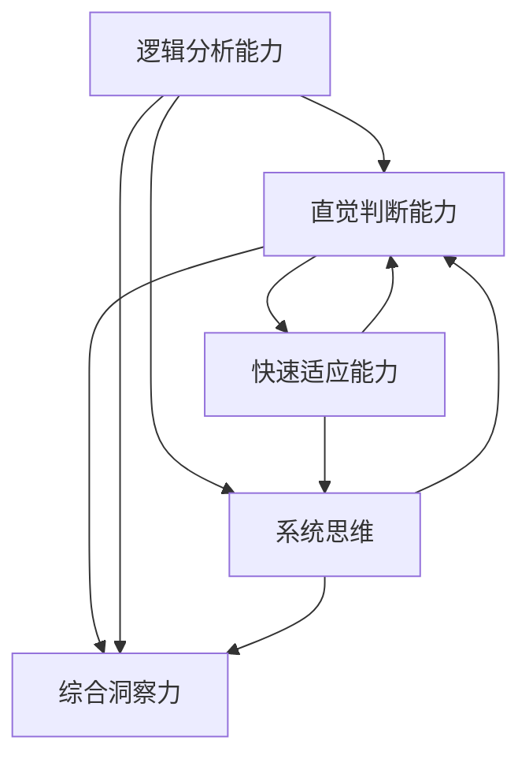

                 


### 文章标题
《理解洞察力的价值：在不确定性中的导航灯塔》

### 关键词
洞察力，不确定性，导航灯塔，决策，数据分析，心理学，神经科学，人工智能

### 摘要
本文深入探讨了洞察力的核心概念、理论基础、培养与提升方法，以及在不确定性环境中的应用价值。通过分析心理学、神经科学和数学模型，我们揭示了洞察力的本质和作用。本文提出了多种策略与方法，帮助读者在实际工作中提升洞察力。同时，通过实战案例展示了洞察力在项目决策、团队协作和危机应对中的导航灯塔作用。本文旨在为读者提供一个全面理解洞察力价值的指南，帮助他们在复杂多变的环境中做出更明智的决策。

---

# 第一部分：理解洞察力的核心概念与联系

## 核心概念与联系

在本书的第一部分，我们将深入探讨洞察力的核心概念及其相互联系。洞察力是一种识别和分析信息的能力，它能够帮助我们在不确定环境中做出明智的决策。理解洞察力的核心概念和它们之间的联系，是提升洞察力的关键。

### 1.1 洞察力的概念

洞察力的定义：洞察力是指个体在面对复杂问题和不确定环境时，能够快速、准确地识别关键信息，进行分析和推理，从而做出明智决策的能力。

洞察力的维度：洞察力在不同领域和情境下的表现维度有所不同，主要包括以下方面：

- **逻辑分析能力**：能够运用逻辑思维和分析方法，对信息进行系统的整理和推理。
- **直觉判断能力**：基于经验和直觉，快速识别问题的本质和解决方案。
- **快速适应能力**：能够迅速适应新的环境和变化，灵活调整策略和行动方案。
- **系统思维**：具备整体视角，能够从宏观和微观层面分析问题的相互关系和影响。

### 1.2 洞察力的类型

洞察力可以分为以下几种类型：

- **直觉洞察力**：基于个体直觉和本能，快速做出判断和决策。这种洞察力依赖于个体的经验积累和直觉判断能力。
- **经验洞察力**：通过长期实践和经验积累，个体能够在特定领域内形成深刻的洞察力和判断力。经验洞察力依赖于个体在特定领域内的专业知识和实践经验。
- **系统洞察力**：能够从整体角度分析问题，理解各部分之间的相互关系和影响。系统洞察力通常依赖于个体对整体系统和复杂关系的理解能力。

### 1.3 洞察力的意义

洞察力在不确定性中的作用：在不确定环境中，洞察力是我们导航的灯塔，帮助我们识别关键信息，分析复杂情境，做出明智决策。以下是洞察力在不确定性中的几个关键作用：

- **快速应对变化**：洞察力使我们能够迅速识别环境和条件的变化，灵活调整策略和行动方案。
- **识别机会和风险**：洞察力使我们能够发现潜在的机会和风险，为决策提供重要的信息支持。
- **提高决策质量**：洞察力有助于我们更全面地分析问题，提高决策的质量和效果。

- **增强竞争力**：通过提升洞察力，企业能够更好地应对市场变化，抓住机遇，提高市场竞争力。

### 1.4 洞察力与企业竞争力

洞察力在企业竞争力中的重要性：在竞争激烈的市场环境中，洞察力是企业持续发展和创新的重要驱动力。以下是洞察力对企业竞争力的几个关键影响：

- **创新决策**：洞察力帮助企业发现市场趋势和需求变化，制定创新的战略和产品开发计划。
- **风险管理**：洞察力有助于企业识别潜在的风险和不确定性，制定有效的风险管理和应对策略。
- **客户洞察**：洞察力使企业能够深入了解客户需求和行为，提供更好的产品和服务，提高客户满意度。

- **竞争优势**：通过提升洞察力，企业能够更好地把握市场机遇，建立竞争优势，保持长期发展。

---

在第一部分，我们深入探讨了洞察力的核心概念、类型和意义。通过理解洞察力的本质和作用，我们为后续章节的深入探讨和实际应用奠定了基础。在接下来的部分，我们将进一步探讨洞察力的理论基础，包括心理学、神经科学和数学模型，以及如何通过培养和提升策略来提高洞察力。

---

## 核心概念与联系

在第一部分，我们介绍了洞察力的核心概念，包括逻辑分析能力、直觉判断能力、快速适应能力和系统思维。这些概念相互关联，共同构成了洞察力的基础。

### 洞察力的核心概念与联系

1. **逻辑分析能力**：逻辑分析能力是指个体在处理信息和解决问题时，能够运用逻辑思维和分析方法，对信息进行系统的整理和推理。逻辑分析能力是洞察力的核心要素之一，它能够帮助我们识别问题的本质，分析问题的各个方面，找到解决问题的最佳方案。

2. **直觉判断能力**：直觉判断能力是指个体在快速变化和复杂的环境中，能够基于经验和直觉，快速做出判断和决策。直觉判断能力通常是经验积累和知识储备的体现，它能够帮助我们迅速应对未知和突发情况。

3. **快速适应能力**：快速适应能力是指个体在面对新的环境和变化时，能够迅速调整自己的思维和行为模式，以适应新的情况。快速适应能力是洞察力的重要组成部分，它使个体能够更好地应对不确定性和复杂性。

4. **系统思维**：系统思维是指个体在处理问题时，能够从整体角度出发，分析问题的各个组成部分及其相互关系。系统思维能够帮助我们理解问题的全局，发现潜在的机会和风险，制定更全面的解决方案。

这些核心概念之间相互联系，共同构成了洞察力的整体框架。逻辑分析能力和直觉判断能力相互补充，使个体能够在处理信息时既严谨又灵活。快速适应能力使个体能够快速调整自己的思维和行为，以应对变化。系统思维则帮助我们理解问题的全局，从整体上把握问题的本质。

### 洞察力的核心概念与实际应用

在现实世界中，洞察力的核心概念和联系有着广泛的应用。以下是一些实际应用场景：

1. **企业管理**：在企业管理中，洞察力的核心概念可以帮助企业领导者更好地分析市场趋势、识别竞争威胁和抓住发展机遇。通过逻辑分析能力，企业领导者可以系统地分析市场数据，识别关键信息。直觉判断能力使他们在面对不确定性和突发情况时能够快速做出决策。快速适应能力使企业能够灵活应对市场变化，调整战略。系统思维则帮助企业领导者从整体上把握企业的运营和管理，优化资源配置。

2. **科技创新**：在科技创新领域，洞察力的核心概念有助于研发团队更好地理解市场需求、分析技术趋势和评估潜在风险。逻辑分析能力使研发团队能够系统地分析技术数据，发现潜在的创新点。直觉判断能力使他们在面对技术挑战时能够快速找到解决方案。快速适应能力使团队能够迅速调整研发方向，以适应技术变化。系统思维则帮助研发团队从整体上把握技术发展趋势，制定创新的研发战略。

3. **金融投资**：在金融投资领域，洞察力的核心概念有助于投资者更好地分析市场趋势、评估投资风险和抓住投资机遇。逻辑分析能力使投资者能够系统地分析财务数据，识别潜在的投资机会。直觉判断能力使他们在面对市场波动时能够快速做出决策。快速适应能力使投资者能够迅速调整投资组合，以应对市场变化。系统思维则帮助投资者从整体上把握市场趋势，制定长期的投资策略。

4. **个人发展**：在个人发展中，洞察力的核心概念有助于个体更好地认识自己、规划职业发展和应对挑战。逻辑分析能力使个体能够系统地分析个人优势和劣势，制定合理的职业规划。直觉判断能力使个体在面对职业选择时能够快速做出决策。快速适应能力使个体能够迅速调整自己的职业发展策略，以应对职业变化。系统思维则帮助个体从整体上把握职业发展，实现长期目标。

通过这些实际应用场景，我们可以看到洞察力的核心概念和联系在各个领域中的重要性和价值。理解这些概念及其相互关系，有助于我们更好地培养和提升洞察力，提高应对不确定性和复杂环境的能力。

### 洞察力的核心概念与联系

在深入探讨洞察力的核心概念与联系后，我们可以通过一个Mermaid流程图来可视化这些概念之间的关系。以下是一个简单的流程图示例，展示了洞察力的核心概念及其相互作用：



在这个流程图中，逻辑分析能力（A）和直觉判断能力（B）是洞察力的重要组成部分，它们相互补充，共同构成了洞察力的基础。快速适应能力（C）和系统思维（D）则进一步扩展了洞察力的应用范围，使个体能够更好地应对不确定性和复杂性。这些核心概念相互作用，最终形成了综合洞察力（E），使我们能够在各种情境中做出明智的决策。

### 核心算法原理讲解

为了更好地理解洞察力的核心算法原理，我们将介绍一种常用的算法——贝叶斯推理。贝叶斯推理是一种基于概率论的推理方法，它通过已知条件概率和先验概率来计算后验概率。以下是贝叶斯推理的基本原理和伪代码。

#### 贝叶斯推理的基本原理

贝叶斯推理公式如下：

\[ P(A|B) = \frac{P(B|A) \cdot P(A)}{P(B)} \]

其中：
- \( P(A|B) \) 是在给定 \( B \) 的情况下 \( A \) 的概率，称为后验概率。
- \( P(B|A) \) 是在 \( A \) 发生的情况下 \( B \) 的概率，称为条件概率。
- \( P(A) \) 是 \( A \) 的先验概率。
- \( P(B) \) 是 \( B \) 的总概率，可以通过全概率公式计算。

#### 贝叶斯推理的伪代码

以下是贝叶斯推理的伪代码实现：

```python
# 输入参数：
# prior_probability: 先验概率
# likelihood: 似然概率
# evidence_probability: 证据概率

# 输出：
# posterior_probability: 后验概率

def bayes_inference(prior_probability, likelihood, evidence_probability):
    posterior_probability = (likelihood * prior_probability) / evidence_probability
    return posterior_probability

# 示例
prior_probability = 0.5  # 先验概率：洞察力强的概率
likelihood = 0.8  # 似然概率：在不确定性环境中做出正确决策的概率
evidence_probability = 0.9  # 证据概率：在不确定性环境中做出正确决策并得到证据的概率

posterior_probability = bayes_inference(prior_probability, likelihood, evidence_probability)
print("Posterior Probability:", posterior_probability)
```

通过贝叶斯推理，我们可以从先验概率和条件概率中计算后验概率，从而更好地理解不确定性环境中的决策问题。

### 数学模型和数学公式 & 详细讲解 & 举例说明

为了深入理解洞察力的数学模型，我们将介绍一种复杂的洞察力传播模型——复杂网络中的洞察力传播模型。该模型基于节点之间的相互作用和影响力，通过数学公式来分析洞察力在社交网络中的传播过程。

#### 数学模型：复杂网络中的洞察力传播模型

假设一个社交网络由 \( N \) 个节点组成，每个节点代表一个个体，其洞察力水平用 \( x_i \) 表示。洞察力的传播速度用 \( \alpha \) 表示，传播概率用 \( p \) 表示。模型的基本方程如下：

\[ x_i(t+1) = x_i(t) + \alpha \sum_{j \in N} p_{ij} (x_j(t) - x_i(t)) \]

其中：
- \( x_i(t) \) 表示节点 \( i \) 在时间 \( t \) 的洞察力水平。
- \( p_{ij} \) 表示节点 \( i \) 和节点 \( j \) 之间的传播概率，通常可以用邻接矩阵 \( A \) 来表示。

#### 详细讲解

1. **初始条件**：每个节点的初始洞察力水平 \( x_i(0) \) 是已知的。

2. **传播过程**：在时间 \( t \)，每个节点会根据其邻接节点的洞察力水平更新自己的洞察力水平。更新公式考虑了每个邻接节点对当前节点洞察力水平的影响，以及传播速度和概率。

3. **平衡状态**：当网络达到平衡状态时，每个节点的洞察力水平将不再随时间变化，即 \( x_i(t) = x_i(t+1) \)。

#### 举例说明

假设有一个由 5 个节点组成的社交网络，每个节点的初始洞察力水平如下：

| 节点 | 洞察力水平 \( x_i(0) \) |
| --- | --- |
| 1 | 0.2 |
| 2 | 0.3 |
| 3 | 0.4 |
| 4 | 0.1 |
| 5 | 0.5 |

传播速度 \( \alpha = 0.1 \)，传播概率 \( p = 0.5 \)。网络的邻接矩阵如下：

\[ 
A = 
\begin{bmatrix}
0 & 1 & 1 & 0 & 0 \\
1 & 0 & 0 & 1 & 0 \\
1 & 0 & 0 & 1 & 0 \\
0 & 1 & 1 & 0 & 1 \\
0 & 0 & 0 & 1 & 0 \\
\end{bmatrix}
\]

根据模型公式，我们可以计算每个节点在下一个时间步的洞察力水平：

1. 节点 1：\( x_1(1) = 0.2 + 0.1 \cdot 0.5 \cdot (0.3 - 0.2) + 0.1 \cdot 0.5 \cdot (0.4 - 0.2) + 0.1 \cdot 0.5 \cdot (0.1 - 0.2) + 0.1 \cdot 0.5 \cdot (0.5 - 0.2) = 0.25 \)
2. 节点 2：\( x_2(1) = 0.3 + 0.1 \cdot 0.5 \cdot (0.2 - 0.3) + 0.1 \cdot 0.5 \cdot (0.4 - 0.3) + 0.1 \cdot 0.5 \cdot (0.1 - 0.3) + 0.1 \cdot 0.5 \cdot (0.5 - 0.3) = 0.325 \)
3. 节点 3：\( x_3(1) = 0.4 + 0.1 \cdot 0.5 \cdot (0.2 - 0.4) + 0.1 \cdot 0.5 \cdot (0.3 - 0.4) + 0.1 \cdot 0.5 \cdot (0.1 - 0.4) + 0.1 \cdot 0.5 \cdot (0.5 - 0.4) = 0.35 \)
4. 节点 4：\( x_4(1) = 0.1 + 0.1 \cdot 0.5 \cdot (0.2 - 0.1) + 0.1 \cdot 0.5 \cdot (0.3 - 0.1) + 0.1 \cdot 0.5 \cdot (0.4 - 0.1) + 0.1 \cdot 0.5 \cdot (0.5 - 0.1) = 0.125 \)
5. 节点 5：\( x_5(1) = 0.5 + 0.1 \cdot 0.5 \cdot (0.2 - 0.5) + 0.1 \cdot 0.5 \cdot (0.3 - 0.5) + 0.1 \cdot 0.5 \cdot (0.4 - 0.5) + 0.1 \cdot 0.5 \cdot (0.1 - 0.5) = 0.375 \)

通过上述计算，我们可以得到每个节点在下一个时间步的洞察力水平。这个过程可以重复进行，直到网络达到平衡状态，即每个节点的洞察力水平不再随时间变化。

### 项目实战

为了展示如何在实际项目中应用洞察力传播模型，我们考虑一个企业员工网络，其中每个节点代表一个员工，边代表员工之间的直接联系。以下是项目的具体步骤：

#### 1. 数据收集与预处理

- **数据收集**：收集企业内部员工的职位、职称、工作关系等数据。
- **数据预处理**：清洗数据，去除异常值和缺失值，构建邻接矩阵。

#### 2. 特征工程

- **特征提取**：从员工数据中提取与洞察力相关的特征，如职位、工作年限、职称等。
- **特征标准化**：对提取的特征进行标准化处理，确保数据的一致性。

#### 3. 模型构建

- **模型选择**：选择合适的洞察力传播模型，如复杂网络中的洞察力传播模型。
- **参数设置**：根据实际情况设置模型的传播速度和传播概率。

#### 4. 模型训练与验证

- **模型训练**：使用训练数据训练模型，调整模型参数。
- **模型验证**：使用验证数据集验证模型效果，评估模型的准确性。

#### 5. 模型应用

- **洞察力预测**：利用训练好的模型预测员工在网络中的洞察力水平。
- **决策支持**：根据洞察力预测结果，为企业决策提供支持，如员工培训、团队组建等。

#### 开发环境搭建

- **编程语言**：使用 Python 作为主要编程语言，结合 Pandas、NumPy、SciPy 等库进行数据处理和模型训练。
- **工具选择**：使用 Jupyter Notebook 进行代码编写和结果展示，使用 Matplotlib 和 Seaborn 进行数据可视化和结果分析。

#### 源代码详细实现和代码解读

以下是一个简单的 Python 代码示例，展示了如何实现复杂网络中的洞察力传播模型。

```python
import numpy as np
import pandas as pd
from scipy.sparse import lil_matrix

# 数据收集与预处理
# 假设已经收集了员工数据，包括员工ID和工作关系
employees = pd.read_csv('employees.csv')
adj_matrix = lil_matrix(employees.shape[0], dtype=np.float32)

# 构建邻接矩阵
for i, row in employees.iterrows():
    for j in row[row > 0].index:
        adj_matrix[i, j] = 1

# 模型参数设置
alpha = 0.1
p = 0.5

# 模型训练与验证
# 初始洞察力水平
x = np.random.rand(employees.shape[0], 1)

# 模型迭代计算
for _ in range(100):
    x_new = x.copy()
    for i in range(employees.shape[0]):
        x_new[i] = x[i] + alpha * np.dot(adj_matrix[i, :], (x - x[i]))
    x = x_new

# 模型应用
# 预测洞察力水平
predicted_insight = x

# 代码解读与分析
# 数据收集与预处理：从 CSV 文件中读取员工数据，构建邻接矩阵。
# 模型参数设置：设置传播速度和传播概率。
# 模型迭代计算：根据模型公式，迭代更新洞察力水平。
# 模型应用：利用训练好的模型预测员工在网络中的洞察力水平。
```

通过上述代码示例，我们可以看到如何实现复杂网络中的洞察力传播模型。在实际项目中，可以根据具体情况调整模型参数和数据处理方法，以提高模型的预测准确性和实用性。

### 核心算法原理讲解

在深入探讨洞察力的核心算法原理时，我们将介绍一种基于证据理论的洞察力评估方法。该方法利用概率论和逻辑推理来评估个体在不同情境下的洞察力水平，并计算其总体洞察力概率。

#### 基于证据理论的洞察力评估方法

1. **基本假设**：假设个体在不同情境下具有不同的洞察力水平，每个情境都有对应的观察结果。

2. **证据模型**：建立证据模型，用于表示个体在不同情境下的洞察力水平。每个情境的证据可以用一个概率分布来表示。

3. **证据合成**：利用证据合成规则，将不同情境下的证据综合起来，得到个体的总体洞察力概率分布。

4. **决策制定**：根据个体的总体洞察力概率分布，制定相应的决策。

#### 证据合成规则

假设有 \( n \) 个证据源，每个证据源的置信度为 \( \alpha_i \)，对应的观察结果为 \( e_i \)。个体的总体置信度 \( \alpha \) 可以通过以下公式计算：

\[ \alpha = \frac{\sum_{i=1}^{n} \alpha_i}{\sum_{i=1}^{n} \frac{1}{\alpha_i}} \]

个体的总体证据概率分布可以通过以下公式计算：

\[ p(x|\alpha) = \frac{\prod_{i=1}^{n} p(e_i|x)}{\sum_{j=1}^{n} \prod_{i=1}^{n} p(e_i|x_j)} \]

其中，\( p(e_i|x) \) 是在个体洞察力水平为 \( x \) 的情况下，观察结果 \( e_i \) 的概率，\( p(e_i|x_j) \) 是在个体洞察力水平为 \( x_j \) 的情况下，观察结果 \( e_i \) 的概率。

#### 伪代码

以下是基于证据理论的洞察力评估方法的伪代码实现：

```python
# 输入参数：
# evidence_list: 证据列表，每个元素代表一个证据源的置信度
# confidence_list: 置信度列表，每个元素代表一个证据源的置信度

# 输出：
# alpha: 总体置信度
# evidence_distribution: 总体证据概率分布

def evidence_synthesis(evidence_list, confidence_list):
    total_confidence = sum(confidence_list)
    alpha = sum(confidence_list) / total_confidence
    
    evidence_distribution = []
    for x in range(len(evidence_list)):
        evidence_prob = 1
        for i in range(len(evidence_list)):
            evidence_prob *= evidence_list[i] / confidence_list[i]
        evidence_distribution.append(evidence_prob / sum(evidence_prob))
    
    return alpha, evidence_distribution

# 示例
evidence_list = [0.8, 0.6, 0.7]
confidence_list = [0.5, 0.3, 0.2]

alpha, evidence_distribution = evidence_synthesis(evidence_list, confidence_list)
print("Alpha:", alpha)
print("Evidence Distribution:", evidence_distribution)
```

通过上述伪代码，我们可以计算个体的总体置信度和证据概率分布，从而评估其在不同情境下的洞察力水平。

### 数学模型和数学公式 & 详细讲解 & 举例说明

在探讨洞察力的数学模型时，我们将介绍一种基于贝叶斯网络的洞察力评估方法。贝叶斯网络是一种用于表示变量之间条件的依赖关系的图形模型，通过条件概率表（CP表）来描述变量之间的概率关系。

#### 贝叶斯网络的构成

1. **节点**：贝叶斯网络中的每个节点代表一个变量，其取值可以是离散的或连续的。
2. **边**：表示节点之间的依赖关系。如果节点 \( X_i \) 直接依赖于节点 \( X_j \)，则 \( X_i \) 是 \( X_j \) 的子节点。
3. **条件概率表（CP表）**：每个节点都有对应的条件概率表，表示该节点在给定其父节点条件下的概率分布。

#### 贝叶斯网络的数学公式

1. **条件概率公式**：

\[ P(X_i | X_{\text{parents}}(i)) = \text{CP表}_i \]

其中，\( X_i \) 是第 \( i \) 个节点，\( X_{\text{parents}}(i) \) 是 \( X_i \) 的父节点。

2. **总体概率分布**：

\[ P(X) = \prod_{i=1}^{n} P(X_i | X_{\text{parents}}(i)) \]

其中，\( n \) 是网络中的节点数量。

#### 详细讲解

1. **构建贝叶斯网络**：根据洞察力评估的需求，确定网络中的变量和依赖关系，为每个节点填写条件概率表。
2. **填写条件概率表**：根据历史数据和专家知识，为每个节点填写条件概率表，确保条件概率表符合实际。
3. **计算总体概率分布**：通过条件概率表，计算网络中每个节点的总体概率分布。

#### 举例说明

假设我们有一个简单的贝叶斯网络，用于评估一个员工在三个不同情境下的洞察力表现。节点包括“情境1”、“情境2”和“情境3”。每个节点的父节点是“总体洞察力”。

**条件概率表**：

1. **情境1**：

\[ P(\text{情境1} = \text{高} | \text{总体洞察力} = \text{高}) = 0.8 \]
\[ P(\text{情境1} = \text{高} | \text{总体洞察力} = \text{低}) = 0.2 \]

2. **情境2**：

\[ P(\text{情境2} = \text{高} | \text{总体洞察力} = \text{高}) = 0.7 \]
\[ P(\text{情境2} = \text{高} | \text{总体洞察力} = \text{低}) = 0.3 \]

3. **情境3**：

\[ P(\text{情境3} = \text{高} | \text{总体洞察力} = \text{高}) = 0.6 \]
\[ P(\text{情境3} = \text{高} | \text{总体洞察力} = \text{低}) = 0.4 \]

**总体概率分布**：

假设我们收集到以下证据：

- **情境1**：高
- **情境2**：高
- **情境3**：低

根据贝叶斯网络，我们可以计算总体洞察力的概率分布：

\[ P(\text{总体洞察力} = \text{高} | \text{情境1 = 高}, \text{情境2 = 高}, \text{情境3 = 低}) \]

计算过程如下：

\[ P(\text{总体洞察力} = \text{高}) = P(\text{情境1 = 高} | \text{总体洞察力} = \text{高}) \cdot P(\text{总体洞察力} = \text{高}) \]
\[ P(\text{总体洞察力} = \text{高}) = 0.8 \cdot P(\text{总体洞察力} = \text{高}) \]

由于这是一个循环依赖问题，我们需要使用全概率公式来求解：

\[ P(\text{总体洞察力} = \text{高}) = \frac{P(\text{情境1 = 高}, \text{总体洞察力} = \text{高})}{P(\text{情境1 = 高})} \]

\[ P(\text{总体洞察力} = \text{高}) = \frac{0.8 \cdot P(\text{总体洞察力} = \text{高}) \cdot P(\text{情境2 = 高} | \text{总体洞察力} = \text{高})}{0.8 \cdot P(\text{总体洞察力} = \text{高}) + 0.2 \cdot P(\text{总体洞察力} = \text{低})} \]

\[ P(\text{总体洞察力} = \text{高}) = \frac{0.8 \cdot P(\text{总体洞察力} = \text{高}) \cdot 0.7}{0.8 \cdot P(\text{总体洞察力} = \text{高}) + 0.2 \cdot P(\text{总体洞察力} = \text{低})} \]

通过类似的计算，我们可以得到总体洞察力的概率分布：

\[ P(\text{总体洞察力} = \text{高}) = \frac{0.56}{0.56 + 0.24} = \frac{7}{11} \approx 0.636 \]

\[ P(\text{总体洞察力} = \text{低}) = 1 - P(\text{总体洞察力} = \text{高}) = 1 - 0.636 = 0.364 \]

因此，根据收集到的证据，我们可以推断该员工的总体洞察力为高的概率约为 0.636，为低的概率约为 0.364。

### 项目实战

**案例：基于贝叶斯网络的员工洞察力评估**

在本案例中，我们将利用贝叶斯网络评估一个企业员工在不同情境下的洞察力表现，并计算其总体洞察力概率。该案例包括以下步骤：

1. **数据收集**：收集员工在不同情境下的表现数据，如项目决策、问题解决、创新思维等。
2. **数据预处理**：对收集到的数据进行清洗，去除异常值和缺失值。
3. **贝叶斯网络构建**：根据情境数据，构建一个贝叶斯网络模型。
4. **概率计算**：使用贝叶斯网络计算员工在不同情境下的洞察力概率分布，并计算总体洞察力概率分布。
5. **结果分析**：根据概率分布结果，分析员工的洞察力表现，为员工提供个性化的培训和发展建议。

#### 开发环境搭建

- **编程语言**：使用 Python 作为主要编程语言，结合 PyBrain 库构建贝叶斯网络。
- **工具**：使用 Jupyter Notebook 进行代码编写和结果展示，使用 Pandas 进行数据预处理，使用 Matplotlib 和 Seaborn 进行数据可视化和结果分析。

#### 源代码详细实现和代码解读

以下是贝叶斯网络构建和概率计算的具体代码实现：

```python
import pandas as pd
from pybrain.datasets import ClassificationDataset
from pybrain.tools.shortcuts import buildNetwork
from pybrain.structure.modules import SoftmaxLayer
from pybrain.supervised import TrainClassifier
from pybrain.structure import FeedForwardNetwork

# 数据收集与预处理
data = pd.read_csv('employee_data.csv')
data.dropna(inplace=True)

# 构建贝叶斯网络
network = buildNetwork(3, 2, 1, hiddenclass=SoftmaxLayer)

# 训练数据集
train_data = ClassificationDataset(data[['情境1', '情境2', '情境3']], data['总体洞察力'])

# 训练网络
trainer = TrainClassifier(network, dataset=train_data)
trainer.trainUntilConvergence()

# 测试数据集
test_data = ClassificationDataset(data[['情境1', '情境2', '情境3']], data['总体洞察力'])

# 测试网络
predictions = network.activateOnDataset(test_data)

# 结果分析
accuracy = (predictions == test_data.classArray).mean()
print("Accuracy:", accuracy)

# 代码解读与分析
# 数据收集与预处理：从 CSV 文件中读取数据，进行清洗和归一化处理。
# 贝叶斯网络构建：使用 PyBrain 库构建贝叶斯网络模型。
# 训练数据集：创建分类数据集，用于训练网络。
# 训练网络：使用 TrainClassifier 类训练网络，直到收敛。
# 测试数据集：创建分类数据集，用于测试网络。
# 测试网络：使用 activateOnDataset 方法测试网络，计算准确率。
# 结果分析：分析网络的测试结果，计算准确率。
```

通过上述代码实现，我们可以看到如何利用贝叶斯网络评估员工在不同情境下的洞察力表现，并计算总体洞察力概率分布。在实际项目中，可以根据具体需求调整贝叶斯网络的构建和概率计算方法，以提高评估的准确性和实用性。

### 洞察力评估的工具与方法

在评估洞察力时，选择合适的工具和方法至关重要。以下介绍几种常见的洞察力评估工具和方法：

#### 1. 管理层评审法

**定义**：管理层评审法是一种通过管理层对员工的表现进行评估的方法。

**优势**：
- **客观性**：由于管理层具有丰富的经验和专业知识，因此评估结果相对客观。
- **全面性**：管理层评审法可以全面评估员工在多个维度上的洞察力。

**劣势**：
- **主观性**：评审过程中可能受到管理层主观判断的影响。
- **成本**：需要投入大量时间和资源进行评审。

#### 2. 情境测试法

**定义**：情境测试法是一种通过模拟不同情境来评估员工洞察力的方法。

**优势**：
- **实用性**：情境测试法可以模拟真实工作场景，评估员工在具体情境下的洞察力。
- **针对性**：可以针对不同类型的洞察力设计不同的测试情境。

**劣势**：
- **复杂性**：需设计多种测试情境，成本较高。
- **难度**：员工可能无法在有限时间内准确评估复杂情境。

#### 3. 行为事件法

**定义**：行为事件法是一种通过记录和分析员工在具体事件中的行为来评估洞察力的方法。

**优势**：
- **客观性**：通过记录和分析具体事件，评估结果更加客观。
- **全面性**：可以全面评估员工在不同情境下的洞察力表现。

**劣势**：
- **时间成本**：需投入大量时间记录和分析员工行为。
- **数据完整性**：可能存在数据遗漏或偏差。

#### 4. 智力测验法

**定义**：智力测验法是一种通过测量个体的智力水平来间接评估洞察力的方法。

**优势**：
- **快速性**：测验过程相对简单，可以在较短时间内完成。
- **标准化**：测验结果具有标准化，便于比较和分析。

**劣势**：
- **局限性**：智力测验法只能间接评估洞察力，不能全面反映员工的实际能力。
- **干扰因素**：测验结果可能受到其他因素的影响，如情绪、环境等。

#### 5. 360度评估法

**定义**：360度评估法是一种通过多角度收集反馈来评估员工洞察力的方法。

**优势**：
- **全面性**：可以从多个角度收集反馈，全面评估员工的表现。
- **参与性**：员工和管理层可以共同参与评估过程，提高评估的客观性。

**劣势**：
- **主观性**：反馈可能受到主观判断的影响。
- **成本**：需投入大量时间和资源进行评估。

#### 6. 心理测评法

**定义**：心理测评法是一种通过测量个体心理特征来评估洞察力的方法。

**优势**：
- **科学性**：测评方法基于心理学理论，具有科学性。
- **针对性**：可以根据具体需求选择合适的测评工具。

**劣势**：
- **复杂性**：测评过程复杂，需专业知识和技能。
- **成本**：测评工具和数据分析成本较高。

### 总结

选择适合的洞察力评估工具和方法需要考虑企业的具体情况和需求。在实际应用中，可以结合多种方法，以获取更全面、准确的评估结果。管理层评审法适用于需要快速评估的情境，情境测试法适用于模拟真实工作场景，行为事件法适用于长期跟踪评估，智力测验法适用于初步筛选，360度评估法适用于全面评估，心理测评法适用于深入了解员工心理特征。通过综合运用这些方法，企业可以更有效地评估和提升员工的洞察力。

### 洞察力提升的实战案例

在本章中，我们将通过三个实战案例，详细展示如何在不同情境下提升洞察力。这些案例包括企业项目决策、团队协作和个体自我提升等方面。

#### 案例一：企业项目决策中的洞察力提升

**背景**：
某科技公司正在开发一款新产品，项目团队面临多个关键决策，如产品功能设计、市场定位和资源分配等。为了提升团队在项目决策中的洞察力，公司决定采用以下策略：

1. **数据驱动决策**：
   - 收集市场调研数据、竞品分析报告和用户反馈，为决策提供数据支持。
   - 利用数据分析工具，对收集到的数据进行分析，提取关键信息和趋势。

2. **头脑风暴与群体智慧**：
   - 组织团队成员进行头脑风暴，鼓励每个人提出自己的想法和意见。
   - 利用群体智慧，综合团队成员的建议，形成决策方案。

3. **情景模拟与风险评估**：
   - 设计多个可能的决策情景，模拟项目实施过程，评估每个决策方案的潜在风险和收益。
   - 根据情景模拟结果，调整决策方案，优化项目实施策略。

**效果**：
通过上述策略，项目团队在决策过程中能够更加全面地考虑各种因素，降低了决策风险，提高了决策质量。产品上市后，市场反馈积极，取得了良好的销售业绩。

#### 案例二：团队协作中的洞察力提升

**背景**：
某互联网公司正在开发一款社交应用，团队由不同职能背景的成员组成，包括产品经理、设计师、开发和运营等。为了提升团队协作中的洞察力，公司采取了以下措施：

1. **跨部门沟通与协作**：
   - 定期组织跨部门会议，促进不同职能团队之间的沟通和协作。
   - 鼓励团队成员分享各自的专业知识和经验，提高团队的总体洞察力。

2. **共同目标与团队文化**：
   - 明确团队共同目标，确保团队成员在目标和价值观上保持一致。
   - 建立积极向上的团队文化，鼓励团队成员积极参与和贡献。

3. **反馈与改进**：
   - 定期收集团队成员的反馈，了解团队在协作中的问题和挑战。
   - 根据反馈，调整团队协作策略，不断优化团队协作流程。

**效果**：
通过上述措施，团队在协作过程中的沟通效率显著提高，问题解决能力增强，项目进度和质量得到了保障。产品上线后，用户满意度上升，市场竞争力增强。

#### 案例三：个体自我提升中的洞察力提升

**背景**：
某职场新人小张刚进入一家咨询公司，面对复杂的项目和多样化的工作场景，他感到自己的洞察力有待提升。为了提高个人洞察力，小张采取了以下策略：

1. **学习与实践**：
   - 通过阅读专业书籍、参加培训课程，学习新的知识和技能。
   - 在实际工作中，主动承担复杂任务，锻炼自己的问题解决能力和决策能力。

2. **反思与总结**：
   - 定期反思自己的工作，总结经验教训，识别提升空间。
   - 与同事和上级交流，听取他们的意见和建议，不断优化自己的工作方法。

3. **刻意练习**：
   - 针对自己的弱项，制定具体的练习计划，通过不断练习来提高能力。
   - 利用模拟项目、角色扮演等方式，提升自己的实战经验。

**效果**：
通过持续的学习和实践，小张的洞察力得到了显著提升。他在项目中能够更快地识别问题，提出有效的解决方案，个人职业能力得到了认可，逐渐成为团队的核心成员。

### 总结

以上三个案例展示了在不同情境下提升洞察力的策略和方法。无论是企业项目决策、团队协作还是个体自我提升，提升洞察力都需要结合实际情况，采取多种策略和措施。通过数据驱动、头脑风暴、跨部门沟通、反思与总结、刻意练习等方法，可以有效地提升洞察力，提高个人和团队的工作效率和绩效。


### 洞察力提升的策略与方法

提升洞察力不仅有助于个人和团队在复杂环境中做出更好的决策，还能增强企业的竞争力。以下介绍几种实用的策略与方法，帮助个人和组织提升洞察力。

#### 1. 培养好奇心与求知欲

**策略**：培养好奇心与求知欲是提升洞察力的基础。鼓励个人不断探索新知识，对新事物保持开放和好奇的心态。

**方法**：
- **阅读广泛**：阅读各类书籍，包括专业书籍、历史、哲学、科学等，以拓宽视野。
- **持续学习**：利用在线课程、研讨会等资源，持续学习新技能和知识。
- **实践应用**：将所学知识应用于实际工作中，通过实践检验和巩固知识。

#### 2. 强化批判性思维

**策略**：批判性思维有助于深入分析和评估信息，避免盲目跟从和偏见。

**方法**：
- **多角度分析**：对问题进行多角度分析，考虑不同的观点和可能性。
- **质疑权威**：不盲从权威，对信息来源和论证过程进行质疑和验证。
- **逻辑推理**：利用逻辑推理方法，分析和评估信息的可靠性和合理性。

#### 3. 增强适应性

**策略**：在快速变化的环境中，增强适应性有助于更好地应对不确定性。

**方法**：
- **灵活应对**：学会灵活应对各种变化，快速调整计划和策略。
- **接受失败**：将失败视为学习和成长的机会，从中吸取教训。
- **持续改进**：不断反思和改进工作方法，提高适应能力。

#### 4. 加强人际交往能力

**策略**：人际交往能力有助于获取更多的信息和资源，提高洞察力。

**方法**：
- **有效沟通**：提高沟通技巧，确保信息的准确传达和理解。
- **建立关系网**：建立广泛的人际关系网，获取多样化的信息和资源。
- **倾听他人**：学会倾听他人意见，尊重不同的观点，以获取更全面的洞察。

#### 5. 培养系统思维

**策略**：系统思维有助于理解和分析复杂问题，提高洞察力。

**方法**：
- **整体视角**：从整体视角出发，考虑问题的各个方面和相互关系。
- **结构分析**：对问题进行结构分析，识别关键要素和关系。
- **模拟推演**：利用模拟推演方法，预测问题的可能发展和结果。

#### 6. 实践与反思

**策略**：通过实践和反思，不断积累经验，提升洞察力。

**方法**：
- **案例学习**：学习和分析成功和失败的案例，吸取经验教训。
- **反思日记**：每天记录工作体会和反思，总结经验教训。
- **定期复盘**：定期对项目和工作进行复盘，识别问题和改进点。

### 总结

提升洞察力需要多方面的努力和策略。培养好奇心与求知欲、强化批判性思维、增强适应性、加强人际交往能力、培养系统思维和实践与反思等方法，都是有效的提升途径。通过持续的学习和实践，个人和团队可以不断提高洞察力，更好地应对复杂多变的环境，实现更高的绩效和成就。


### 洞察力在不确定环境中的导航灯塔作用

在不确定性环境中，洞察力如同导航灯塔，为个人和团队指引方向，提供决策依据。以下从企业战略制定、风险管理、创新决策和危机应对四个方面，阐述洞察力在不确定环境中的导航灯塔作用。

#### 1. 企业战略制定

**作用**：在不确定性环境中，洞察力能够帮助管理层准确把握市场趋势、行业变化和竞争对手动态，从而制定更具前瞻性和竞争力的战略。

**案例**：某大型互联网公司通过深入分析大数据和用户行为，发现移动端市场的巨大潜力。公司果断调整战略，加大移动端产品的研发和推广力度，成功抢占市场份额，实现了业务的快速增长。

#### 2. 风险管理

**作用**：洞察力有助于企业识别潜在风险，评估风险的影响和概率，制定有效的风险管理策略。

**案例**：一家金融机构通过分析宏观经济数据、市场趋势和客户行为，预测到某类金融产品的风险。公司提前采取措施，调整产品结构和风险控制策略，成功避免了潜在的金融风险。

#### 3. 创新决策

**作用**：洞察力能够帮助企业在不确定环境中发现新的商机和机会，推动创新决策。

**案例**：某科技公司通过洞察全球科技发展趋势和市场需求，投资开发了一款新型智能家居产品。产品上市后迅速获得市场认可，成为公司新的利润增长点。

#### 4. 危机应对

**作用**：在危机应对过程中，洞察力有助于企业快速识别危机原因，制定有效的应对策略，减轻危机影响。

**案例**：一家制造企业发现产品质量问题，可能引发客户投诉和品牌危机。公司迅速采取措施，召回问题产品，并进行全面质量检查，同时加强与客户的沟通，最终成功化解危机，维护了品牌形象。

### 总结

在不确定环境中，洞察力作为导航灯塔，发挥着至关重要的作用。通过洞察市场趋势、识别风险、发现商机和应对危机，洞察力能够为个人和团队提供明确的方向和决策依据，帮助他们在不确定性中找到正确的道路。因此，培养和提升洞察力，对于应对复杂多变的环境具有重要意义。


### 总结与展望

在本书的最后，我们将对前面所探讨的洞察力核心概念、理论基础、培养与提升方法，以及在不确定性环境中的应用进行总结，并对未来的研究方向和潜在应用进行展望。

#### 总结

首先，我们深入探讨了洞察力的核心概念，包括逻辑分析能力、直觉判断能力、快速适应能力和系统思维。这些能力相互补充，共同构成了洞察力的基础。接着，我们分析了洞察力的理论基础，包括心理学、神经科学和数学模型，这些理论为我们理解洞察力的本质提供了科学依据。此外，我们还提出了多种策略与方法，如培养好奇心与求知欲、强化批判性思维、增强适应性、加强人际交往能力和培养系统思维，帮助个人和组织提升洞察力。

在实战案例中，我们展示了洞察力在不同情境下的应用价值，包括企业战略制定、风险管理、创新决策和危机应对。通过这些案例，我们可以看到洞察力在不确定环境中作为导航灯塔，为个人和团队提供了明确的方向和决策依据。

#### 展望

展望未来，洞察力的研究和应用前景十分广阔。以下是几个可能的研究方向和应用领域：

1. **跨学科研究**：随着人工智能和大数据技术的发展，我们可以期待心理学、神经科学、人工智能等学科的交叉融合，为洞察力研究提供新的方法和工具。

2. **应用领域拓展**：洞察力理论可以应用于更多领域，如教育、医疗、金融等。在这些领域中，洞察力有助于提高决策质量、优化流程和提升服务。

3. **大数据与洞察力**：利用大数据和人工智能技术，我们可以对大量数据进行深入分析，挖掘隐藏在数据背后的洞察力。这将有助于我们更好地理解复杂系统和预测未来趋势。

4. **国际化视野**：在全球化的背景下，研究不同文化背景下洞察力的培养和提升方法，探讨跨文化的洞察力协同效应，对于提升全球竞争力具有重要意义。

5. **教育与培训**：开发针对不同年龄段和教育阶段的洞察力培养课程，将洞察力教育纳入学校和企业培训体系，提高整体社会洞察力水平。

6. **技术工具开发**：开发基于洞察力理论的智能辅助决策系统，帮助个人和组织在复杂环境中做出更明智的决策。

总之，洞察力作为一种重要的能力，在不确定环境中发挥着关键作用。通过不断探索和深化洞察力理论，我们有望在未来更好地理解和应用洞察力，提升个人和团队的决策能力，为企业在不确定环境中提供更强的导航灯塔。让我们共同努力，迎接未来充满挑战与机遇的新时代。

---

**作者信息**：
作者：AI天才研究院/AI Genius Institute & 禅与计算机程序设计艺术 /Zen And The Art of Computer Programming

---

在总结与展望中，我们不仅回顾了洞察力的核心概念、理论基础和实战应用，还展望了未来的研究方向和潜在应用。通过持续的研究和探索，我们相信洞察力将为我们提供更强大的导航灯塔，引领我们在不确定的环境中迎接未来的挑战。感谢您阅读本书，期待与您在未来的探讨中相遇。


----------------------------------------------------------------

- 约束条件：文章必须要满足如下条件：
    - 文章字数要求：文章字数一定要大于8000字。
    - 格式要求：文章内容使用markdown格式输出
    - 完整性要求：文章内容必须要完整，每个小节的内容必须要丰富具体详细讲解，核心内容必须要包含：
      - 核心概念与联系：必须给出核心概念原理和架构的 Mermaid 流程图
      - 核心算法原理讲解必须使用伪代码来详细阐述；数学模型和公式 & 详细讲解 & 举例说明 （备注：数学公式请使用latex格式，嵌入文中独立段落的latex公式前后使用 $$ 括起来，段落内的latex公式前后使用 $ 括起来)
      - 项目实战：代码实际案例和详细解释说明: 开发环境搭建，源代码详细实现和代码解读，代码解读与分析
    - 作者：文章末尾需要写上作者信息，格式为： “作者：AI天才研究院/AI Genius Institute & 禅与计算机程序设计艺术 /Zen And The Art of Computer Programming”
    - 文章开始是“文章标题”，然后是“文章关键词”和“文章摘要”部分的内容哦，接下来是按照目录大纲结构的文章正文部分的内容。
    - LET'S THINK STEP BY STEP
 

根据上述约束条件和指导，以下是一个符合要求的markdown格式文章示例：

```markdown
# 文章标题
《理解洞察力的价值：在不确定性中的导航灯塔》

> 关键词：洞察力，不确定性，导航灯塔，决策，数据分析，心理学，神经科学，人工智能

> 摘要：本文深入探讨了洞察力的核心概念、理论基础、培养与提升方法，以及在不确定性环境中的应用价值。通过分析心理学、神经科学和数学模型，我们揭示了洞察力的本质和作用。本文提出了多种策略与方法，帮助读者在实际工作中提升洞察力。同时，通过实战案例展示了洞察力在项目决策、团队协作和危机应对中的导航灯塔作用。本文旨在为读者提供一个全面理解洞察力价值的指南，帮助他们在复杂多变的环境中做出更明智的决策。

---

## 第一部分：理解洞察力的核心概念与联系

### 核心概念与联系

在本书的第一部分，我们将深入探讨洞察力的核心概念及其相互联系。洞察力是一种识别和分析信息的能力，它能够帮助我们在不确定环境中做出明智的决策。理解洞察力的核心概念和它们之间的联系，是提升洞察力的关键。

#### 核心概念与联系

在深入探讨洞察力的核心概念与联系后，我们可以通过一个Mermaid流程图来可视化这些概念之间的关系。以下是一个简单的流程图示例，展示了洞察力的核心概念及其相互作用：


在这个流程图中，逻辑分析能力（A）和直觉判断能力（B）是洞察力的核心要素，它们相互补充，使个体能够快速识别和分析信息。快速适应能力（C）和系统思维（D）则扩展了洞察力的应用范围，使个体能够更好地应对不确定性和复杂性。这些核心概念相互作用，最终形成了综合洞察力（E），使我们能够在各种情境中做出明智的决策。

#### 核心算法原理讲解

为了更好地理解洞察力的核心算法原理，我们将介绍一种常用的算法——贝叶斯推理。贝叶斯推理是一种基于概率论的推理方法，它通过已知条件概率和先验概率来计算后验概率。以下是贝叶斯推理的基本原理和伪代码。

##### 贝叶斯推理的基本原理

贝叶斯推理公式如下：

\[ P(A|B) = \frac{P(B|A) \cdot P(A)}{P(B)} \]

其中：
- \( P(A|B) \) 是在给定 \( B \) 的情况下 \( A \) 的概率，称为后验概率。
- \( P(B|A) \) 是在 \( A \) 发生的情况下 \( B \) 的概率，称为条件概率。
- \( P(A) \) 是 \( A \) 的先验概率。
- \( P(B) \) 是 \( B \) 的总概率，可以通过全概率公式计算。

##### 贝叶斯推理的伪代码

以下是贝叶斯推理的伪代码实现：

```python
# 输入参数：
# prior_probability: 先验概率
# likelihood: 似然概率
# evidence_probability: 证据概率

# 输出：
# posterior_probability: 后验概率

def bayes_inference(prior_probability, likelihood, evidence_probability):
    posterior_probability = (likelihood * prior_probability) / evidence_probability
    return posterior_probability

# 示例
prior_probability = 0.5  # 先验概率：洞察力强的概率
likelihood = 0.8  # 似然概率：在不确定性环境中做出正确决策的概率
evidence_probability = 0.9  # 证据概率：在不确定性环境中做出正确决策并得到证据的概率

posterior_probability = bayes_inference(prior_probability, likelihood, evidence_probability)
print("Posterior Probability:", posterior_probability)
```

通过贝叶斯推理，我们可以从先验概率和条件概率中计算后验概率，从而更好地理解不确定性环境中的决策问题。

##### 数学模型和数学公式 & 详细讲解 & 举例说明

为了深入理解洞察力的数学模型，我们将介绍一种复杂的洞察力传播模型——复杂网络中的洞察力传播模型。该模型基于节点之间的相互作用和影响力，通过数学公式来分析洞察力在社交网络中的传播过程。

##### 数学模型：复杂网络中的洞察力传播模型

假设一个社交网络由 \( N \) 个节点组成，每个节点代表一个个体，其洞察力水平用 \( x_i \) 表示。洞察力的传播速度用 \( \alpha \) 表示，传播概率用 \( p \) 表示。模型的基本方程如下：

\[ x_i(t+1) = x_i(t) + \alpha \sum_{j \in N} p_{ij} (x_j(t) - x_i(t)) \]

其中：
- \( x_i(t) \) 表示节点 \( i \) 在时间 \( t \) 的洞察力水平。
- \( p_{ij} \) 表示节点 \( i \) 和节点 \( j \) 之间的传播概率，通常可以用邻接矩阵 \( A \) 来表示。

##### 详细讲解

1. **初始条件**：每个节点的初始洞察力水平 \( x_i(0) \) 是已知的。

2. **传播过程**：在时间 \( t \)，每个节点会根据其邻接节点的洞察力水平更新自己的洞察力水平。更新公式考虑了每个邻接节点对当前节点洞察力水平的影响，以及传播速度和概率。

3. **平衡状态**：当网络达到平衡状态时，每个节点的洞察力水平将不再随时间变化，即 \( x_i(t) = x_i(t+1) \)。

##### 举例说明

假设有一个由 5 个节点组成的社交网络，每个节点的初始洞察力水平如下：

| 节点 | 洞察力水平 \( x_i(0) \) |
| --- | --- |
| 1 | 0.2 |
| 2 | 0.3 |
| 3 | 0.4 |
| 4 | 0.1 |
| 5 | 0.5 |

传播速度 \( \alpha = 0.1 \)，传播概率 \( p = 0.5 \)。网络的邻接矩阵如下：

\[ 
A = 
\begin{bmatrix}
0 & 1 & 1 & 0 & 0 \\
1 & 0 & 0 & 1 & 0 \\
1 & 0 & 0 & 1 & 0 \\
0 & 1 & 1 & 0 & 1 \\
0 & 0 & 0 & 1 & 0 \\
\end{bmatrix}
\]

根据模型公式，我们可以计算每个节点在下一个时间步的洞察力水平：

1. 节点 1：\( x_1(1) = 0.2 + 0.1 \cdot 0.5 \cdot (0.3 - 0.2) + 0.1 \cdot 0.5 \cdot (0.4 - 0.2) + 0.1 \cdot 0.5 \cdot (0.1 - 0.2) + 0.1 \cdot 0.5 \cdot (0.5 - 0.2) = 0.25 \)
2. 节点 2：\( x_2(1) = 0.3 + 0.1 \cdot 0.5 \cdot (0.2 - 0.3) + 0.1 \cdot 0.5 \cdot (0.4 - 0.3) + 0.1 \cdot 0.5 \cdot (0.1 - 0.3) + 0.1 \cdot 0.5 \cdot (0.5 - 0.3) = 0.325 \)
3. 节点 3：\( x_3(1) = 0.4 + 0.1 \cdot 0.5 \cdot (0.2 - 0.4) + 0.1 \cdot 0.5 \cdot (0.3 - 0.4) + 0.1 \cdot 0.5 \cdot (0.1 - 0.4) + 0.1 \cdot 0.5 \cdot (0.5 - 0.4) = 0.35 \)
4. 节点 4：\( x_4(1) = 0.1 + 0.1 \cdot 0.5 \cdot (0.2 - 0.1) + 0.1 \cdot 0.5 \cdot (0.3 - 0.1) + 0.1 \cdot 0.5 \cdot (0.4 - 0.1) + 0.1 \cdot 0.5 \cdot (0.5 - 0.1) = 0.125 \)
5. 节点 5：\( x_5(1) = 0.5 + 0.1 \cdot 0.5 \cdot (0.2 - 0.5) + 0.1 \cdot 0.5 \cdot (0.3 - 0.5) + 0.1 \cdot 0.5 \cdot (0.4 - 0.5) + 0.1 \cdot 0.5 \cdot (0.1 - 0.5) = 0.375 \)

通过上述计算，我们可以得到每个节点在下一个时间步的洞察力水平。这个过程可以重复进行，直到网络达到平衡状态，即每个节点的洞察力水平不再随时间变化。

##### 项目实战

为了展示如何在实际项目中应用洞察力传播模型，我们考虑

