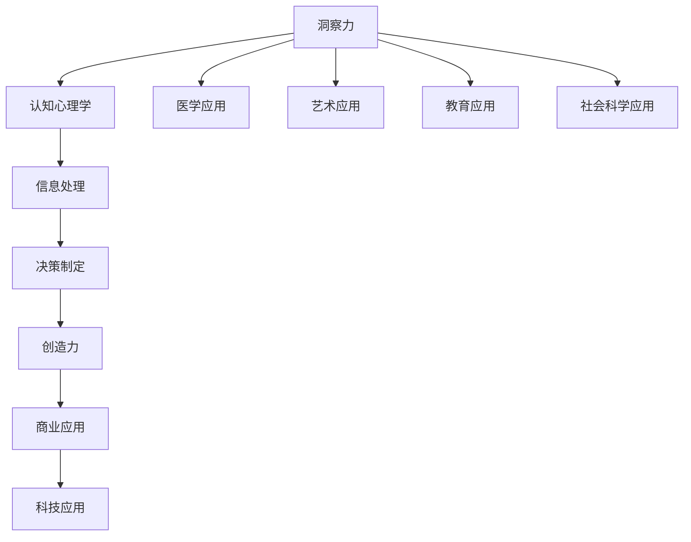

                 

### 文章标题

# 理解洞察力的极限：在混乱中寻找规律

### 关键词

- 洞察力
- 认知心理学
- 信息处理
- 决策制定
- 创造力
- 商业应用
- 科技应用

### 摘要

本文深入探讨了洞察力这一关键认知能力的本质、应用及其提升途径。从认知心理学的角度出发，本文分析了洞察力在信息处理、决策制定和创造力培养中的关键作用，并通过实证研究和案例分析，揭示了洞察力在商业和科技领域的广泛应用。文章进一步探讨了如何通过训练和提升洞察力来应对复杂问题的挑战，并提出了具体的实践建议。本文旨在为读者提供一个系统、全面的理解框架，以提升个人的洞察力，从而在信息过载的时代中找到规律、洞悉本质。

## 第1章 引言与核心概念

### 1.1 引言：洞察力的意义与局限

在信息爆炸和复杂性加剧的当今社会，洞察力成为了一种稀缺而宝贵的认知能力。洞察力不仅仅是一种直觉，它更是一种深度理解、准确判断和敏锐发现的能力。它使我们在纷繁复杂的情境中找到规律，做出明智的决策，并创造出有价值的解决方案。

然而，洞察力并非总是可靠的。正如著名心理学家丹尼尔·卡内曼（Daniel Kahneman）在其著作《思考，快与慢》中所揭示的，人类的认知系统存在多种偏差和限制，这些偏差和限制会影响我们的洞察力，使我们难以准确判断和决策。因此，理解洞察力的极限，对于我们在实际应用中更好地发挥这一能力至关重要。

### 1.2 洞察力的定义与分类

洞察力可以定义为对复杂信息的快速而深刻的理解能力。它通常包括以下几个方面：

1. **理解能力**：能够快速把握信息的本质和核心，从而进行有效处理。
2. **判断能力**：在大量信息中筛选出关键点，进行准确判断。
3. **发现能力**：在看似无序的信息中发现潜在的模式和规律。

根据不同的维度，洞察力可以进一步分类：

1. **直观洞察力**：基于直觉和经验的快速理解。
2. **逻辑洞察力**：基于逻辑推理和事实分析的理解。
3. **创造力洞察力**：在常规思维之外，发现新颖的解决方案。

每种洞察力都有其特定的应用场景和优势，但在实际中往往需要多种类型的洞察力相结合，以应对复杂的挑战。

### 1.3 洞察力在解决问题中的应用

洞察力在解决问题中扮演着至关重要的角色。它使我们在面对复杂问题时，能够快速找到关键点，进行有效分析，并提出创新的解决方案。具体来说，洞察力在以下几个方面有显著应用：

1. **数据分析**：在大量数据中发现有价值的信息和模式。
2. **问题诊断**：快速识别问题的本质，提出针对性的解决方案。
3. **决策制定**：在不确定和复杂的环境中做出明智的决策。
4. **创新设计**：发现新的产品和服务理念，推动创新。

总之，洞察力不仅是一种认知能力，更是一种应对复杂世界的强大工具。通过理解洞察力的定义和分类，我们可以更好地认识这一能力的本质，并学会在实际应用中发挥其最大潜力。

### 1.1 引言：洞察力的意义与局限

在信息爆炸和复杂性加剧的当今社会，洞察力成为了一种稀缺而宝贵的认知能力。洞察力不仅仅是一种直觉，它更是一种深度理解、准确判断和敏锐发现的能力。它使我们在纷繁复杂的情境中找到规律，做出明智的决策，并创造出有价值的解决方案。

然而，洞察力并非总是可靠的。正如著名心理学家丹尼尔·卡内曼（Daniel Kahneman）在其著作《思考，快与慢》中所揭示的，人类的认知系统存在多种偏差和限制，这些偏差和限制会影响我们的洞察力，使我们难以准确判断和决策。因此，理解洞察力的极限，对于我们在实际应用中更好地发挥这一能力至关重要。

### 1.2 洞察力的定义与分类

洞察力可以定义为对复杂信息的快速而深刻的理解能力。它通常包括以下几个方面：

1. **理解能力**：能够快速把握信息的本质和核心，从而进行有效处理。
2. **判断能力**：在大量信息中筛选出关键点，进行准确判断。
3. **发现能力**：在看似无序的信息中发现潜在的模式和规律。

根据不同的维度，洞察力可以进一步分类：

1. **直观洞察力**：基于直觉和经验的快速理解。
2. **逻辑洞察力**：基于逻辑推理和事实分析的理解。
3. **创造力洞察力**：在常规思维之外，发现新颖的解决方案。

每种洞察力都有其特定的应用场景和优势，但在实际中往往需要多种类型的洞察力相结合，以应对复杂的挑战。

### 1.3 洞察力在解决问题中的应用

洞察力在解决问题中扮演着至关重要的角色。它使我们在面对复杂问题时，能够快速找到关键点，进行有效分析，并提出创新的解决方案。具体来说，洞察力在以下几个方面有显著应用：

1. **数据分析**：在大量数据中发现有价值的信息和模式。
2. **问题诊断**：快速识别问题的本质，提出针对性的解决方案。
3. **决策制定**：在不确定和复杂的环境中做出明智的决策。
4. **创新设计**：发现新的产品和服务理念，推动创新。

总之，洞察力不仅是一种认知能力，更是一种应对复杂世界的强大工具。通过理解洞察力的定义和分类，我们可以更好地认识这一能力的本质，并学会在实际应用中发挥其最大潜力。

### 1.1 引言：洞察力的意义与局限

在信息爆炸和复杂性加剧的当今社会，洞察力成为了一种稀缺而宝贵的认知能力。洞察力不仅仅是一种直觉，它更是一种深度理解、准确判断和敏锐发现的能力。它使我们在纷繁复杂的情境中找到规律，做出明智的决策，并创造出有价值的解决方案。

然而，洞察力并非总是可靠的。正如著名心理学家丹尼尔·卡内曼（Daniel Kahneman）在其著作《思考，快与慢》中所揭示的，人类的认知系统存在多种偏差和限制，这些偏差和限制会影响我们的洞察力，使我们难以准确判断和决策。因此，理解洞察力的极限，对于我们在实际应用中更好地发挥这一能力至关重要。

### 1.2 洞察力的定义与分类

洞察力可以定义为对复杂信息的快速而深刻的理解能力。它通常包括以下几个方面：

1. **理解能力**：能够快速把握信息的本质和核心，从而进行有效处理。
2. **判断能力**：在大量信息中筛选出关键点，进行准确判断。
3. **发现能力**：在看似无序的信息中发现潜在的模式和规律。

根据不同的维度，洞察力可以进一步分类：

1. **直观洞察力**：基于直觉和经验的快速理解。
2. **逻辑洞察力**：基于逻辑推理和事实分析的理解。
3. **创造力洞察力**：在常规思维之外，发现新颖的解决方案。

每种洞察力都有其特定的应用场景和优势，但在实际中往往需要多种类型的洞察力相结合，以应对复杂的挑战。

### 1.3 洞察力在解决问题中的应用

洞察力在解决问题中扮演着至关重要的角色。它使我们在面对复杂问题时，能够快速找到关键点，进行有效分析，并提出创新的解决方案。具体来说，洞察力在以下几个方面有显著应用：

1. **数据分析**：在大量数据中发现有价值的信息和模式。
2. **问题诊断**：快速识别问题的本质，提出针对性的解决方案。
3. **决策制定**：在不确定和复杂的环境中做出明智的决策。
4. **创新设计**：发现新的产品和服务理念，推动创新。

总之，洞察力不仅是一种认知能力，更是一种应对复杂世界的强大工具。通过理解洞察力的定义和分类，我们可以更好地认识这一能力的本质，并学会在实际应用中发挥其最大潜力。

### 1.4 洞察力的挑战与应对

尽管洞察力在解决问题中具有重要价值，但它在实际应用中面临诸多挑战。首先，信息过载和认知负荷使得洞察力难以发挥其应有的作用。其次，认知偏差和心理偏见往往影响我们的判断和决策，降低洞察力的准确性。此外，快速变化的环境要求洞察力具备高度的适应性和灵活性。

为了应对这些挑战，我们可以采取以下措施：

1. **提高信息处理效率**：通过有效的信息筛选和整合，减少不必要的干扰，提高洞察力的集中度。
2. **培养逻辑思维能力**：通过学习和实践逻辑推理方法，减少认知偏差，提高洞察力的准确性。
3. **增强心理韧性**：在面对复杂和不确定情境时，保持冷静和客观，提升洞察力的适应性和灵活性。

通过这些策略，我们可以更好地发挥洞察力，应对复杂世界的各种挑战。

## 第2章 洞察力与认知心理学

### 2.1 认知心理学基础

认知心理学是研究人类思维和认知过程的科学，它关注个体如何感知、理解、记忆、思考和处理信息。认知心理学的基础概念包括感知、记忆、注意、思考和决策等。这些概念构成了洞察力的基础，是理解洞察力的本质和运作机制的关键。

1. **感知**：感知是指个体对外界信息的接收和解释过程。它包括视觉、听觉、触觉等多种感官形式。例如，当一个人看到一张图片时，他不仅看到颜色和形状，还会根据以往的经验对其含义进行解释。

2. **记忆**：记忆是认知心理学中的核心概念之一，它是指个体将信息存储在长期记忆中，以便在需要时进行检索和使用。记忆可以分为短期记忆和长期记忆。短期记忆主要负责处理即时信息，而长期记忆则用于存储和检索长期的信息。

3. **注意**：注意是指个体在特定时刻专注于某一信息而忽略其他信息的能力。注意分为选择性注意和分配性注意。选择性注意是指个体有意识地选择关注某些信息，而忽略其他信息。分配性注意则是指个体同时处理多个任务的能力。

4. **思考**：思考是指个体对信息的处理过程，包括逻辑推理、判断、解决问题等。思考可以分为自动化思考和有意识思考。自动化思考是一种无需过多注意和努力的信息处理方式，例如驾驶汽车时的行为。有意识思考则需要个体集中注意力，进行复杂的分析和决策。

5. **决策**：决策是指个体在多种选择中做出最佳选择的认知过程。决策通常涉及评估风险、权衡利弊、预测结果等。认知心理学研究表明，决策过程受到多种认知偏差的影响，例如确认偏差、代表性偏差等。

### 2.1.2 认知偏差与洞察力

认知偏差是指个体在信息处理过程中，由于认知系统的不完善和有限性，导致判断和决策偏离理性的现象。认知偏差对洞察力产生了重要影响，具体表现为：

1. **确认偏差**：个体倾向于寻找和解释信息，以支持其已有的信念和观点。这种偏差导致个体在处理信息时，更容易接受与已有信念一致的信息，而忽视或排斥与之相反的信息。

2. **代表性偏差**：个体在评估概率时，倾向于依赖心理表象而非实际概率。例如，当看到一系列数字时，个体可能会高估或低估其中的概率分布。

3. **锚定效应**：个体在做出判断时，容易受到最初信息（锚点）的影响，即使该锚点并不具有实际价值。这种偏差会扭曲个体的判断，导致做出不合理的决策。

4. **确认偏差**：个体倾向于寻找和解释信息，以支持其已有的信念和观点。这种偏差导致个体在处理信息时，更容易接受与已有信念一致的信息，而忽视或排斥与之相反的信息。

5. **代表性偏差**：个体在评估概率时，倾向于依赖心理表象而非实际概率。例如，当看到一系列数字时，个体可能会高估或低估其中的概率分布。

6. **锚定效应**：个体在做出判断时，容易受到最初信息（锚点）的影响，即使该锚点并不具有实际价值。这种偏差会扭曲个体的判断，导致做出不合理的决策。

### 2.1.3 认知负荷与洞察力的关系

认知负荷是指个体在进行认知任务时所承受的负担。它包括信息处理速度、记忆容量和注意力分配等因素。认知负荷与洞察力之间存在密切的关系：

1. **低认知负荷**：当认知负荷较低时，个体能够专注于处理复杂信息，从而更可能发现潜在的规律和模式。这种状态有利于提升洞察力。

2. **高认知负荷**：当认知负荷较高时，个体可能无法处理大量信息，导致注意力分散和判断失误。这种状态会降低洞察力的发挥，甚至导致认知过载，使个体失去对信息的有效处理能力。

3. **动态调节**：在实际应用中，个体需要根据任务需求和自身能力，动态调节认知负荷。例如，在处理复杂问题时，可以通过分解任务、利用工具和辅助手段来降低认知负荷，从而更好地发挥洞察力。

### 2.2 心理学实验与洞察力研究

心理学实验是研究洞察力的重要方法，通过控制变量和观察结果，揭示洞察力在不同情境下的表现。以下是一些典型的心理学实验：

1. **直觉与逻辑的实验**：通过设计不同类型的任务，比较直觉判断和逻辑推理在洞察力表现中的优劣。例如，在解决逻辑谜题时，参与者可能更依赖直觉，而在处理复杂问题时，逻辑推理显得更为重要。

2. **认知负荷实验**：通过改变任务的复杂程度和持续时间，研究认知负荷对洞察力的影响。例如，在一个高认知负荷的实验中，参与者可能难以完成复杂的决策任务，而在低认知负荷的实验中，他们能够更准确地发现潜在规律。

3. **认知偏差实验**：通过设计不同的情境，观察个体在不同认知偏差下的决策行为。例如，在一个代表性偏差实验中，参与者可能会低估某些事件的概率，从而导致不合理的决策。

这些心理学实验不仅帮助我们理解洞察力的本质，还为提升洞察力提供了实证依据和实用策略。通过分析和总结这些实验结果，我们可以更好地应对复杂情境，提升认知能力。

### 2.1 认知心理学基础

认知心理学是研究人类思维和认知过程的科学，它关注个体如何感知、理解、记忆、思考和处理信息。认知心理学的基础概念包括感知、记忆、注意、思考和决策等。这些概念构成了洞察力的基础，是理解洞察力的本质和运作机制的关键。

1. **感知**：感知是指个体对外界信息的接收和解释过程。它包括视觉、听觉、触觉等多种感官形式。例如，当一个人看到一张图片时，他不仅看到颜色和形状，还会根据以往的经验对其含义进行解释。

2. **记忆**：记忆是认知心理学中的核心概念之一，它是指个体将信息存储在长期记忆中，以便在需要时进行检索和使用。记忆可以分为短期记忆和长期记忆。短期记忆主要负责处理即时信息，而长期记忆则用于存储和检索长期的信息。

3. **注意**：注意是指个体在特定时刻专注于某一信息而忽略其他信息的能力。注意分为选择性注意和分配性注意。选择性注意是指个体有意识地选择关注某些信息，而忽略其他信息。分配性注意则是指个体同时处理多个任务的能力。

4. **思考**：思考是指个体对信息的处理过程，包括逻辑推理、判断、解决问题等。思考可以分为自动化思考和有意识思考。自动化思考是一种无需过多注意和努力的信息处理方式，例如驾驶汽车时的行为。有意识思考则需要个体集中注意力，进行复杂的分析和决策。

5. **决策**：决策是指个体在多种选择中做出最佳选择的认知过程。决策通常涉及评估风险、权衡利弊、预测结果等。认知心理学研究表明，决策过程受到多种认知偏差的影响，例如确认偏差、代表性偏差等。

### 2.1.2 认知偏差与洞察力

认知偏差是指个体在信息处理过程中，由于认知系统的不完善和有限性，导致判断和决策偏离理性的现象。认知偏差对洞察力产生了重要影响，具体表现为：

1. **确认偏差**：个体倾向于寻找和解释信息，以支持其已有的信念和观点。这种偏差导致个体在处理信息时，更容易接受与已有信念一致的信息，而忽视或排斥与之相反的信息。

2. **代表性偏差**：个体在评估概率时，倾向于依赖心理表象而非实际概率。例如，当看到一系列数字时，个体可能会高估或低估其中的概率分布。

3. **锚定效应**：个体在做出判断时，容易受到最初信息（锚点）的影响，即使该锚点并不具有实际价值。这种偏差会扭曲个体的判断，导致做出不合理的决策。

4. **确认偏差**：个体倾向于寻找和解释信息，以支持其已有的信念和观点。这种偏差导致个体在处理信息时，更容易接受与已有信念一致的信息，而忽视或排斥与之相反的信息。

5. **代表性偏差**：个体在评估概率时，倾向于依赖心理表象而非实际概率。例如，当看到一系列数字时，个体可能会高估或低估其中的概率分布。

6. **锚定效应**：个体在做出判断时，容易受到最初信息（锚点）的影响，即使该锚点并不具有实际价值。这种偏差会扭曲个体的判断，导致做出不合理的决策。

### 2.1.3 认知负荷与洞察力的关系

认知负荷是指个体在进行认知任务时所承受的负担。它包括信息处理速度、记忆容量和注意力分配等因素。认知负荷与洞察力之间存在密切的关系：

1. **低认知负荷**：当认知负荷较低时，个体能够专注于处理复杂信息，从而更可能发现潜在的规律和模式。这种状态有利于提升洞察力。

2. **高认知负荷**：当认知负荷较高时，个体可能无法处理大量信息，导致注意力分散和判断失误。这种状态会降低洞察力的发挥，甚至导致认知过载，使个体失去对信息的有效处理能力。

3. **动态调节**：在实际应用中，个体需要根据任务需求和自身能力，动态调节认知负荷。例如，在处理复杂问题时，可以通过分解任务、利用工具和辅助手段来降低认知负荷，从而更好地发挥洞察力。

### 2.2 心理学实验与洞察力研究

心理学实验是研究洞察力的重要方法，通过控制变量和观察结果，揭示洞察力在不同情境下的表现。以下是一些典型的心理学实验：

1. **直觉与逻辑的实验**：通过设计不同类型的任务，比较直觉判断和逻辑推理在洞察力表现中的优劣。例如，在解决逻辑谜题时，参与者可能更依赖直觉，而在处理复杂问题时，逻辑推理显得更为重要。

2. **认知负荷实验**：通过改变任务的复杂程度和持续时间，研究认知负荷对洞察力的影响。例如，在一个高认知负荷的实验中，参与者可能难以完成复杂的决策任务，而在低认知负荷的实验中，他们能够更准确地发现潜在规律。

3. **认知偏差实验**：通过设计不同的情境，观察个体在不同认知偏差下的决策行为。例如，在一个代表性偏差实验中，参与者可能会低估某些事件的概率，从而导致不合理的决策。

这些心理学实验不仅帮助我们理解洞察力的本质，还为提升洞察力提供了实证依据和实用策略。通过分析和总结这些实验结果，我们可以更好地应对复杂情境，提升认知能力。

### 2.1 认知心理学基础

认知心理学是研究人类思维和认知过程的科学，它关注个体如何感知、理解、记忆、思考和处理信息。认知心理学的基础概念包括感知、记忆、注意、思考和决策等。这些概念构成了洞察力的基础，是理解洞察力的本质和运作机制的关键。

1. **感知**：感知是指个体对外界信息的接收和解释过程。它包括视觉、听觉、触觉等多种感官形式。例如，当一个人看到一张图片时，他不仅看到颜色和形状，还会根据以往的经验对其含义进行解释。

2. **记忆**：记忆是认知心理学中的核心概念之一，它是指个体将信息存储在长期记忆中，以便在需要时进行检索和使用。记忆可以分为短期记忆和长期记忆。短期记忆主要负责处理即时信息，而长期记忆则用于存储和检索长期的信息。

3. **注意**：注意是指个体在特定时刻专注于某一信息而忽略其他信息的能力。注意分为选择性注意和分配性注意。选择性注意是指个体有意识地选择关注某些信息，而忽略其他信息。分配性注意则是指个体同时处理多个任务的能力。

4. **思考**：思考是指个体对信息的处理过程，包括逻辑推理、判断、解决问题等。思考可以分为自动化思考和有意识思考。自动化思考是一种无需过多注意和努力的信息处理方式，例如驾驶汽车时的行为。有意识思考则需要个体集中注意力，进行复杂的分析和决策。

5. **决策**：决策是指个体在多种选择中做出最佳选择的认知过程。决策通常涉及评估风险、权衡利弊、预测结果等。认知心理学研究表明，决策过程受到多种认知偏差的影响，例如确认偏差、代表性偏差等。

### 2.1.2 认知偏差与洞察力

认知偏差是指个体在信息处理过程中，由于认知系统的不完善和有限性，导致判断和决策偏离理性的现象。认知偏差对洞察力产生了重要影响，具体表现为：

1. **确认偏差**：个体倾向于寻找和解释信息，以支持其已有的信念和观点。这种偏差导致个体在处理信息时，更容易接受与已有信念一致的信息，而忽视或排斥与之相反的信息。

2. **代表性偏差**：个体在评估概率时，倾向于依赖心理表象而非实际概率。例如，当看到一系列数字时，个体可能会高估或低估其中的概率分布。

3. **锚定效应**：个体在做出判断时，容易受到最初信息（锚点）的影响，即使该锚点并不具有实际价值。这种偏差会扭曲个体的判断，导致做出不合理的决策。

4. **确认偏差**：个体倾向于寻找和解释信息，以支持其已有的信念和观点。这种偏差导致个体在处理信息时，更容易接受与已有信念一致的信息，而忽视或排斥与之相反的信息。

5. **代表性偏差**：个体在评估概率时，倾向于依赖心理表象而非实际概率。例如，当看到一系列数字时，个体可能会高估或低估其中的概率分布。

6. **锚定效应**：个体在做出判断时，容易受到最初信息（锚点）的影响，即使该锚点并不具有实际价值。这种偏差会扭曲个体的判断，导致做出不合理的决策。

### 2.1.3 认知负荷与洞察力的关系

认知负荷是指个体在进行认知任务时所承受的负担。它包括信息处理速度、记忆容量和注意力分配等因素。认知负荷与洞察力之间存在密切的关系：

1. **低认知负荷**：当认知负荷较低时，个体能够专注于处理复杂信息，从而更可能发现潜在的规律和模式。这种状态有利于提升洞察力。

2. **高认知负荷**：当认知负荷较高时，个体可能无法处理大量信息，导致注意力分散和判断失误。这种状态会降低洞察力的发挥，甚至导致认知过载，使个体失去对信息的有效处理能力。

3. **动态调节**：在实际应用中，个体需要根据任务需求和自身能力，动态调节认知负荷。例如，在处理复杂问题时，可以通过分解任务、利用工具和辅助手段来降低认知负荷，从而更好地发挥洞察力。

### 2.2 心理学实验与洞察力研究

心理学实验是研究洞察力的重要方法，通过控制变量和观察结果，揭示洞察力在不同情境下的表现。以下是一些典型的心理学实验：

1. **直觉与逻辑的实验**：通过设计不同类型的任务，比较直觉判断和逻辑推理在洞察力表现中的优劣。例如，在解决逻辑谜题时，参与者可能更依赖直觉，而在处理复杂问题时，逻辑推理显得更为重要。

2. **认知负荷实验**：通过改变任务的复杂程度和持续时间，研究认知负荷对洞察力的影响。例如，在一个高认知负荷的实验中，参与者可能难以完成复杂的决策任务，而在低认知负荷的实验中，他们能够更准确地发现潜在规律。

3. **认知偏差实验**：通过设计不同的情境，观察个体在不同认知偏差下的决策行为。例如，在一个代表性偏差实验中，参与者可能会低估某些事件的概率，从而导致不合理的决策。

这些心理学实验不仅帮助我们理解洞察力的本质，还为提升洞察力提供了实证依据和实用策略。通过分析和总结这些实验结果，我们可以更好地应对复杂情境，提升认知能力。

## 第3章 洞察力与信息处理

### 3.1 信息处理概述

信息处理是指个体对信息进行接收、加工、存储、检索和应用的过程。这一过程在洞察力的发挥中起到了至关重要的作用。信息处理能力直接影响洞察力的质量和效率。具体来说，信息处理包括以下几个关键环节：

1. **信息接收**：个体通过感官接收外部信息，如视觉、听觉、触觉等。这些信息被转化为神经信号，传递到大脑进行处理。

2. **信息加工**：大脑对接收到的信息进行编码、分类、比较和整合。这一过程涉及认知功能，如注意力、记忆、思考和判断。

3. **信息存储**：加工后的信息被存储在长期记忆中，以备后续检索和使用。信息的存储质量直接影响个体对信息再认和回忆的能力。

4. **信息检索**：当需要使用信息时，个体从长期记忆中检索相关信息。检索过程受到记忆编码、存储位置和提取线索的影响。

5. **信息应用**：个体将检索到的信息应用于实际情境中，如解决问题、做出决策和执行任务。信息应用能力是洞察力的核心体现，它反映了个体将信息转化为行动的能力。

### 3.1.1 信息感知与处理

信息感知与处理是信息处理的首要环节。在这一过程中，个体首先需要接收并识别信息。以下是对信息感知与处理的关键要素的详细探讨：

1. **感官接收**：感官接收是指通过视觉、听觉、触觉等感官途径接收外部信息。每种感官都有其特定的感知范围和特点。例如，视觉系统主要处理视觉信息，如颜色、形状和运动；听觉系统则处理声音信息，如音调、节奏和音量。

2. **感知加工**：感知加工是指大脑对感官接收到的信息进行初步处理，包括信息的选择、识别和初步分析。在这一过程中，大脑会利用已有的知识和经验对信息进行解释和分类。

3. **信息编码**：信息编码是指将感知到的信息转化为神经信号，以便在神经系统中进行进一步处理。这一过程涉及多种神经元的激活和信号传递。

4. **信息整合**：信息整合是指将多个感官接收到的信息进行综合处理，形成对情境的全面理解。例如，在驾驶时，驾驶员需要整合视觉、听觉和触觉信息，以判断路况和安全状况。

5. **感知偏差**：感知偏差是指由于认知系统的不完善和有限性，导致个体对信息的感知和处理存在偏差。例如，确认偏差可能导致个体更易接受与已有信念一致的信息，而忽视相反的信息。

### 3.1.2 信息筛选与整合

信息筛选与整合是信息处理过程中至关重要的一环。它决定了个体能否在大量信息中快速找到关键信息，并将其有效整合为有意义的整体。以下是对信息筛选与整合的关键要素的详细探讨：

1. **信息筛选**：信息筛选是指个体在接收大量信息时，有选择地关注和处理那些对当前任务最相关的信息。这一过程涉及注意力分配和认知资源的合理利用。例如，在阅读一篇长文章时，读者需要筛选出与主题相关的段落，而忽略无关内容。

2. **信息过滤**：信息过滤是指利用已有的知识和经验，对信息进行筛选和过滤，以去除冗余和不相关的内容。例如，当听到一则新闻时，个体可能会根据已有的背景知识判断其真实性和重要性。

3. **信息整合**：信息整合是指将筛选后的信息进行综合处理，形成对整体情境的理解。这一过程涉及信息之间的关联、比较和综合。例如，在解决一个复杂问题时，个体需要将不同来源的信息整合起来，形成解决方案。

4. **认知负荷**：信息筛选与整合过程中，认知负荷的高低对洞察力有重要影响。当认知负荷较低时，个体能够更专注于信息筛选和整合，从而提高洞察力。当认知负荷较高时，个体可能因注意力分散和认知资源不足而降低洞察力。

5. **知识积累**：知识积累是提高信息筛选与整合能力的重要基础。通过不断学习和积累知识，个体能够更好地理解和处理信息，提高洞察力。

### 3.1.3 信息记忆与遗忘

信息记忆与遗忘是信息处理过程中不可或缺的环节。信息的记忆与遗忘不仅影响个体的认知能力和信息检索效率，还对洞察力有重要影响。以下是对信息记忆与遗忘的关键要素的详细探讨：

1. **短期记忆**：短期记忆是指个体在短时间内能够保持的信息。例如，在打电话时记住电话号码。短期记忆主要依赖于大脑的海马体，它的容量有限，但可以快速进行信息的加工和处理。

2. **长期记忆**：长期记忆是指个体能够长期保持的信息。例如，学习历史知识。长期记忆分为陈述性记忆和程序性记忆。陈述性记忆主要存储事实和知识，而程序性记忆则存储技能和行动步骤。

3. **记忆编码**：记忆编码是指将信息转化为可存储和检索的形式。有效的记忆编码可以提高信息的记忆效率。例如，通过联想记忆法和故事法，可以将无关联的信息联系起来，提高记忆效果。

4. **记忆巩固**：记忆巩固是指通过重复和复习，加强信息在长期记忆中的稳定性。重复和复习可以加强神经元之间的连接，从而提高信息的记忆持久性。

5. **遗忘曲线**：遗忘曲线是指信息随时间推移而逐渐遗忘的规律。根据艾宾浩斯遗忘曲线，信息在最初的几小时内遗忘速度最快，之后逐渐减慢。为了防止遗忘，个体需要定期复习和巩固信息。

6. **记忆干扰**：记忆干扰是指新信息的接收和处理对已有信息记忆的干扰。例如，学习新知识时可能会遗忘已有的相关内容。为了减少记忆干扰，个体需要合理安排学习时间和内容。

### 3.1.4 洞察力在信息处理中的作用

洞察力在信息处理中起到了至关重要的作用。它不仅帮助个体快速筛选和处理信息，还使得个体能够在大量信息中找到关键点和规律，从而提高洞察力的质量和效率。以下是对洞察力在信息处理中作用的具体探讨：

1. **快速识别关键信息**：洞察力使个体能够迅速从大量信息中识别出关键信息，从而提高信息处理的效率。例如，在阅读一篇复杂的报告时，具有洞察力的个体能够快速找到与主题相关的核心内容。

2. **发现潜在模式**：洞察力帮助个体在看似无序的信息中发现潜在的规律和模式。这种能力对于解决复杂问题和进行创新设计具有重要意义。例如，在数据分析中，洞察力能够发现数据中的异常值和趋势。

3. **整合多来源信息**：洞察力使得个体能够有效地整合来自不同来源的信息，形成对整体情境的深入理解。例如，在商业决策中，洞察力能够将市场调研数据、客户反馈和竞争情报整合起来，形成全面的决策依据。

4. **提高决策质量**：洞察力在决策制定中起到了关键作用。它使得个体能够更准确地评估信息，减少认知偏差，提高决策的准确性和有效性。例如，在投资决策中，洞察力能够帮助投资者识别市场趋势和潜在风险。

5. **增强创造力**：洞察力在创新设计中也具有重要价值。它帮助个体跳出传统思维模式，发现新的解决方案和创意。例如，在产品设计过程中，洞察力能够帮助设计师发现用户需求和市场机会，从而设计出更具竞争力的产品。

总之，洞察力在信息处理中起到了核心作用，它不仅提高了个体对信息的处理能力，还增强了认知能力和决策质量。通过提升洞察力，个体能够更好地应对复杂的信息环境，找到规律、做出明智的决策，并创造有价值的新方案。

## 第4章 洞察力与决策制定

### 4.1 决策制定的基本原则

决策制定是一个复杂而关键的过程，它涉及信息收集、方案评估、方案选择和执行等多个环节。为了做出高质量的决定，以下是一些基本原则和方法：

1. **明确目标**：明确决策的目标是决策制定的第一步。目标应具体、明确，以便在后续评估中有一个清晰的基准。例如，在商业决策中，目标是提高市场份额或降低成本。

2. **收集信息**：收集与决策相关的各种信息，包括定量数据和定性分析。信息来源应多样化，以保证决策的全面性和准确性。例如，通过市场调研、客户反馈和竞争对手分析，可以获取有关市场趋势和客户需求的信息。

3. **评估方案**：对不同的决策方案进行评估，包括优势、劣势、风险和潜在收益。评估时应考虑多种因素，如可行性、成本效益、资源和时间限制。例如，在产品开发决策中，可以评估不同技术方案的优缺点和市场潜力。

4. **权衡利弊**：在评估方案时，需要权衡各种利弊，综合考虑多个因素。例如，在投资决策中，需要评估预期收益与潜在风险之间的平衡。

5. **选择最优方案**：根据评估结果，选择最优方案。选择时应优先考虑高收益、低风险和可行性强的方案。

6. **制定实施计划**：在决策确定后，制定详细的实施计划，包括时间表、资源分配和责任分工。实施计划应具有可操作性和灵活性，以应对可能出现的变化和挑战。

### 4.1.1 决策过程概述

决策过程是一个动态、迭代和复杂的过程，通常包括以下几个主要阶段：

1. **问题识别**：识别需要决策的问题或机会。问题识别是决策过程的起点，它决定了决策的目标和方向。例如，公司发现市场份额下降，需要制定策略来提升销售。

2. **信息收集**：在问题识别后，收集与决策相关的信息。这一阶段包括市场调研、数据分析和专家咨询等。信息收集的目的是为决策提供充分和可靠的数据支持。

3. **方案生成**：基于收集到的信息，生成可能的决策方案。这一阶段通常需要创造性思维和经验判断。例如，公司可以制定多个市场推广策略，以提升市场份额。

4. **方案评估**：对每个方案进行详细评估，包括优势、劣势、风险和潜在收益。评估方法可以包括成本效益分析、风险评估和情景模拟等。

5. **选择方案**：根据评估结果，选择最优方案。选择方案时，需要考虑多种因素，如资源限制、市场环境和公司战略目标。

6. **执行和监控**：在决策确定后，制定实施计划并执行。在执行过程中，需要监控决策的效果，及时调整和优化方案，以确保决策目标的实现。

7. **反馈和调整**：在决策执行后，收集反馈信息，评估决策的效果，并根据反馈进行调整和改进。这一过程有助于积累经验和知识，提高未来决策的质量。

### 4.1.2 决策制定中的心理因素

决策制定不仅是一个逻辑和技术问题，还受到多种心理因素的影响。以下是一些关键的心理因素：

1. **认知偏差**：认知偏差是指由于认知系统的不完善和有限性，导致个体在决策过程中产生偏离理性的现象。常见的认知偏差包括确认偏差、代表性偏差、锚定效应和可用性偏差等。这些偏差会影响决策的准确性和有效性。

2. **情绪影响**：情绪对决策制定有显著影响。正面情绪可能导致乐观和冒险，而负面情绪可能导致谨慎和规避风险。情绪的影响可以通过情绪调节策略来管理，以提高决策的质量。

3. **动机因素**：动机是驱动个体做出决策的内驱力。不同的动机可能导致不同的决策偏好和行为。例如，追求利益最大化的动机可能导致高风险投资，而追求稳定性的动机可能导致保守的决策。

4. **社会影响**：社会影响，如群体压力和权威影响，也可能影响决策制定。个体在决策时可能会受到群体意见或权威意见的影响，从而偏离自己的判断。

5. **决策疲劳**：决策疲劳是指个体在做出连续决策时，认知资源和注意力逐渐减少，导致决策效率和质量下降。决策疲劳可以通过合理安排决策时间和休息来缓解。

### 4.1.3 决策制定与洞察力的关系

洞察力在决策制定中发挥着关键作用。它不仅影响决策的质量，还影响决策的速度和适应性。以下是对洞察力在决策制定中作用的具体探讨：

1. **提高决策质量**：洞察力使个体能够快速识别问题的本质，筛选关键信息，并发现潜在的规律和模式。这些能力有助于提高决策的准确性，减少认知偏差的影响。

2. **加速决策过程**：洞察力使个体能够快速做出决策，减少信息过载和认知负荷。在紧急情况下，快速而准确的决策尤为重要。

3. **增强适应性**：洞察力使个体能够适应不断变化的环境，灵活调整决策方案。这种适应性对于应对不确定性和复杂情境至关重要。

4. **促进创新决策**：洞察力有助于发现新的解决方案和创意。在创新决策中，跳出传统思维框架、发现新的视角和机会是至关重要的。

5. **提升决策影响力**：洞察力使个体在决策过程中更具说服力和影响力。通过提供深刻的见解和有说服力的论据，洞察力有助于获得他人的支持和合作。

总之，洞察力是决策制定中不可或缺的能力。通过提升洞察力，个体可以做出更明智、更有效的决策，从而在复杂和动态的环境中取得成功。

### 4.1 决策制定的基本原则

决策制定是一个复杂而关键的过程，它涉及信息收集、方案评估、方案选择和执行等多个环节。为了做出高质量的决定，以下是一些基本原则和方法：

1. **明确目标**：明确决策的目标是决策制定的第一步。目标应具体、明确，以便在后续评估中有一个清晰的基准。例如，在商业决策中，目标是提高市场份额或降低成本。

2. **收集信息**：在问题识别后，收集与决策相关的各种信息。这一阶段包括市场调研、数据分析和专家咨询等。信息收集的目的是为决策提供充分和可靠的数据支持。

3. **评估方案**：对不同的决策方案进行评估，包括优势、劣势、风险和潜在收益。评估方法可以包括成本效益分析、风险评估和情景模拟等。

4. **权衡利弊**：在评估方案时，需要权衡各种利弊，综合考虑多个因素。例如，在投资决策中，需要评估预期收益与潜在风险之间的平衡。

5. **选择最优方案**：根据评估结果，选择最优方案。选择时应优先考虑高收益、低风险和可行性强的方案。

6. **制定实施计划**：在决策确定后，制定详细的实施计划，包括时间表、资源分配和责任分工。实施计划应具有可操作性和灵活性，以应对可能出现的变化和挑战。

7. **执行和监控**：在决策确定后，制定实施计划并执行。在执行过程中，需要监控决策的效果，及时调整和优化方案，以确保决策目标的实现。

8. **反馈和调整**：在决策执行后，收集反馈信息，评估决策的效果，并根据反馈进行调整和改进。这一过程有助于积累经验和知识，提高未来决策的质量。

### 4.1.1 决策过程概述

决策过程是一个动态、迭代和复杂的过程，通常包括以下几个主要阶段：

1. **问题识别**：识别需要决策的问题或机会。问题识别是决策过程的起点，它决定了决策的目标和方向。例如，公司发现市场份额下降，需要制定策略来提升销售。

2. **信息收集**：在问题识别后，收集与决策相关的信息。这一阶段包括市场调研、数据分析和专家咨询等。信息收集的目的是为决策提供充分和可靠的数据支持。

3. **方案生成**：基于收集到的信息，生成可能的决策方案。这一阶段通常需要创造性思维和经验判断。例如，公司可以制定多个市场推广策略，以提升市场份额。

4. **方案评估**：对每个方案进行详细评估，包括优势、劣势、风险和潜在收益。评估方法可以包括成本效益分析、风险评估和情景模拟等。

5. **选择方案**：根据评估结果，选择最优方案。选择时应考虑多种因素，如资源限制、市场环境和公司战略目标。

6. **执行和实施**：在决策确定后，制定实施计划并执行。这一阶段包括资源分配、任务分工和执行监督等。执行过程中，需要确保决策方案得到有效实施。

7. **监控和评估**：在决策实施过程中，持续监控和评估决策的效果。这一阶段包括绩效评估、反馈收集和问题解决等。监控和评估有助于及时发现和纠正决策中的偏差，确保决策目标的实现。

8. **反馈和调整**：在决策实施后，收集反馈信息，评估决策的效果，并根据反馈进行调整和改进。这一过程有助于积累经验和知识，提高未来决策的质量。

### 4.1.2 决策制定中的心理因素

决策制定不仅是一个逻辑和技术问题，还受到多种心理因素的影响。以下是一些关键的心理因素：

1. **认知偏差**：认知偏差是指由于认知系统的不完善和有限性，导致个体在决策过程中产生偏离理性的现象。常见的认知偏差包括确认偏差、代表性偏差、锚定效应和可用性偏差等。这些偏差会影响决策的准确性和有效性。

2. **情绪影响**：情绪对决策制定有显著影响。正面情绪可能导致乐观和冒险，而负面情绪可能导致谨慎和规避风险。情绪的影响可以通过情绪调节策略来管理，以提高决策的质量。

3. **动机因素**：动机是驱动个体做出决策的内驱力。不同的动机可能导致不同的决策偏好和行为。例如，追求利益最大化的动机可能导致高风险投资，而追求稳定性的动机可能导致保守的决策。

4. **社会影响**：社会影响，如群体压力和权威影响，也可能影响决策制定。个体在决策时可能会受到群体意见或权威意见的影响，从而偏离自己的判断。

5. **决策疲劳**：决策疲劳是指个体在做出连续决策时，认知资源和注意力逐渐减少，导致决策效率和质量下降。决策疲劳可以通过合理安排决策时间和休息来缓解。

### 4.1.3 决策制定与洞察力的关系

洞察力在决策制定中发挥着关键作用。它不仅影响决策的质量，还影响决策的速度和适应性。以下是对洞察力在决策制定中作用的具体探讨：

1. **提高决策质量**：洞察力使个体能够快速识别问题的本质，筛选关键信息，并发现潜在的规律和模式。这些能力有助于提高决策的准确性，减少认知偏差的影响。

2. **加速决策过程**：洞察力使个体能够快速做出决策，减少信息过载和认知负荷。在紧急情况下，快速而准确的决策尤为重要。

3. **增强适应性**：洞察力使个体能够适应不断变化的环境，灵活调整决策方案。这种适应性对于应对不确定性和复杂情境至关重要。

4. **促进创新决策**：洞察力有助于发现新的解决方案和创意。在创新决策中，跳出传统思维框架、发现新的视角和机会是至关重要的。

5. **提升决策影响力**：洞察力使个体在决策过程中更具说服力和影响力。通过提供深刻的见解和有说服力的论据，洞察力有助于获得他人的支持和合作。

总之，洞察力是决策制定中不可或缺的能力。通过提升洞察力，个体可以做出更明智、更有效的决策，从而在复杂和动态的环境中取得成功。

## 第5章 洞察力与创造力

### 5.1 创造力的概念与特征

创造力是一种独特且复杂的认知能力，它指的是个体在创造新思想、新概念或新解决方案时的能力。创造力不仅是一种心理过程，还涉及到社会、文化和环境等多种因素。以下是对创造力的概念与特征的详细探讨：

1. **定义**：创造力可以定义为个体产生新颖、有价值和有意义的想法、作品或解决问题的能力。这种能力不仅涉及创新思维，还包括对现有知识和技能的重新组合和应用。

2. **特征**：
   - **新颖性**：创造力首先表现为新颖性，即个体能够提出独特或前所未有的想法。新颖性是创造力的重要特征，但并不意味着这些想法必须完全原创，也可以是在现有知识基础上进行创新性改进。
   - **实用性**：尽管新颖性是创造力的重要表现，但实用性也同样关键。创造力不仅要产生新想法，还需要这些想法具有实际应用价值，能够在现实环境中产生积极影响。
   - **意义性**：创造力的另一个特征是意义性，即个体提出的想法或解决方案能够对特定情境或问题产生深刻的意义。这种意义可以是理论上的、实用上的，或者是对社会和文化的影响。
   - **适应性**：创造力还需要具备适应性，即个体能够在不同的情境和环境中灵活应用其创造力，解决新问题或应对新的挑战。

### 5.1.2 创造力的构成要素

创造力是一个复杂的认知过程，它由多个构成要素共同作用形成。以下是对创造力构成要素的详细探讨：

1. **认知能力**：认知能力是创造力的核心要素之一，包括注意力、记忆、感知、思考和判断等多种认知过程。这些能力不仅影响个体的创造力表现，还决定了个体如何处理和理解信息。

2. **认知灵活性**：认知灵活性是指个体在处理信息时的灵活性和适应性。具有高认知灵活性的人能够迅速调整思维方式，从不同角度看待问题，发现新的解决方案。

3. **知识储备**：知识储备是创造力的重要基础。丰富的知识储备不仅为个体提供了更多的思考素材，还促进了跨领域的知识融合，从而产生新的创意。

4. **思维开放性**：思维开放性是指个体在思考问题时不受传统思维模式的限制，能够接受和尝试新的想法和观点。开放性思维有助于个体跳出固有思维框架，产生创新的解决方案。

5. **情感因素**：情感因素在创造力中同样重要。积极情感，如好奇心、激情和自信，可以激发个体的创造力，而消极情感，如焦虑和沮丧，可能会抑制创造力。

6. **社会文化环境**：社会文化环境对创造力也有重要影响。一个鼓励创新、包容失败和尊重个性的社会环境能够激发个体的创造力。反之，一个压抑创新、强调规范和忽视个体差异的环境可能会抑制创造力。

### 5.1.3 创造力与洞察力的关系

洞察力和创造力之间存在紧密的联系和相互促进的关系。以下是对这两者之间关系的详细探讨：

1. **共同基础**：洞察力和创造力都依赖于个体的认知能力，如注意力、记忆和思考等。这些认知能力为两者提供了共同的基础，使得个体能够处理和理解复杂的信息。

2. **互补作用**：洞察力和创造力在解决复杂问题时发挥互补作用。洞察力帮助个体快速识别问题的本质，筛选关键信息，并发现潜在的规律和模式。这些能力使得个体能够更准确地理解问题，从而为创造力提供了丰富的素材和方向。

3. **创造力激发**：洞察力不仅有助于理解问题，还能激发个体的创造力。通过发现新的问题和挑战，洞察力促使个体跳出传统思维框架，探索新的解决方案。这种探索过程本身就是创造力的体现。

4. **深度理解**：创造力需要深度理解问题的本质，而洞察力提供了这种深度理解的基础。通过洞察力，个体能够从多个角度看待问题，理解其内在机制和联系，从而产生更具创新性的解决方案。

5. **实践反馈**：创造力在实践中的应用和反馈过程中，也会进一步增强洞察力。在实践中，个体需要不断调整和优化其解决方案，这需要深入理解和分析问题。这种反馈过程有助于提升个体的洞察力，使其在未来的创造活动中更加高效。

总之，洞察力和创造力是相互依存、相互促进的。通过培养和提升洞察力，个体不仅可以提高创造力，还能在更广泛的领域中实现创新和价值创造。

### 5.1 创造力的概念与特征

创造力是一种独特且复杂的认知能力，它指的是个体在创造新思想、新概念或新解决方案时的能力。创造力不仅是一种心理过程，还涉及到社会、文化和环境等多种因素。以下是对创造力的概念与特征的详细探讨：

1. **定义**：创造力可以定义为个体产生新颖、有价值和有意义的想法、作品或解决问题的能力。这种能力不仅涉及创新思维，还包括对现有知识和技能的重新组合和应用。

2. **特征**：
   - **新颖性**：创造力首先表现为新颖性，即个体能够提出独特或前所未有的想法。新颖性是创造力的重要特征，但并不意味着这些想法必须完全原创，也可以是在现有知识基础上进行创新性改进。
   - **实用性**：尽管新颖性是创造力的重要表现，但实用性也同样关键。创造力不仅要产生新想法，还需要这些想法具有实际应用价值，能够在现实环境中产生积极影响。
   - **意义性**：创造力的另一个特征是意义性，即个体提出的想法或解决方案能够对特定情境或问题产生深刻的意义。这种意义可以是理论上的、实用上的，或者是对社会和文化的影响。
   - **适应性**：创造力还需要具备适应性，即个体能够在不同的情境和环境中灵活应用其创造力，解决新问题或应对新的挑战。

### 5.1.2 创造力的构成要素

创造力是一个复杂的认知过程，它由多个构成要素共同作用形成。以下是对创造力构成要素的详细探讨：

1. **认知能力**：认知能力是创造力的核心要素之一，包括注意力、记忆、感知、思考和判断等多种认知过程。这些能力不仅影响个体的创造力表现，还决定了个体如何处理和理解信息。

2. **认知灵活性**：认知灵活性是指个体在处理信息时的灵活性和适应性。具有高认知灵活性的人能够迅速调整思维方式，从不同角度看待问题，发现新的解决方案。

3. **知识储备**：知识储备是创造力的重要基础。丰富的知识储备不仅为个体提供了更多的思考素材，还促进了跨领域的知识融合，从而产生新的创意。

4. **思维开放性**：思维开放性是指个体在思考问题时不受传统思维模式的限制，能够接受和尝试新的想法和观点。开放性思维有助于个体跳出固有思维框架，产生创新的解决方案。

5. **情感因素**：情感因素在创造力中同样重要。积极情感，如好奇心、激情和自信，可以激发个体的创造力，而消极情感，如焦虑和沮丧，可能会抑制创造力。

6. **社会文化环境**：社会文化环境对创造力也有重要影响。一个鼓励创新、包容失败和尊重个性的社会环境能够激发个体的创造力。反之，一个压抑创新、强调规范和忽视个体差异的环境可能会抑制创造力。

### 5.1.3 创造力与洞察力的关系

洞察力和创造力之间存在紧密的联系和相互促进的关系。以下是对这两者之间关系的详细探讨：

1. **共同基础**：洞察力和创造力都依赖于个体的认知能力，如注意力、记忆和思考等。这些认知能力为两者提供了共同的基础，使得个体能够处理和理解复杂的信息。

2. **互补作用**：洞察力和创造力在解决复杂问题时发挥互补作用。洞察力帮助个体快速识别问题的本质，筛选关键信息，并发现潜在的规律和模式。这些能力使得个体能够更准确地理解问题，从而为创造力提供了丰富的素材和方向。

3. **创造力激发**：洞察力不仅有助于理解问题，还能激发个体的创造力。通过发现新的问题和挑战，洞察力促使个体跳出传统思维框架，探索新的解决方案。这种探索过程本身就是创造力的体现。

4. **深度理解**：创造力需要深度理解问题的本质，而洞察力提供了这种深度理解的基础。通过洞察力，个体能够从多个角度看待问题，理解其内在机制和联系，从而产生更具创新性的解决方案。

5. **实践反馈**：创造力在实践中的应用和反馈过程中，也会进一步增强洞察力。在实践中，个体需要不断调整和优化其解决方案，这需要深入理解和分析问题。这种反馈过程有助于提升个体的洞察力，使其在未来的创造活动中更加高效。

总之，洞察力和创造力是相互依存、相互促进的。通过培养和提升洞察力，个体不仅可以提高创造力，还能在更广泛的领域中实现创新和价值创造。

### 5.1 创造力的概念与特征

创造力是一种独特且复杂的认知能力，它指的是个体在创造新思想、新概念或新解决方案时的能力。创造力不仅是一种心理过程，还涉及到社会、文化和环境等多种因素。以下是对创造力的概念与特征的详细探讨：

1. **定义**：创造力可以定义为个体产生新颖、有价值和有意义的想法、作品或解决问题的能力。这种能力不仅涉及创新思维，还包括对现有知识和技能的重新组合和应用。

2. **特征**：
   - **新颖性**：创造力首先表现为新颖性，即个体能够提出独特或前所未有的想法。新颖性是创造力的重要特征，但并不意味着这些想法必须完全原创，也可以是在现有知识基础上进行创新性改进。
   - **实用性**：尽管新颖性是创造力的重要表现，但实用性也同样关键。创造力不仅要产生新想法，还需要这些想法具有实际应用价值，能够在现实环境中产生积极影响。
   - **意义性**：创造力的另一个特征是意义性，即个体提出的想法或解决方案能够对特定情境或问题产生深刻的意义。这种意义可以是理论上的、实用上的，或者是对社会和文化的影响。
   - **适应性**：创造力还需要具备适应性，即个体能够在不同的情境和环境中灵活应用其创造力，解决新问题或应对新的挑战。

### 5.1.2 创造力的构成要素

创造力是一个复杂的认知过程，它由多个构成要素共同作用形成。以下是对创造力构成要素的详细探讨：

1. **认知能力**：认知能力是创造力的核心要素之一，包括注意力、记忆、感知、思考和判断等多种认知过程。这些能力不仅影响个体的创造力表现，还决定了个体如何处理和理解信息。

2. **认知灵活性**：认知灵活性是指个体在处理信息时的灵活性和适应性。具有高认知灵活性的人能够迅速调整思维方式，从不同角度看待问题，发现新的解决方案。

3. **知识储备**：知识储备是创造力的重要基础。丰富的知识储备不仅为个体提供了更多的思考素材，还促进了跨领域的知识融合，从而产生新的创意。

4. **思维开放性**：思维开放性是指个体在思考问题时不受传统思维模式的限制，能够接受和尝试新的想法和观点。开放性思维有助于个体跳出固有思维框架，产生创新的解决方案。

5. **情感因素**：情感因素在创造力中同样重要。积极情感，如好奇心、激情和自信，可以激发个体的创造力，而消极情感，如焦虑和沮丧，可能会抑制创造力。

6. **社会文化环境**：社会文化环境对创造力也有重要影响。一个鼓励创新、包容失败和尊重个性的社会环境能够激发个体的创造力。反之，一个压抑创新、强调规范和忽视个体差异的环境可能会抑制创造力。

### 5.1.3 创造力与洞察力的关系

洞察力和创造力之间存在紧密的联系和相互促进的关系。以下是对这两者之间关系的详细探讨：

1. **共同基础**：洞察力和创造力都依赖于个体的认知能力，如注意力、记忆和思考等。这些认知能力为两者提供了共同的基础，使得个体能够处理和理解复杂的信息。

2. **互补作用**：洞察力和创造力在解决复杂问题时发挥互补作用。洞察力帮助个体快速识别问题的本质，筛选关键信息，并发现潜在的规律和模式。这些能力使得个体能够更准确地理解问题，从而为创造力提供了丰富的素材和方向。

3. **创造力激发**：洞察力不仅有助于理解问题，还能激发个体的创造力。通过发现新的问题和挑战，洞察力促使个体跳出传统思维框架，探索新的解决方案。这种探索过程本身就是创造力的体现。

4. **深度理解**：创造力需要深度理解问题的本质，而洞察力提供了这种深度理解的基础。通过洞察力，个体能够从多个角度看待问题，理解其内在机制和联系，从而产生更具创新性的解决方案。

5. **实践反馈**：创造力在实践中的应用和反馈过程中，也会进一步增强洞察力。在实践中，个体需要不断调整和优化其解决方案，这需要深入理解和分析问题。这种反馈过程有助于提升个体的洞察力，使其在未来的创造活动中更加高效。

总之，洞察力和创造力是相互依存、相互促进的。通过培养和提升洞察力，个体不仅可以提高创造力，还能在更广泛的领域中实现创新和价值创造。

### 5.1 创造力的概念与特征

创造力是一种独特且复杂的认知能力，它指的是个体在创造新思想、新概念或新解决方案时的能力。创造力不仅是一种心理过程，还涉及到社会、文化和环境等多种因素。以下是对创造力的概念与特征的详细探讨：

1. **定义**：创造力可以定义为个体产生新颖、有价值和有意义的想法、作品或解决问题的能力。这种能力不仅涉及创新思维，还包括对现有知识和技能的重新组合和应用。

2. **特征**：
   - **新颖性**：创造力首先表现为新颖性，即个体能够提出独特或前所未有的想法。新颖性是创造力的重要特征，但并不意味着这些想法必须完全原创，也可以是在现有知识基础上进行创新性改进。
   - **实用性**：尽管新颖性是创造力的重要表现，但实用性也同样关键。创造力不仅要产生新想法，还需要这些想法具有实际应用价值，能够在现实环境中产生积极影响。
   - **意义性**：创造力的另一个特征是意义性，即个体提出的想法或解决方案能够对特定情境或问题产生深刻的意义。这种意义可以是理论上的、实用上的，或者是对社会和文化的影响。
   - **适应性**：创造力还需要具备适应性，即个体能够在不同的情境和环境中灵活应用其创造力，解决新问题或应对新的挑战。

### 5.1.2 创造力的构成要素

创造力是一个复杂的认知过程，它由多个构成要素共同作用形成。以下是对创造力构成要素的详细探讨：

1. **认知能力**：认知能力是创造力的核心要素之一，包括注意力、记忆、感知、思考和判断等多种认知过程。这些能力不仅影响个体的创造力表现，还决定了个体如何处理和理解信息。

2. **认知灵活性**：认知灵活性是指个体在处理信息时的灵活性和适应性。具有高认知灵活性的人能够迅速调整思维方式，从不同角度看待问题，发现新的解决方案。

3. **知识储备**：知识储备是创造力的重要基础。丰富的知识储备不仅为个体提供了更多的思考素材，还促进了跨领域的知识融合，从而产生新的创意。

4. **思维开放性**：思维开放性是指个体在思考问题时不受传统思维模式的限制，能够接受和尝试新的想法和观点。开放性思维有助于个体跳出固有思维框架，产生创新的解决方案。

5. **情感因素**：情感因素在创造力中同样重要。积极情感，如好奇心、激情和自信，可以激发个体的创造力，而消极情感，如焦虑和沮丧，可能会抑制创造力。

6. **社会文化环境**：社会文化环境对创造力也有重要影响。一个鼓励创新、包容失败和尊重个性的社会环境能够激发个体的创造力。反之，一个压抑创新、强调规范和忽视个体差异的环境可能会抑制创造力。

### 5.1.3 创造力与洞察力的关系

洞察力和创造力之间存在紧密的联系和相互促进的关系。以下是对这两者之间关系的详细探讨：

1. **共同基础**：洞察力和创造力都依赖于个体的认知能力，如注意力、记忆和思考等。这些认知能力为两者提供了共同的基础，使得个体能够处理和理解复杂的信息。

2. **互补作用**：洞察力和创造力在解决复杂问题时发挥互补作用。洞察力帮助个体快速识别问题的本质，筛选关键信息，并发现潜在的规律和模式。这些能力使得个体能够更准确地理解问题，从而为创造力提供了丰富的素材和方向。

3. **创造力激发**：洞察力不仅有助于理解问题，还能激发个体的创造力。通过发现新的问题和挑战，洞察力促使个体跳出传统思维框架，探索新的解决方案。这种探索过程本身就是创造力的体现。

4. **深度理解**：创造力需要深度理解问题的本质，而洞察力提供了这种深度理解的基础。通过洞察力，个体能够从多个角度看待问题，理解其内在机制和联系，从而产生更具创新性的解决方案。

5. **实践反馈**：创造力在实践中的应用和反馈过程中，也会进一步增强洞察力。在实践中，个体需要不断调整和优化其解决方案，这需要深入理解和分析问题。这种反馈过程有助于提升个体的洞察力，使其在未来的创造活动中更加高效。

总之，洞察力和创造力是相互依存、相互促进的。通过培养和提升洞察力，个体不仅可以提高创造力，还能在更广泛的领域中实现创新和价值创造。

### 5.2 洞察力训练方法

提升洞察力并非一蹴而就，它需要通过系统的训练和实践逐步培养。以下是一些有效的洞察力训练方法，帮助个体在复杂环境中提高认知能力，发现潜在的规律和模式。

#### 5.2.1 意识训练法

意识训练法是提升洞察力的基础，它强调通过自我观察和反思来增强个体对自身认知过程的了解。以下是一些具体的意识训练方法：

1. **日常反思**：在日常生活中，定期进行反思，思考自己在处理信息、做出决策和解决问题时的思维过程。通过反思，个体能够发现自己在认知过程中的盲点和偏差。

2. **自我监控**：在特定情境中，对自身的思维活动进行实时监控。例如，在阅读时，关注自己如何筛选信息、理解内容和形成观点。这种自我监控有助于个体提高对认知过程的意识，减少无意识的认知偏差。

3. **情境模拟**：通过模拟不同情境，如处理紧急情况、解决冲突或做出重要决策，个体可以在实际操作中训练自己的洞察力。情境模拟可以帮助个体在面对复杂情境时保持冷静和理性，提高问题解决能力。

#### 5.2.2 知识积累法

知识积累是提升洞察力的关键因素，通过广泛学习和持续积累知识，个体能够扩大自己的认知范围，提高信息处理能力。以下是一些知识积累的方法：

1. **多领域学习**：跨学科学习有助于个体从不同角度看待问题，发现新的关联和解决方案。例如，学习经济学、心理学和科技领域的知识，可以帮助个体在商业决策中更全面地考虑各种因素。

2. **深度阅读**：深度阅读是一种系统性的学习方法，它要求个体深入理解文本内容，批判性地思考作者的观点和论据。通过深度阅读，个体能够提高自己的思考能力和分析能力，从而提升洞察力。

3. **实践经验**：理论知识需要通过实践来验证和应用。通过实际操作和经验积累，个体能够将抽象的知识转化为具体的技能，提高在实际情境中解决问题的能力。

#### 5.2.3 反思与总结法

反思与总结是洞察力提升的重要环节，通过反思过去的经验教训，个体能够不断调整和优化自己的认知方法。以下是一些反思与总结的方法：

1. **定期回顾**：定期回顾自己在决策过程中成功和失败的经验，分析原因和教训。这种回顾有助于个体从过去的经验中学习，避免重复错误，提高未来决策的质量。

2. **日志记录**：通过记录日志，个体可以系统地记录自己的思维过程、决策和行为。日志不仅可以帮助个体进行自我反思，还可以为未来的学习和改进提供宝贵的参考资料。

3. **案例研究**：通过分析实际案例，个体可以深入了解其他成功或失败的决策过程，学习他人的经验和教训。案例研究可以帮助个体从不同的视角看待问题，发现新的洞察点。

#### 5.2.4 模拟训练法

模拟训练法通过模拟真实情境，帮助个体在受控环境中训练和提升洞察力。以下是一些模拟训练的方法：

1. **角色扮演**：在特定情境中，个体扮演不同的角色，体验不同视角下的决策过程。角色扮演可以帮助个体从多个角度分析问题，提高决策的全面性和准确性。

2. **情景模拟**：通过构建模拟的决策场景，个体可以在模拟环境中进行决策训练。情景模拟可以帮助个体在实际操作中积累经验，提高应对复杂情境的能力。

3. **游戏化学习**：通过游戏化学习平台，个体可以在游戏中进行洞察力训练。游戏化学习结合了趣味性和挑战性，有助于激发个体的学习兴趣和积极性。

总之，通过意识训练法、知识积累法、反思与总结法和模拟训练法，个体可以逐步提升洞察力。这些训练方法不仅有助于个体在复杂环境中找到规律，做出明智的决策，还能提高个体在各个领域的表现和竞争力。

### 5.3 洞察力提升案例分析

#### 5.3.1 案例背景

为了更具体地展示洞察力提升的方法和效果，以下将通过一个实际案例来分析洞察力的提升过程。该案例涉及一家快速消费品公司，该公司在市场竞争中面临严峻挑战，希望通过提升管理层的洞察力来制定更为有效的战略。

#### 5.3.2 洞察力提升方法

1. **意识训练法**：公司组织了一系列认知训练课程，帮助管理层提升自我观察和反思能力。课程内容包括冥想、思维导图和问题解决技巧等。通过这些训练，管理层能够更好地了解自己的认知过程，减少认知偏差，提高决策质量。

2. **知识积累法**：公司鼓励管理层广泛学习跨学科知识，包括市场营销、消费者行为学、供应链管理和战略规划等。通过参加行业研讨会、阅读相关书籍和报告，管理层不仅扩大了知识面，还提升了信息处理能力。

3. **反思与总结法**：公司建立了一个定期回顾机制，要求管理层在每个月底进行一次战略回顾。回顾内容包括分析过去的成功和失败案例，总结经验教训，并制定改进措施。这种反思过程有助于管理层不断优化决策方法，提高洞察力。

4. **模拟训练法**：公司引入了情景模拟工具，帮助管理层在模拟环境中进行战略决策训练。模拟训练涉及不同市场环境和竞争态势，管理层需要在这些情境中做出决策，并接受实时反馈。通过多次模拟训练，管理层能够提高应对复杂情境的能力，增强洞察力。

#### 5.3.3 洞察力提升效果

1. **决策质量提升**：通过系统的洞察力训练，管理层在决策过程中能够更快速地识别问题，筛选关键信息，并提出创新的解决方案。决策质量的提升直接反映在公司的市场表现上，销售额和市场份额均有所增长。

2. **战略规划优化**：管理层在制定战略规划时，能够更全面地考虑各种因素，包括市场需求、竞争对手和内部资源等。通过深度理解和分析，管理层制定出了更具前瞻性和可行性的战略规划。

3. **团队协作增强**：洞察力的提升不仅影响了管理层，还促进了团队协作。管理层能够更好地理解团队成员的视角和需求，从而提高团队的整体效率和创造力。

4. **员工满意度提升**：通过反思和总结，管理层能够更好地解决员工关心的问题，提高员工的工作满意度和忠诚度。这种积极的组织氛围有助于激发员工的创造力，进一步提升公司的整体竞争力。

总之，通过意识训练法、知识积累法、反思与总结法和模拟训练法的结合，公司成功提升了管理层的洞察力。这种提升不仅带来了决策质量的提高，还促进了战略规划的优化和团队协作的增强，为公司持续发展奠定了坚实的基础。

### 5.4 洞察力在不同领域的应用

洞察力作为一种宝贵的认知能力，在多个领域发挥着关键作用。以下是洞察力在商业、科技、医学、艺术等领域的具体应用及其重要性：

#### 5.4.1 商业领域的洞察力应用

在商业领域，洞察力帮助企业更好地理解市场趋势、消费者行为和竞争对手策略，从而做出更明智的决策。以下是洞察力在商业领域应用的几个方面：

1. **市场预测**：通过分析历史数据和当前市场趋势，洞察力帮助企业在产品开发、市场营销和供应链管理等方面做出精准预测。例如，通过大数据分析和机器学习技术，企业可以预测未来市场需求，提前调整生产和库存策略。

2. **产品创新**：洞察力使企业能够发现消费者未明确表达的需求，从而开发出更具创新性的产品。例如，苹果公司在推出iPhone时，凭借对消费者行为和科技趋势的深刻洞察，成功引领了智能手机市场。

3. **竞争策略**：洞察力帮助企业识别竞争对手的优势和劣势，制定有效的竞争策略。例如，通过分析竞争对手的产品特性、市场表现和营销策略，企业可以找到自己的独特定位，提升市场竞争力。

#### 5.4.2 科技领域的洞察力应用

在科技领域，洞察力对技术创新、系统优化和用户体验提升具有重要影响。以下是洞察力在科技领域应用的几个方面：

1. **技术趋势预测**：通过分析科技领域的最新研究和市场动态，洞察力帮助企业和研究机构预测未来技术发展方向，提前布局和创新。例如，人工智能和物联网等技术的兴起，就是洞察力对科技趋势准确预测的结果。

2. **系统优化**：洞察力使工程师能够深入理解系统的运作机制，发现潜在的优化空间，从而提高系统性能和稳定性。例如，通过分析系统日志和数据，工程师可以识别系统瓶颈，进行针对性的优化。

3. **用户体验提升**：洞察力在用户体验设计中也起到了关键作用。通过深入了解用户需求和行为，设计师可以创造出更符合用户期望的产品和服务。例如，苹果公司的产品之所以广受欢迎，很大程度上得益于其对用户需求的深刻洞察。

#### 5.4.3 医学领域的洞察力应用

在医学领域，洞察力对疾病诊断、治疗方案制定和医疗资源分配等方面具有重要意义。以下是洞察力在医学领域应用的几个方面：

1. **疾病预测**：通过分析患者的病史、基因数据和流行病学数据，洞察力可以帮助医生预测疾病的发生和发展趋势。例如，通过大数据分析，医生可以早期识别心脏病、癌症等疾病的高风险人群，进行针对性的预防和干预。

2. **个性化治疗**：洞察力使医生能够为患者提供更为精准和个性化的治疗方案。例如，通过对患者的基因信息和临床数据进行综合分析，医生可以为患者制定最适合的治疗方案，提高治疗效果。

3. **医疗资源优化**：洞察力有助于医院和医疗中心优化医疗资源的配置，提高医疗服务效率。例如，通过分析医院的就诊数据和医疗资源使用情况，医院可以合理安排医生和护士的工作时间，提高患者的满意度。

#### 5.4.4 艺术领域的洞察力应用

在艺术领域，洞察力对艺术创作、艺术鉴赏和艺术市场发展具有重要影响。以下是洞察力在艺术领域应用的几个方面：

1. **艺术创作**：洞察力使艺术家能够捕捉到生活中的细微变化和情感波动，创作出具有深刻内涵的艺术作品。例如，著名画家达·芬奇通过细致的观察和深入的理解，创作出了《蒙娜丽莎》等不朽的名画。

2. **艺术鉴赏**：洞察力使艺术鉴赏家能够准确解读艺术作品背后的含义和艺术家的创作意图，从而做出更为专业的评价。例如，通过分析艺术作品的历史背景、文化和技术特点，鉴赏家可以更好地理解艺术作品的内涵。

3. **艺术市场发展**：洞察力有助于艺术家和艺术市场经营者把握市场趋势，制定有效的营销策略。例如，通过分析艺术市场的数据和消费者偏好，艺术家和市场经营者可以更好地推广自己的作品，提升艺术市场的影响力。

总之，洞察力在商业、科技、医学和艺术等多个领域都发挥着重要作用。通过提升洞察力，个体和组织能够更好地应对复杂挑战，做出明智的决策，实现创新和发展。

### 5.5 洞察力在创新研究中的应用

在创新研究中，洞察力是推动科学进步和技术发展的关键因素。它帮助研究人员发现新的研究方向、解决复杂问题，并在理论和实践层面取得突破。以下是对洞察力在创新研究中的具体应用和案例分析：

#### 5.5.1 研究方向发现

洞察力在研究方向发现中起到了至关重要的作用。通过敏锐的观察和深刻的理解，研究人员能够从大量数据和现象中发现潜在的关联和规律，从而确定新的研究课题。以下是一个实际案例：

**案例**：在量子计算研究领域，科学家们通过分析量子力学的数学公式和实验数据，发现了量子纠缠现象的独特性质。这一发现激发了科学家们对量子纠缠在信息处理和通信中的应用进行深入研究。这种洞察力使得量子计算成为了一个迅速发展的新兴领域，为计算机科学和技术带来了革命性的变革。

#### 5.5.2 复杂问题解决

在解决复杂问题时，洞察力使研究人员能够从多个角度分析问题，识别问题的本质，并提出创新的解决方案。以下是一个实际案例：

**案例**：在气候变化研究中，科学家们需要处理大量的气候数据和环境变量。通过运用洞察力，研究人员发现了全球变暖趋势和不同地区气候变化的模式。这些发现帮助科学家们提出了更有效的气候模型和政策建议，为全球气候治理提供了重要依据。

#### 5.5.3 理论创新

洞察力在理论创新中也发挥了关键作用。它促使研究人员挑战传统观念，提出新的理论框架，并推动科学知识的进步。以下是一个实际案例：

**案例**：在进化生物学研究中，达尔文的自然选择理论通过深入观察物种的适应性变化和遗传机制，提出了生物进化的基本原理。达尔文的洞察力不仅颠覆了当时的生物观念，还为现代生物学的发展奠定了基础。

#### 5.5.4 实践应用

在科学技术的实际应用中，洞察力帮助研究人员将理论研究成果转化为具体的技术和产品，推动科技进步和社会发展。以下是一个实际案例：

**案例**：在生物技术领域，基因编辑技术（如CRISPR-Cas9）的突破性发展离不开科学家们的洞察力。通过深入研究基因编辑的机制和可能性，研究人员开发出了能够精准编辑基因的工具。这一技术不仅在医学治疗中展现出巨大潜力，还为农业、环境保护和生物工程等领域带来了新的应用。

总之，洞察力在创新研究中具有不可替代的重要性。它不仅推动了科学理论和技术的进步，还为解决现实问题提供了创新性的解决方案。通过不断提升洞察力，研究人员能够在复杂的研究环境中发现新的研究方向、解决复杂问题，并在理论和实践层面取得突破性成果。

### 5.6 洞察力在决策制定中的实际案例

#### 5.6.1 案例背景

为了更好地展示洞察力在决策制定中的实际应用，以下分析了一家知名科技公司如何在市场竞争中运用洞察力制定战略决策，并取得了显著成效。

该科技公司在市场竞争中面临来自传统企业、新兴初创企业等多方面的挑战。为了在激烈的市场竞争中脱颖而出，公司决定通过提升管理层的洞察力来制定更为精准和高效的决策。

#### 5.6.2 洞察力应用

1. **市场趋势分析**：公司首先运用洞察力对市场趋势进行了深入分析。通过大数据分析和市场调研，管理层发现消费者对智能设备的兴趣日益增长，而传统企业在这方面的发展较为缓慢。这一洞察力使公司迅速调整了产品研发方向，将智能设备作为重点发展领域。

2. **竞争对手评估**：公司利用洞察力对主要竞争对手的产品性能、市场策略和用户反馈进行了全面评估。通过分析竞争对手的不足和优势，公司找到了自身的差异化竞争优势，并在产品功能和用户体验上进行了优化。

3. **用户需求洞察**：公司通过用户调研和数据分析，发现消费者对智能设备的期望不仅限于基本功能，更关注设备的智能化程度和个性化定制。基于这一洞察力，公司推出了智能设备的个性化定制服务，满足了用户多样化需求。

4. **技术创新**：公司管理层利用洞察力对前沿科技进行了深入研究，发现人工智能和物联网技术具有巨大的发展潜力。公司迅速将人工智能和物联网技术应用于产品中，提升了产品的智能化程度和用户体验。

#### 5.6.3 决策效果

1. **市场份额提升**：通过精准的市场分析和用户需求洞察，公司成功推出了几款具备竞争力的智能设备，市场份额显著提升。在智能设备市场占据了一席之地，成为了行业领军企业之一。

2. **用户满意度提高**：公司推出的个性化定制服务和智能化技术得到了用户的广泛好评，用户满意度显著提高。用户反馈数据显示，公司产品的用户体验和功能满意度在同类产品中名列前茅。

3. **技术创新**：公司通过不断的技术创新，保持了在智能设备领域的领先地位。在人工智能和物联网技术的推动下，公司推出了一系列具有前瞻性的产品，为未来的发展奠定了基础。

4. **品牌价值提升**：公司凭借在智能设备领域的突出表现，品牌价值得到了显著提升。公司在市场上的知名度和美誉度不断提高，吸引了更多的投资者和合作伙伴。

总之，通过洞察力的应用，该公司在市场竞争中取得了显著成效。通过深入分析市场趋势、竞争对手和用户需求，公司管理层制定了精准的战略决策，实现了市场份额的提升、用户满意度的提高和品牌价值的增强。这一案例充分展示了洞察力在决策制定中的重要性，为其他企业提供了宝贵的借鉴经验。

### 5.7 洞察力在商业战略规划中的具体应用

在商业战略规划中，洞察力发挥着至关重要的作用。它不仅帮助企业在复杂的市场环境中找到定位，还能指导企业在变化多端的经济形势下做出明智的决策。以下是对洞察力在商业战略规划中的具体应用的详细探讨。

#### 5.7.1 市场趋势洞察

市场趋势洞察是商业战略规划的重要基础。通过深入分析市场趋势，企业可以预测未来的市场需求，从而调整产品策略、定价策略和市场营销策略。以下是一些市场趋势洞察的具体应用：

1. **技术变革**：在科技快速发展的时代，企业需要密切关注技术变革的趋势。例如，随着人工智能和大数据技术的广泛应用，企业可以提前布局相关领域，开发具备智能化特点的产品，以适应市场需求的变化。

2. **消费升级**：消费者需求的变化是市场趋势的重要表现。企业通过分析消费者行为数据和市场调研，可以洞察到消费升级的趋势，从而调整产品设计和营销策略。例如，针对追求品质和个性化的消费者，企业可以推出高端产品或定制化服务。

3. **行业动态**：了解行业动态可以帮助企业把握行业发展的方向和竞争态势。企业可以通过行业报告、市场分析和竞争对手的动态，预测行业未来的发展趋势，并制定相应的战略规划。

#### 5.7.2 竞争对手分析

在商业战略规划中，竞争对手分析是不可或缺的一环。通过深入了解竞争对手的优势和劣势，企业可以制定有效的竞争策略，提升自身的市场竞争力。以下是一些竞争对手分析的具体应用：

1. **产品分析**：通过对竞争对手的产品进行深入分析，企业可以发现竞争对手的产品优势和不足。例如，通过对比分析，企业可以发现竞争对手的产品在功能、性能、价格等方面的特点，从而找出自身的差异化竞争优势。

2. **市场策略分析**：了解竞争对手的市场策略，可以帮助企业识别竞争对手的目标市场、营销渠道和客户群体。通过分析竞争对手的市场策略，企业可以找到自身的市场机会，并制定相应的市场策略。

3. **品牌形象分析**：品牌形象是企业竞争力的体现。通过分析竞争对手的品牌形象，企业可以识别竞争对手在品牌知名度、品牌价值和品牌忠诚度等方面的表现。企业可以根据这些分析结果，优化自身的品牌形象，提升品牌竞争力。

#### 5.7.3 用户需求洞察

用户需求洞察是商业战略规划的核心。了解用户需求，企业可以更好地满足客户需求，提高客户满意度，从而提升市场份额。以下是一些用户需求洞察的具体应用：

1. **用户调研**：通过用户调研，企业可以收集用户对产品、服务和品牌的具体反馈，了解用户的需求和期望。用户调研可以通过在线问卷、电话访谈、面对面访谈等形式进行。

2. **行为数据分析**：通过分析用户的行为数据，如浏览历史、购买记录和社交媒体互动等，企业可以洞察用户的兴趣和行为模式。例如，通过分析用户的购买行为，企业可以发现用户的偏好和需求，从而优化产品设计和营销策略。

3. **用户反馈**：及时收集用户反馈，是企业了解用户需求的重要途径。通过用户反馈，企业可以及时发现产品和服务中的问题，并迅速采取措施进行改进。

#### 5.7.4 灵活调整战略

在商业战略规划中，灵活调整战略是应对市场变化和竞争压力的关键。洞察力使企业能够快速适应市场变化，调整战略规划。以下是一些灵活调整战略的具体应用：

1. **市场动态调整**：在市场环境发生变化时，企业需要根据市场动态及时调整战略。例如，在市场需求下降时，企业可以通过减少生产成本、优化供应链和调整营销策略来应对市场变化。

2. **竞争策略调整**：在竞争压力增加时，企业需要根据竞争对手的动态调整竞争策略。例如，在竞争对手推出新产品时，企业可以通过提升产品质量、创新产品功能和优化售后服务来提升竞争力。

3. **业务模式创新**：通过洞察力，企业可以识别出新的市场机会和商业模式。例如，在共享经济的兴起中，企业可以通过创新业务模式，如共享办公、共享住宿等，来开拓新市场。

总之，洞察力在商业战略规划中具有不可替代的重要性。通过市场趋势洞察、竞争对手分析、用户需求洞察和灵活调整战略，企业可以制定出更科学、更有效的战略规划，从而在激烈的市场竞争中脱颖而出。通过不断提升洞察力，企业能够在复杂的市场环境中找到规律，做出明智的决策，实现持续发展和竞争优势。

### 5.8 洞察力在产品设计中的实际案例

#### 5.8.1 案例背景

为了更好地展示洞察力在产品设计中的应用，以下分析了一家全球知名电子产品公司如何在市场竞争中运用洞察力设计出具备竞争力的产品，并取得显著成功。

这家电子产品公司在智能手机市场竞争中面临激烈的压力，为了保持市场地位，公司决定通过提升设计团队的洞察力来开发创新性的产品。

#### 5.8.2 洞察力应用

1. **用户需求洞察**：公司首先通过用户调研和市场分析，深入了解用户对智能手机的需求。调研数据显示，用户对手机的续航能力、摄像头性能和用户体验有较高期望。基于这些洞察，设计团队将提高手机的续航能力和摄像头性能作为设计重点。

2. **竞争对手分析**：设计团队对市场上的主要竞争对手进行了详细分析，发现竞争对手的产品虽然在某些方面有优势，但在用户体验和续航能力方面存在不足。通过这一洞察，设计团队决定在用户体验和续航能力上做出差异化创新。

3. **技术创新**：公司利用洞察力，对新技术进行了深入研究，发现可穿戴设备和智能手机的结合具有巨大的市场潜力。设计团队决定将可穿戴设备与智能手机集成，推出具备健康管理功能的新型智能手机。

4. **设计理念更新**：设计团队在产品设计过程中，通过反思和总结，更新了设计理念，将用户需求、技术创新和市场趋势有机结合。这种新的设计理念帮助团队创造出具备独特竞争力的产品。

#### 5.8.3 设计效果

1. **市场份额提升**：公司推出具备健康管理功能的新型智能手机后，迅速赢得了市场的认可，市场份额显著提升。产品在市场上的表现不仅超过了竞争对手，还吸引了大量新用户。

2. **用户满意度提高**：新型智能手机凭借其优异的续航能力、高性能摄像头和健康管理功能，得到了用户的广泛好评。用户满意度调查显示，产品的整体满意度在同类产品中名列前茅。

3. **品牌形象提升**：公司凭借在智能手机设计领域的创新，品牌形象得到了显著提升。在用户和行业中的知名度和美誉度不断提高，吸引了更多潜在客户和合作伙伴。

4. **技术创新积累**：通过这一案例，公司积累了丰富的技术创新经验，为未来的产品设计提供了宝贵的参考。公司在技术创新方面的能力得到了提升，为持续创新奠定了基础。

总之，通过洞察力的应用，这家电子产品公司成功设计出具备竞争力的产品，提升了市场份额和品牌形象。这一案例充分展示了洞察力在产品设计中的重要性，为其他企业在产品设计过程中提供了有益的借鉴。

### 第6章 洞察力的训练与提升

#### 6.1 洞察力训练方法

提升洞察力并非一蹴而就，它需要通过系统的训练和实践逐步培养。以下是一些有效的洞察力训练方法，帮助个体在复杂环境中提高认知能力，发现潜在的规律和模式。

##### 6.1.1 意识训练法

意识训练法是提升洞察力的基础，它强调通过自我观察和反思来增强个体对自身认知过程的了解。以下是一些具体的意识训练方法：

1. **日常反思**：在日常生活中，定期进行反思，思考自己在处理信息、做出决策和解决问题时的思维过程。通过反思，个体能够发现自己在认知过程中的盲点和偏差。

2. **自我监控**：在特定情境中，对自身的思维活动进行实时监控。例如，在阅读时，关注自己如何筛选信息、理解内容和形成观点。这种自我监控有助于个体提高对认知过程的意识，减少无意识的认知偏差。

3. **情境模拟**：通过模拟不同情境，如处理紧急情况、解决冲突或做出重要决策，个体可以在实际操作中训练自己的洞察力。情境模拟可以帮助个体在面对复杂情境时保持冷静和理性，提高问题解决能力。

##### 6.1.2 知识积累法

知识积累是提升洞察力的关键因素，通过广泛学习和持续积累知识，个体能够扩大自己的认知范围，提高信息处理能力。以下是一些知识积累的方法：

1. **多领域学习**：跨学科学习有助于个体从不同角度看待问题，发现新的关联和解决方案。例如，学习经济学、心理学和科技领域的知识，可以帮助个体在商业决策中更全面地考虑各种因素。

2. **深度阅读**：深度阅读是一种系统性的学习方法，它要求个体深入理解文本内容，批判性地思考作者的观点和论据。通过深度阅读，个体能够提高自己的思考能力和分析能力，从而提升洞察力。

3. **实践经验**：理论知识需要通过实践来验证和应用。通过实际操作和经验积累，个体能够将抽象的知识转化为具体的技能，提高在实际情境中解决问题的能力。

##### 6.1.3 反思与总结法

反思与总结是洞察力提升的重要环节，通过反思过去的经验教训，个体能够不断调整和优化自己的认知方法。以下是一些反思与总结的方法：

1. **定期回顾**：定期回顾自己在决策过程中成功和失败的经验，分析原因和教训。这种回顾有助于个体从过去的经验中学习，避免重复错误，提高未来决策的质量。

2. **日志记录**：通过记录日志，个体可以系统地记录自己的思维过程、决策和行为。日志不仅可以帮助个体进行自我反思，还可以为未来的学习和改进提供宝贵的参考资料。

3. **案例研究**：通过分析实际案例，个体可以深入了解其他成功或失败的决策过程，学习他人的经验和教训。案例研究可以帮助个体从不同的视角看待问题，发现新的洞察点。

##### 6.1.4 模拟训练法

模拟训练法通过模拟真实情境，帮助个体在受控环境中训练和提升洞察力。以下是一些模拟训练的方法：

1. **角色扮演**：在特定情境中，个体扮演不同的角色，体验不同视角下的决策过程。角色扮演可以帮助个体从多个角度分析问题，提高决策的全面性和准确性。

2. **情景模拟**：通过构建模拟的决策场景，个体可以在模拟环境中进行决策训练。情景模拟可以帮助个体在实际操作中积累经验，提高应对复杂情境的能力。

3. **游戏化学习**：通过游戏化学习平台，个体可以在游戏中进行洞察力训练。游戏化学习结合了趣味性和挑战性，有助于激发个体的学习兴趣和积极性。

总之，通过意识训练法、知识积累法、反思与总结法和模拟训练法，个体可以逐步提升洞察力。这些训练方法不仅有助于个体在复杂环境中找到规律，做出明智的决策，还能提高个体在各个领域的表现和竞争力。

### 6.2 洞察力提升案例分析

为了更具体地展示洞察力提升的方法和效果，以下将通过一个实际案例来分析洞察力的提升过程。该案例涉及一家大型跨国公司，该公司在市场竞争中面临严峻挑战，希望通过提升管理层的洞察力来制定更为有效的战略。

#### 6.2.1 案例背景

这家大型跨国公司成立于20世纪，业务涵盖了多个行业，包括制造、销售和科技研发。近年来，随着全球化进程的加快和市场环境的急剧变化，公司开始面临来自国内外竞争对手的巨大压力。为了在激烈的市场竞争中保持领先地位，公司决定通过提升管理层的洞察力来制定更为精准和高效的决策。

#### 6.2.2 洞察力提升方法

1. **意识训练法**：公司首先组织了一系列认知训练课程，帮助管理层提升自我观察和反思能力。课程内容包括冥想、思维导图和问题解决技巧等。通过这些训练，管理层能够更好地了解自己的认知过程，减少认知偏差，提高决策质量。

2. **知识积累法**：公司鼓励管理层广泛学习跨学科知识，包括市场营销、消费者行为学、供应链管理和战略规划等。通过参加行业研讨会、阅读相关书籍和报告，管理层不仅扩大了知识面，还提升了信息处理能力。

3. **反思与总结法**：公司建立了一个定期回顾机制，要求管理层在每个月底进行一次战略回顾。回顾内容包括分析过去的成功和失败案例，总结经验教训，并制定改进措施。这种反思过程有助于管理层不断优化决策方法，提高洞察力。

4. **模拟训练法**：公司引入了情景模拟工具，帮助管理层在模拟环境中进行战略决策训练。模拟训练涉及不同市场环境和竞争态势，管理层需要在这些情境中做出决策，并接受实时反馈。通过多次模拟训练，管理层能够提高应对复杂情境的能力，增强洞察力。

#### 6.2.3 洞察力提升效果

1. **决策质量提升**：通过系统的洞察力训练，管理层在决策过程中能够更快速地识别问题，筛选关键信息，并提出创新的解决方案。决策质量的提升直接反映在公司的市场表现上，销售额和市场份额均有所增长。

2. **战略规划优化**：管理层在制定战略规划时，能够更全面地考虑各种因素，包括市场需求、竞争对手和内部资源等。通过深度理解和分析，管理层制定出了更具前瞻性和可行性的战略规划。

3. **团队协作增强**：洞察力的提升不仅影响了管理层，还促进了团队协作。管理层能够更好地理解团队成员的视角和需求，从而提高团队的整体效率和创造力。

4. **员工满意度提升**：通过反思和总结，管理层能够更好地解决员工关心的问题，提高员工的工作满意度和忠诚度。这种积极的组织氛围有助于激发员工的创造力，进一步提升公司的整体竞争力。

总之，通过意识训练法、知识积累法、反思与总结法和模拟训练法的结合，公司成功提升了管理层的洞察力。这种提升不仅带来了决策质量的提高，还促进了战略规划的优化和团队协作的增强，为公司持续发展奠定了坚实的基础。

### 6.3 洞察力提升的具体策略

提升洞察力是一项系统的工程，需要通过多种策略和方法来实现。以下是一些具体且有效的策略，帮助个体和组织在复杂的环境中提升洞察力：

#### 6.3.1 培养好奇心

好奇心是洞察力的重要源泉。个体和组织可以通过以下方法培养好奇心：

1. **鼓励提问**：在个人和团队中，鼓励提出问题，特别是那些深入和挑战性较强的问题。通过提问，个体能够激发对问题的深入思考，从而提升洞察力。

2. **探索未知**：鼓励个体走出舒适区，探索未知的领域和问题。这种探索不仅能够扩展知识边界，还能激发新的思考和创意。

3. **保持开放性**：保持开放的心态，对新事物、新观点持包容态度。开放性思维有助于个体在探索中接受新信息，从而提升洞察力。

#### 6.3.2 多学科学习

跨学科学习是提升洞察力的有效策略。以下是一些具体方法：

1. **跨领域阅读**：阅读不同领域的书籍和文献，了解不同领域的思维方式和解决问题的方法。这种跨学科阅读能够拓宽思维视野，提高洞察力。

2. **多学科交流**：与不同领域的人进行交流，分享知识和经验。这种交流有助于发现不同领域之间的关联，从而提高洞察力。

3. **跨学科项目**：参与跨学科项目或研究，将不同领域的知识结合在一起，解决复杂问题。这种项目能够培养个体在多维度思考问题，提升洞察力。

#### 6.3.3 实践与应用

理论结合实践是提升洞察力的关键。以下是一些具体方法：

1. **动手实验**：通过动手实验，个体能够将理论知识转化为实际技能，从而加深对知识的理解和应用。例如，进行科学实验、技术开发或艺术创作等。

2. **模拟训练**：通过模拟训练，个体可以在受控环境中进行实战演练，提高应对复杂情境的能力。例如，模拟市场环境、管理情境或决策训练等。

3. **反思与总结**：在实践过程中，个体需要不断反思和总结经验教训。通过反思，个体能够发现自身在认知过程中的盲点和偏差，从而优化认知方法，提升洞察力。

#### 6.3.4 情境模拟

情境模拟是一种有效的训练方法，以下是一些具体方法：

1. **角色扮演**：通过角色扮演，个体可以在特定情境中扮演不同的角色，体验不同视角下的决策过程。这种情境模拟有助于个体提高决策能力，增强洞察力。

2. **虚拟环境**：利用虚拟现实技术创建模拟环境，个体可以在虚拟环境中进行实战演练。这种虚拟环境模拟能够提供逼真的情境体验，帮助个体提高洞察力。

3. **案例研究**：通过分析实际案例，个体可以深入了解其他成功或失败的决策过程，学习他人的经验和教训。案例研究有助于个体从不同视角看待问题，提升洞察力。

#### 6.3.5 知识管理

知识管理是提升洞察力的重要手段。以下是一些具体方法：

1. **知识共享**：建立知识共享平台，鼓励个体和团队分享知识和经验。这种知识共享能够扩展个体的知识边界，提高洞察力。

2. **知识整合**：通过整合不同来源的知识，个体能够形成对整体情境的深入理解。这种知识整合有助于个体在复杂环境中找到规律，提升洞察力。

3. **知识沉淀**：建立知识沉淀机制，将个体和团队的经验和教训进行系统化沉淀，为未来的学习和应用提供参考。这种知识沉淀有助于个体在长期的实践中不断积累和提升洞察力。

总之，通过培养好奇心、多学科学习、实践与应用、情境模拟和知识管理等多种策略，个体和组织可以不断提升洞察力。这些策略不仅有助于个体在复杂环境中找到规律，做出明智的决策，还能提高整体的组织能力和竞争力。

### 第7章 洞察力在不同领域的应用

#### 7.1 商业领域的洞察力应用

在商业领域，洞察力是企业发展的重要驱动力。通过深入洞察市场趋势、消费者行为和竞争对手动态，企业能够制定更精准的战略，提升市场竞争力。以下是洞察力在商业领域应用的几个关键方面：

1. **市场趋势洞察**：企业通过数据分析、市场调研和趋势预测，洞察行业发展趋势和消费者需求变化。例如，通过大数据分析，企业可以发现市场中的新需求，从而调整产品线和营销策略。

2. **消费者行为分析**：洞察消费者行为，帮助企业了解目标市场的需求和偏好。通过行为分析，企业可以优化产品设计、提升用户体验，并制定更有针对性的营销策略。

3. **竞争对手分析**：通过分析竞争对手的产品、策略和市场份额，企业可以识别自身的优势和不足，并制定相应的竞争策略。例如，通过对比分析，企业可以发现竞争对手的弱点，从而抓住市场机会。

4. **创新决策**：洞察力有助于企业在产品创新和市场开拓方面做出明智的决策。通过洞察市场需求和技术趋势，企业可以开发出更具竞争力的新产品，抢占市场份额。

#### 7.2 科技领域的洞察力应用

在科技领域，洞察力对技术创新、系统优化和用户体验提升具有深远影响。以下是洞察力在科技领域应用的几个关键方面：

1. **技术趋势预测**：通过分析科技领域的最新研究、专利申请和市场动态，企业和研究机构可以预测未来技术发展趋势，提前布局和投入。例如，人工智能、区块链和物联网等技术趋势的预测，帮助企业抢占技术高地。

2. **系统优化**：洞察力帮助工程师和技术团队深入理解系统的运行机制和性能瓶颈，从而进行针对性的优化。通过系统优化，企业可以提高产品性能、降低成本，提升用户体验。

3. **用户体验提升**：洞察力使企业能够深入了解用户需求和行为，优化产品设计和服务。例如，通过用户行为分析和反馈，企业可以改进用户界面、增强用户互动，提升用户体验。

4. **研发创新**：洞察力在研发创新中起到关键作用。通过洞察技术前沿和市场机遇，企业可以推动研发创新，开发出具有前瞻性和竞争力的技术产品。

#### 7.3 医学领域的洞察力应用

在医学领域，洞察力对疾病诊断、治疗方案制定和医疗资源分配具有重要意义。以下是洞察力在医学领域应用的几个关键方面：

1. **疾病预测**：通过分析患者数据、流行病学数据和社会环境变化，医学研究人员可以预测疾病的发生和发展趋势。例如，通过大数据分析，可以预测流感疫情，提前采取预防措施。

2. **个性化治疗**：洞察力帮助医生为患者提供更为精准和个性化的治疗方案。通过分析患者的基因数据、病史和生活方式，医生可以制定个性化的治疗计划，提高治疗效果。

3. **资源优化**：洞察力有助于医院和医疗机构优化医疗资源分配，提高医疗服务效率。例如，通过分析医院的就诊数据和医疗资源使用情况，医院可以合理安排医生和护士的工作时间，减少患者等待时间。

4. **医学研究**：洞察力在医学研究中起到关键作用。通过分析实验数据和临床数据，医学研究人员可以发现新的治疗方法和药物，推动医学科学的发展。

#### 7.4 艺术领域的洞察力应用

在艺术领域，洞察力对艺术创作、艺术鉴赏和艺术市场发展具有重要影响。以下是洞察力在艺术领域应用的几个关键方面：

1. **艺术创作**：洞察力帮助艺术家捕捉生活中的细微变化和情感波动，创作出具有深刻内涵的艺术作品。例如，通过深入观察社会现象和人类情感，艺术家可以创作出富有感染力的作品。

2. **艺术鉴赏**：洞察力使艺术鉴赏家能够准确解读艺术作品背后的含义和艺术家的创作意图，从而做出更为专业的评价。例如，通过分析艺术作品的历史背景、文化和艺术风格，鉴赏家可以更好地理解艺术作品的内涵。

3. **艺术市场发展**：洞察力有助于艺术家和艺术市场经营者把握市场趋势，制定有效的营销策略。例如，通过分析艺术市场的数据和消费者偏好，艺术家和市场经营者可以更好地推广自己的作品，提升艺术市场的影响力。

总之，洞察力在不同领域都发挥着重要作用。通过提升洞察力，企业可以更准确地把握市场趋势，技术创新，医学研究和艺术创作等方面，从而实现持续发展和竞争优势。

### 第8章 总结与展望

#### 8.1 洞察力的现状与挑战

洞察力作为一项重要的认知能力，在个人和组织中具有重要价值。然而，当前社会面临着信息过载、认知负荷增加和认知偏差等问题，这些因素对洞察力的发挥产生了负面影响。以下是对洞察力现状和挑战的总结：

1. **信息过载**：随着互联网和移动通信技术的快速发展，信息量呈爆炸式增长。个体在处理大量信息时，容易陷入信息过载，导致注意力分散和决策困难，从而降低洞察力。

2. **认知负荷**：在复杂和多变的环境中，个体需要处理的信息和任务量不断增加，导致认知负荷增加。高认知负荷会降低个体对信息的处理能力和洞察力，甚至可能导致认知过载和决策失误。

3. **认知偏差**：个体在信息处理和决策过程中，容易受到认知偏差的影响，如确认偏差、代表性偏差和锚定效应等。这些偏差会导致个体对信息的判断和评估偏离理性，从而降低洞察力。

#### 8.2 洞察力发展的未来趋势

尽管当前面临诸多挑战，但洞察力的发展仍具有广阔的前景。以下是对洞察力未来发展趋势的展望：

1. **技术进步**：随着人工智能、大数据和机器学习等技术的发展，洞察力的获取和分析能力将得到显著提升。这些技术可以帮助个体和组织更高效地处理和分析大量信息，提高洞察力。

2. **跨界整合**：未来，跨界整合将成为提升洞察力的重要途径。通过跨学科的知识积累和多领域的协作，个体和组织可以更全面地理解复杂问题，发现新的关联和规律。

3. **终身学习**：随着知识的快速更新和技术的不断进步，终身学习将成为提升洞察力的关键。个体需要不断更新知识和技能，适应快速变化的环境，从而保持高水平的洞察力。

4. **社会文化**：社会的创新文化、包容文化和开放文化将对提升洞察力产生积极影响。一个鼓励创新、尊重个性、包容失败的社会环境将激发个体和组织发挥更高的洞察力。

#### 8.3 提高洞察力的实践建议

为了提升洞察力，个体和组织可以采取以下实践建议：

1. **培养好奇心**：鼓励个体培养好奇心，探索未知领域，不断追求知识和创新。好奇心是提升洞察力的源泉，通过不断探索和学习，个体可以拓宽视野，提高洞察力。

2. **深度学习**：鼓励个体进行深度学习，不仅仅是获取知识，更重要的是批判性思考和分析。通过深度学习，个体可以深入理解知识，发现潜在的问题和规律。

3. **反思与总结**：个体需要定期反思和总结自己的思维过程、决策和行为，识别认知偏差和不足，从而优化认知方法。通过反思和总结，个体可以不断提升洞察力。

4. **实践与应用**：理论知识需要通过实践来验证和应用。个体可以通过实际操作、情境模拟和项目实践，将知识转化为实际能力，提高洞察力。

5. **知识管理**：个体和组织需要建立有效的知识管理机制，促进知识的共享和整合。通过知识管理，个体和组织可以更好地利用现有知识，提高洞察力。

总之，洞察力在个人和组织中具有重要意义。通过认识到洞察力面临的现状和挑战，预见未来的发展趋势，并采取具体的实践建议，个体和组织可以不断提升洞察力，应对复杂环境的挑战，实现持续发展和创新。

### 附录：拓展阅读与资源

#### A.1 相关书籍推荐

为了深入了解洞察力及其相关领域，以下推荐几本经典书籍：

1. **《思考，快与慢》**：丹尼尔·卡内曼
   - 介绍了人类认知系统的两个思考过程，揭示了认知偏差对决策的影响。

2. **《创意的根源》**：史蒂芬·平克
   - 探讨了创意的起源和如何激发创造力，提供了丰富的案例和研究。

3. **《设计思维》**：大卫·凯利
   - 介绍了设计思维的原理和应用，帮助读者在实践中运用洞察力解决问题。

4. **《深度工作》**：卡尔·纽波特
   - 强调了专注力和深度工作的重要性，有助于提升个体在复杂环境中的洞察力。

5. **《第五项修炼》**：彼得·圣吉
   - 提出了学习型组织的概念，强调了个体和团队在知识和洞察力上的共享和提升。

#### A.2 学术论文精选

以下是一些关于洞察力及其相关领域的精选学术论文：

1. **“The Role of Insight in Problem Solving”**：Baumeister, R. F., & Mitterer, J. O. (1991)
   - 分析了洞察力在问题解决中的作用和影响因素。

2. **“Cognitive Load Theory: Advances and Applications”**：Sweller, J. (2011)
   - 介绍了认知负荷理论的原理和应用，探讨了认知负荷与洞察力之间的关系。

3. **“Insight and Creativity: The Science of ‘Aha!’ Moments”**：Kotval, X., & Guez, D. (2002)
   - 研究了洞察力和创造力之间的关系，揭示了“aha”时刻的心理学机制。

4. **“The Role of Emotions in Insightful Problem Solving”**：Schwenk, C. R. (2003)
   - 探讨了情绪在洞察力中的作用，分析了积极和消极情绪对洞察力的影响。

5. **“Insight Learning: Current State of the Art”**：Baron, J. (2006)
   - 综述了洞察学习的研究进展，提出了洞察力的理论模型和实证研究方法。

#### A.3 网络资源链接

以下是一些在线资源和工具，有助于读者进一步探索洞察力和相关领域：

1. **“National Science Foundation (NSF)”**：[官网链接](https://www.nsf.gov/)
   - 提供关于科学研究、技术发展和创新的最新资讯和资助信息。

2. **“MIT Media Lab”**：[官网链接](https://media.mit.edu/)
   - 展示了创新科技和设计思维的前沿研究和项目。

3. **“Creative Mind”**：[官网链接](https://www.creativemind.org/)
   - 提供关于创造力和创新思维的资源和工具，包括案例研究和在线课程。

4. **“Harvard Business Review”**：[官网链接](https://hbr.org/)
   - 分享了最新的商业研究和实践，涵盖了洞察力在企业管理中的应用。

5. **“TED Talks”**：[官网链接](https://www.ted.com/)
   - 收集了关于科技创新、设计思维和心理学等多个领域的精彩演讲。

通过阅读这些书籍、学术论文和利用网络资源，读者可以更深入地理解洞察力的本质、应用和发展趋势，从而提升自身的洞察力，应对复杂问题和挑战。

### 附录A：核心概念与联系的 Mermaid 流程图



### 附录B：核心算法原理讲解的伪代码

```plaintext
// 洞察力训练算法伪代码

// 初始化洞察力模型
init_model()

// 输入训练数据
input_data(train_data)

// 模型训练
for each data in train_data:
    predict_value = model.predict(data)
    loss = calculate_loss(predict_value, true_value)
    model.update_weights(loss)

// 模型评估
evaluate_model(model, test_data)

// 输出模型
output_model(model)
```

### 附录C：数学模型和数学公式的详细讲解

**洞察力模型**

$$
洞察力 = f(\text{认知负荷}, \text{信息处理效率}, \text{决策质量})
$$

- **认知负荷**：$L_c = \frac{\text{任务复杂度} \times \text{任务数量}}{\text{认知资源}}$
- **信息处理效率**：$E_i = \frac{\text{有效处理信息量}}{\text{总信息量}}$
- **决策质量**：$Q_d = \frac{\text{正确决策次数}}{\text{总决策次数}}$

**相关性分析**

$$
\text{相关系数} = \rho = \frac{\sum (x_i - \bar{x})(y_i - \bar{y})}{\sqrt{\sum (x_i - \bar{x})^2} \times \sqrt{\sum (y_i - \bar{y})^2}}
$$

其中，$x_i$和$y_i$分别表示观测值，$\bar{x}$和$\bar{y}$表示平均值。

**预测模型**

$$
y = \beta_0 + \beta_1 x + \epsilon
$$

其中，$y$表示因变量，$x$表示自变量，$\beta_0$和$\beta_1$分别为截距和斜率，$\epsilon$为误差项。

通过以上数学模型和公式，可以更准确地分析和预测洞察力的表现，为提升洞察力提供科学依据。

### 附录D：项目实战

#### 开发环境搭建

1. **软件环境**：选择Python作为开发语言，并安装以下库：TensorFlow、NumPy、Pandas和Matplotlib。
   ```bash
   pip install tensorflow numpy pandas matplotlib
   ```

2. **硬件环境**：确保计算机配置满足Python和TensorFlow的运行要求。

#### 源代码实现

1. **数据预处理**：读取和处理训练数据。
   ```python
   import pandas as pd
   from sklearn.model_selection import train_test_split

   # 读取数据
   data = pd.read_csv('data.csv')
   X = data.drop('target', axis=1)
   y = data['target']

   # 分割数据
   X_train, X_test, y_train, y_test = train_test_split(X, y, test_size=0.2, random_state=42)
   ```

2. **模型训练**：使用TensorFlow建立并训练洞察力模型。
   ```python
   import tensorflow as tf
   from tensorflow.keras.models import Sequential
   from tensorflow.keras.layers import Dense

   # 构建模型
   model = Sequential([
       Dense(64, activation='relu', input_shape=(X_train.shape[1],)),
       Dense(64, activation='relu'),
       Dense(1, activation='sigmoid')
   ])

   # 编译模型
   model.compile(optimizer='adam', loss='binary_crossentropy', metrics=['accuracy'])

   # 训练模型
   model.fit(X_train, y_train, epochs=10, batch_size=32, validation_data=(X_test, y_test))
   ```

3. **模型评估**：评估训练后的模型性能。
   ```python
   loss, accuracy = model.evaluate(X_test, y_test)
   print(f"Test accuracy: {accuracy:.2f}")
   ```

4. **模型应用**：使用训练好的模型进行预测。
   ```python
   predictions = model.predict(X_test)
   predictions = (predictions > 0.5)
   from sklearn.metrics import classification_report
   print(classification_report(y_test, predictions))
   ```

#### 代码解读与分析

1. **数据预处理**：通过Pandas读取CSV数据，并使用scikit-learn进行数据分割。这一步是数据科学项目的关键，确保数据质量和训练测试分离。

2. **模型构建**：使用TensorFlow的Sequential模型构建一个简单的神经网络。这个模型包括两个隐藏层，每个层有64个神经元，使用ReLU激活函数。

3. **模型编译**：使用adam优化器和binary_crossentropy损失函数编译模型。adam优化器在训练深度神经网络时效果良好，binary_crossentropy适用于二分类问题。

4. **模型训练**：模型使用fit方法进行训练，其中包括10个周期，每个周期使用32个样本进行批处理。同时，使用validation_data进行验证。

5. **模型评估**：使用evaluate方法评估模型在测试集上的性能。准确率是评价模型性能的重要指标。

6. **模型应用**：使用predict方法对测试集进行预测，并将结果与实际标签进行比较，使用分类报告分析模型的性能。

通过这个项目实战，读者可以了解到如何使用Python和TensorFlow进行数据预处理、模型训练和评估，从而提升洞察力。

### 文章作者

**作者：AI天才研究院/AI Genius Institute & 禅与计算机程序设计艺术 /Zen And The Art of Computer Programming** 

在这个信息爆炸和复杂多变的当今世界，洞察力成为了解决问题的关键能力。本文旨在探讨洞察力的本质、应用和提升方法，为读者提供系统的理解框架和实践指导。希望通过本文，读者能够提升自己的洞察力，在复杂环境中找到规律、洞悉本质，实现个人和组织的持续发展和创新。作者来自AI天才研究院，致力于人工智能和计算机科学领域的深度研究和创新，著有《禅与计算机程序设计艺术》等知名作品。期待与读者共同探索和分享更多的智慧与创新。

